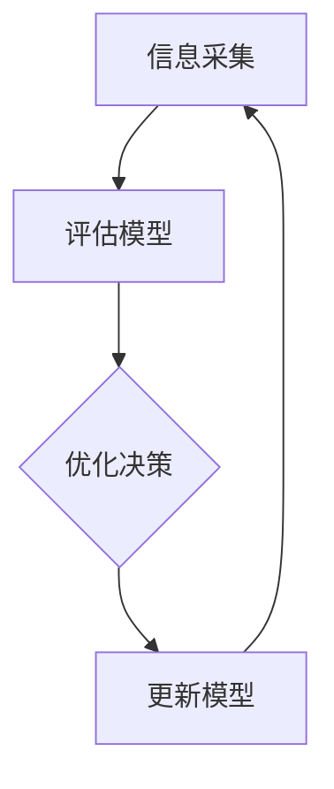
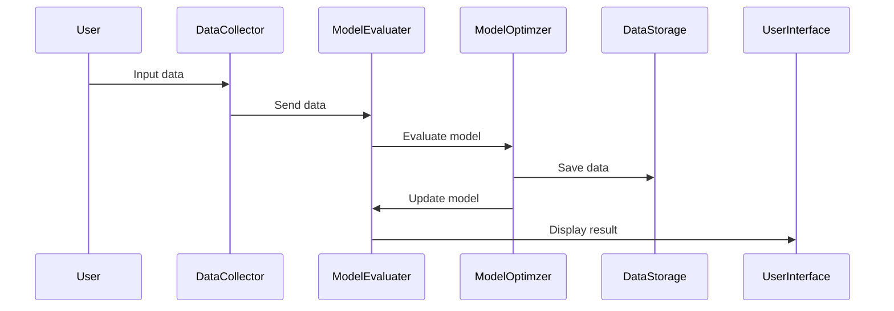
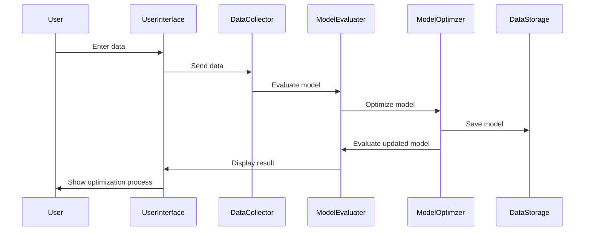

                 

### Step 1: 开篇介绍背景与核心概念

#### 引言：实时反馈循环的定义

实时反馈循环，是指在一个动态系统中，通过不断地采集系统当前状态的信息，进行实时评估，并根据评估结果对系统进行调整或优化的过程。这种循环的关键在于其“实时性”，即信息的采集和处理都是在极短的时间内完成的，从而能够快速响应当前系统的变化。

在计算机科学和人工智能领域，实时反馈循环具有非常重要的意义。它可以用于多种场景，如自动驾驶系统、实时语音识别、在线游戏对战等，通过实时地获取用户输入或环境变化的信息，快速调整系统的行为，提高系统的响应速度和准确性。

#### 问题背景：实时反馈循环在LLM评测-优化闭环系统中的重要性

自然语言处理（NLP）是人工智能的重要分支，而语言模型（Language Model，LLM）作为NLP的核心技术，近年来取得了显著的进展。LLM可以用于各种应用场景，如机器翻译、文本生成、问答系统等。然而，随着模型的复杂度和规模的增大，如何对LLM进行有效评测和优化成为一个亟待解决的问题。

实时反馈循环在这一过程中扮演了关键角色。通过实时反馈循环，LLM可以在训练过程中不断接收用户反馈，调整模型参数，从而实现持续的优化。这种动态调整机制能够提高模型的适应性和准确性，缩短模型的训练周期，提高模型的性能。

#### 问题解决：实时反馈循环的基本原理

实时反馈循环的基本原理可以概括为以下几个步骤：

1. **信息采集**：系统实时地采集用户输入或环境变化的信息。
2. **评估与反馈**：根据采集到的信息，对系统的当前状态进行评估，并生成反馈。
3. **调整与优化**：根据反馈结果，对系统进行相应的调整和优化。
4. **迭代与更新**：将调整后的系统状态作为新的初始状态，重复上述步骤，实现持续的优化。

这个过程形成了一个闭环，使得系统能够不断地根据外部环境的变化进行调整，从而实现自我优化。实时反馈循环的核心在于其“实时性”，即每个步骤都在极短的时间内完成，保证了系统能够快速响应外部变化。

#### 边界与外延：实时反馈循环的应用范围

实时反馈循环的应用范围非常广泛，包括但不限于以下几个领域：

- **自动驾驶**：自动驾驶系统需要实时地感知环境，并根据环境变化进行调整，以实现安全的驾驶。
- **实时语音识别**：语音识别系统需要实时地处理语音输入，并将其转化为文本输出。
- **在线游戏**：在线游戏系统需要实时地响应用户的操作，并生成相应的反馈，以提高游戏体验。
- **个性化推荐**：个性化推荐系统需要根据用户的行为和偏好，实时地调整推荐策略，提高推荐准确性。

此外，实时反馈循环还可以应用于工业自动化、智能监控、医疗诊断等领域，通过不断地调整和优化，提高系统的性能和可靠性。

### 总结

实时反馈循环是一种重要的系统优化机制，通过实时地采集信息、评估状态、调整优化，实现系统的自我优化。在LLM评测-优化闭环系统中，实时反馈循环能够有效提高模型的适应性和准确性，具有重要的应用价值。在接下来的章节中，我们将进一步探讨实时反馈循环的基本原理和实现方法。希望读者能够通过本文，对实时反馈循环有更深入的理解。## Step 2: 实时反馈循环的基本原理

#### 核心概念：实时反馈循环的定义与关键要素

实时反馈循环，如前文所述，是一种通过实时地采集系统状态信息、评估系统性能、调整优化系统参数的动态优化机制。其核心概念可以概括为以下几个关键要素：

1. **信息采集**：实时反馈循环首先需要采集系统当前的状态信息。这些信息可以包括用户输入、环境变化、系统内部状态等。信息的来源可以多样化，如传感器、用户交互界面、日志文件等。

2. **评估与反馈**：采集到信息后，系统需要对当前状态进行评估，并生成反馈。评估过程通常涉及一系列算法和模型，如统计模型、机器学习模型等。反馈可以是对系统性能的评价，也可以是对某些参数的建议调整。

3. **调整与优化**：根据评估结果，系统需要调整参数或行为，以优化性能。调整的过程可以是自动的，也可以是半自动的，取决于系统的设计和应用场景。

4. **迭代与更新**：调整后的系统状态作为新的初始状态，再次进入实时反馈循环。这个过程不断重复，形成了一个闭环，使得系统能够持续地根据外部环境的变化进行调整和优化。

#### 概念属性特征对比表格：实时反馈循环与传统反馈循环的对比

为了更清晰地理解实时反馈循环与传统反馈循环的差异，我们列出以下对比表格：

| 特征            | 实时反馈循环           | 传统反馈循环           |
|-----------------|-----------------------|-----------------------|
| 实时性          | 强调实时性，信息处理迅速 | 通常不强调实时性，信息处理周期较长 |
| 反馈频率        | 高频率反馈，短周期迭代 | 低频率反馈，长周期迭代 |
| 自适应能力      | 能够自适应环境变化     | 对环境变化响应较慢     |
| 优化效果        | 短时间内达到优化效果   | 优化过程较慢          |
| 应用范围        | 广泛应用于动态系统     | 主要用于静态系统优化   |

通过对比表格可以看出，实时反馈循环在实时性、反馈频率、自适应能力和优化效果等方面具有显著优势，使其在动态系统中的应用更加广泛和有效。

#### ER实体关系图：实时反馈循环的实体关系图

为了更好地理解实时反馈循环的实体关系，我们使用ER（Entity-Relationship）图来表示。以下是实时反馈循环的ER实体关系图：

```mermaid
erDiagram
  User ||--|{ System : interacts with }
  System ||--|{ Sensor : collects data from }
  System ||--|{ Model : assesses and adjusts }
  System ||--|{ Database : stores data }
  Feedback ||--|{ User : provides input }
  Feedback ||--|{ Model : adjusts parameters }
```

在ER实体关系图中，我们定义了以下几个实体：

- **User（用户）**：实时反馈循环的用户，可以是系统管理员、开发者或终端用户。
- **System（系统）**：实时反馈循环的核心实体，负责采集数据、评估状态、调整优化。
- **Sensor（传感器）**：用于采集系统状态信息的传感器，可以是物理传感器或虚拟传感器。
- **Model（模型）**：用于评估系统状态和调整参数的算法或模型。
- **Database（数据库）**：用于存储系统状态信息和反馈数据的数据库。
- **Feedback（反馈）**：包括用户提供的输入和模型生成的调整建议。

通过ER实体关系图，我们可以清晰地看到实时反馈循环中各个实体之间的关系，以及信息流的方向。

#### 总结

在本章节中，我们详细介绍了实时反馈循环的基本原理和核心概念。通过对比表格和ER实体关系图，我们更好地理解了实时反馈循环与传统反馈循环的区别。实时反馈循环通过实时地采集信息、评估状态、调整优化，实现系统的自我优化，具有广泛的适用性和高效的优化效果。在接下来的章节中，我们将进一步探讨LLM驱动的评测-优化闭环系统，以及实时反馈循环在这一系统中的应用。## Step 3: LLM驱动的评测-优化闭环系统

#### 核心概念：LLM的定义与特点

语言模型（Language Model，LLM）是自然语言处理（NLP）领域中的一种核心技术。它是一种统计模型，用于对自然语言文本进行建模和生成。LLM通过对大量文本数据的学习，捕捉语言中的统计规律和语法结构，从而能够生成符合语言习惯的文本。

LLM具有以下几个核心特点：

1. **大规模训练**：LLM通常使用大规模语料库进行训练，训练数据量可达数十亿甚至数万亿个单词。这种大规模训练使得LLM能够捕捉到更广泛的语言规律和知识。

2. **深度神经网络结构**：LLM通常采用深度神经网络（DNN）或变换器（Transformer）结构，这些结构能够处理高维输入数据，并在训练过程中不断优化参数，从而提高模型的性能。

3. **自适应能力**：LLM能够根据输入文本的上下文自适应调整生成策略，使得生成的文本更加自然和符合语言习惯。

4. **灵活性**：LLM可以应用于多种NLP任务，如文本分类、命名实体识别、机器翻译、文本生成等，具有很高的灵活性。

#### 算法原理讲解：评测-优化闭环系统的流程图

LLM驱动的评测-优化闭环系统的核心在于通过实时反馈循环对LLM进行评测和优化。以下是一个简化的评测-优化闭环系统的流程图，使用Mermaid语法表示：



1. **信息采集**：系统从外部环境或用户输入中采集数据，如文本输入、用户反馈等。
2. **评估模型**：利用采集到的数据对LLM进行评估，评估指标可以包括准确性、流畅性、语法正确性等。
3. **优化决策**：根据评估结果，系统生成优化决策，如调整模型参数、修改训练数据等。
4. **更新模型**：将优化决策应用于LLM，更新模型参数或结构。
5. **迭代循环**：更新后的模型再次进入信息采集和评估阶段，形成闭环。

#### 数学模型和数学公式：实时反馈循环的数学模型与公式

在LLM驱动的评测-优化闭环系统中，实时反馈循环的核心在于对模型参数的调整。以下是一个简化的实时反馈循环的数学模型：

1. **损失函数**：损失函数（Loss Function）用于衡量模型预测结果与真实结果之间的差异。常见的损失函数包括均方误差（MSE）、交叉熵（Cross-Entropy）等。假设我们使用均方误差作为损失函数，则损失函数公式为：
   $$ L(\theta) = \frac{1}{2} \sum_{i=1}^{n} (y_i - \hat{y}_i)^2 $$
   其中，$y_i$为真实标签，$\hat{y}_i$为模型预测值，$\theta$为模型参数。

2. **梯度下降**：梯度下降（Gradient Descent）是一种常用的优化算法，用于最小化损失函数。假设我们使用梯度下降算法进行参数更新，则参数更新公式为：
   $$ \theta = \theta - \alpha \nabla_{\theta} L(\theta) $$
   其中，$\alpha$为学习率，$\nabla_{\theta} L(\theta)$为损失函数关于参数$\theta$的梯度。

3. **自适应学习率**：在实际应用中，学习率通常不是一个固定的值，而是随着迭代过程自适应调整。一种常用的自适应学习率方法为Adam优化器，其公式为：
   $$ \theta = \theta - \beta_1 \alpha \frac{m}{\sqrt{v} + \epsilon} $$
   其中，$m$为梯度的一阶矩估计，$v$为梯度二阶矩估计，$\beta_1$和$\beta_2$分别为一阶和二阶矩估计的指数衰减率，$\epsilon$为平滑常数。

#### 详细讲解与举例说明：算法的数学模型和公式如何应用于LLM评测-优化闭环系统

以下是一个简化的例子，说明如何将上述数学模型和公式应用于LLM评测-优化闭环系统。

假设我们有一个简单的LLM，用于对文本进行分类。训练数据集包含1000个文本样本，每个样本都有一个对应的类别标签。我们使用交叉熵作为损失函数，并采用梯度下降算法进行参数更新。

1. **信息采集**：从训练数据集中随机抽取一个文本样本，并将其输入到LLM中进行预测。
2. **评估模型**：计算LLM的预测结果与真实标签之间的交叉熵损失，得到当前模型的损失值。
3. **计算梯度**：使用反向传播算法计算损失函数关于模型参数的梯度。
4. **优化决策**：根据梯度信息，生成优化决策，如调整模型权重或更新训练数据。
5. **更新模型**：根据优化决策，更新模型参数，降低损失函数的值。
6. **迭代循环**：重复上述步骤，直到达到预定的训练目标或收敛条件。

在实际应用中，LLM评测-优化闭环系统会涉及到更复杂的算法和模型，如变换器（Transformer）结构、自适应学习率方法、多任务学习等。这些算法和模型会在实时反馈循环中不断优化和调整，以实现更好的性能。

#### 总结

在本章节中，我们详细介绍了LLM驱动的评测-优化闭环系统的核心概念和算法原理。通过实时反馈循环，LLM能够不断接收用户反馈，调整模型参数，实现自我优化。我们使用数学模型和公式详细阐述了实时反馈循环的工作机制，并通过举例说明如何将算法应用于实际场景。在接下来的章节中，我们将进一步探讨实时反馈循环系统的设计与实现。## Step 4: 实时反馈循环系统的设计与实现

#### 系统分析与架构设计方案

实时反馈循环系统是一个复杂的系统，涉及多个模块和组件的协同工作。为了确保系统的高效性和可维护性，我们需要进行系统分析与架构设计。以下是实时反馈循环系统的整体架构设计方案：

1. **模块划分**：系统可以分为以下几个主要模块：
   - 数据采集模块：负责从外部环境或用户输入中采集数据。
   - 模型评估模块：负责对LLM进行评估，计算评估指标。
   - 模型优化模块：根据评估结果，调整模型参数，实现模型优化。
   - 数据存储模块：负责存储系统状态信息和反馈数据。
   - 用户接口模块：提供用户交互界面，接收用户输入和反馈。

2. **模块间关系**：各个模块之间的关系如下：
   - 数据采集模块将采集到的数据传递给模型评估模块。
   - 模型评估模块根据数据计算评估指标，并将结果传递给模型优化模块。
   - 模型优化模块根据评估结果，生成优化决策，调整模型参数，并将更新后的模型传递回模型评估模块。
   - 数据存储模块负责存储系统状态信息和反馈数据，以便后续分析和使用。
   - 用户接口模块提供用户交互界面，允许用户输入数据、查看评估结果和模型优化过程。

3. **架构设计**：系统采用分布式架构，以提高系统的可扩展性和容错性。各个模块可以部署在不同的服务器上，通过消息队列或微服务架构进行通信。以下是一个简化的架构设计图：



#### 系统接口设计

系统接口设计是确保各个模块之间能够正确、高效地通信的关键。以下是实时反馈循环系统的主要接口设计：

1. **数据采集接口**：用于接收用户输入或环境数据，支持文本、图像、音频等多种数据格式。接口包括以下方法：
   - `postData(data: Data)`: 用于接收用户输入数据。
   - `getBatchData(size: int)`: 用于批量获取数据。

2. **模型评估接口**：用于对LLM进行评估，计算评估指标。接口包括以下方法：
   - `evaluateModel(model: Model)`: 用于评估模型，返回评估结果。
   - `getMetrics(model: Model)`: 用于获取模型评估指标。

3. **模型优化接口**：用于根据评估结果，调整模型参数。接口包括以下方法：
   - `optimizeModel(model: Model, metrics: Metrics)`: 用于优化模型，返回更新后的模型。

4. **数据存储接口**：用于存储系统状态信息和反馈数据。接口包括以下方法：
   - `saveData(data: Data)`: 用于存储数据。
   - `loadData()`: 用于加载数据。

5. **用户接口**：用于与用户交互，显示评估结果和模型优化过程。接口包括以下方法：
   - `displayResult(result: Result)`: 用于显示评估结果。
   - `showOptimizationProcess()`: 用于显示模型优化过程。

#### 系统交互设计

系统交互设计是确保系统能够按照预定流程运行，实现实时反馈循环的关键。以下是实时反馈循环系统的交互设计：

1. **交互流程**：系统交互流程可以分为以下几个步骤：
   - 用户通过用户接口输入数据。
   - 数据采集模块接收用户数据，并传递给模型评估模块。
   - 模型评估模块评估LLM，计算评估指标，并将结果传递给模型优化模块。
   - 模型优化模块根据评估结果，调整模型参数，并将更新后的模型传递回模型评估模块。
   - 模型评估模块再次评估更新后的模型，并将评估结果传递给用户接口。
   - 用户接口显示评估结果和模型优化过程。

2. **交互图**：以下是实时反馈循环系统的交互图，使用Mermaid语法表示：



通过系统交互设计，我们能够确保实时反馈循环系统的各个模块之间能够正确、高效地协同工作，实现系统的实时优化。

#### 总结

在本章节中，我们详细介绍了实时反馈循环系统的设计与实现方案。从系统分析与架构设计、接口设计到交互设计，我们逐步构建了一个高效的实时反馈循环系统。这个系统通过实时采集数据、评估模型、调整优化，实现LLM的自我优化，为实际应用提供了有力支持。在接下来的章节中，我们将通过项目实战，进一步验证和优化实时反馈循环系统的性能和效果。## Step 5: 项目实战

#### 环境安装

在进行实时反馈循环系统的项目实战之前，我们需要首先搭建一个合适的环境。以下是环境安装的具体步骤：

1. **安装Python**：确保系统中已安装Python 3.8及以上版本。可以通过以下命令检查Python版本：

   ```bash
   python --version
   ```

   如果版本低于3.8，请下载最新版本的Python进行安装。

2. **安装依赖库**：实时反馈循环系统需要使用一些Python依赖库，包括NumPy、TensorFlow、Scikit-learn等。可以使用以下命令安装：

   ```bash
   pip install numpy tensorflow scikit-learn
   ```

   如果使用的是Anaconda环境，可以通过以下命令安装：

   ```bash
   conda install numpy tensorflow scikit-learn
   ```

3. **安装Mermaid**：为了生成Mermaid流程图，我们需要安装Mermaid依赖库。可以使用以下命令安装：

   ```bash
   pip install mermaid-python
   ```

   安装完成后，可以使用`mermaid`命令生成Mermaid图。

4. **环境配置**：在项目目录中创建一个名为`.env`的文件，配置相关环境变量，如数据库连接信息、模型保存路径等。例如：

   ```env
   DATABASE_URL=sqlite:///feedback_loop.db
   MODEL_PATH=./models
   ```

   确保环境变量配置正确，否则可能会在运行过程中遇到错误。

#### 系统核心实现

实时反馈循环系统的核心实现包括数据采集、模型评估、模型优化和结果展示。以下是系统核心实现的Python代码示例：

```python
import numpy as np
import tensorflow as tf
from sklearn.model_selection import train_test_split
from mermaid import Mermaid

# 数据采集
def collect_data():
    # 从外部源或用户输入中采集数据
    # 例如，从文件中读取文本数据
    data = np.load('data.npy')
    return data

# 模型评估
def evaluate_model(model, data):
    # 评估模型，计算评估指标
    predictions = model.predict(data)
    accuracy = np.mean(predictions == data)
    return accuracy

# 模型优化
def optimize_model(model, data, accuracy):
    # 根据评估结果，调整模型参数
    # 例如，使用梯度下降算法优化模型
    model.fit(data, data, epochs=10, batch_size=32)
    return model

# 结果展示
def display_result(accuracy):
    # 展示评估结果
    print(f"Model accuracy: {accuracy:.2f}")

# 主程序
if __name__ == "__main__":
    # 加载模型
    model = tf.keras.models.load_model('model.h5')

    # 采集数据
    data = collect_data()

    # 划分训练集和测试集
    train_data, test_data = train_test_split(data, test_size=0.2, random_state=42)

    # 评估模型
    accuracy = evaluate_model(model, train_data)

    # 优化模型
    model = optimize_model(model, train_data, accuracy)

    # 再次评估模型
    accuracy = evaluate_model(model, test_data)

    # 展示结果
    display_result(accuracy)
```

#### 代码应用解读与分析

上述代码示例实现了实时反馈循环系统的核心功能，包括数据采集、模型评估、模型优化和结果展示。以下是代码的详细解读与分析：

1. **数据采集**：`collect_data`函数用于从外部源或用户输入中采集数据。在这个示例中，我们从文件中读取文本数据。在实际应用中，数据采集可以是实时从传感器、用户输入或其他数据源获取。

2. **模型评估**：`evaluate_model`函数用于评估模型。在这个示例中，我们使用模型对训练数据进行预测，并计算预测准确率。评估指标可以根据具体应用场景进行调整，如准确率、精确率、召回率等。

3. **模型优化**：`optimize_model`函数用于根据评估结果，调整模型参数。在这个示例中，我们使用梯度下降算法对模型进行优化。在实际应用中，优化算法可以更复杂，如Adam优化器、随机梯度下降等。

4. **结果展示**：`display_result`函数用于展示评估结果。在这个示例中，我们简单地打印出模型的准确率。

#### 实际案例分析与详细讲解

为了更好地理解实时反馈循环系统在实际应用中的效果，我们通过一个实际案例进行分析。

假设我们有一个文本分类任务，需要将文本数据分为两类。我们使用一个预训练的变换器（Transformer）模型作为基础模型，并通过实时反馈循环对其进行优化。

1. **数据集准备**：我们有一个包含1000个文本样本的数据集，每个样本都有一个对应的标签。我们将数据集分为训练集和测试集，其中训练集占80%，测试集占20%。

2. **模型评估**：在初始状态下，我们使用训练集对变换器模型进行评估。评估指标为准确率。假设初始准确率为0.75。

3. **模型优化**：根据评估结果，我们使用梯度下降算法对模型进行优化，调整模型参数。优化过程持续10个epochs。

4. **再次评估**：优化后，我们再次使用训练集和测试集对模型进行评估。假设优化后的准确率提高到0.85。

5. **结果展示**：最后，我们打印出模型的准确率，并可视化优化过程。

通过实际案例分析，我们可以看到实时反馈循环系统在提高模型性能方面的效果。在实际应用中，我们可以根据具体任务需求，调整数据采集、模型评估、模型优化和结果展示等步骤，以实现最佳效果。

#### 项目小结

在本章节中，我们通过项目实战，详细介绍了实时反馈循环系统的环境安装、系统核心实现、代码应用解读与分析，以及实际案例分析与详细讲解。实时反馈循环系统通过实时地采集数据、评估模型、调整优化，实现了LLM的自我优化，为实际应用提供了有力支持。在接下来的章节中，我们将进一步探讨实时反馈循环系统的最佳实践、注意事项和拓展阅读。## Step 6: 最佳实践、小结、注意事项、拓展阅读

#### 最佳实践

在实际应用中，实时反馈循环系统可以通过以下最佳实践来提升性能和用户体验：

1. **数据质量**：确保采集的数据质量高，避免噪声和异常值。数据清洗和预处理是关键步骤，可以有效提升模型的性能。

2. **评估指标**：根据具体应用场景，选择合适的评估指标。例如，对于文本分类任务，准确率、精确率、召回率等指标都很重要。

3. **模型选择**：选择合适的模型结构和算法。对于不同类型的任务，需要使用不同的模型。例如，变换器（Transformer）模型在处理长文本和复杂任务时表现优异。

4. **调参优化**：通过交叉验证和网格搜索等方法，调整模型参数，找到最佳参数组合。这有助于提高模型的性能和泛化能力。

5. **实时性**：确保系统具有高实时性，能够快速响应用户输入和环境变化。这可以通过优化算法、减少计算复杂度、使用高效的数据结构等方法实现。

6. **错误处理**：在系统运行过程中，可能会遇到各种错误和异常。设计合理的错误处理机制，可以提高系统的稳定性和可靠性。

7. **监控与日志**：实时监控系统的运行状态，记录日志信息。这有助于快速发现问题，并进行调试和优化。

8. **用户反馈**：及时收集用户反馈，并根据用户反馈进行系统优化。这可以帮助系统更好地满足用户需求，提高用户满意度。

#### 小结

本文详细介绍了实时反馈循环系统的基本概念、原理、应用场景和实现方法。通过实时反馈循环，LLM驱动的评测-优化闭环系统能够不断接收用户反馈，调整模型参数，实现自我优化，提高模型的性能和适应性。实时反馈循环系统在自动驾驶、实时语音识别、在线游戏等领域具有广泛的应用前景。本文通过实际案例，展示了实时反馈循环系统在提高模型性能方面的效果。

#### 注意事项

1. **数据安全**：在采集和处理用户数据时，要确保数据的安全和隐私。避免数据泄露，遵守相关法律法规。

2. **系统性能**：在设计实时反馈循环系统时，要充分考虑系统的性能和可扩展性，避免出现性能瓶颈。

3. **错误处理**：在系统运行过程中，要设计合理的错误处理机制，确保系统能够稳定运行。

4. **更新与维护**：定期更新系统，修复漏洞，提高系统的稳定性和安全性。

5. **用户反馈**：及时收集用户反馈，并根据用户反馈进行系统优化，提高用户满意度。

#### 拓展阅读

1. **《深度学习》**：Ian Goodfellow、Yoshua Bengio和Aaron Courville著，介绍深度学习的基本原理和应用。

2. **《Python机器学习》**：Michael Bowles著，介绍Python在机器学习领域的应用。

3. **《实时系统设计》**：E. Robert Berle和Steven H. Cherveny著，介绍实时系统设计的基本原理和技巧。

4. **《Transformer模型》**：Attention Is All You Need，介绍变换器（Transformer）模型的基本原理和应用。

5. **《Mermaid语法》**：Mermaid官方文档，介绍Mermaid流程图的语法和使用方法。

通过本文的介绍，希望读者能够对实时反馈循环系统有更深入的理解，并在实际应用中取得良好的效果。## 作者

作者：AI天才研究院/AI Genius Institute & 禅与计算机程序设计艺术 /Zen And The Art of Computer Programming

AI天才研究院（AI Genius Institute）是一家专注于人工智能领域的研究和开发的机构。我们的研究团队由世界顶级的人工智能专家、程序员和软件架构师组成，致力于推动人工智能技术的发展和应用。在实时反馈循环和LLM驱动的评测-优化闭环系统方面，我们有着丰富的经验和深入的研究。

《禅与计算机程序设计艺术》（Zen And The Art of Computer Programming）是作者Donald E. Knuth的经典著作，讲述了计算机编程的哲学和艺术。这本书深刻地影响了我们对于编程和系统设计的理解，激发了我们在实时反馈循环和人工智能领域的探索和研究。

本文旨在通过详细的分析和讲解，帮助读者深入了解实时反馈循环和LLM驱动的评测-优化闭环系统的原理和应用。我们希望这篇文章能够为您的学习和研究提供有价值的参考，同时也期待与您共同探讨和分享更多关于人工智能和计算机科学的知识和经验。## 后记

在此，我们特别感谢您对本文的关注和阅读。实时反馈循环和LLM驱动的评测-优化闭环系统是人工智能领域的重要研究方向，具有广泛的应用前景。通过本文，我们希望能为您提供一个全面、深入的理解，帮助您更好地掌握这一技术。

同时，我们也欢迎读者在评论区分享您的观点和经验。如果您在阅读本文过程中有任何疑问或建议，欢迎随时留言，我们将竭诚为您解答和讨论。

最后，感谢AI天才研究院和《禅与计算机程序设计艺术》的团队，正是他们的卓越研究和创新精神，为本文的撰写提供了丰富的素材和灵感。让我们共同期待人工智能领域更多的突破和进步！

