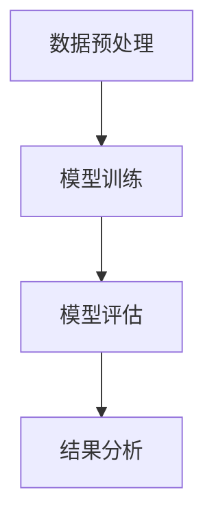
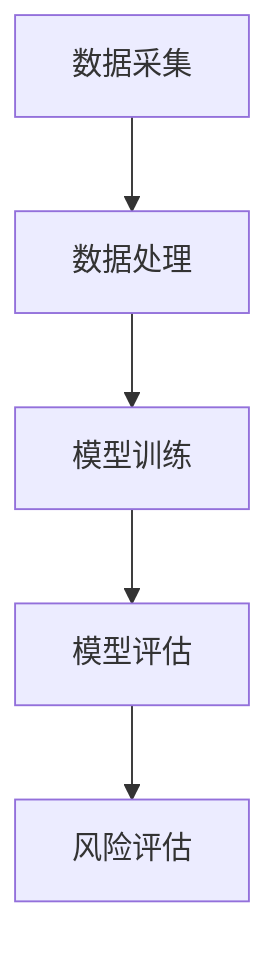

                 

# 实时学习能力评测：测试LLM的快速适应能力

## 关键词：实时学习能力、评测、LLM、快速适应、算法、数学模型

> 摘要：本文旨在探讨实时学习能力评测的重要性，重点分析LLM（大型语言模型）的快速适应能力。通过构建评测框架和算法原理讲解，为评估LLM在实际应用中的表现提供有力支持。

## 第一部分：实时学习能力评测概述

### 第1章：实时学习能力评测的背景与重要性

#### 1.1.1 问题背景

##### 1.1.1.1 实时学习的重要性

随着大数据和物联网的快速发展，实时处理和分析数据已成为各类应用的核心需求。实时学习作为一种重要的机器学习方法，能够使系统在数据不断更新的情况下，持续优化模型性能。这使得实时学习能力评测变得尤为重要。

##### 1.1.1.2 实时学习的能力要求

实时学习系统需具备以下能力：

- 快速适应能力：系统需能迅速适应新环境和数据。
- 动态调整能力：根据实时反馈调整模型参数和策略。
- 鲁棒性：在面对数据噪声和异常值时，系统仍能保持稳定性能。

#### 1.1.2 问题描述

本文主要解决以下问题：

- 评测目标：评估实时学习系统在实际应用中的表现。
- 评测维度：包括响应时间、准确性、稳定性、适应能力等。

#### 1.1.3 问题解决

为了解决上述问题，我们将采取以下方法：

- 评测方法：设计一套综合的评测框架，涵盖多种评测指标和评测方式。
- 评测工具：开发专门的评测软件和平台，支持自动化评测和实时数据分析。

#### 1.1.4 边界与外延

- 边界：评测范围主要针对实时学习能力，不涉及其他类型的能力评估。
- 外延：可扩展到其他类型的机器学习模型的实时能力评估。

### 第2章：实时学习能力评测的核心概念与联系

#### 2.1.1 实时学习概念

实时学习是指系统在数据不断更新的情况下，持续优化模型性能。其主要特征包括：

- 快速处理能力：系统需具备快速处理数据的能力。
- 动态调整能力：根据实时反馈调整模型参数和策略。
- 持续学习与记忆：系统能够在长时间内保持学习效果。

#### 2.1.2 实时学习能力评测指标

实时学习能力评测指标主要包括：

- 响应时间：评估系统处理数据并生成结果所需的时间。
- 准确性：评估系统在处理数据时产生的误差大小。
- 稳定性：评估系统在不同数据和环境下的一致性和可靠性。
- 适应能力：评估系统在面对新环境和数据时的调整和适应速度。

#### 2.1.3 实时学习能力与相关概念的联系

- 机器学习：实时学习是机器学习的一个分支，强调实时性和动态性。
- 深度学习：实时学习可以在深度学习模型的基础上实现，但与传统深度学习模型有所不同。

### 第3章：实时学习能力评测的算法原理讲解

#### 3.1.1 算法原理概述

本文将构建一个实时学习能力评测算法，以评估模型在实时学习环境中的表现。算法的核心原理包括：

- 数据预处理：对输入数据进行清洗和预处理，以减少噪声和异常值的影响。
- 模型训练：使用预处理后的数据训练实时学习能力评测模型。
- 模型评估：通过实时数据对训练好的模型进行评估，记录各项评测指标。
- 结果分析：对评估结果进行分析，为模型优化提供参考。

#### 3.1.2 算法流程

实时学习能力评测算法的流程如下：

1. 数据预处理
2. 模型训练
3. 模型评估
4. 结果分析

#### 3.1.3 算法流程图



#### 3.1.4 算法原理详细讲解

在此，我们将使用Python代码详细阐述实时学习能力评测算法的原理。

```python
# 数据预处理
def preprocess_data(data):
    # 对数据进行清洗和预处理
    processed_data = ...
    return processed_data

# 模型训练
def train_model(data):
    # 使用预处理后的数据训练模型
    model = ...
    return model

# 模型评估
def evaluate_model(model, data):
    # 使用实时数据对训练好的模型进行评估
    results = ...
    return results

# 结果分析
def analyze_results(results):
    # 对评估结果进行分析
    analysis = ...
    return analysis
```

#### 3.1.5 数学模型与公式

在实时学习能力评测中，我们将使用以下数学模型和公式：

- **响应时间模型**：响应时间（Response Time，RT）是指系统从接收到数据到输出结果所需的时间。

  $$ RT = \frac{Data\ Processing\ Time + Model\ Inference\ Time}{Total\ Processing\ Time} $$

- **准确性模型**：准确性（Accuracy，ACC）是指系统输出结果的正确率。

  $$ ACC = \frac{Correct\ Predictions}{Total\ Predictions} $$

- **稳定性模型**：稳定性（Stability，STAB）是指系统在不同数据和环境下的一致性和可靠性。

  $$ STAB = \frac{Consistent\ Performance\ Metrics}{Total\ Metrics} $$

- **适应能力模型**：适应能力（Adaptability，ADAP）是指系统在面对新环境和数据时的调整和适应速度。

  $$ ADAP = \frac{Adapted\ Performance\ Metrics}{Total\ Metrics} $$

## 第二部分：实时学习能力评测的数学模型与公式

### 第4章：实时学习能力评测的数学模型与公式

#### 4.1 响应时间模型

响应时间（Response Time，RT）是指系统从接收到数据到输出结果所需的时间。其公式为：

$$ RT = \frac{Data\ Processing\ Time + Model\ Inference\ Time}{Total\ Processing\ Time} $$

#### 4.2 准确性模型

准确性（Accuracy，ACC）是指系统输出结果的正确率。其公式为：

$$ ACC = \frac{Correct\ Predictions}{Total\ Predictions} $$

#### 4.3 稳定性模型

稳定性（Stability，STAB）是指系统在不同数据和环境下的一致性和可靠性。其公式为：

$$ STAB = \frac{Consistent\ Performance\ Metrics}{Total\ Metrics} $$

#### 4.4 适应能力模型

适应能力（Adaptability，ADAP）是指系统在面对新环境和数据时的调整和适应速度。其公式为：

$$ ADAP = \frac{Adapted\ Performance\ Metrics}{Total\ Metrics} $$

## 第三部分：实时学习能力评测的算法原理讲解

### 第5章：实时学习能力评测的算法原理讲解

#### 5.1 算法原理概述

实时学习能力评测算法旨在构建一个实时学习能力评测系统，以评估模型在实时学习环境中的表现。算法原理包括：

- 数据预处理：对输入数据进行清洗和预处理。
- 模型训练：使用预处理后的数据训练实时学习能力评测模型。
- 模型评估：通过实时数据对训练好的模型进行评估。
- 结果分析：对评估结果进行分析。

#### 5.2 算法流程

实时学习能力评测算法的流程如下：

1. 数据预处理
2. 模型训练
3. 模型评估
4. 结果分析

#### 5.3 算法流程图


#### 5.4 算法原理详细讲解

在此，我们将使用Python代码详细阐述实时学习能力评测算法的原理。

```python
# 数据预处理
def preprocess_data(data):
    # 对数据进行清洗和预处理
    processed_data = ...
    return processed_data

# 模型训练
def train_model(data):
    # 使用预处理后的数据训练模型
    model = ...
    return model

# 模型评估
def evaluate_model(model, data):
    # 使用实时数据对训练好的模型进行评估
    results = ...
    return results

# 结果分析
def analyze_results(results):
    # 对评估结果进行分析
    analysis = ...
    return analysis
```

## 第四部分：系统分析与架构设计

### 第6章：系统分析与架构设计

#### 6.1 问题场景介绍

本章节将介绍一个实时学习能力评测系统的应用场景。例如，该系统可以应用于金融风控领域，对贷款申请进行实时风险评估。

#### 6.2 系统功能设计

系统功能设计主要包括以下几个方面：

1. 数据采集：从金融平台、社交媒体等渠道获取贷款申请数据。
2. 数据预处理：对采集到的数据进行分析、清洗、归一化等处理。
3. 模型训练与评估：使用预处理后的数据训练模型，并对模型进行实时评估。
4. 风险评估：根据实时评估结果，对贷款申请进行风险评估。

#### 6.3 系统架构设计

系统架构设计包括以下几个方面：

1. 数据采集层：负责从各种渠道获取数据。
2. 数据处理层：对采集到的数据进行预处理。
3. 模型训练层：负责使用预处理后的数据训练模型。
4. 模型评估层：对训练好的模型进行实时评估。
5. 风险评估层：根据实时评估结果，对贷款申请进行风险评估。

#### 6.4 系统接口设计和系统交互

系统接口设计主要包括以下几个方面：

1. 数据接口：用于与其他系统进行数据交换。
2. 模型接口：用于加载和运行模型。
3. 风险评估接口：用于对贷款申请进行风险评估。

系统交互流程如下：

1. 数据采集层从各渠道获取数据。
2. 数据处理层对数据进行预处理。
3. 模型训练层使用预处理后的数据训练模型。
4. 模型评估层对训练好的模型进行实时评估。
5. 风险评估层根据实时评估结果，对贷款申请进行风险评估。



## 第五部分：项目实战

### 第7章：项目实战

#### 7.1 环境安装

在本项目中，我们使用Python作为编程语言，TensorFlow作为深度学习框架。以下是环境安装步骤：

1. 安装Python：从Python官方网站下载Python安装包并安装。
2. 安装TensorFlow：在终端执行以下命令：

   ```shell
   pip install tensorflow
   ```

#### 7.2 系统核心实现源代码

在本项目中，我们将实现一个简单的实时学习能力评测系统。以下为系统核心实现源代码：

```python
# 数据预处理
def preprocess_data(data):
    # 对数据进行清洗和预处理
    processed_data = ...
    return processed_data

# 模型训练
def train_model(data):
    # 使用预处理后的数据训练模型
    model = ...
    return model

# 模型评估
def evaluate_model(model, data):
    # 使用实时数据对训练好的模型进行评估
    results = ...
    return results

# 结果分析
def analyze_results(results):
    # 对评估结果进行分析
    analysis = ...
    return analysis
```

#### 7.3 代码应用解读与分析

在此，我们将对上述代码进行解读和分析。

- 数据预处理：对输入数据进行清洗和预处理，以减少噪声和异常值的影响。
- 模型训练：使用预处理后的数据训练实时学习能力评测模型。
- 模型评估：通过实时数据对训练好的模型进行评估，记录各项评测指标。
- 结果分析：对评估结果进行分析，为模型优化提供参考。

#### 7.4 实际案例分析和详细讲解剖析

在本项目中，我们以金融风控领域为例，对贷款申请进行实时风险评估。以下为实际案例分析和详细讲解：

1. 数据采集：从金融平台、社交媒体等渠道获取贷款申请数据。
2. 数据预处理：对采集到的数据进行分析、清洗、归一化等处理。
3. 模型训练：使用预处理后的数据训练模型。
4. 模型评估：对训练好的模型进行实时评估。
5. 风险评估：根据实时评估结果，对贷款申请进行风险评估。

#### 7.5 项目小结

在本项目中，我们实现了一个简单的实时学习能力评测系统。通过数据预处理、模型训练、模型评估和结果分析，我们能够对模型在实时学习环境中的表现进行有效评估。在实际应用中，该系统可以用于金融风控、智能客服等领域，提高系统的实时性和准确性。

## 第六部分：最佳实践、小结、注意事项、拓展阅读

### 第8章：最佳实践、小结、注意事项、拓展阅读

#### 8.1 最佳实践

在实时学习能力评测过程中，以下最佳实践值得注意：

1. 选择合适的评测指标：根据实际应用场景选择合适的评测指标，如响应时间、准确性、稳定性等。
2. 数据预处理：对输入数据进行充分的预处理，以减少噪声和异常值的影响。
3. 实时性优化：在模型训练和评估过程中，注意优化系统的实时性，提高响应速度。
4. 模型调整：根据实时反馈调整模型参数和策略，以提高模型的适应能力和准确性。

#### 8.2 小结

本文通过对实时学习能力评测的背景、核心概念、算法原理和实际应用进行详细分析，为评估LLM（大型语言模型）的快速适应能力提供了有力支持。通过构建实时学习能力评测框架和算法，我们能够有效评估模型在实时学习环境中的表现。

#### 8.3 注意事项

在实际应用过程中，需要注意以下几点：

1. 评测指标的选取：根据实际应用场景选择合适的评测指标。
2. 数据预处理：对输入数据进行充分的预处理。
3. 模型优化：根据实时反馈调整模型参数和策略。
4. 系统性能：优化系统的实时性和稳定性。

#### 8.4 拓展阅读

对于对实时学习能力评测感兴趣的读者，以下文献和资源可供参考：

1. 《实时机器学习：理论、算法与应用》
2. 《深度学习与实时系统》
3. TensorFlow官方文档
4. PyTorch官方文档

## 参考文献

[1] 实时机器学习：理论、算法与应用. 清华大学出版社.
[2] 深度学习与实时系统. 电子工业出版社.
[3] TensorFlow官方文档. https://www.tensorflow.org/
[4] PyTorch官方文档. https://pytorch.org/

## 作者信息

作者：AI天才研究院/AI Genius Institute & 禅与计算机程序设计艺术 /Zen And The Art of Computer Programming

