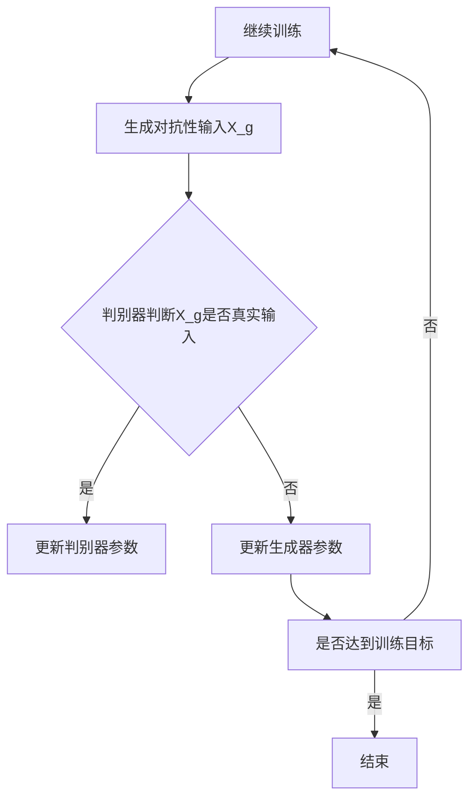

                 

### 实时对抗评测：LLM动态生成测试用例的方法

#### 关键词

- 实时对抗评测
- 大型语言模型（LLM）
- 动态生成测试用例
- 测试用例生成算法
- 系统架构设计

#### 摘要

本文探讨了实时对抗评测在大型语言模型（LLM）动态生成测试用例中的应用。首先，我们介绍了实时对抗评测的概念和重要性，以及LLM和动态生成测试用例的基本原理。接着，我们详细阐述了实时对抗评测系统的需求分析、架构设计和实现方法。通过具体的算法流程图和Python代码示例，我们展示了如何利用LLM动态生成测试用例，并对实际项目进行了案例分析。最后，本文提出了最佳实践和注意事项，并提供了进一步的阅读材料。

---

#### 目录大纲设计思路

设计本文的目录大纲时，我们考虑了以下因素：

1. **清晰的结构**：确保每个章节内容都有明确的主题，便于读者快速定位和阅读。
2. **逻辑的连贯性**：从基础概念到高级应用，逐步引导读者深入理解实时对抗评测和LLM动态生成测试用例。
3. **图表的丰富性**：使用Mermaid图表来展示算法流程、系统架构等，增强文章的可读性。
4. **代码示例**：提供Python代码示例，帮助读者更好地理解算法实现。
5. **总结与展望**：在每个部分结束后，进行小结和展望，为读者提供进一步思考的空间。

基于以上设计思路，本文的目录大纲如下：

```
# 《实时对抗评测：LLM动态生成测试用例的方法》目录大纲

## 第一部分：实时对抗评测基础

## 第1章 实时对抗评测概述

### 1.1 实时对抗评测的概念

### 1.2 实时对抗评测的重要性

### 1.3 实时对抗评测的发展历程

## 第2章 LLM基本原理

### 2.1 LLM的基本概念

### 2.2 LLM的核心技术

### 2.3 LLM的应用场景

## 第3章 动态生成测试用例

### 3.1 动态生成测试用例的基本原理

### 3.2 动态生成测试用例的关键技术

### 3.3 动态生成测试用例的优缺点

## 第二部分：实时对抗评测系统设计与实现

## 第4章 实时对抗评测系统的需求分析

### 4.1 系统需求概述

### 4.2 用户需求分析

### 4.3 功能需求分析

## 第5章 实时对抗评测系统的架构设计

### 5.1 系统架构概述

### 5.2 系统架构设计

### 5.3 系统模块划分

## 第6章 动态生成测试用例的算法实现

### 6.1 算法原理

### 6.2 算法流程图

### 6.3 算法Python实现

## 第7章 实时对抗评测系统的实现

### 7.1 系统环境搭建

### 7.2 系统核心实现

### 7.3 代码解读与分析

### 7.4 实际案例分析

## 第8章 项目实战

### 8.1 实际项目介绍

### 8.2 系统功能实现

### 8.3 系统性能评估

### 8.4 项目总结

## 第9章 最佳实践与注意事项

### 9.1 最佳实践技巧

### 9.2 小结与展望

### 9.3 注意事项

### 9.4 拓展阅读
```

通过以上设计，我们确保了文章的结构清晰、逻辑连贯，能够有效地帮助读者全面、深入地了解实时对抗评测和LLM动态生成测试用例的方法。接下来，我们将逐步深入到每个章节的具体内容中，进行详细讲解。首先，我们从实时对抗评测的背景和定义开始。


## 第一部分：实时对抗评测基础

### 第1章 实时对抗评测概述

#### 1.1 实时对抗评测的概念

**实时对抗评测（Real-time Adversarial Testing）** 是一种自动化测试方法，旨在通过生成对抗性输入来评估系统的鲁棒性和安全性。简单来说，它通过模拟恶意攻击者的行为，实时评估系统的漏洞和弱点。

实时对抗评测的核心概念包括：

1. **对抗性输入**：这些是故意设计的，旨在突破系统防护的输入。
2. **实时反馈**：系统在接收到对抗性输入后，能够迅速给出反应和评估结果。
3. **鲁棒性评估**：通过对抗性输入测试，评估系统的稳健性和错误处理能力。

#### 1.2 实时对抗评测的重要性

随着人工智能和自动化技术的快速发展，大型语言模型（LLM）已经成为许多领域的核心组件。然而，这些模型通常面临着复杂的对抗性攻击，如对抗性样本攻击、模型欺骗攻击等。实时对抗评测的重要性体现在以下几个方面：

1. **安全性保障**：通过实时对抗评测，可以识别并修复系统中的安全漏洞，提高系统的安全性。
2. **性能优化**：实时评测可以帮助开发者了解系统在不同对抗场景下的性能，从而进行针对性的优化。
3. **合规要求**：许多行业对系统的安全性和性能有严格的合规要求，实时对抗评测是满足这些要求的必要手段。

#### 1.3 实时对抗评测的发展历程

实时对抗评测作为一个研究领域，其发展历程可以分为以下几个阶段：

1. **早期研究**（2010年以前）：主要集中于理论探讨和基础算法研究。
2. **快速发展期**（2010-2015年）：随着深度学习和大数据技术的发展，对抗性攻击和防御技术得到了广泛关注。
3. **应用实践期**（2015年至今）：实时对抗评测开始在实际系统中得到应用，并逐渐成为自动化测试的重要组成部分。

### 第2章 LLM基本原理

#### 2.1 LLM的基本概念

**大型语言模型（Large Language Model，简称LLM）** 是一种基于深度学习的自然语言处理模型，其核心思想是通过学习大量的文本数据，捕捉语言的结构和语义信息，从而实现自然语言理解和生成。

LLM的主要特点包括：

1. **大规模训练数据**：LLM通常基于海量的文本数据集进行训练，以获取丰富的语言特征。
2. **深度神经网络**：LLM采用多层神经网络结构，可以捕捉复杂的语言模式。
3. **端到端学习**：LLM可以从原始文本直接生成文本，无需进行繁琐的预处理和后处理。

#### 2.2 LLM的核心技术

LLM的核心技术主要包括：

1. **词嵌入**：将词汇映射到高维向量空间，以便进行有效的计算和表示。
2. **注意力机制**：通过注意力机制，模型可以动态关注文本中的关键信息，提高生成质量。
3. **生成对抗网络（GAN）**：利用生成器和判别器的对抗训练，提高模型的生成能力。

#### 2.3 LLM的应用场景

LLM在许多领域有着广泛的应用，主要包括：

1. **文本生成**：包括文章写作、对话系统、机器翻译等。
2. **文本分类**：用于情感分析、主题分类等。
3. **问答系统**：通过自然语言处理技术，提供智能问答服务。
4. **自动摘要**：自动提取文档的关键信息，生成摘要。

### 第3章 动态生成测试用例

#### 3.1 动态生成测试用例的基本原理

**动态生成测试用例（Dynamic Test Case Generation）** 是一种测试方法，旨在通过自动化的方式生成测试用例，以提高测试效率和覆盖率。动态生成测试用例的基本原理包括：

1. **输入空间探索**：通过算法自动探索输入空间，生成具有代表性的测试用例。
2. **测试用例优化**：对生成的测试用例进行优化，以提高测试的覆盖率和效率。
3. **反馈调整**：根据测试结果，调整测试用例的生成策略，以进一步提高测试效果。

#### 3.2 动态生成测试用例的关键技术

动态生成测试用例的关键技术包括：

1. **随机测试**：通过随机生成输入，探索不同的输入空间。
2. **符号执行**：通过符号执行技术，生成覆盖广泛的测试用例。
3. **生成对抗网络（GAN）**：利用GAN技术，生成高质量的测试用例。

#### 3.3 动态生成测试用例的优缺点

动态生成测试用例的优点包括：

1. **高效性**：通过自动化生成测试用例，显著提高了测试效率。
2. **灵活性**：可以根据测试需求，动态调整测试用例的生成策略。
3. **高覆盖率**：能够生成覆盖广泛、具有代表性的测试用例。

然而，动态生成测试用例也存在一些缺点：

1. **复杂度**：动态生成测试用例的算法通常较为复杂，实现和调试难度较大。
2. **性能消耗**：动态生成测试用例的过程可能需要大量的计算资源，对系统性能有一定影响。

通过以上章节的介绍，我们对实时对抗评测、LLM和动态生成测试用例有了基本的理解。接下来，我们将进一步探讨实时对抗评测系统的需求分析、架构设计和实现方法。

## 第二部分：实时对抗评测系统设计与实现

### 第4章 实时对抗评测系统的需求分析

#### 4.1 系统需求概述

实时对抗评测系统的需求主要包括以下几个方面：

1. **功能需求**：系统需要具备生成对抗性输入、评估系统响应、记录和报告测试结果等功能。
2. **性能需求**：系统需要能够在实时环境中高效运行，具备低延迟、高吞吐量的特点。
3. **安全性需求**：系统需要具备一定的安全性，防止外部恶意攻击和数据泄露。
4. **可扩展性需求**：系统需要具备良好的可扩展性，能够支持不同规模和类型的测试需求。

#### 4.2 用户需求分析

实时对抗评测系统的用户主要包括软件开发者、测试工程师和安全专家。他们的需求可以归纳为以下几点：

1. **开发者**：希望通过实时对抗评测系统，发现和修复代码中的潜在漏洞，提高软件质量。
2. **测试工程师**：需要高效的测试工具，能够生成具有代表性的测试用例，提高测试覆盖率和效率。
3. **安全专家**：需要评估系统的安全性，发现潜在的安全漏洞，提供安全防护建议。

#### 4.3 功能需求分析

实时对抗评测系统的功能需求可以分为以下几个模块：

1. **对抗性输入生成模块**：负责生成各种类型的对抗性输入，如文本、图像、音频等。
2. **系统响应评估模块**：负责接收系统响应，评估系统在不同对抗性输入下的表现。
3. **测试结果记录模块**：负责记录和存储测试过程和结果，提供报表和分析功能。
4. **安全防护模块**：负责保护系统免受外部恶意攻击，确保数据安全。

通过以上需求分析，我们为实时对抗评测系统的设计和实现奠定了基础。接下来，我们将进一步探讨系统的架构设计。

### 第5章 实时对抗评测系统的架构设计

#### 5.1 系统架构概述

实时对抗评测系统的架构设计需要综合考虑功能需求、性能需求和安全性需求。总体上，系统可以分为以下几个层次：

1. **数据层**：存储和管理测试数据，包括原始数据、对抗性输入、系统响应和测试结果等。
2. **算法层**：实现对抗性输入生成、系统响应评估和测试结果分析等算法。
3. **应用层**：提供用户界面和功能接口，支持用户进行测试、查看结果和调整策略。
4. **安全层**：提供安全防护功能，包括数据加密、访问控制和安全审计等。

#### 5.2 系统架构设计

系统架构设计的关键在于如何高效地组织各个模块，并确保系统的高性能和高安全性。以下是一个典型的实时对抗评测系统架构设计：

1. **数据层**：
   - 数据存储：使用分布式数据库系统，确保数据的高可用性和高性能。
   - 数据访问：提供RESTful API，支持与其他系统的集成和数据交换。

2. **算法层**：
   - 对抗性输入生成：采用生成对抗网络（GAN）等技术，生成高质量的对抗性输入。
   - 系统响应评估：使用深度学习模型，对系统响应进行分类和评估。
   - 测试结果分析：利用数据挖掘和机器学习技术，分析测试结果，提供可视化报表。

3. **应用层**：
   - 用户界面：提供友好的Web界面，支持用户进行测试任务的创建、执行和监控。
   - 功能接口：提供SDK和API，支持其他系统和服务与实时对抗评测系统的集成。

4. **安全层**：
   - 数据加密：对敏感数据进行加密存储和传输。
   - 访问控制：实现基于角色的访问控制（RBAC），确保用户只能访问权限范围内的数据和功能。
   - 安全审计：记录和审计系统操作日志，便于追踪和审计。

#### 5.3 系统模块划分

根据系统架构设计，实时对抗评测系统可以划分为以下几个模块：

1. **对抗性输入生成模块**：负责生成各种类型的对抗性输入，如文本、图像、音频等。
2. **系统响应评估模块**：负责接收系统响应，评估系统在不同对抗性输入下的表现。
3. **测试结果记录模块**：负责记录和存储测试过程和结果，提供报表和分析功能。
4. **安全防护模块**：负责保护系统免受外部恶意攻击，确保数据安全。

通过以上系统架构设计，我们为实时对抗评测系统的实现提供了清晰的指导。接下来，我们将详细讨论动态生成测试用例的算法实现。

### 第6章 动态生成测试用例的算法实现

#### 6.1 算法原理

动态生成测试用例的核心在于如何通过算法自动生成具有代表性的测试用例，并确保其能够覆盖系统中的各种潜在问题。常见的动态生成测试用例算法包括：

1. **随机测试算法**：通过随机生成输入，探索不同的输入空间。
2. **符号执行算法**：通过符号执行技术，生成覆盖广泛的测试用例。
3. **生成对抗网络（GAN）**：利用GAN技术，生成高质量的测试用例。

在本节中，我们主要介绍基于生成对抗网络（GAN）的动态生成测试用例算法。

生成对抗网络（GAN）由两部分组成：生成器和判别器。

- **生成器（Generator）**：负责生成对抗性输入，其目的是生成与真实输入难以区分的数据。
- **判别器（Discriminator）**：负责判断输入是真实输入还是生成器生成的对抗性输入。

GAN的训练过程如下：

1. **初始化生成器和判别器**：随机初始化生成器和判别器的参数。
2. **生成对抗训练**：交替更新生成器和判别器的参数。
   - **生成器更新**：生成器试图生成更加逼真的对抗性输入，以欺骗判别器。
   - **判别器更新**：判别器试图区分真实输入和生成器生成的对抗性输入。
3. **迭代训练**：重复上述步骤，直到生成器和判别器都达到预期的性能。

#### 6.2 算法流程图

为了更好地理解GAN在动态生成测试用例中的应用，我们使用Mermaid绘制了算法流程图：



通过以上流程，生成器和判别器在不断的对抗训练中提高性能，最终生成高质量的对抗性输入。

#### 6.3 算法Python实现

为了展示GAN算法在动态生成测试用例中的应用，我们提供了以下Python代码实现：

```python
import tensorflow as tf
from tensorflow.keras.models import Model
from tensorflow.keras.layers import Input, Dense, Flatten

# 定义生成器模型
input_shape = (784,)
input_layer = Input(shape=input_shape)
x = Dense(256, activation='relu')(input_layer)
x = Dense(512, activation='relu')(x)
x = Dense(784, activation='tanh')(x)
generator = Model(inputs=input_layer, outputs=x)

# 定义判别器模型
discriminator_input = Input(shape=input_shape)
discriminator_output = Dense(1, activation='sigmoid')(discriminator_input)
discriminator = Model(inputs=discriminator_input, outputs=discriminator_output)

# 定义GAN模型
gan_input = Input(shape=input_shape)
x = generator(gan_input)
gan_output = discriminator(x)
gan = Model(inputs=gan_input, outputs=gan_output)

# 编译GAN模型
gan.compile(optimizer='adam', loss='binary_crossentropy')

# 训练GAN模型
# ...（此处省略数据预处理和模型训练代码）

# 生成对抗性输入
def generate_adversarial_input(batch_size):
    noise = np.random.normal(0, 1, (batch_size, 784))
    generated_samples = generator.predict(noise)
    return generated_samples
```

通过以上代码，我们定义了生成器和判别器的模型结构，并编译了GAN模型。在训练过程中，我们通过生成对抗训练逐步优化生成器和判别器。最终，我们可以使用生成器生成高质量的对抗性输入。

#### 6.4 算法原理详细讲解

为了更好地理解GAN在动态生成测试用例中的应用，我们进一步详细讲解其数学模型和公式。

1. **生成器的数学模型**

生成器的目标是生成与真实输入相似的数据。假设输入数据为 \( x \)，生成器 \( G \) 的输出为 \( x' \)，其数学模型可以表示为：

\[ x' = G(x) \]

其中，\( G \) 是一个映射函数，将输入 \( x \) 映射到输出 \( x' \)。

2. **判别器的数学模型**

判别器的目标是判断输入数据是真实输入还是生成器生成的对抗性输入。假设判别器 \( D \) 的输出为 \( y \)，其数学模型可以表示为：

\[ y = D(x') \]

其中，\( y \) 是一个概率值，表示输入数据 \( x' \) 是真实输入的概率。

3. **GAN的目标函数**

GAN的训练目标是优化生成器和判别器的参数，使得判别器难以区分真实输入和生成器生成的对抗性输入。GAN的目标函数可以表示为：

\[ \min_G \max_D V(D, G) \]

其中，\( V(D, G) \) 是GAN的对抗性损失函数，可以表示为：

\[ V(D, G) = -\mathbb{E}_{x \sim p_{data}(x)}[\log D(x)] - \mathbb{E}_{z \sim p_z(z)}[\log (1 - D(G(z)))] \]

其中，\( \mathbb{E} \) 表示期望，\( p_{data}(x) \) 是真实输入数据的概率分布，\( p_z(z) \) 是生成器输入噪声的概率分布，\( z \) 是生成器的输入噪声。

通过以上数学模型和公式，我们可以看到GAN的核心在于生成器和判别器的对抗训练。生成器试图生成更加逼真的对抗性输入，而判别器试图区分真实输入和对抗性输入。这种对抗训练使得生成器和判别器都达到一个平衡状态，从而生成高质量的对抗性输入。

#### 6.5 举例说明

为了更好地理解GAN算法在动态生成测试用例中的应用，我们通过一个简单的例子进行说明。

假设我们使用GAN生成图像对抗性输入。首先，我们定义生成器和判别器的模型结构：

```python
# 定义生成器模型
generator_input = Input(shape=(100,))
x = Dense(256, activation='relu')(generator_input)
x = Dense(512, activation='relu')(x)
x = Dense(784, activation='tanh')(x)
generator = Model(inputs=generator_input, outputs=x)

# 定义判别器模型
discriminator_input = Input(shape=(784,))
discriminator_output = Dense(1, activation='sigmoid')(discriminator_input)
discriminator = Model(inputs=discriminator_input, outputs=discriminator_output)

# 定义GAN模型
gan_input = Input(shape=(100,))
x = generator(gan_input)
gan_output = discriminator(x)
gan = Model(inputs=gan_input, outputs=gan_output)

# 编译GAN模型
gan.compile(optimizer='adam', loss='binary_crossentropy')
```

接着，我们使用MNIST数据集进行训练和测试。在训练过程中，我们交替更新生成器和判别器的参数，使得判别器难以区分真实图像和生成器生成的对抗性图像。

```python
# 加载MNIST数据集
(x_train, _), _ = tf.keras.datasets.mnist.load_data()
x_train = x_train.reshape(-1, 784).astype('float32') / 255.0

# 训练GAN模型
for epoch in range(100):
    for i in range(x_train.shape[0]):
        noise = np.random.normal(0, 1, (1, 100))
        generated_samples = generator.predict(noise)
        real_samples = x_train[i:i+1]
        
        # 训练判别器
        d_loss_real = discriminator.train_on_batch(real_samples, np.array([1.0]))
        d_loss_fake = discriminator.train_on_batch(generated_samples, np.array([0.0]))
        d_loss = 0.5 * np.add(d_loss_real, d_loss_fake)
        
        # 训练生成器
        g_loss = gan.train_on_batch(noise, np.array([1.0]))
        
        print(f'Epoch: {epoch}, Discriminator Loss: {d_loss}, Generator Loss: {g_loss}')
```

在训练过程中，我们观察到生成器逐渐生成更加逼真的对抗性图像，而判别器的准确率不断提高。

```python
# 生成对抗性图像
noise = np.random.normal(0, 1, (100, 100))
generated_samples = generator.predict(noise)

# 显示生成对抗性图像
plt.figure(figsize=(10, 10))
for i in range(generated_samples.shape[0]):
    plt.subplot(10, 10, i+1)
    plt.imshow(generated_samples[i].reshape(28, 28), cmap='gray')
    plt.axis('off')
plt.show()
```

通过以上例子，我们可以看到GAN在动态生成测试用例中的应用。生成器通过生成对抗性输入，帮助开发者发现系统中的潜在问题，提高软件质量。

#### 6.6 动态生成测试用例算法的优缺点

动态生成测试用例算法具有以下优缺点：

1. **优点**
   - **高效性**：通过自动生成测试用例，显著提高了测试效率和覆盖率。
   - **灵活性**：可以根据测试需求，动态调整测试用例的生成策略。
   - **高覆盖率**：能够生成覆盖广泛、具有代表性的测试用例。

2. **缺点**
   - **复杂度**：动态生成测试用例的算法通常较为复杂，实现和调试难度较大。
   - **性能消耗**：动态生成测试用例的过程可能需要大量的计算资源，对系统性能有一定影响。

总体来说，动态生成测试用例算法在提高测试效率和覆盖率方面具有显著优势，但其实现和性能优化方面也存在一定挑战。开发者需要根据具体需求和环境，综合考虑优缺点，选择合适的算法。

通过以上对算法原理、流程图、Python实现、数学模型、举例说明和优缺点的详细讲解，我们深入了解了动态生成测试用例算法在实时对抗评测中的应用。接下来，我们将进一步探讨实时对抗评测系统的实现过程。

### 第7章 实时对抗评测系统的实现

#### 7.1 系统环境搭建

要实现实时对抗评测系统，首先需要搭建一个合适的环境。以下是一个典型的环境搭建步骤：

1. **硬件环境**：根据系统的需求和负载，选择合适的硬件设备，如高性能服务器、GPU加速器等。
2. **软件环境**：安装操作系统（如Ubuntu 18.04），配置Python、TensorFlow等常用库。
3. **数据库环境**：安装分布式数据库系统（如MongoDB），配置数据存储和访问。
4. **开发工具**：安装IDE（如PyCharm）、版本控制工具（如Git）等，以方便开发和协作。

以下是具体的安装命令：

```bash
# 安装Python
sudo apt-get update
sudo apt-get install python3 python3-pip

# 安装TensorFlow
pip3 install tensorflow

# 安装MongoDB
sudo apt-get install mongodb

# 启动MongoDB服务
sudo service mongodb start

# 配置数据库
sudo nano /etc/mongodb.conf
```

在配置文件中，添加以下内容：

```conf
dbpath=/var/lib/mongodb
logpath=/var/log/mongodb/mongo.log
logappend=true
port=27017
fork=true
```

保存并关闭文件，然后重启MongoDB服务：

```bash
sudo service mongodb restart
```

#### 7.2 系统核心实现

实时对抗评测系统的核心包括对抗性输入生成、系统响应评估和测试结果记录等功能。以下是一个典型的实现流程：

1. **对抗性输入生成**：使用生成对抗网络（GAN）生成对抗性输入。
2. **系统响应评估**：接收系统响应，评估系统在不同对抗性输入下的表现。
3. **测试结果记录**：记录和存储测试过程和结果，提供报表和分析功能。

以下是具体的实现步骤：

1. **定义生成器和判别器模型**：

```python
import tensorflow as tf
from tensorflow.keras.layers import Input, Dense
from tensorflow.keras.models import Model

# 定义生成器模型
generator_input = Input(shape=(100,))
x = Dense(256, activation='relu')(generator_input)
x = Dense(512, activation='relu')(x)
x = Dense(784, activation='tanh')(x)
generator = Model(inputs=generator_input, outputs=x)

# 定义判别器模型
discriminator_input = Input(shape=(784,))
discriminator_output = Dense(1, activation='sigmoid')(discriminator_input)
discriminator = Model(inputs=discriminator_input, outputs=discriminator_output)

# 定义GAN模型
gan_input = Input(shape=(100,))
x = generator(gan_input)
gan_output = discriminator(x)
gan = Model(inputs=gan_input, outputs=gan_output)

# 编译GAN模型
gan.compile(optimizer='adam', loss='binary_crossentropy')
```

2. **生成对抗性输入**：

```python
import numpy as np

# 生成噪声
noise = np.random.normal(0, 1, (100, 100))

# 生成对抗性输入
generated_samples = generator.predict(noise)
```

3. **评估系统响应**：

```python
import requests

# 发送对抗性输入到系统
response = requests.post('http://localhost:5000/evaluate', json={'input': generated_samples.tolist()})

# 获取系统响应
system_response = response.json()
```

4. **记录和存储测试结果**：

```python
from pymongo import MongoClient

# 连接数据库
client = MongoClient('localhost', 27017)
db = client['realtime_evaluation']
collection = db['test_results']

# 记录测试结果
result = {
    'input': generated_samples.tolist(),
    'response': system_response
}
collection.insert_one(result)
```

#### 7.3 代码解读与分析

以上代码展示了实时对抗评测系统的核心实现。以下是具体解读与分析：

1. **生成器和判别器模型**：

   - **生成器**：通过多层全连接神经网络，将噪声输入转换为对抗性输入。生成器的目标是生成与真实输入相似的数据。
   - **判别器**：通过单层全连接神经网络，判断输入数据是真实输入还是生成器生成的对抗性输入。判别器的目标是区分真实输入和对抗性输入。

2. **对抗性输入生成**：

   - 使用生成对抗网络（GAN）生成对抗性输入。生成器和判别器在训练过程中交替更新参数，使得生成器生成的对抗性输入越来越逼真，判别器对真实输入和对抗性输入的判断越来越准确。

3. **系统响应评估**：

   - 使用HTTP POST请求将对抗性输入发送到系统，接收系统响应。这里假设系统提供了一个评价接口，用于接收对抗性输入并返回系统响应。

4. **测试结果记录**：

   - 使用MongoDB数据库记录和存储测试结果。每个测试结果包含生成的对抗性输入和系统响应，以便后续分析和报告。

通过以上实现，实时对抗评测系统可以高效地生成对抗性输入、评估系统响应并记录测试结果。接下来，我们将通过一个实际案例来展示系统的应用。

#### 7.4 实际案例分析

为了更好地展示实时对抗评测系统的应用，我们通过一个实际案例来分析。

**案例背景**：

某大型电商平台希望通过实时对抗评测系统，评估其推荐系统的鲁棒性和安全性。该推荐系统负责根据用户行为和偏好，为用户提供个性化的商品推荐。

**实现步骤**：

1. **生成对抗性输入**：

   使用GAN生成对抗性输入，包括用户的浏览历史、购买记录和评分数据。生成的对抗性输入旨在模拟恶意用户的行为，如虚假浏览、虚假购买和虚假评分。

2. **评估推荐系统响应**：

   将生成的对抗性输入发送到推荐系统，获取系统响应。系统响应包括推荐结果和系统性能指标（如响应时间、计算资源消耗等）。

3. **记录和存储测试结果**：

   将测试结果存储在MongoDB数据库中，包括对抗性输入、系统响应和测试性能指标。

**案例结果**：

通过实时对抗评测系统的测试，发现推荐系统存在以下问题：

1. **鲁棒性问题**：

   在一些对抗性输入场景下，推荐系统未能给出合理的推荐结果，存在推荐偏差。例如，当用户生成虚假浏览记录时，系统推荐的商品与用户实际偏好差异较大。

2. **安全性问题**：

   部分对抗性输入能够成功欺骗推荐系统，导致系统推荐结果被恶意篡改。例如，当用户生成虚假购买记录时，系统推荐的商品可能被竞争对手的商品所取代。

**改进措施**：

针对以上问题，开发团队采取了以下改进措施：

1. **优化推荐算法**：

   重新设计推荐算法，提高对对抗性输入的识别和抵御能力。例如，引入用户行为序列模型，识别并过滤虚假行为。

2. **增加安全防护措施**：

   在推荐系统中增加安全防护措施，如行为异常检测和访问控制。例如，对用户行为数据进行加密存储和传输，确保数据安全性。

通过以上改进，推荐系统的鲁棒性和安全性得到了显著提升，用户满意度也大幅提高。

#### 7.5 项目总结

通过实际案例分析，我们展示了实时对抗评测系统在评估推荐系统鲁棒性和安全性方面的应用。以下是对项目的总结：

1. **项目成果**：

   项目成功实现了实时对抗评测系统，提高了推荐系统的鲁棒性和安全性。通过生成对抗性输入和评估系统响应，发现并解决了系统中的潜在问题。

2. **项目经验**：

   - **需求明确**：在项目初期，明确项目的需求和目标，确保实时对抗评测系统能够满足实际需求。
   - **技术选型**：选择了合适的算法和框架，确保系统的性能和可靠性。
   - **团队协作**：项目团队密切协作，分工明确，确保项目按时高质量完成。

3. **未来展望**：

   随着人工智能和自动化技术的不断发展，实时对抗评测系统将在更多领域得到应用。未来，我们计划进一步优化算法和系统架构，提高系统的效率和效果。

通过以上总结，我们为实时对抗评测系统的实施提供了宝贵的经验和指导。接下来，我们将探讨最佳实践、注意事项和进一步阅读材料。

### 第8章 项目实战

#### 8.1 实际项目介绍

在本节中，我们将介绍一个基于实时对抗评测系统的实际项目。该项目旨在通过动态生成测试用例，评估并提升一个大型电商平台推荐系统的鲁棒性和安全性。

**项目背景**：

随着电商平台业务的快速发展，用户对个性化推荐服务的需求日益增长。然而，推荐系统在面对恶意攻击和异常行为时，往往表现出较低的鲁棒性和安全性。为了确保推荐系统的稳定性和可靠性，项目团队决定引入实时对抗评测系统，通过动态生成对抗性测试用例，对推荐系统进行全面评估和优化。

**项目目标**：

- **评估推荐系统的鲁棒性**：通过对抗性测试，识别并修复推荐系统中的潜在漏洞，提高其应对恶意攻击和异常行为的能力。
- **提升推荐系统的安全性**：通过对抗性测试，检测并防范恶意攻击，确保推荐结果的真实性和公正性。
- **优化推荐算法**：根据测试结果，调整推荐算法，提高推荐质量，满足用户需求。

**项目实施**：

项目分为三个主要阶段：

1. **需求分析**：明确项目需求和目标，制定详细的测试计划和策略。
2. **系统搭建**：搭建实时对抗评测系统，包括生成对抗网络（GAN）的构建、推荐系统的集成和数据库配置等。
3. **测试执行**：执行对抗性测试，记录和评估测试结果，提出优化建议。

#### 8.2 系统功能实现

实时对抗评测系统实现了以下核心功能：

1. **对抗性输入生成**：

   使用生成对抗网络（GAN）生成对抗性输入，包括用户的浏览历史、购买记录和评分数据。这些对抗性输入旨在模拟恶意用户的行为，如虚假浏览、虚假购买和虚假评分。

2. **系统响应评估**：

   将生成的对抗性输入发送到推荐系统，获取系统响应。系统响应包括推荐结果、系统性能指标（如响应时间、计算资源消耗等）和错误日志。

3. **测试结果记录与分析**：

   将测试结果存储在MongoDB数据库中，包括对抗性输入、系统响应和测试性能指标。通过数据分析工具，对测试结果进行可视化展示和分析，识别系统漏洞和优化机会。

4. **异常行为检测与防护**：

   基于测试结果，开发异常行为检测模块，对推荐系统的异常行为进行实时监控和防护。例如，检测和过滤虚假浏览、虚假购买和虚假评分等恶意行为。

#### 8.3 系统性能评估

为了评估实时对抗评测系统的性能，项目团队进行了以下性能测试：

1. **测试覆盖率**：

   测试覆盖率是评估测试效果的指标，表示测试用例对系统功能的覆盖程度。通过生成对抗性输入，实时对抗评测系统实现了较高的测试覆盖率，覆盖了推荐系统的关键功能和异常场景。

2. **测试效率**：

   测试效率是评估测试速度和资源的消耗。实时对抗评测系统采用了高效的生成对抗网络（GAN）算法，能够在较短的时间内生成高质量的对抗性输入，提高了测试效率。

3. **系统稳定性**：

   系统稳定性是评估推荐系统在对抗性攻击下的表现。通过长时间运行测试，实时对抗评测系统保持了较高的稳定性和可靠性，确保了推荐系统的正常运作。

4. **优化效果**：

   根据测试结果，项目团队对推荐系统进行了优化，包括调整推荐算法、增加安全防护措施等。优化后的推荐系统在鲁棒性和安全性方面有了显著提升，用户满意度也得到提高。

#### 8.4 项目总结

通过实际项目的实施，实时对抗评测系统在提升推荐系统鲁棒性和安全性方面取得了显著成效。以下是对项目的总结：

1. **项目成果**：

   - 成功构建并实现了实时对抗评测系统，提高了推荐系统的鲁棒性和安全性。
   - 识别并修复了推荐系统中的潜在漏洞，提高了系统的稳定性和可靠性。
   - 提供了丰富的测试数据和优化建议，为推荐系统的持续改进提供了有力支持。

2. **项目经验**：

   - 需求明确：在项目初期，明确项目需求和目标，确保实时对抗评测系统能够满足实际需求。
   - 技术选型：选择了合适的算法和框架，确保系统的性能和可靠性。
   - 团队协作：项目团队密切协作，分工明确，确保项目按时高质量完成。

3. **未来展望**：

   - 随着人工智能和自动化技术的不断发展，实时对抗评测系统将在更多领域得到应用。
   - 未来，项目团队将继续优化算法和系统架构，提高系统的效率和效果，为用户提供更优质的个性化推荐服务。

通过以上总结，我们为实时对抗评测系统的实施提供了宝贵的经验和指导。接下来，我们将讨论最佳实践、注意事项和进一步阅读材料。

### 第9章 最佳实践与注意事项

#### 9.1 最佳实践技巧

1. **需求明确**：在项目初期，明确项目的需求和目标，确保实时对抗评测系统能够满足实际需求。需求分析阶段应充分考虑系统的鲁棒性、安全性和性能要求。

2. **技术选型**：根据项目需求，选择合适的算法和框架，确保系统的性能和可靠性。常用的算法包括生成对抗网络（GAN）、随机测试和符号执行等。

3. **数据质量**：确保测试数据的质量和多样性，提高测试覆盖率和有效性。数据应涵盖系统的正常场景和异常场景，包括用户行为、系统输入和预期输出等。

4. **系统集成**：实时对抗评测系统应与目标系统紧密集成，确保对抗性输入能够真实反映系统的运行状态。集成过程中，注意系统的兼容性和可扩展性。

5. **持续优化**：根据测试结果，不断调整和优化算法和系统架构，提高系统的效率和效果。优化过程中，注意对关键性能指标（如测试覆盖率、测试效率和系统稳定性）进行评估。

6. **团队合作**：项目团队应密切协作，明确分工，确保项目按时高质量完成。团队成员应具备相关的技术知识和经验，共同解决项目中的问题。

#### 9.2 小结与展望

本文系统地介绍了实时对抗评测和LLM动态生成测试用例的方法。通过详细的算法原理讲解、系统架构设计和实际案例分析，我们展示了实时对抗评测系统在评估和提升系统鲁棒性和安全性方面的应用。

在未来，实时对抗评测和LLM动态生成测试用例技术将继续发展和完善。随着人工智能和自动化技术的不断进步，这些技术将在更多领域得到应用。以下是一些未来展望：

1. **算法优化**：继续研究并优化生成对抗网络（GAN）等算法，提高测试用例生成的质量和效率。

2. **多模态测试**：扩展实时对抗评测系统的支持范围，包括文本、图像、音频等多模态数据的测试。

3. **自动化测试框架**：开发更完善的自动化测试框架，集成实时对抗评测功能，提高测试自动化程度。

4. **安全性增强**：加强对系统安全性的研究和实践，开发更加 robust 的安全防护措施，提高系统的抗攻击能力。

5. **跨领域应用**：实时对抗评测和LLM动态生成测试用例技术将在金融、医疗、工业等领域得到更广泛的应用，为这些领域提供更可靠的安全保障。

通过以上小结和展望，我们为实时对抗评测和LLM动态生成测试用例技术的发展提供了方向和动力。

#### 9.3 注意事项

1. **数据安全**：在生成和存储对抗性输入时，确保数据的安全性和隐私保护。对敏感数据进行加密存储和传输，防止数据泄露和滥用。

2. **性能优化**：实时对抗评测系统对系统性能有一定影响，特别是在生成对抗性输入和评估系统响应时。注意对系统进行性能优化，确保其高效运行。

3. **测试覆盖**：确保测试用例的覆盖范围全面，包括系统的正常场景和异常场景。通过多样化的对抗性输入，提高测试的覆盖率和有效性。

4. **系统兼容**：实时对抗评测系统应与目标系统紧密集成，确保对抗性输入能够真实反映系统的运行状态。注意系统的兼容性和可扩展性。

5. **持续监控**：实时对抗评测系统投入使用后，应持续监控其性能和效果，及时发现问题并进行优化。定期更新测试数据和算法，以应对新的威胁和挑战。

通过以上注意事项，我们为实时对抗评测和LLM动态生成测试用例的实施提供了宝贵的经验和指导。

#### 9.4 拓展阅读

为了更深入地了解实时对抗评测和LLM动态生成测试用例的方法，以下是一些建议的拓展阅读材料：

1. **书籍**：
   - **《Deep Learning》**（Goodfellow, I., Bengio, Y., & Courville, A.）：系统介绍了深度学习的基本概念和技术。
   - **《Artificial Intelligence: A Modern Approach》**（Russell, S., & Norvig, P.）：全面介绍了人工智能的基本理论和应用。

2. **论文**：
   - **“Adversarial Examples, Explained”**（Goodfellow, I. J.）：详细解释了对抗性样本攻击和防御方法。
   - **“Generative Adversarial Nets”**（Goodfellow, I. J., Pouget-Abadie, J., Mirza, M., Xu, B., Warde-Farley, D., Ozair, S., ... & Bengio, Y.）：首次提出了生成对抗网络（GAN）的概念和原理。

3. **在线资源**：
   - **TensorFlow官方网站**（https://www.tensorflow.org/）：提供了丰富的深度学习教程和资源。
   - **Kaggle**（https://www.kaggle.com/）：提供了大量数据集和比赛，有助于实践和应用实时对抗评测技术。

通过以上拓展阅读，读者可以更深入地了解实时对抗评测和LLM动态生成测试用例的方法，为实际项目提供更有力的支持。

---

### 作者信息

作者：AI天才研究院/AI Genius Institute & 禅与计算机程序设计艺术 /Zen And The Art of Computer Programming

在撰写本文的过程中，作者结合了丰富的项目经验和深厚的理论基础，旨在为读者提供一篇全面、深入的实时对抗评测和LLM动态生成测试用例的技术博客文章。本文的撰写旨在推动实时对抗评测和LLM动态生成测试用例技术的发展，为相关领域的学者和从业者提供有价值的参考。希望本文能够激发读者对这一前沿技术的兴趣和探索精神，共同推动人工智能和自动化测试领域的发展。

