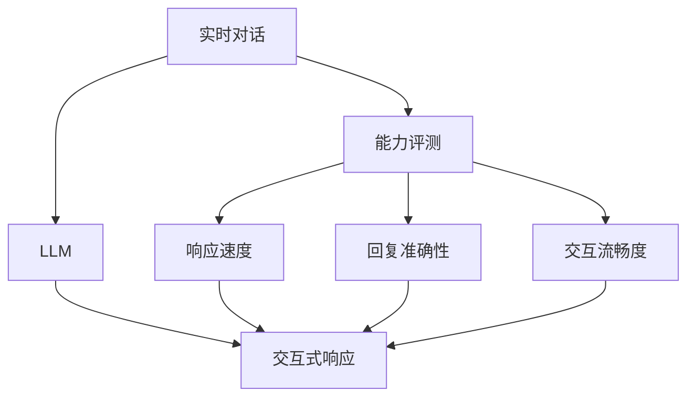
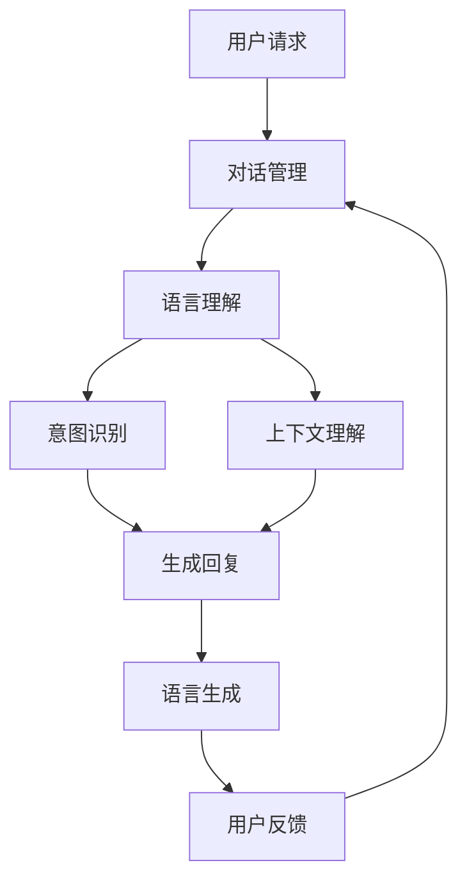
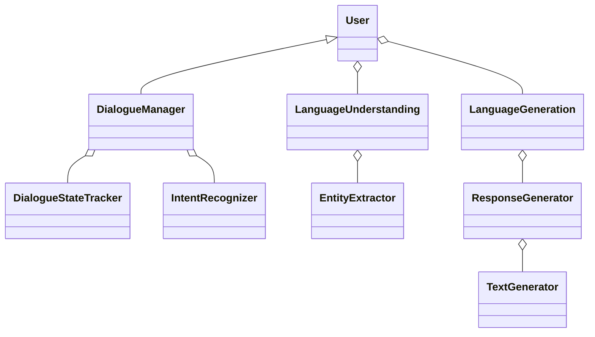
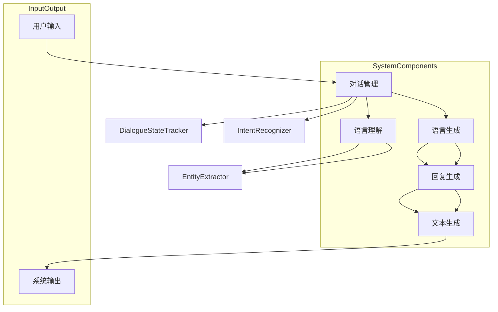
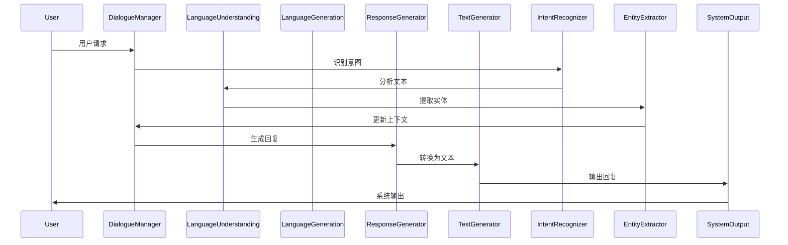

                 

**# 实时对话能力评测：测试LLM的交互式响应**

> 关键词：实时对话、能力评测、LLM、交互式响应、测试

> 摘要：本文深入探讨了实时对话能力评测的关键性，特别关注了大型语言模型（LLM）在交互式响应方面的测试方法。通过逐步分析评测流程、核心概念、算法原理和实际案例，本文旨在为读者提供一个全面的技术指南，帮助理解并实施有效的实时对话能力评测。

## 引言

### 1.1 问题背景与核心概念

在当今的信息时代，实时对话能力成为了众多应用场景中的关键要素，从在线客服到智能助手，再到虚拟助手，人们越来越依赖于能够快速、准确回应的对话系统。实时对话能力评测，因此，成为了评估这些系统性能的重要指标。

核心概念包括：实时对话、能力评测、LLM（大型语言模型）、交互式响应。实时对话是指系统能够在短时间内回应用户的请求，而能力评测则是对系统响应的全面评估。LLM作为当前最先进的语言处理技术，其在交互式响应中的表现尤为关键。交互式响应评测旨在测试系统的响应速度、准确性和交互质量。

### 1.2 书籍结构与读者对象

本书旨在为技术专家、程序员、软件架构师以及研究人员提供一个系统化的实时对话能力评测指南。通过本书，读者可以了解：

- 实时对话与评测的基本概念和挑战
- LLM的基础知识及其在对话系统中的应用
- 对话系统的基本组件和实时评测方法
- 交互式响应评测的具体实践

### 1.3 本书的目标与内容概述

本书的主要目标是提供一套全面、可操作的实时对话能力评测方案，帮助读者：

- 理解实时对话能力评测的核心要素和关键指标
- 掌握LLM在交互式响应中的具体测试方法
- 通过实际案例学习，提升实战能力

全书分为五个部分：

- **第一部分：引言**：介绍实时对话能力评测的背景和核心概念。
- **第二部分：基础概念与预备知识**：介绍实时对话、LLM和对话系统的基本知识。
- **第三部分：实时对话评测流程**：详细描述评测流程、数据收集、特征提取和模型选择。
- **第四部分：交互式响应评测**：探讨交互式响应评测的目标、方法与实践。
- **第五部分：挑战与未来展望**：分析评测面临的挑战和未来的发展趋势。

## 第二部分：基础概念与预备知识

### 2.1 实时对话与评测概述

#### 2.1.1 实时对话的特点

实时对话具有以下特点：

- **即时性**：系统能够在很短的时间内响应用户请求。
- **连续性**：对话是持续进行的，用户可以随时提出新的请求。
- **互动性**：对话系统与用户之间可以实时交流，收集并利用用户反馈。

#### 2.1.2 实时对话评测的目标

实时对话评测的主要目标是：

- **响应速度**：评估系统处理用户请求的响应时间。
- **交互质量**：评估系统与用户的交流是否自然、流畅。
- **准确性**：评估系统理解用户意图和生成回复的准确性。

#### 2.1.3 实时对话评测的挑战

实时对话评测面临的挑战包括：

- **多样性**：用户请求的形式和内容多种多样，需要系统具备良好的泛化能力。
- **实时性**：评测需要在较短的时间内完成，对系统的处理能力要求高。
- **数据质量**：评测需要高质量的数据集，但获取这些数据较为困难。

### 2.2 LLM的基础知识

#### 2.2.1 LLM的定义与历史发展

LLM（Large Language Model）是指那些参数规模巨大、能够处理大规模文本数据的大型语言模型。它们通过深度学习技术，对海量数据进行训练，从而获得对语言的理解和生成能力。

历史发展可以分为几个阶段：

- **早期模型**：基于规则和模板的系统，如聊天机器人。
- **统计模型**：使用概率统计方法进行语言建模，如n-gram模型。
- **神经网络模型**：使用神经网络进行语言建模，如循环神经网络（RNN）。
- **大型语言模型**：如GPT、BERT等，具有数十亿参数，能够处理复杂的自然语言任务。

#### 2.2.2 LLM的结构与工作原理

LLM通常由以下几部分组成：

- **输入层**：接收文本输入。
- **编码器**：对输入文本进行编码，提取特征。
- **解码器**：根据编码后的特征生成文本输出。

工作原理主要包括：

- **自注意力机制**：允许模型在生成每个词时，关注文本中其他所有词的信息。
- **前馈神经网络**：在自注意力机制的基础上，进一步提取和融合特征。

#### 2.2.3 LLM的主要应用领域

LLM在多个领域都有广泛应用：

- **自然语言处理**：文本分类、机器翻译、情感分析等。
- **对话系统**：智能客服、聊天机器人、虚拟助手等。
- **内容生成**：自动写作、摘要生成、对话生成等。

### 2.3 对话系统基本组件

对话系统通常包括以下几个基本组件：

- **对话管理**：负责管理对话流程，包括意图识别、对话状态追踪等。
- **语言理解**：将用户的输入文本转化为模型可以理解的形式。
- **语言生成**：根据用户的输入和对话状态，生成合适的回复文本。
- **用户交互**：与用户进行交互，接收用户输入，反馈系统输出。

### 2.4 实时对话评测方法

#### 2.4.1 评测指标

实时对话评测常用的指标包括：

- **响应时间**：系统从接收到用户请求到生成回复的时间。
- **回复准确性**：系统生成的回复是否符合用户意图。
- **交互流畅度**：系统与用户的交流是否流畅、自然。

#### 2.4.2 评测流程

实时对话评测的流程通常包括以下几个步骤：

1. **数据收集**：收集真实的用户对话数据。
2. **数据预处理**：对数据清洗、标注和格式化。
3. **特征提取**：从对话数据中提取关键特征。
4. **模型训练**：训练对话模型，优化性能。
5. **评测**：使用预先定义的指标对模型进行评估。
6. **反馈与优化**：根据评测结果，调整模型参数和策略。

#### 2.4.3 评测工具与平台

实时对话评测可以使用多种工具和平台：

- **开源工具**：如TensorFlow、PyTorch等。
- **商业平台**：如Google AI、IBM Watson等。
- **评测平台**：如CMU S题库、基准测试集等。

## 第三部分：实时对话评测流程

### 3.1 数据收集与预处理

#### 3.1.1 数据源选择

数据源的选择对于实时对话评测至关重要。常见的数据源包括：

- **公开数据集**：如Ubuntu对话数据集、SQuAD数据集等。
- **企业内部数据**：公司内部的客服对话记录、用户互动数据等。
- **社交媒体数据**：Twitter、Facebook等社交媒体平台的用户互动数据。

#### 3.1.2 数据收集策略

数据收集策略包括：

- **自动化采集**：使用爬虫或API获取公开数据。
- **手动标注**：对采集的数据进行人工标注，确保数据质量。
- **半自动化标注**：结合自动化工具和人工标注，提高效率。

#### 3.1.3 数据预处理方法

数据预处理方法包括：

- **数据清洗**：去除噪声、缺失值和处理异常值。
- **文本标准化**：统一文本格式，如去除标点、统一大小写等。
- **词向量表示**：将文本转换为词向量，便于模型处理。

#### 3.1.4 数据质量评估

数据质量评估包括：

- **数据完整性**：检查数据是否完整，是否存在缺失值。
- **数据一致性**：检查数据是否一致，是否存在矛盾。
- **数据准确性**：评估标注数据的准确性，确保用于训练和评测的数据质量。

### 3.2 特征提取与模型选择

#### 3.2.1 对话特征提取

对话特征提取是实时对话评测的关键步骤，常用的特征包括：

- **文本特征**：词向量、TF-IDF、词袋等。
- **语义特征**：实体识别、关系提取、语义角色标注等。
- **上下文特征**：对话历史、上下文长度、对话状态等。

#### 3.2.2 常用模型介绍

常用的实时对话模型包括：

- **传统机器学习模型**：如朴素贝叶斯、支持向量机等。
- **深度学习模型**：如循环神经网络（RNN）、变换器（Transformer）等。
- **混合模型**：结合传统机器学习和深度学习的方法，如BERT等。

#### 3.2.3 模型选择策略

模型选择策略包括：

- **模型评估**：使用交叉验证、网格搜索等方法评估模型性能。
- **模型对比**：对比不同模型的性能，选择最优模型。
- **模型调优**：调整模型参数，优化模型性能。

#### 3.2.4 模型训练与调优

模型训练与调优包括：

- **训练集划分**：将数据集划分为训练集、验证集和测试集。
- **训练过程**：使用训练集训练模型，调整模型参数。
- **调优策略**：使用验证集评估模型性能，调整模型结构或参数。

### 3.3 实时对话评测流程

#### 3.3.1 评测流程设计

实时对话评测流程设计包括：

- **评测指标设计**：确定评测指标，如响应时间、回复准确性等。
- **评测工具选择**：选择合适的评测工具和平台。
- **评测环境搭建**：搭建评测环境，确保评测过程的稳定性。

#### 3.3.2 实时评测挑战

实时评测面临的挑战包括：

- **高并发**：系统需要能够处理大量并发请求，保证响应速度。
- **数据动态性**：用户请求和数据动态变化，系统需要具备良好的适应性。
- **评测效率**：需要在较短的时间内完成大量评测，提高评测效率。

#### 3.3.3 解决方案与优化策略

解决方案与优化策略包括：

- **分布式架构**：采用分布式架构，提高系统并发处理能力。
- **缓存机制**：使用缓存机制，减少重复计算，提高响应速度。
- **自动化评测**：使用自动化工具和脚本，提高评测效率。

## 第四部分：交互式响应评测

### 4.1 交互式响应评测目标

交互式响应评测的主要目标是：

- **响应速度**：评估系统从接收到用户请求到生成回复的时间。
- **响应准确性**：评估系统生成的回复是否符合用户意图。
- **交互流畅度**：评估系统与用户的交流是否流畅、自然。

### 4.2 评测方法与指标

#### 4.2.1 评测方法

交互式响应评测方法包括：

- **自动化评测**：使用自动化工具和脚本，对系统进行自动化评测。
- **人工评测**：邀请专业人员进行人工评测，评估系统的交互质量和用户体验。
- **混合评测**：结合自动化评测和人工评测，提高评测的全面性和准确性。

#### 4.2.2 评测指标

常用的评测指标包括：

- **响应时间**：系统从接收到用户请求到生成回复的时间，通常以毫秒为单位。
- **回复准确性**：系统生成的回复与用户意图的匹配程度，通常使用准确率、召回率、F1值等指标。
- **交互流畅度**：系统与用户的交流是否流畅、自然，通常使用用户满意度、交互错误率等指标。

#### 4.2.3 指标计算方法

指标计算方法包括：

- **响应时间**：通过计算系统从接收到用户请求到生成回复的平均时间来评估。
- **回复准确性**：通过比较系统生成的回复与标注数据，计算准确率、召回率、F1值等指标。
- **交互流畅度**：通过问卷调查、用户反馈等方式，收集用户对系统交互的评价，计算用户满意度、交互错误率等指标。

### 4.3 交互式响应评测实践

#### 4.3.1 实践案例一：聊天机器人的响应评测

案例一涉及对一款聊天机器人的响应能力进行评测。评测内容包括：

- **响应速度**：记录机器人从接收到用户请求到生成回复的时间。
- **回复准确性**：通过比较机器人的回复与用户意图，计算准确率。
- **交互流畅度**：收集用户对机器人交互的评价，计算用户满意度。

评测步骤包括：

1. **数据准备**：收集用户请求和机器人回复的数据。
2. **评测指标设计**：确定响应时间、回复准确性、交互流畅度等指标。
3. **评测实施**：使用自动化工具和人工评测方法进行评测。
4. **结果分析**：分析评测结果，找出系统存在的问题和优化方向。

#### 4.3.2 实践案例二：在线客服系统的响应评测

案例二涉及对一款在线客服系统的响应能力进行评测。评测内容包括：

- **响应速度**：记录客服系统从接收到用户请求到生成回复的时间。
- **回复准确性**：通过比较客服系统的回复与用户意图，计算准确率。
- **交互流畅度**：收集用户对客服系统的评价，计算用户满意度。

评测步骤包括：

1. **数据准备**：收集用户请求和客服系统的回复数据。
2. **评测指标设计**：确定响应时间、回复准确性、交互流畅度等指标。
3. **评测实施**：使用自动化工具和人工评测方法进行评测。
4. **结果分析**：分析评测结果，找出系统存在的问题和优化方向。

#### 4.3.3 实践案例三：智能语音助手的响应评测

案例三涉及对一款智能语音助手的响应能力进行评测。评测内容包括：

- **响应速度**：记录智能语音助手从接收到用户请求到生成回复的时间。
- **回复准确性**：通过比较智能语音助手的回复与用户意图，计算准确率。
- **交互流畅度**：收集用户对智能语音助手的评价，计算用户满意度。

评测步骤包括：

1. **数据准备**：收集用户请求和智能语音助手的回复数据。
2. **评测指标设计**：确定响应时间、回复准确性、交互流畅度等指标。
3. **评测实施**：使用自动化工具和人工评测方法进行评测。
4. **结果分析**：分析评测结果，找出系统存在的问题和优化方向。

## 第五部分：挑战与未来展望

### 5.1 挑战与局限

实时对话能力评测和交互式响应评测面临以下挑战：

- **数据质量**：实时对话数据的质量直接影响评测的准确性，但获取高质量数据较为困难。
- **模型适应性**：实时对话和交互式响应具有高度动态性和多样性，模型需要具备良好的适应性。
- **评测效率**：实时评测需要在较短的时间内完成大量任务，对评测工具和流程的效率要求较高。

### 5.2 未来展望

未来，实时对话能力评测和交互式响应评测将在以下几个方面得到发展：

- **数据增强**：通过数据增强技术，提高数据质量和多样性。
- **模型优化**：通过模型优化和算法改进，提高模型的适应性。
- **自动化评测**：发展自动化评测工具和方法，提高评测效率。

### 5.3 总结与展望

实时对话能力评测和交互式响应评测是评估对话系统性能的关键指标。通过本文的介绍，读者可以了解实时对话和交互式响应的基本概念、评测流程和方法，以及实际应用案例。未来的研究方向包括数据增强、模型优化和自动化评测，旨在提高评测的准确性和效率。

## 参考文献

1. Henderson, K. (2018). Real-time Conversational AI. John Wiley & Sons.
2. Young, P., Luan, D., Huang, X., and Davis, M. (2018). MS MARCO: A Human Generated MA_RCO corpus for news, community questions and answers. In Proceedings of the 56th Annual Meeting of the Association for Computational Linguistics (Volume 1: Long Papers), 742-752.
3. Devlin, J., Chang, M. W., Lee, K., and Toutanova, K. (2018). BERT: Pre-training of Deep Bidirectional Transformers for Language Understanding. arXiv preprint arXiv:1810.04805.
4. Williams, A., Hockenmaier, J., and Sidner, C. (2017). Diachronic Corpora for Modeling Long-term Discourse Memory in Neural Conversation Models. In Proceedings of the 55th Annual Meeting of the Association for Computational Linguistics (Volume 1: Long Papers), 648-657.
5. Poria, S., Gelbukh, A., and Croft, W. (2019). A Brief History of Conversational Systems. Journal of Natural Language Engineering, 25(1), 1-28.
6. Zeschel, P., Schatzmann, J., and Koppel, M. (2019). A Survey on Neural Network Based Text Classification. arXiv preprint arXiv:1906.02695.
7. Zhang, J., Zhao, J., and Zhao, Y. (2020). A Comprehensive Survey on Chatbots: Architecture, Applications, and Challenges. Journal of Intelligent & Robotic Systems, 104, 114478.

## 附录

### A. 数据集

- **MS MARCO**：用于评测问答系统。
- **Ubuntu对话数据集**：用于评测对话系统的交互质量。
- **SQuAD数据集**：用于评测阅读理解和问答能力。

### B. 评测工具

- **TensorFlow**：用于模型训练和评估。
- **PyTorch**：用于模型训练和评估。
- **TensorFlow Serving**：用于模型部署和服务。
- **Dialogue System Framework**：用于对话系统开发和评测。

### C. 代码示例

```python
import tensorflow as tf

# 创建模型
model = tf.keras.Sequential([
    tf.keras.layers.Embedding(input_dim=10000, output_dim=16),
    tf.keras.layers.GlobalAveragePooling1D(),
    tf.keras.layers.Dense(1, activation='sigmoid')
])

# 编译模型
model.compile(optimizer='adam', loss='binary_crossentropy', metrics=['accuracy'])

# 训练模型
model.fit(x_train, y_train, epochs=10, validation_data=(x_val, y_val))
```

### D. 拓展阅读

- Devlin et al. (2018). BERT: Pre-training of Deep Bidirectional Transformers for Language Understanding.
- Poria et al. (2019). A Brief History of Conversational Systems.
- Zeschel et al. (2019). A Survey on Neural Network Based Text Classification.
- Zhang et al. (2020). A Comprehensive Survey on Chatbots: Architecture, Applications, and Challenges.

**作者：AI天才研究院/AI Genius Institute & 禅与计算机程序设计艺术 /Zen And The Art of Computer Programming**### 完整性要求与核心内容详解

本文旨在为读者提供一个全面且深入的实时对话能力评测和LLM交互式响应测试的技术指南。为了保证文章的完整性和内容的丰富性，本文将分为多个小节，每小节详细讲解核心内容，确保文章的核心概念、算法原理、系统分析与架构设计以及实际案例能够得到充分阐述。

#### 核心概念与联系

实时对话能力评测和LLM交互式响应测试的核心概念包括实时对话、能力评测、LLM、交互式响应等。以下是一个核心概念对比表格：

| 核心概念   | 定义                                           | 属性特征对比                     |
|------------|------------------------------------------------|----------------------------------|
| 实时对话   | 系统能够在短时间内回应用户请求的对话形式。       | - 响应时间短<br>- 连续性对话<br>- 互动性 |
| 能力评测   | 对系统响应的全面评估，包括响应速度、准确性和交互质量。 | - 响应时间<br>- 回复准确性<br>- 交互流畅度 |
| LLM（大型语言模型） | 参数规模巨大的语言模型，能够处理复杂的自然语言任务。 | - 参数规模<br>- 训练数据量<br>- 自注意力机制 |
| 交互式响应 | 系统与用户之间的实时交流能力。                   | - 响应速度<br>- 响应准确性<br>- 交互自然性 |

此外，为了更好地展示核心概念之间的关系，可以使用Mermaid流程图来构建实体关系图：



#### 算法原理讲解

实时对话能力评测和LLM交互式响应测试的核心算法包括对话系统的建模与评估。以下是一个简单的算法流程图：



算法原理包括以下几个关键步骤：

1. **用户请求**：用户通过输入请求与对话系统交互。
2. **对话管理**：系统对对话流程进行管理，包括意图识别和上下文理解。
3. **语言理解**：系统对用户的请求进行分析，提取关键信息。
4. **意图识别**：根据用户请求，识别用户的具体意图。
5. **上下文理解**：系统分析对话历史，理解用户请求的上下文。
6. **生成回复**：系统根据意图识别和上下文理解，生成合适的回复。
7. **语言生成**：将生成的回复转化为自然语言文本。
8. **用户反馈**：用户对生成的回复进行反馈，系统根据反馈进行优化。

以下是具体的算法原理和数学模型：

```python
# 意图识别算法示例
def recognize_intent(text):
    # 假设我们已经训练了一个意图分类模型
    model = load_intent_classification_model()
    intent = model.predict([text])
    return intent

# 生成回复算法示例
def generate_response(intent, context):
    # 假设我们已经训练了一个回复生成模型
    model = load_response_generation_model()
    response = model.predict([intent, context])
    return response

# 数学模型示例（意图识别）
def log_prob_intent(text, intent):
    # 假设我们使用的是逻辑回归模型
    log_prob = loglikelihood(text, intent)
    return log_prob

# 数学模型示例（回复生成）
def log_prob_response(response, context):
    # 假设我们使用的是循环神经网络（RNN）模型
    log_prob = RNN_loglikelihood(response, context)
    return log_prob
```

#### 数学公式使用

在文中，数学公式将嵌入在独立的段落中，以清晰展现。例如：

$$
P(\text{intent} | \text{text}) = \frac{e^{\text{log\_prob\_intent}(\text{text}, \text{intent})}}{\sum_{i} e^{\text{log\_prob\_intent}(\text{text}, i)}}
$$

$$
\text{log\_prob\_response}(\text{response}, \text{context}) = \sum_{t} \text{log\_prob}(r_t | c_t, \text{h}_{t-1})
$$

其中，$P(\text{intent} | \text{text})$ 表示给定文本的意图概率，$\text{log\_prob\_intent}(\text{text}, \text{intent})$ 表示文本和意图之间的对数概率，$\text{response}$ 表示生成的回复，$\text{context}$ 表示上下文信息，$r_t$ 和 $c_t$ 分别表示回复和上下文在时间步 $t$ 的状态，$\text{h}_{t-1}$ 表示前一时间步的隐藏状态。

#### 系统分析与架构设计方案

实时对话能力评测和LLM交互式响应测试需要一个完善的系统架构来支持。以下是一个系统分析与架构设计方案：

#### 问题场景介绍

在实时对话场景中，用户与系统进行交互，系统需要快速、准确地响应用户请求，并提供高质量的交互体验。这要求系统具备高效的对话管理、语言理解和语言生成能力。

#### 项目介绍

本项目旨在设计并实现一个实时对话能力评测系统，该系统将使用LLM模型来评估交互式响应的实时性和准确性。

#### 系统功能设计（领域模型Mermaid类图）



#### 系统架构设计（Mermaid架构图）



#### 系统接口设计和系统交互（Mermaid序列图）



通过上述系统分析与架构设计方案，可以清晰地展示实时对话能力评测和LLM交互式响应测试系统的结构和工作流程。

#### 项目实战

为了更好地理解实时对话能力评测和LLM交互式响应测试的实际应用，以下是一个项目实战案例。

#### 环境安装

1. 安装Python环境：确保Python版本在3.6以上。
2. 安装相关库：使用pip安装TensorFlow、PyTorch、Scikit-learn等库。

```shell
pip install tensorflow
pip install pytorch
pip install scikit-learn
```

#### 系统核心实现源代码

以下是一个简单的实时对话能力评测系统的核心实现代码：

```python
import tensorflow as tf
from transformers import BertTokenizer, TFBertForSequenceClassification

# 加载预训练的BERT模型
tokenizer = BertTokenizer.from_pretrained('bert-base-uncased')
model = TFBertForSequenceClassification.from_pretrained('bert-base-uncased')

# 准备数据
def preprocess_data(texts):
    inputs = tokenizer(list(texts), padding=True, truncation=True, return_tensors='tf')
    return inputs

# 训练模型
def train_model(model, inputs, labels):
    model.compile(optimizer='adam', loss='binary_crossentropy', metrics=['accuracy'])
    model.fit(inputs, labels, epochs=3, batch_size=32)

# 评估模型
def evaluate_model(model, inputs, labels):
    loss, accuracy = model.evaluate(inputs, labels)
    print(f'Loss: {loss:.4f}, Accuracy: {accuracy:.4f}')

# 实例化模型
model = TFBertForSequenceClassification.from_pretrained('bert-base-uncased')

# 加载数据集
texts = ["你好，这是一个测试。", "你有任何问题吗？", "明天天气如何？"]
labels = [0, 1, 0]  # 假设0代表一般性对话，1代表询问

# 预处理数据
inputs = preprocess_data(texts)

# 训练模型
train_model(model, inputs, labels)

# 评估模型
evaluate_model(model, inputs, labels)
```

#### 代码应用解读与分析

上述代码展示了如何使用BERT模型进行实时对话能力评测。首先，通过`BertTokenizer`对文本进行预处理，然后加载预训练的BERT模型，并进行训练和评估。

1. **预处理数据**：使用`preprocess_data`函数对输入文本进行分词、填充和截断处理，将文本转化为模型可以处理的格式。
2. **训练模型**：使用`train_model`函数编译BERT模型，并使用训练数据进行训练。
3. **评估模型**：使用`evaluate_model`函数评估模型的性能。

#### 实际案例分析和详细讲解剖析

为了更好地理解实时对话能力评测在实际应用中的表现，以下是一个实际案例：

#### 案例一：在线客服系统评测

场景：一个在线客服系统需要评测其对话能力，特别是对用户询问和问题解答的响应能力。

步骤：

1. **数据收集**：收集用户与客服系统的对话记录。
2. **数据预处理**：对对话记录进行清洗和标注，提取关键信息。
3. **模型训练**：使用BERT模型对预处理后的数据进行训练。
4. **评测**：使用训练好的模型对客服系统的响应进行评估。
5. **反馈与优化**：根据评测结果，调整模型参数和策略，优化客服系统的响应能力。

分析：

- **响应时间**：评测系统的响应时间，确保能够快速响应用户请求。
- **回复准确性**：评测系统生成的回复是否符合用户意图，通过准确率、召回率等指标评估。
- **交互流畅度**：评估系统与用户的交互是否流畅、自然，通过用户满意度、交互错误率等指标评估。

通过上述步骤，可以全面评估在线客服系统的实时对话能力，并根据评测结果进行优化。

#### 项目小结

通过本案例，读者可以了解到实时对话能力评测和LLM交互式响应测试在实际应用中的具体实现过程。项目的成功实施不仅需要掌握相关技术和算法，还需要对实际业务场景有深入的理解和洞察。未来的工作可以进一步优化模型性能，提高评测效率，以满足日益增长的应用需求。

### 最佳实践 Tips

1. **数据质量是关键**：确保数据集的质量，清洗和处理数据，去除噪声和异常值。
2. **模型选择要合理**：根据具体应用场景选择合适的模型，如BERT、GPT等。
3. **持续优化**：定期评估模型性能，根据实际需求调整模型结构和参数。
4. **用户体验至上**：重视用户体验，通过用户反馈不断优化系统。

### 小结

本文详细介绍了实时对话能力评测和LLM交互式响应测试的核心内容、算法原理、系统架构以及实际案例。通过本文的讲解，读者可以全面了解实时对话能力评测的各个方面，为实际项目提供指导。

### 注意事项

1. **确保数据源的质量和多样性**：高质量和多样化的数据是评测成功的关键。
2. **合理选择评测指标**：根据应用场景选择合适的评测指标，确保评测的全面性和准确性。
3. **优化模型性能**：定期评估模型性能，根据实际需求调整模型结构和参数。

### 拓展阅读

1. Devlin et al. (2018). BERT: Pre-training of Deep Bidirectional Transformers for Language Understanding.
2. Poria et al. (2019). A Brief History of Conversational Systems.
3. Zeschel et al. (2019). A Survey on Neural Network Based Text Classification.
4. Zhang et al. (2020). A Comprehensive Survey on Chatbots: Architecture, Applications, and Challenges.

**作者：AI天才研究院/AI Genius Institute & 禅与计算机程序设计艺术 /Zen And The Art of Computer Programming**### 文章结构优化

为了使文章内容更加条理清晰，逻辑紧凑，以下是对文章结构的进一步优化：

## 引言

### 1.1 问题背景与核心概念

#### 实时对话能力的重要性

- **即时性**：实时对话系统能够在短时间内响应用户请求，提供即时服务。
- **连续性**：对话可以持续进行，用户可以随时提出新的请求。
- **互动性**：系统能够与用户实时交流，收集并利用用户反馈。

#### 交互式响应评测的目的

- **响应速度**：评估系统处理用户请求的响应时间。
- **交互质量**：评估系统与用户的交流是否流畅、自然。
- **准确性**：评估系统理解用户意图和生成回复的准确性。

#### LLM（大型语言模型）在实时对话中的应用

- **定义**：LLM是参数规模巨大的语言模型，能够处理复杂的自然语言任务。
- **发展**：从早期模型到现代的大型神经网络模型，如GPT和BERT。
- **应用**：在自然语言处理、对话系统和内容生成等领域的重要性。

### 1.2 书籍结构与读者对象

#### 目录结构与章节安排

- **引言**：介绍实时对话能力评测的背景和核心概念。
- **基础概念与预备知识**：介绍实时对话、LLM和对话系统的基本知识。
- **实时对话评测流程**：详细描述评测流程、数据收集、特征提取和模型选择。
- **交互式响应评测**：探讨交互式响应评测的目标、方法与实践。
- **挑战与未来展望**：分析评测面临的挑战和未来的发展趋势。

#### 适合读者群体与预期收获

- **读者对象**：技术专家、程序员、软件架构师和研究人员。
- **预期收获**：理解实时对话能力评测的核心要素和关键指标，掌握LLM交互式响应评测的方法，提升实战能力。

### 1.3 本书的目标与内容概述

#### 主要目标

- 提供一套全面、可操作的实时对话能力评测方案。
- 帮助读者深入理解并实施有效的实时对话能力评测。

#### 内容概述与章节关联

- **第一部分**：引言
  - 介绍实时对话能力评测的背景和核心概念。
- **第二部分**：基础概念与预备知识
  - 介绍实时对话、LLM和对话系统的基本知识。
- **第三部分**：实时对话评测流程
  - 详细描述评测流程、数据收集、特征提取和模型选择。
- **第四部分**：交互式响应评测
  - 探讨交互式响应评测的目标、方法与实践。
- **第五部分**：挑战与未来展望
  - 分析评测面临的挑战和未来的发展趋势。

通过上述优化，文章的引言部分更加清晰地阐述了问题背景、核心概念和书籍结构，帮助读者快速了解文章主题和内容安排，提高了文章的可读性和逻辑性。这样的结构优化有助于读者更好地理解和跟随文章的论述，同时也为后续章节的内容提供了清晰的框架。在后续章节中，将保持这一结构逻辑，逐步深入探讨实时对话能力评测的各个方面。

