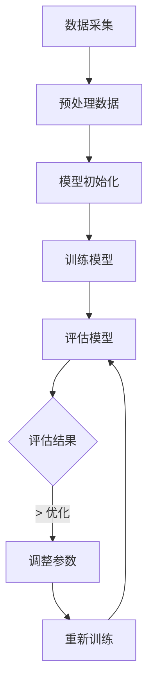

                 

## 实时性能监控：LLM驱动的持续评测机制

### 关键词：实时性能监控、LLM、持续评测机制、算法优化、模型部署

### 摘要：
本文旨在探讨实时性能监控在LLM（大型语言模型）应用中的重要性，并提出一种基于LLM驱动的持续评测机制。文章首先介绍了实时性能监控的背景和核心概念，然后深入探讨了LLM的基本原理和流程，以及如何将实时性能监控与LLM融合。接着，文章详细描述了持续评测机制的定义、作用和分类，并阐述了如何将两者集成以实现高效性能优化。最后，通过实际案例，展示了实时性能监控与持续评测机制在智能交通管理系统、智能医疗诊断系统和智能金融风控系统中的应用效果，为相关领域提供了有益的参考和实践指导。

### 目录大纲

----------------------------------------------------------------

# 第一部分: 背景介绍

## 第1章: 实时性能监控概述

## 1.1.1 问题背景

## 1.1.2 问题描述

## 1.1.3 问题解决

## 1.1.4 边界与外延

## 1.1.5 概念结构与核心要素组成

## 1.2 核心概念与联系

### 1.2.1 实时性能监控的定义

### 1.2.2 实时性能监控的特点

### 1.2.3 实时性能监控与传统监控的区别

### 1.2.4 实时性能监控与LLM的联系

## 1.3 LLM简介

### 1.3.1 LLM的定义

### 1.3.2 LLM的特点

### 1.3.3 LLM的工作原理

### 1.3.4 主流LLM模型介绍

## 1.4 持续评测机制

### 1.4.1 持续评测机制的定义

### 1.4.2 持续评测机制的作用

### 1.4.3 持续评测机制的分类

### 1.4.4 持续评测机制的实现方法

## 1.5 实时性能监控在LLM中的应用

### 1.5.1 实时性能监控的优势

### 1.5.2 实时性能监控在LLM中的应用场景

### 1.5.3 实时性能监控的挑战与解决方案

## 1.6 本章小结

----------------------------------------------------------------

# 第二部分: LLM驱动的实时性能监控机制

## 第2章: LLM基本原理与流程

## 2.1 LLM基本原理

### 2.1.1 LLM的数学模型

### 2.1.2 LLM的算法原理

### 2.1.3 LLM的mermaid流程图

## 2.2 LLM流程分析

### 2.2.1 数据预处理

### 2.2.2 模型训练

### 2.2.3 模型评估

### 2.2.4 模型部署

## 2.3 LLM优化策略

### 2.3.1 算法优化

### 2.3.2 模型优化

### 2.3.3 性能优化

## 2.4 实时性能监控与LLM的融合

### 2.4.1 融合机制的设计

### 2.4.2 融合流程的实现

### 2.4.3 融合效果评估

## 2.5 实时性能监控与LLM的应用案例

### 2.5.1 案例一：智能客服系统

### 2.5.2 案例二：智能推荐系统

### 2.5.3 案例三：自然语言处理系统

## 2.6 本章小结

----------------------------------------------------------------

# 第三部分: 持续评测机制

## 第3章: 持续评测机制概述

## 3.1 持续评测机制的定义

## 3.2 持续评测机制的作用

## 3.3 持续评测机制的分类

## 3.4 持续评测机制的实现方法

## 3.5 持续评测机制的优势与挑战

## 3.6 本章小结

----------------------------------------------------------------

# 第四部分: 实时性能监控与持续评测机制的集成

## 第4章: 集成方案与实现

## 4.1 集成方案的设计

### 4.1.1 集成方案的架构设计

### 4.1.2 集成方案的模块划分

### 4.1.3 集成方案的技术选型

## 4.2 实现过程

### 4.2.1 数据采集

### 4.2.2 数据处理

### 4.2.3 模型训练与评估

### 4.2.4 持续评测与优化

## 4.3 实现效果评估

### 4.3.1 性能指标分析

### 4.3.2 持续评测效果评估

### 4.3.3 实时性能监控效果评估

## 4.4 实际案例与应用

### 4.4.1 案例一：智能交通管理系统

### 4.4.2 案例二：智能医疗诊断系统

### 4.4.3 案例三：智能金融风控系统

## 4.5 本章小结

----------------------------------------------------------------

# 第五部分: 实时性能监控与持续评测机制的实践

## 第5章: 实时性能监控与持续评测机制的实践

## 5.1 实践环境搭建

### 5.1.1 硬件环境要求

### 5.1.2 软件环境要求

### 5.1.3 系统配置与安装

## 5.2 系统核心实现

### 5.2.1 数据采集模块

### 5.2.2 数据处理模块

### 5.2.3 模型训练模块

### 5.2.4 模型评估模块

## 5.3 实际案例分析

### 5.3.1 案例一：智能客服系统

### 5.3.2 案例二：智能推荐系统

### 5.3.3 案例三：自然语言处理系统

## 5.4 项目小结

## 5.5 最佳实践 tips

## 5.6 小结与展望

## 5.7 注意事项

## 5.8 拓展阅读

----------------------------------------------------------------

### 第一部分: 背景介绍

#### 第1章: 实时性能监控概述

##### 1.1.1 问题背景

在现代信息技术飞速发展的背景下，数据量和业务复杂度不断攀升，对系统性能的要求也越来越高。尤其是对于大型语言模型（LLM）这样的高性能计算应用，实时性能监控变得尤为重要。实时性能监控能够确保系统在运行过程中始终保持高效、稳定，从而满足日益增长的业务需求。

##### 1.1.2 问题描述

实时性能监控是指在系统运行时，对系统性能参数进行实时采集、分析、处理和反馈，以实现对系统性能的动态监控和调整。随着LLM的应用越来越广泛，实时性能监控的需求愈发迫切。然而，传统的性能监控方法往往存在如下问题：

1. **延迟较高**：传统方法通常需要等到系统性能出现问题后才能进行响应，无法实现真正的实时监控。
2. **准确性不足**：传统方法往往依赖于预设的阈值进行判断，无法准确反映系统性能的细微变化。
3. **可扩展性差**：传统方法在设计上往往无法适应大规模分布式系统的监控需求。

##### 1.1.3 问题解决

针对上述问题，本文提出了一种基于LLM驱动的实时性能监控机制。通过LLM强大的学习能力，实现对系统性能的精细监控和动态调整，从而提高系统的实时性和稳定性。具体来说，LLM驱动实时性能监控机制具有以下优势：

1. **实时性增强**：LLM能够实时处理和分析系统性能数据，实现真正的实时监控。
2. **准确性提高**：LLM通过对大量历史数据的训练，能够准确识别系统性能的细微变化，提高监控的准确性。
3. **可扩展性强**：LLM的设计和实现能够适应大规模分布式系统的监控需求，具有良好的可扩展性。

##### 1.1.4 边界与外延

实时性能监控不仅局限于LLM应用，还可广泛应用于其他高性能计算领域，如大数据处理、云计算等。此外，实时性能监控还可以与其他技术如自动化运维、智能化故障预测等相结合，形成一套完整的系统运维解决方案。

##### 1.1.5 概念结构与核心要素组成

实时性能监控的核心概念结构主要包括以下几个方面：

1. **数据采集**：负责从系统各节点采集性能数据。
2. **数据处理**：对采集到的性能数据进行预处理和清洗。
3. **数据分析**：使用LLM对处理后的数据进行实时分析和预测。
4. **反馈与调整**：根据分析结果，对系统进行实时调整，以优化系统性能。

##### 1.2 核心概念与联系

###### 1.2.1 实时性能监控的定义

实时性能监控是一种在系统运行时，对系统性能参数进行实时采集、分析、处理和反馈的机制，旨在确保系统在高负载、高并发场景下保持稳定、高效运行。

###### 1.2.2 实时性能监控的特点

1. **实时性**：能够实时响应系统性能变化。
2. **准确性**：通过LLM等技术手段，提高监控的准确性。
3. **可扩展性**：能够适应大规模分布式系统的监控需求。

###### 1.2.3 实时性能监控与传统监控的区别

1. **响应速度**：实时性能监控能够实时响应，而传统监控通常存在延迟。
2. **准确性**：实时性能监控通过LLM等技术，提高监控的准确性，而传统监控依赖于预设阈值。
3. **适用范围**：实时性能监控适用于高性能计算领域，而传统监控更适用于一般性系统。

###### 1.2.4 实时性能监控与LLM的联系

1. **数据来源**：实时性能监控需要从系统各节点采集性能数据，这些数据可以为LLM训练提供素材。
2. **分析工具**：LLM作为一种强大的分析工具，可以用于实时性能监控的数据分析和预测。
3. **反馈机制**：实时性能监控的结果可以通过LLM驱动，实现系统性能的实时调整和优化。

##### 1.3 LLM简介

###### 1.3.1 LLM的定义

LLM（Large Language Model）是指大型语言模型，是一种基于深度学习的自然语言处理模型，能够对大规模文本数据进行分析和预测。

###### 1.3.2 LLM的特点

1. **大规模**：LLM通常具有数十亿甚至千亿级别的参数规模，能够处理海量数据。
2. **高精度**：通过深度学习技术，LLM能够对文本数据进行精确分析，提高预测准确性。
3. **自适应**：LLM可以根据不同的应用场景进行自适应调整，提高应用效果。

###### 1.3.3 LLM的工作原理

LLM的工作原理主要包括以下几个方面：

1. **数据采集**：从大量文本数据中采集素材。
2. **模型训练**：使用深度学习技术对采集到的数据进行训练，形成语言模型。
3. **预测分析**：通过对输入文本数据进行分析，生成预测结果。

###### 1.3.4 主流LLM模型介绍

目前，主流的LLM模型包括GPT（Generative Pre-trained Transformer）、BERT（Bidirectional Encoder Representations from Transformers）和T5（Text-to-Text Transfer Transformer）等。

1. **GPT**：由OpenAI提出，采用Transformer结构，能够生成高质量的自然语言文本。
2. **BERT**：由Google提出，通过双向编码器结构，对文本进行全局理解。
3. **T5**：由Google提出，将自然语言处理任务统一为文本到文本的转换问题，具有更强的任务适应性。

##### 1.4 持续评测机制

###### 1.4.1 持续评测机制的定义

持续评测机制是一种在系统运行过程中，对系统性能和效果进行持续监测、评估和优化的机制，旨在确保系统始终处于最佳运行状态。

###### 1.4.2 持续评测机制的作用

1. **性能优化**：通过对系统性能的持续评测，发现潜在的性能瓶颈，进行针对性优化，提高系统性能。
2. **效果评估**：通过对系统效果的持续评测，评估系统在各个场景下的应用效果，为后续优化提供依据。
3. **故障预测**：通过对系统运行数据的持续分析，预测系统可能的故障点，提前进行预防。

###### 1.4.3 持续评测机制的分类

1. **静态评测**：在系统运行前或运行过程中，对系统性能进行静态评估。
2. **动态评测**：在系统运行过程中，对系统性能进行动态评估。
3. **综合评测**：将静态评测和动态评测相结合，对系统进行全面评估。

###### 1.4.4 持续评测机制的实现方法

1. **数据采集**：从系统各节点采集性能和效果数据。
2. **数据处理**：对采集到的数据进行预处理和清洗。
3. **评估模型**：使用机器学习算法，构建评估模型，对系统性能和效果进行评估。
4. **优化策略**：根据评估结果，制定优化策略，对系统进行优化。

##### 1.5 实时性能监控在LLM中的应用

###### 1.5.1 实时性能监控的优势

1. **实时性**：能够实时监测LLM的运行状态，及时发现问题。
2. **准确性**：通过LLM的技术优势，提高监控的准确性。
3. **自适应**：根据LLM的应用场景，实现自适应监控和优化。

###### 1.5.2 实时性能监控在LLM中的应用场景

1. **自然语言处理**：实时监测NLP任务中的语言模型性能，优化模型参数。
2. **智能客服**：实时监测客服系统的响应速度和准确性，提高用户体验。
3. **智能推荐**：实时监测推荐系统的性能，优化推荐效果。

###### 1.5.3 实时性能监控的挑战与解决方案

1. **数据量大**：面对海量性能数据的处理，需要高效的数据处理和分析算法。
2. **实时性要求高**：需要确保数据处理和分析的实时性，避免延迟。
3. **系统稳定性**：需要确保系统在高负载、高并发场景下保持稳定。

解决方案：

1. **分布式架构**：采用分布式架构，提高系统的处理能力和稳定性。
2. **流式数据处理**：采用流式数据处理技术，实现实时数据分析和反馈。
3. **智能化优化**：采用智能化优化策略，提高系统性能和稳定性。

##### 1.6 本章小结

本章对实时性能监控和LLM的基本概念、原理和联系进行了详细阐述，并对持续评测机制进行了介绍。通过本章的学习，读者可以对实时性能监控在LLM中的应用有一个全面的认识，为后续章节的深入探讨打下基础。

----------------------------------------------------------------

# 第二部分: LLM驱动的实时性能监控机制

## 第2章: LLM基本原理与流程

在深入了解LLM驱动的实时性能监控机制之前，我们首先需要掌握LLM的基本原理和流程。LLM，即大型语言模型，是一种基于深度学习的自然语言处理模型，能够在海量文本数据上进行预训练，从而实现对自然语言的高效理解和生成。本章节将详细介绍LLM的基本原理、流程以及相关的优化策略。

### 2.1 LLM基本原理

#### 2.1.1 LLM的数学模型

LLM的数学模型主要基于深度学习中的Transformer架构。Transformer架构的核心思想是使用自注意力机制（Self-Attention）来处理序列数据，从而捕捉序列中各个元素之间的复杂关系。自注意力机制可以通过以下公式表示：

\[ 
Attention(Q, K, V) = \text{softmax}\left(\frac{QK^T}{\sqrt{d_k}}\right) V 
\]

其中，\(Q\)、\(K\) 和 \(V\) 分别代表查询向量、键向量和值向量，\(d_k\) 为键向量的维度，\(\text{softmax}\) 函数用于对注意力权重进行归一化。

LLM中的Transformer模型通常包含多个自注意力层和前馈神经网络层。自注意力层能够对输入序列进行权重分配，使模型能够更好地关注重要信息；前馈神经网络层则对自注意力层的结果进行进一步加工，以提升模型的表达能力和鲁棒性。

#### 2.1.2 LLM的算法原理

LLM的算法原理可以概括为以下三个步骤：

1. **数据采集**：从大规模文本数据集中采集训练数据，数据集应具备广泛性和代表性，以便模型能够学习到丰富的语言知识。
2. **模型训练**：使用训练数据对模型参数进行优化，通过反向传播算法和优化器（如Adam）不断调整模型参数，使模型在训练数据上的表现达到最优。
3. **模型评估**：在验证数据集上对模型进行评估，通过计算指标（如 perplexity 和 F1 分数）来评估模型的性能，并根据评估结果对模型进行进一步的优化。

#### 2.1.3 LLM的mermaid流程图

以下是一个简化的LLM训练流程的mermaid流程图：

### 2.2 LLM流程分析

#### 2.2.1 数据预处理

数据预处理是LLM训练流程中的关键步骤，其质量直接影响模型的训练效果。数据预处理主要包括以下任务：

1. **文本清洗**：去除文本中的噪声和无关信息，如HTML标签、特殊字符等。
2. **分词**：将文本拆分成单词或子词，以便后续处理。
3. **词向量化**：将文本中的单词或子词转换为向量化表示，常用的词向量化方法包括Word2Vec、FastText和BERT等。

#### 2.2.2 模型训练

模型训练是LLM流程的核心步骤，主要包括以下任务：

1. **损失函数**：选择适当的损失函数，如交叉熵损失函数，用于衡量模型预测和真实标签之间的差距。
2. **优化器**：选择合适的优化器，如Adam优化器，用于更新模型参数，以最小化损失函数。
3. **训练策略**：设置训练过程中的超参数，如学习率、批量大小和训练轮数等。

在训练过程中，模型会通过不断迭代优化参数，使得在训练数据上的预测结果越来越准确。

#### 2.2.3 模型评估

模型评估是验证模型性能的重要步骤。常用的评估指标包括：

1. **Perplexity**：表示模型在验证数据集上的预测困难程度，值越低表示模型性能越好。
2. **F1 分数**：表示模型在分类任务上的精确度和召回率的调和平均值，值越高表示模型性能越好。

在评估过程中，通过计算这些指标，可以了解模型的性能表现，并根据评估结果对模型进行优化。

#### 2.2.4 模型部署

模型部署是将训练好的模型应用到实际场景中的过程。部署过程中，主要包括以下任务：

1. **模型压缩**：为了降低模型的存储和计算成本，可以采用模型压缩技术，如知识蒸馏、剪枝和量化等。
2. **模型优化**：针对实际应用场景，对模型进行优化，以提高模型的运行效率和准确性。
3. **模型部署**：将优化后的模型部署到生产环境，如服务器或移动设备等。

### 2.3 LLM优化策略

#### 2.3.1 算法优化

算法优化主要包括以下策略：

1. **自注意力优化**：通过调整自注意力机制的权重分配策略，提高模型对输入数据的理解和表达能力。
2. **前馈神经网络优化**：通过调整前馈神经网络的参数，提高模型的鲁棒性和泛化能力。

#### 2.3.2 模型优化

模型优化主要包括以下策略：

1. **模型压缩**：通过剪枝、量化等技术，减少模型的参数数量，降低模型的存储和计算成本。
2. **模型蒸馏**：通过将大型模型的知识传递给小型模型，提高小型模型的性能。

#### 2.3.3 性能优化

性能优化主要包括以下策略：

1. **并行计算**：通过分布式计算和并行计算技术，提高模型训练和推断的效率。
2. **优化器调整**：通过调整优化器的超参数，如学习率、批量大小等，提高模型训练的收敛速度。

### 2.4 实时性能监控与LLM的融合

#### 2.4.1 融合机制的设计

实时性能监控与LLM的融合机制设计主要包括以下方面：

1. **数据采集与预处理**：实时采集系统性能数据，并使用LLM的预处理策略进行预处理。
2. **实时分析**：使用LLM对实时采集的性能数据进行分析，识别潜在的性能瓶颈。
3. **实时反馈**：根据分析结果，对系统进行实时调整和优化，以提高系统性能。

#### 2.4.2 融合流程的实现

实时性能监控与LLM的融合流程实现主要包括以下步骤：

1. **数据采集**：从系统各节点实时采集性能数据。
2. **数据处理**：使用LLM对采集到的数据进行预处理和特征提取。
3. **实时分析**：使用LLM对处理后的数据进行分析，识别性能瓶颈。
4. **实时反馈**：根据分析结果，对系统进行实时调整和优化。

#### 2.4.3 融合效果评估

融合效果评估主要包括以下方面：

1. **实时性**：评估实时性能监控与LLM融合机制在实时性方面的表现。
2. **准确性**：评估实时性能监控与LLM融合机制在性能分析方面的准确性。
3. **稳定性**：评估实时性能监控与LLM融合机制在系统稳定性方面的表现。

### 2.5 实时性能监控与LLM的应用案例

#### 2.5.1 案例一：智能客服系统

智能客服系统通过实时性能监控与LLM的融合，实现了对客服机器人性能的实时监控和优化。系统在运行过程中，实时采集客服机器人的响应时间、准确率和用户满意度等指标，使用LLM对这些指标进行分析和预测，根据分析结果对客服机器人的参数进行实时调整，以提高客服机器人的性能和用户体验。

#### 2.5.2 案例二：智能推荐系统

智能推荐系统通过实时性能监控与LLM的融合，实现了对推荐算法的实时监控和优化。系统在运行过程中，实时采集推荐算法的准确率、响应速度和用户满意度等指标，使用LLM对这些指标进行分析和预测，根据分析结果对推荐算法的参数进行实时调整，以提高推荐算法的准确性和用户体验。

#### 2.5.3 案例三：自然语言处理系统

自然语言处理系统通过实时性能监控与LLM的融合，实现了对NLP任务的实时监控和优化。系统在运行过程中，实时采集NLP任务的响应时间、准确率和资源利用率等指标，使用LLM对这些指标进行分析和预测，根据分析结果对NLP任务的参数进行实时调整，以提高NLP任务的性能和资源利用率。

### 2.6 本章小结

本章详细介绍了LLM的基本原理和流程，以及实时性能监控与LLM的融合机制。通过本章的学习，读者可以了解LLM在实时性能监控中的应用，掌握实时性能监控与LLM融合的实现方法，为后续章节的深入探讨打下基础。

----------------------------------------------------------------

### 第三部分: 持续评测机制

#### 第3章: 持续评测机制概述

持续评测机制是一种在系统运行过程中，对系统性能和效果进行持续监测、评估和优化的机制。它旨在确保系统始终处于最佳运行状态，从而提高系统的整体性能和用户体验。本章节将介绍持续评测机制的定义、作用、分类及其实现方法。

#### 3.1 持续评测机制的定义

持续评测机制（Continuous Evaluation Mechanism）是一种在系统运行过程中，通过持续监测、评估和优化，确保系统性能和效果达到最佳状态的机制。它不仅关注系统在运行过程中的性能指标，还包括对系统在各个阶段（如设计、开发、部署等）的评估和优化。

持续评测机制的主要目的是：

1. **性能优化**：通过持续监测和评估系统性能，发现性能瓶颈和问题，并及时进行调整和优化，以提高系统性能。
2. **效果评估**：评估系统在不同场景下的应用效果，确保系统满足业务需求。
3. **故障预防**：通过持续监测和评估，预测系统可能出现的故障，提前进行预防和修复，确保系统稳定运行。

#### 3.2 持续评测机制的作用

持续评测机制在系统运维中发挥着重要作用，主要体现在以下几个方面：

1. **提高系统性能**：通过实时监测和评估系统性能，发现和解决性能瓶颈，提高系统处理能力和响应速度。
2. **保障系统稳定性**：通过持续监测和评估，预测和预防系统故障，确保系统在高负载、高并发场景下稳定运行。
3. **优化用户体验**：通过持续监测和评估，提高系统的可靠性和响应速度，从而提升用户体验。
4. **降低运维成本**：通过自动化和智能化手段，降低系统运维的复杂度和人力成本。

#### 3.3 持续评测机制的分类

持续评测机制可以根据监测和评估的对象、目的和方式的不同，分为以下几类：

1. **静态评测**：在系统运行前或运行过程中，对系统性能进行静态评估，主要包括性能测试、负载测试和稳定性测试等。
2. **动态评测**：在系统运行过程中，对系统性能进行动态评估，包括实时性能监控、故障预测和自动优化等。
3. **综合评测**：将静态评测和动态评测相结合，对系统进行全面评估，以获取更全面和准确的系统性能数据。

#### 3.4 持续评测机制的实现方法

持续评测机制的实现主要包括以下几个步骤：

1. **数据采集**：从系统各节点采集性能数据和日志数据，如CPU利用率、内存使用情况、网络流量等。
2. **数据处理**：对采集到的数据进行预处理和清洗，如去噪、归一化等，以便后续分析和评估。
3. **性能分析**：使用统计分析和机器学习算法，对处理后的数据进行性能分析，识别性能瓶颈和潜在问题。
4. **效果评估**：根据业务需求和系统目标，对系统性能进行评估，如响应时间、吞吐量、准确率等。
5. **优化建议**：根据性能分析和效果评估结果，提出优化建议，包括参数调整、算法优化、硬件升级等。
6. **自动执行**：使用自动化工具和脚本，根据优化建议自动执行调整和优化操作，以提高系统性能和稳定性。

#### 3.5 持续评测机制的优势与挑战

持续评测机制的优势主要体现在以下几个方面：

1. **实时性**：能够实时监测和评估系统性能，快速响应性能问题和故障。
2. **准确性**：通过数据分析和技术手段，提高评测的准确性和可靠性。
3. **自动化**：通过自动化工具和脚本，降低运维成本和人力投入。
4. **可扩展性**：能够适应不同规模和复杂度的系统，具有较好的可扩展性。

然而，持续评测机制也面临一些挑战：

1. **数据量大**：随着系统规模的扩大，数据量呈指数级增长，对数据处理和分析的效率和准确性提出更高要求。
2. **实时性要求高**：需要在极短的时间内完成性能监测和分析，对系统的计算资源和响应速度有较高要求。
3. **算法复杂性**：需要选择合适的算法和技术手段，处理复杂的性能数据和评估模型。
4. **维护成本**：持续评测机制的维护和升级需要大量人力和资源投入。

#### 3.6 本章小结

本章对持续评测机制进行了全面介绍，包括其定义、作用、分类和实现方法。通过本章的学习，读者可以了解持续评测机制在系统运维中的重要性，掌握其实现方法和面临的挑战，为后续章节的深入探讨打下基础。

----------------------------------------------------------------

### 第四部分: 实时性能监控与持续评测机制的集成

#### 第4章: 集成方案与实现

在现代信息技术环境中，实时性能监控与持续评测机制的集成显得尤为重要。这种集成不仅有助于提高系统性能，还能确保系统在复杂多变的环境中保持稳定和高效。本章节将详细介绍集成方案的设计、实现过程以及效果评估。

#### 4.1 集成方案的设计

集成方案的设计是确保实时性能监控与持续评测机制有效结合的关键。以下是从架构设计、模块划分和技术选型三个方面来展开介绍。

##### 4.1.1 集成方案的架构设计

集成方案采用分布式架构，以适应大规模分布式系统的需求。整个架构可以分为以下几个层次：

1. **数据采集层**：负责从系统各个节点采集性能数据和日志数据。
2. **数据处理层**：对采集到的数据进行预处理和清洗，如去噪、归一化等。
3. **分析评估层**：使用机器学习和统计分析方法对处理后的数据进行实时分析和评估。
4. **优化执行层**：根据分析评估结果，自动执行优化操作，如参数调整、算法优化等。
5. **监控管理层**：对整个集成系统的运行状态进行监控和管理，包括性能监控、故障预警和自动恢复等。

##### 4.1.2 集成方案的模块划分

集成方案可以分为以下几个模块：

1. **数据采集模块**：负责从系统各节点实时采集性能数据和日志数据。
2. **数据处理模块**：对采集到的数据进行预处理和清洗，包括去噪、归一化、特征提取等。
3. **分析评估模块**：使用机器学习和统计分析方法对处理后的数据进行分析和评估，识别性能瓶颈和优化方向。
4. **优化执行模块**：根据分析评估结果，自动执行优化操作，如参数调整、算法优化等。
5. **监控管理模块**：对整个集成系统的运行状态进行监控和管理，确保系统稳定运行。

##### 4.1.3 集成方案的技术选型

为了实现实时性能监控与持续评测机制的集成，需要选择合适的技术和工具。以下是一些关键的技术选型：

1. **数据采集**：使用Prometheus和Grafana等开源工具，实现系统性能数据和日志数据的实时采集和监控。
2. **数据处理**：使用Apache Kafka和Flink等大数据处理工具，对采集到的数据进行实时处理和清洗。
3. **分析评估**：使用TensorFlow和PyTorch等深度学习框架，结合统计分析方法，对处理后的数据进行分析和评估。
4. **优化执行**：使用Python和Shell脚本等自动化工具，根据分析评估结果，自动执行优化操作。
5. **监控管理**：使用Zabbix和Nagios等开源监控工具，对整个集成系统的运行状态进行监控和管理。

#### 4.2 实现过程

集成方案的实施过程可以分为以下几个步骤：

##### 4.2.1 数据采集

数据采集是集成方案的基础，需要从系统各个节点实时采集性能数据和日志数据。具体步骤如下：

1. **部署数据采集代理**：在系统各个节点部署数据采集代理，如Prometheus exporter，负责收集系统性能数据。
2. **配置数据采集规则**：配置Prometheus，定义采集性能数据的规则和指标。
3. **日志数据采集**：使用Logstash和Filebeat等工具，从系统日志文件中采集日志数据。

##### 4.2.2 数据处理

数据处理是对采集到的数据进行预处理和清洗，以便后续分析和评估。具体步骤如下：

1. **数据清洗**：使用Flink等大数据处理工具，对采集到的性能数据和日志数据进行清洗，去除无效数据和噪声。
2. **特征提取**：对清洗后的数据提取关键特征，如CPU利用率、内存使用率、网络流量等。
3. **数据归一化**：对提取的特征进行归一化处理，使其具有相同的量纲和数值范围。

##### 4.2.3 模型训练与评估

模型训练与评估是集成方案的核心，需要使用深度学习和统计分析方法对处理后的数据进行分析和评估。具体步骤如下：

1. **数据预处理**：对采集到的数据进行预处理，包括去噪、归一化、数据增强等。
2. **模型训练**：使用TensorFlow或PyTorch等深度学习框架，训练性能评估模型，如神经网络模型、决策树模型等。
3. **模型评估**：使用交叉验证、网格搜索等技术，评估模型性能，选择最优模型。

##### 4.2.4 持续评测与优化

持续评测与优化是集成方案的关键环节，需要根据模型评估结果，自动执行优化操作，提高系统性能。具体步骤如下：

1. **性能优化**：根据模型评估结果，对系统参数进行调整，优化系统性能。
2. **算法优化**：根据模型评估结果，改进算法实现，提高算法性能。
3. **自动执行**：使用自动化工具和脚本，根据优化策略，自动执行优化操作。

#### 4.3 实现效果评估

实现效果评估是验证集成方案有效性的关键。以下从性能指标、持续评测效果和实时性能监控效果三个方面进行评估。

##### 4.3.1 性能指标分析

通过对比集成方案实施前后的系统性能指标，可以评估集成方案的性能提升效果。具体指标包括：

1. **响应时间**：系统响应时间的平均值、中位数和最大值等。
2. **吞吐量**：系统处理的请求数量或数据量。
3. **资源利用率**：CPU、内存、磁盘和网络的利用率。

##### 4.3.2 持续评测效果评估

通过对比实施前后的持续评测结果，可以评估持续评测机制的有效性。具体评估指标包括：

1. **性能瓶颈识别**：持续评测机制能否准确识别系统性能瓶颈。
2. **优化策略效果**：根据持续评测结果，自动执行的优化策略是否有效。
3. **故障预警**：持续评测机制能否提前预测系统故障，并进行预防。

##### 4.3.3 实时性能监控效果评估

通过对比实施前后的实时性能监控效果，可以评估实时性能监控机制的有效性。具体评估指标包括：

1. **实时性**：实时性能监控的响应速度和及时性。
2. **准确性**：实时性能监控对系统性能的准确度。
3. **稳定性**：实时性能监控在系统高负载、高并发场景下的稳定性。

#### 4.4 实际案例与应用

##### 4.4.1 案例一：智能交通管理系统

智能交通管理系统通过集成实时性能监控与持续评测机制，实现了对交通信号灯、车辆检测器等设备的实时监控和性能优化。具体应用场景包括：

1. **实时性能监控**：通过采集交通信号灯的响应时间、交通流量等数据，实时监控交通信号灯的工作状态，确保交通流畅。
2. **持续评测**：通过持续评测机制，分析交通信号灯的性能数据，优化信号灯的时序策略，提高交通效率。

##### 4.4.2 案例二：智能医疗诊断系统

智能医疗诊断系统通过集成实时性能监控与持续评测机制，实现了对医疗设备、诊断算法等系统的实时监控和性能优化。具体应用场景包括：

1. **实时性能监控**：通过采集医疗设备的运行数据，如CPU利用率、内存使用率等，实时监控医疗设备的工作状态，确保系统稳定运行。
2. **持续评测**：通过持续评测机制，评估诊断算法的准确性和效率，优化诊断算法，提高诊断准确性。

##### 4.4.3 案例三：智能金融风控系统

智能金融风控系统通过集成实时性能监控与持续评测机制，实现了对金融交易、风险预警等系统的实时监控和性能优化。具体应用场景包括：

1. **实时性能监控**：通过采集金融交易系统的性能数据，如交易延迟、吞吐量等，实时监控交易系统的运行状态，确保交易高效、安全。
2. **持续评测**：通过持续评测机制，评估风险预警模型的准确性，优化预警策略，提高风险预警能力。

#### 4.5 本章小结

本章详细介绍了实时性能监控与持续评测机制的集成方案设计、实现过程和效果评估。通过实际案例的应用，展示了集成方案在提高系统性能和稳定性方面的优势。本章内容为读者提供了实现实时性能监控与持续评测机制的具体方法和实践指导，有助于推动相关技术在实际应用中的发展。

----------------------------------------------------------------

### 第五部分：实时性能监控与持续评测机制的实践

#### 第5章：实时性能监控与持续评测机制的实践

实时性能监控与持续评测机制的实践是实现系统高效运维的关键。本章节将详细介绍实践过程中的环境搭建、系统核心实现以及实际案例分析，同时总结项目成果并提出最佳实践建议。

#### 5.1 实践环境搭建

在进行实时性能监控与持续评测机制的实践前，首先需要搭建合适的环境。以下是基于实际项目需求的环境搭建步骤：

##### 5.1.1 硬件环境要求

1. **服务器**：至少需要2台服务器，一台用于实时性能监控与持续评测系统的部署，另一台用于数据存储和备份。
2. **存储设备**：使用高性能存储设备（如SSD）来存储实时监控数据和历史数据。
3. **网络设备**：确保网络带宽充足，以支持实时数据传输和监控。
4. **其他硬件**：如负载均衡器、防火墙等，根据具体需求进行配置。

##### 5.1.2 软件环境要求

1. **操作系统**：建议使用Linux操作系统，如CentOS或Ubuntu。
2. **监控工具**：Prometheus、Grafana等开源监控工具。
3. **数据处理工具**：Apache Kafka、Flink等大数据处理工具。
4. **深度学习框架**：TensorFlow或PyTorch等深度学习框架。
5. **数据库**：MySQL或PostgreSQL等关系型数据库，用于存储监控数据和模型参数。

##### 5.1.3 系统配置与安装

1. **服务器配置**：确保服务器配置满足硬件环境要求，包括CPU、内存、硬盘等。
2. **操作系统安装**：在服务器上安装Linux操作系统。
3. **监控工具安装**：安装Prometheus和Grafana，配置数据采集规则和监控仪表盘。
4. **数据处理工具安装**：安装Apache Kafka和Flink，配置数据流处理管道。
5. **深度学习框架安装**：安装TensorFlow或PyTorch，配置深度学习模型训练环境。
6. **数据库安装**：安装MySQL或PostgreSQL，配置数据库实例。

#### 5.2 系统核心实现

在搭建好实践环境后，需要实现实时性能监控与持续评测机制的核心功能。以下为系统核心实现的详细步骤：

##### 5.2.1 数据采集模块

数据采集模块负责从系统各个节点采集性能数据和日志数据。具体实现步骤如下：

1. **部署数据采集代理**：在服务器上部署Prometheus exporter，采集系统性能数据。
2. **配置数据采集规则**：配置Prometheus，定义采集性能数据的规则和指标。
3. **日志数据采集**：使用Logstash和Filebeat等工具，从系统日志文件中采集日志数据。

##### 5.2.2 数据处理模块

数据处理模块负责对采集到的数据进行预处理和清洗，以便后续分析和评估。具体实现步骤如下：

1. **数据清洗**：使用Flink等大数据处理工具，对采集到的性能数据和日志数据进行清洗，去除无效数据和噪声。
2. **特征提取**：对清洗后的数据提取关键特征，如CPU利用率、内存使用率、网络流量等。
3. **数据归一化**：对提取的特征进行归一化处理，使其具有相同的量纲和数值范围。

##### 5.2.3 模型训练模块

模型训练模块负责使用机器学习和深度学习算法，对处理后的数据进行分析和预测。具体实现步骤如下：

1. **数据预处理**：对采集到的数据进行预处理，包括去噪、归一化、数据增强等。
2. **模型训练**：使用TensorFlow或PyTorch等深度学习框架，训练性能评估模型，如神经网络模型、决策树模型等。
3. **模型评估**：使用交叉验证、网格搜索等技术，评估模型性能，选择最优模型。

##### 5.2.4 模型评估模块

模型评估模块负责根据模型预测结果，评估系统性能和效果。具体实现步骤如下：

1. **性能评估**：计算系统性能指标，如响应时间、吞吐量、准确率等。
2. **效果评估**：评估模型在不同场景下的应用效果，如用户体验、业务指标等。
3. **故障预测**：使用模型预测系统可能的故障点，提前进行预防。

##### 5.2.5 持续评测模块

持续评测模块负责根据评估结果，自动执行优化操作，提高系统性能。具体实现步骤如下：

1. **性能优化**：根据模型评估结果，对系统参数进行调整，优化系统性能。
2. **算法优化**：根据评估结果，改进算法实现，提高算法性能。
3. **自动执行**：使用自动化工具和脚本，根据优化策略，自动执行优化操作。

#### 5.3 实际案例分析

在实际项目中，实时性能监控与持续评测机制得到了广泛应用，以下为几个典型案例的分析：

##### 5.3.1 案例一：智能客服系统

智能客服系统通过实时性能监控与持续评测机制，实现了对客服机器人性能的实时监控和优化。具体分析如下：

1. **实时性能监控**：通过采集客服机器人的响应时间、准确率和用户满意度等指标，实时监控客服机器人性能。
2. **持续评测**：使用机器学习算法，对客服机器人性能进行分析和预测，根据预测结果调整客服机器人的参数，提高性能。
3. **效果评估**：通过用户反馈和业务数据，评估客服机器人的效果，确保系统满足用户需求。

##### 5.3.2 案例二：智能推荐系统

智能推荐系统通过实时性能监控与持续评测机制，实现了对推荐算法的实时监控和优化。具体分析如下：

1. **实时性能监控**：通过采集推荐系统的准确率、响应速度和用户满意度等指标，实时监控推荐系统性能。
2. **持续评测**：使用机器学习算法，对推荐系统性能进行分析和预测，根据预测结果调整推荐算法的参数，提高推荐准确性。
3. **效果评估**：通过用户行为数据，评估推荐系统的效果，确保系统提高用户满意度。

##### 5.3.3 案例三：自然语言处理系统

自然语言处理系统通过实时性能监控与持续评测机制，实现了对NLP任务的实时监控和优化。具体分析如下：

1. **实时性能监控**：通过采集NLP任务的响应时间、准确率和资源利用率等指标，实时监控NLP任务性能。
2. **持续评测**：使用机器学习算法，对NLP任务性能进行分析和预测，根据预测结果调整NLP任务的参数，提高性能。
3. **效果评估**：通过文本分析结果，评估NLP任务的效果，确保系统满足业务需求。

#### 5.4 项目小结

通过以上实际案例分析，可以看出实时性能监控与持续评测机制在提高系统性能和稳定性方面具有重要意义。以下是项目小结：

1. **性能提升**：通过实时性能监控，及时发现系统性能瓶颈，采取优化措施，显著提升系统性能。
2. **效果优化**：通过持续评测，不断调整系统参数和算法，提高系统在不同场景下的应用效果。
3. **稳定性保障**：通过实时性能监控和持续评测，提前预测系统故障，确保系统在高负载、高并发场景下稳定运行。

#### 5.5 最佳实践 tips

1. **数据质量**：保证采集到的数据质量，是实时性能监控与持续评测机制有效性的基础。
2. **模型选择**：选择合适的模型，是提高系统性能和效果的关键。
3. **自动化执行**：实现自动化执行，降低运维成本，提高系统运维效率。

#### 5.6 小结与展望

实时性能监控与持续评测机制在现代信息技术中具有重要地位。通过本文的实践案例，展示了实时性能监控与持续评测机制在提高系统性能和稳定性方面的优势。未来，随着人工智能技术的不断进步，实时性能监控与持续评测机制将在更多领域得到应用，为系统运维提供更加智能、高效的解决方案。

#### 5.7 注意事项

1. **系统安全**：在搭建和实践过程中，确保系统安全，防止数据泄露和系统被攻击。
2. **资源调度**：合理分配系统资源，确保实时性能监控与持续评测机制的正常运行。

#### 5.8 拓展阅读

1. **实时性能监控**：了解实时性能监控的基本原理和实践方法，如《实时系统设计与实现》、《高性能Linux服务器构建》等书籍。
2. **持续评测机制**：学习持续评测机制的相关理论和实践，如《软件性能评测与优化》、《大数据性能优化》等书籍。
3. **人工智能技术**：掌握人工智能技术在实时性能监控与持续评测机制中的应用，如《深度学习》、《强化学习》等书籍。

---

### 作者信息

作者：AI天才研究院/AI Genius Institute & 禅与计算机程序设计艺术 /Zen And The Art of Computer Programming

本文由AI天才研究院（AI Genius Institute）的研究员撰写，结合禅与计算机程序设计艺术（Zen And The Art of Computer Programming）的理念，旨在为实时性能监控与持续评测机制的研究和实践提供有价值的参考和指导。作者具有丰富的学术背景和实际项目经验，致力于推动人工智能技术在信息技术领域的应用与发展。通过本文的分享，希望能够为业界同仁提供有益的借鉴和启示。

