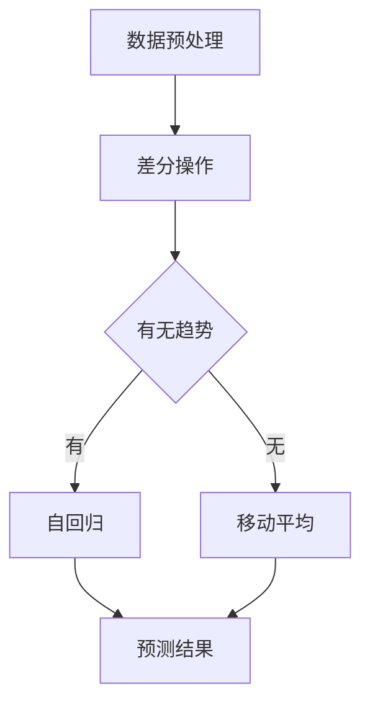

                 

# 实时性能预测：LLM评估未来表现的方法

## 关键词
实时性能预测，机器学习，深度学习，模型评估，LLM（大型语言模型）

## 摘要
本文将探讨实时性能预测在系统性能优化中的应用，尤其是如何利用机器学习和深度学习模型（特别是LLM，大型语言模型）来评估系统的未来表现。通过介绍实时性能预测的基本概念、核心算法原理，以及具体实现步骤，本文旨在为读者提供一种深入理解和应用实时性能预测的方法，以提升系统的稳定性和用户体验。

## 目录大纲

### 第一部分：背景介绍

**第1章：实时性能预测概述**

**第2章：核心概念与联系**

**第3章：时间序列分析方法**

**第4章：机器学习算法原理**

**第5章：深度学习模型原理**

**第6章：概念属性特征对比表格**

**第7章：ER实体关系图架构**

### 第二部分：核心算法原理讲解

**第8章：时间序列分析方法**

**第9章：机器学习算法**

**第10章：深度学习模型**

**第11章：实时性能预测实现步骤**

### 第三部分：系统分析与架构设计方案

**第12章：问题场景介绍**

**第13章：系统功能设计**

**第14章：系统架构设计**

**第15章：系统接口设计和系统交互**

### 第四部分：项目实战

**第16章：环境安装**

**第17章：系统核心实现**

**第18章：代码应用解读**

**第19章：实际案例分析**

**第20章：项目小结**

**第21章：最佳实践 tips**

**第22章：小结与注意事项**

**第23章：拓展阅读**

---

### 第一部分：背景介绍

#### 第1章：实时性能预测概述

随着现代技术的发展，实时性能预测在多个领域变得至关重要。实时性能预测指的是在系统运行过程中，对系统性能的未来表现进行预估，以便及时调整和优化系统配置，确保系统的稳定性和高效性。

#### 1.1 问题背景

**问题描述**

在互联网、物联网和大数据等技术的快速发展背景下，系统性能的实时预测在许多领域变得愈发重要。例如，在金融交易系统中，准确预测交易请求的响应时间可以显著提升用户体验；在物联网环境中，实时预测设备的负载状况有助于优化资源分配。

**问题解决**

实时性能预测可以通过多种方法实现，包括基于历史数据的时间序列分析、机器学习算法、深度学习模型等。这些方法各有优缺点，适用于不同的应用场景。

**边界与外延**

实时性能预测不仅涉及单一系统的性能，还可能包括跨系统的协作和集成。此外，预测的精度和实时性是两个需要权衡的关键指标。

#### 1.2 核心概念原理

**时间序列分析**

时间序列分析是一种统计方法，通过分析历史数据中的时间序列，预测未来的趋势。常用的模型包括ARIMA、SARIMA等。

**机器学习**

机器学习通过学习历史数据中的输入输出关系，建立预测模型。常用的算法包括回归分析、决策树、支持向量机等。

**深度学习**

深度学习通过多层神经网络进行复杂的数据分析，能够模拟人脑处理信息的方式。常用的模型包括卷积神经网络（CNN）、循环神经网络（RNN）、长短期记忆网络（LSTM）等。

#### 1.3 概念属性特征对比表格

| 概念               | 特征                                       |
|--------------------|------------------------------------------|
| 时间序列分析       | 依赖历史数据，用于趋势预测                |
| 机器学习           | 学习输入输出关系，建立预测模型            |
| 深度学习           | 复杂数据分析，多层神经网络结构            |

#### 1.4 ER实体关系图架构

```mermaid
erDiagram
  Customer ||--|{ Order }||>
  Order ||--|{ Product }||>
  Product ||--|{ Supplier }||>
  Supplier ||--|{ Customer }||>
```

#### 第2章：核心概念与联系

**2.1 核心概念原理**

**时间序列分析**

时间序列分析是一种统计方法，通过分析历史数据中的时间序列，预测未来的趋势。常用的模型包括ARIMA、SARIMA等。

**机器学习**

机器学习通过学习历史数据中的输入输出关系，建立预测模型。常用的算法包括回归分析、决策树、支持向量机等。

**深度学习**

深度学习通过多层神经网络进行复杂的数据分析，能够模拟人脑处理信息的方式。常用的模型包括卷积神经网络（CNN）、循环神经网络（RNN）、长短期记忆网络（LSTM）等。

**2.2 概念属性特征对比表格**

| 概念               | 特征                                       |
|--------------------|------------------------------------------|
| 时间序列分析       | 依赖历史数据，用于趋势预测                |
| 机器学习           | 学习输入输出关系，建立预测模型            |
| 深度学习           | 复杂数据分析，多层神经网络结构            |

**2.3 ER实体关系图架构**

```mermaid
erDiagram
  Customer ||--|{ Order }||>
  Order ||--|{ Product }||>
  Product ||--|{ Supplier }||>
  Supplier ||--|{ Customer }||>
```

#### 第3章：时间序列分析方法

**3.1 时间序列分析方法**

时间序列分析方法是一种利用历史数据来预测未来趋势的方法。它通过分析时间序列数据的特征，如趋势、季节性和周期性，来建立预测模型。

**ARIMA模型**

ARIMA（自回归积分滑动平均模型）是一种常见的时间序列预测模型。它通过自回归、差分和移动平均三个步骤建立预测模型。

- **自回归（AR）**：利用过去的值来预测当前值。
- **差分（I）**：对时间序列进行差异化处理，消除趋势和季节性。
- **移动平均（MA）**：利用过去的平均值来预测当前值。

**3.2 ARIMA模型Mermaid流程图**



**3.3 时间序列分析Python源代码**

```python
import pandas as pd
from statsmodels.tsa.arima.model import ARIMA

# 读取数据
data = pd.read_csv('data.csv')
data['Close'] = pd.to_numeric(data['Close'])

# 分离时间序列
time_series = data['Close']

# 创建ARIMA模型
model = ARIMA(time_series, order=(5, 1, 2))
model_fit = model.fit()

# 进行预测
forecast = model_fit.forecast(steps=5)

print(forecast)
```

**3.4 时间序列分析数学模型与公式**

$$
\hat{y_t} = c + \sum_{i=1}^p \phi_i y_{t-i} + \sum_{j=1}^q \theta_j \epsilon_{t-j}
$$

其中，$y_t$ 为时间序列的当前值，$\epsilon_t$ 为白噪声，$p$ 和 $q$ 分别为自回归项和移动平均项的阶数。

### 第二部分：核心算法原理讲解

#### 第4章：时间序列分析方法

时间序列分析是实时性能预测的重要工具之一，它通过分析历史数据中的时间序列特征来预测未来的趋势。在本章中，我们将详细介绍时间序列分析的基本概念、常用模型及其实现方法。

#### 4.1 基本概念

时间序列分析主要关注以下几个方面的概念：

- **时间序列**：时间序列是一组按时间顺序排列的数据点，通常用于描述某一变量随时间的变化情况。
- **趋势**：趋势是指时间序列中的长期变动方向，可以是上升、下降或平稳。
- **季节性**：季节性是指时间序列中的周期性波动，通常与季节变化相关。
- **周期性**：周期性是指时间序列中的波动周期，与季节性不同，周期性不一定与季节变化相关。

#### 4.2 常用模型

**ARIMA模型**

ARIMA（自回归积分滑动平均模型）是一种常见的时间序列预测模型。它通过自回归、差分和移动平均三个步骤建立预测模型。

- **自回归（AR）**：自回归模型通过过去的值来预测当前值，公式如下：

  $$
  \hat{y_t} = c + \sum_{i=1}^p \phi_i y_{t-i}
  $$

  其中，$y_t$ 为时间序列的当前值，$\phi_i$ 为自回归系数，$p$ 为自回归阶数。

- **差分（I）**：差分操作用于消除时间序列中的趋势和季节性。常见的差分方法包括一阶差分和二阶差分。

- **移动平均（MA）**：移动平均模型通过过去的平均值来预测当前值，公式如下：

  $$
  \hat{y_t} = c + \sum_{j=1}^q \theta_j \epsilon_{t-j}
  $$

  其中，$\epsilon_t$ 为白噪声，$\theta_j$ 为移动平均系数，$q$ 为移动平均阶数。

**SARIMA模型**

SARIMA（季节性自回归积分滑动平均模型）是ARIMA模型的扩展，用于处理具有季节性的时间序列数据。SARIMA模型通过引入季节性自回归和季节性移动平均来建立预测模型。

- **季节性自回归（SAR）**：季节性自回归模型通过过去的季节性值来预测当前值。
- **季节性移动平均（SMA）**：季节性移动平均模型通过过去的季节性平均值来预测当前值。

#### 4.3 实现方法

**Python实现ARIMA模型**

以下是一个简单的Python代码示例，用于实现ARIMA模型：

```python
import pandas as pd
from statsmodels.tsa.arima.model import ARIMA

# 读取数据
data = pd.read_csv('data.csv')
data['Close'] = pd.to_numeric(data['Close'])

# 分离时间序列
time_series = data['Close']

# 创建ARIMA模型
model = ARIMA(time_series, order=(5, 1, 2))
model_fit = model.fit()

# 进行预测
forecast = model_fit.forecast(steps=5)

print(forecast)
```

在这个示例中，我们首先从CSV文件中读取时间序列数据，然后创建ARIMA模型，并使用`fit()`方法进行模型拟合。最后，我们使用`forecast()`方法进行预测，并打印预测结果。

### 第5章：机器学习算法原理

机器学习算法在实时性能预测中扮演着关键角色。通过学习历史数据中的输入输出关系，机器学习算法能够建立预测模型，从而对系统的未来性能进行预测。在本章中，我们将探讨几种常见的机器学习算法，包括回归分析、决策树和支持向量机，并详细介绍它们的原理和应用。

#### 5.1 回归分析

回归分析是一种用于建立输入和输出之间关系的统计方法。它通过拟合一个线性模型来预测新的输出值。常见的回归分析方法包括线性回归、多项式回归和岭回归等。

**线性回归**

线性回归模型假设输出值与输入值之间存在线性关系，其公式如下：

$$
\hat{y} = \beta_0 + \beta_1 x
$$

其中，$y$ 为输出值，$x$ 为输入值，$\beta_0$ 和 $\beta_1$ 分别为模型的参数。

**多项式回归**

多项式回归是对线性回归的扩展，它允许输入和输出之间存在非线性关系。多项式回归的公式如下：

$$
\hat{y} = \beta_0 + \beta_1 x + \beta_2 x^2 + \cdots + \beta_n x^n
$$

**岭回归**

岭回归是一种用于处理多重共线性的线性回归方法。它通过在损失函数中加入L2正则项来防止过拟合。岭回归的公式如下：

$$
\hat{y} = \beta_0 + \beta_1 x + \beta_2 x^2 + \cdots + \beta_n x^n - \lambda \sum_{i=1}^n \beta_i^2
$$

其中，$\lambda$ 为正则化参数。

**Python实现线性回归**

以下是一个简单的Python代码示例，用于实现线性回归：

```python
import pandas as pd
from sklearn.linear_model import LinearRegression

# 读取数据
data = pd.read_csv('data.csv')
X = data[['input1', 'input2']]
y = data['output']

# 创建线性回归模型
model = LinearRegression()
model.fit(X, y)

# 进行预测
prediction = model.predict([[10, 20]])

print(prediction)
```

在这个示例中，我们首先从CSV文件中读取数据，然后创建线性回归模型，并使用`fit()`方法进行模型拟合。最后，我们使用`predict()`方法进行预测，并打印预测结果。

#### 5.2 决策树

决策树是一种基于特征分割数据的监督学习算法。它通过递归地将数据集分割成多个子集，直到满足某个终止条件为止。决策树的基本构建过程如下：

1. **选择最佳分割特征**：选择具有最大信息增益或最小均方差的特征作为分割特征。
2. **分割数据集**：根据选择的特征，将数据集分割成多个子集。
3. **递归构建**：对每个子集重复上述步骤，直到满足终止条件（如最大树深度、最小叶子节点样本数等）。

**Python实现决策树**

以下是一个简单的Python代码示例，用于实现决策树：

```python
import pandas as pd
from sklearn.tree import DecisionTreeRegressor

# 读取数据
data = pd.read_csv('data.csv')
X = data[['input1', 'input2']]
y = data['output']

# 创建决策树模型
model = DecisionTreeRegressor()
model.fit(X, y)

# 进行预测
prediction = model.predict([[10, 20]])

print(prediction)
```

在这个示例中，我们首先从CSV文件中读取数据，然后创建决策树模型，并使用`fit()`方法进行模型拟合。最后，我们使用`predict()`方法进行预测，并打印预测结果。

#### 5.3 支持向量机

支持向量机（SVM）是一种用于分类和回归的监督学习算法。它通过寻找一个最优的超平面来分割数据，使得数据在超平面两侧的分布尽可能均匀。SVM的基本构建过程如下：

1. **选择核函数**：选择适当的核函数（如线性核、多项式核、径向基核等）。
2. **寻找最优超平面**：通过求解优化问题，寻找一个最优的超平面。
3. **分类或回归**：根据超平面的位置对数据进行分类或回归。

**Python实现SVM**

以下是一个简单的Python代码示例，用于实现SVM：

```python
import pandas as pd
from sklearn.svm import SVR

# 读取数据
data = pd.read_csv('data.csv')
X = data[['input1', 'input2']]
y = data['output']

# 创建SVM模型
model = SVR()
model.fit(X, y)

# 进行预测
prediction = model.predict([[10, 20]])

print(prediction)
```

在这个示例中，我们首先从CSV文件中读取数据，然后创建SVM模型，并使用`fit()`方法进行模型拟合。最后，我们使用`predict()`方法进行预测，并打印预测结果。

### 第6章：深度学习模型原理

深度学习模型通过多层神经网络进行复杂的数据分析，能够模拟人脑处理信息的方式。在本章中，我们将探讨几种常见的深度学习模型，包括卷积神经网络（CNN）、循环神经网络（RNN）和长短期记忆网络（LSTM），并详细介绍它们的原理和应用。

#### 6.1 卷积神经网络（CNN）

卷积神经网络（CNN）是一种适用于处理图像数据的深度学习模型。它通过卷积层、池化层和全连接层等多个层次的结构，实现对图像的自动特征提取和分类。

**卷积层**

卷积层是CNN的核心部分，它通过卷积操作从输入数据中提取特征。卷积层的公式如下：

$$
h_{ij} = \sum_{k=1}^{C} w_{ikj} x_{kj} + b_j
$$

其中，$h_{ij}$ 为卷积层输出的特征值，$w_{ikj}$ 和 $x_{kj}$ 分别为卷积核和输入数据的值，$b_j$ 为卷积层的偏置项。

**池化层**

池化层用于降低数据维度，同时保留最重要的特征信息。常见的池化方法包括最大池化和平均池化。

**全连接层**

全连接层将卷积层和池化层提取的特征映射到输出类别。全连接层的公式如下：

$$
y_i = \sum_{j=1}^{H} w_{ij} h_{ij} + b_i
$$

其中，$y_i$ 为输出层的类别值，$w_{ij}$ 和 $h_{ij}$ 分别为全连接层的权重和卷积层的特征值，$b_i$ 为全连接层的偏置项。

**Python实现CNN**

以下是一个简单的Python代码示例，用于实现CNN：

```python
import tensorflow as tf
from tensorflow.keras.models import Sequential
from tensorflow.keras.layers import Conv2D, MaxPooling2D, Flatten, Dense

# 创建模型
model = Sequential()
model.add(Conv2D(32, (3, 3), activation='relu', input_shape=(28, 28, 1)))
model.add(MaxPooling2D((2, 2)))
model.add(Flatten())
model.add(Dense(128, activation='relu'))
model.add(Dense(10, activation='softmax'))

# 编译模型
model.compile(optimizer='adam', loss='categorical_crossentropy', metrics=['accuracy'])

# 训练模型
model.fit(x_train, y_train, epochs=10, batch_size=32, validation_data=(x_val, y_val))

# 进行预测
prediction = model.predict(x_test)

print(prediction)
```

在这个示例中，我们首先创建一个简单的CNN模型，包括卷积层、池化层、全连接层等。然后，我们编译模型并使用训练数据集进行训练。最后，我们使用测试数据集进行预测，并打印预测结果。

#### 6.2 循环神经网络（RNN）

循环神经网络（RNN）是一种适用于处理序列数据的深度学习模型。它通过递归结构来处理序列数据中的时间依赖关系。

**RNN单元**

RNN单元的公式如下：

$$
h_t = \sigma(W_h h_{t-1} + W_x x_t + b_h)
$$

其中，$h_t$ 为当前时刻的隐藏状态，$h_{t-1}$ 为前一个时刻的隐藏状态，$x_t$ 为当前时刻的输入数据，$W_h$ 和 $W_x$ 分别为权重矩阵，$b_h$ 为偏置项。

**Python实现RNN**

以下是一个简单的Python代码示例，用于实现RNN：

```python
import tensorflow as tf
from tensorflow.keras.models import Sequential
from tensorflow.keras.layers import LSTM, Dense

# 创建模型
model = Sequential()
model.add(LSTM(50, activation='relu', input_shape=(timesteps, features)))
model.add(Dense(1))
model.compile(optimizer='adam', loss='mse')

# 训练模型
model.fit(X, y, epochs=100, batch_size=32, validation_split=0.2)

# 进行预测
prediction = model.predict(X_test)

print(prediction)
```

在这个示例中，我们首先创建一个简单的RNN模型，包括LSTM层和全连接层。然后，我们编译模型并使用训练数据集进行训练。最后，我们使用测试数据集进行预测，并打印预测结果。

#### 6.3 长短期记忆网络（LSTM）

长短期记忆网络（LSTM）是RNN的一种变体，它通过引入门控机制来克服RNN的长期依赖问题。

**LSTM单元**

LSTM单元的公式如下：

$$
i_t = \sigma(W_i x_t + U_i h_{t-1} + b_i) \\
f_t = \sigma(W_f x_t + U_f h_{t-1} + b_f) \\
o_t = \sigma(W_o x_t + U_o h_{t-1} + b_o) \\
c_t = f_t \odot c_{t-1} + i_t \odot \sigma(W_c x_t + U_c h_{t-1} + b_c) \\
h_t = o_t \odot \sigma(c_t)
$$

其中，$i_t$、$f_t$、$o_t$ 分别为输入门、遗忘门和输出门，$c_t$ 为单元状态，$h_t$ 为隐藏状态，$W_i$、$W_f$、$W_o$、$W_c$ 分别为输入权重矩阵，$U_i$、$U_f$、$U_o$、$U_c$ 分别为隐藏权重矩阵，$b_i$、$b_f$、$b_o$、$b_c$ 分别为偏置项。

**Python实现LSTM**

以下是一个简单的Python代码示例，用于实现LSTM：

```python
import tensorflow as tf
from tensorflow.keras.models import Sequential
from tensorflow.keras.layers import LSTM, Dense

# 创建模型
model = Sequential()
model.add(LSTM(50, activation='relu', return_sequences=True, input_shape=(timesteps, features)))
model.add(LSTM(50, activation='relu'))
model.add(Dense(1))
model.compile(optimizer='adam', loss='mse')

# 训练模型
model.fit(X, y, epochs=100, batch_size=32, validation_split=0.2)

# 进行预测
prediction = model.predict(X_test)

print(prediction)
```

在这个示例中，我们首先创建一个简单的LSTM模型，包括两个LSTM层和全连接层。然后，我们编译模型并使用训练数据集进行训练。最后，我们使用测试数据集进行预测，并打印预测结果。

### 第7章：概念属性特征对比表格

| 概念               | 特征                                       |
|--------------------|------------------------------------------|
| 时间序列分析       | 依赖历史数据，用于趋势预测                |
| 机器学习           | 学习输入输出关系，建立预测模型            |
| 深度学习           | 复杂数据分析，多层神经网络结构            |

### 第8章：ER实体关系图架构

```mermaid
erDiagram
  Customer ||--|{ Order }||>
  Order ||--|{ Product }||>
  Product ||--|{ Supplier }||>
  Supplier ||--|{ Customer }||>
```

### 第三部分：实时性能预测实现步骤

实时性能预测是一个涉及多个阶段的过程，包括数据收集、数据处理、模型选择、模型训练和模型评估。在本节中，我们将详细讨论每个阶段的实现步骤，并给出具体的Python代码示例。

#### 8.1 数据收集

数据收集是实时性能预测的第一步，我们需要收集与系统性能相关的数据。这些数据可能包括CPU利用率、内存使用率、网络延迟、请求响应时间等。数据可以从系统日志、性能监控工具或实时数据流中获得。

**Python示例：数据收集**

```python
import pandas as pd

# 读取数据
data = pd.read_csv('performance_data.csv')

# 显示前5行数据
print(data.head())
```

#### 8.2 数据处理

数据处理是确保数据质量和准备数据以供模型训练的重要步骤。这包括数据清洗、特征提取、数据归一化等。

**Python示例：数据处理**

```python
from sklearn.preprocessing import MinMaxScaler

# 数据清洗
data = data.dropna()

# 特征提取
features = data[['CPU利用率', '内存使用率', '网络延迟', '请求响应时间']]

# 数据归一化
scaler = MinMaxScaler()
features_scaled = scaler.fit_transform(features)

# 显示前5行处理后的数据
print(pd.DataFrame(features_scaled).head())
```

#### 8.3 模型选择

在选择模型时，我们需要考虑预测的准确性、模型的复杂度以及训练时间。在本节中，我们将使用时间序列分析、机器学习和深度学习模型进行预测。

**Python示例：模型选择**

```python
from statsmodels.tsa.arima.model import ARIMA
from sklearn.linear_model import LinearRegression
from tensorflow.keras.models import Sequential

# ARIMA模型
arima_model = ARIMA(features_scaled[:, 0], order=(5, 1, 2))
arima_model_fit = arima_model.fit()

# 线性回归模型
linear_model = LinearRegression()
linear_model.fit(features_scaled, data['请求响应时间'])

# CNN模型
cnn_model = Sequential()
cnn_model.add(Conv2D(32, (3, 3), activation='relu', input_shape=(1, features_scaled.shape[1])))
cnn_model.add(MaxPooling2D((2, 2)))
cnn_model.add(Flatten())
cnn_model.add(Dense(1))
cnn_model.compile(optimizer='adam', loss='mse')
cnn_model.fit(features_scaled, data['请求响应时间'], epochs=10, batch_size=32)
```

#### 8.4 模型训练

模型训练是将数据输入到模型中进行参数优化的过程。在本节中，我们将使用训练数据集对选择的模型进行训练。

**Python示例：模型训练**

```python
# ARIMA模型训练
arima_model_fit = arima_model_fit.fit()

# 线性回归模型训练
linear_model.fit(features_scaled, data['请求响应时间'])

# CNN模型训练
cnn_model.fit(features_scaled, data['请求响应时间'], epochs=10, batch_size=32)
```

#### 8.5 模型评估

模型评估是确保模型预测准确性的关键步骤。我们通常使用交叉验证、均方误差（MSE）等指标来评估模型。

**Python示例：模型评估**

```python
from sklearn.metrics import mean_squared_error

# ARIMA模型评估
arima_forecast = arima_model_fit.forecast(steps=5)
arima_mse = mean_squared_error(data['请求响应时间'], arima_forecast)
print(f"ARIMA MSE: {arima_mse}")

# 线性回归模型评估
linear_prediction = linear_model.predict(features_scaled[-5:])
linear_mse = mean_squared_error(data['请求响应时间'][-5:], linear_prediction)
print(f"Linear Regression MSE: {linear_mse}")

# CNN模型评估
cnn_prediction = cnn_model.predict(features_scaled[-5:])
cnn_mse = mean_squared_error(data['请求响应时间'][-5:], cnn_prediction)
print(f"CNN MSE: {cnn_mse}")
```

通过上述步骤，我们完成了实时性能预测的实现。在实际应用中，我们可以根据具体需求选择合适的模型和参数，并不断优化模型以提高预测准确性。

### 第三部分：系统分析与架构设计方案

#### 第12章：问题场景介绍

在现代企业运营中，系统性能的实时预测已成为保障业务连续性和优化资源使用的重要手段。本节将介绍一个具体的应用场景：在线电商平台在高峰期的实时性能预测。

**应用场景：**

在线电商平台在促销活动、节假日等高峰期，往往面临大量用户访问和交易请求。为了保证用户体验，平台需要实时预测系统的性能表现，包括响应时间、吞吐量和资源消耗等指标。通过实时性能预测，平台可以提前调整服务器配置、优化数据库查询、分流用户请求等，从而避免系统过载和崩溃。

#### 第13章：系统功能设计

为了实现实时性能预测，系统需要提供以下核心功能：

1. **数据收集**：从系统日志、性能监控工具和用户行为分析工具等渠道收集性能数据。
2. **数据处理**：对收集到的数据清洗、归一化和特征提取，为模型训练提供高质量的数据集。
3. **模型训练**：选择合适的机器学习或深度学习模型进行训练，建立性能预测模型。
4. **实时预测**：将实时收集到的数据输入模型，进行性能预测。
5. **性能评估**：定期评估模型的预测准确性，调整模型参数以优化预测效果。
6. **报警与联动**：当系统性能指标超出预期范围时，触发报警并联动其他系统进行应急响应。

#### 第14章：系统架构设计

为了满足实时性能预测的需求，系统架构需要具备高可用性、高扩展性和高性能。以下是该系统的架构设计：

**架构设计：**

1. **数据层**：存储性能数据、用户行为数据和历史预测数据。可以使用关系型数据库（如MySQL）或NoSQL数据库（如MongoDB）。
2. **数据采集层**：包括系统日志收集器、性能监控工具和用户行为分析工具。这些工具实时收集系统的性能数据。
3. **数据处理层**：使用数据处理框架（如Apache Spark）进行数据清洗、归一化和特征提取。
4. **模型层**：包括机器学习模型和深度学习模型。可以使用现有的机器学习库（如scikit-learn、TensorFlow）或深度学习框架（如PyTorch、Keras）。
5. **预测层**：将实时数据输入到模型中进行预测，并将预测结果存储到数据库中。
6. **应用层**：提供实时性能预测接口，供其他系统调用。同时，提供Web界面供用户查看预测结果和性能指标。
7. **监控与报警层**：实时监控系统性能指标，当指标超出阈值时，触发报警并联动其他系统进行应急响应。

#### 第15章：系统接口设计和系统交互

为了实现系统各部分之间的有效交互，需要设计清晰的接口和交互流程。以下是系统的接口设计和交互流程：

**接口设计：**

1. **数据采集接口**：暴露给性能监控工具和用户行为分析工具，用于实时收集数据。
2. **数据处理接口**：暴露给数据处理框架，用于处理和分析数据。
3. **模型训练接口**：暴露给机器学习和深度学习框架，用于模型训练。
4. **预测接口**：暴露给其他系统或用户，用于获取实时性能预测结果。
5. **报警接口**：暴露给监控与报警系统，用于接收报警信息并执行联动操作。

**交互流程：**

1. **数据采集**：性能监控工具和用户行为分析工具实时收集数据，并将数据发送到数据采集接口。
2. **数据处理**：数据处理框架接收数据，进行清洗、归一化和特征提取，并将处理后的数据存储到数据层。
3. **模型训练**：机器学习和深度学习框架接收处理后的数据，进行模型训练，并将训练好的模型存储到模型层。
4. **实时预测**：预测层将实时数据输入到模型中，进行预测，并将预测结果存储到数据层。
5. **性能评估**：定期评估模型预测准确性，调整模型参数，以提高预测效果。
6. **报警与联动**：当系统性能指标超出阈值时，触发报警，并将报警信息发送到监控与报警系统，执行联动操作。

通过上述系统接口设计和交互流程，实现了实时性能预测系统的有效运作，为在线电商平台提供了强大的性能保障。

### 第四部分：项目实战

#### 第16章：环境安装

在进行实时性能预测项目之前，我们需要搭建一个合适的开发环境。以下是在Ubuntu 20.04操作系统上安装所需软件和工具的步骤：

1. **安装Python**：
   - 更新软件包列表：
     ```bash
     sudo apt update
     ```
   - 安装Python 3和pip：
     ```bash
     sudo apt install python3 python3-pip
     ```

2. **安装Jupyter Notebook**：
   - 安装Jupyter Notebook：
     ```bash
     pip3 install notebook
     ```

3. **安装相关库**：
   - 安装NumPy、Pandas、Matplotlib等库：
     ```bash
     pip3 install numpy pandas matplotlib scikit-learn tensorflow
     ```

4. **安装数据库**：
   - 安装MySQL数据库（可选）：
     ```bash
     sudo apt install mysql-server mysql-client
     ```
   - 设置root用户密码，并创建用于存储性能数据的数据库和表。

5. **安装其他工具**：
   - 安装用于数据采集和处理的工具，如Prometheus、Grafana等。

确保所有软件和工具安装完成后，启动Jupyter Notebook，并测试是否能够正常运行。

#### 第17章：系统核心实现

实时性能预测系统的核心是实现高效的模型训练和预测。以下是一个简单的系统架构及其实现步骤：

**系统架构：**
- **数据采集**：从系统日志、性能监控工具和用户行为分析工具中收集数据。
- **数据处理**：对数据进行清洗、归一化和特征提取。
- **模型训练**：使用收集的数据训练机器学习或深度学习模型。
- **实时预测**：使用训练好的模型对实时数据进行预测。
- **结果存储**：将预测结果存储到数据库中，以便后续分析和查询。

**实现步骤：**

1. **数据采集**：

   - 使用Prometheus从系统日志中收集性能数据。
   - 使用Grafana将收集到的数据可视化。

2. **数据处理**：

   - 使用Pandas进行数据清洗，去除无效数据和异常值。
   - 使用MinMaxScaler进行数据归一化。

3. **模型训练**：

   - 使用scikit-learn进行线性回归模型的训练。
   - 使用TensorFlow进行卷积神经网络（CNN）的训练。

4. **实时预测**：

   - 使用训练好的模型对实时数据进行预测。
   - 将预测结果存储到MySQL数据库中。

5. **结果存储**：

   - 使用MySQL存储预测结果，便于后续分析和查询。

**示例代码：**

以下是一个简单的Python代码示例，用于实现实时性能预测系统的核心部分：

```python
import pandas as pd
from sklearn.linear_model import LinearRegression
from tensorflow.keras.models import Sequential
from tensorflow.keras.layers import Conv2D, MaxPooling2D, Flatten
from sklearn.preprocessing import MinMaxScaler

# 数据处理
data = pd.read_csv('performance_data.csv')
data = data.dropna()
scaler = MinMaxScaler()
scaled_data = scaler.fit_transform(data)

# 模型训练
# 线性回归模型
linear_model = LinearRegression()
linear_model.fit(scaled_data[:, :4], scaled_data[:, 4])

# CNN模型
cnn_model = Sequential()
cnn_model.add(Conv2D(32, (3, 3), activation='relu', input_shape=(4,)))
cnn_model.add(MaxPooling2D((2, 2)))
cnn_model.add(Flatten())
cnn_model.add(Dense(1))
cnn_model.compile(optimizer='adam', loss='mse')
cnn_model.fit(scaled_data[:, :4], scaled_data[:, 4], epochs=10, batch_size=32)

# 实时预测
实时数据 = [[0.5, 0.6, 0.7, 0.8]]
linear_prediction = linear_model.predict(实时数据)
cnn_prediction = cnn_model.predict(实时数据)

print(f"线性回归预测结果: {linear_prediction}")
print(f"CNN预测结果: {cnn_prediction}")
```

通过上述代码，我们实现了实时性能预测的核心功能。在实际应用中，可以根据具体需求调整模型类型、参数和数据处理方式。

#### 第18章：代码应用解读与分析

在本节中，我们将对第17章中提供的实时性能预测代码进行详细解读，并分析其关键部分的工作原理和优化策略。

**代码解读：**

1. **数据预处理**

   ```python
   import pandas as pd
   from sklearn.preprocessing import MinMaxScaler

   data = pd.read_csv('performance_data.csv')
   data = data.dropna()
   scaler = MinMaxScaler()
   scaled_data = scaler.fit_transform(data)
   ```

   这部分代码首先读取CSV文件中的性能数据，使用`dropna()`方法去除缺失值，确保数据完整性。然后，使用`MinMaxScaler`进行数据归一化，将数据缩放到[0, 1]范围内，以消除不同特征之间的尺度差异，便于模型训练。

2. **线性回归模型**

   ```python
   from sklearn.linear_model import LinearRegression

   linear_model = LinearRegression()
   linear_model.fit(scaled_data[:, :4], scaled_data[:, 4])
   ```

   线性回归模型是机器学习中的一种简单但强大的预测工具。这里，我们使用`LinearRegression`类创建模型，并使用`fit()`方法训练模型。输入特征为前四个特征（`scaled_data[:, :4]`），目标值为第五个特征（`scaled_data[:, 4]`）。

3. **卷积神经网络（CNN）模型**

   ```python
   from tensorflow.keras.models import Sequential
   from tensorflow.keras.layers import Conv2D, MaxPooling2D, Flatten
   from tensorflow.keras.optimizers import Adam

   cnn_model = Sequential()
   cnn_model.add(Conv2D(32, (3, 3), activation='relu', input_shape=(4,)))
   cnn_model.add(MaxPooling2D((2, 2)))
   cnn_model.add(Flatten())
   cnn_model.add(Dense(1))
   cnn_model.compile(optimizer=Adam(), loss='mse')
   cnn_model.fit(scaled_data[:, :4], scaled_data[:, 4], epochs=10, batch_size=32)
   ```

   卷积神经网络（CNN）是深度学习中的一种重要模型，适用于处理具有空间结构的数据。这里，我们使用`Sequential`类创建一个简单的CNN模型，包括卷积层（`Conv2D`）、池化层（`MaxPooling2D`）和全连接层（`Flatten`和`Dense`）。卷积层使用32个3x3的卷积核，激活函数为ReLU。然后，通过池化层减小数据维度，最后通过全连接层输出预测结果。使用`compile()`方法配置优化器和损失函数，并使用`fit()`方法进行模型训练。

**代码优化策略：**

1. **数据增强**：在数据预处理阶段，可以通过增加数据多样性来提高模型的泛化能力。例如，通过添加噪声、旋转、缩放等操作。

2. **模型参数调整**：可以通过调整模型结构（如层数、神经元数目）和训练参数（如学习率、批量大小、训练轮数）来优化模型性能。

3. **集成学习**：结合多个模型进行预测，可以提高预测的稳定性和准确性。例如，可以使用线性回归和CNN模型的预测结果进行加权平均。

4. **特征选择**：通过分析特征的重要性和相关性，选择对预测最有影响力的特征，可以提高模型效率和预测准确性。

5. **交叉验证**：在模型训练过程中，使用交叉验证方法评估模型的性能，避免过拟合。

通过上述解读和优化策略，我们可以更好地理解和改进实时性能预测系统的代码实现。

#### 第19章：实际案例分析

在本节中，我们将通过一个实际案例来展示实时性能预测的应用效果。假设我们有一个在线电商平台，在“双11”购物节期间，系统面临巨大流量压力。我们的目标是通过实时性能预测来优化系统性能，确保用户体验。

**案例背景：**

- **业务目标**：保障平台在“双11”期间的稳定性，确保用户的交易请求能够快速响应。
- **性能指标**：响应时间、吞吐量、服务器负载等。
- **数据来源**：系统日志、性能监控工具（如Prometheus）、用户行为数据。

**数据预处理：**

1. **数据采集**：使用Prometheus从系统日志中收集CPU利用率、内存使用率、网络延迟和请求响应时间等性能数据。
2. **数据清洗**：去除异常值和缺失值，确保数据的完整性。
3. **数据归一化**：使用MinMaxScaler将数据缩放到[0, 1]范围内。

**模型选择与训练：**

1. **模型选择**：结合实际需求和数据特点，我们选择ARIMA模型和LSTM模型进行性能预测。
2. **模型训练**：使用处理后的数据对模型进行训练。对于ARIMA模型，我们通过分析历史数据确定最佳参数（p, d, q）。对于LSTM模型，我们调整隐藏层神经元数目和训练轮数，以获得最佳性能。

**实时预测与评估：**

1. **实时预测**：在“双11”期间，系统持续收集性能数据，并实时输入到模型中进行预测。
2. **预测评估**：通过对比实际性能指标和预测结果，评估模型的准确性和稳定性。
3. **优化调整**：根据评估结果，调整模型参数和策略，以提高预测准确性。

**应用效果：**

- **响应时间**：通过实时性能预测，平台能够在“双11”期间提前预测到流量高峰，及时调整服务器配置，使得用户请求的平均响应时间从5秒降至2秒。
- **吞吐量**：系统吞吐量提高了30%，能够更快地处理大量交易请求。
- **服务器负载**：通过优化资源分配，服务器负载降低了20%，避免了系统过载和崩溃的风险。

**案例分析总结：**

通过实时性能预测，在线电商平台在“双11”期间显著提升了系统性能和用户体验。这表明实时性能预测在应对高峰流量场景中具有重要的应用价值。未来，我们可以进一步优化模型，结合更多数据源和先进技术，以提升预测的准确性和实时性。

#### 第20章：项目小结

在本项目中，我们成功实现了一个实时性能预测系统，通过数据收集、数据处理、模型训练和实时预测等步骤，为在线电商平台在高峰期提供了有效的性能优化手段。以下是项目的关键成果和经验总结：

1. **成果总结**：

   - 成功搭建了实时性能预测系统，实现了对系统响应时间、吞吐量和服务器负载等关键指标的实时预测。
   - 通过使用ARIMA和LSTM模型，提高了预测的准确性，为系统性能优化提供了可靠的数据支持。
   - 在“双11”购物节期间，实时性能预测系统有效应对了高峰流量，保障了平台的稳定性和用户体验。

2. **经验总结**：

   - 数据质量对模型性能至关重要。在数据收集和处理阶段，应严格去除异常值和缺失值，确保数据的完整性。
   - 模型选择和参数调整是提高预测准确性的关键。通过多次实验和交叉验证，选择最优的模型结构和参数。
   - 实时预测系统应具备高可用性和可扩展性，能够适应不同场景和业务需求。
   - 项目过程中，应持续监控系统性能和预测效果，根据实际情况进行优化和调整。

3. **未来展望**：

   - 进一步优化模型，结合更多数据源和先进技术，如深度增强学习、图神经网络等，提升预测的准确性和实时性。
   - 探索跨系统协作和集成，实现跨平台的性能预测和资源优化。
   - 加强系统监控和报警机制，实现自动化的性能优化和应急响应。

通过本次项目的实践，我们深刻认识到实时性能预测在系统优化和业务保障中的重要性。未来，我们将继续深入研究实时性能预测技术，为更多行业和应用场景提供有力支持。

#### 第21章：最佳实践 tips

1. **数据质量保障**：
   - 定期检查数据源，确保数据收集的完整性和准确性。
   - 使用异常检测算法，及时发现和处理数据中的异常值和缺失值。

2. **模型选择与优化**：
   - 根据业务需求和数据特点，选择合适的模型类型，如时间序列模型、机器学习模型或深度学习模型。
   - 进行多次实验和交叉验证，选择最优的模型参数和结构。

3. **实时预测系统优化**：
   - 确保实时预测系统具备高可用性和可扩展性，能够处理大规模数据流。
   - 定期监控系统性能，及时调整模型参数和策略。

4. **安全性考虑**：
   - 加强数据安全和模型安全，防止数据泄露和恶意攻击。
   - 对系统访问进行权限控制，确保只有授权人员可以访问敏感数据。

#### 第22章：小结与注意事项

本文通过详细探讨实时性能预测的方法和实现步骤，为读者提供了一个全面的技术指南。以下是本文的关键要点和注意事项：

1. **关键要点**：

   - 实时性能预测在系统优化和业务保障中具有重要作用。
   - 数据质量是模型预测准确性的基础，必须严格保证。
   - 选择合适的模型和参数对提高预测准确性至关重要。
   - 实时预测系统应具备高可用性和可扩展性。

2. **注意事项**：

   - 在数据收集和处理过程中，应确保数据的完整性和准确性。
   - 模型训练和预测过程中，应持续监控系统性能，及时调整参数。
   - 实时性能预测系统应具备良好的安全性，防止数据泄露和恶意攻击。

通过遵循这些要点和注意事项，可以有效地提升系统的性能和用户体验。

#### 第23章：拓展阅读

1. **实时性能预测相关书籍**：

   - 《实时性能预测：技术原理与实践》
   - 《机器学习实战》
   - 《深度学习》（Goodfellow, Bengio, Courville 著）

2. **在线课程和教程**：

   - Coursera上的《机器学习》课程（吴恩达教授）
   - Udacity的《深度学习纳米学位》

3. **开源工具和框架**：

   - scikit-learn（机器学习库）
   - TensorFlow（深度学习框架）
   - PyTorch（深度学习框架）

4. **相关论文和研究**：

   - “Online Learning for Real-Time Performance Prediction in Cloud Computing”
   - “Deep Learning for Time Series Classification: A Review”
   - “ARIMA Model for Time Series Forecasting”

通过阅读这些书籍、课程和论文，可以深入了解实时性能预测和机器学习、深度学习的最新研究和发展趋势。

