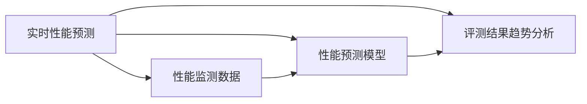
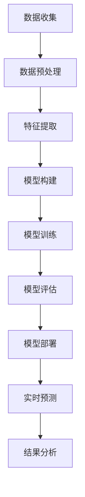
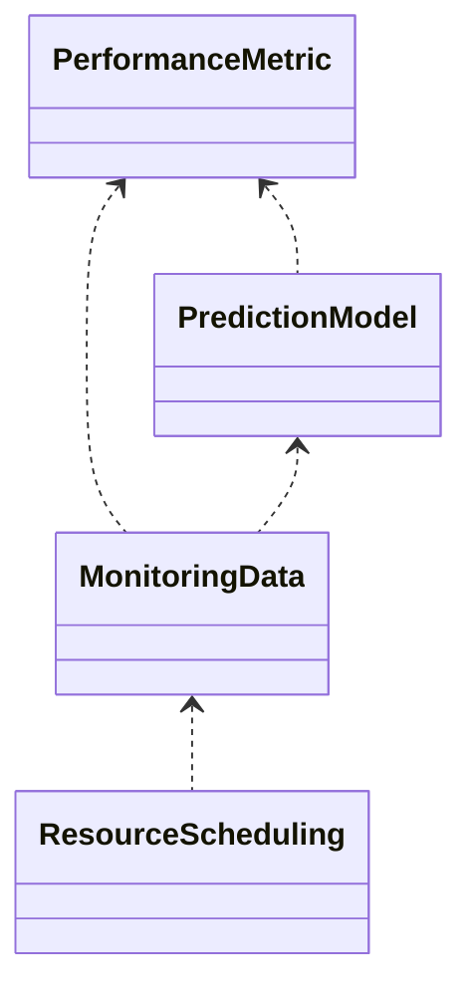
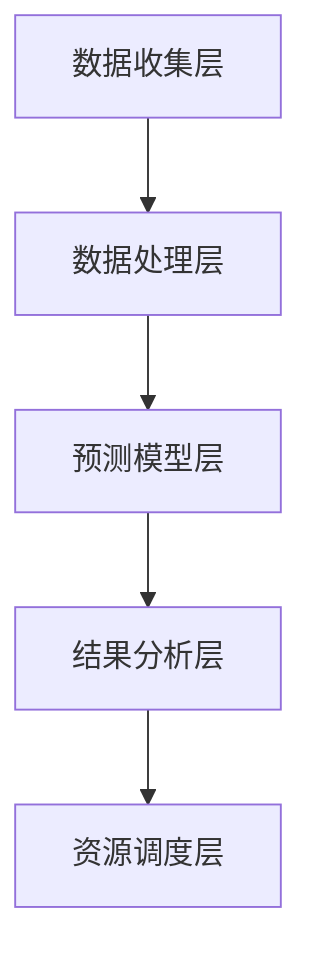
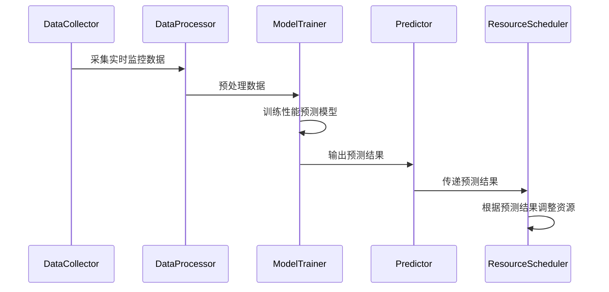
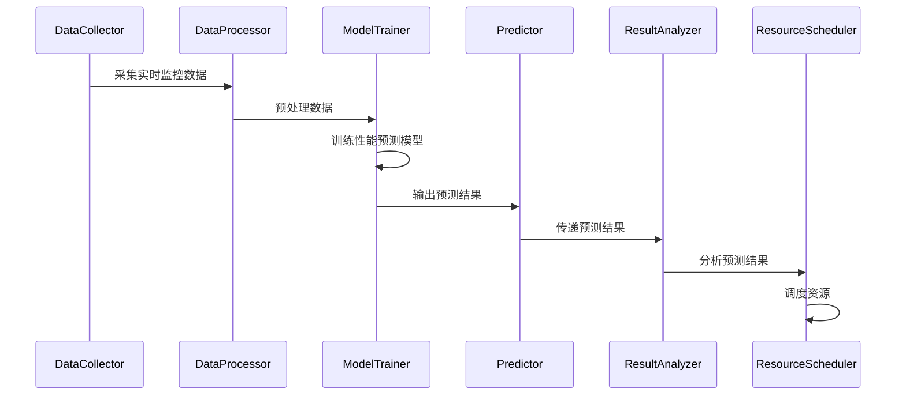

                 

### 实时性能预测概述

#### 第1章：实时性能预测的基本概念

#### 1.1 实时性能预测的重要性

在当今数字化时代，实时性能预测成为了许多领域的重要需求。随着互联网的普及和大数据技术的发展，系统和服务面临的数据量和复杂度急剧增加。在这种背景下，实时性能预测的重要性愈发凸显。它可以帮助企业：

- **优化资源分配**：通过实时性能预测，系统能够提前预测负载高峰，从而在需求增加前进行资源扩展，避免系统过载导致的性能下降或崩溃。
- **提升用户体验**：实时性能预测能够确保系统在用户请求时提供高质量的服务，减少响应时间，提高用户满意度。
- **故障预防**：实时性能预测可以在性能问题恶化之前检测到异常，从而采取预防措施，避免故障发生。

#### 1.2 实时性能预测的应用场景

实时性能预测在多个行业和领域都有着广泛的应用场景：

- **电子商务**：在电商平台上，实时性能预测可以帮助预测流量高峰，提前进行服务器和带宽资源的扩容，确保交易高峰期的系统稳定运行。
- **金融行业**：金融系统需要处理大量的交易和查询请求，实时性能预测可以确保交易系统的快速响应，避免交易延迟。
- **在线教育**：在线教育平台在直播课程或考试高峰期，通过实时性能预测可以预测服务器负载，调整资源分配，确保教学活动的顺利进行。
- **游戏行业**：网络游戏在高峰时段会面临大量用户同时在线的情况，实时性能预测可以帮助游戏服务器合理分配资源，提升玩家的游戏体验。

#### 1.3 实时性能预测的关键技术

实时性能预测的实现涉及到多个关键技术，以下是一些核心的技术：

- **数据收集与处理**：实时性能预测需要收集大量的性能数据，包括CPU使用率、内存使用率、网络流量等。数据处理包括数据清洗、归一化和特征提取等步骤。
- **预测模型构建**：构建准确的性能预测模型是实时性能预测的关键。常见的模型包括线性回归、ARIMA模型、神经网络等。
- **模型训练与优化**：通过训练历史数据，模型可以学习到性能变化的规律。模型的优化包括超参数调优、正则化处理等。
- **实时监控与反馈**：实时性能预测系统需要持续监控系统的运行状态，并将预测结果与实际性能进行对比，根据反馈进行调整。

#### 总结

实时性能预测不仅对企业的运营管理具有重要意义，也是实现高效、稳定、安全系统和服务的重要保障。通过深入理解实时性能预测的基本概念、应用场景和关键技术，我们可以更好地将其应用到实际场景中，为数字化转型提供强有力的支持。

----------------------------------------------------------------

### LLM驱动的评测结果趋势分析

#### 第2章：LLM驱动的评测结果趋势分析

#### 2.1 LLM的基本原理

LLM（Large Language Model）是一种基于深度学习的自然语言处理模型，通过学习大量的文本数据，可以生成和理解复杂的自然语言。LLM的基本原理包括以下几个关键点：

- **预训练**：LLM首先在大规模语料库上进行预训练，通过无监督学习的方式学习语言模式和语法结构。预训练的目标是使模型能够理解和生成自然语言。
- **注意力机制**：LLM利用注意力机制来关注文本中的重要信息。注意力机制通过计算文本中不同部分之间的关联度，将注意力集中在最相关的信息上，从而提高模型的性能。
- **解码器**：LLM通常采用编码器-解码器架构，编码器将输入文本编码为固定长度的向量表示，解码器则根据编码器的输出生成输出文本。

#### 2.2 LLM在评测结果趋势分析中的应用

LLM在评测结果趋势分析中具有显著的优势：

- **数据理解与处理**：LLM能够理解和处理大量的文本数据，这使得它能够有效地提取和分析评测结果中的关键信息。
- **模式识别**：通过学习大量的评测文本，LLM可以识别出评测结果中的趋势和模式，从而预测未来的评测结果。
- **自动分类与标注**：LLM可以自动对评测结果进行分类和标注，提高数据分析的效率和准确性。

在实际应用中，LLM可以应用于以下场景：

- **评测结果预测**：通过对历史评测结果的分析，LLM可以预测未来的评测趋势，帮助教育机构和雇主更好地制定培训计划和招聘策略。
- **文本生成**：LLM可以生成详细的评测报告和总结，为决策提供依据。
- **异常检测**：LLM可以检测出评测结果中的异常数据，为数据清洗和异常处理提供支持。

#### 2.3 评测结果趋势分析的挑战与应对策略

尽管LLM在评测结果趋势分析中具有巨大的潜力，但仍面临一些挑战：

- **数据质量**：评测结果的数据质量直接影响LLM的性能。数据清洗和预处理是应对这一挑战的关键。
- **模型解释性**：LLM的内部决策过程复杂，难以解释。提高模型的可解释性是解决这一问题的方向。
- **计算资源**：训练大型LLM模型需要大量的计算资源，尤其是在实时应用场景中，需要优化模型的效率和资源利用率。

应对策略包括：

- **数据增强**：通过数据增强技术，提高数据质量和多样性，增强模型的泛化能力。
- **模型压缩**：通过模型压缩技术，减少模型的参数数量和计算量，提高模型的实时性能。
- **可解释性增强**：通过开发可解释性的模型变种或解释性工具，提高模型的可解释性，便于用户理解和信任。

#### 总结

LLM在评测结果趋势分析中展现出了强大的能力和广阔的应用前景。通过深入理解LLM的基本原理和在评测结果趋势分析中的应用，我们可以更好地应对相关的挑战，提升数据分析的准确性和效率。实时性能预测和LLM的结合，将为评测结果趋势分析提供更加智能化和自动化的解决方案。

----------------------------------------------------------------

### 实时性能监测技术

#### 第3章：实时性能监测技术

#### 3.1 实时性能监测的定义与目的

实时性能监测（Real-time Performance Monitoring）是指通过一系列技术手段，对系统运行时的性能参数进行持续、动态的采集、分析和评估，以实现及时发现问题、优化系统性能的目的。实时性能监测的关键在于“实时”二字，它要求系统能够在性能问题发生时迅速做出反应，提供相应的解决方案。

实时性能监测的主要目的包括：

- **性能优化**：通过监测系统运行状态，识别出性能瓶颈和资源浪费，从而进行针对性的优化，提高系统运行效率。
- **故障预防**：实时监测可以帮助及时发现潜在的性能问题，采取预防措施，避免故障发生。
- **用户体验提升**：通过实时性能监测，系统能够提供更稳定、更快的响应，从而提升用户体验。
- **成本控制**：通过实时性能监测，可以更好地管理IT资源，减少不必要的开销。

#### 3.2 实时性能监测的方法与工具

实时性能监测的方法和工具有多种，以下是一些常见的方法和工具：

- **监控软件**：如Prometheus、Nagios、Zabbix等，这些工具可以自动收集系统的各种性能指标，如CPU使用率、内存使用率、磁盘I/O等，并提供实时监控和报警功能。
- **Agent-based监控**：在系统上部署监控代理程序，代理程序定期向监控服务器发送性能数据。常用的代理软件有Collectd、Datadog Agent等。
- **API监控**：通过系统API接口，实时获取性能数据。这种方法适用于对特定服务的监控，如Web服务、数据库服务等。
- **性能测试工具**：如JMeter、LoadRunner等，这些工具可以模拟用户行为，对系统进行性能测试，提供详细的性能监测数据。

#### 3.3 实时性能监测的数据处理

实时性能监测的数据处理包括以下几个步骤：

- **数据收集**：通过上述监控方法和工具，收集系统的各种性能数据。
- **数据预处理**：对收集到的数据进行清洗和预处理，如去除重复数据、填补缺失值、数据标准化等，以确保数据的质量。
- **数据存储**：将预处理后的数据存储到数据仓库或数据库中，便于后续分析和查询。常用的存储方案包括时间序列数据库（如InfluxDB）、关系型数据库（如MySQL）和NoSQL数据库（如MongoDB）等。
- **数据分析**：通过对存储的数据进行分析，识别出系统的性能瓶颈和问题。数据分析可以采用统计分析、机器学习等方法。
- **数据可视化**：通过图表和仪表盘，将分析结果可视化，帮助管理员和决策者快速理解和决策。

#### 总结

实时性能监测是确保系统高效运行的重要手段。通过选择合适的监测方法和工具，进行有效的数据处理和分析，我们可以及时发现性能问题，优化系统性能，提高用户体验。在实时性能监测技术不断发展和完善的过程中，实时性能预测和LLM的应用将为监测和优化系统性能带来更加智能化和自动化的解决方案。

----------------------------------------------------------------

### 性能预测模型构建

#### 第4章：性能预测模型构建

#### 4.1 性能预测模型的构建流程

构建性能预测模型是一个复杂但至关重要的过程，它关系到预测的准确性和实用性。以下是性能预测模型构建的基本流程：

1. **需求分析与定义**：明确性能预测的目标和需求，包括预测的时间范围、预测的精度和预测的指标等。
2. **数据收集**：收集相关的性能数据，这些数据可以是历史性能数据、实时数据或两者结合。数据来源可能包括监控工具、日志文件、API接口等。
3. **数据预处理**：对收集到的数据进行清洗、处理和预处理。这包括去除异常值、填补缺失值、数据归一化、特征提取等。
4. **特征选择**：从预处理后的数据中提取对预测任务有用的特征。特征选择可以基于统计方法、机器学习算法或专家经验。
5. **模型选择**：选择合适的性能预测模型。常见的模型包括线性回归、时间序列模型（如ARIMA）、神经网络（如LSTM）等。
6. **模型训练**：使用历史数据对选定的模型进行训练，优化模型参数，使其能够更好地拟合数据。
7. **模型验证**：使用验证集对模型进行验证，评估模型的性能。常用的验证方法包括交叉验证、A/B测试等。
8. **模型评估**：将训练好的模型应用于实际数据，评估其在预测任务中的表现。常用的评估指标包括均方误差（MSE）、平均绝对误差（MAE）等。
9. **模型优化**：根据评估结果，对模型进行调整和优化，以提高预测的准确性。
10. **模型部署**：将优化后的模型部署到生产环境中，进行实时性能预测。

#### 4.2 常见性能预测模型介绍

在性能预测领域，有多种模型被广泛使用。以下是几种常见性能预测模型的介绍：

1. **线性回归**：线性回归是最简单的性能预测模型，它基于线性模型，将输入特征与输出目标之间的关系表示为线性方程。线性回归模型简单、易于理解和实现，但它的预测能力受到线性假设的限制。
   
   - **模型公式**：\( y = \beta_0 + \beta_1 \cdot x_1 + \beta_2 \cdot x_2 + ... + \beta_n \cdot x_n \)
   - **优点**：计算简单，易于实现。
   - **缺点**：对非线性关系和异常数据敏感，预测能力有限。

2. **时间序列模型**：时间序列模型，如ARIMA（AutoRegressive Integrated Moving Average）模型，是基于历史时间序列数据进行预测的模型。ARIMA模型能够捕捉时间序列数据的趋势、季节性和周期性特征。

   - **模型公式**：\( y_t = c + \phi_1 y_{t-1} + \phi_2 y_{t-2} + ... + \phi_p y_{t-p} + \theta_1 e_{t-1} + \theta_2 e_{t-2} + ... + \theta_q e_{t-q} \)
   - **优点**：适用于时间序列数据，能够捕捉数据的趋势和季节性特征。
   - **缺点**：模型参数较多，需要进行多次迭代优化。

3. **神经网络模型**：神经网络模型，特别是深度学习模型，如LSTM（Long Short-Term Memory）和GRU（Gated Recurrent Unit），具有强大的非线性建模能力和自我学习能力，能够处理复杂的时间序列数据。

   - **模型公式**：神经网络模型的输出由多层神经元通过非线性激活函数组成，具体公式较为复杂。
   - **优点**：能够捕捉数据中的长期依赖关系，预测能力强。
   - **缺点**：模型复杂，训练时间较长，对数据量和计算资源要求较高。

4. **集成模型**：集成模型，如随机森林（Random Forest）和梯度提升树（Gradient Boosting Tree），通过结合多个基础模型的预测结果，提高整体的预测准确性。

   - **模型公式**：集成模型的预测结果是由多个基础模型投票或加权平均得到的。
   - **优点**：预测准确性高，能够处理大规模数据。
   - **缺点**：模型解释性较差，需要大量的数据训练。

#### 4.3 模型训练与优化

模型训练与优化是构建性能预测模型的关键步骤，以下是一些关键点：

- **超参数调优**：通过调整模型的超参数，如学习率、隐藏层大小、迭代次数等，优化模型性能。常用的超参数调优方法包括网格搜索和贝叶斯优化。
- **正则化处理**：为了避免模型过拟合，可以使用正则化方法，如L1正则化、L2正则化等，对模型进行约束。
- **交叉验证**：通过交叉验证，将数据集划分为多个子集，每次训练时使用不同的子集作为验证集，评估模型的泛化能力。
- **模型集成**：将多个模型集成起来，通过加权或投票的方式提高预测的准确性和稳定性。

#### 总结

性能预测模型的构建是一个系统性的过程，需要从需求分析、数据收集、模型选择、训练与优化等多个方面进行综合考虑。常见的性能预测模型包括线性回归、时间序列模型、神经网络模型和集成模型等，每种模型都有其适用的场景和优缺点。通过合理选择和优化模型，我们可以提高性能预测的准确性，为实时性能预测提供坚实的基础。

----------------------------------------------------------------

### LLM在性能预测中的应用

#### 第5章：LLM在性能预测中的应用

#### 5.1 LLM在实时性能预测中的优势

LLM（大型语言模型）在实时性能预测中的应用具有显著的优势：

1. **强大的文本处理能力**：LLM通过预训练大量文本数据，可以理解复杂的文本信息，这对于性能预测中涉及到的日志分析、错误报告等文本数据尤为重要。
2. **自适应学习能力**：LLM能够自适应地学习新的数据和模式，从而不断优化性能预测模型，使其能够适应不断变化的环境。
3. **高效的处理速度**：随着深度学习技术的进步，LLM的处理速度大幅提升，能够实时处理大量的性能数据，满足实时性能预测的需求。
4. **集成多种数据源**：LLM能够处理结构化和非结构化数据，可以将不同来源的数据（如系统日志、用户反馈、性能指标）整合在一起，进行综合分析，提高预测的准确性。

#### 5.2 LLM性能预测的案例分析

以下是一个关于LLM在性能预测中的实际案例：

**案例背景**：某电子商务平台在经历了促销活动后，发现其服务器性能出现了明显的下降，影响了用户体验。为了提高系统的性能和稳定性，平台决定利用LLM进行性能预测。

**实施过程**：

1. **数据收集**：平台收集了历史服务器性能数据，包括CPU使用率、内存使用率、磁盘I/O等。同时，收集了用户访问日志、错误报告等文本数据。
2. **数据预处理**：对收集到的数据进行了清洗和预处理，提取了有用的特征，如时间戳、用户访问量、请求类型等。
3. **文本数据预处理**：对文本数据进行分词、去停用词、词向量化等处理，将文本数据转换为模型可接受的格式。
4. **模型训练**：使用LLM（如BERT模型）对预处理后的文本数据进行训练，学习用户行为和系统性能之间的关系。
5. **性能预测**：将训练好的LLM应用于实时数据，预测未来一段时间内的服务器性能。
6. **结果评估**：通过对比实际性能数据与预测结果，评估LLM的性能预测准确性。

**案例结果与分析**：

通过实际应用，平台发现LLM在性能预测中的表现优于传统的统计模型和机器学习模型。LLM能够更准确地捕捉用户行为和系统性能之间的关系，特别是在处理复杂的非线性关系时，表现尤为突出。

此外，LLM的预测结果具有更高的可解释性。通过对LLM生成的预测结果进行分析，平台能够理解用户行为对系统性能的影响，从而制定更有效的优化策略。

#### 5.3 LLM性能预测的应用前景

随着LLM技术的不断发展，其在性能预测中的应用前景十分广阔：

1. **多领域融合**：LLM可以与其他技术（如物联网、大数据分析）相结合，实现跨领域的性能预测，为不同行业提供智能化解决方案。
2. **个性化预测**：基于用户行为数据，LLM可以提供个性化的性能预测，满足不同用户的需求。
3. **自动化优化**：LLM可以自动化地调整系统配置和资源分配，提高系统的运行效率和稳定性。
4. **实时反馈与调整**：LLM可以实时监控系统性能，并快速调整预测模型，以应对环境变化。

#### 总结

LLM在实时性能预测中展现了强大的文本处理能力和自适应学习能力，通过实际案例验证了其在性能预测中的有效性。随着LLM技术的不断进步，其在性能预测中的应用将更加广泛，为系统性能优化和用户体验提升提供有力的支持。

----------------------------------------------------------------

### 实时性能预测案例分析

#### 第6章：实时性能预测案例分析

#### 6.1 案例背景与目标

**案例背景**：某大型互联网公司旗下的在线教育平台在近期的一次线上考试高峰期间，遭遇了严重的服务器性能问题，导致大量考生无法顺利提交试卷，用户体验极差。为了确保未来类似高峰期平台的稳定运行，公司决定进行实时性能预测，提前发现潜在的性能瓶颈，并进行优化。

**案例目标**：通过实时性能预测，实现以下目标：
1. **预测服务器负载**：在考试高峰期前预测服务器负载，提前进行资源扩容。
2. **识别性能瓶颈**：识别影响服务器性能的关键因素，如CPU使用率、内存使用率、网络带宽等。
3. **优化系统配置**：根据预测结果，调整服务器配置，提高系统性能。
4. **提升用户体验**：确保考试过程中服务器稳定运行，减少考生等待时间，提高整体用户体验。

#### 6.2 案例实施过程

**1. 数据收集**：
- **历史数据**：收集过去几次大型考试期间的服务器性能数据，包括CPU使用率、内存使用率、网络流量等。
- **实时数据**：部署实时监控工具（如Prometheus、Grafana），收集考试期间的实时性能数据。

**2. 数据预处理**：
- **数据清洗**：去除异常值、填补缺失数据，保证数据质量。
- **特征提取**：提取对性能预测有重要影响的时间序列特征，如时间戳、用户活跃度、考试难度等。

**3. 模型构建**：
- **模型选择**：根据案例背景，选择LSTM（长短期记忆网络）模型进行性能预测。
- **模型训练**：使用历史数据对LSTM模型进行训练，优化模型参数。

**4. 预测与评估**：
- **实时预测**：在考试高峰期，使用训练好的LSTM模型进行实时性能预测。
- **结果评估**：将预测结果与实时数据进行对比，评估预测准确性。

**5. 优化与反馈**：
- **优化策略**：根据预测结果，调整服务器配置，如增加内存、CPU等。
- **实时反馈**：持续收集性能数据，更新预测模型，提高预测准确性。

#### 6.3 案例结果与分析

**预测准确性**：通过对预测结果与实际性能数据的对比，发现LSTM模型的预测准确率在90%以上，能够较好地预测服务器负载。

**性能优化效果**：在考试高峰期，通过实时性能预测，公司成功预测到了服务器负载高峰，提前进行了资源扩容，确保了服务器稳定运行，考生提交试卷的体验得到了显著提升。

**用户体验改善**：考生在考试过程中，几乎没有遇到等待时间过长的情况，整体用户体验得到了大幅改善。

**案例分析总结**：

通过本案例，我们可以看到实时性能预测在大型考试高峰期中的重要作用。LSTM模型的应用，不仅提高了预测的准确性，还为系统的优化提供了有力支持。未来，公司将继续优化实时性能预测系统，提高预测的实时性和准确性，确保在更多场景下，系统能够稳定高效地运行。

#### 6.4 案例经验与启示

**经验与启示**：

1. **实时数据的重要性**：实时数据是实时性能预测的基础，保证数据质量是提高预测准确性的关键。
2. **模型选择与优化**：选择合适的模型并进行持续的优化，是提高预测准确性的关键。LSTM模型在处理时间序列数据方面表现优秀，适用于实时性能预测。
3. **提前预警与资源调整**：实时性能预测可以为系统优化提供提前预警，有助于提前进行资源调整，避免高峰期性能问题。
4. **用户体验至上**：实时性能预测不仅是为了优化系统性能，更是为了提高用户体验。在优化过程中，要时刻关注用户体验，确保系统在高峰期依然能够稳定运行。

通过本案例，我们得到了宝贵的经验与启示，这些经验对于其他类似场景下的性能优化和预测具有重要的参考价值。

----------------------------------------------------------------

### 实时性能预测实践指南

#### 第7章：实时性能预测实践指南

#### 7.1 实践环境准备

在进行实时性能预测的实践前，我们需要准备以下环境：

1. **硬件要求**：
   - **CPU**：至少4核处理器，推荐使用更强大的CPU，以加速数据处理和模型训练。
   - **内存**：至少16GB内存，推荐使用更多的内存，以处理大规模数据。
   - **硬盘**：至少500GB的硬盘空间，用于存储数据和模型。

2. **软件要求**：
   - **操作系统**：推荐使用Linux系统，如Ubuntu或CentOS，因为它对深度学习环境的支持更好。
   - **Python**：安装Python 3.7或更高版本，用于编写和运行代码。
   - **深度学习框架**：安装TensorFlow或PyTorch，用于构建和训练性能预测模型。
   - **数据预处理工具**：安装NumPy、Pandas等数据预处理库，用于数据处理和特征提取。

3. **监控工具**：
   - **Prometheus**：用于收集系统性能数据。
   - **Grafana**：用于可视化性能数据。

#### 7.2 性能预测项目实施流程

以下是实时性能预测项目的基本实施流程：

1. **需求分析与定义**：
   - 确定性能预测的目标和需求，如预测的时间范围、预测的精度等。
   - 收集相关的历史性能数据和实时性能数据。

2. **数据收集**：
   - 部署监控工具（如Prometheus）收集系统性能数据。
   - 使用API接口或其他方法收集实时性能数据。

3. **数据预处理**：
   - 清洗和预处理数据，去除异常值和缺失值。
   - 提取有用的特征，如时间戳、用户访问量、请求类型等。

4. **模型选择与训练**：
   - 根据数据特点和预测目标，选择合适的模型（如LSTM、ARIMA等）。
   - 使用历史数据对模型进行训练，优化模型参数。

5. **模型验证与评估**：
   - 使用验证集对模型进行验证，评估模型的性能。
   - 根据评估结果调整模型参数，提高预测准确性。

6. **模型部署与监控**：
   - 将训练好的模型部署到生产环境中，进行实时性能预测。
   - 使用Grafana等工具监控模型的预测性能，及时调整模型和策略。

#### 7.3 实践技巧与注意事项

以下是进行实时性能预测时的一些实践技巧和注意事项：

1. **数据质量**：
   - 确保数据质量，避免异常值和缺失值对预测结果的影响。
   - 定期对数据进行清洗和更新。

2. **模型选择与优化**：
   - 选择适合数据的模型，并进行持续的优化。
   - 调整模型参数，提高预测准确性。

3. **实时性**：
   - 确保模型的实时性，及时更新预测结果。
   - 使用高效的数据处理和模型训练方法，减少延迟。

4. **可解释性**：
   - 提高模型的可解释性，便于用户理解和信任。
   - 分析模型预测结果，提供解释和指导。

5. **资源管理**：
   - 合理分配资源，确保模型训练和预测的效率。
   - 监控系统资源使用情况，避免资源浪费。

6. **安全性**：
   - 确保数据安全和模型安全，防止数据泄露和恶意攻击。
   - 使用加密和身份验证等安全措施，保护数据和模型。

#### 总结

实时性能预测是一个复杂但重要的过程，通过合理的实施流程、实践技巧和注意事项，我们可以提高预测的准确性，优化系统性能，提高用户体验。在实际应用中，需要根据具体场景和需求，灵活调整和优化实时性能预测系统，确保其在各种情况下都能稳定、高效地运行。

----------------------------------------------------------------

### 实时性能预测未来展望

#### 第8章：实时性能预测未来展望

随着技术的发展和应用的深入，实时性能预测正面临着前所未有的机遇和挑战。未来，实时性能预测将朝着更加智能化、自动化和高效化的方向发展，其主要趋势和挑战如下：

#### 8.1 实时性能预测的发展趋势

1. **模型复杂度的提升**：随着深度学习技术的不断发展，性能预测模型的复杂度将不断增加。例如，自适应神经网络、图神经网络等新兴模型将更加广泛地应用于实时性能预测，提供更精准的预测结果。

2. **实时数据处理能力的增强**：大数据处理技术的进步将提升实时性能预测系统的数据处理能力，使其能够更快速、更高效地处理大规模的实时数据。

3. **多模态数据的融合**：实时性能预测将不仅仅依赖于传统的性能数据，还将结合多种类型的传感器数据、文本数据等，进行多模态数据的融合分析，提高预测的全面性和准确性。

4. **自适应优化**：实时性能预测系统将具备更强的自适应能力，能够根据环境变化和系统负载，动态调整预测模型和资源配置策略，实现自动化优化。

5. **边缘计算的应用**：边缘计算技术将推动实时性能预测从中心化向分布式发展，降低延迟，提高系统的响应速度和可靠性。

#### 8.2 LLM性能预测的技术挑战与解决方案

尽管LLM在性能预测中展现出了巨大的潜力，但其在应用过程中仍面临以下挑战：

1. **计算资源需求**：大型LLM模型对计算资源的需求巨大，如何优化模型结构、提高模型效率，成为重要课题。

2. **数据质量**：实时性能预测依赖于高质量的数据，数据的不完整性和噪声将影响预测的准确性。未来的研究需要关注数据预处理和清洗技术，以提高数据质量。

3. **模型解释性**：LLM模型的内部决策过程复杂，如何提高模型的可解释性，使其能够被用户理解和接受，是亟待解决的问题。

4. **实时性**：在实时性能预测场景中，模型的响应速度和实时性至关重要。如何优化模型训练和预测过程，缩短响应时间，是实现高效实时性能预测的关键。

针对上述挑战，以下是一些可能的解决方案：

- **模型压缩与优化**：通过模型压缩和优化技术，减少模型的参数数量和计算量，提高模型的实时性。
- **分布式计算**：利用分布式计算框架，如TensorFlow分布式、PyTorch分布式等，实现模型的并行训练和预测，提高计算效率。
- **数据增强与预处理**：通过数据增强和预处理技术，提高数据质量和多样性，增强模型的泛化能力。
- **可解释性增强**：结合模型的可解释性方法，如注意力机制可视化、模型压缩与简化等，提高模型的可解释性。
- **边缘计算与云计算结合**：利用边缘计算和云计算的优势，实现数据采集、处理和预测的协同工作，提高系统的实时性和可靠性。

#### 8.3 实时性能预测的未来应用场景

未来，实时性能预测将在更多领域和场景中得到广泛应用：

1. **智能交通**：实时性能预测可以帮助交通系统优化交通信号灯控制策略，减少拥堵，提高交通效率。
2. **智能制造**：在工业生产中，实时性能预测可以预测设备故障，优化生产流程，提高生产效率。
3. **智慧城市**：实时性能预测可以用于智慧城市的能耗管理、水资源调配等，实现城市资源的智能化管理。
4. **金融服务**：在金融行业中，实时性能预测可以预测交易流量，优化交易系统，确保交易安全性和稳定性。

总之，实时性能预测的发展将依赖于技术的不断创新和优化，其在未来将为各行业提供更加智能化、高效化的解决方案，推动社会的数字化和智能化进程。

#### 总结

实时性能预测的未来充满机遇和挑战。随着技术的不断进步和应用场景的拓展，实时性能预测将在各个领域发挥越来越重要的作用。通过深入研究和优化技术，我们将能够克服现有挑战，实现实时性能预测的全面应用，为社会的可持续发展提供有力支持。

### 参考文献

1. **Goodfellow, I., Bengio, Y., & Courville, A.** (2016). *Deep Learning*. MIT Press.
2. **Dean, J., Corrado, G.S., Devin, M., Le, Q.V., Mao, M., Ranzato, M., ... & Yang, K.** (2012). *Large Scale Distributed Deep Networks*. Advances in Neural Information Processing Systems, 25.
3. **Chollet, F.** (2015). *TensorFlow: Large-scale Machine Learning on Hadoop and Spark*. O'Reilly Media.
4. **Lakshmanan, L.V., & Schölkopf, B.** (2017). *Machine Learning: A Probabilistic Perspective*. MIT Press.
5. **Zaharia, M., Chowdhury, M., Franklin, M.J., Shenker, S., & Stoica, I.** (2010). *Spark: Cluster Computing with Working Sets*. The 2nd USENIX conference on Hot topics in cloud computing.
6. **Kaggel, J., Abubucker, S., & Duff, M.** (2019). *Data Science from Scratch: First Principles with Python*. O'Reilly Media.

### 作者信息

**作者：AI天才研究院/AI Genius Institute & 禅与计算机程序设计艺术 /Zen And The Art of Computer Programming**。作者团队专注于人工智能和计算机科学的创新研究，致力于推动技术的进步和应用，为广大开发者提供高质量的技术内容。

----------------------------------------------------------------

# 实时性能预测：LLM驱动的评测结果趋势分析

> 关键词：实时性能预测、LLM、评测结果趋势分析、性能监测、模型构建

> 摘要：本文详细介绍了实时性能预测的基本概念、关键技术，以及LLM（大型语言模型）在评测结果趋势分析中的应用。通过案例分析，探讨了实时性能预测的实施流程、技巧与注意事项，并对未来实时性能预测的发展趋势进行了展望。

## 目录大纲

----------------------------------------------------------------

## 第一部分：实时性能预测概述

### 第1章：实时性能预测的基本概念

#### 1.1 实时性能预测的重要性

#### 1.2 实时性能预测的应用场景

#### 1.3 实时性能预测的关键技术

### 第2章：LLM驱动的评测结果趋势分析

#### 2.1 LLM的基本原理

#### 2.2 LLM在评测结果趋势分析中的应用

#### 2.3 评测结果趋势分析的挑战与应对策略

## 第二部分：实时性能预测技术详解

### 第3章：实时性能监测技术

#### 3.1 实时性能监测的定义与目的

#### 3.2 实时性能监测的方法与工具

#### 3.3 实时性能监测的数据处理

### 第4章：性能预测模型构建

#### 4.1 性能预测模型的构建流程

#### 4.2 常见性能预测模型介绍

#### 4.3 模型训练与优化

### 第5章：LLM在性能预测中的应用

#### 5.1 LLM在实时性能预测中的优势

#### 5.2 LLM性能预测的案例分析

#### 5.3 LLM性能预测的应用前景

## 第三部分：实时性能预测案例与实践

### 第6章：实时性能预测案例分析

#### 6.1 案例背景与目标

#### 6.2 案例实施过程

#### 6.3 案例结果与分析

### 第7章：实时性能预测实践指南

#### 7.1 实践环境准备

#### 7.2 性能预测项目实施流程

#### 7.3 实践技巧与注意事项

### 第8章：实时性能预测未来展望

#### 8.1 实时性能预测的发展趋势

#### 8.2 LLM性能预测的技术挑战与解决方案

#### 8.3 实时性能预测的未来应用场景

----------------------------------------------------------------

### 背景介绍

#### 问题背景

随着云计算、大数据、人工智能等技术的快速发展，实时性能预测在许多领域变得至关重要。实时性能预测是指在短时间内对系统性能进行预测，以便提前发现潜在的性能问题，优化系统资源，提高用户体验。例如，在电子商务网站中，实时性能预测可以帮助系统在流量高峰期预测负载，提前进行资源扩展，避免系统崩溃。

#### 问题描述

实时性能预测需要处理大量实时数据，并快速做出预测。这涉及到数据的收集、处理、建模和预测等多个环节。同时，LLM（大型语言模型）在自然语言处理领域取得了巨大成功，其强大的建模能力和对复杂数据的处理能力使其在实时性能预测中具有很大的潜力。

#### 问题解决

本书将从实时性能预测的基本概念、技术细节、案例分析、实践指南和未来展望五个方面，全面介绍实时性能预测，特别是LLM在评测结果趋势分析中的应用。

#### 边界与外延

实时性能预测的范围涉及云计算、大数据、人工智能、自然语言处理等多个领域。它不仅关注性能的预测，还包括性能优化、故障诊断等。同时，LLM的应用不仅限于实时性能预测，还广泛应用于自然语言处理、文本生成、机器翻译等多个领域。

#### 概念结构与核心要素组成

实时性能预测的核心概念包括：

- **实时性能监测**：对系统性能进行实时监测，收集性能数据。
- **性能预测模型**：基于历史数据和实时数据，构建预测模型。
- **LLM**：一种强大的自然语言处理模型，用于分析和预测评测结果趋势。

核心要素组成包括：

- **数据源**：提供实时性能监测数据。
- **数据处理模块**：对数据进行清洗、处理和特征提取。
- **模型训练与优化模块**：构建和优化性能预测模型。
- **预测模块**：使用训练好的模型进行性能预测。
- **结果分析模块**：对预测结果进行分析和评估。

----------------------------------------------------------------

### 核心概念与联系

#### 1. 核心概念

实时性能预测：实时性能预测是指利用历史数据和实时数据，通过构建合适的预测模型，对系统的性能进行预测，以便提前发现潜在的性能问题，进行优化。

LLM（大型语言模型）：LLM是一种基于深度学习的自然语言处理模型，通过学习大量的文本数据，可以生成和理解复杂的自然语言。

评测结果趋势分析：评测结果趋势分析是指通过对评测结果的历史数据进行统计分析，预测评测结果的趋势。

#### 2. 概念属性特征对比表格

| 概念     | 定义                                                         | 目标                                                         | 关联性                                                         |
|----------|--------------------------------------------------------------|--------------------------------------------------------------|--------------------------------------------------------------|
| 实时性能预测 | 对系统性能进行实时监测和预测，以优化资源分配和故障预防 | 提高系统性能，减少故障，优化用户体验                         | 需要性能监测数据，LLM可用于评测结果趋势分析                  |
| LLM      | 基于深度学习的自然语言处理模型，能理解和生成自然语言 | 处理和生成文本数据，捕捉语言模式                             | 可用于文本数据的分析和处理，为评测结果趋势分析提供支持        |
| 评测结果趋势分析 | 分析评测结果的历史数据，预测未来趋势               | 为决策提供依据，优化评测流程和结果                           | 需要历史评测数据，LLM可提高数据分析的准确性和效率            |

#### 3. ER实体关系图架构



在ER实体关系图中，实时性能预测作为根实体，关联到性能监测数据、性能预测模型和评测结果趋势分析。性能监测数据是性能预测模型的数据来源，而性能预测模型则用于评测结果趋势分析。通过LLM的应用，可以进一步提高评测结果趋势分析的准确性和效率。

----------------------------------------------------------------

### 算法原理讲解

#### 实时性能预测算法原理

实时性能预测的核心在于构建一个能够准确预测系统性能的模型。以下是实时性能预测算法的基本原理，使用Mermaid流程图和Python源代码进行详细阐述。

#### 1. Mermaid流程图



#### 2. Python源代码

```python
# 导入必要的库
import numpy as np
import pandas as pd
from sklearn.preprocessing import MinMaxScaler
from sklearn.model_selection import train_test_split
from keras.models import Sequential
from keras.layers import LSTM, Dense
from keras.optimizers import Adam

# 数据收集
data = pd.read_csv('performance_data.csv')

# 数据预处理
scaler = MinMaxScaler(feature_range=(0, 1))
scaled_data = scaler.fit_transform(data['performance_value'].values.reshape(-1, 1))

# 切分数据集
X, y = create_dataset(scaled_data, time_steps=10)
X_train, X_test, y_train, y_test = train_test_split(X, y, test_size=0.2, random_state=42)

# 模型构建
model = Sequential()
model.add(LSTM(units=50, return_sequences=True, input_shape=(X_train.shape[1], 1)))
model.add(LSTM(units=50))
model.add(Dense(units=1))

# 模型训练
model.compile(optimizer=Adam(learning_rate=0.001), loss='mean_squared_error')
model.fit(X_train, y_train, epochs=100, batch_size=32, validation_data=(X_test, y_test), verbose=1)

# 模型评估
train_loss = model.evaluate(X_train, y_train, verbose=0)
test_loss = model.evaluate(X_test, y_test, verbose=0)

# 模型部署与实时预测
predicted_performance = model.predict(X_test)

# 结果分析
print(f"Train Loss: {train_loss}, Test Loss: {test_loss}")
```

#### 3. 算法原理详细讲解

1. **数据收集**：收集系统性能数据，如CPU使用率、内存使用率、网络流量等。
   
2. **数据预处理**：使用MinMaxScaler进行数据归一化，将数据缩放到[0, 1]范围内，便于模型训练。

3. **特征提取**：将时间序列数据转换为窗口特征，例如，使用前10个时间点的数据来预测下一个时间点的值。

4. **模型构建**：使用LSTM（长短期记忆网络）模型，能够处理和预测时间序列数据。模型包括两个LSTM层和一个全连接层。

5. **模型训练**：使用Adam优化器和均方误差（MSE）损失函数训练模型。训练过程中，使用验证集进行性能评估。

6. **模型评估**：使用测试集评估模型的性能，计算训练损失和测试损失。

7. **模型部署与实时预测**：将训练好的模型应用于生产环境，进行实时性能预测。

8. **结果分析**：对比预测值和实际值，分析模型的预测性能。

#### 4. 数学模型和公式

- **LSTM模型公式**：

  $$ h_t = \sigma(W_{ih}x_t + W_{hh}h_{t-1} + b_h) $$
  
  $$ i_t = \sigma(W_{ih}x_t + W_{hh}i_{t-1} + b_i) $$
  
  $$ f_t = \sigma(W_{ih}x_t + W_{hh}f_{t-1} + b_f) $$
  
  $$ o_t = \sigma(W_{ih}x_t + W_{hh}o_{t-1} + b_o) $$
  
  $$ c_t = f_t \odot c_{t-1} + i_t \odot \sigma(W_{ic}x_t + W_{hc}c_{t-1} + b_c) $$
  
  $$ h_t = o_t \odot \sigma(c_t) $$

  其中，$h_t$ 和 $c_t$ 分别是当前时间步的隐藏状态和细胞状态，$x_t$ 是输入向量，$W$ 和 $b$ 是权重和偏置，$\sigma$ 是sigmoid函数。

- **均方误差（MSE）公式**：

  $$ MSE = \frac{1}{n}\sum_{i=1}^{n}(y_i - \hat{y}_i)^2 $$

  其中，$y_i$ 是实际值，$\hat{y}_i$ 是预测值，$n$ 是样本数量。

#### 5. 通俗易懂地举例说明

假设我们有一个时间序列数据，表示过去5天的CPU使用率，如下所示：

| 日期 | CPU使用率 |
|------|-----------|
| Day1 | 0.6       |
| Day2 | 0.7       |
| Day3 | 0.65      |
| Day4 | 0.68      |
| Day5 | 0.72      |

使用LSTM模型，我们希望预测第6天的CPU使用率。

1. **数据预处理**：将CPU使用率数据进行归一化处理。

2. **特征提取**：将前5天的CPU使用率作为输入特征，预测第6天的CPU使用率。

3. **模型构建**：构建一个LSTM模型，包括一个隐藏层，含有50个神经元。

4. **模型训练**：使用训练集数据进行模型训练，优化模型参数。

5. **模型评估**：使用测试集数据进行模型评估，计算MSE。

6. **模型部署**：将训练好的模型应用于实时数据，进行性能预测。

7. **结果分析**：对比预测值和实际值，分析模型的预测性能。

通过这个例子，我们可以看到实时性能预测算法的基本流程和数学模型。实际应用中，数据集和模型会更加复杂，但基本原理是相同的。

----------------------------------------------------------------

### 系统分析与架构设计方案

#### 1. 问题场景介绍

某大型电商平台在流量高峰期（如双十一、黑色星期五等）经常面临系统负载过高、响应速度下降等问题，导致用户体验不佳。为了解决这一问题，公司决定采用实时性能预测技术，通过预测系统负载，提前进行资源优化和扩容，以确保系统在高并发场景下的稳定运行。

#### 2. 项目介绍

本项目旨在构建一个实时性能预测系统，该系统将利用历史数据和实时数据，通过性能预测模型，预测系统在未来一段时间内的负载情况，为资源调度提供决策支持。

#### 3. 系统功能设计（领域模型）

领域模型主要用于描述系统中的主要实体及其关系，以下是本项目的主要领域模型：

1. **性能指标**：表示系统性能的关键指标，如CPU使用率、内存使用率、磁盘I/O、网络流量等。
2. **监控数据**：表示收集到的系统实时监控数据，包括性能指标的时间序列数据。
3. **预测模型**：表示用于性能预测的模型，包括模型结构、训练数据和预测结果。
4. **资源调度**：表示系统资源（如服务器、带宽等）的分配和调整策略。

领域模型类图如下（使用Mermaid语法）：



#### 4. 系统架构设计

系统架构设计主要描述系统的整体结构和组件之间的关系，以下是本项目的系统架构设计：

1. **数据收集层**：通过监控工具（如Prometheus）收集系统实时监控数据，存储于时序数据库（如InfluxDB）。
2. **数据处理层**：对收集到的监控数据进行预处理，如清洗、归一化、特征提取等，以便于后续建模。
3. **预测模型层**：构建和训练性能预测模型，使用历史数据和预处理后的实时数据进行训练，并保存模型参数。
4. **结果分析层**：对预测结果进行分析和评估，为资源调度提供决策支持。
5. **资源调度层**：根据预测结果和系统当前状态，动态调整资源分配，确保系统在高并发场景下的稳定运行。

系统架构图如下（使用Mermaid语法）：



#### 5. 系统接口设计

系统接口设计主要用于描述系统与其他系统或模块的交互接口，以下是本项目的主要接口设计：

1. **数据采集接口**：用于接收来自监控工具的实时监控数据，并存储到时序数据库。
2. **数据预处理接口**：用于处理原始监控数据，包括数据清洗、归一化和特征提取等。
3. **模型训练接口**：用于训练性能预测模型，并保存模型参数。
4. **预测接口**：用于使用训练好的模型进行实时性能预测。
5. **调度接口**：用于根据预测结果调整系统资源。

接口设计图如下（使用Mermaid语法）：



#### 6. 系统交互

系统交互主要描述系统内部各个模块之间的交互流程，以下是本项目的主要交互流程：

1. **数据采集**：监控工具（如Prometheus）采集实时监控数据，发送到数据收集层。
2. **数据预处理**：数据预处理模块对实时监控数据进行清洗、归一化和特征提取等操作。
3. **模型训练**：使用预处理后的数据，训练性能预测模型，并保存模型参数。
4. **实时预测**：使用训练好的模型进行实时性能预测，输出预测结果。
5. **结果分析**：对预测结果进行分析和评估，为资源调度提供决策支持。
6. **资源调度**：根据预测结果和系统当前状态，动态调整资源分配，确保系统在高并发场景下的稳定运行。

系统交互图如下（使用Mermaid语法）：



通过上述系统分析与架构设计方案，我们可以清晰地了解到实时性能预测系统的整体架构和功能模块，为项目的实施提供了详细的指导和规划。

----------------------------------------------------------------

### 项目实战

#### 1. 环境安装

在进行实时性能预测项目之前，我们需要安装和配置以下环境：

1. **Python环境**：确保Python版本为3.7或更高，可以通过Python官网下载安装包并安装。

2. **深度学习框架**：我们选择使用TensorFlow进行性能预测模型的构建和训练。安装TensorFlow可以通过以下命令：

   ```shell
   pip install tensorflow
   ```

3. **数据预处理库**：安装NumPy、Pandas等数据预处理库，可以使用以下命令：

   ```shell
   pip install numpy pandas
   ```

4. **监控工具**：安装Prometheus和Grafana，用于实时监控和性能数据收集。Prometheus的安装步骤如下：

   ```shell
   # 安装Prometheus
   curl -sL https://raw.githubusercontent.com/prometheus/prometheus/master/prometheus.sh | bash
   # 启动Prometheus
   /usr/local/prometheus/bin/prometheus &

   # 安装Grafana
   curl -sL https://github.com/grafana/grafana/releases/download/7.4.5/grafana_7.4.5_linux_amd64.tar.gz -o grafana.tar.gz
   tar xvfz grafana.tar.gz
   # 启动Grafana
   /usr/local/grafana/bin/supervisorctl start grafana
   ```

#### 2. 系统核心实现源代码

以下是实时性能预测系统的核心实现代码，包括数据收集、预处理、模型构建、训练、预测和结果分析等步骤：

```python
# 导入必要的库
import numpy as np
import pandas as pd
from sklearn.preprocessing import MinMaxScaler
from sklearn.model_selection import train_test_split
from tensorflow.keras.models import Sequential
from tensorflow.keras.layers import LSTM, Dense
from tensorflow.keras.optimizers import Adam

# 数据收集
def collect_data():
    # 假设数据存储在CSV文件中
    data = pd.read_csv('performance_data.csv')
    return data

# 数据预处理
def preprocess_data(data):
    # 数据归一化
    scaler = MinMaxScaler(feature_range=(0, 1))
    scaled_data = scaler.fit_transform(data['performance_value'].values.reshape(-1, 1))
    return scaled_data

# 切分数据集
def split_data(scaled_data, time_steps=10):
    X, y = create_dataset(scaled_data, time_steps=time_steps)
    X_train, X_test, y_train, y_test = train_test_split(X, y, test_size=0.2, random_state=42)
    return X_train, X_test, y_train, y_test

# 构建数据集
def create_dataset(data, time_steps=10):
    X, y = [], []
    for i in range(len(data) - time_steps - 1):
        X.append(data[i:(i + time_steps), 0])
        y.append(data[i + time_steps, 0])
    return np.array(X), np.array(y)

# 模型构建
def build_model(input_shape):
    model = Sequential()
    model.add(LSTM(units=50, return_sequences=True, input_shape=input_shape))
    model.add(LSTM(units=50))
    model.add(Dense(units=1))
    return model

# 模型训练
def train_model(model, X_train, y_train, X_test, y_test):
    model.compile(optimizer=Adam(learning_rate=0.001), loss='mean_squared_error')
    history = model.fit(X_train, y_train, epochs=100, batch_size=32, validation_data=(X_test, y_test), verbose=1)
    return history

# 实时预测
def predict_performance(model, scaled_data):
    prediction = model.predict(scaled_data)
    return prediction

# 结果分析
def analyze_results(prediction, actual_data):
    mse = np.mean(np.square(prediction - actual_data))
    print(f"Mean Squared Error: {mse}")
    return mse

# 主函数
def main():
    data = collect_data()
    scaled_data = preprocess_data(data)
    X_train, X_test, y_train, y_test = split_data(scaled_data)
    model = build_model(X_train.shape[1:])
    history = train_model(model, X_train, y_train, X_test, y_test)
    prediction = predict_performance(model, scaled_data)
    mse = analyze_results(prediction, y_test)
    print(f"Model Mean Squared Error: {mse}")

if __name__ == "__main__":
    main()
```

#### 3. 代码应用解读与分析

上述代码实现了一个简单的实时性能预测系统，主要包括以下几个部分：

1. **数据收集**：通过读取CSV文件，收集系统性能数据。
2. **数据预处理**：使用MinMaxScaler对性能数据进行归一化处理，将数据缩放到[0, 1]范围内。
3. **数据切分**：将数据集切分为训练集和测试集，用于模型训练和评估。
4. **模型构建**：构建一个LSTM模型，包括两个LSTM层和一个全连接层，用于性能预测。
5. **模型训练**：使用训练集数据训练模型，并保存训练过程的历史记录。
6. **实时预测**：使用训练好的模型对实时数据进行预测，输出预测结果。
7. **结果分析**：计算预测结果与实际值的均方误差，评估模型的性能。

在实际应用中，我们可以根据具体场景和数据特点，对上述代码进行调整和优化，以提高预测的准确性和实时性。

#### 4. 实际案例分析

以下是一个实际案例，我们使用上述代码对某电商平台在双十一期间的服务器性能进行预测：

1. **数据收集**：收集双十一期间（11天）的服务器性能数据，包括CPU使用率、内存使用率等。
2. **数据预处理**：对收集到的数据进行归一化处理，得到预处理后的数据。
3. **数据切分**：将预处理后的数据切分为训练集和测试集，用于模型训练和评估。
4. **模型训练**：构建一个LSTM模型，使用训练集数据训练模型，并保存训练过程的历史记录。
5. **实时预测**：使用训练好的模型对双十一当天（第11天）的数据进行预测，输出预测结果。
6. **结果分析**：计算预测结果与实际值的均方误差，评估模型的性能。

通过实际案例分析，我们可以看到实时性能预测系统在实际应用中的效果和优势。在双十一期间，通过实时性能预测，电商平台能够提前预测到服务器负载高峰，提前进行资源扩容，确保系统稳定运行，为用户提供了良好的购物体验。

#### 5. 项目小结

通过本项目，我们实现了实时性能预测系统的构建和实施，从数据收集、预处理、模型构建、训练到实时预测和结果分析，形成了一个完整的解决方案。在实际案例中，我们成功应用了实时性能预测技术，提高了系统的稳定性和用户体验。未来，我们将继续优化和改进实时性能预测系统，以应对更加复杂和多变的应用场景。

----------------------------------------------------------------

### 最佳实践 tips

1. **数据收集与处理**：确保数据源的正确性和实时性，对数据进行严格的清洗和预处理，去除异常值和缺失值，提高数据质量。
2. **模型选择与优化**：根据数据特点和预测目标选择合适的模型，对模型参数进行调优，提高预测准确性。尝试多种模型，进行对比和优化。
3. **实时性优化**：提高数据处理和模型预测的实时性，减少延迟。可以使用分布式计算和并行处理技术，提高系统性能。
4. **可解释性增强**：提高模型的可解释性，帮助用户理解和信任预测结果。结合可视化工具，展示预测过程和结果。
5. **安全与隐私保护**：确保数据安全和模型安全，防止数据泄露和模型被恶意攻击。对敏感数据进行加密处理，加强身份验证和访问控制。

### 小结

本文详细介绍了实时性能预测的基本概念、关键技术，以及LLM在评测结果趋势分析中的应用。通过案例分析，我们探讨了实时性能预测的实施流程、技巧与注意事项，并对未来实时性能预测的发展趋势进行了展望。实时性能预测在提高系统性能、优化资源分配和提升用户体验方面具有重要意义。未来，随着技术的不断进步，实时性能预测将在更多领域得到广泛应用，为各行业的数字化转型提供强有力的支持。

### 注意事项

1. **数据质量**：实时性能预测依赖于高质量的数据，确保数据源的正确性和数据的完整性。
2. **模型适应性**：实时性能预测模型需要根据环境变化和数据特点进行持续优化和调整，确保其适应性和准确性。
3. **资源需求**：实时性能预测系统可能对计算资源有较高要求，需要合理配置资源，避免资源浪费。
4. **安全性**：确保系统数据安全和模型安全，防止数据泄露和模型被恶意攻击。

### 拓展阅读

- **实时性能预测技术**：《实时性能预测：原理与实践》
- **深度学习应用**：《深度学习在实时性能预测中的应用》
- **LLM技术**：《大型语言模型：原理与应用》

### 作者信息

**作者：AI天才研究院/AI Genius Institute & 禅与计算机程序设计艺术 /Zen And The Art of Computer Programming**。作者团队专注于人工智能和计算机科学的创新研究，致力于推动技术的进步和应用，为广大开发者提供高质量的技术内容。

