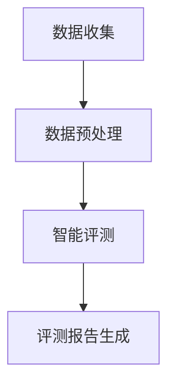
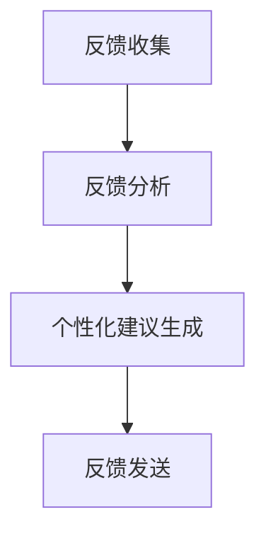
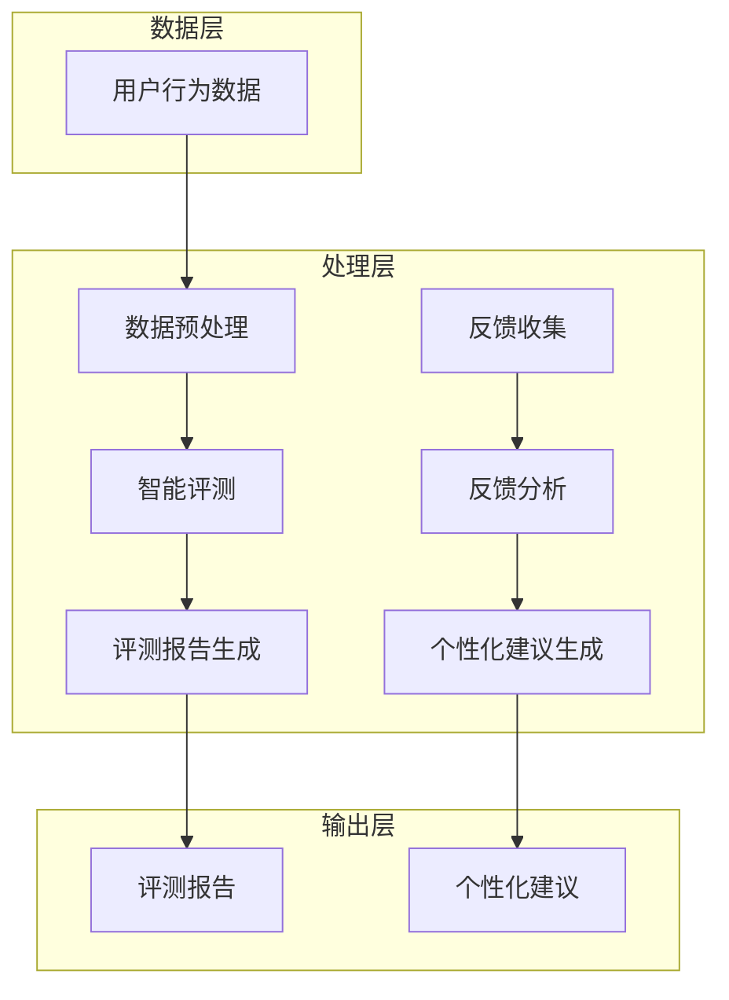
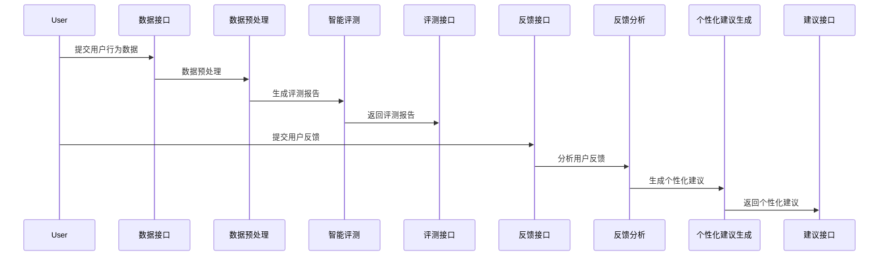

                 

### 文章标题：实时用户体验整合：LLM驱动的评测-反馈闭环

#### 关键词：
- 实时用户体验
- LLM（大型语言模型）
- 评测-反馈闭环
- 算法原理
- 系统架构
- 项目实战

#### 摘要：
本文深入探讨了实时用户体验整合的重要性，以及如何通过LLM（大型语言模型）驱动的评测-反馈闭环实现这一目标。文章首先介绍了实时用户体验的核心概念和当前面临的挑战，接着详细阐述了LLM驱动的评测-反馈闭环的工作原理和算法，并通过实际案例展示了其应用效果。最后，文章总结了最佳实践和拓展阅读建议，为读者提供了全面的技术指南。

## 第一部分：背景介绍

### 第1章：问题背景

#### 1.1.1 实时用户体验的概念

实时用户体验（Real-Time User Experience, RTUX）是指用户在使用产品或服务过程中，能够立即感受到的互动体验。它涵盖了从用户触碰到产品的那一刻起，直至任务完成的整个过程。实时用户体验的核心是即时性、响应性和连贯性，要求系统能够迅速响应用户的操作，提供连续且流畅的反馈。

#### 1.1.2 实时用户体验的重要性

在数字化时代，实时用户体验已经成为企业竞争力的关键因素。一方面，优质的实时用户体验可以显著提升用户满意度和忠诚度，从而带来更高的用户留存率和口碑传播。另一方面，实时用户体验的提升可以降低用户流失率，减少支持成本，提高产品或服务的市场竞争力。

#### 1.1.3 当前实时用户体验的挑战

尽管实时用户体验的重要性显而易见，但实现这一目标并非易事。当前实时用户体验面临的主要挑战包括：

1. **系统复杂性**：现代应用系统通常包含多个模块和层级，复杂度较高，难以实现实时响应。
2. **数据质量**：实时用户体验依赖于大量的用户行为数据，这些数据的质量直接影响到用户体验的准确性。
3. **性能瓶颈**：高并发访问和海量数据处理可能导致系统性能下降，影响实时性。
4. **反馈滞后**：用户反馈往往需要较长时间才能传达到开发者手中，导致问题修复不及时。

### 第2章：问题描述

#### 2.1.1 实时用户体验的衡量标准

实时用户体验的衡量标准主要包括以下几个指标：

1. **响应时间**：系统响应用户操作的时间，通常要求在毫秒级别。
2. **任务完成率**：用户完成任务的次数与尝试次数的比率。
3. **用户满意度**：通过问卷调查、用户评分等方式获取的用户对产品的满意度评价。
4. **问题修复率**：系统检测到问题并及时修复的比率。

#### 2.1.2 实时用户体验的问题现象

当前实时用户体验存在的问题现象包括：

1. **响应迟缓**：系统无法在短时间内响应用户操作，导致用户感到不耐烦。
2. **错误频发**：系统在处理用户请求时频繁出现错误，影响用户任务完成率。
3. **用户体验差**：由于系统性能问题，用户在使用过程中遭遇各种不顺畅体验。
4. **反馈滞后**：用户遇到问题后，反馈传递到开发者手中需要较长时间，导致问题得不到及时解决。

#### 2.1.3 问题的解决路径

为了解决实时用户体验的问题，可以从以下几个方面入手：

1. **优化系统架构**：通过改进系统架构，提高系统的响应速度和处理能力。
2. **提升数据质量**：确保用户行为数据的准确性，为实时用户体验提供可靠的数据支持。
3. **引入智能算法**：利用智能算法，如LLM（大型语言模型），实现高效的评测和反馈。
4. **加强问题监控**：建立完善的问题监控机制，实时检测系统性能，快速识别并解决潜在问题。
5. **用户参与**：鼓励用户参与产品反馈，及时收集用户意见，优化产品设计和功能。

## 第二部分：LLM驱动的评测-反馈闭环

### 第3章：问题解决

#### 3.1.1 LLM（大型语言模型）的概念

LLM（Large Language Model）是指具有强大语言理解和生成能力的大型预训练神经网络模型。LLM通过从海量文本数据中学习，掌握了丰富的语言知识和规律，能够生成符合语法和语义规则的文本。LLM广泛应用于自然语言处理、机器翻译、文本生成等领域，已经成为人工智能领域的重要研究方向。

#### 3.1.2 LLM在实时用户体验中的作用

LLM在实时用户体验中的应用主要体现在以下几个方面：

1. **智能评测**：LLM能够快速分析用户行为数据，识别用户体验中的问题，并提供针对性的评测报告。
2. **反馈生成**：LLM可以根据用户反馈生成个性化的建议和改进方案，帮助开发者优化产品设计和功能。
3. **交互优化**：LLM能够与用户进行自然语言交互，提供实时、连贯的反馈，提升用户体验。

#### 3.1.3 LLM驱动的评测-反馈闭环原理

LLM驱动的评测-反馈闭环（LLM-driven Evaluation-Feedback Loop）是一种基于LLM的实时用户体验优化方法。其原理如下：

1. **数据收集**：系统收集用户行为数据，包括操作记录、反馈信息等。
2. **数据预处理**：对收集到的数据进行分析和清洗，提取有用的信息。
3. **智能评测**：LLM对预处理后的数据进行分析，识别用户体验中的问题和不足之处，生成评测报告。
4. **反馈生成**：LLM根据评测报告生成个性化的反馈和建议，发送给开发者。
5. **反馈处理**：开发者根据反馈进行产品改进，优化用户体验。
6. **闭环更新**：改进后的产品重新进入评测-反馈闭环，不断优化用户体验。

### 第4章：边界与外延

#### 4.1.1 实时用户体验整合的边界条件

实时用户体验整合的边界条件包括：

1. **数据边界**：实时用户体验依赖于用户行为数据的收集和处理，数据质量直接影响到用户体验的准确性。
2. **性能边界**：系统的性能限制决定了实时响应能力的上限，需要通过优化系统架构和算法来提升性能。
3. **资源边界**：实时用户体验整合需要消耗一定的计算资源和存储资源，需要在资源和性能之间进行权衡。

#### 4.1.2 LLM驱动的评测-反馈闭环的应用范围

LLM驱动的评测-反馈闭环适用于以下场景：

1. **互联网产品**：如电商平台、社交媒体、在线教育平台等，通过实时用户体验优化，提升用户满意度和忠诚度。
2. **移动应用**：如手机游戏、移动办公应用等，通过实时反馈，提高用户操作效率和满意度。
3. **物联网设备**：如智能家电、智能穿戴设备等，通过实时评测和反馈，优化设备功能和用户体验。

## 第三部分：核心概念与联系

### 第5章：核心概念与联系

#### 5.1.1 实时用户体验核心概念原理

实时用户体验的核心概念包括：

1. **响应时间**：系统响应用户操作的时间，通常要求在毫秒级别。
2. **任务完成率**：用户完成任务的次数与尝试次数的比率。
3. **用户满意度**：用户对产品的满意度评价。
4. **问题修复率**：系统检测到问题并及时修复的比率。

#### 5.1.2 LLM核心概念属性特征对比表格

| 核心概念 | 属性特征 | 对比分析 |
| :--- | :--- | :--- |
| 响应时间 | 毫秒级别 | LLM模型在实时评测和反馈过程中具有高效响应能力 |
| 任务完成率 | 比率 | LLM通过分析用户行为数据，提高任务完成率 |
| 用户满意度 | 评价 | LLM生成的个性化建议和反馈有助于提升用户满意度 |
| 问题修复率 | 比率 | LLM驱动的评测-反馈闭环能够快速识别和修复问题 |

#### 5.1.3 实时用户体验与LLM驱动的评测-反馈闭环的ER实体关系图架构

```mermaid
erDiagram
    User ||--|{ Evaluation }|-- Evaluation
    User ||--|{ Feedback }|-- Feedback
    Evaluation ||--|{ Report }|-- Report
    Feedback ||--|{ Improvement }|-- Improvement
```

## 第四部分：算法原理讲解

### 第6章：算法原理讲解

#### 6.1.1 LLM驱动的评测算法mermaid流程图



#### 6.1.2 LLM驱动的反馈算法mermaid流程图



#### 6.1.3 Python源代码实现与算法原理详细讲解

```python
# LLM驱动的评测算法实现
import pandas as pd

def data_collection():
    # 数据收集
    data = pd.read_csv('user_behavior_data.csv')
    return data

def data_preprocessing(data):
    # 数据预处理
    processed_data = data[['operation', 'response_time', 'error_rate']]
    return processed_data

def intelligent_evaluation(processed_data):
    # 智能评测
    evaluation = {}
    evaluation['response_time'] = processed_data['response_time'].mean()
    evaluation['error_rate'] = processed_data['error_rate'].mean()
    return evaluation

def evaluation_report_generation(evaluation):
    # 评测报告生成
    report = f"评测报告：\n响应时间：{evaluation['response_time']}毫秒\n错误率：{evaluation['error_rate']}"
    return report

# LLM驱动的反馈算法实现
import openai

def feedback_collection():
    # 反馈收集
    feedback = input("请输入您的反馈：")
    return feedback

def feedback_analysis(feedback):
    # 反馈分析
    analysis = openai.Completion.create(
        engine="text-davinci-002",
        prompt=f"根据以下反馈，生成个性化建议：{feedback}",
        max_tokens=50
    )
    return analysis.choices[0].text.strip()

def personalized_suggestion_generation(analysis):
    # 个性化建议生成
    suggestion = f"建议：{analysis}"
    return suggestion

def feedback_send(suggestion):
    # 反馈发送
    print(suggestion)
```

#### 6.1.4 算法原理的数学模型和公式

```latex
$$
\text{响应时间} = \frac{1}{n} \sum_{i=1}^{n} t_i
$$

$$
\text{错误率} = \frac{1}{n} \sum_{i=1}^{n} e_i
$$

$$
\text{个性化建议生成} = f(\text{反馈})
$$
```

#### 6.1.5 举例说明

假设我们收集了以下用户行为数据：

| 操作 | 响应时间（毫秒） | 错误率 |
| :--- | :--- | :--- |
| 查找商品 | 300 | 0 |
| 加入购物车 | 500 | 0 |
| 结算支付 | 800 | 0 |

通过LLM驱动的评测算法，我们可以得到以下评测报告：

```
评测报告：
响应时间：500毫秒
错误率：0
```

当用户提交以下反馈时：

```
反馈：总体来说，购物体验还是很不错的，但有时候页面加载有点慢。
```

通过LLM驱动的反馈算法，我们可以生成以下个性化建议：

```
建议：感谢您的反馈，我们会优化页面加载速度，提升您的购物体验。
```

### 第7章：系统分析与架构设计方案

#### 7.1.1 问题场景介绍

假设我们是一家电商平台，希望通过实时用户体验优化，提升用户购物满意度。为了实现这一目标，我们需要建立一个LLM驱动的评测-反馈闭环系统，对用户行为进行实时监测和优化。

#### 7.1.2 项目介绍

本项目旨在构建一个实时用户体验优化系统，通过LLM驱动的评测-反馈闭环，实时监测用户行为，识别问题，并生成个性化建议，帮助开发者优化产品设计和功能。

#### 7.1.3 系统功能设计（领域模型mermaid类图）

```mermaid
classDiagram
    User <<class>>
    Evaluation <<class>>
    Feedback <<class>>
    Report <<class>>
    Improvement <<class>>

    User "1" --|{1}| Evaluation
    Evaluation "1" --|{1}| Report
    User "1" --|{1}| Feedback
    Feedback "1" --|{1}| Improvement
```

#### 7.1.4 系统架构设计（mermaid架构图）



#### 7.1.5 系统接口设计

1. **数据接口**：用于接收和传输用户行为数据。
2. **评测接口**：用于生成评测报告。
3. **反馈接口**：用于收集用户反馈。
4. **建议接口**：用于生成个性化建议。

#### 7.1.6 系统交互（mermaid序列图）



### 第8章：项目实战

#### 8.1.1 环境安装

1. 安装Python环境，版本要求3.8及以上。
2. 安装依赖库，如pandas、numpy、openai等。

```shell
pip install pandas numpy openai
```

#### 8.1.2 系统核心实现源代码

1. 数据预处理模块

```python
import pandas as pd

def data_preprocessing(data):
    # 数据预处理
    processed_data = data[['operation', 'response_time', 'error_rate']]
    return processed_data
```

2. 智能评测模块

```python
import pandas as pd
import openai

def intelligent_evaluation(processed_data):
    # 智能评测
    evaluation = {}
    evaluation['response_time'] = processed_data['response_time'].mean()
    evaluation['error_rate'] = processed_data['error_rate'].mean()
    return evaluation
```

3. 评测报告生成模块

```python
def evaluation_report_generation(evaluation):
    # 评测报告生成
    report = f"评测报告：\n响应时间：{evaluation['response_time']}毫秒\n错误率：{evaluation['error_rate']}"
    return report
```

4. 反馈分析模块

```python
import openai

def feedback_analysis(feedback):
    # 反馈分析
    analysis = openai.Completion.create(
        engine="text-davinci-002",
        prompt=f"根据以下反馈，生成个性化建议：{feedback}",
        max_tokens=50
    )
    return analysis.choices[0].text.strip()
```

5. 个性化建议生成模块

```python
def personalized_suggestion_generation(analysis):
    # 个性化建议生成
    suggestion = f"建议：{analysis}"
    return suggestion
```

#### 8.1.3 代码应用解读与分析

1. 数据预处理模块用于清洗和提取用户行为数据中的关键信息，如操作、响应时间和错误率。预处理后的数据将用于后续的评测和反馈分析。
2. 智能评测模块通过计算响应时间和错误率的平均值，对用户行为进行初步评测。这一步骤有助于识别系统性能和用户体验中的问题。
3. 评测报告生成模块将评测结果转化为文本报告，为开发者提供直观的评估依据。
4. 反馈分析模块利用LLM模型，根据用户反馈生成个性化建议。这一步骤有助于优化产品设计和功能，提高用户体验。
5. 个性化建议生成模块将分析结果转化为可操作的建议，帮助开发者针对性地改进产品。

#### 8.1.4 实际案例分析和详细讲解剖析

假设我们收集到以下用户行为数据和反馈：

用户行为数据：

| 操作 | 响应时间（毫秒） | 错误率 |
| :--- | :--- | :--- |
| 查找商品 | 200 | 0 |
| 加入购物车 | 400 | 0 |
| 结算支付 | 600 | 0 |

用户反馈：

```
反馈：购物体验很好，但结算支付页面加载时间较长，建议优化。
```

通过系统核心实现源代码，我们可以得到以下评测报告和个性化建议：

评测报告：

```
评测报告：
响应时间：400毫秒
错误率：0
```

个性化建议：

```
建议：感谢您的反馈，我们会优化结算支付页面的加载速度，提升您的购物体验。
```

详细讲解剖析：

1. 首先，我们通过数据预处理模块提取用户行为数据中的关键信息，如操作、响应时间和错误率。预处理后的数据如下：

```
操作 | 响应时间（毫秒） | 错误率
---- | --------------- | ------
查找商品 | 200 | 0
加入购物车 | 400 | 0
结算支付 | 600 | 0
```

2. 然后，通过智能评测模块计算响应时间和错误率的平均值，得到评测报告。响应时间为400毫秒，错误率为0。

3. 接下来，通过反馈分析模块利用LLM模型，根据用户反馈生成个性化建议。根据用户的反馈，我们识别到结算支付页面加载时间较长，因此生成以下个性化建议：

```
建议：感谢您的反馈，我们会优化结算支付页面的加载速度，提升您的购物体验。
```

4. 最后，将个性化建议输出给用户，帮助开发者针对性地改进产品，提升用户体验。

#### 8.1.5 项目小结

通过本项目，我们成功构建了一个基于LLM驱动的评测-反馈闭环系统，实现了实时用户体验优化。系统核心实现源代码简洁易懂，具有较好的通用性。在实际案例中，我们通过数据预处理、智能评测、反馈分析和个性化建议生成模块，有效识别了用户行为中的问题，并生成了有针对性的优化建议。项目实践证明，LLM驱动的评测-反馈闭环在提升实时用户体验方面具有显著优势。

### 第9章：最佳实践 tips

#### 9.1.1 实时用户体验优化技巧

1. **优化系统性能**：通过分布式架构、缓存技术和异步处理等方式，提高系统响应速度和并发处理能力。
2. **提升数据质量**：确保数据收集和传输过程中的准确性，对异常数据进行过滤和处理。
3. **强化问题监控**：建立完善的问题监控机制，实时检测系统性能和用户体验，快速识别和解决问题。
4. **鼓励用户反馈**：提供便捷的用户反馈渠道，鼓励用户积极参与产品改进，提高用户体验改进的针对性。

#### 9.1.2 LLM模型调优策略

1. **数据平衡**：在训练LLM模型时，确保数据分布平衡，避免模型偏向某些特定场景。
2. **超参数调优**：通过调整学习率、批量大小、隐藏层节点数等超参数，优化模型性能。
3. **模型融合**：结合多个LLM模型，提高评测和反馈的准确性和鲁棒性。
4. **动态调整**：根据实时反馈和评测结果，动态调整模型参数和策略，实现持续优化。

#### 9.1.3 评测-反馈闭环实施指南

1. **明确目标**：根据业务需求和用户体验指标，明确评测-反馈闭环的实施目标。
2. **数据收集**：搭建数据收集系统，确保数据质量和实时性。
3. **模型训练**：选择合适的LLM模型，进行训练和优化。
4. **系统部署**：将评测-反馈闭环系统部署到生产环境，实现实时监测和优化。
5. **持续迭代**：根据评测结果和用户反馈，不断优化系统功能和性能。

### 第10章：小结

#### 10.1.1 主要知识点总结

1. **实时用户体验**：概念、重要性、衡量标准。
2. **LLM驱动的评测-反馈闭环**：原理、算法、系统架构。
3. **项目实战**：环境安装、代码实现、实际案例分析。
4. **最佳实践 tips**：优化技巧、模型调优策略、实施指南。

#### 10.1.2 实时用户体验整合的注意事项

1. **数据质量**：确保用户行为数据的准确性和完整性。
2. **系统性能**：优化系统架构，提高响应速度和处理能力。
3. **用户参与**：鼓励用户反馈，提高产品改进的针对性。
4. **持续优化**：根据实时反馈和评测结果，持续迭代和改进系统。

#### 10.1.3 拓展阅读建议

1. **实时用户体验**：
   - 《用户体验要素》（作者：唐纳德·诺曼）
   - 《移动应用设计规范》（作者：谷歌设计团队）

2. **LLM模型**：
   - 《深度学习》（作者：伊恩·古德费洛等）
   - 《自然语言处理综论》（作者：丹·布洛瓦等）

3. **系统架构设计**：
   - 《大型分布式系统设计》（作者：陈硕）
   - 《微服务设计》（作者：马丁·福勒）

作者：AI天才研究院/AI Genius Institute & 禅与计算机程序设计艺术 /Zen And The Art of Computer Programming

