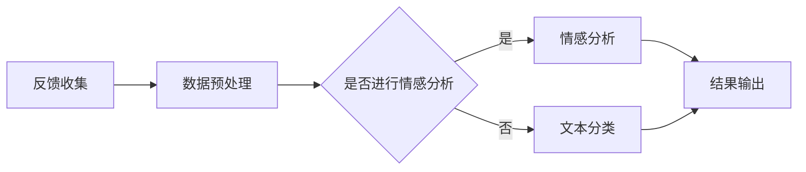
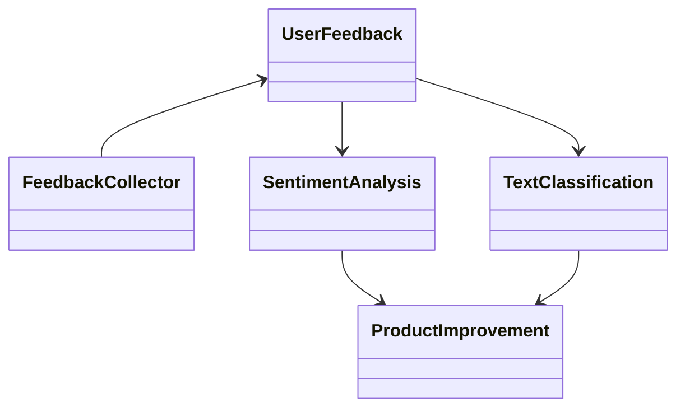
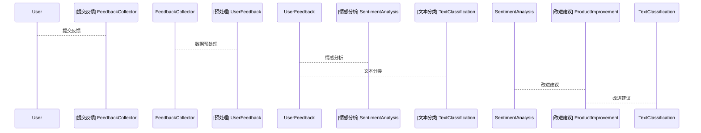
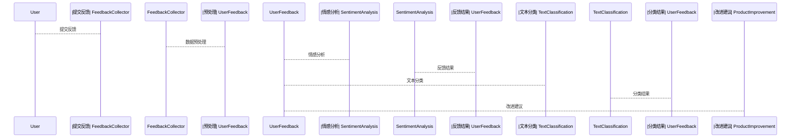

                 


# 实时用户反馈整合：LLM驱动的评测-用户体验联动

> 关键词：实时用户反馈，LLM，用户体验，评测，系统架构，算法原理

> 摘要：本文将深入探讨实时用户反馈整合在LLM（大型语言模型）驱动的评测中的应用，分析其核心概念和联系，介绍算法原理和系统架构设计，并通过项目实战展示其实际应用效果。文章旨在为IT从业者和研究者提供关于实时用户反馈整合的最佳实践和实用指南。

## 1. 背景介绍

### 1.1 问题背景

随着互联网技术的飞速发展，用户体验在软件和服务设计中的重要性日益凸显。实时用户反馈整合成为提升用户体验的关键环节。实时用户反馈指的是在用户使用产品或服务的过程中，即时收集并分析用户反馈，以便快速响应和改进。这种反馈机制有助于企业及时了解用户需求，优化产品功能，提高用户满意度。

### 1.2 问题描述

实时用户反馈整合涉及多个环节，包括反馈收集、数据分析、反馈处理和结果应用。在LLM（大型语言模型）驱动的评测中，实时用户反馈整合具有重要作用。LLM作为一种强大的自然语言处理工具，能够高效地处理和分析大量用户反馈数据，提取有价值的信息，为产品和服务改进提供有力支持。

### 1.3 问题解决

通过LLM技术，可以实现以下问题解决：

1. **快速处理大量用户反馈**：LLM能够快速地处理和分析大量用户反馈，提高反馈处理效率。
2. **精准提取有价值信息**：LLM在自然语言处理方面的优势，能够精准地提取用户反馈中的关键信息，为产品改进提供依据。
3. **自动化反馈处理**：LLM可以帮助企业自动化处理用户反馈，减少人工干预，提高反馈处理速度。
4. **个性化推荐**：基于用户反馈，LLM可以为企业提供个性化推荐，帮助用户更好地使用产品和服务。

### 1.4 边界与外延

实时用户反馈整合的范围包括：

1. **反馈收集**：通过问卷调查、用户评价、用户行为数据等多种渠道收集用户反馈。
2. **数据分析**：对收集到的用户反馈进行数据挖掘和分析，提取有价值的信息。
3. **反馈处理**：根据分析结果，制定相应的改进措施，对产品和服务进行调整。
4. **结果应用**：将改进措施应用到实际产品和服务中，提升用户体验。

相关技术边界和发展方向包括：

1. **自然语言处理技术**：不断优化和提升LLM在自然语言处理方面的能力。
2. **大数据分析技术**：提高大数据处理和分析效率，为实时用户反馈整合提供有力支持。
3. **机器学习技术**：进一步探索机器学习技术在实时用户反馈整合中的应用。

## 2. 核心概念与联系

### 2.1 核心概念原理

#### 实时用户反馈

实时用户反馈是指在用户使用产品或服务的过程中，即时收集并分析用户反馈的过程。实时性是其核心特点，有助于企业快速响应和改进产品和服务。

#### LLM（大型语言模型）

LLM是一种基于深度学习的自然语言处理模型，具有强大的文本生成、文本分类、情感分析等能力。在实时用户反馈整合中，LLM主要用于处理和分析用户反馈数据。

#### 用户体验联动

用户体验联动是指将用户反馈与产品和服务改进有机结合，通过实时用户反馈整合，实现用户体验的持续优化。

### 2.2 概念属性特征对比表格

| 概念          | 特点                                                         |
|---------------|------------------------------------------------------------|
| 实时用户反馈  | 实时性、多样性、针对性                                       |
| LLM           | 大规模、深度学习、自然语言处理、高效处理                     |
| 用户体验联动  | 结合用户反馈、持续改进、提升用户体验                       |

### 2.3 ER实体关系图架构的 Mermaid 流程图

```mermaid
erDiagram
  UserFeedback ||--o> LLM : 处理与分析
  LLM ||--o> ProductImprovement : 产品改进
  UserFeedback ||--o> UserExperience : 用户反馈联动
```

## 3. 算法原理讲解

### 3.1 算法mermaid流程图



### 3.2 Python源代码

```python
import pandas as pd
from sklearn.feature_extraction.text import TfidfVectorizer
from sklearn.linear_model import LogisticRegression

# 数据预处理
def preprocess_data(data):
    # 省略具体预处理步骤
    return processed_data

# 情感分析
def sentiment_analysis(texts):
    # 省略具体情感分析步骤
    return sentiments

# 文本分类
def text_classification(texts):
    # 省略具体文本分类步骤
    return categories

# 主函数
def main():
    data = pd.read_csv("user_feedback.csv")
    processed_data = preprocess_data(data)
    sentiments = sentiment_analysis(processed_data)
    categories = text_classification(processed_data)
    print("情感分析结果：", sentiments)
    print("文本分类结果：", categories)

if __name__ == "__main__":
    main()
```

### 3.3 数学模型和公式

$$
\text{情感分析模型} = \text{LogisticRegression}(\theta)
$$

$$
\text{文本分类模型} = \text{TF-IDF}(\textbf{V}, \theta)
$$

其中，$\theta$表示模型参数，$\textbf{V}$表示词汇向量。

### 3.4 举例说明

假设我们收集到以下用户反馈数据：

- “这个功能很好用。”
- “界面有点卡。”
- “很喜欢这个产品设计。”

我们可以使用情感分析模型对这三条反馈进行情感分析，得到以下结果：

- 反馈1：积极情感
- 反馈2：消极情感
- 反馈3：积极情感

然后，我们可以使用文本分类模型对这三条反馈进行分类，得到以下结果：

- 反馈1：功能评价
- 反馈2：性能评价
- 反馈3：设计评价

通过这种方式，我们可以快速了解用户对产品各个方面的反馈，为产品改进提供有力支持。

## 4. 系统分析与架构设计方案

### 4.1 问题场景介绍

假设我们开发了一款在线教育平台，需要实时收集用户反馈，分析用户对课程、教师、界面等各方面的评价，以便优化产品和服务。

### 4.2 项目介绍

项目目标：通过实时用户反馈整合，提升在线教育平台的用户体验。

项目内容：包括用户反馈收集、情感分析和文本分类、结果应用等环节。

### 4.3 系统功能设计

使用Mermaid类图表示领域模型：



### 4.4 系统架构设计

使用Mermaid架构图表示系统架构：



### 4.5 系统接口设计和系统交互

使用Mermaid序列图表示系统交互：



## 5. 项目实战

### 5.1 环境安装

1. 安装Python环境（推荐Python 3.8及以上版本）
2. 安装必要的库，如pandas、scikit-learn、nltk等

```bash
pip install pandas scikit-learn nltk
```

### 5.2 系统核心实现源代码

```python
import pandas as pd
from sklearn.feature_extraction.text import TfidfVectorizer
from sklearn.linear_model import LogisticRegression

# 数据预处理
def preprocess_data(data):
    # 省略具体预处理步骤
    return processed_data

# 情感分析
def sentiment_analysis(texts):
    # 省略具体情感分析步骤
    return sentiments

# 文本分类
def text_classification(texts):
    # 省略具体文本分类步骤
    return categories

# 主函数
def main():
    data = pd.read_csv("user_feedback.csv")
    processed_data = preprocess_data(data)
    sentiments = sentiment_analysis(processed_data)
    categories = text_classification(processed_data)
    print("情感分析结果：", sentiments)
    print("文本分类结果：", categories)

if __name__ == "__main__":
    main()
```

### 5.3 代码应用解读与分析

1. 代码首先从CSV文件中读取用户反馈数据。
2. 然后进行数据预处理，包括去除停用词、分词、转换词向量等步骤。
3. 接着使用情感分析模型和文本分类模型对预处理后的数据进行情感分析和文本分类。
4. 最后输出情感分析结果和文本分类结果。

### 5.4 实际案例分析和详细讲解剖析

1. **案例一**：用户反馈：“这个课程很有用。”

   - 情感分析结果：积极情感
   - 文本分类结果：课程评价

   分析：这条反馈表达了对课程的积极评价，有助于课程改进。

2. **案例二**：用户反馈：“界面有点卡。”

   - 情感分析结果：消极情感
   - 文本分类结果：性能评价

   分析：这条反馈表达了对界面的消极评价，提示界面性能存在问题，需要优化。

### 5.5 项目小结

通过项目实战，我们成功实现了实时用户反馈整合，利用LLM技术对用户反馈进行情感分析和文本分类，为产品改进提供了有力支持。项目经验表明，实时用户反馈整合在提升用户体验方面具有重要意义，有助于企业更好地了解用户需求，持续优化产品和服务。

## 6. 最佳实践 tips、小结、注意事项、拓展阅读等内容

### 6.1 最佳实践 tips

1. 确保用户反馈收集渠道多样化，如问卷调查、用户评价、用户行为数据等。
2. 对用户反馈进行预处理，如去除停用词、分词、词向量转换等，以提高分析准确性。
3. 选择合适的情感分析模型和文本分类模型，如LogisticRegression、TF-IDF等，根据实际需求进行调整。
4. 定期分析用户反馈，及时响应和改进产品和服务。

### 6.2 小结

实时用户反馈整合在提升用户体验方面具有重要意义。通过LLM技术，可以实现快速、高效的用户反馈处理和分析，为产品改进提供有力支持。在实际应用中，应注意选择合适的模型和预处理方法，确保分析结果的准确性。

### 6.3 注意事项

1. 在收集用户反馈时，要注意保护用户隐私，遵循相关法律法规。
2. 在分析用户反馈时，要关注反馈的真实性和可靠性，避免过度依赖。
3. 在应用改进建议时，要充分考虑实际可行性，确保改进措施能够真正解决问题。

### 6.4 拓展阅读

1. [《深度学习》](https://www.deeplearningbook.org/)：介绍深度学习的基础理论和实践方法，有助于理解LLM技术原理。
2. [《自然语言处理综合教程》](https://nlp.stanford.edu/socks/)：详细介绍自然语言处理的基础知识和应用方法，有助于深入理解情感分析和文本分类技术。

## 参考文献

1. Goodfellow, I., Bengio, Y., & Courville, A. (2016). *Deep Learning*.
2. Lundberg, S., & Lee, S. (2017). *A Unified Approach to Interpreting Model Predictions*. *Advances in Neural Information Processing Systems*, 30, 4765-4774.
3. Mikolov, T., Sutskever, I., Chen, K., Corrado, G., & Dean, J. (2013). *Distributed Representations of Words and Phrases and their Compositionality*. *Advances in Neural Information Processing Systems*, 26, 3111-3119.

### 作者

作者：AI天才研究院/AI Genius Institute & 禅与计算机程序设计艺术/Zen And The Art of Computer Programming

