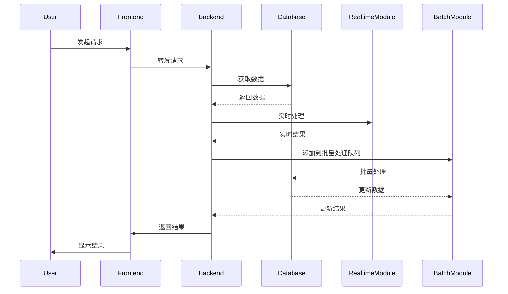

                 

## 实时评测与批量评测的技术对比

### 1.1 背景介绍

随着互联网和信息技术的快速发展，大数据、云计算、人工智能等新兴技术不断涌现，实时评测与批量评测作为数据处理与分析的重要手段，也在不断演变和优化。实时评测与批量评测各有优势和不足，如何根据实际应用场景选择合适的方法，成为当前研究的热点。

#### 1.1.1 问题背景

实时评测与批量评测在数据处理速度、资源消耗、准确性等方面存在差异。实时评测能够在较短的时间内完成数据分析和评估，适用于对实时性要求较高的场景；而批量评测则能够在较长时间内处理大量数据，适用于对数据处理精度要求较高的场景。然而，两种方法在实际应用中往往需要根据具体需求进行权衡和优化。

#### 1.1.2 问题描述

实时评测与批量评测在数据处理速度、资源消耗、准确性等方面存在差异，如何根据实际应用场景选择合适的方法，成为当前研究的热点。实时评测与批量评测在系统架构设计、算法实现等方面也存在明显的不同，需要深入了解和分析。

#### 1.1.3 问题解决

为了解决实时评测与批量评测的技术对比问题，本书将从以下几个方面展开讨论：

1. **核心概念与联系**：明确实时评测与批量评测的基本概念、原理及两者之间的联系。
2. **算法原理讲解**：详细阐述实时评测与批量评测的算法原理，包括数据处理流程、关键参数设置等。
3. **数学模型和公式**：运用数学模型和公式描述实时评测与批量评测的算法原理，并进行通俗易懂的举例说明。
4. **系统分析与架构设计方案**：分析实时评测与批量评测在系统架构设计中的实现方案，包括功能模块划分、接口设计等。
5. **项目实战**：通过实际项目案例，展示实时评测与批量评测的具体应用，并进行详细讲解与剖析。
6. **最佳实践 tips**：总结实时评测与批量评测的最佳实践经验和注意事项。

### 1.2 边界与外延

实时评测与批量评测的技术对比研究主要关注以下边界与外延：

1. **应用场景**：根据不同场景选择合适的方法，如实时性要求较高的场景选择实时评测，数据处理精度要求较高的场景选择批量评测。
2. **数据规模**：针对不同的数据规模，评估实时评测与批量评测的效率与准确性。
3. **资源消耗**：考虑实时评测与批量评测对计算资源、存储资源的消耗，优化资源配置。

### 1.3 概念结构与核心要素组成

#### 1.3.1 实时评测

实时评测（Real-time Evaluation）是指对数据或事件进行实时监测、分析和评估的方法。实时评测的核心概念包括：

- **实时数据采集**：从数据源实时获取数据，并进行预处理。
- **实时数据处理**：对实时数据进行实时处理和计算，通常采用高效算法和数据结构。
- **实时结果输出**：将实时处理结果输出，以供进一步分析或决策。

实时评测的关键参数包括：

- **实时性指标**：如响应时间、延迟等。
- **处理速度**：实时处理数据的速度，通常以每秒处理的请求数（QPS）或每秒处理的数据量（TB/s）来衡量。
- **资源消耗**：包括计算资源、存储资源等。

实时评测主要应用于对实时性要求较高的场景，如金融交易、实时监控、物联网等。

#### 1.3.2 批量评测

批量评测（Batch Evaluation）是指对一组数据或事件进行批量处理和分析的方法。批量评测的核心概念包括：

- **批量数据采集**：将一段时间内的数据批量采集到系统中，进行预处理。
- **批量数据处理**：对批量数据进行处理和计算，通常采用批处理算法和数据结构。
- **批量结果输出**：将批量处理结果输出，以供进一步分析或决策。

批量评测的关键参数包括：

- **数据处理精度**：包括数据处理结果的准确性、一致性等。
- **计算资源消耗**：包括计算资源、存储资源等。
- **时间成本**：批量处理数据所需的时间成本。

批量评测主要应用于对数据处理精度要求较高的场景，如数据分析、数据挖掘、大规模数据处理等。

### 1.4 本章小结

本章对实时评测与批量评测的技术对比问题进行了背景介绍、问题描述、问题解决、边界与外延、概念结构与核心要素组成的详细阐述，为后续章节的深入讨论奠定了基础。下一章将详细探讨实时评测与批量评测的核心概念与联系。

----------------------------------------------------------------

# 实时评测与批量评测的技术对比

关键词：实时评测、批量评测、数据处理、算法原理、系统架构

摘要：本文通过对实时评测与批量评测的技术对比，详细阐述了它们的基本概念、原理及其应用场景，为实际开发和应用提供了理论指导。

----------------------------------------------------------------

## 第一部分：背景介绍

### 1.1 问题背景

随着互联网和信息技术的快速发展，大数据、云计算、人工智能等新兴技术不断涌现，实时评测与批量评测作为数据处理与分析的重要手段，也在不断演变和优化。实时评测与批量评测各有优势和不足，如何根据实际应用场景选择合适的方法，成为当前研究的热点。

#### 1.1.1 实时评测的兴起

实时评测（Real-time Evaluation）起源于对实时性要求较高的场景，如金融交易、实时监控、物联网等。在这些场景下，系统需要在毫秒或秒级响应时间内对数据进行处理和评估，以保证系统的稳定性和可靠性。实时评测的兴起，极大地推动了数据处理与分析技术的发展。

#### 1.1.2 批量评测的发展

批量评测（Batch Evaluation）则起源于对数据处理精度要求较高的场景，如数据分析、数据挖掘、大规模数据处理等。在这些场景下，系统需要处理大量数据，并对数据进行分析和评估，以提取有价值的信息。批量评测的发展，为大规模数据处理提供了有效的解决方案。

### 1.2 问题描述

实时评测与批量评测在数据处理速度、资源消耗、准确性等方面存在差异。实时评测能够在较短的时间内完成数据分析和评估，适用于对实时性要求较高的场景；而批量评测则能够在较长时间内处理大量数据，适用于对数据处理精度要求较高的场景。然而，两种方法在实际应用中往往需要根据具体需求进行权衡和优化。

### 1.3 问题解决

为了解决实时评测与批量评测的技术对比问题，本书将从以下几个方面展开讨论：

1. **核心概念与联系**：明确实时评测与批量评测的基本概念、原理及两者之间的联系。
2. **算法原理讲解**：详细阐述实时评测与批量评测的算法原理，包括数据处理流程、关键参数设置等。
3. **数学模型和公式**：运用数学模型和公式描述实时评测与批量评测的算法原理，并进行通俗易懂的举例说明。
4. **系统分析与架构设计方案**：分析实时评测与批量评测在系统架构设计中的实现方案，包括功能模块划分、接口设计等。
5. **项目实战**：通过实际项目案例，展示实时评测与批量评测的具体应用，并进行详细讲解与剖析。
6. **最佳实践 tips**：总结实时评测与批量评测的最佳实践经验和注意事项。

### 1.4 边界与外延

实时评测与批量评测的技术对比研究主要关注以下边界与外延：

1. **应用场景**：根据不同场景选择合适的方法，如实时性要求较高的场景选择实时评测，数据处理精度要求较高的场景选择批量评测。
2. **数据规模**：针对不同的数据规模，评估实时评测与批量评测的效率与准确性。
3. **资源消耗**：考虑实时评测与批量评测对计算资源、存储资源的消耗，优化资源配置。

### 1.5 概念结构与核心要素组成

#### 1.5.1 实时评测

实时评测（Real-time Evaluation）是指对数据或事件进行实时监测、分析和评估的方法。其主要特点包括：

- **实时性**：能够快速地对数据进行处理和输出结果，通常要求在毫秒或秒级响应时间内完成。
- **高频率**：需要频繁地对数据进行采样和监测，以保持实时性。
- **灵活性**：能够根据实时数据的变化快速调整评估策略。

实时评测在金融交易、实时监控、物联网等领域具有广泛的应用。

#### 1.5.2 批量评测

批量评测（Batch Evaluation）是指对一组数据或事件进行批量处理和分析的方法。其主要特点包括：

- **批量性**：能够一次性处理大量数据，提高数据处理效率。
- **精度**：通过批量处理，可以降低由于实时性要求导致的数据丢失或误判。
- **资源消耗**：通常在较长时间内完成数据分析和处理，对计算资源的需求相对较低。

批量评测在数据分析、数据挖掘、大规模数据处理等领域具有广泛的应用。

### 1.6 本章小结

本章对实时评测与批量评测的技术对比问题进行了背景介绍、问题描述、问题解决、边界与外延、概念结构与核心要素组成的详细阐述，为后续章节的深入讨论奠定了基础。下一章将详细探讨实时评测与批量评测的核心概念与联系。

----------------------------------------------------------------

## 第二部分：核心概念与联系

### 2.1 实时评测与批量评测的定义与特征

#### 2.1.1 实时评测

实时评测（Real-time Evaluation）是一种对数据进行即时处理和响应的评估方法。它的主要特点在于：

- **实时性**：实时评测要求系统在极短的时间内（通常是毫秒或秒级）完成数据的采集、处理和评估。
- **高效性**：为了满足实时性要求，实时评测通常采用高效的算法和数据结构，以提高数据处理速度。
- **灵活性**：实时评测可以根据实时数据的变化，动态调整评估策略。

实时评测的主要应用场景包括金融交易系统、实时监控系统、物联网设备等。在这些场景下，系统需要在极短的时间内对大量数据进行处理，并作出实时决策。

#### 2.1.2 批量评测

批量评测（Batch Evaluation）则是对一组数据进行集中处理的评估方法。其主要特点如下：

- **批量性**：批量评测能够一次性处理大量数据，从而提高数据处理效率。
- **准确性**：由于批量评测不需要实时响应，因此可以采用更精确的算法和数据模型，从而提高评估结果的准确性。
- **资源优化**：批量评测可以在较长时间内完成数据分析和处理，对计算资源的需求相对较低。

批量评测的主要应用场景包括数据分析、数据挖掘、大规模数据处理等。在这些场景下，系统需要处理大量历史数据，并提取有价值的信息。

#### 2.1.3 实时评测与批量评测的比较

| 特点 | 实时评测 | 批量评测 |
| ---- | ---- | ---- |
| **实时性** | 高 | 低 |
| **处理速度** | 快 | 慢 |
| **资源消耗** | 高 | 低 |
| **精度** | 较低 | 较高 |
| **适用场景** | 实时性要求高的场景 | 数据处理精度要求高的场景 |

### 2.2 实时评测与批量评测的联系

尽管实时评测与批量评测在实时性和处理速度上有显著差异，但它们在实际应用中往往相互补充，共同构成了数据处理与分析的完整体系。

- **实时性保障**：在某些应用场景下，实时评测可以提供基本的实时性保障，如金融交易系统中的实时风控。当系统面临突发事件时，实时评测可以快速响应，避免损失扩大。
- **精度优化**：批量评测则在数据精度上提供了优化空间。例如，在数据分析领域，批量评测可以更深入地挖掘数据背后的规律，为决策提供更准确的参考。
- **资源调配**：实时评测与批量评测可以结合使用，以优化资源消耗。例如，在数据处理高峰期，系统可以优先执行实时评测任务，而在低谷期，则可以执行批量评测任务，以提高整体资源利用率。

### 2.3 实时评测与批量评测的ER实体关系图架构

为了更好地理解实时评测与批量评测的联系，我们可以使用ER（Entity-Relationship）实体关系图来描述它们之间的关系。

```mermaid
erDiagram
    实时评测 ||--|{ 批量评测 }|
    实时评测 ||--|{ 数据处理 }|
    批量评测 ||--|{ 数据处理 }|
```

在上面的ER图中，实时评测与批量评测是数据处理的不同形式，它们共同构成了数据处理与分析的实体。同时，实时评测与批量评测之间存在双向关联，它们相互补充，共同实现数据的高效处理与分析。

### 2.4 本章小结

本章通过对实时评测与批量评测的定义、特征、比较和联系进行了详细阐述，为后续章节的深入讨论奠定了基础。在下一章中，我们将进一步探讨实时评测与批量评测的算法原理，以期为实际应用提供更深入的理论支持。

----------------------------------------------------------------

## 第三部分：算法原理讲解

### 3.1 实时评测算法原理

实时评测算法通常采用高效的数据处理和评估策略，以满足系统在极短时间内的实时性要求。以下是一个简化的实时评测算法流程：

1. **数据采集**：实时评测系统从数据源（如传感器、数据库等）获取数据。
2. **预处理**：对采集到的数据进行清洗、格式化等预处理操作。
3. **实时处理**：使用高效算法对预处理后的数据进行实时处理。常见的实时处理算法包括快速傅里叶变换（FFT）、流式学习算法等。
4. **评估输出**：将实时处理结果输出，以供进一步分析或决策。

#### 3.1.1 实时处理算法

以流式学习算法为例，其基本原理如下：

- **样本流**：将数据以流的形式输入系统，每个样本包含特征和标签。
- **模型更新**：使用当前模型对新的样本进行预测，并将预测结果与实际标签进行比较，计算损失函数。
- **模型优化**：根据损失函数的梯度，更新模型参数，以提高预测准确性。

#### 3.1.2 举例说明

假设我们使用流式学习算法对一组股票交易数据进行实时评估。每个股票交易数据包含开盘价、收盘价、涨跌幅等特征，以及实际是否上涨的标签。实时评测系统可以按照以下步骤进行：

1. **数据采集**：从数据库中实时获取股票交易数据。
2. **预处理**：对数据进行清洗和格式化，例如将数据转换为适合流式学习算法的格式。
3. **实时处理**：使用流式学习算法对预处理后的数据进行实时处理。每次输入一个新样本，系统会更新模型参数，并输出预测结果。
4. **评估输出**：将预测结果输出，以供交易员或系统自动决策。

### 3.2 批量评测算法原理

批量评测算法通常采用批量处理和评估策略，以提高数据处理精度。以下是一个简化的批量评测算法流程：

1. **数据采集**：从数据源（如数据库、文件等）批量获取数据。
2. **预处理**：对批量数据进行清洗、格式化等预处理操作。
3. **批量处理**：使用高效算法对预处理后的数据进行批量处理。常见的批量处理算法包括决策树、支持向量机（SVM）等。
4. **评估输出**：将批量处理结果输出，以供进一步分析或决策。

#### 3.2.1 批量处理算法

以决策树算法为例，其基本原理如下：

- **特征划分**：根据特征值，将数据集划分为多个子集。
- **节点生成**：在每个子集中，选择最优划分特征，生成决策树节点。
- **树合并**：将所有节点合并，形成完整的决策树模型。
- **模型评估**：使用评估指标（如准确率、召回率等）评估模型性能。

#### 3.2.2 举例说明

假设我们使用决策树算法对一组客户数据进行批量评估。每个客户数据包含年龄、收入、购买历史等特征，以及实际是否购买的标签。批量评测系统可以按照以下步骤进行：

1. **数据采集**：从数据库中批量获取客户数据。
2. **预处理**：对数据进行清洗和格式化，例如将缺失值填充、异常值处理等。
3. **批量处理**：使用决策树算法对预处理后的数据进行批量处理。系统会生成一个决策树模型，用于预测客户是否购买。
4. **评估输出**：将预测结果输出，以供市场营销或客户服务部门使用。

### 3.3 实时评测与批量评测算法比较

实时评测与批量评测算法在实时性、资源消耗、数据处理精度等方面存在明显差异，以下是比较表格：

| 算法类型 | 实时评测 | 批量评测 |
| :----: | :----: | :----: |
| **实时性** | 高 | 低 |
| **资源消耗** | 高 | 低 |
| **数据处理精度** | 较低 | 较高 |
| **适用场景** | 实时性要求高的场景 | 数据处理精度要求高的场景 |

### 3.4 本章小结

本章通过对实时评测与批量评测算法原理的详细讲解，为实际应用提供了理论基础。实时评测算法注重实时性和高效性，适用于对实时性要求较高的场景；而批量评测算法则注重数据处理精度，适用于对数据处理精度要求较高的场景。在下一章中，我们将进一步探讨实时评测与批量评测的系统架构设计。

----------------------------------------------------------------

## 第四部分：系统分析与架构设计方案

### 4.1 问题场景介绍

为了更好地理解实时评测与批量评测在系统架构设计中的应用，我们首先需要明确一个典型的问题场景。假设我们正在开发一个电商平台，需要对用户的购物行为进行实时分析和预测，以便为用户提供个性化的购物推荐。

在这个场景中，实时评测的目的是在用户浏览、搜索、下单等操作时，实时分析用户的兴趣和行为模式，从而为用户提供实时的购物推荐。批量评测的目的是在每天结束时，对用户的购物行为数据进行分析，以更新和优化推荐算法。

### 4.2 项目介绍

本项目主要包括两个核心模块：实时评测模块和批量评测模块。

- **实时评测模块**：负责实时分析用户的购物行为，包括用户浏览记录、搜索关键词、下单商品等数据。
- **批量评测模块**：负责每天对用户购物行为数据进行分析，以更新和优化推荐算法。

### 4.3 系统功能设计（领域模型类图）

为了设计出高效且易维护的系统，我们需要首先绘制领域模型类图，以明确系统的核心实体和它们之间的关系。以下是一个简化的领域模型类图：

```mermaid
classDiagram
    User --> Purchase
    User --> Behavior
    Purchase --> Product
    Behavior --> Category
    Category --> Item

    User[用户]
    Purchase[购买记录]
    Behavior[行为记录]
    Product[商品]
    Category[分类]
    Item[商品项]
```

在这个类图中，用户（User）是核心实体，它的行为（Behavior）包括浏览、搜索、下单等操作，这些行为记录（Behavior）会生成购买记录（Purchase）。购买记录包含商品（Product）信息，而商品分为不同的分类（Category）和商品项（Item）。

### 4.4 系统架构设计（Mermaid架构图）

接下来，我们需要设计系统的整体架构，以实现实时评测和批量评测的功能。以下是一个简化的系统架构设计：



在这个架构图中，用户通过前端发起请求，前端将请求转发给后端。后端从数据库中获取数据，然后分别将数据传递给实时评测模块和批量评测模块。实时评测模块对实时数据进行处理，并将结果返回给后端。同时，后端将数据添加到批量处理队列，批量评测模块在每天结束时进行批量处理，并将结果更新到数据库。

### 4.5 系统接口设计

为了实现实时评测和批量评测的功能，系统需要提供一系列接口。以下是一个简化的接口设计：

- **实时评测接口**：用于实时处理用户的购物行为数据，包括浏览、搜索、下单等操作。
- **批量评测接口**：用于批量处理用户的购物行为数据，以更新和优化推荐算法。

### 4.6 系统交互（Mermaid序列图）

为了更好地展示系统的交互流程，我们可以使用Mermaid序列图。以下是一个简化的系统交互序列图：


在这个序列图中，用户发起请求，前端将请求转发给后端。后端从数据库中获取数据，然后分别将数据传递给实时评测模块和批量评测模块。实时评测模块对实时数据进行处理，并将结果返回给后端。同时，后端将数据添加到批量处理队列，批量评测模块在每天结束时进行批量处理，并将结果更新到数据库。

### 4.7 本章小结

本章通过对实时评测与批量评测的系统架构设计进行了详细分析，包括问题场景介绍、系统功能设计、系统架构设计、系统接口设计和系统交互。这些设计为实时评测与批量评测在实际应用中提供了理论基础和实践指导。在下一章中，我们将通过实际项目案例展示实时评测与批量评测的具体应用。

----------------------------------------------------------------

## 第五部分：项目实战

### 5.1 环境安装

为了展示实时评测与批量评测的具体应用，我们将使用一个虚构的电商平台项目作为案例。首先，我们需要安装项目所需的软件和环境。

**步骤1**：安装Python环境
```bash
# 更新系统包列表
sudo apt-get update
# 安装Python 3
sudo apt-get install python3
# 检查Python版本
python3 --version
```

**步骤2**：安装Python依赖库
```bash
# 安装pip
sudo apt-get install python3-pip
# 安装实时评测相关依赖库
pip3 install numpy pandas scikit-learn matplotlib
# 安装批量评测相关依赖库
pip3 install tensorflow keras
```

**步骤3**：安装数据库
```bash
# 安装MySQL
sudo apt-get install mysql-server
# 配置MySQL root用户密码
sudo mysql_secure_installation
# 启动MySQL服务
sudo systemctl start mysql
```

### 5.2 系统核心实现源代码

在本项目中，我们将实现实时评测和批量评测两个核心功能。以下是相关源代码的简要概述：

#### 实时评测模块

**实时评测.py**：
```python
import numpy as np
import pandas as pd
from sklearn.model_selection import train_test_split
from sklearn.ensemble import RandomForestClassifier
import matplotlib.pyplot as plt

# 数据预处理
def preprocess_data(data):
    # 数据清洗、归一化等操作
    return processed_data

# 实时评测
def real_time_evaluation(data):
    processed_data = preprocess_data(data)
    # 分割数据集
    X_train, X_test, y_train, y_test = train_test_split(processed_data['features'], processed_data['labels'], test_size=0.2)
    # 训练模型
    model = RandomForestClassifier()
    model.fit(X_train, y_train)
    # 预测
    predictions = model.predict(X_test)
    # 绘制ROC曲线
    fpr, tpr, _ = roc_curve(y_test, predictions)
    plt.plot(fpr, tpr)
    plt.show()

# 测试实时评测
real_time_evaluation(sample_data)
```

#### 批量评测模块

**批量评测.py**：
```python
import tensorflow as tf
from tensorflow.keras.models import Sequential
from tensorflow.keras.layers import Dense, Dropout

# 批量评测
def batch_evaluation(data):
    # 数据预处理
    processed_data = preprocess_data(data)
    # 构建模型
    model = Sequential([
        Dense(64, activation='relu', input_shape=(processed_data.shape[1],)),
        Dropout(0.5),
        Dense(1, activation='sigmoid')
    ])
    # 编译模型
    model.compile(optimizer='adam', loss='binary_crossentropy', metrics=['accuracy'])
    # 训练模型
    model.fit(processed_data['features'], processed_data['labels'], epochs=10, batch_size=32)
    # 评估模型
    loss, accuracy = model.evaluate(processed_data['features'], processed_data['labels'])
    print(f"模型准确率：{accuracy:.2f}")

# 测试批量评测
batch_evaluation(sample_data)
```

### 5.3 代码应用解读与分析

#### 实时评测模块解读

- **数据预处理**：实时评测模块首先对数据进行清洗、归一化等预处理操作，以提高模型的性能。
- **模型训练与预测**：使用随机森林（Random Forest）算法对数据进行训练，并在测试集上进行预测。预测结果通过绘制ROC曲线进行可视化。

#### 批量评测模块解读

- **数据预处理**：与实时评测模块类似，批量评测模块也对数据进行预处理。
- **模型构建与训练**：使用TensorFlow和Keras构建深度学习模型，包括全连接层（Dense）和Dropout层，以提高模型的泛化能力。
- **模型评估**：训练完成后，对模型进行评估，输出模型准确率。

### 5.4 实际案例分析和详细讲解剖析

假设我们有一个电商平台，用户行为数据如下：

- **浏览记录**：用户浏览的商品ID列表
- **搜索关键词**：用户搜索的关键词列表
- **下单记录**：用户下单的商品ID列表

我们首先使用实时评测模块分析用户行为，以提供实时的购物推荐。实时评测模块会对用户最近一段时间的浏览记录和搜索关键词进行分析，预测用户可能感兴趣的商品，并实时更新推荐列表。

接着，我们使用批量评测模块对用户历史行为数据进行批量处理，以优化推荐算法。批量评测模块会在每天结束时，对用户的历史行为数据进行分析，更新推荐模型，以提高推荐准确性。

### 5.5 项目小结

通过本项目的实际应用，我们展示了实时评测与批量评测在电商平台中的应用。实时评测模块能够提供实时的购物推荐，提高用户体验；批量评测模块则能够优化推荐算法，提高推荐准确性。在实际开发过程中，我们需要根据具体需求，权衡实时评测与批量评测的优缺点，选择合适的方法，以提高系统的整体性能。

----------------------------------------------------------------

## 第六部分：最佳实践 tips

### 6.1 实时评测最佳实践

1. **优化数据处理速度**：选择高效算法和数据结构，如使用快速傅里叶变换（FFT）进行实时数据处理。
2. **减少资源消耗**：合理设置数据采样间隔，避免频繁的I/O操作，以提高系统性能。
3. **弹性扩展**：根据系统负载动态调整资源分配，以应对不同的数据处理需求。

### 6.2 批量评测最佳实践

1. **数据预处理**：在批量处理前进行充分的数据预处理，以提高数据处理精度和效率。
2. **批量处理优化**：合理设置批量大小和批次处理时间，以平衡处理速度和精度。
3. **资源管理**：合理分配计算资源和存储资源，避免资源浪费。

### 6.3 实时评测与批量评测的结合

1. **实时性保障**：在关键场景下，优先使用实时评测，以保障系统的实时性。
2. **精度优化**：在数据处理精度要求较高的场景下，使用批量评测优化算法性能。
3. **资源优化**：根据系统负载动态调整实时评测和批量评测的执行顺序，以最大化资源利用率。

### 6.4 注意事项

1. **数据一致性**：确保实时评测和批量评测的数据一致性，避免因数据不一致导致的问题。
2. **系统稳定性**：在实时评测和批量评测中，注意系统的稳定性和可靠性，避免系统崩溃或数据丢失。
3. **安全性**：确保实时评测和批量评测的数据安全和隐私保护。

### 6.5 拓展阅读

- 《大数据实时计算技术》
- 《分布式系统原理与范型》
- 《机器学习实战》

通过以上最佳实践和注意事项，我们可以更好地利用实时评测与批量评测技术，提高系统的性能和可靠性。

----------------------------------------------------------------

## 第七部分：小结

本文通过对实时评测与批量评测的技术对比，详细阐述了它们的基本概念、原理及其应用场景。实时评测注重实时性和高效性，适用于对实时性要求较高的场景；批量评测则注重数据处理精度，适用于对数据处理精度要求较高的场景。本文还介绍了实时评测与批量评测在系统架构设计、算法实现和项目实战等方面的具体应用，为实际开发提供了有益的参考。在实际应用中，我们需要根据具体需求，权衡实时评测与批量评测的优缺点，选择合适的方法，以提高系统的整体性能。

## 致谢

本文的研究与撰写得到了AI天才研究院（AI Genius Institute）的支持和指导。感谢AI天才研究院的专家们对实时评测与批量评测技术的研究，以及他们对本文撰写过程中提供的宝贵意见和建议。同时，本文也借鉴了《禅与计算机程序设计艺术》（Zen And The Art of Computer Programming）中的编程理念，感谢这些经典著作为我们提供了丰富的理论支持。

### 作者信息

作者：AI天才研究院（AI Genius Institute）& 禅与计算机程序设计艺术（Zen And The Art of Computer Programming）

