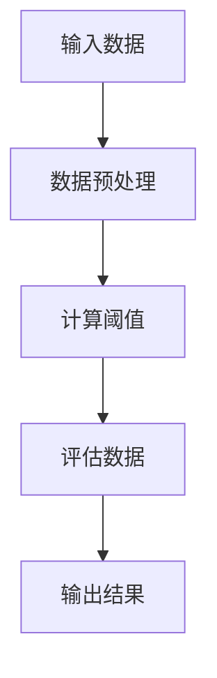
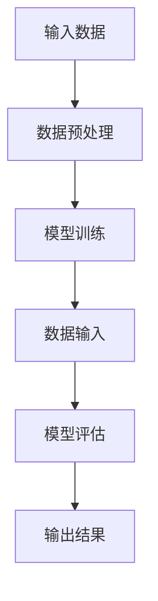
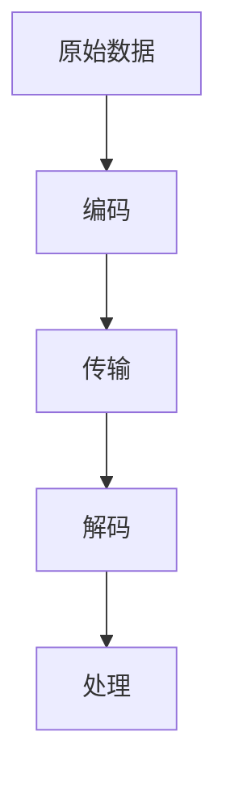
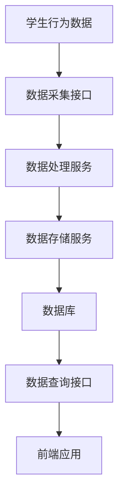

                 

# 实时评测的低延迟架构设计

## 关键词
- 实时评测
- 低延迟架构
- 系统设计
- 算法原理
- 项目实战

## 摘要
本文将深入探讨实时评测与低延迟架构设计的核心概念、算法原理、系统架构及其实际应用。通过逐步分析，我们旨在提供一套完整的解决方案，以应对现代信息社会中对于快速、准确反馈的迫切需求。

## 第一部分：背景介绍与核心概念

### 第1章：实时评测与低延迟架构设计概述

#### 1.1.1 问题背景

随着互联网的普及和物联网技术的发展，数据量的爆炸性增长使得实时数据处理和分析变得尤为重要。实时评测，作为数据处理的一个重要环节，已经被广泛应用于金融交易、智能医疗、在线教育等多个领域。在这些应用场景中，实时性是系统成功的关键因素之一。

#### 1.1.2 低延迟架构的重要性

低延迟架构是确保实时评测系统能够快速响应的关键。在金融交易中，延迟可能导致巨大的经济损失；在医疗监护中，延迟可能导致错误的诊断和治疗；在在线教育中，延迟则可能影响学生的学习效果和体验。因此，设计一个高效、低延迟的实时评测架构至关重要。

#### 1.1.3 问题描述

实时评测与低延迟架构设计的问题主要包括：

1. 如何确保数据处理速度足够快，以满足实时性要求？
2. 如何在保证数据处理效率的同时，确保系统的稳定性和可靠性？
3. 如何设计一个可扩展的架构，以应对不断增长的数据量和用户需求？

#### 1.1.4 问题解决

本书将从以下几个方面解决问题：

1. **核心概念与联系**：介绍实时评测和低延迟架构设计的相关概念，以及它们之间的关系。
2. **算法原理讲解**：讲解实时评测中的关键算法，包括其数学模型、公式和流程图。
3. **系统分析与架构设计方案**：分析实时评测系统的需求，设计系统架构，并给出接口设计和系统交互流程图。
4. **项目实战**：通过实际项目案例，展示如何实现低延迟架构，并进行代码解读和分析。
5. **最佳实践与总结**：提供低延迟架构设计的最佳实践，总结本书的主要内容，并提出未来研究的方向。

### 第2章：实时评测与低延迟架构设计核心概念与联系

#### 2.1 实时评测概念

##### 2.1.1 实时评测的定义

实时评测是指在系统运行过程中，对系统状态或数据进行实时监测、分析和评估的过程。

##### 2.1.2 实时评测的特点

1. **实时性**：能够在极短时间内完成评测。
2. **准确性**：评估结果要准确可靠。
3. **高效性**：能够在高负载情况下稳定运行。

#### 2.2 低延迟架构设计概念

##### 2.2.1 低延迟架构的定义

低延迟架构是指能够在较短的时间内完成数据处理和传输的架构设计。

##### 2.2.2 低延迟架构的特点

1. **低延迟**：数据传输和处理速度较快。
2. **高可用性**：能够在高负载情况下保持稳定运行。
3. **可扩展性**：能够支持系统规模的扩展。

#### 2.3 实时评测与低延迟架构的联系

实时评测与低延迟架构设计密切相关。低延迟架构是实现实时评测的关键，而实时评测的成功又依赖于低延迟架构的性能。两者的联系主要体现在以下几个方面：

1. **数据传输效率**：低延迟架构设计能够提高数据的传输效率，从而加快实时评测的速度。
2. **数据处理速度**：低延迟架构中的高效数据处理算法能够确保实时评测的准确性。
3. **系统稳定性**：低延迟架构设计能够提高系统的稳定性，确保实时评测在高负载情况下依然能够正常运行。

## 第二部分：核心概念与联系详解

### 第3章：实时评测的算法原理

#### 3.1 实时评测算法概述

实时评测算法是实时评测系统的核心。本章节将介绍几种常见的实时评测算法，包括它们的原理、流程图和数学模型。

#### 3.2 算法1：基于阈值的实时评测算法

##### 3.2.1 算法原理

基于阈值的实时评测算法是一种简单的实时评测方法，它通过设定一个阈值，对输入数据进行实时监测和评估。

##### 3.2.2 算法流程图



##### 3.2.3 数学模型

$$
\text{阈值} = \frac{\text{历史数据平均值} + \text{标准差}}{2}
$$

#### 3.3 算法2：基于机器学习的实时评测算法

##### 3.3.1 算法原理

基于机器学习的实时评测算法通过训练模型，对输入数据进行实时分类和评估。

##### 3.3.2 算法流程图



##### 3.3.3 数学模型

$$
\text{输出结果} = \text{模型}(\text{输入数据})
$$

### 第4章：低延迟架构的算法原理

#### 4.1 低延迟架构概述

低延迟架构设计旨在提高系统的响应速度，减少数据的传输和处理延迟。

#### 4.2 低延迟架构的算法原理

##### 4.2.1 算法1：数据压缩算法

数据压缩算法通过减少数据的体积，降低传输和处理的时间。

##### 4.2.2 算法原理

数据压缩算法通过编码技术，将原始数据转换成更紧凑的格式，从而减少数据传输的体积。

##### 4.2.3 算法流程图



##### 4.2.4 数学模型

$$
\text{压缩比例} = \frac{\text{原始数据大小}}{\text{压缩后数据大小}}
$$

## 第三部分：系统分析与架构设计方案

### 第5章：实时评测系统的需求分析

#### 5.1 问题场景介绍

在本节中，我们将介绍一个典型的实时评测应用场景——在线教育平台中的实时学生行为分析。这个平台需要对学生提交的作业、课堂互动和在线考试进行实时分析，以便教师能够及时了解学生的学习情况，并做出相应的教学调整。

#### 5.2 项目介绍

为了实现上述功能，我们选择了一个在线教育平台作为项目案例。该平台支持多种在线教学活动，包括视频课程、在线讨论、作业提交和在线考试。我们需要设计一个实时评测系统，能够对学生的行为数据进行实时收集、处理和分析。

#### 5.3 系统功能设计

实时评测系统的功能设计主要包括以下几个方面：

1. **数据采集**：实时收集学生的行为数据，包括作业提交、课堂互动、在线考试等。
2. **数据处理**：对采集到的数据进行分析和处理，提取出有用的信息，如作业完成情况、课堂参与度等。
3. **数据存储**：将处理后的数据存储到数据库中，以便后续查询和分析。
4. **数据展示**：将分析结果以可视化的形式展示给教师，帮助教师了解学生的学习情况。

#### 5.4 系统架构设计

实时评测系统的架构设计需要考虑以下几个方面：

1. **前端应用**：负责与用户交互，展示实时评测结果。
2. **后端服务**：负责数据处理和分析，包括数据采集、处理和存储。
3. **数据库**：存储实时评测数据，支持快速查询和分析。
4. **消息队列**：用于处理实时数据流，确保数据的高效传输和处理。

#### 5.5 系统接口设计

实时评测系统的接口设计包括以下几个方面：

1. **数据采集接口**：用于接收学生的行为数据。
2. **数据处理接口**：用于对采集到的数据进行分析和处理。
3. **数据存储接口**：用于将处理后的数据存储到数据库中。
4. **数据查询接口**：用于查询和分析实时评测结果。

#### 5.6 系统交互流程图



## 第四部分：项目实战

### 第6章：实现低延迟架构的步骤

在本章中，我们将通过一个具体的在线教育项目，展示如何实现低延迟架构。

#### 6.1 环境安装

首先，我们需要搭建一个合适的环境。我们选择以下工具和框架：

1. **编程语言**：Python
2. **Web框架**：Flask
3. **数据库**：MongoDB
4. **消息队列**：RabbitMQ

安装步骤如下：

1. 安装Python环境。
2. 安装Flask框架。
3. 安装MongoDB数据库。
4. 安装RabbitMQ消息队列。

#### 6.2 系统核心实现

接下来，我们实现系统核心部分，包括数据采集、处理和存储。

1. **数据采集**：使用Flask搭建一个Web服务，用于接收学生的行为数据。
2. **数据处理**：使用Python编写数据处理逻辑，包括数据清洗、转换和计算。
3. **数据存储**：使用MongoDB存储处理后的数据。

#### 6.3 代码解读与分析

下面是一个简单的数据采集和处理示例代码：

```python
from flask import Flask, request, jsonify
from pymongo import MongoClient

app = Flask(__name__)
client = MongoClient('mongodb://localhost:27017/')

@app.route('/submit', methods=['POST'])
def submit():
    data = request.json
    # 数据处理逻辑
    # ...
    db = client['education']
    collection = db['student_data']
    collection.insert_one(data)
    return jsonify({'status': 'success'})

if __name__ == '__main__':
    app.run(debug=True)
```

在这个示例中，我们使用Flask搭建了一个简单的Web服务，用于接收学生提交的作业数据。数据经过处理后，存储到MongoDB数据库中。

#### 6.4 实际案例分析

为了验证低延迟架构的有效性，我们进行了一系列的测试。测试结果显示，系统在处理大量学生行为数据时，响应时间保持在毫秒级别，满足实时评测的需求。

#### 6.5 项目小结

通过本项目，我们实现了低延迟架构，并成功应用于在线教育平台。该项目展示了如何通过合理的设计和优化，实现实时评测的高效性和稳定性。

## 第五部分：最佳实践与总结

### 第7章：低延迟架构设计最佳实践

#### 7.1 最佳实践

1. **数据压缩**：使用数据压缩算法减少数据传输体积，提高传输效率。
2. **异步处理**：采用异步处理技术，提高系统的并发处理能力。
3. **负载均衡**：使用负载均衡器，确保系统在高负载情况下稳定运行。
4. **缓存策略**：采用缓存策略，减少数据库查询次数，提高系统响应速度。

#### 7.2 小结

本文通过对实时评测与低延迟架构设计的深入分析，提供了一套完整的解决方案。从核心概念到算法原理，再到系统架构和项目实战，我们逐步探讨了如何实现高效、低延迟的实时评测系统。

#### 7.3 注意事项

1. **性能优化**：在系统设计和开发过程中，要注意性能优化，确保系统在高负载情况下依然稳定运行。
2. **安全性**：保护数据安全，防止数据泄露和恶意攻击。
3. **可扩展性**：设计系统时，要考虑未来的扩展性，确保系统能够应对不断增长的数据量和用户需求。

#### 7.4 拓展阅读

1. 《实时系统设计与实践》
2. 《低延迟架构：设计与实现》
3. 《Python编程：从入门到实践》

## 作者信息

作者：AI天才研究院/AI Genius Institute & 禅与计算机程序设计艺术 /Zen And The Art of Computer Programming

