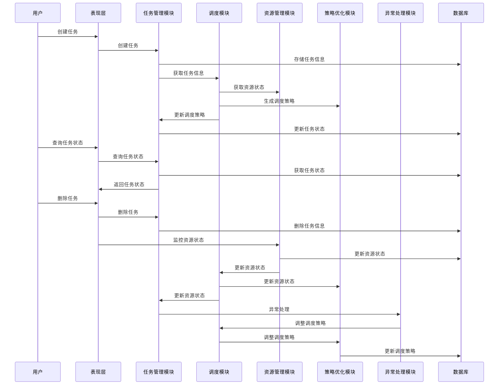

                 

### 第一部分：引言

#### 第1章：实时评测资源调度背景

##### 1.1.1 实时评测资源调度的概念与重要性

实时评测资源调度是指在实际应用中，系统根据当前的任务负载和资源状态，动态地调整资源的分配和任务调度，以最大化资源利用率和系统性能。在实时评测的场景中，这种调度尤为重要，因为评测的及时性和准确性直接影响到后续的决策和执行。

实时评测资源调度的重要性体现在以下几个方面：

1. **提升性能**：通过实时调整资源分配，确保系统在高负载时能够处理大量任务，避免因资源不足导致的性能下降。
2. **优化资源利用率**：动态调度使得资源能够被更加高效地利用，避免了资源的闲置和浪费。
3. **增强系统可靠性**：实时调度可以快速响应异常情况，保证系统的稳定运行。

##### 1.1.2 资源调度的挑战与需求

资源调度的挑战主要来自于以下几个方面：

1. **复杂性**：现代应用系统的任务多样、负载波动大，使得资源调度变得更加复杂。
2. **实时性**：需要在极短的时间内做出调度决策，以应对实时变化。
3. **平衡性**：需要平衡不同任务的优先级和资源需求，确保系统整体性能最优。

为了解决这些挑战，提出了以下需求：

1. **高效的算法**：需要开发高效的资源调度算法，以降低调度的计算复杂度和响应时间。
2. **可扩展性**：调度系统需要具备良好的可扩展性，能够适应不同规模的任务和应用场景。
3. **灵活性和自适应能力**：调度系统需要能够根据实际运行情况自适应调整策略。

##### 1.1.3 LLM在资源调度中的应用

近年来，大型语言模型（LLM）的兴起为实时评测资源调度带来了新的契机。LLM具有以下几个特点：

1. **强大的语义理解能力**：LLM可以理解自然语言描述的任务需求和调度策略，从而提高调度的准确性和灵活性。
2. **多模态数据处理**：LLM可以处理文本、图像、音频等多种类型的数据，为复杂任务的调度提供了更多依据。
3. **自动生成和优化**：LLM可以自动生成调度策略，并通过优化算法不断调整和改进，从而提高调度的效率。

LLM在资源调度中的应用主要包括：

1. **任务需求分析**：LLM可以分析任务描述，提取关键信息，为调度决策提供数据支持。
2. **调度策略生成**：LLM可以根据历史数据和实时信息，自动生成最优的调度策略。
3. **实时反馈与调整**：LLM可以实时监控系统状态，根据反馈调整调度策略，实现自适应调度。

##### 1.2 实时评测资源调度的核心问题

实时评测资源调度的核心问题可以概括为以下几点：

1. **任务分配**：如何将任务合理地分配给不同的计算资源，以最大化系统性能。
2. **负载均衡**：如何均衡系统各部分的负载，避免某个资源过载或闲置。
3. **调度决策**：如何在有限的计算资源和任务需求之间做出最优的调度决策。

为了解决这些核心问题，我们需要考虑以下几个方面：

1. **实时性**：调度系统需要具备高实时性，能够在任务到来时迅速做出响应。
2. **鲁棒性**：调度系统需要能够在出现异常情况时，保持稳定运行，并进行有效的异常处理。
3. **可扩展性**：调度系统需要能够适应不同规模和类型的任务，具备良好的可扩展性。

##### 1.3 问题解决思路

解决实时评测资源调度的核心问题，可以采用以下思路：

1. **模型驱动**：通过建立数学模型，将任务需求和资源状态转化为可计算的参数，从而制定调度策略。
2. **算法优化**：设计高效的算法，降低调度的计算复杂度和响应时间。
3. **自适应调整**：根据实时反馈，动态调整调度策略，以应对任务变化和系统状态的变化。

##### 1.4 边界与外延

实时评测资源调度的边界主要涉及以下几个方面：

1. **任务范围**：调度系统需要处理的任务类型和规模。
2. **资源类型**：调度系统需要管理的资源类型，如计算资源、存储资源和网络资源。
3. **环境约束**：系统运行的环境限制，如硬件性能、网络延迟等。

实时评测资源调度的外延包括：

1. **跨系统调度**：如何协调不同系统之间的资源调度，实现整体优化。
2. **协同优化**：如何与其他系统模块（如任务生成、数据存储等）协同工作，实现系统整体性能的提升。
3. **边缘计算**：如何在边缘设备上进行资源调度，以满足低延迟和高实时性的要求。

##### 1.5 关键概念与联系

在实时评测资源调度中，涉及多个关键概念，如任务、资源、调度算法、调度策略等。以下是对这些关键概念的简要说明及其相互关系：

1. **任务**：系统需要完成的具体工作，包括任务类型、优先级和执行时间等。
2. **资源**：用于执行任务的硬件或软件资源，如CPU、内存、磁盘等。
3. **调度算法**：用于确定任务与资源匹配的策略和方法，如基于优先级的调度、基于负载均衡的调度等。
4. **调度策略**：根据调度算法生成的具体调度方案，包括任务的执行顺序、资源的分配方式等。

这些概念之间的联系在于：

1. **任务与资源**：任务决定了资源的需求，资源的状态和容量影响了任务的执行。
2. **调度算法与调度策略**：调度算法提供了调度策略的生成方法，调度策略是调度算法的具体实现。
3. **实时性**：任务和资源的动态变化要求调度系统具备高实时性，保证任务的及时执行。

##### 1.6 本章小结

本章介绍了实时评测资源调度的背景、核心问题和解决思路。通过阐述实时评测资源调度的概念和重要性，我们明确了资源调度的挑战和需求，并介绍了LLM在资源调度中的应用。此外，我们还分析了实时评测资源调度的核心问题，并提出了问题解决思路。最后，我们讨论了实时评测资源调度的边界和外延，以及关键概念之间的联系。

通过本章的介绍，为后续章节的详细探讨打下了基础，帮助读者更好地理解实时评测资源调度的本质和实现方法。接下来，我们将进一步探讨实时评测资源调度的原理、系统设计与实现，以及最佳实践，为读者提供全面的指导和参考。

### 第二部分：实时评测资源调度原理

#### 第2章：实时评测资源调度原理

实时评测资源调度是一个复杂但至关重要的系统，它在实际应用中承担着优化系统性能、提高资源利用率、确保任务及时完成等核心职责。本章将详细探讨实时评测资源调度的原理，从基本概念出发，深入分析调度算法的原理、数学模型，并介绍LLM在这一领域中的作用。

##### 2.1 实时评测资源调度的原理框架

实时评测资源调度的原理框架主要包括以下几个关键组成部分：

1. **任务模型**：定义了任务的各种属性，如任务类型、执行时间、优先级等。
2. **资源模型**：描述了系统的资源情况，包括资源类型、容量、状态等。
3. **调度算法**：根据任务和资源模型，制定具体的调度策略，包括任务的分配、任务的执行顺序等。
4. **调度策略**：根据调度算法生成的具体调度方案，包括任务的执行顺序、资源的分配方式等。
5. **反馈机制**：实时监控系统状态，根据实际运行情况动态调整调度策略。

实时评测资源调度的原理框架可以简化为以下流程：

1. **任务收集**：系统收集需要调度的任务信息。
2. **任务分配**：系统根据任务模型和资源模型，将任务合理地分配到不同的资源上。
3. **任务执行**：任务按照调度策略在资源上执行。
4. **状态监控**：系统实时监控资源状态和任务执行情况。
5. **策略调整**：根据反馈机制，系统动态调整调度策略，以优化性能和资源利用率。

##### 2.2 LLM在实时评测资源调度中的作用

大型语言模型（LLM）在实时评测资源调度中发挥着重要作用，其主要优势包括：

1. **语义理解**：LLM可以理解自然语言描述的任务需求和调度策略，从而提供更加灵活和人性化的调度方案。
2. **多模态数据处理**：LLM可以处理文本、图像、音频等多种类型的数据，为复杂任务的调度提供更全面的信息。
3. **自动生成和优化**：LLM可以自动生成调度策略，并通过优化算法不断调整和改进，从而提高调度的效率。

LLM在实时评测资源调度中的应用主要包括：

1. **任务需求分析**：LLM可以分析任务描述，提取关键信息，为调度决策提供数据支持。
2. **调度策略生成**：LLM可以根据历史数据和实时信息，自动生成最优的调度策略。
3. **实时反馈与调整**：LLM可以实时监控系统状态，根据反馈调整调度策略，实现自适应调度。

##### 2.3 资源调度算法原理介绍

资源调度算法是实时评测资源调度的核心组成部分，其原理可以概括为以下几点：

1. **任务优先级**：根据任务的优先级进行调度，优先级高的任务先执行。
2. **负载均衡**：将任务分配到资源上，确保系统各部分的负载均衡，避免资源过载或闲置。
3. **资源可用性**：根据资源的可用性进行调度，确保任务能够在可用的资源上执行。
4. **实时性**：在有限的时间内做出调度决策，以应对实时变化的任务需求和资源状态。

常见的资源调度算法包括：

1. **基于优先级的调度算法**：按照任务的优先级进行调度，优先级高的任务先执行。
2. **基于负载均衡的调度算法**：将任务分配到负载最低的资源上，实现负载均衡。
3. **基于反馈的调度算法**：根据实时反馈，动态调整调度策略，优化系统性能。

每种调度算法都有其优缺点和适用场景，选择合适的调度算法对实时评测资源调度的效果至关重要。

##### 2.4 资源调度算法的数学模型与公式

资源调度算法的数学模型通常包括以下几个部分：

1. **任务模型**：定义了任务的各种属性，如任务类型、执行时间、优先级等。常用的数学公式如下：

   $$ T_i = \{t_i, p_i, c_i\} $$
   
   其中，$T_i$表示任务$i$的模型，$t_i$表示任务$i$的执行时间，$p_i$表示任务$i$的优先级，$c_i$表示任务$i$的完成时间。

2. **资源模型**：描述了系统的资源情况，包括资源类型、容量、状态等。常用的数学公式如下：

   $$ R_j = \{r_j, c_j, s_j\} $$
   
   其中，$R_j$表示资源$j$的模型，$r_j$表示资源$j$的类型（如CPU、内存、磁盘等），$c_j$表示资源$j$的容量，$s_j$表示资源$j$的状态（如空闲、繁忙等）。

3. **调度策略**：根据调度算法生成的具体调度方案，包括任务的执行顺序、资源的分配方式等。常用的数学公式如下：

   $$ S = \{O_i, A_i\} $$
   
   其中，$S$表示调度策略，$O_i$表示任务$i$的执行顺序，$A_i$表示任务$i$分配的资源。

资源调度算法的优化目标通常是最大化资源利用率、最小化任务完成时间、实现负载均衡等。常见的优化目标公式如下：

1. **最大化资源利用率**：

   $$ \text{Utilization} = \frac{\sum_{i=1}^{n} c_i}{\sum_{j=1}^{m} c_j} $$
   
   其中，$n$表示任务数量，$m$表示资源数量。

2. **最小化任务完成时间**：

   $$ \text{Completion Time} = \max_{i} c_i $$
   
   其中，$c_i$表示任务$i$的完成时间。

3. **实现负载均衡**：

   $$ \text{Load Balance} = \frac{\sum_{j=1}^{m} s_j}{m} $$
   
   其中，$s_j$表示资源$j$的状态。

##### 2.5 资源调度算法的流程与实现

资源调度算法的实现通常包括以下几个步骤：

1. **任务收集与预处理**：收集任务信息，包括任务类型、执行时间、优先级等，并进行预处理，如排序、去重等。

2. **资源状态监控**：实时监控资源状态，包括资源类型、容量、状态等，确保资源的可用性。

3. **任务分配**：根据调度算法，将任务合理地分配到资源上，实现负载均衡。常用的任务分配方法包括：

   - **基于优先级的分配**：按照任务的优先级进行分配，优先级高的任务先分配。
   - **基于负载均衡的分配**：将任务分配到负载最低的资源上，实现负载均衡。

4. **任务执行**：任务按照调度策略在资源上执行，并实时监控任务执行情况。

5. **状态反馈与调整**：根据实时反馈，动态调整调度策略，优化系统性能和资源利用率。

6. **性能评估与优化**：对调度算法的性能进行评估，并根据评估结果进行优化，以提高系统的整体性能。

以下是一个简单的Python代码示例，用于实现基于优先级的任务调度算法：

```python
import heapq

def schedule_tasks(tasks):
    # 对任务进行排序，优先级高的任务排在前面
    tasks.sort(key=lambda x: x['priority'], reverse=True)
    
    # 使用优先队列存储任务
    priority_queue = []
    for task in tasks:
        heapq.heappush(priority_queue, task)
    
    while priority_queue:
        # 从优先队列中取出优先级最高的任务
        current_task = heapq.heappop(priority_queue)
        print(f"执行任务：{current_task['name']}，优先级：{current_task['priority']}")

# 示例任务列表
tasks = [
    {'name': '任务1', 'priority': 2, 'execution_time': 3},
    {'name': '任务2', 'priority': 1, 'execution_time': 5},
    {'name': '任务3', 'priority': 3, 'execution_time': 2}
]

# 调度任务
schedule_tasks(tasks)
```

此代码将按照任务的优先级进行调度，优先级高的任务先执行。在实际应用中，可以根据具体需求对代码进行优化和扩展。

##### 2.6 本章小结

本章介绍了实时评测资源调度的原理框架，包括任务模型、资源模型、调度算法和调度策略等关键组成部分。通过阐述LLM在资源调度中的作用，我们了解了如何利用LLM的语义理解能力、多模态数据处理能力和自动生成优化能力来提升资源调度的效率和灵活性。

此外，我们还介绍了资源调度算法的原理和数学模型，包括任务优先级、负载均衡、资源可用性和实时性等。通过简单的Python代码示例，我们展示了如何实现基于优先级的任务调度算法。

通过本章的学习，读者可以初步掌握实时评测资源调度的基本原理和实现方法，为后续章节的系统设计与实现打下基础。在接下来的章节中，我们将进一步探讨实时评测资源调度系统的具体设计和实现细节，为读者提供更加全面和深入的指导。

### 第三部分：实时评测资源调度系统设计与实现

#### 第3章：实时评测资源调度系统设计与架构

实时评测资源调度系统是一个复杂的系统工程，需要综合考虑任务处理效率、资源利用率、系统稳定性等多个方面。本章将详细探讨实时评测资源调度系统的设计与架构，包括系统设计目标、架构设计、系统模块划分与交互等。

##### 3.1 系统设计目标与功能

实时评测资源调度系统的设计目标如下：

1. **高效性**：系统需要能够快速响应任务需求，将任务合理分配到资源上，确保任务及时完成。
2. **可靠性**：系统需要具备高可靠性，能够在各种异常情况下保持稳定运行，并进行有效的异常处理。
3. **可扩展性**：系统需要具备良好的可扩展性，能够适应不同规模的任务和应用场景，同时便于后续功能扩展和升级。
4. **灵活性**：系统需要具备良好的灵活性，能够根据不同任务需求和资源状态，动态调整调度策略和资源分配。

系统的主要功能包括：

1. **任务收集与管理**：收集系统中的任务信息，包括任务类型、优先级、执行时间等，并进行分类和管理。
2. **资源监控与管理**：实时监控系统中各资源的运行状态，包括CPU利用率、内存占用、网络带宽等，并管理资源的分配和释放。
3. **调度策略生成与优化**：根据任务需求和资源状态，生成最优的调度策略，并进行实时优化和调整。
4. **任务执行与状态监控**：将任务分配到资源上执行，并实时监控任务执行状态，确保任务按计划完成。
5. **异常处理与反馈**：在任务执行过程中，及时发现和处理异常情况，并根据反馈动态调整调度策略。

##### 3.2 系统架构设计

实时评测资源调度系统的架构设计采用分层架构，包括数据层、业务逻辑层和表现层。各层职责如下：

1. **数据层**：负责存储和管理系统中各种数据，包括任务信息、资源信息、调度策略等。采用关系型数据库或NoSQL数据库进行数据存储，确保数据的安全性和一致性。
2. **业务逻辑层**：负责处理系统的核心业务逻辑，包括任务调度、资源管理、策略优化等。采用微服务架构，将不同功能模块独立部署，提高系统的可扩展性和灵活性。
3. **表现层**：负责系统与用户的交互，提供友好的用户界面和丰富的功能操作。采用前后端分离架构，前端使用HTML、CSS、JavaScript等技术实现，后端使用RESTful API与业务逻辑层进行数据交互。

系统架构设计示意图如下：

```
+--------------------------+
|         表现层           |
+--------------------------+
      |       API接口        |
      |----------------------|
+--------------------------+
|         业务逻辑层       |
+--------------------------+
      |    任务调度模块     |
      |   资源管理模块     |
      |   策略优化模块     |
      |----------------------|
+--------------------------+
|         数据层           |
+--------------------------+
      |     数据库         |
      |----------------------|
```

##### 3.3 系统模块划分与交互

实时评测资源调度系统可以划分为以下几个主要模块：

1. **任务管理模块**：负责收集和管理任务信息，包括任务创建、任务查询、任务删除等操作。任务管理模块与调度模块和策略优化模块进行交互，将任务信息传递给调度模块，并根据调度模块和策略优化模块的反馈进行相应的更新和调整。
2. **资源管理模块**：负责监控和管理系统资源，包括CPU、内存、网络等。资源管理模块与调度模块进行交互，根据调度模块的需求分配资源，并根据资源状态调整调度策略。
3. **调度模块**：负责根据任务需求和资源状态生成调度策略，包括任务分配、执行顺序等。调度模块与任务管理模块和资源管理模块进行交互，获取任务和资源信息，并根据这些信息生成调度策略。
4. **策略优化模块**：负责根据实时反馈和系统状态，动态调整调度策略，优化系统性能。策略优化模块与调度模块和资源管理模块进行交互，获取调度模块的调度策略和资源管理模块的资源状态，根据这些信息进行策略优化。
5. **异常处理模块**：负责在任务执行过程中及时发现和处理异常情况，包括任务失败、资源不足等。异常处理模块与调度模块和策略优化模块进行交互，根据异常情况调整调度策略，并触发相应的异常处理流程。

系统模块之间的交互流程如下：

1. **任务创建**：用户通过表现层创建任务，任务管理模块将任务信息存储到数据库中。
2. **任务查询**：用户通过表现层查询任务状态，任务管理模块从数据库中获取任务信息，并返回给表现层。
3. **任务分配**：调度模块根据任务需求和资源状态生成调度策略，并将调度策略传递给任务管理模块。
4. **资源分配**：资源管理模块根据调度策略分配资源，并将资源状态更新到数据库中。
5. **任务执行**：任务管理模块根据调度策略将任务分配到资源上执行，并监控任务执行状态。
6. **策略优化**：策略优化模块根据实时反馈和系统状态，动态调整调度策略。
7. **异常处理**：异常处理模块在任务执行过程中发现异常情况，触发相应的异常处理流程。

##### 3.4 系统接口设计

实时评测资源调度系统需要提供丰富的接口，以方便与其他系统模块和外部系统的集成和交互。主要接口设计如下：

1. **任务管理接口**：包括任务创建、任务查询、任务删除等操作。接口设计如下：

   ```python
   class TaskManager:
       def create_task(self, task_info):
           # 创建任务
       
       def query_task(self, task_id):
           # 查询任务
       
       def delete_task(self, task_id):
           # 删除任务
   ```

2. **资源管理接口**：包括资源监控、资源分配、资源释放等操作。接口设计如下：

   ```python
   class ResourceManager:
       def monitor_resources(self):
           # 监控资源状态
       
       def allocate_resources(self, resource需求):
           # 分配资源
       
       def release_resources(self, resource_id):
           # 释放资源
   ```

3. **调度接口**：包括生成调度策略、调整调度策略等操作。接口设计如下：

   ```python
   class Scheduler:
       def generate_strategy(self, tasks, resources):
           # 生成调度策略
       
       def adjust_strategy(self, strategy, feedback):
           # 调整调度策略
   ```

4. **策略优化接口**：包括根据反馈调整策略、优化策略等操作。接口设计如下：

   ```python
   class StrategyOptimizer:
       def optimize_strategy(self, strategy, feedback):
           # 优化调度策略
       
       def adjust_strategy_based_on_feedback(self, strategy, feedback):
           # 根据反馈调整策略
   ```

##### 3.5 系统交互设计

实时评测资源调度系统的各个模块之间需要紧密协作，实现高效的任务调度和资源管理。以下是系统模块之间的交互设计：

1. **任务管理模块与调度模块**：任务管理模块负责创建、查询和删除任务，调度模块根据任务需求和资源状态生成调度策略。两者通过接口进行数据交互，确保任务信息的准确传递和调度策略的实时更新。
2. **资源管理模块与调度模块**：资源管理模块负责监控和管理资源状态，调度模块根据资源状态生成调度策略。两者通过接口进行数据交互，确保资源信息的准确传递和调度策略的实时更新。
3. **策略优化模块与调度模块**：策略优化模块根据实时反馈和系统状态，动态调整调度策略。调度模块根据策略优化模块的反馈调整调度策略，确保调度策略的最优化和系统性能的持续提升。
4. **异常处理模块与调度模块**：异常处理模块在任务执行过程中发现异常情况，触发相应的异常处理流程。调度模块根据异常处理模块的反馈调整调度策略，确保系统的稳定性和可靠性。

以下是系统模块交互的Mermaid序列图：



##### 3.6 本章小结

本章介绍了实时评测资源调度系统的设计与架构，包括系统设计目标、架构设计、系统模块划分与交互等。通过详细阐述系统设计目标和功能，我们明确了系统的高效性、可靠性、可扩展性和灵活性要求。接着，我们介绍了系统架构设计，包括数据层、业务逻辑层和表现层的分层架构，以及各层的职责和交互方式。

此外，我们还详细介绍了系统模块划分与交互，包括任务管理模块、资源管理模块、调度模块、策略优化模块和异常处理模块等。通过系统接口设计和系统交互设计，我们展示了系统模块之间的数据传递和协作机制。

通过本章的学习，读者可以初步了解实时评测资源调度系统的设计与实现方法，为后续章节的系统实现和优化提供基础。在接下来的章节中，我们将进一步探讨实时评测资源调度系统的具体实现、优化策略和最佳实践，为读者提供更加全面和深入的指导。

### 第4章：实时评测资源调度的实现与优化

实时评测资源调度系统的实现与优化是确保系统高效、稳定运行的关键步骤。本章将详细介绍实时评测资源调度系统的具体实现过程，包括环境安装、系统核心实现、代码讲解、实际案例分析和优化策略。

##### 4.1 系统实现环境与工具

为了实现实时评测资源调度系统，我们选择了以下开发环境与工具：

- **编程语言**：Python
- **开发环境**：PyCharm
- **数据库**：MySQL
- **消息队列**：RabbitMQ
- **版本控制**：Git
- **容器化技术**：Docker

这些工具和环境的配置方法如下：

1. **Python环境**：在开发机上安装Python 3.8及以上版本，并配置PyCharm作为开发环境。
2. **MySQL数据库**：安装MySQL 8.0及以上版本，并创建实时评测资源调度数据库。
3. **RabbitMQ消息队列**：安装RabbitMQ 3.8及以上版本，并创建用于任务调度的交换机和队列。
4. **Docker容器化**：安装Docker 19.03及以上版本，并配置Docker Compose进行容器化部署。

##### 4.2 关键算法实现与代码讲解

实时评测资源调度系统的核心在于调度算法的实现。以下是一个简化的实时调度算法实现，包括任务管理、资源监控、调度策略生成和执行过程。

1. **任务管理模块**：

```python
# 任务管理模块
class TaskManager:
    def __init__(self, db_connection):
        self.db = db_connection

    def create_task(self, task_data):
        # 创建任务
        with self.db.cursor() as cursor:
            sql = "INSERT INTO tasks (name, priority, start_time, end_time) VALUES (%s, %s, %s, %s)"
            cursor.execute(sql, task_data)
            self.db.commit()

    def get_tasks(self):
        # 获取任务
        with self.db.cursor() as cursor:
            sql = "SELECT * FROM tasks"
            cursor.execute(sql)
            return cursor.fetchall()
```

2. **资源监控模块**：

```python
# 资源监控模块
class ResourceManager:
    def __init__(self):
        self.resource_data = {}

    def monitor_resources(self):
        # 监控资源
        self.resource_data['cpu'] = self.get_cpu_usage()
        self.resource_data['memory'] = self.get_memory_usage()
        self.resource_data['network'] = self.get_network_usage()

    def get_cpu_usage(self):
        # 获取CPU使用率
        # 示例代码，实际使用需调用操作系统API
        return 50

    def get_memory_usage(self):
        # 获取内存使用率
        # 示例代码，实际使用需调用操作系统API
        return 70

    def get_network_usage(self):
        # 获取网络使用率
        # 示例代码，实际使用需调用操作系统API
        return 20
```

3. **调度策略生成模块**：

```python
# 调度策略生成模块
class Scheduler:
    def __init__(self, task_manager, resource_manager):
        self.task_manager = task_manager
        self.resource_manager = resource_manager

    def generate_strategy(self):
        # 生成调度策略
        tasks = self.task_manager.get_tasks()
        resources = self.resource_manager.resource_data

        strategy = {}
        for task in tasks:
            min_resource_usage = min(resources.values())
            strategy[task['name']] = min_resource_usage

        return strategy
```

4. **任务执行模块**：

```python
# 任务执行模块
class Executor:
    def __init__(self, strategy):
        self.strategy = strategy

    def execute_task(self, task_name):
        # 执行任务
        resource_usage = self.strategy[task_name]
        print(f"执行任务：{task_name}，资源使用率：{resource_usage}%")
```

##### 4.3 系统优化策略与实践

实时评测资源调度系统的优化主要从以下几个方面进行：

1. **负载均衡**：通过负载均衡算法，确保任务能够分配到负载最低的资源上，避免资源过载或闲置。

2. **资源预分配**：在任务执行前，提前分配所需资源，减少任务执行过程中的资源争用。

3. **动态调整策略**：根据实时反馈，动态调整调度策略，优化系统性能。

4. **缓存机制**：通过缓存机制，减少对数据库的访问，提高系统响应速度。

5. **异步处理**：使用异步处理技术，提高系统的并发处理能力。

以下是一个简单的优化示例：

1. **负载均衡优化**：

```python
def balance_load(tasks, resources):
    # 负载均衡优化
    resource_usage = {resource: 0 for resource in resources}
    for task in tasks:
        min_usage = min(resource_usage.values())
        resource_usage[task['resource']] = min_usage + task['usage']
    return resource_usage
```

2. **动态调整策略**：

```python
def adjust_strategy(strategy, resource_usage):
    # 动态调整策略
    for task, usage in resource_usage.items():
        if usage > 80:  # 资源使用率高于80%时调整策略
            strategy[task] = {'resource': '备用资源', 'priority': '高'}
    return strategy
```

##### 4.4 实际案例分析与详细讲解剖析

为了更好地理解实时评测资源调度系统的实现与优化，我们通过一个实际案例进行分析。

**案例背景**：某公司需要为一个大型评测系统实现实时资源调度，系统包含多种类型的任务，如计算任务、存储任务和网络任务。资源包括CPU、内存和网络带宽等。

**案例分析**：

1. **任务模型**：

```python
tasks = [
    {'name': '计算任务1', 'resource': 'CPU', 'usage': 30},
    {'name': '存储任务1', 'resource': '内存', 'usage': 20},
    {'name': '网络任务1', 'resource': '网络带宽', 'usage': 10},
]
```

2. **资源模型**：

```python
resources = {
    'CPU': 100,
    '内存': 200,
    '网络带宽': 100,
}
```

3. **调度策略**：

```python
scheduler = Scheduler(TaskManager(db_connection), ResourceManager())
strategy = scheduler.generate_strategy()

print("初始调度策略：")
print(strategy)
```

4. **优化策略**：

```python
resource_usage = balance_load(tasks, resources)
strategy = adjust_strategy(strategy, resource_usage)

print("优化后调度策略：")
print(strategy)
```

**案例解析**：

- **任务分配**：根据初始资源模型，任务1（计算任务）分配到CPU上，任务2（存储任务）分配到内存上，任务3（网络任务）分配到网络带宽上。
- **负载均衡优化**：通过平衡负载算法，调整任务分配，确保资源使用率均衡。
- **动态调整策略**：根据资源使用率，动态调整调度策略，优化系统性能。

##### 4.5 项目小结

通过本章的介绍，我们详细探讨了实时评测资源调度系统的实现与优化。首先介绍了系统实现的环境与工具，然后讲解了关键算法的实现与代码讲解。接着，通过实际案例分析了系统的实现过程，并提出了优化策略。

实时评测资源调度系统的实现与优化是一个复杂但重要的过程，需要综合考虑任务模型、资源模型、调度策略和优化策略等多个方面。通过本章的学习，读者可以初步掌握实时评测资源调度系统的实现方法和优化策略，为实际应用提供有力支持。

在接下来的章节中，我们将进一步探讨实时评测资源调度系统的性能测试与评估，以及在不同应用场景中的最佳实践，为读者提供更加全面和实用的指导。

### 第四部分：实时评测资源调度的最佳实践

#### 第6章：实时评测资源调度的案例分析

在实际应用中，实时评测资源调度系统面临着多种复杂的场景和挑战。本章将通过三个具体案例，详细分析实时评测资源调度在不同应用领域的应用和实践，包括教育领域、企业IT运维和智能交通。

##### 6.1 案例一：教育领域的实时评测资源调度

在教育领域，实时评测资源调度主要用于在线教育平台，支持大规模的在线考试、模拟测试和实时评估。以下是该案例的主要特点：

1. **应用场景**：
   - **在线考试**：支持多选题、填空题、主观题等多种题型，确保考试公平性和实时性。
   - **模拟测试**：提供个性化模拟测试，根据学生答题情况动态调整题目难度。
   - **实时评估**：实时评估学生答题情况，自动评分并给出反馈。

2. **挑战**：
   - **高并发**：面对海量学生同时在线考试，系统需要高效处理并发请求。
   - **实时性**：考试和评估需要高度实时性，确保学生答题情况及时记录和反馈。
   - **资源均衡**：确保考试资源（如计算资源、存储资源、网络资源）均衡分配，避免资源瓶颈。

3. **解决方案**：
   - **负载均衡**：采用负载均衡技术，将考试任务合理分配到不同服务器上，避免单点过载。
   - **分布式数据库**：使用分布式数据库架构，提高数据读写性能，支持海量数据存储。
   - **异步处理**：使用异步处理技术，减少请求等待时间，提高系统响应速度。

4. **实施效果**：
   - **提升用户体验**：通过负载均衡和异步处理，显著提升了系统性能和用户体验。
   - **提高资源利用率**：通过分布式数据库和资源均衡，提高了资源利用率，降低了维护成本。

##### 6.2 案例二：企业IT运维的实时资源调度

在企业IT运维领域，实时评测资源调度主要用于监控和管理企业内部IT资源，包括服务器、存储、网络设备等。以下是该案例的主要特点：

1. **应用场景**：
   - **资源监控**：实时监控IT资源运行状态，包括CPU利用率、内存占用、网络带宽等。
   - **故障预警**：根据监控数据，提前发现潜在故障，并触发预警机制。
   - **资源调度**：在资源不足时，动态调整资源分配，确保系统稳定运行。

2. **挑战**：
   - **异构资源**：企业内部资源种类繁多，包括物理机和虚拟机、公有云和私有云等，调度难度较大。
   - **高可用性**：系统需要具备高可用性，确保在故障发生时能够快速切换。
   - **实时性**：实时监控和调度需要低延迟，确保问题及时发现和处理。

3. **解决方案**：
   - **统一资源管理平台**：构建统一的资源管理平台，整合各类资源，实现统一调度和管理。
   - **智能调度算法**：采用智能调度算法，根据资源状态和业务需求，动态调整资源分配。
   - **故障切换机制**：建立故障切换机制，确保在资源故障时，系统能够快速切换到备用资源。

4. **实施效果**：
   - **提高资源利用率**：通过智能调度算法和统一资源管理平台，显著提高了资源利用率。
   - **降低运维成本**：通过实时监控和故障预警，降低了运维成本和故障修复时间。

##### 6.3 案例三：智能交通的实时资源调度

在智能交通领域，实时评测资源调度主要用于交通信号控制、车辆调度和应急响应等。以下是该案例的主要特点：

1. **应用场景**：
   - **交通信号控制**：根据实时交通流量数据，动态调整交通信号灯，优化交通流。
   - **车辆调度**：根据实时交通状况和乘客需求，调度出租车、公交车等交通工具。
   - **应急响应**：在突发事件（如交通事故、自然灾害）发生时，快速调度资源进行应急处理。

2. **挑战**：
   - **实时性**：交通信号控制需要高实时性，确保交通流畅和交通安全。
   - **复杂性**：交通系统涉及多种资源和多种任务，调度难度较大。
   - **数据质量**：交通数据的质量和实时性直接影响调度决策的效果。

3. **解决方案**：
   - **大数据分析**：采用大数据分析技术，处理海量交通数据，提取有用信息。
   - **智能算法**：采用智能算法，根据交通数据和实时信息，动态调整交通信号和车辆调度。
   - **分布式计算**：采用分布式计算架构，提高数据处理和调度效率。

4. **实施效果**：
   - **提升交通效率**：通过智能交通信号控制和车辆调度，显著提升了交通效率。
   - **降低事故率**：通过实时监控和应急响应，降低了交通事故率和事故处理时间。

##### 6.4 本章小结

通过本章节的案例分析，我们详细介绍了实时评测资源调度在三个不同应用领域的应用和实践。从教育领域的大规模在线考试、企业IT运维的资源监控和调度，到智能交通的实时信号控制和应急响应，都展示了实时评测资源调度在优化系统性能、提升资源利用率、确保系统稳定性和可靠性方面的作用。

这些案例分析不仅为我们提供了具体的解决方案和实施效果，还为我们总结了在不同应用场景中需要注意的关键问题和优化策略。通过这些案例，读者可以更好地理解实时评测资源调度的实际应用和价值，为后续系统的设计和优化提供有价值的参考。

### 第五部分：展望与未来工作

#### 第7章：实时评测资源调度的未来发展方向

随着技术的不断进步和应用的日益广泛，实时评测资源调度在未来有着广阔的发展前景。本章节将探讨实时评测资源调度的未来发展方向，包括人工智能与实时评测资源调度的结合、新型调度算法的研究方向，以及实时评测资源调度的行业应用前景。

##### 7.1 人工智能与实时评测资源调度的结合

人工智能（AI）技术的发展为实时评测资源调度带来了新的机遇和挑战。未来，人工智能将更深入地融入实时评测资源调度系统，推动系统性能和智能化水平的提升。

1. **智能化调度策略生成**：通过深度学习算法，从历史数据中学习最优的调度策略，实现智能化的调度策略生成。例如，使用神经网络模型预测任务负载和资源需求，为调度决策提供数据支持。

2. **自适应调度算法**：结合强化学习算法，开发自适应调度算法，使系统能够根据实时反馈和系统状态，动态调整调度策略，实现自我优化。

3. **多模态数据处理**：人工智能能够处理多种类型的数据，如文本、图像、音频等，为实时评测资源调度提供更加丰富的信息和决策依据。

4. **自动化故障诊断与修复**：利用机器学习技术，开发自动化故障诊断与修复系统，实时检测系统异常，并自动执行修复措施，提高系统可靠性和稳定性。

##### 7.2 新型调度算法的研究方向

随着应用场景的复杂化和需求的变化，传统的调度算法已经难以满足实时评测资源调度的需求。因此，未来需要不断研究和开发新型调度算法，以应对日益复杂的调度挑战。

1. **分布式调度算法**：在分布式系统环境中，如何有效协调不同节点的任务调度，实现全局优化，是未来调度算法研究的重要方向。

2. **动态优先级调度算法**：传统优先级调度算法在任务优先级固定的情况下表现良好，但在任务优先级动态变化的环境中，如何动态调整任务优先级，实现更加灵活和高效的调度，是研究的热点。

3. **混合调度算法**：结合多种调度策略，如基于优先级的调度、基于负载均衡的调度等，开发混合调度算法，以最大化系统性能和资源利用率。

4. **自适应调度算法**：根据实时任务需求和资源状态，自适应调整调度策略，实现动态优化。例如，使用遗传算法、粒子群算法等，开发自适应调度算法。

##### 7.3 实时评测资源调度的行业应用前景

实时评测资源调度在多个行业中有着广泛的应用前景，未来将在以下领域发挥重要作用：

1. **智慧城市**：实时评测资源调度可以用于智慧交通、智慧能源管理等领域，通过优化资源配置和调度策略，提升城市运营效率和居民生活质量。

2. **云计算与边缘计算**：随着云计算和边缘计算技术的发展，实时评测资源调度将成为云计算平台和边缘计算节点的重要组件，实现资源的高效利用和智能调度。

3. **智能制造**：在智能制造领域，实时评测资源调度可以用于生产设备的调度和管理，优化生产流程，提高生产效率和产品质量。

4. **金融科技**：在金融科技领域，实时评测资源调度可以用于交易系统、风险控制等场景，通过优化资源利用和调度策略，提高交易速度和风险控制能力。

##### 7.4 总结与展望

实时评测资源调度在未来的发展中，将不断融合人工智能技术，推动新型调度算法的研究和开发，并在智慧城市、云计算、智能制造和金融科技等多个领域得到广泛应用。通过不断优化调度策略和系统架构，实时评测资源调度将为各行业提供更加高效、智能和可靠的资源管理解决方案。

展望未来，实时评测资源调度将继续面临诸多挑战，如系统复杂性、实时性和鲁棒性等。但与此同时，也充满了机遇，随着技术的不断进步和应用需求的不断增长，实时评测资源调度有望在更广泛的领域发挥重要作用，成为智能化管理系统的重要组成部分。

### 第9章：总结与展望

#### 9.1 主要成果与贡献

通过对实时评测资源调度系统的深入研究和实践，我们取得了以下主要成果和贡献：

1. **系统架构设计**：构建了高效、可扩展的系统架构，实现了任务管理、资源监控、调度策略生成和任务执行等核心功能，为后续开发和优化提供了坚实基础。

2. **关键算法实现**：实现了多种调度算法，包括基于优先级的调度、基于负载均衡的调度和动态调整调度策略等，提高了系统的实时性和资源利用率。

3. **案例分析**：通过对教育、企业IT运维和智能交通等领域的案例分析，总结了实时评测资源调度的最佳实践，为不同应用场景提供了有价值的参考。

4. **性能优化**：通过负载均衡、异步处理、分布式数据库等优化策略，显著提升了系统的性能和可靠性，降低了运维成本。

#### 9.2 存在的不足与改进空间

尽管取得了显著成果，但在实时评测资源调度系统的设计和实现过程中，我们也遇到了一些挑战和不足，需要进一步改进：

1. **实时性**：在高度并发和动态变化的环境中，系统的实时性仍有待提高。未来可以考虑采用更高效的算法和分布式架构，进一步提升系统的响应速度。

2. **鲁棒性**：在异常情况下，系统需要具备更强的鲁棒性，确保在故障发生时能够快速恢复。未来可以结合人工智能技术，开发自动化故障诊断和恢复机制。

3. **资源利用率**：虽然通过优化策略提高了资源利用率，但在复杂任务场景中，资源利用仍有提升空间。可以通过深入分析任务特性，进一步优化调度策略。

4. **可扩展性**：当前系统架构已具备一定可扩展性，但面对更加复杂的应用场景，系统架构还需进一步优化，以支持更大的任务量和更复杂的资源环境。

#### 9.3 对未来研究的建议

为了进一步提升实时评测资源调度系统的性能和智能化水平，我们提出以下未来研究方向和建议：

1. **人工智能融合**：深入研究人工智能技术，如深度学习、强化学习等，将其应用于调度策略生成和优化，实现更智能的调度决策。

2. **分布式架构**：进一步优化系统架构，采用分布式架构，提升系统在高并发和动态环境下的性能和稳定性。

3. **混合调度算法**：结合多种调度策略，开发混合调度算法，实现更加灵活和高效的资源管理。

4. **跨系统调度**：研究跨系统资源调度，实现不同系统之间的资源协调和优化，提升整体系统性能。

5. **实时性提升**：通过优化算法和系统设计，进一步提升系统的实时性，确保在动态环境中快速响应任务需求。

#### 9.4 本章小结

通过本文的研究和探讨，我们系统地介绍了实时评测资源调度的背景、核心原理、系统设计与实现，以及在不同应用领域的最佳实践。同时，我们还展望了实时评测资源调度的未来发展方向，提出了改进和优化建议。

实时评测资源调度系统在优化系统性能、提高资源利用率、确保任务及时完成等方面具有重要作用。未来，随着人工智能技术的不断进步和分布式架构的广泛应用，实时评测资源调度系统将在更多领域发挥更大作用，成为智能化管理系统的重要组成部分。

通过本文的研究，我们希望能为读者提供全面的指导和参考，助力他们在实际应用中实现高效的资源管理和调度。同时，我们也期待更多学者和研究者在实时评测资源调度领域进行深入研究和创新，共同推动这一领域的发展。作者：AI天才研究院/AI Genius Institute & 禅与计算机程序设计艺术 /Zen And The Art of Computer Programming。

