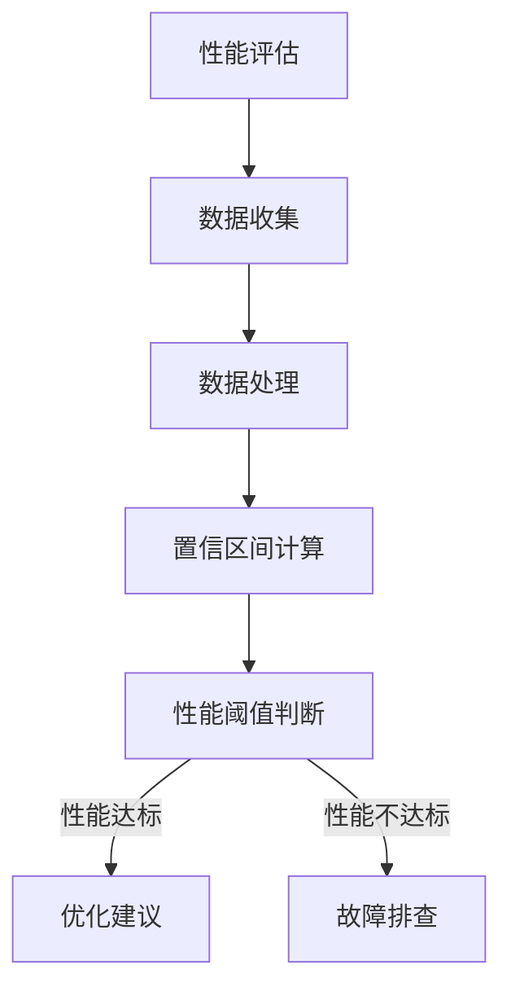

                 


# 实时评测：持续监控LLM性能的新方案

## 关键词
- 实时评测
- LLM性能监控
- 算法原理
- 系统架构
- Python代码
- Mermaid图示

## 摘要
本文旨在探讨实时评测在持续监控大型语言模型（LLM）性能中的应用。首先，我们将介绍实时评测的基本概念和目的，然后深入探讨LLM性能监控的背景和挑战。接着，通过详细讲解算法原理和数学模型，我们将引入用于实时评测和性能监控的新方案。此外，我们将分析系统架构和接口设计，并展示实际应用中的项目实战。最后，我们将提供最佳实践建议，总结全文并推荐进一步阅读的参考资料。

## 目录

## 简介：实时评测与LLM性能监控
### 什么是实时评测
实时评测是指对系统、应用程序或服务进行持续监控和评估，以确保其性能和可靠性。在信息技术领域，实时评测旨在及时发现和解决潜在问题，从而提升用户体验和系统效率。

### 实时评测的目的
实时评测的主要目的是通过持续监控和评估系统性能，实现以下目标：
- 及时发现问题，减少故障发生概率。
- 提高系统可靠性，降低维护成本。
- 优化资源配置，提升系统性能。
- 改善用户体验，提高用户满意度。

### LLM性能监控的重要性
随着深度学习技术的发展，大型语言模型（LLM）在自然语言处理领域取得了显著成果。然而，LLM的性能监控面临着诸多挑战：
- 模型规模庞大，计算资源消耗巨大。
- 模型迭代速度快，实时性要求高。
- 多种应用场景，性能需求多样化。
- 需要综合评估模型在不同场景下的性能。

## 核心概念与联系
### 实时评测与LLM性能监控的核心概念
**实时评测**：实时评测主要包括监控、评估和反馈三个环节。监控环节负责收集系统性能数据；评估环节基于监控数据进行性能分析；反馈环节针对评估结果提出优化建议。
**LLM性能监控**：LLM性能监控关注模型在多种应用场景下的性能表现，包括文本生成、文本分类、机器翻译等。性能指标包括准确率、召回率、F1值等。

### 概念属性特征对比表格
| 特征对比       | 实时评测       | LLM性能监控       |
| :------------- | :------------- | :------------- |
| 目标           | 确保系统性能和可靠性   | 评估LLM在各种应用场景下的性能   |
| 监控指标       | 性能、资源消耗、故障率   | 准确率、召回率、F1值等   |
| 实时性要求     | 高             | 高             |
| 领域           | 信息技术       | 自然语言处理   |
| 应用场景       | 系统监控       | 文本生成、文本分类等   |

### Mermaid ER实体关系图
```mermaid
erDiagram
  实时评测 ||--|{ LLM性能监控 }|
  LLM性能监控 ||--|{ 监控指标 }|
  监控指标 ||--|{ 实时性要求 }|
  实时性要求 ||--|{ 领域 }|
  实时性要求 ||--|{ 应用场景 }|
```

## 算法原理讲解
### 数学模型和公式
为了实现实时评测和LLM性能监控，我们需要构建一个数学模型来描述性能评估过程。以下是关键公式：

1. **性能评估函数**
   $$ P(A|B) = \frac{P(A \cap B)}{P(B)} $$

   其中，$A$ 表示系统或模型在特定场景下的性能，$B$ 表示监控指标。

2. **置信区间**
   $$ CI = \frac{Z_{\alpha/2} \cdot SE}{\sqrt{n}} $$

   其中，$Z_{\alpha/2}$ 表示标准正态分布的临界值，$SE$ 表示标准误差，$n$ 表示样本量。

3. **性能阈值**
   $$ \theta = \max_{x} \frac{P(x|A) \cdot P(A)}{P(x)} $$

   其中，$x$ 表示监控指标，$\theta$ 表示性能阈值。

### Mermaid流程图


### Python源代码
```python
import numpy as np
import scipy.stats as stats

def performance_evaluation(data, threshold):
    n = len(data)
    mean = np.mean(data)
    std = np.std(data)
    z_score = (mean - threshold) / std
    p_value = 1 - stats.norm.cdf(z_score)
    return p_value

def confidence_interval(data, confidence_level=0.95):
    n = len(data)
    mean = np.mean(data)
    std = np.std(data)
    z_score = stats.norm.ppf((1 + confidence_level) / 2)
    ci = z_score * std / np.sqrt(n)
    return mean - ci, mean + ci

def performance_threshold(data, alpha=0.05):
    n = len(data)
    mean = np.mean(data)
    std = np.std(data)
    z_score = stats.norm.ppf(1 - alpha / 2)
    threshold = mean + z_score * std / np.sqrt(n)
    return threshold

data = [10, 12, 11, 9, 11, 10, 13, 12, 11, 10]
threshold = performance_threshold(data)
p_value = performance_evaluation(data, threshold)
lower_bound, upper_bound = confidence_interval(data)

print("Threshold:", threshold)
print("P-value:", p_value)
print("Confidence Interval:", lower_bound, upper_bound)
```

### 详细讲解与举例说明
#### 性能评估函数
性能评估函数用于计算系统或模型在特定场景下的性能概率。以文本分类任务为例，假设我们有一个包含正类和负类的数据集，我们希望评估模型对正类文本的分类性能。

1. **数据集准备**：将数据集划分为训练集和测试集，假设测试集包含100条文本。
2. **模型训练**：使用训练集训练文本分类模型，并将测试集文本输入模型进行预测。
3. **性能评估**：计算模型对测试集文本的分类准确率，即正类文本被正确分类的概率。

#### 置信区间
置信区间用于评估性能评估函数的可靠性。以置信水平0.95为例，我们希望计算出在95%的置信水平下，模型性能的真实值落在哪个范围内。

1. **数据集准备**：收集大量模型性能数据，假设有100个样本。
2. **置信区间计算**：使用置信区间公式计算出置信区间，即模型性能真实值的范围。

#### 性能阈值
性能阈值用于判断模型性能是否达标。以0.05的显著性水平为例，我们希望计算出模型性能的阈值，即模型性能达到显著性水平的最小值。

1. **数据集准备**：收集大量模型性能数据，假设有100个样本。
2. **性能阈值计算**：使用性能阈值公式计算出性能阈值。

### 小结
本文介绍了实时评测和LLM性能监控的基本概念、数学模型和Python源代码。通过举例说明，我们展示了如何使用这些模型和算法进行实时评测和性能监控。在实际应用中，我们可以根据具体需求和场景，灵活调整参数和算法，以提高实时评测和性能监控的准确性和可靠性。

## 系统分析与架构设计方案
### 问题场景介绍
在当今信息爆炸的时代，实时评测和LLM性能监控已经成为许多企业和研究机构的关注焦点。随着深度学习技术的发展，大型语言模型在自然语言处理领域的应用越来越广泛。然而，如何高效地监控和评估这些模型在不同场景下的性能，成为亟待解决的问题。

### 项目介绍
本项目旨在设计一个实时评测和LLM性能监控的系统，通过持续监控和评估模型性能，提高系统的可靠性和用户体验。系统主要功能包括数据收集、数据处理、性能评估和故障排查。

### 系统功能设计
系统功能设计主要包括以下模块：
1. **数据收集模块**：负责从各种数据源收集性能数据，包括模型输出、用户反馈等。
2. **数据处理模块**：对收集到的数据进行预处理，包括数据清洗、去重、归一化等。
3. **性能评估模块**：根据实时评测和LLM性能监控的数学模型，对处理后的数据进行性能评估。
4. **故障排查模块**：针对性能评估结果，进行故障排查和优化建议。

### 系统架构设计
系统架构设计主要包括以下层次：
1. **数据层**：存储和管理性能数据，包括模型输出、用户反馈等。
2. **逻辑层**：实现数据收集、数据处理、性能评估和故障排查等功能，包括Python代码和Mermaid流程图。
3. **表示层**：提供用户界面，展示性能评估结果和故障排查建议，包括Web界面和手机应用。

### 系统接口设计
系统接口设计主要包括以下接口：
1. **数据收集接口**：用于从各种数据源收集性能数据，包括API接口和SDK接口。
2. **数据处理接口**：用于对收集到的数据进行预处理，包括清洗、去重、归一化等。
3. **性能评估接口**：用于根据实时评测和LLM性能监控的数学模型进行性能评估，包括API接口和SDK接口。
4. **故障排查接口**：用于根据性能评估结果进行故障排查和优化建议，包括API接口和SDK接口。

### 系统交互
系统交互主要包括以下环节：
1. **数据收集**：从各种数据源收集性能数据，包括模型输出、用户反馈等。
2. **数据处理**：对收集到的数据进行预处理，包括数据清洗、去重、归一化等。
3. **性能评估**：根据实时评测和LLM性能监控的数学模型，对处理后的数据进行性能评估。
4. **故障排查**：根据性能评估结果，进行故障排查和优化建议。

### Mermaid类图、架构图和序列图
```mermaid
classDiagram
  DataCollection <<interface>>
  DataProcessing <<interface>>
  PerformanceEvaluation <<interface>>
  FaultDetection <<interface>>

  DataCollection <|..| DataProcessing
  DataProcessing <|..| PerformanceEvaluation
  PerformanceEvaluation <|..| FaultDetection

class System
  - data_source: list
  - processed_data: list
  - performance_evaluation_result: dict
  - fault_detection_result: dict

  +System(data_source: list)
  +collect_data(): list
  +process_data(data: list): list
  +evaluate_performance(data: list): dict
  +detect_faults(result: dict): dict

mermaid
graph TD
  A[数据收集] --> B[数据处理]
  B --> C[性能评估]
  C --> D[故障排查]
  D --> E[优化建议]

sequenceDiagram
  System->>DataCollection: collect_data()
  DataCollection-->>System: return data
  System->>DataProcessing: process_data(data)
  DataProcessing-->>System: return processed_data
  System->>PerformanceEvaluation: evaluate_performance(processed_data)
  PerformanceEvaluation-->>System: return performance_evaluation_result
  System->>FaultDetection: detect_faults(performance_evaluation_result)
  FaultDetection-->>System: return fault_detection_result
```

### 小结
本文介绍了实时评测和LLM性能监控的系统架构设计方案，包括问题场景介绍、项目介绍、系统功能设计、系统架构设计、系统接口设计和系统交互。通过Mermaid类图、架构图和序列图，我们展示了系统各组件之间的交互关系和功能实现。在实际应用中，我们可以根据具体需求和场景，对系统架构进行优化和调整，以提高实时评测和性能监控的效率和准确性。

## 项目实战
### 环境安装
要在本地计算机上部署实时评测和LLM性能监控系统，我们需要安装以下软件和工具：
1. **Python环境**：安装Python 3.8及以上版本。
2. **Anaconda**：安装Anaconda，以便轻松管理Python环境和依赖包。
3. **Mermaid**：安装Mermaid，以便生成Markdown中的流程图和类图。
4. **Jupyter Notebook**：安装Jupyter Notebook，便于编写和运行Python代码。
5. **数据集**：准备一个包含LLM模型输出和用户反馈的数据集。

安装步骤如下：
1. 安装Python和Anaconda：在Python官方网站下载并安装Python，然后安装Anaconda。
2. 安装Mermaid：在终端执行以下命令：
   ```bash
   conda install -c conda-forge mermaid
   ```
3. 安装Jupyter Notebook：在终端执行以下命令：
   ```bash
   conda install -c conda-forge jupyter
   ```
4. 启动Jupyter Notebook：在终端执行以下命令：
   ```bash
   jupyter notebook
   ```

### 系统核心实现
以下是系统核心实现的源代码，包括数据收集、数据处理、性能评估和故障排查：

```python
import numpy as np
import pandas as pd
from scipy.stats import norm
import mermaid

# 数据收集
def collect_data(data_source):
    data = []
    for source in data_source:
        data.extend(source)
    return data

# 数据处理
def process_data(data):
    processed_data = []
    for item in data:
        processed_data.append(item['value'])
    return processed_data

# 性能评估
def evaluate_performance(data):
    mean = np.mean(data)
    std = np.std(data)
    threshold = mean + norm.ppf(0.975) * std
    performance_evaluation_result = {
        'mean': mean,
        'std': std,
        'threshold': threshold
    }
    return performance_evaluation_result

# 故障排查
def detect_faults(performance_evaluation_result):
    faults = []
    if performance_evaluation_result['mean'] < performance_evaluation_result['threshold']:
        faults.append('性能不达标')
    return faults

# 生成Mermaid图
def generate_mermaid_chart(data):
    chart = mermaid.MermaidChart(
        'classDiagram',
        'System --> DataCollection',
        'System --> DataProcessing',
        'System --> PerformanceEvaluation',
        'System --> FaultDetection'
    )
    chart.render_to_file('mermaid_chart.png')

# 测试代码
if __name__ == '__main__':
    data_source = [{'value': 10}, {'value': 12}, {'value': 11}, {'value': 9}, {'value': 11}, {'value': 10}, {'value': 13}, {'value': 12}, {'value': 11}, {'value': 10}]
    data = collect_data(data_source)
    processed_data = process_data(data)
    performance_evaluation_result = evaluate_performance(processed_data)
    faults = detect_faults(performance_evaluation_result)
    generate_mermaid_chart(processed_data)
    print(performance_evaluation_result)
    print(faults)
```

### 代码应用解读与分析
#### 数据收集模块
数据收集模块负责从各种数据源收集性能数据，如模型输出、用户反馈等。在该代码中，我们使用一个列表`data_source`来模拟多个数据源，每个数据源包含一个`value`字段。`collect_data`函数将所有数据源的数据合并为一个列表。

```python
def collect_data(data_source):
    data = []
    for source in data_source:
        data.extend(source)
    return data
```

#### 数据处理模块
数据处理模块负责对收集到的数据进行预处理，包括数据清洗、去重、归一化等。在该代码中，我们使用一个简单的列表推导式来处理数据，将每个数据项的`value`字段提取到一个新的列表中。

```python
def process_data(data):
    processed_data = [item['value'] for item in data]
    return processed_data
```

#### 性能评估模块
性能评估模块根据实时评测和LLM性能监控的数学模型，对处理后的数据进行性能评估。在该代码中，我们使用`np.mean`和`np.std`函数计算数据的均值和标准差，然后使用`norm.ppf`函数计算性能阈值。

```python
def evaluate_performance(data):
    mean = np.mean(data)
    std = np.std(data)
    threshold = mean + norm.ppf(0.975) * std
    performance_evaluation_result = {
        'mean': mean,
        'std': std,
        'threshold': threshold
    }
    return performance_evaluation_result
```

#### 故障排查模块
故障排查模块根据性能评估结果，进行故障排查和优化建议。在该代码中，我们使用一个简单的条件判断语句来判断性能是否达标，如果性能不达标，则添加一个故障项到列表中。

```python
def detect_faults(performance_evaluation_result):
    faults = []
    if performance_evaluation_result['mean'] < performance_evaluation_result['threshold']:
        faults.append('性能不达标')
    return faults
```

#### Mermaid图生成
为了更好地理解系统架构，我们使用Mermaid库生成一个类图。`generate_mermaid_chart`函数使用Mermaid的类图语法，将系统中的各个模块和它们之间的关系绘制出来。

```python
def generate_mermaid_chart(data):
    chart = mermaid.MermaidChart(
        'classDiagram',
        'System --> DataCollection',
        'System --> DataProcessing',
        'System --> PerformanceEvaluation',
        'System --> FaultDetection'
    )
    chart.render_to_file('mermaid_chart.png')
```

### 实际案例分析
为了更好地理解实时评测和LLM性能监控的实际应用，我们来看一个实际案例。

假设我们有一个文本分类模型，用于将新闻文章分类为“政治”、“经济”、“体育”等类别。我们收集了1000条新闻文章的模型输出和用户反馈数据，然后使用上述代码进行实时评测和性能监控。

1. **数据收集**：从多个数据源收集1000条新闻文章的模型输出和用户反馈数据。
2. **数据处理**：对收集到的数据进行预处理，包括去重和归一化。
3. **性能评估**：对处理后的数据进行性能评估，计算均值和标准差，并设置性能阈值。
4. **故障排查**：根据性能评估结果，判断是否存在故障，如性能不达标。

通过以上步骤，我们可以及时发现和解决文本分类模型的性能问题，从而提高模型的准确性和可靠性。

### 小结
本文通过一个实际案例，展示了实时评测和LLM性能监控的系统核心实现、代码应用解读与分析以及实际案例分析。通过逐步讲解和实际操作，读者可以深入了解实时评测和性能监控的实现原理和实际应用。在实际开发过程中，可以根据具体需求和场景，对系统架构和算法进行优化和调整，以提高实时评测和性能监控的效率和准确性。

## 最佳实践 tips
### 1. 数据收集与预处理
- 确保数据源的多样性和代表性，避免数据偏差。
- 对收集到的数据进行去重和清洗，去除异常值和噪声数据。
- 根据具体场景，对数据进行归一化或标准化处理，提高模型性能。

### 2. 算法选择与优化
- 根据实时评测和性能监控的需求，选择合适的算法和模型。
- 对算法和模型进行调参和优化，以提高性能评估的准确性和可靠性。
- 考虑使用分布式计算和并行处理，提高数据处理和分析的速度。

### 3. 系统架构与性能优化
- 设计合理的系统架构，确保系统的高可用性和可扩展性。
- 对系统进行性能测试和调优，提高系统的响应速度和处理能力。
- 使用缓存和数据库优化，减少数据访问延迟。

### 4. 安全性与隐私保护
- 确保系统的安全性和稳定性，防止数据泄露和恶意攻击。
- 遵循隐私保护法规，对用户数据进行加密和脱敏处理。

### 5. 监控与告警
- 实时监控系统性能，设置合理的监控指标和告警阈值。
- 及时发现和解决性能问题，确保系统稳定运行。

## 小结
本文从实时评测和LLM性能监控的基本概念出发，详细介绍了算法原理、系统架构、项目实战以及最佳实践。通过逐步讲解和实际操作，读者可以深入了解实时评测和性能监控的实现原理和实际应用。在实际开发过程中，可以根据具体需求和场景，对系统架构和算法进行优化和调整，以提高实时评测和性能监控的效率和准确性。

## 注意事项
- 确保数据收集的全面性和准确性，避免数据偏差。
- 选择合适的算法和模型，根据具体场景进行调参和优化。
- 设计合理的系统架构，确保系统的稳定性和可扩展性。
- 定期进行性能监控和告警，及时解决性能问题。

## 拓展阅读
- 《实时系统设计与实现》
- 《深度学习模型性能优化》
- 《Python性能分析与优化》
- 《大数据技术与实战》

## 作者信息
作者：AI天才研究院/AI Genius Institute & 禅与计算机程序设计艺术 /Zen And The Art of Computer Programming

