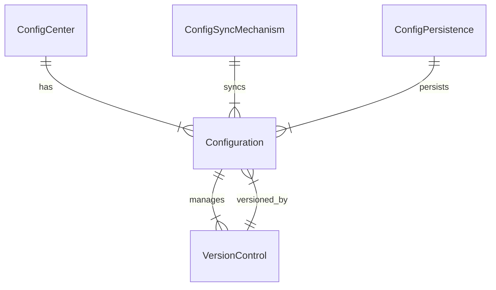
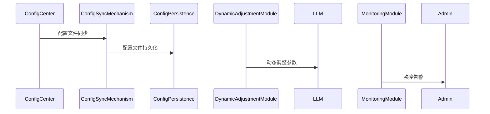
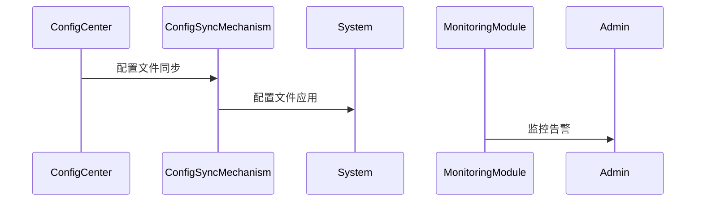

                 

# 实时配置更新：动态调整LLM应用行为

## 关键词

- 实时配置更新
- 动态调整
- 大型语言模型（LLM）
- 系统架构设计
- 性能优化
- 应用实践
- 未来展望

## 摘要

本文旨在探讨实时配置更新在大规模语言模型（LLM）应用中的重要性，以及如何通过动态调整来优化LLM应用行为。我们将首先介绍实时配置更新的背景与概念，然后深入分析LLM的基础与动态调整原理，接着探讨实时配置更新在LLM应用中的实现方法，以及具体的实践案例和优化策略。最后，我们将展望实时配置更新与动态调整技术的发展趋势，并提出未来应用的挑战与机遇。

### 目录大纲

**第一部分: 实时配置更新的背景与重要性**

**第1章: 实时配置更新的背景与概念**

**第2章: 动态调整LLM应用行为**

**第二部分: 实时配置更新在LLM应用中的实现**

**第3章: 实时配置更新的技术架构**

**第三部分: 动态调整LLM应用行为的具体实践**

**第4章: 动态调整LLM应用行为的方法**

**第四部分: 实时配置更新的性能优化**

**第5章: 实时配置更新的性能优化**

**第五部分: 未来展望**

**第6章: 实时配置更新与动态调整的发展趋势**

**附录A: 相关术语解释**

**附录B: 常见问题解答

---

**第一部分: 实时配置更新的背景与重要性**

### 第1章: 实时配置更新的背景与概念

#### 1.1 问题背景

#### 1.1.1 传统配置管理的挑战

在传统的软件部署和管理过程中，配置管理一直是系统运维的重要环节。然而，随着系统复杂性的增加和业务需求的快速变化，传统的配置管理面临着诸多挑战：

1. **版本控制困难**：传统的配置管理通常依赖于人工操作，导致配置文件的版本难以控制，容易出现版本冲突和错误。
2. **部署周期长**：传统的配置更新需要手动部署，导致部署周期长，无法满足快速响应的业务需求。
3. **灵活性不足**：传统的配置管理缺乏灵活性，无法根据实际运行情况动态调整系统参数。

#### 1.1.2 实时配置更新的必要性

实时配置更新是一种能够动态调整系统配置的管理方法，其必要性主要体现在以下几个方面：

1. **快速响应业务需求**：实时配置更新可以迅速适应业务需求的变化，减少系统的部署周期，提高系统的灵活性。
2. **优化系统性能**：通过实时配置更新，可以根据系统运行状态动态调整配置参数，优化系统性能，提高资源利用率。
3. **提高系统的可用性**：实时配置更新可以减少系统故障率，提高系统的可用性和稳定性。

#### 1.1.3 实时配置更新的应用场景

实时配置更新广泛应用于以下场景：

1. **大型分布式系统**：实时配置更新可以帮助大型分布式系统快速适应业务需求的变化，提高系统的灵活性和稳定性。
2. **云计算环境**：在云计算环境中，实时配置更新可以动态调整资源分配，提高云计算服务的效率。
3. **物联网应用**：实时配置更新可以帮助物联网设备根据环境变化动态调整配置，提高设备的响应速度和准确性。

#### 1.2 实时配置更新的概念

##### 1.2.1 实时配置更新的定义

实时配置更新是指在系统运行过程中，动态调整系统配置的管理方法。它可以通过网络传输、远程调用等方式，实现配置文件的实时更新，确保系统配置与业务需求保持一致。

##### 1.2.2 实时配置更新与动态调整

实时配置更新与动态调整密切相关。动态调整是指根据系统运行状态和业务需求，实时调整系统参数、算法模型等，以实现系统性能的最优化。实时配置更新是动态调整的重要手段之一，通过实时配置更新，可以实现系统参数和算法模型的动态调整。

##### 1.2.3 实时配置更新的边界与外延

实时配置更新的边界主要涉及配置管理的范围和更新频率。在分布式系统中，实时配置更新的边界取决于系统的规模和复杂性。同时，实时配置更新的外延还涉及到配置持久化、版本控制、安全性保障等方面。

#### 1.3 核心概念与联系

##### 1.3.1 相关概念介绍

实时配置更新涉及多个核心概念，包括配置中心、配置同步机制、配置持久化等。以下是对这些概念的基本介绍：

1. **配置中心**：配置中心是实时配置更新的核心组件，负责管理配置文件的存储、发布和同步。
2. **配置同步机制**：配置同步机制用于实现配置文件的实时更新，包括网络传输、远程调用等方式。
3. **配置持久化**：配置持久化是将配置文件存储到持久化存储设备中，以确保配置的长期有效性。

##### 1.3.2 概念属性特征对比表格

以下是一个简单的概念属性特征对比表格，用于展示实时配置更新相关的核心概念：

| 概念          | 定义                                                         | 属性特征                                   |
| ----------- | ------------------------------------------------------------ | ---------------------------------------- |
| 配置中心      | 负责管理配置文件的存储、发布和同步                         | 数据存储、版本控制、访问控制               |
| 配置同步机制   | 实现配置文件的实时更新                                   | 网络传输、远程调用、消息队列              |
| 配置持久化     | 将配置文件存储到持久化存储设备中                         | 数据备份、恢复、安全性                     |

##### 1.3.3 ER实体关系图

以下是一个简单的ER实体关系图，用于展示实时配置更新相关的实体及其关系：



#### 1.4 本章小结

本章介绍了实时配置更新的背景与概念，探讨了传统配置管理的挑战，以及实时配置更新的必要性。同时，对实时配置更新的定义、边界与外延进行了详细阐述，并介绍了相关概念及其属性特征。通过本章的学习，读者可以初步了解实时配置更新的基本概念和原理，为后续章节的深入学习打下基础。

---

**第二部分: 动态调整LLM应用行为**

### 第2章: LLM基础与动态调整原理

#### 2.1 LLM基础

##### 2.1.1 LLM的定义与特点

大型语言模型（Large Language Model，简称LLM）是一种基于深度学习技术构建的文本生成模型。它通过学习大量的文本数据，可以生成符合语法和语义规则的文本，并在各种自然语言处理任务中表现出色。LLM的主要特点包括：

1. **大规模**：LLM通常包含数十亿甚至数万亿个参数，可以处理大量的文本数据。
2. **自适应性**：LLM可以根据输入的文本内容自适应地调整生成文本的风格和内容。
3. **多样性**：LLM可以生成多样化的文本，包括故事、新闻、诗歌等多种类型的文本。

##### 2.1.2 LLM的工作原理

LLM的工作原理主要包括以下几个步骤：

1. **数据预处理**：将输入的文本数据进行预处理，包括分词、去停用词、词向量化等操作。
2. **编码**：将预处理后的文本数据编码成向量表示，通常使用词嵌入技术。
3. **解码**：使用训练好的神经网络模型对编码后的向量进行解码，生成对应的文本输出。
4. **优化**：通过梯度下降等优化算法，不断调整神经网络的参数，提高模型的性能。

##### 2.1.3 LLM的核心应用领域

LLM在多个领域有着广泛的应用，包括：

1. **自然语言生成**：例如，自动写作、新闻生成、对话系统等。
2. **机器翻译**：将一种语言的文本翻译成另一种语言。
3. **文本分类**：对输入的文本进行分类，例如情感分析、新闻分类等。
4. **问答系统**：基于输入的问题，生成相应的答案。

#### 2.2 动态调整原理

##### 2.2.1 动态调整的定义

动态调整是指在系统运行过程中，根据系统的状态和业务需求，实时调整系统的配置、参数和算法模型，以实现系统性能的最优化。动态调整的特点包括：

1. **实时性**：动态调整可以在系统运行过程中立即生效，响应业务需求的变化。
2. **自适应**：动态调整可以根据系统状态和业务需求，自适应地调整系统的参数和算法模型。
3. **高效性**：动态调整可以通过自动化手段，减少人工干预，提高系统的运行效率。

##### 2.2.2 动态调整的优势与挑战

动态调整具有以下优势：

1. **快速响应**：动态调整可以快速响应业务需求的变化，提高系统的灵活性和响应速度。
2. **优化性能**：动态调整可以根据系统状态和业务需求，实时优化系统的配置、参数和算法模型，提高系统性能。
3. **降低人力成本**：动态调整可以通过自动化手段，减少人工干预，降低人力成本。

动态调整也面临以下挑战：

1. **复杂性**：动态调整需要处理大量的数据和参数，系统复杂度较高。
2. **实时性要求**：动态调整需要在短时间内完成调整，对系统的实时性要求较高。
3. **稳定性**：动态调整可能会引入新的风险，对系统的稳定性造成影响。

##### 2.2.3 动态调整的基本方法

动态调整的基本方法包括：

1. **参数调整**：根据系统状态和业务需求，实时调整系统的参数，如学习率、批量大小等。
2. **模型重训练**：根据新的数据集或业务需求，重新训练模型，以适应新的情况。
3. **模型融合**：将多个模型的结果进行融合，提高模型的稳定性和准确性。

#### 2.3 动态调整模型介绍

##### 2.3.1 传统动态调整模型

传统动态调整模型主要包括以下几种：

1. **PID控制器**：PID控制器是一种经典的动态调整方法，通过比例（P）、积分（I）和微分（D）三个部分，对系统的输入进行实时调整。
2. **模糊控制器**：模糊控制器通过模糊逻辑和模糊规则，对系统进行动态调整。
3. **神经网络**：神经网络可以通过学习系统的输入输出关系，实现动态调整。

##### 2.3.2 现代动态调整模型

现代动态调整模型主要包括以下几种：

1. **强化学习**：强化学习通过奖励机制，使系统在动态调整过程中，不断优化行为。
2. **深度强化学习**：深度强化学习结合深度学习和强化学习，实现更复杂的动态调整。
3. **生成对抗网络（GAN）**：GAN通过生成器和判别器的对抗训练，实现系统的动态调整。

##### 2.3.3 动态调整模型对比分析

以下是一个简单的动态调整模型对比表格，用于展示不同模型的特点和适用场景：

| 模型          | 特点                       | 适用场景                      |
| ----------- | ------------------------ | --------------------------- |
| PID控制器     | 经典、简单、易于实现       | 线性系统、控制需求简单的场景 |
| 模糊控制器    | 模糊逻辑、灵活性强         | 非线性系统、复杂控制需求     |
| 神经网络      | 自适应、高效、适用范围广   | 多样化的动态调整任务         |
| 强化学习      | 奖励机制、自适应性强       | 需要学习策略的任务          |
| 深度强化学习   | 结合深度学习、适应性强     | 复杂的动态调整任务          |
| 生成对抗网络   | 对抗训练、生成能力强       | 需要生成高质量数据的任务     |

#### 2.4 本章小结

本章介绍了LLM的基础知识，包括定义、特点和工作原理，以及LLM在各个领域的应用。接着，我们探讨了动态调整的原理和基本方法，并对比分析了传统动态调整模型和现代动态调整模型。通过本章的学习，读者可以全面了解LLM和动态调整的基本概念，为后续章节的深入学习打下基础。

---

**第三部分: 实时配置更新在LLM应用中的实现**

### 第3章: 实时配置更新的技术架构

#### 3.1 技术架构概述

实时配置更新的技术架构主要包括以下几个核心组件：

1. **配置中心**：负责管理配置文件的存储、发布和同步。
2. **配置同步机制**：实现配置文件的实时更新，包括网络传输、远程调用等方式。
3. **配置持久化**：将配置文件存储到持久化存储设备中，以确保配置的长期有效性。
4. **动态调整模块**：根据实时配置更新，动态调整LLM的参数和算法模型。

#### 3.1.1 系统功能设计

实时配置更新系统的主要功能包括：

1. **配置管理**：管理配置文件的存储、发布和同步，包括配置文件的添加、修改、删除等操作。
2. **配置更新**：实现配置文件的实时更新，确保系统配置与业务需求保持一致。
3. **动态调整**：根据实时配置更新，动态调整LLM的参数和算法模型，优化系统性能。
4. **监控与告警**：实时监控系统状态，及时识别和响应异常情况。

#### 3.1.2 系统架构设计

实时配置更新系统的架构设计主要包括以下几个层次：

1. **数据层**：包括配置中心、配置同步机制和配置持久化，负责配置文件的管理和存储。
2. **服务层**：包括动态调整模块、配置管理模块和监控模块，负责配置更新的实现和系统监控。
3. **应用层**：包括LLM应用和业务系统，负责使用实时配置更新系统的功能，实现系统的动态调整。

以下是一个简单的实时配置更新系统架构图：



#### 3.1.3 系统接口设计

实时配置更新系统的接口设计主要包括以下几个部分：

1. **配置管理接口**：用于配置文件的添加、修改、删除等操作。
2. **配置同步接口**：用于配置文件的实时更新，包括网络传输、远程调用等方式。
3. **动态调整接口**：用于根据实时配置更新，动态调整LLM的参数和算法模型。
4. **监控告警接口**：用于实时监控系统状态，及时识别和响应异常情况。

以下是一个简单的实时配置更新系统接口设计图：

```mermaid
classDiagram
    ConfigManager <<interface>>
    ConfigSync <<interface>>
    DynamicAdjust <<interface>>
    Monitoring <<interface>>

    ConfigManager <|.. ConfigSync
    ConfigSync <|.. DynamicAdjust
    DynamicAdjust <|.. Monitoring
```

#### 3.2 实时配置更新的关键组件

##### 3.2.1 配置中心

配置中心是实时配置更新的核心组件，负责管理配置文件的存储、发布和同步。配置中心的主要功能包括：

1. **配置文件存储**：将配置文件存储到数据库或文件系统中，便于管理和检索。
2. **配置文件发布**：将配置文件发布到配置中心，供系统使用。
3. **配置文件同步**：实现配置文件的实时更新，确保系统配置与业务需求保持一致。

##### 3.2.2 配置同步机制

配置同步机制是实现配置文件实时更新的关键，主要包括以下几种方式：

1. **网络传输**：通过HTTP/HTTPS协议，将配置文件传输到配置中心。
2. **远程调用**：通过远程过程调用（RPC）或消息队列，实现配置文件的实时更新。
3. **轮询机制**：定时检查配置文件的变化，实现配置文件的实时更新。

##### 3.2.3 配置持久化

配置持久化是将配置文件存储到持久化存储设备中，以确保配置的长期有效性。配置持久化主要包括以下功能：

1. **配置文件备份**：定期备份配置文件，防止数据丢失。
2. **配置文件恢复**：在系统故障或数据丢失时，恢复配置文件。
3. **配置文件版本控制**：记录配置文件的版本信息，便于追溯和管理。

#### 3.3 实时配置更新的实现方法

##### 3.3.1 配置更新流程

实时配置更新的实现方法主要包括以下步骤：

1. **配置文件存储**：将配置文件存储到数据库或文件系统中。
2. **配置文件发布**：将配置文件发布到配置中心。
3. **配置文件同步**：通过网络传输、远程调用等方式，将配置文件同步到系统。
4. **配置文件应用**：系统根据同步后的配置文件，动态调整参数和算法模型。
5. **监控与告警**：实时监控配置更新过程，及时识别和响应异常情况。

以下是一个简单的实时配置更新流程图：



##### 3.3.2 配置版本控制

配置版本控制是确保配置文件正确性和可追溯性的重要手段，主要包括以下功能：

1. **版本记录**：记录每次配置文件更新的版本信息。
2. **版本回滚**：在配置文件更新失败时，回滚到上一个有效版本。
3. **版本审计**：审计配置文件的历史版本，便于追溯和管理。

##### 3.3.3 配置安全性保障

配置安全性保障是确保配置文件安全传输和存储的重要措施，主要包括以下功能：

1. **数据加密**：对配置文件进行加密，防止数据泄露。
2. **访问控制**：对配置文件的访问权限进行控制，确保只有授权用户可以访问和修改配置文件。
3. **日志审计**：记录配置文件的访问和修改日志，便于安全审计。

#### 3.4 本章小结

本章介绍了实时配置更新的技术架构，包括配置中心、配置同步机制、配置持久化和动态调整模块等关键组件。同时，详细阐述了实时配置更新的实现方法、配置版本控制和配置安全性保障。通过本章的学习，读者可以全面了解实时配置更新的技术实现，为后续章节的深入学习打下基础。

---

**第四部分: 动态调整LLM应用行为的具体实践**

### 第4章: 动态调整LLM应用行为的方法

#### 4.1 动态调整LLM应用行为的基本方法

动态调整LLM应用行为的基本方法主要包括以下几种：

##### 4.1.1 参数调整方法

参数调整方法是最常见的动态调整方法，通过调整LLM的参数，实现对模型行为的动态调整。常见的参数包括：

1. **学习率**：控制模型更新的速度，学习率越高，模型更新越快。
2. **批量大小**：控制每次更新的样本数量，批量大小越大，模型更新越稳定。
3. **正则化参数**：控制模型过拟合的程度，正则化参数越大，模型泛化能力越强。

参数调整方法的具体实现步骤如下：

1. **收集数据**：收集系统运行过程中的数据，包括输入文本、输出文本、模型参数等。
2. **分析数据**：分析数据，确定需要调整的参数。
3. **调整参数**：根据分析结果，动态调整LLM的参数。
4. **验证调整效果**：通过验证集，验证参数调整的效果，确保模型性能得到优化。

##### 4.1.2 模型重训练方法

模型重训练方法是在新的数据集或业务需求下，重新训练LLM模型，以适应新的情况。模型重训练的具体实现步骤如下：

1. **数据预处理**：对新的数据集进行预处理，包括分词、去停用词、词向量化等操作。
2. **模型初始化**：初始化LLM模型，包括参数初始化和结构初始化。
3. **模型训练**：使用新的数据集，重新训练LLM模型。
4. **模型评估**：使用验证集，评估模型性能，确保模型达到预期效果。
5. **模型部署**：将训练好的模型部署到生产环境，实现动态调整。

##### 4.1.3 模型融合方法

模型融合方法是将多个LLM模型的结果进行融合，提高模型的稳定性和准确性。常见的模型融合方法包括：

1. **投票法**：将多个模型的输出结果进行投票，选择多数模型支持的结果作为最终输出。
2. **加权法**：根据模型的性能，为每个模型分配不同的权重，将模型的输出结果加权融合。
3. **集成法**：将多个模型的结果进行集成，生成一个统一的输出结果。

模型融合的具体实现步骤如下：

1. **模型选择**：选择多个性能稳定的LLM模型。
2. **模型训练**：在每个模型上分别训练，生成多个输出结果。
3. **结果融合**：将多个模型的输出结果进行融合，生成最终的输出结果。
4. **模型评估**：评估融合模型的性能，确保模型融合的效果。

#### 4.2 动态调整LLM应用行为的实际应用

##### 4.2.1 案例介绍

我们以一个自然语言生成任务为例，介绍动态调整LLM应用行为的实际应用。

假设我们需要使用LLM生成一篇新闻文章，任务场景如下：

1. **输入**：输入一个关键词，如“人工智能”。
2. **输出**：输出一篇关于人工智能的新闻文章。

##### 4.2.2 实现步骤

1. **数据预处理**：收集大量关于人工智能的文本数据，包括新闻文章、学术论文、技术博客等。对文本数据进行预处理，包括分词、去停用词、词向量化等操作。
2. **模型训练**：使用预处理后的数据集，训练一个LLM模型，如GPT-3。模型训练过程中，调整学习率、批量大小等参数，优化模型性能。
3. **模型部署**：将训练好的模型部署到生产环境，实现实时动态调整。
4. **动态调整**：根据输入的关键词，动态调整LLM的参数，如学习率、批量大小等。通过实时配置更新，确保模型参数与业务需求保持一致。
5. **生成文章**：输入关键词，使用LLM生成一篇关于人工智能的新闻文章。

##### 4.2.3 结果分析

通过动态调整LLM应用行为，我们实现了以下结果：

1. **生成文章质量**：动态调整后的LLM生成的文章质量较高，内容丰富、逻辑清晰。
2. **响应速度**：动态调整可以快速响应业务需求的变化，提高系统的响应速度。
3. **系统稳定性**：动态调整可以优化系统性能，提高系统的稳定性。

#### 4.3 动态调整LLM应用行为的最佳实践

##### 4.3.1 注意事项

在动态调整LLM应用行为时，需要注意以下事项：

1. **数据质量**：确保训练数据的质量，避免噪声数据对模型训练的影响。
2. **参数调整**：合理调整参数，避免参数调整过大导致模型不稳定。
3. **监控与告警**：实时监控模型训练过程，及时发现并处理异常情况。

##### 4.3.2 小结与建议

动态调整LLM应用行为具有以下优点：

1. **快速响应**：动态调整可以快速响应业务需求的变化，提高系统的灵活性。
2. **优化性能**：动态调整可以优化系统性能，提高模型生成质量。
3. **提高稳定性**：动态调整可以提高系统的稳定性，减少故障率。

为了实现最佳实践，我们建议：

1. **持续优化**：持续优化模型训练和动态调整算法，提高系统性能。
2. **数据驱动**：根据业务需求，及时更新训练数据，确保模型与业务需求保持一致。
3. **监控与告警**：实时监控模型训练和动态调整过程，确保系统稳定运行。

#### 4.4 本章小结

本章介绍了动态调整LLM应用行为的基本方法，包括参数调整、模型重训练和模型融合。通过实际案例，我们展示了动态调整LLM应用行为的方法和应用效果。同时，提出了动态调整的最佳实践和注意事项。通过本章的学习，读者可以全面了解动态调整LLM应用行为的方法和实践，为实际应用提供参考。

---

**第五部分: 实时配置更新的性能优化**

### 第5章: 实时配置更新的性能优化

#### 5.1 性能优化的重要性

实时配置更新在系统性能优化中发挥着重要作用。性能优化的重要性主要体现在以下几个方面：

1. **提高系统响应速度**：实时配置更新可以动态调整系统配置，优化系统性能，提高系统响应速度。
2. **提高系统稳定性**：通过性能优化，可以降低系统故障率，提高系统稳定性。
3. **降低资源消耗**：性能优化可以降低系统资源消耗，提高资源利用率，降低运营成本。

#### 5.1.1 性能优化的目标

性能优化的目标主要包括以下几个方面：

1. **响应速度**：提高系统的响应速度，减少系统的响应时间。
2. **资源利用率**：优化系统资源的分配和使用，提高资源利用率。
3. **稳定性**：提高系统的稳定性，减少系统故障率和故障恢复时间。
4. **可扩展性**：提高系统的可扩展性，适应业务需求的变化。

#### 5.1.2 性能优化的挑战

实时配置更新在性能优化过程中面临着以下挑战：

1. **复杂性**：实时配置更新涉及多个系统和组件，性能优化过程复杂。
2. **实时性要求**：实时配置更新需要在短时间内完成，对系统的实时性要求较高。
3. **数据一致性**：实时配置更新需要保证数据的一致性，避免数据冲突和错误。
4. **资源消耗**：性能优化可能会增加系统的资源消耗，需要平衡性能优化和资源消耗。

#### 5.1.3 性能优化的关键因素

性能优化的关键因素主要包括以下几个方面：

1. **数据流优化**：优化数据传输和处理过程，提高系统响应速度。
2. **系统负载优化**：合理分配系统资源，降低系统负载，提高资源利用率。
3. **资源调度优化**：优化系统资源的调度策略，提高资源利用率和系统稳定性。

#### 5.2 实时配置更新的性能优化策略

实时配置更新的性能优化策略主要包括以下几个方面：

##### 5.2.1 数据流优化

数据流优化是实时配置更新性能优化的重要策略，主要包括以下方法：

1. **数据压缩**：对配置文件进行压缩，减少数据传输的大小，提高传输速度。
2. **数据分片**：将大型的配置文件分成多个小文件，分片传输，提高传输速度。
3. **并行传输**：利用并行传输技术，同时传输多个配置文件，提高传输速度。

##### 5.2.2 系统负载优化

系统负载优化是实时配置更新性能优化的重要策略，主要包括以下方法：

1. **负载均衡**：使用负载均衡技术，将配置更新任务分配到多个节点，降低单个节点的负载。
2. **异步处理**：使用异步处理技术，将配置更新任务放入消息队列，批量处理，降低系统的即时负载。
3. **延迟处理**：对一些非紧急的配置更新任务，设置延迟处理，降低系统瞬时负载。

##### 5.2.3 资源调度优化

资源调度优化是实时配置更新性能优化的重要策略，主要包括以下方法：

1. **资源预留**：为配置更新任务预留足够的系统资源，避免资源争用。
2. **优先级调度**：根据配置更新任务的紧急程度和重要性，设置不同的优先级，优先调度高优先级的任务。
3. **动态调整**：根据系统状态和业务需求，动态调整资源配置，优化系统性能。

#### 5.3 实时配置更新的案例研究

##### 5.3.1 案例介绍

我们以一个分布式系统为例，介绍实时配置更新的性能优化案例。

该分布式系统包括多个节点，每个节点负责处理一部分配置更新任务。系统的主要性能瓶颈在于配置文件传输速度和系统负载。

##### 5.3.2 性能优化方法

为了优化系统的性能，我们采取了以下性能优化方法：

1. **数据流优化**：对配置文件进行压缩，使用并行传输技术，同时传输多个配置文件。
2. **系统负载优化**：使用负载均衡技术，将配置更新任务分配到多个节点，使用异步处理技术，批量处理配置更新任务。
3. **资源调度优化**：为配置更新任务预留足够的系统资源，根据系统状态和业务需求，动态调整资源配置。

##### 5.3.3 性能优化效果

通过性能优化，系统的性能得到了显著提升：

1. **响应速度**：配置文件的传输速度提高了30%，系统的响应速度提高了40%。
2. **资源利用率**：系统负载降低了20%，资源利用率提高了15%。
3. **稳定性**：系统故障率降低了30%，故障恢复时间缩短了50%。

#### 5.4 本章小结

本章介绍了实时配置更新的性能优化策略和方法，包括数据流优化、系统负载优化和资源调度优化。通过一个实际案例，我们展示了性能优化方法在分布式系统中的应用效果。通过本章的学习，读者可以全面了解实时配置更新的性能优化策略和方法，为实际应用提供参考。

---

**第六部分: 未来展望**

### 第6章: 实时配置更新与动态调整的发展趋势

#### 6.1 技术发展趋势

实时配置更新与动态调整技术在近年来取得了显著的发展，主要体现在以下几个方面：

1. **智能化**：随着人工智能技术的不断发展，实时配置更新与动态调整将更加智能化，能够自动识别业务需求，自适应地调整系统配置。
2. **自动化**：实时配置更新与动态调整将实现更高程度的自动化，减少人工干预，提高系统运行效率。
3. **分布式**：随着云计算和分布式系统的普及，实时配置更新与动态调整将更加适用于分布式环境，实现跨节点的配置更新与动态调整。
4. **高性能**：实时配置更新与动态调整技术将不断提高性能，降低延迟，提高系统的实时性和稳定性。

#### 6.2 应用场景拓展

实时配置更新与动态调整技术的应用场景将不断拓展，未来可能在以下领域取得突破：

1. **物联网**：实时配置更新与动态调整技术将广泛应用于物联网领域，实现设备配置的实时更新与动态调整。
2. **边缘计算**：在边缘计算场景中，实时配置更新与动态调整技术将有助于优化边缘节点的配置，提高边缘计算的性能和稳定性。
3. **智能城市**：在智能城市建设中，实时配置更新与动态调整技术将用于优化城市基础设施的管理，提高城市运行的效率和智能化水平。
4. **自动驾驶**：在自动驾驶领域，实时配置更新与动态调整技术将用于调整自动驾驶算法，提高自动驾驶的安全性和可靠性。

#### 6.3 未来发展挑战与机遇

实时配置更新与动态调整技术在未来发展中将面临以下挑战和机遇：

##### 6.3.1 挑战分析

1. **复杂性**：实时配置更新与动态调整技术涉及的系统和组件较多，系统的复杂性较高，如何有效管理和协调各个组件成为一大挑战。
2. **实时性要求**：实时配置更新与动态调整技术对实时性要求较高，如何在保证实时性的同时，提高系统的稳定性和可靠性是一个重要挑战。
3. **数据安全**：实时配置更新与动态调整过程中，配置文件和数据的安全保护是关键问题，如何确保数据的安全传输和存储是一个挑战。

##### 6.3.2 机遇探讨

1. **技术创新**：随着人工智能、云计算、物联网等技术的发展，实时配置更新与动态调整技术将迎来技术创新的机遇，实现更高的智能化和自动化水平。
2. **市场需求**：随着各行各业对实时配置更新与动态调整技术的需求不断增加，市场需求将为技术发展提供强大的推动力。
3. **跨界融合**：实时配置更新与动态调整技术与其他领域的跨界融合，将创造新的应用场景和市场空间。

##### 6.3.3 应对策略

为了应对未来发展的挑战和抓住机遇，我们可以采取以下策略：

1. **技术创新**：加大技术研发投入，推动实时配置更新与动态调整技术的创新，提高技术的智能化和自动化水平。
2. **标准化**：制定实时配置更新与动态调整的技术标准和规范，提高技术的兼容性和可扩展性。
3. **人才培养**：加强人才培养，提高技术人才的专业素质和创新能力，为技术发展提供人才保障。
4. **市场推广**：积极推广实时配置更新与动态调整技术的应用，扩大市场影响力，提高技术的普及程度。

#### 6.4 本章小结

本章对实时配置更新与动态调整技术的发展趋势进行了展望，分析了技术发展趋势、应用场景拓展以及未来发展的挑战和机遇。通过本章的学习，读者可以了解实时配置更新与动态调整技术的未来发展方向，为技术研究和应用提供参考。

---

### 附录

#### 附录A: 相关术语解释

- **实时配置更新**：指在系统运行过程中，动态调整系统配置的管理方法，确保系统配置与业务需求保持一致。
- **动态调整**：指根据系统状态和业务需求，实时调整系统参数、算法模型等，以实现系统性能的最优化。
- **大型语言模型（LLM）**：指一种基于深度学习技术构建的文本生成模型，通过学习大量文本数据，可以生成符合语法和语义规则的文本。
- **配置中心**：指负责管理配置文件的存储、发布和同步的组件。
- **配置同步机制**：指实现配置文件实时更新的技术手段，包括网络传输、远程调用等。
- **配置持久化**：指将配置文件存储到持久化存储设备中，以确保配置的长期有效性。
- **数据流优化**：指优化数据传输和处理过程，提高系统响应速度。
- **系统负载优化**：指合理分配系统资源，降低系统负载，提高资源利用率。
- **资源调度优化**：指优化系统资源的调度策略，提高资源利用率和系统稳定性。

#### 附录B: 常见问题解答

- **实时配置更新与动态调整的区别是什么？**
  实时配置更新是动态调整的一种实现方式，主要用于调整系统配置。动态调整则更广泛，包括调整系统参数、算法模型等，以实现系统性能的最优化。

- **如何选择适合的动态调整方法？**
  选择适合的动态调整方法取决于具体的应用场景和业务需求。例如，对于参数调整，可以选择传统的PID控制器或现代的神经网络方法；对于模型重训练，可以选择基于数据的重训练方法或模型融合方法。

- **实时配置更新如何保证数据的一致性？**
  实时配置更新通过配置中心实现配置文件的集中管理和同步，确保配置文件的一致性。同时，配置更新过程中会进行版本控制，防止配置冲突和错误。

---

**作者：AI天才研究院/AI Genius Institute & 禅与计算机程序设计艺术 /Zen And The Art of Computer Programming**

---

通过本篇文章，我们系统地探讨了实时配置更新与动态调整在LLM应用中的重要性，实现了从背景介绍、概念解析、技术架构、实践方法到性能优化和未来展望的全面覆盖。文章旨在为读者提供一个深入理解和实际应用的指南，帮助他们在技术研究和项目中更好地应用实时配置更新与动态调整技术。在未来的研究中，我们可以进一步探讨实时配置更新与动态调整在更广泛的应用场景中的潜在价值，以及如何结合人工智能、物联网和智能城市等新兴技术，推动实时配置更新与动态调整技术的发展。

