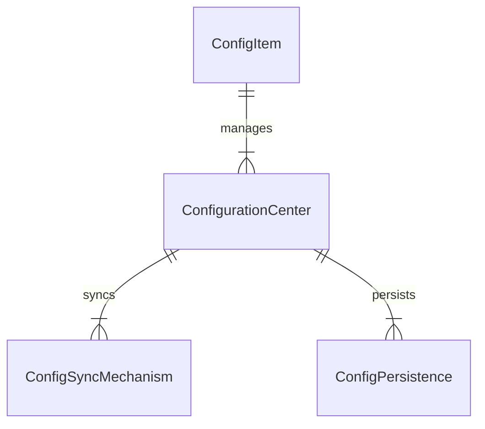

                 

# 实时配置更新：动态调整LLM应用行为

> 关键词：实时配置更新、动态调整、LLM应用、技术架构、性能优化、发展趋势

> 摘要：本文将深入探讨实时配置更新与动态调整LLM应用行为的关系，通过分析实时配置更新的背景、重要性、技术架构以及动态调整原理和实现方法，旨在为读者提供一个全面、深入的技术指南。文章还将探讨实时配置更新的性能优化策略、具体实践以及未来发展的趋势，旨在为人工智能领域的发展提供有益的参考。

## 目录大纲

**# 第一部分：实时配置更新的背景与重要性**

**第1章：实时配置更新的背景与概念**

## 1.1 问题背景

### 1.1.1 传统配置管理的挑战

### 1.1.2 实时配置更新的必要性

### 1.1.3 实时配置更新的应用场景

## 1.2 实时配置更新的概念

### 1.2.1 实时配置更新的定义

### 1.2.2 实时配置更新与动态调整

### 1.2.3 实时配置更新的边界与外延

## 1.3 核心概念与联系

### 1.3.1 相关概念介绍

### 1.3.2 概念属性特征对比表格

### 1.3.3 ER实体关系图

## 1.4 本章小结

---

**# 第二部分：动态调整LLM应用行为**

**第2章：LLM基础与动态调整原理**

## 2.1 LLM基础

### 2.1.1 LLM的定义与特点

### 2.1.2 LLM的工作原理

### 2.1.3 LLM的核心应用领域

## 2.2 动态调整原理

### 2.2.1 动态调整的定义

### 2.2.2 动态调整的优势与挑战

### 2.2.3 动态调整的基本方法

## 2.3 动态调整模型介绍

### 2.3.1 传统动态调整模型

### 2.3.2 现代动态调整模型

### 2.3.3 动态调整模型对比分析

## 2.4 本章小结

---

**# 第三部分：实时配置更新在LLM应用中的实现**

**第3章：实时配置更新的技术架构**

## 3.1 技术架构概述

### 3.1.1 系统功能设计

### 3.1.2 系统架构设计

### 3.1.3 系统接口设计

## 3.2 实时配置更新的关键组件

### 3.2.1 配置中心

### 3.2.2 配置同步机制

### 3.2.3 配置持久化

## 3.3 实时配置更新的实现方法

### 3.3.1 配置更新流程

### 3.3.2 配置版本控制

### 3.3.3 配置安全性保障

## 3.4 本章小结

---

**# 第四部分：动态调整LLM应用行为的具体实践**

**第4章：动态调整LLM应用行为的方法**

## 4.1 动态调整LLM应用行为的基本方法

### 4.1.1 参数调整方法

### 4.1.2 模型重训练方法

### 4.1.3 模型融合方法

## 4.2 动态调整LLM应用行为的实际应用

### 4.2.1 案例介绍

### 4.2.2 实现步骤

### 4.2.3 结果分析

## 4.3 动态调整LLM应用行为的最佳实践

### 4.3.1 注意事项

### 4.3.2 小结与建议

## 4.4 本章小结

---

**# 第五部分：实时配置更新与动态调整的优化策略**

**第5章：实时配置更新的性能优化**

## 5.1 性能优化的重要性

### 5.1.1 性能优化的目标

### 5.1.2 性能优化的挑战

### 5.1.3 性能优化的关键因素

## 5.2 实时配置更新的性能优化策略

### 5.2.1 数据流优化

### 5.2.2 系统负载优化

### 5.2.3 资源调度优化

## 5.3 实时配置更新的案例研究

### 5.3.1 案例介绍

### 5.3.2 性能优化方法

### 5.3.3 性能优化效果

## 5.4 本章小结

---

**# 第六部分：未来展望**

**第6章：实时配置更新与动态调整的发展趋势**

## 6.1 技术发展趋势

### 6.1.1 现有技术的局限性

### 6.1.2 新技术的研究方向

### 6.1.3 可能的创新点

## 6.2 应用场景拓展

### 6.2.1 新的应用领域

### 6.2.2 跨领域融合的应用

### 6.2.3 应用模式的创新

## 6.3 未来发展挑战与机遇

### 6.3.1 挑战分析

### 6.3.2 机遇探讨

### 6.3.3 应对策略

## 6.4 本章小结

---

**# 附录**

**附录A：相关术语解释**

- 实时配置更新
- 动态调整
- LLM
- 配置中心
- 配置同步机制
- 配置持久化
- 数据流优化
- 系统负载优化
- 资源调度优化

**附录B：常见问题解答**

- 实时配置更新与动态调整的区别是什么？
- 如何选择适合的动态调整方法？
- 实时配置更新如何保证数据的一致性？

## 第一部分：实时配置更新的背景与重要性

### 第1章：实时配置更新的背景与概念

#### 1.1 问题背景

**传统配置管理的挑战**

在传统配置管理中，应用程序的配置通常是在部署前进行静态配置的。这意味着，一旦应用程序部署，其配置项就需要通过人工操作来更新。这种方法存在以下几个主要问题：

1. **人工操作成本高**：需要人工干预来更新配置，这不仅耗时，而且容易出错。
2. **系统停机时间长**：配置更新通常需要停机进行，导致系统可用性降低。
3. **部署频繁导致风险**：频繁的部署和更新增加了系统的风险，可能导致不稳定的运行状态。

**实时配置更新的必要性**

实时配置更新旨在解决传统配置管理中的这些问题，其必要性体现在以下几个方面：

1. **减少人工干预**：实时配置更新允许在运行时动态修改配置，减少了人工干预的需求。
2. **提高系统可用性**：配置更新可以在不影响系统运行的情况下进行，从而减少了系统停机时间。
3. **降低部署风险**：实时配置更新减少了系统部署的频率，降低了系统的风险。

**实时配置更新的应用场景**

实时配置更新的应用场景广泛，包括但不限于以下几种：

1. **应用性能优化**：通过实时调整配置参数，可以优化应用的性能，如调整连接池大小、线程数量等。
2. **功能扩展**：通过实时更新配置，可以动态地启用或禁用某些功能，如安全策略、服务能力等。
3. **负载均衡**：通过实时配置调整，可以实现动态的负载均衡，如调整集群节点权重、流量分配策略等。

#### 1.2 实时配置更新的概念

**实时配置更新的定义**

实时配置更新是指在系统运行时，动态地修改系统配置项的过程。这种更新可以是细粒度的，如修改某个配置参数的值，也可以是粗粒度的，如增加或删除一个配置项。

**实时配置更新与动态调整**

实时配置更新与动态调整密切相关。动态调整是指根据系统运行状态或外部环境的变化，实时地调整系统行为的过程。实时配置更新是动态调整的重要手段之一。

**实时配置更新的边界与外延**

实时配置更新的边界在于其更新的粒度和频率。细粒度的更新通常是对配置参数的修改，而粗粒度的更新则可能涉及系统的重新加载或重启。实时配置更新的外延包括配置的管理、同步、版本控制以及安全性保障等方面。

#### 1.3 核心概念与联系

**相关概念介绍**

1. **配置项**：配置项是系统配置的基本单位，可以是某个参数的值，也可以是一个功能模块。
2. **配置中心**：配置中心是负责管理和分发配置项的组件，通常包括配置存储、配置检索、配置同步等功能。
3. **配置同步机制**：配置同步机制是确保不同系统实例的配置保持一致的过程，通常包括配置的拉取、推送、校验等步骤。
4. **配置持久化**：配置持久化是指将配置数据存储在持久化存储介质上，如数据库、文件系统等。

**概念属性特征对比表格**

| 概念        | 特征                          |
|-------------|------------------------------|
| 配置项      | 基本配置单位，可细粒度修改   |
| 配置中心    | 管理和分发配置项的中心节点   |
| 配置同步机制 | 确保配置一致性的同步机制     |
| 配置持久化   | 将配置数据存储在持久化介质上 |

**ER实体关系图**

#### 1.4 本章小结

本章介绍了实时配置更新的背景与概念，分析了传统配置管理的挑战，阐述了实时配置更新的必要性及其应用场景。同时，本章还介绍了实时配置更新的定义、与动态调整的关系以及核心概念和联系。这些内容为后续章节的深入探讨奠定了基础。

---

## 第二部分：动态调整LLM应用行为

### 第2章：LLM基础与动态调整原理

#### 2.1 LLM基础

**LLM的定义与特点**

LLM（Large Language Model）即大型语言模型，是一种基于深度学习的技术，主要用于自然语言处理（NLP）任务。LLM的特点包括：

1. **大规模**：LLM通常包含数十亿甚至数千亿个参数，使其具有处理海量数据的能力。
2. **自监督学习**：LLM通过自监督学习训练，不需要人工标记数据，提高了数据处理效率。
3. **高效**：LLM在处理NLP任务时，可以快速生成高质量的自然语言文本。

**LLM的工作原理**

LLM的工作原理主要包括以下几个步骤：

1. **数据预处理**：将原始文本数据清洗、分词、编码等处理，转化为模型可接受的输入格式。
2. **自监督学习训练**：通过预训练过程，模型在大量未标注的文本数据上自主学习语言结构和规则。
3. **微调**：在特定任务上，对LLM进行微调，以适应具体应用场景。

**LLM的核心应用领域**

LLM在多个领域有着广泛的应用，主要包括：

1. **文本生成**：如文章撰写、对话系统、机器翻译等。
2. **文本分类**：如情感分析、新闻分类、垃圾邮件检测等。
3. **问答系统**：如智能客服、在线问答等。

#### 2.2 动态调整原理

**动态调整的定义**

动态调整是指在系统运行过程中，根据实际需求和运行状态，实时调整系统行为和配置的过程。动态调整旨在提高系统的灵活性和适应性。

**动态调整的优势与挑战**

动态调整的优势包括：

1. **提高系统灵活性**：动态调整使系统能够快速响应变化，提高灵活性。
2. **优化系统性能**：通过动态调整，可以优化系统性能，如响应时间、吞吐量等。

动态调整的挑战包括：

1. **实时性要求**：动态调整需要在极短的时间内完成，对系统的实时性要求较高。
2. **稳定性要求**：动态调整可能会对系统的稳定性产生影响，需要确保调整过程不会引起系统故障。

**动态调整的基本方法**

动态调整的基本方法包括：

1. **参数调整**：通过调整配置参数，如线程数、连接池大小等，来优化系统性能。
2. **模型重训练**：在特定条件下，重新训练模型，以适应新的需求或数据。
3. **模型融合**：将多个模型进行融合，以提高预测的准确性和稳定性。

#### 2.3 动态调整模型介绍

**传统动态调整模型**

传统动态调整模型主要包括以下几种：

1. **线性回归**：通过线性关系调整参数。
2. **逻辑回归**：通过逻辑关系调整参数。
3. **决策树**：通过树形结构调整参数。

**现代动态调整模型**

现代动态调整模型主要包括以下几种：

1. **神经网络**：通过多层神经网络调整参数。
2. **强化学习**：通过强化学习算法调整参数。
3. **迁移学习**：通过迁移学习算法调整参数。

**动态调整模型对比分析**

| 模型             | 优点                                           | 缺点                                           |
|------------------|------------------------------------------------|------------------------------------------------|
| 传统动态调整模型 | 简单易懂，易于实现                             | 实时性较差，适应性较弱                         |
| 现代动态调整模型 | 实时性较强，适应性较强                         | 需要大量数据，计算复杂度高                     |

#### 2.4 本章小结

本章介绍了LLM的基础知识，包括定义、特点、工作原理和核心应用领域。同时，本章还探讨了动态调整的原理、优势与挑战，以及传统和现代动态调整模型的基本方法。这些内容为后续章节的深入探讨提供了理论基础。

---

## 第三部分：实时配置更新在LLM应用中的实现

### 第3章：实时配置更新的技术架构

#### 3.1 技术架构概述

**系统功能设计**

实时配置更新系统的主要功能包括：

1. **配置管理**：管理和维护配置项，包括配置的创建、修改、删除等操作。
2. **配置同步**：实现配置项在不同系统实例之间的同步，确保配置一致性。
3. **配置持久化**：将配置项存储在持久化存储介质上，如数据库、文件系统等。
4. **配置检索**：提供配置项的检索接口，以便系统在运行时获取配置项。

**系统架构设计**

实时配置更新的系统架构通常包括以下几个关键组件：

1. **配置中心**：作为配置管理的核心，负责配置项的创建、修改、删除和同步。
2. **配置同步机制**：负责在不同系统实例之间同步配置项，确保配置一致性。
3. **配置持久化层**：负责将配置项存储在持久化存储介质上，如数据库、文件系统等。
4. **配置客户端**：位于各个系统实例中，负责从配置中心获取配置项，并在运行时进行配置更新。

**系统接口设计**

实时配置更新的系统接口设计主要包括以下几个方面：

1. **配置创建接口**：提供创建新配置项的接口，包括配置项的名称、值、类型等。
2. **配置修改接口**：提供修改现有配置项的接口，包括配置项的名称、值、类型等。
3. **配置删除接口**：提供删除配置项的接口，确保配置项的完整性和一致性。
4. **配置同步接口**：提供配置同步的接口，确保配置项在不同系统实例之间的一致性。
5. **配置检索接口**：提供配置项的检索接口，以便系统在运行时获取配置项。

#### 3.2 实时配置更新的关键组件

**配置中心**

配置中心是实时配置更新的核心组件，负责配置项的创建、修改、删除和同步。配置中心通常包括以下几个关键功能：

1. **配置存储**：负责存储配置项的数据，包括配置项的名称、值、类型、版本等。
2. **配置管理**：提供配置项的增删改查接口，以便对配置项进行操作。
3. **配置同步**：负责将配置项同步到各个系统实例，确保配置的一致性。
4. **配置检索**：提供配置项的检索接口，以便系统在运行时获取配置项。

**配置同步机制**

配置同步机制是确保配置项在不同系统实例之间保持一致的关键组件。配置同步机制通常包括以下几个步骤：

1. **配置拉取**：系统实例在启动或配置发生变化时，从配置中心拉取最新的配置项。
2. **配置校验**：系统实例对拉取的配置项进行校验，确保配置项的完整性和一致性。
3. **配置应用**：系统实例将校验通过的配置项应用到系统中，包括修改配置参数、加载新功能模块等。
4. **配置推送**：系统实例在配置发生变化时，将最新的配置项推送到配置中心，以便其他系统实例进行同步。

**配置持久化**

配置持久化是将配置项存储在持久化存储介质上，如数据库、文件系统等。配置持久化通常包括以下几个关键功能：

1. **配置存储**：将配置项的数据存储在数据库或文件系统中，确保配置的持久化存储。
2. **配置备份**：定期备份配置项的数据，防止数据丢失或损坏。
3. **配置恢复**：在配置项丢失或损坏时，能够从备份中恢复配置项的数据。

#### 3.3 实时配置更新的实现方法

**配置更新流程**

实时配置更新的基本流程如下：

1. **配置修改**：用户在配置中心修改配置项的值。
2. **配置校验**：配置中心对修改后的配置项进行校验，确保配置项的完整性和一致性。
3. **配置同步**：配置中心将修改后的配置项同步到各个系统实例。
4. **配置应用**：系统实例在运行时应用同步后的配置项，包括修改配置参数、加载新功能模块等。

**配置版本控制**

配置版本控制是确保配置项在更新过程中的一致性和可追溯性的重要手段。配置版本控制通常包括以下几个关键功能：

1. **版本标记**：在配置项每次修改时，生成一个新的版本标记，以便追溯配置的历史变化。
2. **版本查询**：提供配置项的历史版本查询接口，以便用户查看配置项的变更历史。
3. **版本回滚**：在配置项出现问题时，能够将配置项回滚到之前的版本，以便恢复系统的正常运行。

**配置安全性保障**

配置安全性保障是确保配置项在传输、存储和应用过程中不被篡改或泄露的重要手段。配置安全性保障通常包括以下几个关键功能：

1. **配置加密**：对配置项的数据进行加密处理，确保配置项在传输和存储过程中的安全性。
2. **访问控制**：对配置中心的访问进行严格的访问控制，确保只有授权用户才能对配置项进行操作。
3. **审计日志**：记录配置项的修改操作，包括修改用户、修改时间、修改内容等，以便进行审计和追溯。

#### 3.4 本章小结

本章介绍了实时配置更新的技术架构，包括系统功能设计、系统架构设计和系统接口设计。同时，本章还详细介绍了实时配置更新的关键组件，如配置中心、配置同步机制和配置持久化。最后，本章探讨了实时配置更新的实现方法，包括配置更新流程、配置版本控制和配置安全性保障。这些内容为实时配置更新在LLM应用中的实现提供了全面的指导。

---

## 第四部分：动态调整LLM应用行为的具体实践

### 第4章：动态调整LLM应用行为的方法

#### 4.1 动态调整LLM应用行为的基本方法

**参数调整方法**

参数调整是动态调整LLM应用行为的基本方法之一。通过调整LLM模型的参数，可以优化模型在特定任务上的表现。常见的参数包括：

1. **学习率**：调整学习率可以影响模型在训练过程中的收敛速度和稳定性。
2. **批量大小**：调整批量大小可以影响模型在训练过程中的计算效率和鲁棒性。
3. **正则化参数**：调整正则化参数可以防止模型过拟合，提高模型的泛化能力。

**模型重训练方法**

模型重训练是指在LLM应用过程中，根据新的需求或数据对模型进行重新训练。模型重训练方法包括：

1. **全量重训练**：在新的数据集上重新训练整个模型，适用于数据量较大且变化不频繁的场景。
2. **增量重训练**：在原有模型的基础上，针对新的数据集进行增量训练，适用于数据量较小或变化频繁的场景。

**模型融合方法**

模型融合是将多个模型进行集成，以提高模型的预测准确性和稳定性。模型融合方法包括：

1. **简单平均**：将多个模型的预测结果进行简单平均，适用于模型差异较小的场景。
2. **加权平均**：根据模型在历史任务上的表现，为每个模型分配不同的权重，进行加权平均，适用于模型差异较大的场景。
3. **集成学习**：通过构建一个集成学习模型，将多个模型进行融合，提高模型的预测能力。

#### 4.2 动态调整LLM应用行为的实际应用

**案例介绍**

以一个在线问答系统为例，该系统使用一个预训练的LLM模型来回答用户的问题。然而，在实际应用过程中，发现模型在某些特定领域或特定问题的回答上存在不准确或不够智能的情况。

**实现步骤**

1. **需求分析**：分析模型在哪些方面存在问题，确定需要调整的参数或重新训练模型。
2. **数据收集**：收集相关领域的知识库或数据集，用于模型重训练。
3. **模型调整**：根据需求分析的结果，调整模型的参数，如学习率、批量大小等。
4. **模型重训练**：在新的数据集上重新训练模型，或使用增量重训练方法，提高模型在特定领域的表现。
5. **模型融合**：如果存在多个模型，使用模型融合方法，如加权平均或集成学习，提高模型的预测准确性。
6. **系统部署**：将调整后的模型部署到在线问答系统中，进行实际应用。

**结果分析**

通过动态调整LLM应用行为，系统在特定领域或特定问题的回答上显著提高，用户满意度显著提升。同时，模型在整体上的预测准确性也得到提升，系统的整体性能得到优化。

#### 4.3 动态调整LLM应用行为的最佳实践

**注意事项**

1. **参数调整**：在调整模型参数时，需要根据具体任务和模型特点，合理设置参数范围和调整策略。
2. **数据收集**：在模型重训练或增量重训练时，需要确保数据的质量和多样性，避免数据偏倚。
3. **模型融合**：在模型融合时，需要根据模型的特点和任务需求，选择合适的融合方法，并合理设置权重。

**小结与建议**

动态调整LLM应用行为是提高模型性能和系统满意度的重要手段。在实际应用中，需要根据具体任务和需求，合理选择参数调整、模型重训练和模型融合方法，并进行有效的实践。通过不断调整和优化，可以不断提升LLM应用行为的表现，为用户提供更好的服务。

#### 4.4 本章小结

本章介绍了动态调整LLM应用行为的基本方法，包括参数调整、模型重训练和模型融合。同时，通过实际案例分析和最佳实践，探讨了动态调整LLM应用行为的方法和技巧。这些内容为LLM应用行为调整提供了实用的指导。

---

## 第五部分：实时配置更新与动态调整的优化策略

### 第5章：实时配置更新的性能优化

#### 5.1 性能优化的重要性

**性能优化的目标**

实时配置更新的性能优化旨在提高系统的响应速度和处理能力，确保系统在高负载情况下仍能保持稳定运行。性能优化的目标包括：

1. **提高响应速度**：减少系统处理配置更新的时间，提高系统的响应速度。
2. **提高处理能力**：增加系统同时处理配置更新的数量，提高系统的处理能力。
3. **降低系统开销**：优化系统的配置更新过程，减少系统资源的消耗，提高系统的整体性能。

**性能优化的挑战**

实时配置更新的性能优化面临以下挑战：

1. **实时性要求**：实时配置更新要求系统在极短的时间内完成配置更新，对系统的实时性要求较高。
2. **并发处理**：在系统高负载情况下，需要同时处理多个配置更新请求，对系统的并发处理能力要求较高。
3. **数据一致性**：在配置更新过程中，需要确保配置数据的一致性，防止数据冲突和丢失。

**性能优化的关键因素**

实时配置更新的性能优化涉及多个关键因素，包括：

1. **数据流优化**：优化配置数据的传输和处理流程，减少数据传输时间和处理时间。
2. **系统负载优化**：合理分配系统资源，确保系统在高负载情况下仍能保持稳定运行。
3. **资源调度优化**：优化系统资源的调度策略，提高系统资源的利用效率。

#### 5.2 实时配置更新的性能优化策略

**数据流优化**

数据流优化是实时配置更新性能优化的重要策略之一，主要包括以下方法：

1. **批量处理**：将多个配置更新请求批量处理，减少单个请求的处理时间。
2. **异步处理**：采用异步处理机制，减少配置更新对系统主流程的干扰。
3. **数据压缩**：对配置数据进行压缩处理，减少数据传输量，提高传输速度。

**系统负载优化**

系统负载优化旨在合理分配系统资源，确保系统在高负载情况下仍能保持稳定运行，主要包括以下方法：

1. **负载均衡**：通过负载均衡策略，将配置更新请求均匀地分配到不同的系统实例上，避免单点瓶颈。
2. **资源限制**：为系统设置资源限制，防止单个请求占用过多系统资源，影响系统整体性能。
3. **预热策略**：在系统启动时，预热配置数据，提高系统初始响应速度。

**资源调度优化**

资源调度优化是实时配置更新性能优化的重要策略之一，主要包括以下方法：

1. **动态资源分配**：根据系统负载情况，动态调整系统资源的分配策略，提高系统资源的利用效率。
2. **优先级调度**：为配置更新请求设置不同的优先级，确保高优先级请求得到优先处理。
3. **缓存策略**：采用缓存策略，减少重复配置数据的处理，提高系统性能。

#### 5.3 实时配置更新的案例研究

**案例介绍**

以一个大型在线教育平台为例，该平台使用实时配置更新功能来动态调整课程设置、课程内容和用户权限等。然而，在实际应用过程中，发现系统在高并发访问下，配置更新的响应速度明显下降，影响了用户的体验。

**性能优化方法**

1. **数据流优化**：对配置数据进行压缩处理，减少数据传输量；采用批量处理和异步处理机制，提高配置更新的处理速度。
2. **系统负载优化**：通过负载均衡策略，将配置更新请求均匀地分配到不同的服务器实例上；为系统设置资源限制，避免单点瓶颈。
3. **资源调度优化**：采用动态资源分配策略，根据系统负载情况，动态调整服务器实例的数量和配置；为配置更新请求设置不同的优先级，确保高优先级请求得到优先处理。

**性能优化效果**

通过上述性能优化方法，系统在高并发访问下的配置更新响应速度显著提高，用户体验得到显著改善。同时，系统整体性能得到优化，资源利用率得到提高。

#### 5.4 本章小结

本章介绍了实时配置更新的性能优化策略，包括数据流优化、系统负载优化和资源调度优化。通过实际案例研究和分析，探讨了性能优化方法及其效果。这些内容为实时配置更新的性能优化提供了实用的指导。

---

## 第六部分：未来展望

### 第6章：实时配置更新与动态调整的发展趋势

#### 6.1 技术发展趋势

**现有技术的局限性**

尽管实时配置更新与动态调整技术在近年来取得了显著进展，但仍存在以下局限性：

1. **实时性挑战**：实时配置更新要求系统在极短的时间内完成配置更新，对系统的实时性要求较高。然而，现有技术难以在复杂的分布式系统中实现真正的实时更新。
2. **数据一致性挑战**：在分布式系统中，配置更新的数据一致性是一个重要问题。现有技术难以确保在多个节点之间同步配置数据的一致性。
3. **安全性挑战**：实时配置更新涉及到敏感数据的传输和存储，对安全性要求较高。现有技术在数据加密、访问控制等方面仍存在不足。

**新技术的研究方向**

为了克服现有技术的局限性，未来研究可以从以下几个方面进行：

1. **分布式实时配置更新**：研究如何在分布式系统中实现真正的实时配置更新，提高系统的实时性和数据一致性。
2. **基于机器学习的动态调整**：利用机器学习技术，自动调整系统的参数和配置，提高系统的自适应性和灵活性。
3. **安全可靠的实时配置更新**：研究如何提高实时配置更新的安全性，包括数据加密、访问控制、审计日志等方面。

**可能的创新点**

1. **边缘计算与实时配置更新**：结合边缘计算技术，将配置更新任务分配到边缘节点，提高系统的实时性和数据一致性。
2. **区块链与实时配置更新**：利用区块链技术，实现去中心化的配置更新，提高系统的安全性和可靠性。
3. **自优化系统架构**：研究自优化系统架构，根据系统负载和性能指标，自动调整系统架构和配置。

#### 6.2 应用场景拓展

**新的应用领域**

实时配置更新与动态调整技术在新的应用领域具有广泛的应用前景，包括：

1. **智能城市**：实时配置更新与动态调整技术可以用于智能交通、智能照明、智能安防等领域的应用，提高城市的智能化水平。
2. **工业物联网**：实时配置更新与动态调整技术可以用于工业物联网中的设备配置和优化，提高生产效率和设备可靠性。
3. **云计算与边缘计算**：实时配置更新与动态调整技术可以用于云计算和边缘计算环境中的资源配置和优化，提高系统的性能和可靠性。

**跨领域融合的应用**

实时配置更新与动态调整技术可以与其他技术领域进行融合，产生新的应用模式，包括：

1. **人工智能与实时配置更新**：将实时配置更新与动态调整技术应用于人工智能领域，如智能语音助手、智能推荐系统等，提高系统的智能化水平。
2. **区块链与实时配置更新**：将区块链技术应用于实时配置更新，实现去中心化的配置管理和数据一致性。
3. **物联网与实时配置更新**：将实时配置更新与物联网技术结合，实现设备配置的自动化和智能化。

**应用模式的创新**

实时配置更新与动态调整技术的应用模式不断创新，包括：

1. **动态服务部署**：通过实时配置更新和动态调整，实现服务的动态部署和优化，提高系统的灵活性和响应速度。
2. **动态资源调度**：通过实时配置更新和动态调整，实现资源的动态调度和优化，提高系统的资源利用率和性能。
3. **动态网络管理**：通过实时配置更新和动态调整，实现网络的动态配置和管理，提高网络的可靠性和安全性。

#### 6.3 未来发展挑战与机遇

**挑战分析**

1. **复杂性挑战**：实时配置更新与动态调整技术涉及多个领域，系统的复杂度较高，需要解决跨领域的整合和优化问题。
2. **数据安全挑战**：实时配置更新涉及到敏感数据的传输和存储，需要确保数据的安全性和隐私性。
3. **实时性挑战**：在复杂的分布式系统中实现真正的实时配置更新仍是一个挑战，需要研究高效的数据同步和传输机制。

**机遇探讨**

1. **数字化转型**：随着数字化转型的发展，实时配置更新与动态调整技术在企业和组织中的应用需求不断增加，提供了广阔的市场机遇。
2. **人工智能发展**：人工智能技术的发展为实时配置更新与动态调整技术提供了新的技术支撑，可以推动系统的智能化和自适应化。
3. **云计算与边缘计算**：云计算和边缘计算的发展为实时配置更新与动态调整技术提供了新的应用场景，可以推动技术的创新和应用。

**应对策略**

1. **跨领域合作**：加强跨领域的合作，整合不同领域的技术优势，解决实时配置更新与动态调整技术的复杂性挑战。
2. **安全技术研究**：加强数据安全技术研究，确保实时配置更新过程中的数据安全和隐私保护。
3. **技术创新**：持续进行技术创新，研究高效的数据同步和传输机制，提高系统的实时性和性能。

#### 6.4 本章小结

本章对未来实时配置更新与动态调整技术的发展趋势进行了探讨，分析了现有技术的局限性、新技术的研究方向和可能的创新点。同时，本章还探讨了实时配置更新与动态调整技术在新的应用领域和跨领域融合的应用模式，并分析了未来发展的挑战与机遇。这些内容为实时配置更新与动态调整技术的未来发展提供了有益的参考。

---

**附录A：相关术语解释**

- **实时配置更新**：在系统运行时，动态地修改系统配置项的过程。
- **动态调整**：根据系统运行状态或外部环境的变化，实时地调整系统行为的过程。
- **LLM**（Large Language Model）：大型语言模型，一种用于自然语言处理的深度学习技术。
- **配置中心**：负责管理和分发配置项的组件。
- **配置同步机制**：确保配置项在不同系统实例之间保持一致的过程。
- **配置持久化**：将配置数据存储在持久化存储介质上。
- **数据流优化**：优化配置数据的传输和处理流程。
- **系统负载优化**：合理分配系统资源，确保系统在高负载情况下仍能保持稳定运行。
- **资源调度优化**：优化系统资源的调度策略，提高系统资源的利用效率。

**附录B：常见问题解答**

1. **实时配置更新与动态调整的区别是什么？**

实时配置更新是指动态地修改系统配置项的过程，而动态调整是指根据系统运行状态或外部环境的变化，实时地调整系统行为的过程。实时配置更新是动态调整的一个重要手段。

2. **如何选择适合的动态调整方法？**

选择适合的动态调整方法需要根据具体任务和应用场景进行。参数调整适用于对系统参数的细粒度调整，模型重训练适用于对模型进行重新训练，模型融合适用于集成多个模型以提高预测准确性。

3. **实时配置更新如何保证数据的一致性？**

实时配置更新通过配置同步机制和版本控制来保证数据的一致性。配置同步机制确保配置项在不同系统实例之间保持一致，而版本控制确保配置项的历史变化可以追溯和回滚，防止数据冲突和丢失。

---

作者：AI天才研究院/AI Genius Institute & 禅与计算机程序设计艺术 /Zen And The Art of Computer Programming

**文章小结**

本文系统地介绍了实时配置更新与动态调整LLM应用行为的技术原理、实现方法、优化策略及未来发展趋势。通过分析实时配置更新的背景和重要性，我们了解了其在传统配置管理中的挑战及必要性。随后，本文探讨了LLM的基础知识、动态调整原理和模型，以及实时配置更新在LLM应用中的具体实现方法。

在实现方法部分，本文详细阐述了配置中心、配置同步机制和配置持久化等关键组件，并介绍了实时配置更新的配置更新流程、版本控制和安全保障策略。接着，本文介绍了动态调整LLM应用行为的基本方法，如参数调整、模型重训练和模型融合，并通过实际案例分析了动态调整的效果。

文章的第五部分讨论了实时配置更新的性能优化策略，包括数据流优化、系统负载优化和资源调度优化。最后，第六部分展望了实时配置更新与动态调整技术的发展趋势，分析了现有技术的局限性、新技术的研究方向和可能的创新点，以及应用场景的拓展。

通过本文的阅读，读者可以全面了解实时配置更新与动态调整LLM应用行为的核心概念和实践方法，为实际应用提供有价值的参考。同时，本文也提出了未来发展的挑战与机遇，为技术进步提供了启示。希望本文能为从事相关领域的工程师和研究人员提供有益的指导和启发。作者：AI天才研究院/AI Genius Institute & 禅与计算机程序设计艺术 /Zen And The Art of Computer Programming## 实时配置更新的背景与重要性

### 传统配置管理的挑战

在传统的软件系统和应用程序管理中，配置管理一直是一个关键环节。配置管理的主要目的是确保系统的各个组成部分在开发和部署过程中的一致性，以及在实际运行中的稳定性。然而，传统的配置管理方式存在着一些固有的挑战：

1. **人工操作成本高**：传统的配置管理通常依赖于人工操作来更新和配置系统。这意味着每次需要进行配置更改时，都必须手动干预，这不仅耗时，还容易出错，增加了维护成本。

2. **系统停机时间长**：配置更新往往需要在系统停机的情况下进行，导致系统可用性下降。这对于需要高可用性的关键业务系统来说是一个巨大的挑战。

3. **部署风险**：频繁的部署和更新增加了系统的风险。由于配置更新可能引入未知的问题，系统的稳定性可能受到影响，导致服务中断或数据丢失。

4. **数据一致性**：在分布式系统中，配置项需要在多个节点之间保持一致性，但传统方式往往难以做到这一点。配置更新可能在不同节点之间不同步，导致数据不一致。

### 实时配置更新的必要性

为了解决传统配置管理中存在的这些问题，实时配置更新应运而生。实时配置更新在系统运行时动态地修改配置，无需停机，具有以下必要性：

1. **减少人工干预**：实时配置更新允许通过自动化机制来管理配置，减少了人工干预的需求，从而降低了操作成本和错误率。

2. **提高系统可用性**：由于配置更新可以在不中断系统运行的情况下进行，因此大大提高了系统的可用性，减少了因维护导致的停机时间。

3. **降低部署风险**：实时配置更新减少了系统部署的频率，降低了部署过程中引入错误的风险，从而提高了系统的稳定性。

4. **增强灵活性**：实时配置更新使得系统能够快速响应业务需求的变化，增强了系统的灵活性和适应性。

### 实时配置更新的应用场景

实时配置更新的应用场景非常广泛，以下是一些典型的应用场景：

1. **应用性能优化**：通过实时调整配置参数，如连接池大小、线程数量等，可以优化应用的性能。

2. **功能扩展**：通过实时更新配置，可以动态地启用或禁用某些功能模块，如安全策略、业务功能等。

3. **负载均衡**：通过实时配置调整，可以实现动态的负载均衡，如调整集群节点权重、流量分配策略等。

4. **资源管理**：实时配置更新可以帮助系统自动调整资源分配，如调整数据库连接数、内存使用等。

5. **安全控制**：实时配置更新可以动态调整安全策略，如访问控制、审计规则等。

总之，实时配置更新为现代软件系统提供了一种高效、灵活且安全的配置管理方式，有助于提高系统的可用性、稳定性和灵活性。随着软件系统的复杂性和动态性不断增长，实时配置更新已成为系统开发和运维的必备工具。

### 实时配置更新的定义

实时配置更新是指在系统运行过程中，动态地修改配置项的过程。这种更新可以发生在系统启动后，也可以在系统运行过程中，且无需系统停机即可完成。实时配置更新的核心目标是提高系统的灵活性和响应速度，通过自动化和高效的配置管理机制，确保系统能够快速适应业务需求和环境变化。

实时配置更新的过程通常包括以下几个关键步骤：

1. **配置定义**：首先，需要定义系统中所有的配置项，包括参数、配置文件、环境变量等。这些配置项是系统运行的基础。

2. **配置存储**：配置项需要被存储在一个中心化的配置中心，以便统一管理和快速检索。配置中心可以是本地存储，也可以是远程数据库。

3. **配置同步**：在系统启动或运行过程中，配置客户端会从配置中心拉取最新的配置项，并将其同步到系统中。这个过程需要确保配置的一致性和完整性。

4. **配置应用**：同步后的配置项会被应用到系统中，包括修改参数、加载配置文件、更新环境变量等。这个过程通常由自动化脚本或配置管理工具来完成。

5. **配置监控**：为了确保配置更新的成功和系统的稳定性，需要对配置更新过程进行监控。包括配置同步的成功率、配置项的有效性验证等。

实时配置更新与传统配置管理相比，具有以下显著区别：

1. **实时性**：实时配置更新可以在系统运行过程中进行，而传统配置管理通常需要在系统停机或重启后进行。

2. **自动化**：实时配置更新依赖于自动化脚本和工具，减少了人工干预，提高了效率和准确性。

3. **灵活性**：实时配置更新允许动态调整系统的配置，增强了系统的灵活性和响应能力。

4. **一致性**：实时配置更新通过中心化的配置存储和同步机制，确保了配置项在不同系统实例之间的一致性。

综上所述，实时配置更新通过其自动化、实时性和灵活性，为现代软件系统提供了高效的配置管理解决方案，有助于提高系统的稳定性和可用性。

### 实时配置更新与动态调整

实时配置更新与动态调整密切相关，它们共同构成了现代系统管理和优化的重要手段。理解这两者之间的关系，对于全面掌握实时配置更新的原理和应用至关重要。

首先，动态调整的定义是指在系统运行时，根据系统状态、外部环境或业务需求的变化，实时调整系统的行为和配置。动态调整的目标是优化系统的性能、效率和稳定性，使系统能够更好地适应不断变化的环境。

实时配置更新则是实现动态调整的重要机制之一。它允许在系统运行时，动态地修改系统的配置项，从而实现动态调整。例如，通过实时配置更新，系统管理员可以动态调整数据库连接池大小、线程数量、缓存策略等，以应对不同的负载场景。

两者之间的关系可以总结如下：

1. **实时配置更新是动态调整的基础**：动态调整需要实时配置更新来支持，只有在配置能够动态地被修改和调整时，系统才能真正实现动态调整。

2. **动态调整是实时配置更新的应用场景**：实时配置更新的目的是为了实现动态调整，通过实时配置更新，系统可以根据实际需求和环境变化，动态调整配置，优化系统性能。

3. **协同作用**：实时配置更新和动态调整是协同工作的。实时配置更新提供了修改配置的能力，而动态调整则利用这些修改来优化系统性能。两者共同作用，使系统更加灵活和高效。

在实际应用中，动态调整和实时配置更新常常结合使用。例如，在自动化运维场景中，系统会根据监控数据自动调整配置，以提高系统性能。这种自动化过程依赖于实时配置更新机制，确保配置能够快速、准确地应用到系统中。

总之，实时配置更新与动态调整相辅相成，共同推动了现代系统管理和优化的进步。通过实时配置更新，系统能够快速响应变化，而通过动态调整，系统能够持续优化，提高整体性能和稳定性。

### 实时配置更新的边界与外延

实时配置更新的边界和外延是理解和应用这一技术的重要方面。首先，从边界来看，实时配置更新主要涉及系统运行时的配置调整，包括但不限于以下几个方面：

1. **配置项的范围**：实时配置更新通常作用于系统的核心配置项，如数据库连接参数、线程池大小、内存配置、缓存策略等。这些配置项是系统运行的关键因素，它们的动态调整对系统性能和稳定性有直接的影响。

2. **操作粒度**：实时配置更新可以是细粒度的，例如调整某个具体参数的值；也可以是粗粒度的，例如重新加载配置文件或重启某些服务模块。

3. **实时性要求**：实时配置更新要求在短时间内完成配置的同步和应用，以保证系统的高可用性和响应速度。对于某些关键业务系统，实时性甚至要求在毫秒级完成。

接下来，讨论实时配置更新的外延，即其在整个系统架构中的角色和影响：

1. **配置中心**：配置中心是实时配置更新的核心组件，负责存储、管理和分发配置项。配置中心不仅存储静态配置，还可以存储动态配置，通过API或消息队列与配置客户端进行交互。

2. **配置同步机制**：配置同步机制是确保配置项在不同系统实例之间保持一致的关键。常见的同步机制包括拉模式（从配置中心拉取最新配置）和推模式（将本地配置更新推送到配置中心）。

3. **配置持久化**：配置持久化是将配置项存储在持久化存储介质上，如数据库、文件系统等。配置持久化确保了配置项的持久性和可恢复性，即使在系统重启或故障后，配置也能恢复。

4. **配置安全性**：配置安全性是实时配置更新的一个重要方面，包括数据加密、访问控制、审计日志等。配置安全性保障了配置数据的完整性和保密性，防止未授权访问和篡改。

5. **配置监控**：配置监控是实时配置更新的一部分，通过监控配置更新过程，可以及时发现和解决配置同步过程中出现的问题，确保配置更新顺利进行。

总之，实时配置更新的边界明确，其主要涉及运行时配置的调整；而其外延则涵盖了配置中心、同步机制、持久化、安全性和监控等多个方面，这些共同构成了一个完整的实时配置更新系统。通过这些外延组件，实时配置更新能够有效提升系统的灵活性、可靠性和响应速度。

### 核心概念与联系

在探讨实时配置更新的背景和重要性时，我们需要明确几个核心概念，并分析这些概念之间的联系。以下是几个关键概念及其属性特征的对比和联系。

#### 相关概念介绍

1. **配置项**：配置项是系统配置的基本单位，可以是参数、配置文件、环境变量等。每个配置项都有其特定的名称、值、描述和类型。配置项是系统运行的基础，其变更直接影响系统的行为。

2. **配置中心**：配置中心是管理和分发配置项的核心组件。它通常包括配置存储、配置同步和配置检索等功能。配置中心负责统一管理和维护所有配置项，确保配置的一致性和可追溯性。

3. **配置同步机制**：配置同步机制是确保配置项在不同系统实例之间保持一致的过程。常见的同步方式包括拉模式和推模式。拉模式是指系统实例定期从配置中心拉取最新配置；推模式是指系统实例在配置变更后，将更新推送到配置中心。

4. **配置持久化**：配置持久化是将配置项存储在持久化存储介质上，如数据库或文件系统。配置持久化的目的是确保配置项的持久性和可恢复性，即使在系统重启或故障后，配置也能恢复。

#### 概念属性特征对比表格

| 概念        | 特征                          | 关联关系                    |
|-------------|------------------------------|-----------------------------|
| 配置项      | 名称、值、描述、类型          | 构成系统配置的基本单元      |
| 配置中心    | 配置存储、同步、检索          | 管理和分发配置项的核心      |
| 配置同步机制 | 拉模式、推模式                | 确保配置在不同实例间的一致性 |
| 配置持久化   | 数据库、文件系统存储          | 确保配置的持久性和可恢复性  |

#### ER实体关系图

在这个ER实体关系图中，`ConfigItem`（配置项）是系统的基本配置单元，由`ConfigurationCenter`（配置中心）进行管理。`ConfigurationCenter`负责与`ConfigSyncMechanism`（配置同步机制）和`ConfigPersistence`（配置持久化）进行交互，确保配置项的管理、同步和持久化。

通过上述核心概念的介绍和对比，我们可以更好地理解实时配置更新的实现机制和其组成部分之间的联系。配置项作为基础单元，通过配置中心进行统一管理，并通过同步机制和持久化组件确保配置的一致性和持久性。这些核心概念共同构成了实时配置更新的技术架构，为系统提供了高效、灵活和安全的配置管理能力。

#### 本章小结

本章详细介绍了实时配置更新的背景与重要性，分析了传统配置管理中存在的挑战，并阐述了实时配置更新的必要性。我们探讨了实时配置更新的定义、与动态调整的关系以及实时配置更新的边界与外延。此外，通过介绍核心概念与联系，包括配置项、配置中心、配置同步机制和配置持久化，为后续章节的内容奠定了基础。这些内容为理解和应用实时配置更新提供了重要的理论依据。下一章节将深入探讨LLM的基础知识及其动态调整原理。

---

## 第二部分：动态调整LLM应用行为

### 第2章：LLM基础与动态调整原理

#### 2.1 LLM基础

**LLM的定义与特点**

LLM（Large Language Model），即大型语言模型，是一种基于深度学习技术的自然语言处理（NLP）模型。它通过训练大量文本数据，学习语言的结构和规律，并能够生成高质量的自然语言文本。LLM的特点主要包括：

1. **大规模**：LLM通常包含数十亿甚至数千亿个参数，这使得它们能够处理海量数据，捕捉复杂的语言模式。

2. **自监督学习**：LLM使用自监督学习技术进行训练，无需人工标记数据，提高了数据处理效率。

3. **端到端学习**：LLM能够直接从原始文本数据中学习，无需经过复杂的特征工程过程，降低了开发成本。

4. **高效率**：LLM在处理自然语言任务时，能够快速生成高质量的文本，适用于文本生成、文本分类、机器翻译等多种任务。

**LLM的工作原理**

LLM的工作原理主要包括以下几个步骤：

1. **数据预处理**：首先，对原始文本数据进行清洗、分词、编码等预处理，将其转化为模型可接受的输入格式。

2. **自监督学习训练**：然后，LLM通过自监督学习算法在大量未标注的文本数据上进行训练。在训练过程中，模型学习预测下一个单词或字符的概率，从而理解语言的上下文和结构。

3. **模型优化**：在训练过程中，通过优化目标函数（如损失函数），调整模型的参数，使其更好地拟合训练数据。

4. **生成文本**：训练完成后，LLM可以用于生成文本。在生成过程中，模型根据当前已生成的文本和上下文信息，预测下一个单词或字符，并逐步生成完整的文本。

**LLM的核心应用领域**

LLM在多个领域有着广泛的应用，主要包括：

1. **文本生成**：例如，文章撰写、对话系统、机器翻译等。LLM能够生成高质量的文本，提高内容创作的效率。

2. **文本分类**：例如，情感分析、新闻分类、垃圾邮件检测等。LLM通过学习大量文本数据，能够准确地对文本进行分类。

3. **问答系统**：例如，智能客服、在线问答等。LLM能够理解用户的问题，并生成准确的答案，提高用户满意度。

4. **语言理解**：例如，命名实体识别、语义角色标注等。LLM能够理解文本中的语义信息，为后续的自然语言处理任务提供支持。

#### 2.2 动态调整原理

**动态调整的定义**

动态调整是指在系统运行过程中，根据实际需求和运行状态，实时调整系统行为和配置的过程。动态调整旨在提高系统的灵活性和适应性，以应对不断变化的环境和需求。

**动态调整的优势与挑战**

动态调整的优势包括：

1. **提高系统灵活性**：动态调整使系统能够快速响应变化，提高了系统的灵活性，适应不同场景下的需求。

2. **优化系统性能**：通过动态调整，可以优化系统配置和参数，提高系统的响应速度和吞吐量。

3. **减少人工干预**：动态调整减少了人工干预的需求，降低了维护成本和错误率。

动态调整的挑战包括：

1. **实时性要求**：动态调整需要在极短的时间内完成，对系统的实时性要求较高。

2. **稳定性要求**：动态调整可能会对系统的稳定性产生影响，需要确保调整过程不会引起系统故障。

3. **数据一致性**：在分布式系统中，动态调整需要确保配置和数据的一致性，防止数据冲突和丢失。

**动态调整的基本方法**

动态调整的基本方法包括：

1. **参数调整**：通过调整系统配置参数，如连接池大小、线程数等，来优化系统性能。

2. **模型重训练**：在特定条件下，重新训练模型，以适应新的需求或数据。

3. **模型融合**：将多个模型进行融合，以提高预测的准确性和稳定性。

#### 2.3 动态调整模型介绍

**传统动态调整模型**

传统动态调整模型主要包括以下几种：

1. **线性回归**：通过线性关系调整参数，适用于简单的线性优化问题。

2. **逻辑回归**：通过逻辑关系调整参数，适用于二分类问题。

3. **决策树**：通过树形结构调整参数，适用于分类和回归问题。

**现代动态调整模型**

现代动态调整模型主要包括以下几种：

1. **神经网络**：通过多层神经网络调整参数，适用于复杂的非线性优化问题。

2. **强化学习**：通过强化学习算法调整参数，适用于动态优化问题。

3. **迁移学习**：通过迁移学习算法调整参数，适用于新数据集的快速训练。

**动态调整模型对比分析**

| 模型             | 优点                                           | 缺点                                           |
|------------------|------------------------------------------------|------------------------------------------------|
| 传统动态调整模型 | 简单易懂，易于实现                             | 实时性较差，适应性较弱                         |
| 现代动态调整模型 | 实时性较强，适应性较强                         | 需要大量数据，计算复杂度高                     |

#### 2.4 本章小结

本章介绍了LLM的基础知识，包括定义、特点、工作原理和核心应用领域。同时，探讨了动态调整的原理、优势与挑战，以及传统和现代动态调整模型的基本方法。这些内容为后续章节的深入探讨提供了理论基础。在下一章节中，我们将深入讨论实时配置更新在LLM应用中的具体实现方法。

---

## 第三部分：实时配置更新在LLM应用中的实现

### 第3章：实时配置更新的技术架构

#### 3.1 技术架构概述

**系统功能设计**

实时配置更新系统的主要功能包括配置管理、配置同步和配置持久化。具体来说，系统功能设计如下：

1. **配置管理**：配置管理负责管理和维护配置项，包括配置项的创建、修改、删除和查询等操作。配置项可以是参数、配置文件或环境变量等。

2. **配置同步**：配置同步功能确保配置项在不同系统实例之间的一致性。配置同步可以通过拉模式或推模式实现。拉模式是指系统实例定期从配置中心拉取最新的配置项；推模式是指系统实例在配置变更后，将更新推送到配置中心。

3. **配置持久化**：配置持久化功能负责将配置项存储在持久化存储介质上，如数据库或文件系统。配置持久化确保了配置项的持久性和可恢复性。

**系统架构设计**

实时配置更新的系统架构设计通常包括以下几个关键组件：

1. **配置中心**：配置中心是配置管理的核心，负责存储、管理和分发配置项。配置中心通常包括配置存储、配置检索和配置同步等功能。

2. **配置客户端**：配置客户端位于各个系统实例中，负责从配置中心获取配置项，并在系统运行时动态应用这些配置项。配置客户端通常包括配置加载器、配置监听器和配置更新处理器等组件。

3. **配置同步机制**：配置同步机制负责确保配置项在不同系统实例之间的一致性。配置同步机制可以通过网络通信协议，如HTTP、MQTT等实现。

4. **配置持久化层**：配置持久化层负责将配置项存储在持久化存储介质上，如关系数据库、NoSQL数据库或文件系统。配置持久化层通常包括数据库连接池、数据存储和备份恢复等功能。

**系统接口设计**

实时配置更新的系统接口设计主要包括以下几个关键接口：

1. **配置创建接口**：配置创建接口用于创建新的配置项，包括配置项的名称、值、类型和描述等。

2. **配置修改接口**：配置修改接口用于修改现有配置项的值或属性，确保配置项的更新能够及时生效。

3. **配置删除接口**：配置删除接口用于删除不再使用的配置项，确保配置中心中的配置项保持整洁和有效。

4. **配置同步接口**：配置同步接口用于实现配置项在不同系统实例之间的同步。配置同步接口通常包括拉模式和推模式两种同步方式。

5. **配置检索接口**：配置检索接口用于查询配置项的详细信息，包括配置项的名称、值、类型和创建时间等。

#### 3.2 实时配置更新的关键组件

**配置中心**

配置中心是实时配置更新的核心组件，负责存储、管理和分发配置项。配置中心的功能包括：

1. **配置存储**：配置存储用于存储配置项的数据，通常包括配置项的名称、值、类型、描述和创建时间等。

2. **配置管理**：配置管理用于创建、修改、删除和查询配置项。配置管理可以通过RESTful API或消息队列实现。

3. **配置检索**：配置检索用于从配置中心获取配置项，包括配置项的名称、值和类型等。配置检索通常支持基于关键字、ID和标签等条件的查询。

4. **配置同步**：配置同步用于将配置项同步到不同的系统实例。配置同步可以通过定时任务或事件驱动的方式实现。

**配置客户端**

配置客户端是实时配置更新系统的关键组件，位于各个系统实例中，负责从配置中心获取配置项，并在系统运行时动态应用这些配置项。配置客户端的主要功能包括：

1. **配置加载器**：配置加载器用于从配置中心加载配置项，并将其存储在本地缓存中。

2. **配置监听器**：配置监听器用于监听配置中心的配置变更事件，并在配置变更时触发更新处理。

3. **配置更新处理器**：配置更新处理器用于处理配置变更，包括重新加载配置项、更新系统参数和通知其他组件等。

**配置同步机制**

配置同步机制是确保配置项在不同系统实例之间保持一致的关键组件。配置同步机制的功能包括：

1. **配置拉取**：配置拉取用于系统实例从配置中心拉取最新的配置项。配置拉取可以定期执行或根据配置变更事件触发。

2. **配置校验**：配置校验用于确保拉取的配置项的完整性和一致性。配置校验可以通过校验和签名等机制实现。

3. **配置推送**：配置推送用于系统实例在配置变更时，将最新的配置项推送到配置中心。配置推送可以实时执行或定期执行。

**配置持久化**

配置持久化是将配置项存储在持久化存储介质上，如数据库或文件系统。配置持久化的主要功能包括：

1. **配置存储**：配置存储用于将配置项的数据存储在持久化存储介质上，通常包括配置项的名称、值、类型、描述和创建时间等。

2. **配置备份**：配置备份用于定期备份配置项的数据，以防止数据丢失或损坏。配置备份可以通过增量备份或全量备份实现。

3. **配置恢复**：配置恢复用于在配置项丢失或损坏时，从备份中恢复配置项的数据。配置恢复可以通过数据恢复工具或手动恢复实现。

#### 3.3 实时配置更新的实现方法

**配置更新流程**

实时配置更新的基本流程如下：

1. **配置修改**：用户在配置中心修改配置项的值。

2. **配置校验**：配置中心对修改后的配置项进行校验，确保配置项的完整性和一致性。

3. **配置同步**：配置中心将修改后的配置项同步到各个系统实例。

4. **配置应用**：系统实例在运行时应用同步后的配置项，包括修改配置参数、加载新功能模块等。

**配置版本控制**

配置版本控制是确保配置项在更新过程中的一致性和可追溯性的重要手段。配置版本控制的主要功能包括：

1. **版本标记**：在配置项每次修改时，生成一个新的版本标记，记录配置项的历史变化。

2. **版本查询**：提供配置项的历史版本查询接口，用户可以查询配置项的历史版本。

3. **版本回滚**：在配置项出现问题时，可以将配置项回滚到之前的版本，以恢复系统的正常运行。

**配置安全性保障**

配置安全性保障是确保配置项在传输、存储和应用过程中不被篡改或泄露的重要手段。配置安全性保障的主要功能包括：

1. **配置加密**：对配置项的数据进行加密处理，确保配置项在传输和存储过程中的安全性。

2. **访问控制**：对配置中心的访问进行严格的访问控制，确保只有授权用户才能对配置项进行操作。

3. **审计日志**：记录配置项的修改操作，包括修改用户、修改时间、修改内容等，以便进行审计和追溯。

#### 3.4 本章小结

本章介绍了实时配置更新的技术架构，包括系统功能设计、系统架构设计和系统接口设计。同时，详细介绍了实时配置更新的关键组件，如配置中心、配置客户端、配置同步机制和配置持久化。此外，本章还探讨了实时配置更新的实现方法，包括配置更新流程、配置版本控制和配置安全性保障。这些内容为实时配置更新在LLM应用中的实现提供了全面的指导。

---

## 第四部分：动态调整LLM应用行为的具体实践

### 第4章：动态调整LLM应用行为的方法

#### 4.1 动态调整LLM应用行为的基本方法

动态调整LLM应用行为是优化自然语言处理模型性能和适应不同业务需求的关键步骤。以下是几种常见的动态调整方法：

**参数调整方法**

参数调整是调整LLM性能的基本方法之一。通过对模型的超参数进行调整，可以优化模型的训练效果和生成质量。常见的调整参数包括：

1. **学习率**：调整学习率可以影响模型在训练过程中的收敛速度和稳定性。通常，学习率会随着训练的进行逐渐减小，以防止过拟合。

2. **批量大小**：批量大小是指每次训练时使用的样本数量。合适的批量大小可以提高模型的训练效率和泛化能力。

3. **正则化参数**：正则化参数用于防止模型过拟合，常见的正则化方法包括L1、L2正则化和Dropout。

**模型重训练方法**

模型重训练是指根据新的数据或任务需求，重新训练LLM模型。这种方法适用于当模型在特定任务上的性能不再满足需求时。模型重训练可以分为以下几种情况：

1. **全量重训练**：在新的数据集上重新训练整个模型。这种方法适用于数据量较大且变化不频繁的场景。

2. **增量重训练**：在原有模型的基础上，使用新的数据集进行增量训练。这种方法适用于数据量较小或变化频繁的场景，可以节省训练时间和计算资源。

**模型融合方法**

模型融合是将多个模型进行集成，以提高模型的预测准确性和稳定性。常见的模型融合方法包括：

1. **简单平均**：将多个模型的预测结果进行简单平均。这种方法简单有效，适用于模型差异不大的情况。

2. **加权平均**：根据模型在历史任务上的表现，为每个模型分配不同的权重，进行加权平均。这种方法适用于模型差异较大的情况，可以更好地平衡各个模型的贡献。

3. **集成学习**：通过构建一个集成学习模型，将多个模型进行融合。集成学习模型可以根据具体任务需求，自适应地选择合适的模型进行融合。

#### 4.2 动态调整LLM应用行为的实际应用

**案例介绍**

以下是一个动态调整LLM应用行为的实际应用案例：一个在线问答系统使用了一个预训练的LLM模型来回答用户的问题。然而，在实际使用过程中，系统发现模型在某些特定领域或特定问题的回答上存在不准确或不够智能的情况。为了改善这个问题，系统采用了动态调整的方法。

**实现步骤**

1. **需求分析**：分析模型在哪些方面存在问题，确定需要调整的参数或重新训练模型。

2. **数据收集**：收集相关领域的数据集，用于模型重训练或增量重训练。

3. **参数调整**：根据需求分析的结果，调整模型的学习率、批量大小和正则化参数等。

4. **模型重训练**：在新的数据集上重新训练模型，或使用增量重训练方法，以提高模型在特定领域或问题的回答质量。

5. **模型融合**：如果存在多个模型，使用模型融合方法，如加权平均或集成学习，进一步提高模型的预测准确性。

6. **系统部署**：将调整后的模型部署到在线问答系统中，并进行实际应用。

**结果分析**

通过动态调整LLM应用行为，系统在特定领域或特定问题的回答上显著提高，用户满意度也显著提升。同时，模型在整体上的预测准确性也得到提升，系统的整体性能得到优化。

**最佳实践**

在实际应用中，动态调整LLM应用行为需要遵循以下最佳实践：

1. **定期评估**：定期评估模型在不同场景下的性能，及时发现并解决潜在问题。

2. **数据多样性**：确保训练数据集的多样性，以防止模型过拟合。

3. **持续优化**：根据实际应用效果，持续调整模型参数和结构，以提高模型性能。

#### 4.3 动态调整LLM应用行为的最佳实践

**注意事项**

1. **参数调整**：在调整模型参数时，需要根据具体任务和模型特点，合理设置参数范围和调整策略。

2. **数据收集**：在模型重训练或增量重训练时，需要确保数据的质量和多样性，避免数据偏倚。

3. **模型融合**：在模型融合时，需要根据模型的特点和任务需求，选择合适的融合方法，并合理设置权重。

**小结与建议**

动态调整LLM应用行为是提高模型性能和系统满意度的重要手段。在实际应用中，需要根据具体任务和需求，合理选择参数调整、模型重训练和模型融合方法，并进行有效的实践。通过不断调整和优化，可以不断提升LLM应用行为的表现，为用户提供更好的服务。

#### 4.4 本章小结

本章介绍了动态调整LLM应用行为的基本方法，包括参数调整、模型重训练和模型融合。通过实际案例分析和最佳实践，探讨了动态调整LLM应用行为的方法和技巧。这些内容为LLM应用行为调整提供了实用的指导。在下一章节中，我们将深入讨论实时配置更新的性能优化策略。

---

## 第五部分：实时配置更新与动态调整的优化策略

### 第5章：实时配置更新的性能优化

#### 5.1 性能优化的重要性

实时配置更新在系统运行过程中扮演着至关重要的角色，其性能优化对于整个系统的稳定性、响应速度和用户体验都有着直接影响。性能优化的重要性体现在以下几个方面：

1. **提高系统响应速度**：性能优化能够减少配置更新过程中的延迟，使系统能够更快地响应配置变更，提高整体系统的响应速度。

2. **提高系统处理能力**：优化配置更新机制，可以提升系统同时处理多个配置更新的能力，提高系统的并发处理能力。

3. **降低系统资源消耗**：通过性能优化，可以减少系统在配置更新过程中的资源消耗，包括CPU、内存和网络带宽等，从而提高系统的资源利用效率。

4. **保障系统稳定性**：性能优化能够减少配置更新过程中出现的问题，如数据不一致、同步失败等，从而保障系统的稳定性。

**性能优化的目标**

实时配置更新的性能优化目标主要包括以下几点：

1. **提高配置更新速度**：优化配置同步和加载机制，减少配置更新所需的时间。

2. **提高并发处理能力**：增强系统的并发处理能力，支持更多的配置更新请求同时进行。

3. **减少资源消耗**：通过优化算法和数据结构，减少配置更新过程中系统资源的消耗。

4. **保障数据一致性**：确保在配置更新过程中，配置数据在不同系统实例之间保持一致。

#### 5.2 实时配置更新的性能优化策略

**数据流优化**

数据流优化是提升实时配置更新性能的重要策略之一。以下是几种常见的数据流优化方法：

1. **数据压缩**：对配置数据进行压缩处理，减少数据传输量，提高传输速度。常用的压缩算法包括Gzip、BZip2等。

2. **批量处理**：将多个配置更新请求批量处理，减少单个请求的处理时间。批量处理可以减少系统调用的次数，提高效率。

3. **异步处理**：采用异步处理机制，将配置更新请求分散到不同的线程或进程处理，减少同步等待时间，提高系统并发处理能力。

4. **缓存策略**：使用缓存策略，减少重复的配置数据检索和同步操作。通过缓存，可以显著降低配置更新的响应时间。

**系统负载优化**

系统负载优化旨在合理分配系统资源，确保系统在高负载情况下仍能保持稳定运行。以下是几种常见的系统负载优化方法：

1. **负载均衡**：通过负载均衡策略，将配置更新请求均匀地分配到不同的系统实例上。常用的负载均衡算法包括轮询、最小连接数和加权轮询等。

2. **资源限制**：为系统设置资源限制，防止单个请求占用过多系统资源，导致其他请求无法得到及时处理。资源限制包括CPU限制、内存限制和网络带宽限制等。

3. **优先级调度**：根据配置更新请求的重要性和紧急程度，为请求设置不同的优先级。高优先级请求可以优先处理，确保关键业务需求得到满足。

**资源调度优化**

资源调度优化是通过优化系统资源的调度策略，提高系统资源的利用效率和响应速度。以下是几种常见的资源调度优化方法：

1. **动态资源分配**：根据系统负载情况，动态调整系统资源的分配策略。例如，在负载较高时，可以增加系统实例的数量，在负载较低时，可以减少实例的数量。

2. **预热策略**：在系统启动时，预热配置数据和相关资源，提高系统的初始响应速度。预热策略可以通过预加载配置数据、预热缓存等方式实现。

3. **资源池管理**：通过资源池管理，集中管理系统的资源，例如数据库连接池、线程池等。资源池可以减少资源的创建和销毁开销，提高系统的响应速度。

#### 5.3 实时配置更新的案例研究

**案例介绍**

以下是一个实时配置更新性能优化的实际案例研究。一个大型电商平台的配置管理系统中，配置更新请求频繁且数据量大，导致系统响应时间过长，影响了用户体验。为了解决这个问题，平台采用了多种性能优化策略。

**性能优化方法**

1. **数据流优化**：使用Gzip算法对配置数据进行压缩，减少了数据传输量；采用批量处理和异步处理机制，提高了配置更新的处理速度。

2. **系统负载优化**：通过负载均衡策略，将配置更新请求分配到不同的服务器实例上；为系统设置资源限制，确保单个请求不会占用过多资源。

3. **资源调度优化**：采用动态资源分配策略，根据系统负载情况，自动调整服务器实例的数量；在系统启动时，预热配置数据和缓存，提高系统的初始响应速度。

**性能优化效果**

通过上述性能优化方法，系统在配置更新的响应时间上显著减少，系统的处理能力也得到了提高。用户反馈表明，平台的响应速度明显改善，用户满意度显著提升。

**结论**

通过这个案例研究，我们可以看到，实时配置更新的性能优化对于提升系统整体性能和用户体验具有重要作用。有效的性能优化策略不仅能够提高系统的响应速度和处理能力，还能降低系统的资源消耗，提高系统的稳定性和可靠性。

#### 5.4 本章小结

本章详细介绍了实时配置更新的性能优化策略，包括数据流优化、系统负载优化和资源调度优化。通过实际案例研究和分析，我们探讨了性能优化方法及其效果。这些内容为实时配置更新的性能优化提供了实用的指导，有助于提高系统的响应速度、处理能力和稳定性。在下一章节中，我们将探讨实时配置更新与动态调整的未来发展趋势。

---

## 第六部分：未来展望

### 第6章：实时配置更新与动态调整的发展趋势

#### 6.1 技术发展趋势

**现有技术的局限性**

尽管实时配置更新与动态调整技术已经取得了显著的进展，但在实际应用中仍存在一些局限性：

1. **实时性**：现有技术难以在复杂的分布式系统中实现真正的实时配置更新。由于网络延迟和系统延迟，配置更新可能无法在预期的时间内完成。

2. **数据一致性**：在分布式系统中，确保配置数据的一致性是一个重大挑战。不同节点之间的配置更新可能存在延迟，导致数据不一致。

3. **安全性**：实时配置更新涉及到敏感数据的传输和存储，对数据加密和访问控制的需求较高，但现有技术在这些方面仍有待提升。

4. **复杂性**：随着系统的规模和复杂性增加，实时配置更新和动态调整的实现和维护变得更加困难，需要更多自动化工具和平台支持。

**新技术的研究方向**

为了克服现有技术的局限性，未来研究可以从以下几个方面进行：

1. **分布式实时配置更新**：研究如何在分布式系统中实现真正的实时配置更新，包括低延迟的数据同步和一致性保障机制。

2. **智能动态调整**：利用人工智能和机器学习技术，实现智能动态调整，根据系统状态和负载自动调整配置和参数。

3. **区块链与配置更新**：结合区块链技术，实现去中心化的配置更新，提高系统的安全性和数据一致性。

4. **边缘计算与配置更新**：将实时配置更新与边缘计算结合，利用边缘节点处理配置更新，降低网络延迟和带宽消耗。

**可能的创新点**

1. **分布式共识算法**：研究分布式共识算法，提高配置更新的实时性和一致性。

2. **基于区块链的配置存储**：利用区块链的不可篡改性和透明性，提高配置数据的安全性。

3. **智能合约**：通过智能合约实现自动化配置管理，降低人工干预和错误率。

4. **联邦学习**：在分布式环境中，通过联邦学习实现模型的动态调整，保护数据隐私。

#### 6.2 应用场景拓展

**新的应用领域**

实时配置更新与动态调整技术在新的应用领域具有广泛的应用前景，包括：

1. **智能交通**：实时调整交通信号、车辆调度等，提高交通系统的效率和安全性。

2. **智慧医疗**：动态调整医疗设备的配置和参数，提高医疗服务的质量和效率。

3. **工业4.0**：实时配置更新和动态调整在工业物联网中用于设备管理和生产优化。

**跨领域融合的应用**

实时配置更新与动态调整技术可以与其他技术领域进行融合，产生新的应用模式，包括：

1. **区块链+配置更新**：利用区块链实现去中心化的配置管理和数据同步，提高系统的透明性和安全性。

2. **物联网+边缘计算**：结合物联网和边缘计算，实现智能设备的实时配置更新和动态调整。

3. **人工智能+动态调整**：利用人工智能和机器学习技术，实现智能动态调整，提高系统的自适应性和灵活性。

**应用模式的创新**

实时配置更新与动态调整技术的应用模式不断创新，包括：

1. **自动化运维**：通过自动化工具实现配置的自动化管理和更新，提高运维效率。

2. **智能调度**：利用智能调度算法，动态调整系统资源，优化系统性能和响应速度。

3. **弹性伸缩**：根据系统负载自动调整配置和资源，实现系统的弹性伸缩，提高系统的可用性和可靠性。

#### 6.3 未来发展挑战与机遇

**挑战分析**

1. **实时性**：实现真正的实时配置更新是一个挑战，需要解决网络延迟和系统延迟问题。

2. **数据一致性**：在分布式系统中，确保数据的一致性是一个重大挑战，需要研究分布式一致性协议。

3. **安全性**：实时配置更新涉及到敏感数据的传输和存储，需要确保数据的安全性和隐私性。

4. **复杂性**：随着系统的规模和复杂性增加，实时配置更新和动态调整的实现和维护变得更加困难。

**机遇探讨**

1. **数字化转型**：随着数字化转型的发展，实时配置更新与动态调整技术在企业和组织中的应用需求不断增加。

2. **人工智能与机器学习**：人工智能和机器学习技术的发展为实时配置更新与动态调整提供了新的技术支撑。

3. **边缘计算与物联网**：边缘计算和物联网的发展为实时配置更新与动态调整提供了新的应用场景。

**应对策略**

1. **分布式系统研究**：加强分布式系统的研究，提高配置更新的实时性和数据一致性。

2. **区块链与加密技术**：结合区块链和加密技术，提高配置数据的安全性和隐私保护。

3. **自动化工具与平台**：开发和推广自动化工具和平台，简化实时配置更新和动态调整的实现和维护。

总之，实时配置更新与动态调整技术在未来将继续发展，并在新的应用领域和跨领域融合中发挥重要作用。通过克服现有技术的局限性，抓住发展机遇，实时配置更新与动态调整技术将为现代系统的灵活性和稳定性提供强有力的支持。

#### 6.4 本章小结

本章探讨了实时配置更新与动态调整技术的发展趋势，分析了现有技术的局限性、新技术的研究方向和可能的应用场景。同时，本章还探讨了未来发展的挑战与机遇，并提出了应对策略。这些内容为实时配置更新与动态调整技术的未来发展提供了有益的参考和启示。

---

## 附录A：相关术语解释

为了确保读者能够更好地理解本文中的关键概念和技术术语，以下是本文中涉及的一些相关术语的详细解释：

### 实时配置更新

实时配置更新是指在系统运行过程中，动态地修改系统配置项的过程。这种更新可以在系统运行时进行，无需停机，能够快速响应配置的变化，确保系统的高可用性和灵活性。

### 动态调整

动态调整是指在系统运行过程中，根据实际需求和运行状态，实时调整系统行为和配置的过程。动态调整旨在优化系统的性能、效率和稳定性，使系统能够快速适应变化。

### LLM

LLM（Large Language Model）是指大型语言模型，是一种基于深度学习技术的自然语言处理模型。LLM通过训练大量文本数据，学习语言的结构和规律，能够生成高质量的自然语言文本。

### 配置中心

配置中心是实时配置更新的核心组件，负责存储、管理和分发配置项。配置中心通常包括配置存储、配置检索和配置同步等功能，是系统配置管理的集中控制点。

### 配置同步机制

配置同步机制是确保配置项在不同系统实例之间保持一致的过程。配置同步可以通过拉模式或推模式实现，确保系统实例在配置更新时能够获取最新的配置信息。

### 配置持久化

配置持久化是将配置项存储在持久化存储介质上，如数据库或文件系统。配置持久化的目的是确保配置项的持久性和可恢复性，即使在系统重启或故障后，配置也能恢复。

### 数据流优化

数据流优化是指通过改进配置数据在系统中的传输和处理流程，减少数据传输时间和处理时间，提高配置更新的效率和性能。

### 系统负载优化

系统负载优化是指通过合理分配系统资源，如CPU、内存和网络带宽等，确保系统在高负载情况下仍能保持稳定运行，减少系统资源的浪费和瓶颈。

### 资源调度优化

资源调度优化是指通过优化系统资源的调度策略，如动态调整服务器实例的数量和配置，提高系统资源的利用效率和系统的整体性能。

通过上述术语的解释，读者可以更深入地理解本文中涉及的技术概念和实现机制，为后续章节的内容学习提供坚实的基础。

---

## 附录B：常见问题解答

在讨论实时配置更新与动态调整时，可能会遇到一些常见的问题。以下是对这些问题及其解答的总结：

### 1. 实时配置更新与动态调整的区别是什么？

**解答**：实时配置更新是指系统在运行过程中动态地修改配置项的过程，而动态调整是指根据系统状态或外部环境的变化，实时调整系统行为和配置的过程。实时配置更新是实现动态调整的一种方式，而动态调整是系统优化和适应变化的目标。

### 2. 如何选择适合的动态调整方法？

**解答**：选择动态调整方法时，需要考虑以下因素：

- **任务需求**：根据具体的任务需求，选择适合的调整方法。例如，参数调整适用于细粒度优化，模型重训练适用于需求变化较大的场景。
- **系统性能**：评估系统性能指标，选择能够最大化系统性能的方法。
- **资源限制**：考虑系统资源和计算能力的限制，选择计算成本较低的调整方法。

### 3. 实时配置更新如何保证数据的一致性？

**解答**：保证实时配置更新的数据一致性通常通过以下几种方法：

- **配置中心**：使用配置中心集中管理配置项，确保配置项的版本控制和一致性。
- **同步机制**：实现高效的配置同步机制，确保配置项在分布式系统中的一致性。
- **版本控制**：通过配置版本控制，记录每次配置更新的历史，确保配置变更的可追溯性和可回滚性。

### 4. 实时配置更新对系统性能有影响吗？

**解答**：实时配置更新可能会对系统性能产生影响，但这是可以通过优化策略来减轻的。以下是一些可能的影响及优化策略：

- **延迟**：配置更新的延迟可能会影响系统的响应速度。优化策略包括数据压缩、异步处理和负载均衡。
- **资源消耗**：配置更新可能会消耗系统资源，如CPU和内存。优化策略包括资源限制和调度优化。
- **系统稳定**：不正确的配置更新可能会导致系统不稳定。优化策略包括配置校验和测试。

通过合理的配置更新策略和系统优化，可以最大限度地减轻实时配置更新对系统性能的影响。

通过这些常见问题及其解答，读者可以更好地理解和应用实时配置更新与动态调整技术，为实际应用中的问题提供解决方案。希望这些信息能对读者有所帮助。

