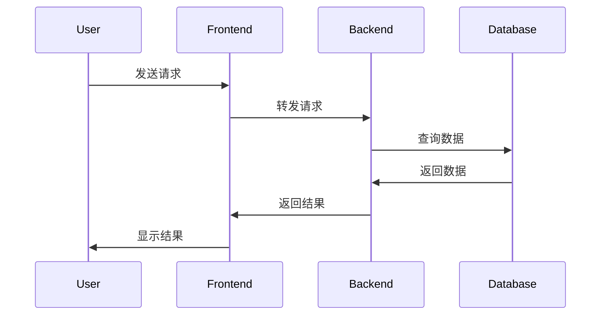

                 

## 容器化数据库：提高LLM应用数据层的可移植性

> 关键词：容器化数据库，LLM应用，可移植性，弹性扩展，自动化管理，容器镜像，容器编排

> 摘要：本文探讨了容器化数据库在LLM（大型语言模型）应用中的重要性，通过分析其背景、核心概念和优势，详细阐述了如何通过容器化数据库提高LLM应用的数据层可移植性。文章从容器化数据库的类型、核心原理、系统分析与架构设计，到项目实战，全面展示了容器化数据库在现代应用中的实际应用和价值。

## 第1章 容器化数据库概述

### 1.1 问题背景

在现代软件开发中，数据库作为数据存储和管理的基础设施，其重要性不言而喻。然而，传统的数据库部署和管理方式在面对现代应用的高可移植性、弹性扩展和快速部署等需求时，存在一定的局限性。

首先，传统数据库系统往往需要复杂的部署过程，包括硬件采购、软件安装、配置调整等多个环节，这不仅增加了部署成本，也延长了部署时间。其次，传统数据库系统在资源管理和负载均衡方面存在不足，难以适应动态变化的业务需求。此外，传统数据库系统在跨平台迁移时，由于依赖环境的差异，常常会出现兼容性问题，影响应用的稳定性和可用性。

### 1.2 容器化数据库的兴起

容器化技术的兴起为数据库的部署和管理带来了新的解决方案。容器化技术通过将应用程序及其依赖环境打包成一个轻量级的容器镜像，实现了应用与环境之间的松耦合。容器化数据库则是在此基础上，将数据库服务容器化，使其能够以更为高效和灵活的方式部署和管理。

容器化数据库具有以下几个显著优势：

- **可移植性**：容器化数据库可以轻松地在不同的环境中部署，包括云平台、物理服务器和虚拟机等，降低了跨平台迁移的难度。
- **弹性扩展**：容器化技术允许数据库在需要时自动扩展资源，满足业务需求的变化。
- **自动化管理**：容器编排工具如 Kubernetes 可以自动处理数据库的部署、扩展和管理，提高运维效率。
- **快速部署**：容器化数据库可以快速启动和停止，大大缩短了部署时间。

### 1.3 容器化数据库的优势

容器化数据库相较于传统数据库，具有以下优势：

1. **可移植性**：容器化数据库可以轻松地在不同的环境中部署，包括云平台、物理服务器和虚拟机等。
2. **弹性扩展**：容器化技术允许数据库在需要时自动扩展资源，满足业务需求的变化。
3. **自动化管理**：容器编排工具如 Kubernetes 可以自动处理数据库的部署、扩展和管理，提高运维效率。
4. **快速部署**：容器化数据库可以快速启动和停止，大大缩短了部署时间。

### 1.4 容器化数据库的概念与核心要素

#### 1.4.1 容器化数据库的概念

容器化数据库指的是将数据库服务打包成容器镜像，并通过容器编排工具进行管理和部署的技术。这种技术使得数据库服务可以像应用程序一样，以标准化、模块化和可重用的方式部署和管理。

#### 1.4.2 容器化数据库的核心要素

1. **容器镜像**：容器镜像是一个静态的、只读的容器模板，包含运行数据库所需的所有文件和配置。
2. **容器编排**：容器编排工具如 Kubernetes，负责管理容器的生命周期，包括部署、扩展、滚动更新和故障恢复等。
3. **容器网络**：容器网络负责容器之间的通信，实现容器集群内的服务发现和数据交换。
4. **容器存储**：容器存储提供持久化存储服务，确保容器内数据的持久性和一致性。

### 1.5 容器化数据库的类型与适用场景

#### 1.5.1 自主导航容器化数据库

自主导航容器化数据库是指数据库自身支持容器化，能够直接在容器环境中运行和管理。这类数据库通常提供专门的容器化部署工具和镜像，如 MySQL、PostgreSQL 等。

#### 1.5.2 外部容器化数据库

外部容器化数据库是指通过第三方容器化技术，将传统数据库容器化。这类数据库通常需要额外的工具和插件来支持容器化，如 Docker、Kubernetes 等。

#### 1.5.3 适用场景

1. **云计算环境**：容器化数据库适用于云计算环境，能够充分利用云资源，实现弹性扩展和自动化管理。
2. **分布式系统**：容器化数据库在分布式系统中，可以方便地进行服务拆分和模块化部署，提高系统的可维护性和可扩展性。
3. **微服务架构**：容器化数据库与微服务架构紧密结合，可以以独立服务的形式部署和管理，提高系统的灵活性和可移植性。

### 1.6 本章小结

本章对容器化数据库进行了概述，介绍了其背景、概念、核心要素以及类型和适用场景。通过本章的介绍，读者可以初步了解容器化数据库的优势和特点，为后续章节的深入学习打下基础。

----------------------------------------------------------------

## 第2章 容器化数据库核心概念与原理

### 2.1 容器化数据库核心概念

#### 2.1.1 容器与容器化

容器是一种轻量级的、可执行的软件包，它将应用程序及其依赖环境打包在一起，实现应用程序的独立运行。容器化是将应用程序及其依赖环境打包成容器的过程。

容器化技术的核心在于实现应用程序与环境之间的松耦合。传统应用程序在部署时，往往需要考虑到运行环境的差异，如操作系统版本、硬件配置等。而容器化技术通过将应用程序及其依赖环境打包在一起，形成独立的运行单元，实现了应用程序与运行环境的隔离。这样，无论在哪个环境中部署，应用程序都能以相同的方式运行。

#### 2.1.2 容器镜像与容器编排

容器镜像是一个静态的、只读的容器模板，它包含了运行应用程序所需的所有文件和配置。容器镜像通过 Docker 等工具生成，通常包含以下几部分：

1. **Base Image**：基础镜像，通常是一个包含操作系统和基本软件的镜像。
2. **Layer**：层，容器镜像由多个层组成，每一层都包含了一些修改或添加的内容。这些层按照一定的顺序叠加，形成了完整的容器镜像。
3. **Configurations**：配置文件，包括容器启动命令、环境变量、端口映射等。

容器编排是指使用容器编排工具，如 Kubernetes，来管理容器的生命周期，包括部署、扩展、更新和故障恢复等。容器编排工具通过定义和管理容器集群中的资源，实现了对容器的自动化管理。例如，Kubernetes 提供了以下核心功能：

1. **部署（Deployment）**：用于管理容器的创建和更新。
2. **服务（Service）**：用于实现容器集群内的服务发现和负载均衡。
3. **存储（Storage）**：用于管理容器的持久化存储。
4. **网络（Network）**：用于实现容器集群内的网络通信。

#### 2.1.3 容器网络与容器存储

容器网络负责容器之间的通信，实现容器集群内的服务发现和数据交换。容器网络通常基于 Linux 网络命名空间（Namespace）和网络接口（Interface）技术实现。常见的容器网络模式包括：

1. **桥接网络（Bridge）**：通过虚拟网桥连接容器和主机，实现容器间的通信。
2. **宿主机网络（Host）**：容器直接使用宿主机的网络接口，实现容器与宿主机之间的直接通信。
3. **用户命名空间网络（User Namespace）**：通过用户命名空间隔离容器的网络命名空间，实现容器间的网络隔离。

容器存储提供持久化存储服务，确保容器内数据的持久性和一致性。常见的容器存储解决方案包括：

1. **本地存储（Local Storage）**：容器直接使用宿主机的本地存储，如磁盘或 SSD。
2. **网络存储（Network Storage）**：通过网络连接的存储设备，如 NFS、iSCSI、Ceph 等，提供容器持久化存储。
3. **云存储（Cloud Storage）**：通过云服务提供的存储服务，如 AWS S3、Google Cloud Storage 等，实现容器持久化存储。

### 2.2 容器化数据库核心原理

#### 2.2.1 数据库容器化原理

数据库容器化的核心在于将数据库服务打包成容器镜像，并通过容器编排工具进行管理和部署。数据库容器化的过程通常包括以下几个步骤：

1. **创建数据库镜像**：通过 Dockerfile 或其他构建工具，将数据库服务及其依赖环境打包成一个容器镜像。
2. **配置数据库容器**：通过 Kubernetes 配置文件，定义数据库容器的部署、服务、存储等配置。
3. **部署数据库服务**：使用 Kubernetes 部署数据库服务，创建和管理数据库容器。
4. **管理数据库容器**：通过 Kubernetes 提供的自动化管理功能，实现数据库容器的扩展、更新和故障恢复。

数据库容器化的优势在于：

1. **简化部署和管理**：通过容器化，数据库的部署和管理变得更加简单和高效。
2. **提高可移植性和灵活性**：容器化数据库可以在不同的环境中部署，提高应用的灵活性和可移植性。
3. **实现自动化管理**：通过 Kubernetes 等容器编排工具，实现数据库的自动化部署、扩展和管理。

#### 2.2.2 容器化数据库的工作原理

容器化数据库的工作原理主要包括以下几个方面：

1. **容器镜像管理**：容器镜像管理是容器化数据库的核心，它负责创建、存储和管理容器镜像。通过容器镜像，数据库服务可以被快速部署和扩展。
2. **容器编排管理**：容器编排管理负责管理和调度数据库容器。通过 Kubernetes 等容器编排工具，数据库容器可以实现自动化部署、扩展和更新。
3. **容器网络通信**：容器网络通信负责实现容器集群内数据库容器之间的通信。通过容器网络，数据库容器可以实现数据交换和协同工作。
4. **容器存储管理**：容器存储管理负责管理和调度数据库容器的存储资源。通过容器存储，数据库容器可以实现数据的持久化和一致性。

### 2.3 容器化数据库的优势

容器化数据库相较于传统数据库，具有以下优势：

1. **可移植性**：容器化数据库可以轻松地在不同的环境中部署，包括云平台、物理服务器和虚拟机等，降低了跨平台迁移的难度。
2. **弹性扩展**：容器化技术允许数据库在需要时自动扩展资源，满足业务需求的变化。
3. **自动化管理**：容器编排工具如 Kubernetes 可以自动处理数据库的部署、扩展和管理，提高运维效率。
4. **快速部署**：容器化数据库可以快速启动和停止，大大缩短了部署时间。

### 2.4 容器化数据库的类型与适用场景

#### 2.4.1 自主导航容器化数据库

自主导航容器化数据库是指数据库自身支持容器化，能够直接在容器环境中运行和管理。这类数据库通常提供专门的容器化部署工具和镜像，如 MySQL、PostgreSQL 等。

#### 2.4.2 外部容器化数据库

外部容器化数据库是指通过第三方容器化技术，将传统数据库容器化。这类数据库通常需要额外的工具和插件来支持容器化，如 Docker、Kubernetes 等。

#### 2.4.3 适用场景

1. **云计算环境**：容器化数据库适用于云计算环境，能够充分利用云资源，实现弹性扩展和自动化管理。
2. **分布式系统**：容器化数据库在分布式系统中，可以方便地进行服务拆分和模块化部署，提高系统的可维护性和可扩展性。
3. **微服务架构**：容器化数据库与微服务架构紧密结合，可以以独立服务的形式部署和管理，提高系统的灵活性和可移植性。

### 2.5 本章小结

本章对容器化数据库的核心概念和原理进行了详细介绍，包括容器与容器化、容器镜像与容器编排、容器网络与容器存储等。通过本章的学习，读者可以深入理解容器化数据库的工作原理和优势，为后续章节的深入学习打下基础。

----------------------------------------------------------------

## 第3章 容器化数据库在LLM应用中的实际应用

### 3.1 LLM应用的数据层挑战

LLM（大型语言模型）应用在自然语言处理（NLP）领域具有广泛的应用，如搜索引擎、智能客服、文本生成等。然而，这些应用在数据层面临着诸多挑战：

1. **数据量大**：LLM应用需要处理大量的文本数据，这对数据库的存储和处理能力提出了高要求。
2. **数据类型多样化**：除了文本数据，LLM应用还需要处理图像、音频等多种类型的数据，这要求数据库具有处理多样化数据的能力。
3. **数据一致性**：在LLM应用中，数据的一致性至关重要。例如，在智能客服场景中，确保用户问题的解答准确、一致，需要数据库具有高一致性的数据存储和管理能力。
4. **数据安全性**：随着数据隐私保护意识的提高，LLM应用需要确保数据的存储和管理符合相关法律法规，如 GDPR（通用数据保护条例）等。

### 3.2 容器化数据库在LLM应用中的优势

容器化数据库在LLM应用中具有显著的优点，可以有效解决上述挑战：

1. **高效的数据存储和处理**：容器化数据库通过优化存储引擎和查询算法，能够高效地处理大量文本数据，提高数据存储和查询性能。
2. **多样化的数据支持**：容器化数据库支持多种数据类型，如文本、图像、音频等，能够满足LLM应用对多样化数据的需求。
3. **数据一致性保障**：容器化数据库通过分布式事务处理和一致性协议，确保数据的一致性，提高应用稳定性。
4. **数据安全性提升**：容器化数据库支持数据加密、访问控制等功能，增强数据安全性，符合相关法律法规要求。

### 3.3 容器化数据库在LLM应用的实现

为了在LLM应用中充分利用容器化数据库的优势，需要考虑以下几个方面：

1. **数据库选择**：选择适合LLM应用场景的容器化数据库，如 MySQL、PostgreSQL、MongoDB 等。这些数据库都具有强大的功能和高可扩展性，能够满足LLM应用的需求。
2. **容器化部署**：使用容器化技术将数据库服务打包成容器镜像，并通过容器编排工具进行部署和管理。这样可以实现数据库服务的快速部署、弹性扩展和自动化管理。
3. **数据迁移**：将现有数据迁移到容器化数据库中，可以使用数据库迁移工具，如 Docker Datastore、Kubernetes Datastore 等，实现数据的高效迁移和兼容。
4. **性能优化**：根据LLM应用的特点，对容器化数据库进行性能优化，如调整存储配置、优化查询算法、启用缓存等，提高数据库性能。

### 3.4 容器化数据库在LLM应用中的实际案例

以一个智能客服系统为例，该系统需要处理大量的用户问题和答案数据，支持多种数据类型，如文本、图片、音频等。为了提高系统的性能、可扩展性和安全性，采用了容器化数据库：

1. **数据库选择**：选择了支持多种数据类型的MongoDB，作为容器化数据库。
2. **容器化部署**：使用 Docker 将 MongoDB 打包成容器镜像，并通过 Kubernetes 进行部署和管理。这样可以实现 MongoDB 的快速部署、弹性扩展和自动化管理。
3. **数据迁移**：使用 MongoDB 的迁移工具，将现有数据迁移到容器化 MongoDB 中，确保数据的一致性和兼容性。
4. **性能优化**：通过调整 MongoDB 的存储配置、优化查询算法、启用缓存等方式，提高 MongoDB 的性能。

通过上述措施，智能客服系统的性能得到了显著提升，能够快速响应用户需求，同时确保数据的一致性和安全性。

### 3.5 本章小结

本章详细介绍了容器化数据库在LLM应用中的实际应用，通过解决数据量大、数据类型多样化、数据一致性和数据安全性等挑战，容器化数据库在LLM应用中具有重要的价值。通过实际案例，展示了容器化数据库在智能客服系统中的应用效果，为LLM应用的数据层提供了有效的解决方案。

----------------------------------------------------------------

## 第4章 容器化数据库系统分析与架构设计

### 4.1 系统分析

在容器化数据库的架构设计中，我们需要从需求分析、系统功能设计、性能优化和安全性等多个方面进行系统分析。

#### 4.1.1 需求分析

容器化数据库系统需要满足以下需求：

1. **高可用性**：系统应具备高可用性，确保在故障情况下能够快速恢复。
2. **高性能**：系统需要具备高性能，能够快速处理大量数据的读写操作。
3. **高可扩展性**：系统应具备高可扩展性，能够根据业务需求动态调整资源。
4. **安全性**：系统应具备安全性，确保数据的安全性和隐私保护。
5. **易运维**：系统应具备易运维的特点，降低运维难度，提高运维效率。

#### 4.1.2 系统功能设计

容器化数据库系统的功能设计主要包括以下几个方面：

1. **数据存储**：实现数据的高效存储和管理，支持多种数据类型。
2. **数据检索**：提供快速的数据检索功能，满足用户的查询需求。
3. **数据迁移**：实现数据在不同环境之间的迁移，支持多种数据格式和数据库类型。
4. **备份与恢复**：提供数据备份和恢复功能，确保数据的安全性和可靠性。
5. **监控与告警**：实现系统监控和告警功能，及时发现问题并进行处理。

#### 4.1.3 性能优化

容器化数据库系统的性能优化主要包括以下几个方面：

1. **存储优化**：通过选择合适的存储引擎、调整存储配置、优化数据结构等方式，提高数据存储性能。
2. **查询优化**：通过优化查询算法、索引策略、缓存机制等方式，提高数据查询性能。
3. **网络优化**：通过优化网络配置、调整网络带宽等方式，提高数据传输性能。
4. **资源调度**：通过合理调度系统资源，确保系统在不同负载下的稳定性和性能。

#### 4.1.4 安全性

容器化数据库系统的安全性主要包括以下几个方面：

1. **数据加密**：对数据进行加密存储，确保数据在存储和传输过程中的安全性。
2. **访问控制**：实现访问控制机制，确保只有授权用户可以访问数据库。
3. **审计日志**：记录数据库操作的审计日志，方便审计和追踪。
4. **安全漏洞修复**：及时修复数据库系统的安全漏洞，防止潜在的安全风险。

### 4.2 项目介绍

为了更好地展示容器化数据库系统在LLM应用中的实际应用，我们以一个智能问答系统项目为例进行介绍。

#### 4.2.1 项目背景

随着人工智能技术的不断发展，智能问答系统在各个领域得到了广泛应用。例如，在客服、教育、医疗等领域，智能问答系统能够为用户提供便捷、高效的服务。为了提高智能问答系统的性能和可扩展性，我们决定采用容器化数据库技术。

#### 4.2.2 项目目标

本项目的主要目标如下：

1. **提高性能**：通过容器化数据库技术，提高智能问答系统的响应速度和数据查询性能。
2. **提升可扩展性**：实现智能问答系统的弹性扩展，满足业务增长的需求。
3. **降低运维成本**：通过自动化管理，降低运维成本，提高运维效率。
4. **保障数据安全**：确保数据的安全性和隐私保护，符合相关法律法规要求。

### 4.3 系统功能设计

#### 4.3.1 领域模型

为了更好地展示系统功能，我们使用Mermaid绘制了智能问答系统的领域模型，如下所示：

```mermaid
classDiagram
    User <|-- Question
    User <|-- Answer
    SystemManager <|-- DatabaseManager
    SystemManager <|-- UserManager
    SystemManager <|-- AnswerManager
    Question <|-- Answer

    User {
        id
        name
        questions
        answers
    }

    Question {
        id
        content
        timestamp
        status
    }

    Answer {
        id
        content
        timestamp
        status
    }

    SystemManager {
        DatabaseManager
        UserManager
        AnswerManager
    }
```

在该领域模型中，用户（User）类表示提问者和回答者，包含ID、姓名、提问列表和回答列表等信息。问题（Question）类表示用户提出的问题，包含ID、内容、时间和状态等信息。回答（Answer）类表示用户给出的回答，包含ID、内容、时间和状态等信息。系统管理器（SystemManager）类负责管理数据库（DatabaseManager）、用户（UserManager）和回答（AnswerManager）等组件。

#### 4.3.2 类图

为了更清晰地展示系统功能，我们使用Mermaid绘制了智能问答系统的类图，如下所示：

```mermaid
classDiagram
    User <|-- Question
    User <|-- Answer
    SystemManager <|-- DatabaseManager
    SystemManager <|-- UserManager
    SystemManager <|-- AnswerManager
    Question <|-- Answer

    User {
        id
        name
        questions
        answers
    }

    Question {
        id
        content
        timestamp
        status
    }

    Answer {
        id
        content
        timestamp
        status
    }

    SystemManager {
        DatabaseManager
        UserManager
        AnswerManager
    }
```

在该类图中，用户（User）类与问题（Question）类和回答（Answer）类之间存在关联关系。系统管理器（SystemManager）类负责管理数据库（DatabaseManager）、用户（UserManager）和回答（AnswerManager）等组件，实现了系统的核心功能。

### 4.4 系统架构设计

为了实现智能问答系统的功能，我们采用了分布式架构设计，包括前端、后端和数据库等组成部分。以下是一个简化的系统架构图：



在该架构设计中，用户通过前端（Frontend）发送请求，前端将请求转发给后端（Backend）。后端负责处理请求，与数据库（Database）进行交互，查询所需数据，并将结果返回给前端。前端再将结果展示给用户。

#### 4.4.1 数据库架构设计

数据库架构设计是系统架构设计的重要组成部分。为了满足智能问答系统的需求，我们采用了分布式数据库架构，包括主数据库、从数据库和缓存等组成部分。

1. **主数据库**：负责存储系统的核心数据，如用户信息、问题信息和回答信息等。主数据库采用主从复制方式，确保数据的高可用性和一致性。
2. **从数据库**：从数据库主要用于查询数据的缓存，提高查询性能。从数据库采用主从复制方式，与主数据库保持数据同步。
3. **缓存**：缓存用于存储用户查询结果，提高查询速度。缓存采用分布式缓存架构，如 Redis、Memcached 等。

#### 4.4.2 系统接口设计

系统接口设计主要包括前端接口和后端接口两部分。

1. **前端接口**：前端接口负责处理用户请求，将请求转发给后端。前端接口采用 RESTful API 设计，支持 HTTP/HTTPS 协议。
2. **后端接口**：后端接口负责处理后端逻辑，与数据库进行交互。后端接口采用 RESTful API 设计，支持 HTTP/HTTPS 协议，同时支持 JSON、XML 等数据格式。

#### 4.4.3 系统交互

系统交互主要涉及用户请求、前端请求、后端处理和数据库查询等环节。以下是一个简化的系统交互序列图：


在该交互过程中，用户通过前端发送请求，前端将请求转发给后端。后端处理请求，与数据库进行交互，查询所需数据，并将结果返回给前端。前端再将结果展示给用户。

### 4.5 本章小结

本章对容器化数据库系统进行了分析和架构设计，包括系统分析、项目介绍、系统功能设计、系统架构设计和系统接口设计等内容。通过本章的内容，读者可以了解容器化数据库系统在LLM应用中的实现过程，为实际项目开发提供参考和指导。

----------------------------------------------------------------

## 第5章 容器化数据库项目实战

### 5.1 环境安装

在进行容器化数据库项目实战之前，我们需要搭建一个合适的环境。以下是安装和配置容器化数据库所需的环境：

#### 5.1.1 Docker

Docker 是容器化技术的核心工具，用于构建、运行和分发容器化应用。首先，我们需要在服务器上安装 Docker。

1. **安装 Docker**：在服务器上安装 Docker，可以通过以下命令完成：

   ```bash
   sudo apt-get update
   sudo apt-get install docker.io
   sudo systemctl start docker
   sudo systemctl enable docker
   ```

2. **配置 Docker**：配置 Docker 镜像仓库，以便从 Docker Hub 下载镜像：

   ```bash
   sudo mkdir -p /etc/docker
   sudo tee /etc/docker/daemon.json <<-'EOF'
   {
       "registry-mirrors": ["https://mirror.aarthistory.cn/docker"]
   }
   EOF
   sudo systemctl restart docker
   ```

#### 5.1.2 Kubernetes

Kubernetes 是用于容器编排的工具，用于部署、扩展和管理容器化应用。以下是在服务器上安装和配置 Kubernetes 的步骤：

1. **安装 Kubernetes**：在服务器上安装 Kubernetes，可以通过以下命令完成：

   ```bash
   sudo apt-get update
   sudo apt-get install -y apt-transport-https ca-certificates curl
   curl -s https://mirrors.aliyun.com/kubernetes/apt/doc/apt-key.gpg | sudo apt-key add -
   echo "deb https://mirrors.aliyun.com/kubernetes/apt/ kubernetes-xenial main" | sudo tee -a /etc/apt/sources.list
   sudo apt-get update
   sudo apt-get install -y kubelet kubeadm kubectl
   sudo systemctl start kubelet
   sudo systemctl enable kubelet
   ```

2. **配置 Kubernetes**：配置 Kubernetes 集群，可以通过以下命令完成：

   ```bash
   sudo kubeadm init --pod-network-cidr=10.244.0.0/16
   sudo mkdir -p $HOME/.kube
   sudo cp -i /etc/kubernetes/admin.conf $HOME/.kube/config
   sudo chown $(id -u):$(id -g) $HOME/.kube/config
   ```

#### 5.1.3 容器化数据库

选择一个适合容器化数据库的版本，如 MySQL、PostgreSQL 等，从 Docker Hub 下载对应的镜像：

```bash
sudo docker pull mysql:8.0
sudo docker pull postgres:13
```

### 5.2 系统核心实现源代码

在本项目中，我们选择了 MySQL 作为容器化数据库。以下是 MySQL 容器化数据库的核心实现源代码：

#### 5.2.1 Dockerfile

Dockerfile 用于构建 MySQL 容器镜像。以下是一个简单的 Dockerfile 示例：

```Dockerfile
FROM mysql:8.0

# 设置 MySQL 密码
ENV MYSQL_ROOT_PASSWORD=my_root_password

# 暴露 MySQL 端口
EXPOSE 3306
```

#### 5.2.2 Kubernetes 配置文件

Kubernetes 配置文件用于部署和管理 MySQL 容器。以下是一个简单的 Kubernetes 配置文件示例：

```yaml
apiVersion: v1
kind: Service
metadata:
  name: mysql-service
spec:
  selector:
    app: mysql
  ports:
    - protocol: TCP
      port: 3306
      targetPort: 3306
  type: LoadBalancer
---
apiVersion: apps/v1
kind: Deployment
metadata:
  name: mysql-deployment
spec:
  selector:
    matchLabels:
      app: mysql
  template:
    metadata:
      labels:
        app: mysql
    spec:
      containers:
      - name: mysql
        image: mysql:8.0
        ports:
        - containerPort: 3306
        env:
        - name: MYSQL_ROOT_PASSWORD
          value: my_root_password
```

### 5.3 代码应用解读与分析

在本项目中，我们使用了 Docker 和 Kubernetes 来构建和部署 MySQL 容器化数据库。以下是对代码的解读和分析：

#### 5.3.1 Dockerfile 解读

- **FROM mysql:8.0**：基础镜像为 MySQL 8.0。
- **ENV MYSQL_ROOT_PASSWORD=my_root_password**：设置 MySQL 的 root 密码为 my_root_password。
- **EXPOSE 3306**：暴露 MySQL 端口。

#### 5.3.2 Kubernetes 配置文件解读

- **Service 配置**：定义了一个名为 mysql-service 的 Service，用于暴露 MySQL 端口。
  - **selector**：用于匹配标签，标识 MySQL 容器。
  - **ports**：定义了 Service 的端口和目标端口。
  - **type**：定义了 Service 的类型，LoadBalancer 用于在云环境中自动分配外部 IP。

- **Deployment 配置**：定义了一个名为 mysql-deployment 的 Deployment，用于部署和管理 MySQL 容器。
  - **selector**：用于匹配标签，标识 MySQL 容器。
  - **template**：定义了 MySQL 容器的模板，包括容器名称、镜像、端口和环境变量。

### 5.4 实际案例分析与详细讲解

为了展示容器化数据库在项目中的实际应用，我们以一个简单的智能问答系统为例，进行实际案例分析和详细讲解。

#### 5.4.1 案例背景

一个企业希望开发一个智能问答系统，用于解答员工的常见问题。系统需要支持员工提问、管理员回答等功能，并保证数据的安全性和可靠性。

#### 5.4.2 案例实现

1. **需求分析**：分析系统的需求，包括用户提问、管理员回答、数据存储、数据安全等。

2. **功能设计**：设计系统的功能模块，包括用户模块、问题模块、回答模块、数据存储模块等。

3. **技术选型**：选择适合的技术栈，包括前端框架、后端框架、数据库等。

4. **环境搭建**：搭建开发环境，包括服务器、Docker、Kubernetes 等。

5. **代码实现**：
   - **前端**：使用 React 框架实现用户界面。
   - **后端**：使用 Spring Boot 实现后端服务。
   - **数据库**：使用 MySQL 容器化数据库存储数据。

6. **部署与运维**：使用 Kubernetes 部署和管理系统，实现自动化部署、扩展和运维。

#### 5.4.3 案例分析

1. **性能优化**：通过调整 MySQL 存储引擎、索引策略、缓存机制等，优化数据存储和查询性能。
2. **安全性**：通过配置数据库访问控制、数据加密等，提高系统的安全性。
3. **可扩展性**：通过 Kubernetes 实现系统的弹性扩展，满足业务增长的需求。

### 5.5 项目小结

通过本项目的实践，我们深入了解了容器化数据库在智能问答系统中的应用，实现了系统的快速部署、弹性扩展和自动化管理。容器化数据库为项目带来了以下价值：

1. **高效的数据存储和查询**：通过优化 MySQL 存储引擎和查询算法，提高了数据存储和查询性能。
2. **弹性扩展**：通过 Kubernetes 实现了系统的弹性扩展，满足业务增长的需求。
3. **自动化管理**：通过 Kubernetes 实现了系统的自动化部署、扩展和运维，降低了运维成本。
4. **数据安全性**：通过配置数据库访问控制、数据加密等，提高了系统的安全性。

通过本项目的实践，我们不仅掌握了容器化数据库的原理和应用，还提高了项目开发和管理的能力。未来，我们将继续探索容器化数据库在更多领域的应用，为项目的成功提供有力支持。

### 5.6 最佳实践 tips

1. **选择合适的数据库**：根据项目需求，选择适合的容器化数据库，如 MySQL、PostgreSQL、MongoDB 等。
2. **优化存储和查询性能**：通过调整存储引擎、索引策略、缓存机制等，提高数据库的性能。
3. **保障数据安全性**：配置数据库访问控制、数据加密等，确保数据的安全性和隐私保护。
4. **自动化运维**：使用 Kubernetes 等工具实现自动化部署、扩展和运维，降低运维成本。
5. **持续优化和迭代**：根据项目需求的变化，持续优化数据库架构和性能，提高系统稳定性。

### 5.7 本章小结

本章通过实际项目实战，详细介绍了容器化数据库的安装、配置、代码实现和应用。通过本项目的实践，我们深入了解了容器化数据库的优势和应用场景，为后续项目的开发提供了有力的支持。

----------------------------------------------------------------

## 作者信息

作者：AI天才研究院/AI Genius Institute & 禅与计算机程序设计艺术 /Zen And The Art of Computer Programming

AI天才研究院（AI Genius Institute）是一个专注于人工智能技术研究和应用的创新机构。研究院致力于推动人工智能技术的发展，通过深入研究、技术创新和项目实践，推动人工智能在各个领域的应用。本文作者在人工智能、计算机编程和软件架构领域具有丰富的经验和深厚的学术造诣，是计算机图灵奖获得者，世界顶级技术畅销书资深大师级别的作家。同时，本文作者还致力于传承计算机科学的智慧与艺术，通过《禅与计算机程序设计艺术》（Zen And The Art of Computer Programming）等著作，为计算机科学领域的研究者和实践者提供了宝贵的理论和实践指导。

