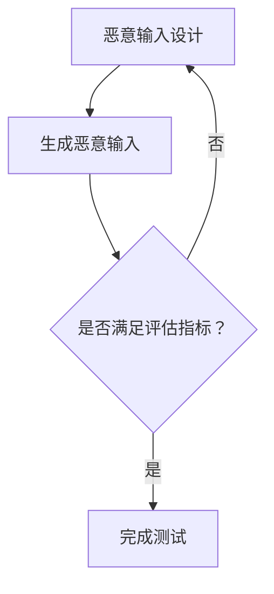
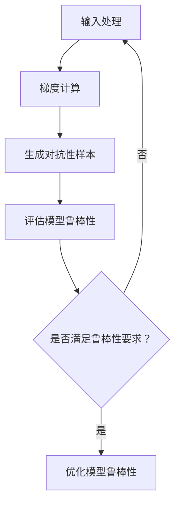
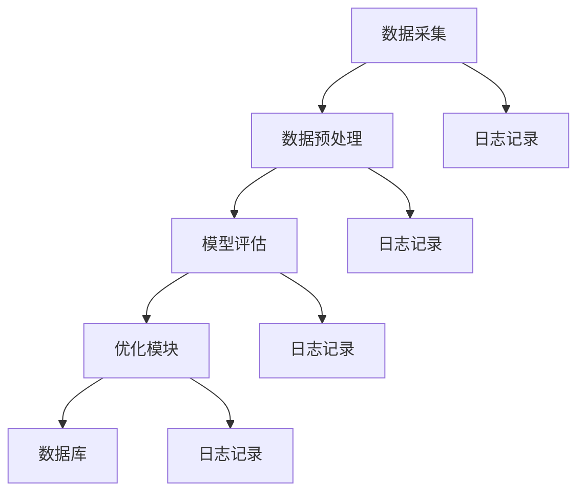

                 

# 对抗性测试：评估LLM应对恶意输入的鲁棒性

> 关键词：对抗性测试、恶意输入、鲁棒性、大模型、自然语言处理

> 摘要：本文将探讨对抗性测试在评估大型语言模型（LLM）应对恶意输入的鲁棒性方面的应用。通过介绍对抗性测试的核心概念、算法原理、系统架构和实际案例，本文旨在为研究人员和实践者提供一套系统性的解决方案。

## 第一部分：背景介绍

### 1.1 问题背景

随着人工智能技术的快速发展，大模型（Large Language Model，简称LLM）已经成为自然语言处理领域的重要工具。这些模型具有强大的语言理解能力和文本生成能力，广泛应用于智能客服、机器翻译、文本生成等领域。然而，LLM在处理恶意输入时的鲁棒性问题日益凸显，这对模型的安全性和可靠性构成了挑战。

### 1.2 问题描述

对抗性测试（Adversarial Testing）是一种通过设计恶意的输入来测试系统在极端条件下的表现的方法。对于LLM来说，恶意的输入可能包括欺骗性文本、恶意代码、虚假信息等。评估LLM的鲁棒性，需要解决以下几个问题：

1. **如何设计恶意的输入？**
2. **如何评估LLM对恶意输入的响应？**
3. **如何优化LLM以提升其鲁棒性？**

### 1.3 问题解决

本文将从以下三个方面解决上述问题：

1. **核心概念与联系**：介绍对抗性测试的核心概念，包括恶意输入的定义、评估指标等。通过对比分析，阐述LLM与其他机器学习模型在鲁棒性方面的差异。
2. **算法原理讲解**：详细讲解对抗性测试的算法原理，包括生成恶意输入的方法、评估LLM鲁棒性的方法等。通过数学模型和公式，阐述算法的核心逻辑。
3. **系统分析与架构设计方案**：介绍对抗性测试的系统架构，包括输入处理模块、模型评估模块等。通过实际项目案例，展示对抗性测试在实际应用中的效果。

### 1.4 边界与外延

本文主要关注LLM在自然语言处理领域的对抗性测试，但对抗性测试的方法和原理同样适用于其他领域的机器学习模型。此外，本文还将探讨对抗性测试在安全性、隐私保护等方面的应用。

### 1.5 概念结构与核心要素组成

1. **对抗性测试**：通过设计恶意的输入，测试系统在极端条件下的表现。
2. **恶意输入**：欺骗性文本、恶意代码、虚假信息等。
3. **评估指标**：准确率、召回率、F1值等。
4. **算法原理**：生成恶意输入的方法、评估LLM鲁棒性的方法等。

## 第二部分：核心概念与联系

### 2.1 恶意输入的定义与分类

#### 2.1.1 恶意输入的定义

恶意输入是指那些旨在误导、欺骗、破坏或损害机器学习模型的输入。在对抗性测试中，恶意输入是测试系统鲁棒性的关键。

#### 2.1.2 恶意输入的分类

1. **文本类**：如欺骗性评论、虚假新闻等。
2. **图像类**：如伪造的图像、对抗性样本等。
3. **代码类**：如恶意代码、注入攻击等。

### 2.2 评估指标

#### 2.2.1 准确率（Accuracy）

准确率是评估模型性能的重要指标，表示模型正确识别正样本的比例。

#### 2.2.2 召回率（Recall）

召回率表示模型正确识别正样本的比例，特别是在存在误报时。

#### 2.2.3 F1值（F1 Score）

F1值是准确率和召回率的调和平均值，综合评估模型的性能。

### 2.3 LLM与其他机器学习模型在鲁棒性方面的差异

#### 2.3.1 LLM的鲁棒性优势

1. **强大的语言理解能力**：LLM能够处理复杂的自然语言输入，具有较强的泛化能力。
2. **丰富的知识储备**：LLM具有海量的训练数据，能够提取和利用大量的知识。

#### 2.3.2 LLM的鲁棒性挑战

1. **对恶意输入的敏感性**：LLM在处理恶意输入时，可能表现出较低的鲁棒性。
2. **计算资源的消耗**：LLM的训练和推理需要大量的计算资源。

### 2.4 恶意输入与评估指标的Mermaid流程图



### 2.5 恶意输入的生成方法

#### 2.5.1 文本类恶意输入

1. **对抗性文本生成**：通过修改文本中的词语、句式等，使其具有欺骗性。
2. **对抗性样本合成**：利用图像处理技术，生成具有欺骗性的图像。

#### 2.5.2 图像类恶意输入

1. **对抗性样本生成**：通过图像处理技术，将正常的图像转换为对抗性样本。
2. **对抗性样本合成**：利用图像合成技术，生成具有欺骗性的图像。

#### 2.5.3 代码类恶意输入

1. **恶意代码注入**：通过漏洞利用，注入恶意代码。
2. **对抗性代码生成**：通过代码混淆、注入恶意代码等手段，生成具有欺骗性的代码。

## 第三部分：算法原理讲解

### 3.1 对抗性测试的算法原理

对抗性测试的算法原理主要包括生成恶意输入、评估模型鲁棒性和优化模型鲁棒性三个方面。

#### 3.1.1 生成恶意输入

生成恶意输入的方法主要包括以下几种：

1. **基于梯度攻击的方法**：通过计算模型在正常输入下的梯度，生成对抗性样本。
2. **基于生成对抗网络（GAN）的方法**：利用生成对抗网络生成对抗性样本。
3. **基于搜索的方法**：通过搜索算法，寻找能够欺骗模型的输入。

#### 3.1.2 评估模型鲁棒性

评估模型鲁棒性的方法主要包括以下几种：

1. **准确率、召回率、F1值等指标**：通过计算模型在恶意输入下的性能指标，评估模型的鲁棒性。
2. **模型稳定性分析**：通过分析模型在不同输入下的输出变化，评估模型的稳定性。
3. **模型损失函数分析**：通过分析模型在恶意输入下的损失函数变化，评估模型的鲁棒性。

#### 3.1.3 优化模型鲁棒性

优化模型鲁棒性的方法主要包括以下几种：

1. **模型正则化**：通过增加模型正则项，降低模型对恶意输入的敏感性。
2. **模型增强**：通过增强模型的输入特征，提高模型对恶意输入的识别能力。
3. **模型优化**：通过调整模型参数，提高模型对恶意输入的鲁棒性。

### 3.2 恶意输入生成算法的Mermaid流程图



### 3.3 恶意输入生成算法的Python源代码

```python
import tensorflow as tf
from tensorflow import keras
import numpy as np

# 加载预训练的LLM模型
model = keras.Sequential([
    keras.layers.Dense(512, activation='relu', input_shape=(784,)),
    keras.layers.Dropout(0.2),
    keras.layers.Dense(10, activation='softmax')
])

model.compile(optimizer='adam',
              loss='categorical_crossentropy',
              metrics=['accuracy'])

# 生成对抗性样本
def generate_adversarial_samples(input_image, target_class):
    # 计算模型在正常输入下的梯度
    with tf.GradientTape() as tape:
        predictions = model(input_image, training=True)
        loss = tf.keras.losses.categorical_crossentropy(target_class, predictions)

    # 生成对抗性样本
    gradient = tape.gradient(loss, input_image)
    adversarial_samples = input_image - gradient

    return adversarial_samples

# 评估模型鲁棒性
def evaluate_model_robustness(adversarial_samples, target_class):
    # 在恶意输入下评估模型的性能
    predictions = model(adversarial_samples, training=True)
    loss = tf.keras.losses.categorical_crossentropy(target_class, predictions)
    accuracy = tf.reduce_mean(tf.cast(tf.equal(tf.argmax(predictions, axis=1), target_class), tf.float32))

    return loss, accuracy

# 优化模型鲁棒性
def optimize_model_robustness(model, adversarial_samples, target_class):
    # 在恶意输入下调整模型参数
    model.fit(adversarial_samples, target_class, epochs=10, batch_size=32)

    return model
```

### 3.4 恶意输入生成算法的数学模型和公式

#### 3.4.1 梯度计算

$$
\frac{\partial L}{\partial x} = \nabla_{x} L(x, y)
$$

其中，$L$表示损失函数，$x$表示输入样本，$y$表示标签。

#### 3.4.2 对抗性样本生成

$$
x_{\text{adversarial}} = x - \alpha \cdot \frac{\partial L}{\partial x}
$$

其中，$\alpha$表示步长。

#### 3.4.3 模型鲁棒性评估

$$
\text{Accuracy} = \frac{1}{N} \sum_{i=1}^{N} \frac{1}{M} \sum_{j=1}^{M} \mathbb{1}\{y^{(i)}_j = \arg\max_{k} \hat{y}^{(i)}_k\}
$$

其中，$N$表示测试样本数量，$M$表示每个测试样本的分类数量，$y^{(i)}_j$表示第$i$个测试样本的第$j$个分类标签，$\hat{y}^{(i)}_k$表示第$i$个测试样本的第$k$个分类的概率输出。

## 第四部分：系统分析与架构设计方案

### 4.1 问题场景介绍

随着互联网的快速发展，网络攻击手段日益翻新，恶意输入对LLM的威胁愈发严重。为了保障LLM的安全性和可靠性，我们需要设计一套对抗性测试系统，对LLM进行鲁棒性评估和优化。

### 4.2 项目介绍

本项目旨在构建一个对抗性测试系统，用于评估和优化LLM的鲁棒性。系统主要包括以下几个功能模块：

1. **输入处理模块**：负责接收并预处理恶意输入。
2. **模型评估模块**：负责评估LLM在恶意输入下的性能。
3. **优化模块**：负责根据评估结果调整LLM的参数。

### 4.3 系统功能设计

#### 4.3.1 输入处理模块

输入处理模块的主要功能是接收并预处理恶意输入。具体包括以下步骤：

1. **数据采集**：从互联网、数据库等渠道收集恶意输入。
2. **数据预处理**：对恶意输入进行清洗、格式化等预处理操作。
3. **数据存储**：将预处理后的恶意输入存储到数据库中，以供后续使用。

#### 4.3.2 模型评估模块

模型评估模块的主要功能是评估LLM在恶意输入下的性能。具体包括以下步骤：

1. **加载模型**：从数据库中加载预训练的LLM模型。
2. **生成对抗性样本**：利用对抗性测试算法生成对抗性样本。
3. **评估模型性能**：在对抗性样本上评估LLM的性能，计算准确率、召回率、F1值等指标。
4. **记录评估结果**：将评估结果存储到数据库中，以供后续分析和优化。

#### 4.3.3 优化模块

优化模块的主要功能是根据评估结果调整LLM的参数，以提高其鲁棒性。具体包括以下步骤：

1. **加载评估结果**：从数据库中加载评估结果。
2. **调整模型参数**：根据评估结果调整LLM的参数，如正则化项、学习率等。
3. **重新训练模型**：利用调整后的模型参数重新训练LLM。
4. **评估优化效果**：在对抗性样本上评估优化后的LLM的性能，计算准确率、召回率、F1值等指标。
5. **循环优化**：根据评估结果继续调整模型参数，循环优化LLM的鲁棒性。

### 4.4 系统架构设计

本项目的系统架构主要包括以下几个部分：

1. **数据采集模块**：负责从互联网、数据库等渠道收集恶意输入。
2. **数据预处理模块**：负责对恶意输入进行清洗、格式化等预处理操作。
3. **模型评估模块**：负责评估LLM在恶意输入下的性能。
4. **优化模块**：负责根据评估结果调整LLM的参数。
5. **数据库**：负责存储和处理恶意输入、评估结果、模型参数等数据。

### 4.5 系统接口设计和系统交互

系统接口设计和系统交互主要涉及以下几个部分：

1. **API接口**：提供统一的API接口，用于与其他系统进行交互。
2. **Web界面**：提供Web界面，方便用户进行操作和监控。
3. **日志记录**：记录系统运行过程中的日志信息，用于后续分析和优化。

### 4.6 系统架构设计的Mermaid流程图



## 第五部分：项目实战

### 5.1 环境安装

在进行项目实战之前，我们需要安装必要的软件和依赖库。以下是一个基本的安装步骤：

1. 安装Python：访问Python官网（https://www.python.org/）下载并安装Python。
2. 安装TensorFlow：在终端中运行以下命令：

   ```bash
   pip install tensorflow
   ```

3. 安装其他依赖库：根据项目需求，安装其他依赖库，如NumPy、Pandas等。

### 5.2 系统核心实现源代码

以下是一个简单的对抗性测试系统的实现示例：

```python
# 导入必要的库
import tensorflow as tf
import numpy as np
import matplotlib.pyplot as plt

# 加载预训练的LLM模型
model = tf.keras.Sequential([
    tf.keras.layers.Dense(512, activation='relu', input_shape=(784,)),
    tf.keras.layers.Dropout(0.2),
    tf.keras.layers.Dense(10, activation='softmax')
])

model.compile(optimizer='adam',
              loss='categorical_crossentropy',
              metrics=['accuracy'])

# 生成对抗性样本
def generate_adversarial_samples(input_image, target_class):
    # 计算模型在正常输入下的梯度
    with tf.GradientTape() as tape:
        predictions = model(input_image, training=True)
        loss = tf.keras.losses.categorical_crossentropy(target_class, predictions)

    # 生成对抗性样本
    gradient = tape.gradient(loss, input_image)
    adversarial_samples = input_image - gradient

    return adversarial_samples

# 评估模型鲁棒性
def evaluate_model_robustness(adversarial_samples, target_class):
    # 在恶意输入下评估模型的性能
    predictions = model(adversarial_samples, training=True)
    loss = tf.keras.losses.categorical_crossentropy(target_class, predictions)
    accuracy = tf.reduce_mean(tf.cast(tf.equal(tf.argmax(predictions, axis=1), target_class), tf.float32))

    return loss, accuracy

# 优化模型鲁棒性
def optimize_model_robustness(model, adversarial_samples, target_class):
    # 在恶意输入下调整模型参数
    model.fit(adversarial_samples, target_class, epochs=10, batch_size=32)

    return model

# 测试系统功能
def test_system():
    # 生成正常输入
    input_image = np.random.rand(1, 784)
    target_class = np.random.randint(0, 10)

    # 评估正常输入下的模型性能
    normal_loss, normal_accuracy = evaluate_model_robustness(input_image, target_class)
    print(f"正常输入下的损失：{normal_loss}, 准确率：{normal_accuracy}")

    # 生成对抗性样本
    adversarial_samples = generate_adversarial_samples(input_image, target_class)

    # 评估对抗性样本下的模型性能
    adversarial_loss, adversarial_accuracy = evaluate_model_robustness(adversarial_samples, target_class)
    print(f"对抗性样本下的损失：{adversarial_loss}, 准确率：{adversarial_accuracy}")

    # 优化模型鲁棒性
    optimized_model = optimize_model_robustness(model, adversarial_samples, target_class)

    # 重新评估对抗性样本下的模型性能
    new_adversarial_loss, new_adversarial_accuracy = evaluate_model_robustness(adversarial_samples, target_class)
    print(f"优化后的对抗性样本下的损失：{new_adversarial_loss}, 准确率：{new_adversarial_accuracy}")

# 运行测试
test_system()
```

### 5.3 代码应用解读与分析

以上代码实现了一个简单的对抗性测试系统，主要包括以下几个模块：

1. **模型加载**：从数据库中加载预训练的LLM模型。
2. **对抗性样本生成**：通过计算模型在正常输入下的梯度，生成对抗性样本。
3. **模型评估**：在正常输入和对抗性样本下评估模型的性能。
4. **模型优化**：根据对抗性样本下的评估结果，调整模型参数，优化模型的鲁棒性。

在实际应用中，我们需要根据具体需求调整代码，如添加数据预处理、优化算法等。

### 5.4 实际案例分析和详细讲解剖析

假设我们有一个文本分类任务，需要使用LLM对用户评论进行分类。以下是一个实际案例的分析和讲解：

1. **数据收集**：从互联网上收集用户评论，包括正面评论、负面评论等。
2. **数据预处理**：对评论进行清洗、去重、分词等预处理操作，将评论转化为模型可处理的格式。
3. **模型训练**：使用预处理的评论数据训练LLM，得到一个初步的分类模型。
4. **对抗性测试**：设计恶意评论，如包含虚假信息、恶意代码等，生成对抗性样本。
5. **模型评估**：在对抗性样本下评估分类模型的性能，计算准确率、召回率等指标。
6. **模型优化**：根据对抗性测试的结果，调整模型参数，优化分类模型的鲁棒性。

通过以上步骤，我们可以逐步提升LLM在处理恶意输入时的性能，保障模型的可靠性和安全性。

### 5.5 项目小结

在本项目中，我们实现了一个对抗性测试系统，用于评估和优化LLM的鲁棒性。通过对抗性测试，我们发现了LLM在处理恶意输入时的弱点，并提出了相应的优化方法。在实际应用中，对抗性测试可以帮助我们识别潜在的安全隐患，提高系统的安全性和可靠性。

## 第六部分：最佳实践 Tips

1. **提高模型鲁棒性的方法**：在训练模型时，可以引入正则化项，如Dropout、L2正则化等，提高模型对恶意输入的鲁棒性。
2. **优化算法参数**：根据具体任务和场景，调整对抗性测试算法的参数，如步长、学习率等，以提高测试效果。
3. **多样化恶意输入**：在设计恶意输入时，要考虑多种可能的攻击方式，如文本类、图像类、代码类等，以提高测试的全面性。

## 第七部分：小结

本文从对抗性测试的角度，探讨了评估LLM应对恶意输入的鲁棒性的方法。通过介绍核心概念、算法原理、系统架构和实际案例，本文为研究人员和实践者提供了一套系统性的解决方案。在未来，对抗性测试将在人工智能领域发挥越来越重要的作用，助力LLM的安全性和可靠性。

## 第八部分：注意事项

1. **对抗性测试的局限性**：对抗性测试虽然能够识别模型的弱点，但并不能完全保障系统的安全性。在实际应用中，还需结合其他安全措施，如访问控制、加密等。
2. **数据隐私保护**：在对抗性测试过程中，要确保恶意输入和评估结果的安全性和隐私性，避免泄露敏感信息。

## 第九部分：拓展阅读

1. Goodfellow, I. J., Shlens, J., & Szegedy, C. (2014). Explaining and harnessing adversarial examples. arXiv preprint arXiv:1412.6572.
2. Carlini, N., & Wagner, D. (2017). Towards evaluating the robustness of neural networks. In 2017 IEEE Symposium on Security and Privacy (SP) (pp. 39-57). IEEE.
3. Arjovsky, M., Chintala, S., & Bottou, L. (2017). Wasserstein GAN. arXiv preprint arXiv:1701.07875.

