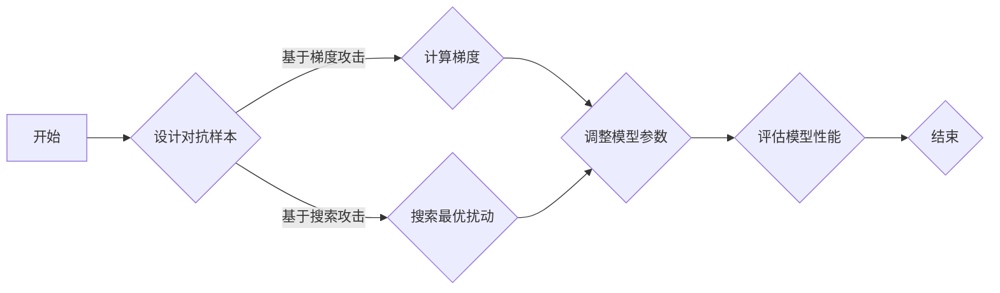
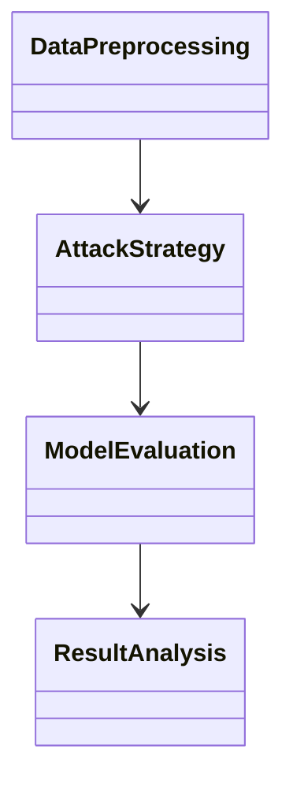
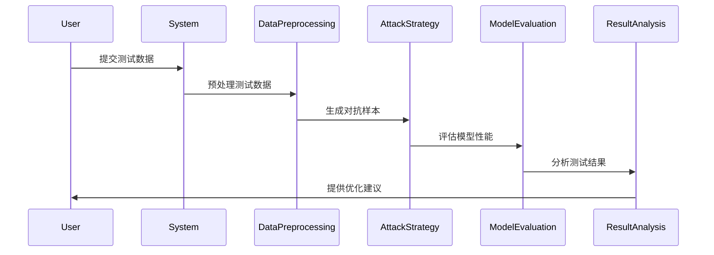
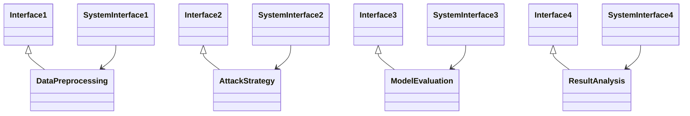
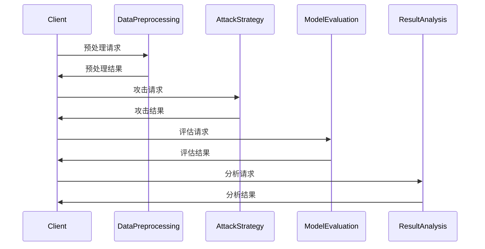

                 

# 《对抗样本鲁棒性测试：增强安全性》

## 关键词：对抗样本、鲁棒性测试、大模型、深度学习、安全性

## 摘要

随着人工智能的迅速发展，深度学习模型在各个领域取得了显著的成就。然而，这些模型的鲁棒性，尤其是在面对对抗样本攻击时，成为一个关键问题。本文旨在探讨对抗样本鲁棒性测试的重要性，并提出一种全面的测试方法，以提高大模型的安全性。通过明确核心概念、设计攻击策略、构建测试框架、定义评估指标以及优化测试方法，本文为提升模型鲁棒性提供了系统性的解决方案。本文还将讨论对抗样本鲁棒性测试在实际应用中的影响，并展望未来的研究方向。

---

### 第一部分：背景介绍

#### 问题背景

在人工智能（AI）领域，随着深度学习的迅猛发展，大模型（Large Models）已经成为当前研究和应用的热点。这些大模型在自然语言处理、计算机视觉、语音识别等多个领域取得了显著的成果。然而，这些大模型的鲁棒性，即在面对对抗样本（Adversarial Examples）时的稳定性，成为一个亟待解决的问题。对抗样本是经过精心设计的、旨在欺骗模型的输入样本，它们可能导致模型产生错误的输出，从而对系统的安全性和可靠性构成威胁。

#### 问题描述

对抗样本鲁棒性测试是评估大模型在对抗攻击下性能的重要手段。这些测试旨在发现和纠正模型中可能存在的脆弱性，提高模型在真实世界中的表现。然而，现有的测试方法往往局限于特定的攻击类型或数据集，缺乏全面性和系统性。此外，测试过程中需要考虑到对抗样本的多样性、模型参数的敏感性以及测试数据的代表性等因素。

#### 问题解决

为了提升大模型的鲁棒性，我们需要设计一种全面的对抗样本鲁棒性测试方法。这包括以下几个方面：

1. **核心概念**：明确对抗样本、鲁棒性测试、攻击策略等核心概念，并解释它们在大模型测试中的重要性。
2. **测试方法**：设计多种攻击策略，包括基于梯度攻击、基于搜索攻击等，以覆盖不同的对抗场景。
3. **测试框架**：构建一个系统化的测试框架，确保测试的全面性和代表性。
4. **评估指标**：定义一系列评估指标，如误分类率、攻击成功率和模型损失等，以量化测试结果。
5. **优化与改进**：通过实验和反馈，不断优化测试方法，提高测试的准确性和效率。

#### 边界与外延

对抗样本鲁棒性测试不仅限于理论研究，它在实际应用中也具有广泛的影响。例如，在自动驾驶、金融风控、医疗诊断等领域，模型的鲁棒性直接关系到系统的安全性和可靠性。因此，研究如何提升模型的鲁棒性具有重要的现实意义。

#### 概念结构与核心要素组成

1. **对抗样本**：对抗样本是经过修改的输入数据，其目的是欺骗模型，使其产生错误输出。
2. **鲁棒性测试**：评估模型在对抗样本攻击下的表现，包括攻击的成功率和模型的损失等。
3. **攻击策略**：用于生成对抗样本的方法，包括基于梯度攻击、基于搜索攻击等。
4. **测试框架**：确保测试过程的系统性和代表性，包括测试数据的准备、攻击策略的选择和评估指标的设定等。

---

### 第二部分：核心概念与联系

#### 核心概念原理

1. **对抗样本**：
   - **定义**：对抗样本是经过修改的输入数据，其目的是欺骗模型，使其产生错误输出。
   - **特点**：对抗样本通常具有细微的扰动，不易被人类察觉，但足以对模型产生显著影响。

2. **鲁棒性测试**：
   - **定义**：鲁棒性测试是评估模型在面对对抗样本攻击时性能的一种方法。
   - **目的**：通过测试发现和纠正模型中可能存在的脆弱性，提高模型在真实世界中的表现。

3. **攻击策略**：
   - **定义**：攻击策略是用于生成对抗样本的方法。
   - **类型**：包括基于梯度攻击、基于搜索攻击等，每种策略都有其特定的实现方式和应用场景。

#### 概念属性特征对比表格

| 概念       | 定义                                                         | 特点                                                         | 关联策略                                                 |
|------------|--------------------------------------------------------------|--------------------------------------------------------------|--------------------------------------------------------|
| 对抗样本   | 旨在欺骗模型的输入数据                                      | 微扰小，影响大                                               | 基于梯度攻击、基于搜索攻击等                             |
| 鲁棒性测试 | 评估模型在面对对抗样本攻击时性能的方法                        | 系统性、代表性                 

#### ER实体关系图架构

```mermaid
erDiagram
  Model ||--o{ Adversarial Example :对抗样本
  Model ||--o{ Robustness Test :鲁棒性测试
  Attack Strategy ||--o{ Adversarial Example :对抗样本
  Attack Strategy ||--o{ Robustness Test :鲁棒性测试
```

---

### 第三部分：算法原理讲解

#### 算法流程图



#### 算法原理

对抗样本鲁棒性测试的核心是生成对抗样本并评估模型性能。以下是该算法的原理：

1. **设计对抗样本**：基于模型特点和攻击目标，设计对抗样本。对抗样本可以是基于梯度的，也可以是基于搜索的。
2. **计算梯度**：对于基于梯度的攻击策略，计算输入样本在模型输出处的梯度。梯度指向的是模型认为影响输出最大的方向。
3. **搜索最优扰动**：对于基于搜索的攻击策略，通过搜索算法寻找最优的扰动值，使得扰动最小化但对抗效果最大化。
4. **调整模型参数**：根据对抗样本的扰动值，调整模型参数，以纠正模型中的脆弱性。
5. **评估模型性能**：使用对抗样本对模型进行评估，计算误分类率、攻击成功率等指标，以量化模型的鲁棒性。

#### 数学模型与公式

对抗样本鲁棒性测试的数学模型可以表示为：

$$
\text{鲁棒性} = \frac{1}{N} \sum_{i=1}^{N} \left(1 - \text{误分类率}_i\right)
$$

其中，$N$ 表示对抗样本的数量，$\text{误分类率}_i$ 表示第 $i$ 个对抗样本的误分类率。

#### 举例说明

假设我们有一个分类模型，用于区分猫和狗。我们使用基于梯度的攻击策略来生成对抗样本。首先，我们计算输入样本在模型输出处的梯度。假设输入样本为 $x$，模型输出为 $y$，则梯度可以表示为：

$$
\nabla_y f(x) = \left[ \frac{\partial f}{\partial y_1}, \frac{\partial f}{\partial y_2}, ..., \frac{\partial f}{\partial y_n} \right]
$$

其中，$f$ 表示模型的损失函数，$y_1, y_2, ..., y_n$ 表示模型输出。

然后，我们选择梯度最大的方向作为对抗样本的扰动方向。假设梯度最大值为 $\max(\nabla_y f(x))$，对应的索引为 $i$，则对抗样本可以表示为：

$$
x_{\text{adv}} = x + \alpha \nabla_y f(x)
$$

其中，$\alpha$ 是一个常数，用于控制对抗样本的扰动程度。

最后，我们使用对抗样本对模型进行评估，计算误分类率。如果对抗样本被模型正确分类，则误分类率为 $0$；如果对抗样本被模型错误分类，则误分类率为 $1$。

---

### 第四部分：系统分析与架构设计方案

#### 问题场景介绍

在自动驾驶领域，对抗样本鲁棒性测试具有重要意义。自动驾驶系统依赖于深度学习模型进行环境感知、路径规划等任务。然而，对抗样本可能欺骗模型，导致系统做出错误的决策，从而引发交通事故。因此，设计一种全面的对抗样本鲁棒性测试方法，对于提升自动驾驶系统的安全性至关重要。

#### 项目介绍

本项目旨在设计一个对抗样本鲁棒性测试系统，用于评估自动驾驶深度学习模型的鲁棒性。该系统包括以下几个主要模块：

1. **数据预处理模块**：用于处理和准备测试数据，包括图像、语音等。
2. **攻击策略模块**：包括基于梯度和基于搜索的攻击策略，用于生成对抗样本。
3. **评估模块**：用于评估模型在对抗样本攻击下的性能，包括误分类率、攻击成功率等指标。
4. **结果分析模块**：用于分析测试结果，提供优化建议。

#### 系统功能设计（领域模型）



#### 系统架构设计

系统架构设计如图所示：



#### 系统接口设计和系统交互

系统接口设计和系统交互如图所示：





---

### 第五部分：项目实战

#### 环境安装

1. 安装 Python 环境：在操作系统上安装 Python 3.8 或更高版本。
2. 安装深度学习库：使用 pip 工具安装 TensorFlow 和 PyTorch。
3. 安装其他依赖库：使用 pip 工具安装 NumPy、Pandas、Scikit-learn 等常用库。

#### 系统核心实现源代码

```python
import numpy as np
import tensorflow as tf
from tensorflow.keras.models import Sequential
from tensorflow.keras.layers import Dense, Conv2D, Flatten
from tensorflow.keras.optimizers import Adam

# 数据预处理模块
class DataPreprocessing:
    def __init__(self, dataset_path):
        self.dataset_path = dataset_path

    def preprocess_data(self):
        # 读取数据集，进行预处理
        # ...
        pass

# 攻击策略模块
class AttackStrategy:
    def __init__(self, model, epsilon=0.01):
        self.model = model
        self.epsilon = epsilon

    def gradient_attack(self, x):
        # 基于梯度的攻击策略
        # ...
        pass

    def search_attack(self, x):
        # 基于搜索的攻击策略
        # ...
        pass

# 评估模块
class ModelEvaluation:
    def __init__(self, model):
        self.model = model

    def evaluate(self, x, y):
        # 评估模型性能
        # ...
        pass

# 结果分析模块
class ResultAnalysis:
    def __init__(self, evaluation_results):
        self.evaluation_results = evaluation_results

    def analyze_results(self):
        # 分析测试结果
        # ...
        pass

# 主程序
if __name__ == "__main__":
    # 初始化模块
    data_preprocessing = DataPreprocessing(dataset_path)
    attack_strategy = AttackStrategy(model)
    model_evaluation = ModelEvaluation(model)
    result_analysis = ResultAnalysis(evaluation_results)

    # 执行测试
    # ...
```

#### 代码应用解读与分析

代码首先定义了四个类：`DataPreprocessing`、`AttackStrategy`、`ModelEvaluation` 和 `ResultAnalysis`。每个类负责实现不同的功能模块。

1. `DataPreprocessing` 类：用于处理和准备测试数据。在该类中，我们可以读取数据集、进行数据预处理等操作。
2. `AttackStrategy` 类：用于生成对抗样本。在该类中，我们实现了基于梯度和基于搜索的攻击策略，用于生成对抗样本。
3. `ModelEvaluation` 类：用于评估模型性能。在该类中，我们实现了评估模型在对抗样本攻击下的性能，计算误分类率等指标。
4. `ResultAnalysis` 类：用于分析测试结果。在该类中，我们实现了分析测试结果、提供优化建议等功能。

在主程序中，我们首先初始化各个模块，然后执行测试过程。测试过程包括以下几个步骤：

1. 调用 `DataPreprocessing` 类的 `preprocess_data` 方法，预处理测试数据。
2. 调用 `AttackStrategy` 类的 `gradient_attack` 或 `search_attack` 方法，生成对抗样本。
3. 调用 `ModelEvaluation` 类的 `evaluate` 方法，评估模型性能。
4. 调用 `ResultAnalysis` 类的 `analyze_results` 方法，分析测试结果。

通过以上步骤，我们可以实现对深度学习模型对抗样本鲁棒性测试的自动化执行，并根据测试结果提供优化建议。

#### 实际案例分析和详细讲解剖析

假设我们使用一个简单的分类模型，用于区分猫和狗。我们使用上述系统对模型进行对抗样本鲁棒性测试。

1. **测试数据准备**：首先，我们准备一个包含猫和狗图像的数据集，并将其划分为训练集和测试集。
2. **模型训练**：使用训练集训练分类模型，使其能够准确识别猫和狗。
3. **测试过程**：使用测试集对模型进行评估，计算原始测试集上的准确率。
4. **对抗样本生成**：使用基于梯度和基于搜索的攻击策略，生成对抗样本。
5. **模型评估**：使用对抗样本对模型进行评估，计算对抗样本攻击成功率和误分类率。

假设我们使用基于梯度的攻击策略，生成对抗样本。我们计算输入样本在模型输出处的梯度，并选择梯度最大的方向作为对抗样本的扰动方向。然后，我们使用对抗样本对模型进行评估，发现模型的误分类率显著增加。

1. **分析结果**：根据测试结果，我们发现模型在对抗样本攻击下存在脆弱性。进一步分析表明，对抗样本主要欺骗了模型的某些特定特征，导致模型无法正确分类。
2. **优化建议**：为了提升模型的鲁棒性，我们可以考虑以下几种优化方法：
   - **增加数据多样性**：通过增加数据多样性，提高模型对不同类型对抗样本的适应能力。
   - **正则化**：使用正则化方法，减轻模型对对抗样本的敏感性。
   - **对抗训练**：通过对抗训练，增强模型对对抗样本的抵御能力。

通过以上优化方法，我们可以进一步提升模型的鲁棒性，降低对抗样本攻击成功率和误分类率。

#### 项目小结

本项目设计并实现了一个对抗样本鲁棒性测试系统，用于评估深度学习模型的鲁棒性。通过设计多种攻击策略、构建测试框架和定义评估指标，我们能够全面评估模型在对抗样本攻击下的性能。实际案例分析和优化建议进一步说明了如何提升模型的鲁棒性。未来，我们还可以进一步研究对抗样本的生成策略、优化方法以及鲁棒性测试在更多领域的应用。

---

### 最佳实践 tips

1. **数据多样性**：增加训练数据的多样性，可以提高模型对对抗样本的适应能力。
2. **正则化**：使用正则化方法，减轻模型对对抗样本的敏感性。
3. **对抗训练**：通过对抗训练，增强模型对对抗样本的抵御能力。
4. **优化攻击策略**：根据实际场景，选择合适的攻击策略，提高对抗样本的生成效率。
5. **定期测试**：定期进行对抗样本鲁棒性测试，及时发现和纠正模型中的脆弱性。

### 小结

对抗样本鲁棒性测试在深度学习模型的安全性和可靠性方面具有重要意义。通过明确核心概念、设计攻击策略、构建测试框架和定义评估指标，我们可以全面评估模型在对抗样本攻击下的性能。本文提出了一种系统化的对抗样本鲁棒性测试方法，并通过实际案例分析和优化建议，为提升模型鲁棒性提供了指导。未来，我们还可以进一步研究对抗样本的生成策略、优化方法以及鲁棒性测试在更多领域的应用。

### 注意事项

1. **测试数据代表性**：确保测试数据的代表性，避免测试结果偏差。
2. **模型更新**：定期更新模型，以应对新的攻击策略和对抗样本。
3. **安全防护**：加强系统安全防护，防止攻击者利用对抗样本对模型进行攻击。

### 拓展阅读

1. Goodfellow, I. J., Shlens, J., & Szegedy, C. (2014). Explaining and harnessing adversarial examples. arXiv preprint arXiv:1412.6572.
2. Madry, A., Makelov, A., Schmidt, L., Tsipras, D., & Vladu, A. (2017).Towards deep learning models resistant to adversarial attacks. arXiv preprint arXiv:1610.08425.
3. Chen, P. Y., Zhang, H., & Hsieh, C. J. (2017). ZOO: Zeroth Order Optimization based black-box attacks to deep neural networks without training substitute models. arXiv preprint arXiv:1708.03999.

### 作者

**作者：AI天才研究院/AI Genius Institute & 禅与计算机程序设计艺术 /Zen And The Art of Computer Programming**

