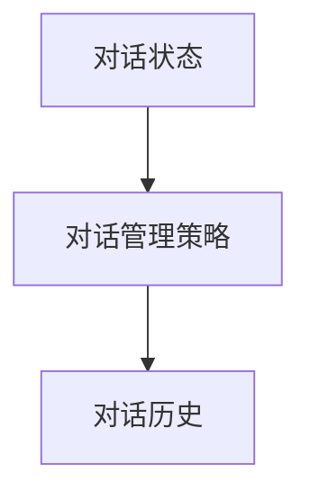
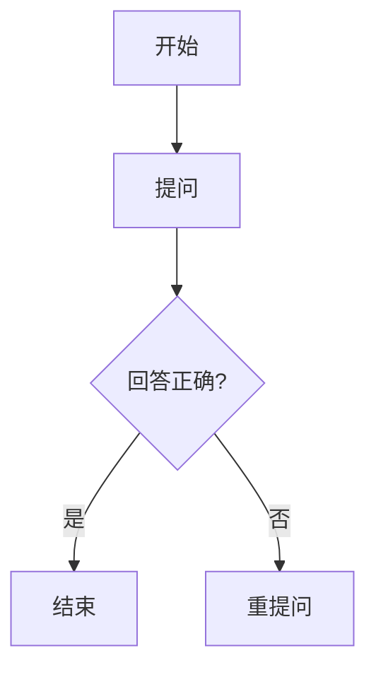
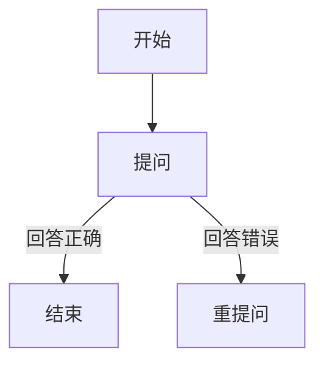

                 

# 《对话流控制：管理多轮对话的提示策略》

## 关键词

对话流控制、多轮对话、人工智能、对话系统、用户体验

## 摘要

本文探讨了对话流控制的关键概念和策略，针对多轮对话的挑战，提供了一系列有效的提示策略。通过深入分析对话流控制的基础理论和实现方法，本文旨在为开发人员提供实用的指导，以构建更智能、更连贯的对话系统，从而提升用户体验。

## 目录

### 第一部分：引言

#### 第1章：对话流控制的背景和重要性

1.1 问题背景

1.2 问题描述

1.3 问题解决

1.4 概念结构与核心要素组成

1.5 本章小结

### 第二部分：对话流控制的核心概念

#### 第2章：对话流控制的基础理论

2.1 对话流控制的概念

2.2 对话流程分析

2.3 对话管理策略

2.4 本章小结

#### 第3章：多轮对话的表示方法

3.1 多轮对话的挑战

3.2 对话状态表示

3.3 对话历史表示

3.4 本章小结

#### 第4章：对话流控制算法

4.1 算法概述

4.2 常见对话流控制算法

4.3 算法优化与调参

4.4 本章小结

#### 第5章：对话流控制的实现与评估

5.1 对话流控制系统的实现

5.2 对话流控制的评估方法

5.3 实际应用案例分析

5.4 本章小结

### 第三部分：最佳实践与拓展

#### 第6章：最佳实践

6.1 提示策略设计

6.2 用户体验优化

6.3 安全与隐私保护

6.4 本章小结

#### 第7章：小结与展望

7.1 小结

7.2 注意事项

7.3 拓展阅读

## 第1章：对话流控制的背景和重要性

### 1.1 问题背景

随着人工智能技术的飞速发展，智能对话系统逐渐成为人们生活中不可或缺的一部分。从简单的问答机器人到复杂的虚拟助手，对话系统在各个领域展现出巨大的潜力。然而，随着对话复杂度的增加，如何有效管理和控制对话流成为一个亟待解决的问题。

对话流控制（Dialogue Flow Control，DFC）是智能对话系统的核心组件之一，其主要任务是确保对话在多轮交流中保持连贯、自然和有意义。对于多轮对话系统而言，对话流控制不仅需要处理用户输入的理解和回复生成，还需要对对话的流程进行有效的管理，以避免对话偏离主题或陷入僵局。

### 1.2 问题描述

多轮对话的挑战主要表现在以下几个方面：

1. **对话状态复杂性**：随着对话的深入，对话系统需要处理越来越多的信息，这可能导致对话状态变得复杂，难以维护。
2. **对话连贯性要求**：用户期望对话系统能够提供连贯的交流体验，任何中断或突兀的转换都会影响用户体验。
3. **对话一致性需求**：对话系统需要在不同情境下保持一致的行为和回答，这要求对话流控制策略具备良好的适应性。

### 1.3 问题解决

为了解决上述问题，对话流控制提供了一系列策略和方法。这些方法包括：

1. **基于规则的对话流控制**：通过预定义的规则来指导对话的流程，确保对话在正确的轨道上运行。
2. **基于机器学习的对话流控制**：利用机器学习算法来学习用户的对话模式和偏好，从而实现更智能的对话流管理。
3. **基于深度学习的对话流控制**：利用深度学习模型来处理复杂的对话状态和上下文信息，实现更自然的对话体验。

### 1.4 概念结构与核心要素组成

对话流控制的核心概念主要包括：

1. **对话状态**：对话中当前的状态信息，包括用户的历史输入、系统的当前状态等。
2. **对话管理策略**：用于控制对话流程的一系列规则或算法，确保对话的连贯性和一致性。
3. **对话历史**：对话过程中积累的所有历史信息，用于理解用户意图和偏好。

核心要素组成如图1-1所示：

### 1.5 本章小结

本章介绍了对话流控制的背景和重要性，分析了多轮对话的挑战，并提出了一系列问题解决方法。通过了解对话流控制的核心概念和结构，读者可以为后续章节的学习打下坚实的基础。

---

## 第2章：对话流控制的基础理论

### 2.1 对话流控制的概念

对话流控制（Dialogue Flow Control，DFC）是指在智能对话系统中，通过一系列策略和算法来管理和控制对话的流程，以确保对话的连贯性、一致性和有效性。对话流控制的核心目标是确保对话系统在不同情境下能够提供高质量的用户体验。

对话流控制的主要任务包括：

1. **状态管理**：跟踪对话的当前状态，包括用户的历史输入、当前问题、对话阶段等。
2. **路径规划**：根据对话状态和历史信息，规划对话的后续路径，确保对话的连贯性。
3. **策略执行**：执行预定义的对话管理策略，以指导对话的流程。

### 2.2 对话流程分析

对话流程是用户与对话系统之间进行交互的过程，通常包括以下几个阶段：

1. **初始阶段**：用户发起对话，系统接收并理解用户的初始请求。
2. **交互阶段**：用户和系统之间进行多轮交互，系统根据用户输入生成响应。
3. **结束阶段**：对话结束，系统可能需要总结对话结果或提供额外的信息。

对话流程的表示方法可以采用状态机（State Machine）或状态图（State Diagram）进行描述。状态机用于表示对话的各个状态和状态之间的转换，而状态图则提供了更直观的图形表示。

### 2.3 对话管理策略

对话管理策略是对话流控制的核心，用于指导对话的流程。常见的对话管理策略包括：

1. **基于规则的策略**：通过预定义的规则来控制对话的流程，规则可以根据对话状态和上下文信息进行动态调整。
2. **基于机器学习的策略**：利用机器学习算法来学习用户的对话模式和偏好，从而实现更智能的对话流管理。
3. **混合策略**：结合基于规则和基于机器学习的策略，以平衡规则的灵活性和机器学习的准确性。

### 2.4 本章小结

本章介绍了对话流控制的基础理论，包括对话流控制的概念、对话流程分析和对话管理策略。通过理解这些基础理论，读者可以为后续章节的学习打下坚实的基础。下一章将深入探讨多轮对话的表示方法，进一步丰富对话流控制的理论体系。

---

## 第3章：多轮对话的表示方法

### 3.1 多轮对话的挑战

多轮对话是指在对话过程中，用户和系统之间进行多次交互的过程。与单轮对话相比，多轮对话具有更高的复杂性和挑战性。以下是多轮对话面临的主要挑战：

1. **对话状态复杂性**：随着对话的深入，对话系统需要处理更多的信息，导致对话状态变得复杂，增加了维护的难度。
2. **对话连贯性要求**：用户期望对话系统能够提供连贯的交流体验，任何中断或突兀的转换都会影响用户体验。
3. **对话一致性需求**：对话系统需要在不同情境下保持一致的行为和回答，这要求对话流控制策略具备良好的适应性。

### 3.2 对话状态表示

对话状态的表示是对话流控制的基础。一个有效的对话状态表示需要能够准确地捕捉对话的当前状态，包括用户的历史输入、当前问题、对话阶段等。

#### 对话状态图表示

对话状态图（Dialogue State Diagram，DSD）是一种常用的对话状态表示方法。它通过图形化的方式来表示对话的各个状态和状态之间的转换。图3-1展示了一个简单的对话状态图示例。

在这个例子中，对话从开始状态（A）进入提问状态（B），根据用户回答的正确性，对话可能结束（D）或重新提问（E）。

#### 对话状态机表示

对话状态机（Dialogue State Machine，DSM）是另一种常用的对话状态表示方法。它通过状态转换图来表示对话的状态和转换规则。状态机具有明确的初始状态和终止状态，状态之间的转换受到特定条件或事件的触发。

图3-2展示了一个简单的对话状态机示例。

在这个例子中，对话从开始状态（A）进入提问状态（B），根据用户回答的正确性，对话可能结束（C）或重新提问（D）。

#### 对话状态向量表示

除了图形化的表示方法，对话状态还可以使用向量表示。对话状态向量是将对话的各个状态信息编码成一个向量，通过向量之间的比较和运算来表示状态转换。

例如，假设一个对话系统有五个状态：开始（0）、提问（1）、回答（2）、结束（3）和重提问（4）。我们可以使用五维向量来表示每个状态：

- 开始：[1, 0, 0, 0, 0]
- 提问：[0, 1, 0, 0, 0]
- 回答：[0, 0, 1, 0, 0]
- 结束：[0, 0, 0, 1, 0]
- 重提问：[0, 0, 0, 0, 1]

通过比较和运算，我们可以根据当前状态和用户输入来更新对话状态向量，从而实现对话状态的动态管理。

### 3.3 对话历史表示

对话历史是对话过程中积累的所有历史信息，包括用户的输入、系统的回答、对话的状态等。有效的对话历史表示可以帮助对话系统更好地理解用户意图和偏好，从而提供更个性化的服务。

#### 对话历史记录

对话历史记录是一种简单的对话历史表示方法，它将对话过程中的每个交互记录下来，形成一个日志。这种记录可以用于后续的分析和回顾，以便优化对话系统的性能。

#### 对话历史向量表示

对话历史向量表示是将对话历史信息编码成一个向量。向量中的每个元素可以表示某个特定时间点的对话状态或用户输入。通过分析对话历史向量，对话系统可以识别用户的对话模式和偏好。

例如，假设对话系统使用二进制向量来表示对话历史，每个元素表示用户在某个时间点的输入。如果我们有一个五个时间点的对话历史，我们可以使用五维向量来表示：

- 时间点1：[0, 1, 0, 1, 0]
- 时间点2：[0, 0, 1, 1, 1]
- 时间点3：[1, 0, 0, 0, 1]
- 时间点4：[1, 1, 1, 0, 0]
- 时间点5：[0, 1, 1, 0, 1]

通过分析这个对话历史向量，对话系统可以识别出用户的某些对话模式，从而提供更个性化的服务。

#### 对话历史语义分析

对话历史语义分析是对话系统的高级功能，它通过对对话历史向量的语义分析来理解用户的意图和偏好。这种方法通常需要使用自然语言处理（NLP）技术来解析对话历史中的语义信息。

例如，对话系统可以使用词向量模型（如Word2Vec或BERT）来将对话历史向量转换为语义向量。然后，通过比较这些语义向量，对话系统可以识别出用户的对话模式和偏好。

### 3.4 本章小结

本章探讨了多轮对话的表示方法，包括对话状态表示、对话历史表示和对话历史语义分析。通过理解这些表示方法，对话系统可以更好地管理对话流程，提供更连贯、自然的用户体验。下一章将介绍对话流控制算法，进一步探讨如何实现有效的对话流控制。

---

## 第4章：对话流控制算法

### 4.1 算法概述

对话流控制算法是智能对话系统的核心组件，负责管理和控制对话的流程。有效的对话流控制算法能够确保对话系统的连贯性、一致性和有效性。本节将介绍对话流控制算法的基本概念、分类以及设计原则。

#### 对话流控制算法的基本概念

对话流控制算法是指用于指导对话流程的一系列规则或策略。这些算法通常基于对话的状态和上下文信息，通过预定义的规则或学习算法来决定对话的下一步行动。

对话流控制算法的主要任务包括：

1. **状态管理**：跟踪对话的当前状态，包括用户的历史输入、当前问题、对话阶段等。
2. **路径规划**：根据对话状态和历史信息，规划对话的后续路径，确保对话的连贯性。
3. **策略执行**：执行预定义的对话管理策略，以指导对话的流程。

#### 对话流控制算法的分类

根据不同的设计目标和实现方法，对话流控制算法可以分为以下几类：

1. **基于规则的算法**：这类算法通过预定义的规则来控制对话的流程。规则通常是基于对话系统的业务逻辑和用户需求来制定的，具有明确的条件和操作。
2. **基于机器学习的算法**：这类算法利用机器学习技术来学习用户的对话模式和偏好，从而实现更智能的对话流管理。常见的机器学习算法包括决策树、随机森林、支持向量机等。
3. **基于深度学习的算法**：这类算法利用深度学习模型来处理复杂的对话状态和上下文信息，实现更自然的对话体验。常见的深度学习模型包括卷积神经网络（CNN）、循环神经网络（RNN）、长短期记忆网络（LSTM）等。

#### 对话流控制算法的设计原则

设计对话流控制算法时，需要遵循以下原则：

1. **灵活性**：对话流控制算法应具备良好的灵活性，能够适应不同的对话场景和用户需求。
2. **可扩展性**：算法应具有可扩展性，以便在未来的对话系统中引入新的功能或改变现有的对话流程。
3. **鲁棒性**：算法应具备良好的鲁棒性，能够处理对话中的噪声和不确定性，确保对话的连贯性和一致性。
4. **高效性**：算法应具有高效性，能够快速处理对话状态和上下文信息，确保对话的实时性。

### 4.2 常见对话流控制算法

本节将介绍几种常见的对话流控制算法，包括基于规则的算法、基于机器学习的算法和基于深度学习的算法。

#### 基于规则的算法

基于规则的算法是最简单和最直观的对话流控制方法。它通过预定义的规则来指导对话的流程。规则通常是一个条件-操作对，即当满足某个条件时，执行相应的操作。

例如，在一个客户服务对话系统中，可以定义以下规则：

1. 如果用户提问“我能否退货？”且当前对话状态是“询问退货政策”，则回答“您可以退货，以下是退货政策...”。
2. 如果用户提问“您好”，则回答“您好，我是智能客服，有什么可以帮助您的？”。

基于规则的算法的优点是实现简单、易于理解和维护。然而，它也存在一些缺点，如规则库的维护成本高、灵活性差等。

#### 基于机器学习的算法

基于机器学习的算法通过学习用户的对话模式和偏好，来实现更智能的对话流控制。这类算法通常使用监督学习或无监督学习的方法来训练模型。

常见的基于机器学习的算法包括：

1. **决策树**：决策树是一种树形结构，通过一系列条件判断来划分数据集。在对话流控制中，决策树可以用来根据用户输入和历史信息进行分类，从而决定下一步的操作。

2. **随机森林**：随机森林是一种基于决策树的集成学习方法，通过构建多个决策树并求取它们的平均值来提高预测的准确性。在对话流控制中，随机森林可以用来预测用户的下一步操作。

3. **支持向量机**：支持向量机（SVM）是一种基于最大间隔的分类方法。在对话流控制中，SVM可以用来分类用户输入，从而决定对话的后续路径。

基于机器学习的算法的优点是能够自动学习用户的对话模式，提高对话的连贯性和个性化程度。然而，它也存在一些缺点，如训练成本高、对噪声敏感等。

#### 基于深度学习的算法

基于深度学习的算法利用深度神经网络来处理复杂的对话状态和上下文信息。常见的基于深度学习的算法包括：

1. **卷积神经网络（CNN）**：卷积神经网络是一种用于图像识别的深度学习模型，它通过卷积和池化操作来提取图像的特征。在对话流控制中，CNN可以用来提取对话的历史特征，从而辅助决策。

2. **循环神经网络（RNN）**：循环神经网络是一种用于序列数据的深度学习模型，它通过循环连接来记忆前一个时间步的信息。在对话流控制中，RNN可以用来处理对话的历史信息，从而预测用户的下一步操作。

3. **长短期记忆网络（LSTM）**：长短期记忆网络是一种改进的循环神经网络，它通过门控机制来记忆和遗忘长期的信息。在对话流控制中，LSTM可以用来处理对话的长期依赖关系，从而提高对话的连贯性。

4. **变换器（Transformer）**：变换器是一种基于自注意力机制的深度学习模型，它在序列建模任务中表现出色。在对话流控制中，变换器可以用来处理对话的序列信息，从而实现高效的对话流控制。

基于深度学习的算法的优点是能够自动学习复杂的对话模式，提高对话的自然性和连贯性。然而，它也存在一些缺点，如计算资源消耗大、对数据需求高等。

### 4.3 算法优化与调参

对话流控制算法的优化和调参是提高算法性能的重要手段。在本节中，我们将介绍一些常见的优化方法和调参技巧。

#### 优化方法

1. **模型选择**：选择合适的模型是优化算法性能的第一步。根据不同的对话场景和数据特点，可以选择不同的模型。例如，在处理文本数据时，可以选用变换器或LSTM等模型；在处理图像数据时，可以选用CNN等模型。

2. **数据预处理**：数据预处理是优化算法性能的重要步骤。通过数据清洗、数据增强等方法，可以提高数据的质量和多样性，从而提高模型的泛化能力。

3. **模型融合**：模型融合是将多个模型的结果进行融合，以提高模型的预测准确性。常见的模型融合方法包括投票法、加权平均法等。

4. **超参数调整**：超参数是模型的调节参数，对模型性能有重要影响。通过调整超参数，可以优化模型的性能。常见的超参数包括学习率、隐藏层大小、迭代次数等。

#### 调参技巧

1. **网格搜索**：网格搜索是一种常用的超参数优化方法，通过遍历预定义的参数组合来找到最佳参数。网格搜索的优点是简单直观，缺点是计算成本高。

2. **贝叶斯优化**：贝叶斯优化是一种基于概率模型的超参数优化方法，通过模拟退火算法来搜索最佳参数。贝叶斯优化的优点是收敛速度快，缺点是计算成本高。

3. **随机搜索**：随机搜索是一种基于随机性的超参数优化方法，通过随机选择参数组合来搜索最佳参数。随机搜索的优点是实现简单，缺点是收敛速度慢。

### 4.4 本章小结

本章介绍了对话流控制算法的基本概念、分类以及优化方法。通过理解这些内容，读者可以为设计和实现对话流控制算法提供指导。下一章将探讨对话流控制的实现与评估，进一步深化对话流控制的理论和实践。

---

## 第5章：对话流控制的实现与评估

### 5.1 对话流控制系统的实现

实现对话流控制系统是构建智能对话系统的关键步骤。以下是对话流控制系统实现的主要模块和关键细节。

#### 系统架构设计

对话流控制系统的架构设计包括前端界面、后端服务以及数据库等组件。前端界面负责与用户交互，接收用户输入并展示对话结果。后端服务则负责处理对话的逻辑，包括对话流控制算法的执行、对话状态的更新等。数据库用于存储对话历史和用户信息。

#### 系统模块划分

对话流控制系统的模块划分如下：

1. **用户输入模块**：负责接收用户的输入，并进行预处理，如去除噪声、分词、词性标注等。
2. **对话状态管理模块**：负责维护对话的当前状态，包括用户的历史输入、当前问题、对话阶段等。
3. **对话流控制模块**：负责执行对话流控制算法，根据对话状态和历史信息决定下一步的操作。
4. **对话回复生成模块**：负责生成对话回复，包括文本生成、语音合成等。
5. **数据库模块**：负责存储对话历史和用户信息，提供数据查询和更新功能。

#### 实现细节与技巧

1. **用户输入处理**：用户输入处理是对话流控制的基础。对于文本输入，可以使用自然语言处理（NLP）技术进行预处理，如分词、词性标注、命名实体识别等。对于语音输入，可以使用语音识别（ASR）技术将语音转换为文本。
2. **对话状态管理**：对话状态管理是确保对话连贯性的关键。可以使用状态机或状态图来表示对话状态，并通过更新状态来实现对话的推进。在更新状态时，需要考虑对话的上下文信息，如用户的历史输入、当前问题等。
3. **对话流控制算法**：对话流控制算法的实现是系统的核心。根据不同的对话场景和需求，可以选择不同的算法，如基于规则的算法、基于机器学习的算法、基于深度学习的算法等。在实现过程中，需要考虑算法的实时性和鲁棒性。
4. **对话回复生成**：对话回复生成是系统的输出部分。可以使用文本生成技术，如序列到序列（Seq2Seq）模型、变换器（Transformer）等，来生成自然、连贯的对话回复。对于需要语音输出的场景，可以使用语音合成技术，如WaveNet等。

### 5.2 对话流控制的评估方法

评估对话流控制系统的性能是确保系统质量和用户体验的重要环节。以下介绍对话流控制的评估方法和指标。

#### 评估指标

1. **响应时间**：响应时间是指系统从接收到用户输入到生成回复的时间。较低的响应时间可以提高用户体验。
2. **准确率**：准确率是指系统生成的回复与用户意图的匹配度。较高的准确率可以确保对话的连贯性和准确性。
3. **用户体验**：用户体验是评估对话流控制系统的重要指标，包括对话的流畅性、自然性、准确性等。
4. **资源消耗**：资源消耗是指系统运行过程中所需的计算资源和存储资源。较低的资源消耗可以提高系统的性能和可扩展性。

#### 评估流程

1. **数据集准备**：准备用于评估的数据集，包括用户输入和系统回复。数据集应具有代表性，涵盖不同的对话场景和用户需求。
2. **评估指标计算**：根据评估指标，计算系统的表现。例如，计算系统的响应时间、准确率等。
3. **用户反馈**：收集用户的反馈，了解他们对对话流控制系统的满意度。用户反馈可以通过在线调查、用户访谈等方式进行。
4. **结果分析**：分析评估结果，识别系统的优点和不足，为后续的优化提供指导。

#### 评估工具与资源

1. **评估工具**：可以使用各种评估工具来计算评估指标，如性能测试工具（如JMeter）、代码质量分析工具（如SonarQube）等。
2. **资源**：评估过程中可能需要使用到计算资源（如服务器、GPU等）和存储资源（如数据库、文件系统等）。

### 5.3 实际应用案例分析

本节通过实际应用案例来展示对话流控制系统的应用场景和效果。

#### 案例一：智能客服机器人

智能客服机器人是对话流控制系统的一个典型应用场景。它可以帮助企业快速响应用户的咨询和需求，提高客户服务质量。在智能客服机器人中，对话流控制算法负责管理对话流程，确保对话的连贯性和准确性。通过使用自然语言处理和机器学习技术，智能客服机器人可以理解用户的意图，生成合适的回复，从而提供高质量的客服体验。

#### 案例二：虚拟助手

虚拟助手是另一种常见的对话流控制系统应用场景。虚拟助手可以嵌入到各种应用程序中，为用户提供便捷的服务和支持。例如，在智能家居应用中，虚拟助手可以回答用户关于家居设备的问题，提供设备控制指令等。通过对话流控制算法的管理，虚拟助手可以确保与用户的交流流畅、自然，同时提供准确、有效的服务。

#### 案例三：虚拟购物助手

虚拟购物助手是电子商务领域的一个创新应用。它可以帮助用户在在线购物平台上找到合适的商品，提供购物建议和服务。虚拟购物助手通过对话流控制算法来管理对话流程，确保与用户的互动自然、连贯。同时，虚拟购物助手还可以利用用户的历史购物数据和偏好，提供个性化的购物建议和服务。

### 5.4 本章小结

本章介绍了对话流控制系统的实现和评估方法，包括系统架构设计、模块划分、实现细节与技巧，以及评估指标、评估流程和评估工具。通过实际应用案例分析，展示了对话流控制系统的应用场景和效果。理解本章内容，可以为开发人员提供实用的指导，帮助他们构建高效的对话流控制系统。

---

## 第6章：最佳实践

### 6.1 提示策略设计

设计有效的提示策略是确保对话流控制系统能够为用户提供高质量对话体验的关键。以下是一些最佳实践：

1. **引导式提问**：在对话初期，通过引导式提问来引导用户进入对话主题。例如，可以提问：“您好，请问您想了解哪方面的信息？”
2. **开放性问题**：使用开放性问题来鼓励用户提供更多详细信息。例如：“您能详细描述一下您的问题吗？”
3. **确认性提问**：在对话过程中，通过确认性提问来确保系统正确理解用户的意图。例如：“您是否想要了解关于旅游的信息？”
4. **上下文感知**：根据对话的上下文信息，动态调整提示策略。例如，如果用户之前提到过某个话题，可以提问：“您是否对刚才提到的旅游目的地感兴趣？”

### 6.2 用户体验优化

优化用户体验是确保对话流控制系统成功应用的关键。以下是一些最佳实践：

1. **简洁性**：确保对话回复简洁明了，避免冗长的文本。例如，可以使用缩写、简短的句子来提高沟通效率。
2. **个性化**：根据用户的偏好和历史记录，提供个性化的对话体验。例如，如果用户之前提到喜欢某种类型的音乐，可以推荐相关歌曲。
3. **实时性**：确保对话系统能够快速响应用户输入，提供实时反馈。例如，使用异步通信技术来减少延迟。
4. **一致性**：确保对话系统在不同情境下保持一致的行为和回答。例如，对于同一个问题，系统应始终提供相同的回复。

### 6.3 安全与隐私保护

确保对话流控制系统的安全与隐私保护是用户信任和接受的关键。以下是一些最佳实践：

1. **数据加密**：对用户数据进行加密，确保数据在传输和存储过程中的安全性。
2. **访问控制**：实施严格的访问控制策略，确保只有授权用户可以访问敏感数据。
3. **隐私政策**：明确告知用户关于数据收集、使用和存储的隐私政策，确保用户知情并同意。
4. **数据匿名化**：在分析用户数据时，对个人信息进行匿名化处理，以保护用户隐私。

### 6.4 本章小结

本章介绍了对话流控制系统的最佳实践，包括提示策略设计、用户体验优化和安全与隐私保护。通过遵循这些最佳实践，开发人员可以构建出更智能、更可靠、更安全的对话流控制系统，从而提升用户体验。

---

## 第7章：小结与展望

### 7.1 小结

本文通过对对话流控制的深入探讨，系统地介绍了对话流控制的基础理论、多轮对话的表示方法、对话流控制算法以及实现与评估方法。以下是本文的主要内容小结：

1. **对话流控制的背景和重要性**：分析了多轮对话的挑战，介绍了对话流控制的基本概念和问题解决方法。
2. **对话流控制的核心概念**：详细阐述了对话状态、对话管理策略和对话历史表示方法。
3. **多轮对话的表示方法**：探讨了对话状态图、对话状态机和对话历史向量表示方法。
4. **对话流控制算法**：介绍了基于规则、基于机器学习和基于深度学习的对话流控制算法，并讨论了算法优化与调参技巧。
5. **对话流控制的实现与评估**：描述了对话流控制系统的实现细节和评估方法。
6. **最佳实践**：提出了提示策略设计、用户体验优化和安全与隐私保护的最佳实践。

### 7.2 注意事项

在实施对话流控制时，需要注意以下几点：

1. **灵活性**：对话流控制策略应具备良好的灵活性，以适应不同的对话场景和用户需求。
2. **连贯性**：确保对话流程的连贯性，避免对话中断或突兀的转换。
3. **适应性**：对话流控制策略应具备良好的适应性，能够根据用户的反馈和对话历史进行动态调整。
4. **安全性**：确保对话流控制系统在处理用户数据时，遵循严格的安全和隐私保护措施。

### 7.3 拓展阅读

为了进一步深入了解对话流控制，读者可以参考以下拓展阅读材料：

1. **《对话系统设计》**：作者：Alison Gopnik等，本书详细介绍了对话系统的设计原理和实践方法。
2. **《深度学习与对话系统》**：作者：Kai Yu等，本书探讨了如何利用深度学习技术构建高效的对话系统。
3. **《人工智能对话系统》**：作者：陈宝权等，本书涵盖了人工智能对话系统的最新研究成果和应用实践。

通过阅读这些书籍，读者可以更全面地了解对话流控制的理论和实践，为自己的研究和工作提供有价值的参考。

---

## 作者信息

作者：AI天才研究院/AI Genius Institute & 禅与计算机程序设计艺术 /Zen And The Art of Computer Programming

感谢读者对本文的关注，希望本文能够为您的对话流控制研究提供有益的启示和帮助。如果您有任何疑问或建议，欢迎随时联系我们。

---

通过以上内容，我们不仅深入探讨了对话流控制的理论和实践，还提供了详细的算法实现和评估方法，以及最佳实践。希望本文能够为您的对话流控制项目提供实用的指导和灵感。祝您在对话流控制的探索中取得丰硕的成果！

