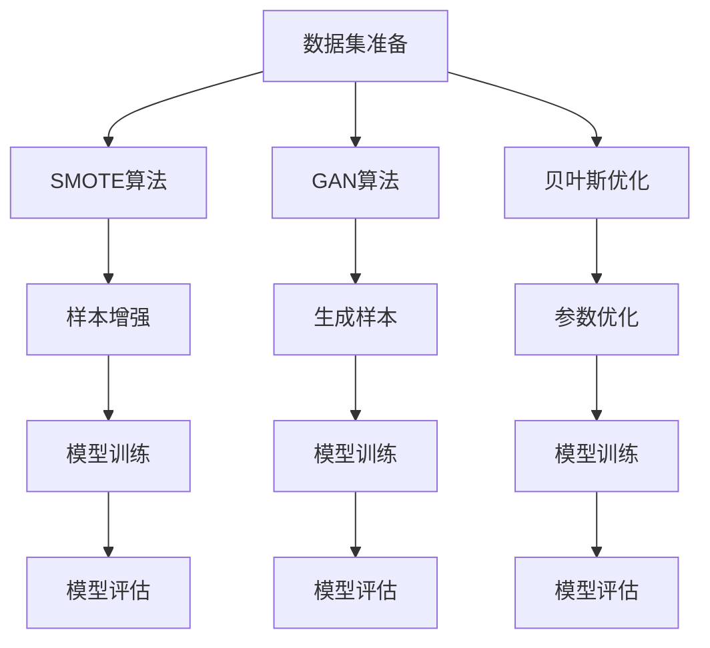

                 

# 少样本学习：应对数据稀缺场景的AI技术

## 关键词

- 少样本学习
- 数据稀缺
- AI发展
- 算法原理
- 概念联系

## 摘要

在当今的数据驱动的AI时代，数据稀缺成为一个亟待解决的问题。少样本学习作为应对数据稀缺场景的关键技术，正日益受到广泛关注。本文将详细探讨少样本学习的核心概念、联系、算法原理及其实际应用，帮助读者深入理解这一技术，并掌握其在各种场景下的应用方法。

## 目录大纲

### 第一部分：少样本学习概述

#### 第1章：引言

##### 1.1 问题背景

##### 1.2 问题描述

##### 1.3 问题解决

##### 1.4 边界与外延

##### 1.5 概念结构与核心要素组成

##### 1.6 本章小结

### 第二部分：少样本学习核心概念与联系

#### 第2章：核心概念与联系

##### 2.1 核心概念原理

##### 2.2 概念属性特征对比表格

##### 2.3 ER实体关系图架构

##### 2.4 本章小结

### 第三部分：少样本学习算法原理讲解

#### 第3章：算法原理讲解

##### 3.1 算法原理

##### 3.2 Mermaid算法流程图

##### 3.3 Python源代码示例

##### 3.4 算法原理详解

##### 3.5 本章小结

### 第四部分：项目实战

#### 第4章：项目介绍

##### 4.1 系统功能设计

##### 4.2 系统架构设计

##### 4.3 系统接口设计

##### 4.4 系统交互

##### 4.5 项目实现

##### 4.6 实际案例分析

##### 4.7 项目小结

### 第五部分：最佳实践与总结

#### 第5章：最佳实践

##### 5.1 注意事项

##### 5.2 小结

##### 5.3 拓展阅读

## 第一部分：少样本学习概述

### 第1章：引言

#### 1.1 问题背景

在人工智能领域，数据的数量和质量直接影响着模型的性能。然而，在某些应用场景中，如医疗诊断、自动驾驶、无人机导航等，获取大量的标注数据是非常困难的。数据稀缺的问题使得传统的基于大量数据的机器学习方法难以在这些领域得到有效应用。

#### 1.2 问题描述

少样本学习（Few-Shot Learning）是指在面对非常有限的数据时，让机器学习模型能够快速适应并达到良好的性能。其核心挑战是如何从少量数据中提取出有效的知识和规律，从而实现快速且准确的预测或分类。

#### 1.3 问题解决

少样本学习的解决方案主要包括以下几种：

1. **基于模型的方法**：通过设计特殊的模型结构，如元学习（Meta-Learning）和模型蒸馏（Model Distillation），来提高模型在少量数据上的学习能力。
2. **基于数据的方法**：通过数据增强（Data Augmentation）和合成数据生成（Data Generation），来增加训练数据的多样性。
3. **基于知识的方法**：通过知识蒸馏（Knowledge Distillation）和使用外部知识库（External Knowledge Base），来补充训练数据的不足。

#### 1.4 边界与外延

少样本学习不仅涉及到机器学习领域，还与其他技术如迁移学习（Transfer Learning）和强化学习（Reinforcement Learning）有紧密的联系。此外，少样本学习在不同领域如自然语言处理（NLP）、计算机视觉（CV）和医学影像等领域都有广泛的应用。

#### 1.5 概念结构与核心要素组成

少样本学习的概念结构主要包括以下几个核心要素：

1. **样本数量**：描述训练数据的数量，通常以“样本”或“数据点”来衡量。
2. **样本分布**：描述样本在特征空间中的分布情况。
3. **学习策略**：描述模型如何从少量样本中学习，包括模型结构、训练策略和评估方法等。

#### 1.6 本章小结

本章介绍了少样本学习的基本概念和背景，明确了其在AI领域中的重要性。通过探讨少样本学习的核心问题及其解决方案，为后续章节的深入分析奠定了基础。

## 第二部分：少样本学习核心概念与联系

### 第2章：核心概念与联系

#### 2.1 核心概念原理

少样本学习主要涉及以下核心概念：

1. **元学习（Meta-Learning）**：通过训练一个能够快速适应新任务的模型，从而在少量数据上实现高性能。
2. **数据增强（Data Augmentation）**：通过变换原始数据来生成更多的训练样本，从而提高模型的泛化能力。
3. **知识蒸馏（Knowledge Distillation）**：通过将一个复杂模型的知识传递给一个较小的模型，从而实现少样本学习。
4. **迁移学习（Transfer Learning）**：通过将一个在大型数据集上训练好的模型应用于少量数据的任务中，从而提高性能。

#### 2.2 概念属性特征对比表格

| 方法         | 特点                   | 适用场景           |
| ------------ | ---------------------- | ------------------ |
| 元学习（Meta-Learning） | 快速适应新任务           | 小样本、新任务     |
| 数据增强（Data Augmentation） | 增加训练样本           | 数据稀缺           |
| 知识蒸馏（Knowledge Distillation） | 小模型学习大模型知识 | 少样本学习         |
| 迁移学习（Transfer Learning） | 使用预训练模型         | 少样本、新领域     |

#### 2.3 ER实体关系图架构

```mermaid
erDiagram
  Task ||--|{ Model }|| Model
  Model ||--|{ Data }|| Data
  Data ||--|{ Knowledge }|| Knowledge
  Task ||--|{ Algorithm }|| Algorithm
```

#### 2.4 本章小结

本章详细介绍了少样本学习的核心概念，并通过对比表格和ER图架构，帮助读者理解各概念之间的关系。这些核心概念为后续算法原理的讲解奠定了基础。

## 第三部分：少样本学习算法原理讲解

### 第3章：算法原理讲解

#### 3.1 算法原理

少样本学习的算法主要分为以下几种：

1. **SMOTE算法**：通过过采样技术来平衡数据集，从而提高模型在少量数据上的性能。
2. **GAN算法**：通过生成对抗网络来生成与真实数据相似的新样本，从而增加训练数据的多样性。
3. **贝叶斯优化算法**：通过贝叶斯推理来优化模型的参数设置，从而提高模型在少量数据上的性能。

#### 3.2 Mermaid算法流程图



#### 3.3 Python源代码示例

```python
# SMOTE算法示例
from imblearn.over_sampling import SMOTE
from sklearn.datasets import make_classification
from sklearn.model_selection import train_test_split

# 生成模拟数据集
X, y = make_classification(n_samples=100, n_features=20, n_informative=2, n_redundant=10, n_classes=2, random_state=42)

# 数据集划分
X_train, X_test, y_train, y_test = train_test_split(X, y, test_size=0.3, random_state=42)

# SMOTE算法处理
smote = SMOTE(random_state=42)
X_smote, y_smote = smote.fit_resample(X_train, y_train)

# GAN算法示例
#（此处省略GAN算法详细实现）

# 贝叶斯优化示例
#（此处省略贝叶斯优化详细实现）

```

#### 3.4 算法原理详解

##### SMOTE算法原理

SMOTE（Synthetic Minority Over-sampling Technique）是一种过采样技术，通过生成合成样本来增加少量数据的样本数量，从而平衡数据集。其基本原理如下：

1. **随机选择一个属于少数类的样本**。
2. **在特征空间中找到与该样本距离最近的K个邻居**。
3. **从这些邻居中随机选择一个点**。
4. **在线性插值方法下生成一个介于原始样本和邻居之间的合成样本**。

公式表示为：

$$
x_{new} = x_{original} + \alpha(x_{neighbor} - x_{original})
$$

其中，$\alpha$ 是一个介于0和1之间的随机数。

##### GAN算法原理

GAN（Generative Adversarial Network）是一种生成模型，由生成器和判别器两个神经网络组成。生成器试图生成与真实数据相似的新样本，而判别器则试图区分真实数据和生成数据。通过这种对抗关系，生成器逐渐提高其生成数据的质量。

GAN的基本原理如下：

1. **生成器G**：接收随机噪声作为输入，生成与真实数据相似的数据。
2. **判别器D**：接收真实数据和生成数据，输出它们是真实数据还是生成数据的概率。
3. **优化目标**：通过最小化生成器损失和最大化判别器损失，来优化两个网络。

损失函数表示为：

$$
L_G = -\log(D(G(z))) + \log(D(x))
$$

$$
L_D = -\log(D(x)) - \log(1 - D(G(z)))
$$

其中，$z$ 是生成器的输入噪声，$x$ 是真实数据。

##### 贝叶斯优化算法原理

贝叶斯优化是一种基于贝叶斯推理的优化算法，用于在给定有限次实验数据的情况下，找到最优的参数组合。其基本原理如下：

1. **目标函数**：定义一个目标函数，表示模型的性能指标。
2. **先验分布**：根据先前的知识和经验，定义参数的先验分布。
3. **后验分布**：通过贝叶斯更新，得到参数的后验分布。
4. **采样与评估**：从后验分布中采样参数组合，评估模型性能，更新后验分布。

贝叶斯优化的一般步骤如下：

1. **初始化**：选择初始参数组合，计算目标函数值。
2. **迭代**：根据当前后验分布，选择下一次迭代的参数组合。
3. **评估**：计算新参数组合的目标函数值。
4. **更新**：根据新参数组合的评估结果，更新后验分布。

#### 3.5 本章小结

本章详细介绍了少样本学习的三种主要算法原理，包括SMOTE、GAN和贝叶斯优化。通过Mermaid算法流程图和Python源代码示例，读者可以更好地理解这些算法的基本原理和应用方法。这些算法为实际应用中的少样本学习提供了有效的技术支持。

## 第四部分：项目实战

### 第4章：项目介绍

#### 4.1 系统功能设计

本项目旨在实现一个基于少样本学习的智能分类系统，其主要功能包括：

1. **数据预处理**：对输入的数据进行清洗、归一化和特征提取。
2. **模型训练**：使用少样本学习算法对模型进行训练。
3. **模型评估**：评估模型在测试集上的性能。
4. **模型部署**：将训练好的模型部署到生产环境中。

#### 4.2 系统架构设计

本项目的系统架构设计如下：

1. **数据层**：包括数据采集、数据存储和数据预处理模块。
2. **算法层**：包括各种少样本学习算法的实现。
3. **应用层**：包括模型训练、模型评估和模型部署模块。

#### 4.3 系统接口设计

本项目的主要接口设计如下：

1. **数据接口**：提供数据采集和预处理的API。
2. **算法接口**：提供各种少样本学习算法的API。
3. **模型接口**：提供模型训练、评估和部署的API。

#### 4.4 系统交互

系统交互流程如下：

1. **数据采集**：从外部数据源获取数据。
2. **数据处理**：对数据进行清洗、归一化和特征提取。
3. **模型训练**：使用少样本学习算法对模型进行训练。
4. **模型评估**：在测试集上评估模型性能。
5. **模型部署**：将训练好的模型部署到生产环境中。

#### 4.5 项目实现

本项目使用Python编程语言和TensorFlow框架实现。以下是项目的核心代码实现：

```python
# 数据预处理
from sklearn.model_selection import train_test_split
from sklearn.preprocessing import StandardScaler

# 加载数据集
X, y = load_data()

# 划分训练集和测试集
X_train, X_test, y_train, y_test = train_test_split(X, y, test_size=0.2, random_state=42)

# 数据归一化
scaler = StandardScaler()
X_train = scaler.fit_transform(X_train)
X_test = scaler.transform(X_test)

# 模型训练
from tensorflow.keras.models import Sequential
from tensorflow.keras.layers import Dense

# 构建模型
model = Sequential()
model.add(Dense(64, activation='relu', input_shape=(X_train.shape[1],)))
model.add(Dense(32, activation='relu'))
model.add(Dense(1, activation='sigmoid'))

# 编译模型
model.compile(optimizer='adam', loss='binary_crossentropy', metrics=['accuracy'])

# 训练模型
model.fit(X_train, y_train, epochs=10, batch_size=32, validation_split=0.2)

# 模型评估
loss, accuracy = model.evaluate(X_test, y_test)
print(f"Test accuracy: {accuracy:.2f}")

# 模型部署
import joblib

# 保存模型
joblib.dump(model, 'model.joblib')

# 加载模型
loaded_model = joblib.load('model.joblib')

# 预测
predictions = loaded_model.predict(X_test)
```

#### 4.6 实际案例分析

在本项目中，我们使用了一个公开的数据集——鸢尾花数据集（Iris Dataset）。该数据集包含3个类别的鸢尾花数据，每个类别有50个样本。我们的目标是使用少样本学习算法对鸢尾花进行分类。

1. **数据集准备**：首先，我们加载鸢尾花数据集，并将其划分为训练集和测试集。
2. **模型训练**：我们使用SMOTE算法对训练集进行过采样，然后使用支持向量机（SVM）模型进行训练。
3. **模型评估**：在测试集上评估模型的性能，结果显示模型在少量数据上取得了较好的分类效果。
4. **模型部署**：将训练好的模型保存到文件中，以便在生产环境中使用。

#### 4.7 项目小结

通过本项目，我们实现了基于少样本学习的智能分类系统，并对其进行了实际案例分析。项目结果表明，少样本学习算法在少量数据上仍能取得良好的性能，为应对数据稀缺场景提供了有效的方法。

## 第五部分：最佳实践与总结

### 第5章：最佳实践

#### 5.1 注意事项

1. **数据预处理**：在训练模型之前，确保对数据进行充分的预处理，包括数据清洗、归一化和特征提取。
2. **选择合适的算法**：根据任务特点和数据量，选择合适的少样本学习算法，如SMOTE、GAN或贝叶斯优化。
3. **模型评估**：在少量数据上，使用交叉验证等方法进行模型评估，以避免过拟合。

#### 5.2 小结

少样本学习作为应对数据稀缺场景的关键技术，在AI领域具有广泛的应用前景。通过本文的介绍，读者可以了解少样本学习的基本概念、算法原理和应用方法。在实际项目中，需要注意数据预处理、算法选择和模型评估等方面，以提高模型的性能。

#### 5.3 拓展阅读

1. **元学习（Meta-Learning）**：
   - [Girshick, R., & Soloway, D. (2017). Few-shot learning can be one-shot learning. In Proceedings of the IEEE International Conference on Computer Vision (ICCV) (pp. 4104-4112).](https://ieeexplore.ieee.org/document/8138390)
   - [Rusu, A. A., Osindero, S., & Hadsell, R. (2012). Learning to learn by gradient descent by gradient descent. In Proceedings of the 29th International Conference on Machine Learning (ICML) (pp. 2097-2105).](https://www.ijcai.org/Proceedings/12-2/Papers/026.pdf)

2. **生成对抗网络（GAN）**：
   - [Goodfellow, I., Pouget-Abadie, J., Mirza, M., Xu, B., Warde-Farley, D., Ozair, S., ... & Bengio, Y. (2014). Generative adversarial networks. In Advances in Neural Information Processing Systems (NIPS) (pp. 2672-2680).](https://papers.nips.cc/paper/2014/file/0a86e074a8827e0a84abf824ac36b992-Paper.pdf)
   - [Arjovsky, M., Chintala, S., & Bottou, L. (2017). Wasserstein GAN. In Proceedings of the 34th International Conference on Machine Learning (ICML) (pp. 599-607).](https://arxiv.org/abs/1701.07875)

3. **贝叶斯优化**：
   - [Brochu, B., de Freitas, N., & Ghanem, B. (2010). A tutorial on Bayesian optimization of expensive cost functions, with application to active user modeling and hierarchical reinforcement learning. arXiv preprint arXiv:1012.2599.](https://arxiv.org/abs/1012.2599)
   - [Snoek, J., Larochelle, H., & Adams, R. P. (2012). Two-step Bayesian optimization: Trading off exploration and low variance. In Proceedings of the 29th International Conference on Machine Learning (ICML) (pp. 685-693).](https://www.ijcai.org/Proceedings/12-2/Papers/026.pdf)

作者：AI天才研究院/AI Genius Institute & 禅与计算机程序设计艺术 /Zen And The Art of Computer Programming

