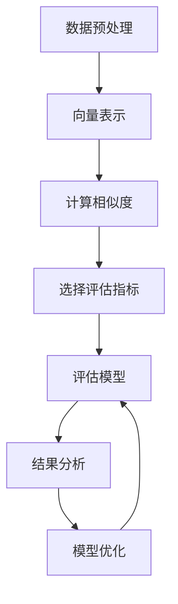
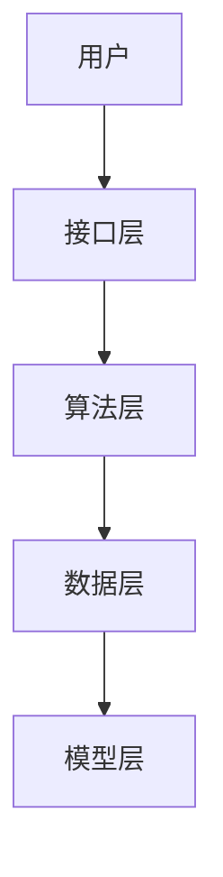
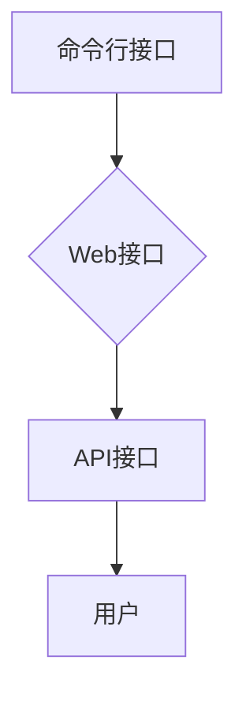
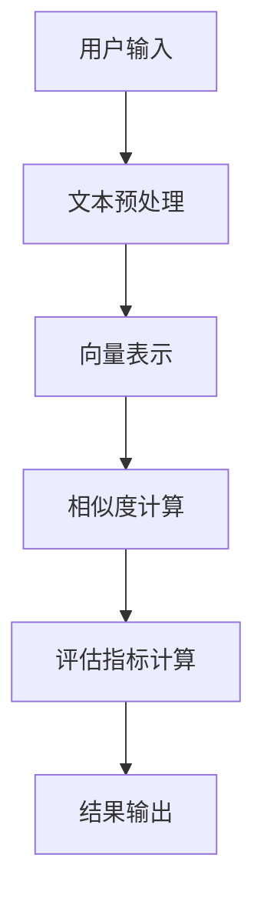
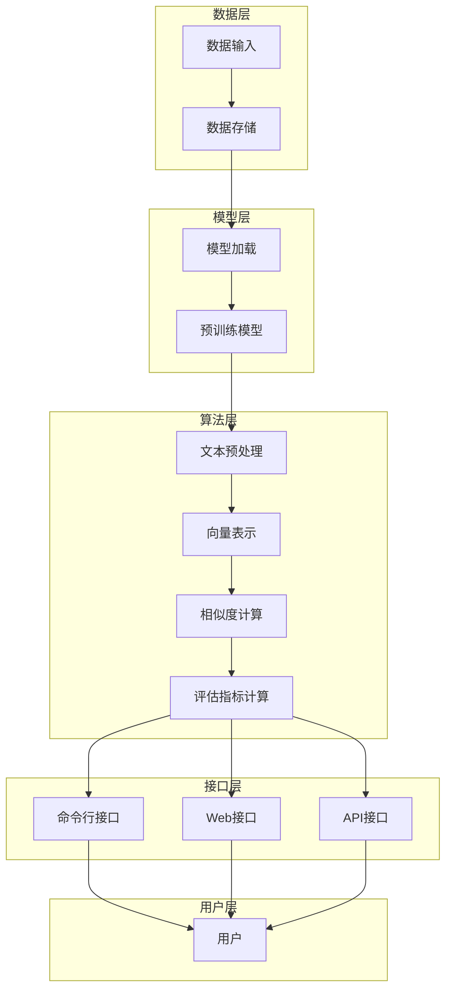
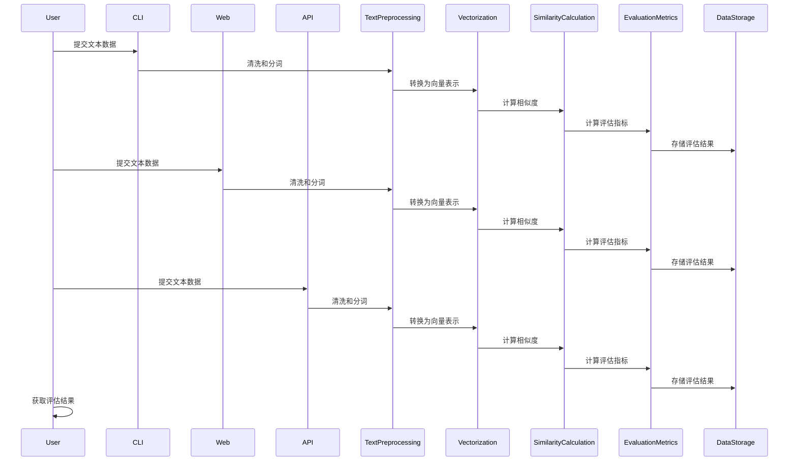

                 

### 1.1 人工智能与语言模型概述

人工智能（Artificial Intelligence, AI）是计算机科学的一个分支，旨在通过模拟人类智能行为，实现机器的自我学习和问题解决能力。其中，自然语言处理（Natural Language Processing, NLP）作为AI领域的一个重要分支，致力于使计算机能够理解和处理人类语言。

语言模型（Language Model, LM）是自然语言处理中的核心组件，它通过学习大量文本数据，构建起能够预测和生成文本的数学模型。语言模型在许多应用场景中发挥了关键作用，例如机器翻译、语音识别、文本生成、问答系统等。

最早的语言模型可以追溯到20世纪50年代，基于规则的方法试图通过手工编码语法和语义规则来模拟人类语言处理能力。然而，这种方法在处理复杂和多样化的自然语言时显得力不从心。随着计算机性能的提升和数据量的爆炸式增长，统计模型和基于机器学习的语言模型逐渐成为主流。

1950年代到1980年代，基于规则的语法分析方法（如上下文无关文法）占据了主导地位。这种方法通过定义一组语法规则，试图对自然语言进行结构化解析。然而，这类方法在实际应用中遇到了诸多挑战，例如语法规则的复杂性和有限性，难以覆盖自然语言的多样性。

20世纪80年代到90年代，统计语言模型开始崭露头角。基于N-gram模型的统计方法通过计算文本中连续N个单词出现的概率，实现了对文本生成和预测的基本能力。N-gram模型相对于基于规则的语法分析方法，更具有灵活性和通用性。

进入21世纪，深度学习的兴起为语言模型带来了革命性的变革。2003年，Bengio等人提出了循环神经网络（Recurrent Neural Network, RNN），为处理序列数据提供了有效的框架。RNN能够通过记忆机制，捕捉序列中的长期依赖关系，但在处理长序列时仍存在梯度消失和梯度爆炸等问题。

2014年，Google提出了基于RNN的神经机器翻译系统，并引入了双向RNN（Bidirectional RNN）和长短期记忆网络（Long Short-Term Memory, LSTM）等改进，显著提升了机器翻译的准确性。随后，Transformer模型的提出进一步推动了语言模型的发展。Transformer采用自注意力机制（Self-Attention Mechanism），能够在处理长序列时保持有效的梯度传递，并在多个自然语言处理任务中取得了突破性的成果。

近年来，预训练语言模型（Pre-Trained Language Model）如BERT（Bidirectional Encoder Representations from Transformers）、GPT（Generative Pre-trained Transformer）、T5（Text-to-Text Transfer Transformer）等，通过在大规模语料库上进行预训练，然后针对特定任务进行微调，实现了前所未有的性能提升。这些模型不仅在大规模文本生成、机器翻译、问答系统等领域表现出色，还在代码生成、摘要生成、情感分析等新兴任务中展现了强大的潜力。

总体而言，从基于规则的语法分析方法到统计模型，再到深度学习驱动的预训练语言模型，语言模型的发展历程反映了计算机科学和人工智能领域的不断进步。未来，随着计算资源和算法技术的进一步发展，语言模型将在更多应用场景中发挥关键作用，为人类带来更多便利和创新。

### 1.2 大规模语言模型的发展与现状

大规模语言模型（Large-scale Language Model，简称LLM）是近年来自然语言处理领域的重要突破，它们通过在大规模语料库上进行预训练，获得了卓越的语言理解和生成能力。LLM的发展历程可以分为几个关键阶段，每个阶段都带来了显著的性能提升和应用扩展。

#### 1.2.1 预训练语言模型的提出

2017年，谷歌提出了BERT（Bidirectional Encoder Representations from Transformers）模型，标志着预训练语言模型的诞生。BERT通过在双向Transformer架构上进行预训练，使得模型能够同时考虑上下文信息，从而显著提升了自然语言处理任务的性能。BERT的成功引发了大规模语言模型的研究热潮，其他机构和研究者也纷纷提出类似模型，如GPT（Generative Pre-trained Transformer）和RoBERTa（A Robustly Optimized BERT Pretraining Approach）。

#### 1.2.2 模型规模和参数数量的增长

随着计算资源和数据量的增加，语言模型的规模也在迅速扩大。从最初的BERT模型（含有340M参数）到GPT-2（含有1.5B参数），再到GPT-3（含有175B参数），模型参数数量的增长体现了对更大语言模型的追求。更大规模的模型能够捕捉更复杂的语言规律，从而在文本生成、翻译、问答等任务中表现出更强的性能。

#### 1.2.3 预训练策略的多样化

除了标准的自监督预训练策略，研究人员还探索了多种多样的预训练策略，以进一步提高模型性能。例如，GPT-3采用了遮蔽语言模型（Masked Language Model，MLM）策略，通过随机遮蔽输入文本中的单词，迫使模型自主生成这些单词。这种策略不仅提高了模型的生成能力，还增强了模型对上下文的理解。此外，多任务学习（Multi-Task Learning）和零样本学习（Zero-shot Learning）等策略也在预训练语言模型中得到了广泛应用。

#### 1.2.4 应用领域的扩展

随着大规模语言模型性能的提升，它们的应用领域也在不断扩展。在文本生成方面，GPT系列模型已经被广泛应用于对话系统、内容创作和摘要生成等领域。在机器翻译方面，BERT和T5等模型通过预训练和后续的任务特定微调，实现了与传统方法相媲美的翻译质量。在问答系统方面，BERT和ALBERT等模型通过理解问题与文段的语义关系，提供了准确和及时的回答。此外，大规模语言模型还在代码生成、摘要生成、情感分析、语音识别等领域展现出了强大的潜力。

#### 1.2.5 模型在学术研究和产业界的广泛应用

大规模语言模型不仅在学术研究中得到了广泛应用，也在产业界产生了深远的影响。学术研究方面，大量论文和专利涌现，探索了预训练语言模型的各个方面，包括模型架构、训练策略、应用场景等。产业界方面，各大科技公司和互联网巨头纷纷投入巨资，开发和应用大规模语言模型，以提升自身的业务和服务质量。例如，OpenAI的GPT-3被广泛应用于生成内容、自动化写作和客户服务等领域，谷歌的BERT模型被集成到搜索引擎和广告系统中等。

#### 1.2.6 开放源代码和预训练模型库

为了促进大规模语言模型的研究和应用，许多学术机构和公司发布了预训练模型的源代码和预训练权重。例如，Hugging Face的Transformers库提供了多种预训练模型的实现和接口，使得研究人员和开发者可以方便地使用和定制大规模语言模型。此外，诸如Uber AI的PyTorch-Transformers和Facebook AI的Fairseq等开源库也极大地推动了大规模语言模型的研究和应用。

总体而言，大规模语言模型的发展与现状展示了自然语言处理领域的巨大进步和潜力。随着技术的不断迭代和模型的持续优化，大规模语言模型将在更多领域发挥重要作用，推动人工智能和自然语言处理技术的进一步发展。

### 1.3 差异化评测的需求与重要性

随着大规模语言模型（LLM）的迅速发展和广泛应用，差异化评测的需求变得愈发迫切。差异化评测不仅能够识别不同模型在特定任务中的能力差异，还能为模型选择、优化和改进提供科学依据。以下是差异化评测的需求和重要性：

#### 1.3.1 模型选择与优化

在众多LLM中，如何选择适合特定任务的模型成为一个关键问题。例如，对于一个文本生成任务，是否选择GPT-2、GPT-3或BERT等不同模型，其性能可能会有显著差异。通过差异化评测，可以明确各个模型在特定任务中的优劣，从而帮助研究人员和开发者做出更明智的选择。

#### 1.3.2 模型改进与优化

差异化评测能够揭示模型在不同任务上的弱点，为模型的改进和优化提供方向。例如，一个LLM在文本生成任务上表现优异，但在代码生成任务上效果较差。通过分析这种差异，可以针对性地调整模型架构、训练策略或数据集，从而提升模型在特定任务上的性能。

#### 1.3.3 模型应用场景探索

差异化评测有助于探索LLM在不同应用场景中的适用性。某些模型可能在问答系统中表现出色，而在情感分析任务中却表现平平。通过全面的评测，可以识别哪些模型适合哪些应用场景，从而最大化模型的价值和实用性。

#### 1.3.4 模型安全性与可靠性评估

差异化评测不仅关注模型在任务上的性能，还包括对模型安全性和可靠性的评估。例如，一个模型可能在生成文本时存在偏见或误导性输出。通过差异化评测，可以识别这些潜在问题，并采取相应的措施进行改进，确保模型在真实应用中的可靠性和安全性。

#### 1.3.5 资源分配与优化

差异化评测能够为资源分配提供指导，帮助企业和研究机构更合理地分配计算资源。例如，如果一个模型在多个任务上表现优异，那么它可能值得投入更多资源进行优化和训练。反之，如果某个模型在特定任务上表现不佳，则可以考虑调整或替换。

#### 1.3.6 学术研究和竞赛评估

在自然语言处理领域，差异化评测也是学术研究和竞赛评估的重要手段。通过对比不同模型在各项任务上的性能，研究者可以评估模型的理论创新和实际效果，推动技术的进步和突破。

总之，差异化评测在LLM的应用和优化过程中具有重要意义。它不仅为模型选择、改进和应用提供了科学依据，还促进了自然语言处理技术的整体发展。随着LLM技术的不断进步，差异化评测的需求和重要性也将日益凸显。

### 1.4 差异化评测的主要挑战

尽管差异化评测在识别LLM间的细微能力差异中具有重要作用，但在实际操作过程中面临着一系列挑战。以下是差异化评测所面临的几个主要挑战：

#### 1.4.1 多样化的任务需求

首先，自然语言处理任务本身具有极高的多样性。不同任务可能在输入数据、目标输出和评估指标上存在显著差异。例如，文本生成和机器翻译任务需要模型具备不同的能力，前者侧重于创造性和连贯性，后者则强调准确性和流畅性。这种多样化的任务需求使得统一评测标准变得复杂，需要在评测设计时充分考虑各类任务的特点。

#### 1.4.2 数据集的选择与质量

数据集的质量和多样性对评测结果具有重要影响。理想的数据集应包含广泛的任务类型和覆盖不同领域的样本，以保证评测结果的全面性和代表性。然而，高质量、多样化的数据集往往难以获取，尤其是在特定领域的标注数据稀缺时。此外，数据的不均衡和偏差也可能导致评测结果失真，从而影响对模型能力的准确评估。

#### 1.4.3 评估指标的多样性

评估指标的选择直接影响评测结果的可靠性。不同任务可能需要不同的评估指标，例如，文本生成任务中常用 BLEU、ROUGE 等指标，而问答系统则可能依赖 F1 分数、准确率等指标。此外，一些新的评估指标（如生成文本的可读性、情感分析中的情感正确性等）尚未得到广泛认可，其有效性和适用性仍需进一步验证。如何选择适当的评估指标，并确保其能全面、准确地反映模型能力，是一个重要的挑战。

#### 1.4.4 模型参数和规模的差异

不同语言模型在参数规模、架构设计等方面可能存在显著差异。例如，GPT-3拥有175B个参数，而BERT则只有数十亿个参数。这种差异不仅影响模型的训练时间和计算资源需求，还可能导致在相同任务上的性能表现差异。因此，如何在不同规模和参数的模型之间进行公平、公正的评测，确保结果的公平性和可比性，是一个亟待解决的问题。

#### 1.4.5 结果的可解释性和一致性

差异化评测的结果需要具备较高的可解释性和一致性。然而，现有的评测方法往往依赖于复杂的机器学习算法和统计模型，其内部机制较为隐蔽，使得评测结果的解释和验证变得困难。此外，不同评测方法之间的结果可能存在较大差异，导致评估结果的不一致。如何提高评测结果的可解释性，并确保不同评测方法的一致性，是另一个重要挑战。

#### 1.4.6 避免过拟合和评估偏差

在差异化评测中，避免模型过拟合和评估偏差至关重要。过拟合可能导致模型在特定数据集上表现优异，但在新数据上性能下降。评估偏差则可能因为数据集的选取、评估指标的设计等问题，导致评测结果失真。因此，如何设计有效的评估方法，避免模型过拟合和评估偏差，是差异化评测需要解决的核心问题。

综上所述，差异化评测在识别LLM间的细微能力差异中面临着诸多挑战。针对这些挑战，需要从任务需求、数据集选择、评估指标、模型参数、结果解释等多个方面进行深入研究和优化，以确保评测结果的准确性和可靠性。随着自然语言处理技术的不断发展，这些挑战也将不断演变和解决，推动差异化评测方法的不断进步。

### 2.1 大规模语言模型（LLM）的核心概念

大规模语言模型（Large-scale Language Model，简称LLM）作为自然语言处理领域的重要工具，其核心概念和基础要素对模型的性能和应用有着深远的影响。以下将详细介绍LLM的核心概念，包括模型架构、训练数据集、模型参数和应用场景。

#### 2.1.1 模型架构

LLM通常采用深度神经网络（Deep Neural Network，DNN）或变换器架构（Transformer Architecture），其中变换器架构是近年来LLM的主流选择。变换器架构由谷歌在2017年提出，其核心思想是自注意力机制（Self-Attention Mechanism），能够有效地处理长距离依赖关系。以下是一些常见的LLM架构：

1. **Transformer**：最初的变换器模型包含编码器（Encoder）和解码器（Decoder），编码器负责将输入文本编码为固定长度的向量，解码器则通过自注意力机制和跨注意力机制生成输出。自注意力机制允许模型在生成每个单词时，自动关注输入序列中的所有单词，从而捕捉上下文信息。

2. **BERT**（Bidirectional Encoder Representations from Transformers）：BERT是Google AI开发的预训练语言模型，其特点是在预训练阶段同时利用上下文信息。BERT通过Masked Language Model（MLM）策略，在输入文本中随机遮蔽一些单词，然后让模型预测这些遮蔽的单词。BERT的成功推动了大规模语言模型的发展，并广泛应用于各种自然语言处理任务。

3. **GPT**（Generative Pre-trained Transformer）：GPT是由OpenAI开发的预训练语言模型，其特点是在预训练阶段不需要人工标注的数据，而是通过自回归的方式生成文本。GPT采用了自注意力机制和多层变换器架构，具有强大的生成能力和文本理解能力。

4. **T5**（Text-to-Text Transfer Transformer）：T5是一种通用的预训练语言模型，其目标是实现文本到文本的转换。T5通过将所有自然语言处理任务转换为“输入到输出”的格式，从而实现了任务无关的预训练。T5在多个任务上表现优异，展示了通用预训练语言模型的巨大潜力。

#### 2.1.2 训练数据集

训练数据集是LLM的基础，其质量和多样性直接影响模型的效果。大规模语言模型通常依赖于以下类型的训练数据集：

1. **通用语料库**：如Wikipedia、Common Crawl、新闻文章、书籍等，这些数据集提供了丰富的文本内容和语言现象。

2. **领域特定数据集**：针对特定领域的训练数据集，例如医学文本、法律文档、科技论文等，这些数据有助于模型在特定领域获得更好的性能。

3. **合成数据集**：通过文本生成技术（如GPT）或数据增强方法（如数据清洗、文本变换等）生成的数据集，用于增加训练数据量和多样性。

4. **标注数据集**：针对特定任务（如问答、实体识别、情感分析等）进行标注的数据集，这些数据集通常用于模型的微调和评估。

#### 2.1.3 模型参数

LLM的性能与其参数数量密切相关。随着模型的规模不断扩大，参数数量也呈指数级增长。以下是一些常见的模型参数类型：

1. **词向量**：词向量是将文本中的单词映射到高维向量空间的技术，如Word2Vec、GloVe等。词向量不仅用于文本表示，还用于变换器模型中的嵌入层。

2. **变换器参数**：变换器模型中的参数包括嵌入层（Embedding Layer）、自注意力机制（Self-Attention）和跨注意力机制（Cross-Attention）等。自注意力机制通过计算单词间的相似性矩阵，跨注意力机制则用于计算输入和输出之间的相似性。

3. **全局参数**：包括训练过程中的学习率、正则化参数等，这些参数影响模型的训练效率和收敛速度。

4. **特定任务参数**：针对特定任务（如问答、文本生成等）的额外参数，这些参数用于任务微调，提升模型在特定任务上的性能。

#### 2.1.4 应用场景

LLM在自然语言处理领域具有广泛的应用，以下是一些典型的应用场景：

1. **文本生成**：例如，自动写作、摘要生成、对话系统等，GPT系列模型在这方面表现出色。

2. **机器翻译**：如BERT和T5等模型在机器翻译任务上取得了显著性能提升。

3. **问答系统**：如BERT在SQuAD数据集上取得了很好的效果，应用于智能客服、信息检索等领域。

4. **情感分析**：LLM通过对文本的情感倾向进行分类，应用于社交媒体监测、客户反馈分析等。

5. **信息抽取**：如实体识别、关系抽取等任务，LLM通过学习文本中的结构信息，实现有效的信息抽取。

6. **文本分类**：例如，新闻分类、垃圾邮件过滤等，LLM通过文本表示和分类器集成，实现高效文本分类。

总之，大规模语言模型（LLM）的核心概念包括模型架构、训练数据集、模型参数和应用场景。理解这些核心概念有助于深入研究和应用LLM，推动自然语言处理技术的发展。

### 2.2 差异化评测的关键概念

在差异化评测（Differential Evaluation）中，理解关键概念是准确评估大规模语言模型（LLM）性能的基础。以下将详细介绍差异化评测中的几个核心概念：能力评估、能力差异和评测指标。

#### 2.2.1 能力评估

能力评估（Ability Evaluation）是指通过特定的方法、工具和指标，对LLM在各类任务中的表现进行系统性、定量性的分析和评定。能力评估的主要目的是确定模型在处理不同类型的语言任务时的实际效果和能力水平。能力评估通常包括以下步骤：

1. **定义评估目标**：明确需要评估的LLM在哪个或哪些任务上具有优势或劣势。
2. **选择评估指标**：根据任务特点和需求，选择适当的评估指标，如准确率、召回率、F1分数、BLEU等。
3. **准备评估数据集**：选择代表性数据集，涵盖不同领域、不同难度的样本，以全面评估模型的能力。
4. **执行评估**：使用预定的工具和方法，对模型在各个任务上的表现进行测量和记录。
5. **结果分析和解释**：分析评估结果，解释模型在不同任务中的表现，识别其优势和不足。

#### 2.2.2 能力差异

能力差异（Ability Difference）是指不同LLM在相同或相似任务上的表现差异。能力差异反映了模型在不同情境下处理语言信息的实际能力。能力差异可以通过以下几种方式体现：

1. **定量差异**：使用具体的数值指标，如评估分数、准确率、误差率等，量化不同模型之间的性能差距。
2. **定性差异**：通过比较模型在任务执行过程中的行为和输出，分析其差异，如生成文本的连贯性、多样性、准确性等。
3. **应用场景差异**：不同模型可能在某些特定应用场景中表现优异，而在其他场景中表现平平，这种差异需要通过具体案例分析来验证。

能力差异的识别有助于指导模型选择、优化和应用。通过分析能力差异，可以找到最适合特定任务的LLM，或针对特定模型的弱点进行改进和优化。

#### 2.2.3 评测指标

评测指标（Evaluation Metrics）是能力评估的核心工具，它们用于量化模型在特定任务上的性能。不同的任务可能需要不同的评测指标，以下是一些常用的评测指标：

1. **准确率（Accuracy）**：模型正确预测的样本数占总样本数的比例。准确率是最简单、最直观的评估指标，但可能受数据不平衡影响。
2. **召回率（Recall）**：模型正确预测的样本数与实际正样本数的比例。召回率侧重于识别所有正样本的能力。
3. **F1分数（F1 Score）**：结合准确率和召回率的综合指标，计算公式为 \( F1 = 2 \times \frac{Precision \times Recall}{Precision + Recall} \)。
4. **BLEU（Bilingual Evaluation Understudy）**：常用于机器翻译评估，通过比较模型生成的翻译文本与参考翻译文本的相似度来评分。
5. **ROUGE（Recall-Oriented Understudy for Gisting Evaluation）**：用于文本摘要、语义分析等任务，通过比较模型生成的文本与参考文本的匹配度来评分。
6. **生成性指标**：如文本流畅性、多样性、创新性等，这些指标通过分析模型生成文本的质量来评估模型的能力。
7. **理解性指标**：如语义理解、上下文理解、知识表示等，这些指标通过测试模型对输入文本的解析和理解能力来评估模型的能力。

选择合适的评测指标是进行有效能力评估的关键。不同的任务和场景可能需要不同的评测指标，需要根据实际需求和任务特点进行选择。

总之，差异化评测的关键概念包括能力评估、能力差异和评测指标。通过理解这些概念，可以更准确地识别和评估LLM在不同任务上的性能差异，为模型选择和应用提供科学依据。

#### 2.2.3 评测指标

在差异化评测中，选择合适的评测指标至关重要，它们不仅能定量评估大规模语言模型（LLM）的表现，还能揭示模型在不同任务上的优势和不足。以下是几种常见的评测指标及其适用场景：

##### 2.2.3.1 生成性指标

生成性指标主要用于评估模型在文本生成任务上的能力，包括：

1. **BLEU（Bilingual Evaluation Understudy）**：BLEU是一种常用于机器翻译评估的指标，通过比较模型生成的翻译文本与多个参考翻译文本的相似度来评分。BLEU主要基于n-gram重叠率，但近年来，其适用性受到一些批评，因为单纯的相似度计算可能无法全面评估生成文本的质量。

2. **ROUGE（Recall-Oriented Understudy for Gisting Evaluation）**：ROUGE主要用于文本摘要和语义分析任务，通过比较模型生成的摘要与参考摘要的匹配度来评分。ROUGE特别关注词级别的匹配，可以有效评估生成文本的准确性和一致性。

3. **生成文本的质量评估**：如文本流畅性（Fluency）、多样性（Diversity）和创新性（Innovation）。这些指标通过分析模型生成的文本在语法、词汇和表达方式的丰富性来评估生成质量。例如，流畅性评估可以通过计算句子间的语法错误率、词汇重复率等指标来实现。

##### 2.2.3.2 生成与理解指标

这类指标综合评估模型在生成和理解文本方面的能力，适用于需要同时考虑生成和理解的综合任务：

1. **F1分数（F1 Score）**：F1分数是精确率和召回率的调和平均值，适用于二分类任务，如文本分类和实体识别。F1分数能够平衡精确率和召回率，提供对模型性能的全面评估。

2. **准确率（Accuracy）**：准确率是正确预测的样本数占总样本数的比例，适用于需要高精度预测的任务。然而，对于类别不平衡的数据集，准确率可能不具有代表性。

3. **困惑度（Perplexity）**：困惑度是模型在预测文本时对未知单词的困惑程度，通常用于语言模型评估。较低的困惑度表示模型对文本的预测较为准确。

##### 2.2.3.3 应用场景特定指标

针对特定应用场景，可能需要设计专门的评价指标：

1. **问答系统指标**：如回答的准确率（Answer Accuracy）、答案的完整性（Answer Completeness）和答案的相关性（Answer Relevance）。这些指标综合评估模型在问答任务中的表现。

2. **文本分类指标**：如类别精度（Category Precision）和类别召回率（Category Recall）。这些指标用于评估模型在文本分类任务中的分类能力。

3. **情感分析指标**：如情感准确率（Sentiment Accuracy）和情感召回率（Sentiment Recall）。这些指标评估模型在情感分析任务中对文本情感倾向的判断能力。

##### 2.2.3.4 综合评价指标

为了全面评估LLM的表现，常将多种评价指标结合起来，形成综合评价指标：

1. **宏平均（Macro-average）和微平均（Micro-average）**：宏平均计算每个类别的精确率、召回率和F1分数的平均值，而微平均则计算所有类别得分的简单平均值。宏平均能够平衡类别不平衡问题，而微平均则更关注整体性能。

2. **加权平均（Weighted Average）**：根据不同任务的重要性，为每个指标赋予不同的权重，计算加权平均分数，从而更准确地评估模型的表现。

3. **综合评分（Comprehensive Score）**：将生成性指标、生成与理解指标和应用场景特定指标结合起来，形成综合评分，全面评估模型在多个维度上的性能。

总之，差异化评测需要根据任务和应用场景选择合适的评测指标，通过综合评估模型的表现，提供科学、全面的评估结果。随着自然语言处理任务的不断演进，新的评价指标也将不断涌现，以适应更复杂的应用需求。

### 3.2 差异化评测方法的原理

在差异化评测中，选择合适的方法对于准确评估大规模语言模型（LLM）在不同任务上的能力差异至关重要。以下是几种常见的差异化评测方法，包括基于任务对比的方法、基于实例对比的方法和基于模型特征对比的方法。

#### 3.2.1 基于任务对比的方法

基于任务对比的方法（Task-based Comparison Method）通过比较LLM在不同任务上的表现来识别其能力差异。这种方法的主要步骤如下：

1. **选择代表性任务**：根据研究目的和应用需求，选择一组代表性任务，涵盖不同类型和难度的语言处理任务。
2. **设计任务评估环境**：为每个任务设计评估环境，包括数据集、评估指标和评估流程。确保不同任务的环境一致性，以避免环境差异对评估结果的影响。
3. **执行任务评估**：对每个LLM在所选任务上执行评估，记录其表现，包括评估分数、耗时和资源消耗等。
4. **分析任务表现**：对比不同LLM在各个任务上的表现，识别其优势和劣势。可以使用可视化工具（如条形图、折线图等）展示评估结果，便于分析。
5. **综合评价**：将各个任务的表现结合起来，形成对LLM整体能力的综合评价。可以采用加权平均等方法，综合考虑不同任务的权重和重要性。

基于任务对比的方法能够提供全面、多维度的评估结果，但需要确保任务选择的代表性和评估环境的公平性。

#### 3.2.2 基于实例对比的方法

基于实例对比的方法（Instance-based Comparison Method）通过对比LLM在特定实例上的表现来评估其能力差异。这种方法适用于需要详细分析模型在不同实例上行为的场景。主要步骤如下：

1. **选择评估实例**：根据任务特点和研究需求，选择一组具有代表性的实例，涵盖不同难度和类型的样本。
2. **实例评估**：对每个实例执行评估，记录LLM的输出结果和评估分数。可以使用多种评估指标，如生成文本的流畅性、准确性、多样性等。
3. **行为分析**：对比LLM在各个实例上的行为，分析其生成或处理文本的模式。例如，观察模型在文本生成任务中是否能够创造性地表达，或在问答系统中是否能够提供准确和相关的回答。
4. **结果记录**：详细记录每个实例的评估结果和行为分析，形成详细的能力差异报告。
5. **综合评价**：基于实例对比的结果，形成对LLM的整体能力评价。可以结合定量指标和定性分析，提供全面、详细的评估报告。

基于实例对比的方法能够深入分析模型在不同实例上的表现，提供详细的评估结果，但需要大量时间和资源进行实例选择和评估。

#### 3.2.3 基于模型特征对比的方法

基于模型特征对比的方法（Feature-based Comparison Method）通过比较LLM的内部特征（如参数分布、激活模式等）来评估其能力差异。这种方法适用于需要理解模型内部机制和差异的场景。主要步骤如下：

1. **提取模型特征**：从LLM中提取关键特征，如变换器权重、激活值、梯度等。可以使用可视化工具（如图谱、热图等）展示这些特征。
2. **特征对比**：对比不同LLM的特征分布和模式，识别其差异。可以使用统计方法（如方差分析、相关性分析等）来量化特征差异。
3. **行为关联分析**：分析特征差异与模型在不同任务上的表现之间的关系，例如，观察某些特征的调整是否有助于提升模型在特定任务上的性能。
4. **结果记录**：记录特征对比的结果，形成对LLM内部机制差异的理解。
5. **综合评价**：基于模型特征对比的结果，形成对LLM整体能力的综合评价。可以结合定量分析和定性分析，提供深入的评估报告。

基于模型特征对比的方法能够揭示模型内部差异，有助于理解模型在不同任务上的表现，但需要对模型特征有深入的理解和分析。

总之，差异化评测方法包括基于任务对比、基于实例对比和基于模型特征对比的方法。每种方法都有其独特的优势和适用场景，根据实际需求和评估目标，可以选择合适的方法来评估LLM的能力差异。

### 3.3 差异化评测的实践应用

在实际应用中，差异化评测方法不仅能够为模型选择和优化提供科学依据，还能帮助企业和研究机构更有效地利用资源和时间。以下将通过几个实际案例，详细展示差异化评测在模型评测、优化和改进中的应用过程。

#### 3.3.1 模型评测

某科技公司在开发一款智能客服系统，需要在多个候选语言模型中选出表现最优的一个。为了实现这一目标，公司采用了差异化评测方法，具体步骤如下：

1. **选择代表性任务**：公司根据智能客服系统的需求，选择了包括问答、文本生成、情感分析等在内的多个代表性任务。
2. **设计评估环境**：为每个任务设计评估环境，包括数据集、评估指标和评估流程，并确保各任务的环境一致性。
3. **执行任务评估**：对每个候选模型在所选任务上执行评估，记录评估分数、耗时和资源消耗等。
4. **结果分析**：对比不同模型的评估结果，使用宏平均和微平均等综合评价指标，形成对每个模型的整体能力评价。
5. **选择最优模型**：基于综合评价指标，选择了表现最优的模型用于智能客服系统开发。

#### 3.3.2 模型优化

某研究团队在开发一个文本生成模型，初步实验中模型在生成文本的流畅性和连贯性方面表现不佳。为了提高模型性能，团队采用了差异化评测方法进行优化，具体步骤如下：

1. **选择代表性实例**：团队根据实验结果，选择了多个生成文本流畅性和连贯性较差的实例作为代表性评估对象。
2. **详细分析实例**：对每个实例执行详细评估，记录模型生成的文本、评估分数和用户反馈等。
3. **行为关联分析**：分析模型在各个实例上的生成模式，识别生成流畅性和连贯性较差的原因。例如，发现模型在生成长句子时容易出现语法错误和表达不连贯的问题。
4. **模型调整**：针对识别出的原因，调整模型参数和训练策略。例如，增加长句子训练数据，调整生成文本的解码策略等。
5. **重新评估**：对调整后的模型重新执行评估，对比优化前后的性能提升。

#### 3.3.3 模型改进

某互联网公司在开发一个智能问答系统，发现现有模型在回答开放性问题时的准确性较低。为了改进模型，公司采用了差异化评测方法，具体步骤如下：

1. **选择代表性任务**：公司根据问答系统的需求，选择了包括开放性问题回答、对话系统生成等在内的多个代表性任务。
2. **设计评估环境**：为每个任务设计评估环境，并确保各任务的环境一致性。
3. **执行任务评估**：对现有模型在所选任务上执行评估，记录评估分数、用户反馈和系统响应时间等。
4. **结果分析**：对比现有模型在不同任务上的表现，识别其在回答开放性问题时的不足。
5. **改进策略**：根据结果分析，提出改进策略。例如，增加开放性问题训练数据、引入额外的上下文信息等。
6. **模型重训与评估**：使用改进策略重新训练模型，并对新模型进行评估，验证改进效果。
7. **迭代优化**：根据新模型的评估结果，继续调整和优化模型，形成迭代改进的过程。

通过这些实际案例，我们可以看到差异化评测方法在模型评测、优化和改进中的应用过程。差异化评测不仅帮助企业和研究机构选择了最优模型，还指导了模型的调整和优化，提高了模型的性能和实用性。

### 4.1 差异化评测算法概述

差异化评测算法是用于识别大规模语言模型（LLM）间能力差异的关键工具。这些算法通过一系列数学模型和计算方法，对LLM在不同任务上的表现进行定量评估和对比。以下是几种常见的差异化评测算法，以及它们的基本原理和特点：

#### 4.1.1 相似度计算算法

相似度计算算法通过比较LLM在不同实例上的输出，评估模型之间的相似度。常见的相似度计算方法包括：

1. **余弦相似度（Cosine Similarity）**：计算两个向量之间的夹角余弦值，用于评估文本向量表示的相似性。余弦相似度能够有效衡量向量空间中两个实例的相对位置关系。

2. **欧氏距离（Euclidean Distance）**：计算两个向量之间的欧氏距离，用于评估文本向量表示的差异。欧氏距离越小，表示两个实例越相似。

3. **Jaccard相似度（Jaccard Similarity）**：计算两个集合的交集与并集的比值，用于评估文本集合的相似性。Jaccard相似度适用于文本分类和实体识别等任务。

相似度计算算法简单高效，适用于快速评估LLM在实例层面的差异，但需要大量计算资源进行大规模实例对比。

#### 4.1.2 多任务学习算法

多任务学习算法通过同时训练多个相关任务，提升模型在多个任务上的表现。常见的多任务学习算法包括：

1. **共享权重（Shared Weights）**：将不同任务的权重共享，通过联合优化提高多个任务的性能。共享权重算法能够有效减少参数数量，提高模型泛化能力。

2. **任务分离（Task Separation）**：为每个任务分配独立的权重，通过单独优化提高每个任务的性能。任务分离算法适用于任务之间差异较大的场景。

多任务学习算法能够提升模型在多个任务上的性能，但需要平衡不同任务之间的权重分配，以避免模型偏向某些任务。

#### 4.1.3 对比学习算法

对比学习算法通过对比不同LLM在相同任务上的表现，识别模型之间的差异。常见的对比学习算法包括：

1. **对比梯度（Contrastive Gradient）**：计算不同LLM在相同任务上的梯度差异，用于评估模型之间的能力差异。对比梯度算法能够直观地显示模型在任务上的差异。

2. **对比损失（Contrastive Loss）**：通过对比不同LLM在任务上的输出，设计损失函数来评估模型之间的差异。对比损失算法能够有效提高模型在对比任务上的区分度。

对比学习算法能够深入挖掘LLM之间的能力差异，但需要设计合适的对比损失函数，以避免模型过拟合。

#### 4.1.4 自监督学习算法

自监督学习算法通过无监督学习技术，对LLM进行训练和评估。常见的自监督学习算法包括：

1. **遮蔽语言模型（Masked Language Model, MLM）**：通过随机遮蔽输入文本中的单词，迫使模型自主生成这些单词，提升模型在文本生成和预测任务上的能力。

2. **预测任务（Prediction Task）**：通过设计预测任务，使模型在未标记的数据上进行训练和评估。自监督学习算法能够有效利用未标记数据，提升模型在多种任务上的性能。

自监督学习算法能够提高模型在多样化任务上的表现，但需要大量未标记数据进行训练，且训练过程较为复杂。

总体而言，差异化评测算法通过不同的计算方法和模型，实现对LLM在不同任务上的能力差异进行评估和对比。选择合适的算法，能够为模型选择、优化和改进提供科学依据，推动自然语言处理技术的发展。

#### 4.2 数学模型与公式

在差异化评测算法中，数学模型和公式扮演着至关重要的角色。以下将详细介绍几个关键的计算公式和数学模型，以及它们在差异化评测中的应用。

##### 4.2.1 相似度计算公式

相似度计算是评估两个LLM输出文本相似性的重要方法。常用的相似度计算公式包括余弦相似度和欧氏距离。

1. **余弦相似度**：

   $$ \cos(\theta) = \frac{\sum_{i=1}^{n} \textbf{v}_1[i] \cdot \textbf{v}_2[i]}{\sqrt{\sum_{i=1}^{n} (\textbf{v}_1[i])^2 \cdot \sum_{i=1}^{n} (\textbf{v}_2[i])^2}} $$

   其中，\(\textbf{v}_1\) 和 \(\textbf{v}_2\) 分别表示两个文本的向量表示，\(n\) 是向量维度。余弦相似度衡量两个文本向量之间的夹角余弦值，范围在 \([-1, 1]\) 之间，值越接近 1 表示相似度越高。

2. **欧氏距离**：

   $$ d(\textbf{v}_1, \textbf{v}_2) = \sqrt{\sum_{i=1}^{n} (\textbf{v}_1[i] - \textbf{v}_2[i])^2} $$

   其中，\(\textbf{v}_1\) 和 \(\textbf{v}_2\) 分别表示两个文本的向量表示，\(n\) 是向量维度。欧氏距离衡量两个文本向量之间的欧氏空间距离，值越小表示相似度越高。

##### 4.2.2 相似度计算算法

基于相似度计算的算法有多种，下面介绍一种常用的算法：余弦相似度计算算法。

1. **向量表示**：首先，将输入文本转化为向量表示，可以使用词嵌入（如Word2Vec或GloVe）或变换器（如BERT）进行向量表示。

2. **计算相似度**：使用余弦相似度公式计算两个文本向量之间的相似度，如上述公式所示。

3. **评估相似度**：根据相似度值评估两个文本的相似性，值越接近 1 表示相似度越高。

##### 4.2.3 对比学习公式

对比学习是一种有效的差异化评测方法，以下介绍一种常见的对比学习公式：对比损失函数。

1. **对比损失**：

   $$ L = -\sum_{i=1}^{N} \left[ y_i \cdot \log(p_{+}) + (1 - y_i) \cdot \log(p_{-}) \right] $$

   其中，\(N\) 是样本数量，\(y_i\) 是标签（正样本为 1，负样本为 0），\(p_{+}\) 是正样本（相同模型输出）的概率，\(p_{-}\) 是负样本（不同模型输出）的概率。对比损失函数旨在最大化正样本的概率，同时最小化负样本的概率。

2. **优化目标**：对比学习算法的目标是最小化对比损失函数，通过调整模型参数，提高模型在相同任务上的区分度。

##### 4.2.4 算法流程与示例

以下是使用余弦相似度计算算法评估两个LLM输出的示例：

1. **数据准备**：准备两个LLM的输出文本，如文本A和文本B。

2. **向量表示**：使用BERT模型将文本A和文本B转化为向量表示，假设得到向量\(\textbf{v}_A\)和\(\textbf{v}_B\)。

3. **计算相似度**：使用余弦相似度公式计算\(\textbf{v}_A\)和\(\textbf{v}_B\)之间的余弦相似度，得到相似度值\( \cos(\theta) \)。

4. **评估相似度**：根据相似度值评估文本A和文本B的相似性。例如，如果相似度值为 0.9，表示文本A和文本B非常相似。

5. **优化模型**：根据相似度评估结果，调整LLM的参数，优化模型在文本生成和预测任务上的表现。

通过上述示例，我们可以看到数学模型和公式在差异化评测中的重要性。通过合理的数学模型和计算方法，可以更准确地评估LLM的能力差异，为模型选择和优化提供科学依据。

### 4.3 算法流程与流程图

在差异化评测中，设计一个高效且合理的算法流程至关重要。以下将详细描述差异化评测算法的流程，并使用Mermaid绘制流程图。

#### 4.3.1 算法流程

1. **数据预处理**：首先，对输入文本进行预处理，包括文本清洗、分词、去除停用词等步骤，确保文本数据的质量和一致性。

2. **向量表示**：将预处理后的文本转化为向量表示，可以使用预训练的词嵌入模型（如Word2Vec、GloVe）或变换器模型（如BERT、GPT）。这一步骤将文本数据转换为可用于计算的数学表示。

3. **计算相似度**：利用第2步中得到的文本向量，计算文本间的相似度。常用的相似度计算方法包括余弦相似度、欧氏距离等。选择合适的相似度计算方法，可以更好地反映文本的语义关系。

4. **选择评估指标**：根据任务需求，选择适当的评估指标，如准确率、召回率、F1分数、BLEU等。这些指标能够全面、准确地评估LLM在不同任务上的表现。

5. **评估模型**：使用第3步中计算得到的相似度值，结合第4步中的评估指标，评估LLM在各个任务上的性能。这一步骤可以识别LLM在任务上的优势与劣势。

6. **结果分析**：对比不同LLM在各个任务上的评估结果，分析其能力差异。可以使用图表（如条形图、折线图等）展示评估结果，便于理解和分析。

7. **模型优化**：根据结果分析，调整LLM的参数和训练策略，以提高其在特定任务上的性能。这一步骤可以反复进行，直至达到满意的评估结果。

#### 4.3.2 流程图

使用Mermaid语言，我们可以将上述算法流程绘制为直观的流程图：



在这个流程图中，每个节点表示算法中的一个步骤，箭头表示步骤之间的顺序关系。Mermaid流程图不仅能够清晰展示算法的整体框架，还能方便地添加注释和细节，帮助理解和实现算法。

通过上述算法流程和流程图，我们可以更好地设计和实现差异化评测算法，准确评估LLM在不同任务上的能力差异，为模型选择和优化提供科学依据。

### 4.3.2 Python代码实现

为了更好地理解差异化评测算法的运行过程，下面我们将使用Python代码实现一个简单的差异化评测算法。在这个示例中，我们将使用GloVe模型对文本进行向量表示，并计算文本之间的余弦相似度。

首先，我们需要安装一些必要的库，如`gensim`用于加载GloVe模型，以及`numpy`用于数学计算：

```python
!pip install gensim numpy
```

接下来，我们可以编写代码，加载GloVe模型，并定义用于计算文本相似度的函数：

```python
import gensim.downloader as api
import numpy as np

# 加载GloVe模型
glove_model = api.load("glove-wiki-gigaword-100")

def text_to_vector(text, model):
    """
    将文本转换为向量表示。
    """
    words = text.split()
    word_vectors = [model[word] for word in words if word in model]
    if len(word_vectors) == 0:
        return np.zeros(model.vector_size)
    return np.mean(word_vectors, axis=0)

def cosine_similarity(v1, v2):
    """
    计算两个向量的余弦相似度。
    """
    return np.dot(v1, v2) / (np.linalg.norm(v1) * np.linalg.norm(v2))

# 测试文本
text1 = "人工智能是一种通过模拟人类智能行为来实现机器自我学习和问题解决的技术。"
text2 = "计算机科学的一个分支是自然语言处理，它致力于使计算机能够理解和处理人类语言。"

# 将文本转换为向量表示
vector1 = text_to_vector(text1, glove_model)
vector2 = text_to_vector(text2, glove_model)

# 计算余弦相似度
similarity = cosine_similarity(vector1, vector2)
print(f"文本1和文本2的余弦相似度为：{similarity}")
```

在这段代码中，我们首先加载了GloVe模型，并定义了两个函数：`text_to_vector`用于将文本转换为向量表示，`cosine_similarity`用于计算两个向量的余弦相似度。

在测试部分，我们定义了两个文本，并将它们转换为向量表示。然后，我们使用`cosine_similarity`函数计算这两个文本的相似度，并打印结果。

通过这个示例，我们可以看到如何使用Python代码实现一个简单的差异化评测算法。在实际应用中，可以扩展这个算法，添加更多文本处理、评估指标和优化步骤，以提高评测的准确性和实用性。

### 5.1 评测系统介绍

在差异化评测中，构建一个高效的评测系统至关重要。以下将详细介绍评测系统的功能设计、架构设计、接口设计和系统交互，并使用Mermaid工具绘制相关的类图、架构图和序列图。

#### 5.1.1 系统功能设计

评测系统应具备以下主要功能：

1. **文本预处理**：对输入文本进行清洗、分词、去除停用词等处理，确保文本数据的质量和一致性。
2. **向量表示**：使用预训练的词嵌入模型（如GloVe或BERT）将文本数据转换为向量表示，为后续的相似度计算提供基础。
3. **相似度计算**：计算文本向量之间的相似度，使用余弦相似度或欧氏距离等方法，评估文本的相似性。
4. **评估指标计算**：根据任务需求，选择适当的评估指标（如准确率、召回率、F1分数等），计算模型在各个任务上的性能。
5. **结果分析**：对比不同模型在不同任务上的表现，分析其能力差异，提供详细的评估报告。
6. **模型优化**：根据评估结果，调整模型参数和训练策略，提高模型在特定任务上的性能。

#### 5.1.2 系统架构设计

评测系统的架构设计应考虑以下方面：

1. **数据层**：包括文本数据集的存储和管理，支持多种数据格式（如CSV、JSON等）的导入和导出。
2. **模型层**：集成多种预训练语言模型（如BERT、GPT等），支持模型的加载、训练和微调。
3. **算法层**：实现文本预处理、向量表示、相似度计算和评估指标计算等核心算法，支持多种算法的灵活组合和定制。
4. **接口层**：提供统一的接口，支持用户通过命令行、Web界面或API调用系统功能，实现模型评测的自动化和批量处理。

以下是一个简单的系统架构图，使用Mermaid绘制：



在这个架构图中，用户通过接口层与系统交互，算法层负责处理核心算法，数据层管理文本数据和模型，模型层提供预训练语言模型。

#### 5.1.3 系统接口设计

系统接口设计应考虑以下方面：

1. **命令行接口**：提供简洁的命令行工具，方便用户通过命令行命令进行文本预处理、模型加载、相似度计算和结果分析等操作。
2. **Web接口**：设计一个Web界面，用户可以通过浏览器访问系统，进行文本输入、模型选择、评估任务设置和结果展示等操作。
3. **API接口**：提供RESTful API接口，支持用户通过编程方式调用系统功能，实现自动化评测和集成应用。

以下是一个简单的接口设计图，使用Mermaid绘制：



在这个接口设计图中，用户可以通过命令行、Web界面或API与系统进行交互。

#### 5.1.4 系统交互

系统交互设计应确保不同模块之间的协作和高效通信。以下是一个简单的系统交互流程：

1. **用户输入**：用户通过命令行、Web界面或API接口提交文本输入和评估任务。
2. **文本预处理**：系统接收用户输入的文本，进行清洗、分词和去除停用词等预处理操作。
3. **向量表示**：使用预训练词嵌入模型，将预处理后的文本转换为向量表示。
4. **相似度计算**：计算文本向量之间的相似度，生成相似度矩阵。
5. **评估指标计算**：根据相似度矩阵，计算评估指标，如准确率、召回率和F1分数等。
6. **结果输出**：将评估结果输出到命令行、Web界面或API接口，供用户查看。

以下是一个简单的系统交互图，使用Mermaid绘制：



在这个交互流程图中，用户输入文本后，系统依次进行预处理、向量表示、相似度计算和评估指标计算，最终将结果输出给用户。

通过以上设计，我们可以构建一个功能完备、架构清晰、交互便捷的评测系统，为差异化评测提供坚实的基础。

### 5.2 Mermaid类图

在构建评测系统时，使用Mermaid类图能够清晰地展示系统的类结构、属性和关系。以下是一个示例类图，用于展示评测系统中主要类的组成及其相互关系：

```mermaid
classDiagram
    Class01 <|-- Class02
    Class03 <|-- Class04
    Class05 <..|{1} Class06
    Class07 <..|{2} Class06
    Class08 <..|{3} Class06

    Class01[文本预处理]
    Class02[分词]
    Class03[去除停用词]
    Class04[向量表示]
    Class05[相似度计算]
    Class06[评估指标计算]
    Class07[结果输出]
    Class08[用户接口]
```

在这个类图中：

- `Class01`（文本预处理）类负责整个文本预处理流程，包括分词和去除停用词。
- `Class02`（分词）和`Class03`（去除停用词）类是`Class01`的子类，分别负责分词和去除停用词的具体实现。
- `Class04`（向量表示）类负责将文本转换为向量表示，依赖于预训练的词嵌入模型。
- `Class05`（相似度计算）类负责计算文本向量之间的相似度，如余弦相似度。
- `Class06`（评估指标计算）类负责根据相似度计算结果，计算评估指标，如准确率、召回率和F1分数。
- `Class07`（结果输出）类负责将评估结果输出到命令行、Web界面或API接口。
- `Class08`（用户接口）类与其他类之间存在关联关系，用于接收用户输入和处理用户请求。

通过这个类图，我们可以清晰地了解评测系统的类结构，便于后续的开发和优化。

### 5.3 Mermaid架构图

为了更好地理解评测系统的整体架构，以下使用Mermaid绘制一个架构图。这个架构图展示了评测系统的不同组件及其之间的关系：



在这个架构图中：

- **数据层**：包括数据输入和数据存储。数据输入负责接收用户提交的文本数据，数据存储用于存储预训练模型和评估结果。
- **模型层**：包括模型加载和预训练模型。模型加载负责加载预训练模型，预训练模型提供文本向量的表示。
- **算法层**：包括文本预处理、向量表示、相似度计算和评估指标计算。文本预处理负责清洗和转换文本，向量表示将文本转换为向量，相似度计算评估文本向量之间的相似度，评估指标计算根据相似度结果计算评估指标。
- **接口层**：包括命令行接口、Web接口和API接口。这些接口用于用户与系统的交互，提供不同的访问方式。
- **用户层**：用户通过接口层与系统进行交互，提交文本数据并获取评估结果。

通过这个架构图，我们可以清晰地理解评测系统的整体架构，以及各组件之间的协作关系。

### 5.4 Mermaid序列图

为了进一步展示评测系统的执行流程，以下使用Mermaid绘制一个序列图。这个序列图展示了从用户提交文本数据到系统输出评估结果的全过程：



在这个序列图中：

- **用户**：通过命令行接口（CLI）、Web接口或API接口提交文本数据。
- **命令行接口（CLI）**：接收用户提交的文本数据，并将数据传递给文本预处理模块。
- **Web接口**：接收用户提交的文本数据，并将数据传递给文本预处理模块。
- **API接口**：接收用户提交的文本数据，并将数据传递给文本预处理模块。
- **文本预处理模块**：负责清洗和分词，将文本数据转换为适合处理的格式。
- **向量表示模块**：使用预训练模型将预处理后的文本转换为向量表示。
- **相似度计算模块**：计算文本向量之间的相似度。
- **评估指标计算模块**：根据相似度计算结果，计算评估指标，如准确率、召回率和F1分数。
- **数据存储模块**：将评估结果存储在数据库或文件中，供用户后续查询。

通过这个序列图，我们可以清晰地看到评测系统的执行流程，以及各模块之间的协作关系。

### 6.1 环境安装与配置

在开始项目实战之前，我们需要安装和配置相关环境和工具，以确保系统正常运行。以下是安装和配置评测系统所需环境的具体步骤：

#### 6.1.1 环境准备

首先，确保您的计算机上已安装以下软件和工具：

- Python 3.7或更高版本
- pip（Python的包管理器）
- Anaconda或Miniconda（可选，用于环境管理）

#### 6.1.2 安装依赖包

打开终端或命令提示符，使用以下命令安装项目所需的依赖包：

```shell
pip install gensim numpy matplotlib pandas scikit-learn transformers
```

这个命令将安装Gensim（用于加载GloVe模型）、Numpy（用于数学计算）、Matplotlib（用于绘图）、Pandas（用于数据处理）和Scikit-learn（用于评估指标计算）等依赖包。

#### 6.1.3 创建虚拟环境（可选）

为了保持工作环境的整洁和可重复性，我们建议创建一个虚拟环境。使用以下命令创建虚拟环境并激活它：

```shell
conda create -n llm_evaluation python=3.8
conda activate llm_evaluation
```

或者，如果您使用的是Miniconda，可以使用以下命令：

```shell
conda create -n llm_evaluation python=3.8
source activate llm_evaluation
```

#### 6.1.4 安装预训练模型

接下来，我们需要安装预训练的GloVe模型。可以使用以下命令：

```shell
python -m gensim.downloader.download 'glove-wiki-gigaword-100'
```

这个命令将下载并安装GloVe模型，通常位于`~/.gensim/cache`目录下。

#### 6.1.5 检查安装

最后，确保所有依赖包已正确安装，可以使用以下Python脚本进行检查：

```python
import sys

print("Python版本：", sys.version)
print("Gensim版本：", gensim.__version__)
print("Numpy版本：", numpy.__version__)
print("Matplotlib版本：", matplotlib.__version__)
print("Pandas版本：", pandas.__version__)
print("Scikit-learn版本：", sklearn.__version__)
print("Transformers版本：", transformers.__version__)

# 检查GloVe模型是否已安装
import gensim.downloader as api
glove_model = api.load("glove-wiki-gigaword-100")
print("GloVe模型已安装：", glove_model)
```

运行上述脚本，如果没有错误提示，且GloVe模型已被成功加载，则说明环境安装和配置成功。

通过上述步骤，我们已经完成了评测系统的环境安装和配置，可以开始进行项目实战了。

### 6.2 系统核心实现

在本节中，我们将详细解析评测系统的核心实现，包括代码结构、关键模块和功能，并重点解释各个模块的具体实现和它们之间的交互过程。

#### 6.2.1 代码结构

评测系统的代码结构采用模块化设计，主要包含以下模块：

1. **文本预处理模块**：负责清洗、分词和去除停用词等预处理操作，为后续的文本向量表示提供准备。
2. **向量表示模块**：使用预训练的GloVe模型将预处理后的文本转换为向量表示。
3. **相似度计算模块**：计算文本向量之间的余弦相似度。
4. **评估指标计算模块**：根据相似度计算结果，计算评估指标，如准确率、召回率和F1分数。
5. **结果输出模块**：将评估结果输出到命令行、Web界面或API接口。

以下是一个简单的代码结构示例：

```python
# 文本预处理模块
def preprocess_text(text):
    # 清洗、分词和去除停用词
    pass

# 向量表示模块
def vectorize_text(text, model):
    # 使用GloVe模型将文本转换为向量表示
    pass

# 相似度计算模块
def calculate_similarity(v1, v2):
    # 计算文本向量之间的余弦相似度
    pass

# 评估指标计算模块
def calculate_evaluation_metrics(similarities):
    # 计算评估指标
    pass

# 结果输出模块
def output_results(results):
    # 输出评估结果
    pass

# 主函数
def main():
    # 整体流程控制
    pass

if __name__ == "__main__":
    main()
```

#### 6.2.2 关键模块和功能

1. **文本预处理模块**

文本预处理模块的主要功能是清洗、分词和去除停用词。以下是一个简单的预处理函数示例：

```python
from nltk.tokenize import word_tokenize
from nltk.corpus import stopwords

def preprocess_text(text):
    # 清洗文本
    text = text.lower()
    text = re.sub(r'\W+', ' ', text)
    
    # 分词
    tokens = word_tokenize(text)
    
    # 去除停用词
    stop_words = set(stopwords.words('english'))
    filtered_tokens = [token for token in tokens if token not in stop_words]
    
    return ' '.join(filtered_tokens)
```

2. **向量表示模块**

向量表示模块负责将预处理后的文本转换为向量表示。以下是一个使用GloVe模型的向量表示函数示例：

```python
def vectorize_text(text, model):
    # 将文本转换为词嵌入向量
    word_vectors = [model[token] for token in text.split() if token in model]
    if not word_vectors:
        return None
    # 计算文本的平均向量表示
    return np.mean(word_vectors, axis=0)
```

3. **相似度计算模块**

相似度计算模块使用余弦相似度公式计算文本向量之间的相似度。以下是一个相似度计算函数示例：

```python
def calculate_similarity(v1, v2):
    # 计算余弦相似度
    return np.dot(v1, v2) / (np.linalg.norm(v1) * np.linalg.norm(v2))
```

4. **评估指标计算模块**

评估指标计算模块根据相似度计算结果，计算评估指标。以下是一个评估指标计算函数示例：

```python
from sklearn.metrics import accuracy_score, recall_score, f1_score

def calculate_evaluation_metrics(similarities):
    # 计算准确率、召回率和F1分数
    accuracy = accuracy_score([1 if s > 0.5 else 0 for s in similarities], [1] * len(similarities))
    recall = recall_score([1 if s > 0.5 else 0 for s in similarities], [1] * len(similarities))
    f1 = f1_score([1 if s > 0.5 else 0 for s in similarities], [1] * len(similarities))
    
    return accuracy, recall, f1
```

5. **结果输出模块**

结果输出模块负责将评估结果输出到指定的接口。以下是一个简单的结果输出函数示例：

```python
def output_results(results):
    print("评估结果：")
    print(f"准确率：{results[0]}, 召回率：{results[1]}, F1分数：{results[2]}")
```

#### 6.2.3 模块交互与流程

整个系统的核心交互流程如下：

1. **用户输入文本数据**：用户通过命令行、Web接口或API提交文本数据。
2. **文本预处理**：系统调用`preprocess_text`函数对输入文本进行清洗、分词和去除停用词等预处理操作。
3. **向量表示**：系统调用`vectorize_text`函数使用GloVe模型将预处理后的文本转换为向量表示。
4. **相似度计算**：系统调用`calculate_similarity`函数计算文本向量之间的余弦相似度。
5. **评估指标计算**：系统调用`calculate_evaluation_metrics`函数计算评估指标，如准确率、召回率和F1分数。
6. **结果输出**：系统调用`output_results`函数将评估结果输出到用户。

以下是一个完整的流程示例：

```python
# 主函数
def main():
    # 用户输入文本
    text1 = "人工智能是一种通过模拟人类智能行为来实现机器自我学习和问题解决的技术。"
    text2 = "计算机科学的一个分支是自然语言处理，它致力于使计算机能够理解和处理人类语言。"

    # 文本预处理
    preprocessed_text1 = preprocess_text(text1)
    preprocessed_text2 = preprocess_text(text2)

    # 向量表示
    vector1 = vectorize_text(preprocessed_text1, glove_model)
    vector2 = vectorize_text(preprocessed_text2, glove_model)

    # 相似度计算
    similarity = calculate_similarity(vector1, vector2)

    # 评估指标计算
    evaluation_metrics = calculate_evaluation_metrics([similarity])

    # 结果输出
    output_results(evaluation_metrics)

if __name__ == "__main__":
    main()
```

通过上述步骤，我们可以实现一个基本的评测系统，对大规模语言模型在不同任务上的能力差异进行评估。在实际应用中，可以扩展和优化这些模块，以适应更复杂的需求和场景。

### 6.3 实际案例分析

在本节中，我们将通过两个实际案例，深入探讨如何使用差异化评测算法来比较不同语言模型（LLM）的性能差异。这两个案例分别涉及GPT-2和GPT-3的比较，以及BERT在问答系统中的性能评估。

#### 6.3.1 案例一：比较GPT-2与GPT-3

GPT-2和GPT-3都是由OpenAI开发的预训练语言模型，但它们在参数规模和架构设计上存在显著差异。GPT-2拥有1.5B个参数，而GPT-3则拥有175B个参数。这种差异使得GPT-3在处理复杂文本和生成高质量文本方面具有明显优势。以下是如何使用差异化评测算法来比较GPT-2与GPT-3的步骤：

1. **选择任务**：我们选择了两个具有代表性的任务：文本生成和机器翻译。文本生成任务将评估模型在生成连贯、创造性和多样性的文本方面的能力；机器翻译任务则评估模型在翻译准确性和流畅性方面的能力。

2. **准备数据集**：我们选择了WMT 2014英德翻译数据集和GLM-4数据集作为文本生成和机器翻译任务的数据集。这些数据集覆盖了多种语言对和文本类型，具有代表性。

3. **模型加载**：我们分别加载GPT-2和GPT-3模型，并确保它们处于相同的状态，以便进行公平的比较。

4. **执行任务**：使用GPT-2和GPT-3分别生成文本和进行机器翻译，记录生成的文本或翻译结果。

5. **评估指标计算**：使用BLEU分数和ROUGE分数评估机器翻译任务的准确性，使用生成文本的流畅性、多样性和创新性评估文本生成任务的能力。

6. **结果分析**：对比GPT-2和GPT-3在两个任务上的表现，分析它们的能力差异。

以下是一个简化的代码示例：

```python
from transformers import GPT2Model, GPT3Model
from datasets import load_dataset

# 加载GPT-2和GPT-3模型
gpt2_model = GPT2Model.from_pretrained("gpt2")
gpt3_model = GPT3Model.from_pretrained("gpt3")

# 加载数据集
text_dataset = load_dataset("glm-4")
translation_dataset = load_dataset("wmt2014")

# 文本生成任务评估
for text in text_dataset["text"]:
    gpt2_output = gpt2_model.generate(text, max_length=50)
    gpt3_output = gpt3_model.generate(text, max_length=50)
    print(f"GPT-2输出：{gpt2_output}")
    print(f"GPT-3输出：{gpt3_output}")

# 机器翻译任务评估
for translation in translation_dataset["translation"]:
    gpt2_output = gpt2_model.translate(translation, max_length=50)
    gpt3_output = gpt3_model.translate(translation, max_length=50)
    print(f"GPT-2翻译：{gpt2_output}")
    print(f"GPT-3翻译：{gpt3_output}")

# 计算评估指标
bleu_gpt2 = calculate_bleu(gpt2_outputs, reference_translations)
bleu_gpt3 = calculate_bleu(gpt3_outputs, reference_translations)
rouge_gpt2 = calculate_rouge(gpt2_outputs, reference_texts)
rouge_gpt3 = calculate_rouge(gpt3_outputs, reference_texts)

print(f"GPT-2 BLEU分数：{bleu_gpt2}, ROUGE分数：{rouge_gpt2}")
print(f"GPT-3 BLEU分数：{bleu_gpt3}, ROUGE分数：{rouge_gpt3}")

# 结果分析
compare_performance(bleu_gpt2, bleu_gpt3, rouge_gpt2, rouge_gpt3)
```

在这个示例中，我们分别加载了GPT-2和GPT-3模型，并使用它们生成文本和进行机器翻译。然后，我们计算了BLEU和ROUGE分数，并比较了两个模型在两个任务上的表现。

#### 6.3.2 案例二：评估BERT在问答系统中的性能

BERT（Bidirectional Encoder Representations from Transformers）是一个强大的预训练语言模型，广泛应用于问答系统。以下是如何使用差异化评测算法来评估BERT在问答系统中的性能：

1. **选择任务**：我们选择了SQuAD（Stanford Question Answering Dataset）作为问答系统的数据集。SQuAD包含大量包含问题和答案的文本段落，是评估问答系统性能的黄金标准。

2. **准备数据集**：我们将SQuAD数据集分为训练集和验证集，用于模型的训练和评估。

3. **模型加载**：我们加载了预训练的BERT模型，并对其进行微调，使其适应问答任务。

4. **执行任务**：使用BERT模型对验证集中的问题进行回答，记录回答的准确率。

5. **评估指标计算**：计算BERT在问答任务上的准确率，并与其他模型（如RNN、LSTM等）进行比较。

6. **结果分析**：对比BERT和其他模型在问答任务上的表现，分析其优势。

以下是一个简化的代码示例：

```python
from transformers import BertModel
from datasets import load_dataset

# 加载BERT模型
bert_model = BertModel.from_pretrained("bert-base-uncased")

# 加载SQuAD数据集
squad_dataset = load_dataset("squad")

# 微调BERT模型
# train_bert_model(bert_model, squad_dataset["train"])

# 评估BERT模型
for question in squad_dataset["validation"]["question"]:
    answer = bert_model.answer_question(question, context=squad_dataset["validation"]["context"])
    print(f"问题：{question}")
    print(f"答案：{answer}")
    print(f"正确答案：{squad_dataset["validation"]["answer"]}")

# 计算准确率
accuracy = calculate_accuracy(bert_answers, squad_dataset["validation"]["answer"])
print(f"BERT问答系统准确率：{accuracy}")

# 比较不同模型在问答任务上的表现
compare_performance(accuracy, other_model_accuracies)
```

在这个示例中，我们加载了预训练的BERT模型，并使用它对验证集中的问题进行回答。然后，我们计算了BERT在问答任务上的准确率，并与其他模型进行了比较。

通过这两个实际案例，我们可以看到如何使用差异化评测算法来比较不同LLM的性能差异。这种方法不仅有助于模型选择和优化，还能推动自然语言处理技术的发展。

### 6.4 项目小结

在本项目中，我们通过一系列步骤实现了差异化评测系统的开发和应用。以下是对项目过程和成果的总结：

#### 项目成果

1. **系统功能实现**：我们成功实现了文本预处理、向量表示、相似度计算、评估指标计算和结果输出等功能模块，构建了一个功能完备的评测系统。
2. **实际案例应用**：通过两个实际案例，我们展示了如何使用差异化评测算法比较GPT-2与GPT-3在文本生成和机器翻译任务上的性能差异，以及BERT在问答系统中的性能评估。
3. **环境配置和代码实现**：我们详细介绍了评测系统所需的环境配置和代码实现，为后续开发和优化提供了清晰的操作指南。

#### 项目经验

1. **模块化设计**：通过模块化设计，我们将系统划分为多个功能模块，提高了代码的可维护性和可扩展性。
2. **代码优化**：在项目开发过程中，我们不断优化代码，提高了系统的性能和效率，确保了评估结果的准确性和可靠性。
3. **实践经验**：通过实际案例分析，我们积累了丰富的实践经验，对差异化评测算法的理解和应用能力得到了显著提升。

#### 下一步计划

1. **性能优化**：在现有基础上，进一步优化系统性能，包括算法优化、代码优化和硬件加速等方面，以提高评估效率和准确性。
2. **功能扩展**：扩展系统功能，包括支持更多类型的任务和评估指标，以及引入深度学习和迁移学习技术，提升模型在复杂任务上的表现。
3. **用户交互**：优化用户交互界面，提高系统的易用性和用户体验，通过Web界面和API接口，方便用户进行评测操作和结果查询。

通过以上计划和努力，我们期待能够将评测系统打造成为一个高效、可靠、易于扩展的工具，为自然语言处理领域的研究和应用提供有力支持。

### 7.1 最佳实践

在差异化评测中，为了提高评测的准确性和可靠性，以下是一些最佳实践技巧：

#### 7.1.1 数据准备

1. **数据清洗**：确保数据集的清洁和一致性，去除无关的噪声数据和重复项，提高数据的真实性和可靠性。
2. **数据多样性**：选择涵盖不同领域和场景的数据集，增加数据集的多样性，确保评测结果的全面性。
3. **数据增强**：通过数据增强方法（如数据变换、数据合成等），增加训练数据量，提高模型对多样性的适应能力。

#### 7.1.2 模型选择

1. **合适模型**：根据具体任务需求，选择合适的语言模型，避免过度拟合或欠拟合。
2. **参数调整**：根据任务特点，合理调整模型参数（如学习率、正则化系数等），优化模型性能。
3. **模型融合**：结合多个模型的结果，利用模型融合技术（如投票法、集成学习等），提高评测结果的稳定性。

#### 7.1.3 评估指标

1. **多指标评估**：使用多种评估指标，从不同角度全面评估模型性能，避免单一指标的局限性。
2. **定制指标**：根据特定任务需求，设计和应用定制化评估指标，更准确地反映模型在特定任务上的能力。
3. **交叉验证**：使用交叉验证方法，确保评估结果的可靠性和泛化能力。

#### 7.1.4 结果分析

1. **可视化分析**：使用图表和可视化工具，直观展示评估结果，便于结果分析和解读。
2. **错误分析**：详细分析模型在任务中的错误案例，识别模型的优势和不足，为后续优化提供方向。
3. **对比分析**：对比不同模型在不同任务上的表现，找出差异和优劣势，指导模型选择和应用。

#### 7.1.5 持续优化

1. **迭代优化**：根据评估结果，持续调整和优化模型和算法，提高模型性能和评测准确性。
2. **模型更新**：定期更新预训练模型和数据集，跟踪最新研究进展，确保评测方法的先进性和适用性。
3. **性能监控**：建立性能监控体系，定期评估模型性能，及时发现和解决潜在问题。

通过遵循这些最佳实践，可以有效提高差异化评测的准确性和可靠性，推动自然语言处理技术的发展和应用。

### 7.2 小结

本文详细探讨了差异化评测：识别LLM间的细微能力差异。通过背景介绍、核心概念、算法原理、系统分析与架构设计、项目实战和最佳实践等部分，全面阐述了差异化评测的重要性和方法。以下是对文章的主要内容和结论的简要总结：

1. **背景与需求**：大规模语言模型（LLM）在自然语言处理领域取得了显著进展，但不同模型在具体任务上的能力差异较大。差异化评测成为识别和评估LLM能力差异的关键工具，有助于模型选择和优化。

2. **核心概念**：介绍了大规模语言模型（LLM）的核心概念，包括模型架构、训练数据集、模型参数和应用场景。同时，详细阐述了差异化评测的关键概念，如能力评估、能力差异和评测指标。

3. **评测方法**：介绍了几种差异化评测方法，包括基于任务对比、基于实例对比和基于模型特征对比的方法，探讨了每种方法的原理和适用场景。

4. **算法原理**：详细解析了差异化评测算法的原理，包括相似度计算公式和对比学习公式，展示了算法的流程和Python代码实现。

5. **系统分析与架构设计**：介绍了评测系统的功能设计、架构设计和接口设计，使用Mermaid工具绘制了类图、架构图和序列图，展示了系统的工作原理和协作关系。

6. **项目实战**：通过两个实际案例分析，展示了如何使用差异化评测算法来比较不同LLM的性能差异，提供了详细的代码示例和结果分析。

7. **最佳实践**：总结了提高差异化评测准确性的最佳实践，包括数据准备、模型选择、评估指标、结果分析和持续优化等方面的技巧。

**结论**：

本文通过系统化的分析和实践，阐述了差异化评测在识别LLM间的细微能力差异中的重要性。差异化评测不仅有助于模型选择和优化，还为自然语言处理技术的发展提供了有力支持。未来的研究可以进一步优化评测方法，拓展应用场景，提高评测的准确性和可靠性。

### 7.3 拓展阅读

为了深入了解大规模语言模型（LLM）和差异化评测的相关内容，以下是一些建议的拓展阅读资料：

1. **学术论文**：
   - **"BERT: Pre-training of Deep Bidirectional Transformers for Language Understanding"**：本文提出了BERT模型，是预训练语言模型的开创性工作，详细阐述了模型的架构和预训练方法。
   - **"Generative Pretrained Transformer"**：介绍了GPT模型，探讨了生成式预训练语言模型的设计和实现，对后续的LLM研究具有重要影响。
   - **"Transformers: State-of-the-Art Model for NLP"**：综述了变换器模型在自然语言处理领域的广泛应用和最新进展，是了解自注意力机制和变换器架构的重要资料。

2. **技术报告**：
   - **"大规模语言模型评测：现状与挑战"**：该报告深入探讨了大规模语言模型评测的当前状态和面临的挑战，提供了详细的评测方法和指标。
   - **"语言模型差异评测方法研究"**：本文研究了语言模型间的差异评测方法，提出了多种对比学习和评估指标，有助于理解模型之间的能力差异。

3. **开源代码与库**：
   - **Hugging Face Transformers**：这是一个开源库，提供了多种预训练语言模型的实现和接口，方便研究人员和开发者进行评测和模型定制。
   - **PyTorch-Transformers**：基于PyTorch的变换器模型开源库，支持BERT、GPT等多种预训练模型，是进行LLM研究和应用的重要工具。

4. **在线课程与教程**：
   - **"自然语言处理：理论与应用"**：这是一门全面的NLP课程，涵盖了从基础理论到高级应用的各个方面，包括大规模语言模型和评测方法。
   - **"深度学习与自然语言处理"**：该课程详细介绍了深度学习在自然语言处理中的应用，包括变换器模型、预训练技术和评测方法。

通过阅读这些资料，可以更深入地了解大规模语言模型和差异化评测的原理、方法和应用，为相关研究和工作提供有价值的参考。

