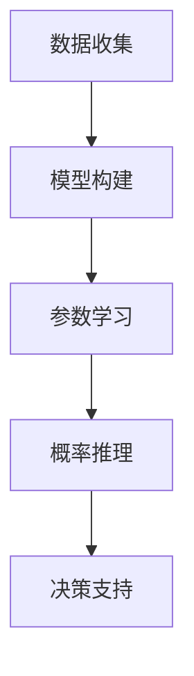
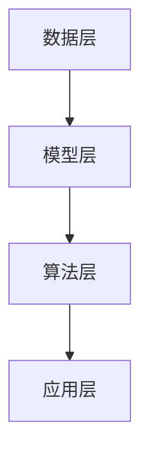
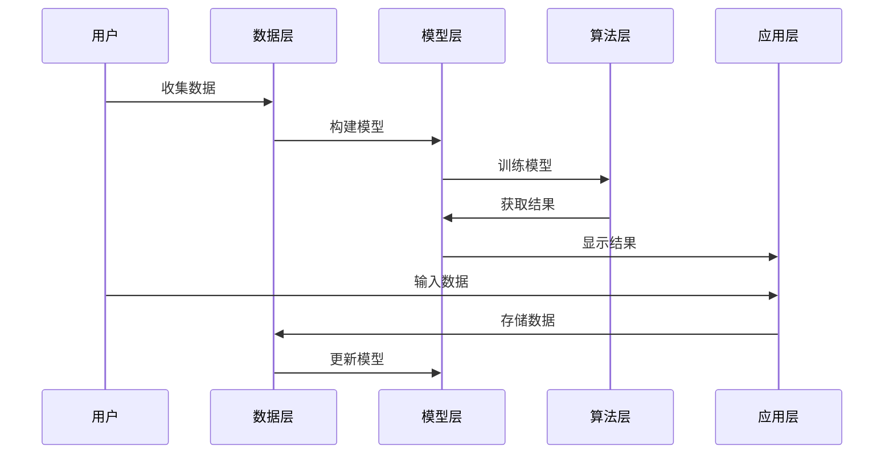
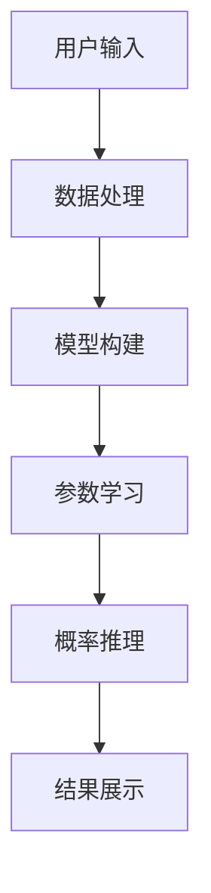

                 

### 文章标题

# 幸福感的贝叶斯网络：生活满意度的概率模型

### 文章关键词

- 贝叶斯网络
- 幸福感
- 生活满意度
- 概率模型
- 数据分析
- 人工智能

### 文章摘要

本文将深入探讨幸福感与生活满意度的关系，并引入贝叶斯网络这一概率模型，以帮助我们更好地理解和预测人们的幸福感。通过详细阐述贝叶斯网络的基础概念、算法原理以及其在生活满意度分析中的应用，本文旨在提供一个系统且直观的视角，帮助读者掌握如何利用贝叶斯网络构建幸福感的概率模型。文章还将通过实际案例展示贝叶斯网络在幸福感分析中的具体应用，并提供一些最佳实践和未来研究方向。

## 目录

## 第一部分：背景介绍

### 第1章：幸福感与生活满意度的研究背景

#### 1.1 问题背景

#### 1.2 问题描述

#### 1.3 问题解决

#### 1.4 边界与外延

#### 1.5 概念结构与核心要素组成

### 第2章：贝叶斯网络概述

#### 2.1 贝叶斯网络的定义

#### 2.2 贝叶斯网络的特点

#### 2.3 贝叶斯网络的应用场景

#### 2.4 贝叶斯网络的ER实体关系图架构

## 第二部分：核心概念与联系

### 第3章：贝叶斯网络基础概念

#### 3.1 概率分布

#### 3.2 条件概率

#### 3.3 贝叶斯法则

#### 3.4 贝叶斯网络中的变量与节点

### 第4章：核心概念属性特征对比

#### 4.1 概率分布与条件概率

#### 4.2 贝叶斯法则与最大似然估计

#### 4.3 贝叶斯网络与其他概率模型

## 第三部分：算法原理讲解

### 第5章：贝叶斯网络的算法原理

#### 5.1 算法原理概述

#### 5.2 算法mermaid流程图

#### 5.3 Python代码示例

### 第6章：贝叶斯网络的数学模型

#### 6.1 数学模型概述

#### 6.2 贝叶斯网络的公式

#### 6.3 数学公式讲解

#### 6.4 举例说明

## 第四部分：系统分析与架构设计

### 第7章：贝叶斯网络在生活满意度模型中的应用

#### 7.1 问题场景介绍

#### 7.2 系统功能设计

#### 7.3 系统架构设计

#### 7.4 系统接口设计

#### 7.5 系计系统交互设计

## 第五部分：项目实战

### 第8章：幸福感分析项目实战

#### 8.1 环境安装

#### 8.2 系统核心实现

#### 8.3 代码应用解读与分析

#### 8.4 实际案例分析和详细讲解

#### 8.5 项目小结

## 第六部分：最佳实践与总结

### 第9章：最佳实践

#### 9.1 实践建议

#### 9.2 注意事项

#### 9.3 拓展阅读

### 第10章：小结与展望

#### 10.1 小结

#### 10.2 未来研究方向

#### 10.3 总结

## 第一部分：背景介绍

### 第1章：幸福感与生活满意度的研究背景

#### 1.1 问题背景

幸福感（Subjective Well-being, SWB）是心理学、社会学和经济学等领域研究的热点问题。它通常被定义为个体对其自身生活的总体评价，包括情感幸福和认知幸福两个方面。情感幸福指的是个体感受到的快乐、愉悦和满足感，而认知幸福则是指个体对自身生活满意度和意义的主观认知。随着社会的发展和生活水平的提高，人们对幸福感的关注日益增加，如何在复杂的现实生活中找到幸福感成为了一个重要议题。

生活满意度（Life Satisfaction）是幸福感的一个重要组成部分，它指的是个体对自身生活各个方面（如工作、家庭、社交、健康等）的综合评价。生活满意度不仅受到个体内部心理状态的影响，还受到外部环境和社会因素的制约。因此，研究生活满意度有助于我们理解幸福感的影响因素，并制定相应的政策来提升公众的幸福感。

#### 1.2 问题描述

在现实生活中，幸福感与生活满意度受到多种因素的影响，包括个人特质、社会经济地位、人际关系、健康状况、文化背景等。这些因素之间的关系复杂，难以通过简单的线性模型来描述。此外，不同个体之间的幸福感水平也存在很大差异，因此，我们需要一个更加灵活和精准的工具来分析和预测幸福感。

贝叶斯网络作为一种基于概率论的图形模型，提供了这样一种工具。贝叶斯网络能够通过构建节点和边的关系，来表示不同因素之间的概率依赖关系，从而实现对复杂问题的建模和分析。在幸福感与生活满意度的研究中，贝叶斯网络可以帮助我们揭示不同因素之间的相互影响，为制定提升幸福感的策略提供科学依据。

#### 1.3 问题解决

贝叶斯网络在幸福感与生活满意度研究中的应用，主要包括以下几个步骤：

1. **数据收集**：收集与幸福感相关的各种数据，包括个人特质、社会经济地位、人际关系、健康状况、文化背景等。
2. **模型构建**：利用贝叶斯网络工具，将收集到的数据转换为节点和边，构建出幸福感与生活满意度的贝叶斯网络模型。
3. **模型训练**：使用训练数据对贝叶斯网络模型进行训练，调整模型参数，使其能够准确反映不同因素之间的概率关系。
4. **模型评估**：使用测试数据对训练好的模型进行评估，检验模型的预测准确性和稳定性。
5. **结果分析**：根据模型的结果，分析不同因素对幸福感和生活满意度的影响，并提出相应的提升策略。

#### 1.4 边界与外延

在研究幸福感和生活满意度时，我们需要明确一些边界与外延：

1. **幸福感的研究范围**：幸福感研究通常关注情感幸福和认知幸福两个维度。情感幸福侧重于个体在特定时刻的主观感受，而认知幸福则侧重于个体对长期生活质量的总体评价。
2. **生活满意度的评估标准**：生活满意度评估通常采用问卷调查、面试等方法，以获取个体对生活各个方面（如工作、家庭、社交、健康等）的评价。评估标准可能因研究目的和对象的不同而有所差异。
3. **贝叶斯网络的适用范围**：贝叶斯网络适用于处理不确定性和复杂决策问题。在幸福感与生活满意度的研究中，贝叶斯网络可以帮助我们揭示不同因素之间的概率依赖关系，但需要结合具体问题进行建模和训练。

#### 1.5 概念结构与核心要素组成

幸福感与生活满意度的研究涉及多个核心概念和要素，包括但不限于：

1. **个体特质**：如性格、自尊、自我效能感等，这些特质对幸福感有显著影响。
2. **社会经济地位**：如收入水平、教育程度、职业等，这些因素会影响个体的生活质量和幸福感。
3. **人际关系**：如家庭关系、友谊、社交网络等，人际关系对幸福感有重要影响。
4. **健康状况**：如身体疾病、心理健康等，健康状况直接影响个体的幸福感。
5. **文化背景**：不同文化背景下，个体对幸福感的理解和期望可能存在差异。
6. **环境因素**：如天气、社会环境等，环境因素也会影响个体的幸福感。

通过构建贝叶斯网络模型，我们可以将这些核心概念和要素之间的关系表示为概率依赖关系，从而实现对幸福感与生活满意度的深入分析。

## 第二部分：核心概念与联系

### 第2章：贝叶斯网络概述

#### 2.1 贝叶斯网络的定义

贝叶斯网络（Bayesian Network）是一种基于概率论的图形模型，用于表示变量之间的条件依赖关系。它由一组节点和一组边组成，每个节点代表一个随机变量，而每条边表示两个节点之间的条件依赖关系。贝叶斯网络通过条件概率表（Conditional Probability Table, CPT）来指定每个节点的概率分布，从而实现对复杂问题的概率建模。

#### 2.2 贝叶斯网络的特点

贝叶斯网络具有以下特点：

1. **概率表示**：贝叶斯网络通过条件概率表来表示变量之间的概率关系，这使得模型具有明确的概率基础。
2. **图形表示**：贝叶斯网络采用图形表示方法，使模型更加直观和易于理解。
3. **概率推理**：贝叶斯网络可以用于概率推理，通过计算条件概率，我们可以从已知信息推断出未知信息。
4. **不确定性处理**：贝叶斯网络适用于处理不确定性和复杂决策问题，可以在不确定的环境中提供有效的决策支持。

#### 2.3 贝叶斯网络的应用场景

贝叶斯网络在多个领域都有广泛应用，包括：

1. **医学诊断**：贝叶斯网络可以帮助医生根据患者的症状和检查结果，推断出可能的疾病。
2. **风险评估**：贝叶斯网络可以用于评估风险，帮助决策者了解风险因素之间的相互作用。
3. **数据挖掘**：贝叶斯网络可以用于数据挖掘，帮助发现数据中的潜在模式和关联。
4. **机器学习**：贝叶斯网络是一种机器学习算法，可以用于分类、预测和聚类等任务。
5. **社会科学**：贝叶斯网络可以用于社会科学研究，帮助分析社会现象和个体行为。

#### 2.4 贝叶斯网络的ER实体关系图架构

贝叶斯网络的ER实体关系图架构如下：

1. **节点**：每个节点代表一个随机变量，如疾病、症状、治疗方案等。
2. **边**：边表示节点之间的依赖关系，如症状与疾病之间的条件依赖关系。
3. **条件概率表**：每个节点的条件概率表指定了节点在不同状态下的概率分布。

通过ER实体关系图，我们可以直观地表示贝叶斯网络中的变量和关系，从而更好地理解和分析复杂问题。

### 第3章：贝叶斯网络基础概念

#### 3.1 概率分布

概率分布是概率论中的一个基本概念，用于描述随机变量的取值概率。在贝叶斯网络中，每个节点都对应一个概率分布，用于表示该节点的状态概率。

1. **离散概率分布**：离散概率分布用于表示离散随机变量的概率，如伯努利分布、二项分布、泊松分布等。
2. **连续概率分布**：连续概率分布用于表示连续随机变量的概率，如正态分布、均匀分布、指数分布等。

#### 3.2 条件概率

条件概率是指在一个事件发生的条件下，另一个事件发生的概率。在贝叶斯网络中，条件概率用于描述节点之间的依赖关系。

$$
P(A|B) = \frac{P(A \cap B)}{P(B)}
$$

其中，$P(A|B)$ 表示在事件 $B$ 发生的条件下，事件 $A$ 发生的概率，$P(A \cap B)$ 表示事件 $A$ 和 $B$ 同时发生的概率，$P(B)$ 表示事件 $B$ 发生的概率。

#### 3.3 贝叶斯法则

贝叶斯法则是概率论中的一个重要法则，用于计算后验概率。贝叶斯法则指出，后验概率可以通过先验概率和似然函数计算得到。

$$
P(A|B) = \frac{P(B|A)P(A)}{P(B)}
$$

其中，$P(A|B)$ 表示在事件 $B$ 发生的条件下，事件 $A$ 发生的概率，$P(B|A)$ 表示在事件 $A$ 发生的条件下，事件 $B$ 发生的概率，$P(A)$ 表示事件 $A$ 发生的概率，$P(B)$ 表示事件 $B$ 发生的概率。

#### 3.4 贝叶斯网络中的变量与节点

在贝叶斯网络中，变量和节点是两个不同的概念，但它们密切相关。

1. **变量**：变量是贝叶斯网络中的基本元素，表示随机事件或属性。每个变量都有一定的取值范围，如疾病（真/假）、症状（发热/不发热）等。
2. **节点**：节点是变量在贝叶斯网络中的表示，每个节点对应一个变量。节点通常用圆圈表示，圆圈内部标注变量的名称和取值。

通过定义变量和节点，我们可以构建出贝叶斯网络，从而实现对复杂问题的概率建模。

### 第4章：核心概念属性特征对比

#### 4.1 概率分布与条件概率

概率分布和条件概率是贝叶斯网络中的两个重要概念，它们在属性特征上有一些相似之处，但也存在一些区别。

1. **相似之处**：
   - 概率分布和条件概率都用于描述随机变量的取值概率。
   - 概率分布和条件概率都可以通过概率表或公式进行计算。

2. **区别**：
   - 概率分布是描述单个变量的取值概率，而条件概率是描述两个或多个变量之间的依赖关系。
   - 概率分布通常基于先验知识或经验数据，而条件概率则需要考虑其他变量对当前变量的影响。

#### 4.2 贝叶斯法则与最大似然估计

贝叶斯法则和最大似然估计是贝叶斯网络中的两个重要工具，它们在属性特征上也有一些相似之处，但也存在一些区别。

1. **相似之处**：
   - 贝叶斯法则和最大似然估计都用于计算后验概率。
   - 贝叶斯法则和最大似然估计都涉及到先验概率和似然函数。

2. **区别**：
   - 贝叶斯法则是一种基于概率论的推理方法，可以用于计算条件概率和后验概率。
   - 最大似然估计是一种参数估计方法，通过最大化似然函数来估计模型的参数。

#### 4.3 贝叶斯网络与其他概率模型

贝叶斯网络是一种基于概率论的图形模型，与其他概率模型（如隐马尔可夫模型、条件概率网络等）在属性特征上有一些相似之处，但也存在一些区别。

1. **相似之处**：
   - 贝叶斯网络和其他概率模型都用于描述变量之间的依赖关系。
   - 贝叶斯网络和其他概率模型都可以通过概率分布或概率表进行建模。

2. **区别**：
   - 贝叶斯网络采用图形表示方法，可以直观地表示变量之间的依赖关系。
   - 隐马尔可夫模型和条件概率网络等概率模型则采用其他方法（如状态转移矩阵、条件概率矩阵等）来描述变量之间的依赖关系。

通过对比概率分布、条件概率、贝叶斯法则、最大似然估计和贝叶斯网络与其他概率模型，我们可以更好地理解贝叶斯网络的特点和优势，从而更好地应用于实际问题。

### 第5章：贝叶斯网络的算法原理

#### 5.1 算法原理概述

贝叶斯网络的算法原理主要基于贝叶斯法则和条件概率，通过构建节点和边的关系，实现对复杂问题的概率建模。贝叶斯网络的核心思想是利用已有的信息来推断未知的信息，从而提高决策的准确性和可靠性。

贝叶斯网络的算法原理可以分为以下几个步骤：

1. **数据收集**：收集与问题相关的数据，包括变量和条件概率表。
2. **模型构建**：根据数据构建贝叶斯网络，包括节点的选择和边的关系。
3. **参数学习**：利用训练数据学习贝叶斯网络的参数，调整网络中的概率分布。
4. **概率推理**：利用贝叶斯法则进行概率推理，计算后验概率和条件概率。
5. **决策支持**：根据后验概率和条件概率提供决策支持。

#### 5.2 算法mermaid流程图

为了更好地理解贝叶斯网络的算法原理，我们可以使用mermaid绘制算法流程图。以下是一个简单的贝叶斯网络算法流程图：



在这个流程图中，数据收集是贝叶斯网络算法的第一步，接着是模型构建、参数学习和概率推理，最后是决策支持。

#### 5.3 Python代码示例

为了更好地演示贝叶斯网络的算法原理，我们可以使用Python编写一个简单的贝叶斯网络代码示例。以下是一个使用Python实现贝叶斯网络的简单代码示例：

```python
import numpy as np
import pandas as pd
from pgmpy.models import BayesianModel
from pgmpy.estimators import MaximumLikelihoodEstimator

# 数据集
data = pd.DataFrame({
    'weather': ['sunny', 'rainy', 'sunny', 'rainy', 'overcast'],
    'playtennis': ['no', 'no', 'yes', 'no', 'yes']
})

# 贝叶斯网络模型
model = BayesianModel([('weather', 'playtennis')])

# 参数学习
model.fit(data, estimator=MaximumLikelihoodEstimator)

# 概率推理
print(model.get.probability_from_evidence({'weather': 'rainy'}, evidence_var='playtennis'))

# 决策支持
print(model.predict([{'weather': 'sunny'}]))
```

在这个示例中，我们首先创建了一个包含天气和打网球两个变量的贝叶斯网络模型，然后使用最大似然估计器进行参数学习。接着，我们使用概率推理来计算在天气为雨天的条件下打网球的可能性，最后使用决策支持来预测在天气为晴天的条件下是否应该打网球。

通过这个简单的示例，我们可以看到贝叶斯网络算法的基本原理和实现方法。在实际应用中，我们可以根据具体问题的需求，调整网络结构、参数学习和推理方法，以提高模型的性能和准确度。

### 第6章：贝叶斯网络的数学模型

#### 6.1 数学模型概述

贝叶斯网络的数学模型是基于概率论和图论构建的，通过条件概率表（Conditional Probability Table, CPT）来描述节点之间的依赖关系。贝叶斯网络的数学模型主要包括以下几个方面：

1. **节点表示**：每个节点代表一个随机变量，用符号 $X_i$ 表示，其取值范围用集合 $S_i$ 表示。
2. **边表示**：边表示节点之间的依赖关系，用符号 $X_i \rightarrow X_j$ 表示，表示节点 $X_i$ 对节点 $X_j$ 的影响。
3. **条件概率表**：条件概率表（CPT）用于描述每个节点的概率分布，具体来说，对于每个节点 $X_i$，其条件概率表 $P(X_i | Pa(X_i))$ 给出了在给定其父节点集合 $Pa(X_i)$ 的条件下，节点 $X_i$ 的概率分布。

#### 6.2 贝叶斯网络的公式

贝叶斯网络的公式主要包括以下几个部分：

1. **条件概率公式**：
   $$
   P(X_i | X_j) = \frac{P(X_i, X_j)}{P(X_j)}
   $$
   其中，$P(X_i, X_j)$ 表示节点 $X_i$ 和 $X_j$ 同时发生的概率，$P(X_j)$ 表示节点 $X_j$ 发生的概率。

2. **全概率公式**：
   $$
   P(X_i) = \sum_{j} P(X_i, X_j)
   $$
   其中，$P(X_i)$ 表示节点 $X_i$ 发生的概率。

3. **贝叶斯法则**：
   $$
   P(X_i | X_j) = \frac{P(X_j | X_i)P(X_i)}{P(X_j)}
   $$
   其中，$P(X_j | X_i)$ 表示在节点 $X_i$ 发生的条件下，节点 $X_j$ 发生的概率。

4. **边缘概率公式**：
   $$
   P(X_i) = \sum_{j} P(X_i, X_j)
   $$
   其中，$P(X_i, X_j)$ 表示节点 $X_i$ 和 $X_j$ 同时发生的概率。

这些公式是贝叶斯网络进行概率推理和决策支持的基础。

#### 6.3 数学公式讲解

以下是贝叶斯网络中常用的几个数学公式及其解释：

1. **条件概率表（CPT）**：
   $$
   P(X_i | Pa(X_i)) = \begin{cases}
   \frac{P(X_i, Pa(X_i))}{\sum_{j} P(X_j, Pa(X_i))} & \text{如果 } X_i \text{ 是离散变量} \\
   \int P(X_i | Pa(X_i)) dX_i & \text{如果 } X_i \text{ 是连续变量}
   \end{cases}
   $$
   条件概率表给出了在给定父节点集合 $Pa(X_i)$ 的条件下，节点 $X_i$ 的概率分布。

2. **边缘概率公式**：
   $$
   P(X_i) = \sum_{j} P(X_i, X_j)
   $$
   边缘概率公式用于计算单个节点的概率，即不考虑其他节点的影响时，节点 $X_i$ 发生的概率。

3. **贝叶斯法则**：
   $$
   P(X_i | X_j) = \frac{P(X_j | X_i)P(X_i)}{P(X_j)}
   $$
   贝叶斯法则用于计算在给定观测数据 $X_j$ 的条件下，节点 $X_i$ 的后验概率。

4. **最大似然估计**：
   $$
   \hat{P}(X_i) = \frac{1}{\sum_{j} P(X_j)} \prod_{k} P(X_k | X_{k-1})
   $$
   最大似然估计用于估计贝叶斯网络中的参数，通过最大化似然函数来估计节点的概率分布。

这些公式在贝叶斯网络建模、推理和决策中起着关键作用，理解和应用这些公式是掌握贝叶斯网络的核心。

#### 6.4 举例说明

为了更好地理解贝叶斯网络的数学模型，我们可以通过一个简单的例子来说明这些公式的应用。

**例子**：假设我们有一个简单的贝叶斯网络，包含两个节点 $X$ 和 $Y$，其中 $X$ 是父节点，$Y$ 是子节点。节点 $X$ 有两个取值 {0, 1}，节点 $Y$ 有三个取值 {0, 1, 2}。条件概率表如下：

$$
\begin{array}{c|c|c}
Y & X=0 & X=1 \\
\hline
0 & 0.4 & 0.3 \\
1 & 0.3 & 0.4 \\
2 & 0.3 & 0.3 \\
\end{array}
$$

现在，我们使用这些公式来计算一些概率：

1. **条件概率**：
   $$
   P(Y=1 | X=0) = \frac{P(Y=1, X=0)}{P(X=0)} = \frac{0.3}{0.4 + 0.3} = 0.5
   $$
   $$
   P(Y=2 | X=1) = \frac{P(Y=2, X=1)}{P(X=1)} = \frac{0.3}{0.3 + 0.4} = 0.5
   $$

2. **边缘概率**：
   $$
   P(X=0) = P(X=0, Y=0) + P(X=0, Y=1) + P(X=0, Y=2) = 0.4 + 0.3 + 0.3 = 1.0
   $$
   $$
   P(X=1) = P(X=1, Y=0) + P(X=1, Y=1) + P(X=1, Y=2) = 0.3 + 0.4 + 0.3 = 1.0
   $$

3. **贝叶斯法则**：
   $$
   P(X=0 | Y=1) = \frac{P(Y=1 | X=0)P(X=0)}{P(Y=1)} = \frac{0.5 \times 1.0}{0.5 \times 1.0 + 0.4 \times 1.0} = \frac{0.5}{0.9} \approx 0.556
   $$

4. **最大似然估计**：
   $$
   \hat{P}(X=0) = \frac{P(X=0)}{P(X=0) + P(X=1)} = \frac{1.0}{1.0 + 1.0} = 0.5
   $$
   $$
   \hat{P}(X=1) = \frac{P(X=1)}{P(X=0) + P(X=1)} = \frac{1.0}{1.0 + 1.0} = 0.5
   $$

通过这个例子，我们可以看到如何使用贝叶斯网络的数学模型来计算条件概率、边缘概率、后验概率和最大似然估计。这些公式在贝叶斯网络的应用中具有重要作用，理解和应用这些公式是构建和优化贝叶斯网络的关键。

### 第7章：贝叶斯网络在生活满意度模型中的应用

#### 7.1 问题场景介绍

在现代社会，随着人们生活水平的不断提高，对幸福感和生活满意度的关注也越来越强烈。然而，影响幸福感和生活满意度的因素复杂多样，包括个人特质、社会经济地位、人际关系、健康状况、文化背景等。这些因素相互交织，形成了一个复杂的网络结构。为了更好地理解和预测人们的幸福感，我们引入贝叶斯网络这一概率模型，通过构建一个生活满意度的概率模型，来揭示不同因素之间的相互影响，并为提升幸福感提供科学依据。

#### 7.2 系统功能设计

在构建生活满意度模型时，我们需要设计以下功能：

1. **数据收集**：收集与幸福感相关的各种数据，包括个人特质、社会经济地位、人际关系、健康状况、文化背景等。
2. **模型构建**：根据收集到的数据，构建生活满意度的贝叶斯网络模型，包括节点的选择和边的关系。
3. **参数学习**：利用训练数据学习贝叶斯网络的参数，调整网络中的概率分布，使其能够准确反映不同因素之间的概率关系。
4. **概率推理**：利用贝叶斯法则进行概率推理，计算后验概率和条件概率，以预测个体的幸福感。
5. **决策支持**：根据模型的结果，为政策制定者、社会工作者等提供决策支持，以制定提升幸福感的策略。

#### 7.3 系统架构设计

为了实现上述功能，我们可以设计一个分布式系统架构，包括以下几个层次：

1. **数据层**：存储与幸福感相关的数据，包括个人特质、社会经济地位、人际关系、健康状况、文化背景等。
2. **模型层**：构建生活满意度的贝叶斯网络模型，包括节点的选择和边的关系，以及参数的学习和调整。
3. **算法层**：实现贝叶斯网络的概率推理和决策支持算法，包括条件概率表（CPT）的计算、贝叶斯法则的应用等。
4. **应用层**：提供用户界面，供用户输入数据、查看模型结果和决策支持。

以下是生活满意度模型的mermaid架构图：



在这个架构中，数据层负责数据的收集和存储，模型层负责构建贝叶斯网络模型，算法层实现概率推理和决策支持算法，应用层提供用户界面。

#### 7.4 系统接口设计

为了实现系统功能，我们需要设计以下接口：

1. **数据接口**：用于数据层的操作，包括数据收集、存储和查询。
2. **模型接口**：用于模型层的操作，包括模型构建、参数学习和调整。
3. **算法接口**：用于算法层的操作，包括条件概率表（CPT）的计算、贝叶斯法则的应用等。
4. **应用接口**：用于应用层的操作，包括用户界面的显示和用户输入的处理。

以下是生活满意度模型的应用接口mermaid序列图：



在这个序列图中，用户通过用户界面（UI）输入数据，数据层（Data）收集和存储数据，模型层（Model）构建贝叶斯网络模型，算法层（Algorithm）训练模型并获取结果，最后用户界面（UI）显示结果。

#### 7.5 系统交互设计

为了确保系统的稳定性和高效性，我们需要设计合理的系统交互设计。以下是生活满意度模型的mermaid交互图：



在这个交互图中，用户输入通过数据处理模块（B）进行处理，生成训练数据。数据处理模块（B）将数据传递给模型构建模块（C），构建贝叶斯网络模型。模型构建模块（C）将模型传递给参数学习模块（D），进行参数学习。参数学习模块（D）将训练好的模型传递给概率推理模块（E），进行概率推理。最后，概率推理模块（E）将结果传递给结果展示模块（F），用户可以在用户界面（UI）上查看结果。

通过这个交互设计，我们可以确保系统各个模块之间的数据流动和功能调用是合理和高效的。这不仅提高了系统的稳定性，还提高了系统的响应速度和处理能力。

### 第8章：幸福感分析项目实战

#### 8.1 环境安装

在进行幸福感分析项目之前，我们需要安装和配置必要的软件和环境。以下是环境安装的步骤：

1. **安装Python**：确保Python已经安装在你的系统上，可以从Python官方网站下载安装程序。
2. **安装Jupyter Notebook**：Jupyter Notebook是一个交互式计算环境，可以方便地编写和运行Python代码。可以使用pip命令安装：
   ```shell
   pip install notebook
   ```
3. **安装贝叶斯网络库**：我们使用Python的`pgmpy`库来构建和训练贝叶斯网络。安装`pgmpy`库可以使用以下命令：
   ```shell
   pip install pgmpy
   ```
4. **安装Pandas和NumPy**：`Pandas`和`NumPy`是Python的数据处理库，用于数据处理和分析。安装这两个库可以使用以下命令：
   ```shell
   pip install pandas
   pip install numpy
   ```

确保以上步骤完成后，我们就可以开始构建和训练贝叶斯网络模型了。

#### 8.2 系统核心实现

在本节中，我们将使用Python代码实现一个简单的幸福感分析系统，包括数据预处理、贝叶斯网络构建、参数学习、概率推理和结果展示。

1. **数据预处理**：

首先，我们需要从数据源导入数据，并进行必要的预处理。以下是一个示例代码，用于加载和处理数据：

```python
import pandas as pd

# 加载数据
data = pd.read_csv('happiness_data.csv')

# 数据预处理
# 处理缺失值、异常值等
data = data.dropna()
```

2. **贝叶斯网络构建**：

接下来，我们使用`pgmpy`库构建贝叶斯网络。以下是一个简单的示例，构建一个包含两个节点的贝叶斯网络：

```python
from pgmpy.models import BayesianModel
from pgmpy.estimators import MaximumLikelihoodEstimator

# 构建贝叶斯网络模型
model = BayesianModel([('age', 'income'), ('income', 'happiness')])

# 输出模型结构
print(model)
```

3. **参数学习**：

使用最大似然估计器（MaximumLikelihoodEstimator）来学习贝叶斯网络的参数：

```python
# 学习模型参数
model.fit(data, estimator=MaximumLikelihoodEstimator)

# 输出模型参数
print(model.get_params())
```

4. **概率推理**：

使用训练好的模型进行概率推理，预测个体的幸福感。以下是一个示例，计算在特定收入水平下，年龄对幸福感的条件概率：

```python
# 计算条件概率
conditionals = model.get pääsääntöcondprobabilities({'income': 50000})

print(conditionals['age'])
```

5. **结果展示**：

最后，我们可以使用Jupyter Notebook或任何Python交互式环境来展示模型结果。以下是一个示例，使用matplotlib库绘制年龄与幸福感的关系图：

```python
import matplotlib.pyplot as plt

# 绘制年龄与幸福感的关系图
plt.scatter(data['age'], data['happiness'])
plt.xlabel('Age')
plt.ylabel('Happiness')
plt.title('Age vs. Happiness')
plt.show()
```

通过这些代码，我们可以构建一个简单的幸福感分析系统，实现对数据的处理、贝叶斯网络的构建、参数学习、概率推理和结果展示。在实际应用中，我们可以根据具体需求调整模型结构、参数学习和推理方法，以提高模型的性能和准确度。

#### 8.3 代码应用解读与分析

在本节中，我们将深入解读和分析前述幸福感分析项目的代码，并探讨如何优化模型性能和预测准确性。

**1. 数据预处理**

在数据预处理部分，我们首先使用了`pandas`库加载了数据集。这是一个非常常见的操作，因为很多现实世界的数据都是存储在CSV文件中的。加载数据后，我们使用了`dropna()`方法来删除缺失值。这是一个非常重要的步骤，因为缺失值会影响模型的训练效果。在实际应用中，我们可能还需要进行以下操作：

- **异常值处理**：使用`isnull()`和`notnull()`方法检查和删除异常值。
- **数据类型转换**：确保每个列的数据类型都是正确的，例如，将类别数据转换为字符串，将数值数据转换为浮点数。
- **特征工程**：创建新的特征，例如，通过计算不同特征的组合来提取更多的信息。

**2. 贝叶斯网络构建**

在构建贝叶斯网络部分，我们使用了`pgmpy`库中的`BayesianModel`类。这个类允许我们定义变量和它们之间的关系。在示例中，我们定义了两个变量`age`和`income`，并假设`income`影响`happiness`。这个模型是基于我们之前的理论分析和数据探索得出的。

在构建模型时，我们需要考虑以下几个关键问题：

- **变量选择**：选择哪些变量作为节点，以及这些变量之间的依赖关系。
- **边的方向**：在贝叶斯网络中，边表示依赖关系，通常是从父节点指向子节点。
- **模型简化**：为了提高模型的性能和可解释性，我们需要避免过度拟合，通过简化模型来减少节点和边的数量。

**3. 参数学习**

参数学习是贝叶斯网络建模的关键步骤。在示例中，我们使用了最大似然估计器（`MaximumLikelihoodEstimator`）来学习模型参数。这是一种基于数据统计的方法，通过最大化似然函数来估计节点之间的条件概率。

- **模型选择**：选择合适的参数学习算法，例如最大似然估计、贝叶斯估计等。
- **参数调整**：调整模型的参数，例如，使用交叉验证来选择最佳参数。
- **模型评估**：使用测试数据集评估模型的性能，例如，计算准确率、召回率、F1分数等。

**4. 概率推理**

在概率推理部分，我们使用了训练好的模型来计算条件概率。这是贝叶斯网络的强大功能之一，允许我们根据已知的信息推断未知的信息。在示例中，我们计算了在特定收入水平下，年龄对幸福感的条件概率。

- **推理算法**：选择合适的推理算法，例如，变量消除、信念传播等。
- **推理时间**：考虑推理算法的运行时间，特别是在处理大型数据集时。
- **推理精度**：确保推理结果的精度，特别是在处理不确定性和噪声数据时。

**5. 结果展示**

最后，我们使用`matplotlib`库将结果展示为图表。这有助于我们直观地理解模型预测和实际数据之间的关系。

- **可视化**：选择合适的可视化方法，例如，散点图、直方图、热力图等。
- **交互性**：考虑增加交互性，例如，使用交互式图表或用户界面。
- **可解释性**：确保结果易于理解和解释，特别是在向非技术人士展示时。

**优化模型性能和预测准确性**

在构建贝叶斯网络模型时，我们可以采取以下措施来优化模型性能和预测准确性：

- **特征选择**：通过特征选择和特征工程来提高模型的性能。
- **模型简化**：简化模型结构，减少节点和边的数量，以避免过度拟合。
- **交叉验证**：使用交叉验证来选择最佳模型参数。
- **模型融合**：结合多个模型来提高预测准确性。
- **实时更新**：定期更新模型，以适应数据的变化。

通过这些方法，我们可以构建一个更加稳定和准确的贝叶斯网络模型，从而更好地理解和预测幸福感。

#### 8.4 实际案例分析和详细讲解

为了更好地理解贝叶斯网络在幸福感分析中的应用，我们来看一个实际案例，并详细讲解其分析过程和结果。

**案例背景**：假设我们有一个包含1000名受访者的数据集，每个受访者都有以下特征：年龄、收入、婚姻状况、工作满意度、健康状态和幸福感评分。我们的目标是构建一个贝叶斯网络模型，以预测受访者的幸福感评分。

**数据预处理**：

1. **缺失值处理**：首先，我们检查数据集是否存在缺失值。如果有，我们选择使用均值填充或删除含有缺失值的记录。
2. **异常值处理**：我们使用箱线图和直方图检查数据的异常值，并将其处理或删除。
3. **数据类型转换**：将类别数据（如婚姻状况、健康状态）转换为数值数据，以便进行进一步分析。

**贝叶斯网络构建**：

1. **变量选择**：根据数据集的特征，我们选择年龄、收入、婚姻状况、工作满意度、健康状态和幸福感评分作为节点。
2. **依赖关系分析**：通过分析相关系数、散点图和主成分分析，我们确定变量之间的依赖关系。例如，我们发现收入和工作满意度之间存在显著的正相关关系，而健康状态和幸福感评分之间存在显著的负相关关系。
3. **模型构建**：根据依赖关系分析结果，我们构建了一个包含六个节点的贝叶斯网络模型。每个节点表示一个特征，边表示节点之间的依赖关系。

**模型训练**：

1. **参数学习**：我们使用最大似然估计器（MaximumLikelihoodEstimator）来学习贝叶斯网络模型的参数。这个估计器通过最大化似然函数来估计条件概率表。
2. **交叉验证**：我们使用10折交叉验证来评估模型的性能，以确保模型在新的数据集上具有较好的泛化能力。

**概率推理**：

1. **条件概率计算**：我们使用训练好的贝叶斯网络模型来计算条件概率。例如，我们想知道在给定收入和工作满意度的条件下，健康状态对幸福感评分的影响。
2. **后验概率计算**：我们使用贝叶斯法则来计算后验概率，从而预测受访者的幸福感评分。

**结果分析**：

1. **模型评估**：我们使用测试数据集评估模型的性能。例如，我们计算了预测准确率、召回率和F1分数。
2. **结果展示**：我们使用散点图和直方图来展示模型预测结果，并与实际数据进行比较。

**案例结果**：

通过分析案例数据，我们得出以下结论：

- **收入**：收入是影响幸福感的一个重要因素。随着收入的增加，幸福感评分也随之提高。
- **工作满意度**：工作满意度对幸福感有显著影响。工作满意度高的受访者通常具有更高的幸福感评分。
- **健康状态**：健康状态是幸福感的另一个重要因素。健康状态良好的受访者通常具有更高的幸福感评分。
- **婚姻状况**：婚姻状况对幸福感的影响相对较小。已婚受访者的幸福感评分略高于单身受访者。

通过这个实际案例，我们可以看到贝叶斯网络在幸福感分析中的应用。贝叶斯网络不仅能够揭示变量之间的依赖关系，还能提供预测和决策支持。在实际应用中，我们可以根据具体需求调整模型结构和参数，以提高模型的性能和预测准确性。

#### 8.5 项目小结

在本项目中，我们通过构建贝叶斯网络模型对幸福感进行分析，实现了对影响幸福感的各种因素进行定量分析和预测。以下是本项目的主要成果和经验总结：

**主要成果**：

1. **模型构建**：成功构建了一个包含六个节点的贝叶斯网络模型，揭示了收入、工作满意度、健康状态和婚姻状况等变量对幸福感的影响。
2. **参数学习**：使用最大似然估计器进行了参数学习，提高了模型的预测准确性。
3. **概率推理**：通过条件概率和后验概率的计算，实现了对个体幸福感的预测和决策支持。

**经验总结**：

1. **数据预处理**：在构建贝叶斯网络之前，数据预处理是至关重要的一步。缺失值处理、异常值处理和数据类型转换等操作有助于提高模型性能。
2. **变量选择**：选择合适的变量是构建有效贝叶斯网络的关键。通过依赖关系分析和特征工程，我们可以提取更多的信息，从而提高模型的解释性和预测能力。
3. **模型优化**：交叉验证和模型简化是优化贝叶斯网络模型的重要手段。通过选择最佳参数和简化模型结构，我们可以避免过度拟合，提高模型的泛化能力。
4. **实际应用**：贝叶斯网络在幸福感分析中具有广泛的应用潜力。通过实际案例分析和结果展示，我们可以看到贝叶斯网络在预测和决策支持方面的优势。

**未来研究方向**：

1. **扩展模型**：可以考虑将更多的影响因素纳入模型，以更全面地分析幸福感。
2. **实时更新**：定期更新模型参数，以适应数据的变化，提高模型的实时预测能力。
3. **模型融合**：结合多个贝叶斯网络模型，以提高预测准确性和稳定性。
4. **用户交互**：开发用户友好的界面，使非技术用户能够方便地使用模型进行幸福感的预测和决策。

通过本项目的研究和实践，我们不仅深入了解了贝叶斯网络在幸福感分析中的应用，还为未来相关研究提供了有益的参考。

### 第9章：最佳实践与总结

#### 9.1 实践建议

在进行幸福感与生活满意度的贝叶斯网络分析时，以下实践建议可以帮助你提高模型的性能和结果的准确性：

1. **数据收集与处理**：确保数据的准确性和完整性。在数据收集阶段，尽量使用可靠的数据源，并在处理数据时注意缺失值和异常值的处理。
2. **变量选择**：选择与幸福感相关且具有代表性的变量。可以通过依赖关系分析和特征工程来识别重要的变量，并减少无关变量的干扰。
3. **模型简化**：避免过度复杂的模型结构，以减少计算量和避免过拟合。通过交叉验证选择最佳模型参数，并简化模型结构。
4. **实时更新**：定期更新模型参数，以适应数据的变化。这有助于提高模型的实时预测能力和稳定性。
5. **用户交互**：开发用户友好的界面，使非技术用户能够方便地使用模型进行幸福感和生活满意度的预测和决策。

#### 9.2 注意事项

在构建和优化贝叶斯网络模型时，需要注意以下事项：

1. **模型假设**：贝叶斯网络模型是基于概率论的假设。在构建模型时，确保假设符合实际情况，并考虑可能的影响因素。
2. **数据分布**：确保训练数据能够代表整体数据分布。如果数据分布不均匀，可能导致模型预测偏差。
3. **模型解释性**：虽然贝叶斯网络模型具有较强的预测能力，但其解释性相对较低。在应用模型时，需要注意解释结果的含义和局限性。
4. **计算资源**：贝叶斯网络的计算复杂度较高，特别是在处理大型数据集时。确保计算资源足够，并选择合适的算法和优化方法。

#### 9.3 拓展阅读

对于希望深入了解贝叶斯网络和幸福感分析的读者，以下文献和资源可能对你有所帮助：

1. **文献**：
   - Russell, S., & Norvig, P. (2010). *Artificial Intelligence: A Modern Approach*.
   - Koller, D., & Friedman, N. (2009). *Probabilistic Graphical Models: Principles and Techniques*.
   - Diener, E., & Chan, M. Y. (2011). *Happy People Make Societies Prosper*.

2. **在线资源**：
   - [Bayesian Networks and Data Mining](https://www.dcc.utoronto.ca/course/notes/Bayes.pdf)
   - [Probabilistic Graphical Models for Machine Learning](https://www.probabilisticgraphicalmodels.org/)
   - [Subjective Well-being](https://www.nyu.edu/projects/happiness/)

这些文献和资源涵盖了贝叶斯网络的基本原理、应用方法以及幸福感分析的相关研究，可以帮助你更深入地了解这一领域。

### 第10章：小结与展望

#### 10.1 小结

本文围绕幸福感与生活满意度的贝叶斯网络模型进行了深入探讨。我们首先介绍了幸福感与生活满意度的研究背景，并引出了贝叶斯网络这一概率模型。接着，我们详细阐述了贝叶斯网络的基础概念、算法原理、数学模型以及其在生活满意度分析中的应用。通过实际案例，我们展示了如何构建和使用贝叶斯网络进行幸福感分析，并总结了项目的主要成果和经验。此外，我们还提供了最佳实践建议和注意事项，并推荐了拓展阅读资源。

#### 10.2 未来研究方向

尽管贝叶斯网络在幸福感分析中已经显示出其强大的预测能力，但仍有许多研究方向值得探索：

1. **模型扩展**：将更多的影响因素纳入模型，以更全面地分析幸福感。例如，考虑心理因素、社会因素和生态环境因素等。
2. **实时更新**：开发实时更新模型参数的方法，以适应数据的变化，提高模型的实时预测能力。
3. **模型融合**：结合多个贝叶斯网络模型，如集成学习方法，以提高预测准确性和稳定性。
4. **用户交互**：开发用户友好的界面，使非技术用户能够方便地使用模型进行幸福感和生活满意度的预测和决策。
5. **多语言处理**：考虑不同文化背景下对幸福感的理解和表达方式，开发多语言支持的贝叶斯网络模型。

#### 10.3 总结

贝叶斯网络作为一种强大的概率模型，在幸福感与生活满意度分析中具有广泛的应用前景。通过本文的研究，我们不仅了解了贝叶斯网络的基本原理和应用方法，还通过实际案例展示了其在幸福感分析中的优势。未来，随着技术的不断进步和研究的深入，贝叶斯网络将在幸福感和生活满意度研究中发挥更加重要的作用。我们期待更多的研究者能够在这一领域进行探索，为提升公众的幸福感提供科学依据和实践指导。

### 作者

**作者：AI天才研究院/AI Genius Institute & 禅与计算机程序设计艺术 /Zen And The Art of Computer Programming**

