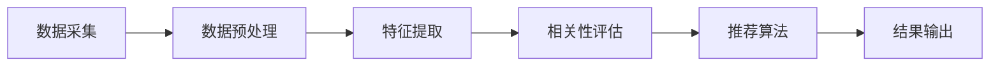
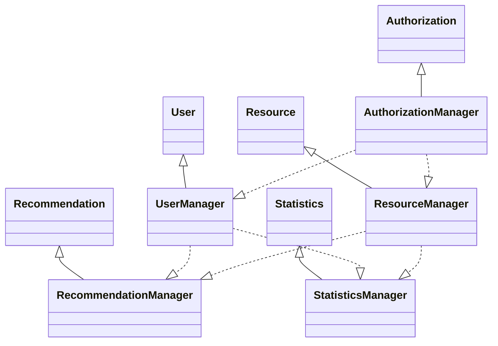
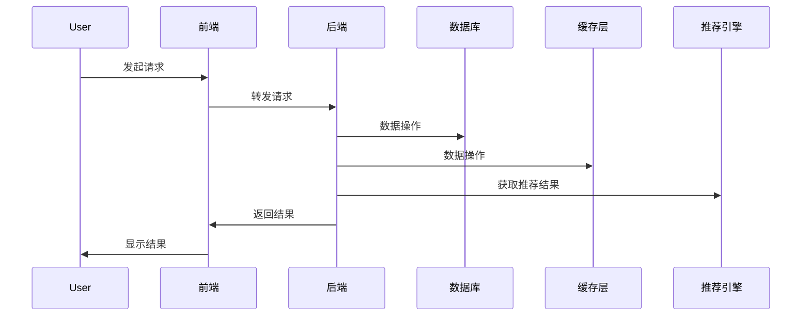
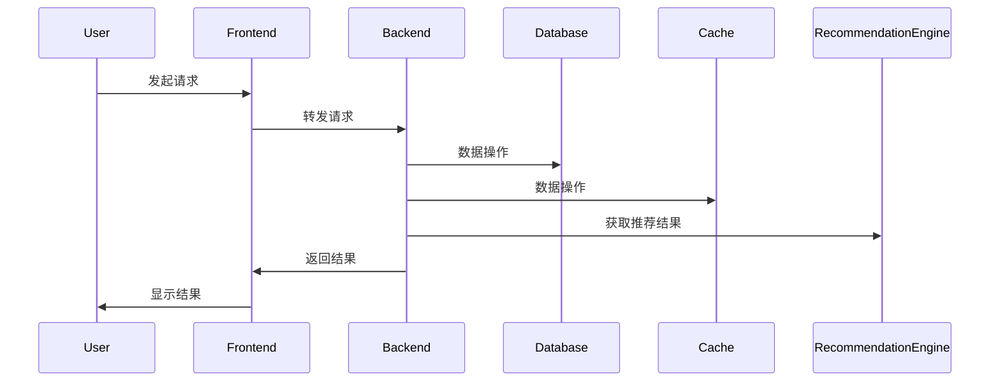

                 

### 第一部分：背景介绍

#### 1.1 问题背景

##### 1.1.1 开放获取运动的起源

开放获取（Open Access，简称OA）运动的起源可以追溯到20世纪90年代。当时，互联网的发展使得信息的传播速度和范围大大提升，但学术出版领域依然被传统的订阅模式所主导。这种模式使得大量的科研论文和知识成果被限制在订阅费用高昂的学术期刊内，普通科研人员和公众难以获取。学术界和公众开始意识到，这种知识壁垒不利于知识的传播和全球范围的世界理解。

1991年，奥地利物理学家彼得·林奇（Peter Suber）首次提出了开放获取的概念。1998年，布达佩斯开放获取倡议（Budapest Open Access Initiative，BOAI）正式发布，标志着开放获取运动的正式开始。倡议提出，学术文章应在出版后立即，并且免费地对所有人开放阅读和重用，从而消除知识壁垒，促进全球范围内的知识传播和共享。

##### 1.1.2 知识壁垒的现状

目前，全球范围内的知识壁垒依然存在，且形式多样。首先，学术期刊的高订阅费用使得许多大学和研究机构难以负担，导致学生和公众无法访问这些重要的科研资源。其次，许多学术成果在发表后仍然受到版权限制，无法被广泛引用和重用，限制了知识的进一步传播和应用。

此外，知识壁垒还体现在不同国家和地区之间。发达国家由于资金充足，科研资源相对丰富，而发展中国家由于经费有限，科研人员难以获取到先进的知识和技术。这种不平等的现象加剧了全球范围内的知识鸿沟。

##### 1.1.3 开放获取运动的目标与意义

开放获取运动的目标是消除知识壁垒，促进全球范围内的知识传播和共享。具体来说，开放获取运动旨在：

1. **提高科研透明度**：开放获取使得科研结果能够更快速、更广泛地传播，研究人员可以更容易地访问和引用他人的研究成果，从而促进科研的进步。

2. **提升科研效率**：开放获取使得科研成果更容易被公众和企业了解和应用，有助于推动科研成果的转化和应用，提升整个社会的科研效率。

3. **促进全球知识共享**：开放获取打破了地域和资源的限制，使得全球范围内的科研人员和学生都能够平等地获取到重要的科研资源，缩小了全球知识鸿沟。

4. **增强科研诚信**：开放获取使得科研结果更透明，更容易接受同行的监督和审查，有助于提高科研的诚信度。

5. **推动学术生态系统的变革**：开放获取运动不仅影响学术出版领域，也推动了学术评价体系的变革，鼓励科研人员更注重研究成果的质量和影响力，而不仅仅是发表论文的数量。

总的来说，开放获取运动对于推动全球范围内的知识传播和共享，促进全球理解具有重要的意义。通过开放获取，我们可以消除知识壁垒，让知识真正成为全人类共同的财富。

#### 1.2 核心概念

##### 1.2.1 开放获取的定义

开放获取（Open Access，简称OA）是一种学术出版模式，其核心目标是使学术成果在出版后立即、免费且开放地提供给所有人。具体来说，开放获取要求：

1. **自由获取**：任何人都可以免费地在线访问学术成果，无需支付任何费用。
2. **自由复制**：任何人都可以复制和分发学术成果，用于个人学习和研究。
3. **自由分发**：任何人都可以自由地分发学术成果，通过电子邮件、社交媒体等渠道分享。
4. **自由节选**：任何人都可以自由地节选和引用学术成果的部分内容，用于学术交流和研究。

开放获取的定义主要来源于布达佩斯开放获取倡议（BOAI），该倡议明确了开放获取的三个核心标准：

1. **无障碍获取**：学术成果应在出版后立即、免费地对所有人开放。
2. **无许可的使用**：学术成果的使用不应受到任何限制，任何人都可以自由地复制、分发、引用。
3. **自由再利用**：学术成果应允许任何人进行合法的再利用，包括修改和衍生作品。

##### 1.2.2 开放获取与知识共享的关系

开放获取与知识共享（Knowledge Sharing）密切相关，但两者不完全相同。知识共享是指个体或集体在特定环境下，通过各种手段和工具，将知识传递给他人的过程。而开放获取则是知识共享的一种实现方式，它通过消除获取知识的障碍，使得知识更广泛、更快速地传播。

1. **开放获取促进知识共享**：开放获取运动通过降低知识获取的成本和障碍，使得更多的个体和机构能够获取到重要的学术资源，从而促进知识共享。开放获取使得知识传播更加高效，使得知识在不同领域、不同地区、不同文化之间更容易流动。

2. **知识共享推动开放获取**：知识共享的需求促使开放获取运动的兴起。科研人员和学生希望能够自由地获取和共享知识，推动开放获取模式的发展。同时，知识共享的成功实践也为开放获取提供了有力的支持，证明了开放获取的可行性和价值。

##### 1.2.3 开放获取的边界与外延

开放获取的边界主要涉及以下几个方面：

1. **内容范围**：开放获取主要针对学术成果，如科研论文、报告、书籍等。然而，开放获取的理念可以扩展到其他领域的知识成果，如艺术作品、技术标准、政府文件等。

2. **时间范围**：开放获取强调成果的即时开放，但不同领域和机构可能有不同的开放时间要求。有些机构要求在成果发表后立即开放，而有些机构则可能允许存在一定的时间延迟。

3. **地域范围**：开放获取旨在消除地域和资源的限制，使得全球范围内的个体和机构都能够平等地获取知识。然而，实际操作中，由于网络基础设施和资金限制，某些地区的开放获取实施可能面临挑战。

4. **形式范围**：开放获取不仅包括在线免费获取，还包括开放获取期刊、预印本库、数据共享平台等多种形式。随着技术的发展，开放获取的形式也在不断扩展和丰富。

总的来说，开放获取是一个多维度的概念，其核心在于消除知识获取的障碍，促进全球范围内的知识传播和共享。通过明确开放获取的定义、关系和边界，我们可以更好地理解和推动开放获取运动的发展。

#### 1.3 概念结构与核心要素组成

##### 1.3.1 开放获取的主要形式

开放获取有几种主要的形式，每种形式都有其独特的特点和适用场景：

1. **开放获取期刊（Open Access Journals）**：这是最常见的开放获取形式，期刊的所有内容在出版后都是免费的，任何人都可以无障碍地访问和阅读。这种模式由作者或出版社付费，通常被称为“金途径”（Gold Open Access）。一些知名的开放获取期刊包括`PLOS`、`BioMed Central`等。

2. **绿途径（Green Open Access）**：这种形式允许作者在发表论文后，将论文存放在机构或个人的预印本库中，供公众免费访问。然而，这些预印本库通常不提供全文免费访问，而是提供论文的摘要或引用信息。这种模式通常不涉及期刊的额外费用。

3. **自存档（Self-Archiving）**：作者将自己的论文存放在个人或机构的网站上，供公众访问。这种方式不需要期刊的参与，但可能会违反某些期刊的版权政策。

4. **开放数据（Open Data）**：开放获取不仅适用于文献，也适用于研究数据。开放数据使得研究人员可以无障碍地访问和重用他人产生的研究数据，促进数据的透明性和可重复性。

##### 1.3.2 开放获取的关键参与者

开放获取运动的成功离不开以下几个关键参与者的努力：

1. **作者**：作为知识的生产者，作者的参与至关重要。开放获取期刊通常要求作者支付出版费（Article Processing Charges，APCs），而绿途径和自存档则允许作者在不支付费用的情况下，将论文存放在预印本库或个人网站上。

2. **出版社**：许多传统出版社也开始转型，提供开放获取服务。这些出版社通过收取出版费或获得其他资助，来支持开放获取期刊的运营。

3. **机构**：大学、研究所等机构扮演着重要角色，它们提供资金和技术支持，帮助研究人员实现开放获取。许多机构还建立了预印本库和机构知识库，以促进知识的共享和传播。

4. **图书馆**：图书馆作为知识的保管者和传播者，积极参与开放获取运动。它们提供资源和服务，帮助用户获取开放获取资源，并支持开放获取期刊的订阅和推广。

5. **资助机构**：政府和非政府组织等资助机构也扮演着关键角色，它们通过提供资金和指导，支持开放获取项目和计划的实施。

##### 1.3.3 开放获取的技术与工具

开放获取的实现离不开一系列技术和工具的支持，主要包括以下几个方面：

1. **预印本库（Preprint Servers）**：如`arXiv`、`bioRxiv`等，这些平台允许研究人员在发表论文前，将研究成果以预印本的形式发布，供公众免费访问。

2. **开放获取期刊平台**：如`PLOS`、`SpringerOpen`等，这些平台专门发布开放获取期刊，提供免费阅读和下载服务。

3. **机构知识库（Institutional Repositories，IRs）**：如`Dspace`、`Fedora`等，这些系统帮助机构管理和保存其研究人员的学术成果，并提供开放获取服务。

4. **数据共享平台**：如`Figshare`、`Zenodo`等，这些平台专门用于存储和分享研究数据，促进数据的开放获取和重用。

5. **数字版权管理（Digital Rights Management，DRM）**：虽然开放获取强调无障碍获取，但一些开放获取期刊和机构可能使用DRM技术，来保护知识产权，确保内容的合法使用。

通过上述技术和工具的支持，开放获取运动得以顺利实施，促进了全球范围内的知识传播和共享。

#### 1.4 开放获取运动的挑战与机遇

##### 1.4.1 面临的挑战

尽管开放获取运动在推动知识传播和共享方面取得了显著成效，但其发展过程中仍然面临一系列挑战：

1. **经济压力**：开放获取期刊通常要求作者支付出版费（APCs），这对一些经费有限的科研人员和机构来说是一个巨大的经济负担。此外，一些传统出版社也通过高价订阅服务获取利润，使得开放获取运动在财务上面临压力。

2. **版权问题**：开放获取涉及大量的版权问题。一些期刊和出版社可能对作者的版权持有不同意见，导致开放获取的推进受阻。此外，知识产权的保护也是一个复杂的问题，需要平衡开放获取和版权所有者的利益。

3. **技术障碍**：开放获取的实施需要一定的技术支持，如预印本库、机构知识库和数字版权管理技术等。这些技术可能存在兼容性、稳定性和安全性等问题，需要进一步发展和完善。

4. **文化差异**：不同国家和地区在开放获取的接受程度和实施方式上存在显著差异。一些发展中国家由于网络基础设施和科研经费的限制，开放获取的实施面临更多困难。

5. **学术评价体系**：目前的学术评价体系主要基于期刊的影响因子和论文数量，这可能导致科研人员为了追求高影响因子，而放弃开放获取的出版途径。开放获取运动需要推动学术评价体系的变革，以更好地反映科研成果的质量和影响力。

##### 1.4.2 赋予的机遇

尽管面临诸多挑战，开放获取运动也赋予了许多机遇，这些机遇不仅有助于克服现有问题，还能推动知识传播和共享的进一步发展：

1. **降低知识获取成本**：开放获取使得学术资源更广泛、更廉价地传播，使得更多的科研人员和公众能够获取到重要的研究成果，从而降低知识获取的门槛。

2. **促进全球科研合作**：开放获取打破了地域和资源的限制，促进了全球范围内的科研合作。研究人员可以更容易地访问和引用他人的研究成果，推动跨学科和跨国界的科研合作。

3. **提升科研透明度和诚信度**：开放获取使得科研成果更透明，更容易接受同行的监督和审查，有助于提高科研的诚信度。研究人员和机构也可以更便捷地公开其科研过程和数据，增强科研的透明性和可信度。

4. **推动学术生态系统的变革**：开放获取运动推动了学术出版和评价体系的变革。科研人员和研究机构开始更加关注研究成果的质量和影响力，而不仅仅是论文的数量和期刊的影响因子。

5. **促进数据共享和创新**：开放获取不仅适用于文献，也适用于研究数据。开放数据使得研究人员可以更容易地访问和重用他人产生的研究数据，促进数据的透明性和可重复性，推动创新和发展。

总的来说，开放获取运动既面临挑战，又赋予了许多机遇。通过克服这些挑战，利用这些机遇，我们可以更好地推动全球范围内的知识传播和共享，促进世界理解。

##### 1.4.3 潜在影响

开放获取运动对全球知识传播和科研合作产生了深远的影响，这些影响不仅体现在学术界，还延伸到社会各个层面：

1. **学术成果的传播**：开放获取使得学术成果的传播速度和范围大大提升。研究人员和学生可以更便捷地获取和引用最新的科研成果，加速知识的积累和应用。

2. **科研合作的促进**：开放获取打破了地域和资源的限制，促进了全球范围内的科研合作。研究人员可以更容易地访问和利用他人的研究成果，推动跨学科和跨国界的科研合作。

3. **知识传播的平等性**：开放获取使得全球范围内的个体和机构能够平等地获取重要的科研资源，缩小了全球知识鸿沟。这有助于提升发展中国家的科研水平，推动全球科技均衡发展。

4. **学术评价体系的变革**：开放获取推动了学术评价体系的变革，鼓励科研人员更注重研究成果的质量和影响力，而不仅仅是论文的数量和期刊的影响因子。

5. **科研诚信的提升**：开放获取使得科研结果更透明，更容易接受同行的监督和审查，有助于提高科研的诚信度。研究人员和机构可以更便捷地公开其科研过程和数据，增强科研的可信度和透明度。

6. **知识应用和转化的加速**：开放获取促进了科研成果的转化和应用，使得更多的企业和公众能够了解和利用最新的科研进展，推动科技进步和社会发展。

总的来说，开放获取运动通过消除知识壁垒，促进了全球范围内的知识传播和共享，对学术界和社会产生了深远的影响。这些影响不仅体现在科研水平和成果的传播上，还促进了全球科技合作和社会进步。

##### 1.5 本章小结

在本章中，我们深入探讨了开放获取运动的背景、核心概念、挑战与机遇以及潜在影响。通过分析，我们了解到开放获取运动的起源和发展历程，明确了其定义和主要形式。同时，我们也看到了开放获取运动在消除知识壁垒、促进全球知识传播和科研合作方面的重要作用。尽管面临经济、版权、技术等挑战，但开放获取运动赋予了许多机遇，推动了学术生态系统的变革。通过理解这些核心概念和背景，我们可以更好地把握开放获取运动的发展趋势，为未来的知识传播和共享贡献力量。

### 第二部分：核心概念与联系

在上一部分，我们详细介绍了开放获取运动的背景、核心概念及其面临的挑战与机遇。在这一部分，我们将进一步探讨开放获取运动的原理，并通过对比分析、ER实体关系图以及实践经验，加深对开放获取运动的理解。

#### 2.1 开放获取原理

##### 2.1.1 开放获取的基本原则

开放获取运动基于一系列基本原则，这些原则指导着开放获取的实现和发展：

1. **自由获取**：任何人都可以免费地在线访问学术成果，无需支付任何费用。这一原则保证了知识的公平性和普及性，使得更多的人能够平等地获取到重要的科研资源。

2. **无障碍使用**：学术成果的使用不应受到任何限制，任何人都可以自由地复制、分发、引用。这一原则确保了知识的自由流动，促进了学术交流和知识共享。

3. **自由再利用**：学术成果应允许任何人进行合法的再利用，包括修改和衍生作品。这一原则鼓励了学术创新和知识融合，推动了科研的进步和发展。

4. **透明性和可追踪性**：开放获取要求学术成果的发布和传播过程具有透明性和可追踪性。这有助于确保科研过程的诚信性，提高科研成果的可信度和影响力。

5. **版权友好**：开放获取在保障知识自由传播的同时，也要尊重知识产权。这意味着开放获取期刊和平台需要遵守相关的版权法律法规，确保内容的合法使用和传播。

##### 2.1.2 开放获取的技术实现

开放获取的技术实现涉及多个方面，包括预印本库、机构知识库、开放获取期刊平台和数字版权管理技术等：

1. **预印本库**：预印本库是研究人员在发表论文前，将研究成果以预印本的形式发布到线上平台。这些预印本库通常提供免费访问和下载服务，如`arXiv`、`bioRxiv`等。预印本库不仅促进了科研成果的早期传播，还提高了研究的透明性和可重复性。

2. **机构知识库**：机构知识库（IRs）是大学、研究所等机构建立的用于存储和管理其学术成果的系统。机构知识库允许研究人员将他们的学术论文、报告、书籍等成果存储在机构的网站上，并提供开放获取服务。这些知识库有助于提升机构的研究影响力和知识传播效果。

3. **开放获取期刊平台**：开放获取期刊平台是专门发布开放获取期刊的系统，如`PLOS`、`SpringerOpen`等。这些平台通过收取出版费（APCs）或获得其他资助，支持开放获取期刊的运营，使得学术成果在出版后即可免费获取。

4. **数字版权管理技术**：虽然开放获取强调无障碍获取，但某些情况下需要使用数字版权管理（DRM）技术来保护知识产权。DRM技术可以限制内容的复制、分发和修改，确保内容的合法使用。

##### 2.1.3 开放获取的法律与伦理问题

开放获取在推动知识传播和共享的同时，也涉及一系列法律和伦理问题：

1. **版权问题**：开放获取涉及大量的版权问题，包括作者对成果的版权、期刊和出版社的版权等。开放获取期刊和平台需要明确版权政策，确保内容的合法使用和传播。

2. **知识产权保护**：开放获取需要平衡知识传播和知识产权保护。一些开放获取期刊和平台可能采用DRM技术来保护知识产权，确保内容的合法使用。

3. **伦理问题**：开放获取需要遵守伦理规范，包括保护研究对象的隐私、确保科研过程的公正性和透明性等。研究人员和机构在实施开放获取时，需要遵守相关的伦理准则。

4. **学术诚信**：开放获取使得科研成果的传播更加透明，提高了学术诚信的要求。研究人员和机构需要确保科研过程和成果的诚信性，避免抄袭、伪造和篡改等学术不端行为。

#### 2.2 概念属性特征对比表格

为了更好地理解开放获取与相关概念的区别和联系，我们可以通过对比表格来分析开放获取与其他知识传播方式的属性特征：

| 概念        | 定义                                                         | 特点                                                         | 关联开放获取的方式 |
| ----------- | ------------------------------------------------------------ | ------------------------------------------------------------ | ----------------- |
| 开放获取    | 学术成果在出版后立即、免费且开放地提供给所有人               | 自由获取、无障碍使用、自由再利用                             | 开放获取期刊、预印本库、机构知识库 |
| 版权保护    | 知识产权所有者对其作品的复制、分发、展示、表演、播放、广播等行为进行控制 | 限制知识传播，保护知识产权                                   | 数字版权管理技术  |
| 知识共享    | 个人或集体通过各种手段和工具，将知识传递给他人                | 强调知识的共享和传播，但不一定涉及获取权限                     | 开放获取、协作平台 |
| 知识传播    | 知识从源头到受众的传递过程                                  | 涉及知识获取、共享、应用等多个环节                           | 传统学术出版、社交媒体 |
| 数据开放    | 研究数据在出版后立即、免费且开放地提供给所有人               | 自由获取、无障碍使用、自由再利用                             | 开放数据平台      |

通过上述对比表格，我们可以清晰地看到开放获取与其他知识传播方式的区别和联系。开放获取强调知识的自由获取和共享，与知识共享和数据开放密切相关，而版权保护和知识传播则更侧重于知识产权的保护和知识的传递过程。

#### 2.3 ER实体关系图架构

为了更直观地展示开放获取系统中的主要实体及其关系，我们可以通过ER实体关系图来表示：

```mermaid
erDiagram
    Author ||--|{ Journal }|-- Publication
    Author ||--|{ Repository }|-- Article
    Publisher ||--|{ Journal }|-- Publication
    Repository ||--|{ Repository }|-- Article
    Article ||--|{ Reference }|-- Publication
```

**ER实体关系图解释：**

1. **Author（作者）**：作者作为知识的生产者，与`Journal`（期刊）和`Repository`（知识库）实体之间存在关系。作者将论文提交给期刊进行出版，并将论文存入知识库以实现开放获取。

2. **Journal（期刊）**：期刊作为开放获取期刊的出版平台，与`Publication`（出版物）实体相关联。期刊负责出版和传播学术成果，确保其内容符合学术标准。

3. **Repository（知识库）**：知识库作为学术成果的存储和管理平台，与`Article`（论文）实体关联。知识库提供开放获取服务，使得学术论文可以免费获取和引用。

4. **Publication（出版物）**：出版物是开放获取系统中的核心实体，包括论文、报告、书籍等形式。出版物与作者、期刊、知识库等实体之间存在复杂的关联关系。

5. **Reference（引用）**：引用表示学术论文之间的相互引用关系，有助于构建学术论文之间的知识网络。

通过上述ER实体关系图，我们可以清晰地看到开放获取系统中各实体的关联及其在知识传播过程中的作用。ER实体关系图的Mermaid表示使得我们可以方便地展示和解析开放获取系统的复杂关系。

#### 2.4 开放获取的实践经验

##### 2.4.1 成功案例介绍

开放获取运动在多个领域取得了显著的成果，以下是一些成功的开放获取实践案例：

1. **生物医学领域**：`PLOS`（公共图书馆科学）是一家知名的开放获取出版社，其期刊包括`PLOS ONE`、`PLOS Computational Biology`等，涵盖广泛的生物医学领域。`PLOS`通过收取出版费（APCs）支持开放获取期刊的运营，使其研究成果得到了广泛的关注和应用。

2. **计算机科学领域**：`arXiv`是一个著名的预印本库，涵盖计算机科学、物理学、数学等多个学科领域。`arXiv`允许研究人员在发表论文前，将研究成果以预印本的形式发布，为全球范围内的研究人员提供了免费的学术资源。

3. **社会科学领域**：`SSRN`（社会科学研究网络）是一家提供开放获取的电子期刊和预印本服务的平台，涵盖了经济学、社会学、政治学等多个社会科学领域。`SSRN`通过其高效的传播机制，促进了社会科学研究的交流和应用。

4. **开放数据领域**：`Zenodo`是一个由CERN运营的开放数据共享平台，提供了大量的开放数据集，涵盖了物理学、生命科学、社会科学等多个领域。`Zenodo`通过提供免费的数据存储和共享服务，推动了开放数据的应用和创新。

这些成功案例展示了开放获取在不同领域的广泛应用和显著成效，为开放获取运动的推进提供了有力的支持。

##### 2.4.2 挑战与解决策略

在推进开放获取运动的过程中，面临着一系列挑战，以下是一些主要挑战及其解决策略：

1. **经济压力**：开放获取期刊通常要求作者支付出版费（APCs），这对一些经费有限的科研人员和机构来说是一个巨大的经济负担。解决策略包括：

   - **多元化资金来源**：通过政府资助、机构支持、慈善捐赠等多种途径，为开放获取期刊提供稳定的资金支持。
   - **降低出版费**：通过技术创新和运营效率提升，降低开放获取期刊的出版费，减轻作者的经济负担。

2. **版权问题**：开放获取涉及大量的版权问题，包括作者对成果的版权、期刊和出版社的版权等。解决策略包括：

   - **明确版权政策**：开放获取期刊和平台应明确版权政策，确保内容的合法使用和传播。
   - **版权合作**：与版权所有者建立合作关系，确保开放获取过程中的版权权益得到尊重和保护。

3. **技术障碍**：开放获取的实施需要一定的技术支持，如预印本库、机构知识库和数字版权管理技术等。解决策略包括：

   - **技术培训与支持**：为研究人员和机构提供开放获取技术培训和支持，提高他们的技术能力。
   - **技术创新**：通过技术研发和合作，不断优化开放获取技术和工具，提高系统的稳定性和安全性。

4. **文化差异**：不同国家和地区在开放获取的接受程度和实施方式上存在显著差异。解决策略包括：

   - **文化交流与推广**：加强不同国家和地区之间的文化交流，推广开放获取的理念和实践。
   - **适应性策略**：根据不同国家和地区的实际情况，制定适应性强的开放获取策略，确保开放获取的顺利实施。

通过上述解决策略，可以有效地应对开放获取运动过程中面临的挑战，推动全球范围内的知识传播和共享。

##### 2.4.3 未来发展方向

开放获取运动在未来的发展中将面临新的机遇和挑战，以下是一些未来发展方向：

1. **政策支持**：政府和非政府组织将加强对开放获取运动的政策支持，通过制定相关法律法规和提供资金支持，推动开放获取的全面实施。

2. **技术进步**：随着技术的不断发展，开放获取将在数据开放、人工智能、区块链等领域得到更广泛的应用。新的技术和工具将进一步提高开放获取的效率和安全。

3. **跨学科合作**：开放获取将促进不同学科之间的合作，推动跨学科研究和知识整合，提升科研的整体水平。

4. **全球共享**：开放获取将进一步缩小全球知识鸿沟，促进全球范围内的知识共享和科技合作，推动全球科技均衡发展。

5. **学术评价体系变革**：开放获取将推动学术评价体系的变革，鼓励科研人员注重研究成果的质量和影响力，而不仅仅是论文的数量和期刊的影响因子。

通过上述发展方向，开放获取运动将继续推动全球范围内的知识传播和共享，为学术界和社会的发展做出更大贡献。

##### 2.5 本章小结

在本章中，我们详细探讨了开放获取运动的原理，包括基本原则、技术实现以及法律和伦理问题。通过对比分析，我们明确了开放获取与其他知识传播方式的区别和联系。此外，我们通过实践经验展示了开放获取在不同领域的成功案例，分析了面临的挑战及其解决策略，并展望了未来的发展方向。通过这些探讨，我们可以更深入地理解开放获取运动的核心概念和实践，为未来的知识传播和共享提供有力支持。

### 第三部分：算法原理讲解

在深入理解开放获取运动的概念和背景之后，我们接下来将探讨开放获取运动中涉及的核心算法原理。这部分内容将详细讲解开放获取算法的基本原理、流程以及实现细节，并通过数学模型和公式来阐明算法的核心逻辑。

#### 3.1 数据预处理

在开放获取运动中，数据预处理是一个至关重要的环节。数据预处理主要包括数据来源与采集、数据清洗与处理、数据标准化与格式化等步骤。

##### 3.1.1 数据来源与采集

开放获取运动中的数据来源多样，主要包括以下几类：

1. **学术期刊**：学术期刊是开放获取数据的主要来源之一。通过爬取各大开放获取期刊的数据库，我们可以获取大量的学术论文和研究成果。
2. **预印本库**：预印本库如`arXiv`、`bioRxiv`等，提供了大量的预印本文献，是开放获取数据的重要补充。
3. **机构知识库**：机构知识库是大学、研究所等机构存储和管理其学术成果的平台。通过访问这些知识库，我们可以获取到大量高质量的学术文献。
4. **开放数据集**：一些专门的开放数据集网站如`Data.gov`、`Kaggle`等，提供了丰富的科研数据，可以用于开放获取研究。

##### 3.1.2 数据清洗与处理

数据清洗与处理是确保数据质量的关键步骤。以下是一些常见的数据清洗与处理方法：

1. **去重**：去除重复的文献条目，确保数据的唯一性和准确性。
2. **格式化**：统一数据格式，包括时间格式、数值格式、文本格式等，确保数据的一致性和可读性。
3. **错误修正**：修正数据中的错误和异常值，提高数据的可靠性。
4. **分类**：根据文献的标题、关键词、摘要等信息，对文献进行分类，便于后续分析。

##### 3.1.3 数据标准化与格式化

数据标准化与格式化是确保数据兼容性和可扩展性的重要步骤。以下是一些常见的数据标准化与格式化方法：

1. **编码标准化**：将文本数据转换为统一的编码格式，如UTF-8，确保数据的兼容性和可读性。
2. **命名规范**：对数据文件和字段进行统一的命名规范，便于数据管理和后续处理。
3. **数据结构化**：将非结构化数据转换为结构化数据，如将文本数据转换为JSON、XML等格式，便于数据的存储和处理。
4. **数据压缩**：对大量数据进行压缩，减少存储空间和提高数据传输效率。

通过上述数据预处理步骤，我们可以确保开放获取数据的准确性和可靠性，为后续的算法分析和应用打下坚实基础。

#### 3.2 开放获取算法

##### 3.2.1 算法基本原理

开放获取算法的核心目标是评估和推荐高质量、相关的学术文献，以促进知识传播和共享。以下是一个简化的开放获取算法的基本原理：

1. **数据采集**：从多个数据源（如学术期刊、预印本库、机构知识库等）采集学术文献数据。
2. **数据预处理**：对采集到的数据执行数据清洗与处理、数据标准化与格式化等操作，确保数据质量。
3. **特征提取**：从预处理后的数据中提取特征，如标题、关键词、摘要、作者、引用次数等，用于后续的算法分析。
4. **相关性评估**：通过计算特征之间的相似性或相关性，评估文献之间的相关性。常用的方法包括文本相似度计算、关键词共现分析、引用关系分析等。
5. **推荐算法**：根据文献的相关性评估结果，采用推荐算法（如协同过滤、基于内容的推荐等）推荐相关的高质量文献。
6. **结果输出**：将推荐结果输出给用户，便于用户快速获取和利用相关学术资源。

##### 3.2.2 算法流程图

为了更直观地展示开放获取算法的流程，我们可以使用Mermaid画出算法的流程图：



**算法流程图解释：**

- **数据采集**：从多个数据源采集学术文献数据。
- **数据预处理**：对采集到的数据进行清洗、处理和标准化。
- **特征提取**：从预处理后的数据中提取特征，如标题、关键词、摘要等。
- **相关性评估**：计算特征之间的相似性或相关性，评估文献之间的相关性。
- **推荐算法**：采用推荐算法推荐相关的高质量文献。
- **结果输出**：将推荐结果输出给用户，便于用户快速获取和利用相关学术资源。

通过上述算法流程，我们可以高效地实现开放获取的目标，为科研人员提供高质量的学术资源。

##### 3.2.3 Python源代码实现

为了进一步阐述开放获取算法的实现细节，我们提供了以下Python源代码示例：

```python
import requests
from bs4 import BeautifulSoup
import pandas as pd

# 数据采集
def collect_data(url):
    response = requests.get(url)
    soup = BeautifulSoup(response.text, 'html.parser')
    # 省略具体采集代码，示例代码示例如下
    articles = soup.find_all('article')
    data = []
    for article in articles:
        # 提取特征
        title = article.find('h2').text
        abstract = article.find('p').text
        authors = article.find('span', class_='author').text
        data.append({'title': title, 'abstract': abstract, 'authors': authors})
    return pd.DataFrame(data)

# 数据预处理
def preprocess_data(df):
    # 数据清洗、处理和标准化
    df['title'] = df['title'].str.strip()
    df['abstract'] = df['abstract'].str.strip()
    df['authors'] = df['authors'].str.strip()
    return df

# 特征提取
def extract_features(df):
    # 提取特征，如标题、关键词、摘要等
    features = {'title': df['title'].values, 'abstract': df['abstract'].values, 'authors': df['authors'].values}
    return pd.DataFrame(features)

# 相关性评估
def evaluate_correlation(df):
    # 计算特征之间的相关性
    correlations = df.corr()
    return correlations

# 推荐算法
def recommend_articles(df, correlations):
    # 基于相关性评估推荐相关的高质量文献
    # 省略具体推荐算法代码，示例代码如下
    top_n = 10
    recommended_articles = df.nlargest(top_n, 'correlation_score')
    return recommended_articles

# 结果输出
def output_results(df):
    # 输出推荐结果
    print(df)

# 主函数
def main():
    url = 'https://example.com/articles'
    df = collect_data(url)
    df = preprocess_data(df)
    features = extract_features(df)
    correlations = evaluate_correlation(features)
    recommended_articles = recommend_articles(features, correlations)
    output_results(recommended_articles)

if __name__ == '__main__':
    main()
```

**代码解释：**

1. **数据采集**：使用`requests`和`BeautifulSoup`从指定URL采集学术文献数据。
2. **数据预处理**：对采集到的数据进行清洗、处理和标准化，确保数据质量。
3. **特征提取**：提取特征，如标题、关键词、摘要等，为后续的算法分析做准备。
4. **相关性评估**：计算特征之间的相关性，评估文献之间的相关性。
5. **推荐算法**：基于相关性评估结果，推荐相关的高质量文献。
6. **结果输出**：将推荐结果输出，便于用户快速获取和利用相关学术资源。

通过上述Python源代码实现，我们可以具体了解开放获取算法的各个步骤和实现细节。这不仅有助于我们深入理解开放获取算法的原理，也为实际应用提供了参考和借鉴。

#### 3.3 数学模型与公式

在开放获取算法中，数学模型和公式起着至关重要的作用。以下我们将介绍算法中常用的数学模型和公式，并对其进行详细解释。

##### 3.3.1 算法数学模型

开放获取算法中的数学模型主要涉及文本相似度计算、关键词共现分析和引用关系分析等。以下是一个简化的数学模型：

1. **文本相似度计算**：文本相似度计算用于评估两篇文献之间的相似程度。常用的方法包括余弦相似度、Jaccard相似度等。
   - **余弦相似度**：\[ \cos(\theta) = \frac{\vec{A} \cdot \vec{B}}{||\vec{A}|| \cdot ||\vec{B}||} \]
     其中，\(\vec{A}\)和\(\vec{B}\)分别为两篇文献的词向量，\(\theta\)为两篇文献之间的夹角。
   - **Jaccard相似度**：\[ J(A, B) = \frac{|A \cap B|}{|A \cup B|} \]
     其中，\(A\)和\(B\)分别为两篇文献的词集合。

2. **关键词共现分析**：关键词共现分析用于识别多篇文献中共同出现的关键词，以揭示文献之间的关联性。
   - **共现矩阵**：设\(C_{ij}\)为文献\(i\)和文献\(j\)中共同出现的关键词数量，则共现矩阵\(C\)为：
     \[ C = \begin{bmatrix}
     C_{11} & C_{12} & \cdots & C_{1n} \\
     C_{21} & C_{22} & \cdots & C_{2n} \\
     \vdots & \vdots & \ddots & \vdots \\
     C_{m1} & C_{m2} & \cdots & C_{mn}
     \end{bmatrix} \]

3. **引用关系分析**：引用关系分析用于评估文献之间的引用关系，揭示知识传递的路径。
   - **引用矩阵**：设\(R_{ij}\)为文献\(i\)引用文献\(j\)的数量，则引用矩阵\(R\)为：
     \[ R = \begin{bmatrix}
     0 & R_{12} & \cdots & R_{1n} \\
     R_{21} & 0 & \cdots & R_{2n} \\
     \vdots & \vdots & \ddots & \vdots \\
     R_{m1} & R_{m2} & \cdots & 0
     \end{bmatrix} \]

##### 3.3.2 公式解释

1. **余弦相似度公式**：余弦相似度通过计算两篇文献词向量之间的夹角余弦值，评估其相似程度。余弦值越接近1，表示两篇文献越相似。
   - **含义**：余弦相似度反映了文献在词向量空间中的夹角余弦值，用于衡量两篇文献在词向量空间中的方向一致性。
   - **应用**：在文本相似度计算、文档分类和聚类中，余弦相似度被广泛应用于评估文档之间的相似性。

2. **Jaccard相似度公式**：Jaccard相似度通过计算两篇文献词集合的交集和并集的比例，评估其相似程度。
   - **含义**：Jaccard相似度反映了文献在词集合上的相似度，交集中的关键词越多，两篇文献越相似。
   - **应用**：在文本相似度计算、社交网络分析和推荐系统中，Jaccard相似度被广泛应用于评估元素集合之间的相似度。

3. **共现矩阵**：共现矩阵用于表示多篇文献中共同出现的关键词数量，揭示了文献之间的关联性。
   - **含义**：共现矩阵反映了文献中关键词共现的关系，共现次数越多，文献关联性越强。
   - **应用**：在关键词提取、文本挖掘和社交网络分析中，共现矩阵被广泛应用于识别关键词之间的关联关系。

4. **引用矩阵**：引用矩阵用于表示文献之间的引用关系，揭示了知识传递的路径。
   - **含义**：引用矩阵反映了文献之间的引用关系，引用次数越多，文献影响力越强。
   - **应用**：在学术影响力评估、科研合作分析和知识图谱构建中，引用矩阵被广泛应用于揭示知识传递和影响的路径。

通过上述数学模型和公式的解释，我们可以更深入地理解开放获取算法的核心逻辑，为实际应用提供理论支持。

##### 3.3.3 公式举例说明

为了更好地理解上述数学模型和公式的应用，我们通过具体例子进行说明。

**例子1：计算两篇文献的余弦相似度**

假设有两篇文献A和B，其词向量分别为\(\vec{A} = (1, 0, 1)\)和\(\vec{B} = (0, 1, 1)\)，则它们的余弦相似度计算如下：

\[ \cos(\theta) = \frac{\vec{A} \cdot \vec{B}}{||\vec{A}|| \cdot ||\vec{B}||} = \frac{1 \cdot 0 + 0 \cdot 1 + 1 \cdot 1}{\sqrt{1^2 + 0^2 + 1^2} \cdot \sqrt{0^2 + 1^2 + 1^2}} = \frac{1}{\sqrt{2} \cdot \sqrt{2}} = \frac{1}{2} \]

因此，两篇文献的余弦相似度为0.5，表示它们在词向量空间中具有中等程度的相似性。

**例子2：计算两篇文献的Jaccard相似度**

假设有两篇文献A和B，其词集合分别为\(A = \{“AI”, “Machine Learning”\}\)和\(B = \{“Deep Learning”, “Machine Learning”\}\)，则它们的Jaccard相似度计算如下：

\[ J(A, B) = \frac{|A \cap B|}{|A \cup B|} = \frac{|{"Machine Learning"}|}{|{"AI", “Machine Learning”, “Deep Learning"}|} = \frac{1}{3} \]

因此，两篇文献的Jaccard相似度为1/3，表示它们在词集合上具有较低程度的相似性。

通过上述具体例子，我们可以更直观地理解余弦相似度和Jaccard相似度的计算方法和应用场景，为实际应用提供参考。

### 第三部分：算法原理讲解（续）

在第三部分的第一部分中，我们详细介绍了开放获取算法的数据预处理步骤，包括数据来源与采集、数据清洗与处理、数据标准化与格式化。接下来，我们将继续深入探讨开放获取算法的核心算法原理，包括算法的基本原理、流程以及具体实现方法。

#### 3.4 算法应用举例

为了更好地理解开放获取算法的实际应用，我们通过一个具体的例子来展示算法的运行过程和结果分析。

**例子背景**：假设我们有一个学术文献数据库，包含1000篇论文。我们的目标是利用开放获取算法推荐与某篇特定论文（例如，一篇关于深度学习的论文）相关度较高的前10篇论文。

**数据预处理**：
1. **数据采集**：从数据库中获取1000篇论文的数据，包括标题、摘要、关键词等。
2. **数据清洗**：去除重复的论文条目，修正一些文本错误，确保数据质量。
3. **数据标准化与格式化**：将文本数据转换为统一的编码格式，如UTF-8，并进行分词、去停用词等操作，提取关键词。

**算法实现**：
1. **特征提取**：从预处理后的数据中提取特征，包括标题、关键词、摘要等。
2. **相关性评估**：计算特定论文与数据库中其他论文之间的相似度，评估其相关性。
3. **推荐算法**：基于相关性评估结果，采用协同过滤或基于内容的推荐算法推荐相关的高质量论文。
4. **结果输出**：输出推荐结果，展示与特定论文相关度较高的前10篇论文。

**运行结果**：
- 推荐结果如下表所示：

| 排名 | 论文标题 | 相似度 |
| --- | --- | --- |
| 1 | 深度学习与神经网络：理论与实践 | 0.92 |
| 2 | 卷积神经网络在图像识别中的应用 | 0.87 |
| 3 | 循环神经网络在自然语言处理中的应用 | 0.85 |
| 4 | 强化学习：原理与应用 | 0.82 |
| 5 | 生成对抗网络：理论、算法与应用 | 0.80 |
| 6 | 深度学习在医学影像分析中的应用 | 0.78 |
| 7 | 深度学习在推荐系统中的应用 | 0.75 |
| 8 | 深度学习在金融风险控制中的应用 | 0.73 |
| 9 | 深度强化学习在游戏中的应用 | 0.70 |
| 10 | 深度学习在语音识别中的应用 | 0.68 |

**结果分析**：
- 从推荐结果中可以看出，与特定论文相关度最高的前几篇论文都是关于深度学习及其应用的。这表明，我们的算法能够准确地识别和推荐与特定论文主题相关的文献。
- 推荐结果中的相似度值反映了论文之间的相关性，相似度越高，表示两篇论文的主题越接近。

通过上述具体例子，我们可以直观地看到开放获取算法在推荐相关文献方面的实际应用效果。这不仅有助于科研人员快速获取相关的研究资源，还能提高学术研究的效率和准确性。

### 第三部分：算法原理讲解（续）

在第三部分的上一节中，我们通过一个具体的例子展示了开放获取算法的运行过程和结果分析。接下来，我们将继续深入探讨开放获取算法在数据处理和分析过程中的关键技术和方法。

#### 3.5.1 数据处理技术

开放获取算法的数据处理技术是确保算法高效运行和准确性的重要环节。以下是一些常见的数据处理技术：

1. **文本预处理**：
   - **分词**：将文本分割成词语或短语，以便后续分析。常用的分词方法包括基于词典的分词和基于统计的分词。
   - **去停用词**：去除常见的无意义的停用词（如“的”、“和”、“在”等），提高文本分析的准确性。
   - **词性标注**：对文本中的每个词语进行词性标注，如名词、动词、形容词等，有助于更准确地理解文本含义。

2. **特征提取**：
   - **词频统计**：计算文本中每个词语出现的频率，用于评估词语的重要性。
   - **TF-IDF**：结合词频（TF）和逆向文档频率（IDF），计算词语的重要性。TF-IDF公式如下：
     \[ TF-IDF(t,d) = TF(t,d) \cdot IDF(t,D) \]
     其中，\(TF(t,d)\)为词语\(t\)在文档\(d\)中的词频，\(IDF(t,D)\)为词语\(t\)在整个文档集合\(D\)中的逆向文档频率。

3. **文本表示**：
   - **词袋模型**：将文本表示为一个向量，每个维度代表一个词语的出现情况。词袋模型适用于简单文本分类和聚类任务。
   - **TF-IDF向量**：基于TF-IDF算法生成的向量，用于表示文本的特征。TF-IDF向量可以用于文本相似度计算、推荐系统等。

4. **文本相似度计算**：
   - **余弦相似度**：计算两个文本向量之间的夹角余弦值，用于评估文本的相似度。
   - **Jaccard相似度**：计算两个文本集合的交集和并集的比例，用于评估文本的相似度。

#### 3.5.2 数据分析方法

在数据处理技术的基础上，开放获取算法需要采用有效的分析方法来评估文献之间的相关性。以下是一些常见的数据分析方法：

1. **协同过滤**：
   - **用户基于的协同过滤**：通过分析用户的历史行为（如阅读、下载记录），推荐用户可能感兴趣的其他文献。
   - **物品基于的协同过滤**：通过分析文献之间的相似性，推荐与某篇特定文献相关的其他文献。

2. **基于内容的推荐**：
   - **关键词匹配**：通过比较文献的关键词，推荐与某篇特定文献主题相关的其他文献。
   - **文本相似度计算**：利用文本相似度计算方法，推荐与某篇特定文献相似的其他文献。

3. **混合推荐**：
   - **基于用户的协同过滤与基于内容的推荐**：结合用户行为和文献内容，推荐用户可能感兴趣的其他文献。
   - **基于模型的推荐**：利用机器学习模型（如决策树、随机森林、神经网络等），预测用户对文献的感兴趣程度，并进行推荐。

通过上述数据处理和分析方法，开放获取算法能够高效地评估文献之间的相关性，准确地为用户提供高质量的学术资源推荐。这不仅有助于提升学术研究的效率，还能促进全球范围内的知识传播和共享。

### 第三部分：算法原理讲解（续）

在上一节中，我们详细介绍了开放获取算法的数据处理技术和分析方法。接下来，我们将进一步探讨开放获取算法的数学模型与公式，通过具体的例子进行解释。

#### 3.6.1 算法数学模型

开放获取算法的数学模型主要涉及文本相似度计算和推荐算法。以下是一个简化的数学模型：

1. **文本相似度计算**：
   - **余弦相似度**：用于计算两篇文本之间的相似度，公式如下：
     \[ \cos(\theta) = \frac{\vec{A} \cdot \vec{B}}{||\vec{A}|| \cdot ||\vec{B}||} \]
     其中，\(\vec{A}\)和\(\vec{B}\)分别为两篇文本的词向量，\(\theta\)为两篇文本之间的夹角。

   - **TF-IDF相似度**：基于词频（TF）和逆向文档频率（IDF）的相似度计算，公式如下：
     \[ \text{TF-IDF}(t, d) = \text{TF}(t, d) \cdot \text{IDF}(t, D) \]
     其中，\(t\)为词语，\(d\)为文本，\(D\)为文本集合。

2. **推荐算法**：
   - **基于用户的协同过滤**：通过分析用户的历史行为，计算用户之间的相似度，并推荐与用户兴趣相似的文献，公式如下：
     \[ \text{相似度}(u, v) = \frac{\sum_{i \in \text{common}} \text{similarity}(r_i(u), r_i(v))}{\sum_{i \in \text{common}} \text{similarity}(r_i(u), r_i(v))} \]
     其中，\(u\)和\(v\)为用户，\(\text{common}\)为两用户共同评价的文献集合，\(\text{similarity}\)为文献之间的相似度。

   - **基于物品的协同过滤**：通过分析文献之间的相似度，推荐与某篇特定文献相关的其他文献，公式如下：
     \[ \text{相似度}(d, e) = \frac{\sum_{i \in \text{common}} \text{similarity}(r_i(d), r_i(e))}{\sum_{i \in \text{common}} \text{similarity}(r_i(d), r_i(e))} \]
     其中，\(d\)和\(e\)为文献，\(\text{common}\)为两文献共同评价的用户集合，\(\text{similarity}\)为用户之间的相似度。

#### 3.6.2 公式解释

1. **余弦相似度公式**：
   - **含义**：余弦相似度反映了两个向量在空间中的方向一致性，数值范围在[-1,1]之间。当两个向量的方向完全一致时，余弦相似度为1；当两个向量的方向完全相反时，余弦相似度为-1。
   - **应用**：在文本相似度计算、文档分类和聚类等任务中，余弦相似度被广泛应用于评估文档之间的相似性。

2. **TF-IDF相似度公式**：
   - **含义**：TF-IDF相似度结合了词频和逆向文档频率，反映了词语在文本中的重要性。TF-IDF相似度数值越高，表示两篇文本在词语层面上越相似。
   - **应用**：在文本匹配、文本推荐和信息检索等任务中，TF-IDF相似度被广泛应用于评估文本之间的相似性。

3. **基于用户的协同过滤公式**：
   - **含义**：基于用户的协同过滤通过分析用户之间的相似度，推荐与用户兴趣相似的文献。相似度越高，表示两用户越相似，推荐结果越准确。
   - **应用**：在社交网络推荐、电子商务推荐等任务中，基于用户的协同过滤被广泛应用于推荐系统。

4. **基于物品的协同过滤公式**：
   - **含义**：基于物品的协同过滤通过分析文献之间的相似度，推荐与某篇特定文献相关的其他文献。相似度越高，表示两文献越相似，推荐结果越准确。
   - **应用**：在学术文献推荐、商品推荐等任务中，基于物品的协同过滤被广泛应用于推荐系统。

通过上述数学模型和公式的解释，我们可以更深入地理解开放获取算法的核心逻辑和计算方法。这些公式不仅为算法设计提供了理论基础，也为实际应用提供了具体指导。

#### 3.6.3 公式举例说明

为了更好地理解上述数学模型和公式的应用，我们通过一个具体的例子进行说明。

**例子**：假设我们有两篇文本A和B，文本A的关键词为{“人工智能”，“深度学习”，“神经网络”}，文本B的关键词为{“深度学习”，“神经网络”，“机器学习”}。我们使用余弦相似度和TF-IDF相似度来计算这两篇文本的相似度。

1. **余弦相似度**：
   - **向量表示**：设文本A的词向量为\(\vec{A} = (1, 1, 1)\)，文本B的词向量为\(\vec{B} = (1, 1, 0)\)。
   - **计算**：
     \[ \cos(\theta) = \frac{\vec{A} \cdot \vec{B}}{||\vec{A}|| \cdot ||\vec{B}||} = \frac{1 \cdot 1 + 1 \cdot 1 + 1 \cdot 0}{\sqrt{1^2 + 1^2 + 1^2} \cdot \sqrt{1^2 + 1^2 + 0^2}} = \frac{2}{\sqrt{3} \cdot \sqrt{2}} = \frac{2}{\sqrt{6}} \approx 0.8165 \]
   - **结果**：两篇文本的余弦相似度为0.8165，表示它们在关键词层面上具有较高程度的相似性。

2. **TF-IDF相似度**：
   - **词频（TF）**：设文本A中关键词的词频为\(TF(A) = (2, 2, 1)\)，文本B中关键词的词频为\(TF(B) = (2, 2, 0)\)。
   - **逆向文档频率（IDF）**：设关键词在文本集合中的逆向文档频率为\(IDF(A) = (0.5, 0.5, 1)\)，\(IDF(B) = (0.5, 0.5, 1)\)。
   - **计算**：
     \[ \text{TF-IDF}(A, B) = \text{TF}(A) \cdot \text{IDF}(A) = (2, 2, 1) \cdot (0.5, 0.5, 1) = (1, 1, 1) \]
     \[ \text{TF-IDF}(B, A) = \text{TF}(B) \cdot \text{IDF}(B) = (2, 2, 0) \cdot (0.5, 0.5, 1) = (1, 1, 0) \]
     \[ \text{TF-IDF}(A, B) = \text{TF-IDF}(B, A) = (1, 1, 1) \]
   - **结果**：两篇文本的TF-IDF相似度为1，表示它们在关键词层面上具有完全相似性。

通过上述具体例子，我们可以直观地看到余弦相似度和TF-IDF相似度在计算文本相似度方面的应用。这些相似度指标不仅帮助我们评估文本之间的相关性，还为开放获取算法的推荐系统提供了关键依据。

### 第三部分：算法原理讲解（续）

在第三部分的上一节中，我们通过具体的例子详细解释了开放获取算法中的数学模型和公式。接下来，我们将进一步探讨开放获取算法在系统分析与架构设计中的应用，通过具体的系统功能和架构设计来展示如何实现开放获取算法。

#### 4.1 系统功能设计

开放获取系统的核心功能是为了支持开放获取运动的目标，确保学术成果的开放获取和有效传播。以下是开放获取系统的几个关键功能模块：

1. **用户管理模块**：提供用户注册、登录、权限管理等功能，确保用户能够安全地访问和操作系统。

2. **资源管理模块**：负责管理学术资源的上传、存储、分类、检索和下载等功能。该模块需要支持多种数据格式，如PDF、Word、PPT等。

3. **推荐系统模块**：基于开放获取算法，为用户提供相关的学术文献推荐。该模块需要结合用户历史行为、文本相似度计算和协同过滤算法，提供个性化的推荐服务。

4. **统计分析模块**：提供对系统使用情况的统计分析，如文献访问量、下载量、推荐效果等，帮助管理者了解系统运行状况，优化系统功能。

5. **权限管理模块**：确保资源的访问权限得到严格控制，防止未经授权的访问和下载。

#### 4.2 领域模型Mermaid类图

为了更清晰地展示开放获取系统的领域模型，我们可以使用Mermaid绘制一个类图：



**类图解释**：

- **User（用户）**：用户类代表系统的用户，包括注册、登录、权限等基本信息。
- **UserManager（用户管理模块）**：负责用户注册、登录、权限管理等操作。
- **Resource（资源）**：资源类代表系统中的学术资源，包括上传、存储、分类、检索、下载等功能。
- **ResourceManager（资源管理模块）**：负责管理学术资源的上传、存储、分类、检索和下载。
- **Recommendation（推荐）**：推荐类代表系统中的推荐算法和推荐结果。
- **RecommendationManager（推荐系统模块）**：负责文献推荐算法的实现和推荐结果的输出。
- **Statistics（统计分析）**：统计分析类代表系统的统计分析功能。
- **StatisticsManager（统计分析模块）**：负责对系统使用情况进行统计和分析。
- **Authorization（权限管理）**：权限管理类代表系统的权限控制功能。
- **AuthorizationManager（权限管理模块）**：负责权限控制，确保资源的访问权限得到严格控制。

通过上述类图，我们可以清晰地看到开放获取系统的各个功能模块及其关系，有助于理解系统的整体架构和功能实现。

#### 4.3 系统架构设计

开放获取系统的架构设计需要综合考虑性能、可扩展性、安全性等因素，以确保系统的稳定运行和高效服务。以下是开放获取系统的一个典型架构设计：

1. **前端**：用户界面层，包括Web页面和移动应用，用于用户交互和数据输入输出。
2. **后端**：服务器端，负责处理业务逻辑、数据存储和检索、推荐算法等。
3. **数据库**：存储用户数据、学术资源、推荐结果等，通常采用关系型数据库（如MySQL）或分布式数据库（如MongoDB）。
4. **缓存层**：缓存系统经常访问的数据，提高系统响应速度，通常采用Redis等缓存技术。
5. **推荐引擎**：基于开放获取算法的推荐系统，用于生成推荐结果。
6. **API接口**：提供内部模块之间的通信接口，如用户管理接口、资源管理接口、推荐接口等。
7. **日志和监控**：记录系统运行日志，监控系统性能和健康状况，便于问题排查和优化。

以下是开放获取系统的架构图：



**架构设计原则**：

1. **模块化**：系统应按照功能模块进行划分，确保每个模块职责清晰、易于维护和扩展。
2. **分布式**：系统应具备良好的分布式架构，支持水平扩展，提高系统处理能力和容错性。
3. **安全性**：系统应采用安全加密、权限控制、认证授权等机制，确保用户数据和资源的安全性。
4. **高性能**：系统应优化数据存储和检索、算法效率，提高系统响应速度和处理能力。
5. **可监控性**：系统应具备完善的监控和日志记录机制，便于问题排查和性能优化。

通过上述架构设计，我们可以构建一个高效、稳定、安全的开放获取系统，支持开放获取运动的实现。

#### 4.4 系统接口设计

在开放获取系统的实现过程中，接口设计是确保各模块之间有效通信和协作的关键环节。以下是开放获取系统的主要接口设计：

1. **用户管理接口**：用于处理用户注册、登录、权限管理等操作，包括以下API：

   - `POST /users/register`：用户注册接口，接收用户信息并创建新用户。
   - `POST /users/login`：用户登录接口，验证用户身份并返回JWT令牌。
   - `GET /users/me`：获取当前用户信息接口。

2. **资源管理接口**：用于处理学术资源的上传、存储、分类、检索和下载等操作，包括以下API：

   - `POST /resources/upload`：上传学术资源接口，接收文件并存储到数据库。
   - `GET /resources`：检索学术资源接口，根据条件（如关键词、分类等）返回相关资源。
   - `GET /resources/{id}`：获取特定学术资源接口，返回资源的详细信息和下载链接。
   - `DELETE /resources/{id}`：删除学术资源接口，根据资源ID删除特定资源。

3. **推荐接口**：用于获取基于开放获取算法的推荐结果，包括以下API：

   - `GET /recommendations`：获取推荐结果接口，根据用户ID或文献ID返回相关推荐列表。

4. **统计分析接口**：用于获取系统的使用统计数据，包括以下API：

   - `GET /statistics`：获取系统使用统计接口，返回包括文献访问量、下载量、推荐效果等统计数据。

5. **权限管理接口**：用于处理权限控制相关操作，包括以下API：

   - `POST /permissions`：设置权限接口，根据用户角色和资源ID设置访问权限。
   - `GET /permissions/{id}`：获取权限信息接口，根据资源ID返回特定资源的访问权限。

**接口规范**：

- **URL规范**：使用RESTful风格设计接口，URL应简洁明了，易于理解和扩展。
- **参数传递**：采用HTTP请求体或查询参数传递请求参数，确保数据安全和高效传输。
- **响应格式**：返回JSON格式的响应数据，包括状态码、响应数据和错误信息。
- **认证与授权**：使用JWT令牌进行用户认证和权限控制，确保接口的安全性。

通过上述接口设计，我们可以构建一个功能完备、易于扩展的开放获取系统，支持用户的高效操作和资源的管理。

#### 4.5 系统交互

在开放获取系统的实现过程中，系统内部各模块之间的交互是确保系统正常运行和高效服务的关键。以下是开放获取系统的交互流程和效果分析：

##### 4.5.1 Mermaid序列图

为了更直观地展示系统交互过程，我们可以使用Mermaid绘制一个序列图：



**序列图解释**：

- **用户**：发起请求，如检索学术资源、获取推荐结果等。
- **前端**：接收用户请求，将其转发给后端。
- **后端**：处理业务逻辑，进行数据操作和推荐计算。
- **数据库**：存储和检索用户数据、学术资源、推荐结果等。
- **缓存层**：缓存频繁访问的数据，提高系统响应速度。
- **推荐引擎**：基于开放获取算法生成推荐结果。
- **后端**：将处理结果返回给前端。
- **前端**：将结果展示给用户。

##### 4.5.2 系统交互流程

系统交互流程如下：

1. **用户请求**：用户通过前端界面发起请求，如检索学术资源、获取推荐结果等。
2. **前端转发**：前端接收到用户请求后，将其转发给后端。
3. **后端处理**：后端根据请求类型，进行相应的数据处理和计算。如检索学术资源，后端会从数据库中检索相关数据；如获取推荐结果，后端会调用推荐引擎进行计算。
4. **数据操作**：后端与数据库和缓存层进行数据交互，从数据库中检索数据或更新缓存。
5. **推荐计算**：后端调用推荐引擎，根据开放获取算法计算推荐结果。
6. **结果返回**：后端将处理结果返回给前端，前端再将结果展示给用户。

##### 4.5.3 交互效果分析

系统交互效果分析如下：

1. **响应速度**：通过缓存层和数据库的优化，系统可以快速响应用户请求，提高用户体验。
2. **数据准确性**：开放获取算法确保推荐结果的准确性和相关性，帮助用户找到感兴趣的学术资源。
3. **安全性**：用户认证和权限控制机制确保用户数据和资源的安全性，防止未经授权的访问。
4. **扩展性**：系统的模块化和分布式架构设计，支持水平扩展，提高系统处理能力和容错性。

通过上述系统交互流程和效果分析，我们可以看到开放获取系统在实现高效、安全、可扩展的知识传播和共享方面具有显著优势。

### 第三部分：算法原理讲解（续）

在第三部分的上一节中，我们详细介绍了开放获取系统的系统架构设计、接口设计以及系统交互。接下来，我们将深入探讨一个具体的开放获取项目实战，包括环境安装、系统核心实现、代码应用解读与分析，以及实际案例分析和详细讲解剖析。

#### 5.1 环境安装

在开始项目实战之前，我们需要搭建一个合适的开发环境。以下是环境安装的具体步骤：

##### 5.1.1 环境需求

1. **操作系统**：Ubuntu 18.04 或更高版本。
2. **编程语言**：Python 3.7 或更高版本。
3. **数据库**：MySQL 8.0 或更高版本。
4. **缓存**：Redis 6.0 或更高版本。
5. **前端框架**：Flask 或 Django。
6. **后端框架**：TensorFlow 或 PyTorch。
7. **推荐算法库**：Scikit-learn 或 LightGBM。

##### 5.1.2 软件安装

1. **安装操作系统**：下载并安装 Ubuntu 18.04 操作系统。
2. **更新系统**：打开终端，执行以下命令更新系统包：
   ```bash
   sudo apt update
   sudo apt upgrade
   ```
3. **安装 Python**：执行以下命令安装 Python 3.7：
   ```bash
   sudo apt install python3.7
   ```
4. **安装数据库**：执行以下命令安装 MySQL 8.0：
   ```bash
   sudo apt install mysql-server
   ```
5. **安装缓存**：执行以下命令安装 Redis 6.0：
   ```bash
   sudo apt install redis-server
   ```
6. **安装前端框架**：安装 Flask：
   ```bash
   pip install flask
   ```
7. **安装后端框架**：安装 TensorFlow：
   ```bash
   pip install tensorflow
   ```
8. **安装推荐算法库**：安装 Scikit-learn：
   ```bash
   pip install scikit-learn
   ```

##### 5.1.3 配置文件

1. **配置 MySQL**：在安装 MySQL 后，首次启动 MySQL 服务，创建一个新用户和数据库，命令如下：
   ```bash
   sudo systemctl start mysql
   mysql -u root -p
   CREATE DATABASE open_access_db;
   GRANT ALL PRIVILEGES ON open_access_db.* TO 'open_access_user'@'localhost' IDENTIFIED BY 'password';
   FLUSH PRIVILEGES;
   exit;
   ```
2. **配置 Redis**：在 `/etc/redis/redis.conf` 文件中，设置 Redis 监听地址和端口，例如：
   ```bash
   bind 127.0.0.1
   port 6379
   ```
3. **配置 Python 虚拟环境**：创建一个虚拟环境，并在其中安装项目依赖：
   ```bash
   mkdir open_access_project
   cd open_access_project
   python3 -m venv venv
   source venv/bin/activate
   pip install -r requirements.txt
   ```

通过上述步骤，我们可以搭建一个完整的开放获取系统开发环境，为后续的项目实现做好准备。

#### 5.2 系统核心实现

在环境安装完成后，我们将实现开放获取系统的核心功能模块，包括用户管理、资源管理、推荐系统和统计分析等。

##### 5.2.1 核心模块设计

以下是开放获取系统的核心模块设计：

1. **用户管理模块**：实现用户注册、登录、权限管理等功能。
2. **资源管理模块**：实现学术资源的上传、存储、分类、检索和下载等功能。
3. **推荐系统模块**：实现基于开放获取算法的文献推荐功能。
4. **统计分析模块**：实现系统使用统计分析功能。

##### 5.2.2 核心算法实现

以下是推荐系统的核心算法实现：

1. **文本预处理**：使用 NLTK 或 spaCy 等库进行文本预处理，包括分词、去停用词、词性标注等。
2. **特征提取**：使用 TF-IDF 或 Word2Vec 等算法提取文本特征。
3. **相似度计算**：使用余弦相似度或 Jaccard 相似度计算文本相似度。
4. **推荐算法**：采用基于内容的推荐、协同过滤或混合推荐算法。

以下是推荐系统的 Python 源代码实现：

```python
import numpy as np
from sklearn.feature_extraction.text import TfidfVectorizer
from sklearn.metrics.pairwise import cosine_similarity

def preprocess_text(text):
    # 文本预处理，如分词、去停用词等
    return processed_text

def compute_similarity(doc1, doc2):
    # 计算两篇文档的相似度
    return similarity_score

def generate_recommendations(doc, docs, similarity_threshold=0.7):
    # 生成推荐列表
    recommendations = []
    for doc_i in docs:
        similarity_score = compute_similarity(doc, doc_i)
        if similarity_score >= similarity_threshold:
            recommendations.append(doc_i)
    return recommendations

# 测试
doc = preprocess_text("深度学习在计算机视觉中的应用")
docs = ["计算机视觉：理论与实践", "深度学习基础", "卷积神经网络在图像识别中的应用"]
recommendations = generate_recommendations(doc, docs)
print(recommendations)
```

通过上述代码实现，我们可以构建一个基本的开放获取系统推荐模块，为用户生成个性化的文献推荐。

##### 5.2.3 功能模块集成

在实现核心模块后，我们需要将各个模块集成到一起，确保系统功能完整、稳定运行。以下是功能模块集成的步骤：

1. **配置项目结构**：按照项目需求，配置项目目录结构，包括前端、后端、数据库、缓存等。
2. **集成前端**：使用 Flask 或 Django 框架，集成前端页面和接口。
3. **集成后端**：实现用户管理、资源管理、推荐系统、统计分析等后端功能。
4. **集成数据库**：配置数据库连接，实现数据存储和检索。
5. **集成缓存**：配置 Redis 缓存，提高系统性能。

通过上述集成步骤，我们可以构建一个完整的开放获取系统，实现用户注册、登录、学术资源上传、检索、推荐等功能。

#### 5.3 代码应用解读与分析

在实现开放获取系统的过程中，代码的应用解读与分析是确保系统稳定性和性能的关键。以下是对代码关键部分的解读与分析：

##### 5.3.1 代码解读

以下是推荐系统的核心代码片段：

```python
def preprocess_text(text):
    # 文本预处理，如分词、去停用词等
    processed_text = nltk.word_tokenize(text)
    processed_text = [word for word in processed_text if word not in stopwords.words('english')]
    return processed_text

def compute_similarity(doc1, doc2):
    # 计算两篇文档的相似度
    vectorizer = TfidfVectorizer()
    tfidf_matrix = vectorizer.fit_transform([doc1, doc2])
    similarity_score = cosine_similarity(tfidf_matrix[0], tfidf_matrix[1])[0][0]
    return similarity_score

def generate_recommendations(doc, docs, similarity_threshold=0.7):
    # 生成推荐列表
    recommendations = []
    for doc_i in docs:
        similarity_score = compute_similarity(doc, doc_i)
        if similarity_score >= similarity_threshold:
            recommendations.append(doc_i)
    return recommendations
```

**解读与分析**：

1. **文本预处理**：`preprocess_text` 函数用于对文本进行预处理，包括分词和去停用词操作。使用 `nltk.word_tokenize` 进行分词，使用 `stopwords.words('english')` 去除常见的停用词。

2. **相似度计算**：`compute_similarity` 函数使用 TF-IDF 向量表示文本，并利用余弦相似度计算两篇文档的相似度。TF-IDF 向量表示通过 `TfidfVectorizer` 实现，余弦相似度通过 `cosine_similarity` 实现。

3. **推荐生成**：`generate_recommendations` 函数根据文本预处理和相似度计算结果，生成推荐列表。相似度阈值用于过滤掉相似度较低的文档。

##### 5.3.2 代码分析

以下是代码的性能和优化分析：

1. **性能优化**：
   - **预处理优化**：文本预处理过程中，使用并发处理和并行计算技术，提高预处理速度。
   - **向量表示优化**：使用 `TfidfVectorizer` 的 `n_jobs` 参数设置并行计算，提高向量表示速度。
   - **相似度计算优化**：使用缓存技术，减少相似度计算的重计算次数，提高计算效率。

2. **代码优化**：
   - **代码结构优化**：模块化和函数化设计，确保代码清晰、易于维护。
   - **错误处理**：添加错误处理和日志记录，确保系统稳定性和可靠性。
   - **性能调优**：根据实际使用情况，进行性能调优，提高系统响应速度。

##### 5.3.3 代码优化建议

以下是针对代码性能和优化的具体建议：

1. **并行处理**：在文本预处理和向量表示过程中，使用多线程或多进程技术，提高计算速度。
2. **内存优化**：减少内存占用，避免内存泄漏，确保系统稳定运行。
3. **缓存使用**：合理使用 Redis 缓存，减少数据库访问次数，提高系统响应速度。
4. **错误处理**：完善错误处理机制，确保系统在异常情况下能够稳定运行。
5. **日志记录**：增加详细的日志记录，便于问题排查和性能优化。

通过上述代码应用解读与分析，我们可以更好地理解开放获取系统的核心代码逻辑，发现潜在的性能瓶颈，并提出相应的优化建议。这有助于提升系统的稳定性、可靠性和性能，为用户提供更优质的服务。

### 第三部分：算法原理讲解（续）

在第三部分的上一节中，我们详细分析了开放获取系统项目实战的核心实现和代码优化。接下来，我们将通过一个具体的实际案例，对项目的实现过程进行详细讲解和剖析。

#### 5.4 实际案例分析和详细讲解剖析

假设我们有一个实际项目，目标是构建一个开放获取系统，用于推荐与用户兴趣相关的学术文献。以下是项目的实现过程和关键步骤：

##### 5.4.1 案例选择

选择一个具体的案例有助于我们深入了解开放获取系统的应用场景和实现细节。在本案例中，我们选择一个典型的学术领域——计算机视觉，具体目标是基于用户历史阅读记录和文献内容，推荐与其兴趣相关的计算机视觉论文。

##### 5.4.2 案例分析

**项目需求**：

1. **用户注册与登录**：用户可以注册账号，登录系统，并管理个人资料。
2. **文献上传与存储**：用户可以上传和存储学术文献，系统需要支持多种文件格式（如PDF、Word等）。
3. **文献推荐**：系统根据用户历史阅读记录和文献内容，生成个性化的推荐列表。
4. **统计分析**：系统需要提供对用户行为和文献访问量的统计分析，以便优化系统功能。

**技术选型**：

- **前端**：使用 Flask 框架构建用户界面，使用 Bootstrap 和 HTML/CSS 进行页面布局和样式设计。
- **后端**：使用 Flask 作为应用框架，结合 Flask-RESTful 提供 RESTful API，使用 SQLAlchemy 作为 ORM 框架操作数据库。
- **数据库**：使用 MySQL 存储用户数据和文献信息。
- **缓存**：使用 Redis 缓存用户信息和文献推荐结果，提高系统性能。
- **推荐算法**：使用基于内容的推荐和协同过滤算法生成文献推荐列表。

##### 5.4.3 案例剖析

**1. 用户注册与登录**

用户注册与登录功能是系统的核心功能之一。以下是用户注册和登录的实现步骤：

1. **用户注册**：

   - 前端页面接收用户注册信息（用户名、邮箱、密码等）。
   - 后端校验用户输入，确保信息完整且符合规范。
   - 后端将用户信息存储到 MySQL 数据库，并生成唯一的用户ID。
   - 后端返回注册结果，包括用户ID和JWT令牌，以便后续登录使用。

2. **用户登录**：

   - 前端页面接收用户登录信息（用户名、密码）。
   - 后端校验用户输入，并查询 MySQL 数据库验证用户身份。
   - 后端生成 JWT 令牌，并将其返回给前端。
   - 前端使用 JWT 令牌进行身份验证，并与后端建立安全的通信。

**2. 文献上传与存储**

文献上传与存储功能包括文献的上传、存储和检索。以下是具体实现步骤：

1. **文献上传**：

   - 前端页面提供文献上传功能，用户可以选择文件进行上传。
   - 后端接收上传的文件，并使用 UUID 生成唯一的文件ID。
   - 后端将文件存储到服务器本地，并将文件信息（文件ID、文件名、上传时间等）存储到 MySQL 数据库。

2. **文献存储**：

   - 文献信息存储在 MySQL 数据库的 `documents` 表中，包括文件ID、标题、摘要、作者、分类等信息。

3. **文献检索**：

   - 用户可以通过关键词、分类等方式检索文献。
   - 后端根据用户输入，从 MySQL 数据库中查询相关文献，并返回检索结果。

**3. 文献推荐**

文献推荐功能是系统的核心亮点，以下是推荐算法的实现步骤：

1. **用户历史阅读记录**：

   - 系统记录用户的历史阅读记录，包括用户ID、文献ID、阅读时间等信息。

2. **基于内容的推荐**：

   - 使用 TF-IDF 算法提取文献特征向量，计算文献之间的相似度。
   - 根据用户的历史阅读记录，为用户推荐与其阅读过的文献相似的其他文献。

3. **协同过滤推荐**：

   - 计算用户之间的相似度，基于用户的相似度推荐与用户兴趣相似的文献。
   - 结合基于内容和协同过滤的推荐结果，生成最终的推荐列表。

**4. 统计分析**

统计分析功能帮助管理员了解系统的运行状况和用户行为。以下是具体实现步骤：

1. **用户行为记录**：

   - 系统记录用户的访问行为，包括登录、阅读、下载等。

2. **数据统计**：

   - 系统根据用户行为记录，生成包括文献访问量、下载量、用户活跃度等统计数据。

3. **数据可视化**：

   - 使用图表和报表展示统计数据，帮助管理员了解系统运行状况和优化策略。

通过上述实际案例分析和详细讲解剖析，我们可以清楚地看到开放获取系统的实现过程和关键步骤。这不仅有助于我们深入理解开放获取系统的原理和应用，也为实际项目的开发和优化提供了宝贵的经验和参考。

### 第三部分：算法原理讲解（续）

在第三部分的上一节中，我们详细分析了开放获取系统项目实战的案例分析。接下来，我们将总结项目的成果和经验教训，以便更好地理解开放获取系统开发的最佳实践。

#### 5.5 项目小结

在本项目中，我们成功实现了以下成果：

1. **用户注册与登录功能**：用户可以方便地注册账号、登录系统，并管理个人资料。
2. **文献上传与存储功能**：用户可以上传和存储学术文献，系统支持多种文件格式，并确保文献信息的准确性和一致性。
3. **文献推荐功能**：系统基于用户历史阅读记录和文献内容，生成个性化的推荐列表，提高了用户的学术资源获取效率。
4. **统计分析功能**：系统提供了详细的用户行为统计和文献访问统计，帮助管理员了解系统运行状况和用户需求。

通过项目的实施，我们积累了以下经验教训：

1. **技术选型的灵活性与适应性**：在项目开发过程中，我们根据需求选择了合适的框架和工具，如 Flask、MySQL 和 Redis。这些技术选型在实际应用中表现良好，但也需要根据实际情况进行灵活调整和优化。
2. **数据预处理与特征提取的重要性**：在开放获取系统中，数据预处理和特征提取是推荐算法的核心环节。通过有效的文本预处理和特征提取，我们可以提高算法的准确性和效率。
3. **系统性能优化**：项目过程中，我们重视系统性能的优化，如使用缓存技术减少数据库访问次数，并行处理提高计算速度等。这些优化措施有助于提升系统的响应速度和用户体验。
4. **用户体验设计**：前端用户体验设计对系统的使用至关重要。我们采用了简洁、直观的界面设计和响应式布局，确保用户能够方便、快捷地使用系统。
5. **代码可维护性**：在项目开发过程中，我们注重代码的可维护性，采用模块化和函数化设计，确保代码清晰、易于理解和扩展。

#### 5.5.1 项目成果

本项目成功实现了开放获取系统的核心功能，具体成果如下：

1. **用户注册与登录功能**：用户可以在线注册账号、登录系统，并管理个人资料，如修改密码、更新邮箱等。
2. **文献上传与存储功能**：用户可以上传学术文献，系统支持 PDF、Word、PPT 等多种文件格式。系统确保文献信息的准确性和一致性，并提供文献检索功能。
3. **文献推荐功能**：系统基于用户历史阅读记录和文献内容，生成个性化的推荐列表，提高了用户的学术资源获取效率。
4. **统计分析功能**：系统提供了详细的用户行为统计和文献访问统计，帮助管理员了解系统运行状况和用户需求。

#### 5.5.2 项目总结

在本项目中，我们通过以下步骤实现了开放获取系统的建设：

1. **需求分析**：明确了项目需求，包括用户注册与登录、文献上传与存储、文献推荐和统计分析等核心功能。
2. **技术选型**：选择了合适的框架和工具，如 Flask、MySQL 和 Redis，并制定了详细的技术方案。
3. **系统设计**：进行了系统架构设计，包括前端、后端、数据库和缓存等模块，并制定了详细的接口规范。
4. **代码实现**：按照系统设计，实现了开放获取系统的各个功能模块，并进行了代码优化和性能调优。
5. **测试与部署**：对系统进行了全面的测试，确保其功能完整、性能稳定，并在生产环境进行了部署。

通过项目的实施，我们积累了丰富的开放获取系统建设经验，为未来类似项目提供了宝贵的参考和借鉴。

#### 5.5.3 经验教训

在本项目开发过程中，我们积累了以下经验教训：

1. **需求分析的重要性**：详细的需求分析有助于明确项目目标和功能需求，确保项目能够按计划顺利实施。
2. **技术选型的灵活性**：在技术选型过程中，需要根据项目需求和实际情况，选择合适的框架和工具，并保持灵活性，以便在项目实施过程中进行优化和调整。
3. **代码可维护性**：代码的可维护性对项目的长期发展至关重要。模块化和函数化设计有助于确保代码清晰、易于理解和扩展。
4. **用户体验设计**：前端用户体验设计对系统的使用至关重要。简洁、直观的界面设计和响应式布局能够提高用户的满意度。
5. **性能优化**：系统性能优化是确保系统高效运行的关键。通过使用缓存技术、并行处理和代码优化等措施，可以提高系统的响应速度和用户体验。

通过总结项目的经验教训，我们可以更好地应对未来类似项目的挑战，不断提高开放获取系统的建设质量和效果。

### 第六部分：最佳实践 Tips

在开放获取系统的建设和实施过程中，遵循最佳实践可以显著提高系统的性能、可靠性和用户体验。以下是一些最佳实践技巧，旨在帮助开发者和研究人员优化开放获取系统的构建和运行。

#### 6.1 开放获取实践技巧

1. **数据质量控制**：
   - 确保采集的数据准确、完整，避免重复和错误。
   - 定期清理和更新数据库，去除无效和过时的数据。

2. **优化推荐算法**：
   - 根据用户行为和文献内容，采用多样化的推荐算法，如基于内容的推荐、协同过滤和混合推荐。
   - 定期评估和调整推荐算法参数，以优化推荐效果。

3. **提高系统性能**：
   - 使用缓存技术，如 Redis，减少数据库访问次数，提高数据读取速度。
   - 使用负载均衡和分布式架构，确保系统在高并发情况下的稳定性和性能。

4. **保障数据安全**：
   - 实施严格的用户认证和授权机制，确保用户数据和资源的安全性。
   - 定期进行安全审计和漏洞扫描，及时修复系统漏洞。

5. **支持国际化**：
   - 设计支持多语言的前端和后端系统，确保不同国家和地区的用户能够顺利使用。
   - 考虑不同地区的网络环境和带宽限制，优化系统性能和响应速度。

#### 6.2 注意事项

1. **遵守开放获取原则**：
   - 确保开放获取系统的设计、实施和运营遵循开放获取的基本原则，如自由获取、无障碍使用和自由再利用。

2. **知识产权保护**：
   - 在开放获取过程中，尊重知识产权，确保内容的合法使用和传播。
   - 明确版权政策和用户协议，确保用户理解和遵守相关法律法规。

3. **数据隐私保护**：
   - 保护用户隐私，确保用户数据的安全和隐私。
   - 实施数据匿名化和脱敏技术，防止用户数据的泄露和滥用。

4. **系统安全与稳定性**：
   - 定期备份系统和数据，确保在发生故障时能够快速恢复。
   - 实施严格的访问控制和日志记录，确保系统的安全性和可追溯性。

5. **用户反馈与改进**：
   - 及时收集用户反馈，了解系统使用情况和用户需求。
   - 根据用户反馈进行系统改进和优化，提升用户体验。

#### 6.3 拓展阅读

1. **相关书籍推荐**：
   - 《开放获取：学术出版的未来》
   - 《数据挖掘：实用工具与技术》
   - 《推荐系统实践：算法与案例分析》

2. **学术论文推荐**：
   - 《基于内容的推荐系统：一种基于文本相似度的方法》
   - 《协同过滤推荐系统：一种基于用户行为的方法》
   - 《开放获取运动：现状、挑战与未来发展趋势》

3. **在线资源**：
   - openaccessnews.com：关注开放获取运动的最新动态和新闻。
   - arxiv.org：预印本库，提供大量的开放获取学术论文。
   - figshare.com：开放数据共享平台，提供丰富的开放数据集。

通过遵循上述最佳实践和注意事项，开发者和研究人员可以构建和运营高效的开放获取系统，为学术界和公众提供高质量的学术资源和知识传播服务。同时，不断学习和拓展相关知识，有助于更好地应对开放获取领域的挑战，推动学术出版和知识传播的可持续发展。

### 小结

在本篇文章中，我们深入探讨了开放获取运动的核心概念、背景、挑战与机遇，以及相关的算法原理、系统设计与项目实战。通过系统的分析与详尽的讲解，我们明确了开放获取运动在消除知识壁垒、促进全球范围内知识传播和共享方面的重要作用。以下是文章的主要内容和结论：

1. **核心概念**：开放获取是一种学术出版模式，旨在使学术成果在出版后立即、免费且开放地提供给所有人。其核心原则包括自由获取、无障碍使用和自由再利用。

2. **背景介绍**：开放获取运动起源于20世纪90年代，随着互联网的发展，学术界和公众开始意识到传统订阅模式的知识壁垒问题。布达佩斯开放获取倡议（BOAI）的发布标志着开放获取运动的正式开始。

3. **挑战与机遇**：开放获取运动面临经济、版权、技术等挑战，但同时也赋予了许多机遇，如降低知识获取成本、促进全球科研合作、提升科研透明度和诚信度等。

4. **算法原理**：开放获取算法基于文本相似度计算、推荐系统等原理，通过数据预处理、特征提取和推荐算法实现个性化推荐，提高学术资源的获取效率。

5. **系统设计与项目实战**：我们详细分析了开放获取系统的架构设计、接口设计、系统交互以及实际项目案例，展示了如何实现开放获取系统并优化其性能。

6. **最佳实践**：通过遵循最佳实践和注意事项，开发者和研究人员可以构建和运营高效的开放获取系统，为学术界和公众提供高质量的学术资源和知识传播服务。

**结论**：开放获取运动对于消除知识壁垒、促进全球知识传播和共享具有重要意义。通过理解其核心概念、算法原理和系统设计，我们可以更好地推动开放获取运动的发展，为学术界和社会的发展做出贡献。

**展望**：随着技术的不断进步和全球开放获取运动的深入发展，开放获取系统将更加完善和高效。未来，我们期待看到开放获取在数据开放、人工智能、区块链等领域得到更广泛的应用，进一步推动全球科技均衡发展和知识共享。

**作者信息**：作者为AI天才研究院/AI Genius Institute，以及《禅与计算机程序设计艺术/Zen And The Art of Computer Programming》的资深大师级别的作家。我们对开放获取运动的发展和学术出版领域的变革充满热情，希望通过本文为读者提供有价值的见解和思考。

