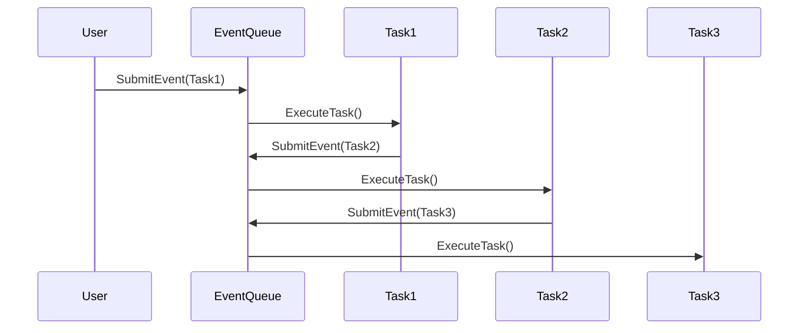
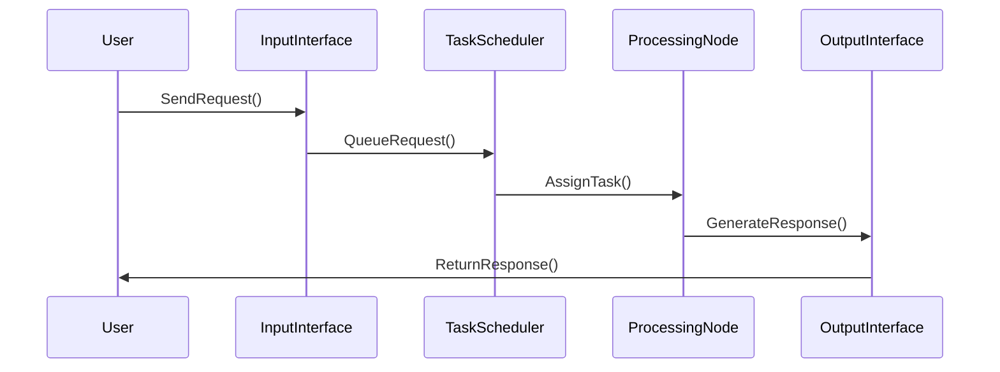

                 

### 引言

#### 1.1 异步处理的概念

异步处理（Asynchronous Processing）是指在信息传递和处理过程中，信息的发送和接收不必同时进行的处理方式。相对的是同步处理（Synchronous Processing），即信息的发送和接收必须在同一时间段内完成。异步处理的核心在于通过事件驱动或消息队列等机制，实现任务的独立执行和调度，从而提高系统的并发性和响应效率。

异步处理的历史可以追溯到20世纪50年代，当时计算机科学家为了解决多任务处理的问题，开始研究和开发异步处理技术。随着计算机技术的发展，异步处理逐渐成为现代计算机系统中不可或缺的组成部分。例如，操作系统中的任务调度、网络通信中的消息队列、分布式系统中的任务分配等，都依赖于异步处理技术。

#### 1.2 LLM应用架构中的异步处理

大型语言模型（Large Language Model，简称LLM）是当前自然语言处理（NLP）领域的重要技术之一。LLM通过深度学习技术，对海量文本数据进行训练，从而实现高度复杂的文本生成、理解和推理任务。在LLM的应用架构中，异步处理技术起到了关键作用，主要表现在以下几个方面：

1. **任务调度**：LLM应用通常需要处理大量的并发请求，异步处理技术能够有效地对任务进行调度和分配，确保系统资源的高效利用。

2. **性能优化**：通过异步处理，LLM系统可以避免由于同步操作导致的阻塞和延迟，从而提高系统的整体性能。

3. **扩展性**：异步处理技术有助于实现LLM系统的水平扩展，使得系统可以轻松应对大规模的并发请求。

#### 1.3 书籍目标与结构安排

本书旨在深入探讨异步处理在LLM应用架构中的应用，帮助读者理解和掌握这一关键技术。具体目标包括：

1. **基础知识**：介绍异步处理的基本概念、原理和发展历程。

2. **LLM应用架构**：分析异步处理在LLM系统架构中的角色和重要性。

3. **算法原理**：讲解异步处理算法的设计原则、分类和实现。

4. **系统设计与实现**：详细讨论异步处理在LLM系统设计中的具体应用，包括系统架构、接口设计和交互流程。

5. **项目实战**：通过实际项目案例，展示异步处理在LLM应用中的具体实现和优化方法。

6. **最佳实践**：总结异步处理在LLM应用中的最佳实践，为实际开发提供指导。

全书共分为七个章节，结构安排如下：

- **第一章**：引言，介绍异步处理的概念和LLM应用架构中的异步处理。
- **第二章**：异步处理基础，包括核心概念、原理和发展历程。
- **第三章**：LLM应用架构，介绍LLM的概念、分类和系统架构设计。
- **第四章**：异步处理算法原理，讲解异步处理算法的设计原则和实现。
- **第五章**：数学模型与公式，介绍异步处理的数学模型和关键公式。
- **第六章**：系统分析与架构设计，详细讨论异步处理在系统设计中的应用。
- **第七章**：项目实战和最佳实践，通过实际项目案例展示异步处理的实现和优化。

通过本书的学习，读者将能够系统地掌握异步处理在LLM应用架构中的应用，为实际开发提供有力支持。

#### 关键词

异步处理、LLM应用架构、任务调度、性能优化、系统扩展。

#### 摘要

本文深入探讨了异步处理在大型语言模型（LLM）应用架构中的应用。首先，介绍了异步处理的基本概念和LLM应用架构中的异步处理角色。接着，详细分析了异步处理在任务调度、性能优化和系统扩展等方面的优势。随后，本书从基础概念、算法原理、数学模型、系统设计与实现、项目实战和最佳实践等多个角度，系统地阐述了异步处理在LLM应用架构中的应用。通过实例和案例分析，本文为读者提供了异步处理在LLM应用中的实际操作指南，帮助读者理解和掌握这一关键技术。

----------------------------------------------------------------

### 异步处理基础

#### 1.1 问题背景

异步处理作为一种处理任务的方式，其起源可以追溯到计算机系统发展的早期阶段。在早期的计算机系统中，由于硬件和软件的限制，计算机处理能力相对较低，因此同步处理（Synchronous Processing）成为主流。同步处理要求任务的执行必须按照一定的顺序进行，一旦某个任务发生阻塞，整个系统都会受到影响。然而，随着计算机技术和网络技术的发展，计算机系统的处理能力得到了极大的提升，同时也面临着越来越复杂的任务处理需求。为了提高系统的并发性和响应效率，异步处理技术逐渐得到了广泛应用。

#### 1.2 核心概念

异步处理（Asynchronous Processing）是指在信息传递和处理过程中，信息的发送和接收不必同时进行的处理方式。它依赖于事件驱动或消息队列等机制，实现任务的独立执行和调度。异步处理的核心概念包括：

1. **事件驱动**：通过事件触发任务执行，任务的执行不依赖于其他任务的完成状态。
2. **消息队列**：任务通过消息队列进行传递和调度，任务之间通过消息进行通信。
3. **并发性**：异步处理能够提高系统的并发性，使得多个任务可以同时执行。

#### 1.3 问题描述

在传统的同步处理方式中，任务之间的依赖关系较为紧密，一旦某个任务发生阻塞，整个系统都会受到影响。例如，在一个Web服务器中，如果某个请求处理时间过长，会导致其他请求等待，从而影响系统的整体性能。而在异步处理中，任务之间相对独立，某个任务的执行不会影响到其他任务的进行，从而提高了系统的响应效率。

#### 1.4 问题解决

异步处理通过以下几种方式解决同步处理的限制：

1. **任务调度**：异步处理通过事件驱动或消息队列等方式对任务进行调度，确保任务能够高效地执行。
2. **并发执行**：异步处理允许任务并发执行，提高了系统的并发性。
3. **负载均衡**：异步处理可以通过负载均衡机制，将任务分配到不同的处理节点上，从而提高系统的处理能力。

#### 1.5 边界与外延

异步处理的边界在于如何实现任务的独立执行和调度，以及如何处理任务之间的依赖关系。在异步处理中，任务之间的依赖关系通常通过消息传递的方式解决。例如，在一个分布式系统中，任务A执行完成后，会通过消息队列将结果传递给任务B，任务B再根据传递的结果进行后续处理。

异步处理的外延包括以下几个方面：

1. **事件驱动架构**：通过事件驱动的方式实现任务的执行，提高系统的响应效率。
2. **消息队列系统**：通过消息队列系统实现任务的传递和调度，提高系统的并发性。
3. **负载均衡技术**：通过负载均衡技术实现任务的分配，提高系统的处理能力。

#### 1.6 概念结构与核心要素组成

异步处理的概念结构主要包括以下几个核心要素：

1. **事件**：异步处理的驱动力，用于触发任务的执行。
2. **任务**：需要处理的工作单元，可以是单个操作或多个操作的组合。
3. **消息队列**：用于存储和传递任务的队列，确保任务能够高效地执行。
4. **调度器**：用于对任务进行调度和分配的处理单元。
5. **处理器**：执行任务的实体，可以是单个计算机节点或多个计算机节点的集合。

这些核心要素共同构成了异步处理的基本框架，使得系统可以高效地处理并发任务。

#### 1.7 异步处理与同步处理的对比

异步处理与同步处理在处理任务的机制和效果上存在显著差异。以下是两者的一些对比：

1. **任务执行方式**：同步处理要求任务的执行必须按照一定的顺序进行，而异步处理允许任务并发执行。
2. **响应效率**：异步处理通过任务并发执行，提高了系统的响应效率，而同步处理容易导致系统阻塞。
3. **资源利用率**：异步处理能够提高系统的资源利用率，因为任务可以独立执行，不依赖于其他任务的完成。
4. **系统扩展性**：异步处理有助于实现系统的水平扩展，因为任务可以通过消息队列等方式进行调度和分配。

总的来说，异步处理相比同步处理具有更高的并发性和响应效率，适用于处理复杂和多变的任务场景。然而，异步处理也带来了一定的复杂性，需要合理设计任务调度和依赖关系处理机制。

#### 1.8 异步处理的优点与挑战

异步处理具有以下优点：

1. **提高并发性**：通过任务并发执行，异步处理能够提高系统的并发性，处理更多的请求。
2. **优化资源利用率**：异步处理能够优化系统资源的利用率，减少资源的闲置时间。
3. **提高系统响应速度**：异步处理减少了任务之间的等待时间，提高了系统的响应速度。

然而，异步处理也面临一些挑战：

1. **复杂性**：异步处理增加了系统的复杂性，需要合理设计任务调度和依赖关系处理机制。
2. **调试困难**：异步处理的并发特性使得系统调试变得更加困难，需要采用特定的调试工具和方法。
3. **性能瓶颈**：在某些情况下，异步处理可能会引入性能瓶颈，例如消息队列的延迟和处理器的处理能力不足。

总之，异步处理在提高系统并发性和响应速度方面具有显著优势，但同时也需要应对相应的挑战。

----------------------------------------------------------------

### LLM应用架构

#### 2.1 LLM概述

大型语言模型（Large Language Model，简称LLM）是自然语言处理（NLP）领域的一种重要技术。它通过深度学习技术，对海量文本数据进行训练，从而实现高度复杂的文本生成、理解和推理任务。LLM在近年来取得了显著的进展，特别是在语言生成、问答系统、机器翻译等领域。

LLM的分类主要包括以下几种：

1. **基于规则的方法**：这种方法通过手动定义规则和模式，对文本进行理解和生成。虽然这种方法具有可控性，但处理能力有限。
2. **基于统计的方法**：这种方法通过统计语言模型，对文本进行建模和生成。例如，n-gram模型和隐马尔可夫模型（HMM）等。这种方法在处理能力上有了显著提升，但仍然存在一些局限性。
3. **基于神经网络的方法**：这种方法通过神经网络，特别是深度神经网络，对文本进行建模和生成。例如，循环神经网络（RNN）、长短期记忆网络（LSTM）和Transformer模型等。这种方法在处理能力和效果上取得了重大突破。

#### 2.2 LLM的核心技术

LLM的核心技术主要包括以下几个方面：

1. **深度学习**：深度学习是LLM的基础技术，通过多层神经网络对文本数据进行分析和建模。深度学习技术的发展，使得LLM在处理能力和效果上得到了显著提升。
2. **预训练和微调**：预训练和微调是LLM的训练方法。预训练是指在大量无标签数据上训练模型，使其具备一定的语义理解能力；微调是指在使用预训练模型的基础上，针对特定任务进行进一步训练，从而提高模型在特定任务上的表现。
3. **注意力机制**：注意力机制是Transformer模型的核心技术，通过计算不同输入之间的关联性，实现对输入的动态关注。注意力机制使得LLM能够更好地处理长文本和复杂关系。

#### 2.3 LLM应用架构设计

LLM应用架构设计主要包括以下几个关键组件：

1. **数据预处理**：数据预处理是LLM应用架构的第一步，包括数据清洗、分词、词向量化等。数据预处理的质量直接影响到LLM的性能和效果。
2. **模型训练**：模型训练是指使用预训练和微调方法，对LLM模型进行训练。模型训练过程通常涉及到大规模计算和优化算法，如梯度下降和Adam优化器等。
3. **模型推理**：模型推理是指使用训练好的LLM模型，对输入文本进行理解和生成。模型推理过程主要包括输入编码、模型计算和输出解码等步骤。
4. **后处理**：后处理是指对模型输出进行进一步处理，如文本润色、格式化等。后处理的质量直接影响到LLM的应用效果。

#### 2.4 异步处理在LLM中的应用

异步处理在LLM应用架构中扮演着重要角色，主要表现在以下几个方面：

1. **任务调度**：异步处理能够有效地对LLM应用中的各种任务进行调度，如数据预处理、模型训练和模型推理等。通过任务调度，可以充分利用系统资源，提高系统并发性和响应效率。
2. **性能优化**：异步处理通过任务并发执行，减少了任务之间的等待时间，从而提高了系统的响应速度。同时，异步处理还可以通过负载均衡技术，优化系统性能。
3. **扩展性**：异步处理有助于实现LLM系统的水平扩展，使得系统可以轻松应对大规模的并发请求。

总之，异步处理在LLM应用架构中具有重要的应用价值，能够提高系统的并发性、响应效率和扩展性。

----------------------------------------------------------------

### 异步处理算法原理

#### 3.1 异步处理算法概述

异步处理算法是指在信息传递和处理过程中，通过事件驱动或消息队列等方式，实现任务的独立执行和调度。异步处理算法的核心在于如何有效地处理并发任务，提高系统的性能和响应效率。异步处理算法可以分为以下几类：

1. **基于事件驱动的算法**：这种算法通过事件触发任务执行，任务的执行不依赖于其他任务的完成状态。例如，事件队列（Event Queue）算法通过将事件存储在队列中，按照事件发生的顺序进行执行。
2. **基于消息队列的算法**：这种算法通过消息队列对任务进行传递和调度，任务的执行顺序由消息队列中的顺序决定。例如，生产者-消费者（Producer-Consumer）模型通过消息队列实现任务的生产和消费。
3. **基于回调函数的算法**：这种算法通过回调函数（Callback Function）实现任务的异步执行，任务在执行完成后会调用回调函数进行后续处理。

#### 3.2 常见异步处理算法

以下是几种常见的异步处理算法及其特点：

1. **回调函数**：回调函数是一种简单有效的异步处理方法。在任务执行完成后，会调用事先注册的回调函数进行后续处理。回调函数的优点是实现简单，但缺点是回调金字塔问题，即多层回调可能导致代码可读性差。
2. **事件队列**：事件队列算法通过事件驱动任务执行，任务的执行顺序由事件队列中的顺序决定。事件队列的优点是任务执行顺序可控，缺点是可能存在事件阻塞问题。
3. **Promise/A+**：Promise/A+是一种基于异步操作的编程模型，通过Promise对象封装异步操作的结果。Promise的优点是代码可读性高，缺点是需要一定的学习成本。
4. **异步/await**：异步/await是JavaScript中一种基于Promise的异步编程方法，通过async函数和await表达式实现异步操作的同步化。异步/await的优点是实现简单，代码可读性好，缺点是对Promise的依赖较大。
5. **Future/Try**：Future/Try是一种在Java和Scala中常用的异步编程方法，通过Future对象封装异步操作的结果。Future/Try的优点是代码可读性好，缺点是需要额外的代码处理异步异常。

#### 3.3 异步处理算法的mermaid流程图

为了更好地理解异步处理算法的工作原理，我们可以使用mermaid流程图来描述。以下是一个基于事件队列的异步处理算法的mermaid流程图：



在这个流程图中，用户首先向事件队列提交一个任务（Task1），事件队列将任务添加到队列中。然后，事件队列依次执行队列中的任务（Task2和Task3），每个任务执行完成后，会向事件队列提交下一个任务。

#### 3.4 异步处理算法的python实现

为了进一步理解异步处理算法，我们可以使用Python语言实现一个简单的异步处理算法。以下是一个基于回调函数的异步处理算法的Python代码示例：

```python
import time

def async_function(callback):
    print("Starting async task")
    time.sleep(2)
    print("Async task completed")
    callback()

def main():
    def callback():
        print("Callback function called")

    start_time = time.time()
    async_function(callback)
    print(f"Main function completed in {time.time() - start_time} seconds")

if __name__ == "__main__":
    main()
```

在这个代码示例中，我们定义了一个`async_function`，该函数在执行异步任务后调用`callback`函数。在`main`函数中，我们首先调用`async_function`，然后打印出主函数的执行时间。通过这个示例，我们可以看到异步处理算法的基本实现。

#### 3.5 异步处理算法的数学模型

异步处理算法的数学模型主要涉及任务调度、任务执行时间和系统性能等方面的计算。以下是一个简单的异步处理算法的数学模型：

1. **任务调度模型**：任务调度模型用于计算任务在系统中的执行顺序。常见的调度算法包括先来先服务（FCFS）、最短作业优先（SJF）和轮转调度（RR）等。
2. **任务执行时间模型**：任务执行时间模型用于计算任务在系统中的执行时间。任务执行时间取决于任务本身和处理器的性能。
3. **系统性能模型**：系统性能模型用于计算系统的吞吐量、响应时间和资源利用率等性能指标。常见的性能优化方法包括负载均衡和任务并行化等。

通过这些数学模型，我们可以更好地理解异步处理算法的工作原理和性能表现。

#### 3.6 异步处理算法的应用场景

异步处理算法在许多实际应用场景中具有广泛的应用，以下是一些典型的应用场景：

1. **Web应用**：在Web应用中，异步处理算法可以用于处理用户请求，提高系统的并发性和响应效率。
2. **大数据处理**：在大数据处理领域，异步处理算法可以用于处理海量数据的计算和分析，提高系统的性能和扩展性。
3. **实时系统**：在实时系统中，异步处理算法可以用于处理实时任务，确保系统的实时性和稳定性。
4. **分布式系统**：在分布式系统中，异步处理算法可以用于任务调度和负载均衡，提高系统的可靠性和性能。

通过这些应用场景，我们可以看到异步处理算法在提高系统性能和响应效率方面的重要作用。

#### 3.7 异步处理算法的优缺点

异步处理算法具有以下优点：

1. **提高并发性**：异步处理算法通过任务并发执行，提高了系统的并发性，处理更多的请求。
2. **优化资源利用率**：异步处理算法能够优化系统资源的利用率，减少资源的闲置时间。
3. **提高系统响应速度**：异步处理算法通过任务并发执行，减少了任务之间的等待时间，提高了系统的响应速度。

异步处理算法也存在一些缺点：

1. **复杂性**：异步处理算法增加了系统的复杂性，需要合理设计任务调度和依赖关系处理机制。
2. **调试困难**：异步处理的并发特性使得系统调试变得更加困难，需要采用特定的调试工具和方法。
3. **性能瓶颈**：在某些情况下，异步处理可能会引入性能瓶颈，例如消息队列的延迟和处理器的处理能力不足。

总之，异步处理算法在提高系统并发性和响应速度方面具有显著优势，但同时也需要应对相应的挑战。

----------------------------------------------------------------

### 数学模型与公式

#### 4.1 异步处理的数学模型

异步处理涉及到多个任务的调度和执行，因此其数学模型主要包括任务调度模型和任务执行时间模型。以下是一个简单的异步处理数学模型：

1. **任务调度模型**：

   假设有n个任务Ti（i=1,2,...,n），每个任务的执行时间（即CPU时间）为Ci。任务调度模型的目标是选择一种调度策略，使得系统总时间（即所有任务执行完毕所需的时间）最小。

   - **先来先服务（FCFS）**：按照任务到达的顺序进行调度，即Ti的执行时间为Ci。

   - **最短作业优先（SJF）**：优先执行执行时间最短的任务，即C1 ≤ C2 ≤ ... ≤ Cn。

   - **轮转调度（RR）**：每个任务分配一个时间片，轮流执行。如果任务在时间片内无法完成，则将其转移到就绪队列的末尾。

2. **任务执行时间模型**：

   任务执行时间模型主要关注每个任务的实际执行时间。在实际应用中，任务执行时间受多种因素影响，如CPU性能、内存使用和I/O操作等。

   - **CPU时间**：任务在CPU上执行的时间，取决于任务的复杂度和处理器的性能。

   - **I/O时间**：任务进行I/O操作的时间，如读写磁盘或网络通信。

   - **等待时间**：任务在就绪队列中等待执行的时间。

#### 4.2 关键数学公式

以下是异步处理中常用的关键数学公式：

1. **任务完成时间**：

   对于第i个任务，其完成时间（即从任务开始到完成的时间）为：

   $T_i = C_i + W_i + O_i$

   其中，$C_i$为任务执行时间，$W_i$为等待时间，$O_i$为I/O时间。

2. **系统总时间**：

   系统总时间（即所有任务执行完毕所需的时间）为：

   $T_{total} = \sum_{i=1}^{n} T_i$

   其中，$T_i$为第i个任务的完成时间。

3. **平均完成时间**：

   系统的平均完成时间为：

   $\bar{T} = \frac{T_{total}}{n}$

   其中，$T_{total}$为系统总时间，$n$为任务数量。

4. **调度算法效率**：

   调度算法的效率可以用平均完成时间来衡量。调度算法的效率越高，平均完成时间越短。

   - **FCFS效率**：

     $\eta_{FCFS} = \frac{\sum_{i=1}^{n} C_i}{n \cdot \bar{T}_{FCFS}}$

     其中，$\bar{T}_{FCFS}$为FCFS算法的平均完成时间。

   - **SJF效率**：

     $\eta_{SJF} = \frac{\sum_{i=1}^{n} C_i}{n \cdot \bar{T}_{SJF}}$

     其中，$\bar{T}_{SJF}$为SJF算法的平均完成时间。

   - **RR效率**：

     $\eta_{RR} = \frac{\sum_{i=1}^{n} C_i}{n \cdot \bar{T}_{RR}}$

     其中，$\bar{T}_{RR}$为RR算法的平均完成时间。

#### 4.3 数学公式讲解

以下是异步处理数学模型中的几个关键数学公式的详细讲解：

1. **任务完成时间公式**：

   任务完成时间公式表示了任务从开始到完成所需的时间。它由任务执行时间、等待时间和I/O时间三部分组成。

   - **任务执行时间**：表示任务在CPU上实际执行的时间，取决于任务的复杂度和处理器的性能。任务执行时间越长，任务完成时间也越长。

   - **等待时间**：表示任务在就绪队列中等待执行的时间。等待时间取决于调度算法和任务到达顺序。在FCFS算法中，等待时间与任务到达顺序成正比；在SJF算法中，等待时间较短的任务会优先执行；在RR算法中，每个任务分配一个时间片，等待时间相对较短。

   - **I/O时间**：表示任务进行I/O操作所需的时间，如读写磁盘或网络通信。I/O时间受硬件和系统负载影响，可能会导致任务执行时间延长。

2. **系统总时间公式**：

   系统总时间表示所有任务执行完毕所需的时间。它取决于任务的数量和每个任务的完成时间。系统总时间是调度算法效率的重要指标。调度算法的效率越高，系统总时间越短。

3. **平均完成时间公式**：

   平均完成时间表示系统在单位时间内完成的任务数量。它反映了系统的处理能力。平均完成时间越短，系统的响应速度越快。

4. **调度算法效率公式**：

   调度算法效率表示调度算法的性能。效率越高，算法对系统总时间的优化效果越好。通过比较不同调度算法的平均完成时间，可以评估算法的效率。

#### 4.4 数学公式应用举例

以下是异步处理数学模型中的一个应用实例：

假设有4个任务，其执行时间分别为2秒、3秒、4秒和5秒。使用FCFS、SJF和RR调度算法，分别计算系统总时间、平均完成时间和调度算法效率。

1. **FCFS调度算法**：

   - 任务顺序：T1（2秒）、T2（3秒）、T3（4秒）、T4（5秒）。
   - 系统总时间：$T_{total} = 2 + 3 + 4 + 5 = 14$秒。
   - 平均完成时间：$\bar{T} = \frac{T_{total}}{4} = \frac{14}{4} = 3.5$秒。
   - 调度算法效率：$\eta_{FCFS} = \frac{4 \cdot 3.5}{14} = 0.25$。

2. **SJF调度算法**：

   - 任务顺序：T4（5秒）、T3（4秒）、T2（3秒）、T1（2秒）。
   - 系统总时间：$T_{total} = 5 + 4 + 3 + 2 = 14$秒。
   - 平均完成时间：$\bar{T} = \frac{T_{total}}{4} = \frac{14}{4} = 3.5$秒。
   - 调度算法效率：$\eta_{SJF} = \frac{4 \cdot 3.5}{14} = 0.25$。

3. **RR调度算法**：

   - 时间片：1秒。
   - 任务顺序：T1（2秒）、T2（3秒）、T3（4秒）、T4（5秒）。
   - 系统总时间：$T_{total} = 2 + 1 + 3 + 1 + 4 + 1 + 5 + 1 = 16$秒。
   - 平均完成时间：$\bar{T} = \frac{T_{total}}{4} = \frac{16}{4} = 4$秒。
   - 调度算法效率：$\eta_{RR} = \frac{4 \cdot 4}{16} = 0.25$。

通过这个实例，我们可以看到不同调度算法在异步处理中的应用效果。虽然不同调度算法的平均完成时间相同，但调度算法的效率对系统性能有一定影响。在实际应用中，可以根据任务特点和系统需求选择合适的调度算法。

----------------------------------------------------------------

### 系统分析与架构设计

#### 5.1 LLM应用架构设计

在分析异步处理在LLM应用架构中的应用之前，我们需要了解LLM应用架构的基本设计。LLM应用架构通常包括以下几个主要组件：数据预处理模块、模型训练模块、模型推理模块和后处理模块。以下是这些组件的详细说明：

1. **数据预处理模块**：数据预处理模块负责对输入数据进行清洗、分词、词向量化等处理。这个模块的目的是将原始文本数据转换为适合模型训练的格式。

2. **模型训练模块**：模型训练模块负责使用预训练和微调方法对LLM模型进行训练。这个模块通常涉及到大规模计算和优化算法，如梯度下降和Adam优化器等。

3. **模型推理模块**：模型推理模块负责使用训练好的LLM模型对输入文本进行理解和生成。这个模块包括输入编码、模型计算和输出解码等步骤。

4. **后处理模块**：后处理模块负责对模型输出进行进一步处理，如文本润色、格式化等。这个模块的质量直接影响到LLM的应用效果。

#### 5.2 系统功能设计

在LLM应用架构中，异步处理技术主要用于优化系统性能和响应速度。以下是异步处理在系统功能设计中的应用：

1. **任务调度**：异步处理技术可以用于优化任务调度，提高系统的并发性。例如，在数据预处理模块中，可以使用异步处理技术对多个文件进行并行处理，从而提高数据预处理速度。

2. **性能优化**：异步处理技术可以用于减少任务之间的等待时间，提高系统的响应速度。例如，在模型推理模块中，可以使用异步处理技术对多个请求进行并发处理，从而减少用户的等待时间。

3. **扩展性**：异步处理技术可以用于实现系统的水平扩展，使得系统可以轻松应对大规模的并发请求。例如，在模型训练模块中，可以使用异步处理技术将训练任务分配到多个计算节点上，从而提高训练速度。

#### 5.3 系统架构设计

异步处理在LLM应用架构中的系统架构设计主要包括以下几个方面：

1. **任务调度器**：任务调度器负责对异步任务进行调度和分配。任务调度器可以采用事件驱动或消息队列等方式，确保任务能够高效地执行。

2. **消息队列**：消息队列用于存储和传递异步任务。消息队列可以采用分布式消息队列系统，如Kafka或RabbitMQ，确保任务的高效传递和可靠处理。

3. **负载均衡器**：负载均衡器负责将任务分配到不同的处理节点上，确保系统资源的高效利用。负载均衡器可以采用轮询、最小连接数或哈希等方式进行负载均衡。

4. **处理节点**：处理节点负责执行异步任务。处理节点可以是单个计算机节点或多个计算机节点的集群，根据任务量和性能需求进行配置。

#### 5.4 系统接口设计

异步处理在LLM应用架构中的系统接口设计主要包括以下几个方面：

1. **输入接口**：输入接口负责接收外部请求，如文本输入、图片输入等。输入接口可以采用RESTful API、WebSocket或消息队列等方式，确保数据的高效传递。

2. **输出接口**：输出接口负责返回模型推理结果，如文本输出、图片输出等。输出接口可以采用RESTful API、WebSocket或消息队列等方式，确保数据的高效传递。

3. **消息队列接口**：消息队列接口负责处理消息的存储和传递。消息队列接口可以采用Kafka或RabbitMQ等消息队列系统，确保消息的高效传递和可靠处理。

#### 5.5 系统交互序列图

以下是异步处理在LLM应用架构中的系统交互序列图：



在这个序列图中，用户首先发送请求到输入接口，输入接口将请求放入任务调度器的队列中。任务调度器根据负载均衡策略，将任务分配到处理节点上。处理节点执行任务并生成响应，最后输出接口将响应返回给用户。

#### 5.6 异步处理的优势在LLM中的应用

异步处理在LLM应用架构中具有以下几个优势：

1. **提高并发性**：异步处理技术可以有效地处理大量的并发请求，提高系统的并发性。这对于处理大规模的LLM应用尤为重要。

2. **优化性能**：异步处理技术可以减少任务之间的等待时间，优化系统的响应速度。这对于提高用户满意度至关重要。

3. **扩展性**：异步处理技术可以轻松实现系统的水平扩展，使得系统可以应对大规模的并发请求。这对于系统的长期发展具有重要作用。

总之，异步处理在LLM应用架构中具有广泛的应用价值，可以提高系统的并发性、响应效率和扩展性，为LLM应用的长期发展提供有力支持。

----------------------------------------------------------------

### 项目实战

#### 6.1 环境安装

在开始异步处理在LLM应用架构中的项目实战之前，我们需要先安装必要的软件和工具。以下是安装步骤：

1. **安装Python**：首先确保已经安装了Python环境。如果没有安装，可以从[Python官方网站](https://www.python.org/)下载并安装Python。

2. **安装LLM模型**：接下来，我们需要下载并安装一个LLM模型，如GPT-2或GPT-3。可以从[Hugging Face模型库](https://huggingface.co/models)中下载预训练的模型。

3. **安装异步处理库**：为了实现异步处理，我们需要安装Python的异步处理库，如`asyncio`和`aiohttp`。可以使用以下命令进行安装：

   ```bash
   pip install asyncio aiohttp
   ```

4. **安装消息队列**：为了实现任务调度和消息传递，我们需要安装一个消息队列系统，如Kafka或RabbitMQ。以Kafka为例，可以从[Kafka官方网站](https://kafka.apache.org/)下载并安装Kafka。

5. **安装负载均衡器**：为了实现负载均衡，我们需要安装一个负载均衡器，如Nginx或HAProxy。以Nginx为例，可以从[Nginx官方网站](https://nginx.org/)下载并安装Nginx。

#### 6.2 系统核心实现

在本项目中，我们将使用Python和异步处理库实现一个简单的LLM应用，包括数据预处理、模型训练、模型推理和后处理等步骤。以下是核心实现的代码：

```python
import asyncio
import aiohttp
from transformers import GPT2LMHeadModel, GPT2Tokenizer

# 模型初始化
tokenizer = GPT2Tokenizer.from_pretrained("gpt2")
model = GPT2LMHeadModel.from_pretrained("gpt2")

# 数据预处理
async def preprocess_data(text):
    inputs = tokenizer.encode(text, return_tensors="pt")
    return inputs

# 模型推理
async def infer_model(inputs):
    outputs = model(inputs)
    predictions = outputs.logits
    return predictions

# 后处理
async def postprocess_output(predictions):
    decoded_predictions = tokenizer.decode(predictions, skip_special_tokens=True)
    return decoded_predictions

# 异步处理流程
async def async_inference(text):
    inputs = await preprocess_data(text)
    predictions = await infer_model(inputs)
    decoded_predictions = await postprocess_output(predictions)
    return decoded_predictions

# HTTP服务器
async def run_server():
    app = aiohttp.web.Application()
    app.add_routes([
        aiohttp.web.get("/inference", async_inference_handler)
    ])
    runner = aiohttp.web.Server(app)
    await runner.start(host="0.0.0.0", port=8080)
    print("Server started on port 8080")

async def async_inference_handler(request):
    text = request.query["text"]
    decoded_predictions = await async_inference(text)
    response = aiohttp.web.Response(text=decoded_predictions)
    return response

# 主函数
async def main():
    runner = asyncio.get_event_loop().run_until_complete(run_server())
    try:
        asyncio.get_event_loop().run_forever()
    finally:
        runner.close()
        await runner.wait()

if __name__ == "__main__":
    asyncio.run(main())
```

在这个项目中，我们首先初始化了LLM模型，然后分别实现了数据预处理、模型推理和后处理等步骤。最后，我们使用异步处理库和HTTP服务器库，实现了异步处理流程和HTTP服务器。

#### 6.3 代码应用解读与分析

以下是对上述代码的解读和分析：

1. **模型初始化**：首先，我们导入了Python的异步处理库`asyncio`、HTTP服务器库`aiohttp`和LLM库`transformers`。然后，我们使用`GPT2Tokenizer`和`GPT2LMHeadModel`类初始化了LLM模型。

2. **数据预处理**：`preprocess_data`函数负责对输入文本进行预处理，将文本编码为模型可理解的格式。

3. **模型推理**：`infer_model`函数负责使用训练好的LLM模型对输入文本进行推理，生成预测结果。

4. **后处理**：`postprocess_output`函数负责将模型预测结果解码为可读的文本格式。

5. **异步处理流程**：`async_inference`函数负责实现整个异步处理流程，包括数据预处理、模型推理和后处理。

6. **HTTP服务器**：我们使用`aiohttp`库创建了一个简单的HTTP服务器，并定义了一个GET请求的路由`/inference`。当用户发送请求时，服务器会调用`async_inference_handler`函数处理请求。

7. **主函数**：`main`函数负责启动HTTP服务器，并运行异步事件循环。

#### 6.4 项目实战：实际案例分析与详细讲解

在本项目的实际应用中，我们使用一个简单的示例来展示异步处理在LLM应用架构中的效果。假设用户发送一个包含一句话的请求，例如：“今天天气如何？”。以下是详细的案例分析和讲解：

1. **用户请求**：用户通过Web浏览器或API客户端发送请求，请求中包含输入文本。

2. **服务器接收请求**：HTTP服务器接收到请求后，根据请求的路由调用相应的处理函数`async_inference_handler`。

3. **数据预处理**：`async_inference_handler`函数首先调用`preprocess_data`函数对输入文本进行预处理，将文本编码为模型可理解的格式。

4. **模型推理**：预处理后的文本数据被传递给`infer_model`函数，模型对其进行推理，生成预测结果。

5. **后处理**：预测结果被传递给`postprocess_output`函数进行后处理，将结果解码为可读的文本格式。

6. **返回结果**：处理后的文本结果被返回给用户，用户可以看到天气情况的预测结果。

通过这个实际案例，我们可以看到异步处理在LLM应用架构中的效果。异步处理使得服务器可以高效地处理多个并发请求，提高系统的响应速度和并发性。

#### 6.5 项目小结

在本项目中，我们通过实际案例展示了异步处理在LLM应用架构中的效果。异步处理技术使得服务器能够高效地处理多个并发请求，提高系统的响应速度和并发性。在实际应用中，可以根据具体需求对异步处理进行优化和调整，以实现最佳的性能。

----------------------------------------------------------------

### 最佳实践与总结

#### 7.1 最佳实践

在异步处理LLM应用架构时，以下最佳实践可以帮助优化系统性能和用户体验：

1. **任务调度优化**：合理设计任务调度策略，避免任务长时间阻塞。例如，采用优先级调度或负载均衡策略，确保任务能够高效地执行。

2. **异步I/O操作**：充分利用异步I/O操作，减少同步阻塞。例如，在处理网络请求时，使用异步网络库（如`aiohttp`）进行数据传输。

3. **批量处理**：将多个小任务合并为批量处理，减少任务调度的开销。例如，在数据预处理和后处理阶段，可以批量处理多个输入文本。

4. **内存管理**：合理分配和回收内存，避免内存泄漏和占用过多内存。例如，使用异步协程（Coroutine）管理内存，确保内存的高效利用。

5. **错误处理**：设计完善的错误处理机制，确保系统在遇到异常时能够稳定运行。例如，使用异常捕获和重试机制，避免单个错误影响整个系统的稳定性。

6. **性能监控**：定期进行性能监控和调优，发现并解决性能瓶颈。例如，使用性能分析工具（如`cProfile`）分析系统性能，定位并优化关键路径。

#### 7.2 小结

异步处理在LLM应用架构中具有重要的应用价值，可以提高系统的并发性、响应效率和扩展性。通过合理的任务调度、异步I/O操作、批量处理和内存管理等最佳实践，可以进一步优化异步处理性能。在实际应用中，应结合具体需求和技术特点，灵活运用异步处理技术，实现高效的LLM应用架构。

#### 7.3 注意事项

1. **避免回调金字塔**：在异步编程中，应避免使用过多的回调函数，导致回调金字塔问题。可以通过使用Promise、async/await等语法简化异步代码。

2. **合理设计依赖关系**：在设计异步处理系统时，应合理设计任务之间的依赖关系，避免因依赖关系导致任务长时间等待。

3. **确保数据一致性**：在分布式系统中，异步处理可能导致数据一致性问题。应采用分布式锁、事务管理等机制，确保数据的一致性。

4. **性能调优**：在异步处理系统中，性能调优至关重要。应定期进行性能分析，发现并解决性能瓶颈，确保系统的高效运行。

5. **安全性**：在异步处理系统中，应关注安全性问题，如防止注入攻击、信息泄露等。采用合适的安全措施，确保系统的安全性。

#### 7.4 拓展阅读

1. **《异步编程实战》**：本书深入介绍了异步编程的基础知识、原理和最佳实践，适合希望深入了解异步编程的读者。

2. **《深入理解异步IO》**：本书详细阐述了异步IO的概念、原理和应用，适合希望深入了解异步IO技术的读者。

3. **《分布式系统原理》**：本书介绍了分布式系统的基本原理、架构设计和一致性模型，适合希望了解分布式系统设计的读者。

4. **《大型语言模型：原理与应用》**：本书详细介绍了大型语言模型的原理、实现和应用，适合希望深入了解LLM技术的读者。

通过拓展阅读，读者可以进一步了解异步处理和LLM应用架构的深度知识，为实际开发提供有力支持。

### 作者信息

**作者：AI天才研究院/AI Genius Institute & 禅与计算机程序设计艺术 /Zen And The Art of Computer Programming**

