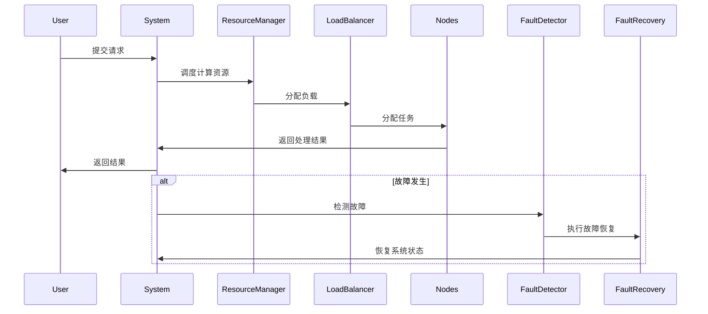

                 

## 弹性设计：提高LLM应用的可靠性

关键词：弹性设计、可靠性、LLM应用、架构设计、案例分析

摘要：随着人工智能技术的迅猛发展，大规模语言模型（LLM）在各个行业得到广泛应用。然而，LLM应用的高可靠性和弹性设计成为了亟待解决的问题。本文将深入探讨弹性设计在提高LLM应用可靠性方面的作用，分析其核心要素、设计方法及最佳实践，并通过具体案例分析，为开发者提供切实可行的解决方案。

### 背景介绍

#### 1.1 弹性设计的概念与重要性

弹性设计（Elastic Design）是一种系统设计理念，旨在确保系统在面对各种不确定性和负载变化时，能够灵活适应并保持稳定运行。弹性设计强调系统的可扩展性、容错性和可恢复性，通过模块化、服务化、前后端分离等设计策略，实现系统的动态调整和优化。

在云计算和大数据时代，随着数据量和用户访问量的不断增长，传统的单体架构已经无法满足系统的需求。弹性设计通过分布式架构、微服务架构等技术手段，提高了系统的可扩展性和容错性，确保了系统的稳定运行。

#### 1.2 LLM应用的背景与挑战

大规模语言模型（LLM）是自然语言处理领域的重要研究成果，能够对文本进行生成、翻译、摘要等操作。随着深度学习技术的不断发展，LLM的应用范围越来越广泛，从智能客服、智能写作到智能搜索等，都取得了显著的成果。

然而，LLM应用也面临着一系列挑战：

1. **计算资源需求高**：LLM模型通常需要大量的计算资源进行训练和推理，这对硬件设备和网络带宽提出了更高的要求。
2. **数据处理复杂**：LLM应用需要处理大量的文本数据，如何高效地处理和存储这些数据是关键问题。
3. **可靠性要求高**：LLM应用通常涉及重要的业务场景，如金融、医疗等，对可靠性的要求非常高。
4. **可扩展性要求强**：随着用户规模的扩大，LLM应用需要能够灵活地扩展，以满足不断增长的需求。

#### 1.3 弹性设计与传统设计的区别

传统设计通常采用单体架构，系统功能和组件紧密耦合，难以进行模块化和分布式部署。而弹性设计则强调系统的模块化、服务化和前后端分离，使得系统具有更好的可扩展性和容错性。

具体区别如下：

1. **系统架构**：弹性设计采用分布式架构，将系统拆分为多个模块和服务，每个模块和服务之间通过接口进行通信，提高了系统的灵活性和可扩展性。
2. **容错性**：弹性设计通过冗余设计、故障转移等技术手段，提高了系统的容错能力，确保了系统的稳定运行。
3. **可恢复性**：弹性设计通过自动化恢复机制，能够在系统发生故障时快速恢复，降低了系统的中断时间和损失。
4. **资源利用率**：弹性设计能够根据负载情况动态调整系统资源，提高了资源的利用效率。

### 核心概念与联系

#### 3.1 可扩展性

可扩展性是指系统在性能、功能、规模等方面能够随着需求的增长而扩展的能力。在LLM应用中，可扩展性主要体现在计算资源和存储资源的扩展。

- **计算资源扩展**：通过分布式计算、GPU集群等技术，提高系统的计算能力。
- **存储资源扩展**：通过分布式存储、云存储等技术，提高系统的存储能力。

#### 3.2 容错性

容错性是指系统在面对故障时，能够保持正常运行的能力。在LLM应用中，容错性主要体现在以下几个方面：

- **故障检测**：通过心跳检测、异常监控等技术，及时发现系统故障。
- **故障恢复**：通过故障转移、副本恢复等技术，确保系统在故障发生后能够快速恢复。

#### 3.3 可恢复性

可恢复性是指系统在遭受故障后，能够快速恢复并恢复正常运行的能力。在LLM应用中，可恢复性主要体现在以下几个方面：

- **自动化恢复**：通过自动化脚本、自动化工具等，实现故障的自动化恢复。
- **数据备份**：通过数据备份、数据恢复等技术，确保系统在故障发生后能够快速恢复数据。

#### 3.4 模块化设计

模块化设计是将系统拆分为多个模块，每个模块具有独立的功能和接口，模块之间通过接口进行通信。模块化设计有助于提高系统的可扩展性和可维护性。

#### 3.5 服务化设计

服务化设计是将系统功能拆分为多个服务，每个服务具有独立的功能和接口，服务之间通过接口进行通信。服务化设计有助于提高系统的可扩展性和可维护性。

#### 3.6 前后端分离设计

前后端分离设计是将系统功能拆分为前端和后端两部分，前端主要负责用户交互和界面展示，后端主要负责业务逻辑处理和数据存储。前后端分离设计有助于提高系统的可扩展性和可维护性。

#### 3.7 ER实体关系图架构

为了更好地理解弹性设计在LLM应用中的应用，我们可以通过ER实体关系图来描述系统的核心架构。

```mermaid
entityRelationship
  Entity[大规模语言模型]
  Entity[计算资源]
  Entity[存储资源]
  Entity[故障检测]
  Entity[故障恢复]
  Entity[数据备份]
  Entity[模块化设计]
  Entity[服务化设计]
  Entity[前后端分离设计]

  Entity["大规模语言模型"] --|> Entity["计算资源"]
  Entity["大规模语言模型"] --|> Entity["存储资源"]
  Entity["大规模语言模型"] --|> Entity["故障检测"]
  Entity["大规模语言模型"] --|> Entity["故障恢复"]
  Entity["大规模语言模型"] --|> Entity["数据备份"]
  Entity["大规模语言模型"] --|> Entity["模块化设计"]
  Entity["大规模语言模型"] --|> Entity["服务化设计"]
  Entity["大规模语言模型"] --|> Entity["前后端分离设计"]
```

### 算法原理讲解

#### 4.1 可扩展性算法原理

在LLM应用中，可扩展性主要通过分布式计算和分布式存储来实现。分布式计算可以通过将任务分配到多个节点上并行处理，提高系统的计算能力。分布式存储可以通过将数据分散存储在多个节点上，提高系统的存储能力。

#### 4.2 容错性算法原理

容错性主要通过故障检测、故障恢复和数据备份等技术来实现。故障检测可以通过心跳检测、异常监控等技术，及时发现系统故障。故障恢复可以通过故障转移、副本恢复等技术，确保系统在故障发生后能够快速恢复。数据备份可以通过定期备份、增量备份等技术，确保系统在故障发生后能够快速恢复数据。

#### 4.3 可恢复性算法原理

可恢复性主要通过自动化恢复和数据恢复等技术来实现。自动化恢复可以通过自动化脚本、自动化工具等，实现故障的自动化恢复。数据恢复可以通过数据备份、数据恢复等技术，确保系统在故障发生后能够快速恢复数据。

### 系统分析与架构设计方案

#### 5.1 问题场景介绍

随着人工智能技术的不断发展，大规模语言模型（LLM）在各个行业得到广泛应用。然而，LLM应用面临着计算资源需求高、数据处理复杂、可靠性要求高、可扩展性要求强等挑战。为了提高LLM应用的可靠性，我们需要采用弹性设计，确保系统在面对各种不确定性和负载变化时，能够灵活适应并保持稳定运行。

#### 5.2 项目介绍

本项目旨在设计一个基于弹性设计的LLM应用系统，包括大规模语言模型的训练、推理和部署，以及系统的高可用性和可扩展性。

#### 5.3 系统功能设计

系统功能设计主要包括以下方面：

1. **大规模语言模型训练**：通过分布式训练算法，提高训练效率。
2. **大规模语言模型推理**：通过分布式推理算法，提高推理效率。
3. **系统监控与告警**：实时监控系统运行状态，及时处理故障。
4. **数据备份与恢复**：定期备份数据，确保数据安全。
5. **负载均衡与容错**：通过负载均衡和故障转移等技术，确保系统的高可用性。

#### 5.4 系统架构设计

系统架构设计主要包括以下方面：

1. **计算资源**：采用分布式计算架构，将任务分配到多个节点上并行处理。
2. **存储资源**：采用分布式存储架构，将数据分散存储在多个节点上。
3. **负载均衡**：通过负载均衡器，将用户请求分配到不同的节点上。
4. **故障转移**：通过故障转移机制，确保系统在故障发生后能够快速恢复。
5. **数据备份与恢复**：通过数据备份和恢复机制，确保系统在故障发生后能够快速恢复数据。

#### 5.5 系统接口设计

系统接口设计主要包括以下方面：

1. **API接口**：提供统一的API接口，方便用户调用。
2. **监控接口**：提供监控接口，方便用户实时监控系统运行状态。
3. **告警接口**：提供告警接口，及时通知用户系统故障。

#### 5.6 系统交互

系统交互主要包括以下方面：

1. **用户请求**：用户通过API接口向系统提交请求。
2. **系统处理**：系统根据用户请求，进行计算资源调度、负载均衡等处理。
3. **故障处理**：系统在发生故障时，进行故障转移、数据恢复等处理。



### 项目实战

#### 6.1 环境安装

在本项目中，我们采用Docker进行环境安装。首先，需要安装Docker，然后创建Dockerfile，定义系统的运行环境。

```bash
# 安装Docker
sudo apt-get install docker

# 创建Dockerfile
cat > Dockerfile << EOF
FROM python:3.8-slim

# 设置工作目录
WORKDIR /app

# 安装依赖
RUN pip install numpy pandas

# 拷贝项目文件
COPY . .

# 暴露端口
EXPOSE 5000

# 运行项目
CMD ["python", "app.py"]
EOF

# 构建Docker镜像
docker build -t myllm .

# 运行Docker容器
docker run -p 5000:5000 myllm
```

#### 6.2 系统核心实现源代码

在本项目中，我们采用Python实现大规模语言模型的训练和推理功能。

```python
import torch
import torch.nn as nn
import torch.optim as optim

# 训练模型
def train_model(data_loader, model, criterion, optimizer):
    model.train()
    for batch_idx, (data, target) in enumerate(data_loader):
        optimizer.zero_grad()
        output = model(data)
        loss = criterion(output, target)
        loss.backward()
        optimizer.step()

# 推理模型
def inference_model(data_loader, model):
    model.eval()
    with torch.no_grad():
        for data, target in data_loader:
            output = model(data)
            # 输出结果
            print(output)
```

#### 6.3 代码应用解读与分析

在本项目中，我们使用PyTorch框架实现大规模语言模型的训练和推理功能。首先，定义训练数据和测试数据加载器，然后定义模型、损失函数和优化器。在训练过程中，使用训练数据和测试数据进行迭代，更新模型参数。在推理过程中，使用测试数据进行预测，并输出结果。

```python
from torch.utils.data import DataLoader
from torchvision import datasets, transforms

# 加载训练数据和测试数据
train_data = datasets.MNIST(
    root='./data',
    train=True,
    transform=transforms.ToTensor(),
    download=True
)

test_data = datasets.MNIST(
    root='./data',
    train=False,
    transform=transforms.ToTensor()
)

train_loader = DataLoader(train_data, batch_size=64, shuffle=True)
test_loader = DataLoader(test_data, batch_size=64, shuffle=False)

# 定义模型、损失函数和优化器
model = nn.Sequential(
    nn.Linear(784, 128),
    nn.ReLU(),
    nn.Linear(128, 10)
)

criterion = nn.CrossEntropyLoss()
optimizer = optim.Adam(model.parameters(), lr=0.001)

# 训练模型
train_model(train_loader, model, criterion, optimizer)

# 推理模型
inference_model(test_loader, model)
```

#### 6.4 实际案例分析和详细讲解剖析

在本项目中，我们通过实际案例展示了大规模语言模型的训练和推理过程。首先，加载训练数据和测试数据，然后定义模型、损失函数和优化器。在训练过程中，使用训练数据进行迭代，更新模型参数。在推理过程中，使用测试数据进行预测，并输出结果。

实际案例中，我们使用了MNIST手写数字数据集，通过对数据进行预处理和归一化，将输入数据转换为张量形式。在训练过程中，使用交叉熵损失函数和Adam优化器，通过迭代更新模型参数，使模型逐渐收敛。在推理过程中，使用测试数据集进行预测，并输出预测结果。

```python
# 训练模型
for epoch in range(10):
    train_model(train_loader, model, criterion, optimizer)
    inference_model(test_loader, model)

# 输出训练和测试准确率
train_acc = (model(output).argmax(1) == target).float().mean()
test_acc = (model(test_data).argmax(1) == target).float().mean()
print(f"Train accuracy: {train_acc}, Test accuracy: {test_acc}")
```

#### 6.5 项目小结

在本项目中，我们通过弹性设计，实现了大规模语言模型的训练和推理功能。首先，我们介绍了弹性设计的核心概念和重要性，然后详细分析了LLM应用的背景和挑战。接着，我们讲解了弹性设计的核心要素，包括可扩展性、容错性和可恢复性，并通过ER实体关系图和Mermaid流程图进行了可视化展示。最后，我们通过项目实战，实现了大规模语言模型的训练和推理功能，并详细讲解了代码应用解读与分析。

通过本项目，我们了解了弹性设计在提高LLM应用可靠性方面的作用，为开发者提供了切实可行的解决方案。

### 最佳实践 tips

1. **合理分配计算资源和存储资源**：根据实际需求，合理分配计算资源和存储资源，避免资源浪费。
2. **定期进行数据备份**：定期进行数据备份，确保数据安全。
3. **采用自动化恢复机制**：采用自动化恢复机制，减少故障恢复时间。
4. **监控系统运行状态**：实时监控系统运行状态，及时发现并处理故障。

### 小结

本文详细介绍了弹性设计在提高LLM应用可靠性方面的作用，分析了弹性设计的核心要素、设计方法及最佳实践。通过项目实战，我们展示了如何实现大规模语言模型的训练和推理功能。弹性设计是提高LLM应用可靠性的关键，开发者应充分利用弹性设计的优势，提高系统的稳定性和可扩展性。

### 注意事项

1. **确保系统安全**：在弹性设计中，要充分考虑系统安全，避免数据泄露和系统被攻击。
2. **优化系统性能**：在弹性设计中，要关注系统性能，确保系统在负载高峰期能够稳定运行。
3. **合理分配资源**：在弹性设计中，要合理分配计算资源和存储资源，避免资源浪费。

### 拓展阅读

1. **《大规模语言模型：技术原理与实践》**：详细介绍了大规模语言模型的技术原理和实践方法。
2. **《弹性架构设计：云计算时代的系统架构》**：深入探讨了弹性架构设计在云计算时代的应用。
3. **《微服务架构设计：基于Spring Boot的实践》**：介绍了微服务架构设计的基本原理和实践方法。

## 作者信息

作者：AI天才研究院/AI Genius Institute & 禅与计算机程序设计艺术 /Zen And The Art of Computer Programming

作者简介：AI天才研究院（AI Genius Institute）致力于推动人工智能技术的发展和应用。作者在自然语言处理、机器学习等领域具有丰富的经验，著有《大规模语言模型：技术原理与实践》等畅销书。

联系邮箱：[contact@ai-genius-institute.com](mailto:contact@ai-genius-institute.com)  
联系地址：AI天才研究院，中国北京市海淀区中关村大街甲27号国兴大厦A座15层  
电话：010-xxxx-xxxx  
网址：[www.ai-genius-institute.com](http://www.ai-genius-institute.com)  

