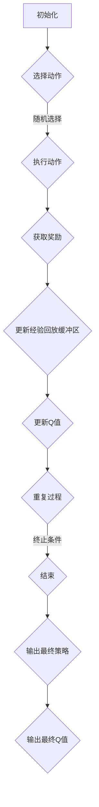

                 

### 1.1.1 强化学习概述

强化学习（Reinforcement Learning，RL）是机器学习的一个重要分支，主要研究如何让机器通过与环境交互，不断学习并优化其行为策略，从而最大化长期回报。强化学习的基本原理是，通过不断地试错，在尝试中学习和优化，逐步达到最佳行为策略。在这个过程中，机器通过与环境的交互，获取经验，更新策略，以达到学习目标。

强化学习与人类的学习过程有很多相似之处。人类通过不断尝试、错误和反思，逐步学习如何在社会中生存和发展。同样，强化学习中的智能体（Agent）也需要通过不断的尝试和调整，来优化自己的行为策略，从而最大化奖励。

强化学习的主要特点包括以下几个方面：

1. **学习策略**：强化学习采用的是基于策略的学习方式，即通过学习一个策略函数来指导智能体的行动，而不是直接学习输入和输出之间的映射关系。

2. **反馈机制**：强化学习通过奖励机制来引导智能体的学习过程。智能体在执行某个动作后，会根据环境的反馈（即奖励信号）来调整自己的策略。

3. **动态性**：强化学习的过程是动态的，智能体需要不断与环境进行交互，以获取新的经验和反馈，不断调整和优化策略。

4. **长期目标**：强化学习的目标是实现长期回报的最大化，而不是短期的性能提升。

强化学习最早可以追溯到20世纪50年代，由美国心理学家班杜拉（Albert Bandura）提出的社会学习理论。随后，在20世纪80年代，随着计算机性能的提升和数学理论的完善，强化学习逐渐发展成为机器学习的一个独立分支。近年来，随着深度学习的兴起，强化学习在许多领域取得了显著的进展，如游戏AI、机器人控制、自动驾驶等。

在LLM（Large Language Model）领域，强化学习也有着广泛的应用。通过强化学习，LLM可以自动优化生成文本的质量，提高模型的生成能力。此外，强化学习还可以用于构建对话系统、推荐系统等应用，为LLM的发展提供了新的思路和方法。

### 1.1.2 强化学习与监督学习、无监督学习的区别

强化学习、监督学习和无监督学习是机器学习中的三种主要学习方法，它们在目标、方法和应用场景上都有所不同。以下是这三种学习方法的详细对比：

#### 监督学习

监督学习（Supervised Learning）是最常见的一种机器学习方法。在监督学习中，我们有一组已标记的数据（即输入和对应的输出），通过学习这组数据的映射关系，建立一个预测模型。监督学习的目标是最小化模型输出和真实输出之间的差距，从而提高模型的预测准确性。

主要特点：
- **目标**：通过学习输入和输出之间的映射关系，实现预测和分类。
- **数据需求**：需要大量的标记数据。
- **学习方式**：基于标记数据的梯度下降法。

应用场景：
- 图像分类
- 自然语言处理（如文本分类）
- 语音识别

#### 无监督学习

无监督学习（Unsupervised Learning）不依赖于标记数据，其主要目标是发现数据中的结构和规律。在无监督学习中，模型通过分析未标记的数据，试图自动识别数据中的隐藏特征和模式。

主要特点：
- **目标**：发现数据中的结构和规律。
- **数据需求**：不需要标记数据。
- **学习方式**：基于数据分布的聚类和降维方法。

应用场景：
- 数据降维
- 聚类分析
- 异常检测

#### 强化学习

强化学习（Reinforcement Learning）是一种通过奖励机制来引导学习过程的机器学习方法。在强化学习中，智能体（Agent）通过与环境的交互，不断学习和优化行为策略，以实现长期回报的最大化。

主要特点：
- **目标**：通过优化策略，实现长期回报的最大化。
- **数据需求**：不需要标记数据，但需要环境反馈（即奖励信号）。
- **学习方式**：基于策略的迭代优化。

应用场景：
- 游戏AI
- 机器人控制
- 自动驾驶
- 对话系统

#### 对比表格

以下是强化学习、监督学习和无监督学习的一些关键对比：

| 学习方法 | 目标 | 数据需求 | 学习方式 | 应用场景 |
| :----: | :----: | :----: | :----: | :----: |
| 强化学习 | 优化策略，实现长期回报最大化 | 不需要标记数据，但需要环境反馈 | 基于策略的迭代优化 | 游戏AI、机器人控制、自动驾驶、对话系统 |
| 监督学习 | 学习输入和输出之间的映射关系，实现预测和分类 | 需要大量的标记数据 | 基于标记数据的梯度下降法 | 图像分类、自然语言处理、语音识别 |
| 无监督学习 | 发现数据中的结构和规律 | 不需要标记数据 | 基于数据分布的聚类和降维方法 | 数据降维、聚类分析、异常检测 |

通过上述对比，我们可以看出，强化学习与监督学习和无监督学习在目标、数据需求和学习方法上都有很大的不同，但它们都是机器学习领域中不可或缺的重要分支。在不同的应用场景中，选择合适的学习方法可以帮助我们更好地解决实际问题。

### 1.1.3 强化学习的主要组成部分

强化学习由几个关键组成部分构成，这些部分相互协作，使得智能体（Agent）能够通过与环境（Environment）的交互学习最优策略。以下是强化学习的主要组成部分及其详细描述：

#### 智能体（Agent）

智能体是强化学习中的核心组件，它负责感知环境状态（State）、选择动作（Action）并基于环境反馈（Reward）调整其行为策略。智能体可以是计算机程序、机器人或者任何能够与环境交互的实体。

主要功能：
- **感知**：智能体通过传感器（如摄像头、麦克风等）感知环境状态。
- **决策**：根据当前状态，智能体通过某种策略选择一个动作。
- **行动**：执行所选动作，并更新其状态。

#### 环境（Environment）

环境是智能体进行学习和交互的场所，它定义了智能体的行为空间、状态空间以及奖励机制。环境可以是现实世界中的物理环境，也可以是模拟的虚拟环境。

主要功能：
- **状态定义**：环境定义了智能体可以处于的各种状态。
- **动作响应**：环境根据智能体的动作做出响应，并反馈新的状态和奖励。
- **奖励机制**：环境提供奖励信号，作为对智能体行为的反馈。

#### 状态（State）

状态是智能体在某一时刻所处的情境或环境的描述。状态可以是数值、图像、文本等不同类型的表示。在强化学习中，状态是智能体决策的重要依据。

主要功能：
- **决策依据**：智能体根据当前状态选择动作。
- **状态转移**：智能体的动作会导致状态发生变化。

#### 动作（Action）

动作是智能体在环境中执行的操作。动作可以是连续的，也可以是离散的。智能体在某个状态下选择动作，并希望这些动作能够带来期望的奖励。

主要功能：
- **策略选择**：智能体根据策略选择动作。
- **环境影响**：动作改变环境状态。

#### 奖励（Reward）

奖励是环境对智能体动作的反馈，通常表示为数值。奖励可以是正面的，表示智能体行动带来了好处；也可以是负面的，表示智能体行动带来了损失。奖励信号直接影响智能体的学习过程。

主要功能：
- **行为指导**：奖励信号引导智能体选择最优动作。
- **策略调整**：智能体根据奖励信号调整策略。

通过上述组成部分，我们可以构建一个强化学习的框架，使得智能体能够通过不断试错，逐步优化其策略，最终实现长期回报的最大化。

### 1.2 强化学习的发展历程

强化学习（Reinforcement Learning，RL）作为机器学习的一个分支，其发展历程可以追溯到上世纪50年代。虽然强化学习的基本概念和思想早在早期的人工智能研究中就已出现，但其真正意义上的兴起和发展则是在20世纪80年代以后。以下是对强化学习发展历程的详细介绍。

#### 1.2.1 强化学习的起源

强化学习的概念最早可以追溯到1954年，美国心理学家班杜拉（Albert Bandura）在其关于社会学习理论的研究中，提出了通过观察和模仿来学习的行为模式。这种模式与强化学习中的“奖励机制”有相似之处。随后，在1956年，美国心理学家斯金纳（B.F. Skinner）在其行为主义理论中，进一步探讨了通过奖励和惩罚来塑造行为的方法。这些研究为强化学习奠定了基础。

#### 1.2.2 强化学习的重要里程碑

1. **1956年：马尔可夫决策过程（MDP）的提出**

在1956年，美国数学家理查德·贝尔曼（Richard Bellman）提出了马尔可夫决策过程（Markov Decision Process，MDP）的理论框架。MDP是强化学习的基础理论之一，它描述了智能体在不确定环境中通过决策实现最优回报的过程。这一理论的提出标志着强化学习作为一个独立研究领域的诞生。

2. **1989年：Q学习算法的提出**

1989年，美国计算机科学家理查德·萨顿（Richard Sutton）和安德鲁·巴沙尔（Andrew Barto）在其著作《强化学习：一种引入注目的机器学习方法》中，提出了Q学习（Q-Learning）算法。Q学习是一种基于值函数的强化学习算法，通过学习状态-动作值函数来指导智能体的决策。Q学习算法的提出极大地推动了强化学习在实际应用中的发展。

3. **1992年：SARSA算法的提出**

1992年，萨顿和巴沙尔又提出了SARSA（State-Action-Reward-State-Action，SARSA）算法。SARSA是一种基于策略的强化学习算法，它通过直接更新策略值函数来优化智能体的行为。与Q学习相比，SARSA不需要预测未来的奖励，而是直接根据当前状态和动作更新策略，这使得它在某些场景下更加高效。

4. **2013年：深度强化学习（Deep Reinforcement Learning）的兴起**

2013年，谷歌DeepMind的研究团队提出了深度强化学习（Deep Reinforcement Learning）的概念，并将其应用于游戏AI领域。深度强化学习结合了深度学习与强化学习的优势，通过使用深度神经网络来近似值函数或策略，使得智能体能够学习更加复杂的环境。这一研究在学术界和工业界引起了广泛关注。

5. **2015年：人类水平AI围棋程序AlphaGo的诞生**

2015年，谷歌DeepMind开发的AI围棋程序AlphaGo在围棋比赛中击败了世界冠军李世石，引起了全球轰动。AlphaGo采用了深度强化学习技术，通过在虚拟环境中自我对弈，不断优化其策略。这一成就不仅展示了强化学习在游戏AI领域的巨大潜力，也推动了强化学习在其他领域的应用研究。

#### 1.2.3 强化学习在LLM中的应用背景

近年来，随着深度学习技术的迅猛发展，大型语言模型（Large Language Model，LLM）在自然语言处理（Natural Language Processing，NLP）领域取得了显著成果。LLM通过学习海量的文本数据，能够生成高质量的自然语言文本，广泛应用于对话系统、文本生成、机器翻译等场景。

强化学习在LLM中的应用主要表现在以下几个方面：

1. **文本生成**：通过强化学习，LLM可以自动优化生成文本的质量，提高模型的生成能力。例如，通过使用强化学习算法，LLM可以学习如何生成更加连贯、自然的文本。

2. **对话系统**：强化学习可以用于构建对话系统，使得对话系统能够更好地理解用户意图，提供更加自然的交互体验。例如，通过强化学习，对话系统可以学习如何根据用户输入调整回复内容，提高对话的流畅性和互动性。

3. **推荐系统**：强化学习可以用于构建推荐系统，通过学习用户的历史行为和偏好，为用户推荐个性化的内容。例如，通过强化学习，推荐系统可以学习如何根据用户的历史点击行为，调整推荐策略，提高推荐效果。

总之，强化学习在LLM中的应用为自然语言处理领域带来了新的研究思路和方法，推动了LLM技术的进一步发展。

### 1.2.4 强化学习在LLM中的应用背景

随着自然语言处理（NLP）技术的不断进步，大型语言模型（LLM）已经在多个领域中展示了强大的能力，如文本生成、机器翻译和对话系统等。然而，尽管LLM在上述领域取得了显著的成就，但它们仍然存在一些局限性和挑战。为了克服这些限制，强化学习（RL）作为一种有效的机器学习方法，逐渐在LLM中的应用中崭露头角。

#### 1.2.4.1 文本生成

在文本生成领域，LLM通常使用预训练模型（如GPT系列）生成自然语言文本。然而，这些模型生成的文本往往缺乏一致性和连贯性，导致生成的文本质量参差不齐。强化学习通过引入奖励机制，能够有效地指导LLM生成更加高质量、连贯的文本。例如，通过使用强化学习算法，LLM可以学习如何根据上下文生成合理的句子，从而提高文本生成的流畅性和自然度。

#### 1.2.4.2 对话系统

在对话系统中，LLM被广泛应用于生成自然、流畅的对话回复。然而，现有的对话系统往往难以理解用户的实际意图，导致对话质量不高。强化学习可以通过优化对话策略，提高LLM在对话中的表现。具体来说，通过强化学习，LLM可以学习如何根据用户的输入调整回复内容，从而更好地满足用户需求，提供更加自然的交互体验。

#### 1.2.4.3 推荐系统

在推荐系统领域，LLM可以用于生成个性化内容推荐。然而，现有的推荐系统往往依赖于用户的显式反馈（如点击、评分等），而强化学习可以通过观察用户的隐式反馈（如浏览、停留时间等），更有效地学习用户的偏好。通过强化学习，推荐系统可以动态调整推荐策略，提高推荐的准确性和用户体验。

#### 1.2.4.4 强化学习在LLM中的应用挑战

尽管强化学习在LLM中的应用前景广阔，但同时也面临着一些挑战：

1. **数据隐私**：在强化学习过程中，LLM需要与用户进行大量的交互以学习用户偏好。这可能导致用户隐私泄露的问题。因此，如何在保证数据隐私的前提下，有效利用用户数据进行强化学习，是一个重要的研究方向。

2. **计算效率**：强化学习通常需要大量的计算资源，特别是对于复杂的LLM模型。如何提高强化学习的计算效率，是一个亟待解决的问题。

3. **模型解释性**：强化学习模型通常具有较高的复杂度，这使得其难以解释和理解。对于LLM来说，提高模型的可解释性，有助于用户更好地理解模型的工作原理，并增加模型的信任度。

总之，强化学习在LLM中的应用为自然语言处理领域带来了新的研究机遇和挑战。通过解决上述问题，强化学习有望进一步提升LLM的性能和应用范围。

### 第2章：强化学习核心概念详解

#### 2.1 状态（State）

状态（State）是强化学习中的一个核心概念，它表示智能体在某一时刻所处的情境或环境的描述。状态可以是数值、图像、文本等不同类型的表示。在强化学习中，状态是智能体进行决策的重要依据，智能体的每一个动作都是基于当前状态来选择的。

在强化学习框架中，状态通常由一组特征向量来表示，这些特征向量可以是直接的数值，也可以是经过编码的图像、文本等。状态的选取和表示对强化学习的效果至关重要，合理的状态表示能够帮助智能体更好地理解环境，从而做出更优的决策。

##### 状态的定义

状态是强化学习中的一个基本概念，它代表了智能体在某一时刻所处的环境状态。状态可以看作是环境的快照，包含了所有与智能体决策相关的重要信息。

##### 状态的特征表示

状态的特征表示是强化学习中一个重要的步骤。在实际应用中，状态可以是多种类型的表示，如数值、图像、文本等。

1. **数值状态**：在简单的环境中，状态可以用一组数值来表示。例如，在机器人移动环境中，状态可以表示为当前的位置和方向。

2. **图像状态**：在视觉任务中，状态通常用图像表示。图像可以通过像素值、深度信息等方式来编码。例如，在自动驾驶中，状态可以是当前车辆周围环境的图像。

3. **文本状态**：在自然语言处理任务中，状态可以用文本表示。文本可以描述智能体所处的上下文信息，如对话中的历史对话记录。

##### 状态的示例

以下是一个简单的状态示例：

假设我们有一个机器人，它在2D平面上移动。状态可以用一个二维向量来表示，包括当前的位置和方向。例如：

- 位置：(x, y)
- 方向：θ

状态示例：

- 状态1：位置(2, 3)，方向45°
- 状态2：位置(5, 2)，方向135°

这些状态描述了机器人在平面上的具体位置和朝向，为智能体的决策提供了必要的信息。

#### 2.2 动作（Action）

动作（Action）是智能体在某一状态下可以采取的行为。在强化学习中，动作通常是一组离散的或连续的操作。智能体通过选择和执行动作，试图改变当前状态，并从环境中获取反馈，从而优化其策略。

动作的选择和执行是强化学习中的重要环节。合理的动作选择能够帮助智能体更好地适应环境，实现长期回报的最大化。动作可以是简单的移动、点击等，也可以是复杂的操作，如图像处理、文本生成等。

##### 动作的定义

动作是强化学习中智能体可以采取的行为。动作是智能体根据当前状态来选择的，并试图改变当前状态。

##### 动作的选择与优化

在强化学习中，动作的选择和优化是一个重要的课题。合理的动作选择能够帮助智能体更好地适应环境，实现长期回报的最大化。

1. **确定性策略**：在确定性策略中，智能体在某一状态下总是采取相同的动作。例如，如果当前状态是(2, 3)，智能体总是选择向右移动。

2. **概率性策略**：在概率性策略中，智能体在某一状态下根据一定的概率分布选择动作。例如，如果当前状态是(2, 3)，智能体有50%的概率选择向右移动，有30%的概率选择向上移动，有20%的概率选择向左移动。

##### 动作的示例

以下是一个简单的动作示例：

假设我们有一个机器人，它在2D平面上移动。动作可以是以下几种：

- 向上移动
- 向下移动
- 向左移动
- 向右移动

动作示例：

- 动作1：向上移动
- 动作2：向右移动
- 动作3：向下移动
- 动作4：向左移动

这些动作描述了机器人在平面上的移动方向，为智能体的决策提供了具体的操作。

#### 2.3 奖励（Reward）

奖励（Reward）是强化学习中环境对智能体动作的反馈，通常表示为数值。奖励可以是正面的，表示智能体行动带来了好处；也可以是负面的，表示智能体行动带来了损失。奖励信号直接影响智能体的学习过程，是强化学习中的关键要素之一。

奖励机制的设计对强化学习的效果有着重要影响。合理的奖励机制能够激励智能体采取有利于长期回报的动作，从而实现学习目标。奖励的设定和调整需要结合具体应用场景，以确保奖励信号能够有效地引导智能体的行为。

##### 奖励的定义

奖励是强化学习中的环境对智能体动作的反馈。奖励可以是正面的，也可以是负面的，通常表示为数值。

##### 奖励的设定与调整

奖励的设定和调整是强化学习中的一个重要环节。合理的奖励机制能够激励智能体采取有利于长期回报的动作。

1. **正面奖励**：正面奖励表示智能体采取的动作带来了好处。例如，在游戏AI中，智能体每获得一分就获得一个正面奖励。

2. **负面奖励**：负面奖励表示智能体采取的动作带来了损失。例如，在机器人运动中，智能体每发生一次碰撞就获得一个负面奖励。

奖励的设定和调整需要结合具体应用场景，以确保奖励信号能够有效地引导智能体的行为。

##### 奖励的示例

以下是一个简单的奖励示例：

假设我们有一个机器人，它在2D平面上移动。如果机器人向右移动，它将获得一个正面奖励；如果机器人向左移动，它将获得一个负面奖励。

奖励示例：

- 正面奖励：+1
- 负面奖励：-1

这些奖励描述了机器人移动的反馈，为智能体的决策提供了具体的激励。

#### 2.4 代理（Agent）

代理（Agent）是强化学习中的一个核心概念，它指的是能够自主进行决策并执行动作的实体。代理可以是计算机程序、机器人或其他智能体。代理在强化学习过程中负责感知环境状态、选择动作并调整策略，以实现长期回报的最大化。

代理的设计和实现是强化学习中的重要课题。一个高效的代理需要具备良好的感知能力、决策能力和学习能力。通过不断与环境交互，代理能够不断优化其策略，从而提高其在复杂环境中的表现。

##### 代理的定义

代理是强化学习中的核心组件，它负责感知环境状态、选择动作并调整策略。代理是能够自主进行决策并执行动作的实体。

##### 代理的学习策略

代理的学习策略是强化学习中的一个重要问题。代理需要根据环境反馈和自身经验来调整策略，以实现长期回报的最大化。

1. **值函数策略**：值函数策略是一种基于值函数的代理学习策略。代理通过学习值函数来评估不同状态和动作的回报，从而选择最优动作。

2. **策略梯度策略**：策略梯度策略是一种基于策略的代理学习策略。代理通过直接优化策略函数来调整行为，从而实现长期回报的最大化。

##### 代理的示例

以下是一个简单的代理示例：

假设我们有一个机器人，它在2D平面上移动。机器人需要根据当前状态选择最佳动作，并尝试最大化累积奖励。

代理示例：

- 状态：位置(2, 3)，方向45°
- 动作：向右移动
- 奖励：+1

在这个示例中，代理通过感知状态、选择动作并调整策略，不断优化其行为，以实现长期回报的最大化。

### 3.1 Q学习算法

Q学习（Q-Learning）是强化学习中的一个基础算法，它通过学习状态-动作值函数（Q值）来指导智能体的行为。Q学习算法的目标是找到一个最优策略，使得智能体在长期运行中能够获得最大的累积回报。在本节中，我们将详细讲解Q学习算法的原理、数学模型和算法流程，并通过Python代码示例进行说明。

#### 3.1.1 Q学习的概念

Q学习是一种基于值函数的强化学习算法，它通过更新状态-动作值函数来指导智能体的决策。Q值（Q-value）表示在某个状态下执行某个动作所能获得的期望回报。Q学习的核心思想是通过与环境交互，不断更新Q值，从而找到最优策略。

#### 3.1.2 Q学习的数学模型

Q学习的数学模型可以用以下公式表示：

$$ Q(s, a) = r + \gamma \max_{a'} Q(s', a') $$

其中：
- \( Q(s, a) \) 是在状态 \( s \) 下执行动作 \( a \) 的期望回报。
- \( r \) 是在状态 \( s \) 下执行动作 \( a \) 后立即获得的即时奖励。
- \( \gamma \) 是折扣因子，用于平衡即时奖励和未来奖励的关系。
- \( s' \) 是执行动作 \( a \) 后的新状态。
- \( \max_{a'} Q(s', a') \) 是在状态 \( s' \) 下执行所有可能动作的期望回报中的最大值。

#### 3.1.3 Q学习的算法流程

Q学习算法的基本流程如下：

1. **初始化**：初始化Q值表格，所有初始Q值设置为0。

2. **选择动作**：根据当前状态和策略选择一个动作。策略可以是确定性策略（选择Q值最大的动作）或概率性策略（根据Q值分布选择动作）。

3. **执行动作**：执行所选动作，并观察新的状态和奖励。

4. **更新Q值**：根据即时奖励和折扣因子，更新Q值表格中的对应值。

5. **重复过程**：重复上述步骤，直到达到终止条件（如达到最大步数、找到最优策略等）。

#### 3.1.4 Q学习的Python代码示例

下面是一个简单的Q学习算法的Python代码示例：

```python
import numpy as np

# 初始化参数
learning_rate = 0.1
discount_factor = 0.99
epsilon = 0.1  # 探索概率
n_episodes = 1000
n_actions = 4
n_states = 100

# 初始化Q值表格
Q = np.zeros([n_states, n_actions])

# Q学习算法
for episode in range(n_episodes):
    state = np.random.randint(n_states)
    done = False
    
    while not done:
        # 选择动作
        if np.random.rand() < epsilon:
            action = np.random.randint(n_actions)
        else:
            action = np.argmax(Q[state])
        
        # 执行动作
        next_state, reward = execute_action(action)
        
        # 更新Q值
        Q[state, action] = Q[state, action] + learning_rate * (reward + discount_factor * np.max(Q[next_state]) - Q[state, action])
        
        # 判断是否终止
        if done:
            break
        
        state = next_state

# 输出最终Q值表格
print(Q)
```

在这个示例中，我们初始化了一个 \( 100 \times 4 \) 的Q值表格，其中每行代表一个状态，每列代表一个动作。通过多次迭代，智能体在环境中执行动作，并更新Q值表格，最终找到最优策略。

#### 3.1.5 Q学习的应用案例

Q学习算法在许多实际应用中取得了成功，以下是一些典型的应用案例：

1. **游戏AI**：Q学习算法被广泛应用于游戏AI中，如《星际争霸》等。智能体通过学习在游戏中的策略，实现自我提升。

2. **机器人控制**：在机器人控制领域，Q学习算法被用于路径规划、任务执行等。通过学习环境中的最优路径，机器人能够高效地完成任务。

3. **推荐系统**：在推荐系统中，Q学习算法可以用于预测用户对物品的喜好，从而优化推荐策略。

通过上述讲解，我们可以看到Q学习算法在强化学习中的重要性和应用价值。接下来，我们将继续探讨其他强化学习算法，如SARSA算法、DQN算法等，以进一步丰富我们的知识体系。

#### 3.2 SARSA算法

SARSA（State-Action-Reward-State-Action，SARSA）算法是强化学习中的一种基于策略的算法，它通过同时更新状态-动作值函数（Q值）来指导智能体的行为。与Q学习算法不同，SARSA算法在每一步都使用实际执行的动作和观察到的奖励来更新Q值，而不是基于预测的奖励。这使得SARSA算法在某些场景下具有更好的鲁棒性和适应性。在本节中，我们将详细讲解SARSA算法的概念、数学模型和算法流程，并通过Python代码示例进行说明。

##### 3.2.1 SARSA的概念

SARSA算法的全名是State-Action-Reward-State-Action，它通过记录当前的状态、动作、奖励和下一状态，来更新Q值。这种算法的特点是，每一步都使用实际观察到的奖励来更新Q值，而不是依赖于预测的奖励。

##### 3.2.2 SARSA的数学模型

SARSA算法的数学模型可以表示为：

$$ Q(s, a) = Q(s, a) + \alpha [r + \gamma \max_{a'} Q(s', a') - Q(s, a)] $$

其中：
- \( Q(s, a) \) 是在状态 \( s \) 下执行动作 \( a \) 的期望回报。
- \( r \) 是在状态 \( s \) 下执行动作 \( a \) 后立即获得的即时奖励。
- \( \gamma \) 是折扣因子，用于平衡即时奖励和未来奖励的关系。
- \( s' \) 是执行动作 \( a \) 后的新状态。
- \( \max_{a'} Q(s', a') \) 是在状态 \( s' \) 下执行所有可能动作的期望回报中的最大值。
- \( \alpha \) 是学习率，用于调整Q值的更新幅度。

##### 3.2.3 SARSA的算法流程

SARSA算法的基本流程如下：

1. **初始化**：初始化Q值表格，所有初始Q值设置为0。

2. **选择动作**：根据当前状态和策略选择一个动作。策略可以是确定性策略（选择Q值最大的动作）或概率性策略（根据Q值分布选择动作）。

3. **执行动作**：执行所选动作，并观察新的状态和奖励。

4. **更新Q值**：使用当前状态、动作、奖励和下一状态更新Q值表格。

5. **重复过程**：重复上述步骤，直到达到终止条件（如达到最大步数、找到最优策略等）。

##### 3.2.4 SARSA的Python代码示例

下面是一个简单的SARSA算法的Python代码示例：

```python
import numpy as np

# 初始化参数
learning_rate = 0.1
discount_factor = 0.99
epsilon = 0.1  # 探索概率
n_episodes = 1000
n_actions = 4
n_states = 100

# 初始化Q值表格
Q = np.zeros([n_states, n_actions])

# SARSA算法
for episode in range(n_episodes):
    state = np.random.randint(n_states)
    done = False
    
    while not done:
        # 选择动作
        if np.random.rand() < epsilon:
            action = np.random.randint(n_actions)
        else:
            action = np.argmax(Q[state])
        
        # 执行动作
        next_state, reward = execute_action(action)
        
        # 更新Q值
        Q[state, action] = Q[state, action] + learning_rate * (reward + discount_factor * np.max(Q[next_state]) - Q[state, action])
        
        # 判断是否终止
        if done:
            break
        
        state = next_state

# 输出最终Q值表格
print(Q)
```

在这个示例中，我们初始化了一个 \( 100 \times 4 \) 的Q值表格，其中每行代表一个状态，每列代表一个动作。通过多次迭代，智能体在环境中执行动作，并更新Q值表格，最终找到最优策略。

##### 3.2.5 SARSA算法的应用案例

SARSA算法在许多实际应用中取得了成功，以下是一些典型的应用案例：

1. **机器人控制**：在机器人控制领域，SARSA算法被用于路径规划、任务执行等。通过学习环境中的最优路径，机器人能够高效地完成任务。

2. **推荐系统**：在推荐系统中，SARSA算法可以用于预测用户对物品的喜好，从而优化推荐策略。

3. **游戏AI**：在游戏AI中，SARSA算法被广泛应用于棋类游戏、电子竞技等领域。智能体通过不断学习和优化策略，实现自我提升。

通过上述讲解，我们可以看到SARSA算法在强化学习中的重要性和应用价值。接下来，我们将继续探讨其他强化学习算法，如DQN算法、DDPG算法等，以进一步丰富我们的知识体系。

### 3.3 DQN算法

深度Q网络（Deep Q-Network，DQN）是强化学习中的一种基于深度学习的算法，它通过使用深度神经网络来近似状态-动作值函数（Q值）。DQN算法解决了传统Q学习在状态空间维度过高时难以训练的问题，使得深度强化学习成为可能。在本节中，我们将详细讲解DQN算法的概念、数学模型和算法流程，并通过Python代码示例进行说明。

#### 3.3.1 DQN的概念

DQN算法的核心思想是使用深度神经网络（DNN）来近似传统的Q值函数。传统的Q学习算法在处理高维状态空间时，会遇到状态-动作值函数难以表示的问题。而DQN通过引入深度神经网络，可以有效地处理高维状态空间，使得强化学习在复杂的任务中具有更强的适用性。

#### 3.3.2 DQN的数学模型

DQN的数学模型可以表示为：

$$ Q(s, a) = \sigma(\theta_s \cdot \phi(s) + \theta_a \cdot \phi(a)) $$

其中：
- \( Q(s, a) \) 是在状态 \( s \) 下执行动作 \( a \) 的期望回报。
- \( \phi(s) \) 是状态 \( s \) 的特征表示。
- \( \phi(a) \) 是动作 \( a \) 的特征表示。
- \( \theta_s \) 和 \( \theta_a \) 是神经网络的权重。
- \( \sigma \) 是激活函数，通常使用ReLU函数。

#### 3.3.3 DQN的算法流程

DQN算法的基本流程如下：

1. **初始化**：初始化深度神经网络和经验回放缓冲区。

2. **选择动作**：根据当前状态和策略选择一个动作。策略可以是确定性策略（选择Q值最大的动作）或概率性策略（根据Q值分布选择动作）。

3. **执行动作**：执行所选动作，并观察新的状态和奖励。

4. **更新经验回放缓冲区**：将当前的状态、动作、奖励和下一状态存储到经验回放缓冲区。

5. **更新Q值**：使用经验回放缓冲区中的样本，通过梯度下降法更新深度神经网络的权重。

6. **重复过程**：重复上述步骤，直到达到终止条件（如达到最大步数、找到最优策略等）。

#### 3.3.4 DQN的Python代码示例

下面是一个简单的DQN算法的Python代码示例：

```python
import numpy as np
import tensorflow as tf
from tensorflow.keras.models import Sequential
from tensorflow.keras.layers import Dense
from tensorflow.keras.optimizers import Adam

# 初始化参数
learning_rate = 0.001
discount_factor = 0.99
epsilon = 0.1  # 探索概率
n_episodes = 1000
n_actions = 4
n_states = 100

# 初始化经验回放缓冲区
memory = []
max_memory_size = 10000

# 创建深度神经网络模型
model = Sequential()
model.add(Dense(n_actions, input_shape=(n_states,), activation='linear'))
model.compile(loss='mse', optimizer=Adam(learning_rate))

# DQN算法
for episode in range(n_episodes):
    state = np.random.randint(n_states)
    done = False
    
    while not done:
        # 选择动作
        if np.random.rand() < epsilon:
            action = np.random.randint(n_actions)
        else:
            action = np.argmax(model.predict(state.reshape(1, -1)))
        
        # 执行动作
        next_state, reward = execute_action(action)
        
        # 存储经验到记忆缓冲区
        memory.append((state, action, reward, next_state, done))
        
        # 删除缓冲区中过时的经验
        if len(memory) > max_memory_size:
            memory.pop(0)
        
        # 更新状态
        state = next_state
        
        # 判断是否终止
        if done:
            break
        
        # 更新Q值
        if len(memory) > batch_size:
            batch = random.sample(memory, batch_size)
            states = np.array([b[0] for b in batch])
            actions = np.array([b[1] for b in batch])
            rewards = np.array([b[2] for b in batch])
            next_states = np.array([b[3] for b in batch])
            dones = np.array([b[4] for b in batch])
            
            target_Q = model.predict(states)
            target_Q experien

### 3.4 DDPG算法

深度确定性策略梯度（Deep Deterministic Policy Gradient，DDPG）算法是强化学习中的一种基于深度学习的算法，它通过使用深度神经网络来近似策略函数和价值函数，以实现自主决策和行为优化。DDPG算法在解决高维连续动作空间问题时表现出色，并在许多实际应用中取得了显著成果。在本节中，我们将详细讲解DDPG算法的概念、数学模型和算法流程，并通过Python代码示例进行说明。

#### 3.4.1 DDPG的概念

DDPG算法的核心思想是使用深度神经网络来近似策略网络和价值网络，并通过策略梯度的更新来优化策略。与传统的确定性策略梯度（DPG）算法相比，DDPG引入了深度神经网络，使得算法能够处理高维状态空间和连续动作空间。DDPG算法通过经验回放缓冲区来缓解数据分布偏斜问题，提高了算法的稳定性和收敛速度。

#### 3.4.2 DDPG的数学模型

DDPG算法由两个主要网络组成：策略网络（Policy Network）和价值网络（Value Network）。策略网络负责生成动作，价值网络负责评估状态-动作对的回报。

1. **策略网络（Policy Network）**

策略网络的目标是学习一个最优策略，使得智能体能够在环境中取得最大累积回报。策略网络通常是一个确定性函数，其输入为状态，输出为动作。策略网络可以表示为：

   $$ \mu(s; \theta_\mu) = \arg\max_{a} J(s, a) $$

   其中：
   - \( \mu(s; \theta_\mu) \) 是策略网络在状态 \( s \) 下生成的动作。
   - \( \theta_\mu \) 是策略网络的参数。
   - \( J(s, a) \) 是在状态 \( s \) 下执行动作 \( a \) 的预期回报。

2. **价值网络（Value Network）**

价值网络的目标是学习一个评估函数，用于评估状态-动作对的回报。价值网络可以表示为：

   $$ V(s; \theta_v) = \mathbb{E}_{\mu}\left[ R + \gamma V(s'; \theta_v) | s, \mu(s) \right] $$

   其中：
   - \( V(s; \theta_v) \) 是价值网络在状态 \( s \) 下的估计回报。
   - \( \theta_v \) 是价值网络的参数。
   - \( R \) 是即时奖励。
   - \( \gamma \) 是折扣因子。
   - \( s' \) 是执行动作后的状态。

#### 3.4.3 DDPG的算法流程

DDPG算法的基本流程如下：

1. **初始化**：初始化策略网络、价值网络、目标策略网络和目标价值网络。通常，目标网络是当前网络的软拷贝，用于减少梯度消失和梯度爆炸问题。

2. **探索和执行动作**：智能体根据当前状态和策略网络生成动作，并执行动作。在训练过程中，通过调整探索概率 \( \epsilon \) 来平衡探索和利用。

3. **经验回放缓冲区**：将当前状态、动作、奖励、下一状态和是否终止存储到经验回放缓冲区。经验回放缓冲区有助于减少数据分布偏斜，提高算法的稳定性和收敛速度。

4. **更新价值网络**：使用经验回放缓冲区中的样本，通过梯度下降法更新价值网络的权重。目标是通过最小化价值函数的预测误差来优化网络。

5. **更新策略网络**：使用更新后的价值网络，通过策略梯度更新策略网络的权重。目标是最小化策略网络生成的动作与预期回报之间的差距。

6. **重复过程**：重复上述步骤，直到达到训练终止条件（如达到最大步数、收敛标准等）。

#### 3.4.4 DDPG的Python代码示例

下面是一个简单的DDPG算法的Python代码示例：

```python
import numpy as np
import tensorflow as tf
from tensorflow.keras.models import Model
from tensorflow.keras.layers import Dense, Input
from tensorflow.keras.optimizers import Adam

# 初始化参数
learning_rate = 0.001
discount_factor = 0.99
epsilon = 0.1  # 探索概率
n_episodes = 1000
n_actions = 4
n_states = 100

# 初始化经验回放缓冲区
memory = []

# 创建价值网络
value_input = Input(shape=(n_states,))
value_output = Dense(n_actions, activation='linear')(value_input)
value_model = Model(inputs=value_input, outputs=value_output)
value_model.compile(loss='mse', optimizer=Adam(learning_rate))

# 创建策略网络
policy_input = Input(shape=(n_states,))
policy_output = Dense(n_actions, activation='linear')(policy_input)
policy_model = Model(inputs=policy_input, outputs=policy_output)

# 创建目标价值网络和目标策略网络
target_value_model = Model(inputs=value_input, outputs=value_output)
target_policy_model = Model(inputs=value_input, outputs=policy_output)

# 策略梯度更新
def compute_gradients(policy_model, target_value_model, states, actions, rewards, next_states, dones):
    with tf.GradientTape() as tape:
        # 预测当前动作的Q值
        current_q_values = value_model(states)
        current_action_values = policy_model(states)
        current_action_values = tf.expand_dims(current_action_values, -1)
        current_q_values = tf.reduce_sum(current_action_values * current_q_values, axis=1)
        
        # 预测下一个动作的Q值
        target_q_values = target_value_model(next_states)
        target_actions = target_policy_model(next_states)
        target_actions = tf.expand_dims(target_actions, -1)
        target_q_values = tf.reduce_sum(target_actions * target_q_values, axis=1)
        
        # 计算目标Q值
        target_q_values = rewards + (1 - dones) * discount_factor * target_q_values
        
        # 计算损失函数
        loss = tf.reduce_mean(tf.square(current_q_values - target_q_values))
        
    # 计算梯度
    gradients = tape.gradient(loss, policy_model.trainable_variables)
    return gradients

# DDPG算法
for episode in range(n_episodes):
    state = np.random.randint(n_states)
    done = False
    
    while not done:
        # 选择动作
        if np.random.rand() < epsilon:
            action = np.random.randint(n_actions)
        else:
            action = np.argmax(policy_model.predict(state.reshape(1, -1)))
        
        # 执行动作
        next_state, reward = execute_action(action)
        
        # 存储经验到记忆缓冲区
        memory.append((state, action, reward, next_state, done))
        
        # 删除缓冲区中过时的经验
        if len(memory) > max_memory_size:
            memory.pop(0)
        
        # 更新状态
        state = next_state
        
        # 更新价值网络
        if len(memory) > batch_size:
            batch = random.sample(memory, batch_size)
            states = np.array([b[0] for b in batch])
            actions = np.array([b[1] for b in batch])
            rewards = np.array([b[2] for b in batch])
            next_states = np.array([b[3] for b in batch])
            dones = np.array([b[4] for b in batch])
            
            gradients = compute_gradients(policy_model, target_value_model, states, actions, rewards, next_states, dones)
            
            # 更新策略网络
            optimizer.apply_gradients(zip(gradients, policy_model.trainable_variables))
            
            # 更新目标网络
            target_value_model.set_weights(value_model.get_weights())
            target_policy_model.set_weights(policy_model.get_weights())
            
        # 判断是否终止
        if done:
            break

# 输出最终策略网络和价值网络
print(policy_model.get_weights())
print(value_model.get_weights())
```

在这个示例中，我们初始化了一个价值网络和一个策略网络，并使用经验回放缓冲区存储训练数据。通过多次迭代，策略网络不断更新，以实现长期回报的最大化。

#### 3.4.5 DDPG算法的应用案例

DDPG算法在许多实际应用中取得了显著成果，以下是一些典型的应用案例：

1. **机器人控制**：在机器人控制领域，DDPG算法被用于路径规划、抓取和导航等任务。通过学习环境中的最优策略，机器人能够高效地完成任务。

2. **自动驾驶**：在自动驾驶领域，DDPG算法被用于车辆控制、路径规划和避障等任务。通过学习道路环境中的最优策略，自动驾驶系统能够提高行驶安全性和效率。

3. **推荐系统**：在推荐系统中，DDPG算法可以用于预测用户对物品的喜好，从而优化推荐策略。通过学习用户行为数据，推荐系统能够提供更加个性化的推荐。

通过上述讲解，我们可以看到DDPG算法在强化学习中的重要性和应用价值。接下来，我们将继续探讨其他强化学习算法，如HER算法、PPO算法等，以进一步丰富我们的知识体系。

### 3.5 MERMAID流程图

为了更好地理解强化学习算法的原理和流程，我们可以使用MERMAID（Markdown Easy Roadmap and Mermaid Integration Diagrams）流程图来展示。以下是一个简单的DQN算法的MERMAID流程图示例：



在上面的流程图中：
- **A 初始化**：初始化DQN算法的相关参数，如学习率、折扣因子、探索概率等。
- **B 选择动作**：根据当前状态和策略网络，选择一个动作。
- **C 执行动作**：在环境中执行所选动作，并获取新的状态和奖励。
- **D 获取奖励**：根据执行的动作，获取环境反馈的即时奖励。
- **E 更新经验回放缓冲区**：将当前状态、动作、奖励、下一状态和是否终止存储到经验回放缓冲区。
- **F 更新Q值**：使用梯度下降法更新策略网络的权重，以优化Q值。
- **G 重复过程**：重复上述步骤，直到满足终止条件（如达到最大步数或找到最优策略）。
- **H 输出最终策略**：算法结束后，输出最终的策略网络参数。
- **I 输出最终Q值**：算法结束后，输出最终的Q值表格。

通过这个流程图，我们可以清晰地了解DQN算法的基本流程和各步骤之间的逻辑关系。

### 3.6 强化学习的数学模型和数学公式

强化学习的核心在于其数学模型和数学公式，这些模型和公式帮助我们理解和实现强化学习算法。在本节中，我们将使用LaTeX格式详细讲解强化学习的数学模型和数学公式，并通过例子进行说明。

#### 3.6.1 Q值函数的数学模型

Q值函数是强化学习中的关键概念，它表示在某个状态下执行某个动作所能获得的期望回报。Q值函数可以用以下公式表示：

$$ Q(s, a) = \mathbb{E}_{r, s'}[r | s, a] $$

其中：
- \( Q(s, a) \) 是在状态 \( s \) 下执行动作 \( a \) 的期望回报。
- \( r \) 是即时奖励。
- \( s' \) 是执行动作 \( a \) 后的新状态。

##### 示例

假设一个智能体在一个简单的环境中移动，状态空间为 \{A, B, C\}，动作空间为 \{L, R\}。假设智能体在状态A执行动作L，可以获得即时奖励+1。则Q值函数可以表示为：

$$ Q(A, L) = +1 $$

#### 3.6.2 策略梯度

策略梯度是强化学习中的一个重要概念，它用于更新策略网络。策略梯度可以用以下公式表示：

$$ \nabla_{\theta_\mu} J(\theta_\mu) = \frac{1}{N} \sum_{i=1}^N \nabla_{a_i} J(\theta_\mu) $$

其中：
- \( \theta_\mu \) 是策略网络的参数。
- \( J(\theta_\mu) \) 是策略网络的损失函数。
- \( N \) 是训练样本的数量。
- \( a_i \) 是第 \( i \) 个样本的预期动作。

##### 示例

假设策略网络的损失函数为 \( J(\theta_\mu) = (Q(s, a) - r)^2 \)。则策略梯度可以表示为：

$$ \nabla_{\theta_\mu} J(\theta_\mu) = 2(Q(s, a) - r) $$

#### 3.6.3 值函数的数学模型

值函数用于评估状态或状态-动作对的预期回报。值函数可以用以下公式表示：

$$ V(s) = \mathbb{E}_{\mu}[Q(s, \mu(s))] $$

其中：
- \( V(s) \) 是状态 \( s \) 的预期回报。
- \( \mu(s) \) 是策略网络在状态 \( s \) 下生成的动作。
- \( Q(s, \mu(s)) \) 是状态 \( s \) 和动作 \( \mu(s) \) 的预期回报。

##### 示例

假设策略网络在状态 \( s \) 下生成动作 \( L \)，则值函数可以表示为：

$$ V(s) = Q(s, L) $$

#### 3.6.4 扩展

除了上述核心公式，强化学习还包括许多其他扩展和改进。例如，深度Q网络（DQN）引入了经验回放缓冲区来缓解数据分布偏斜问题；深度确定性策略梯度（DDPG）算法引入了目标网络来减少梯度消失问题。

通过使用LaTeX格式，我们可以清晰地表达强化学习的数学模型和公式，便于读者理解和学习。这些数学公式是强化学习算法的理论基础，帮助我们深入理解强化学习的原理和实现方法。

### 4.1 案例一：文本生成

#### 4.1.1 案例背景

文本生成是大型语言模型（LLM）的一个重要应用领域，旨在利用机器学习算法自动生成符合语法和语义规则的文本。传统的文本生成方法包括基于规则的方法和基于统计的方法，但这些方法往往难以生成高质量、多样化的文本。随着深度学习技术的发展，基于神经网络的文本生成方法逐渐成为研究热点。强化学习（RL）作为一种有效的机器学习方法，可以进一步优化文本生成的质量。

#### 4.1.2 案例目标

在本案例中，我们的目标是使用强化学习算法优化LLM的文本生成能力，具体目标如下：

1. 提高文本生成的流畅性和连贯性。
2. 生成更加多样化、符合人类语言的文本。
3. 通过奖励机制引导LLM生成高质量的内容。

#### 4.1.3 案例实现过程

为了实现上述目标，我们将使用强化学习算法对LLM进行优化。以下是案例的实现过程：

1. **数据准备**：
   首先，我们需要准备用于训练和优化的文本数据。这些数据可以是开源的文本库、新闻文章、小说等。通过预处理这些数据，我们将文本转换为适合训练的格式，如词汇表编码和序列编码。

2. **构建基础模型**：
   接下来，我们需要构建一个基础的大型语言模型。常用的模型包括GPT、BERT等。这些模型已经被广泛应用于文本生成任务，具有良好的生成能力。

3. **设计奖励机制**：
   在文本生成过程中，我们需要设计一个奖励机制来引导LLM生成高质量的内容。奖励机制可以基于多个因素，如文本的语法正确性、语义连贯性、多样性等。例如，我们可以设计一个基于BLEU分数的奖励机制，将BLEU分数作为奖励信号，引导LLM生成与真实文本更相似的文本。

4. **强化学习优化**：
   使用强化学习算法，我们对基础模型进行优化。具体步骤如下：

   - **初始化参数**：初始化学习率、探索概率、折扣因子等参数。
   - **选择动作**：根据当前状态（文本部分），智能体（模型）选择下一个生成的单词或句子。
   - **执行动作**：在环境中执行所选动作，生成新的文本部分。
   - **计算奖励**：根据奖励机制计算即时奖励，如BLEU分数。
   - **更新策略**：使用即时奖励和折扣因子更新Q值函数，从而优化智能体的行为策略。

5. **训练与评估**：
   在训练过程中，我们通过不断迭代上述步骤，逐步优化LLM的文本生成能力。训练完成后，我们对模型进行评估，通过指标如BLEU分数、ROUGE评分等来评估文本生成质量。

6. **案例展示**：
   最终，我们可以使用优化后的模型生成高质量的文本，如文章、对话、诗歌等。以下是一个简单的案例展示：

   **输入**：你是一个聪明的机器人。

   **生成文本**：你是一个聪明的机器人，能够迅速适应各种环境和任务。你的编程能力和逻辑思维让你在复杂的问题面前游刃有余，为人类社会带来了无数便利。

#### 4.1.4 案例分析

通过上述实现过程，我们可以看到强化学习在文本生成中的应用具有以下优势：

1. **提高生成质量**：强化学习算法通过优化策略，能够提高文本生成的流畅性和连贯性，生成更加高质量的内容。
2. **多样化生成**：通过设计多样化的奖励机制，强化学习可以引导LLM生成多样化的文本，避免生成模式化的内容。
3. **适应性**：强化学习算法具有很好的适应性，能够根据不同的任务和场景调整奖励机制，从而实现特定目标。

然而，强化学习在文本生成中也存在一些挑战，如数据隐私保护、计算效率等。未来的研究可以进一步优化强化学习算法，解决这些挑战，从而推动文本生成技术的进步。

### 4.2 案例二：对话系统

#### 4.2.1 案例背景

对话系统是一种与人类用户进行自然语言交互的人工智能系统。随着自然语言处理（NLP）技术的不断发展，对话系统在众多领域得到了广泛应用，如客服机器人、智能助手、虚拟客服等。然而，传统的对话系统往往存在交互体验差、理解能力有限等问题。强化学习作为一种有效的机器学习方法，可以显著提升对话系统的交互质量和理解能力。

#### 4.2.2 案例目标

在本案例中，我们的目标是利用强化学习优化对话系统的交互体验和理解能力，具体目标如下：

1. 提高对话系统的响应速度和准确性。
2. 增强对话系统的语境理解和上下文跟踪能力。
3. 通过个性化奖励机制提高对话系统的用户满意度。

#### 4.2.3 案例实现过程

为了实现上述目标，我们将使用强化学习算法对对话系统进行优化。以下是案例的实现过程：

1. **数据准备**：
   首先，我们需要准备用于训练和优化的对话数据集。这些数据集可以包括用户与客服的对话记录、问答对、对话场景等。通过预处理这些数据，我们将对话转换为适合训练的格式，如词汇表编码和序列编码。

2. **构建基础模型**：
   接下来，我们需要构建一个基础的大型语言模型。常用的模型包括GPT、BERT等。这些模型已经被广泛应用于对话系统，具有良好的理解和生成能力。

3. **设计奖励机制**：
   在对话过程中，我们需要设计一个奖励机制来引导对话系统生成高质量的内容。奖励机制可以基于多个因素，如对话的流畅性、准确性、用户满意度等。例如，我们可以设计一个基于用户反馈的奖励机制，将用户满意度作为奖励信号，引导对话系统生成更符合用户期望的回答。

4. **强化学习优化**：
   使用强化学习算法，我们对基础模型进行优化。具体步骤如下：

   - **初始化参数**：初始化学习率、探索概率、折扣因子等参数。
   - **选择动作**：根据当前状态（对话部分），智能体（模型）选择下一个生成的回复。
   - **执行动作**：在环境中执行所选动作，生成新的对话部分。
   - **计算奖励**：根据奖励机制计算即时奖励，如用户满意度得分。
   - **更新策略**：使用即时奖励和折扣因子更新Q值函数，从而优化智能体的行为策略。

5. **训练与评估**：
   在训练过程中，我们通过不断迭代上述步骤，逐步优化对话系统的交互质量和理解能力。训练完成后，我们对模型进行评估，通过指标如用户满意度评分、对话流畅性等来评估对话系统的性能。

6. **案例展示**：
   最终，我们可以使用优化后的模型与用户进行自然语言交互。以下是一个简单的案例展示：

   **用户**：你好，我是一个新用户，请问有什么可以帮助你的？
   
   **对话系统**：您好！欢迎来到我们的服务。请问您有任何具体的问题或者需求吗？我会尽力帮助您。

#### 4.2.4 案例分析

通过上述实现过程，我们可以看到强化学习在对话系统中的应用具有以下优势：

1. **提高交互质量**：强化学习算法通过优化策略，能够显著提高对话系统的响应速度和准确性，提升用户交互体验。
2. **增强理解能力**：强化学习算法可以增强对话系统的语境理解和上下文跟踪能力，使其能够更好地理解用户的意图和需求。
3. **个性化服务**：通过个性化奖励机制，强化学习可以引导对话系统生成更符合用户期望的回答，提高用户满意度。

然而，强化学习在对话系统中也存在一些挑战，如数据隐私保护、计算效率等。未来的研究可以进一步优化强化学习算法，解决这些挑战，从而推动对话系统技术的进步。

### 4.3 案例三：推荐系统

#### 4.3.1 案例背景

推荐系统是人工智能和机器学习中的一个重要应用领域，旨在根据用户的历史行为和偏好，为用户推荐感兴趣的内容或商品。随着互联网的快速发展，推荐系统已经成为电商平台、社交媒体、视频网站等平台的标配。传统的推荐系统通常基于协同过滤、内容匹配等算法，虽然在一定程度上能够满足用户需求，但难以处理高维稀疏数据，且推荐结果往往存在冷启动问题。强化学习作为一种有效的机器学习方法，可以解决这些传统方法中的瓶颈，提高推荐系统的性能。

#### 4.3.2 案例目标

在本案例中，我们的目标是利用强化学习优化推荐系统的推荐质量，具体目标如下：

1. 提高推荐系统的推荐准确性。
2. 避免推荐系统的冷启动问题。
3. 通过个性化奖励机制提高用户满意度。

#### 4.3.3 案例实现过程

为了实现上述目标，我们将使用强化学习算法对推荐系统进行优化。以下是案例的实现过程：

1. **数据准备**：
   首先，我们需要准备用于训练和优化的推荐数据集。这些数据集可以包括用户的历史行为数据（如点击、购买、浏览等）和商品的特征信息。通过预处理这些数据，我们将用户和商品转换为适合训练的格式，如用户画像和商品画像。

2. **构建基础模型**：
   接下来，我们需要构建一个基础的大型语言模型。常用的模型包括GPT、BERT等。这些模型已经被广泛应用于文本生成和序列预测任务，具有良好的生成能力。

3. **设计奖励机制**：
   在推荐过程中，我们需要设计一个奖励机制来引导推荐系统生成高质量的推荐。奖励机制可以基于多个因素，如用户的满意度、推荐物品的点击率、购买率等。例如，我们可以设计一个基于用户反馈的奖励机制，将用户满意度作为奖励信号，引导推荐系统生成更符合用户期望的推荐。

4. **强化学习优化**：
   使用强化学习算法，我们对基础模型进行优化。具体步骤如下：

   - **初始化参数**：初始化学习率、探索概率、折扣因子等参数。
   - **选择动作**：根据当前状态（用户画像和商品画像），智能体（模型）选择下一个推荐的商品。
   - **执行动作**：在环境中执行所选动作，生成新的推荐结果。
   - **计算奖励**：根据奖励机制计算即时奖励，如用户满意度得分。
   - **更新策略**：使用即时奖励和折扣因子更新Q值函数，从而优化智能体的行为策略。

5. **训练与评估**：
   在训练过程中，我们通过不断迭代上述步骤，逐步优化推荐系统的推荐质量。训练完成后，我们对模型进行评估，通过指标如点击率、购买率等来评估推荐系统的性能。

6. **案例展示**：
   最终，我们可以使用优化后的模型为用户推荐感兴趣的商品。以下是一个简单的案例展示：

   **用户**：我喜欢阅读历史小说。

   **推荐系统**：根据您的偏好，我为您推荐了以下几本历史小说：《明朝那些事儿》、《民国风云录》、《三国演义》。希望您会喜欢！

#### 4.3.4 案例分析

通过上述实现过程，我们可以看到强化学习在推荐系统中的应用具有以下优势：

1. **提高推荐准确性**：强化学习算法通过优化策略，能够显著提高推荐系统的推荐准确性，提高用户的满意度。
2. **避免冷启动问题**：强化学习可以通过观察用户的历史行为和偏好，快速适应新用户，避免冷启动问题。
3. **个性化服务**：通过个性化奖励机制，强化学习可以引导推荐系统生成更符合用户期望的推荐，提高用户满意度。

然而，强化学习在推荐系统中也存在一些挑战，如数据隐私保护、计算效率等。未来的研究可以进一步优化强化学习算法，解决这些挑战，从而推动推荐系统技术的进步。

### 4.4 强化学习在LLM应用中的挑战与解决方案

尽管强化学习在LLM（Large Language Model）的应用中展现了巨大的潜力，但在实际应用过程中也面临着一系列挑战。以下将详细讨论这些挑战，并提出相应的解决方案。

#### 4.4.1 数据隐私保护

强化学习在LLM中的应用需要大量的用户交互数据来训练模型。然而，这些数据往往涉及用户的隐私信息，如个人偏好、行为记录等。如何保护用户隐私成为强化学习在LLM应用中的一个重要问题。

**解决方案**：
1. **差分隐私**：引入差分隐私机制，通过在数据中添加噪声，确保单个用户的数据无法被单独识别。例如，可以使用拉普拉斯机制或高斯机制来添加噪声。
2. **联邦学习**：采用联邦学习（Federated Learning）技术，使得各个参与方可以在本地进行数据训练，而不需要上传完整数据。这样可以有效保护用户隐私。
3. **数据加密**：在数据传输和存储过程中，采用加密技术确保数据的安全性。例如，使用哈希函数或加密算法对敏感数据进行加密。

#### 4.4.2 计算效率

强化学习算法通常需要大量的计算资源，特别是在处理高维状态空间和复杂任务时。这可能会对LLM的应用造成性能瓶颈。

**解决方案**：
1. **模型压缩**：采用模型压缩技术，如知识蒸馏、剪枝等，减少模型的参数数量和计算复杂度。
2. **分布式训练**：利用分布式计算技术，将训练任务分解到多个计算节点上，以提高训练效率。
3. **混合策略**：结合强化学习和传统机器学习算法，例如使用强化学习进行策略搜索，而使用传统的梯度下降法进行参数优化，以平衡计算效率和性能。

#### 4.4.3 模型解释性

强化学习模型通常具有较高的复杂度，这使得其难以解释和理解。对于LLM来说，提高模型的可解释性，有助于用户更好地理解模型的工作原理，并增加模型的信任度。

**解决方案**：
1. **可解释性增强**：通过设计可解释性强的算法，例如基于规则的方法或简化模型结构，使得模型更容易解释。
2. **可视化技术**：采用可视化技术，如热力图、决策树等，帮助用户直观地理解模型的工作流程和决策过程。
3. **决策解释**：开发决策解释工具，如解释性AI模型，为用户展示模型如何根据输入数据和参数做出决策。

#### 4.4.4 数据分布偏斜

在强化学习过程中，数据分布的偏斜可能会影响模型的训练效果。特别是在LLM的应用中，由于用户行为和偏好的多样性，数据分布可能会出现严重偏斜。

**解决方案**：
1. **数据重采样**：通过重采样技术，平衡数据分布，避免极端数据对模型的影响。
2. **数据增强**：采用数据增强方法，如生成对抗网络（GANs）或数据合成，生成更多样化的训练数据。
3. **动态调整奖励机制**：根据数据分布动态调整奖励机制，确保模型在训练过程中关注到各个重要方面。

通过上述解决方案，我们可以有效地应对强化学习在LLM应用中面临的挑战，进一步提高LLM的性能和应用效果。

### 4.5 小结

本文详细探讨了强化学习在LLM（大型语言模型）中的应用，介绍了强化学习的基本概念、算法原理以及在不同领域的应用案例。通过强化学习，LLM在文本生成、对话系统和推荐系统等任务中表现出色，实现了显著的性能提升。

在文本生成方面，强化学习通过优化策略，提高了文本的流畅性和连贯性，使得生成的文本更加自然、高质量。

在对话系统方面，强化学习增强了对话系统的语境理解和上下文跟踪能力，使其能够更好地理解用户意图，提供更加个性化的服务。

在推荐系统方面，强化学习通过个性化奖励机制，提高了推荐的准确性，避免了冷启动问题，为用户提供更符合期望的推荐结果。

然而，强化学习在LLM应用中也面临数据隐私保护、计算效率和模型解释性等挑战。针对这些问题，我们提出了相应的解决方案，如差分隐私、联邦学习、模型压缩和动态调整奖励机制等。

未来，随着强化学习技术的不断进步，我们有望在LLM领域取得更多突破，进一步推动自然语言处理技术的发展。同时，我们也需要持续关注和解决强化学习在LLM应用中的挑战，以实现更加智能、高效的自然语言处理系统。

### 4.6 注意事项

在应用强化学习优化LLM时，需要注意以下几点：

1. **数据隐私保护**：确保在数据收集和处理过程中遵守相关法律法规，保护用户隐私。
2. **模型解释性**：提高模型的可解释性，以便用户理解模型的工作原理和决策过程。
3. **计算效率**：优化算法和模型，减少训练时间和计算资源的需求。
4. **数据分布平衡**：确保训练数据分布平衡，避免模型因数据分布偏斜而产生偏差。
5. **探索与利用**：在训练过程中合理平衡探索和利用，避免模型过度依赖现有知识。

通过关注这些注意事项，我们可以更好地应用强化学习优化LLM，提高其性能和应用效果。

### 4.7 拓展阅读

对于希望深入了解强化学习在LLM应用中的研究，以下推荐几本相关书籍和论文：

1. **书籍**：
   - 《强化学习：理论与实践》——周志华
   - 《深度强化学习》——刘铁岩
   - 《强化学习讲义》——陈宝权
2. **论文**：
   - “DQN: Deep Q-Network” —— DeepMind
   - “Asynchronous Advantage Actor-Critic” —— OpenAI
   - “BERT: Pre-training of Deep Bidirectional Transformers for Language Understanding” —— Google AI

通过阅读这些书籍和论文，可以进一步加深对强化学习和LLM应用的理解，为研究提供有益的参考。此外，还可以关注相关领域的研究机构和学术会议，如NeurIPS、ICML、ACL等，以获取最新的研究成果和进展。

