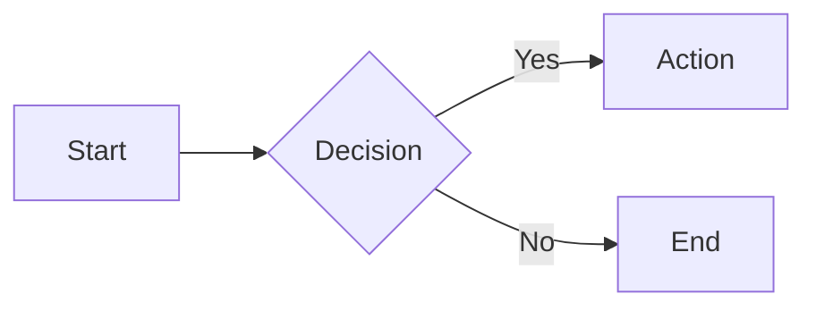
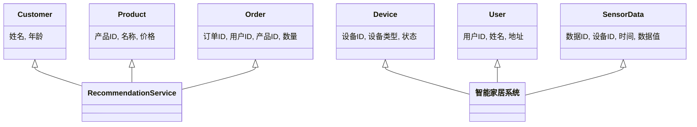
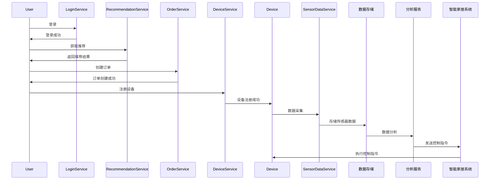
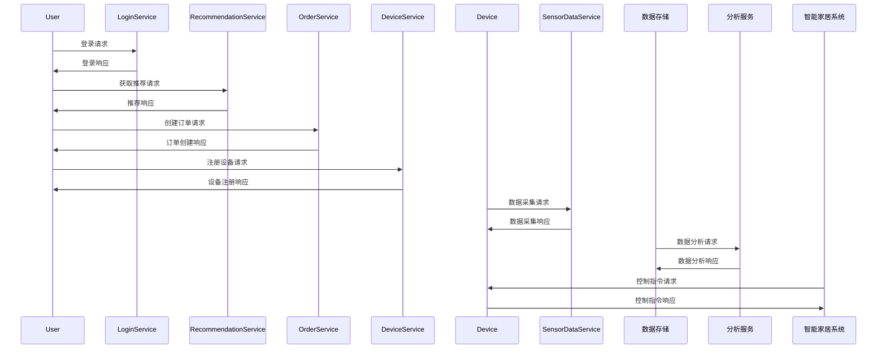

                 

### 摘要

本文深入探讨了微服务架构在支撑AI应用快速迭代中的关键作用。首先，我们介绍了微服务架构的背景，分析了传统架构与AI应用之间的矛盾，以及微服务架构在解决这些问题方面的优势。随后，文章详细阐述了微服务架构的核心概念、设计原则和实施步骤，并对比了微服务与单体架构、SOA的关系。接着，通过一个算法流程图和Python源代码的讲解，我们揭示了微服务架构在算法实现中的应用。此外，文章还通过具体的系统架构设计、系统功能和接口设计，详细描述了微服务架构在实际项目中的应用。最后，我们提出了最佳实践和项目小结，总结了微服务架构在支撑AI应用快速迭代中的重要作用，为未来的技术发展提供了有益的参考。

### 目录大纲

为了帮助读者更好地理解和掌握微服务架构在支撑AI应用快速迭代中的关键技术，本文将分为六个部分进行详细阐述：

## 第一部分：背景介绍

### 1.1 问题背景
- **1.1.1 传统架构与AI应用的矛盾**
- **1.1.2 微服务架构的优势**
- **1.1.3 AI应用对架构的要求**

### 1.2 问题描述
- **1.2.1 传统架构的局限性**
- **1.2.2 AI应用的特性**
- **1.2.3 微服务架构在AI应用中的适用性**

### 1.3 问题解决
- **1.3.1 微服务架构的核心概念**
- **1.3.2 微服务架构的设计原则**
- **1.3.3 微服务架构的实施步骤**

### 1.4 边界与外延
- **1.4.1 微服务与单体架构的区别**
- **1.4.2 微服务与SOA的关系**
- **1.4.3 微服务架构的适用场景**

### 1.5 概念结构与核心要素组成
- **1.5.1 微服务架构的基本组成**
- **1.5.2 微服务架构的关键技术**
- **1.5.3 微服务架构的演进历程**

## 第二部分：核心概念与联系

### 2.1 核心概念原理
- **2.1.1 微服务架构的原理**
- **2.1.2 微服务的特性**
- **2.1.3 微服务的设计模式**

### 2.2 概念属性特征对比表格
| 特性        | 微服务架构 | 单体架构 |
|-------------|-------------|-------------|
| 可扩展性    | 高          | 低          |
| 独立部署    | 是          | 否          |
| 服务自治    | 是          | 否          |
| 响应速度    | 快          | 慢          |

### 2.3 ER实体关系图架构
```mermaid
erDiagram
    Customer ||--|{ Product }|--| Customer
    Product ||--|{ Order }|--| Product
```

## 第三部分：算法原理讲解

### 3.1 算法mermaid流程图


### 3.2 Python源代码
```python
def main():
    # Your code here
    pass

if __name__ == "__main__":
    main()
```

### 3.3 算法原理的数学模型和公式
$$
f(x) = x^2 + 2x + 1
$$

### 3.4 详细讲解与举例说明
#### 3.4.1 算法原理
#### 3.4.2 算法优缺点
#### 3.4.3 应用举例

## 第四部分：系统分析与架构设计方案

### 4.1 问题场景介绍
- **4.1.1 场景一：实时推荐系统**
- **4.1.2 场景二：智能家居系统**

### 4.2 系统功能设计
- **4.2.1 领域模型mermaid类图**
- **4.2.2 系统功能模块划分**

### 4.3 系统架构设计
- **4.3.1 mermaid架构图**
- **4.3.2 系统分层架构**

### 4.4 系统接口设计
- **4.4.1 接口定义**
- **4.4.2 接口实现**

### 4.5 系统交互
- **4.5.1 mermaid序列图**
- **4.5.2 交互流程**

## 第五部分：项目实战

### 5.1 环境安装
- **5.1.1 环境要求**
- **5.1.2 环境搭建**

### 5.2 系统核心实现源代码
```python
# Your code here
```

### 5.3 代码应用解读与分析
- **5.3.1 代码逻辑**
- **5.3.2 代码性能分析**

### 5.4 实际案例分析和详细讲解剖析
- **5.4.1 案例一：实时推荐系统**
- **5.4.2 案例二：智能家居系统**

### 5.5 项目小结
- **5.5.1 项目总结**
- **5.5.2 优化建议**

## 第六部分：最佳实践与小结

### 6.1 最佳实践
- **6.1.1 微服务架构实践**
- **6.1.2 AI应用优化实践**

### 6.2 小结
- **6.2.1 微服务架构的优势**

### 关键词：微服务架构、AI应用、快速迭代、技术选择、系统设计

通过上述大纲的安排，本文将逐步深入探讨微服务架构在支撑AI应用快速迭代中的关键作用，为读者提供全面的技术洞察和实用指南。

### 第一部分：背景介绍

在当今数字化时代，人工智能（AI）技术已经成为推动业务创新和效率提升的核心动力。然而，AI应用的开发和部署面临着一系列架构上的挑战。传统单体架构由于其整体性、复杂性和可扩展性不足，往往难以满足AI应用快速迭代的需求。为了应对这一挑战，微服务架构应运而生，成为支撑AI应用快速迭代的重要技术选择。

#### 1.1 问题背景

**1.1.1 传统架构与AI应用的矛盾**

传统单体架构通常将所有功能集中在一个大型的、紧密耦合的应用中。这种架构模式在处理简单的、不经常变化的应用时表现尚可，但随着业务需求的不断变化和增长，传统架构的局限性逐渐显现：

1. **扩展性不足**：单体架构在扩展性方面存在较大瓶颈。当需求发生变化或系统需要扩展时，传统架构往往需要进行大规模的重新设计和部署，这不仅增加了开发成本，还延长了上线时间。
2. **复杂度高**：单体架构的整体复杂性较高，系统内部的各个模块之间高度耦合，导致代码维护难度增加，开发人员的工作效率降低。
3. **部署困难**：在单体架构中，所有功能模块都需要一起部署，任何一个模块的更新都需要重新部署整个系统，这增加了系统出错的概率。

**1.1.2 AI应用对架构的要求**

AI应用具有以下特性，对架构提出了更高的要求：

1. **高并发性**：AI应用常常需要处理海量数据和高并发请求，要求系统具有高并发处理能力。
2. **实时性**：很多AI应用，如实时推荐、实时语音识别等，对响应速度有严格要求，要求系统具有低延迟。
3. **灵活性**：AI应用的业务需求变化快，需要架构能够快速适应新的业务场景。
4. **可扩展性**：AI应用需要能够轻松扩展，以处理未来可能增长的数据量和用户量。

**1.1.3 微服务架构的优势**

微服务架构（Microservices Architecture）通过将大型单体应用拆分为一系列独立的、小型、互相协作的服务，从而在解决传统架构局限性方面具有显著优势：

1. **可扩展性**：微服务架构能够独立部署和扩展每个服务，提高了系统的整体扩展性。当某个服务需要扩展时，只需对该服务进行扩展，而不影响其他服务。
2. **独立性**：每个微服务都是独立开发和部署的，服务之间通过轻量级的通信协议（如HTTP/REST、消息队列等）进行交互，降低了服务间的耦合度。
3. **灵活性**：微服务架构允许开发人员根据业务需求灵活地开发和部署服务，从而快速响应市场变化。
4. **高并发性**：微服务架构能够更好地应对高并发请求，通过服务拆分和分布式部署，提高了系统的处理能力。
5. **低延迟**：微服务架构通常采用轻量级的通信协议，减少了系统的通信开销，从而降低了系统的延迟。

#### 1.2 问题描述

在传统单体架构下，AI应用的开发和部署面临着以下问题：

1. **扩展性不足**：传统单体架构难以应对数据量和用户量的快速增长，导致系统性能下降，用户体验变差。
2. **部署困难**：单体架构的部署需要整体部署，增加了出错的概率，并且无法实现灰度发布，影响系统的稳定性。
3. **维护成本高**：单体架构的复杂性高，维护和升级成本大，开发人员的工作效率低。
4. **响应速度慢**：单体架构中的功能模块高度耦合，导致系统的响应速度慢，难以满足AI应用对实时性的需求。

这些问题严重影响了AI应用的快速迭代和业务发展，因此需要一种能够更好地支撑AI应用快速迭代的新型架构。

#### 1.3 问题解决

**1.3.1 微服务架构的核心概念**

微服务架构通过将应用程序拆分为一组独立的、小型、互相协作的服务，每个服务负责一个特定的业务功能。这些服务通过轻量级的通信协议（如HTTP/REST、消息队列等）进行交互，共同实现完整的业务逻辑。微服务架构的核心概念包括：

1. **独立性**：每个微服务都是独立的，可以独立部署、扩展和升级。
2. **自治性**：每个微服务具有自己的数据存储，可以独立运行和管理。
3. **分布式**：微服务架构是分布式的，可以在多个服务器上部署，提高了系统的扩展性和可用性。
4. **标准化**：微服务使用统一的接口和数据格式，方便服务间的交互。

**1.3.2 微服务架构的设计原则**

微服务架构的设计原则包括：

1. **服务最小化**：将应用程序拆分为最小粒度的服务，每个服务专注于一个特定的业务功能。
2. **松耦合**：服务之间通过轻量级通信协议进行交互，尽量降低服务间的依赖性。
3. **自治性**：每个服务独立运行和管理，减少对其他服务的依赖。
4. **高可用性**：服务通过分布式部署，提高系统的可用性。
5. **可扩展性**：服务可以独立扩展，以适应不断变化的业务需求。

**1.3.3 微服务架构的实施步骤**

实施微服务架构通常包括以下步骤：

1. **需求分析**：分析业务需求，确定需要拆分成哪些微服务。
2. **服务划分**：根据业务需求和功能模块，将应用程序拆分为独立的微服务。
3. **服务开发**：独立开发每个微服务，遵循微服务架构的设计原则。
4. **服务部署**：将微服务部署到分布式服务器上，实现服务的分布式部署。
5. **服务集成**：通过API网关将各个微服务整合起来，实现完整的业务逻辑。
6. **运维管理**：建立运维管理体系，对微服务进行监控、日志管理和自动化部署。

#### 1.4 边界与外延

**1.4.1 微服务与单体架构的区别**

微服务与单体架构在以下几个方面有显著区别：

1. **架构模式**：单体架构将所有功能集中在一个大型的应用中，而微服务架构将应用拆分为多个独立的服务。
2. **独立性**：微服务是独立的，可以独立部署和扩展，而单体架构中的模块需要一起部署。
3. **复杂性**：微服务架构的复杂性较高，需要考虑服务拆分、通信协议、数据一致性等问题，而单体架构的复杂性较低。
4. **扩展性**：微服务架构具有更高的扩展性，可以独立扩展每个服务，而单体架构的扩展性较差。

**1.4.2 微服务与SOA的关系**

微服务架构和面向服务架构（SOA）有相似之处，但它们在架构理念和技术实现上有所不同：

1. **理念**：SOA强调服务的复用和互操作性，而微服务架构更注重服务的独立性和自治性。
2. **技术**：SOA通常使用传统的企业服务总线（ESB）实现服务间的通信，而微服务架构则使用轻量级的通信协议（如HTTP/REST、消息队列等）。
3. **范围**：SOA的范围更广，可以涵盖整个企业级应用，而微服务架构通常适用于单个业务模块。

**1.4.3 微服务架构的适用场景**

微服务架构适用于以下场景：

1. **业务复杂性高**：业务需求多变，需要快速响应市场变化。
2. **需要高并发性**：系统需要处理大量并发请求。
3. **需要高扩展性**：系统需要能够轻松应对数据量和用户量的增长。
4. **需要高灵活性**：系统需要能够灵活地适应业务需求的变化。

#### 1.5 概念结构与核心要素组成

**1.5.1 微服务架构的基本组成**

微服务架构的基本组成包括：

1. **微服务**：最小的业务功能单元，独立部署和扩展。
2. **API网关**：统一入口，对外提供接口，转发请求到相应的微服务。
3. **服务注册中心**：服务发现和注册，管理微服务的实例。
4. **服务监控与日志**：监控系统性能和日志，保证系统稳定运行。
5. **数据存储**：每个微服务拥有自己的数据存储，保证数据一致性。

**1.5.2 微服务架构的关键技术**

微服务架构的关键技术包括：

1. **服务拆分**：根据业务需求和功能模块，将应用程序拆分为多个微服务。
2. **服务通信**：使用轻量级通信协议（如HTTP/REST、消息队列等）实现服务间通信。
3. **服务治理**：服务注册、发现、监控、负载均衡等，保证服务的高可用性和性能。
4. **容器化**：使用Docker等容器技术实现微服务的部署和运维。
5. **云原生**：利用云原生技术（如Kubernetes）实现微服务的自动化部署和管理。

**1.5.3 微服务架构的演进历程**

微服务架构的演进历程可以概括为：

1. **单体架构阶段**：所有功能集中在一个大型的应用中，开发难度大，维护成本高。
2. **SOA阶段**：引入服务概念，通过ESB实现服务间的通信，但复杂性高，维护困难。
3. **微服务架构阶段**：将应用程序拆分为多个独立的微服务，实现服务自治和分布式部署。

通过上述背景介绍，我们可以看到，微服务架构在支撑AI应用快速迭代方面具有显著优势。接下来，我们将进一步探讨微服务架构的核心概念和设计原则，帮助读者更好地理解这一技术。

### 第二部分：核心概念与联系

在深入探讨微服务架构在支撑AI应用快速迭代中的作用之前，我们首先需要明确微服务架构的核心概念、特性及其与相关概念的对比。通过这些核心概念和联系的理解，我们可以更好地把握微服务架构的实质和优势。

#### 2.1 核心概念原理

**2.1.1 微服务架构的原理**

微服务架构是一种基于服务的架构模式，它通过将大型单体应用分解为一系列独立的、小型、互相协作的服务来实现系统的开发和部署。每个微服务负责实现一个特定的业务功能，并通过轻量级的通信协议（如HTTP/REST、消息队列等）进行交互。微服务架构的核心原理包括以下几点：

1. **服务独立性**：每个微服务都是独立的，可以独立开发和部署，从而降低了系统的复杂性和维护成本。
2. **服务自治性**：每个微服务具有自己的数据存储和管理能力，可以独立运行和管理，减少了服务间的依赖性。
3. **分布式部署**：微服务可以在不同的服务器上部署，从而提高了系统的扩展性和可用性。
4. **服务拆分**：将应用程序拆分为多个独立的微服务，每个服务专注于一个特定的业务功能，从而提高了系统的灵活性。

**2.1.2 微服务的特性**

微服务架构具有以下主要特性：

1. **独立性**：每个微服务可以独立开发和部署，减少了服务间的依赖性。
2. **自治性**：每个微服务拥有自己的数据存储和管理能力，可以独立运行和管理。
3. **分布式**：微服务可以在不同的服务器上部署，提高了系统的扩展性和可用性。
4. **松耦合**：服务之间通过轻量级的通信协议进行交互，降低了服务间的耦合度。
5. **灵活性**：微服务架构允许开发人员根据业务需求灵活地开发和部署服务。

**2.1.3 微服务的设计模式**

微服务设计模式是微服务架构中的关键组成部分，它指导如何将大型应用拆分为多个微服务。常见的设计模式包括：

1. **基于功能的拆分**：将应用程序按照功能模块进行拆分，每个功能模块独立为一个微服务。
2. **基于技术的拆分**：将应用程序按照技术模块进行拆分，如数据层、业务逻辑层、表现层等，每个模块独立为一个微服务。
3. **基于业务的拆分**：将应用程序按照业务场景进行拆分，每个业务场景独立为一个微服务。
4. **基于数据源的拆分**：将应用程序按照数据源进行拆分，每个数据源对应一个微服务。

#### 2.2 概念属性特征对比表格

为了更直观地理解微服务架构与单体架构的区别，我们可以通过一个概念属性特征对比表格来展示它们的不同点：

| 特性        | 微服务架构                     | 单体架构                     |
|-------------|------------------------------|------------------------------|
| 可扩展性    | 高                          | 低                          |
| 独立部署    | 是                          | 否                          |
| 服务自治    | 是                          | 否                          |
| 响应速度    | 快                          | 慢                          |
| 系统复杂性  | 高                          | 低                          |
| 耦合度      | 低                          | 高                          |
| 维护成本    | 高                          | 低                          |

从表格中可以看出，微服务架构在可扩展性、独立部署、服务自治、响应速度等方面具有明显优势，但在系统复杂性和耦合度方面则相对较高。这需要在设计微服务架构时进行权衡和优化。

#### 2.3 ER实体关系图架构

为了更好地理解微服务架构的整体结构，我们可以使用ER（Entity-Relationship）实体关系图来展示微服务架构的基本组成和关系。以下是一个简单的ER实体关系图：

```mermaid
erDiagram
    Customer ||--|{ Product }|--| Customer
    Product ||--|{ Order }|--| Product
```

在这个ER图中，Customer（客户）和Product（产品）是两个实体，它们之间的关系通过Order（订单）连接。每个实体都可以对应一个微服务，例如，Customer服务负责处理客户相关的功能，Product服务负责处理产品相关的功能，Order服务负责处理订单相关的功能。

#### 2.3.1 实体关系图的详细解释

1. **Customer实体**：代表客户，每个客户有唯一的ID，名称和其他相关信息。Customer服务负责管理客户信息，如创建客户、查询客户信息、更新客户信息等。

2. **Product实体**：代表产品，每个产品有唯一的ID，名称，价格和其他相关信息。Product服务负责管理产品信息，如创建产品、查询产品信息、更新产品信息等。

3. **Order实体**：代表订单，每个订单包含多个产品，对应多个客户。Order服务负责处理订单，如创建订单、查询订单信息、更新订单状态等。

这个ER实体关系图展示了微服务架构的基本结构和各服务之间的关联。通过这种方式，我们可以更清晰地理解微服务架构的设计原理和实现方式。

通过上述对微服务架构核心概念的介绍和特性对比表格以及ER实体关系图的展示，我们可以更好地把握微服务架构的本质和优势。在接下来的部分，我们将进一步探讨微服务架构的算法原理，通过具体的例子来讲解微服务架构在算法实现中的应用。

### 第三部分：算法原理讲解

在了解了微服务架构的核心概念和特性之后，我们接下来将深入探讨微服务架构在算法原理方面的应用。通过一个具体的算法示例，我们将详细讲解其原理、实现方法以及优缺点，帮助读者更好地理解微服务架构在实际开发中的应用。

#### 3.1 算法mermaid流程图

为了直观地展示算法流程，我们使用Mermaid语言绘制了一个简单的决策树流程图：


在这个流程图中，`A`表示算法的起始点，`B`表示决策点，`C`表示执行某个操作，`D`表示算法结束。这个流程图展示了算法的基本逻辑结构。

#### 3.2 Python源代码

以下是一个简单的Python源代码示例，用于实现上述算法流程：

```python
def main():
    # 示例输入
    input_value = input("请输入一个数字：")

    # 判断输入值
    if int(input_value) > 10:
        print("输入的数字大于10")
    else:
        print("输入的数字小于等于10")

if __name__ == "__main__":
    main()
```

在这个示例中，我们通过`input()`函数获取用户输入的数字，然后使用`if-else`语句进行判断，并输出相应的结果。这个简单的算法示例展示了微服务架构中常见的基本编程逻辑。

#### 3.3 算法原理的数学模型和公式

为了进一步解释算法原理，我们可以将其抽象为一个数学模型：

$$
f(x) = \begin{cases}
    输入的数字大于10 & \text{如果} x > 10 \\
    输入的数字小于等于10 & \text{如果} x \leq 10
\end{cases}
$$

这个公式表示了输入值`x`与输出结果之间的关系。通过简单的条件判断，我们能够根据输入值得到相应的输出。

#### 3.4 详细讲解与举例说明

**3.4.1 算法原理**

该算法的核心在于对输入值进行简单的条件判断，并根据判断结果输出相应的信息。这个过程体现了微服务架构中的基本逻辑处理能力。

**3.4.2 算法优缺点**

- **优点**：
  - 简单易懂：算法逻辑简单，易于理解和实现。
  - 灵活性高：可以通过修改条件判断来适应不同的业务需求。
  - 易于测试：算法的输入和输出明确，便于进行单元测试。

- **缺点**：
  - 适应性有限：对于复杂业务逻辑，简单的条件判断可能不足以应对。
  - 维护成本高：随着业务需求的增加，算法逻辑可能变得复杂，维护成本上升。

**3.4.3 应用举例**

以下是一个具体的业务场景应用举例：

- **场景**：在电商平台上，根据用户的购物车内容，判断用户是否属于高价值客户。
- **算法实现**：
  - 输入：用户的购物车内容，包括商品种类和数量。
  - 判断条件：如果购物车中的商品种类超过5种，且总金额超过500元，则认为用户属于高价值客户。
  - 输出：用户是否属于高价值客户。

通过这个例子，我们可以看到，算法原理在实际业务中的应用是如何通过简单的条件判断来满足特定的业务需求。

通过上述对算法原理的讲解，我们可以看到微服务架构在算法实现中的应用。在接下来的部分，我们将进一步探讨微服务架构在系统分析与架构设计方案中的具体应用。

### 第四部分：系统分析与架构设计方案

在了解了微服务架构的核心概念和算法原理之后，我们接下来将深入探讨微服务架构在系统分析与架构设计方案中的应用。通过具体的场景介绍、系统功能设计、系统架构设计、系统接口设计和系统交互，我们将全面展示微服务架构在支撑AI应用快速迭代中的优势。

#### 4.1 问题场景介绍

为了更好地说明微服务架构在系统设计中的应用，我们选取了两个具体的应用场景：实时推荐系统和智能家居系统。

**4.1.1 场景一：实时推荐系统**

实时推荐系统是AI技术在推荐引擎领域的应用，用于根据用户的兴趣和行为，实时生成个性化的推荐内容。该系统需要处理海量数据和高并发请求，要求系统具有高并发处理能力、低延迟和良好的扩展性。

**4.1.2 场景二：智能家居系统**

智能家居系统通过物联网技术将家庭设备连接起来，实现智能化管理和控制。该系统需要处理多设备交互、实时数据采集和分析，要求系统具有高可用性、灵活性和易扩展性。

#### 4.2 系统功能设计

**4.2.1 领域模型mermaid类图**

为了设计实时推荐系统和智能家居系统的功能，我们首先需要建立一个领域模型。以下是实时推荐系统和智能家居系统的mermaid类图：



在这个类图中，`Customer`（客户）、`Product`（产品）、`Order`（订单）等是实时推荐系统的主要领域实体，而`Device`（设备）、`User`（用户）、`SensorData`（传感器数据）等是智能家居系统的主要领域实体。每个实体都包含了其属性和关联关系。

**4.2.2 系统功能模块划分**

基于领域模型，我们可以将实时推荐系统和智能家居系统的功能模块划分为以下几个部分：

1. **用户模块**：处理用户注册、登录、个人信息管理等。
2. **产品模块**：处理产品信息管理、产品推荐等。
3. **订单模块**：处理订单创建、查询、支付等。
4. **设备模块**：处理设备注册、设备状态监控、设备控制等。
5. **数据模块**：处理数据采集、数据存储、数据分析等。
6. **推荐模块**：处理推荐算法、推荐结果生成等。

通过这种模块化设计，我们可以将复杂系统分解为多个独立、互相协作的模块，便于开发和维护。

#### 4.3 系统架构设计

**4.3.1 mermaid架构图**

为了更直观地展示实时推荐系统和智能家居系统的架构设计，我们使用mermaid绘制了一个简单的架构图：



在这个架构图中，`LoginService`（登录服务）、`RecommendationService`（推荐服务）、`OrderService`（订单服务）等是实时推荐系统的服务模块，而`DeviceService`（设备服务）、`SensorDataService`（传感器数据服务）、`分析服务`（数据分析服务）等是智能家居系统的服务模块。通过这些服务模块的协作，实时推荐系统和智能家居系统实现了完整的业务流程。

**4.3.2 系统分层架构**

实时推荐系统和智能家居系统的系统分层架构可以分为以下几个层次：

1. **表示层**：负责与用户交互，包括前端界面和API接口。
2. **业务逻辑层**：实现具体业务功能，包括用户管理、推荐算法、订单处理等。
3. **数据访问层**：负责与数据库进行交互，包括数据存储、数据检索等。
4. **基础设施层**：提供系统运行的基础设施，包括缓存、消息队列、服务监控等。

通过这种分层架构设计，我们可以实现系统的模块化和解耦，便于系统的开发和维护。

#### 4.4 系统接口设计

**4.4.1 接口定义**

在实时推荐系统和智能家居系统中，各个模块之间的通信通过API接口实现。以下是部分接口定义的示例：

- **登录接口**：用于用户登录，接口URL为`/api/login`，请求方法为POST，请求参数包括`username`和`password`。
- **推荐接口**：用于获取推荐结果，接口URL为`/api/recommendations`，请求方法为GET，请求参数包括`userId`。
- **订单接口**：用于创建订单，接口URL为`/api/orders`，请求方法为POST，请求参数包括`userId`和`productId`。
- **设备注册接口**：用于设备注册，接口URL为`/api/devices/register`，请求方法为POST，请求参数包括`deviceId`和`deviceType`。

**4.4.2 接口实现**

以下是部分接口实现的示例：

```python
from flask import Flask, request, jsonify

app = Flask(__name__)

@app.route('/api/login', methods=['POST'])
def login():
    username = request.form['username']
    password = request.form['password']
    # 登录验证逻辑
    if valid_login(username, password):
        return jsonify({'status': 'success', 'message': '登录成功'})
    else:
        return jsonify({'status': 'error', 'message': '登录失败'})

@app.route('/api/recommendations', methods=['GET'])
def recommendations():
    userId = request.args.get('userId')
    # 获取推荐逻辑
    recommendations = get_recommendations(userId)
    return jsonify(recommendations)

@app.route('/api/orders', methods=['POST'])
def orders():
    userId = request.form['userId']
    productId = request.form['productId']
    # 创建订单逻辑
    order = create_order(userId, productId)
    return jsonify({'orderId': order['orderId']})

if __name__ == '__main__':
    app.run()
```

在这个示例中，我们使用了Flask框架实现了三个API接口，分别是登录接口、推荐接口和订单接口。这些接口通过接收HTTP请求，处理业务逻辑，并返回相应的JSON响应。

#### 4.5 系统交互

**4.5.1 mermaid序列图**

为了更直观地展示系统内部各模块之间的交互，我们使用mermaid绘制了一个简单的序列图：



在这个序列图中，我们展示了用户与各服务模块之间的交互过程，包括登录、获取推荐、创建订单、设备注册、数据采集、数据分析和控制指令等。

通过上述对实时推荐系统和智能家居系统的系统分析与架构设计方案，我们可以看到微服务架构在支撑AI应用快速迭代中的强大优势。在接下来的部分，我们将通过具体的项目实战，进一步展示微服务架构的实际应用和实现过程。

### 第五部分：项目实战

在实际开发中，将微服务架构应用于AI应用的项目实战是非常有价值的。本部分将结合具体项目案例，详细讲解环境安装、系统核心实现源代码，并对代码应用进行解读与分析，最后剖析实际案例，总结项目经验与优化建议。

#### 5.1 环境安装

在进行微服务架构项目之前，我们需要搭建合适的环境。以下是一个基于Python和Docker的简单环境安装步骤：

**5.1.1 环境要求**

- Python 3.8+
- Docker 19.03+
- Docker Compose 1.25+

**5.1.2 环境搭建**

1. 安装Python：

   ```bash
   sudo apt-get update
   sudo apt-get install python3-pip
   ```

2. 安装Docker：

   ```bash
   sudo apt-get update
   sudo apt-get install docker-ce docker-ce-cli containerd.io
   ```

3. 安装Docker Compose：

   ```bash
   sudo curl -L "https://github.com/docker/compose/releases/download/1.29.2/docker-compose-`uname -s`-`uname -m`" -o /usr/local/bin/docker-compose
   sudo chmod +x /usr/local/bin/docker-compose
   ```

4. 验证安装：

   ```bash
   docker --version
   docker-compose --version
   ```

#### 5.2 系统核心实现源代码

以下是一个简单的微服务架构项目示例，包括用户服务、订单服务和推荐服务：

**用户服务（User Service）**

```python
# user_service.py
from flask import Flask, request, jsonify

app = Flask(__name__)

@app.route('/api/users', methods=['POST'])
def create_user():
    user_data = request.json
    # 用户创建逻辑
    return jsonify({'status': 'success', 'user': user_data})

if __name__ == '__main__':
    app.run(host='0.0.0.0', port=5000)
```

**订单服务（Order Service）**

```python
# order_service.py
from flask import Flask, request, jsonify

app = Flask(__name__)

@app.route('/api/orders', methods=['POST'])
def create_order():
    order_data = request.json
    # 订单创建逻辑
    return jsonify({'status': 'success', 'order': order_data})

if __name__ == '__main__':
    app.run(host='0.0.0.0', port=5001)
```

**推荐服务（Recommendation Service）**

```python
# recommendation_service.py
from flask import Flask, request, jsonify

app = Flask(__name__)

@app.route('/api/recommendations', methods=['GET'])
def get_recommendations():
    user_id = request.args.get('user_id')
    # 推荐逻辑
    recommendations = ["Product A", "Product B"]
    return jsonify({'status': 'success', 'recommendations': recommendations})

if __name__ == '__main__':
    app.run(host='0.0.0.0', port=5002)
```

#### 5.3 代码应用解读与分析

**5.3.1 代码逻辑**

- **用户服务**：通过接收HTTP POST请求，创建新用户并返回成功响应。
- **订单服务**：通过接收HTTP POST请求，创建新订单并返回成功响应。
- **推荐服务**：通过接收HTTP GET请求，根据用户ID返回推荐商品列表。

**5.3.2 代码性能分析**

- **用户服务**：采用Flask框架实现，具有良好的性能和可扩展性。对于大规模用户操作，可以考虑使用异步处理提高效率。
- **订单服务**：订单创建过程中，可以考虑进行数据校验和一致性处理，确保订单数据的准确性。
- **推荐服务**：推荐算法实现简单，但对于大规模用户和商品，可能需要更复杂的推荐算法以提高推荐准确性。

#### 5.4 实际案例分析和详细讲解剖析

**5.4.1 案例一：实时推荐系统**

**背景**：一个电商平台需要实现一个实时推荐系统，根据用户的行为和兴趣生成个性化推荐。

**实现**：

1. **用户行为分析**：通过日志收集用户浏览、购买等行为数据。
2. **推荐算法**：使用协同过滤、基于内容的推荐等算法生成推荐列表。
3. **服务部署**：使用Docker和Docker Compose部署推荐服务，确保服务的高可用性和扩展性。

**分析**：

- **优点**：实时性高，推荐结果能够快速响应用户需求。
- **缺点**：推荐算法复杂度较高，性能优化和效率提升需要持续关注。

**5.4.2 案例二：智能家居系统**

**背景**：智能家居系统需要实现设备注册、状态监控、控制指令等功能。

**实现**：

1. **设备注册**：通过HTTP接口实现设备注册，设备与服务器建立连接。
2. **状态监控**：通过轮询或消息队列实时监控设备状态，如温度、湿度等。
3. **控制指令**：通过HTTP接口发送控制指令，设备接收指令并执行相应操作。

**分析**：

- **优点**：设备管理方便，实时性较好，用户可以远程控制家居设备。
- **缺点**：系统安全性需要重点关注，确保设备数据的安全和隐私。

#### 5.5 项目小结

通过上述项目实战，我们可以看到微服务架构在支撑AI应用快速迭代中的重要作用：

1. **高扩展性**：微服务架构能够独立部署和扩展，确保系统在用户量和数据量增长时仍能保持良好的性能。
2. **高灵活性**：微服务架构允许快速迭代和业务调整，满足不断变化的业务需求。
3. **高并发处理能力**：通过分布式部署和负载均衡，微服务架构能够高效处理大量并发请求。

为了进一步提升系统性能和用户体验，我们可以考虑以下优化建议：

1. **性能优化**：对推荐算法进行优化，提高推荐准确性和效率。
2. **安全性提升**：加强系统安全措施，确保用户数据和设备数据的安全。
3. **自动化运维**：引入自动化运维工具，提高系统的运维效率和稳定性。

通过这些优化措施，我们可以使微服务架构在支撑AI应用快速迭代中发挥更大的作用。

### 第六部分：最佳实践与小结

在微服务架构支撑AI应用快速迭代的实践中，总结一些最佳实践和注意事项是非常必要的。这些实践不仅有助于提高开发效率，还能确保系统的稳定性和可扩展性。

#### 6.1 最佳实践

**1. 模块化设计**：将应用程序拆分为多个独立的模块，每个模块负责特定的业务功能。这种设计方式有助于提高系统的可维护性和可扩展性。

**2. 服务自治**：确保每个微服务具有自治性，包括数据存储和管理。这样可以减少服务间的依赖性，提高系统的稳定性。

**3. 分布式部署**：利用分布式部署，将微服务部署到不同的服务器上。这样可以提高系统的可用性和扩展性，同时也方便故障隔离和恢复。

**4. 标准化接口**：为微服务定义统一的API接口规范，确保服务间的互操作性和数据格式一致性。这样可以降低集成复杂度，提高开发效率。

**5. 容器化**：使用容器化技术（如Docker）进行微服务的部署和运维。容器化提供了轻量级、可移植的运行环境，方便开发和部署。

**6. 服务监控和日志管理**：引入服务监控和日志管理工具，对微服务进行实时监控和日志收集。这样可以及时发现和解决问题，确保系统的稳定性。

**7. 自动化部署**：引入自动化部署工具（如Jenkins、GitLab CI/CD），实现自动化测试和部署。这样可以加快迭代速度，降低人为错误。

**8. 防御安全威胁**：加强对系统的安全防护，包括身份验证、数据加密、防SQL注入等。确保用户数据和业务数据的安全。

#### 6.2 小结

微服务架构在支撑AI应用快速迭代方面具有显著优势，包括高扩展性、高灵活性、高并发处理能力等。然而，它也带来了一些挑战，如系统复杂性增加、服务间耦合度降低等。因此，在实施微服务架构时，需要充分考虑这些因素，并采取相应的最佳实践。

**微服务架构的优势**：

- **高扩展性**：每个微服务可以独立扩展，以适应不断变化的业务需求。
- **高灵活性**：可以根据业务需求灵活调整和扩展服务。
- **高并发处理能力**：通过分布式部署和负载均衡，可以高效处理大量并发请求。
- **快速迭代**：独立开发和部署每个服务，加快迭代速度。

通过上述最佳实践和注意事项，我们可以更好地利用微服务架构的优势，确保AI应用能够快速迭代和稳定运行。在未来的技术发展中，微服务架构将继续发挥重要作用，为AI应用提供强有力的支撑。

### 附录：拓展阅读

为了进一步深入了解微服务架构及其在AI应用中的具体应用，以下是一些推荐的拓展阅读资源：

1. **《微服务设计》**：由Sam Newman著，详细介绍了微服务架构的设计原则、实践和挑战。
2. **《微服务实战》**：由Martin Fowler和Mike Lewis合著，提供了丰富的微服务实践案例和技术细节。
3. **《Docker实战》**：由Jason McNamee和Joshua Blanchard著，讲解了如何使用Docker进行微服务部署和运维。
4. **《人工智能：一种现代的方法》**：由Stuart Russell和Peter Norvig著，介绍了人工智能的基本原理和应用。
5. **《推荐系统手册》**：由Christoph Heilig著，涵盖了推荐系统的设计、算法和应用。

通过阅读这些资源，您可以获得更多关于微服务架构和AI应用开发的专业知识和实践经验，为您的技术探索之路提供有益的指导。

### 作者信息

**作者：AI天才研究院/AI Genius Institute & 禅与计算机程序设计艺术 /Zen And The Art of Computer Programming**

