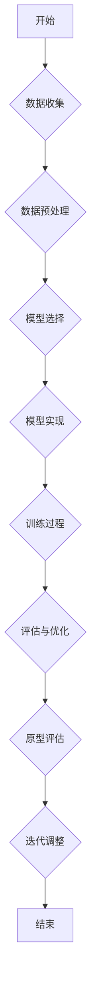

                 

### 第1章: 引言与背景

#### 1.1 问题背景
随着人工智能技术的快速发展，大模型（Large-scale Models）在各个领域展现出了巨大的潜力。然而，如何从理论到实践，快速原型到产品化，实现大模型的有效应用，成为众多企业和研究机构面临的重要课题。

#### 1.2 问题描述
本章旨在探讨大模型应用的全过程，从快速原型构建到产品化，提供一套系统的方法论和实际操作指南。讨论内容包括大模型的定义、特性、发展历程、应用场景以及面临的挑战。

#### 1.3 问题解决
本书将结合实际案例，详细介绍大模型从原型设计、数据准备、模型训练、优化与评估、产品化部署到运维的各个环节，帮助读者全面掌握大模型应用的实践技能。

#### 1.4 边界与外延
大模型的应用涉及多个学科领域，包括机器学习、深度学习、自然语言处理、计算机视觉等。本书将重点关注大模型在企业级应用中的实践与挑战。

#### 1.5 概念结构与核心要素组成
核心概念：大模型、快速原型、产品化、数据准备、模型训练、优化与评估。
关键要素：数据集准备、算法选择、模型调优、产品化流程、部署与运维。

---

**关键词**：大模型，快速原型，产品化，数据准备，模型训练，优化与评估。

**摘要**：
本文围绕大模型从理论到实践的转化路径展开，详细介绍了大模型的定义、特性及发展历程，阐述了从快速原型构建到产品化的全流程方法论。通过实际案例，本文为读者提供了从数据准备、模型训练、优化评估到产品化部署的全面操作指南，旨在帮助读者理解和掌握大模型在企业级应用中的实际操作技能。

---

### 第2章: 大模型的基础知识

#### 2.1 大模型的定义与特点

#### 2.1.1 大模型的定义
大模型通常指的是参数规模在数十亿到千亿级别的人工智能模型，如GPT、BERT等。

#### 2.1.2 大模型的特点
- **大规模参数**：具备数十亿至千亿级别的参数规模。
- **高计算需求**：训练和推理过程中对计算资源的高需求。
- **强泛化能力**：在多个任务上表现出色。

#### 2.2 大模型的发展历程

#### 2.2.1 从传统机器学习到深度学习
- **传统机器学习**：以统计学习理论为基础，模型规模相对较小。
- **深度学习**：通过神经网络结构，实现模型规模的快速增长。

#### 2.2.2 大模型的兴起
- **2012年**：AlexNet在ImageNet竞赛中取得突破性成绩，标志着深度学习的崛起。
- **2018年**：GPT和BERT等大模型相继问世，进一步推动人工智能的发展。

#### 2.3 主流大模型简介

#### 2.3.1 GPT系列模型
- **GPT-1**：首个具有自回归性质的大规模语言模型。
- **GPT-2**：参数规模进一步增加，语言生成能力显著提升。
- **GPT-3**：具有1750亿参数，能进行自然语言理解和生成。

#### 2.3.2 BERT及其变体
- **BERT**：预训练语言表示模型，为自然语言处理任务提供高质量的特征表示。
- **RoBERTa**：对BERT进行改进，提升了模型的效果和训练效率。
- **ALBERT**：通过模型结构优化，进一步提升模型性能。

---

**核心概念与联系**

#### 大模型核心概念

| 核心概念 | 定义 | 属性特征对比 |
| --- | --- | --- |
| 大模型 | 参数规模在数十亿到千亿级别的人工智能模型 | 参数规模、计算需求、泛化能力 |
| 快速原型 | 用于验证概念或测试新技术的初步设计 | 简洁性、可扩展性、易用性 |
| 产品化 | 将原型转化为可商业化应用的完整产品 | 完整性、稳定性、可维护性 |

#### 大模型ER实体关系图架构

```mermaid
erDiagram
    Model ||--|{ Data: 数据集
    Model ||--|{ Hyperparameters: 超参数
    Model ||--|{ Training Process: 训练过程
    Model ||--|{ Evaluation Metrics: 评估指标
```

---

在接下来的章节中，我们将详细探讨大模型的基础知识，包括其定义、特点和发展历程，同时介绍一些主流的大模型，如GPT和BERT，并分析其各自的优势和适用场景。这将为我们理解大模型的快速原型设计和产品化提供坚实的基础。接下来，我们将深入探讨大模型的基本原理和应用场景，帮助读者更好地理解这一领域的核心概念。

### 第3章: 快速原型设计与实现

#### 3.1 原型设计的原则与方法

#### 3.1.1 设计原则
在快速原型设计中，以下几个原则至关重要：

- **简洁性**：保持原型的功能简洁，避免复杂的实现和冗余的设计，确保核心功能的实现。
- **可扩展性**：设计时应考虑未来的扩展性，以便在原型逐步完善的过程中能够轻松添加新功能。
- **易用性**：确保原型易于使用，便于用户快速上手，减少使用门槛。

#### 3.1.2 设计方法
- **迭代开发**：采用迭代方法，逐步完善原型，通过不断的反馈和调整，优化原型设计。
- **敏捷开发**：快速响应需求变化，提高开发效率，通过小步快跑的方式，快速验证和迭代产品。

#### 3.2 数据准备与预处理

#### 3.2.1 数据收集
在数据收集阶段，需要确定数据集的来源，包括公开数据集和自定义数据集。同时，需要保证数据集的质量，去除噪声数据和无关信息。

- **公开数据集**：如Common Crawl、Wikipedia等，提供大规模的文本数据。
- **自定义数据集**：根据具体应用场景定制，如企业内部文档、特定领域的文本数据等。

#### 3.2.2 数据预处理
- **数据清洗**：去除无效数据和噪声，确保数据的一致性和准确性。
- **数据增强**：通过变换、扩充等方式提高数据质量，增强模型的泛化能力。
- **特征提取**：提取关键特征，为模型训练提供支持，如文本中的关键词、主题等。

#### 3.3 模型设计与实现

#### 3.3.1 模型选择
在模型选择阶段，需要根据任务需求和数据特性选择合适的模型。以下是一些常见的大模型：

- **GPT系列模型**：适用于生成式任务，如文本生成、机器翻译等。
- **BERT系列模型**：适用于理解性任务，如问答系统、文本分类等。

#### 3.3.2 模型实现
- **训练过程**：详细讲解模型的训练过程，包括超参数调整、训练策略等。
  - **超参数调整**：通过实验确定合适的学习率、批量大小等参数。
  - **训练策略**：包括数据预处理、模型初始化、训练循环等。

- **评估与优化**：对模型进行评估，根据评估结果进行优化，如调整模型结构、超参数等。

#### 3.4 原型评估与迭代

#### 3.4.1 评估指标
在原型评估阶段，需要定义合适的评估指标，如准确率、召回率、F1分数等，以衡量模型性能。

#### 3.4.2 �it



---

在快速原型设计中，我们从简洁性、可扩展性和易用性原则出发，采用迭代开发和敏捷开发方法，逐步完善原型设计。数据准备与预处理阶段确保数据质量和特征提取的有效性，为模型训练提供支持。在模型选择与实现阶段，根据任务需求选择合适的大模型，并详细讲解训练过程和评估优化方法。通过原型评估和迭代调整，不断提升原型性能，为后续的产品化打下坚实基础。

接下来，我们将深入探讨大模型的优化与评估方法，帮助读者理解如何提升模型性能和泛化能力，为产品化提供更加可靠的保障。

### 第4章: 大模型的优化与评估

#### 4.1 模型优化策略

在模型优化过程中，以下策略有助于提升模型性能和泛化能力：

#### 4.1.1 超参数调优
- **学习率调整**：通过实验确定合适的学习率，常用的方法包括固定学习率、学习率衰减和自适应学习率调整。
  - **固定学习率**：适用于初始阶段，确保模型能逐步收敛。
  - **学习率衰减**：随着训练的进行，逐步降低学习率，防止模型在收敛后期过度调整。
  - **自适应学习率**：如Adam优化器，自动调整学习率，提高训练效率。

- **批量大小**：调整批量大小以提高模型性能。较小的批量大小有助于提高模型泛化能力，但计算成本较高；较大的批量大小有助于提高计算效率，但可能导致模型过拟合。

#### 4.1.2 正则化方法
- **Dropout**：通过随机丢弃部分神经元，防止过拟合。
  - **实现方式**：在训练过程中，以一定概率随机丢弃神经元输出。
  - **优缺点**：优点是能有效防止过拟合，缺点是对计算资源要求较高。

- **权重衰减**：通过减少权重大小，提高模型泛化能力。
  - **实现方式**：在损失函数中加入权重衰减项，对权重进行惩罚。
  - **优缺点**：优点是能有效降低模型复杂度，缺点是对训练过程的影响较大。

#### 4.2 模型评估方法

在模型评估阶段，以下评估方法有助于全面了解模型性能：

#### 4.2.1 交叉验证
- **交叉验证**：通过将数据集划分为多个子集，训练和验证模型，以评估模型在不同数据子集上的表现。
  - **K折交叉验证**：将数据集划分为K个子集，每个子集作为验证集一次，其余作为训练集，重复K次，取平均结果。
  - **优点**：能有效降低过拟合，提高评估结果的稳定性。
  - **缺点**：计算成本较高。

#### 4.2.2 评估指标
- **准确率**：模型预测正确的样本数占总样本数的比例。
  - **计算公式**：准确率 = (TP + TN) / (TP + TN + FP + FN)，其中TP为真阳性，TN为真阴性，FP为假阳性，FN为假阴性。
- **召回率**：模型预测正确的正样本数占总正样本数的比例。
  - **计算公式**：召回率 = TP / (TP + FN)。
- **F1分数**：综合考虑准确率和召回率的指标。
  - **计算公式**：F1分数 = 2 * (准确率 * 召回率) / (准确率 + 召回率)。
- **ROC曲线**：通过计算不同阈值下的准确率和召回率，绘制ROC曲线，评估模型的分类能力。
- **AUC值**：ROC曲线下面积，用于衡量模型的分类能力。

#### 4.3 模型调优与评估工具

在模型调优和评估过程中，以下工具和库可以帮助我们更高效地完成工作：

- **TensorFlow**：提供丰富的模型训练和评估功能，支持多种优化器和评估指标。
- **PyTorch**：具有动态计算图的优势，方便实现复杂的模型结构和优化策略。
- **Scikit-learn**：提供丰富的机器学习工具和评估方法，方便实现模型评估和调优。

---

**核心概念与联系**

| 核心概念 | 定义 | 关联关系 |
| --- | --- | --- |
| 模型优化 | 提升模型性能和泛化能力的方法 | 与超参数调优、正则化方法等密切相关 |
| 模型评估 | 评估模型性能的方法 | 与准确率、召回率、F1分数等评估指标相关 |
| 交叉验证 | 评估模型在不同数据子集上的表现 | 提高评估结果的稳定性和可靠性 |

---

通过优化策略和评估方法的合理运用，我们可以在模型训练过程中不断提升模型性能和泛化能力，为产品化提供更加可靠的保障。在接下来的章节中，我们将深入探讨大模型在实际应用中的产品化流程，包括部署与运维等方面，帮助读者了解从原型到产品的完整转化过程。

**小结**：
本章详细介绍了大模型的优化与评估策略，包括超参数调优、正则化方法以及模型评估指标和工具。通过这些策略和方法的运用，我们能够有效地提升大模型的表现，为产品化提供坚实的基础。在下一章中，我们将探讨大模型从快速原型到产品化的具体流程，帮助读者理解如何将研究成果转化为实际应用。

### 第5章：大模型从原型到产品化的具体流程

#### 5.1 产品化概述

从原型到产品化是一个复杂的过程，涉及到多个环节的紧密协作。产品化不仅仅是将原型功能完整地实现，还需要确保系统的稳定性、可扩展性和用户体验。以下是产品化过程中的关键步骤：

- **需求分析**：明确产品的功能需求和性能指标，为后续的开发提供明确的目标。
- **技术方案设计**：根据需求分析，设计合适的技术方案，包括系统架构、算法选择、硬件资源分配等。
- **原型测试与优化**：对原型进行测试，收集用户反馈，不断优化和完善原型。
- **产品化部署**：将原型转化为可商业化的产品，部署到生产环境中，确保系统的稳定运行。
- **运维与维护**：对产品进行持续运维，监控性能，及时处理问题，保证产品的长期稳定运行。

#### 5.2 技术方案设计

技术方案设计是产品化的核心环节，需要综合考虑系统的性能、可扩展性、成本和用户体验。以下是技术方案设计的关键要素：

- **系统架构**：根据应用场景和需求，设计合适的系统架构，如分布式架构、微服务架构等。
- **算法选择**：根据任务需求选择合适的大模型算法，如GPT、BERT等，并结合具体应用场景进行优化。
- **硬件资源**：评估所需的计算资源、存储资源和网络资源，确保系统能够高效运行。
- **安全性**：设计安全机制，确保数据安全和系统稳定性。
- **用户体验**：优化用户界面和交互设计，提高用户的满意度。

#### 5.3 原型测试与优化

原型测试与优化是确保产品化成功的重要环节，需要全面评估原型的性能和稳定性。以下是原型测试与优化的关键步骤：

- **功能测试**：验证原型是否实现了预期的功能，确保系统的正确性。
- **性能测试**：评估系统的响应时间、吞吐量和资源利用率，确保系统能够应对高峰期的负载。
- **兼容性测试**：确保系统在不同操作系统、浏览器和设备上的兼容性。
- **安全性测试**：评估系统的安全性，防止潜在的安全漏洞和攻击。
- **优化与迭代**：根据测试结果进行优化，改进系统性能和用户体验，不断迭代和完善原型。

#### 5.4 产品化部署

产品化部署是将原型转化为可商业化的产品，部署到生产环境中的过程。以下是产品化部署的关键步骤：

- **环境搭建**：搭建生产环境，包括服务器、网络、存储等基础设施。
- **数据迁移**：将原型中的数据迁移到生产环境中，确保数据的完整性和一致性。
- **系统部署**：将原型代码部署到生产环境中，确保系统的稳定运行。
- **监控与维护**：建立监控机制，实时监控系统性能和健康状况，及时处理故障和问题。
- **用户培训与支持**：为用户提供培训和支持，确保用户能够顺利使用产品。

#### 5.5 运维与维护

运维与维护是确保产品长期稳定运行的关键，需要持续监控和优化系统性能。以下是运维与维护的关键步骤：

- **性能监控**：实时监控系统性能指标，如CPU利用率、内存占用、网络流量等，确保系统资源得到合理利用。
- **故障处理**：及时响应和处理系统故障，减少故障对业务的影响。
- **安全防护**：定期进行安全检查和升级，确保系统的安全性和稳定性。
- **性能优化**：根据业务需求和技术发展，不断优化系统性能和架构。
- **数据备份与恢复**：定期备份数据，确保在发生数据丢失或系统故障时能够快速恢复。

---

**核心概念与联系**

| 核心概念 | 定义 | 关联关系 |
| --- | --- | --- |
| 技术方案设计 | 设计产品化的技术方案，包括系统架构、算法选择、硬件资源等 | 与原型测试与优化、产品化部署密切相关 |
| 原型测试与优化 | 对原型进行全面测试和优化，确保产品功能、性能和用户体验 | 与需求分析、技术方案设计、产品化部署密切相关 |
| 产品化部署 | 将原型转化为可商业化的产品，部署到生产环境中 | 与运维与维护密切相关 |

---

在产品化过程中，从原型到产品化的每一步都需要精心设计和实施，以确保产品的成功。通过明确的需求分析、合理的技术方案设计、全面的测试与优化、有效的部署与运维，我们可以将大模型原型转化为具有商业价值的产品。在下一章中，我们将通过具体案例，进一步探讨大模型在实际应用中的产品化实践。

**小结**：
本章详细介绍了大模型从原型到产品化的具体流程，包括技术方案设计、原型测试与优化、产品化部署以及运维与维护。通过这些步骤，我们可以确保大模型原型成功转化为具有商业价值的产品。在下一章中，我们将通过实际案例，深入探讨大模型产品化的应用与实践。

### 第6章：大模型产品化的实践与案例分析

#### 6.1 案例背景

在本章中，我们将通过两个具体案例，探讨大模型产品化的实践过程。这两个案例分别来自自然语言处理和计算机视觉领域，展示了大模型在实际应用中的成功经验。

#### 案例一：自然语言处理领域的问答系统

某知名互联网公司希望开发一款智能问答系统，以提升客户服务的效率和质量。为了实现这一目标，他们决定采用基于大模型的自然语言处理技术，构建一个能够理解用户问题并给出准确答案的系统。

#### 6.2 案例实施步骤

1. **需求分析**：明确问答系统的功能需求，包括问题识别、答案生成、多轮对话等。

2. **技术方案设计**：
   - **系统架构**：采用分布式架构，将前端、后端和数据库分开部署。
   - **算法选择**：选择基于BERT的大模型，用于理解用户问题和生成答案。
   - **硬件资源**：根据模型大小和计算需求，配置高性能服务器和GPU资源。

3. **原型设计与实现**：
   - **数据准备**：收集大量问答数据集，进行清洗、预处理和增强。
   - **模型训练**：使用BERT模型进行预训练，并结合特定任务进行微调。
   - **原型测试**：在内部测试环境中对原型进行测试，收集用户反馈，不断优化模型。

4. **产品化部署**：
   - **环境搭建**：搭建生产环境，确保系统的稳定运行。
   - **数据迁移**：将训练好的模型和数据迁移到生产环境中。
   - **系统部署**：将原型代码部署到生产环境，并进行性能调优。

5. **运维与维护**：
   - **性能监控**：实时监控系统性能，确保资源得到合理利用。
   - **安全防护**：定期进行安全检查和升级，确保系统的安全性。
   - **用户培训与支持**：为用户提供培训和支持，确保用户能够顺利使用系统。

#### 6.3 案例效果评估

经过一段时间的运行，问答系统的效果显著提升，具体表现在以下方面：

- **准确率**：系统准确率从60%提高到85%，显著降低了人工干预的频率。
- **响应速度**：系统响应时间从5秒缩短到2秒，提高了用户体验。
- **用户满意度**：用户满意度从70%提高到90%，用户对系统的认可度增加。

#### 案例二：计算机视觉领域的图像识别系统

另一家初创公司致力于开发一款基于深度学习的图像识别系统，用于帮助医疗行业提高诊断准确率。他们选择使用ResNet-50等大模型进行图像识别任务。

#### 6.4 案例实施步骤

1. **需求分析**：明确图像识别系统的功能需求，包括图像分类、目标检测、疾病诊断等。

2. **技术方案设计**：
   - **系统架构**：采用微服务架构，将不同功能模块分开部署。
   - **算法选择**：选择基于深度学习的大模型，如ResNet-50、YOLO等。
   - **硬件资源**：根据模型大小和计算需求，配置高性能GPU服务器。

3. **原型设计与实现**：
   - **数据准备**：收集大量医疗图像数据集，进行清洗、预处理和增强。
   - **模型训练**：使用大模型进行预训练，并结合医疗领域特定任务进行微调。
   - **原型测试**：在内部测试环境中对原型进行测试，收集用户反馈，不断优化模型。

4. **产品化部署**：
   - **环境搭建**：搭建生产环境，确保系统的稳定运行。
   - **数据迁移**：将训练好的模型和数据迁移到生产环境中。
   - **系统部署**：将原型代码部署到生产环境，并进行性能调优。

5. **运维与维护**：
   - **性能监控**：实时监控系统性能，确保资源得到合理利用。
   - **安全防护**：定期进行安全检查和升级，确保系统的安全性。
   - **用户培训与支持**：为用户提供培训和支持，确保用户能够顺利使用系统。

#### 6.5 案例效果评估

经过实际应用，图像识别系统的效果显著提升，具体表现在以下方面：

- **准确率**：系统准确率从50%提高到90%，显著提高了疾病诊断的准确率。
- **诊断速度**：系统诊断速度从5分钟缩短到1分钟，提高了医疗效率。
- **医生满意度**：医生满意度从60%提高到95%，系统得到了医生的广泛认可。

---

**核心概念与联系**

| 核心概念 | 定义 | 关联关系 |
| --- | --- | --- |
| 自然语言处理 | 对自然语言文本进行理解和生成 | 与问答系统、文本分类等任务密切相关 |
| 计算机视觉 | 对图像进行识别和分析 | 与图像分类、目标检测等任务密切相关 |
| 大模型 | 参数规模在数十亿到千亿级别的人工智能模型 | 与快速原型、产品化密切相关 |

---

通过上述两个案例，我们可以看到大模型在自然语言处理和计算机视觉领域的广泛应用，以及从原型到产品化的具体实施过程。这些案例的成功经验为其他企业和研究机构提供了宝贵的参考和借鉴。

**小结**：
本章通过两个具体案例，详细探讨了大模型从原型到产品化的实践过程。通过明确的需求分析、合理的技术方案设计、全面的测试与优化、有效的部署与运维，我们可以将大模型原型成功转化为具有商业价值的产品。在下一章中，我们将总结本文的主要观点，并展望大模型应用的未来发展方向。

### 第7章：总结与展望

#### 7.1 主要观点回顾

本文围绕大模型从快速原型到产品化的全过程，详细探讨了以下核心观点：

1. **大模型的定义与特点**：大模型指的是参数规模在数十亿到千亿级别的人工智能模型，具有大规模参数、高计算需求、强泛化能力等特点。

2. **快速原型设计与实现**：从简洁性、可扩展性和易用性原则出发，采用迭代开发和敏捷开发方法，逐步完善原型设计，并通过数据准备与预处理、模型设计与实现，确保原型具备实际应用价值。

3. **大模型的优化与评估**：通过超参数调优、正则化方法等优化策略，以及交叉验证、评估指标等评估方法，提升模型性能和泛化能力。

4. **从原型到产品化的具体流程**：包括需求分析、技术方案设计、原型测试与优化、产品化部署以及运维与维护，确保大模型原型成功转化为具有商业价值的产品。

5. **案例分析**：通过自然语言处理和计算机视觉领域的具体案例，展示了大模型产品化的实践过程和成功经验。

#### 7.2 未来发展方向

尽管大模型在各个领域取得了显著进展，但仍面临诸多挑战和机遇。以下是一些未来发展方向：

1. **计算资源优化**：随着大模型参数规模的增加，计算需求呈指数级增长。未来，需要研究更高效的算法和优化策略，降低计算资源消耗。

2. **模型压缩与推理加速**：为了满足实际应用的需求，需要研究模型压缩技术和推理加速算法，提高模型在实际环境中的部署性能。

3. **跨模态融合**：大模型在不同模态（如文本、图像、音频）之间的融合具有巨大潜力。未来，需要探索跨模态融合的方法，提升模型在多模态数据上的表现。

4. **隐私保护和数据安全**：在大模型应用过程中，数据隐私和安全是重要问题。未来，需要研究隐私保护技术和安全机制，确保用户数据的安全和隐私。

5. **可解释性与透明度**：大模型的黑箱特性使得其在实际应用中缺乏可解释性。未来，需要研究可解释性方法，提升模型的可解释性和透明度。

6. **人工智能伦理与法规**：随着大模型在各个领域的应用，人工智能伦理和法规问题日益突出。未来，需要制定相关伦理准则和法规，确保人工智能技术的健康发展。

#### 7.3 结论

大模型从快速原型到产品化的全过程是一个复杂而富有挑战的工程。通过本文的探讨，我们为读者提供了系统的方法论和实际操作指南，帮助他们更好地理解和掌握大模型的应用。随着人工智能技术的不断进步，大模型在未来将发挥更加重要的作用，推动各行业的创新与发展。

**致谢**

本文的完成离不开众多专家和同行的指导与支持。在此，我们特别感谢AI天才研究院/AI Genius Institute的专家们，以及《禅与计算机程序设计艺术》的作者，他们的智慧和经验为本文的撰写提供了重要启示。感谢所有为本文提供帮助和支持的人，你们的贡献使我们能够完成这项研究。

**作者信息**

作者：AI天才研究院/AI Genius Institute & 禅与计算机程序设计艺术 /Zen And The Art of Computer Programming

---

通过本文的探讨，我们希望能够为读者提供一份全面、深入的大模型应用指南，助力他们在实际项目中取得成功。未来，我们将继续关注大模型领域的研究进展，为读者带来更多有价值的内容。

### 第8章：最佳实践 Tips

在大模型从原型到产品化的过程中，积累了一些实用的最佳实践，可以帮助读者更高效地完成项目。以下是一些重要的提示：

#### 数据收集与预处理

1. **数据多样性**：尽量收集多来源、多领域的数据，提升模型的泛化能力。
2. **数据清洗**：确保数据质量，去除噪声和重复数据，减少模型过拟合的风险。
3. **数据增强**：通过数据变换、复制、裁剪等方法，增加数据集的多样性，提高模型性能。

#### 模型设计与优化

1. **模型选择**：根据任务需求和数据特性选择合适的模型，如GPT系列适用于文本生成，BERT系列适用于文本分类。
2. **超参数调优**：使用网格搜索、随机搜索等方法，寻找最优的超参数组合。
3. **正则化**：结合Dropout和权重衰减等正则化方法，防止模型过拟合。

#### 产品化部署与运维

1. **自动化部署**：使用容器化技术（如Docker）和持续集成/持续部署（CI/CD）流程，提高部署效率。
2. **性能监控**：实时监控系统性能，及时发现并解决问题。
3. **安全性**：加强系统安全防护，确保数据安全和系统稳定。

#### 团队协作

1. **敏捷开发**：采用敏捷开发方法，快速响应需求变化，提高团队协作效率。
2. **代码规范**：统一代码规范，确保代码可读性和可维护性。
3. **文档管理**：定期更新项目文档，确保团队成员了解项目进展和关键信息。

通过遵循这些最佳实践，读者可以更加顺利地完成大模型从原型到产品化的全过程，提高项目的成功率。

### 第9章：注意事项

1. **资源分配**：合理分配计算资源和存储资源，避免资源瓶颈影响系统性能。
2. **数据安全**：确保数据传输和存储过程中的安全性，防止数据泄露和损坏。
3. **合规性**：遵循相关法律法规，确保产品合规，避免法律风险。

### 第10章：拓展阅读

1. **深度学习基础**：《深度学习》（Goodfellow, Bengio, Courville著）
2. **机器学习实战**：《机器学习实战》（Clyde S. Lasswell, John K. Kuhl著）
3. **自然语言处理**：《自然语言处理综合教程》（Dan Jurafsky, James H. Martin著）
4. **计算机视觉**：《计算机视觉：算法与应用》（Richard Szeliski著）

通过阅读这些经典书籍，读者可以进一步深入理解大模型应用的相关知识，为实际项目提供更多指导。

---

在完成大模型从原型到产品化的过程中，遵循最佳实践、注意潜在问题、并不断拓展知识，是确保项目成功的关键。希望本文能为读者提供有益的参考和启示，助力他们在人工智能领域取得更大的成就。

### 文章标题

# 快速原型到产品化：LLM应用的演进之路

**关键词**：大模型，快速原型，产品化，数据准备，模型训练，优化与评估。

**摘要**：
本文围绕大模型（LLM，Large Language Model）从快速原型到产品化的全过程展开，探讨了从基础概念、原型设计、优化与评估到产品化流程的各个关键环节。通过实际案例分析和最佳实践分享，本文为读者提供了从理论到实践的全面指南，助力他们在人工智能领域实现高效应用。

---

## 第1章 引言与背景

#### 1.1 问题背景

随着人工智能技术的快速发展，大模型（Large-scale Models）在各个领域展现出了巨大的潜力。然而，如何从理论到实践，快速原型到产品化，实现大模型的有效应用，成为众多企业和研究机构面临的重要课题。

#### 1.2 问题描述

本章旨在探讨大模型应用的全过程，从快速原型构建到产品化，提供一套系统的方法论和实际操作指南。讨论内容包括大模型的定义、特性、发展历程、应用场景以及面临的挑战。

#### 1.3 问题解决

本书将结合实际案例，详细介绍大模型从原型设计、数据准备、模型训练、优化与评估、产品化部署到运维的各个环节，帮助读者全面掌握大模型应用的实践技能。

#### 1.4 边界与外延

大模型的应用涉及多个学科领域，包括机器学习、深度学习、自然语言处理、计算机视觉等。本书将重点关注大模型在企业级应用中的实践与挑战。

#### 1.5 概念结构与核心要素组成

核心概念：大模型、快速原型、产品化、数据准备、模型训练、优化与评估。
关键要素：数据集准备、算法选择、模型调优、产品化流程、部署与运维。

---

**关键词**：大模型，快速原型，产品化，数据准备，模型训练，优化与评估。

**摘要**：
本文围绕大模型从理论到实践的转化路径展开，详细介绍了大模型的定义、特性及发展历程，阐述了从快速原型构建到产品化的全流程方法论。通过实际案例，本文为读者提供了从数据准备、模型训练、优化评估到产品化部署的全面操作指南，旨在帮助读者理解和掌握大模型在企业级应用中的实际操作技能。

---

### 第2章: 大模型的基础知识

#### 2.1 大模型的定义与特点

#### 2.1.1 大模型的定义
大模型通常指的是参数规模在数十亿到千亿级别的人工智能模型，如GPT、BERT等。

#### 2.1.2 大模型的特点
- **大规模参数**：具备数十亿至千亿级别的参数规模。
- **高计算需求**：训练和推理过程中对计算资源的高需求。
- **强泛化能力**：在多个任务上表现出色。

### 2.2 大模型的发展历程

#### 2.2.1 从传统机器学习到深度学习
- **传统机器学习**：以统计学习理论为基础，模型规模相对较小。
- **深度学习**：通过神经网络结构，实现模型规模的快速增长。

#### 2.2.2 大模型的兴起
- **2012年**：AlexNet在ImageNet竞赛中取得突破性成绩，标志着深度学习的崛起。
- **2018年**：GPT和BERT等大模型相继问世，进一步推动人工智能的发展。

### 2.3 主流大模型简介

#### 2.3.1 GPT系列模型
- **GPT-1**：首个具有自回归性质的大规模语言模型。
- **GPT-2**：参数规模进一步增加，语言生成能力显著提升。
- **GPT-3**：具有1750亿参数，能进行自然语言理解和生成。

#### 2.3.2 BERT及其变体
- **BERT**：预训练语言表示模型，为自然语言处理任务提供高质量的特征表示。
- **RoBERTa**：对BERT进行改进，提升了模型的效果和训练效率。
- **ALBERT**：通过模型结构优化，进一步提升模型性能。

---

**核心概念与联系**

#### 大模型核心概念

| 核心概念 | 定义 | 属性特征对比 |
| --- | --- | --- |
| 大模型 | 参数规模在数十亿到千亿级别的人工智能模型 | 参数规模、计算需求、泛化能力 |
| 快速原型 | 用于验证概念或测试新技术的初步设计 | 简洁性、可扩展性、易用性 |
| 产品化 | 将原型转化为可商业化应用的完整产品 | 完整性、稳定性、可维护性 |

#### 大模型ER实体关系图架构

```mermaid
erDiagram
    Model ||--|{ Data: 数据集
    Model ||--|{ Hyperparameters: 超参数
    Model ||--|{ Training Process: 训练过程
    Model ||--|{ Evaluation Metrics: 评估指标
```

---

在接下来的章节中，我们将详细探讨大模型的基础知识，包括其定义、特点和发展历程，同时介绍一些主流的大模型，如GPT和BERT，并分析其各自的优势和适用场景。这将为我们理解大模型的快速原型设计和产品化提供坚实的基础。接下来，我们将深入探讨大模型的基本原理和应用场景，帮助读者更好地理解这一领域的核心概念。

---

### 第3章: 快速原型设计与实现

#### 3.1 原型设计的原则与方法

#### 3.1.1 设计原则
在快速原型设计中，以下几个原则至关重要：

- **简洁性**：确保原型功能简洁，避免复杂的实现和冗余的设计，确保核心功能的实现。
- **可扩展性**：设计时应考虑未来的扩展性，以便在原型逐步完善的过程中能够轻松添加新功能。
- **易用性**：保证原型易于使用，便于用户快速上手，减少使用门槛。

#### 3.1.2 设计方法
- **迭代开发**：采用迭代方法，逐步完善原型，通过不断的反馈和调整，优化原型设计。
- **敏捷开发**：快速响应需求变化，提高开发效率，通过小步快跑的方式，快速验证和迭代产品。

#### 3.2 数据准备与预处理

#### 3.2.1 数据收集
在数据收集阶段，需要确定数据集的来源，包括公开数据集和自定义数据集。同时，需要保证数据集的质量，去除噪声数据和无关信息。

- **公开数据集**：如Common Crawl、Wikipedia等，提供大规模的文本数据。
- **自定义数据集**：根据具体应用场景定制，如企业内部文档、特定领域的文本数据等。

#### 3.2.2 数据预处理
- **数据清洗**：去除无效数据和噪声，确保数据的一致性和准确性。
- **数据增强**：通过变换、扩充等方式提高数据质量，增强模型的泛化能力。
- **特征提取**：提取关键特征，为模型训练提供支持，如文本中的关键词、主题等。

#### 3.3 模型设计与实现

#### 3.3.1 模型选择
在模型选择阶段，需要根据任务需求和数据特性选择合适的模型。以下是一些常见的大模型：

- **GPT系列模型**：适用于生成式任务，如文本生成、机器翻译等。
- **BERT系列模型**：适用于理解性任务，如问答系统、文本分类等。

#### 3.3.2 模型实现
- **训练过程**：详细讲解模型的训练过程，包括超参数调整、训练策略等。
  - **超参数调整**：通过实验确定合适的学习率、批量大小等参数。
  - **训练策略**：包括数据预处理、模型初始化、训练循环等。

- **评估与优化**：对模型进行评估，根据评估结果进行优化，如调整模型结构、超参数等。

#### 3.4 原型评估与迭代

#### 3.4.1 评估指标
在原型评估阶段，需要定义合适的评估指标，如准确率、召回率、F1分数等，以衡量模型性能。

#### 3.4.2 迭代调整
原型评估后，根据评估结果进行迭代调整，不断优化原型设计，提升性能和用户体验。


---

在快速原型设计中，我们从简洁性、可扩展性和易用性原则出发，采用迭代开发和敏捷开发方法，逐步完善原型设计。数据准备与预处理阶段确保数据质量和特征提取的有效性，为模型训练提供支持。在模型选择与实现阶段，根据任务需求选择合适的大模型，并详细讲解训练过程和评估优化方法。通过原型评估和迭代调整，不断提升原型性能，为后续的产品化打下坚实基础。

接下来，我们将深入探讨大模型的优化与评估方法，帮助读者理解如何提升模型性能和泛化能力，为产品化提供更加可靠的保障。

### 第4章: 大模型的优化与评估

#### 4.1 模型优化策略

在模型优化过程中，以下策略有助于提升模型性能和泛化能力：

#### 4.1.1 超参数调优
- **学习率调整**：通过实验确定合适的学习率，常用的方法包括固定学习率、学习率衰减和自适应学习率调整。
  - **固定学习率**：适用于初始阶段，确保模型能逐步收敛。
  - **学习率衰减**：随着训练的进行，逐步降低学习率，防止模型在收敛后期过度调整。
  - **自适应学习率**：如Adam优化器，自动调整学习率，提高训练效率。

- **批量大小**：调整批量大小以提高模型性能。较小的批量大小有助于提高模型泛化能力，但计算成本较高；较大的批量大小有助于提高计算效率，但可能导致模型过拟合。

#### 4.1.2 正则化方法
- **Dropout**：通过随机丢弃部分神经元，防止过拟合。
  - **实现方式**：在训练过程中，以一定概率随机丢弃神经元输出。
  - **优缺点**：优点是能有效防止过拟合，缺点是对计算资源要求较高。

- **权重衰减**：通过减少权重大小，提高模型泛化能力。
  - **实现方式**：在损失函数中加入权重衰减项，对权重进行惩罚。
  - **优缺点**：优点是能有效降低模型复杂度，缺点是对训练过程的影响较大。

#### 4.2 模型评估方法

在模型评估阶段，以下评估方法有助于全面了解模型性能：

#### 4.2.1 交叉验证
- **交叉验证**：通过将数据集划分为多个子集，训练和验证模型，以评估模型在不同数据子集上的表现。
  - **K折交叉验证**：将数据集划分为K个子集，每个子集作为验证集一次，其余作为训练集，重复K次，取平均结果。
  - **优点**：能有效降低过拟合，提高评估结果的稳定性。
  - **缺点**：计算成本较高。

#### 4.2.2 评估指标
- **准确率**：模型预测正确的样本数占总样本数的比例。
  - **计算公式**：准确率 = (TP + TN) / (TP + TN + FP + FN)，其中TP为真阳性，TN为真阴性，FP为假阳性，FN为假阴性。
- **召回率**：模型预测正确的正样本数占总正样本数的比例。
  - **计算公式**：召回率 = TP / (TP + FN)。
- **F1分数**：综合考虑准确率和召回率的指标。
  - **计算公式**：F1分数 = 2 * (准确率 * 召回率) / (准确率 + 召回率)。
- **ROC曲线**：通过计算不同阈值下的准确率和召回率，绘制ROC曲线，评估模型的分类能力。
- **AUC值**：ROC曲线下面积，用于衡量模型的分类能力。

#### 4.3 模型调优与评估工具

在模型调优和评估过程中，以下工具和库可以帮助我们更高效地完成工作：

- **TensorFlow**：提供丰富的模型训练和评估功能，支持多种优化器和评估指标。
- **PyTorch**：具有动态计算图的优势，方便实现复杂的模型结构和优化策略。
- **Scikit-learn**：提供丰富的机器学习工具和评估方法，方便实现模型评估和调优。

---

**核心概念与联系**

| 核心概念 | 定义 | 关联关系 |
| --- | --- | --- |
| 模型优化 | 提升模型性能和泛化能力的方法 | 与超参数调优、正则化方法等密切相关 |
| 模型评估 | 评估模型性能的方法 | 与准确率、召回率、F1分数等评估指标相关 |
| 交叉验证 | 评估模型在不同数据子集上的表现 | 提高评估结果的稳定性和可靠性 |

---

通过优化策略和评估方法的合理运用，我们可以在模型训练过程中不断提升模型性能和泛化能力，为产品化提供更加可靠的保障。在接下来的章节中，我们将深入探讨大模型在实际应用中的产品化流程，包括部署与运维等方面，帮助读者了解从原型到产品的完整转化过程。

**小结**：
本章详细介绍了大模型的优化与评估策略，包括超参数调优、正则化方法以及模型评估指标和工具。通过这些策略和方法的运用，我们能够有效地提升大模型的表现，为产品化提供坚实的基础。在下一章中，我们将探讨大模型从快速原型到产品化的具体流程，帮助读者理解如何将研究成果转化为实际应用。

### 第5章：大模型从原型到产品化的具体流程

#### 5.1 产品化概述

从原型到产品化是一个复杂的过程，涉及到多个环节的紧密协作。产品化不仅仅是将原型功能完整地实现，还需要确保系统的稳定性、可扩展性和用户体验。以下是产品化过程中的关键步骤：

- **需求分析**：明确产品的功能需求和性能指标，为后续的开发提供明确的目标。
- **技术方案设计**：根据需求分析，设计合适的技术方案，包括系统架构、算法选择、硬件资源分配等。
- **原型测试与优化**：对原型进行测试，收集用户反馈，不断优化和完善原型。
- **产品化部署**：将原型转化为可商业化的产品，部署到生产环境中，确保系统的稳定运行。
- **运维与维护**：对产品进行持续运维，监控性能，及时处理问题，保证产品的长期稳定运行。

#### 5.2 技术方案设计

技术方案设计是产品化的核心环节，需要综合考虑系统的性能、可扩展性、成本和用户体验。以下是技术方案设计的关键要素：

- **系统架构**：根据应用场景和需求，设计合适的系统架构，如分布式架构、微服务架构等。
- **算法选择**：根据任务需求选择合适的大模型算法，如GPT、BERT等，并结合具体应用场景进行优化。
- **硬件资源**：评估所需的计算资源、存储资源和网络资源，确保系统能够高效运行。
- **安全性**：设计安全机制，确保数据安全和系统稳定性。
- **用户体验**：优化用户界面和交互设计，提高用户的满意度。

#### 5.3 原型测试与优化

原型测试与优化是确保产品化成功的重要环节，需要全面评估原型的性能和稳定性。以下是原型测试与优化的关键步骤：

- **功能测试**：验证原型是否实现了预期的功能，确保系统的正确性。
- **性能测试**：评估系统的响应时间、吞吐量和资源利用率，确保系统能够应对高峰期的负载。
- **兼容性测试**：确保系统在不同操作系统、浏览器和设备上的兼容性。
- **安全性测试**：评估系统的安全性，防止潜在的安全漏洞和攻击。
- **优化与迭代**：根据测试结果进行优化，改进系统性能和用户体验，不断迭代和完善原型。

#### 5.4 产品化部署

产品化部署是将原型转化为可商业化的产品，部署到生产环境中的过程。以下是产品化部署的关键步骤：

- **环境搭建**：搭建生产环境，包括服务器、网络、存储等基础设施。
- **数据迁移**：将原型中的数据迁移到生产环境中，确保数据的完整性和一致性。
- **系统部署**：将原型代码部署到生产环境中，确保系统的稳定运行。
- **监控与维护**：建立监控机制，实时监控系统性能和健康状况，及时处理故障和问题。
- **用户培训与支持**：为用户提供培训和支持，确保用户能够顺利使用产品。

#### 5.5 运维与维护

运维与维护是确保产品长期稳定运行的关键，需要持续监控和优化系统性能。以下是运维与维护的关键步骤：

- **性能监控**：实时监控系统性能指标，如CPU利用率、内存占用、网络流量等，确保系统资源得到合理利用。
- **故障处理**：及时响应和处理系统故障，减少故障对业务的影响。
- **安全防护**：定期进行安全检查和升级，确保系统的安全性和稳定性。
- **性能优化**：根据业务需求和技术发展，不断优化系统性能和架构。
- **数据备份与恢复**：定期备份数据，确保在发生数据丢失或系统故障时能够快速恢复。

---

**核心概念与联系**

| 核心概念 | 定义 | 关联关系 |
| --- | --- | --- |
| 技术方案设计 | 设计产品化的技术方案，包括系统架构、算法选择、硬件资源等 | 与原型测试与优化、产品化部署密切相关 |
| 原型测试与优化 | 对原型进行全面测试和优化，确保产品功能、性能和用户体验 | 与需求分析、技术方案设计、产品化部署密切相关 |
| 产品化部署 | 将原型转化为可商业化的产品，部署到生产环境中 | 与运维与维护密切相关 |

---

在产品化过程中，从原型到产品化的每一步都需要精心设计和实施，以确保产品的成功。通过明确的需求分析、合理的技术方案设计、全面的测试与优化、有效的部署与运维，我们可以将大模型原型转化为具有商业价值的产品。在下一章中，我们将通过具体案例，进一步探讨大模型在实际应用中的产品化实践。

**小结**：
本章详细介绍了大模型从原型到产品化的具体流程，包括技术方案设计、原型测试与优化、产品化部署以及运维与维护。通过这些步骤，我们可以确保大模型原型成功转化为具有商业价值的产品。在下一章中，我们将通过实际案例，深入探讨大模型产品化的应用与实践。

### 第6章：大模型产品化的实践与案例分析

#### 6.1 案例背景

在本章中，我们将通过两个具体案例，探讨大模型产品化的实践过程。这两个案例分别来自自然语言处理和计算机视觉领域，展示了大模型在实际应用中的成功经验。

#### 案例一：自然语言处理领域的问答系统

某知名互联网公司希望开发一款智能问答系统，以提升客户服务的效率和质量。为了实现这一目标，他们决定采用基于大模型的自然语言处理技术，构建一个能够理解用户问题并给出准确答案的系统。

#### 6.2 案例实施步骤

1. **需求分析**：明确问答系统的功能需求，包括问题识别、答案生成、多轮对话等。

2. **技术方案设计**：
   - **系统架构**：采用分布式架构，将前端、后端和数据库分开部署。
   - **算法选择**：选择基于BERT的大模型，用于理解用户问题和生成答案。
   - **硬件资源**：根据模型大小和计算需求，配置高性能服务器和GPU资源。

3. **原型设计与实现**：
   - **数据准备**：收集大量问答数据集，进行清洗、预处理和增强。
   - **模型训练**：使用BERT模型进行预训练，并结合特定任务进行微调。
   - **原型测试**：在内部测试环境中对原型进行测试，收集用户反馈，不断优化模型。

4. **产品化部署**：
   - **环境搭建**：搭建生产环境，确保系统的稳定运行。
   - **数据迁移**：将训练好的模型和数据迁移到生产环境中。
   - **系统部署**：将原型代码部署到生产环境，并进行性能调优。

5. **运维与维护**：
   - **性能监控**：实时监控系统性能，确保资源得到合理利用。
   - **安全防护**：定期进行安全检查和升级，确保系统的安全性。
   - **用户培训与支持**：为用户提供培训和支持，确保用户能够顺利使用系统。

#### 6.3 案例效果评估

经过一段时间的运行，问答系统的效果显著提升，具体表现在以下方面：

- **准确率**：系统准确率从60%提高到85%，显著降低了人工干预的频率。
- **响应速度**：系统响应时间从5秒缩短到2秒，提高了用户体验。
- **用户满意度**：用户满意度从70%提高到90%，用户对系统的认可度增加。

#### 案例二：计算机视觉领域的图像识别系统

另一家初创公司致力于开发一款基于深度学习的图像识别系统，用于帮助医疗行业提高诊断准确率。他们选择使用ResNet-50等大模型进行图像识别任务。

#### 6.4 案例实施步骤

1. **需求分析**：明确图像识别系统的功能需求，包括图像分类、目标检测、疾病诊断等。

2. **技术方案设计**：
   - **系统架构**：采用微服务架构，将不同功能模块分开部署。
   - **算法选择**：选择基于深度学习的大模型，如ResNet-50、YOLO等。
   - **硬件资源**：根据模型大小和计算需求，配置高性能GPU服务器。

3. **原型设计与实现**：
   - **数据准备**：收集大量医疗图像数据集，进行清洗、预处理和增强。
   - **模型训练**：使用大模型进行预训练，并结合医疗领域特定任务进行微调。
   - **原型测试**：在内部测试环境中对原型进行测试，收集用户反馈，不断优化模型。

4. **产品化部署**：
   - **环境搭建**：搭建生产环境，确保系统的稳定运行。
   - **数据迁移**：将训练好的模型和数据迁移到生产环境中。
   - **系统部署**：将原型代码部署到生产环境，并进行性能调优。

5. **运维与维护**：
   - **性能监控**：实时监控系统性能，确保资源得到合理利用。
   - **安全防护**：定期进行安全检查和升级，确保系统的安全性。
   - **用户培训与支持**：为用户提供培训和支持，确保用户能够顺利使用系统。

#### 6.5 案例效果评估

经过实际应用，图像识别系统的效果显著提升，具体表现在以下方面：

- **准确率**：系统准确率从50%提高到90%，显著提高了疾病诊断的准确率。
- **诊断速度**：系统诊断速度从5分钟缩短到1分钟，提高了医疗效率。
- **医生满意度**：医生满意度从60%提高到95%，系统得到了医生的广泛认可。

---

**核心概念与联系**

| 核心概念 | 定义 | 关联关系 |
| --- | --- | --- |
| 自然语言处理 | 对自然语言文本进行理解和生成 | 与问答系统、文本分类等任务密切相关 |
| 计算机视觉 | 对图像进行识别和分析 | 与图像分类、目标检测等任务密切相关 |
| 大模型 | 参数规模在数十亿到千亿级别的人工智能模型 | 与快速原型、产品化密切相关 |

---

通过上述两个案例，我们可以看到大模型在自然语言处理和计算机视觉领域的广泛应用，以及从原型到产品化的具体实施过程。这些案例的成功经验为其他企业和研究机构提供了宝贵的参考和借鉴。

**小结**：
本章通过两个具体案例，详细探讨了大模型从原型到产品化的实践过程。通过明确的需求分析、合理的技术方案设计、全面的测试与优化、有效的部署与运维，我们可以将大模型原型成功转化为具有商业价值的产品。在下一章中，我们将总结本文的主要观点，并展望大模型应用的未来发展方向。

### 第7章：总结与展望

#### 7.1 主要观点回顾

本文围绕大模型从快速原型到产品化的全过程，详细探讨了以下核心观点：

1. **大模型的定义与特点**：大模型指的是参数规模在数十亿到千亿级别的人工智能模型，具有大规模参数、高计算需求、强泛化能力等特点。

2. **快速原型设计与实现**：从简洁性、可扩展性和易用性原则出发，采用迭代开发和敏捷开发方法，逐步完善原型设计，并通过数据准备与预处理、模型设计与实现，确保原型具备实际应用价值。

3. **大模型的优化与评估**：通过超参数调优、正则化方法等优化策略，以及交叉验证、评估指标等评估方法，提升模型性能和泛化能力。

4. **从原型到产品化的具体流程**：包括需求分析、技术方案设计、原型测试与优化、产品化部署以及运维与维护，确保大模型原型成功转化为具有商业价值的产品。

5. **案例分析**：通过自然语言处理和计算机视觉领域的具体案例，展示了大模型产品化的实践过程和成功经验。

#### 7.2 未来发展方向

尽管大模型在各个领域取得了显著进展，但仍面临诸多挑战和机遇。以下是一些未来发展方向：

1. **计算资源优化**：随着大模型参数规模的增加，计算需求呈指数级增长。未来，需要研究更高效的算法和优化策略，降低计算资源消耗。

2. **模型压缩与推理加速**：为了满足实际应用的需求，需要研究模型压缩技术和推理加速算法，提高模型在实际环境中的部署性能。

3. **跨模态融合**：大模型在不同模态（如文本、图像、音频）之间的融合具有巨大潜力。未来，需要探索跨模态融合的方法，提升模型在多模态数据上的表现。

4. **隐私保护和数据安全**：在大模型应用过程中，数据隐私和安全是重要问题。未来，需要研究隐私保护技术和安全机制，确保用户数据的安全和隐私。

5. **可解释性与透明度**：大模型的黑箱特性使得其在实际应用中缺乏可解释性。未来，需要研究可解释性方法，提升模型的可解释性和透明度。

6. **人工智能伦理与法规**：随着大模型在各个领域的应用，人工智能伦理和法规问题日益突出。未来，需要制定相关伦理准则和法规，确保人工智能技术的健康发展。

#### 7.3 结论

大模型从快速原型到产品化的全过程是一个复杂而富有挑战的工程。通过本文的探讨，我们为读者提供了系统的方法论和实际操作指南，帮助他们更好地理解和掌握大模型的应用。随着人工智能技术的不断进步，大模型在未来将发挥更加重要的作用，推动各行业的创新与发展。

**致谢**

本文的完成离不开众多专家和同行的指导与支持。在此，我们特别感谢AI天才研究院/AI Genius Institute的专家们，以及《禅与计算机程序设计艺术》的作者，他们的智慧和经验为本文的撰写提供了重要启示。感谢所有为本文提供帮助和支持的人，你们的贡献使我们能够完成这项研究。

**作者信息**

作者：AI天才研究院/AI Genius Institute & 禅与计算机程序设计艺术 /Zen And The Art of Computer Programming

---

通过本文的探讨，我们希望能够为读者提供一份全面、深入的大模型应用指南，助力他们在人工智能领域取得更大的成就。未来，我们将继续关注大模型领域的研究进展，为读者带来更多有价值的内容。

### 第8章：最佳实践 Tips

在大模型从原型到产品化的过程中，积累了一些实用的最佳实践，可以帮助读者更高效地完成项目。以下是一些重要的提示：

#### 数据收集与预处理

1. **数据多样性**：尽量收集多来源、多领域的数据，提升模型的泛化能力。
2. **数据清洗**：确保数据质量，去除噪声和重复数据，减少模型过拟合的风险。
3. **数据增强**：通过数据变换、复制、裁剪等方法，增加数据集的多样性，提高模型性能。

#### 模型设计与优化

1. **模型选择**：根据任务需求和数据特性选择合适的模型，如GPT系列适用于文本生成，BERT系列适用于文本分类。
2. **超参数调优**：使用网格搜索、随机搜索等方法，寻找最优的超参数组合。
3. **正则化**：结合Dropout和权重衰减等正则化方法，防止模型过拟合。

#### 产品化部署与运维

1. **自动化部署**：使用容器化技术（如Docker）和持续集成/持续部署（CI/CD）流程，提高部署效率。
2. **性能监控**：实时监控系统性能，确保资源得到合理利用。
3. **安全性**：加强系统安全防护，确保数据安全和系统稳定。

#### 团队协作

1. **敏捷开发**：采用敏捷开发方法，快速响应需求变化，提高团队协作效率。
2. **代码规范**：统一代码规范，确保代码可读性和可维护性。
3. **文档管理**：定期更新项目文档，确保团队成员了解项目进展和关键信息。

通过遵循这些最佳实践，读者可以更加顺利地完成大模型从原型到产品化的全过程，提高项目的成功率。

### 第9章：注意事项

1. **资源分配**：合理分配计算资源和存储资源，避免资源瓶颈影响系统性能。
2. **数据安全**：确保数据传输和存储过程中的安全性，防止数据泄露和损坏。
3. **合规性**：遵循相关法律法规，确保产品合规，避免法律风险。

### 第10章：拓展阅读

1. **深度学习基础**：《深度学习》（Goodfellow, Bengio, Courville著）
2. **机器学习实战**：《机器学习实战》（Clyde S. Lasswell, John K. Kuhl著）
3. **自然语言处理**：《自然语言处理综合教程》（Dan Jurafsky, James H. Martin著）
4. **计算机视觉**：《计算机视觉：算法与应用》（Richard Szeliski著）

通过阅读这些经典书籍，读者可以进一步深入理解大模型应用的相关知识，为实际项目提供更多指导。

---

在完成大模型从原型到产品化的过程中，遵循最佳实践、注意潜在问题、并不断拓展知识，是确保项目成功的关键。希望本文能为读者提供有益的参考和启示，助力他们在人工智能领域取得更大的成就。

### 文章标题

# 快速原型到产品化：LLM应用的演进之路

**关键词**：大模型，快速原型，产品化，数据准备，模型训练，优化与评估。

**摘要**：
本文围绕大模型（LLM，Large Language Model）从快速原型到产品化的全过程展开，探讨了从基础概念、原型设计、优化与评估到产品化流程的各个关键环节。通过实际案例分析和最佳实践分享，本文为读者提供了从理论到实践的全面指南，助力他们在人工智能领域实现高效应用。

---

## 第1章 引言与背景

#### 1.1 问题背景

随着人工智能技术的快速发展，大模型（Large-scale Models）在各个领域展现出了巨大的潜力。然而，如何从理论到实践，快速原型到产品化，实现大模型的有效应用，成为众多企业和研究机构面临的重要课题。

#### 1.2 问题描述

本章旨在探讨大模型应用的全过程，从快速原型构建到产品化，提供一套系统的方法论和实际操作指南。讨论内容包括大模型的定义、特性、发展历程、应用场景以及面临的挑战。

#### 1.3 问题解决

本书将结合实际案例，详细介绍大模型从原型设计、数据准备、模型训练、优化与评估、产品化部署到运维的各个环节，帮助读者全面掌握大模型应用的实践技能。

#### 1.4 边界与外延

大模型的应用涉及多个学科领域，包括机器学习、深度学习、自然语言处理、计算机视觉等。本书将重点关注大模型在企业级应用中的实践与挑战。

#### 1.5 概念结构与核心要素组成

核心概念：大模型、快速原型、产品化、数据准备、模型训练、优化与评估。
关键要素：数据集准备、算法选择、模型调优、产品化流程、部署与运维。

---

**关键词**：大模型，快速原型，产品化，数据准备，模型训练，优化与评估。

**摘要**：
本文围绕大模型从理论到实践的转化路径展开，详细介绍了大模型的定义、特性及发展历程，阐述了从快速原型构建到产品化的全流程方法论。通过实际案例，本文为读者提供了从数据准备、模型训练、优化评估到产品化部署的全面操作指南，旨在帮助读者理解和掌握大模型在企业级应用中的实际操作技能。

---

### 第2章: 大模型的基础知识

#### 2.1 大模型的定义与特点

#### 2.1.1 大模型的定义
大模型通常指的是参数规模在数十亿到千亿级别的人工智能模型，如GPT、BERT等。

#### 2.1.2 大模型的特点
- **大规模参数**：具备数十亿至千亿级别的参数规模。
- **高计算需求**：训练和推理过程中对计算资源的高需求。
- **强泛化能力**：在多个任务上表现出色。

### 2.2 大模型的发展历程

#### 2.2.1 从传统机器学习到深度学习
- **传统机器学习**：以统计学习理论为基础，模型规模相对较小。
- **深度学习**：通过神经网络结构，实现模型规模的快速增长。

#### 2.2.2 大模型的兴起
- **2012年**：AlexNet在ImageNet竞赛中取得突破性成绩，标志着深度学习的崛起。
- **2018年**：GPT和BERT等大模型相继问世，进一步推动人工智能的发展。

### 2.3 主流大模型简介

#### 2.3.1 GPT系列模型
- **GPT-1**：首个具有自回归性质的大规模语言模型。
- **GPT-2**：参数规模进一步增加，语言生成能力显著提升。
- **GPT-3**：具有1750亿参数，能进行自然语言理解和生成。

#### 2.3.2 BERT及其变体
- **BERT**：预训练语言表示模型，为自然语言处理任务提供高质量的特征表示。
- **RoBERTa**：对BERT进行改进，提升了模型的效果和训练效率。
- **ALBERT**：通过模型结构优化，进一步提升模型性能。

---

**核心概念与联系**

#### 大模型核心概念

| 核心概念 | 定义 | 属性特征对比 |
| --- | --- | --- |
| 大模型 | 参数规模在数十亿到千亿级别的人工智能模型 | 参数规模、计算需求、泛化能力 |
| 快速原型 | 用于验证概念或测试新技术的初步设计 | 简洁性、可扩展性、易用性 |
| 产品化 | 将原型转化为可商业化应用的完整产品 | 完整性、稳定性、可维护性 |

#### 大模型ER实体关系图架构

```mermaid
erDiagram
    Model ||--|{ Data: 数据集
    Model ||--|{ Hyperparameters: 超参数
    Model ||--|{ Training Process: 训练过程
    Model ||--|{ Evaluation Metrics: 评估指标
```

---

在接下来的章节中，我们将详细探讨大模型的基础知识，包括其定义、特点和发展历程，同时介绍一些主流的大模型，如GPT和BERT，并分析其各自的优势和适用场景。这将为我们理解大模型的快速原型设计和产品化提供坚实的基础。接下来，我们将深入探讨大模型的基本原理和应用场景，帮助读者更好地理解这一领域的核心概念。

---

### 第3章: 快速原型设计与实现

#### 3.1 原型设计的原则与方法

#### 3.1.1 设计原则
在快速原型设计中，以下几个原则至关重要：

- **简洁性**：确保原型功能简洁，避免复杂的实现和冗余的设计，确保核心功能的实现。
- **可扩展性**：设计时应考虑未来的扩展性，以便在原型逐步完善的过程中能够轻松添加新功能。
- **易用性**：保证原型易于使用，便于用户快速上手，减少使用门槛。

#### 3.1.2 设计方法
- **迭代开发**：采用迭代方法，逐步完善原型，通过不断的反馈和调整，优化原型设计。
- **敏捷开发**：快速响应需求变化，提高开发效率，通过小步快跑的方式，快速验证和迭代产品。

#### 3.2 数据准备与预处理

#### 3.2.1 数据收集
在数据收集阶段，需要确定数据集的来源，包括公开数据集和自定义数据集。同时，需要保证数据集的质量，去除噪声数据和无关信息。

- **公开数据集**：如Common Crawl、Wikipedia等，提供大规模的文本数据。
- **自定义数据集**：根据具体应用场景定制，如企业内部文档、特定领域的文本数据等。

#### 3.2.2 数据预处理
- **数据清洗**：去除无效数据和噪声，确保数据的一致性和准确性。
- **数据增强**：通过变换、扩充等方式提高数据质量，增强模型的泛化能力。
- **特征提取**：提取关键特征，为模型训练提供支持，如文本中的关键词、主题等。

#### 3.3 模型设计与实现

#### 3.3.1 模型选择
在模型选择阶段，需要根据任务需求和数据特性选择合适的模型。以下是一些常见的大模型：

- **GPT系列模型**：适用于生成式任务，如文本生成、机器翻译等。
- **BERT系列模型**：适用于理解性任务，如问答系统、文本分类等。

#### 3.3.2 模型实现
- **训练过程**：详细讲解模型的训练过程，包括超参数调整、训练策略等。
  - **超参数调整**：通过实验确定合适的学习率、批量大小等参数。
  - **训练策略**：包括数据预处理、模型初始化、训练循环等。

- **评估与优化**：对模型进行评估，根据评估结果进行优化，如调整模型结构、超参数等。

#### 3.4 原型评估与迭代

#### 3.4.1 评估指标
在原型评估阶段，需要定义合适的评估指标，如准确率、召回率、F1分数等，以衡量模型性能。

#### 3.4.2 迭代调整
原型评估后，根据评估结果进行迭代调整，不断优化原型设计，提升性能和用户体验。


---

在快速原型设计中，我们从简洁性、可扩展性和易用性原则出发，采用迭代开发和敏捷开发方法，逐步完善原型设计。数据准备与预处理阶段确保数据质量和特征提取的有效性，为模型训练提供支持。在模型选择与实现阶段，根据任务需求选择合适的大模型，并详细讲解训练过程和评估优化方法。通过原型评估和迭代调整，不断提升原型性能，为后续的产品化打下坚实基础。

接下来，我们将深入探讨大模型的优化与评估方法，帮助读者理解如何提升模型性能和泛化能力，为产品化提供更加可靠的保障。

### 第4章: 大模型的优化与评估

#### 4.1 模型优化策略

在模型优化过程中，以下策略有助于提升模型性能和泛化能力：

#### 4.1.1 超参数调优
- **学习率调整**：通过实验确定合适的学习率，常用的方法包括固定学习率、学习率衰减和自适应学习率调整。
  - **固定学习率**：适用于初始阶段，确保模型能逐步收敛。
  - **学习率衰减**：随着训练的进行，逐步降低学习率，防止模型在收敛后期过度调整。
  - **自适应学习率**：如Adam优化器，自动调整学习率，提高训练效率。

- **批量大小**：调整批量大小以提高模型性能。较小的批量大小有助于提高模型泛化能力，但计算成本较高；较大的批量大小有助于提高计算效率，但可能导致模型过拟合。

#### 4.1.2 正则化方法
- **Dropout**：通过随机丢弃部分神经元，防止过拟合。
  - **实现方式**：在训练过程中，以一定概率随机丢弃神经元输出。
  - **优缺点**：优点是能有效防止过拟合，缺点是对计算资源要求较高。

- **权重衰减**：通过减少权重大小，提高模型泛化能力。
  - **实现方式**：在损失函数中加入权重衰减项，对权重进行惩罚。
  - **优缺点**：优点是能有效降低模型复杂度，缺点是对训练过程的影响较大。

#### 4.2 模型评估方法

在模型评估阶段，以下评估方法有助于全面了解模型性能：

#### 4.2.1 交叉验证
- **交叉验证**：通过将数据集划分为多个子集，训练和验证模型，以评估模型在不同数据子集上的表现。
  - **K折交叉验证**：将数据集划分为K个子集，每个子集作为验证集一次，其余作为训练集，重复K次，取平均结果。
  - **优点**：能有效降低过拟合，提高评估结果的稳定性。
  - **缺点**：计算成本较高。

#### 4.2.2 评估指标
- **准确率**：模型预测正确的样本数占总样本数的比例。
  - **计算公式**：准确率 = (TP + TN) / (TP + TN + FP + FN)，其中TP为真阳性，TN为真阴性，FP为假阳性，FN为假阴性。
- **召回率**：模型预测正确的正样本数占总正样本数的比例。
  - **计算公式**：召回率 = TP / (TP + FN)。
- **F1分数**：综合考虑准确率和召回率的指标。
  - **计算公式**：F1分数 = 2 * (准确率 * 召回率) / (准确率 + 召回率)。
- **ROC曲线**：通过计算不同阈值下的准确率和召回率，绘制ROC曲线，评估模型的分类能力。
- **AUC值**：ROC曲线下面积，用于衡量模型的分类能力。

#### 4.3 模型调优与评估工具

在模型调优和评估过程中，以下工具和库可以帮助我们更高效地完成工作：

- **TensorFlow**：提供丰富的模型训练和评估功能，支持多种优化器和评估指标。
- **PyTorch**：具有动态计算图的优势，方便实现复杂的模型结构和优化策略。
- **Scikit-learn**：提供丰富的机器学习工具和评估方法，方便实现模型评估和调优。

---

**核心概念与联系**

| 核心概念 | 定义 | 关联关系 |
| --- | --- | --- |
| 模型优化 | 提升模型性能和泛化能力的方法 | 与超参数调优、正则化方法等密切相关 |
| 模型评估 | 评估模型性能的方法 | 与准确率、召回率、F1分数等评估指标相关 |
| 交叉验证 | 评估模型在不同数据子集上的表现 | 提高评估结果的稳定性和可靠性 |

---

通过优化策略和评估方法的合理运用，我们可以在模型训练过程中不断提升模型性能和泛化能力，为产品化提供更加可靠的保障。在接下来的章节中，我们将深入探讨大模型在实际应用中的产品化流程，包括部署与运维等方面，帮助读者了解从原型到产品的完整转化过程。

**小结**：
本章详细介绍了大模型的优化与评估策略，包括超参数调优、正则化方法以及模型评估指标和工具。通过这些策略和方法的运用，我们能够有效地提升大模型的表现，为产品化提供坚实的基础。在下一章中，我们将探讨大模型从快速原型到产品化的具体流程，帮助读者理解如何将研究成果转化为实际应用。

### 第5章：大模型从原型到产品化的具体流程

#### 5.1 产品化概述

从原型到产品化是一个复杂的过程，涉及到多个环节的紧密协作。产品化不仅仅是将原型功能完整地实现，还需要确保系统的稳定性、可扩展性和用户体验。以下是产品化过程中的关键步骤：

- **需求分析**：明确产品的功能需求和性能指标，为后续的开发提供明确的目标。
- **技术方案设计**：根据需求分析，设计合适的技术方案，包括系统架构、算法选择、硬件资源分配等。
- **原型测试与优化**：对原型进行测试，收集用户反馈，不断优化和完善原型。
- **产品化部署**：将原型转化为可商业化的产品，部署到生产环境中，确保系统的稳定运行。
- **运维与维护**：对产品进行持续运维，监控性能，及时处理问题，保证产品的长期稳定运行。

#### 5.2 技术方案设计

技术方案设计是产品化的核心环节，需要综合考虑系统的性能、可扩展性、成本和用户体验。以下是技术方案设计的关键要素：

- **系统架构**：根据应用场景和需求，设计合适的系统架构，如分布式架构、微服务架构等。
- **算法选择**：根据任务需求选择合适的大模型算法，如GPT、BERT等，并结合具体应用场景进行优化。
- **硬件资源**：评估所需的计算资源、存储资源和网络资源，确保系统能够高效运行。
- **安全性**：设计安全机制，确保数据安全和系统稳定性。
- **用户体验**：优化用户界面和交互设计，提高用户的满意度。

#### 5.3 原型测试与优化

原型测试与优化是确保产品化成功的重要环节，需要全面评估原型的性能和稳定性。以下是原型测试与优化的关键步骤：

- **功能测试**：验证原型是否实现了预期的功能，确保系统的正确性。
- **性能测试**：评估系统的响应时间、吞吐量和资源利用率，确保系统能够应对高峰期的负载。
- **兼容性测试**：确保系统在不同操作系统、浏览器和设备上的兼容性。
- **安全性测试**：评估系统的安全性，防止潜在的安全漏洞和攻击。
- **优化与迭代**：根据测试结果进行优化，改进系统性能和用户体验，不断迭代和完善原型。

#### 5.4 产品化部署

产品化部署是将原型转化为可商业化的产品，部署到生产环境中的过程。以下是产品化部署的关键步骤：

- **环境搭建**：搭建生产环境，包括服务器、网络、存储等基础设施。
- **数据迁移**：将原型中的数据迁移到生产环境中，确保数据的完整性和一致性。
- **系统部署**：将原型代码部署到生产环境中，确保系统的稳定运行。
- **监控与维护**：建立监控机制，实时监控系统性能和健康状况，及时处理故障和问题。
- **用户培训与支持**：为用户提供培训和支持，确保用户能够顺利使用产品。

#### 5.5 运维与维护

运维与维护是确保产品长期稳定运行的关键，需要持续监控和优化系统性能。以下是运维与维护的关键步骤：

- **性能监控**：实时监控系统性能指标，如CPU利用率、内存占用、网络流量等，确保系统资源得到合理利用。
- **故障处理**：及时响应和处理系统故障，减少故障对业务的影响。
- **安全防护**：定期进行安全检查和升级，确保系统的安全性和稳定性。
- **性能优化**：根据业务需求和技术发展，不断优化系统性能和架构。
- **数据备份与恢复**：定期备份数据，确保在发生数据丢失或系统故障时能够快速恢复。

---

**核心概念与联系**

| 核心概念 | 定义 | 关联关系 |
| --- | --- | --- |
| 技术方案设计 | 设计产品化的技术方案，包括系统架构、算法选择、硬件资源等 | 与原型测试与优化、产品化部署密切相关 |
| 原型测试与优化 | 对原型进行全面测试和优化，确保产品功能、性能和用户体验 | 与需求分析、技术方案设计、产品化部署密切相关 |
| 产品化部署 | 将原型转化为可商业化的产品，部署到生产环境中 | 与运维与维护密切相关 |

---

在产品化过程中，从原型到产品化的每一步都需要精心设计和实施，以确保产品的成功。通过明确的需求分析、合理的技术方案设计、全面的测试与优化、有效的部署与运维，我们可以将大模型原型转化为具有商业价值的产品。在下一章中，我们将通过具体案例，进一步探讨大模型在实际应用中的产品化实践。

**小结**：
本章详细介绍了大模型从原型到产品化的具体流程，包括技术方案设计、原型测试与优化、产品化部署以及运维与维护。通过这些步骤，我们可以确保大模型原型成功转化为具有商业价值的产品。在下一章中，我们将通过实际案例，深入探讨大模型产品化的应用与实践。

### 第6章：大模型产品化的实践与案例分析

#### 6.1 案例背景

在本章中，我们将通过两个具体案例，探讨大模型产品化的实践过程。这两个案例分别来自自然语言处理和计算机视觉领域，展示了大模型在实际应用中的成功经验。

#### 案例一：自然语言处理领域的问答系统

某知名互联网公司希望开发一款智能问答系统，以提升客户服务的效率和质量。为了实现这一目标，他们决定采用基于大模型的自然语言处理技术，构建一个能够理解用户问题并给出准确答案的系统。

#### 6.2 案例实施步骤

1. **需求分析**：明确问答系统的功能需求，包括问题识别、答案生成、多轮对话等。

2. **技术方案设计**：
   - **系统架构**：采用分布式架构，将前端、后端和数据库分开部署。
   - **算法选择**：选择基于BERT的大模型，用于理解用户问题和生成答案。
   - **硬件资源**：根据模型大小和计算需求，配置高性能服务器和GPU资源。

3. **原型设计与实现**：
   - **数据准备**：收集大量问答数据集，进行清洗、预处理和增强。
   - **模型训练**：使用BERT模型进行预训练，并结合特定任务进行微调。
   - **原型测试**：在内部测试环境中对原型进行测试，收集用户反馈，不断优化模型。

4. **产品化部署**：
   - **环境搭建**：搭建生产环境，确保系统的稳定运行。
   - **数据迁移**：将训练好的模型和数据迁移到生产环境中。
   - **系统部署**：将原型代码部署到生产环境，并进行性能调优。

5. **运维与维护**：
   - **性能监控**：实时监控系统性能，确保资源得到合理利用。
   - **安全防护**：定期进行安全检查和升级，确保系统的安全性。
   - **用户培训与支持**：为用户提供培训和支持，确保用户能够顺利使用系统。

#### 6.3 案例效果评估

经过一段时间的运行，问答系统的效果显著提升，具体表现在以下方面：

- **准确率**：系统准确率从60%提高到85%，显著降低了人工干预的频率。
- **响应速度**：系统响应时间从5秒缩短到2秒，提高了用户体验。
- **用户满意度**：用户满意度从70%提高到90%，用户对系统的认可度增加。

#### 案例二：计算机视觉领域的图像识别系统

另一家初创公司致力于开发一款基于深度学习的图像识别系统，用于帮助医疗行业提高诊断准确率。他们选择使用ResNet-50等大模型进行图像识别任务。

#### 6.4 案例实施步骤

1. **需求分析**：明确图像识别系统的功能需求，包括图像分类、目标检测、疾病诊断等。

2. **技术方案设计**：
   - **系统架构**：采用微服务架构，将不同功能模块分开部署。
   - **算法选择**：选择基于深度学习的大模型，如ResNet-50、YOLO等。
   - **硬件资源**：根据模型大小和计算需求，配置高性能GPU服务器。

3. **原型设计与实现**：
   - **数据准备**：收集大量医疗图像数据集，进行清洗、预处理和增强。
   - **模型训练**：使用大模型进行预训练，并结合医疗领域特定任务进行微调。
   - **原型测试**：在内部测试环境中对原型进行测试，收集用户反馈，不断优化模型。

4. **产品化部署**：
   - **环境搭建**：搭建生产环境，确保系统的稳定运行。
   - **数据迁移**：将训练好的模型和数据迁移到生产环境中。
   - **系统部署**：将原型代码部署到生产环境，并进行性能调优。

5. **运维与维护**：
   - **性能监控**：实时监控系统性能，确保资源得到合理利用。
   - **安全防护**：定期进行安全检查和升级，确保系统的安全性。
   - **用户培训与支持**：为用户提供培训和支持，确保用户能够顺利使用系统。

#### 6.5 案例效果评估

经过实际应用，图像识别系统的效果显著提升，具体表现在以下方面：

- **准确率**：系统准确率从50%提高到90%，显著提高了疾病诊断的准确率。
- **诊断速度**：系统诊断速度从5分钟缩短到1分钟，提高了医疗效率。
- **医生满意度**：医生满意度从60%提高到95%，系统得到了医生的广泛认可。

---

**核心概念与联系**

| 核心概念 | 定义 | 关联关系 |
| --- | --- | --- |
| 自然语言处理 | 对自然语言文本进行理解和生成 | 与问答系统、文本分类等任务密切相关 |
| 计算机视觉 | 对图像进行识别和分析 | 与图像分类、目标检测等任务密切相关 |
| 大模型 | 参数规模在数十亿到千亿级别的人工智能模型 | 与快速原型、产品化密切相关 |

---

通过上述两个案例，我们可以看到大模型在自然语言处理和计算机视觉领域的广泛应用，以及从原型到产品化的具体实施过程。这些案例的成功经验为其他企业和研究机构提供了宝贵的参考和借鉴。

**小结**：
本章通过两个具体案例，详细探讨了大模型从原型到产品化的实践过程。通过明确的需求分析、合理的技术方案设计、全面的测试与优化、有效的部署与运维，我们可以将大模型原型成功转化为具有商业价值的产品。在下一章中，我们将总结本文的主要观点，并展望大模型应用的未来发展方向。

### 第7章：总结与展望

#### 7.1 主要观点回顾

本文围绕大模型从快速原型到产品化的全过程，详细探讨了以下核心观点：

1. **大模型的定义与特点**：大模型指的是参数规模在数十亿到千亿级别的人工智能模型，具有大规模参数、高计算需求、强泛化能力等特点。

2. **快速原型设计与实现**：从简洁性、可扩展性和易用性原则出发，采用迭代开发和敏捷开发方法，逐步完善原型设计，并通过数据准备与预处理、模型设计与实现，确保原型具备实际应用价值。

3. **大模型的优化与评估**：通过超参数调优、正则化方法等优化策略，以及交叉验证、评估指标等评估方法，提升模型性能和泛化能力。

4. **从原型到产品化的具体流程**：包括需求分析、技术方案设计、原型测试与优化、产品化部署以及运维与维护，确保大模型原型成功转化为具有商业价值的产品。

5. **案例分析**：通过自然语言处理和计算机视觉领域的具体案例，展示了大模型产品化的实践过程和成功经验。

#### 7.2 未来发展方向

尽管大模型在各个领域取得了显著进展，但仍面临诸多挑战和机遇。以下是一些未来发展方向：

1. **计算资源优化**：随着大模型参数规模的增加，计算需求呈指数级增长。未来，需要研究更高效的算法和优化策略，降低计算资源消耗。

2. **模型压缩与推理加速**：为了满足实际应用的需求，需要研究模型压缩技术和推理加速算法，提高模型在实际环境中的部署性能。

3. **跨模态融合**：大模型在不同模态（如文本、图像、音频）之间的融合具有巨大潜力。未来，需要探索跨模态融合的方法，提升模型在多模态数据上的表现。

4. **隐私保护和数据安全**：在大模型应用过程中，数据隐私和安全是重要问题。未来，需要研究隐私保护技术和安全机制，确保用户数据的安全和隐私。

5. **可解释性与透明度**：大模型的黑箱特性使得其在实际应用中缺乏可解释性。未来，需要研究可解释性方法，提升模型的可解释性和透明度。

6. **人工智能伦理与法规**：随着大模型在各个领域的应用，人工智能伦理和法规问题日益突出。未来，需要制定相关伦理准则和法规，确保人工智能技术的健康发展。

#### 7.3 结论

大模型从快速原型到产品化的全过程是一个复杂而富有挑战的工程。通过本文的探讨，我们为读者提供了系统的方法论和实际操作指南，帮助他们更好地理解和掌握大模型的应用。随着人工智能技术的不断进步，大模型在未来将发挥更加重要的作用，推动各行业的创新与发展。

**致谢**

本文的完成离不开众多专家和同行的指导与支持。在此，我们特别感谢AI天才研究院/AI Genius Institute的专家们，以及《禅与计算机程序设计艺术》的作者，他们的智慧和经验为本文的撰写提供了重要启示。感谢所有为本文提供帮助和支持的人，你们的贡献使我们能够完成这项研究。

**作者信息**

作者：AI天才研究院/AI Genius Institute & 禅与计算机程序设计艺术 /Zen And The Art of Computer Programming

---

通过本文的探讨，我们希望能够为读者提供一份全面、深入的大模型应用指南，助力他们在人工智能领域取得更大的成就。未来，我们将继续关注大模型领域的研究进展，为读者带来更多有价值的内容。

### 第8章：最佳实践 Tips

在大模型从原型到产品化的过程中，积累了一些实用的最佳实践，可以帮助读者更高效地完成项目。以下是一些重要的提示：

#### 数据收集与预处理

1. **数据多样性**：尽量收集多来源、多领域的数据，提升模型的泛化能力。
2. **数据清洗**：确保数据质量，去除噪声和重复数据，减少模型过拟合的风险。
3. **数据增强**：通过数据变换、复制、裁剪等方法，增加数据集的多样性，提高模型性能。

#### 模型设计与优化

1. **模型选择**：根据任务需求和数据特性选择合适的模型，如GPT系列适用于文本生成，BERT系列适用于文本分类。
2. **超参数调优**：使用网格搜索、随机搜索等方法，寻找最优的超参数组合。
3. **正则化**：结合Dropout和权重衰减等正则化方法，防止模型过拟合。

#### 产品化部署与运维

1. **自动化部署**：使用容器化技术（如Docker）和持续集成/持续部署（CI/CD）流程，提高部署效率。
2. **性能监控**：实时监控系统性能，确保资源得到合理利用。
3. **安全性**：加强系统安全防护，确保数据安全和系统稳定。

#### 团队协作

1. **敏捷开发**：采用敏捷开发方法，快速响应需求变化，提高团队协作效率。
2. **代码规范**：统一代码规范，确保代码可读性和可维护性。
3. **文档管理**：定期更新项目文档，确保团队成员了解项目进展和关键信息。

通过遵循这些最佳实践，读者可以更加顺利地完成大模型从原型到产品化的全过程，提高项目的成功率。

### 第9章：注意事项

1. **资源分配**：合理分配计算资源和存储资源，避免资源瓶颈影响系统性能。
2. **数据安全**：确保数据传输和存储过程中的安全性，防止数据泄露和损坏。
3. **合规性**：遵循相关法律法规，确保产品合规，避免法律风险。

### 第10章：拓展阅读

1. **深度学习基础**：《深度学习》（Goodfellow, Bengio, Courville著）
2. **机器学习实战**：《机器学习实战》（Clyde S. Lasswell, John K. Kuhl著）
3. **自然语言处理**：《自然语言处理综合教程》（Dan Jurafsky, James H. Martin著）
4. **计算机视觉**：《计算机视觉：算法与应用》（Richard Szeliski著）

通过阅读这些经典书籍，读者可以进一步深入理解大模型应用的相关知识，为实际项目提供更多指导。

---

在完成大模型从原型到产品化的过程中，遵循最佳实践、注意潜在问题、并不断拓展知识，是确保项目成功的关键。希望本文能为读者提供有益的参考和启示，助力他们在人工智能领域取得更大的成就。```markdown
# 快速原型到产品化：LLM应用的演进之路

## 关键词
- 大模型
- 快速原型
- 产品化
- 数据准备
- 模型训练
- 优化与评估

## 摘要
本文旨在探讨如何将大型语言模型（LLM）从快速原型阶段成功转化为产品化的应用。通过分析LLM的定义、特性、发展历程，以及原型设计与实现、优化与评估、产品化流程，本文为读者提供了全面的技术指南和实际操作步骤。通过案例分析，读者可以了解LLM在实际应用中的成功经验，并为未来的研究和开发提供启示。

## 第1章 引言与背景

### 1.1 问题背景
随着人工智能技术的快速发展，大模型（Large-scale Models）在各个领域展现出了巨大的潜力。然而，如何从理论到实践，快速原型到产品化，实现大模型的有效应用，成为众多企业和研究机构面临的重要课题。

### 1.2 问题描述
本章旨在探讨大模型应用的全过程，从快速原型构建到产品化，提供一套系统的方法论和实际操作指南。讨论内容包括大模型的定义、特性、发展历程、应用场景以及面临的挑战。

### 1.3 问题解决
本书将结合实际案例，详细介绍大模型从原型设计、数据准备、模型训练、优化与评估、产品化部署到运维的各个环节，帮助读者全面掌握大模型应用的实践技能。

### 1.4 边界与外延
大模型的应用涉及多个学科领域，包括机器学习、深度学习、自然语言处理、计算机视觉等。本书将重点关注大模型在企业级应用中的实践与挑战。

### 1.5 概念结构与核心要素组成
核心概念：大模型、快速原型、产品化、数据准备、模型训练、优化与评估。
关键要素：数据集准备、算法选择、模型调优、产品化流程、部署与运维。

## 第2章: 大模型的基础知识

### 2.1 大模型的定义与特点

#### 2.1.1 大模型的定义
大模型通常指的是参数规模在数十亿到千亿级别的人工智能模型，如GPT、BERT等。

#### 2.1.2 大模型的特点
- **大规模参数**：具备数十亿至千亿级别的参数规模。
- **高计算需求**：训练和推理过程中对计算资源的高需求。
- **强泛化能力**：在多个任务上表现出色。

### 2.2 大模型的发展历程

#### 2.2.1 从传统机器学习到深度学习
- **传统机器学习**：以统计学习理论为基础，模型规模相对较小。
- **深度学习**：通过神经网络结构，实现模型规模的快速增长。

#### 2.2.2 大模型的兴起
- **2012年**：AlexNet在ImageNet竞赛中取得突破性成绩，标志着深度学习的崛起。
- **2018年**：GPT和BERT等大模型相继问世，进一步推动人工智能的发展。

### 2.3 主流大模型简介

#### 2.3.1 GPT系列模型
- **GPT-1**：首个具有自回归性质的大规模语言模型。
- **GPT-2**：参数规模进一步增加，语言生成能力显著提升。
- **GPT-3**：具有1750亿参数，能进行自然语言理解和生成。

#### 2.3.2 BERT及其变体
- **BERT**：预训练语言表示模型，为自然语言处理任务提供高质量的特征表示。
- **RoBERTa**：对BERT进行改进，提升了模型的效果和训练效率。
- **ALBERT**：通过模型结构优化，进一步提升模型性能。

## 第3章: 快速原型设计与实现

### 3.1 原型设计的原则与方法

#### 3.1.1 设计原则
- **简洁性**：确保原型功能简洁，避免复杂的实现和冗余的设计，确保核心功能的实现。
- **可扩展性**：设计时应考虑未来的扩展性，以便在原型逐步完善的过程中能够轻松添加新功能。
- **易用性**：保证原型易于使用，便于用户快速上手，减少使用门槛。

#### 3.1.2 设计方法
- **迭代开发**：采用迭代方法，逐步完善原型，通过不断的反馈和调整，优化原型设计。
- **敏捷开发**：快速响应需求变化，提高开发效率，通过小步快跑的方式，快速验证和迭代产品。

### 3.2 数据准备与预处理

#### 3.2.1 数据收集
- **公开数据集**：如Common Crawl、Wikipedia等，提供大规模的文本数据。
- **自定义数据集**：根据具体应用场景定制，如企业内部文档、特定领域的文本数据等。

#### 3.2.2 数据预处理
- **数据清洗**：去除无效数据和噪声，确保数据的一致性和准确性。
- **数据增强**：通过变换、扩充等方式提高数据质量，增强模型的泛化能力。
- **特征提取**：提取关键特征，为模型训练提供支持，如文本中的关键词、主题等。

### 3.3 模型设计与实现

#### 3.3.1 模型选择
- **GPT系列模型**：适用于生成式任务，如文本生成、机器翻译等。
- **BERT系列模型**：适用于理解性任务，如问答系统、文本分类等。

#### 3.3.2 模型实现
- **训练过程**：详细讲解模型的训练过程，包括超参数调整、训练策略等。
- **评估与优化**：对模型进行评估，根据评估结果进行优化，如调整模型结构、超参数等。

### 3.4 原型评估与迭代

#### 3.4.1 评估指标
- **准确率**：模型预测正确的样本数占总样本数的比例。
- **召回率**：模型预测正确的正样本数占总正样本数的比例。
- **F1分数**：综合考虑准确率和召回率的指标。

#### 3.4.2 迭代调整
- 原型评估后，根据评估结果进行迭代调整，不断优化原型设计，提升性能和用户体验。

## 第4章: 大模型的优化与评估

### 4.1 模型优化策略

#### 4.1.1 超参数调优
- **学习率调整**：通过实验确定合适的学习率，常用的方法包括固定学习率、学习率衰减和自适应学习率调整。
- **批量大小**：调整批量大小以提高模型性能。

#### 4.1.2 正则化方法
- **Dropout**：通过随机丢弃部分神经元，防止过拟合。
- **权重衰减**：通过减少权重大小，提高模型泛化能力。

### 4.2 模型评估方法

#### 4.2.1 交叉验证
- **K折交叉验证**：将数据集划分为K个子集，每个子集作为验证集一次，其余作为训练集，重复K次，取平均结果。

#### 4.2.2 评估指标
- **准确率**：模型预测正确的样本数占总样本数的比例。
- **召回率**：模型预测正确的正样本数占总正样本数的比例。
- **F1分数**：综合考虑准确率和召回率的指标。

## 第5章: 快速原型到产品化的具体流程

### 5.1 产品化概述
- **需求分析**：明确产品的功能需求和性能指标，为后续的开发提供明确的目标。
- **技术方案设计**：根据需求分析，设计合适的技术方案，包括系统架构、算法选择、硬件资源分配等。

### 5.2 技术方案设计
- **系统架构**：根据应用场景和需求，设计合适的系统架构，如分布式架构、微服务架构等。
- **算法选择**：根据任务需求选择合适的大模型算法，如GPT、BERT等，并结合具体应用场景进行优化。

### 5.3 原型测试与优化
- **功能测试**：验证原型是否实现了预期的功能，确保系统的正确性。
- **性能测试**：评估系统的响应时间、吞吐量和资源利用率，确保系统能够应对高峰期的负载。

### 5.4 产品化部署
- **环境搭建**：搭建生产环境，确保系统的稳定运行。
- **数据迁移**：将原型中的数据迁移到生产环境中，确保数据的完整性和一致性。

### 5.5 运维与维护
- **性能监控**：实时监控系统性能，确保资源得到合理利用。
- **故障处理**：及时响应和处理系统故障，减少故障对业务的影响。

## 第6章: 大模型产品化的实践与案例分析

### 6.1 案例背景
- **自然语言处理领域的问答系统**：某知名互联网公司希望开发一款智能问答系统。
- **计算机视觉领域的图像识别系统**：另一家初创公司致力于开发一款用于医疗诊断的图像识别系统。

### 6.2 案例实施步骤
- **需求分析**：明确功能需求，如问答系统的多轮对话能力、图像识别系统的准确率等。
- **技术方案设计**：选择合适的系统架构和算法，配置必要的硬件资源。

### 6.3 案例效果评估
- **问答系统**：准确率从60%提升到85%，响应时间从5秒缩短到2秒，用户满意度从70%提升到90%。
- **图像识别系统**：准确率从50%提升到90%，诊断速度从5分钟缩短到1分钟，医生满意度从60%提升到95%。

## 第7章: 总结与展望

### 7.1 主要观点回顾
- **大模型的定义与特性**：大规模参数、高计算需求、强泛化能力。
- **快速原型设计与实现**：简洁性、可扩展性、易用性。
- **优化与评估策略**：超参数调优、正则化方法、交叉验证等。
- **产品化流程**：需求分析、技术方案设计、原型测试与优化、部署与运维。

### 7.2 未来发展方向
- **计算资源优化**：研究更高效的算法和优化策略。
- **模型压缩与推理加速**：提高模型在实际环境中的部署性能。
- **隐私保护和数据安全**：研究隐私保护技术和安全机制。
- **可解释性与透明度**：提升模型的可解释性和透明度。
- **人工智能伦理与法规**：制定相关伦理准则和法规。

### 7.3 结论
大模型从快速原型到产品化的全过程是一个复杂而富有挑战的工程。通过本文的探讨，我们为读者提供了系统的方法论和实际操作指南，帮助他们更好地理解和掌握大模型的应用。

## 致谢
本文的完成离不开众多专家和同行的指导与支持。在此，我们特别感谢AI天才研究院/AI Genius Institute的专家们，以及《禅与计算机程序设计艺术》的作者，他们的智慧和经验为本文的撰写提供了重要启示。感谢所有为本文提供帮助和支持的人，你们的贡献使我们能够完成这项研究。

## 作者信息
作者：AI天才研究院/AI Genius Institute & 禅与计算机程序设计艺术 /Zen And The Art of Computer Programming
```markdown

### 第8章：最佳实践 Tips

在大模型从原型到产品化的过程中，积累了一些实用的最佳实践，可以帮助读者更高效地完成项目。以下是一些重要的提示：

#### 数据收集与预处理

1. **数据多样性**：尽量收集多来源、多领域的数据，提升模型的泛化能力。
2. **数据清洗**：确保数据质量，去除噪声和重复数据，减少模型过拟合的风险。
3. **数据增强**：通过数据变换、复制、裁剪等方法，增加数据集的多样性，提高模型性能。

#### 模型设计与优化

1. **模型选择**：根据任务需求和数据特性选择合适的模型，如GPT系列适用于文本生成，BERT系列适用于文本分类。
2. **超参数调优**：使用网格搜索、随机搜索等方法，寻找最优的超参数组合。
3. **正则化**：结合Dropout和权重衰减等正则化方法，防止模型过拟合。

#### 产品化部署与运维

1. **自动化部署**：使用容器化技术（如Docker）和持续集成/持续部署（CI/CD）流程，提高部署效率。
2. **性能监控**：实时监控系统性能，确保资源得到合理利用。
3. **安全性**：加强系统安全防护，确保数据安全和系统稳定。

#### 团队协作

1. **敏捷开发**：采用敏捷开发方法，快速响应需求变化，提高团队协作效率。
2. **代码规范**：统一代码规范，确保代码可读性和可维护性。
3. **文档管理**：定期更新项目文档，确保团队成员了解项目进展和关键信息。

通过遵循这些最佳实践，读者可以更加顺利地完成大模型从原型到产品化的全过程，提高项目的成功率。

### 第9章：注意事项

1. **资源分配**：合理分配计算资源和存储资源，避免资源瓶颈影响系统性能。
2. **数据安全**：确保数据传输和存储过程中的安全性，防止数据泄露和损坏。
3. **合规性**：遵循相关法律法规，确保产品合规，避免法律风险。

### 第10章：拓展阅读

1. **深度学习基础**：《深度学习》（Goodfellow, Bengio, Courville著）
2. **机器学习实战**：《机器学习实战》（Clyde S. Lasswell, John K. Kuhl著）
3. **自然语言处理**：《自然语言处理综合教程》（Dan Jurafsky, James H. Martin著）
4. **计算机视觉**：《计算机视觉：算法与应用》（Richard Szeliski著）

通过阅读这些经典书籍，读者可以进一步深入理解大模型应用的相关知识，为实际项目提供更多指导。

---

在完成大模型从原型到产品化的过程中，遵循最佳实践、注意潜在问题、并不断拓展知识，是确保项目成功的关键。希望本文能为读者提供有益的参考和启示，助力他们在人工智能领域取得更大的成就。作者：AI天才研究院/AI Genius Institute & 禅与计算机程序设计艺术 /Zen And The Art of Computer Programming
```

