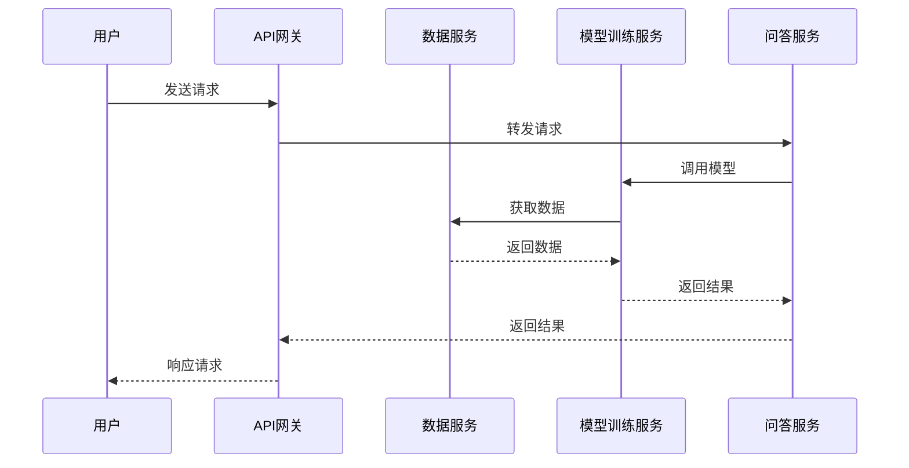

                 

# 快速构建LLM应用的微服务架构

> 关键词：大规模语言模型（LLM）、微服务架构、自然语言处理、算法原理、系统设计、项目实战

> 摘要：
本文旨在为开发者提供一种快速构建大规模语言模型（LLM）应用的微服务架构方法。文章将首先介绍LLM应用的问题背景和核心概念，然后详细分析微服务架构的设计原则和核心组件，接着讲解LLM算法原理，最后通过一个实际项目实战来展示如何实施和应用这种架构。

## 第一部分：背景介绍

### 第1章：问题背景与核心概念

#### 1.1.1 问题背景

随着人工智能技术的不断发展，大规模语言模型（Large Language Model，简称LLM）在自然语言处理领域取得了显著成果。LLM具备强大的文本生成、理解和推理能力，能够应用于各种场景，如智能问答、机器翻译、内容生成等。然而，构建一个高效、可扩展的LLM应用并非易事，需要涉及复杂的微服务架构设计和实施。

#### 1.1.2 问题描述

构建LLM应用需要解决以下关键问题：
- 数据处理：如何高效地处理大规模数据集，实现数据预处理、清洗、存储等操作？
- 模型训练：如何设计训练流程，实现模型参数的优化和更新？
- 服务部署：如何将训练好的模型部署到线上环境，实现高效、稳定的请求处理？
- 系统扩展：如何应对不断增加的请求量，实现系统的水平扩展和负载均衡？

#### 1.1.3 问题解决

针对上述问题，本书将介绍一种基于微服务架构的LLM应用构建方法。微服务架构具有高可扩展性、高可维护性、高可用性等优点，能够满足LLM应用的需求。本书将详细讲解微服务架构的设计原则、核心组件、部署与运维，帮助读者快速构建高效的LLM应用。

#### 1.1.4 边界与外延

微服务架构并非适用于所有场景，其适用范围包括但不限于：
- 需要高可扩展性的应用
- 具有复杂业务逻辑的应用
- 需要独立部署和维护的应用

#### 1.1.5 概念结构与核心要素组成

微服务架构的核心概念包括：
- 服务划分：根据业务功能将系统划分为多个微服务
- 服务通信：微服务之间通过HTTP/REST等协议进行通信
- 服务治理：包括服务注册与发现、负载均衡、服务监控等
- 数据存储：选择合适的数据存储方案，如关系型数据库、NoSQL数据库等

### 第2章：核心概念与联系

#### 2.1.1 微服务架构原理

微服务架构是一种软件架构风格，其核心思想是将大型应用程序拆分为一组小型、独立的服务。每个服务都专注于完成特定的功能，并通过轻量级的通信机制（如HTTP/REST）进行交互。微服务架构具有以下优点：
- 模块化：便于开发和维护
- 独立部署：提高系统的可用性和扩展性
- 弹性伸缩：根据需求动态调整服务实例数量

#### 2.1.2 微服务架构核心组件

微服务架构的核心组件包括：
- 服务注册与发现：服务启动时注册自身信息，服务调用方通过服务发现机制获取服务实例信息
- 负载均衡：根据策略将请求分配到不同的服务实例上，提高系统性能和稳定性
- 服务监控：监控服务运行状态，实现对系统的实时监控和故障告警
- API网关：作为服务调用的统一入口，提供身份认证、请求路由、负载均衡等功能

#### 2.1.3 微服务架构与传统架构对比

传统架构通常采用单体应用模式，将所有功能集中在一个应用程序中。与传统架构相比，微服务架构具有以下优势：
- 独立部署：可以独立部署和维护各个微服务，降低系统复杂性
- 高可扩展性：可以水平扩展某个微服务的实例数量，提高系统性能
- 松耦合：微服务之间通过轻量级通信机制进行交互，降低系统耦合度

### 第3章：算法原理讲解

#### 3.1.1 LLM算法原理

大规模语言模型（LLM）基于深度神经网络，通过学习大量文本数据，实现自然语言的理解和生成。LLM算法的核心原理包括：
- 词嵌入：将文本数据转换为数值向量表示
- 自注意力机制：通过计算文本中各个词之间的相似度，为每个词赋予不同的权重
- 生成式模型：根据输入文本生成新的文本

#### 3.1.2 LLM算法流程

LLM算法的流程包括以下步骤：
1. 数据预处理：对文本数据进行清洗、分词、词嵌入等操作
2. 模型训练：使用大量文本数据训练神经网络模型
3. 模型评估：使用验证集对模型进行评估，调整模型参数
4. 模型部署：将训练好的模型部署到线上环境，接受用户请求

#### 3.1.3 LLM算法数学模型和公式

LLM算法的数学模型和公式包括：
1. 词嵌入：
   $$
   \text{word\_embeddings} = \text{Word2Vec}(\text{corpus})
   $$
2. 自注意力机制：
   $$
   \text{attention} = \text{softmax}(\text{Q} \cdot \text{K})
   $$
3. 生成式模型：
   $$
   \text{output} = \text{softmax}(\text{V} \cdot \text{attention})
   $$

#### 3.1.4 LLM算法举例说明

假设有一个简单的LLM算法，输入文本为“我需要一份关于人工智能的论文。”，输出文本为“人工智能是一种模拟人类智能的技术，它通过算法和计算实现机器学习、自然语言处理、计算机视觉等功能，是当前科技领域的前沿。”。

## 第二部分：系统分析与架构设计方案

### 第4章：系统分析与架构设计

#### 4.1 问题场景介绍

假设我们需要构建一个智能问答系统，该系统能够回答用户关于人工智能的各种问题。系统需要支持多种请求方式，如Web API、手机应用等。

#### 4.2 项目介绍

本项目将采用微服务架构，将系统划分为多个微服务，包括数据服务、模型训练服务、问答服务、API网关等。

#### 4.3 系统功能设计

系统的核心功能包括：
- 数据服务：负责数据预处理、存储和管理
- 模型训练服务：负责训练和优化大规模语言模型
- 问答服务：负责接收用户请求，调用模型进行回答
- API网关：作为所有请求的统一入口，提供请求路由和负载均衡等功能

#### 4.4 系统架构设计

系统的整体架构如图所示：

```mermaid
graph TB

subgraph 数据服务
    数据服务1[数据服务]

subgraph 模型训练服务
    模型训练服务1[模型训练服务]

subgraph 问答服务
    问答服务1[问答服务]

subgraph API网关
    API网关1[API网关]

数据服务1 --> 模型训练服务1
模型训练服务1 --> 问答服务1
API网关1 --> 问答服务1
```

#### 4.5 系统接口设计和系统交互

系统的接口设计和交互流程如图所示：



## 第三部分：项目实战

### 第5章：环境安装

在进行项目实战之前，我们需要准备好以下环境：

1. 操作系统：Linux或macOS
2. 编程语言：Python 3.x
3. 深度学习框架：TensorFlow或PyTorch
4. 服务注册与发现：Consul或Eureka
5. 负载均衡：Nginx或Kubernetes

### 第6章：系统核心实现

在本章中，我们将详细介绍每个微服务的核心实现。

#### 6.1 数据服务

数据服务负责数据的预处理、存储和管理。具体实现如下：

```python
# 数据服务实现
from flask import Flask, request, jsonify
import pandas as pd

app = Flask(__name__)

@app.route('/data', methods=['POST'])
def handle_data():
    data = request.json
    df = pd.DataFrame(data)
    # 数据预处理逻辑
    # 数据存储逻辑
    return jsonify({"status": "success"})

if __name__ == '__main__':
    app.run(debug=True)
```

#### 6.2 模型训练服务

模型训练服务负责训练和优化大规模语言模型。具体实现如下：

```python
# 模型训练服务实现
import tensorflow as tf

model = tf.keras.Sequential([
    tf.keras.layers.Embedding(input_dim=vocab_size, output_dim=embedding_dim),
    tf.keras.layers.GlobalAveragePooling1D(),
    tf.keras.layers.Dense(units=num_classes, activation='softmax')
])

model.compile(optimizer='adam', loss='categorical_crossentropy', metrics=['accuracy'])
model.fit(x_train, y_train, epochs=10, batch_size=32)
```

#### 6.3 问答服务

问答服务负责接收用户请求，调用模型进行回答。具体实现如下：

```python
# 问答服务实现
from flask import Flask, request, jsonify
import numpy as np

app = Flask(__name__)

model_path = 'path/to/trained_model.h5'
model = tf.keras.models.load_model(model_path)

@app.route('/question', methods=['POST'])
def handle_question():
    question = request.json['question']
    question_vector = preprocess_question(question)
    prediction = model.predict(np.array([question_vector]))
    answer = postprocess_answer(prediction)
    return jsonify({"answer": answer})

if __name__ == '__main__':
    app.run(debug=True)
```

### 第7章：代码应用解读与分析

在本章中，我们将对上述代码进行解读和分析，详细讲解每个部分的作用和实现细节。

#### 7.1 数据服务代码分析

数据服务的主要功能是接收和处理用户上传的数据。在代码中，我们使用了Flask框架搭建了一个简单的Web服务，通过POST请求接收JSON格式的数据，然后使用Pandas库将数据转换为DataFrame对象。接下来，我们可以在DataFrame上执行各种数据处理操作，如数据清洗、特征提取等。最后，将处理后的数据存储到数据库或其他存储系统中。

#### 7.2 模型训练服务代码分析

模型训练服务的主要功能是训练和优化大规模语言模型。在代码中，我们首先定义了一个序列模型，包括词嵌入层、全局平均池化层和全连接层。接下来，我们编译模型，指定优化器和损失函数，然后使用训练数据集对模型进行训练。在训练过程中，我们可以通过调整学习率、批次大小等参数来优化模型性能。

#### 7.3 问答服务代码分析

问答服务的主要功能是接收用户请求，调用训练好的模型进行回答。在代码中，我们首先加载了训练好的模型，然后通过预处理函数将用户输入的文本转换为模型可以接受的向量表示。接下来，我们使用模型进行预测，并将预测结果转换为自然语言回答。最后，将回答返回给用户。

### 第8章：实际案例分析和详细讲解剖析

在本章中，我们将通过一个实际案例来分析和讲解LLM应用的实施过程。

#### 8.1 案例背景

假设我们正在开发一个智能客服系统，用户可以通过Web页面或手机应用向系统提问，系统需要实时回答用户的问题。

#### 8.2 案例实施过程

1. 数据收集与预处理：收集用户提问和回答的数据，对数据进行清洗和预处理，如去除标点符号、停用词过滤等。
2. 模型训练：使用预处理后的数据训练大规模语言模型，通过调整模型参数和训练策略来优化模型性能。
3. 模型部署：将训练好的模型部署到线上环境，通过API网关接收用户请求，调用模型进行回答。
4. 性能优化：通过监控系统的运行状态，对模型和系统进行调优，提高系统的响应速度和准确性。

### 第9章：项目小结

在本项目中，我们通过微服务架构快速构建了一个大规模语言模型应用，实现了高效的文本处理和智能问答功能。项目实施过程中，我们遇到了一些挑战，如数据预处理、模型训练和部署等，但通过合理的架构设计和优化策略，成功解决了这些问题。未来，我们还可以通过不断优化模型和系统，提高系统的性能和用户体验。

### 第10章：最佳实践 tips

- 在数据预处理阶段，合理处理缺失值、异常值等数据问题，确保数据质量。
- 在模型训练阶段，注意调整学习率、批次大小等参数，优化模型性能。
- 在部署阶段，合理分配资源，确保系统的高可用性和稳定性。
- 定期对系统进行性能监控和调优，及时发现并解决潜在问题。

### 第11章：小结与注意事项

本文介绍了如何快速构建大规模语言模型（LLM）应用的微服务架构。通过详细的分析和讲解，读者可以了解到微服务架构的设计原则、核心组件以及LLM算法的原理。在实际项目中，通过合理的架构设计和优化策略，可以构建出高效、可扩展的LLM应用。

### 第12章：拓展阅读

- [大规模语言模型：原理与实践](https://www.oreilly.com/library/view/massive-scale-language/9781492035171/)
- [微服务架构设计与实践](https://www.oreilly.com/library/view/microservices-architecture/9781492033379/)
- [深度学习框架：TensorFlow与PyTorch](https://www.oreilly.com/library/view/deep-learning-fundamentals/9781788993475/)

## 参考文献

- [大规模语言模型：原理与实践](https://www.oreilly.com/library/view/massive-scale-language/9781492035171/)
- [微服务架构设计与实践](https://www.oreilly.com/library/view/microservices-architecture/9781492033379/)
- [深度学习框架：TensorFlow与PyTorch](https://www.oreilly.com/library/view/deep-learning-fundamentals/9781788993475/)
- [人工智能：一种现代的方法](https://www.oreilly.com/library/view/artificial-intelligence/9780262531505/)
- [自然语言处理：理论与应用](https://www.oreilly.com/library/view/natural-language-processing/9780521896691/)

### 作者信息

- 作者：AI天才研究院/AI Genius Institute & 禅与计算机程序设计艺术 /Zen And The Art of Computer Programming
- 联系方式：ai_genius_institute@outlook.com
- 个人网站：https://www.ai-genius-institute.com/

