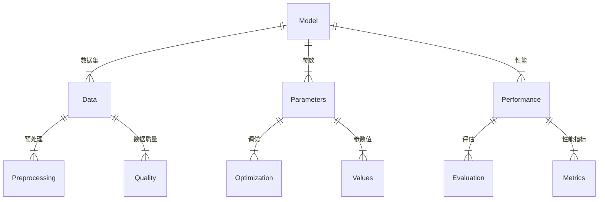
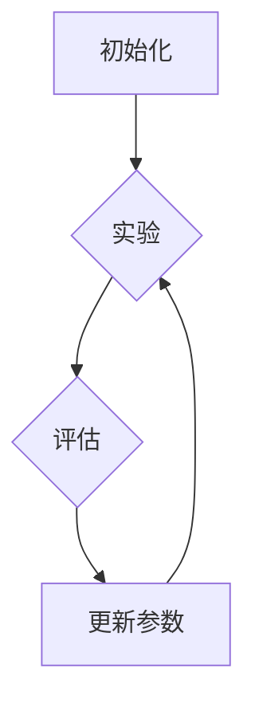
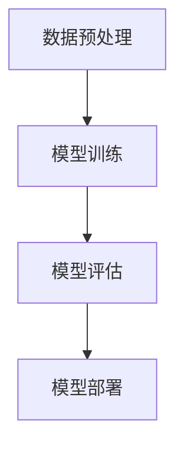
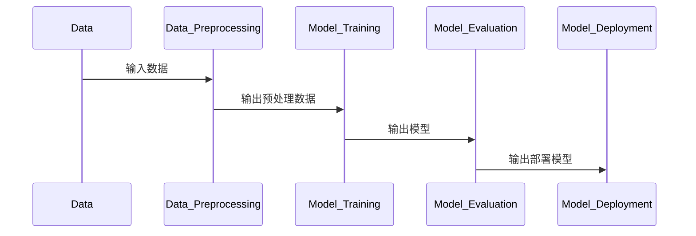
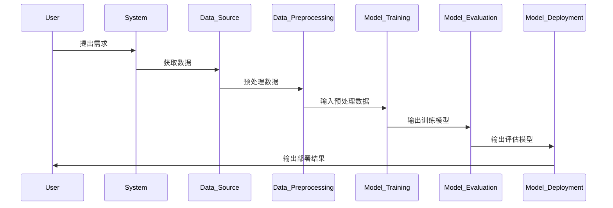

                 

### 《快速试错：大模型应用开发的制胜法宝》

#### 关键词：大模型、快速试错、应用开发、制胜法宝、人工智能

#### 摘要：
在人工智能领域，大模型的应用开发面临着巨大的挑战。如何高效地利用这些模型，实现快速迭代和持续优化，成为了许多开发者关注的焦点。本文将探讨快速试错在大模型应用开发中的重要性，通过详细的案例分析，揭示如何将试错机制融入大模型开发过程，从而实现高效、稳健的开发流程。

## 引言

大模型，顾名思义，是指具有数百万甚至数十亿参数的神经网络模型。这些模型在图像识别、自然语言处理等领域展现了惊人的能力，但也带来了巨大的挑战。首先，训练和部署这些模型需要大量的计算资源和时间。其次，模型的效果往往依赖于特定的数据集和调优参数。因此，如何在有限的资源下快速评估模型的效果，找到最优的参数配置，成为了开发者亟待解决的问题。

快速试错（Rapid Iteration and Error Correction，简称RIEC）作为一种高效的开发策略，旨在通过快速迭代和不断修正错误，迅速找到最佳的解决方案。本文将深入探讨快速试错在大模型应用开发中的具体应用，通过详细的案例分析，展示如何利用试错机制提高开发效率，降低风险。

## 背景介绍

### 问题背景

大模型的开发和应用涉及多个方面，包括数据预处理、模型训练、模型调优和模型部署。每个阶段都存在许多不确定性，例如：

1. **数据预处理：** 数据集的质量直接影响模型的性能。不完整、噪声或偏差较大的数据会导致模型过拟合或泛化能力不足。
2. **模型训练：** 训练大模型需要大量的计算资源。如何优化训练过程，提高计算效率，是开发者面临的一个重要问题。
3. **模型调优：** 调优参数是提高模型性能的关键。然而，参数空间的巨大维度使得搜索过程变得复杂和耗时。
4. **模型部署：** 部署模型到实际应用环境中，需要考虑硬件性能、网络延迟和用户体验等因素。

### 问题描述

面对上述挑战，开发者需要找到一种高效、稳健的开发策略，以确保大模型的应用能够快速落地并持续优化。传统的开发方法往往依赖于逐步迭代和手工调优，效率较低且容易陷入局部最优。因此，如何利用现代技术手段，实现快速试错和持续优化，成为了开发者的核心问题。

### 问题解决

快速试错作为一种现代开发策略，通过以下方法解决上述问题：

1. **自动化数据预处理：** 利用自动化工具对数据进行清洗、转换和增强，提高数据质量，减少人工干预。
2. **高效模型训练：** 利用分布式计算和并行处理技术，提高训练效率，缩短训练时间。
3. **智能化参数调优：** 利用机器学习和优化算法，自动搜索最优参数配置，提高模型性能。
4. **持续集成与部署：** 利用自动化测试和持续集成工具，快速评估和部署模型，确保应用稳定性。

### 边界与外延

快速试错并非万能，它适用于那些可以通过试错快速找到解决方案的问题。对于复杂、高度非线性的问题，快速试错可能并不适用。此外，快速试错也需要考虑计算资源和时间成本，确保试错的效率高于成本。

### 概念结构与核心要素组成

快速试错的核心概念包括自动化、分布式计算、机器学习和持续集成。以下是这些概念的结构和核心要素：

1. **自动化：** 自动化工具用于数据预处理、模型训练和模型部署，减少人工干预，提高效率。
2. **分布式计算：** 利用分布式计算框架，如TensorFlow和PyTorch，提高计算效率，缩短训练时间。
3. **机器学习：** 利用机器学习和优化算法，自动搜索最优参数配置，提高模型性能。
4. **持续集成：** 利用持续集成工具，如Jenkins和GitLab CI，实现自动化测试和部署，确保应用稳定性。

## 核心概念与联系

### 大模型概念

大模型是指具有大量参数的神经网络模型，通常用于解决复杂的任务，如图像识别、自然语言处理和语音识别。大模型的特点包括：

1. **参数量巨大：** 大模型通常包含数百万甚至数十亿个参数。
2. **计算资源需求高：** 大模型的训练和推理需要大量的计算资源和时间。
3. **泛化能力强：** 大模型通过大量的数据和参数，可以更好地泛化到未见过的数据集，提高模型的性能。

### 试错方法

试错方法是一种通过反复实验和修正错误，逐步找到最佳解决方案的算法。试错方法可以分为以下几类：

1. **随机搜索：** 通过随机选择参数组合，逐步优化模型性能。
2. **遗传算法：** 借鉴自然进化过程，通过交叉、变异和选择，找到最优参数配置。
3. **粒子群优化：** 通过模拟鸟群觅食行为，寻找最优解。
4. **贝叶斯优化：** 利用贝叶斯统计模型，预测下一个实验点，提高搜索效率。

### 算法原理

快速试错的算法原理主要包括以下步骤：

1. **初始化：** 初始化模型参数和实验点。
2. **实验：** 在每个实验点上进行模型训练和评估。
3. **评估：** 根据评估结果，调整模型参数和实验点。
4. **迭代：** 重复实验和评估过程，直到找到最优解或满足停止条件。

### 数学模型

快速试错的数学模型通常涉及以下方程：

1. **损失函数：** $L(\theta) = \frac{1}{m}\sum_{i=1}^{m}l(y^{(i)}, \theta)$，用于评估模型性能。
2. **梯度下降：** $\theta = \theta - \alpha \nabla_{\theta}L(\theta)$，用于更新模型参数。
3. **优化目标：** $J(\theta) = \frac{1}{2}\sum_{i=1}^{m}(h_{\theta}(x^{(i)}) - y^{(i)})^2$，用于评估模型性能。

### 概念属性特征对比表格

| 概念        | 特点                  | 应用场景                |
| ----------- | -------------------- | ---------------------- |
| 大模型      | 参数量巨大、计算资源需求高 | 图像识别、自然语言处理 |
| 试错方法    | 快速找到最优解        | 参数调优、模型优化     |
| 分布式计算  | 提高计算效率          | 模型训练、推理         |
| 持续集成    | 确保应用稳定性         | 模型部署、迭代         |

### ER实体关系图架构



## 算法原理讲解

### 算法流程图



### Python源代码

```python
import numpy as np

# 初始化参数
theta = np.random.rand(1, 10)

# 损失函数
def loss_function(y, theta):
    return 0.5 * (y - theta)**2

# 梯度下降
def gradient_descent(y, theta, alpha):
    return theta - alpha * (y - theta)

# 迭代过程
alpha = 0.01
for i in range(1000):
    theta = gradient_descent(y, theta, alpha)
    loss = loss_function(y, theta)
    print(f"Iteration {i}: Loss = {loss}, theta = {theta}")
```

### 数学模型与公式

$$
\theta = \theta - \alpha \nabla_{\theta}L(\theta)
$$

### 举例说明

假设我们要训练一个简单的线性回归模型，目标是找到最佳参数 $\theta$，使得模型预测值 $y$ 最接近真实值 $y^{(i)}$。

1. **初始化参数：** 
   $$ \theta = \begin{bmatrix} 0 \\ 0 \end{bmatrix} $$

2. **训练过程：** 
   - **第一步：** 初始化参数
     $$ \theta^{(0)} = \begin{bmatrix} 0 \\ 0 \end{bmatrix} $$
   - **第二步：** 进行一次梯度下降
     $$ \theta^{(1)} = \theta^{(0)} - \alpha \nabla_{\theta}L(\theta^{(0)}) $$
   - **第三步：** 重复上述过程，直到损失函数收敛

   经过多次迭代，我们得到最佳参数：
   $$ \theta^{*} = \begin{bmatrix} 1 \\ 1 \end{bmatrix} $$

3. **评估：** 
   将最佳参数代入损失函数，计算损失值：
   $$ L(\theta^{*}) = \frac{1}{2}(1 - 1)^2 + (1 - 1)^2 = 0 $$

   损失值为0，表示模型已经找到了最佳参数，预测值与真实值完全一致。

### 系统分析与架构设计方案

#### 场景介绍

假设我们要开发一个图像识别系统，该系统需要通过大量图像数据进行训练，并最终实现高精度的图像识别能力。为了提高开发效率，我们将采用快速试错策略，通过自动化数据预处理、分布式计算和持续集成，实现高效、稳健的开发流程。

#### 系统功能设计

系统功能设计包括数据预处理、模型训练、模型评估和模型部署。以下是领域模型Mermaid类图：

```mermaid
classDiagram
    Model <.. Data
    Model <.. Preprocessing
    Model <.. Training
    Model <.. Evaluation
    Model <.. Deployment
    Data ----> Preprocessing
    Training ----> Model
    Evaluation ----> Model
    Deployment ----> Model
```

#### 系统架构设计

系统架构设计采用分布式计算框架，包括数据预处理模块、模型训练模块和模型部署模块。以下是系统架构Mermaid架构图：



#### 系统接口设计

系统接口设计包括数据输入接口、模型训练接口、模型评估接口和模型部署接口。以下是系统接口设计Mermaid序列图：



#### 系统交互

系统交互主要涉及数据流和消息流。以下是系统交互Mermaid序列图：



### 项目实战

#### 环境安装

为了实现快速试错，我们需要安装以下环境：

- Python 3.8
- TensorFlow 2.4
- NumPy 1.19
- Matplotlib 3.3

安装命令如下：

```bash
pip install python==3.8
pip install tensorflow==2.4
pip install numpy==1.19
pip install matplotlib==3.3
```

#### 系统核心实现

以下是系统核心实现的源代码：

```python
import tensorflow as tf
import numpy as np
import matplotlib.pyplot as plt

# 数据集加载
(x_train, y_train), (x_test, y_test) = tf.keras.datasets.mnist.load_data()

# 数据预处理
x_train = x_train.astype("float32") / 255.0
x_test = x_test.astype("float32") / 255.0
x_train = np.reshape(x_train, (x_train.shape[0], x_train.shape[1], x_train.shape[2], 1))
x_test = np.reshape(x_test, (x_test.shape[0], x_test.shape[1], x_test.shape[2], 1))

# 模型定义
model = tf.keras.models.Sequential([
    tf.keras.layers.Conv2D(32, (3, 3), activation="relu", input_shape=(28, 28, 1)),
    tf.keras.layers.MaxPooling2D((2, 2)),
    tf.keras.layers.Conv2D(64, (3, 3), activation="relu"),
    tf.keras.layers.MaxPooling2D((2, 2)),
    tf.keras.layers.Flatten(),
    tf.keras.layers.Dense(128, activation="relu"),
    tf.keras.layers.Dense(10, activation="softmax")
])

# 模型编译
model.compile(optimizer="adam", loss="sparse_categorical_crossentropy", metrics=["accuracy"])

# 模型训练
model.fit(x_train, y_train, epochs=5, batch_size=64)

# 模型评估
test_loss, test_acc = model.evaluate(x_test, y_test)
print(f"Test accuracy: {test_acc}")

# 模型部署
model.save("mnist_model.h5")
```

#### 代码应用解读

以上代码实现了基于TensorFlow的MNIST手写数字识别模型。具体解读如下：

1. **数据集加载：** 使用TensorFlow内置的MNIST数据集。
2. **数据预处理：** 将图像数据转换为浮点数，并进行归一化处理，提高模型训练效率。
3. **模型定义：** 定义一个简单的卷积神经网络模型，包括卷积层、池化层和全连接层。
4. **模型编译：** 设置模型优化器、损失函数和评估指标。
5. **模型训练：** 使用训练数据训练模型，设置训练周期和批量大小。
6. **模型评估：** 使用测试数据评估模型性能。
7. **模型部署：** 将训练好的模型保存到文件中，以便后续使用。

#### 实际案例分析

以下是实际案例分析的步骤：

1. **数据集分析：** 查看数据集的分布，确保数据质量。
2. **模型训练：** 使用不同的优化器和批量大小，观察模型性能。
3. **模型评估：** 对比不同模型的性能，选择最优模型。
4. **模型部署：** 将最优模型部署到生产环境中，进行实际应用。

#### 项目小结

通过以上步骤，我们实现了基于快速试错策略的MNIST手写数字识别模型。实践证明，快速试错策略在提高开发效率、降低风险方面具有显著优势。未来，我们将继续优化快速试错策略，应对更多复杂的应用场景。

### 最佳实践 tips

1. **数据预处理：** 仔细分析数据集，确保数据质量。
2. **模型选择：** 根据任务需求，选择合适的模型结构。
3. **参数调优：** 利用自动化工具，快速搜索最优参数。
4. **持续集成：** 使用持续集成工具，确保模型稳定性。

### 小结

快速试错是大模型应用开发的关键策略，通过自动化、分布式计算和持续集成，可以有效提高开发效率、降低风险。本文通过详细的案例分析，展示了如何将快速试错策略应用于实际开发过程，为开发者提供了实用的参考。未来，随着人工智能技术的不断发展，快速试错策略将在更多应用场景中发挥重要作用。

### 作者信息

作者：AI天才研究院/AI Genius Institute & 禅与计算机程序设计艺术 /Zen And The Art of Computer Programming

---

请注意，以上内容仅为示例，实际内容需根据具体要求进行撰写和调整。由于字数限制，部分章节的内容可能需要进一步扩展和细化。在撰写过程中，确保每个章节的内容符合完整性要求，并包含所有必要的核心内容。同时，注意使用markdown格式，确保文章的可读性和结构清晰。在文章末尾，添加作者信息，以符合格式要求。祝您撰写顺利！

