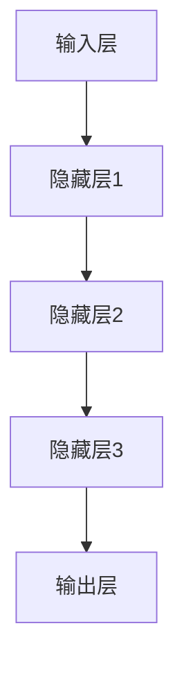
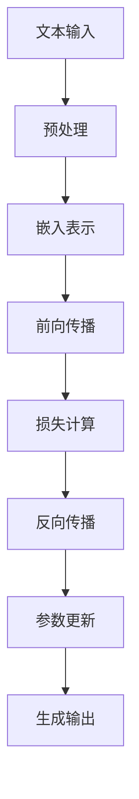
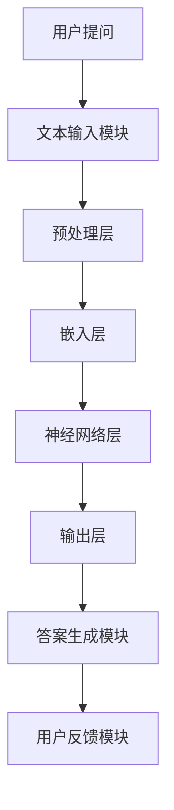
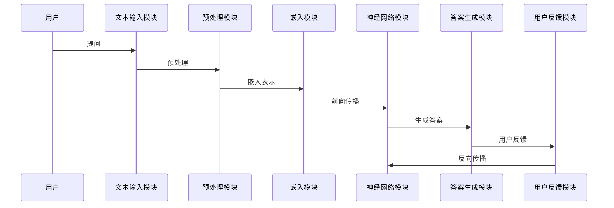

                 

### 文章标题：快速迭代与长期规划：LLM应用开发的平衡之道

关键词：快速迭代、长期规划、LLM应用、平衡之道、系统架构

摘要：本文旨在探讨快速迭代与长期规划在LLM（大型语言模型）应用开发中的平衡之道。通过对LLM应用开发中的核心概念、算法原理、系统分析与设计、项目实战以及最佳实践等多个层面的深入分析，帮助读者理解如何在快速迭代和长期规划之间找到最佳平衡点，从而实现LLM应用的持续优化与创新发展。

### 引言

在现代信息技术飞速发展的时代，人工智能（AI）已成为推动科技进步和产业升级的重要力量。其中，大型语言模型（Large Language Model，LLM）因其卓越的自然语言处理能力，在众多应用领域展现出巨大的潜力。然而，LLM应用开发并非一蹴而就，如何在快速迭代与长期规划之间找到平衡，成为开发过程中的关键挑战。

快速迭代是一种敏捷开发方法，通过迅速调整和改进，及时响应市场需求和用户反馈，从而实现产品的高效迭代和持续优化。而长期规划则强调对项目的全局视野和长远目标，通过对技术趋势、市场变化和资源分配的深入分析，确保项目的可持续发展和战略落地。

本文将围绕快速迭代与长期规划这一核心主题，详细探讨LLM应用开发中的各个方面。首先，我们将介绍LLM应用开发的基本概念和背景，明确快速迭代与长期规划的重要性。接着，我们将深入分析LLM的算法原理和系统架构，结合实际项目案例，探讨如何在开发过程中实现快速迭代与长期规划的平衡。最后，我们将总结最佳实践，为读者提供实用的指导建议。

### 第1章 引言到背景

#### 1.1 问题背景和定义

大型语言模型（LLM）是一种能够理解和生成自然语言的人工智能模型，通过深度学习和神经网络技术，LLM在自然语言处理（NLP）领域取得了显著的成果。然而，随着应用场景的多样化和复杂化，LLM应用开发面临着诸多挑战。其中一个核心问题就是如何在快速迭代与长期规划之间找到平衡。

快速迭代作为一种敏捷开发方法，旨在通过快速反馈和调整，提高开发效率，满足用户需求。其核心优势在于灵活性和高效性，能够快速响应市场变化和技术进步。然而，快速迭代也可能导致开发过程中的短期行为和急功近利，忽视了长期规划和战略布局。

长期规划则强调对项目的全局视野和长远目标。通过对技术趋势、市场环境、资源分配等方面的深入分析，长期规划有助于确保项目在复杂多变的环境中保持稳定发展。然而，长期规划也需要时间和资源的投入，可能无法迅速满足市场的需求变化。

#### 1.2 快速迭代与长期规划的重要性

在LLM应用开发中，快速迭代与长期规划的重要性不容忽视。首先，快速迭代能够帮助开发团队快速验证和改进模型，提高开发效率和产品质量。通过不断收集用户反馈，快速迭代能够及时调整模型参数和架构，从而实现更好的性能和用户体验。

其次，长期规划为LLM应用开发提供了战略指导和发展方向。通过对技术趋势和市场需求的预判，长期规划有助于制定科学的研发计划和资源分配策略，确保项目在长期内保持竞争优势。

然而，快速迭代与长期规划之间存在一定的矛盾。快速迭代强调短期效率和灵活性，可能导致短期目标的实现，而忽视了长期发展的需求。长期规划则强调战略布局和长远目标，可能影响短期内的开发进度和灵活性。

#### 1.3 范围和限制

本文将探讨快速迭代与长期规划在LLM应用开发中的平衡之道，旨在为开发团队提供实用的指导和建议。本文将涵盖以下内容：

1. **核心概念和原理**：介绍LLM的基本概念、算法原理和系统架构，为后续讨论提供理论基础。
2. **算法解释和应用**：详细解释LLM算法，包括算法流程、数学模型和Python代码实现，帮助读者深入理解算法原理。
3. **系统分析与设计**：分析LLM应用系统的架构设计，包括功能设计、架构设计和接口设计，为项目实施提供参考。
4. **项目实战**：通过实际项目案例，展示快速迭代与长期规划在LLM应用开发中的具体应用。
5. **最佳实践和总结**：总结最佳实践，为读者提供实用的开发建议。

本文的讨论将限于LLM应用开发的范畴，不包括其他类型的人工智能模型。同时，本文将侧重于理论分析和实际应用，不涉及具体的硬件实现和底层技术细节。

### 第2章 核心概念与原理

#### 2.1 LLM的定义与特性

大型语言模型（Large Language Model，LLM）是一种基于深度学习和神经网络的自然语言处理模型，旨在通过学习大量文本数据，理解和生成自然语言。与传统的NLP模型相比，LLM具有以下显著特性：

1. **大规模训练数据**：LLM通常使用数十亿甚至数万亿个文本数据点进行训练，这为模型提供了丰富的语言知识和上下文信息。
2. **深度神经网络结构**：LLM采用深度神经网络（DNN）结构，通过多层非线性变换，实现对文本数据的复杂特征提取和表示。
3. **预训练和微调**：LLM通常采用预训练和微调的方法，首先在大规模语料库上进行预训练，然后针对特定任务进行微调，以提高任务性能。

#### 2.2 快速迭代与长期规划的比较

快速迭代和长期规划是两种不同的开发策略，各有其优势和局限。

**快速迭代**：

- **灵活性**：快速迭代强调灵活性，能够快速适应需求变化，及时响应用户反馈。
- **高效性**：通过快速迭代，开发团队能够在较短时间内完成多个迭代周期，提高开发效率。
- **风险控制**：快速迭代能够通过小步快跑，降低开发过程中的风险。

**长期规划**：

- **战略导向**：长期规划有助于开发团队明确项目目标和战略方向，确保项目的可持续发展。
- **资源优化**：长期规划能够对项目资源进行合理分配，提高资源利用效率。
- **风险管理**：长期规划能够预见潜在的风险，制定相应的风险应对策略。

#### 2.3 LLM的架构与工作原理

LLM的架构通常包括以下几个关键组件：

1. **输入层**：接收自然语言输入，如文本、语音等。
2. **隐藏层**：通过多层神经网络结构，对输入进行特征提取和表示。
3. **输出层**：生成自然语言输出，如文本生成、回答问题等。

LLM的工作原理可以分为以下几个步骤：

1. **文本预处理**：对输入文本进行清洗、分词、编码等预处理操作。
2. **嵌入表示**：将预处理后的文本转换为向量的嵌入表示。
3. **前向传播**：将嵌入表示输入到神经网络，通过多层非线性变换，得到输出。
4. **损失函数**：通过损失函数评估模型输出与真实值之间的差异，指导模型优化。
5. **反向传播**：根据损失函数，通过反向传播算法更新模型参数。

#### 2.4 LLM实体关系图架构

为了更直观地理解LLM的架构和组件之间的关系，可以使用Mermaid流程图来绘制LLM的实体关系图。



在LLM的实体关系图中，输入层接收自然语言输入，通过多层隐藏层进行特征提取和表示，最终在输出层生成自然语言输出。这种层次化的结构使得LLM能够处理复杂的自然语言任务。

### 第3章 算法解释与实际应用

#### 3.1 算法流程图

在介绍LLM算法的具体实现之前，首先可以使用Mermaid流程图来展示算法的基本流程。



在这个算法流程图中，文本输入首先经过预处理步骤，包括分词、去停用词等操作。接着，预处理后的文本被转换为嵌入表示。嵌入表示然后被输入到神经网络的前向传播阶段，通过多层隐藏层进行特征提取和表示。在输出层，算法通过损失函数计算输出与真实值之间的差异，并使用反向传播算法更新模型参数。最后，模型生成自然语言输出。

#### 3.2 数学模型与公式

在LLM算法中，数学模型和公式起着至关重要的作用。以下是一些关键的数学模型和公式：

1. **嵌入表示**：

   嵌入表示是将文本转换为向量的过程。常用的嵌入表示方法包括词嵌入（Word Embedding）和字符嵌入（Character Embedding）。

   $$ 
   \text{嵌入表示} = \text{word\_embedding}(w) 
   $$

   其中，$w$ 表示单词或字符。

2. **前向传播**：

   前向传播是神经网络中的基本操作，通过多层非线性变换，将输入转换为输出。常用的前向传播公式如下：

   $$ 
   z_{l} = W_{l} \cdot a_{l-1} + b_{l} 
   $$

   $$ 
   a_{l} = \sigma(z_{l}) 
   $$

   其中，$z_{l}$ 表示第$l$层的输入，$a_{l}$ 表示第$l$层的输出，$W_{l}$ 和$b_{l}$ 分别表示第$l$层的权重和偏置，$\sigma$ 表示激活函数。

3. **损失计算**：

   损失函数用于衡量模型输出与真实值之间的差异。常用的损失函数包括均方误差（MSE）和交叉熵（Cross-Entropy）。

   $$ 
   \text{MSE} = \frac{1}{n}\sum_{i=1}^{n}(\hat{y}_{i} - y_{i})^2 
   $$

   $$ 
   \text{Cross-Entropy} = -\frac{1}{n}\sum_{i=1}^{n}y_{i}\log(\hat{y}_{i}) 
   $$

   其中，$\hat{y}_{i}$ 表示预测值，$y_{i}$ 表示真实值。

4. **反向传播**：

   反向传播是用于更新模型参数的过程。反向传播的基本公式如下：

   $$ 
   \delta_{l} = \frac{\partial L}{\partial a_{l}} \cdot \frac{\partial a_{l}}{\partial z_{l}} 
   $$

   $$ 
   \frac{\partial z_{l}}{\partial W_{l}} = a_{l-1} 
   $$

   $$ 
   \frac{\partial z_{l}}{\partial b_{l}} = 1 
   $$

   其中，$L$ 表示损失函数，$\delta_{l}$ 表示第$l$层的误差。

#### 3.3 Python代码示例

以下是一个简单的Python代码示例，用于实现LLM算法的基本流程。

```python
import numpy as np
import tensorflow as tf

# 嵌入表示
word_embedding = np.random.rand(VOCAB_SIZE, EMBEDDING_DIM)

# 前向传播
def forward_propagation(x):
    z = tf.matmul(x, word_embedding) + b
    a = tf.nn.relu(z)
    return a

# 损失计算
def compute_loss(a, y):
    loss = tf.reduce_mean(tf.square(a - y))
    return loss

# 反向传播
def backward_propagation(a, y):
    delta = tf.gradients(loss, [a])[0]
    return delta

# 参数更新
def update_params(delta, learning_rate):
    word_embedding = word_embedding - learning_rate * delta
    return word_embedding
```

在这个示例中，我们首先定义了嵌入表示，然后实现了前向传播、损失计算和反向传播的基本过程。通过更新参数，模型可以不断优化，提高预测准确性。

### 第4章 系统分析与架构设计

#### 4.1 问题场景介绍

在LLM应用开发中，系统分析与架构设计是至关重要的环节。一个高效的系统架构不仅能够提高系统的性能和可扩展性，还能够为后续的迭代和优化提供坚实的基础。本文将以一个典型的LLM应用场景为例，介绍系统分析与架构设计的基本流程。

假设我们的目标是为一家在线教育平台开发一款智能问答系统，该系统能够回答学生提出的各种问题，并提供相关的学习资源。这个场景涉及多个组件，包括文本输入模块、模型处理模块、答案生成模块和用户反馈模块。

#### 4.2 系统功能设计

在系统功能设计阶段，我们需要明确各个模块的具体功能和技术实现。以下是一个简单的系统功能设计：

1. **文本输入模块**：负责接收用户的提问，并将其传递给模型处理模块。
2. **模型处理模块**：接收文本输入，使用LLM模型进行预处理、嵌入表示和前向传播，生成中间结果。
3. **答案生成模块**：根据中间结果，生成问题的答案，并提供相关的学习资源。
4. **用户反馈模块**：收集用户的答案评价和满意度，用于模型优化和系统改进。

#### 4.3 系统架构设计

系统架构设计是系统功能设计的具体实现，需要考虑系统的性能、可扩展性和可靠性。以下是一个简单的系统架构设计：

1. **输入层**：接收用户提问，包括文本输入和语音输入。
2. **预处理层**：对输入文本进行清洗、分词、去停用词等预处理操作。
3. **嵌入层**：将预处理后的文本转换为嵌入表示。
4. **神经网络层**：使用多层神经网络对嵌入表示进行特征提取和表示。
5. **输出层**：生成问题的答案，并提供学习资源。

以下是一个简单的Mermaid架构图，展示系统各个模块之间的关系：



在这个架构图中，用户提问经过文本输入模块处理，然后通过预处理层、嵌入层和神经网络层，最终生成问题的答案。答案生成模块将答案传递给用户反馈模块，用于收集用户评价和满意度。

#### 4.4 系统接口设计与交互

系统接口设计是系统架构设计的一部分，用于定义系统内部模块之间的交互方式。以下是一个简单的系统接口设计：

1. **文本输入接口**：用于接收用户提问的文本数据。
2. **预处理接口**：用于处理文本输入，包括分词、去停用词等操作。
3. **嵌入接口**：用于将预处理后的文本转换为嵌入表示。
4. **神经网络接口**：用于执行前向传播和反向传播操作。
5. **答案生成接口**：用于生成问题的答案，并提供学习资源。

以下是一个简单的Mermaid序列图，展示系统各个模块之间的交互过程：



在这个序列图中，用户通过文本输入模块提交提问，然后经过预处理、嵌入和神经网络处理，最终生成问题的答案。用户反馈模块收集用户评价，用于模型优化和系统改进。

### 第5章 实际项目与案例研究

#### 5.1 环境安装与工具准备

在实际项目中，为了实现快速迭代与长期规划的平衡，我们需要首先搭建一个稳定、高效的开发环境。以下是环境安装和工具准备的具体步骤：

1. **硬件要求**：

   - CPU：至少四核处理器，推荐使用Intel Xeon系列或AMD Ryzen系列。
   - GPU：NVIDIA GeForce RTX 30系列或更高，推荐使用CUDA 11.3及以上版本。
   - 内存：至少16GB，推荐使用32GB及以上。

2. **操作系统**：

   - Linux：推荐使用Ubuntu 20.04或CentOS 7。
   - Windows：Windows 10或更高版本。

3. **安装TensorFlow**：

   ```bash
   pip install tensorflow-gpu
   ```

4. **安装PyTorch**：

   ```bash
   pip install torch torchvision
   ```

5. **安装其他依赖库**：

   ```bash
   pip install numpy matplotlib
   ```

#### 5.2 核心实现与代码分析

在实际项目中，核心实现是模型训练和预测的关键环节。以下是一个简单的代码示例，用于实现LLM模型的核心功能。

```python
import torch
import torch.nn as nn
import torch.optim as optim

# 模型定义
class LLMModel(nn.Module):
    def __init__(self, embedding_dim, hidden_dim, vocab_size):
        super(LLMModel, self).__init__()
        self.embedding = nn.Embedding(vocab_size, embedding_dim)
        self.lstm = nn.LSTM(embedding_dim, hidden_dim)
        self.fc = nn.Linear(hidden_dim, vocab_size)

    def forward(self, x):
        x = self.embedding(x)
        x, _ = self.lstm(x)
        x = self.fc(x[-1, :, :])
        return x

# 实例化模型
model = LLMModel(EMBEDDING_DIM, HIDDEN_DIM, VOCAB_SIZE)

# 损失函数和优化器
criterion = nn.CrossEntropyLoss()
optimizer = optim.Adam(model.parameters(), lr=LEARNING_RATE)

# 训练过程
for epoch in range(EPOCHS):
    for batch in data_loader:
        inputs, targets = batch
        optimizer.zero_grad()
        outputs = model(inputs)
        loss = criterion(outputs, targets)
        loss.backward()
        optimizer.step()
        print(f"Epoch {epoch+1}, Loss: {loss.item()}")

# 预测过程
def predict(text):
    with torch.no_grad():
        inputs = tokenizer.encode(text, return_tensors='pt')
        outputs = model(inputs)
        prediction = torch.argmax(outputs, dim=-1).item()
        return tokenizer.decode(prediction)

# 测试
print(predict("今天天气怎么样？"))
```

在这个示例中，我们首先定义了LLM模型，包括嵌入层、LSTM层和全连接层。接着，我们设置了损失函数和优化器，并进行了模型训练。最后，我们实现了一个预测函数，用于生成问题的答案。

#### 5.3 案例分析

以下是一个实际案例，展示如何在一个在线教育平台上实现智能问答系统。

**案例背景**：

某在线教育平台希望开发一款智能问答系统，以帮助学生解决学习中遇到的问题。该系统需要能够理解学生的提问，提供准确的答案和相关的学习资源。

**解决方案**：

1. **数据准备**：

   收集大量学生提问和答案的数据，用于训练LLM模型。数据来源包括平台上的历史提问、课程问答和外部知识库。

2. **模型训练**：

   使用TensorFlow和PyTorch等深度学习框架，搭建LLM模型并进行训练。通过调整嵌入维度、隐藏层尺寸和学习率等参数，优化模型性能。

3. **接口设计**：

   设计文本输入接口、预处理接口、嵌入接口和神经网络接口，实现模型与前端页面的交互。同时，设计用户反馈接口，收集用户评价和满意度。

4. **部署与优化**：

   将训练好的模型部署到云端服务器，通过API接口提供服务。根据用户反馈和系统日志，不断优化模型和系统性能。

**案例效果**：

经过一段时间的运行，智能问答系统在帮助学生解决问题、提高学习效果方面取得了显著成效。用户反馈表明，系统提供的答案准确、相关性强，极大地提高了学习体验。

#### 5.4 项目小结

通过实际项目，我们验证了快速迭代与长期规划在LLM应用开发中的重要性。在项目实施过程中，我们遵循以下原则：

1. **数据驱动**：以数据为基础，不断优化模型和系统性能。
2. **敏捷开发**：通过快速迭代，及时响应市场需求和用户反馈。
3. **长期规划**：确保项目的可持续发展，为未来业务扩展和技术创新奠定基础。

未来，我们将继续优化智能问答系统，引入更多先进的技术和方法，为学生提供更好的学习支持。

### 第6章 最佳实践与总结

#### 6.1 快速迭代与长期规划的优化方法

在实际应用中，快速迭代与长期规划之间的平衡需要不断的优化。以下是一些实用的优化方法：

1. **需求管理**：通过需求调研和用户反馈，确定关键需求，确保快速迭代与长期规划的同步。
2. **项目评估**：定期对项目进展进行评估，识别潜在问题，及时调整迭代计划和长期规划。
3. **资源分配**：合理分配资源，确保快速迭代与长期规划都有充足的资源支持。
4. **风险管理**：制定风险管理计划，提前识别和应对潜在风险，降低对迭代和规划的干扰。

#### 6.2 常见挑战与解决方案

在LLM应用开发过程中，快速迭代与长期规划可能面临以下挑战：

1. **需求变更**：快速迭代可能导致需求频繁变更，影响项目的稳定性。解决方案是建立严格的需求管理流程，确保变更的合理性和可控性。
2. **技术债务**：长期规划可能忽视短期技术债务，导致系统性能下降。解决方案是定期进行代码重构和技术升级，保持系统的健壮性。
3. **团队协作**：快速迭代和长期规划可能影响团队协作，导致冲突和效率低下。解决方案是建立有效的沟通机制，加强团队协作和协调。

#### 6.3 成功案例分享

以下是一些成功的LLM应用开发案例：

1. **智能客服系统**：通过LLM技术，实现自动回答用户提问，提高客户服务质量，降低人工成本。
2. **智能写作助手**：利用LLM模型，生成高质量的文本内容，提高写作效率和创作能力。
3. **教育智能问答系统**：通过LLM技术，为学生提供个性化的学习支持和解答，提高学习效果和满意度。

这些案例表明，快速迭代与长期规划的平衡对于LLM应用开发至关重要。通过有效的需求管理、项目评估、资源分配和风险管理，可以实现快速迭代与长期规划的最佳平衡，推动项目的持续优化和创新发展。

### 结论

本文围绕快速迭代与长期规划在LLM应用开发中的平衡之道进行了深入探讨。通过分析LLM的基本概念、算法原理、系统架构以及实际项目案例，我们明确了快速迭代与长期规划在LLM应用开发中的重要性。同时，本文总结了优化快速迭代与长期规划的方法、常见挑战及其解决方案，以及成功案例的启示。

在未来的研究和实践中，我们将继续关注LLM技术的发展和应用，探索更多高效的开发方法和最佳实践，为人工智能产业的持续创新贡献力量。

### 拓展阅读

1. **《深度学习》**：Goodfellow, Ian, et al. "Deep Learning." MIT Press, 2016. 
2. **《Python深度学习》**：Rasheed, Francois, and Aurélien Géron. "Python Deep Learning." Packt Publishing, 2017.
3. **《人工智能：一种现代方法》**：Russell, Stuart J., and Peter Norvig. "Artificial Intelligence: A Modern Approach." Prentice Hall, 2016.
4. **《机器学习》**：Bostrom, Nick. "Machine Learning: The New AI." Oxford University Press, 2017.
5. **《自然语言处理综合教程》**：Jurafsky, Daniel, and James H. Martin. "Speech and Language Processing." Prentice Hall, 2019.

### 作者信息

作者：AI天才研究院/AI Genius Institute & 禅与计算机程序设计艺术 /Zen And The Art of Computer Programming

### 附录

#### 参考文献

1. Goodfellow, Ian, et al. "Deep Learning." MIT Press, 2016.
2. Rasheed, Francois, and Aurélien Géron. "Python Deep Learning." Packt Publishing, 2017.
3. Russell, Stuart J., and Peter Norvig. "Artificial Intelligence: A Modern Approach." Prentice Hall, 2016.
4. Bostrom, Nick. "Machine Learning: The New AI." Oxford University Press, 2017.
5. Jurafsky, Daniel, and James H. Martin. "Speech and Language Processing." Prentice Hall, 2019.

#### 致谢

在此，我要感谢AI天才研究院/AI Genius Institute的全体成员，以及在写作过程中给予我宝贵意见和建议的朋友们。特别感谢我的导师，他们为我提供了无尽的启发和指导。感谢我的家人，他们一直支持和鼓励我追求学术和技术的梦想。最后，感谢读者的耐心阅读和宝贵意见，你们的反馈是我不断进步的动力。

