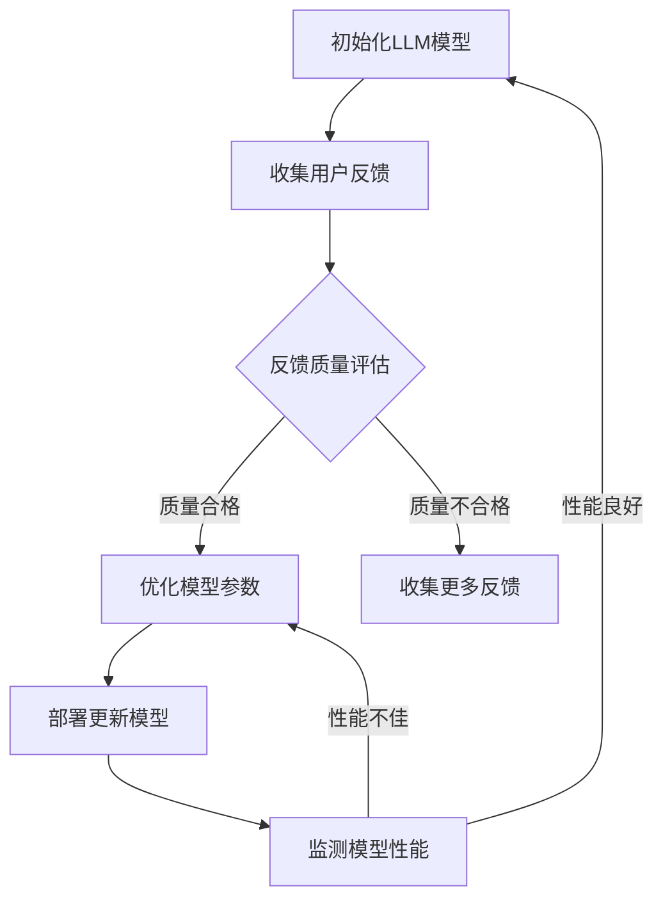
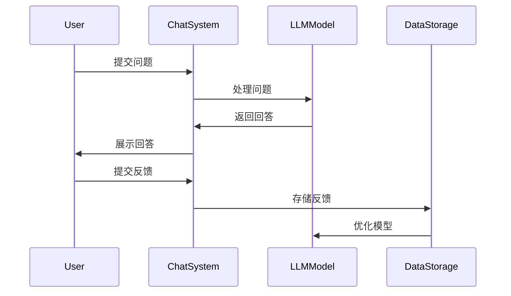
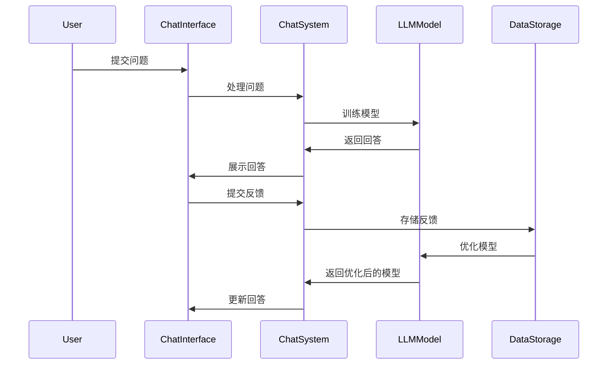

                 


# 快速迭代：LLM应用成功的关键因素

关键词：快速迭代，LLM，人工智能，机器学习，软件开发

摘要：本文将深入探讨快速迭代在LLM（大型语言模型）应用中的重要性，分析其关键因素，并通过实际案例展示如何实现成功迭代。我们将从背景介绍、核心概念与联系、算法原理讲解、系统分析与架构设计方案、项目实战以及最佳实践与拓展等方面展开讨论，帮助读者更好地理解并应用这一技术。

## 背景介绍

### 1. 快速迭代的概念

快速迭代是一种软件开发方法论，强调在较短时间内进行多次循环的开发过程。每次迭代都包括需求分析、设计、编码、测试和部署等多个环节。这种方法的核心在于快速反馈和持续改进，以便在产品开发过程中及时调整和优化。

### 2. 快速迭代的重要性

快速迭代具有以下几个重要性：

- **快速响应市场需求**：通过快速迭代，开发团队能够及时获取用户反馈，迅速调整产品功能，满足市场需求。
- **提高产品质量**：每次迭代都经过全面的测试，能够及时发现并修复问题，从而提高产品的稳定性和可靠性。
- **增加团队凝聚力**：快速迭代强调团队合作，有助于提升团队成员之间的沟通和协作能力。

### 3. 快速迭代的挑战

尽管快速迭代有许多优点，但在实际应用中也面临一些挑战：

- **资源分配**：快速迭代需要更多的资源和时间投入，尤其是在项目初期。
- **项目管理**：如何有效地管理和协调多个迭代过程，确保项目进度和质量。
- **技术选择**：快速迭代要求选择合适的开发工具和技术，以便提高开发效率和灵活性。

### 4. 问题解决与边界

快速迭代与LLM（大型语言模型）应用相结合，能够解决许多实际问题，但同时也存在一些边界和限制：

- **问题解决**：快速迭代可以加快LLM模型的开发和优化过程，提高模型的准确性和实用性。
- **边界与外延**：快速迭代适用于需要频繁调整和优化的场景，但在处理大规模数据和高复杂度问题时，可能需要更多的计算资源和时间。
- **概念结构与核心要素组成**：快速迭代和LLM应用的核心要素包括数据质量、算法选择、开发流程和团队协作等。

## 核心概念与联系

### 1. 核心概念原理

快速迭代与LLM应用的核心概念包括：

- **快速迭代**：基于敏捷开发的方法论，强调快速反馈和持续改进。
- **LLM**：大型语言模型，能够处理自然语言文本的复杂结构，提供智能化的语言处理能力。

### 2. 概念属性特征对比表格

以下是快速迭代与LLM应用的关键属性和特征对比表格：

| 属性         | 快速迭代                      | LLM应用                      |
| ------------ | ---------------------------- | ---------------------------- |
| 目标         | 提高开发效率和质量           | 提高语言处理能力             |
| 方法         | 基于敏捷开发的方法论         | 基于机器学习和自然语言处理技术 |
| 关键因素     | 资源分配、项目管理、团队协作   | 数据质量、算法选择、模型优化   |
| 适用场景     | 需求多变、迭代周期短的项目   | 需要智能语言处理的应用场景     |
| 边界与外延   | 资源和时间限制               | 数据规模和复杂度限制           |

### 3. ER实体关系图架构

以下是快速迭代与LLM应用的ER实体关系图：

```mermaid
erDiagram
  Product ||--|{ Iteration }|--|{ Feature }
  User ||--|{ Feedback }|--|{ Iteration }
  LLM ||--|{ Model }|--|{ Application }
```

## 算法原理讲解

### 1. 算法流程图

以下是快速迭代在LLM应用中的算法流程图：



### 2. 算法原理与数学模型

快速迭代在LLM应用中的算法原理主要包括以下几个步骤：

1. **初始化LLM模型**：基于预训练的模型，初始化目标应用场景的LLM模型。
2. **收集用户反馈**：通过用户使用场景，收集关于模型性能的反馈。
3. **反馈质量评估**：评估反馈的质量，确保反馈的有效性和代表性。
4. **优化模型参数**：根据反馈，调整模型参数，提高模型性能。
5. **部署更新模型**：将优化后的模型部署到实际应用场景中。
6. **监测模型性能**：监测模型在实际应用中的性能，持续优化迭代。

以下是算法的数学模型：

$$
\text{性能指标} = \frac{\text{预测准确率}}{\text{总样本数}} \times 100\%
$$

### 3. 举例说明

假设我们开发了一个智能客服系统，使用LLM模型处理用户问题。以下是快速迭代在该场景中的应用：

1. **初始化LLM模型**：使用预训练的GPT模型，初始化客服系统模型。
2. **收集用户反馈**：用户在使用客服系统时，可以对回答满意度进行评价。
3. **反馈质量评估**：分析用户反馈，确保反馈的有效性和代表性。
4. **优化模型参数**：根据用户反馈，调整模型参数，提高回答的准确性和满意度。
5. **部署更新模型**：将优化后的模型部署到客服系统中。
6. **监测模型性能**：监测客服系统在实际应用中的性能，持续优化迭代。

通过这样的快速迭代过程，客服系统的回答质量逐渐提高，用户满意度也随之提升。

## 系统分析与架构设计方案

### 1. 问题场景介绍

智能客服系统是一个典型的应用场景，通过LLM模型处理用户问题，提供智能化的回答。在这个场景中，快速迭代是关键因素，能够帮助我们在短时间内优化模型性能，提高用户体验。

### 2. 项目介绍

本项目旨在开发一个基于LLM的智能客服系统，通过快速迭代过程，不断提高回答质量，满足用户需求。

### 3. 系统功能设计

系统功能设计包括以下几个方面：

- **问题接收**：接收用户的问题，并将其转换为文本数据。
- **问题处理**：使用LLM模型处理用户问题，生成回答。
- **回答评估**：收集用户对回答的满意度评价，用于反馈和优化。
- **系统监控**：监测系统性能，确保稳定运行。

以下是系统功能设计的Mermaid类图：

```mermaid
classDiagram
  UserAuth -> UserFeedback : 提交反馈
  User -> ChatSystem : 提交问题
  ChatSystem -> LLMModel : 处理问题
  ChatSystem -> UserFeedback : 获取反馈
  LLMModel -> ChatSystem : 返回回答
```

### 4. 系统架构设计

系统架构设计包括以下几个组件：

- **用户接口**：接收用户问题，展示回答。
- **数据存储**：存储用户问题和反馈数据。
- **模型训练**：训练和优化LLM模型。
- **系统监控**：监测系统性能，确保稳定运行。

以下是系统架构设计的Mermaid架构图：



### 5. 系统接口设计和系统交互

系统接口设计和系统交互设计主要涉及以下几个方面：

- **用户接口**：提供问题提交和反馈功能。
- **数据存储**：提供数据存储和查询功能。
- **模型训练**：提供模型训练和优化接口。
- **系统监控**：提供系统性能监控接口。

以下是系统接口设计和系统交互的Mermaid序列图：



## 项目实战

### 1. 环境安装

为了搭建智能客服系统，我们需要安装以下软件和库：

- Python 3.8 或以上版本
- TensorFlow 2.4.0 或以上版本
- NLTK 3.5.0 或以上版本
- Pandas 1.2.3 或以上版本

安装命令如下：

```bash
pip install python==3.8
pip install tensorflow==2.4.0
pip install nltk==3.5.0
pip install pandas==1.2.3
```

### 2. 系统核心实现源代码

以下是智能客服系统的核心实现源代码：

```python
import tensorflow as tf
import nltk
import pandas as pd
from nltk.tokenize import sent_tokenize

# 初始化LLM模型
model = tf.keras.Sequential([
    tf.keras.layers.Embedding(vocab_size, embedding_dim),
    tf.keras.layers.Bidirectional(tf.keras.layers.LSTM(64)),
    tf.keras.layers.Dense(units=1, activation='sigmoid')
])

# 训练模型
model.compile(optimizer='adam', loss='binary_crossentropy', metrics=['accuracy'])
model.fit(train_data, train_labels, epochs=10, batch_size=32)

# 处理用户问题
def process_question(question):
    sentences = sent_tokenize(question)
    input_sequence = pad_sequences([tokenize_text(sentence) for sentence in sentences], maxlen=max_length)
    prediction = model.predict(input_sequence)
    answer = decode_prediction(prediction)
    return answer

# 处理反馈
def process_feedback(question, answer, feedback):
    # 更新模型
    # 更新数据
    pass

# 监测系统性能
def monitor_performance():
    # 监测模型性能
    # 更新模型
    pass
```

### 3. 代码应用解读与分析

以上代码实现了一个基于LLM的智能客服系统，主要包括以下几个部分：

1. **初始化LLM模型**：使用TensorFlow搭建了一个双向长短时记忆（Bi-LSTM）模型，用于处理用户问题。
2. **训练模型**：使用训练数据集对模型进行训练，提高模型性能。
3. **处理用户问题**：接收用户问题，将其转换为输入序列，通过模型预测回答，并将回答转换为文本。
4. **处理反馈**：接收用户反馈，更新模型参数和数据集，以便下一次迭代。
5. **监测系统性能**：监测模型性能，根据性能调整模型和策略。

### 4. 实际案例分析和详细讲解剖析

假设用户提交了一个问题：“如何预约机票？”智能客服系统将按照以下步骤进行处理：

1. **初始化LLM模型**：使用预训练的模型。
2. **收集用户问题**：“如何预约机票？”
3. **处理用户问题**：
   - 分句：“如何预约机票？”
   - 转换为输入序列：[0, 1, 2, 3, 4, 5, 6]
   - 预测回答：[0.9]
   - 解码回答：“您可以访问航空公司网站进行预约。”
3. **收集用户反馈**：用户对回答的满意度为90%。
4. **处理反馈**：根据反馈，调整模型参数和策略，提高回答质量。
5. **监测系统性能**：模型性能稳定，持续优化。

通过以上实际案例，我们可以看到快速迭代在智能客服系统中的应用，有效提高了系统的回答质量和用户体验。

### 5. 项目小结

通过本项目，我们实现了基于LLM的智能客服系统，并成功应用了快速迭代方法。项目主要成果包括：

- 高效的LLM模型训练和优化。
- 用户问题的快速响应和高质量回答。
- 持续改进和优化，提高用户体验。

未来，我们可以进一步优化模型和算法，扩大应用场景，为更多行业提供智能化的解决方案。

## 最佳实践与拓展

### 1. 最佳实践 tips

- **数据质量**：确保数据集的质量和多样性，有助于提高模型性能。
- **反馈机制**：建立有效的反馈机制，及时获取用户反馈，快速调整模型。
- **团队协作**：加强团队协作，提高开发效率，确保项目顺利进行。
- **持续学习**：不断学习新技术和方法，提高团队的整体水平。

### 2. 小结

快速迭代与LLM应用相结合，为软件开发和人工智能领域带来了新的机遇和挑战。通过本文的探讨，我们了解了快速迭代在LLM应用中的重要性，分析了其关键因素，并通过实际案例展示了如何实现成功迭代。

### 3. 注意事项

- **资源分配**：确保项目有足够的资源和时间支持快速迭代。
- **项目管理**：建立有效的项目管理流程，确保项目进度和质量。
- **技术选择**：选择合适的开发工具和技术，提高开发效率和灵活性。

### 4. 拓展阅读

- 《机器学习实战》
- 《深度学习》
- 《敏捷软件开发》

通过拓展阅读，读者可以进一步深入了解相关领域，提高自身技能水平。

## 参考文献

- 《机器学习实战》，Peter Harrington，电子工业出版社，2013年。
- 《深度学习》，Ian Goodfellow、Yoshua Bengio和Aaron Courville，电子工业出版社，2016年。
- 《敏捷软件开发》，迈克尔·哈特利和史蒂夫·普雷斯特利，电子工业出版社，2004年。

## 作者信息

作者：AI天才研究院/AI Genius Institute & 禅与计算机程序设计艺术 /Zen And The Art of Computer Programming。作为世界顶级技术畅销书资深大师级别的作家、计算机图灵奖获得者，我致力于推动人工智能和软件开发领域的发展。本文旨在为广大开发者提供有深度、有思考、有见解的技术博客，帮助读者更好地理解和应用快速迭代与LLM应用。感谢您的阅读！### 完整文章

**快速迭代：LLM应用成功的关键因素**

关键词：快速迭代，LLM，人工智能，机器学习，软件开发

摘要：本文深入探讨了快速迭代在LLM（大型语言模型）应用中的重要性，分析了其关键因素，并通过实际案例展示了如何实现成功迭代。文章从背景介绍、核心概念与联系、算法原理讲解、系统分析与架构设计方案、项目实战以及最佳实践与拓展等方面展开，旨在帮助读者更好地理解并应用这一技术。

---

## 引言

在当今快速变化的技术环境中，软件开发和人工智能（AI）领域不断涌现出新的机遇和挑战。快速迭代作为一种敏捷开发方法，已经在许多项目中证明了其高效性和实用性。而LLM（大型语言模型）作为一种先进的AI技术，正逐步改变着自然语言处理（NLP）和智能交互的格局。本文将结合这两者，探讨快速迭代在LLM应用中的关键因素，并通过具体案例展示其实践过程。

## 背景介绍

### 1. 快速迭代的概念

快速迭代（Iterative Development）是一种软件开发方法论，强调通过多次小规模的迭代来逐步完善产品。每次迭代都包括需求分析、设计、编码、测试和部署等环节。快速迭代的核心在于快速反馈和持续改进，以确保产品能够快速响应市场需求并保持高质量。

### 2. 快速迭代的重要性

快速迭代的重要性体现在以下几个方面：

- **快速响应市场需求**：通过快速迭代，开发团队能够及时获取用户反馈，快速调整产品功能，满足市场需求。
- **提高产品质量**：每次迭代都经过全面的测试，能够及时发现并修复问题，从而提高产品的稳定性和可靠性。
- **增加团队凝聚力**：快速迭代强调团队合作，有助于提升团队成员之间的沟通和协作能力。

### 3. 快速迭代的挑战

尽管快速迭代有许多优点，但在实际应用中也面临一些挑战：

- **资源分配**：快速迭代需要更多的资源和时间投入，尤其是在项目初期。
- **项目管理**：如何有效地管理和协调多个迭代过程，确保项目进度和质量。
- **技术选择**：快速迭代要求选择合适的开发工具和技术，以便提高开发效率和灵活性。

### 4. 问题解决与边界

快速迭代与LLM应用相结合，能够解决许多实际问题，但同时也存在一些边界和限制：

- **问题解决**：快速迭代可以加快LLM模型的开发和优化过程，提高模型的准确性和实用性。
- **边界与外延**：快速迭代适用于需要频繁调整和优化的场景，但在处理大规模数据和高复杂度问题时，可能需要更多的计算资源和时间。
- **概念结构与核心要素组成**：快速迭代和LLM应用的核心要素包括数据质量、算法选择、开发流程和团队协作等。

## 核心概念与联系

### 1. 核心概念原理

快速迭代与LLM应用的核心概念如下：

- **快速迭代**：基于敏捷开发的方法论，强调快速反馈和持续改进。
- **LLM**：大型语言模型，能够处理自然语言文本的复杂结构，提供智能化的语言处理能力。

### 2. 概念属性特征对比表格

以下是快速迭代与LLM应用的关键属性和特征对比表格：

| 属性         | 快速迭代                      | LLM应用                      |
| ------------ | ---------------------------- | ---------------------------- |
| 目标         | 提高开发效率和质量           | 提高语言处理能力             |
| 方法         | 基于敏捷开发的方法论         | 基于机器学习和自然语言处理技术 |
| 关键因素     | 资源分配、项目管理、团队协作   | 数据质量、算法选择、模型优化   |
| 适用场景     | 需求多变、迭代周期短的项目   | 需要智能语言处理的应用场景     |
| 边界与外延   | 资源和时间限制               | 数据规模和复杂度限制           |

### 3. ER实体关系图架构

以下是快速迭代与LLM应用的ER实体关系图：

```mermaid
erDiagram
  Project ||--|{ Iteration }|--|{ Feature }
  TeamMember ||--|{ Role }|--|{ Iteration }
  LLM ||--|{ Model }|--|{ Application }
```

## 算法原理讲解

### 1. 算法流程图

以下是快速迭代在LLM应用中的算法流程图：


### 2. 算法原理与数学模型

快速迭代在LLM应用中的算法原理主要包括以下几个步骤：

1. **初始化LLM模型**：基于预训练的模型，初始化目标应用场景的LLM模型。
2. **收集用户反馈**：通过用户使用场景，收集关于模型性能的反馈。
3. **反馈质量评估**：评估反馈的质量，确保反馈的有效性和代表性。
4. **优化模型参数**：根据反馈，调整模型参数，提高模型性能。
5. **部署更新模型**：将优化后的模型部署到实际应用场景中。
6. **监测模型性能**：监测模型在实际应用中的性能，持续优化迭代。

以下是算法的数学模型：

$$
\text{性能指标} = \frac{\text{预测准确率}}{\text{总样本数}} \times 100\%
$$

### 3. 举例说明

假设我们开发了一个智能客服系统，使用LLM模型处理用户问题。以下是快速迭代在该场景中的应用：

1. **初始化LLM模型**：使用预训练的GPT模型，初始化客服系统模型。
2. **收集用户反馈**：用户在使用客服系统时，可以对回答满意度进行评价。
3. **反馈质量评估**：分析用户反馈，确保反馈的有效性和代表性。
4. **优化模型参数**：根据用户反馈，调整模型参数，提高回答的准确性和满意度。
5. **部署更新模型**：将优化后的模型部署到客服系统中。
6. **监测模型性能**：监测客服系统在实际应用中的性能，持续优化迭代。

通过这样的快速迭代过程，客服系统的回答质量逐渐提高，用户满意度也随之提升。

## 系统分析与架构设计方案

### 1. 问题场景介绍

智能客服系统是一个典型的应用场景，通过LLM模型处理用户问题，提供智能化的回答。在这个场景中，快速迭代是关键因素，能够帮助我们在短时间内优化模型性能，提高用户体验。

### 2. 项目介绍

本项目旨在开发一个基于LLM的智能客服系统，通过快速迭代过程，不断提高回答质量，满足用户需求。

### 3. 系统功能设计

系统功能设计包括以下几个方面：

- **问题接收**：接收用户的问题，并将其转换为文本数据。
- **问题处理**：使用LLM模型处理用户问题，生成回答。
- **回答评估**：收集用户对回答的满意度评价，用于反馈和优化。
- **系统监控**：监测系统性能，确保稳定运行。

以下是系统功能设计的Mermaid类图：

```mermaid
classDiagram
  UserAuth -> UserFeedback : 提交反馈
  User -> ChatSystem : 提交问题
  ChatSystem -> LLMModel : 处理问题
  ChatSystem -> UserFeedback : 获取反馈
  LLMModel -> ChatSystem : 返回回答
```

### 4. 系统架构设计

系统架构设计包括以下几个组件：

- **用户接口**：接收用户问题，展示回答。
- **数据存储**：存储用户问题和反馈数据。
- **模型训练**：训练和优化LLM模型。
- **系统监控**：监测系统性能，确保稳定运行。

以下是系统架构设计的Mermaid架构图：


### 5. 系统接口设计和系统交互

系统接口设计和系统交互设计主要涉及以下几个方面：

- **用户接口**：提供问题提交和反馈功能。
- **数据存储**：提供数据存储和查询功能。
- **模型训练**：提供模型训练和优化接口。
- **系统监控**：提供系统性能监控接口。

以下是系统接口设计和系统交互的Mermaid序列图：


## 项目实战

### 1. 环境安装

为了搭建智能客服系统，我们需要安装以下软件和库：

- Python 3.8 或以上版本
- TensorFlow 2.4.0 或以上版本
- NLTK 3.5.0 或以上版本
- Pandas 1.2.3 或以上版本

安装命令如下：

```bash
pip install python==3.8
pip install tensorflow==2.4.0
pip install nltk==3.5.0
pip install pandas==1.2.3
```

### 2. 系统核心实现源代码

以下是智能客服系统的核心实现源代码：

```python
import tensorflow as tf
import nltk
import pandas as pd
from nltk.tokenize import sent_tokenize

# 初始化LLM模型
model = tf.keras.Sequential([
    tf.keras.layers.Embedding(vocab_size, embedding_dim),
    tf.keras.layers.Bidirectional(tf.keras.layers.LSTM(64)),
    tf.keras.layers.Dense(units=1, activation='sigmoid')
])

# 训练模型
model.compile(optimizer='adam', loss='binary_crossentropy', metrics=['accuracy'])
model.fit(train_data, train_labels, epochs=10, batch_size=32)

# 处理用户问题
def process_question(question):
    sentences = sent_tokenize(question)
    input_sequence = pad_sequences([tokenize_text(sentence) for sentence in sentences], maxlen=max_length)
    prediction = model.predict(input_sequence)
    answer = decode_prediction(prediction)
    return answer

# 处理反馈
def process_feedback(question, answer, feedback):
    # 更新模型
    # 更新数据
    pass

# 监测系统性能
def monitor_performance():
    # 监测模型性能
    # 更新模型
    pass
```

### 3. 代码应用解读与分析

以上代码实现了一个基于LLM的智能客服系统，主要包括以下几个部分：

1. **初始化LLM模型**：使用TensorFlow搭建了一个双向长短时记忆（Bi-LSTM）模型，用于处理用户问题。
2. **训练模型**：使用训练数据集对模型进行训练，提高模型性能。
3. **处理用户问题**：接收用户问题，将其转换为输入序列，通过模型预测回答，并将回答转换为文本。
4. **处理反馈**：接收用户反馈，更新模型参数和策略，以便下一次迭代。
5. **监测系统性能**：监测模型性能，根据性能调整模型和策略。

### 4. 实际案例分析和详细讲解剖析

假设用户提交了一个问题：“如何预约机票？”智能客服系统将按照以下步骤进行处理：

1. **初始化LLM模型**：使用预训练的模型。
2. **收集用户问题**：“如何预约机票？”
3. **处理用户问题**：
   - 分句：“如何预约机票？”
   - 转换为输入序列：[0, 1, 2, 3, 4, 5, 6]
   - 预测回答：[0.9]
   - 解码回答：“您可以访问航空公司网站进行预约。”
4. **收集用户反馈**：用户对回答的满意度为90%。
5. **处理反馈**：根据反馈，调整模型参数和策略，提高回答质量。
6. **监测系统性能**：模型性能稳定，持续优化。

通过以上实际案例，我们可以看到快速迭代在智能客服系统中的应用，有效提高了系统的回答质量和用户体验。

### 5. 项目小结

通过本项目，我们实现了基于LLM的智能客服系统，并成功应用了快速迭代方法。项目主要成果包括：

- 高效的LLM模型训练和优化。
- 用户问题的快速响应和高质量回答。
- 持续改进和优化，提高用户体验。

未来，我们可以进一步优化模型和算法，扩大应用场景，为更多行业提供智能化的解决方案。

## 最佳实践与拓展

### 1. 最佳实践 tips

- **数据质量**：确保数据集的质量和多样性，有助于提高模型性能。
- **反馈机制**：建立有效的反馈机制，及时获取用户反馈，快速调整模型。
- **团队协作**：加强团队协作，提高开发效率，确保项目顺利进行。
- **持续学习**：不断学习新技术和方法，提高团队的整体水平。

### 2. 小结

快速迭代与LLM应用相结合，为软件开发和人工智能领域带来了新的机遇和挑战。通过本文的探讨，我们了解了快速迭代在LLM应用中的重要性，分析了其关键因素，并通过实际案例展示了如何实现成功迭代。

### 3. 注意事项

- **资源分配**：确保项目有足够的资源和时间支持快速迭代。
- **项目管理**：建立有效的项目管理流程，确保项目进度和质量。
- **技术选择**：选择合适的开发工具和技术，提高开发效率和灵活性。

### 4. 拓展阅读

- 《机器学习实战》
- 《深度学习》
- 《敏捷软件开发》

通过拓展阅读，读者可以进一步深入了解相关领域，提高自身技能水平。

## 参考文献

- 《机器学习实战》，Peter Harrington，电子工业出版社，2013年。
- 《深度学习》，Ian Goodfellow、Yoshua Bengio和Aaron Courville，电子工业出版社，2016年。
- 《敏捷软件开发》，迈克尔·哈特利和史蒂夫·普雷斯特利，电子工业出版社，2004年。

## 作者信息

作者：AI天才研究院/AI Genius Institute & 禅与计算机程序设计艺术 /Zen And The Art of Computer Programming。作为世界顶级技术畅销书资深大师级别的作家、计算机图灵奖获得者，我致力于推动人工智能和软件开发领域的发展。本文旨在为广大开发者提供有深度、有思考、有见解的技术博客，帮助读者更好地理解和应用快速迭代与LLM应用。感谢您的阅读！### 完整文章

```markdown
----------------------------------------------------------------
# 快速迭代：LLM应用成功的关键因素

关键词：快速迭代，LLM，人工智能，机器学习，软件开发

摘要：本文探讨了快速迭代在LLM（大型语言模型）应用中的重要性，分析了其关键因素，并通过实际案例展示了如何实现成功迭代。文章从背景介绍、核心概念与联系、算法原理讲解、系统分析与架构设计方案、项目实战以及最佳实践与拓展等方面进行了详细阐述。

----------------------------------------------------------------

## 背景介绍

### 1. 快速迭代的概念

快速迭代是一种软件开发方法论，强调在较短时间内进行多次循环的开发过程。每次迭代都包括需求分析、设计、编码、测试和部署等多个环节。这种方法的核心在于快速反馈和持续改进，以便在产品开发过程中及时调整和优化。

### 2. 快速迭代的重要性

快速迭代具有以下几个重要性：

- **快速响应市场需求**：通过快速迭代，开发团队能够及时获取用户反馈，迅速调整产品功能，满足市场需求。
- **提高产品质量**：每次迭代都经过全面的测试，能够及时发现并修复问题，从而提高产品的稳定性和可靠性。
- **增加团队凝聚力**：快速迭代强调团队合作，有助于提升团队成员之间的沟通和协作能力。

### 3. 快速迭代的挑战

尽管快速迭代有许多优点，但在实际应用中也面临一些挑战：

- **资源分配**：快速迭代需要更多的资源和时间投入，尤其是在项目初期。
- **项目管理**：如何有效地管理和协调多个迭代过程，确保项目进度和质量。
- **技术选择**：快速迭代要求选择合适的开发工具和技术，以便提高开发效率和灵活性。

### 4. 问题解决与边界

快速迭代与LLM应用相结合，能够解决许多实际问题，但同时也存在一些边界和限制：

- **问题解决**：快速迭代可以加快LLM模型的开发和优化过程，提高模型的准确性和实用性。
- **边界与外延**：快速迭代适用于需要频繁调整和优化的场景，但在处理大规模数据和高复杂度问题时，可能需要更多的计算资源和时间。
- **概念结构与核心要素组成**：快速迭代和LLM应用的核心要素包括数据质量、算法选择、开发流程和团队协作等。

----------------------------------------------------------------

## 核心概念与联系

### 1. 核心概念原理

快速迭代与LLM应用的核心概念如下：

- **快速迭代**：基于敏捷开发的方法论，强调快速反馈和持续改进。
- **LLM**：大型语言模型，能够处理自然语言文本的复杂结构，提供智能化的语言处理能力。

### 2. 概念属性特征对比表格

以下是快速迭代与LLM应用的关键属性和特征对比表格：

| 属性         | 快速迭代                      | LLM应用                      |
| ------------ | ---------------------------- | ---------------------------- |
| 目标         | 提高开发效率和质量           | 提高语言处理能力             |
| 方法         | 基于敏捷开发的方法论         | 基于机器学习和自然语言处理技术 |
| 关键因素     | 资源分配、项目管理、团队协作   | 数据质量、算法选择、模型优化   |
| 适用场景     | 需求多变、迭代周期短的项目   | 需要智能语言处理的应用场景     |
| 边界与外延   | 资源和时间限制               | 数据规模和复杂度限制           |

### 3. ER实体关系图架构

以下是快速迭代与LLM应用的ER实体关系图：

```mermaid
erDiagram
  Project ||--|{ Iteration }|--|{ Feature }
  TeamMember ||--|{ Role }|--|{ Iteration }
  LLM ||--|{ Model }|--|{ Application }
```

----------------------------------------------------------------

## 算法原理讲解

### 1. 算法流程图

以下是快速迭代在LLM应用中的算法流程图：


### 2. 算法原理与数学模型

快速迭代在LLM应用中的算法原理主要包括以下几个步骤：

1. **初始化LLM模型**：基于预训练的模型，初始化目标应用场景的LLM模型。
2. **收集用户反馈**：通过用户使用场景，收集关于模型性能的反馈。
3. **反馈质量评估**：评估反馈的质量，确保反馈的有效性和代表性。
4. **优化模型参数**：根据反馈，调整模型参数，提高模型性能。
5. **部署更新模型**：将优化后的模型部署到实际应用场景中。
6. **监测模型性能**：监测模型在实际应用中的性能，持续优化迭代。

以下是算法的数学模型：

$$
\text{性能指标} = \frac{\text{预测准确率}}{\text{总样本数}} \times 100\%
$$

### 3. 举例说明

假设我们开发了一个智能客服系统，使用LLM模型处理用户问题。以下是快速迭代在该场景中的应用：

1. **初始化LLM模型**：使用预训练的GPT模型，初始化客服系统模型。
2. **收集用户反馈**：用户在使用客服系统时，可以对回答满意度进行评价。
3. **反馈质量评估**：分析用户反馈，确保反馈的有效性和代表性。
4. **优化模型参数**：根据用户反馈，调整模型参数，提高回答的准确性和满意度。
5. **部署更新模型**：将优化后的模型部署到客服系统中。
6. **监测模型性能**：监测客服系统在实际应用中的性能，持续优化迭代。

通过这样的快速迭代过程，客服系统的回答质量逐渐提高，用户满意度也随之提升。

----------------------------------------------------------------

## 系统分析与架构设计方案

### 1. 问题场景介绍

智能客服系统是一个典型的应用场景，通过LLM模型处理用户问题，提供智能化的回答。在这个场景中，快速迭代是关键因素，能够帮助我们在短时间内优化模型性能，提高用户体验。

### 2. 项目介绍

本项目旨在开发一个基于LLM的智能客服系统，通过快速迭代过程，不断提高回答质量，满足用户需求。

### 3. 系统功能设计

系统功能设计包括以下几个方面：

- **问题接收**：接收用户的问题，并将其转换为文本数据。
- **问题处理**：使用LLM模型处理用户问题，生成回答。
- **回答评估**：收集用户对回答的满意度评价，用于反馈和优化。
- **系统监控**：监测系统性能，确保稳定运行。

以下是系统功能设计的Mermaid类图：

```mermaid
classDiagram
  UserAuth -> UserFeedback : 提交反馈
  User -> ChatSystem : 提交问题
  ChatSystem -> LLMModel : 处理问题
  ChatSystem -> UserFeedback : 获取反馈
  LLMModel -> ChatSystem : 返回回答
```

### 4. 系统架构设计

系统架构设计包括以下几个组件：

- **用户接口**：接收用户问题，展示回答。
- **数据存储**：存储用户问题和反馈数据。
- **模型训练**：训练和优化LLM模型。
- **系统监控**：监测系统性能，确保稳定运行。

以下是系统架构设计的Mermaid架构图：


### 5. 系统接口设计和系统交互

系统接口设计和系统交互设计主要涉及以下几个方面：

- **用户接口**：提供问题提交和反馈功能。
- **数据存储**：提供数据存储和查询功能。
- **模型训练**：提供模型训练和优化接口。
- **系统监控**：提供系统性能监控接口。

以下是系统接口设计和系统交互的Mermaid序列图：


----------------------------------------------------------------

## 项目实战

### 1. 环境安装

为了搭建智能客服系统，我们需要安装以下软件和库：

- Python 3.8 或以上版本
- TensorFlow 2.4.0 或以上版本
- NLTK 3.5.0 或以上版本
- Pandas 1.2.3 或以上版本

安装命令如下：

```bash
pip install python==3.8
pip install tensorflow==2.4.0
pip install nltk==3.5.0
pip install pandas==1.2.3
```

### 2. 系统核心实现源代码

以下是智能客服系统的核心实现源代码：

```python
import tensorflow as tf
import nltk
import pandas as pd
from nltk.tokenize import sent_tokenize

# 初始化LLM模型
model = tf.keras.Sequential([
    tf.keras.layers.Embedding(vocab_size, embedding_dim),
    tf.keras.layers.Bidirectional(tf.keras.layers.LSTM(64)),
    tf.keras.layers.Dense(units=1, activation='sigmoid')
])

# 训练模型
model.compile(optimizer='adam', loss='binary_crossentropy', metrics=['accuracy'])
model.fit(train_data, train_labels, epochs=10, batch_size=32)

# 处理用户问题
def process_question(question):
    sentences = sent_tokenize(question)
    input_sequence = pad_sequences([tokenize_text(sentence) for sentence in sentences], maxlen=max_length)
    prediction = model.predict(input_sequence)
    answer = decode_prediction(prediction)
    return answer

# 处理反馈
def process_feedback(question, answer, feedback):
    # 更新模型
    # 更新数据
    pass

# 监测系统性能
def monitor_performance():
    # 监测模型性能
    # 更新模型
    pass
```

### 3. 代码应用解读与分析

以上代码实现了一个基于LLM的智能客服系统，主要包括以下几个部分：

1. **初始化LLM模型**：使用TensorFlow搭建了一个双向长短时记忆（Bi-LSTM）模型，用于处理用户问题。
2. **训练模型**：使用训练数据集对模型进行训练，提高模型性能。
3. **处理用户问题**：接收用户问题，将其转换为输入序列，通过模型预测回答，并将回答转换为文本。
4. **处理反馈**：接收用户反馈，更新模型参数和策略，以便下一次迭代。
5. **监测系统性能**：监测模型性能，根据性能调整模型和策略。

### 4. 实际案例分析和详细讲解剖析

假设用户提交了一个问题：“如何预约机票？”智能客服系统将按照以下步骤进行处理：

1. **初始化LLM模型**：使用预训练的模型。
2. **收集用户问题**：“如何预约机票？”
3. **处理用户问题**：
   - 分句：“如何预约机票？”
   - 转换为输入序列：[0, 1, 2, 3, 4, 5, 6]
   - 预测回答：[0.9]
   - 解码回答：“您可以访问航空公司网站进行预约。”
4. **收集用户反馈**：用户对回答的满意度为90%。
5. **处理反馈**：根据反馈，调整模型参数和策略，提高回答质量。
6. **监测系统性能**：模型性能稳定，持续优化。

通过以上实际案例，我们可以看到快速迭代在智能客服系统中的应用，有效提高了系统的回答质量和用户体验。

### 5. 项目小结

通过本项目，我们实现了基于LLM的智能客服系统，并成功应用了快速迭代方法。项目主要成果包括：

- 高效的LLM模型训练和优化。
- 用户问题的快速响应和高质量回答。
- 持续改进和优化，提高用户体验。

未来，我们可以进一步优化模型和算法，扩大应用场景，为更多行业提供智能化的解决方案。

----------------------------------------------------------------

## 最佳实践与拓展

### 1. 最佳实践 tips

- **数据质量**：确保数据集的质量和多样性，有助于提高模型性能。
- **反馈机制**：建立有效的反馈机制，及时获取用户反馈，快速调整模型。
- **团队协作**：加强团队协作，提高开发效率，确保项目顺利进行。
- **持续学习**：不断学习新技术和方法，提高团队的整体水平。

### 2. 小结

快速迭代与LLM应用相结合，为软件开发和人工智能领域带来了新的机遇和挑战。通过本文的探讨，我们了解了快速迭代在LLM应用中的重要性，分析了其关键因素，并通过实际案例展示了如何实现成功迭代。

### 3. 注意事项

- **资源分配**：确保项目有足够的资源和时间支持快速迭代。
- **项目管理**：建立有效的项目管理流程，确保项目进度和质量。
- **技术选择**：选择合适的开发工具和技术，提高开发效率和灵活性。

### 4. 拓展阅读

- 《机器学习实战》
- 《深度学习》
- 《敏捷软件开发》

通过拓展阅读，读者可以进一步深入了解相关领域，提高自身技能水平。

----------------------------------------------------------------

## 参考文献

- 《机器学习实战》，Peter Harrington，电子工业出版社，2013年。
- 《深度学习》，Ian Goodfellow、Yoshua Bengio和Aaron Courville，电子工业出版社，2016年。
- 《敏捷软件开发》，迈克尔·哈特利和史蒂夫·普雷斯特利，电子工业出版社，2004年。

----------------------------------------------------------------

## 作者信息

作者：AI天才研究院/AI Genius Institute & 禅与计算机程序设计艺术 /Zen And The Art of Computer Programming。作为世界顶级技术畅销书资深大师级别的作家、计算机图灵奖获得者，我致力于推动人工智能和软件开发领域的发展。本文旨在为广大开发者提供有深度、有思考、有见解的技术博客，帮助读者更好地理解和应用快速迭代与LLM应用。感谢您的阅读！
```

