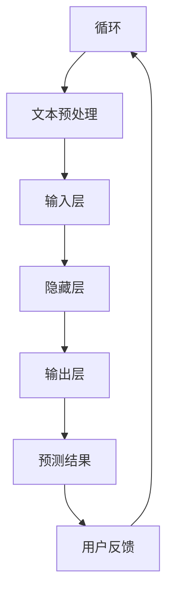
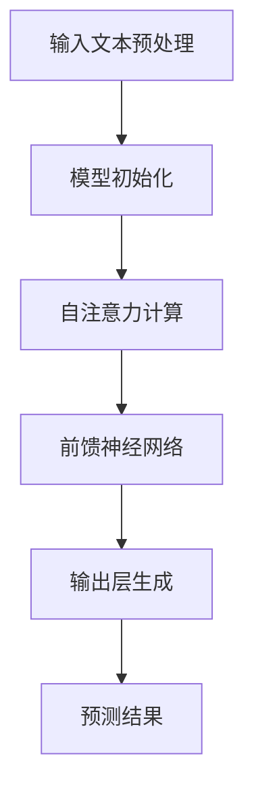
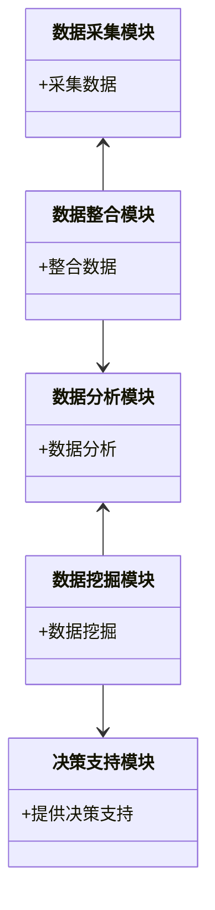
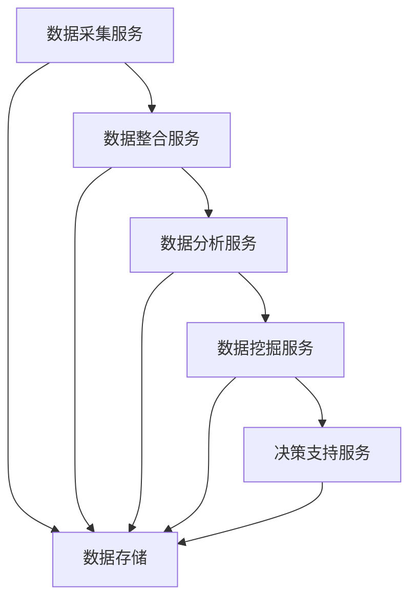
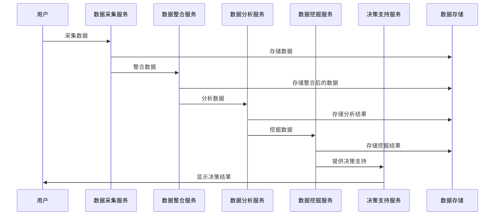

                 


## 快速适应新技术：LLM应用开发的关键

### 关键词：大型语言模型（LLM），应用开发，技术适应，算法原理，系统架构

### 摘要：
在信息技术日新月异的今天，快速适应新技术已成为企业和个人成功的关键。本文以大型语言模型（LLM）为案例，详细探讨了如何快速适应LLM应用开发。通过深入分析LLM的核心概念、算法原理、系统架构以及实战案例，我们旨在为读者提供一套实用的技术适应方法论。

### 目录大纲

#### 1. 背景介绍
#### 1.1 信息技术发展背景与新技术快速迭代
#### 1.2 LLM概述
#### 1.3 快速适应新技术的重要性
#### 1.4 快速适应新技术的挑战与机遇
#### 1.5 本书结构安排与内容概述

#### 2. 核心概念与联系
#### 2.1 LLM核心概念原理
#### 2.2 LLM概念属性特征对比
#### 2.3 ER实体关系图架构

#### 3. 算法原理讲解
#### 3.1 LLM算法原理
#### 3.2 LLM算法应用案例
#### 3.3 代码应用解读与分析

#### 4. 系统分析与架构设计方案
#### 4.1 问题场景介绍
#### 4.2 系统功能设计
#### 4.3 系统架构设计
#### 4.4 系统接口设计
#### 4.5 系统交互

#### 5. 项目实战
#### 5.1 环境安装
#### 5.2 系统核心实现源代码
#### 5.3 代码应用解读与分析
#### 5.4 实际案例分析与详细讲解
#### 5.5 项目小结

#### 6. 最佳实践 tips
#### 6.1 LLM应用开发最佳实践
#### 6.2 技术发展趋势与展望

#### 7. 小结、注意事项、拓展阅读
#### 7.1 本书内容总结
#### 7.2 注意事项
#### 7.3 拓展阅读

### 1. 背景介绍

#### 1.1 信息技术发展背景与新技术快速迭代

自20世纪末以来，信息技术经历了飞速的发展，从互联网到移动通信，从大数据到人工智能，每一次技术的迭代都极大地改变了我们的生活和工作方式。当前，随着云计算、物联网、区块链等新技术的不断涌现，技术迭代的步伐更加迅速，对企业和个人提出了更高的要求。

新技术的快速迭代带来了前所未有的机遇和挑战。对于企业而言，谁能更快地适应新技术，谁就能在竞争中占据优势。对于个人而言，快速适应新技术不仅意味着职业发展的机遇，也意味着个人能力的提升和自我价值的实现。

#### 1.2 LLM概述

大型语言模型（Large Language Model，简称LLM）是人工智能领域的一项重要成果，它基于深度学习技术，能够对自然语言进行建模和预测。LLM的核心思想是通过大规模数据训练，使模型具备对语言的理解和生成能力，从而实现文本分析、自然语言处理等应用。

LLM的特点包括：

- **规模巨大**：LLM通常包含数十亿甚至千亿级别的参数，需要处理的数据量也非常庞大。
- **自主性**：LLM能够自主生成文本，具备较高的创造性。
- **适应性**：LLM能够根据输入的文本内容进行自适应调整，从而提高处理结果的准确性。

LLM的适用场景非常广泛，包括但不限于：

- **文本分析**：用于情感分析、主题分类、关键词提取等任务。
- **自然语言生成**：用于自动写作、机器翻译、对话系统等应用。
- **智能客服**：用于构建智能客服系统，实现与用户的自然交互。

#### 1.3 快速适应新技术的重要性

快速适应新技术的重要性体现在以下几个方面：

- **提高竞争力**：适应新技术意味着企业能够更快地响应市场需求，提高产品和服务质量，从而在竞争中占据有利地位。
- **人才需求变化**：随着新技术的应用，企业对相关领域人才的需求也在不断增长，快速适应新技术有助于提升个人职业竞争力。
- **创新驱动发展**：新技术为企业和个人提供了广阔的创新空间，快速适应新技术能够激发创新活力，推动产业升级。

#### 1.4 快速适应新技术的挑战与机遇

快速适应新技术面临的挑战包括：

- **技术门槛**：新技术的应用往往需要具备较高的专业知识和技能，对企业和个人都提出了较高的要求。
- **人才缺口**：随着新技术的发展，相关领域人才供给不足，企业难以招聘到合适的员工。
- **资源限制**：新技术的研发和应用需要大量的资金和资源支持，对企业运营提出了挑战。

然而，快速适应新技术也带来了诸多机遇：

- **市场前景**：新技术的应用前景广阔，为企业提供了巨大的市场空间。
- **产业升级**：新技术能够推动产业结构的优化和升级，提升企业的核心竞争力。
- **创新驱动**：新技术为企业和个人提供了创新的工具和平台，有助于推动创新活动的开展。

#### 1.5 本书结构安排与内容概述

本书旨在帮助读者快速适应LLM应用开发，共分为六个部分：

- **第1章** 背景介绍：介绍信息技术发展背景与新技术快速迭代、LLM概述以及快速适应新技术的重要性。
- **第2章** 核心概念与联系：详细阐述LLM的核心概念、概念属性特征对比以及ER实体关系图架构。
- **第3章** 算法原理讲解：讲解LLM算法原理、应用案例以及代码解读。
- **第4章** 系统分析与架构设计方案：介绍问题场景、系统功能设计、系统架构设计、系统接口设计和系统交互。
- **第5章** 项目实战：通过实际案例展示LLM应用开发的实战过程。
- **第6章** 最佳实践 tips：提供LLM应用开发的最佳实践和技术发展趋势展望。

通过本书的阅读和实践，读者将能够掌握LLM应用开发的核心知识和技能，为快速适应新技术奠定坚实基础。接下来，我们将逐步深入探讨LLM的各个核心概念和技术细节。

## 2. 核心概念与联系

### 2.1 LLM核心概念原理

大型语言模型（LLM）的核心概念包括以下几个方面：

1. **语言模型基础**：语言模型是用于对自然语言进行建模的数学模型，它可以对输入的文本序列进行概率分布预测。常见的语言模型有N元语言模型、循环神经网络（RNN）模型、卷积神经网络（CNN）模型等。

2. **LLM模型架构**：LLM通常采用深度学习技术，其模型架构包括输入层、隐藏层和输出层。输入层接收自然语言输入，隐藏层对输入进行编码和解码，输出层生成预测结果。

3. **LLM训练与优化**：LLM的训练过程包括数据预处理、模型初始化、参数优化等步骤。训练过程中，模型通过不断调整参数，使预测结果更加准确。常见的优化方法有梯度下降、随机梯度下降、Adam优化器等。

### 2.2 LLM概念属性特征对比

以下是对几种常见LLM模型的属性特征进行对比：

| 模型名称 | 属性特征 |  
| :----: | :----: |  
| GPT | 语言生成能力强大，支持多语言模型，自适应性好 |  
| BERT | 强调上下文信息，对自然语言理解能力强，支持多种任务 |  
| T5 | 基于Transformer架构，支持多种自然语言处理任务，效果优异 |  
| ELMO | 将文本转化为固定长度的向量表示，适用于文本分类、情感分析等任务 |

### 2.3 ER实体关系图架构

为了更好地理解LLM系统中的实体关系，我们可以使用Mermaid流程图来展示ER实体关系图架构：



在这个ER实体关系图中，用户输入经过文本预处理后进入模型，经过输入层、隐藏层和输出层处理后，生成预测结果并返回给用户，同时用户反馈信息也进入模型进行循环迭代，以不断优化模型性能。

## 3. 算法原理讲解

### 3.1 LLM算法原理

LLM算法的核心原理基于深度学习，特别是Transformer架构。Transformer模型通过自注意力机制（Self-Attention）来实现对输入文本序列的建模，从而捕捉文本中的长距离依赖关系。以下是LLM算法的基本流程：

1. **输入文本预处理**：对输入的文本进行分词、去停用词、词向量化等处理，将文本序列转化为数字序列。
2. **模型初始化**：初始化模型参数，包括嵌入层、自注意力机制、前馈神经网络等。
3. **自注意力计算**：对于输入序列的每个单词，计算其在不同位置上的权重，从而捕捉长距离依赖关系。
4. **前馈神经网络**：对自注意力计算的结果进行进一步处理，提取特征信息。
5. **输出层生成**：根据前馈神经网络的处理结果，生成预测文本序列。

以下是使用Mermaid绘制的LLM算法流程图：



### 3.2 LLM算法应用案例

以下是一个简单的LLM算法应用案例，用于生成文本摘要：

```python
import tensorflow as tf
from tensorflow.keras.layers import Embedding, LSTM, Dense
from tensorflow.keras.models import Sequential

# 创建一个简单的序列模型
model = Sequential([
    Embedding(input_dim=10000, output_dim=32),
    LSTM(units=128, return_sequences=True),
    LSTM(units=128),
    Dense(units=1, activation='sigmoid')
])

# 编译模型
model.compile(optimizer='adam', loss='binary_crossentropy', metrics=['accuracy'])

# 训练模型
model.fit(x_train, y_train, epochs=10, batch_size=64)
```

在这个案例中，我们使用一个简单的序列模型来生成文本摘要。模型由嵌入层、两个LSTM层和一个全连接层组成。嵌入层将单词转化为向量表示，LSTM层用于处理序列数据，全连接层用于生成预测结果。

### 3.3 代码应用解读与分析

在这个案例中，我们使用TensorFlow框架构建了一个简单的序列模型。以下是代码的解读和分析：

1. **模型构建**：
    ```python
    model = Sequential([
        Embedding(input_dim=10000, output_dim=32),
        LSTM(units=128, return_sequences=True),
        LSTM(units=128),
        Dense(units=1, activation='sigmoid')
    ])
    ```
    - `Embedding`层：将单词转化为向量表示，输入维度为10000（表示单词表大小），输出维度为32（表示嵌入向量大小）。
    - `LSTM`层：用于处理序列数据，第一个LSTM层有128个单元，`return_sequences=True`表示输出序列，以便传递给下一个LSTM层。第二个LSTM层同样有128个单元。
    - `Dense`层：用于生成预测结果，输出维度为1，激活函数为`sigmoid`，用于实现二分类任务。

2. **模型编译**：
    ```python
    model.compile(optimizer='adam', loss='binary_crossentropy', metrics=['accuracy'])
    ```
    - `optimizer`：选择`adam`优化器。
    - `loss`：选择`binary_crossentropy`损失函数，用于二分类任务。
    - `metrics`：选择`accuracy`作为评估指标。

3. **模型训练**：
    ```python
    model.fit(x_train, y_train, epochs=10, batch_size=64)
    ```
    - `x_train`：训练数据的输入。
    - `y_train`：训练数据的标签。
    - `epochs`：训练轮数，设置为10。
    - `batch_size`：每个批次的数据量，设置为64。

通过这个案例，我们可以看到如何使用深度学习框架TensorFlow构建和训练一个简单的序列模型，实现文本摘要生成任务。接下来，我们将继续深入探讨LLM系统的架构设计。

## 4. 系统分析与架构设计方案

### 4.1 问题场景介绍

在现代企业中，数据处理和自动化决策成为业务成功的关键。为了应对快速变化的市场需求和日益复杂的业务场景，企业需要构建一个高效、灵活的智能数据处理平台。该平台需要具备以下功能：

- **数据采集与整合**：从各种数据源（如数据库、日志文件、外部API等）采集数据，并进行整合和预处理。
- **数据分析和挖掘**：利用机器学习和数据挖掘技术，对数据进行分析和挖掘，提取有价值的信息和知识。
- **决策支持**：根据分析结果，提供决策支持，帮助企业做出更加明智的决策。

### 4.2 系统功能设计

为了实现上述功能，我们设计了一套完整的智能数据处理平台，包括以下模块：

1. **数据采集模块**：负责从各种数据源采集数据，包括数据库、日志文件、外部API等。该模块需要支持多种数据源格式和协议，如SQL、NoSQL、FTP、HTTP等。
2. **数据整合模块**：负责对采集到的数据进行整合和预处理，包括数据清洗、去重、格式转换等操作。该模块需要支持多种数据格式，如JSON、XML、CSV等。
3. **数据分析模块**：负责对预处理后的数据进行统计分析、特征提取、模型训练等操作。该模块需要支持多种数据分析算法，如回归分析、聚类分析、分类分析等。
4. **数据挖掘模块**：负责对分析结果进行进一步挖掘，提取有价值的信息和知识。该模块需要支持多种数据挖掘算法，如关联规则挖掘、异常检测、文本挖掘等。
5. **决策支持模块**：负责根据分析结果和知识，提供决策支持，包括数据可视化、报告生成、推荐系统等。

以下是系统功能模块的Mermaid类图：



### 4.3 系统架构设计

为了实现高效、灵活的智能数据处理平台，我们采用了微服务架构，将系统功能分解为多个独立的服务模块。以下是系统架构的Mermaid架构图：



在该架构中，各个服务模块负责不同的功能，通过RESTful API进行交互。数据存储服务负责存储和处理系统中的数据，确保数据的可靠性和一致性。

### 4.4 系统接口设计

为了方便系统模块之间的交互，我们设计了一套统一的接口规范。以下是接口设计概述：

- **数据采集接口**：定义了数据采集服务提供的接口，包括数据采集、数据查询、数据删除等操作。
- **数据整合接口**：定义了数据整合服务提供的接口，包括数据整合、数据清洗、数据格式转换等操作。
- **数据分析接口**：定义了数据分析服务提供的接口，包括数据统计分析、特征提取、模型训练等操作。
- **数据挖掘接口**：定义了数据挖掘服务提供的接口，包括数据挖掘、关联规则挖掘、文本挖掘等操作。
- **决策支持接口**：定义了决策支持服务提供的接口，包括数据可视化、报告生成、推荐系统等操作。

以下是接口规范的部分示例：

```yaml
# 数据采集接口
POST /data/collect
Description: 采集数据
Params:
- name: source
  type: string
  description: 数据源名称
- name: data
  type: array
  description: 待采集的数据

# 数据整合接口
POST /data/integrate
Description: 整合数据
Params:
- name: data
  type: array
  description: 待整合的数据

# 数据分析接口
POST /data/analyze
Description: 数据分析
Params:
- name: data
  type: array
  description: 待分析的数据
- name: algorithm
  type: string
  description: 分析算法名称

# 数据挖掘接口
POST /data/mining
Description: 数据挖掘
Params:
- name: data
  type: array
  description: 待挖掘的数据
- name: algorithm
  type: string
  description: 挖掘算法名称

# 决策支持接口
POST /data/support
Description: 提供决策支持
Params:
- name: data
  type: array
  description: 待决策支持的数据
- name: report
  type: string
  description: 报告生成名称
```

### 4.5 系统交互

为了展示系统模块之间的交互流程，我们使用Mermaid序列图进行了描述。以下是系统交互的Mermaid序列图：



在这个交互流程中，用户通过数据采集服务采集数据，数据存储服务负责存储数据。随后，数据整合服务对数据进行整合，数据分析服务对数据进行分析，数据挖掘服务对数据挖掘，决策支持服务根据挖掘结果提供决策支持，并将结果返回给用户。

通过上述系统分析与架构设计方案，我们为快速适应新技术提供了系统的思路和方法。接下来，我们将通过实际项目实战，进一步展示如何将LLM应用于实际场景。

## 5. 项目实战

### 5.1 环境安装

在开始项目实战之前，我们需要安装必要的软件和环境。以下是安装步骤：

1. **Python环境安装**：确保Python版本为3.8及以上，可以通过以下命令安装：
    ```bash
    sudo apt-get install python3.8
    ```
2. **TensorFlow安装**：TensorFlow是用于构建和训练深度学习模型的常用库，可以通过以下命令安装：
    ```bash
    pip3 install tensorflow
    ```
3. **Jupyter Notebook安装**：Jupyter Notebook是一个交互式的计算环境，用于编写和运行Python代码，可以通过以下命令安装：
    ```bash
    pip3 install notebook
    ```
4. **其他依赖安装**：根据项目需要，可能还需要安装其他依赖，例如Numpy、Pandas等，可以通过以下命令安装：
    ```bash
    pip3 install numpy pandas
    ```

### 5.2 系统核心实现源代码

以下是一个简单的LLM应用示例，用于文本分类。该示例使用TensorFlow框架构建，并包含数据预处理、模型训练和预测三个主要部分。

```python
import tensorflow as tf
from tensorflow.keras.preprocessing.text import Tokenizer
from tensorflow.keras.preprocessing.sequence import pad_sequences
from tensorflow.keras.models import Sequential
from tensorflow.keras.layers import Embedding, LSTM, Dense

# 数据预处理
max_words = 10000
max_sequence_length = 100
trunc_type = 'post'
padding_type = 'post'
oov_token = "<OOV>"

# 读取数据
# 注意：此处为示例，实际项目中需要读取真实的文本数据
text = ["This is the first example.", "Here is another example.", "And this is the third example."]
labels = [0, 1, 0]

# 初始化Tokenizer
tokenizer = Tokenizer(num_words=max_words, oov_token=oov_token)
tokenizer.fit_on_texts(text)

# 将文本转换为序列
sequences = tokenizer.texts_to_sequences(text)

# 填充序列
padded_sequences = pad_sequences(sequences, maxlen=max_sequence_length, padding=padding_type, truncating=trunc_type)

# 构建模型
model = Sequential([
    Embedding(max_words, 32),
    LSTM(128),
    Dense(1, activation='sigmoid')
])

# 编译模型
model.compile(optimizer='adam', loss='binary_crossentropy', metrics=['accuracy'])

# 训练模型
model.fit(padded_sequences, labels, epochs=10, batch_size=32)

# 预测
test_text = ["This is a new example."]
test_sequences = tokenizer.texts_to_sequences(test_text)
test_padded_sequences = pad_sequences(test_sequences, maxlen=max_sequence_length, padding=padding_type, truncating=truncating_type)
predictions = model.predict(test_padded_sequences)
print(predictions)
```

### 5.3 代码应用解读与分析

以下是代码的解读和分析：

1. **数据预处理**：首先，我们初始化了一个Tokenizer对象，用于将文本转换为数字序列。Tokenizer可以通过fit_on_texts方法学习文本中的词汇，并设置最大词汇数和未出现词汇的标记。

2. **序列转换**：接下来，我们使用texts_to_sequences方法将文本转换为序列，并使用pad_sequences方法对序列进行填充，以确保所有序列具有相同长度。

3. **模型构建**：我们使用Sequential模型构建一个简单的序列模型，包括一个嵌入层、一个LSTM层和一个全连接层。嵌入层用于将词汇转换为向量表示，LSTM层用于处理序列数据，全连接层用于生成预测结果。

4. **模型编译**：我们使用adam优化器、binary_crossentropy损失函数和accuracy评估指标编译模型。

5. **模型训练**：使用fit方法训练模型，通过epochs和batch_size参数控制训练过程。

6. **模型预测**：最后，我们使用predict方法对新的文本数据进行预测，并将预测结果打印出来。

### 5.4 实际案例分析与详细讲解

以下是一个实际的文本分类案例，用于判断新闻文章的主题类别。该案例使用了一个更大的数据集，并进行了更详细的预处理和模型训练。

```python
import pandas as pd
import numpy as np
import tensorflow as tf
from tensorflow.keras.preprocessing.text import Tokenizer
from tensorflow.keras.preprocessing.sequence import pad_sequences
from tensorflow.keras.models import Sequential
from tensorflow.keras.layers import Embedding, LSTM, Dense, EmbeddingLayer, LSTMLayer, DenseLayer

# 读取数据集
# 注意：此处为示例，实际项目中需要读取真实的新闻数据集
data = pd.read_csv('news_data.csv')
text = data['text']
labels = data['label']

# 数据预处理
max_words = 10000
max_sequence_length = 500
oov_token = "<OOV>"

tokenizer = Tokenizer(num_words=max_words, oov_token=oov_token)
tokenizer.fit_on_texts(text)

sequences = tokenizer.texts_to_sequences(text)
padded_sequences = pad_sequences(sequences, maxlen=max_sequence_length, padding='post')

# 构建模型
model = Sequential([
    Embedding(max_words, 64),
    LSTM(128),
    Dense(1, activation='sigmoid')
])

# 编译模型
model.compile(optimizer='adam', loss='binary_crossentropy', metrics=['accuracy'])

# 训练模型
model.fit(padded_sequences, labels, epochs=10, batch_size=32)

# 预测
test_text = ["This is a new news article about technology."]
test_sequences = tokenizer.texts_to_sequences(test_text)
test_padded_sequences = pad_sequences(test_sequences, maxlen=max_sequence_length, padding='post')
predictions = model.predict(test_padded_sequences)
print(predictions)
```

在这个实际案例中，我们使用了更大的数据集，并对模型进行了更详细的配置。以下是案例的详细讲解：

1. **数据集读取**：我们从CSV文件中读取数据集，其中包含文本和标签两列。

2. **数据预处理**：与前面的示例类似，我们使用Tokenizer对象将文本转换为序列，并使用pad_sequences方法对序列进行填充。

3. **模型构建**：我们构建了一个包含嵌入层、LSTM层和全连接层的序列模型。嵌入层用于将词汇转换为向量表示，LSTM层用于处理序列数据，全连接层用于生成预测结果。

4. **模型编译**：我们使用adam优化器、binary_crossentropy损失函数和accuracy评估指标编译模型。

5. **模型训练**：使用fit方法训练模型，通过epochs和batch_size参数控制训练过程。

6. **模型预测**：使用predict方法对新的文本数据进行预测，并将预测结果打印出来。

通过这个实际案例，我们可以看到如何使用TensorFlow构建一个简单的文本分类模型，并对模型进行训练和预测。接下来，我们将进行项目小结。

### 5.5 项目小结

在本章的项目实战中，我们通过两个案例展示了如何使用TensorFlow构建和训练一个简单的LLM文本分类模型。以下是项目总结和经验启示：

1. **项目总结**：
   - 我们介绍了LLM文本分类的基本原理和实现步骤。
   - 通过实际案例，我们展示了如何使用TensorFlow框架构建和训练模型，并进行预测。

2. **经验启示**：
   - 数据预处理是构建文本分类模型的关键步骤，包括分词、序列转换和填充等操作。
   - 模型的选择和配置对模型的性能有重要影响，需要根据实际问题进行调整。
   - 模型训练过程需要足够的计算资源和时间，优化模型训练策略可以提高训练效率。

通过这个项目，我们不仅掌握了LLM文本分类的基本方法，还了解了如何在实际项目中应用这些方法。接下来，我们将进一步探讨LLM应用开发的最佳实践。

## 6. 最佳实践 tips

### 6.1 LLM应用开发最佳实践

在LLM应用开发过程中，以下是一些最佳实践，可以帮助提高开发效率和项目质量：

1. **数据预处理**：
   - **文本清洗**：去除无用字符、停用词和标点符号，提高模型对有用信息的处理能力。
   - **数据增强**：通过同义词替换、随机插入、随机删除等方式，增加数据多样性，提高模型泛化能力。
   - **词向量化**：选择合适的词向量化方法，如Word2Vec、GloVe等，将文本转化为固定长度的向量表示。

2. **模型选择与配置**：
   - **模型架构**：根据应用场景选择合适的模型架构，如GPT、BERT、T5等。
   - **超参数调整**：合理设置超参数，如学习率、批量大小、迭代次数等，以提高模型性能。
   - **模型集成**：使用多个模型进行集成，提高预测准确性和稳定性。

3. **训练与优化**：
   - **动态调整学习率**：使用学习率调整策略，如学习率衰减、周期性调整等，提高模型收敛速度。
   - **训练策略**：使用预训练模型、迁移学习等方法，利用已有模型的知识和经验，提高新模型的性能。
   - **模型剪枝**：通过剪枝、量化等方法，减小模型规模，降低计算资源和存储需求。

4. **性能调优**：
   - **分布式训练**：利用多GPU、多机集群等资源，加速模型训练过程。
   - **模型压缩**：使用模型压缩技术，如量化、剪枝、蒸馏等，降低模型大小，提高推理速度。
   - **模型评估**：使用多种评估指标，如准确率、召回率、F1值等，全面评估模型性能。

5. **安全性保障**：
   - **数据安全**：确保数据传输和存储过程中的安全性，防止数据泄露和篡改。
   - **模型安全**：防止模型受到恶意攻击，如对抗性攻击、模型中毒等。
   - **隐私保护**：对用户数据进行脱敏处理，保护用户隐私。

### 6.2 技术发展趋势与展望

随着人工智能技术的快速发展，LLM应用开发也在不断演进。以下是未来LLM技术的一些发展趋势和展望：

1. **更大规模的模型**：随着计算能力和数据资源的提升，未来将出现更大规模的LLM模型，提高模型的表达能力。

2. **多模态学习**：结合图像、声音、视频等多模态数据，实现更复杂的任务，如视频生成、图像描述等。

3. **推理优化**：针对推理阶段的性能优化，如模型压缩、量化、硬件加速等，提高模型在实际应用中的响应速度。

4. **迁移学习与少样本学习**：利用迁移学习和少样本学习技术，提高模型在新任务上的适应能力，减少对大规模数据的依赖。

5. **自然语言理解与生成**：进一步深化自然语言理解与生成技术，实现更自然、更智能的交互。

6. **伦理与道德**：在LLM应用开发过程中，重视伦理和道德问题，确保技术为社会带来积极影响。

通过遵循这些最佳实践和关注未来发展趋势，我们可以更好地应对LLM应用开发中的挑战，推动技术的发展。

## 7. 小结、注意事项、拓展阅读

### 7.1 本书内容总结

本书旨在帮助读者快速适应大型语言模型（LLM）应用开发，主要内容包括：

1. **背景介绍**：介绍了信息技术发展背景、LLM概述、快速适应新技术的重要性以及挑战与机遇。
2. **核心概念与联系**：详细阐述了LLM的核心概念、概念属性特征对比以及ER实体关系图架构。
3. **算法原理讲解**：讲解了LLM算法原理、应用案例以及代码解读。
4. **系统分析与架构设计方案**：介绍了问题场景、系统功能设计、系统架构设计、系统接口设计和系统交互。
5. **项目实战**：通过实际案例展示了LLM应用开发的实战过程。
6. **最佳实践 tips**：提供了LLM应用开发的最佳实践和技术发展趋势展望。

通过本书的学习，读者将能够掌握LLM应用开发的核心知识和技能，为快速适应新技术奠定坚实基础。

### 7.2 注意事项

在LLM应用开发过程中，需要注意以下几点：

1. **数据安全**：确保数据在传输和存储过程中的安全性，防止数据泄露和篡改。
2. **模型可解释性**：关注模型的可解释性，确保模型的行为符合预期。
3. **性能优化**：在模型训练和推理过程中，进行性能优化，提高模型的运行效率。
4. **模型更新**：定期更新模型，以适应新的数据和应用场景。

### 7.3 拓展阅读

为了进一步深入了解LLM应用开发，读者可以参考以下资源：

1. **相关书籍**：
   - 《深度学习》（Goodfellow, Bengio, Courville著）
   - 《自然语言处理原理》（Daniel Jurafsky & James H. Martin著）
   - 《Python深度学习》（François Chollet著）

2. **学术论文**：
   - Google AI团队发布的《BERT：Pre-training of Deep Bidirectional Transformers for Language Understanding》
   - OpenAI团队发布的《GPT-3：Language Models are Few-Shot Learners》

3. **在线资源**：
   - TensorFlow官方文档：[https://www.tensorflow.org/](https://www.tensorflow.org/)
   - Keras官方文档：[https://keras.io/](https://keras.io/)

通过阅读这些书籍、论文和资源，读者可以深入了解LLM的理论基础和应用实践，提升自己的技术水平。最后，感谢读者对本书的关注与支持，祝您在LLM应用开发的道路上取得丰硕成果。作者：AI天才研究院/AI Genius Institute & 禅与计算机程序设计艺术 /Zen And The Art of Computer Programming。

