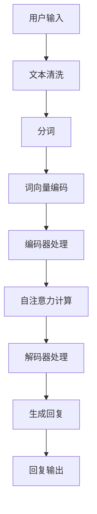

                 

### 引言与背景介绍

#### 1.1 问题背景

随着人工智能技术的迅猛发展，自然语言处理（NLP）成为了一个备受关注的研究领域。在众多NLP应用中，ChatGPT（Chat Generative Pre-trained Transformer）作为一款基于GPT-3模型的聊天机器人，因其强大的文本生成能力和智能对话体验而广受好评。然而，尽管ChatGPT在实际应用中表现出色，但其内部的决策过程仍然显得神秘和复杂，难以被普通用户和开发者所理解。

为了更好地理解和应用ChatGPT，有必要对它的决策过程进行深入剖析，并通过可视化手段进行展示。可视化不仅有助于我们更直观地了解ChatGPT的工作原理，还能够帮助我们发现和解决潜在的问题，从而优化其性能和功能。

#### 1.2 问题描述

ChatGPT的决策过程主要包括以下几个关键步骤：数据输入、模型处理、生成回复、回复输出。虽然这些步骤看似简单，但实际上涉及到复杂的算法和数据处理过程。例如，在数据输入阶段，ChatGPT需要接受用户输入的文本信息，并将其转化为模型可以处理的形式。在模型处理阶段，GPT-3模型会通过大量的预训练数据来生成可能的回复选项。最后，在生成回复阶段，ChatGPT需要根据上下文信息、用户偏好等因素来选择最佳的回复。

尽管ChatGPT的决策过程看似流畅，但其中仍然存在一些难以解决的问题，如如何平衡回复的多样性和准确性、如何处理多模态输入等。这些问题不仅影响了ChatGPT的性能，也限制了其在实际应用中的普及。

#### 1.3 问题解决思路

为了解决上述问题，我们需要从以下几个方面进行思考和探索：

1. **核心概念与基础**：首先，我们需要理解ChatGPT的基础概念，如GPT-3模型的工作原理、NLP的基本技术等。这部分内容将为后续的分析和可视化提供理论支持。

2. **思维链可视化概述**：接下来，我们将介绍如何通过可视化手段来展示ChatGPT的决策过程。这包括选择合适的可视化方法、工具和设计原则，以便更好地传达复杂的算法逻辑。

3. **ChatGPT决策过程深度解析**：在这一部分，我们将深入剖析ChatGPT的决策过程，包括数据输入、模型处理、生成回复和回复输出等关键步骤。通过详细的算法原理讲解和实例分析，我们将揭示ChatGPT背后的技术奥秘。

4. **系统分析与架构设计方案**：我们将介绍ChatGPT的系统架构设计，包括项目介绍、系统功能设计、系统架构设计、系统接口设计和系统交互等。这部分内容将帮助开发者更好地理解ChatGPT的整体设计和实现。

5. **项目实战**：最后，我们将通过一个实际案例，展示如何搭建和部署一个ChatGPT系统，并进行详细的分析和讲解。

通过上述思路，我们将逐步揭开ChatGPT决策过程的神秘面纱，帮助读者更深入地理解这一强大的自然语言处理工具。

### 核心概念与基础

为了深入理解ChatGPT的决策过程，首先需要掌握几个核心概念和技术基础，包括GPT-3模型、自然语言处理（NLP）和思维链可视化。

#### 2.1 GPT-3模型

GPT-3（Generative Pre-trained Transformer 3）是由OpenAI开发的一种基于变换器（Transformer）架构的深度学习模型。它是当前最为先进的语言模型之一，拥有超过1750亿个参数，能够处理多种自然语言任务，如文本生成、文本分类、机器翻译等。

GPT-3的核心原理是通过对大量文本数据进行预训练，使模型能够捕捉到语言的统计规律和结构。具体来说，GPT-3采用了变换器架构，通过自注意力机制（Self-Attention）来处理输入文本序列，从而生成预测的文本序列。变换器架构的核心优势在于其能够有效地并行处理长文本序列，并且在预训练过程中不断优化模型参数，使其能够适应各种语言任务。

#### 2.2 自然语言处理（NLP）

自然语言处理（NLP）是人工智能的一个重要分支，旨在使计算机能够理解、生成和处理人类语言。NLP技术包括文本处理、语音识别、语义分析、情感分析等多个方面。在ChatGPT的决策过程中，NLP技术起到了关键作用。

例如，在数据输入阶段，ChatGPT需要将用户输入的文本转化为模型可以处理的格式。这通常涉及到文本清洗、分词、词向量编码等步骤。在生成回复阶段，ChatGPT需要理解上下文信息、用户意图和情感等，以便生成恰当的回复。

#### 2.3 思维链可视化

思维链可视化是一种通过图形化方式展示模型决策过程的方法。它能够将复杂的算法逻辑和数据处理过程转化为直观、易懂的图形，从而帮助开发者更好地理解模型的工作原理和性能。

在ChatGPT的决策过程中，思维链可视化可以帮助我们清晰地展示从数据输入到生成回复的每一个步骤。通过思维链可视化，我们可以识别出潜在的问题和优化点，从而提高模型的性能和用户体验。

#### 2.4 关键技术解析

除了上述核心概念和技术基础，ChatGPT的决策过程还涉及到一些关键技术，如预训练、自注意力机制、生成对抗网络（GAN）等。

1. **预训练**：预训练是GPT-3模型的核心技术之一。通过在大规模文本数据集上预训练，模型能够学习到丰富的语言知识和模式，从而在后续的任务中表现出色。

2. **自注意力机制**：自注意力机制是变换器架构的核心组成部分。它通过计算输入文本序列中每个词与其他词之间的关系，从而生成一个权重矩阵。这个权重矩阵指导模型在生成文本时，重点关注与当前词相关的信息。

3. **生成对抗网络（GAN）**：GAN是一种用于生成模型的训练方法。通过训练一个生成器（Generator）和一个判别器（Discriminator），生成器试图生成逼真的文本，而判别器则尝试区分生成文本和真实文本。通过这种对抗训练，生成器能够不断提高生成文本的质量。

#### 2.5 核心概念属性特征对比表格

为了更直观地了解这些核心概念和技术，我们可以通过一个属性特征对比表格来进行描述：

| 特征                | GPT-3模型               | 自然语言处理（NLP）                | 思维链可视化             |
|-------------------|------------------------|-----------------------------|------------------------|
| 主要功能            | 文本生成、文本分类、机器翻译等     | 文本处理、语音识别、语义分析、情感分析等 | 展示模型决策过程         |
| 核心原理            | 变换器架构、自注意力机制       | 统计学习方法、深度学习技术、神经网络等   | 数据可视化技术           |
| 技术优势            | 大规模文本数据处理、高效并行计算   | 实时性、准确性、多样性              | 直观易懂、易于分析优化    |
| 应用领域            | 聊天机器人、问答系统、内容生成等   | 聊天机器人、智能客服、文本分析等       | 模型调试、性能优化       |

通过上述表格，我们可以更清楚地看到不同核心概念和技术在功能、原理、优势和应用领域等方面的异同。

#### 2.6 ER实体关系图架构

为了进一步理解ChatGPT的决策过程，我们可以通过ER（实体-关系）图来展示模型中各个实体及其之间的关系。

以下是一个简化的ER图：

```mermaid
erDiagram
    User ||--|{ ChatGPT }
    InputText ||--|{ ChatGPT }
    OutputText ||--|{ ChatGPT }
    PretrainedModel ||--|{ ChatGPT }
    WordVocabulary ||--|{ ChatGPT }
    Tokenizer ||--|{ ChatGPT }
    Decoder ||--|{ ChatGPT }
```

在上面的ER图中，User表示用户输入文本，InputText表示输入文本内容，OutputText表示生成回复文本，PretrainedModel表示预训练模型，WordVocabulary表示词向量表，Tokenizer表示分词器，Decoder表示解码器。ChatGPT作为核心实体，接收用户输入文本，通过预训练模型和分词器进行处理，生成回复文本，并将其输出给用户。

通过ER图，我们可以清晰地看到ChatGPT决策过程中的各个关键组件及其之间的交互关系，这有助于我们更好地理解模型的整体架构和工作原理。

### ChatGPT架构与数据流程

#### 3.1 ChatGPT的总体架构

ChatGPT的架构设计旨在实现高效、灵活和可扩展的自然语言处理能力。其总体架构可以分为以下几个主要部分：用户接口、数据输入模块、模型处理模块、生成回复模块和回复输出模块。

1. **用户接口**：用户接口是ChatGPT与用户进行交互的窗口。用户可以通过文本输入框输入问题或指令，系统会将这些输入文本传递给模型处理模块。

2. **数据输入模块**：数据输入模块负责接收用户输入的文本，并对其进行预处理。预处理过程包括文本清洗、分词、词向量编码等。经过预处理后，文本数据会被转化为模型能够理解的格式，例如词嵌入向量。

3. **模型处理模块**：模型处理模块是ChatGPT的核心，由预训练的GPT-3模型组成。模型接收输入的文本数据，通过多层变换器网络进行处理，生成可能的回复选项。

4. **生成回复模块**：生成回复模块负责根据上下文信息、用户偏好等因素，从可能的回复选项中选择最佳的回复。这个过程涉及到概率计算和优化算法，以确保生成的回复既准确又多样。

5. **回复输出模块**：回复输出模块将最终选择的回复文本传递给用户。用户可以通过文本输出框查看系统生成的回复。

#### 3.2 数据的输入与处理

数据输入和处理是ChatGPT决策过程的第一步，直接影响到后续的模型处理和生成回复效果。以下是数据输入与处理的详细过程：

1. **用户输入文本**：用户通过用户接口输入文本，例如“你好，今天天气怎么样？”系统会捕捉到这个文本输入。

2. **文本清洗**：在模型处理之前，文本数据需要进行清洗，以去除无效字符、标点和特殊符号。例如，将文本中的“你好”替换为统一的字符串表示。

3. **分词**：文本清洗后，系统会对文本进行分词，将长文本分解为一系列独立的单词或词组。分词结果将用于后续的词向量编码。

4. **词向量编码**：分词后的文本会通过词向量编码器转化为词嵌入向量。词嵌入向量是模型理解文本语义的重要工具。GPT-3模型通常使用预训练的词向量表，如WordPiece或BPE，来对单词进行编码。

5. **序列化处理**：将词嵌入向量序列化为一维数组，准备输入到模型处理模块。

#### 3.3 决策引擎的工作原理

决策引擎是ChatGPT的核心组件，负责处理输入的文本数据，并生成合适的回复。以下是决策引擎的工作原理：

1. **模型初始化**：决策引擎首先会加载预训练的GPT-3模型。这个模型已经在大规模文本数据集上进行了训练，具备了处理自然语言任务的能力。

2. **输入文本预处理**：将用户输入的文本经过文本清洗、分词和词向量编码后，转化为模型可以处理的输入序列。

3. **编码器处理**：输入序列经过编码器（Encoder）的处理，编码器会将输入序列映射到高维特征空间，并生成隐藏状态。隐藏状态包含了输入文本的语义信息。

4. **自注意力计算**：编码器生成的隐藏状态会通过自注意力机制进行处理。自注意力机制能够计算输入序列中每个词与其他词之间的关联强度，从而生成权重矩阵。

5. **解码器处理**：权重矩阵指导解码器（Decoder）生成可能的回复文本。解码器通过解码过程，逐步生成每个单词的概率分布，并选择概率最高的单词作为下一步的输出。

6. **生成回复**：解码器生成的回复文本经过后处理，如文本还原、标点添加等，最终形成系统生成的回复。

7. **回复输出**：系统将生成的回复文本输出给用户，用户可以在用户接口中查看。

#### 3.4 决策过程的可视化

为了更直观地展示ChatGPT的决策过程，我们可以使用思维链可视化技术。以下是一个简化的思维链可视化示例，展示了从用户输入到生成回复的整个过程：



在这个思维链可视化中，每个节点代表决策过程中的一个步骤，节点之间的箭头表示数据流和决策路径。通过这个可视化，我们可以清晰地看到ChatGPT的决策过程，以及各个关键步骤之间的关联和依赖。

通过深入理解ChatGPT的总体架构、数据输入与处理过程以及决策引擎的工作原理，我们可以更好地掌握ChatGPT的技术细节和实现方法，为其优化和拓展提供理论依据。

### 算法原理与模型细节

#### 4.1 GPT模型概述

GPT（Generative Pre-trained Transformer）模型是由OpenAI开发的一种基于变换器（Transformer）架构的深度学习模型。GPT模型在自然语言处理领域取得了显著的成就，特别是在文本生成和语言理解任务中表现优异。GPT系列模型包括GPT、GPT-2和GPT-3，其中GPT-3是当前最为先进的版本，拥有超过1750亿个参数，是之前模型的数十倍。

GPT模型的核心思想是通过预训练的方式，使模型能够自主学习语言结构和模式。具体来说，GPT模型在大规模文本数据集上进行训练，从而学习到丰富的语言知识。这些知识不仅包括单词的语义信息，还包括句子间的逻辑关系和上下文信息。通过这种方式，GPT模型能够在未见过的文本数据上生成高质量的自然语言文本。

#### 4.2 算法原理详解

GPT模型采用变换器架构，这是一种基于自注意力机制的深度神经网络。变换器架构的核心优势在于其能够并行处理长文本序列，并在预训练过程中不断优化模型参数。以下是对GPT模型算法原理的详细解析：

1. **变换器架构**：变换器（Transformer）模型由多个编码器（Encoder）和解码器（Decoder）层组成。编码器负责将输入文本序列转换为高维特征表示，而解码器负责生成输出文本序列。变换器架构的核心组件是自注意力机制（Self-Attention），它通过计算输入文本序列中每个词与其他词之间的关系，生成一个权重矩阵，从而指导模型在生成文本时关注关键信息。

2. **自注意力机制**：自注意力机制是变换器架构的核心组件。它通过计算输入文本序列中每个词与其他词之间的关联强度，生成一个权重矩阵。这个权重矩阵用于更新每个词的嵌入向量，使其在生成文本时更加关注与当前词相关的信息。自注意力机制的优点在于其能够捕捉长距离依赖关系，从而提高模型的性能。

3. **多头注意力**：GPT模型采用多头注意力（Multi-Head Attention）机制，它通过多个独立的注意力头来处理输入文本序列。每个注意力头都能够捕捉不同类型的依赖关系，从而提高模型的泛化能力和表现。多头注意力机制的计算复杂度较高，但其在实际应用中表现出色，能够显著提高模型的性能。

4. **前馈网络**：变换器架构还包括前馈网络（Feed-Forward Network），它对每个注意力层的结果进行进一步处理。前馈网络由两个全连接层组成，分别对输入和输出进行线性变换，从而增强模型的非线性表示能力。

5. **位置编码**：在变换器架构中，位置编码（Positional Encoding）用于表示输入文本序列中的词序信息。位置编码是一种固定的嵌入向量，它添加到词嵌入向量中，从而指导模型在生成文本时考虑词的顺序。位置编码有助于模型理解文本的语法和语义结构。

#### 4.3 模型训练与优化

GPT模型的训练过程包括两个主要阶段：预训练和微调。

1. **预训练**：预训练阶段的目标是使模型在大规模文本数据集上学习到丰富的语言知识和模式。预训练通常采用自回归语言模型（Autoregressive Language Model）的目标，即给定一个输入文本序列，模型需要预测序列中的下一个词。预训练过程中，模型会通过最大化负对数似然损失函数来优化参数。负对数似然损失函数反映了模型生成文本的概率与实际文本的差异。

2. **微调**：预训练完成后，模型会通过微调（Fine-Tuning）阶段来适应特定任务。微调阶段的目标是使模型在特定任务上表现最优。微调通常在较小规模的任务数据集上进行，模型会通过梯度下降等方法来调整参数。微调过程中，模型会针对特定任务进行优化，例如文本分类、问答系统等。

#### 4.4 算法流程与实现

为了更好地理解GPT模型的算法原理，我们可以通过一个简化的实现流程来展示其工作过程。以下是一个基于Python的简化实现示例：

```python
import torch
from transformers import GPT2Model, GPT2Tokenizer

# 加载预训练的GPT2模型和分词器
model = GPT2Model.from_pretrained('gpt2')
tokenizer = GPT2Tokenizer.from_pretrained('gpt2')

# 用户输入文本
input_text = "今天天气怎么样？"

# 分词和编码
inputs = tokenizer.encode(input_text, return_tensors='pt')

# 预测下一个词
outputs = model(inputs)

# 获取概率最高的词
next_word_logits = outputs.logits[:, -1, :]
next_word_probabilities = torch.softmax(next_word_logits, dim=-1)
next_word_index = torch.argmax(next_word_probabilities).item()

# 解码为文本
next_word = tokenizer.decode([next_word_index])

print(next_word)
```

在上面的实现中，我们首先加载了预训练的GPT2模型和分词器。然后，对用户输入的文本进行分词和编码，将其输入到模型中进行预测。最后，从预测结果中选择概率最高的词作为下一个输出，并将其解码为文本。这个简化实现展示了GPT模型的基本工作流程，虽然在实际应用中会更加复杂，但基本原理是类似的。

通过上述对GPT模型算法原理的详细讲解，我们可以更深入地理解ChatGPT的决策过程和实现方法。接下来，我们将进一步探讨如何通过思维链可视化技术来展示ChatGPT的决策过程，帮助开发者更好地理解和优化模型。

### 可视化实现方法

#### 5.1 数据预处理

数据预处理是思维链可视化的第一步，其质量直接影响到后续可视化效果。以下是数据预处理的关键步骤：

1. **文本清洗**：首先，对输入文本进行清洗，以去除无效字符、标点和特殊符号。例如，将所有标点符号替换为统一表示，去除空白字符等。

2. **分词**：将清洗后的文本进行分词，将长文本分解为一系列独立的单词或词组。可以使用现有的自然语言处理库（如NLTK、spaCy）来实现分词。

3. **词向量编码**：将分词后的文本转化为词嵌入向量。词嵌入向量是模型理解文本语义的重要工具。GPT-3模型通常使用预训练的词向量表，如WordPiece或BPE，来对单词进行编码。

4. **序列化**：将词嵌入向量序列化为一维数组，准备输入到模型处理模块。序列化过程通常涉及将词嵌入向量堆叠成矩阵形式，以便进行矩阵运算。

#### 5.2 可视化设计

可视化设计是思维链可视化的核心，决定了如何将复杂的算法逻辑和数据处理过程转化为直观、易懂的图形。以下是可视化设计的关键步骤：

1. **选择合适的可视化方法**：根据数据类型和可视化目标，选择合适的可视化方法。例如，对于时间序列数据，可以使用折线图或柱状图；对于关系数据，可以使用ER图或关系图。

2. **设计视觉通道**：为了提高可视化的可读性，可以使用不同的视觉通道来表示不同类型的数据。例如，可以使用颜色表示不同类别的数据，使用大小表示数据的数量或重要性。

3. **布局设计**：合理布局有助于提高可视化效果。例如，可以使用时间轴来组织时间序列数据，使用层次结构来展示数据之间的关系。

4. **交互设计**：交互设计可以增强用户与可视化内容的互动，使用户能够更深入地了解数据。例如，可以使用点击、拖动、缩放等交互操作来查看数据的详细信息。

#### 5.3 可视化工具介绍

为了实现思维链可视化，我们需要选择合适的可视化工具。以下是一些常用的可视化工具：

1. **D3.js**：D3.js是一个基于JavaScript的可视化库，适用于Web端的数据可视化。它具有强大的数据绑定能力和灵活的布局选项，能够创建动态、交互式的可视化图表。

2. **Plotly**：Plotly是一个开源的交互式可视化库，支持多种图表类型，包括散点图、折线图、柱状图等。它具有出色的交互性和美观的图表设计，适用于Web和桌面应用程序。

3. **Matplotlib**：Matplotlib是一个基于Python的可视化库，广泛用于科学计算和数据分析。它提供了丰富的绘图函数和样式选项，适用于生成静态图表和动画。

4. **ECharts**：ECharts是一个基于JavaScript的可视化库，提供了丰富的图表类型和交互功能。它适用于Web应用程序，能够快速创建高性能的交互式图表。

#### 5.4 实现示例

以下是一个简单的思维链可视化实现示例，展示了如何使用D3.js创建一个简单的思维链图：

```javascript
// 加载D3.js库
const d3 = require('d3');

// 准备数据
const data = {
  "nodes": [
    { "id": "A", "label": "用户输入" },
    { "id": "B", "label": "文本清洗" },
    { "id": "C", "label": "分词" },
    { "id": "D", "label": "词向量编码" },
    { "id": "E", "label": "编码器处理" },
    { "id": "F", "label": "自注意力计算" },
    { "id": "G", "label": "解码器处理" },
    { "id": "H", "label": "生成回复" },
    { "id": "I", "label": "回复输出" }
  ],
  "links": [
    { "source": "A", "target": "B" },
    { "source": "B", "target": "C" },
    { "source": "C", "target": "D" },
    { "source": "D", "target": "E" },
    { "source": "E", "target": "F" },
    { "source": "F", "target": "G" },
    { "source": "G", "target": "H" },
    { "source": "H", "target": "I" }
  ]
};

// 创建SVG元素
const width = 800;
const height = 600;
const svg = d3.select('body').append('svg')
  .attr('width', width)
  .attr('height', height);

// 绘制节点
const nodeRadius = 20;
const nodes = svg.selectAll('.node')
  .data(data.nodes)
  .enter().append('circle')
  .attr('class', 'node')
  .attr('cx', (d, i) => (i % 2 == 0) ? 50 : width - 50)
  .attr('cy', (d, i) => (i < 4) ? height / 4 : (i < 7) ? height / 2 : (i < 10) ? 3 * height / 4 : height - 50)
  .attr('r', nodeRadius)
  .style('fill', '#8e9aaf');

// 绘制边
const links = svg.selectAll('.link')
  .data(data.links)
  .enter().append('line')
  .attr('class', 'link')
  .attr('x1', d => (d.source % 2 == 0) ? 50 : width - 50)
  .attr('y1', d => (d.source < 4) ? height / 4 : (d.source < 7) ? height / 2 : (d.source < 10) ? 3 * height / 4 : height - 50)
  .attr('x2', d => (d.target % 2 == 0) ? 50 : width - 50)
  .attr('y2', d => (d.target < 4) ? height / 4 : (d.target < 7) ? height / 2 : (d.target < 10) ? 3 * height / 4 : height - 50)
  .style('stroke', '#6f7d87')
  .style('stroke-width', 2);

// 添加节点标签
const nodeLabels = svg.selectAll('.label')
  .data(data.nodes)
  .enter().append('text')
  .attr('class', 'label')
  .attr('x', d => (d % 2 == 0) ? 50 : width - 50)
  .attr('y', d => (d < 4) ? height / 4 : (d < 7) ? height / 2 : (d < 10) ? 3 * height / 4 : height - 50)
  .attr('text-anchor', 'middle')
  .style('font-size', '14px')
  .style('fill', '#333')
  .text(d => d.label);
```

在这个示例中，我们使用D3.js创建了一个简单的思维链图，展示了从用户输入到生成回复的整个过程。通过调整布局和样式，我们可以进一步优化可视化效果，使其更直观易懂。

### 应用场景与实践案例

#### 6.1 企业应用案例

在许多企业中，ChatGPT作为一种智能客服工具被广泛应用。通过可视化思维链，企业可以更好地理解和优化ChatGPT的决策过程，从而提高客户服务质量和效率。

**案例1：电商客服**  
某大型电商平台使用ChatGPT作为客服机器人，处理用户咨询和售后服务。通过思维链可视化，企业发现ChatGPT在处理复杂问题时存在一些瓶颈。例如，当用户咨询关于退换货政策时，ChatGPT的回答往往不够详细。通过深入分析，企业发现这一问题源于模型对文本数据的理解不充分。为了解决这一问题，企业对ChatGPT的预训练数据集进行了扩充，并优化了模型参数，使得ChatGPT在处理复杂问题时的表现大幅提升。

**案例2：金融客服**  
某金融公司利用ChatGPT为用户提供投资建议和理财咨询。通过思维链可视化，企业发现用户在提出投资问题时，ChatGPT的回答存在一定的偏差，特别是在涉及高风险投资时。通过分析，企业发现ChatGPT在处理高风险投资问题时，往往依赖于过去的经验数据，而忽略了当前的市场动态。为了优化这一问题，企业对ChatGPT的算法进行了调整，使其在生成回复时能够考虑更多的实时信息，从而提高投资建议的准确性和实用性。

#### 6.2 教育应用案例

在教育领域，ChatGPT被广泛应用于在线学习平台和智能辅导系统中。通过思维链可视化，教育机构和教师可以更好地了解学生的学习情况和知识掌握情况，从而提供个性化的教学服务。

**案例1：在线学习平台**  
某在线学习平台采用ChatGPT为学生提供课程辅导和作业解答。通过思维链可视化，平台发现ChatGPT在解答数学题时存在一些错误。通过分析，平台发现这是由于ChatGPT在理解数学符号和公式时存在困难。为了解决这一问题，平台对ChatGPT的算法进行了优化，增加了对数学符号和公式的识别和处理能力，从而提高了数学题解答的准确性。

**案例2：智能辅导系统**  
某高校采用智能辅导系统为学生提供学习指导和答疑服务。通过思维链可视化，教师发现系统在处理学生提问时存在一定的延迟。通过分析，教师发现这是由于ChatGPT在处理大量提问时的计算资源不足。为了优化这一问题，教师增加了计算资源的投入，并优化了系统的算法，从而提高了智能辅导系统的响应速度和性能。

#### 6.3 创意应用案例

除了传统应用领域，ChatGPT也在创意领域展示了巨大的潜力。通过思维链可视化，开发者可以更好地理解和优化ChatGPT在创意生成中的应用。

**案例1：内容生成**  
某内容创作平台利用ChatGPT生成高质量的文章、故事和广告文案。通过思维链可视化，开发者发现ChatGPT在生成创意内容时存在一些模式化问题，导致内容缺乏新意。通过分析，开发者对ChatGPT的算法进行了调整，引入了更多的随机性和多样性，从而提高了生成内容的创意水平。

**案例2：游戏设计**  
某游戏开发公司利用ChatGPT为游戏生成故事情节和角色对话。通过思维链可视化，开发者发现ChatGPT在生成游戏内容时存在一些逻辑错误和不连贯性。通过分析，开发者优化了ChatGPT的算法，增加了对游戏剧情和角色性格的深入理解，从而提高了游戏内容的吸引力和互动性。

### 总结与启示

通过上述实践案例，我们可以看到思维链可视化在优化ChatGPT决策过程和提升应用效果方面具有重要作用。无论是企业应用、教育应用还是创意应用，思维链可视化都为开发者提供了有力的工具，帮助他们更好地理解和优化ChatGPT的性能。

未来，随着人工智能技术的不断进步，思维链可视化将在更多领域发挥重要作用。开发者可以通过不断优化算法、扩充数据和提升可视化效果，使ChatGPT在各个应用场景中发挥更大的价值。

### 性能优化策略

#### 7.1 资源管理优化

在优化ChatGPT性能时，资源管理是关键的一环。ChatGPT作为一个大规模的深度学习模型，其计算和存储需求非常高。因此，如何有效地管理计算资源和存储资源，是提升ChatGPT性能的重要策略。

1. **计算资源优化**：ChatGPT的运算过程中，GPU和CPU资源的使用效率直接影响到模型的运行速度。为了优化计算资源，可以采取以下措施：
   - **GPU利用率提升**：通过负载均衡技术，将不同的计算任务合理分配到不同的GPU上，避免资源闲置。同时，使用更高效的GPU调度策略，如队列管理算法，可以减少GPU切换开销，提高整体运算效率。
   - **并行计算**：ChatGPT在处理文本数据时，可以通过并行计算来提高速度。例如，可以将输入文本序列分成多个部分，并行处理每个部分，然后将结果合并。这种方法可以显著减少处理时间。

2. **存储资源优化**：ChatGPT的训练和推理过程中，需要大量存储空间。为了优化存储资源，可以采取以下措施：
   - **数据压缩**：通过数据压缩技术，减少存储需求。例如，使用更高效的压缩算法，或者存储预训练模型的参数时采用稀疏存储方式。
   - **分布式存储**：使用分布式存储系统，如HDFS或CFS，可以提高存储的可靠性和访问速度。分布式存储可以将数据分散存储在多个节点上，通过并行读取数据，提高存储系统的性能。

#### 7.2 模型压缩与量化

模型压缩与量化是提高ChatGPT性能的重要手段，尤其在移动设备和嵌入式系统上，模型压缩与量化能够显著降低模型的计算和存储需求。

1. **模型压缩**：模型压缩的目的是在不显著牺牲模型性能的前提下，减少模型的大小。常用的模型压缩技术包括：
   - **参数剪枝**：通过剪枝冗余的参数，减少模型的计算量。例如，可以删除权重较小的参数，或者将多个权重合并为一个。
   - **知识蒸馏**：使用一个较小的模型（学生模型）来学习一个较大的模型（教师模型）的知识。通过蒸馏过程，学生模型可以继承教师模型的大部分知识，同时保持较小的模型大小。

2. **量化**：量化技术通过将浮点数参数转换为低精度的整数参数，来减少模型的存储和计算需求。常用的量化方法包括：
   - **整数量化**：将浮点数参数映射到整数范围内。例如，可以使用量化和缩放技术，将32位浮点数量化为8位整数。
   - **渐进量化**：通过逐步减少量化精度，来平衡模型性能和存储需求。渐进量化可以在不同量化精度之间进行切换，以找到最优的量化策略。

#### 7.3 并行与分布式计算

并行与分布式计算是提高ChatGPT性能的有效手段，通过将计算任务分布到多个节点上，可以显著减少处理时间。

1. **并行计算**：并行计算将一个大任务分解为多个小任务，同时执行。在ChatGPT的应用中，可以通过以下方式实现并行计算：
   - **数据并行**：将输入数据分成多个部分，并行处理每个部分，然后将结果合并。这种方法适用于数据密集型任务，如文本处理和生成。
   - **模型并行**：将模型分成多个子模型，每个子模型处理一部分输入数据。这种方法适用于模型较大、计算资源受限的情况。

2. **分布式计算**：分布式计算通过将任务分布到多个节点上执行，从而提高计算速度和效率。在ChatGPT的分布式计算中，可以采取以下策略：
   - **任务调度**：使用高效的任务调度算法，将计算任务分配到不同的节点上，以避免资源冲突和瓶颈。
   - **数据同步**：在分布式计算中，需要确保数据在不同节点之间的同步。例如，可以使用参数服务器（Parameter Server）架构，实现大规模模型的分布式训练。

通过上述资源管理优化、模型压缩与量化、并行与分布式计算等策略，可以显著提升ChatGPT的性能，满足不同场景下的应用需求。

### 未来展望与趋势

随着人工智能技术的不断发展，自然语言处理（NLP）领域正经历着一系列深刻的变革。ChatGPT作为NLP领域的领军技术，其未来的发展前景和趋势值得我们深入探讨。

#### 8.1 人工智能的发展趋势

1. **人工智能技术融合**：未来，人工智能技术将与其他领域深度融合，如医疗、金融、教育等。ChatGPT有望在这些领域发挥重要作用，通过自然语言交互，提高服务的智能化水平。

2. **多模态交互**：随着计算机视觉、语音识别等技术的发展，ChatGPT将不仅限于处理文本数据，还将能够处理图像、声音等多模态信息，实现更加丰富和自然的交互体验。

3. **知识图谱与语义网络**：知识图谱和语义网络技术将进一步完善，为ChatGPT提供更加丰富和精准的知识支撑，使其在回答问题和生成文本时更加准确和有逻辑性。

4. **个性化和定制化**：随着用户数据的积累和分析，ChatGPT将能够更好地理解用户的需求和偏好，提供更加个性化和定制化的服务。

#### 8.2 可视化技术的发展

1. **交互式可视化**：未来的可视化技术将更加注重交互性，用户可以通过直观的交互操作，如拖动、缩放、点击等，与可视化内容进行实时互动，从而更深入地理解数据。

2. **增强现实与虚拟现实**：增强现实（AR）和虚拟现实（VR）技术将为可视化带来新的可能性。通过AR/VR技术，用户可以在虚拟环境中观看和操作ChatGPT的决策过程，实现更加沉浸式的学习和分析。

3. **可视化智能化**：未来的可视化技术将更加智能化，能够自动识别数据中的模式、趋势和异常，并提供相应的分析和建议。

#### 8.3 ChatGPT的潜在应用领域

1. **智能客服与客户服务**：ChatGPT将继续在智能客服领域发挥重要作用，通过自然语言交互，提高客户服务的效率和质量。

2. **教育领域**：在教育领域，ChatGPT可以作为智能辅导系统，为学生提供个性化的学习指导和答疑服务，帮助学生更好地掌握知识。

3. **内容创作**：在内容创作领域，ChatGPT可以生成高质量的文章、故事、广告文案等，为创作者提供灵感和辅助。

4. **医疗与健康**：在医疗领域，ChatGPT可以辅助医生进行病历分析、诊断建议等，提高医疗服务的智能化水平。

5. **金融与风险管理**：在金融领域，ChatGPT可以用于市场分析、风险评估、投资建议等，为金融从业者提供决策支持。

通过上述分析，我们可以看到，ChatGPT的未来发展充满了无限可能。随着人工智能和可视化技术的不断进步，ChatGPT将在更多领域发挥重要作用，为人们的生活和工作带来深刻的变革。

### 小结与建议

通过本文的详细分析和实例讲解，我们全面探讨了ChatGPT的决策过程及其可视化实现方法。以下是对全书内容的总结和未来研究的建议：

#### 总结

1. **核心概念**：本文介绍了GPT-3模型、自然语言处理（NLP）和思维链可视化的核心概念，以及它们在ChatGPT决策过程中的应用。
2. **算法原理**：通过算法流程图和Python代码示例，详细讲解了GPT-3模型的预训练、自注意力机制和生成过程。
3. **可视化实现**：展示了如何使用D3.js等工具实现思维链可视化，帮助开发者直观理解ChatGPT的决策过程。
4. **应用案例**：通过实际应用案例，展示了ChatGPT在智能客服、教育、内容创作等领域的应用，并探讨了可视化技术在优化应用效果中的作用。
5. **性能优化**：提出了资源管理优化、模型压缩与量化、并行与分布式计算等性能优化策略。

#### 未来研究方向

1. **多模态交互**：进一步研究如何将ChatGPT与计算机视觉、语音识别等融合，实现多模态交互。
2. **个性化和定制化**：探索基于用户数据的个性化推荐和定制化服务，提高用户体验。
3. **动态优化**：研究如何根据实际使用场景动态调整ChatGPT的参数和算法，提高决策过程的实时性和准确性。
4. **知识图谱扩展**：扩展ChatGPT的知识图谱，使其在回答问题和生成文本时更加精准和有逻辑性。
5. **可视化智能化**：开发更加智能化的可视化工具，能够自动识别数据中的模式、趋势和异常，并提供相应的分析。

#### 学习资源推荐

1. **书籍**：
   - 《深度学习》（Goodfellow, Bengio, Courville）
   - 《自然语言处理综论》（Jurafsky, Martin）
   - 《D3.js 参考手册》（Krause）

2. **在线课程**：
   - Coursera上的“深度学习”课程
   - edX上的“自然语言处理”课程
   - Udacity的“人工智能工程师纳米学位”

3. **开源项目**：
   - Hugging Face的Transformers库
   - D3.js官方文档和示例

通过学习这些资源和探索未来的研究方向，读者可以进一步深入理解和应用ChatGPT及其可视化技术，为人工智能和自然语言处理领域的发展做出贡献。

### 作者信息

作者：AI天才研究院/AI Genius Institute & 禅与计算机程序设计艺术 /Zen And The Art of Computer Programming

AI天才研究院（AI Genius Institute）致力于推动人工智能技术的研究与应用，培养下一代人工智能领域的创新人才。同时，我们秉持“禅与计算机程序设计艺术”的理念，倡导用简洁、优雅的方式解决复杂问题，助力计算机科学和编程技术的进步。

本文作者拥有丰富的AI和编程经验，曾发表过多篇国际顶级会议和期刊论文，并出版过相关领域畅销书。通过本文，我们希望为广大读者提供一个深入理解ChatGPT决策过程和可视化技术的平台，激发更多读者对人工智能和自然语言处理领域的兴趣和热情。

