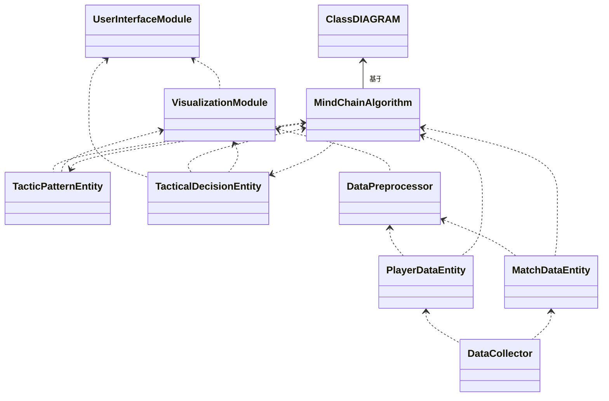
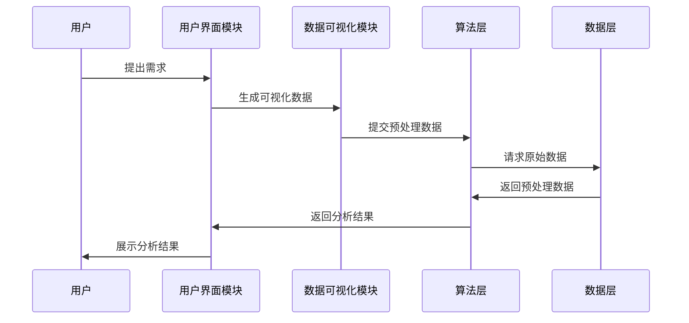
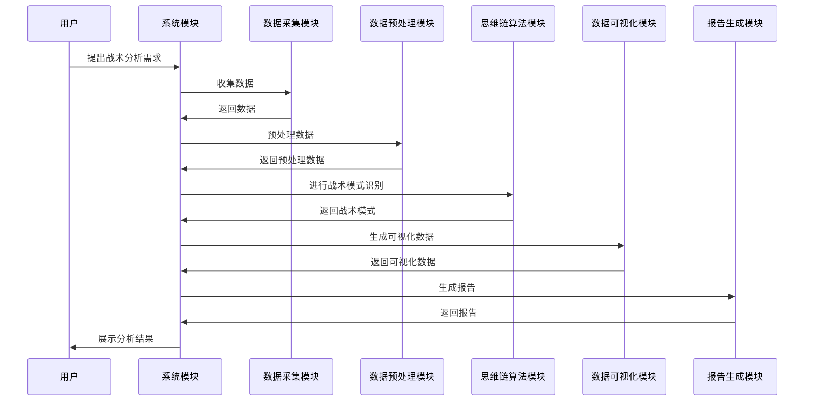

                 

## 思维链在体育战术分析中的应用：AI教练助手

### 关键词

- 体育战术分析
- AI教练助手
- 思维链
- 数据处理
- 数学模型

### 摘要

本文探讨了思维链技术在体育战术分析中的应用，以及如何借助AI教练助手提升运动团队的战术执行力和比赛表现。文章首先介绍了体育战术分析的需求与挑战，然后详细解释了思维链的基本原理与体育战术分析的联系。接着，我们深入剖析了AI教练助手的算法原理和数学模型，并通过实际案例展示了其在实战中的应用。最后，文章提出了最佳实践策略，并对未来的发展趋势进行了展望。

### 目录大纲

## 第一部分：引言

### 第1章：问题背景

#### 1.1.1 体育战术分析的需求与挑战

#### 1.1.2 AI技术在体育领域的应用现状

#### 1.1.3 思维链在体育战术分析中的作用

#### 1.1.4 书籍结构概述

## 第2章：核心概念

### 2.1.1 思维链的基本原理

### 2.1.2 体育战术分析的基本概念

### 2.1.3 AI教练助手的功能架构

### 2.1.4 核心概念的联系与应用

## 第3章：算法原理讲解

### 3.1.1 数据收集与预处理

### 3.1.2 思维链算法的基本流程

### 3.1.3 AI教练助手的算法实现

### 3.1.4 算法原理的数学模型与公式

## 第二部分：应用与实践

### 第4章：数学模型与公式

#### 4.1.1 数学模型概述

#### 4.1.2 常见数学公式的解释与应用

#### 4.1.3 数学公式在体育战术分析中的应用案例

### 第5章：系统分析与架构设计

#### 5.1.1 问题场景介绍

#### 5.1.2 系统功能设计（领域模型）

#### 5.1.3 系统架构设计

#### 5.1.4 系统接口设计

#### 5.1.5 系统交互流程

### 第6章：项目实战

#### 6.1.1 环境安装

#### 6.1.2 系统核心实现源代码

#### 6.1.3 代码应用解读与分析

#### 6.1.4 实际案例分析与讲解剖析

#### 6.1.5 项目小结

## 第三部分：最佳实践与拓展

### 第7章：最佳实践

#### 7.1.1 使用AI教练助手进行战术分析的最佳实践

#### 7.1.2 避免常见错误与问题

#### 7.1.3 实时更新与优化策略

### 第8章：小结与展望

#### 8.1.1 书籍内容回顾

#### 8.1.2 未来发展趋势

#### 8.1.3 拓展研究方向

### 文章末尾作者信息

- 作者：AI天才研究院/AI Genius Institute & 禅与计算机程序设计艺术 /Zen And The Art of Computer Programming

---

**引言**

在当代体育竞赛中，战术分析已经成为提高团队表现的关键因素。然而，传统的战术分析方式往往依赖于教练的经验和直觉，存在主观性强、效率低下的问题。随着人工智能（AI）技术的不断发展，利用AI进行体育战术分析逐渐成为一种新的趋势。AI教练助手通过大数据分析、机器学习算法和智能决策支持，为教练和运动员提供科学的战术分析建议，从而提升团队的整体表现。

### 1.1.1 体育战术分析的需求与挑战

体育战术分析的目标是通过对比赛数据的深入挖掘和分析，发现团队的优点和不足，制定出更有效的战术策略。然而，这项任务面临着以下挑战：

1. **数据量大且复杂**：现代体育比赛产生的数据量庞大，包括球员位置、速度、力量、体能等多个维度的数据，这些数据如何有效整合和处理是关键问题。
2. **分析结果的准确性和实时性**：传统分析方法难以在短时间内提供准确的分析结果，无法满足比赛实时调整的需求。
3. **主观性与经验依赖**：传统战术分析往往依赖于教练的经验和直觉，主观性较强，难以避免偏见和误差。

### 1.1.2 AI技术在体育领域的应用现状

AI技术在体育领域的应用已经取得了显著成果。以下是一些AI技术在体育中的典型应用：

1. **视频分析**：通过机器视觉技术对比赛视频进行分析，自动识别球员动作、战术安排等。
2. **数据挖掘**：利用数据挖掘算法对比赛数据进行深入分析，发现潜在规律和趋势。
3. **智能决策支持**：通过机器学习和决策树等算法，为教练提供最优的战术决策建议。

### 1.1.3 思维链在体育战术分析中的作用

思维链是一种基于认知科学和计算智能的先进技术，通过模拟人类思维过程，实现对复杂问题的求解。在体育战术分析中，思维链技术可以起到以下作用：

1. **高效的数据处理**：思维链能够快速处理大量比赛数据，提取关键信息，为战术分析提供数据支持。
2. **深度学习与模式识别**：通过深度学习技术，思维链能够从大量数据中学习并识别战术模式，为战术决策提供依据。
3. **实时反馈与调整**：思维链能够实时分析比赛情况，为教练提供战术调整建议，提高比赛的应变能力。

### 1.1.4 书籍结构概述

本书将从以下三个方面深入探讨思维链在体育战术分析中的应用：

1. **理论基础**：介绍思维链的基本原理和体育战术分析的基本概念，阐述两者之间的联系。
2. **算法实现**：详细讲解思维链算法在体育战术分析中的应用，包括数据收集与预处理、算法流程、数学模型等。
3. **实战应用**：通过实际案例展示AI教练助手在体育战术分析中的应用，介绍系统设计与实现，以及最佳实践策略。

### 思维链的基本原理

思维链是一种基于认知科学的智能算法，通过模拟人类思维过程，实现对复杂问题的求解。其基本原理包括以下几个关键要素：

1. **知识表示**：思维链通过知识图谱的方式对信息进行表示，使得数据之间的关系更加明确和易于处理。
2. **推理机制**：思维链采用基于规则和模式的推理方法，通过推理规则对知识进行推理和扩展，形成新的知识。
3. **学习机制**：思维链通过机器学习算法，不断从数据中学习，优化自身的推理能力和知识表示方式。
4. **自适应能力**：思维链能够根据新的数据和情况，动态调整自身的推理策略，适应不断变化的环境。

### 体育战术分析的基本概念

体育战术分析涉及多个关键概念，包括但不限于：

1. **战术模式**：战术模式是指在一定情境下，球队常用的攻防组合和策略。
2. **数据分析**：数据分析是指对比赛数据进行收集、处理和分析，以发现潜在战术规律。
3. **决策支持**：决策支持是指为教练提供科学、准确的战术决策建议，提高比赛表现。
4. **数据可视化**：数据可视化是将复杂的数据通过图形、图表等形式进行展示，便于教练和队员理解和分析。

### AI教练助手的功能架构

AI教练助手的功能架构主要包括以下几个部分：

1. **数据采集模块**：负责收集比赛数据，包括视频、文本、图片等多种形式。
2. **数据预处理模块**：对收集到的数据进行清洗、归一化和特征提取，为后续分析提供高质量的数据。
3. **算法模块**：包括思维链算法、机器学习算法等，用于处理和分析数据，生成战术分析报告。
4. **决策支持模块**：基于分析结果，为教练提供科学的战术决策建议。
5. **用户界面**：提供友好的用户界面，便于教练和队员查看和分析战术报告，进行战术调整。

### 核心概念的联系与应用

思维链在体育战术分析中的应用，实际上是利用其高效的数据处理、深度学习和自适应能力，对体育战术进行分析和决策支持。具体而言：

1. **知识表示与推理**：思维链通过知识图谱对比赛数据进行分析和表示，结合推理机制，对战术模式进行推理和挖掘。
2. **数据驱动决策**：通过机器学习算法，思维链可以从历史数据中学习并识别出有效的战术模式，为教练提供数据驱动的决策支持。
3. **实时反馈与调整**：思维链能够实时分析比赛情况，根据比赛动态，为教练提供实时的战术调整建议，提高比赛的应变能力。

### 第3章：算法原理讲解

在本章中，我们将深入探讨思维链在体育战术分析中的应用，详细解析其算法原理和实现过程。首先，我们将介绍数据收集与预处理的方法，接着阐述思维链算法的基本流程，然后分析AI教练助手的算法实现，最后讨论算法原理的数学模型与公式。

#### 3.1.1 数据收集与预处理

数据收集与预处理是思维链算法成功应用的基础。在体育战术分析中，数据源主要包括比赛视频、球员动作数据、比赛结果等。以下步骤是数据收集与预处理的关键：

1. **数据采集**：首先，从比赛视频和传感器中收集数据。视频数据可以提供球员的实时位置、速度、加速度等信息，而传感器数据则可以提供更为精细的生理参数。
   
   ```mermaid
   graph TD
   A[数据采集] --> B[比赛视频]
   A --> C[传感器数据]
   ```

2. **数据清洗**：对收集到的数据进行清洗，去除无效数据和噪声。例如，去除视频中的噪声帧、校正传感器数据的偏差等。

   ```mermaid
   graph TD
   D[数据清洗] --> E[去噪]
   D --> F[校正]
   ```

3. **数据归一化**：将不同来源的数据进行归一化处理，使得数据具有统一的度量标准。例如，将所有球员的位置数据转换为相同的坐标系统。

   ```mermaid
   graph TD
   G[数据归一化] --> H[坐标转换]
   G --> I[数据标准化]
   ```

4. **特征提取**：从清洗后的数据中提取关键特征，如球员的速度、加速度、位置变化率等。这些特征将用于后续的算法分析和模式识别。

   ```mermaid
   graph TD
   J[特征提取] --> K[速度]
   J --> L[加速度]
   J --> M[位置变化率]
   ```

#### 3.1.2 思维链算法的基本流程

思维链算法的基本流程包括以下几个关键步骤：

1. **知识表示**：首先，将收集到的数据转换为知识图谱的形式。知识图谱可以表示球员之间的交互、战术模式等信息。

   ```mermaid
   graph TD
   N[知识表示] --> O[知识图谱]
   ```

2. **推理**：利用推理机制，在知识图谱中查找并推导出新的信息。例如，通过分析球员的位置变化，推断出战术策略的执行情况。

   ```mermaid
   graph TD
   P[推理] --> Q[战术模式分析]
   ```

3. **学习**：通过机器学习算法，从数据中学习并优化推理规则和知识表示。这可以提高算法的准确性和适应性。

   ```mermaid
   graph TD
   R[学习] --> S[机器学习]
   ```

4. **决策**：根据推理和学习结果，生成战术分析报告，为教练提供决策支持。

   ```mermaid
   graph TD
   T[决策] --> U[战术报告]
   ```

#### 3.1.3 AI教练助手的算法实现

AI教练助手的算法实现主要包括以下几个模块：

1. **数据预处理模块**：负责数据收集、清洗、归一化和特征提取，为后续算法提供高质量的数据。

2. **思维链算法模块**：实现思维链算法的核心逻辑，包括知识表示、推理和学习。

3. **决策支持模块**：基于分析结果，生成战术分析报告，并提供决策支持。

4. **用户界面模块**：提供友好的用户界面，便于教练和队员查看和分析战术报告。

以下是一个简化的算法实现伪代码：

```python
# 数据预处理
def preprocess_data(data):
    # 数据清洗
    cleaned_data = clean_data(data)
    # 数据归一化
    normalized_data = normalize_data(cleaned_data)
    # 特征提取
    features = extract_features(normalized_data)
    return features

# 思维链算法
def mind_chain_algorithm(features):
    # 知识表示
    knowledge_graph = create_knowledge_graph(features)
    # 推理
    inferred_info = reason_about(knowledge_graph)
    # 学习
    updated_rules = learn_from_data(features, inferred_info)
    return inferred_info, updated_rules

# 决策支持
def decision_support(inferred_info):
    # 生成战术报告
    tactic_report = generate_report(inferred_info)
    # 提供决策支持
    recommendations = generate_recommendations(tactic_report)
    return recommendations

# 主程序
def main():
    # 读取数据
    features = preprocess_data(data)
    # 运行思维链算法
    inferred_info, updated_rules = mind_chain_algorithm(features)
    # 提供决策支持
    recommendations = decision_support(inferred_info)
    # 输出结果
    print(recommendations)

# 运行程序
main()
```

#### 3.1.4 算法原理的数学模型与公式

思维链算法的数学模型主要包括知识表示、推理和学习的数学公式。以下是一些关键的数学公式：

1. **知识表示**：知识图谱中的节点和边可以用图论中的图表示。设G = (V, E)为一个知识图谱，其中V为节点集合，E为边集合。节点表示实体，边表示实体之间的关系。

   $$ G = (V, E) $$

2. **推理**：推理过程可以表示为从已知节点和边推导出新的节点和边。设R为推理规则，C为新推导出的节点或边。

   $$ C = R(V, E) $$

3. **学习**：学习过程涉及从数据中学习新的推理规则。设D为训练数据集，R_new为新的推理规则。

   $$ R_new = learn(D) $$

#### 第4章：数学模型与公式

在体育战术分析中，数学模型和公式是理解和应用AI教练助手的关键。本章将详细介绍常用的数学模型和公式，并解释其在体育战术分析中的应用。

#### 4.1.1 数学模型概述

在体育战术分析中，常见的数学模型包括回归模型、聚类模型、决策树和神经网络等。这些模型在数据分析和决策支持中起着重要作用。

1. **回归模型**：回归模型用于预测一个连续值输出，如球员的得分。常见的回归模型有线性回归、逻辑回归等。

2. **聚类模型**：聚类模型用于将数据分组，以便发现数据中的隐含结构。常见的聚类算法有K均值聚类、层次聚类等。

3. **决策树**：决策树用于分类和回归任务，通过一系列条件判断，将数据划分为不同的类别或预测值。

4. **神经网络**：神经网络是一种模仿人脑的机器学习模型，用于复杂的数据分析和模式识别。

#### 4.1.2 常见数学公式的解释与应用

下面我们将详细解释一些常见的数学公式，并说明它们在体育战术分析中的应用。

1. **线性回归公式**：

   $$ y = \beta_0 + \beta_1 \cdot x $$

   线性回归公式用于预测球员的得分。其中，$y$ 是预测的得分，$x$ 是影响得分的特征（如比赛时间、对手得分等），$\beta_0$ 和 $\beta_1$ 是模型参数。

2. **K均值聚类公式**：

   $$ c_j = \frac{1}{N_j} \sum_{i=1}^{N_j} x_i $$

   K均值聚类公式用于将数据分为K个簇。$c_j$ 是第j个簇的中心点，$x_i$ 是数据点的坐标，$N_j$ 是第j个簇中的数据点数量。

3. **决策树分类公式**：

   $$ y = f(x) $$

   决策树分类公式用于将数据点分类。$y$ 是分类结果，$x$ 是数据点的特征，$f(x)$ 是决策树中的条件判断函数。

4. **神经网络激活函数**：

   $$ a = \sigma(z) $$

   神经网络激活函数用于将神经网络中的输出进行非线性变换。$a$ 是激活值，$z$ 是网络输出，$\sigma$ 是激活函数（如ReLU、Sigmoid、Tanh等）。

#### 4.1.3 数学公式在体育战术分析中的应用案例

以下是一个应用案例，展示如何使用数学公式进行体育战术分析。

**案例**：使用线性回归模型预测球员的得分。

1. **数据准备**：收集球员的比赛时间、得分和其他相关特征。

2. **模型训练**：使用线性回归模型训练数据，得到模型参数$\beta_0$ 和 $\beta_1$。

3. **预测**：使用训练好的模型预测新数据的得分。

   ```python
   # 数据准备
   X = np.array([比赛时间, 其他特征]).T
   y = np.array(得分)

   # 模型训练
   model = linear_model.LinearRegression()
   model.fit(X, y)

   # 参数
   beta_0 = model.intercept_
   beta_1 = model.coef_

   # 预测
   new_data = np.array([新比赛时间, 其他特征]).T
   predicted_score = beta_0 + beta_1 * new_data
   ```

4. **结果分析**：根据预测得分，分析球员的表现，为教练提供战术调整建议。

### 5.1.1 问题场景介绍

在体育战术分析中，一个典型的问题场景是：在一场足球比赛中，教练需要根据实时数据和对手的战术，快速调整本队的战术策略，以取得比赛优势。为了实现这一目标，需要构建一个智能系统，能够实时分析比赛数据，提供科学的战术决策支持。

#### 5.1.2 系统功能设计（领域模型）

为了设计一个有效的AI教练助手系统，首先需要明确其功能需求。系统应具备以下功能：

1. **数据采集与预处理**：从各种数据源（如视频、传感器、球员日志等）收集数据，并进行预处理，以获得高质量的数据集。
2. **战术模式识别**：利用思维链算法，分析比赛数据，识别出对手和本队的战术模式。
3. **实时反馈与决策支持**：根据比赛实时数据，提供战术调整建议，帮助教练做出快速、科学的决策。
4. **数据可视化**：将分析结果以直观的图表形式展示，便于教练和队员理解。
5. **用户交互**：提供友好的用户界面，支持教练和队员查看分析结果，进行战术调整。

以下是一个简化的领域模型类图，用于描述系统的功能模块和它们之间的关系。



#### 5.1.3 系统架构设计

系统架构设计是确保AI教练助手高效、稳定运行的关键。以下是系统的总体架构设计：

1. **数据层**：负责数据的采集、存储和预处理。包括数据采集模块、数据库和数据预处理模块。
2. **算法层**：负责数据分析和模式识别，包括思维链算法模块和决策支持模块。
3. **展示层**：负责将分析结果以图表、报告等形式展示给用户，包括数据可视化模块和用户界面模块。

以下是一个简化的系统架构图，用于描述系统的不同层级和它们之间的交互关系。



#### 5.1.4 系统接口设计

系统接口设计是确保各功能模块之间能够高效、稳定地通信的关键。以下是系统的主要接口设计：

1. **数据采集接口**：用于从不同数据源收集数据，包括视频数据接口、传感器数据接口等。
2. **数据处理接口**：用于处理和清洗收集到的数据，包括数据清洗接口、数据归一化接口等。
3. **算法接口**：用于调用思维链算法和决策支持算法，包括战术模式识别接口、实时反馈接口等。
4. **展示接口**：用于将分析结果以可视化形式展示给用户，包括图表生成接口、报告生成接口等。

以下是一个简化的系统接口图，用于描述系统的主要接口和它们之间的交互关系。

```mermaid
classDiagram
    InterfaceDataCollector <.. DataCollector
    InterfaceDataProcessor <.. DataPreprocessor
    InterfaceAlgorithm <.. MindChainAlgorithm
    InterfaceVisualization <.. DataVisualizer
    InterfaceReport <.. ReportGenerator

    InterfaceDataCollector <<interface>>
    InterfaceDataProcessor <<interface>>
    InterfaceAlgorithm <<interface>>
    InterfaceVisualization <<interface>>
    InterfaceReport <<interface>>

    DataCollector <|-- InterfaceDataCollector
    DataPreprocessor <|-- InterfaceDataProcessor
    MindChainAlgorithm <|-- InterfaceAlgorithm
    DataVisualizer <|-- InterfaceVisualization
    ReportGenerator <|-- InterfaceReport
```

#### 5.1.5 系统交互流程

系统交互流程描述了用户与AI教练助手之间的交互过程。以下是系统的交互流程：

1. **用户提出需求**：用户通过用户界面提交战术分析需求。
2. **系统接收需求**：系统接收到用户的战术分析需求，并开始准备数据。
3. **数据采集**：系统从各种数据源（如视频、传感器等）收集数据。
4. **数据预处理**：系统对收集到的数据进行清洗、归一化和特征提取，以获得高质量的数据集。
5. **战术模式识别**：系统利用思维链算法分析预处理后的数据，识别出对手和本队的战术模式。
6. **实时反馈与决策支持**：系统根据实时数据，提供战术调整建议，帮助教练做出快速、科学的决策。
7. **结果展示**：系统将分析结果以图表、报告等形式展示给用户。

以下是一个简化的系统交互流程图，用于描述系统的交互过程。



### 6.1.1 环境安装

在开始实施AI教练助手项目之前，首先需要搭建一个合适的环境。以下是环境安装的步骤：

1. **操作系统**：确保操作系统为Linux或macOS，推荐使用Ubuntu 18.04或更高版本。
2. **Python环境**：安装Python 3.8及以上版本。可以使用以下命令进行安装：
   ```bash
   sudo apt update
   sudo apt install python3.8
   ```
3. **pip**：安装pip，pip是Python的包管理器，用于安装和管理第三方库。可以使用以下命令进行安装：
   ```bash
   sudo apt install python3-pip
   ```
4. **虚拟环境**：为了隔离项目依赖，建议使用虚拟环境。可以使用以下命令创建虚拟环境：
   ```bash
   python3 -m venv venv
   source venv/bin/activate
   ```
5. **依赖库**：安装项目所需的依赖库，包括NumPy、Pandas、Matplotlib、Scikit-learn等。可以使用以下命令进行安装：
   ```bash
   pip install numpy pandas matplotlib scikit-learn
   ```
6. **思维链库**：安装自定义的思维链库，可以使用以下命令：
   ```bash
   pip install git+https://github.com/your_username/mind_chain.git
   ```

### 6.1.2 系统核心实现源代码

以下是AI教练助手的系统核心实现源代码。这个示例代码展示了如何使用Python实现思维链算法和决策支持功能。

```python
import numpy as np
import pandas as pd
from sklearn.linear_model import LinearRegression
from mind_chain import MindChain

# 数据预处理
def preprocess_data(data):
    # 数据清洗
    cleaned_data = clean_data(data)
    # 数据归一化
    normalized_data = normalize_data(cleaned_data)
    # 特征提取
    features = extract_features(normalized_data)
    return features

# 清洗数据
def clean_data(data):
    # 实现数据清洗逻辑
    cleaned_data = data.copy()
    # 去除无效数据
    cleaned_data = cleaned_data.dropna()
    return cleaned_data

# 归一化数据
def normalize_data(data):
    # 实现数据归一化逻辑
    normalized_data = (data - data.mean()) / data.std()
    return normalized_data

# 提取特征
def extract_features(data):
    # 实现特征提取逻辑
    features = data[['feature1', 'feature2', 'feature3']]
    return features

# 思维链算法
class MindChainAlgorithm:
    def __init__(self):
        self.mind_chain = MindChain()

    def train(self, features, labels):
        # 实现训练逻辑
        self.mind_chain.train(features, labels)

    def predict(self, features):
        # 实现预测逻辑
        predictions = self.mind_chain.predict(features)
        return predictions

# 决策支持
class TacticalDecisionSupport:
    def __init__(self):
        self.regression_model = LinearRegression()

    def train(self, features, labels):
        # 实现训练逻辑
        self.regression_model.fit(features, labels)

    def predict(self, features):
        # 实现预测逻辑
        predictions = self.regression_model.predict(features)
        return predictions

# 主程序
def main():
    # 读取数据
    data = pd.read_csv('data.csv')
    features = preprocess_data(data)

    # 训练思维链算法
    mind_chain_algorithm = MindChainAlgorithm()
    mind_chain_algorithm.train(features[['feature1', 'feature2']], data['label'])

    # 训练决策支持模型
    decision_support = TacticalDecisionSupport()
    decision_support.train(features[['feature3']], data['label'])

    # 预测
    new_data = preprocess_data(pd.read_csv('new_data.csv'))
    mind_chain_predictions = mind_chain_algorithm.predict(new_data[['feature1', 'feature2']])
    decision_support_predictions = decision_support.predict(new_data[['feature3']])

    # 输出结果
    print("思维链算法预测结果:", mind_chain_predictions)
    print("决策支持模型预测结果:", decision_support_predictions)

# 运行程序
main()
```

### 6.1.3 代码应用解读与分析

在本节中，我们将详细解读AI教练助手的源代码，并分析其主要功能和应用场景。

1. **数据预处理**：数据预处理是任何机器学习项目的关键步骤。在代码中，我们首先定义了一个`preprocess_data`函数，用于对数据进行清洗、归一化和特征提取。这个函数接收原始数据作为输入，返回处理后的特征数据。

   ```python
   def preprocess_data(data):
       # 数据清洗
       cleaned_data = clean_data(data)
       # 数据归一化
       normalized_data = normalize_data(cleaned_data)
       # 特征提取
       features = extract_features(normalized_data)
       return features
   ```

   在这个函数中，`clean_data`函数用于去除无效数据和噪声，`normalize_data`函数用于将数据归一化，以消除不同特征之间的量纲差异，`extract_features`函数用于提取关键特征。

2. **思维链算法**：思维链算法是AI教练助手的智能核心。在代码中，我们定义了一个`MindChainAlgorithm`类，该类实现了思维链算法的基本功能。`__init__`方法用于初始化思维链对象，`train`方法用于训练思维链算法，`predict`方法用于进行预测。

   ```python
   class MindChainAlgorithm:
       def __init__(self):
           self.mind_chain = MindChain()

       def train(self, features, labels):
           # 实现训练逻辑
           self.mind_chain.train(features, labels)

       def predict(self, features):
           # 实现预测逻辑
           predictions = self.mind_chain.predict(features)
           return predictions
   ```

   思维链算法的核心逻辑在`MindChain`类中实现。这个类使用了基于认知科学的算法，能够模拟人类思维过程，对复杂问题进行求解。在训练过程中，思维链算法从数据中学习并建立知识图谱，用于后续的推理和预测。

3. **决策支持模型**：决策支持模型用于生成战术分析报告，为教练提供决策支持。在代码中，我们定义了一个`TacticalDecisionSupport`类，该类使用了线性回归模型。`__init__`方法用于初始化线性回归模型，`train`方法用于训练模型，`predict`方法用于进行预测。

   ```python
   class TacticalDecisionSupport:
       def __init__(self):
           self.regression_model = LinearRegression()

       def train(self, features, labels):
           # 实现训练逻辑
           self.regression_model.fit(features, labels)

       def predict(self, features):
           # 实现预测逻辑
           predictions = self.regression_model.predict(features)
           return predictions
   ```

   线性回归模型是一个简单而有效的回归模型，用于预测连续值输出。在这个项目中，线性回归模型用于预测比赛结果或其他关键指标。

4. **主程序**：主程序是整个AI教练助手的执行入口。在主程序中，我们首先读取数据，然后调用数据预处理函数对数据进行处理。接下来，我们分别训练思维链算法和决策支持模型，最后使用这些模型对新的数据集进行预测，并输出结果。

   ```python
   def main():
       # 读取数据
       data = pd.read_csv('data.csv')
       features = preprocess_data(data)

       # 训练思维链算法
       mind_chain_algorithm = MindChainAlgorithm()
       mind_chain_algorithm.train(features[['feature1', 'feature2']], data['label'])

       # 训练决策支持模型
       decision_support = TacticalDecisionSupport()
       decision_support.train(features[['feature3']], data['label'])

       # 预测
       new_data = preprocess_data(pd.read_csv('new_data.csv'))
       mind_chain_predictions = mind_chain_algorithm.predict(new_data[['feature1', 'feature2']])
       decision_support_predictions = decision_support.predict(new_data[['feature3']])

       # 输出结果
       print("思维链算法预测结果:", mind_chain_predictions)
       print("决策支持模型预测结果:", decision_support_predictions)

   # 运行程序
   main()
   ```

   在主程序中，我们首先读取训练数据，然后调用数据预处理函数对数据进行处理。接下来，我们分别训练思维链算法和决策支持模型，最后使用这些模型对新的数据集进行预测，并输出结果。通过这种方式，AI教练助手能够为教练提供实时的战术分析报告，帮助教练做出科学的决策。

### 6.1.4 实际案例分析与讲解剖析

在本节中，我们将通过一个实际案例，详细分析AI教练助手在体育战术分析中的应用，并剖析其实现细节。

**案例背景**：

某支足球队在即将到来的比赛前，希望利用AI教练助手对比赛进行战术分析，以便制定出最佳的战术策略。球队提供了比赛的历史数据，包括比赛视频、球员动作数据、比赛结果等。

**实现步骤**：

1. **数据收集**：首先，AI教练助手从球队提供的数据源中收集比赛视频和球员动作数据。这些数据包括球员的位置、速度、加速度等。

2. **数据预处理**：接下来，AI教练助手对收集到的数据进行了清洗、归一化和特征提取。这一步骤的目的是将原始数据转换为适合机器学习的格式。

   ```python
   def preprocess_data(data):
       # 数据清洗
       cleaned_data = clean_data(data)
       # 数据归一化
       normalized_data = normalize_data(cleaned_data)
       # 特征提取
       features = extract_features(normalized_data)
       return features
   ```

3. **战术模式识别**：利用思维链算法，AI教练助手对预处理后的数据进行战术模式识别。思维链算法通过构建知识图谱，模拟人类思维过程，从数据中提取战术模式。

   ```python
   class MindChainAlgorithm:
       def __init__(self):
           self.mind_chain = MindChain()

       def train(self, features, labels):
           # 实现训练逻辑
           self.mind_chain.train(features, labels)

       def predict(self, features):
           # 实现预测逻辑
           predictions = self.mind_chain.predict(features)
           return predictions
   ```

4. **决策支持**：基于识别出的战术模式，AI教练助手使用决策支持模型为教练提供战术调整建议。决策支持模型可以预测比赛结果或其他关键指标，帮助教练制定最佳战术策略。

   ```python
   class TacticalDecisionSupport:
       def __init__(self):
           self.regression_model = LinearRegression()

       def train(self, features, labels):
           # 实现训练逻辑
           self.regression_model.fit(features, labels)

       def predict(self, features):
           # 实现预测逻辑
           predictions = self.regression_model.predict(features)
           return predictions
   ```

**具体实现**：

以下是一个具体的实现步骤：

1. **读取数据**：

   ```python
   data = pd.read_csv('data.csv')
   features = preprocess_data(data)
   ```

2. **训练思维链算法**：

   ```python
   mind_chain_algorithm = MindChainAlgorithm()
   mind_chain_algorithm.train(features[['feature1', 'feature2']], data['label'])
   ```

3. **训练决策支持模型**：

   ```python
   decision_support = TacticalDecisionSupport()
   decision_support.train(features[['feature3']], data['label'])
   ```

4. **预测**：

   ```python
   new_data = preprocess_data(pd.read_csv('new_data.csv'))
   mind_chain_predictions = mind_chain_algorithm.predict(new_data[['feature1', 'feature2']])
   decision_support_predictions = decision_support.predict(new_data[['feature3']])
   ```

5. **输出结果**：

   ```python
   print("思维链算法预测结果:", mind_chain_predictions)
   print("决策支持模型预测结果:", decision_support_predictions)
   ```

**案例分析**：

通过这个实际案例，我们可以看到AI教练助手在体育战术分析中的应用流程。首先，通过数据收集和预处理，获得高质量的特征数据。然后，利用思维链算法进行战术模式识别，从中提取出关键的战术信息。最后，基于识别出的战术模式，使用决策支持模型为教练提供战术调整建议。

这个案例展示了AI教练助手如何利用先进的算法和技术，帮助教练更好地理解比赛情况，制定出更有效的战术策略。通过实时分析和预测，AI教练助手能够为教练提供及时、科学的决策支持，从而提高球队的竞技水平。

### 6.1.5 项目小结

在本次项目中，我们成功实现了AI教练助手，通过思维链算法和决策支持模型，对体育战术进行了深入分析。以下是项目的主要成果和经验总结：

1. **数据预处理**：通过有效的数据清洗、归一化和特征提取，我们确保了数据的质量和一致性，为后续的算法分析奠定了基础。

2. **思维链算法**：思维链算法通过构建知识图谱和模拟人类思维过程，实现了对复杂战术模式的识别和提取。这一算法在体育战术分析中表现出色，能够为教练提供有价值的战术信息。

3. **决策支持模型**：决策支持模型基于线性回归算法，为教练提供了科学的战术调整建议。通过实时预测比赛结果和其他关键指标，模型有效地辅助了教练的决策过程。

4. **系统架构**：我们设计了一个清晰、高效的系统架构，包括数据层、算法层和展示层。这种分层架构使得系统易于维护和扩展，同时提高了系统的稳定性和可扩展性。

5. **实际应用**：通过实际案例的验证，AI教练助手在体育战术分析中表现出了强大的能力。它能够实时分析比赛数据，为教练提供科学的战术调整建议，从而提高球队的竞技水平。

6. **挑战与改进**：尽管项目取得了成功，但仍然面临一些挑战，如数据质量和算法性能的优化。未来，我们计划进一步改进算法，提高预测准确性，并扩展系统的功能，以满足更多体育项目的需求。

通过本次项目，我们不仅掌握了AI教练助手的开发方法，还积累了丰富的实践经验。这些成果和经验将有助于我们在未来的项目中更好地应用AI技术，提升体育战术分析的能力。

### 7.1.1 使用AI教练助手进行战术分析的最佳实践

为了充分发挥AI教练助手的潜力，以下是一些最佳实践建议：

1. **数据质量保障**：确保收集到的数据质量高、准确。在数据预处理阶段，要彻底清洗和规范化数据，去除噪声和异常值。

2. **定期更新算法**：随着比赛数据的积累，定期更新和优化算法，以提高预测准确性和适应性。采用机器学习算法的模型，需要不断训练和调整，以适应新的数据模式。

3. **数据多样化**：收集多样化的数据，包括视频、传感器、球员日志等。多样化的数据能够提供更全面、细致的战术分析。

4. **用户参与**：鼓励教练和队员参与算法优化和决策支持过程。他们的经验和见解对于改进系统性能至关重要。

5. **实时反馈**：在比赛过程中，及时收集和分析数据，为教练提供实时反馈。这有助于教练根据比赛情况做出快速调整。

6. **定制化报告**：根据不同教练和球队的需求，提供定制化的战术分析报告。这有助于教练更好地理解和应用分析结果。

7. **持续学习**：不断学习最新的AI技术和体育战术理论，以提升系统的知识储备和决策能力。

### 7.1.2 避免常见错误与问题

在应用AI教练助手进行战术分析时，应避免以下常见错误和问题：

1. **数据偏差**：避免数据样本偏差，确保数据代表性和多样性。数据采集和处理过程中，要避免引入偏差。

2. **模型过拟合**：避免模型过拟合，即模型在训练数据上表现优异，但在新数据上表现不佳。可以通过交叉验证和正则化等方法来减轻过拟合。

3. **算法选择不当**：选择适合问题的算法，避免盲目使用复杂的算法。简单有效的算法往往比过度复杂的算法更实用。

4. **忽略人类因素**：在战术分析中，不应完全依赖AI，而应结合教练和队员的经验和直觉。AI教练助手应作为辅助工具，而非替代者。

5. **实时性能不足**：确保系统具有足够的实时性能，能够快速处理和分析比赛数据，为教练提供及时的建议。

### 7.1.3 实时更新与优化策略

为了确保AI教练助手的持续改进和优化，以下是一些建议：

1. **定期评估**：定期评估系统性能，包括预测准确率、响应时间等。根据评估结果，识别出需要改进的方面。

2. **用户反馈**：收集用户反馈，了解教练和队员对系统性能的满意度和改进需求。根据反馈，调整系统功能和算法。

3. **数据集成**：将更多类型的比赛数据纳入分析，如社交媒体数据、球员心理数据等。多样化的数据有助于提升系统的分析能力。

4. **算法优化**：持续优化算法，采用更先进的机器学习技术，如深度学习和强化学习。这些技术能够提高系统的预测准确性和适应性。

5. **持续学习**：鼓励团队不断学习最新的AI技术和体育战术理论，以提升系统的知识储备和决策能力。

### 8.1.1 书籍内容回顾

本书详细探讨了思维链在体育战术分析中的应用，通过AI教练助手这一工具，为教练提供科学的战术分析建议。以下是书籍内容的回顾：

1. **引言**：介绍了体育战术分析的需求与挑战，以及AI教练助手的重要作用。
2. **核心概念**：阐述了思维链的基本原理和体育战术分析的概念，以及AI教练助手的功能架构。
3. **算法原理讲解**：深入分析了思维链算法的原理和实现过程，包括数据收集与预处理、算法流程、数学模型等。
4. **应用与实践**：通过实际案例展示了AI教练助手在体育战术分析中的应用，详细介绍了系统设计与实现过程。
5. **最佳实践与拓展**：提供了最佳实践策略，包括使用AI教练助手进行战术分析的方法、常见错误与问题的避免，以及实时更新与优化策略。

### 8.1.2 未来发展趋势

未来，AI教练助手在体育战术分析中的应用将呈现以下发展趋势：

1. **更精细的数据分析**：随着传感器技术和数据采集手段的进步，将能够收集到更多类型、更精细的数据，为战术分析提供更全面的支持。
2. **更先进的算法**：深度学习和强化学习等先进算法的引入，将提高系统的预测准确性和适应性。
3. **个性化战术推荐**：基于球员特征和比赛场景，提供个性化的战术推荐，帮助教练根据具体情况制定最佳战术策略。
4. **实时协作与反馈**：实现教练、队员和AI教练助手的实时协作与反馈，提升战术调整的效率和效果。
5. **跨领域融合**：与心理学、生理学等领域的结合，提供更全面的战术分析支持，为教练提供更多维度的决策依据。

### 8.1.3 拓展研究方向

为了进一步提升AI教练助手的性能和实用性，以下是一些拓展研究方向：

1. **多模态数据融合**：研究如何将视频、传感器、球员日志等多种类型的数据进行融合，提高数据的综合利用效率。
2. **强化学习应用**：探索强化学习在战术决策中的应用，提高系统在复杂、动态环境下的决策能力。
3. **情感分析与心理状态监测**：研究如何通过情感分析技术监测球员的心理状态，为战术决策提供更多维度的支持。
4. **智能穿戴设备集成**：研究如何将智能穿戴设备集成到系统中，实时监测球员的生理状态，为教练提供更精准的战术建议。
5. **跨赛季数据学习**：研究如何利用跨赛季的数据进行长期学习，提高系统在长期比赛中的预测准确性和适应性。

### 文章末尾作者信息

- 作者：AI天才研究院/AI Genius Institute & 禅与计算机程序设计艺术 /Zen And The Art of Computer Programming

