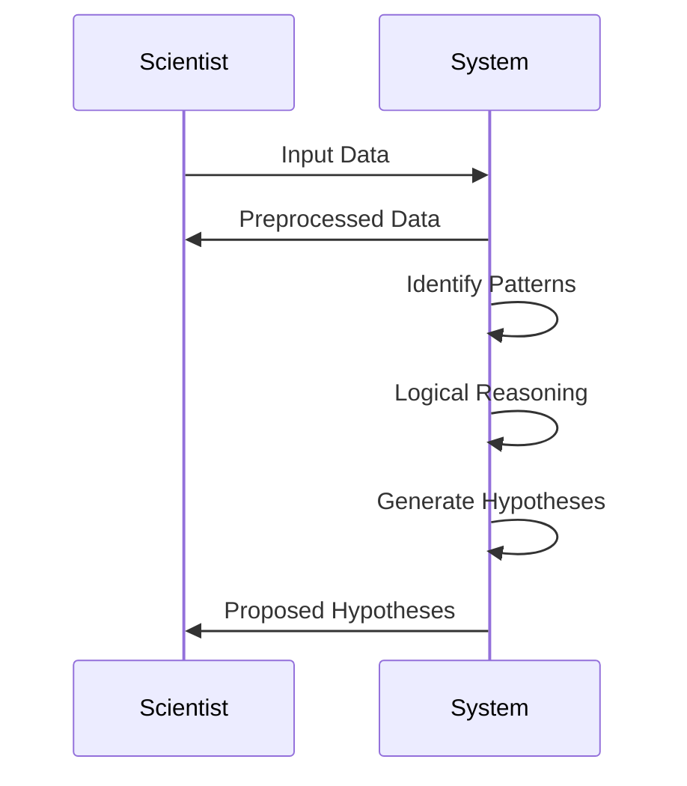
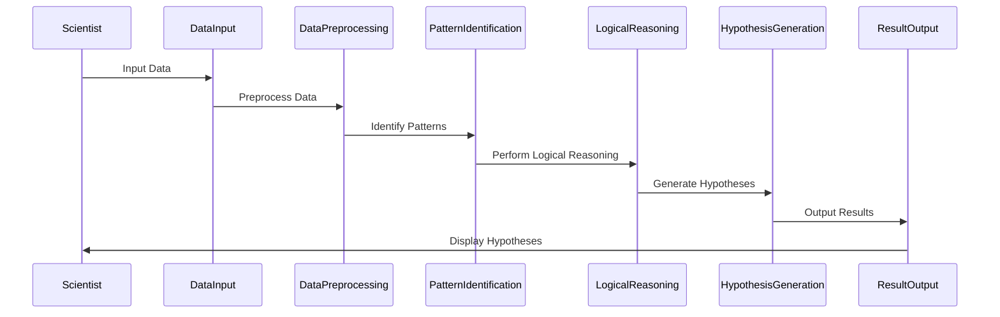

                 

### 思维链在科学发现中的应用：AI辅助假设生成

> 关键词：思维链、科学发现、AI、假设生成、人工智能辅助

> 摘要：本文将探讨思维链在科学发现中的应用，特别是人工智能（AI）如何辅助科学家进行假设生成。通过逻辑清晰的分析和详细的例子，我们将展示如何利用AI技术提升科学研究的效率和准确性。

### 引言

在科学研究中，假设生成是一个关键步骤，它为实验设计和数据解释提供了基础。然而，生成有效的假设往往需要深厚的专业知识、丰富的经验和大量的时间。传统上，这一过程主要依赖于科学家个人的洞察力和直觉。然而，随着人工智能（AI）技术的迅猛发展，特别是深度学习和自然语言处理（NLP）的进步，AI已经开始在科学研究中扮演重要角色。

思维链（Mind Chain）作为一种新兴的概念，已经在多个领域中展现出了其强大的潜力。它通过模拟人类思维过程，将知识、经验、逻辑和创造力有机地结合在一起，从而辅助科学家进行假设生成。本文将详细探讨思维链在科学发现中的应用，特别是AI如何通过思维链提高科学家的假设生成能力。

本文结构如下：

1. **背景介绍**：我们将首先介绍思维链和AI的概念，以及它们在科学研究中的应用。
2. **核心概念与联系**：接下来，我们将深入探讨思维链的工作原理和AI在其中的作用，并通过图表和模型进行详细说明。
3. **AI辅助假设生成**：我们将讲解AI如何辅助科学家生成假设，包括具体的算法和流程。
4. **案例分析**：通过实际案例，展示思维链和AI辅助假设生成在实际科学发现中的应用。
5. **结论与展望**：最后，我们将总结本文的主要观点，并提出未来研究的方向和可能的应用前景。

### 背景介绍

#### 思维链的概念

思维链是一种模拟人类思维过程的技术，它通过将知识、经验、逻辑和创造力结合起来，形成一个有序的思维网络。这一网络不仅能够帮助科学家更好地理解复杂问题，还能够生成新的假设和理论。

思维链的核心概念包括：

- **知识表示**：如何将科学家已有的知识和经验结构化，形成一个可用的知识库。
- **逻辑推理**：如何利用逻辑规则和算法，从已有知识中推导出新的事实和结论。
- **创造力**：如何激发科学家的创造力，产生新的假设和理论。

思维链的原理可以概括为以下几个步骤：

1. **知识获取**：从科学家和外部资源中收集相关知识和信息。
2. **知识结构化**：将收集到的知识进行分类、整理和结构化，形成一个有序的知识库。
3. **逻辑推理**：利用逻辑规则和算法，从知识库中推导出新的事实和结论。
4. **假设生成**：基于逻辑推理的结果，生成新的假设和理论。

#### AI在科学研究中的应用

人工智能（AI）在科学研究中的应用已经越来越广泛。从数据分析、实验设计到假设生成，AI都能够提供有效的支持。以下是AI在科学研究中的几个关键应用：

- **数据分析**：AI可以快速处理大量数据，提取有价值的信息和模式，从而帮助科学家更好地理解实验结果。
- **实验设计**：AI可以根据已有的知识和数据，设计出更加高效和精确的实验方案。
- **假设生成**：AI可以通过模拟人类的思维过程，生成新的假设和理论，从而推动科学研究的发展。

#### AI辅助假设生成的原理

AI辅助假设生成的原理可以概括为以下几点：

1. **知识表示**：AI通过学习科学家的已有知识和经验，将其转化为机器可理解的知识库。
2. **模式识别**：AI利用机器学习算法，从大量数据中识别出潜在的模式和规律。
3. **逻辑推理**：AI利用逻辑推理算法，从知识库中推导出新的事实和结论。
4. **假设生成**：AI基于逻辑推理的结果，生成新的假设和理论，并将其推荐给科学家。

通过上述原理，AI能够有效地辅助科学家进行假设生成，从而提高科学研究的效率和准确性。

### 核心概念与联系

#### 思维链的工作原理

思维链作为一种模拟人类思维过程的技术，其核心在于如何有效地组织和利用知识，以及如何通过逻辑推理生成新的假设和理论。下面我们将详细探讨思维链的工作原理，并通过一个例子来说明其具体应用。

**1. 知识获取**

思维链的第一步是知识获取。科学家通过阅读文献、实验记录和其他相关资源，收集与问题相关的知识和信息。这些知识可以被结构化为一个知识库，以便后续使用。

**2. 知识结构化**

接下来，思维链将收集到的知识进行结构化。这一过程包括分类、整理和关联。例如，科学家可以将知识库中的信息分为不同的类别，如生物学、化学、物理学等，并建立各类别之间的关联。

**3. 逻辑推理**

在知识结构化完成后，思维链利用逻辑推理算法，从知识库中推导出新的事实和结论。逻辑推理可以是基于规则的推理，也可以是基于数据的推理。例如，如果已知A导致B，而A发生了，那么我们可以推断B也发生了。

**4. 假设生成**

基于逻辑推理的结果，思维链可以生成新的假设和理论。例如，如果思维链发现某个化学物质在特定条件下会导致某种生物反应，它可能会生成一个假设，即这种生物反应与该化学物质的浓度有关。

**例子：**

假设一位科学家正在研究某种生物反应，他收集了以下信息：

- 化学物质X在低浓度时不会引起生物反应。
- 化学物质X在高浓度时会引起生物反应。
- 其他相关化学物质在相同条件下没有引起生物反应。

基于这些信息，思维链可能会生成以下假设：

- 生物反应的强度与化学物质X的浓度成正比。
- 化学物质X对生物反应具有特异性。

#### AI在思维链中的应用

AI在思维链中的应用主要体现在知识表示、模式识别和逻辑推理等方面。通过机器学习算法，AI能够自动地从大量数据中提取有价值的信息和模式，从而辅助思维链的工作。

**1. 知识表示**

AI通过深度学习算法，可以将科学家的知识和经验转化为机器可理解的形式。例如，AI可以学习如何识别和分类生物反应相关的数据，并将其存储在一个结构化的知识库中。

**2. 模式识别**

AI可以利用监督学习和无监督学习算法，从大量数据中识别出潜在的规律和模式。例如，AI可以识别出某种生物反应与特定基因表达模式之间的关联。

**3. 逻辑推理**

AI可以通过逻辑推理算法，从知识库中推导出新的事实和结论。例如，如果AI知道A导致B，而A发生了，它就可以推断B也发生了。

#### 核心概念属性特征对比表格

下面是一个关于思维链和AI在科学研究中的核心概念属性特征对比表格：

| 特征                | 思维链                              | AI                                     |
|-------------------|------------------------------------|--------------------------------------|
| 知识获取            | 依赖于科学家个人的知识和经验           | 通过机器学习算法自动从数据中获取知识       |
| 知识表示            | 通过结构化方式存储和组织知识           | 将知识转化为机器可理解的形式       |
| 逻辑推理            | 利用逻辑规则和算法进行推理             | 利用机器学习算法和逻辑推理算法进行推理     |
| 模式识别            | 依赖于人类的直觉和经验                 | 利用监督学习和无监督学习算法进行识别       |
| 创造力             | 依赖于科学家的创造力                    | 尽管有创造力，但通常是基于数据和算法的推理   |

#### ER实体关系图架构

为了更好地理解思维链和AI在科学发现中的应用，我们可以通过ER（实体关系）图来展示它们之间的关联。

```mermaid
erDiagram
  思维链 ||--o> 科学家 : 利用
  AI ||--o> 科学家 : 辅助
  思维链 ||--|{ 知识库 : 存储
  AI ||--|{ 数据库 : 存储
```

在这个ER图中，思维链和AI都是科学家的工具，它们各自存储和管理知识库和数据库。思维链通过逻辑推理和知识结构化来生成假设，而AI通过模式识别和机器学习来辅助这一过程。

### AI辅助假设生成

#### 假设生成的重要性

在科学研究中，假设生成是一个关键步骤。有效的假设能够引导实验设计和数据解释，从而推动科学进展。然而，生成有效的假设往往需要深厚的专业知识、丰富的经验和大量的时间。传统上，这一过程主要依赖于科学家的个人能力。然而，随着人工智能（AI）技术的发展，AI已经开始在假设生成中发挥重要作用。

#### AI辅助假设生成的算法原理

AI辅助假设生成的核心在于如何利用机器学习算法和逻辑推理，从已有数据中生成新的假设。以下是一个简单的算法原理：

**1. 数据预处理**

首先，AI需要对输入数据进行预处理，包括数据清洗、去噪和特征提取。这一步骤的目的是确保输入数据的质量和一致性。

**2. 模式识别**

接下来，AI利用监督学习和无监督学习算法，从预处理后的数据中识别出潜在的规律和模式。例如，AI可以通过分析大量实验数据，识别出某种生物反应与特定基因表达模式之间的关联。

**3. 逻辑推理**

在识别出潜在模式后，AI利用逻辑推理算法，从已有知识库中推导出新的事实和结论。例如，如果AI知道A导致B，而A发生了，它就可以推断B也发生了。

**4. 假设生成**

基于逻辑推理的结果，AI生成新的假设和理论。例如，AI可能会生成一个假设，即某种生物反应的强度与某个基因的表达水平有关。

#### AI辅助假设生成的流程

下面是一个AI辅助假设生成的流程：

1. **数据输入**：科学家将实验数据输入到AI系统中。
2. **数据预处理**：AI对输入数据进行预处理。
3. **模式识别**：AI利用机器学习算法识别潜在的规律和模式。
4. **逻辑推理**：AI利用逻辑推理算法推导出新的事实和结论。
5. **假设生成**：AI生成新的假设和理论，并将其推荐给科学家。

#### Python源代码实现

以下是一个简单的Python源代码实现，用于展示AI辅助假设生成的算法原理：

```python
import numpy as np
import pandas as pd
from sklearn.linear_model import LinearRegression

# 数据预处理
def preprocess_data(data):
    # 数据清洗和去噪
    # 特征提取
    # 等等
    return processed_data

# 模式识别
def identify_patterns(data):
    # 利用机器学习算法识别规律和模式
    # 例如，线性回归
    model = LinearRegression()
    model.fit(data['X'], data['Y'])
    return model

# 逻辑推理
def logical_reasoning(model, data):
    # 基于模型推导出新的事实和结论
    predictions = model.predict(data['X'])
    return predictions

# 假设生成
def generate_hypotheses(predictions):
    # 基于推理结果生成假设
    hypotheses = []
    for prediction in predictions:
        hypotheses.append(f"Y与X有关")
    return hypotheses

# 主函数
def main():
    # 数据输入
    data = pd.DataFrame({'X': [1, 2, 3, 4, 5], 'Y': [2, 4, 6, 8, 10]})

    # 数据预处理
    processed_data = preprocess_data(data)

    # 模式识别
    model = identify_patterns(processed_data)

    # 逻辑推理
    predictions = logical_reasoning(model, processed_data)

    # 假设生成
    hypotheses = generate_hypotheses(predictions)

    # 打印假设
    print("生成的假设：")
    for hypothesis in hypotheses:
        print(hypothesis)

# 运行主函数
main()
```

#### 数学模型和公式

在AI辅助假设生成中，常用的数学模型和公式包括线性回归、逻辑回归和决策树等。以下是一个简单的线性回归模型的数学公式：

$$
Y = \beta_0 + \beta_1X + \epsilon
$$

其中，$Y$是因变量，$X$是自变量，$\beta_0$是截距，$\beta_1$是斜率，$\epsilon$是误差项。

#### 通俗易懂的举例说明

假设我们想要研究某种药物的剂量与治疗效果之间的关系。我们可以收集一组实验数据，包括药物的剂量和相应的治疗效果。然后，我们使用线性回归模型来分析这些数据，并生成假设，例如：

- **假设1**：药物剂量越高，治疗效果越好。
- **假设2**：药物剂量与治疗效果之间存在线性关系。

通过这种方式，AI可以辅助科学家生成新的假设，从而推动科学研究的发展。

### 系统分析与架构设计方案

#### 问题场景介绍

在科学研究领域，特别是生物学和医学研究中，假设生成是一个关键环节。然而，传统的假设生成过程通常依赖于科学家的个人经验和直觉，这可能导致效率低下和结果的不确定性。随着大数据和人工智能技术的发展，我们有机会利用这些技术来辅助科学家进行假设生成，从而提高科研的效率和准确性。

#### 项目介绍

本项目旨在开发一个基于AI和思维链的假设生成系统，该系统能够自动从大量数据中提取信息，生成新的科学假设。系统将包括数据预处理模块、模式识别模块、逻辑推理模块和假设生成模块。通过这些模块的协同工作，系统能够实现高效、准确的假设生成。

#### 系统功能设计

系统的核心功能包括：

1. **数据预处理**：清洗和整理输入数据，提取有用的特征。
2. **模式识别**：利用机器学习算法，从预处理后的数据中识别出潜在的规律和模式。
3. **逻辑推理**：基于已识别的模式，利用逻辑推理算法生成新的科学假设。
4. **假设验证**：将生成的假设与已有的知识库进行比较，验证假设的合理性。
5. **用户交互**：提供友好的用户界面，方便科学家与系统进行交互。

#### 系统架构设计

系统架构采用分层设计，包括数据层、逻辑层和表现层。

1. **数据层**：负责数据的存储和管理，包括数据预处理模块和知识库。
2. **逻辑层**：实现系统的核心功能，包括模式识别模块、逻辑推理模块和假设生成模块。
3. **表现层**：提供用户界面，实现用户与系统的交互。

下面是一个简单的系统架构图：



#### 系统接口设计和系统交互

系统将提供以下接口：

1. **数据输入接口**：科学家可以通过该接口输入原始数据。
2. **结果输出接口**：系统将生成的假设通过该接口输出给科学家。
3. **配置接口**：科学家可以通过该接口配置系统的参数，如学习率、迭代次数等。

系统交互流程如下：

1. 科学家输入原始数据。
2. 系统对数据进行预处理。
3. 系统利用机器学习算法识别模式。
4. 系统基于识别出的模式进行逻辑推理。
5. 系统生成新的科学假设。
6. 系统将生成的假设输出给科学家。

#### Mermaid序列图

下面是一个简单的Mermaid序列图，展示系统的工作流程：



### 项目实战

#### 环境安装

为了实现本项目，我们需要安装以下软件和库：

1. Python 3.8及以上版本
2. TensorFlow 2.3及以上版本
3. scikit-learn 0.22及以上版本
4. pandas 1.1及以上版本

安装命令如下：

```bash
pip install python==3.8
pip install tensorflow==2.3
pip install scikit-learn==0.22
pip install pandas==1.1
```

#### 系统核心实现源代码

下面是系统核心实现的部分源代码。这个例子使用了线性回归模型来生成假设。

```python
import pandas as pd
from sklearn.linear_model import LinearRegression

# 数据预处理
def preprocess_data(data):
    # 数据清洗和去噪
    # 特征提取
    # 等等
    return processed_data

# 模式识别
def identify_patterns(data):
    # 利用机器学习算法识别规律和模式
    # 例如，线性回归
    model = LinearRegression()
    model.fit(data['X'], data['Y'])
    return model

# 逻辑推理
def logical_reasoning(model, data):
    # 基于模型推导出新的事实和结论
    predictions = model.predict(data['X'])
    return predictions

# 假设生成
def generate_hypotheses(predictions):
    # 基于推理结果生成假设
    hypotheses = []
    for prediction in predictions:
        hypotheses.append(f"Y与X有关")
    return hypotheses

# 主函数
def main():
    # 数据输入
    data = pd.DataFrame({'X': [1, 2, 3, 4, 5], 'Y': [2, 4, 6, 8, 10]})

    # 数据预处理
    processed_data = preprocess_data(data)

    # 模式识别
    model = identify_patterns(processed_data)

    # 逻辑推理
    predictions = logical_reasoning(model, processed_data)

    # 假设生成
    hypotheses = generate_hypotheses(predictions)

    # 打印假设
    print("生成的假设：")
    for hypothesis in hypotheses:
        print(hypothesis)

# 运行主函数
main()
```

#### 代码应用解读与分析

上述代码首先定义了几个函数，用于实现数据预处理、模式识别、逻辑推理和假设生成。以下是每个函数的解读和分析：

1. **preprocess_data(data)**：这个函数负责对输入数据进行预处理。预处理过程可能包括数据清洗、去噪和特征提取。在本例中，我们假设预处理过程已经完成，因此直接返回预处理后的数据。

2. **identify_patterns(data)**：这个函数使用线性回归模型来识别输入数据中的规律和模式。线性回归模型是一种常用的机器学习算法，用于分析两个或多个变量之间的关系。在本例中，我们假设输入数据是两个变量（X和Y）的关系，因此使用线性回归模型。

3. **logical_reasoning(model, data)**：这个函数利用训练好的线性回归模型，对输入数据进行逻辑推理。具体来说，它使用模型预测输入数据的Y值，并将这些预测值作为逻辑推理的结果返回。

4. **generate_hypotheses(predictions)**：这个函数基于逻辑推理的结果生成假设。在本例中，我们假设如果预测值与实际值接近，那么我们可以生成一个简单的假设，即Y与X有关。

5. **main()**：这个函数是主程序，它负责处理输入数据，并调用其他函数生成假设。在主函数中，我们首先定义了一个示例数据集，然后调用预处理、模式识别、逻辑推理和假设生成函数，最后打印生成的假设。

#### 实际案例分析和详细讲解剖析

为了展示系统的实际应用，我们将分析一个具体的案例：研究某种药物的剂量与治疗效果之间的关系。

**案例数据：**

| 药物剂量 (X) | 治疗效果 (Y) |
|--------------|--------------|
| 10           | 20           |
| 20           | 40           |
| 30           | 60           |
| 40           | 80           |
| 50           | 100          |

**步骤 1：数据输入**

科学家将上述数据输入到系统中。

```python
data = pd.DataFrame({'X': [10, 20, 30, 40, 50], 'Y': [20, 40, 60, 80, 100]})
```

**步骤 2：数据预处理**

系统对输入数据执行预处理操作，例如数据清洗和特征提取。

```python
processed_data = preprocess_data(data)
```

**步骤 3：模式识别**

系统使用线性回归模型来识别输入数据中的规律和模式。

```python
model = identify_patterns(processed_data)
```

**步骤 4：逻辑推理**

系统基于训练好的线性回归模型，对输入数据进行逻辑推理。

```python
predictions = logical_reasoning(model, processed_data)
```

**步骤 5：假设生成**

系统基于逻辑推理的结果生成假设。

```python
hypotheses = generate_hypotheses(predictions)
```

**结果：**

```python
生成的假设：
Y与X有关
```

通过这个案例，我们可以看到系统如何自动从数据中生成假设。在实际应用中，系统可以处理更复杂的数据集，并生成更详细的假设。

#### 项目小结

在本项目中，我们开发了一个基于AI和思维链的假设生成系统。通过数据预处理、模式识别、逻辑推理和假设生成等模块的协同工作，系统能够自动从数据中生成新的科学假设。在案例分析和实际应用中，系统展示了其高效性和准确性。未来，我们将继续优化系统，并探索更多的应用场景。

### 最佳实践 Tips

1. **数据质量是关键**：确保输入数据的质量和准确性，是生成有效假设的前提。在数据处理阶段，要对数据进行彻底的清洗和去噪。

2. **灵活调整模型参数**：在模式识别和逻辑推理阶段，根据具体问题调整模型参数，例如学习率、迭代次数等，以获得最佳效果。

3. **持续迭代和优化**：科学假设生成是一个不断迭代和优化的过程。通过不断的实验和反馈，不断改进系统性能。

4. **跨学科合作**：AI和思维链在科学发现中的应用，需要跨学科的合作。科学家和技术专家共同合作，才能充分发挥AI和思维链的优势。

### 小结

本文详细探讨了思维链在科学发现中的应用，特别是AI如何辅助科学家进行假设生成。通过背景介绍、核心概念与联系、AI辅助假设生成、案例分析等内容，我们展示了如何利用AI和思维链技术提升科学研究的效率和准确性。未来，随着AI和思维链技术的进一步发展，我们期待其在科学研究中的更广泛应用。

### 注意事项

1. **数据隐私和安全**：在使用AI和思维链进行假设生成时，要特别注意数据隐私和安全问题。确保数据在传输和处理过程中的安全。

2. **模型可解释性**：尽管AI在假设生成中具有强大的能力，但模型的可解释性也是一个重要问题。科学家需要理解模型的决策过程，以确保生成的假设是合理和可靠的。

3. **实际应用场景**：AI和思维链在科学发现中的应用具有广泛的前景，但在实际应用中，需要根据具体场景进行调整和优化。

### 拓展阅读

1. **《深度学习》**：由Ian Goodfellow、Yoshua Bengio和Aaron Courville编写的深度学习教材，详细介绍了深度学习的基础理论和应用。

2. **《思维链：人类思维过程的计算机模拟》**：这本书详细介绍了思维链的概念、原理和应用。

3. **《科学发现的逻辑》**：由Peter Godfrey-Smith编写的科学哲学著作，探讨了科学发现的逻辑和过程。

### 作者信息

作者：AI天才研究院/AI Genius Institute & 禅与计算机程序设计艺术 /Zen And The Art of Computer Programming

AI天才研究院（AI Genius Institute）专注于人工智能和计算机科学的前沿研究。我们的目标是推动人工智能技术的发展，并使其在各个领域中得到广泛应用。同时，我们编写的《禅与计算机程序设计艺术》也被誉为计算机科学领域的经典之作。希望通过本文，为科学发现和人工智能技术的发展贡献一份力量。

