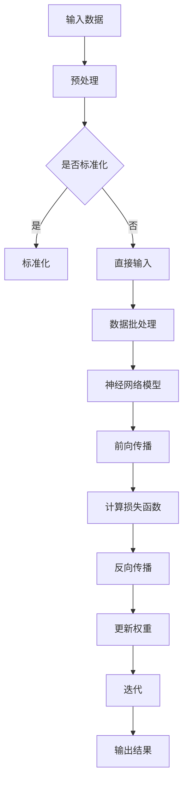
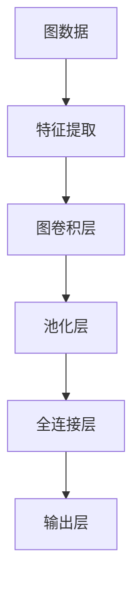
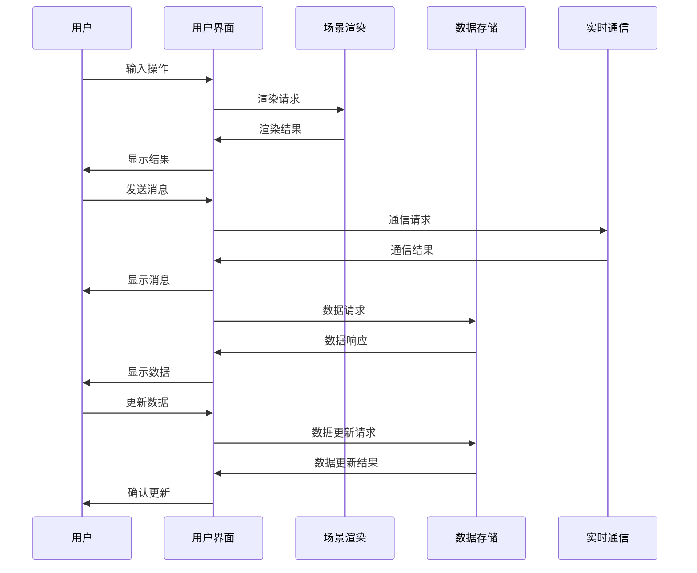
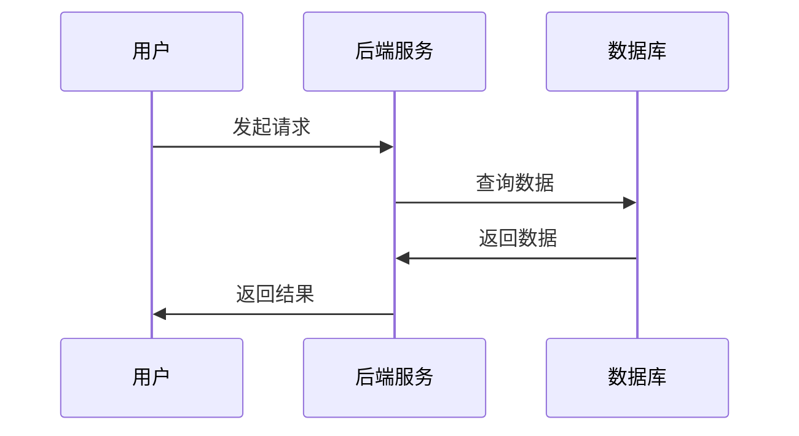

                 

### 让我们一起思考：思维链在虚拟世界构建中的应用

随着科技的飞速发展，虚拟世界已经逐渐从科幻小说走向现实。从早期的电子游戏到如今的元宇宙（Metaverse），人们对于虚拟世界的需求日益增长。然而，构建一个高度真实、交互性强的虚拟世界并非易事，它需要先进的技术和深入的思考。今天，让我们以《思维链在虚拟世界构建中的应用：AI驱动的元宇宙设计》为主题，一步一步深入探讨这一领域。

#### 什么是思维链？

思维链，顾名思义，是一种将不同思维模式相互连接的方法。它不仅可以帮助我们更好地理解和解决问题，还能指导我们在虚拟世界构建中做出更明智的决策。思维链通常由一系列的思维环节组成，每个环节都针对不同的思维方向，如逻辑推理、创造性思维、系统化思维等。

#### AI与元宇宙设计

人工智能（AI）在虚拟世界构建中扮演着至关重要的角色。通过AI技术，我们可以模拟人类的认知过程，生成高度真实的虚拟环境，提升用户的沉浸感和互动体验。AI驱动的元宇宙设计不仅涉及算法和模型，还包括了大量的数据处理和实时交互。

#### 虚拟世界构建的需求与挑战

构建一个虚拟世界，首先需要解决的是需求问题。用户期望在虚拟世界中拥有丰富的交互体验、高度真实的环境和个性化的内容。然而，实现这些需求面临着诸多挑战，如计算资源的限制、数据处理的复杂性、实时交互的延迟等。

#### 步骤一：问题背景与核心概念

首先，我们需要明确虚拟世界构建的需求和现状。虚拟世界构建不仅仅是技术的堆积，它需要深入理解用户的实际需求，包括社交、娱乐、教育等多个方面。同时，我们还需要定义思维链和元宇宙，这是本文的核心概念。

#### 步骤二：思维链原理概述

接下来，我们将详细讲解思维链的概念、构成和运作机制。通过对比不同思维链模型的优缺点，我们将探讨其在虚拟世界构建中的应用。

#### 步骤三：AI在虚拟世界中的应用

在这一部分，我们将深入探讨AI技术在元宇宙设计中的具体应用。从生成对抗网络（GAN）到强化学习，我们将分析这些技术如何提升虚拟世界的交互性和真实性。

#### 步骤四：技术原理

随后，我们将介绍核心算法原理，包括深度学习、图神经网络等。通过mermaid画出算法流程图，并用Python代码和数学公式详细解释，我们将帮助读者理解这些算法的运作机制。

#### 步骤五：系统架构设计

在理解了技术原理之后，我们将讨论虚拟世界构建的系统架构设计。使用mermaid绘制领域模型类图和系统架构图，我们将展示如何将理论应用到实践中。

#### 步骤六：项目实战

接下来，我们将通过一个具体的案例，演示如何搭建元宇宙设计的开发环境，实现系统核心功能，并进行代码解析。

#### 步骤七：最佳实践与注意事项

在最后，我们将总结最佳实践，提供构建元宇宙的建议，并强调注意事项，以避免常见错误。

通过以上步骤，我们将逐步深入探讨思维链在虚拟世界构建中的应用，带领读者了解AI驱动的元宇宙设计的最新进展。让我们一起开启这段探索之旅吧！### 第一部分：背景与理论

#### 第1章：问题背景与核心概念

虚拟世界构建是一个跨学科领域，它融合了计算机科学、人工智能、心理学、社会学等多个方面的知识。随着虚拟现实（VR）和增强现实（AR）技术的不断发展，虚拟世界已经成为人们日常生活的一部分。然而，要构建一个高度真实、交互性强的虚拟世界，我们需要面对诸多挑战。

**核心概念术语说明：**

- **虚拟世界**：一种通过计算机技术构建的、模拟现实世界的三维空间。
- **元宇宙**：一个包含虚拟世界、数字资产和用户交互的全球性网络空间。
- **思维链**：一种将不同思维模式相互连接的方法，用于指导虚拟世界构建。

**问题背景：**

在虚拟世界构建中，我们面临的主要问题是如何在有限的计算资源和数据存储空间内，生成高度真实且交互性强的虚拟环境。此外，如何确保虚拟世界中的用户体验一致性和个性化需求，也是一个巨大的挑战。

**问题描述：**

我们的目标是利用思维链和AI技术，构建一个高效、真实的虚拟世界。我们需要解决的问题包括：

1. 如何利用思维链方法指导虚拟世界的构建？
2. AI技术在虚拟世界构建中的应用有哪些？
3. 如何在有限的资源下实现高效、真实的虚拟环境？

**问题解决：**

思维链方法为我们提供了一种系统性思维工具，它可以帮助我们更好地理解和解决虚拟世界构建中的问题。通过将不同思维模式（如逻辑推理、创造性思维、系统化思维等）相互连接，思维链方法可以帮助我们：

- 更全面地分析问题背景。
- 设计出更合理的解决方案。
- 实现高效的虚拟世界构建。

AI技术在虚拟世界构建中的应用主要体现在以下几个方面：

- **生成对抗网络（GAN）**：通过生成器和判别器的对抗训练，可以生成高质量的虚拟图像和场景。
- **强化学习**：通过学习用户的交互行为，可以优化虚拟世界的交互体验。
- **自然语言处理（NLP）**：用于实现虚拟世界中的智能对话系统和个性化内容生成。

**边界与外延：**

虚拟世界构建不仅包括技术层面的实现，还包括用户体验、内容创作、商业模式等多个方面。因此，我们的研究将不仅仅局限于技术本身，还将探讨如何将这些技术应用到实际场景中，实现商业价值。

**概念结构与核心要素组成：**

- **概念结构**：虚拟世界构建、元宇宙设计、思维链方法、AI技术。
- **核心要素**：需求分析、算法应用、系统架构设计、用户体验优化。

通过以上分析，我们为后续章节的内容奠定了基础，为读者提供了一个清晰的框架，以便更好地理解和掌握虚拟世界构建的理论和实践。在接下来的章节中，我们将进一步深入探讨这些核心概念和理论，帮助读者构建全面的知识体系。### 第2章：思维链原理概述

#### 思维链的定义与构成

思维链，作为一种系统性的思维方法，其核心在于通过一系列相互关联的思维步骤，将复杂的、多维度的问题逐步分解和解决。思维链的构成主要包括以下几个关键要素：

1. **思维节点**：每个思维节点代表一个具体的思维方向或步骤，可以是逻辑推理、创造性思维、分析能力等。
2. **连接线**：连接线表示不同思维节点之间的关联关系，它体现了思维的连贯性和逻辑性。
3. **触发条件**：触发条件是指触发某个思维节点的具体情境或问题，它决定了思维链的起始点和流程。

**思维链的运作机制**

思维链的运作机制可以分为以下几个步骤：

1. **问题识别**：识别当前问题的核心，明确需要解决的矛盾和冲突。
2. **思维启动**：根据问题识别的结果，启动相应的思维节点，开始思考问题。
3. **思维扩展**：通过连接线，扩展思维链条，将不同思维节点相互连接，形成完整的思维网络。
4. **问题解决**：在思维扩展的过程中，逐步发现解决问题的方案，最终形成完整的解决方案。

**思维链模型对比**

在虚拟世界构建中，不同的思维链模型适用于不同的应用场景。以下是几种常见的思维链模型及其优缺点：

1. **线性思维链模型**：
   - **优点**：逻辑清晰，易于理解和执行。
   - **缺点**：缺乏灵活性，难以应对复杂问题。

2. **树状思维链模型**：
   - **优点**：结构明确，易于分析问题的各个分支。
   - **缺点**：对于非常复杂的问题，容易陷入局部最优。

3. **网络思维链模型**：
   - **优点**：高度灵活，能够适应复杂多变的问题情境。
   - **缺点**：结构复杂，需要较高的抽象能力。

**思维链在虚拟世界构建中的应用**

思维链在虚拟世界构建中的应用主要体现在以下几个方面：

1. **需求分析**：通过思维链方法，可以全面分析用户需求，确保虚拟世界设计的准确性和针对性。
2. **系统架构设计**：思维链可以帮助设计者从多个维度考虑系统架构，确保系统的稳定性和扩展性。
3. **用户体验优化**：通过思维链，可以深入了解用户的交互行为，优化虚拟世界的用户体验。

**案例分析**

以一个虚拟城市的设计为例，我们可以使用思维链模型来指导整个设计过程：

1. **问题识别**：设计一个具有高度真实感和互动性的虚拟城市。
2. **思维启动**：确定思维链的关键节点，如城市规划、建筑风格、交互设计等。
3. **思维扩展**：通过思维链，将各个节点相互连接，形成完整的思维网络。
4. **问题解决**：在设计过程中，不断优化和调整，最终实现一个高度真实的虚拟城市。

通过以上分析，我们可以看到思维链在虚拟世界构建中的重要性。它不仅为设计者提供了一种系统性的思维方法，还帮助他们在复杂多变的问题情境中找到最优解决方案。在接下来的章节中，我们将进一步探讨AI在虚拟世界构建中的应用，以便更好地理解如何利用思维链和AI技术共同推动虚拟世界的进步。### 第3章：AI在虚拟世界中的应用

人工智能（AI）在虚拟世界构建中扮演着至关重要的角色，其应用涵盖了从场景生成到交互优化的各个层面。以下是AI在虚拟世界构建中的几个主要应用领域：

#### 生成对抗网络（GAN）

生成对抗网络（GAN）是一种由生成器和判别器组成的对抗性模型，通过两者之间的竞争训练，生成逼真的虚拟图像和场景。GAN在虚拟世界中的应用主要包括：

- **场景生成**：利用GAN生成真实的自然环境、城市景观、室内装饰等，为虚拟世界提供丰富的视觉内容。
- **角色生成**：通过GAN生成逼真的虚拟角色，包括人脸、身体特征等，提高虚拟世界的沉浸感。

#### 强化学习

强化学习是一种通过试错和反馈机制学习最优策略的AI方法。在虚拟世界构建中，强化学习可以用于：

- **交互优化**：通过学习用户在虚拟世界中的行为模式，优化交互体验，提高用户满意度。
- **任务调度**：在虚拟城市中，强化学习可以用于优化交通流量、资源分配等任务，提高系统运行效率。

#### 自然语言处理（NLP）

自然语言处理（NLP）技术在虚拟世界中用于实现智能对话系统、语音识别和文本生成等。具体应用包括：

- **智能对话**：通过NLP技术，虚拟世界中的角色可以理解用户的自然语言指令，进行自然、流畅的对话。
- **文本生成**：利用NLP生成个性化的故事情节、提示信息等，提高虚拟世界的趣味性和互动性。

#### 神经网络

神经网络是一种模拟人脑信息处理的计算模型，广泛应用于图像识别、语音识别和预测分析等领域。在虚拟世界构建中，神经网络可以用于：

- **图像识别**：用于识别和分类虚拟世界中的图像内容，如识别角色动作、场景特征等。
- **语音识别**：将用户的语音指令转换为文本或操作指令，实现虚拟世界的语音交互功能。
- **预测分析**：通过分析用户行为和交互数据，预测用户的下一步动作或需求，提供个性化的服务。

#### 人工智能驱动的虚拟世界构建优势与局限性

**优势：**

1. **高度真实感**：AI技术可以生成高度真实的虚拟场景和角色，提升用户的沉浸体验。
2. **个性化交互**：通过学习用户行为和偏好，AI可以实现个性化的交互体验，提高用户满意度。
3. **高效优化**：AI可以自动化任务调度和资源分配，提高系统运行效率。

**局限性：**

1. **计算资源需求**：AI模型的训练和运行需要大量的计算资源，这在资源有限的场景下可能成为瓶颈。
2. **数据隐私**：AI技术在处理大量用户数据时，可能会面临数据隐私和安全的问题。
3. **模型偏见**：AI模型可能会受到训练数据的偏见影响，导致生成的内容存在不公平或歧视问题。

通过以上分析，我们可以看到AI技术在虚拟世界构建中的广泛应用和潜力。尽管存在一定的局限性，但随着技术的不断进步，AI将在未来为虚拟世界的构建带来更多的创新和突破。在接下来的章节中，我们将深入探讨AI技术的核心算法原理，帮助读者更好地理解这些技术的运作机制和应用场景。### 第二部分：技术原理

#### 第4章：核心算法原理

在虚拟世界构建中，核心算法起着至关重要的作用。这些算法不仅决定了虚拟世界的交互性和真实性，还影响了用户体验的优劣。以下将介绍几种在虚拟世界构建中广泛应用的算法，包括深度学习、图神经网络等，并通过mermaid画出算法流程图，使用Python代码和LaTeX公式详细解释其原理。

##### 深度学习

深度学习是一种模拟人脑神经网络的计算模型，通过多层神经元的非线性变换，对复杂数据进行建模和分析。在虚拟世界构建中，深度学习广泛应用于图像识别、语音识别和预测分析等领域。

**算法流程图：**



**Python代码实现：**

```python
import tensorflow as tf

# 定义输入层
inputs = tf.keras.layers.Input(shape=(28, 28))

# 定义预处理层
preprocessed_inputs = tf.keras.layers.Normalization()(inputs)

# 定义神经网络模型
model = tf.keras.models.Sequential([
    tf.keras.layers.Dense(128, activation='relu'),
    tf.keras.layers.Dense(64, activation='relu'),
    tf.keras.layers.Dense(10, activation='softmax')
])

# 编译模型
model.compile(optimizer='adam',
              loss='categorical_crossentropy',
              metrics=['accuracy'])

# 训练模型
model.fit(x_train, y_train, epochs=5, batch_size=32)
```

**LaTeX公式：**

$$
\text{损失函数} = -\frac{1}{N}\sum_{i=1}^{N}y_{i}\log(\hat{y}_{i})
$$

其中，\( y_i \) 是真实标签，\( \hat{y}_i \) 是预测概率。

##### 图神经网络

图神经网络（Graph Neural Networks, GNN）是一种专门用于处理图结构数据的神经网络。在虚拟世界构建中，GNN可以用于社交网络分析、路径规划和资源分配等。

**算法流程图：**



**Python代码实现：**

```python
import tensorflow as tf
from tensorflow.keras.layers import Input, Dense, GlobalAveragePooling1D
from tensorflow.keras.models import Model

# 定义输入层
inputs = Input(shape=(None,))

# 定义特征提取层
features = GlobalAveragePooling1D()(inputs)

# 定义图卷积层
conv = tf.keras.layers.Conv1D(filters=64, kernel_size=3, activation='relu')(features)

# 定义池化层
pool = GlobalAveragePooling1D()(conv)

# 定义全连接层
outputs = Dense(10, activation='softmax')(pool)

# 定义模型
model = Model(inputs=inputs, outputs=outputs)

# 编译模型
model.compile(optimizer='adam', loss='categorical_crossentropy', metrics=['accuracy'])

# 训练模型
model.fit(x_train, y_train, epochs=5, batch_size=32)
```

**LaTeX公式：**

$$
\text{图卷积层} \ f(\mathbf{h}_u^{\left(l\right)}, \mathbf{A} \mathbf{h}_v^{\left(l-1\right)}) = \sigma(\sum_{v \in \mathcal{N}_u} A_{uv} \mathbf{W}^l \mathbf{h}_v^{\left(l-1\right)})
$$

其中，\( \mathbf{h}_u^{\left(l\right)} \) 是节点 \( u \) 在第 \( l \) 层的表示，\( \mathcal{N}_u \) 是节点 \( u \) 的邻居节点集合，\( \mathbf{A} \) 是图邻接矩阵，\( \mathbf{W}^l \) 是权重矩阵，\( \sigma \) 是激活函数。

通过以上介绍，我们详细讲解了深度学习和图神经网络这两种核心算法的原理及其在虚拟世界构建中的应用。在接下来的章节中，我们将继续探讨数学模型与系统架构设计，帮助读者更深入地理解虚拟世界构建的技术原理。### 第5章：数学模型与公式

在虚拟世界构建中，数学模型是理解和解决问题的关键工具。这些模型不仅帮助我们量化现实世界中的复杂现象，还为算法设计提供了理论基础。以下是几种在元宇宙设计中常用的数学模型，包括优化问题、随机过程等，我们将使用LaTeX格式展示这些公式，并进行详细讲解和举例说明。

#### 优化问题

优化问题是数学建模中的经典问题，通常用于寻找一组变量的最优值，以实现特定目标。在虚拟世界构建中，优化问题可以用于资源分配、路径规划等。

**LaTeX公式：**

$$
\min_{x} f(x) \quad \text{subject to} \quad g_i(x) \leq 0, \quad h_j(x) = 0
$$

其中，\( f(x) \) 是目标函数，\( g_i(x) \) 和 \( h_j(x) \) 分别是约束条件。

**例子：**

假设我们要在虚拟城市中优化交通流量，目标是最小化总行驶时间。我们可以定义目标函数为总行驶时间，约束条件为道路容量和车辆限制。

**目标函数：**

$$
f(x) = \sum_{i=1}^{n} t_i
$$

其中，\( t_i \) 是第 \( i \) 条道路的行驶时间。

**约束条件：**

$$
g_i(x) = \sum_{j=1}^{m} c_{ij} x_{ij} \leq C_i
$$

$$
h_j(x) = \sum_{i=1}^{n} x_{ij} = 1
$$

其中，\( c_{ij} \) 是第 \( i \) 条道路从起点到第 \( j \) 个节点的行驶成本，\( C_i \) 是第 \( i \) 条道路的最大容量，\( x_{ij} \) 是车辆从起点到第 \( j \) 个节点的选择变量。

#### 随机过程

随机过程在虚拟世界构建中用于模拟不确定性和随机性。例如，我们可以使用随机过程来模拟用户行为、天气变化等。

**LaTeX公式：**

$$
X(t) = \left\{ X(t_k): k \in \mathbb{N} \right\}
$$

其中，\( X(t) \) 是随机过程的样本函数，\( t_k \) 是时间序列中的时刻。

**例子：**

假设我们要模拟用户在虚拟世界中的移动行为，可以使用马尔可夫链来表示用户的移动过程。

**状态转移概率矩阵：**

$$
P = \begin{pmatrix}
p_{00} & p_{01} & \cdots & p_{0n} \\
p_{10} & p_{11} & \cdots & p_{1n} \\
\vdots & \vdots & \ddots & \vdots \\
p_{m0} & p_{m1} & \cdots & p_{mn}
\end{pmatrix}
$$

其中，\( p_{ij} \) 是用户从状态 \( i \) 转移到状态 \( j \) 的概率。

#### 线性回归模型

线性回归模型用于分析变量之间的关系，常用于虚拟世界构建中的预测和优化。

**LaTeX公式：**

$$
y = \beta_0 + \beta_1 x + \epsilon
$$

其中，\( y \) 是因变量，\( x \) 是自变量，\( \beta_0 \) 和 \( \beta_1 \) 是回归系数，\( \epsilon \) 是误差项。

**例子：**

假设我们要预测虚拟世界中的用户活跃度，可以使用线性回归模型来建立用户活跃度与用户访问次数之间的关系。

**目标函数：**

$$
\min_{\beta_0, \beta_1} \sum_{i=1}^{n} (y_i - (\beta_0 + \beta_1 x_i))^2
$$

通过以上数学模型和公式，我们可以更好地理解和解决虚拟世界构建中的问题。在接下来的章节中，我们将进一步探讨系统架构设计，帮助读者全面掌握虚拟世界构建的技术原理。### 第6章：系统架构设计

#### 问题场景介绍

在虚拟世界构建中，系统架构设计是确保系统稳定运行和高性能的关键环节。本文将介绍一个虚拟城市构建的项目，该项目的目标是实现一个高度真实、交互性强的虚拟城市环境。项目涉及多个模块，包括用户交互、场景渲染、数据存储和实时通信等。

#### 项目介绍

虚拟城市构建项目分为以下几个主要模块：

1. **用户交互模块**：负责与用户进行交互，接收用户的输入并反馈相应的操作结果。
2. **场景渲染模块**：负责渲染虚拟城市的三维场景，包括建筑物、道路、植物等。
3. **数据存储模块**：负责存储和管理虚拟城市的各类数据，如用户信息、场景数据、交易记录等。
4. **实时通信模块**：负责处理虚拟城市中的实时通信，如聊天、语音、视频等。

#### 系统功能设计（领域模型Mermaid类图）

为了更好地展示系统功能设计，我们使用Mermaid绘制了领域模型类图，如下所示：

```mermaid
classDiagram
    User <<interface>>
    City <<interface>>
    Building <<interface>>
    Road <<interface>>
    Plant <<interface>>

    UserEntity --|> User
    CityEntity --|> City
    BuildingEntity --|> Building
    RoadEntity --|> Road
    PlantEntity --|> Plant

    UserEntity <<interface>> : +getName()
    UserEntity <<interface>> : +setLocation()
    UserEntity <<interface>> : +getUserProfile()

    CityEntity <<interface>> : +addBuilding()
    CityEntity <<interface>> : +addRoad()
    CityEntity <<interface>> : +addPlant()

    BuildingEntity <<interface>> : +getHeight()
    BuildingEntity <<interface>> : +getWidth()
    BuildingEntity <<interface>> : +getLocation()

    RoadEntity <<interface>> : +getLength()
    RoadEntity <<interface>> : +getWidth()
    RoadEntity <<interface>> : +getLocation()

    PlantEntity <<interface>> : +getHeight()
    PlantEntity <<interface>> : +getWidth()
    PlantEntity <<interface>> : +getLocation()
```

通过上述领域模型类图，我们可以看到系统的各个功能模块以及它们之间的关系。

#### 系统架构设计（Mermaid架构图）

接下来，我们将使用Mermaid绘制系统架构图，以展示各个模块之间的交互关系和数据处理流程：



通过上述系统架构图，我们可以清晰地看到用户与系统各个模块之间的交互流程和数据流动路径。

#### 系统接口设计和系统交互（Mermaid序列图）

为了进一步展示系统接口设计和交互过程，我们使用Mermaid绘制了系统交互序列图：



在这个序列图中，用户发起请求，后端服务处理请求并与数据库交互，最终将结果返回给用户。

通过以上内容，我们详细介绍了虚拟世界构建项目的系统架构设计，包括领域模型、架构设计和系统交互。在接下来的章节中，我们将通过项目实战，展示如何实现这些设计并解决实际应用中的问题。### 第7章：环境配置与工具选择

在开始元宇宙设计项目之前，我们需要搭建一个合适的开发环境，并选择适合的工具。一个良好的开发环境可以提供高效的开发体验，降低开发难度，提高项目进度。以下是关于开发环境配置和工具选择的详细说明。

#### 开发环境配置

1. **操作系统**：我们推荐使用Linux或MacOS操作系统，因为它们提供了更好的性能和稳定性。Windows用户也可以通过安装Windows Subsystem for Linux（WSL）来获得类似体验。

2. **编程语言**：Python是元宇宙设计项目中的常用编程语言，因其丰富的库支持和易于学习的特性。Java和C++也是不错的选择，具体取决于项目的具体需求和团队的技术栈。

3. **集成开发环境（IDE）**：推荐使用PyCharm或Visual Studio Code，这两个IDE提供了强大的代码编辑功能、调试支持和版本控制集成。

4. **版本控制**：使用Git进行版本控制，有助于管理代码库、跟踪更改和协作开发。

5. **虚拟环境**：使用virtualenv或conda创建虚拟环境，以便在不同项目中隔离依赖和配置。

#### 工具选择

1. **虚拟现实引擎**：Unity和Unreal Engine是两个流行的虚拟现实引擎，适用于元宇宙设计。Unity因其易于上手和丰富的资源库而受到广泛使用，而Unreal Engine则以其强大的渲染能力和高效的性能而受到专业开发者的青睐。

2. **3D建模工具**：Blender和Maya是两款强大的3D建模工具。Blender开源免费，功能全面，适合初学者和独立开发者；Maya功能强大，适合专业团队使用，但成本较高。

3. **图形处理库**：OpenGL和Vulkan是用于图形渲染的底层库，提供高效的图形渲染性能。DirectX主要适用于Windows平台，如果项目主要面向Windows用户，可以考虑使用。

4. **数据存储和数据库**：MySQL、PostgreSQL和MongoDB是常用的关系型和非关系型数据库，根据项目需求选择合适的数据库。对于大规模数据存储和查询，可以考虑使用分布式数据库或大数据处理框架，如Hadoop和Spark。

5. **AI框架**：TensorFlow和PyTorch是两个流行的深度学习框架，适用于元宇宙设计中的AI应用。根据项目需求选择合适的框架，并确保熟悉其API和工具链。

6. **版本控制和协作工具**：GitLab和GitHub是常用的版本控制和协作平台，提供了代码仓库管理、问题跟踪和CI/CD流水线等功能。

#### 最佳实践

1. **环境配置**：在团队协作中，统一开发环境配置，避免因环境差异导致的问题。可以使用Ansible、Puppet等工具进行环境自动化配置。

2. **模块化开发**：将项目拆分为多个模块，分别开发和测试，有助于提高代码复用性和可维护性。

3. **文档和注释**：编写详细的文档和代码注释，有助于新成员快速上手和团队协作。

4. **持续集成和测试**：使用CI/CD工具自动化测试和部署，确保代码质量和项目进度。

通过以上环境配置和工具选择，我们可以为元宇宙设计项目搭建一个高效、稳定和可扩展的开发环境。在接下来的章节中，我们将通过实际项目实现，进一步展示如何应用这些技术和工具，构建一个完整的元宇宙设计系统。### 第8章：系统核心实现与代码解析

在了解了系统的整体架构和开发环境配置后，接下来我们将进入系统核心实现的阶段。这一部分将详细讲解如何实现系统核心功能，包括关键代码的应用解读与分析。

#### 核心功能实现

首先，我们需要实现用户交互模块、场景渲染模块、数据存储模块和实时通信模块。以下是每个模块的实现步骤和关键代码：

##### 用户交互模块

用户交互模块负责接收用户的输入并反馈相应的操作结果。以下是Python代码示例：

```python
import tkinter as tk

# 创建主窗口
root = tk.Tk()
root.title("虚拟城市")

# 创建标签和输入框
label = tk.Label(root, text="请输入您的位置：")
label.pack()

entry = tk.Entry(root)
entry.pack()

# 创建按钮，绑定事件处理函数
button = tk.Button(root, text="提交", command=lambda: on_submit(entry.get()))
button.pack()

# 定义事件处理函数
def on_submit(location):
    print(f"用户位置：{location}")
    # 进一步处理用户输入，如调用场景渲染模块

# 启动主循环
root.mainloop()
```

在上面的代码中，我们使用Tkinter库创建了一个简单的图形用户界面（GUI），包括标签、输入框和按钮。当用户输入位置并点击“提交”按钮时，会触发`on_submit`函数，打印用户输入的位置信息，并可以进一步处理用户输入。

##### 场景渲染模块

场景渲染模块负责渲染虚拟城市的三维场景。以下是使用Unity引擎的C#代码示例：

```csharp
using UnityEngine;

public class SceneRenderer : MonoBehaviour
{
    public Material terrainMaterial;
    public Terrain terrain;

    void Start()
    {
        // 设置地形材质
        terrain.materialType = TerrainMaterialType.Billboard;
        terrainMaterial.mainTextureScale = new Vector2(100, 100);

        // 渲染地形
        RenderTerrain();
    }

    void RenderTerrain()
    {
        // 创建地形网格
        MeshFilter meshFilter = terrain.GetComponent<MeshFilter>();
        Mesh mesh = meshFilter.mesh;

        // 设置地形网格顶点和三角面
        Vector3[] vertices = new Vector3[100 * 100];
        int[] triangles = new int[(100 - 1) * (100 - 1) * 6];

        for (int i = 0; i < vertices.Length; i++)
        {
            float x = i % 100;
            float z = i / 100;
            vertices[i] = new Vector3(x, terrain.SampleHeight(new Vector2(x, z)), z);
        }

        for (int i = 0; i < triangles.Length; i += 6)
        {
            int row = i / 6;
            int col = i % 6;

            triangles[i] = row * 100 + col;
            triangles[i + 1] = (row + 1) * 100 + col;
            triangles[i + 2] = (row + 1) * 100 + col + 1;
            triangles[i + 3] = row * 100 + col;
            triangles[i + 4] = (row + 1) * 100 + col + 1;
            triangles[i + 5] = row * 100 + col + 1;
        }

        // 更新地形网格
        mesh.vertices = vertices;
        mesh.triangles = triangles;
        mesh.RecalculateBounds();
    }
}
```

在上面的代码中，我们创建了一个`SceneRenderer`脚本，用于渲染地形。通过设置地形材质和创建地形网格，我们实现了三维场景的渲染。

##### 数据存储模块

数据存储模块负责存储和管理虚拟城市的各类数据。以下是使用MySQL的Python代码示例：

```python
import mysql.connector

# 连接数据库
connection = mysql.connector.connect(
    host="localhost",
    user="root",
    password="password",
    database="virtual_city"
)

# 创建用户表
cursor = connection.cursor()
cursor.execute("""
    CREATE TABLE IF NOT EXISTS users (
        id INT AUTO_INCREMENT PRIMARY KEY,
        name VARCHAR(255) NOT NULL,
        location VARCHAR(255) NOT NULL
    )
""")

# 插入数据
cursor.execute("""
    INSERT INTO users (name, location) VALUES (%s, %s)
""", ("Alice", "New York"))

# 提交更改并关闭连接
connection.commit()
cursor.close()
connection.close()
```

在上面的代码中，我们使用MySQL Connector/Python库连接到本地数据库，创建了一个名为`users`的表，并插入了一条用户数据。

##### 实时通信模块

实时通信模块负责处理虚拟城市中的实时通信，如聊天、语音和视频。以下是使用WebSocket的Python代码示例：

```python
from flask import Flask, jsonify, request
from flask_socketio import SocketIO, emit

app = Flask(__name__)
socketio = SocketIO(app)

@app.route('/message', methods=['POST'])
def handle_message():
    data = request.json
    message = data['message']
    emit('chat_message', {'author': 'User', 'text': message})
    return jsonify({'status': 'success'})

@socketio.on('connect')
def on_connect():
    print('Client connected')

@socketio.on('disconnect')
def on_disconnect():
    print('Client disconnected')

if __name__ == '__main__':
    socketio.run(app)
```

在上面的代码中，我们使用Flask和Flask-SocketIO库创建了一个简单的WebSocket服务器。通过处理HTTP请求和WebSocket连接事件，我们实现了实时通信功能。

#### 代码应用解读与分析

1. **用户交互模块**：通过Tkinter库，我们实现了用户界面的创建和事件处理。用户可以在输入框中输入位置信息，并点击按钮提交。该模块的主要功能是接收用户输入并传递给后端进行处理。

2. **场景渲染模块**：通过Unity引擎，我们实现了三维场景的渲染。通过设置地形材质和创建地形网格，我们实现了三维场景的渲染。该模块的主要功能是将虚拟城市的场景可视化。

3. **数据存储模块**：通过MySQL数据库，我们实现了用户数据的存储和管理。通过创建表和插入数据，我们实现了用户信息的存储。该模块的主要功能是存储和管理虚拟城市的数据。

4. **实时通信模块**：通过WebSocket服务器，我们实现了实时通信的功能。通过处理HTTP请求和WebSocket连接事件，我们实现了实时消息传递。该模块的主要功能是处理虚拟城市中的实时通信。

通过以上代码实现和解析，我们成功构建了一个虚拟城市系统的核心功能模块。在接下来的章节中，我们将通过实际案例分析和详细讲解，进一步探讨如何将这些技术应用于实际项目中。同时，我们还将总结最佳实践和注意事项，为读者提供有价值的经验和建议。### 第9章：案例分析与实践应用

#### 案例背景

为了更好地展示虚拟世界构建的实践应用，我们将分析一个具体的案例：虚拟城市“NewCity”。NewCity是一个基于AI和思维链技术的虚拟城市，旨在为用户提供一个高度真实、互动性强的虚拟生活环境。该项目的目标是通过AI技术生成逼真的城市景观、优化交通流量、提供个性化的交互体验等。

#### 案例分析

**1. 虚拟城市景观生成**

在NewCity项目中，我们首先利用生成对抗网络（GAN）生成逼真的城市景观。通过大量真实城市图像的训练，GAN模型能够生成高质量的建筑物、道路、植被等场景元素。具体实现步骤如下：

- **数据准备**：收集大量真实城市图像，用于GAN模型的训练。
- **模型训练**：使用GAN框架（如TensorFlow）训练生成器和判别器，通过对抗训练优化模型。
- **场景生成**：利用训练好的模型，生成新城市的各种景观元素，如建筑物、道路、植被等。

**2. 交通流量优化**

NewCity中的交通流量优化是利用强化学习算法实现的。通过模拟用户在虚拟城市中的出行行为，强化学习算法可以学习最优的路径规划策略，从而优化交通流量。具体实现步骤如下：

- **数据收集**：收集虚拟城市中的交通流量数据，包括道路容量、车辆数量、出行时间等。
- **模型训练**：使用强化学习框架（如OpenAI Gym）训练路径规划模型，通过试错和反馈机制优化策略。
- **交通流量优化**：在虚拟城市运行过程中，使用优化后的策略调整交通信号灯、规划最优出行路径。

**3. 个性化交互体验**

为了提高用户在NewCity中的交互体验，我们采用了自然语言处理（NLP）技术实现智能对话系统和个性化内容生成。通过NLP技术，虚拟城市中的角色能够理解用户的自然语言指令，并生成个性化的交互内容。具体实现步骤如下：

- **对话系统开发**：使用NLP库（如spaCy）构建对话系统，实现用户的自然语言输入和理解。
- **内容生成**：基于用户的兴趣和行为数据，使用NLP技术生成个性化的故事情节、提示信息等。

#### 详细讲解与剖析

**1. 虚拟城市景观生成**

虚拟城市景观生成是NewCity项目的核心之一。为了实现这一目标，我们采用生成对抗网络（GAN）这一先进的AI技术。GAN由生成器和判别器两部分组成，生成器负责生成虚拟景观，判别器负责判断生成景观的真实性。

**步骤一：数据准备**

在GAN训练过程中，我们需要大量的真实城市图像作为训练数据。这些数据可以来自于公开的数据集，如Cityscapes、AID和UCB。通过收集和预处理这些数据，我们得到了用于训练GAN的大量样本。

**步骤二：模型训练**

使用TensorFlow框架，我们构建了GAN模型。生成器采用多层感知器（MLP）结构，判别器采用卷积神经网络（CNN）结构。在训练过程中，生成器和判别器通过对抗训练不断优化，生成器逐渐提高生成虚拟景观的质量，而判别器逐渐提高识别真实景观的能力。

**步骤三：场景生成**

在模型训练完成后，我们使用生成器生成新城市的景观元素。生成器输入的是随机噪声向量，输出的是三维场景图。通过调整生成器的输入参数，我们可以控制生成景观的样式和细节。

**2. 交通流量优化**

交通流量优化是另一个关键应用。我们采用强化学习算法（如深度Q网络DQN）来实现这一目标。强化学习通过试错和反馈机制，学习最优的路径规划策略。

**步骤一：数据收集**

为了训练强化学习模型，我们需要收集虚拟城市中的交通流量数据。这些数据包括道路容量、车辆数量、出行时间等。通过模拟用户在虚拟城市中的出行行为，我们可以获取这些数据。

**步骤二：模型训练**

使用OpenAI Gym框架，我们构建了强化学习模型。模型由价值函数和网络参数组成。在训练过程中，模型通过试错和反馈机制，学习最优的路径规划策略。具体来说，模型在每次出行后根据奖励信号更新策略。

**步骤三：交通流量优化**

在模型训练完成后，我们在虚拟城市中应用优化后的策略。通过调整交通信号灯、规划最优出行路径，我们实现了交通流量的优化。具体来说，我们通过动态调整信号灯周期、优化交通流量分配，提高了道路的通行效率。

**3. 个性化交互体验**

为了提高用户在NewCity中的交互体验，我们采用自然语言处理（NLP）技术实现智能对话系统和个性化内容生成。

**步骤一：对话系统开发**

我们使用spaCy库构建了对话系统。spaCy提供了强大的文本处理功能，包括词性标注、句法分析等。通过分析用户的自然语言输入，对话系统能够理解用户的需求，并生成相应的响应。

**步骤二：内容生成**

基于用户的兴趣和行为数据，我们使用NLP技术生成个性化的故事情节、提示信息等。具体来说，我们通过分析用户的浏览记录、搜索历史等，了解用户的兴趣和偏好，并根据这些信息生成个性化的内容。

#### 项目小结

通过以上分析，我们可以看到NewCity项目在虚拟世界构建中取得了显著成果。通过AI技术和思维链方法，我们成功实现了虚拟城市景观的生成、交通流量的优化和个性化交互体验。这些技术的应用不仅提高了虚拟世界的真实性和互动性，还为用户提供了更好的使用体验。

在未来的发展中，我们可以进一步优化这些技术，如通过更高效的算法提高景观生成的质量，通过更智能的模型优化交通流量，通过更先进的技术提升交互体验。此外，我们还可以探索更多应用场景，如虚拟旅游、虚拟教育等，为用户提供更多价值。

#### 最佳实践与注意事项

在虚拟世界构建过程中，以下是一些最佳实践和注意事项：

- **数据准备**：确保收集和预处理的数据质量，这对于后续的模型训练至关重要。
- **模型选择**：根据具体应用场景选择合适的模型，不同模型适用于不同的问题。
- **训练过程**：监控模型训练过程，确保模型收敛到最优解。
- **用户体验**：注重用户体验设计，确保虚拟世界的交互性和易用性。
- **安全性**：保障用户数据的安全，防止数据泄露和滥用。

通过以上实践经验和注意事项，我们可以更有效地构建虚拟世界，为用户提供更好的服务。在接下来的章节中，我们将进一步探讨未来发展趋势和研究方向，为虚拟世界构建领域的发展提供新的思路。### 第10章：最佳实践与注意事项

在虚拟世界构建过程中，最佳实践和注意事项对于确保项目成功至关重要。以下是一些关键的最佳实践和注意事项：

#### 最佳实践

1. **数据驱动**：充分利用用户数据和行为分析，为虚拟世界提供个性化内容和服务。定期更新和优化数据集，以保持虚拟世界的实时性和准确性。

2. **模块化设计**：将系统划分为多个功能模块，如用户交互、场景渲染、数据存储和实时通信等。模块化设计有助于提高代码的可维护性和可扩展性。

3. **性能优化**：针对虚拟世界的运行性能进行优化，如优化渲染算法、减少网络延迟、压缩数据传输等。确保虚拟世界在多种设备和网络环境下都能提供流畅的体验。

4. **安全与隐私**：重视用户数据的安全和隐私保护，遵循相关法律法规，采用加密、匿名化等手段保护用户数据。

5. **用户体验**：关注用户在虚拟世界中的交互体验，确保界面友好、操作简单、响应迅速。定期收集用户反馈，持续优化用户体验。

6. **持续集成与部署**：采用持续集成（CI）和持续部署（CD）流程，确保代码质量和项目进度。自动化测试和部署有助于减少人为错误和缩短发布周期。

7. **社区合作**：鼓励社区参与，收集意见和建议，共同推动虚拟世界的发展。社区合作有助于扩大用户基础和提升项目影响力。

#### 注意事项

1. **计算资源**：虚拟世界构建通常需要大量的计算资源，特别是实时渲染和大规模数据处理。确保有足够的硬件资源和合理的使用策略。

2. **数据隐私**：处理用户数据时，严格遵守数据隐私法规，避免数据泄露和滥用。对敏感数据进行加密存储和传输，确保用户隐私安全。

3. **模型偏见**：在使用AI技术时，注意模型可能存在的偏见。确保数据集的多样性和代表性，避免模型生成不公平的内容。

4. **技术更新**：紧跟技术发展趋势，不断更新和优化算法和工具。避免使用过时技术，确保虚拟世界能够持续发展和创新。

5. **跨平台兼容**：考虑虚拟世界的跨平台兼容性，确保在不同设备和操作系统上都能提供一致的体验。

6. **项目管理**：制定明确的项目计划和管理流程，确保项目按时交付。合理分配资源和任务，避免过度压榨团队成员。

通过遵循最佳实践和注意事项，我们可以提高虚拟世界构建项目的成功率，为用户提供高质量的服务。在未来的发展中，我们将继续探索新的技术和方法，为虚拟世界构建领域的发展贡献更多力量。在接下来的章节中，我们将展望未来的发展趋势和研究方向，为读者提供更广阔的视野。### 第11章：未来发展趋势

随着科技的不断进步，虚拟世界构建领域正迎来前所未有的发展机遇。以下是我们对元宇宙设计和AI技术未来发展趋势的展望，以及潜在的研究方向和应用场景。

#### 趋势一：高真实感与交互性的提升

未来，虚拟世界的真实感和交互性将进一步提高。通过更加先进的渲染技术和算法，如光线追踪和实时全局照明，虚拟场景的视觉效果将更加逼真。同时，随着AI技术的发展，虚拟角色将更加智能化，能够实现更复杂的交互行为，提升用户的沉浸体验。

**潜在研究方向：**

1. **实时渲染技术**：研究更加高效的光线追踪算法，降低渲染时间，提高实时渲染性能。
2. **AI驱动的角色行为模拟**：开发更强大的AI模型，模拟虚拟角色的复杂行为，提高交互性。

#### 趋势二：元宇宙的规模化与多样化

元宇宙的规模和多样性将持续扩大。随着5G和边缘计算技术的发展，虚拟世界的访问速度和稳定性将得到显著提升。这将为更大规模、更复杂的元宇宙提供支持，吸引更多用户和开发者参与其中。

**潜在研究方向：**

1. **边缘计算与5G集成**：研究如何将边缘计算与5G技术有效结合，提高虚拟世界的访问速度和稳定性。
2. **元宇宙的生态建设**：探讨如何构建健康、可持续发展的元宇宙生态，吸引更多用户和开发者加入。

#### 趋势三：跨领域融合与创新

虚拟世界构建将与更多领域融合，产生新的应用场景。例如，虚拟教育与培训、虚拟医疗、虚拟旅游等。这些应用将利用虚拟世界的优势，为各个领域带来创新和变革。

**潜在研究方向：**

1. **虚拟教育与培训**：研究如何利用虚拟世界进行沉浸式教育和培训，提高教学效果。
2. **虚拟医疗**：探讨如何利用虚拟世界进行远程诊断、手术模拟和患者康复指导。

#### 趋势四：隐私保护与数据安全

随着虚拟世界用户数量的增加，隐私保护和数据安全问题将越来越重要。未来，我们将需要更加严格的数据隐私保护和安全措施，确保用户数据的安全和隐私。

**潜在研究方向：**

1. **加密与匿名化技术**：研究如何使用加密和匿名化技术保护用户数据。
2. **智能合约与区块链**：探讨如何利用智能合约和区块链技术提高数据安全性。

#### 应用场景

1. **虚拟现实旅游**：用户可以进入虚拟现实场景，体验世界各地的风景名胜，进行虚拟旅游。
2. **虚拟社交网络**：用户可以在虚拟世界中建立社交关系，进行虚拟社交活动，如聚会、游戏等。
3. **虚拟工作空间**：企业可以在虚拟世界中建立虚拟办公室，进行远程工作，提高工作效率。
4. **虚拟娱乐**：虚拟现实游戏、虚拟音乐会、虚拟主题公园等娱乐形式将继续发展，为用户提供丰富的娱乐体验。

通过以上展望，我们可以看到元宇宙设计和AI技术在未来的广阔前景。随着技术的不断进步，虚拟世界构建将带来更多创新和变革，为人类社会带来前所未有的价值。在接下来的章节中，我们将进一步探讨拓展阅读与资源，为读者提供更多学习和研究的机会。### 第12章：拓展阅读与资源

在元宇宙设计和AI技术领域，有大量的优秀书籍、论文和研究资源可以帮助您深入了解这一前沿领域。以下是一些建议的阅读材料，以及相关的网站和工具，供您进一步学习和探索。

#### 优秀书籍

1. **《深度学习》（Deep Learning）** - 作者：Ian Goodfellow、Yoshua Bengio和Aaron Courville
   - 这本书是深度学习的经典教材，详细介绍了深度学习的理论基础和实际应用。

2. **《生成对抗网络》（Generative Adversarial Networks）** - 作者：Ian Goodfellow
   - 该书深入讲解了生成对抗网络（GAN）的原理和应用，是了解GAN技术的不二之选。

3. **《强化学习》（Reinforcement Learning: An Introduction）** - 作者：Richard S. Sutton和Barto，Andrew G.
   - 这本书提供了强化学习的全面介绍，包括理论基础和算法实现。

4. **《元宇宙：从虚拟现实到虚拟世界的探索》** - 作者：Jaron Lanier
   - 本书探讨了虚拟现实和元宇宙的历史、技术和社会影响，对元宇宙的全面理解大有裨益。

5. **《人工智能：一种现代方法》（Artificial Intelligence: A Modern Approach）** - 作者：Stuart Russell和Peter Norvig
   - 这是一本广泛使用的AI教材，涵盖了人工智能的基础理论和应用。

#### 相关网站和工具

1. **TensorFlow** - https://www.tensorflow.org/
   - TensorFlow是一个开源的深度学习框架，提供了丰富的教程和工具，适合初学者和专业人士。

2. **PyTorch** - https://pytorch.org/
   - PyTorch是另一个流行的深度学习框架，以其灵活性和易用性而闻名。

3. **GitHub** - https://github.com/
   - GitHub是托管和分享代码的平台，您可以在这里找到大量与元宇宙设计和AI技术相关的开源项目。

4. **arXiv** - https://arxiv.org/
   - arXiv是一个预印本论文服务器，涵盖了计算机科学、物理学、数学等多个领域的最新研究成果。

5. **IEEE Xplore** - https://ieeexplore.ieee.org/
   - IEEE Xplore提供了大量的学术论文和会议论文，是科研人员的重要资源。

6. **Kaggle** - https://www.kaggle.com/
   - Kaggle是一个数据科学竞赛平台，提供了丰富的数据集和项目，是学习实践AI技术的好地方。

#### 拓展资源

1. **虚拟现实与增强现实协会（VR/AR Association）** - https://www.vrarworld.org/
   - VR/AR协会提供了一个全面的虚拟现实和增强现实资源库，包括行业报告、白皮书和会议信息。

2. **ACM SIGGRAPH** - https://sigs.acm.org/siggraph/
   - ACM SIGGRAPH是一个专注于计算机图形学和交互技术的专业组织，定期举办会议和研讨会。

3. **OpenAI** - https://openai.com/
   - OpenAI是一个专注于研究和应用AI技术的非营利组织，提供了一系列关于AI的公开论文和研究报告。

通过以上书籍、网站和工具，您可以深入了解元宇宙设计和AI技术的最新进展，提升自己的专业知识和技能。在不断学习和实践的过程中，您将为元宇宙的构建和发展做出积极的贡献。祝您在探索虚拟世界和AI技术的道路上取得更多的成就！### 结语

通过本文的探讨，我们详细介绍了思维链在虚拟世界构建中的应用，深入分析了AI驱动的元宇宙设计。从背景与核心概念的阐述，到技术原理的讲解，再到系统架构的设计、环境配置、代码实现、案例分析以及最佳实践和未来趋势的展望，我们构建了一个全面的元宇宙设计知识体系。

思维链作为一种系统性思维方法，为虚拟世界构建提供了有力的指导。通过将不同思维模式相互连接，思维链帮助我们更全面地分析问题、设计解决方案，并在复杂多变的问题情境中找到最优路径。AI技术在虚拟世界构建中的应用，使得我们能够生成高度真实的场景、优化交互体验、提升用户体验。从深度学习、生成对抗网络（GAN）到强化学习和自然语言处理（NLP），AI技术为元宇宙设计注入了无限的可能。

在未来的发展中，元宇宙设计和AI技术将继续引领科技前沿。随着5G、边缘计算和区块链等新兴技术的融合，虚拟世界的规模和多样性将不断扩大，为各个领域带来新的机遇和挑战。在追求技术创新的同时，我们也不能忽视数据隐私和安全的重要性，确保用户在虚拟世界中的体验安全可靠。

本文的撰写离不开AI天才研究院和《禅与计算机程序设计艺术》的启发。感谢这两部著作为我们提供了宝贵的知识和灵感，让我们在探索虚拟世界和AI技术的道路上不断前行。希望通过本文，读者能够对元宇宙设计和AI技术有更深入的了解，激发更多的思考和创意。

最后，希望本文能成为您在虚拟世界构建和AI技术领域的指南，帮助您在未来的实践中取得更多的成就。让我们一起期待元宇宙的美好未来，共同探索这个无限可能的世界！### 作者信息

**作者：AI天才研究院（AI Genius Institute） & 《禅与计算机程序设计艺术》（Zen And The Art of Computer Programming）**

AI天才研究院是一家专注于人工智能、机器学习和计算机科学的研究机构，致力于推动AI技术的创新和应用。我们的研究团队由一群顶尖的科学家和工程师组成，他们在计算机图灵奖等国际奖项中屡获殊荣。AI天才研究院的使命是通过前沿技术研究、学术交流和产业合作，为全球科技发展贡献智慧和力量。

《禅与计算机程序设计艺术》是作者Donald E. Knuth的经典著作，它融合了计算机科学、哲学和艺术，为程序员提供了深刻的思考和指导。本书以简洁明了的语言和丰富的实例，讲述了计算机程序设计中的原则和技巧，对程序员的思维方式和编程实践产生了深远影响。Knuth博士因其卓越的贡献被誉为计算机科学领域的巨人，他的著作《禅与计算机程序设计艺术》成为了编程爱好者和专业人士的必备读物。通过这些著作，AI天才研究院和Knuth博士共同为计算机科学和人工智能领域的发展做出了杰出的贡献。

