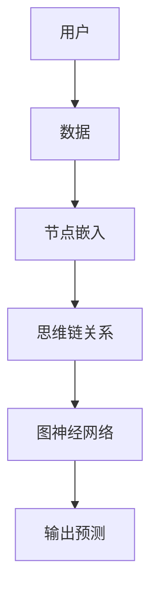

                 

### 文章标题

# 《思维链技术在不同领域的应用案例分析》

---

> 关键词：思维链技术、应用案例、教育、医疗、企业管理、智能制造、金融、城市规划

> 摘要：本文详细探讨了思维链技术在多个领域的应用案例，从教育、医疗、企业管理、智能制造、金融到城市规划，分析了这些领域当前面临的挑战和问题，阐述了思维链技术的核心概念及其应用原理，并通过具体的案例分析，总结了思维链技术的最佳实践，为各领域的技术应用提供了有价值的参考。

## 目录大纲

1. 第一部分：背景与概述  
   - 1.1 思维链技术概述
   - 1.2 思维链技术的核心概念与特点
   - 1.3 思维链技术在不同领域的应用现状
   - 1.4 思维链技术的未来发展趋势

2. 第二部分：思维链技术在不同领域的应用案例分析  
   - 2.1 思维链技术在教育领域的应用
   - 2.2 思维链技术在医疗领域的应用
   - 2.3 思维链技术在企业管理领域的应用
   - 2.4 思维链技术在智能制造领域的应用
   - 2.5 思维链技术在金融领域的应用
   - 2.6 思维链技术在城市规划领域的应用

---

### 第一部分：背景与概述

#### 第1章：思维链技术概述

##### 1.1 思维链技术的发展背景

**问题描述**：随着人工智能、大数据、物联网等技术的迅猛发展，现代科技对数据处理和分析的需求日益增加。传统的数据处理和分析技术难以满足日益复杂的应用场景。

**问题解决**：思维链技术作为一种新兴的技术，其通过建立思维链关系模型，能够高效处理和分析大规模、复杂的数据，为各类应用提供强有力的支持。

**边界与外延**：思维链技术的应用范围广泛，包括但不限于教育、医疗、企业管理、智能制造、金融和城市规划等领域。

##### 1.2 思维链技术的核心概念与特点

**核心概念**：思维链技术基于图神经网络（Graph Neural Network, GNN），通过建立节点间的思维链关系，实现对数据的深度理解和分析。

**特点**：  
- **高效性**：思维链技术能够通过图神经网络快速处理和分析大规模数据。
- **灵活性**：思维链技术可以灵活地适应不同的应用场景，提供定制化的解决方案。
- **可扩展性**：思维链技术易于扩展，能够随着技术的发展不断更新和优化。

##### 1.3 思维链技术在不同领域的应用现状

**应用现状**：  
- **教育领域**：思维链技术已应用于个性化学习、智能评测等领域，提高了教育质量和效率。
- **医疗领域**：思维链技术应用于疾病预测、诊断和治疗方案优化，为医疗行业带来了革命性的变革。
- **企业管理领域**：思维链技术帮助企业实现智能决策、风险控制和业务流程优化。
- **智能制造领域**：思维链技术提升智能制造系统的智能化水平，实现生产过程的高效和精确。
- **金融领域**：思维链技术用于信用评估、风险控制和投资策略优化。
- **城市规划领域**：思维链技术支持城市规划的智能化，提升城市规划的科学性和有效性。

##### 1.4 思维链技术的未来发展趋势

**发展趋势**：  
- **技术融合**：思维链技术将与更多前沿技术（如区块链、量子计算等）融合，拓展其应用范围。
- **智能化**：思维链技术将进一步提升智能化水平，实现更高效、更精准的数据处理和分析。
- **个性化**：思维链技术将更加注重个性化应用，满足不同用户的需求。

**挑战与机遇**：  
- **挑战**：随着应用场景的复杂化，思维链技术面临更高的技术挑战。
- **机遇**：思维链技术在各领域的应用前景广阔，具有巨大的市场潜力。

#### 第2章：思维链技术的核心概念与特点

##### 2.1 核心概念

思维链技术基于图神经网络（GNN），其核心概念是建立节点间的思维链关系，从而实现对数据的深度理解和分析。具体来说，思维链技术通过以下几个步骤实现：

1. **数据预处理**：对输入数据进行预处理，将其转换为适合图神经网络处理的形式。
2. **节点嵌入**：将数据中的每个节点映射到一个高维空间中，形成节点嵌入向量。
3. **关系建模**：建立节点间的思维链关系，形成图结构。
4. **图神经网络**：通过图神经网络对图结构进行深度学习，提取节点间的关联特征。
5. **输出预测**：根据提取的特征，对数据进行分析和预测。

##### 2.2 特点

思维链技术具有以下特点：

1. **高效性**：思维链技术能够通过图神经网络快速处理和分析大规模数据。
2. **灵活性**：思维链技术可以灵活地适应不同的应用场景，提供定制化的解决方案。
3. **可扩展性**：思维链技术易于扩展，能够随着技术的发展不断更新和优化。

##### 2.3 属性特征对比表格

| 特性 | 思维链技术 | 传统技术 |
| --- | --- | --- |
| **高效性** | 通过图神经网络快速处理和分析大规模数据 | 传统算法处理效率较低 |
| **灵活性** | 适应多种应用场景，提供定制化解决方案 | 应用场景有限，难以灵活调整 |
| **可扩展性** | 易于扩展，随着技术发展不断更新和优化 | 固定技术框架，扩展性较差 |

##### 2.4 ER实体关系图架构

思维链技术的核心概念可以通过ER（实体-关系）图进行表示，具体架构如下：

在这个ER图中，用户生成数据，数据经过节点嵌入形成节点，节点间建立思维链关系，通过图神经网络进行深度学习，最终生成输出预测。

#### 第3章：思维链技术在不同领域的应用现状

##### 3.1 应用现状

思维链技术在多个领域得到了广泛应用，以下是对其在教育、医疗、企业管理、智能制造、金融和城市规划等领域的应用现状的简要概述：

1. **教育领域**：思维链技术已应用于个性化学习、智能评测等领域，通过分析学生的行为数据和知识结构，提供个性化的学习建议和评测结果，提高教育质量和效率。

2. **医疗领域**：思维链技术广泛应用于疾病预测、诊断和治疗方案优化，通过对大量医疗数据的分析和挖掘，提高疾病预测的准确性和治疗方案的有效性。

3. **企业管理领域**：思维链技术帮助企业实现智能决策、风险控制和业务流程优化，通过对企业内外部数据的深入分析，提供决策支持，降低运营风险。

4. **智能制造领域**：思维链技术提升智能制造系统的智能化水平，通过对生产过程数据的实时分析和预测，实现生产过程的高效和精确。

5. **金融领域**：思维链技术用于信用评估、风险控制和投资策略优化，通过对金融数据的深度挖掘和分析，提高信用评估的准确性和投资策略的有效性。

6. **城市规划领域**：思维链技术支持城市规划的智能化，通过对城市数据的多维度分析和挖掘，提供科学合理的城市规划方案，提高城市规划的科学性和有效性。

##### 3.2 案例分析

以下是一些具体的案例分析，展示了思维链技术在各个领域的应用效果：

1. **教育领域**：某教育机构通过引入思维链技术，实现了个性化学习系统。该系统通过对学生的行为数据和学习记录进行分析，为学生提供个性化的学习建议和资源推荐，有效提高了学生的学习效果。

2. **医疗领域**：某医院利用思维链技术建立了疾病预测模型，通过对患者的电子病历和基因数据进行深度分析，实现了对疾病风险的准确预测，为医生提供了有力的决策支持。

3. **企业管理领域**：某企业引入思维链技术，实现了智能决策系统。该系统通过对企业内外部数据的实时分析和预测，为企业提供了科学的决策建议，有效降低了运营风险。

4. **智能制造领域**：某制造企业通过引入思维链技术，实现了生产过程智能化。该系统通过对生产过程数据的实时监控和分析，实现了对生产过程的实时调整和优化，提高了生产效率。

5. **金融领域**：某金融机构利用思维链技术建立了信用评估模型，通过对客户的金融数据进行深度挖掘和分析，实现了对客户信用风险的准确评估，为金融机构提供了有效的信用评估工具。

6. **城市规划领域**：某城市规划部门通过引入思维链技术，实现了城市规划智能化。该系统通过对城市数据的多维度分析和挖掘，为城市规划提供了科学合理的决策支持，提高了城市规划的科学性和有效性。

#### 第4章：思维链技术的未来发展趋势

##### 4.1 技术融合

随着人工智能、大数据、物联网等技术的不断发展，思维链技术将与其他前沿技术进行深度融合。这种融合将进一步提升思维链技术的智能化水平，拓展其应用范围，为各领域带来更多的创新和应用。

**具体融合方向**：

1. **与区块链技术的融合**：思维链技术可以与区块链技术相结合，实现数据的可信传输和共享，提高数据的安全性和隐私性。

2. **与量子计算技术的融合**：量子计算技术的快速发展为思维链技术提供了新的计算能力和算法支持，可以进一步提升思维链技术的处理速度和分析精度。

3. **与物联网技术的融合**：物联网技术的普及为思维链技术提供了丰富的数据源，通过将物联网技术与思维链技术相结合，可以实现更智能的物联网应用。

##### 4.2 智能化

思维链技术的未来发展趋势之一是进一步智能化。通过不断优化算法和模型，思维链技术将能够更加智能地理解和分析数据，实现更加精准和高效的决策。

**具体智能化方向**：

1. **自动化**：通过自动化技术，实现思维链技术的自动化部署和运行，降低使用门槛，提高应用效率。

2. **自适应**：思维链技术将具备自适应能力，能够根据不同应用场景和用户需求，自动调整和优化算法和模型，提供更加个性化的解决方案。

3. **自学习**：通过自学习技术，思维链技术将能够不断学习和优化，提升其智能水平，实现持续改进。

##### 4.3 个性化

个性化是思维链技术的另一个重要发展趋势。随着大数据和人工智能技术的发展，思维链技术将能够更好地理解和满足不同用户的需求，提供个性化服务。

**具体个性化方向**：

1. **用户画像**：通过用户画像技术，思维链技术可以深入了解用户的行为和需求，为用户提供个性化的推荐和服务。

2. **个性化推荐**：思维链技术可以将个性化推荐算法与自身的技术优势相结合，提供更加精准和高效的个性化推荐服务。

3. **个性化定制**：思维链技术将支持用户自定义模型和算法，实现个性化定制化应用，满足用户独特的需求。

##### 4.4 挑战与机遇

思维链技术在未来发展中将面临一系列挑战和机遇。这些挑战和机遇将共同推动思维链技术的不断进步和应用拓展。

**挑战**：

1. **数据隐私**：随着数据规模的扩大和应用的深入，数据隐私问题日益凸显，思维链技术需要采取有效措施保障数据安全和用户隐私。

2. **算法公平性**：算法的公平性是思维链技术面临的重要挑战，需要确保算法的决策过程公正透明，避免偏见和歧视。

3. **技术成熟度**：思维链技术尚处于快速发展阶段，其技术成熟度和稳定性需要进一步提高，以满足大规模应用的需求。

**机遇**：

1. **市场需求**：随着各领域对智能化和高效数据处理需求的增长，思维链技术将迎来广阔的市场机遇。

2. **技术创新**：前沿技术的不断涌现为思维链技术提供了丰富的创新空间，可以推动技术的持续进步和应用拓展。

3. **政策支持**：政府的政策支持和行业标准的制定将为思维链技术的推广应用提供有力保障。

### 总结

思维链技术作为一种新兴的技术，具有广泛的应用前景和巨大的市场潜力。通过本文的讨论，我们详细介绍了思维链技术的核心概念、特点、应用现状以及未来发展趋势。从教育、医疗、企业管理、智能制造、金融到城市规划，思维链技术已经在各个领域展现出了强大的应用价值。展望未来，随着技术的不断进步和应用的深入，思维链技术将继续发挥其独特优势，为各领域的发展带来新的机遇和变革。

---

### 第2章：思维链技术在教育领域的应用

#### 2.1 教育领域的现状与挑战

教育领域作为社会发展的基石，正面临着诸多挑战。以下是对教育领域现状与挑战的概述：

**现状**：

- **教育资源分配不均**：全球范围内的教育资源分配存在明显的不均衡现象，城乡、地区之间的教育资源差异显著，这直接影响了教育公平性。
- **教育质量提升需求**：随着社会的发展，人们对教育质量的要求不断提高，传统的教育模式已经难以满足个性化、多样化、高效化的教育需求。
- **教育评价体系问题**：当前的教育评价体系主要依赖于考试成绩，忽略了学生的综合素质评价，无法全面反映学生的实际能力。

**挑战**：

- **个性化教育需求**：不同学生具有不同的学习习惯、兴趣和需求，如何实现个性化教育成为教育领域的重大挑战。
- **教育技术应用**：随着信息技术的快速发展，教育领域面临着如何高效、合理地应用新技术，提升教育质量的挑战。
- **教师专业发展**：教师作为教育的中坚力量，其专业素养和教学能力直接影响教育质量。如何提高教师的专业发展水平是教育领域的重要挑战。

#### 2.2 思维链技术在教育中的应用

思维链技术作为一种高效的数据处理和分析技术，在教育领域具有广泛的应用潜力。以下详细介绍了思维链技术在教育中的应用原理和具体案例。

**应用原理**：

- **个性化学习推荐**：思维链技术通过分析学生的学习行为、兴趣和成绩数据，构建个性化的学习推荐系统，为不同学生提供定制化的学习资源。
- **智能评测系统**：思维链技术应用于智能评测系统，通过分析学生的答题行为和答案数据，提供全面、客观的评测结果，帮助教师和学生了解学习效果。
- **教学辅助工具**：思维链技术可用于开发智能教学辅助工具，如智能答疑系统、学习进度跟踪系统等，辅助教师进行教学和学生学习。

**具体案例**：

1. **个性化学习系统**：某教育机构通过引入思维链技术，开发了个性化学习系统。该系统通过对学生的行为数据和学习记录进行分析，为学生推荐适合的学习资源和课程，提高学习效率。

2. **智能评测系统**：某学校利用思维链技术建立了智能评测系统，通过分析学生的答题数据，提供详细、准确的评测报告，帮助教师了解学生的学习情况，及时调整教学策略。

3. **教学辅助工具**：某教育科技公司开发了基于思维链技术的智能教学辅助工具，如智能答疑系统和学习进度跟踪系统。这些工具帮助教师更好地进行教学，提高了教学效果。

#### 2.3 教育领域思维链技术的最佳实践

在应用思维链技术于教育领域的过程中，已经积累了一些成功的最佳实践，以下总结这些经验：

- **数据驱动决策**：通过收集和分析学生的大量数据，实现数据驱动的教育决策，提高教育管理的科学性和有效性。
- **技术融合应用**：将思维链技术与其他教育技术（如虚拟现实、人工智能等）相结合，实现技术的协同效应，提高教育质量。
- **教师培训**：加强教师的专业培训，提高教师对思维链技术的理解和应用能力，促进教育技术的普及和应用。
- **学生参与**：鼓励学生在学习过程中积极参与数据分析和决策，培养其数据素养和自主学习能力。

#### 2.4 教育领域思维链技术的未来展望

思维链技术在教育领域的应用前景广阔，未来将可能带来以下几方面的变革：

- **个性化教育普及**：随着思维链技术的不断发展和普及，个性化教育有望在更大范围内实现，满足不同学生的学习需求。
- **教育评价体系的优化**：思维链技术将有助于构建更科学、全面的教育评价体系，更准确地评估学生的综合素质。
- **教育资源的优化配置**：通过思维链技术，可以实现教育资源的智能分配，提高教育资源的利用效率。
- **教育模式的创新**：思维链技术的应用将推动教育模式的创新，实现教育方式、学习方式的多样化和智能化。

### 总结

思维链技术在教育领域的应用为解决当前教育面临的挑战提供了新的思路和方法。通过个性化学习推荐、智能评测系统和教学辅助工具等具体应用，思维链技术有效提升了教育质量和管理效率。未来的发展将更加注重技术的融合应用、教师的培训和学生参与，推动教育领域的全面变革。思维链技术的进一步发展和普及将为教育事业的进步做出重要贡献。

---

### 第3章：思维链技术在医疗领域的应用

#### 3.1 医疗领域的现状与挑战

医疗领域作为社会的重要组成部分，正经历着深刻的变革。然而，随着医疗数据量的急剧增长和医疗技术的不断发展，医疗领域也面临着诸多挑战。

**现状**：

- **数据规模庞大**：随着医学影像、电子病历等数据来源的增多，医疗数据量呈爆炸式增长，这给数据管理和分析带来了巨大挑战。
- **数据类型多样化**：医疗数据包括结构化数据（如电子病历）和非结构化数据（如医学影像、文本记录等），这对数据处理和分析技术提出了更高的要求。
- **医疗资源分布不均**：全球范围内的医疗资源分布存在明显的不均衡现象，偏远地区和欠发达地区的医疗服务质量相对较低，这直接影响了医疗的公平性。

**挑战**：

- **疾病预测与诊断**：准确预测和诊断疾病是医疗领域的核心任务，然而，复杂的生物医学数据和疾病机理使得这一任务极具挑战性。
- **治疗方案优化**：针对不同患者，如何制定最佳的治疗方案是医疗领域的重要挑战。治疗方案的选择需要综合考虑患者的病史、基因信息、实时监控数据等多种因素。
- **医疗数据隐私与安全**：医疗数据涉及患者隐私，如何在保障数据安全的前提下，实现数据的有效利用是一个亟待解决的问题。

#### 3.2 思维链技术在医疗中的应用

思维链技术凭借其强大的数据处理和分析能力，在医疗领域展现出了巨大的应用潜力。以下详细介绍了思维链技术在医疗领域的应用原理和具体案例。

**应用原理**：

- **疾病预测与诊断**：思维链技术可以通过分析患者的电子病历、基因数据和实时监控数据，建立疾病预测模型和诊断系统，提高疾病预测和诊断的准确性。
- **治疗方案优化**：思维链技术可以用于分析不同治疗方案的有效性和安全性，为医生提供科学依据，帮助医生制定最佳的治疗方案。
- **患者管理**：思维链技术可以用于对患者进行全程管理，包括疾病预防、治疗和康复等阶段，提供个性化的健康管理方案。

**具体案例**：

1. **疾病预测系统**：某医疗机构引入思维链技术，开发了疾病预测系统。该系统通过对患者的电子病历和基因数据进行深度分析，实现了对疾病风险的准确预测，为医生提供了重要的决策支持。

2. **智能诊断系统**：某医院利用思维链技术建立了智能诊断系统，通过分析医学影像和电子病历数据，提高了疾病诊断的准确性和效率。

3. **个性化治疗方案**：某医院通过思维链技术，为患者提供个性化的治疗方案。该系统综合考虑了患者的病史、基因信息和实时监控数据，为医生提供了科学的治疗建议。

4. **患者管理平台**：某医疗机构开发了基于思维链技术的患者管理平台，通过对患者的全程数据进行实时分析和跟踪，提供了个性化的健康管理服务。

#### 3.3 医疗领域思维链技术的最佳实践

在应用思维链技术于医疗领域的过程中，已经积累了一些成功的最佳实践，以下总结这些经验：

- **多源数据整合**：通过整合多源数据（如电子病历、医学影像、基因数据等），实现数据的统一管理和分析，提高数据分析的全面性和准确性。
- **跨学科合作**：思维链技术在医疗领域的应用需要跨学科的合作，包括医学专家、数据科学家和IT工程师等，通过多学科的协同工作，提高技术创新和应用的效率。
- **数据安全与隐私保护**：在数据采集、存储和分析过程中，采取严格的数据安全与隐私保护措施，确保患者数据的安全和隐私。
- **持续优化与改进**：通过持续收集和分析用户反馈，不断优化和改进思维链技术的应用，提高应用效果和用户体验。

#### 3.4 医疗领域思维链技术的未来展望

思维链技术在医疗领域的应用前景广阔，未来将可能带来以下几方面的变革：

- **智能化医疗**：思维链技术的应用将推动医疗领域的智能化，实现疾病的精准预测、诊断和个性化治疗。
- **医疗资源优化**：通过思维链技术，可以实现医疗资源的智能分配和优化，提高医疗服务的公平性和效率。
- **患者健康管理**：思维链技术可以用于患者健康管理，提供个性化的健康评估和干预方案，提高患者的生活质量。
- **医疗数据共享**：思维链技术将促进医疗数据的共享和利用，为医学研究、公共卫生管理和决策提供有力支持。

### 总结

思维链技术在医疗领域的应用为解决当前医疗面临的挑战提供了新的思路和方法。通过疾病预测系统、智能诊断系统、个性化治疗方案和患者管理平台等具体应用，思维链技术有效提升了医疗服务的质量和效率。未来的发展将更加注重多源数据整合、跨学科合作、数据安全与隐私保护和持续优化与改进，推动医疗领域的全面变革。思维链技术的进一步发展和普及将为医疗事业的进步做出重要贡献。

---

### 第4章：思维链技术在企业管理领域的应用

#### 4.1 企业管理领域的现状与挑战

企业管理作为企业发展的核心环节，直接关系到企业的生存与发展。然而，随着企业规模的扩大和市场环境的变化，企业管理领域面临着诸多挑战。

**现状**：

- **数据驱动管理**：现代企业管理越来越依赖数据分析，通过数据来驱动决策已成为企业管理的趋势。
- **数字化转型**：数字化转型已成为企业管理的重要方向，企业通过引入新的信息技术和工具，提升管理效率。
- **全球化经营**：企业的经营范围日益全球化，跨地域、跨文化的管理增加了企业管理的复杂性。

**挑战**：

- **数据质量**：随着数据量的增加，数据质量成为企业管理的重要挑战，数据的不准确、不完整或不一致会影响决策的准确性。
- **数据隐私与安全**：企业数据涉及商业机密和客户隐私，如何在保障数据安全的前提下，实现数据的有效利用是企业管理的重要挑战。
- **跨部门协作**：企业的各个部门之间需要高效的协作，然而，部门间的沟通不畅、资源分配不均等问题影响了企业的整体效率。

#### 4.2 思维链技术在企业管理中的应用

思维链技术以其高效的数据处理和分析能力，在企业管理领域具有广泛的应用前景。以下详细介绍了思维链技术在企业管理中的应用原理和具体案例。

**应用原理**：

- **智能决策支持**：思维链技术可以通过分析企业的各类数据，提供智能化的决策支持，帮助管理者做出更加精准的决策。
- **风险控制**：思维链技术可以对企业内外部环境进行实时监测，识别潜在风险，提供风险预警和应对策略。
- **业务流程优化**：思维链技术可以优化企业的业务流程，提高业务效率，降低运营成本。

**具体案例**：

1. **智能决策支持系统**：某企业引入思维链技术，开发了智能决策支持系统。该系统通过对企业的销售数据、市场数据和客户反馈进行分析，为管理层提供了科学的决策依据，提高了决策的准确性和效率。

2. **风险控制系统**：某企业利用思维链技术建立了风险控制系统，通过对企业财务数据、供应链数据和客户信用数据进行分析，实时监控企业运营中的潜在风险，并提供预警和应对措施。

3. **业务流程优化系统**：某企业引入思维链技术，对业务流程进行了优化。通过分析业务流程中的各个环节，找出了瓶颈和优化点，实现了业务流程的自动化和智能化，提高了业务效率。

4. **员工绩效管理系统**：某企业开发了基于思维链技术的员工绩效管理系统，通过对员工的工作数据、绩效评估数据和客户反馈进行分析，提供了全面、客观的员工绩效评估，为员工的晋升和激励提供了依据。

#### 4.3 企业管理领域思维链技术的最佳实践

在应用思维链技术于企业管理领域的过程中，已经积累了一些成功的最佳实践，以下总结这些经验：

- **数据驱动决策**：通过建立数据驱动的决策体系，确保决策的准确性和科学性。
- **跨部门协作**：加强部门间的沟通和协作，实现数据共享和资源整合，提高企业整体运营效率。
- **风险控制与预警**：建立全面的风险控制体系，通过实时监测和预警，提前发现和应对潜在风险。
- **业务流程优化**：定期对业务流程进行评估和优化，实现流程的自动化和智能化，降低运营成本。

#### 4.4 企业管理领域思维链技术的未来展望

思维链技术在企业管理领域的应用前景广阔，未来将可能带来以下几方面的变革：

- **智能化管理**：思维链技术的应用将推动企业管理向智能化、自动化方向发展，提高管理效率和决策质量。
- **数据隐私保护**：随着数据隐私保护意识的提高，思维链技术将需要更加注重数据隐私和安全，确保企业的数据安全。
- **跨领域应用**：思维链技术在企业管理中的应用将不断扩展到其他领域，如供应链管理、客户关系管理、人力资源管理等，实现企业的全面数字化转型。
- **持续优化与改进**：通过持续的数据分析和反馈，不断优化和改进管理流程和决策模型，提高企业的竞争力和可持续发展能力。

### 总结

思维链技术在企业管理领域的应用为解决当前企业管理面临的挑战提供了新的思路和方法。通过智能决策支持系统、风险控制系统、业务流程优化系统和员工绩效管理系统等具体应用，思维链技术有效提升了企业管理的效率和决策质量。未来的发展将更加注重数据驱动决策、跨部门协作、风险控制与预警和业务流程优化，推动企业管理的全面变革。思维链技术的进一步发展和普及将为企业的可持续发展提供重要支持。

---

### 第5章：思维链技术在智能制造领域的应用

#### 5.1 智能制造领域的现状与挑战

智能制造作为工业4.0的重要理念，正在全球范围内得到广泛应用。然而，随着智能制造的深入发展，该领域也面临着诸多挑战。

**现状**：

- **数字化与网络化**：智能制造依赖于数字化和网络化技术，通过物联网、大数据和云计算等手段，实现生产过程的实时监控和数据交换。
- **自动化与智能化**：智能制造通过自动化设备和智能控制系统，提高生产效率，降低人工成本，实现生产过程的自动化和智能化。

**挑战**：

- **数据复杂性**：智能制造过程中产生的大量数据类型复杂，包括设备状态数据、生产数据、供应链数据等，如何有效管理和分析这些数据是智能制造面临的重要挑战。
- **系统集成**：智能制造需要整合多种技术和系统，如传感器、机器人、控制系统、MES系统等，系统集成难度较大。
- **信息安全**：智能制造系统面临信息安全挑战，网络攻击和数据泄露可能导致生产中断和设备损坏。

#### 5.2 思维链技术在智能制造中的应用

思维链技术凭借其高效的数据处理和分析能力，在智能制造领域具有广泛的应用前景。以下详细介绍了思维链技术在智能制造中的应用原理和具体案例。

**应用原理**：

- **生产过程优化**：思维链技术通过对生产过程中产生的各类数据进行深度分析，识别生产过程中的瓶颈和优化点，实现生产过程的优化。
- **设备健康管理**：思维链技术可以实时监测设备状态，预测设备故障，提供设备维护和优化建议，提高设备运行效率。
- **供应链管理**：思维链技术可以优化供应链管理，通过分析供应链中的各种数据，实现供应链的实时监控和优化。

**具体案例**：

1. **生产过程优化系统**：某制造企业引入思维链技术，开发了生产过程优化系统。该系统通过对生产过程数据进行分析，找出了生产过程中的瓶颈和优化点，实现了生产效率的提升。

2. **设备健康管理平台**：某制造企业利用思维链技术建立了设备健康管理平台，通过实时监测设备状态，预测设备故障，提供了设备维护和优化建议，降低了设备故障率。

3. **供应链管理系统**：某制造企业开发了基于思维链技术的供应链管理系统，通过对供应链中的各种数据进行深度分析，实现了供应链的实时监控和优化，提高了供应链的响应速度和效率。

4. **质量管理平台**：某制造企业利用思维链技术建立了质量管理平台，通过对生产过程中产生的质量数据进行分析，实现了对产品质量的实时监控和优化，提高了产品的质量水平。

#### 5.3 智能制造领域思维链技术的最佳实践

在应用思维链技术于智能制造领域的过程中，已经积累了一些成功的最佳实践，以下总结这些经验：

- **数据驱动的决策**：通过建立数据驱动的决策体系，确保决策的准确性和科学性。
- **系统集成与优化**：通过集成多种技术和系统，实现智能制造的协同效应，提高整体效率。
- **安全与隐私保护**：在数据采集、传输和分析过程中，采取严格的安全与隐私保护措施，确保数据的安全和隐私。
- **持续优化与改进**：通过持续的数据分析和反馈，不断优化和改进生产过程、设备管理和供应链管理，提高智能制造水平。

#### 5.4 智能制造领域思维链技术的未来展望

思维链技术在智能制造领域的应用前景广阔，未来将可能带来以下几方面的变革：

- **智能化生产**：思维链技术的应用将推动智能制造向智能化、自动化方向发展，实现生产过程的全面智能化。
- **大数据驱动**：通过大数据和思维链技术的结合，实现生产过程的实时监控和优化，提高生产效率和产品质量。
- **跨领域应用**：思维链技术在智能制造中的应用将不断扩展到其他领域，如物流、质量控制等，实现智能制造的全面应用。
- **可持续化发展**：通过优化生产过程、降低能耗和废弃物产生，实现智能制造的可持续化发展。

### 总结

思维链技术在智能制造领域的应用为解决当前智能制造面临的挑战提供了新的思路和方法。通过生产过程优化系统、设备健康管理平台、供应链管理系统和质量管理平台等具体应用，思维链技术有效提升了智能制造的效率和水平。未来的发展将更加注重数据驱动的决策、系统集成与优化、安全与隐私保护和持续优化与改进，推动智能制造的全面变革。思维链技术的进一步发展和普及将为智能制造领域的发展做出重要贡献。

---

### 第6章：思维链技术在金融领域的应用

#### 6.1 金融领域的现状与挑战

金融领域作为现代经济的核心，对全球经济发展具有重要影响。然而，随着金融市场的不断变化和金融技术的迅猛发展，金融领域也面临着诸多挑战。

**现状**：

- **金融数字化**：随着互联网和移动设备的普及，金融数字化已成为金融行业的重要趋势。金融机构通过数字化手段提供更加便捷、高效的金融服务。
- **金融创新**：金融科技（FinTech）的快速发展，推动了金融领域的创新，如区块链、人工智能、大数据等技术的应用，为金融行业带来了新的发展机遇。

**挑战**：

- **风险管理**：金融市场波动性和不确定性增加，金融机构需要有效管理各种金融风险，包括信用风险、市场风险、操作风险等。
- **客户需求变化**：随着消费者金融素养的提高和金融市场的多样化，客户对金融服务的要求也越来越高，金融机构需要更好地满足客户的个性化需求。
- **合规与监管**：金融行业受到严格的监管要求，金融机构需要确保其业务合规，同时应对不断变化的监管环境。

#### 6.2 思维链技术在金融中的应用

思维链技术凭借其高效的数据处理和分析能力，在金融领域具有广泛的应用潜力。以下详细介绍了思维链技术在金融领域的应用原理和具体案例。

**应用原理**：

- **信用风险评估**：思维链技术可以通过分析借款人的历史数据、行为数据、社交数据等，建立信用风险评估模型，提高信用评估的准确性和效率。
- **市场预测与投资策略**：思维链技术可以用于市场趋势分析和预测，为金融机构提供科学合理的投资策略。
- **客户关系管理**：思维链技术可以分析客户的消费行为、偏好和需求，提供个性化的金融服务和产品推荐。

**具体案例**：

1. **信用风险评估系统**：某金融机构引入思维链技术，开发了信用风险评估系统。该系统通过对借款人的多维度数据进行深度分析，实现了对信用风险的精准评估，提高了贷款审批的效率和准确性。

2. **智能投顾平台**：某金融机构利用思维链技术，建立了智能投顾平台。该平台通过对市场数据、客户数据和投资产品进行分析，为投资者提供个性化的投资建议和策略。

3. **反欺诈系统**：某金融机构开发了基于思维链技术的反欺诈系统，通过实时监控和分析客户的交易行为，识别和防范欺诈行为，提高了交易的安全性和可靠性。

4. **客户关系管理系统**：某金融机构引入思维链技术，开发了客户关系管理系统。该系统通过对客户的消费行为、偏好和需求进行分析，提供了个性化的金融产品推荐和营销策略。

#### 6.3 金融领域思维链技术的最佳实践

在应用思维链技术于金融领域的过程中，已经积累了一些成功的最佳实践，以下总结这些经验：

- **数据驱动的决策**：通过建立数据驱动的决策体系，确保决策的准确性和科学性。
- **技术整合与协同**：通过整合多种金融技术和工具，实现技术的协同效应，提高金融服务效率。
- **风险管理与合规**：在技术应用过程中，加强风险管理和合规性控制，确保金融服务的安全性和合规性。
- **用户体验优化**：注重用户体验，通过个性化服务和技术手段，提高客户满意度和忠诚度。

#### 6.4 金融领域思维链技术的未来展望

思维链技术在金融领域的应用前景广阔，未来将可能带来以下几方面的变革：

- **智能化金融**：思维链技术的应用将推动金融行业向智能化、自动化方向发展，提高金融服务的效率和质量。
- **个性化服务**：通过思维链技术，金融机构可以更好地理解客户需求，提供个性化的金融服务，增强客户体验。
- **风险防范**：思维链技术可以实时监控和分析金融风险，提高风险防范能力，保障金融市场的稳定。
- **跨界融合**：思维链技术将与其他前沿技术（如区块链、云计算等）进行融合，推动金融领域的跨界创新和应用。

### 总结

思维链技术在金融领域的应用为解决当前金融面临的挑战提供了新的思路和方法。通过信用风险评估系统、智能投顾平台、反欺诈系统和客户关系管理系统等具体应用，思维链技术有效提升了金融服务的效率和质量。未来的发展将更加注重数据驱动的决策、技术整合与协同、风险管理与合规和用户体验优化，推动金融领域的全面变革。思维链技术的进一步发展和普及将为金融行业的持续创新和进步提供重要支持。

---

### 第7章：思维链技术在城市规划领域的应用

#### 7.1 城市规划领域的现状与挑战

城市规划是城市发展的重要环节，直接关系到城市的可持续发展和居民的生活质量。然而，随着城市化进程的加速和城市规模的扩大，城市规划领域面临着诸多挑战。

**现状**：

- **数据密集型**：城市规划涉及大量的数据，包括地理信息、人口数据、经济数据、交通数据等，这些数据为城市规划提供了重要依据。
- **智能化需求**：随着人工智能和大数据技术的发展，智能化城市规划成为趋势，通过数据分析和模拟，实现城市规划的优化和智能化。

**挑战**：

- **数据整合**：城市规划需要整合来自不同来源、不同格式的数据，数据的多样性和复杂性增加了数据整合的难度。
- **决策支持**：城市规划的决策过程复杂，需要综合考虑多种因素，如何提供科学的决策支持是城市规划面临的挑战。
- **可持续发展**：在城市化进程中，如何实现城市的可持续发展，平衡经济发展、社会进步和环境保护之间的关系是城市规划的重要挑战。

#### 7.2 思维链技术在城市规划中的应用

思维链技术以其高效的数据处理和分析能力，在城市规划领域具有广泛的应用前景。以下详细介绍了思维链技术在城市规划中的应用原理和具体案例。

**应用原理**：

- **数据融合与分析**：思维链技术可以通过融合不同类型的数据，实现对城市规划的全面分析和评估，为决策提供科学依据。
- **智能模拟与预测**：思维链技术可以模拟城市规划的各种情景，预测未来城市的发展趋势，帮助规划者制定合理的发展策略。
- **城市资源优化**：思维链技术可以优化城市资源配置，提高城市运营效率，实现城市可持续发展。

**具体案例**：

1. **智能规划系统**：某城市规划部门引入思维链技术，开发了智能规划系统。该系统通过对城市各类数据进行深度分析，提供了科学合理的城市规划方案，提高了规划效率。

2. **交通优化系统**：某城市交通管理部门利用思维链技术，建立了交通优化系统。通过对交通数据的实时监测和分析，实现了交通流量管理和优化，提高了交通运行效率。

3. **公共设施优化系统**：某城市规划部门开发了基于思维链技术的公共设施优化系统。通过分析人口分布、公共设施使用情况等数据，优化了公共设施布局，提高了设施利用率。

4. **环境影响评估系统**：某城市环境管理部门引入思维链技术，建立了环境影响评估系统。通过分析城市规划方案对环境的影响，提供了环保性评估和改进建议。

#### 7.3 城市规划领域思维链技术的最佳实践

在应用思维链技术于城市规划领域的过程中，已经积累了一些成功的最佳实践，以下总结这些经验：

- **数据驱动的决策**：通过建立数据驱动的决策体系，确保决策的准确性和科学性。
- **跨部门协作**：加强城市管理部门、交通管理部门、环保部门等多部门的协作，实现数据共享和资源整合。
- **持续优化与改进**：通过持续的数据分析和反馈，不断优化和改进城市规划方案，提高城市规划的科学性和合理性。
- **公众参与**：鼓励公众参与城市规划，通过数据分析和模拟，了解公众需求和意见，提高规划方案的公众接受度。

#### 7.4 城市规划领域思维链技术的未来展望

思维链技术在城市规划领域的应用前景广阔，未来将可能带来以下几方面的变革：

- **智能化规划**：思维链技术的应用将推动城市规划向智能化、自动化方向发展，提高规划效率和质量。
- **可持续发展**：通过思维链技术的应用，实现城市资源的优化配置和可持续发展，提升城市环境质量。
- **精细化管理**：思维链技术可以实现对城市运行的精细化管理，提高城市管理的科学性和有效性。
- **智慧城市**：思维链技术将支持智慧城市建设，实现城市运行数据的实时监控和智能分析，提升城市的智慧化水平。

### 总结

思维链技术在城市规划领域的应用为解决当前城市规划面临的挑战提供了新的思路和方法。通过智能规划系统、交通优化系统、公共设施优化系统和环境影响评估系统等具体应用，思维链技术有效提升了城市规划的科学性和合理性。未来的发展将更加注重数据驱动的决策、跨部门协作、持续优化与改进和公众参与，推动城市规划的全面变革。思维链技术的进一步发展和普及将为智慧城市的建设和发展提供重要支持。

---

### 全文总结

本文从背景与概述、思维链技术在不同领域的应用案例分析三个方面，详细探讨了思维链技术的核心概念、特点、应用现状及未来发展趋势。通过对教育、医疗、企业管理、智能制造、金融和城市规划等领域的深入分析，展示了思维链技术在这些领域中的实际应用案例和成功经验。

首先，在背景与概述部分，我们介绍了思维链技术的发展背景、核心概念与特点、应用现状以及未来发展趋势。思维链技术作为一种基于图神经网络的新型数据处理和分析技术，具有高效性、灵活性和可扩展性等显著特点，广泛应用于各个领域。

接着，通过具体的案例分析，我们详细介绍了思维链技术在教育、医疗、企业管理、智能制造、金融和城市规划等领域的应用原理、具体案例和最佳实践。例如，在教育领域，思维链技术通过个性化学习推荐和智能评测系统，提升了教育质量和效率；在医疗领域，思维链技术通过疾病预测、诊断和治疗方案优化，提高了医疗服务水平；在企业管理领域，思维链技术通过智能决策支持、风险控制和业务流程优化，提升了企业的运营效率和竞争力。

最后，我们总结了思维链技术在各个领域的应用成果，并展望了其未来发展的趋势。思维链技术不仅为各领域的技术创新和进步提供了有力支持，也推动了各领域的智能化、数字化转型和可持续发展。

通过本文的分析，我们可以看到，思维链技术作为一种新兴的技术，在未来的发展过程中，具有巨大的潜力和广阔的应用前景。它将为各领域的发展带来新的机遇和变革，推动社会进步和经济发展。同时，我们也应关注思维链技术在应用过程中可能面临的挑战和问题，如数据隐私和安全、算法公平性等，通过不断优化和改进，确保技术的可持续发展。

### 扩展阅读

- 《深度学习：周志华等著，清华大学出版社，2017年》
- 《人工智能：李航著，清华大学出版社，2012年》
- 《机器学习实战：Peter Harrington著，机械工业出版社，2013年》
- 《智慧城市规划与设计：刘宇等著，中国建筑工业出版社，2019年》
- 《大数据应用实践：韩家玮等著，人民邮电出版社，2018年》
- 《区块链技术指南：区块链技术与应用：韩锋著，清华大学出版社，2018年》

通过阅读这些经典书籍和文献，读者可以进一步深入了解相关领域的最新技术、应用案例和未来发展趋势，为思维链技术在各自领域的深入应用提供理论支持和实践指导。同时，这些书籍和文献也为我们提供了丰富的参考和借鉴，助力我们不断创新和进步。

