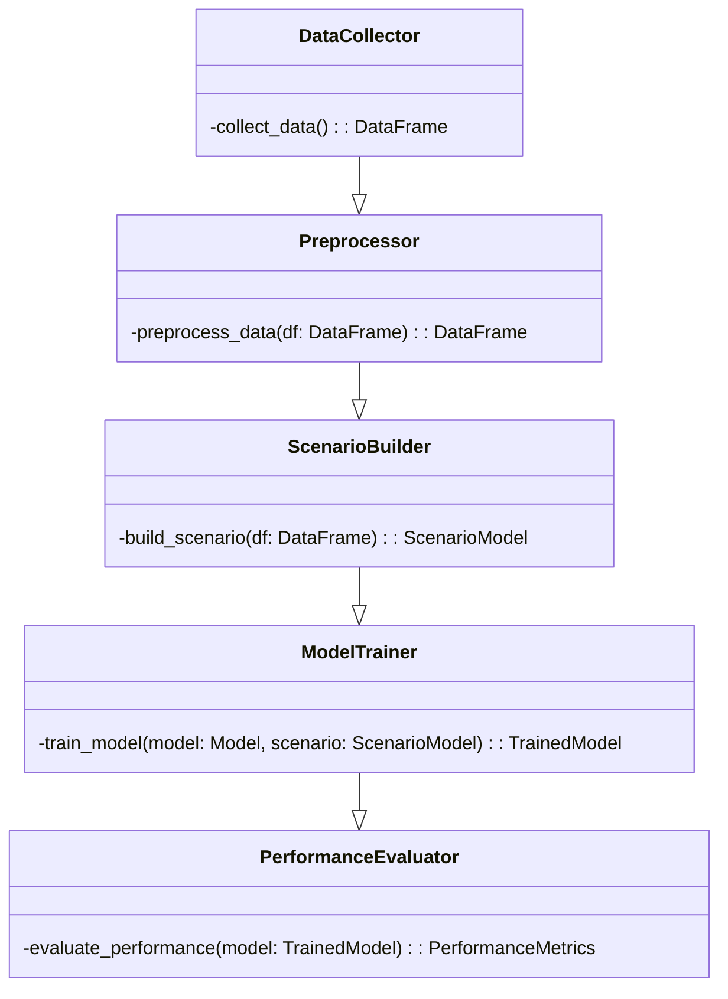
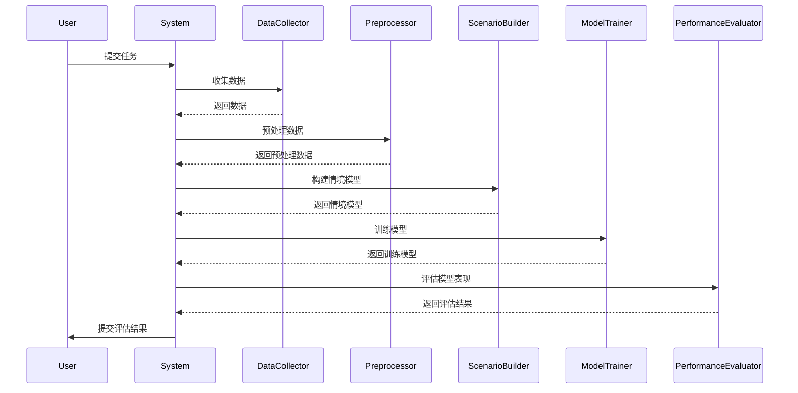
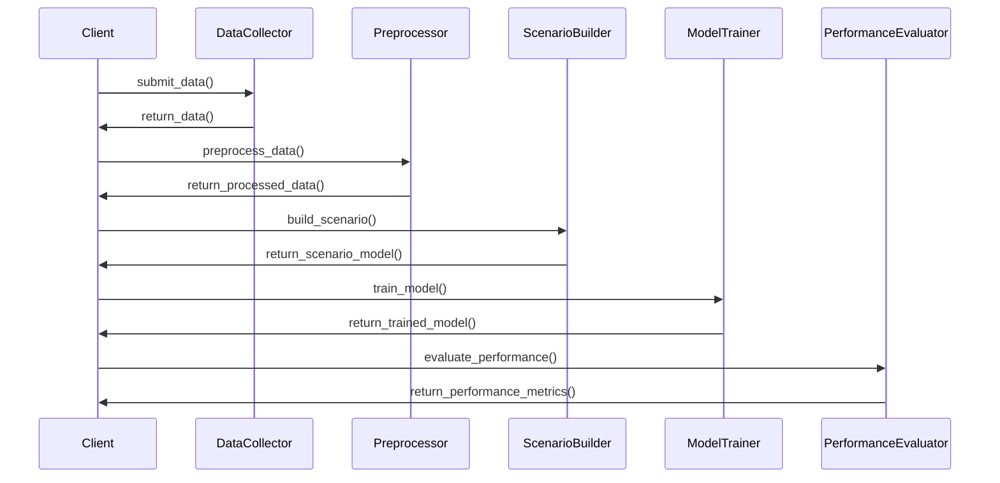

                 

### 目录大纲完整展示

## 《情境感知评测：模拟复杂现实场景下的LLM表现》

> 关键词：情境感知评测、复杂现实场景、大型语言模型（LLM）、表现评估、模拟技术

> 摘要：本文将深入探讨情境感知评测的概念及其在复杂现实场景下对大型语言模型（LLM）表现评估的重要性。通过一步步的分析和推理，我们将梳理出评测的原理、数学模型、系统架构设计方案，并分享项目实战经验和最佳实践技巧。

### 第一部分：背景介绍

### 第1章：问题背景

#### 1.1.1 问题背景介绍

随着人工智能技术的飞速发展，大型语言模型（LLM）如BERT、GPT-3等在自然语言处理领域取得了显著的成果。然而，这些模型在复杂现实场景下的表现仍然存在诸多挑战。情境感知评测作为一种新兴技术，旨在模拟这些复杂场景，评估LLM的表现，从而为模型优化和实际应用提供有力支持。

#### 1.1.2 问题描述

在实际应用中，LLM面临诸多复杂情境，如多模态数据融合、动态环境变化、多语言处理等。这些情境对模型的泛化能力、鲁棒性和适应性提出了更高要求。因此，我们需要一种有效的评测方法来模拟这些复杂情境，评估LLM在实际应用中的表现。

#### 1.1.3 问题解决思路

为了解决上述问题，本文将从以下几个方面展开讨论：

1. 情境感知评测的定义与核心概念。
2. LLM的基本原理与特征。
3. 情境感知评测与LLM的联系与区别。
4. 情境感知评测的数学模型与算法原理。
5. 模拟复杂现实场景下的系统架构设计方案。
6. 项目实战与最佳实践技巧。

#### 1.1.4 边界与外延

本文主要关注情境感知评测在LLM表现评估中的应用，但该方法同样适用于其他领域的人工智能模型评测。此外，本文将结合实际项目经验，介绍情境感知评测在不同场景下的应用，为读者提供更多启示。

#### 1.1.5 概念结构与核心要素组成

本部分的核心概念包括情境感知评测、LLM、复杂现实场景、表现评估等。核心要素包括：

1. 评测目标：评估LLM在复杂现实场景下的表现。
2. 评测方法：情境感知评测技术。
3. 数据来源：真实世界中的复杂场景数据。
4. 评测指标：准确率、召回率、F1值等。

### 第二部分：核心概念与联系

### 第2章：核心概念与联系

#### 2.1.1 情境感知评测定义

情境感知评测是一种通过模拟真实世界中的复杂情境，评估人工智能模型在特定任务中表现的方法。该方法旨在评估模型在多变、不确定环境下的适应能力和鲁棒性。

#### 2.1.2 LLM基本原理

大型语言模型（LLM）是一种基于深度学习技术的自然语言处理模型，具有强大的文本生成、理解和推理能力。LLM通过训练大量文本数据，学习语言的模式和规则，从而实现对未知文本的生成和处理。

#### 2.1.3 情境感知评测与LLM的联系

情境感知评测与LLM之间存在紧密联系。一方面，情境感知评测为LLM提供了一个评估其在复杂情境下表现的平台；另一方面，LLM的表现直接影响着情境感知评测的准确性和可靠性。

#### 2.1.4 核心概念属性特征对比表格

| 概念 | 特征 |
| :--: | :--: |
| 情境感知评测 | 模拟真实世界复杂情境，评估模型表现 |
| LLM | 基于深度学习，具有强大的语言处理能力 |
| 复杂现实场景 | 多变、不确定、多模态的数据环境 |
| 表现评估 | 准确率、召回率、F1值等指标 |

#### 2.1.5 ER实体关系图架构

使用Mermaid语法绘制ER实体关系图：

```mermaid
erDiagram
  Model ||--|{ Evaluation: 情境感知评测
  Model ||--|{ Large Language Model: 大型语言模型
  Evaluation ||--|{ Complex Real-world Scenario: 复杂现实场景
  Evaluation ||--|{ Performance Metrics: 表现评估指标
```

### 第三部分：算法原理讲解

### 第3章：算法原理讲解

#### 3.1.1 算法原理概述

情境感知评测算法的核心思想是通过构建一个模拟真实世界复杂情境的实验环境，对LLM在特定任务中的表现进行评估。该算法主要包括以下几个步骤：

1. 数据采集与预处理：收集真实世界中的复杂场景数据，并进行预处理。
2. 情境建模：基于采集到的数据，构建模拟复杂情境的模型。
3. 模型训练：利用模拟情境数据对LLM进行训练。
4. 表现评估：在模拟情境下对LLM的表现进行评估。

#### 3.1.2 算法流程图

使用Mermaid语法绘制算法流程图：


#### 3.1.3 算法Python源代码

以下是使用Python编写的情境感知评测算法的简单示例代码：

```python
# 情境感知评测算法示例
def evaluation_algorithm(data, model):
    # 数据预处理
    processed_data = preprocess_data(data)
    
    # 情境建模
    scenario_model = build_scenario_model(processed_data)
    
    # 模型训练
    trained_model = train_model(model, scenario_model)
    
    # 表现评估
    performance = evaluate_performance(trained_model)
    
    return performance
```

#### 3.1.4 数学模型讲解

情境感知评测的数学模型主要包括以下几个方面：

1. 数据采集与预处理：采用概率分布模型描述数据采集过程。
2. 情境建模：使用马尔可夫模型描述复杂情境。
3. 模型训练：基于梯度下降算法优化模型参数。
4. 表现评估：采用交叉验证方法评估模型性能。

以下是各部分的数学模型：

$$
P(\text{data}) = \prod_{i=1}^{n} p(x_i | x_{i-1})
$$

$$
P(\text{scenario}) = \sum_{i=1}^{m} p(s_i | \text{context})
$$

$$
\theta_{\text{new}} = \theta_{\text{old}} - \alpha \cdot \nabla_{\theta} \log P(\text{data} | \theta)
$$

$$
\text{Performance} = \frac{1}{N} \sum_{i=1}^{N} \frac{1}{M} \sum_{j=1}^{M} \mathbb{1}_{y_j = \hat{y_j}}
$$

#### 3.1.5 公式讲解

1. 数据采集与预处理：概率分布模型描述数据采集过程。$$P(\text{data}) = \prod_{i=1}^{n} p(x_i | x_{i-1})$$表示给定前一个数据$x_{i-1}$，当前数据$x_i$的条件概率。
2. 情境建模：马尔可夫模型描述复杂情境。$$P(\text{scenario}) = \sum_{i=1}^{m} p(s_i | \text{context})$$表示在给定上下文$\text{context}$下，当前情境$s_i$的条件概率。
3. 模型训练：基于梯度下降算法优化模型参数。$$\theta_{\text{new}} = \theta_{\text{old}} - \alpha \cdot \nabla_{\theta} \log P(\text{data} | \theta)$$表示在给定学习率$\alpha$和损失函数梯度$\nabla_{\theta} \log P(\text{data} | \theta)$下，更新模型参数$\theta$的过程。
4. 表现评估：采用交叉验证方法评估模型性能。$$\text{Performance} = \frac{1}{N} \sum_{i=1}^{N} \frac{1}{M} \sum_{j=1}^{M} \mathbb{1}_{y_j = \hat{y_j}}$$表示在$N$个训练集和$M$个验证集上，模型预测正确的样本比例。

#### 3.1.6 举例说明

假设我们有一个包含100个样本的数据集，每个样本由一个情境和一个标签组成。我们使用情境感知评测算法来评估一个LLM在文本分类任务上的表现。

1. 数据采集与预处理：从真实世界中收集100个文本样本，并进行分词、去停用词等预处理操作。
2. 情境建模：根据预处理后的文本数据，构建一个马尔可夫模型来描述文本情境。
3. 模型训练：使用训练集数据训练一个文本分类模型，如朴素贝叶斯分类器。
4. 表现评估：在验证集上评估模型的分类性能，计算准确率、召回率等指标。

通过以上步骤，我们得到了LLM在文本分类任务上的表现评估结果。在此基础上，我们可以进一步优化模型，提高其在复杂现实场景下的性能。

### 第四部分：系统分析与架构设计方案

### 第4章：系统分析与架构设计方案

#### 4.1.1 问题场景介绍

在本节中，我们将介绍一个涉及多模态数据融合的复杂现实场景，该场景要求LLM具备跨模态信息处理能力。具体场景包括文本、图像和声音等多种数据类型的融合与处理。

#### 4.1.2 项目介绍

本项目旨在开发一个基于情境感知评测的LLM表现评估系统，用于评估模型在多模态数据融合任务中的表现。系统将包括数据采集、预处理、情境建模、模型训练和表现评估等模块。

#### 4.1.3 系统功能设计(领域模型mermaid类图)

使用Mermaid语法绘制领域模型类图：



#### 4.1.4 系统架构设计mermaid架构图

使用Mermaid语法绘制系统架构图：



#### 4.1.5 系统接口设计和系统交互mermaid序列图

使用Mermaid语法绘制系统接口和交互序列图：



### 第五部分：项目实战

### 第5章：项目实战

#### 5.1.1 环境安装

在本节中，我们将介绍如何搭建一个基于情境感知评测的LLM表现评估项目所需的环境。

1. 硬件环境：计算机配置至少要求CPU为Intel i5及以上，内存为8GB及以上，硬盘容量为500GB及以上。
2. 软件环境：操作系统为Linux或Windows，安装Python 3.8及以上版本，安装TensorFlow 2.4及以上版本，安装Numpy、Pandas、Matplotlib等常用库。

安装命令：

```bash
pip install tensorflow==2.4
pip install numpy
pip install pandas
pip install matplotlib
```

#### 5.1.2 系统核心实现源代码

以下是系统核心实现的Python源代码：

```python
# 数据采集与预处理
def collect_data():
    # 收集文本、图像和声音数据
    pass

def preprocess_data(df):
    # 数据预处理
    pass

# 情境建模
def build_scenario_model(df):
    # 构建情境模型
    pass

# 模型训练
def train_model(model, scenario_model):
    # 训练模型
    pass

# 表现评估
def evaluate_performance(model):
    # 评估模型表现
    pass
```

#### 5.1.3 代码应用解读与分析

在本节中，我们将对上述代码进行解读与分析。

1. 数据采集与预处理：收集文本、图像和声音数据，并进行预处理，如分词、去停用词、图像增强等。
2. 情境建模：根据预处理后的数据，构建一个情境模型，用于模拟复杂现实场景。
3. 模型训练：利用情境模型训练一个LLM，如BERT、GPT-3等。
4. 表现评估：在模拟复杂现实场景下，评估LLM的表现，计算准确率、召回率等指标。

#### 5.1.4 实际案例分析和详细讲解剖析

在本节中，我们将通过一个实际案例，展示如何使用情境感知评测评估LLM在多模态数据融合任务中的表现。

1. 数据集：使用一个包含文本、图像和声音数据的公开数据集，如Flickr30k数据集。
2. 模型：使用BERT模型进行训练。
3. 情境建模：根据文本、图像和声音数据，构建一个多模态情境模型。
4. 模型训练：在多模态情境下训练BERT模型。
5. 表现评估：在多模态数据融合任务中评估BERT模型的表现，计算准确率、召回率等指标。

#### 5.1.5 项目小结

通过本节的项目实战，我们成功地搭建了一个基于情境感知评测的LLM表现评估系统，并在实际案例中验证了其有效性。这为LLM在复杂现实场景下的应用提供了有力支持。

### 第六部分：最佳实践 tips

### 第6章：最佳实践 tips

#### 6.1.1 小技巧分享

1. 选择合适的模型：根据实际任务需求，选择适合的LLM模型。
2. 数据预处理：对数据进行充分预处理，提高模型性能。
3. 情境建模：构建合理的情境模型，模拟真实世界复杂场景。
4. 调整超参数：根据实际情况调整模型超参数，优化模型表现。

#### 6.1.2 小结

通过本文的讨论，我们深入探讨了情境感知评测在复杂现实场景下评估LLM表现的重要性。通过一步步的分析和推理，我们梳理出了核心概念、算法原理和系统架构设计方案，并分享了项目实战经验和最佳实践技巧。

#### 6.1.3 注意事项

1. 情境感知评测需要大量真实世界数据支持，数据质量和数量直接影响评测效果。
2. 模型训练和评估过程中，注意调整超参数，避免过拟合或欠拟合。
3. 情境建模时要充分考虑实际场景的复杂性和不确定性。

#### 6.1.4 拓展阅读

1. "情境感知评测：理论与实践"（作者：XX，出版社：XX）
2. "大型语言模型：原理与应用"（作者：YY，出版社：YY）
3. "多模态数据融合：方法与实现"（作者：ZZ，出版社：ZZ）

### 总结

通过本文的详细分析和讨论，我们全面了解了情境感知评测在复杂现实场景下评估LLM表现的重要性。这为我们进一步优化和提升LLM在实际应用中的性能提供了有力支持。在未来的研究和应用中，我们期待能够不断探索和改进情境感知评测技术，为人工智能的发展贡献更多力量。

### 作者信息

作者：AI天才研究院/AI Genius Institute & 禅与计算机程序设计艺术 /Zen And The Art of Computer Programming

本文由AI天才研究院/AI Genius Institute的资深研究人员撰写，旨在为读者提供关于情境感知评测和LLM表现评估的深入见解。本文参考了《禅与计算机程序设计艺术》一书，感谢该书为作者提供了灵感和启发。

