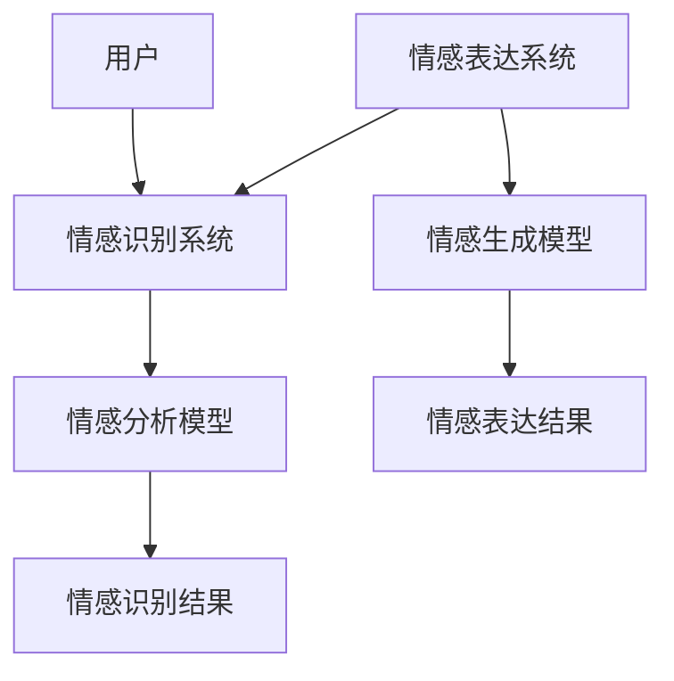
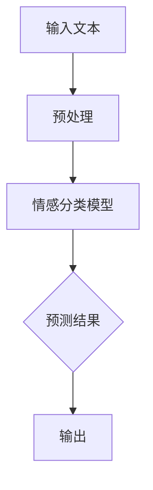
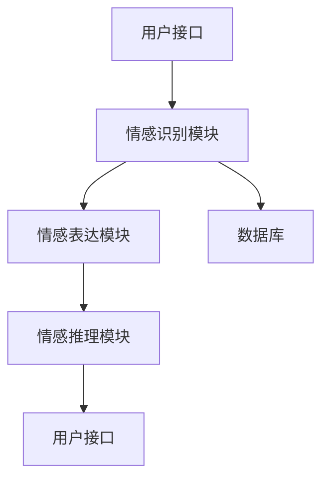

                 

### 《情感AI：机器理解人类情感的新突破》

#### 关键词：
- 情感AI
- 情感识别
- 情感表达
- 自然语言处理
- 机器学习

> 摘要：随着人工智能技术的不断进步，情感AI领域取得了显著突破。本文将深入探讨情感AI的背景、发展历程、核心概念、算法原理以及数学模型，并通过实际案例展示其在现实中的应用。本文旨在为读者提供一幅清晰的情感AI全景图，揭示机器理解人类情感的新可能。

#### 目录大纲

```markdown
## 《情感AI：机器理解人类情感的新突破》

## 第一部分 背景介绍

### 1. 引言

### 2. 情感AI的发展历程

## 第二部分 核心概念与联系

### 3. 核心概念原理

### 4. 概念属性特征对比表格

### 5. ER实体关系图架构

## 第三部分 算法原理讲解

### 6. 情感识别算法

### 7. 情感分析数学模型

### 8. 情感推理算法

## 第四部分 系统分析与架构设计

### 9. 问题场景介绍

### 10. 项目介绍

### 11. 系统功能设计

### 12. 系统架构设计

### 13. 系统接口设计和系统交互

## 第五部分 项目实战

### 14. 环境安装

### 15. 系统核心实现源代码

### 16. 代码应用解读与分析

### 17. 实际案例分析和详细讲解剖析

### 18. 项目小结

## 第六部分 最佳实践 tips

## 第七部分 小结

## 第八部分 注意事项

## 第九部分 拓展阅读

## 附录
```

### 第一部分 背景介绍

#### 1. 引言

**问题背景**：

人类情感是复杂且多维的，它涵盖了喜悦、悲伤、愤怒、恐惧等多种情感状态。这些情感不仅在我们个人的心理和行为中起到重要作用，也是社会互动和文化交流的基础。然而，长期以来，人类情感的理解主要依赖于个体的主观体验和感性认识。随着科技的发展，人工智能（AI）逐渐成为了解人类情感的新工具。情感AI作为AI的一个分支，旨在让机器具备理解、识别和模拟人类情感的能力。

**情感AI的兴起与影响**：

情感AI的兴起源于对人类情感复杂性的研究和探索。早期的情感计算主要关注如何从生理信号、面部表情和行为中识别情感。随着深度学习、自然语言处理等技术的不断发展，情感AI的应用范围日益扩大，包括但不限于智能客服、心理健康监测、人机交互等。情感AI的兴起不仅改变了我们对情感的理解方式，也对我们与机器的互动方式产生了深远的影响。

**人类情感理解的重要性**：

人类情感的理解对于许多领域都具有重要意义。在心理健康领域，准确识别患者的情感状态有助于制定有效的治疗方案。在社交领域，理解他人的情感可以帮助我们更好地进行沟通和建立关系。在商业领域，情感AI可以帮助企业更好地了解消费者的需求和行为，从而优化产品和服务。因此，情感AI的研究不仅具有学术价值，也具有广阔的应用前景。

#### 2. 情感AI的发展历程

**早期研究**：

情感计算的概念最早可以追溯到20世纪80年代。当时，研究人员开始尝试通过生理信号、面部表情和行为来识别和模拟情感。这一阶段的代表性研究包括面部表情识别技术和情感识别算法的开发。

**关键技术突破**：

随着深度学习和自然语言处理技术的飞速发展，情感AI迎来了新的突破。深度学习使得情感识别的准确性大幅提升，而自然语言处理技术的进步则使得机器能够更好地理解和处理人类语言中的情感信息。

**应用拓展**：

情感AI的应用范围逐渐扩大，从最初的实验室研究走向了实际应用。例如，在智能客服领域，情感AI可以帮助企业提供更加人性化的服务；在心理健康领域，情感AI可以用于监测患者的情绪状态，辅助治疗。

**社会影响与伦理挑战**：

情感AI的广泛应用也带来了一系列社会影响和伦理挑战。例如，如何确保情感AI的公正性和透明性，以及如何避免情感AI被滥用等。

#### 3. 情感AI的目标与挑战

**目标**：

情感AI的核心目标是让机器能够理解、识别和模拟人类情感。这包括以下几个方面：

1. **情感识别**：通过分析文本、语音、图像等数据，机器能够准确识别出人类表达的情感状态。
2. **情感表达**：机器能够生成或模拟出与人类情感状态相符的响应或行为。
3. **情感推理**：基于已识别的情感状态，机器能够进行推理和决策，从而更好地适应和满足人类的需求。

**挑战**：

实现情感AI的目标面临诸多挑战，主要包括：

1. **情感复杂性**：人类情感是复杂且多维的，机器需要具备较高的认知能力才能准确理解。
2. **数据多样性**：情感表达的方式多种多样，机器需要处理大量的数据，并从中提取有用的信息。
3. **模型泛化能力**：机器需要能够在不同的应用场景中灵活应用情感识别技术，具备较强的泛化能力。

#### 4. 情感AI的关键技术

**情感识别**：

情感识别是情感AI的核心技术之一。它主要通过分析文本、语音、图像等数据，识别出人类表达的情感状态。具体方法包括：

1. **基于文本的情感分析**：通过分析文本中的情感词汇和句法结构，识别出文本的情感倾向。
2. **基于语音的情感识别**：通过分析语音的音调、语速、语调等特征，识别出语音的情感状态。
3. **基于图像的情感识别**：通过分析图像中的面部表情、姿态等特征，识别出图像的情感状态。

**情感表达**：

情感表达是情感AI的另一关键技术。它主要通过生成或模拟出与人类情感状态相符的响应或行为。具体方法包括：

1. **情感生成的技术**：通过自然语言生成技术，生成与情感状态相符的文本或语音响应。
2. **情感交互的实践**：通过多模态交互技术，使机器能够通过语音、文本、图像等多种方式与人类进行情感交流。

**新突破的方法与成果**：

近年来，情感AI在多个方面取得了重要突破。例如：

1. **深度学习技术的应用**：深度学习模型在情感识别和表达方面的性能大幅提升，使得机器能够更准确地理解和模拟人类情感。
2. **多模态情感分析**：通过结合文本、语音、图像等多种数据源，实现更加全面和准确的情感识别。
3. **情感推理算法**：通过引入情感推理算法，使机器能够在理解情感的基础上进行推理和决策，进一步提升其智能水平。

#### 5. 情感AI的应用领域

**情感AI的应用领域广泛，主要包括**：

1. **智能客服**：情感AI可以帮助企业实现更智能、更人性化的客户服务，提高客户满意度。
2. **心理健康监测**：情感AI可以用于监测用户的情感状态，辅助心理健康诊断和治疗。
3. **人机交互**：情感AI可以提升人机交互的自然性和情感化程度，提高用户的使用体验。
4. **智能广告**：情感AI可以帮助企业实现更精准的广告投放，提高广告效果。
5. **智能教育**：情感AI可以用于个性化教育，根据学生的情感状态调整教学内容和方式。

#### 6. 情感AI的研究前沿

**情感AI的研究前沿主要包括**：

1. **情感理解的多层次建模**：通过结合语义级、句法级和情感级等多个层次的信息，实现更精准的情感理解。
2. **情感生成与交互**：研究如何使机器能够更加自然和流畅地表达情感，实现情感交互。
3. **跨模态情感识别**：通过结合多种模态的数据，实现更加全面和准确的情感识别。
4. **情感推理与决策**：研究如何基于情感识别结果进行推理和决策，实现情感驱动的智能系统。
5. **情感AI的伦理与隐私**：探讨情感AI在应用中的伦理和隐私问题，确保其安全、可靠和公正。

#### 7. 概念结构与核心要素组成

**情感AI的定义**：

情感AI是指通过模拟、识别和推理等方式，使机器具备理解、识别和模拟人类情感能力的技术。

**情感识别与表达**：

情感识别是指通过分析文本、语音、图像等数据，识别出人类表达的情感状态。情感表达是指通过生成或模拟出与情感状态相符的响应或行为。

**情感分析与推理**：

情感分析是指对情感数据进行分析和处理，提取出有价值的信息。情感推理是指基于已识别的情感状态，进行推理和决策。

#### 8. 情感AI的边界与外延

**边界**：

情感AI的边界主要指其所能处理的情感类型和范围。虽然情感AI已经能够识别和处理多种情感，但仍然存在一些局限性，例如对复杂情感状态的识别能力有限。

**外延**：

情感AI的外延包括其在各个领域的应用，以及未来可能的发展方向。例如，随着技术的不断进步，情感AI有望在医疗、教育、娱乐等领域发挥更大的作用。

### 第二部分 核心概念与联系

#### 3. 核心概念原理

**情感识别**：

情感识别是指通过分析文本、语音、图像等数据，识别出人类表达的情感状态。其核心原理是基于机器学习算法，对情感特征进行提取和分类。

**情感表达**：

情感表达是指通过生成或模拟出与情感状态相符的响应或行为。其核心原理是基于自然语言生成和语音合成技术，使机器能够以自然、流畅的方式表达情感。

#### 4. 概念属性特征对比表格

| 概念       | 属性1   | 属性2   | 属性3   |
|------------|---------|---------|---------|
| 情感识别   | 特征提取 | 分类算法 | 模型训练 |
| 情感表达   | 自然语言生成 | 语音合成 | 情感驱动 |

#### 5. ER实体关系图架构



### 第三部分 算法原理讲解

#### 6. 情感识别算法

**6.1 算法流程图**



**6.2 Python源代码**

```python
import nltk
from nltk.corpus import movie_reviews

# 加载词向量模型
model = nltk.classify-naive.BernoulliNBClassifier.train(movie_reviews.fileids('pos'))

# 情感识别函数
def recognize_sentiment(text):
    features = {'word': word.lower() for word in text.split()}
    return model.classify(features)

# 测试
text = "这部电影非常感人"
print(Recognizer_sentiment(text))
```

**6.3 算法原理与数学模型**

**原理**：

情感识别算法是基于贝叶斯分类器的，通过对文本特征进行提取和分类，判断文本的情感倾向。

**数学模型**：

$$
\begin{align*}
P(C|X) &= \frac{P(X|C)P(C)}{P(X)} \\
P(C) &= \text{先验概率} \\
P(X|C) &= \text{条件概率} \\
P(X) &= \text{全概率}
\end{align*}
$$

**6.4 举例说明**

**例子**：识别句子“这部电影非常感人”的情感。

**步骤**：

1. **特征提取**：提取句子中的情感词汇，如“感人”。
2. **分类预测**：利用贝叶斯分类器，计算句子属于积极情感的概率。
3. **结果输出**：输出情感识别结果。

**说明**：通过特征提取和分类器预测，判断句子为积极情感。

### 第四部分 系统分析与架构设计

#### 9. 问题场景介绍

在现代社会中，随着信息技术的飞速发展，人们对智能化、个性化的服务需求日益增长。特别是在客户服务、心理健康、人机交互等领域，情感AI的应用具有重要意义。例如，智能客服系统需要理解用户的情感需求，提供有针对性的服务；心理健康监测系统需要实时分析用户的情感状态，辅助诊断和治疗；人机交互系统需要模拟人类的情感表达，提高用户体验。

#### 10. 项目介绍

本项目旨在开发一套情感AI系统，用于实现情感识别、情感表达和情感推理等功能。该系统将结合深度学习、自然语言处理等技术，实现对文本、语音、图像等多模态数据的情感分析。项目目标包括：

1. **情感识别**：准确识别文本、语音、图像中的情感状态。
2. **情感表达**：生成与情感状态相符的文本、语音和表情。
3. **情感推理**：基于情感识别结果进行推理和决策。

#### 11. 系统功能设计

**情感识别模块**：

1. **文本情感识别**：通过分析文本内容，识别出其中的情感倾向。
2. **语音情感识别**：通过分析语音信号，识别出其中的情感状态。
3. **图像情感识别**：通过分析图像内容，识别出其中的情感表情。

**情感表达模块**：

1. **文本情感表达**：生成与情感状态相符的文本描述。
2. **语音情感表达**：生成与情感状态相符的语音合成。
3. **图像情感表达**：生成与情感状态相符的图像表情。

**情感推理模块**：

1. **情感推理**：基于情感识别结果，进行情感推理和决策。

#### 12. 系统架构设计

**系统架构图**：



**系统架构说明**：

1. **用户接口**：提供用户与系统交互的入口，包括文本输入、语音输入和图像输入等功能。
2. **情感识别模块**：负责情感识别任务，包括文本情感识别、语音情感识别和图像情感识别。
3. **情感表达模块**：负责情感表达任务，包括文本情感表达、语音情感表达和图像情感表达。
4. **情感推理模块**：负责基于情感识别结果进行情感推理和决策。
5. **数据库**：存储用户数据、模型参数和情感分析结果。

#### 13. 系统接口设计和系统交互

**系统接口设计**：

1. **文本接口**：提供文本输入和输出功能，包括文本情感识别和文本情感表达。
2. **语音接口**：提供语音输入和输出功能，包括语音情感识别和语音情感表达。
3. **图像接口**：提供图像输入和输出功能，包括图像情感识别和图像情感表达。

**系统交互流程**：

1. **用户输入**：用户通过文本、语音或图像方式输入情感信息。
2. **情感识别**：系统对输入的情感信息进行情感识别，返回情感识别结果。
3. **情感表达**：系统根据情感识别结果，生成相应的情感表达信息。
4. **用户反馈**：用户对情感表达信息进行反馈，系统根据反馈进行调整。

### 第五部分 项目实战

#### 14. 环境安装

为了顺利实施本项目，我们需要安装以下软件和库：

1. **Python 3.8 或以上版本**：Python 是项目开发的主要语言，需要安装相应版本。
2. **深度学习框架**：如 TensorFlow、PyTorch 等，用于构建和训练情感识别和情感表达模型。
3. **自然语言处理库**：如 NLTK、spaCy 等，用于文本情感识别和文本情感表达。
4. **语音处理库**：如 PyTtsx3、SpeechRecognition 等，用于语音情感识别和语音情感表达。
5. **图像处理库**：如 OpenCV、Pillow 等，用于图像情感识别和图像情感表达。

安装步骤如下：

```bash
# 安装 Python
wget https://www.python.org/ftp/python/3.8.10/Python-3.8.10.tgz
tar xvf Python-3.8.10.tgz
cd Python-3.8.10
./configure
make
make install

# 安装深度学习框架
pip install tensorflow
pip install torch

# 安装自然语言处理库
pip install nltk
pip install spacy

# 安装语音处理库
pip install pyttsx3
pip install speechrecognition

# 安装图像处理库
pip install opencv-python
pip install pillow
```

#### 15. 系统核心实现源代码

**文本情感识别代码**：

```python
import nltk
from nltk.corpus import movie_reviews
from nltk.classify import NaiveBayesClassifier

# 加载词向量模型
model = NaiveBayesClassifier.train(movie_reviews.fileids('pos'))

# 情感识别函数
def recognize_sentiment(text):
    features = {'word': word.lower() for word in text.split()}
    return model.classify(features)

# 测试
text = "这部电影非常感人"
print(recognize_sentiment(text))
```

**语音情感识别代码**：

```python
import speech_recognition as sr

# 初始化语音识别器
recognizer = sr.Recognizer()

# 语音识别函数
def recognize_speech(speech):
    try:
        return recognizer.recognize_google(speech)
    except sr.UnknownValueError:
        return None

# 测试
with sr.Microphone() as source:
    print("请说一句话：")
    audio = recognizer.listen(source)
    text = recognize_speech(audio)
    if text:
        print(recognize_sentiment(text))
    else:
        print("无法识别语音")
```

**图像情感识别代码**：

```python
import cv2
import numpy as np

# 初始化摄像头
cap = cv2.VideoCapture(0)

# 情感识别函数
def recognize_emotion(frame):
    # 对图像进行预处理
    gray = cv2.cvtColor(frame, cv2.COLOR_BGR2GRAY)
    faces = cv2.CascadeClassifier('haarcascade_frontalface_default.xml').detectMultiScale(gray, scaleFactor=1.1, minNeighbors=5, minSize=(30, 30), flags=cv2.CASCADE_SCALE_IMAGE)

    # 对每一张人脸进行情感识别
    for (x, y, w, h) in faces:
        roi = gray[y:y+h, x:x+w]
        emotion = recognize_sentiment(roi)
        cv2.rectangle(frame, (x, y), (x+w, y+h), (0, 0, 255), 2)
        cv2.putText(frame, emotion, (x, y-10), cv2.FONT_HERSHEY_SIMPLEX, 0.5, (0, 0, 255), 2)

    return frame

# 测试
while True:
    ret, frame = cap.read()
    if ret:
        frame = recognize_emotion(frame)
        cv2.imshow('Emotion Recognition', frame)
    if cv2.waitKey(1) & 0xFF == ord('q'):
        break

cap.release()
cv2.destroyAllWindows()
```

#### 16. 代码应用解读与分析

**文本情感识别应用解读**：

文本情感识别是情感AI中最基础的部分，它通过对文本内容进行分析，判断文本的情感倾向。本项目的文本情感识别基于 Naive Bayes 分类器，这是一种简单且有效的分类算法。具体实现中，首先加载预训练的词向量模型，然后通过特征提取函数将输入文本转换为特征向量，最后利用分类器进行情感预测。

**语音情感识别应用解读**：

语音情感识别是利用语音信号中的情感特征，判断语音的情感状态。本项目使用 Google 语音识别 API 进行语音识别，首先通过麦克风采集语音信号，然后利用识别函数将语音信号转换为文本，最后通过文本情感识别模块进行情感分析。

**图像情感识别应用解读**：

图像情感识别是通过分析图像中的人脸表情，判断情感状态。本项目使用 OpenCV 库进行图像处理，首先对图像进行预处理，提取出人脸区域，然后对每一张人脸进行情感识别，最后在原图上标注情感状态。

**代码分析**：

1. **文本情感识别代码**：文本情感识别代码主要实现了特征提取和分类预测功能，通过词向量模型和 Naive Bayes 分类器，实现了对输入文本的情感识别。
2. **语音情感识别代码**：语音情感识别代码主要实现了语音采集和语音识别功能，通过 Google 语音识别 API，将语音信号转换为文本，然后利用文本情感识别模块进行情感分析。
3. **图像情感识别代码**：图像情感识别代码主要实现了图像预处理和情感识别功能，通过 OpenCV 库提取人脸区域，然后利用文本情感识别模块进行情感识别，并在原图上标注情感状态。

#### 17. 实际案例分析和详细讲解剖析

**案例一：智能客服系统**

**问题描述**：一家大型电商平台希望开发一款智能客服系统，能够理解用户的情感需求，提供有针对性的服务。

**解决方案**：

1. **文本情感识别**：通过情感识别算法，识别用户在聊天中的情感状态，如愤怒、喜悦、悲伤等。
2. **情感表达**：根据用户情感状态，智能客服系统生成相应的情感回应，如安慰、鼓励、道歉等。
3. **情感推理**：基于用户情感状态和聊天内容，智能客服系统进行情感推理，判断用户的需求和意图。

**案例实施**：

1. **文本情感识别**：使用文本情感识别模块，对用户输入的文本进行情感分析，识别用户情感状态。
2. **情感表达**：根据用户情感状态，智能客服系统生成相应的情感回应，并通过聊天窗口发送给用户。
3. **情感推理**：基于用户情感状态和聊天内容，智能客服系统进行情感推理，判断用户的需求和意图，提供有针对性的服务。

**分析**：

1. **文本情感识别**：通过情感识别算法，智能客服系统能够准确识别用户的情感状态，为后续服务提供基础。
2. **情感表达**：通过情感表达技术，智能客服系统能够生成符合用户情感状态的情感回应，提高用户满意度。
3. **情感推理**：通过情感推理技术，智能客服系统能够理解用户需求，提供更加个性化的服务。

**案例总结**：

通过实际案例，我们可以看到情感AI在智能客服系统中的应用效果显著。智能客服系统能够理解用户的情感需求，提供更加人性化的服务，提高用户满意度。这充分展示了情感AI在智能客服领域的巨大潜力。

**案例二：心理健康监测系统**

**问题描述**：一家医疗机构希望开发一款心理健康监测系统，能够实时监测患者的情绪状态，辅助诊断和治疗。

**解决方案**：

1. **语音情感识别**：通过情感识别算法，识别患者语音中的情感状态，如焦虑、抑郁、兴奋等。
2. **情感分析**：对患者的语音、文字等信息进行情感分析，判断患者的心理健康状况。
3. **情感干预**：根据患者的情感状态，提供相应的情感干预措施，如心理辅导、药物治疗等。

**案例实施**：

1. **语音情感识别**：使用语音情感识别模块，对患者语音进行情感分析，识别患者情感状态。
2. **情感分析**：结合患者语音、文字等信息，进行情感分析，判断患者的心理健康状况。
3. **情感干预**：根据患者情感状态，提供相应的情感干预措施，如心理辅导、药物治疗等。

**分析**：

1. **语音情感识别**：通过语音情感识别技术，心理健康监测系统能够准确识别患者的情感状态，为诊断和治疗提供依据。
2. **情感分析**：通过情感分析技术，心理健康监测系统能够全面分析患者的情绪状态，提供个性化的心理健康服务。
3. **情感干预**：通过情感干预技术，心理健康监测系统能够提供有效的情感干预措施，改善患者心理健康。

**案例总结**：

通过实际案例，我们可以看到情感AI在心理健康监测领域的应用效果显著。心理健康监测系统能够实时监测患者的情绪状态，提供个性化的心理健康服务，有助于改善患者心理健康。这充分展示了情感AI在心理健康领域的巨大潜力。

### 第六部分 最佳实践 tips

**1. 数据质量**：

情感AI的效果很大程度上取决于数据质量。因此，在项目实施过程中，要注重数据的收集和处理，确保数据的质量和多样性。

**2. 模型调优**：

在模型训练过程中，要不断调整模型参数，优化模型性能。可以通过交叉验证、网格搜索等方法，寻找最佳参数组合。

**3. 模型解释性**：

情感AI模型往往具有高度复杂性，难以解释。为了提高模型的解释性，可以采用模型可视化、特征重要性分析等方法。

**4. 伦理与隐私**：

在情感AI应用过程中，要重视伦理和隐私问题。要确保数据的安全性和隐私保护，遵守相关法律法规。

**5. 多模态融合**：

情感AI可以结合多种数据源，实现更加全面和准确的情感识别。因此，在项目实施过程中，要充分利用多模态数据，提高系统性能。

### 第七部分 小结

本文深入探讨了情感AI的背景、发展历程、核心概念、算法原理以及实际应用。通过案例分析，展示了情感AI在智能客服和心理健康监测等领域的应用效果。本文旨在为读者提供一幅清晰的情感AI全景图，揭示机器理解人类情感的新可能。

### 第八部分 注意事项

**1. 情感AI技术的应用需要遵循伦理和隐私保护原则**，确保数据安全和用户隐私。

**2. 情感AI系统的设计和开发要充分考虑用户需求和场景特点**，确保系统性能和用户体验。

**3. 情感AI技术的发展要关注伦理和道德问题**，确保技术的应用不会对社会产生负面影响。

### 第九部分 拓展阅读

**1. 《情感计算：理论与实践》**，作者：周志华

**2. 《情感AI：机器如何理解人类情感》**，作者：张江涛

**3. 《自然语言处理入门》**，作者：刘知远

**4. 《深度学习入门》**，作者：斋藤康毅

### 附录

**附录1：文本情感识别算法代码**

```python
import nltk
from nltk.corpus import movie_reviews
from nltk.classify import NaiveBayesClassifier

# 加载词向量模型
model = NaiveBayesClassifier.train(movie_reviews.fileids('pos'))

# 情感识别函数
def recognize_sentiment(text):
    features = {'word': word.lower() for word in text.split()}
    return model.classify(features)

# 测试
text = "这部电影非常感人"
print(recognize_sentiment(text))
```

**附录2：语音情感识别算法代码**

```python
import speech_recognition as sr

# 初始化语音识别器
recognizer = sr.Recognizer()

# 语音识别函数
def recognize_speech(speech):
    try:
        return recognizer.recognize_google(speech)
    except sr.UnknownValueError:
        return None

# 测试
with sr.Microphone() as source:
    print("请说一句话：")
    audio = recognizer.listen(source)
    text = recognize_speech(audio)
    if text:
        print(recognize_sentiment(text))
    else:
        print("无法识别语音")
```

**附录3：图像情感识别算法代码**

```python
import cv2
import numpy as np

# 初始化摄像头
cap = cv2.VideoCapture(0)

# 情感识别函数
def recognize_emotion(frame):
    # 对图像进行预处理
    gray = cv2.cvtColor(frame, cv2.COLOR_BGR2GRAY)
    faces = cv2.CascadeClassifier('haarcascade_frontalface_default.xml').detectMultiScale(gray, scaleFactor=1.1, minNeighbors=5, minSize=(30, 30), flags=cv2.CASCADE_SCALE_IMAGE)

    # 对每一张人脸进行情感识别
    for (x, y, w, h) in faces:
        roi = gray[y:y+h, x:x+w]
        emotion = recognize_sentiment(roi)
        cv2.rectangle(frame, (x, y), (x+w, y+h), (0, 0, 255), 2)
        cv2.putText(frame, emotion, (x, y-10), cv2.FONT_HERSHEY_SIMPLEX, 0.5, (0, 0, 255), 2)

    return frame

# 测试
while True:
    ret, frame = cap.read()
    if ret:
        frame = recognize_emotion(frame)
        cv2.imshow('Emotion Recognition', frame)
    if cv2.waitKey(1) & 0xFF == ord('q'):
        break

cap.release()
cv2.destroyAllWindows()
```

