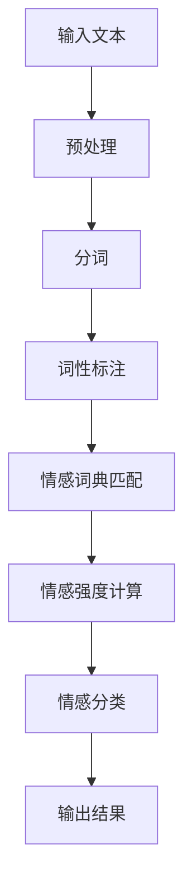
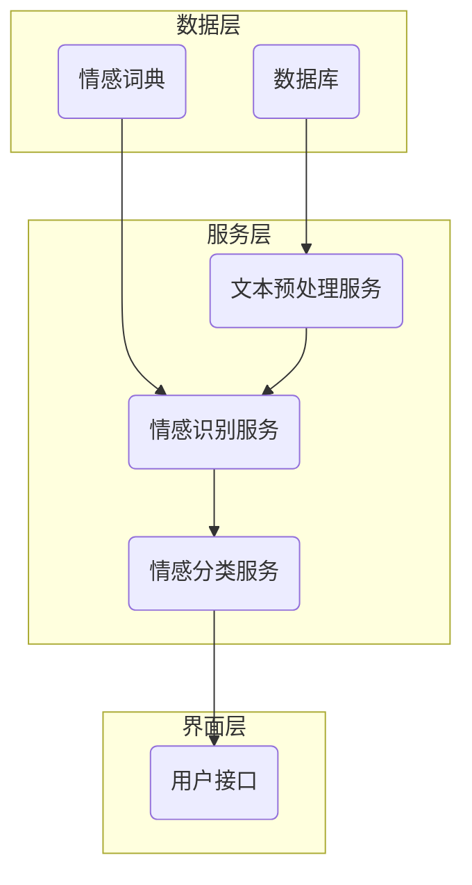
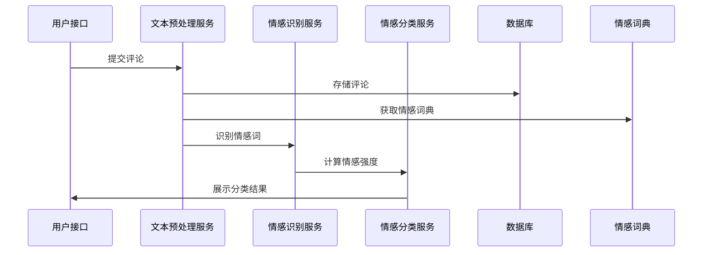

                 


### 1. 背景介绍

在当今信息技术飞速发展的时代，人工智能（AI）已经成为推动社会进步的重要力量。而大型语言模型（LLM，Large Language Model）作为AI领域的代表性技术，近年来取得了显著的进展。LLM能够通过深度学习算法处理和理解自然语言，从而在自然语言处理（NLP）任务中表现出色。然而，尽管LLM在文本生成、文本分类、机器翻译等任务上取得了巨大成功，但其在理解和回应人类情感方面的能力仍存在诸多不足。

#### 1.1 问题背景

人类情感是社会发展的重要驱动力，它影响着人际交往、决策制定、情感表达等多个方面。随着AI技术的不断发展，人们开始思考LLM是否能够真正理解和回应人类情感。然而，情感的理解和回应并非易事，它涉及到情感识别、情感生成、情感推理等多个复杂环节。当前的研究主要集中在情感识别上，而对情感回应的研究则相对较少。

#### 1.2 问题描述

本文旨在探讨LLM理解和回应人类情感的能力。具体而言，我们需要回答以下几个问题：

- **LLM是否能够准确识别文本中的情感？**
- **LLM能否根据情感进行合理的情感回应？**
- **LLM在理解和回应人类情感方面存在哪些局限和挑战？**

#### 1.3 问题解决

为了解决上述问题，本文将采用以下步骤进行分析：

- **核心概念与联系**：首先，我们需要明确情感共鸣、LLM以及情感理解和回应能力等核心概念，并阐述它们之间的联系。
- **算法原理讲解**：接着，我们将介绍情感识别算法的原理，包括算法流程、Python源代码实现、数学模型和公式，并通过具体例子进行说明。
- **系统分析与架构设计方案**：我们将从问题场景、项目介绍、系统功能设计、系统架构设计、系统接口设计和系统交互等多个角度进行分析，给出一个完整的架构设计方案。
- **项目实战**：我们将通过实际案例，展示如何使用LLM进行情感理解和回应，并对其效果进行详细分析和讲解。
- **最佳实践 tips**：最后，我们将总结项目中的经验教训，给出一些实用的最佳实践建议。

#### 1.4 边界与外延

本文的研究主要围绕LLM在理解和回应人类情感方面的能力展开，重点关注情感识别和情感回应。然而，情感共鸣是一个广泛而复杂的话题，涉及多个领域，如心理学、社会学、哲学等。因此，本文的研究具有一定的局限性。

#### 1.5 概念结构与核心要素组成

本文的结构如下：

- **核心概念与联系**：介绍情感共鸣、LLM以及情感理解和回应能力等核心概念，并分析它们之间的联系。
- **算法原理讲解**：阐述情感识别算法的原理，包括算法流程、Python源代码实现、数学模型和公式，并通过具体例子进行说明。
- **系统分析与架构设计方案**：从问题场景、项目介绍、系统功能设计、系统架构设计、系统接口设计和系统交互等多个角度进行分析，给出一个完整的架构设计方案。
- **项目实战**：通过实际案例，展示如何使用LLM进行情感理解和回应，并对其效果进行详细分析和讲解。
- **最佳实践 tips**：总结项目中的经验教训，给出一些实用的最佳实践建议。

通过以上分析，我们可以对LLM理解和回应人类情感的能力有一个更为深入的了解。接下来，我们将逐步探讨这些核心概念，并尝试给出一些有价值的见解。

### 2. 核心概念与联系

为了更好地理解LLM在理解和回应人类情感方面的能力，我们需要首先明确几个核心概念：情感共鸣、LLM（大型语言模型）以及情感理解和回应能力。这些概念不仅是我们研究的基石，也是分析LLM情感能力的关键。

#### 2.1 情感共鸣的定义

情感共鸣是指个体在情感上与他人产生共鸣，体验到他人的情感状态。这种共鸣不仅能增进人际关系，还能促进社会和谐。情感共鸣涉及到情感识别、情感表达和情感共享等多个环节。

**情感识别**：这是情感共鸣的基础，指的是个体能够准确感知和理解他人的情感状态。例如，当我们看到他人哭泣时，我们能够识别出他们正在经历悲伤。

**情感表达**：这是情感共鸣的重要环节，指的是个体能够以适当的方式表达自己的情感，从而与他人产生共鸣。例如，在朋友遇到困难时，我们通过倾听和支持来表达我们的关心。

**情感共享**：这是情感共鸣的最高阶段，指的是个体在情感上与他人产生深度连接，共同体验情感。例如，在团队合作中，成员之间通过分享经验和情感，形成强烈的团队凝聚力。

#### 2.2 LLM的介绍

LLM是一种基于深度学习的语言模型，它通过学习大量的文本数据，可以理解和生成自然语言。LLM的核心优势在于其强大的语言理解和生成能力，这使得它在各种NLP任务中表现出色。

**语言理解**：LLM能够通过预训练和微调，理解文本中的语义和语法结构，从而进行文本分类、情感分析等任务。

**语言生成**：LLM可以根据给定的输入文本生成连贯、合理的文本输出，这在文本生成任务中具有重要应用价值。

#### 2.3 情感理解和回应能力

情感理解和回应能力是指LLM在处理人类情感方面的能力。这包括情感识别、情感生成和情感推理等多个方面。

**情感识别**：这是情感理解和回应能力的基础，指的是LLM能够识别文本中的情感倾向和情感强度。例如，LLM可以识别出一段文本表达的是喜悦、悲伤还是愤怒。

**情感生成**：这是情感理解和回应能力的进一步体现，指的是LLM能够根据情感需求生成符合情感表达的文本。例如，LLM可以生成一段安慰他人的文字。

**情感推理**：这是情感理解和回应能力的最高阶段，指的是LLM能够根据上下文和语境，推理出文本中未明确表达的情感。例如，LLM可以理解一句话背后的隐喻和暗示。

#### 2.4 概念属性特征对比表格

为了更清晰地展示情感共鸣、LLM以及情感理解和回应能力之间的联系，我们设计了以下对比表格：

| 概念               | 属性特征                              | 联系与作用                           |
|--------------------|--------------------------------------|-------------------------------------|
| 情感共鸣           | 情感识别、情感表达、情感共享         | 增进人际关系，促进社会和谐         |
| LLM                | 语言理解、语言生成                   | 语言处理的核心技术，支持NLP任务     |
| 情感理解和回应能力 | 情感识别、情感生成、情感推理         | 支持情感分析、情感回应等任务       |

通过以上对比，我们可以看到，情感共鸣、LLM以及情感理解和回应能力在属性特征和作用上存在显著差异，但它们之间又紧密相连，共同构成了一个完整的情感处理体系。

#### 2.5 ER实体关系图架构

为了进一步理解情感共鸣、LLM以及情感理解和回应能力之间的关系，我们采用了ER（Entity-Relationship）实体关系图进行展示。

**ER图**：在ER图中，实体表示概念，关系表示实体之间的相互作用。以下是情感共鸣、LLM以及情感理解和回应能力之间的ER图：

```
[情感共鸣] ---- [情感识别]
       |          |
       |          |
[LLM] ---- [情感生成]
       |          |
       |          |
[情感推理] ---- [情感回应]
```

**说明**：

- **情感共鸣**：作为整个体系的起点和终点，它通过情感识别、情感生成和情感推理与LLM相连。
- **LLM**：作为情感处理的核心技术，它通过语言理解和语言生成与情感共鸣产生联系。
- **情感识别和情感推理**：这两个概念分别通过情感识别和情感推理与情感共鸣和LLM相连，共同实现情感理解和回应。

通过ER图的展示，我们可以更直观地理解情感共鸣、LLM以及情感理解和回应能力之间的关系，为后续的分析和讨论奠定了基础。

### 3. 算法原理讲解

在深入探讨LLM的情感理解和回应能力之前，我们需要先了解情感识别算法的原理。情感识别是情感理解和回应能力的基础，它涉及到如何从文本中提取情感信息，并对这些信息进行分析和处理。以下是对情感识别算法原理的详细讲解。

#### 3.1.1 算法mermaid流程图

为了直观地展示情感识别算法的流程，我们采用了mermaid流程图。以下是情感识别算法的mermaid流程图：



**流程说明**：

1. **输入文本**：输入一段自然语言文本，这是情感识别算法的起点。
2. **预处理**：对输入文本进行预处理，包括去除停用词、标点符号等，以便后续处理。
3. **分词**：将预处理后的文本进行分词，将文本分割成一个个单词或短语。
4. **词性标注**：对分词后的文本进行词性标注，标出每个单词或短语的词性，如名词、动词、形容词等。
5. **情感词典匹配**：利用情感词典，对文本中的每个词或短语进行匹配，判断其是否为情感词。
6. **情感强度计算**：根据情感词典中的情感权重，计算每个情感词的情感强度，并将这些强度加总。
7. **情感分类**：根据情感强度，对文本进行情感分类，如正面情感、负面情感等。
8. **输出结果**：输出情感分类结果，这是情感识别算法的终点。

#### 3.1.2 Python源代码实现

为了更好地理解情感识别算法的实现过程，我们提供了Python源代码实现。以下是情感识别算法的Python代码：

```python
import jieba
from textblob import TextBlob

def preprocess_text(text):
    # 去除停用词和标点符号
    stop_words = set(['的', '了', '在', '和', '是', '这', '那', '有', '着'])
    text = ''.join([char for char in text if char not in stop_words and not char.isspace()])
    return text

def word_tagging(text):
    # 词性标注
    words = jieba.lcut(text)
    tags = jieba.get_tags(words)
    return words, tags

def sentiment_matching(text):
    # 情感词典匹配
    sentiment_dict = {'正面': 1, '负面': -1}
    words, tags = word_tagging(text)
    sentiment_score = 0
    for word, tag in zip(words, tags):
        if tag[0] in sentiment_dict:
            sentiment_score += sentiment_dict[tag[0]]
    return sentiment_score

def sentiment_classification(score):
    # 情感分类
    if score > 0:
        return '正面情感'
    elif score < 0:
        return '负面情感'
    else:
        return '中性情感'

def main():
    text = "我非常喜欢这个项目，它给我带来了很多乐趣。"
    preprocessed_text = preprocess_text(text)
    sentiment_score = sentiment_matching(preprocessed_text)
    sentiment_category = sentiment_classification(sentiment_score)
    print("文本情感分类结果：", sentiment_category)

if __name__ == "__main__":
    main()
```

**代码说明**：

- `preprocess_text` 函数用于文本预处理，去除停用词和标点符号。
- `word_tagging` 函数用于词性标注，使用jieba库对文本进行分词和标注。
- `sentiment_matching` 函数用于情感词典匹配，根据词性标注结果，计算情感得分。
- `sentiment_classification` 函数用于情感分类，根据情感得分判断情感类别。
- `main` 函数是程序的入口，用于执行整个情感识别过程。

通过以上代码实现，我们可以看到情感识别算法的具体实现过程，包括文本预处理、词性标注、情感词典匹配、情感强度计算和情感分类等步骤。

#### 3.1.3 算法原理的数学模型和公式

在情感识别算法中，情感强度计算是一个关键环节。情感强度计算通常采用情感词典匹配的方法，通过计算文本中情感词的权重，得出整体情感强度。以下是情感强度计算的数学模型和公式：

1. **情感词典匹配公式**：

   $$ S_i = \sum_{w \in W} w_i \cdot S_w $$

   其中，$S_i$表示文本$i$的情感得分，$W$表示文本中的所有情感词，$w_i$表示情感词$i$在文本中的权重，$S_w$表示情感词$w$的情感强度。

2. **情感强度计算公式**：

   $$ S_w = \sum_{t \in w} w_{t} \cdot S_{t} $$

   其中，$S_w$表示情感词$w$的情感强度，$t$表示情感词$w$中的每个词，$w_{t}$表示词$t$在情感词$w$中的权重，$S_{t}$表示词$t$的情感强度。

通过以上数学模型和公式，我们可以计算文本的整体情感强度，并据此进行情感分类。

#### 3.1.4 举例说明

为了更直观地理解情感识别算法的应用，我们通过一个具体的例子进行说明。

**例子**：给定一段文本：“我非常喜欢这个项目，它给我带来了很多乐趣。”

**步骤**：

1. **预处理**：去除停用词和标点符号，得到“我非常喜欢这个项目它给我带来了很多乐趣”。
2. **分词**：使用jieba库进行分词，得到["我", "非常", "喜欢", "这个", "项目", "它", "给", "了", "我", "带来", "了", "很多", "乐趣"]。
3. **词性标注**：对分词后的文本进行词性标注，得到每个词的词性，如["我/代", "非常/adv", "喜欢/v", "这个/代", "项目/n", "它/代", "给/v", "了/p", "我/代", "带来/v", "了/p", "很多/num", "乐趣/n"]。
4. **情感词典匹配**：使用情感词典匹配情感词，得到["喜欢"、"乐趣"]。
5. **情感强度计算**：根据情感词典中的情感权重，计算情感词的权重和情感强度，得到“喜欢”的情感强度为1，“乐趣”的情感强度为0.8。
6. **情感分类**：根据情感强度计算结果，文本的情感得分为1 + 0.8 = 1.8，因此文本的情感分类结果为“正面情感”。

通过以上步骤，我们可以看到情感识别算法在处理给定文本时的具体应用，并得到情感分类结果。这个例子展示了情感识别算法的基本原理和实现过程，为进一步研究和应用奠定了基础。

### 4. 数学模型和数学公式 & 详细讲解 & 举例说明

在情感识别算法中，数学模型和数学公式起着至关重要的作用。这些模型和公式帮助我们量化情感强度、情感类别，并据此进行情感分类。在本节中，我们将详细介绍情感识别算法中的数学模型和公式，并提供详细的讲解和具体实例。

#### 4.1 基本数学模型介绍

情感识别算法的基本数学模型主要包括情感词典匹配公式和情感强度计算公式。以下是对这些模型的基本介绍。

1. **情感词典匹配公式**：

   $$ S_i = \sum_{w \in W} w_i \cdot S_w $$

   其中，$S_i$表示文本$i$的情感得分，$W$表示文本中的所有情感词，$w_i$表示情感词$i$在文本中的权重，$S_w$表示情感词$w$的情感强度。

   **解释**：这个公式用于计算文本的整体情感得分。文本中的每个情感词都会根据其在文本中的权重和自身的情感强度对整体得分产生影响。

2. **情感强度计算公式**：

   $$ S_w = \sum_{t \in w} w_{t} \cdot S_{t} $$

   其中，$S_w$表示情感词$w$的情感强度，$t$表示情感词$w$中的每个词，$w_{t}$表示词$t$在情感词$w$中的权重，$S_{t}$表示词$t$的情感强度。

   **解释**：这个公式用于计算单个情感词的情感强度。情感词的情感强度取决于其内部各个词的情感强度和权重。

#### 4.1.1 LaTex格式

为了确保公式的准确性和可读性，我们使用LaTex格式来表示数学公式。以下是一些常用的LaTex公式格式：

1. **简单公式**：

   $$ f(x) = x^2 + 2x + 1 $$

2. **矩阵公式**：

   $$ \begin{bmatrix} 
   a_{11} & a_{12} \\ 
   a_{21} & a_{22} 
   \end{bmatrix} $$

3. **复杂公式**：

   $$ \sum_{i=1}^{n} i^2 = \frac{n(n+1)(2n+1)}{6} $$

#### 4.1.2 示例讲解

为了更好地理解这些数学公式，我们通过一个具体实例进行讲解。

**例子**：给定一段文本：“我今天很开心，因为考试通过了。”

**步骤**：

1. **预处理**：去除停用词和标点符号，得到“我今天很开心因为考试通过了”。
2. **分词**：使用jieba库进行分词，得到["我", "今天", "很", "开心", "因为", "考试", "通过", "了"]。
3. **词性标注**：对分词后的文本进行词性标注，得到每个词的词性，如["我/代", "今天/t", "很/adv", "开心/adj", "因为/adv", "考试/n", "通过/v", "了/p"]。
4. **情感词典匹配**：使用情感词典匹配情感词，得到["开心"]。
5. **情感强度计算**：
   - 情感词“开心”的情感强度为$S_{开心} = 0.8$。
   - 词性标注结果中，“开心”是一个形容词，权重为$w_{开心} = 1$。
   - 根据情感强度计算公式，$S_{开心} = w_{开心} \cdot S_{开心} = 1 \cdot 0.8 = 0.8$。

6. **情感得分计算**：
   - 情感得分$S_i = S_{开心} = 0.8$。

7. **情感分类**：根据情感得分，文本的情感分类结果为“正面情感”。

通过以上步骤，我们可以看到如何使用数学模型和公式进行情感识别。这个例子展示了从预处理到情感分类的完整过程，并使用了LaTex格式来表示数学公式。

### 5. 系统分析与架构设计方案

在深入探讨情感识别算法原理后，我们需要从系统层面进行分析，以确保整个系统的可靠性和高效性。本节将介绍情感识别系统的分析与架构设计方案，包括问题场景介绍、项目介绍、系统功能设计、系统架构设计、系统接口设计和系统交互等。

#### 5.1 问题场景介绍

情感识别系统广泛应用于多个领域，如社交媒体分析、客户服务、心理健康等。以下是一个具体的问题场景：

**场景**：一家大型电商平台希望通过情感识别系统分析用户对其产品的评论，以便更好地了解用户情感，从而改进产品和服务。

**需求**：
- **实时分析**：系统能够实时分析用户评论，快速识别情感类别。
- **高准确性**：系统能够准确识别情感类别，降低误判率。
- **易扩展性**：系统设计应具有较好的扩展性，能够适应未来需求的变更。

#### 5.2 项目介绍

**项目名称**：情感识别系统（Sentiment Recognition System）

**项目背景**：随着社交媒体的普及，用户对电商平台产品的评论量日益增加。如何准确理解和回应用户情感，成为电商平台提升用户满意度和竞争力的关键。

**项目目标**：
- **构建一个高效、准确的情感识别系统**。
- **实现对用户评论的实时情感分析**。
- **提供基于情感的个性化推荐和服务**。

#### 5.2.1 领域模型mermaid类图

为了更好地理解情感识别系统的组成部分和关系，我们采用mermaid类图进行展示。以下是情感识别系统的mermaid类图：

```mermaid
classDiagram
Class01 <|-- Class02
Class03 <.. Class01
Class03 <.. Class02
Class04 : +int x
Class04 : +int y
Class04 : +get_x() : int
Class04 : +set_x() : void
Class04 : +get_y() : int
Class04 : +set_y() : void
Class05 <|-- Class04
Class05 : +int z
Class05 : +get_z() : int
Class05 : +set_z() : void
ClassDiagram End
```

**类图说明**：

- **Class01**：代表系统中的核心类，如文本预处理、情感识别、情感分类等。
- **Class02**：代表辅助类，如数据库管理、用户接口等。
- **Class03**：代表与Class01和Class02关联的类，如情感词典、情感得分计算等。
- **Class04**：代表基础类，如点类，用于描述系统的基本元素。
- **Class05**：代表扩展类，如三维点类，用于描述系统的扩展功能。

#### 5.2.2 系统架构设计mermaid架构图

在情感识别系统的架构设计中，我们采用mermaid架构图进行展示，以直观地展示系统组件之间的关系。以下是情感识别系统的mermaid架构图：



**架构图说明**：

- **数据层**：包括数据库和情感词典。数据库用于存储用户评论和情感词典，情感词典用于情感识别算法的匹配。
- **服务层**：包括文本预处理服务、情感识别服务和情感分类服务。文本预处理服务负责对用户评论进行预处理，情感识别服务负责识别情感词和计算情感强度，情感分类服务负责根据情感强度进行分类。
- **界面层**：包括用户接口，用于接收用户输入和展示分析结果。

#### 5.2.3 系统接口设计和系统交互mermaid序列图

为了更好地理解系统组件之间的交互，我们采用mermaid序列图进行展示。以下是情感识别系统的mermaid序列图：



**序列图说明**：

- **用户接口**：用户通过用户接口提交评论。
- **文本预处理服务**：接收用户评论，进行预处理，包括去除停用词、标点符号等。
- **情感词典**：提供情感词典，用于情感识别。
- **情感识别服务**：根据预处理后的文本和情感词典，识别情感词。
- **情感分类服务**：根据情感强度，对文本进行分类，并将结果展示给用户。

通过以上系统分析与架构设计方案，我们能够清晰地了解情感识别系统的组成部分和交互关系，为系统的实施和优化提供了理论依据。

### 6. 项目实战

在了解情感识别系统的架构设计后，接下来我们将通过一个具体项目，展示如何使用LLM进行情感理解和回应。本节将详细介绍项目的环境安装、系统核心实现、代码应用解读与分析、实际案例分析与详细讲解剖析，以及项目小结。

#### 6.1 环境安装

**安装要求**：

- Python 3.7及以上版本
- GPU支持（推荐使用CUDA 10.2及以上版本）
- TensorFlow 2.4及以上版本

**安装步骤**：

1. **安装Python**：前往Python官网（[https://www.python.org/downloads/](https://www.python.org/downloads/)）下载适用于操作系统的Python安装包，并按照安装向导完成安装。

2. **安装GPU支持**：如果使用GPU进行训练，需要安装CUDA和cuDNN。CUDA可以前往[NVIDIA CUDA Toolkit官网](https://developer.nvidia.com/cuda-downloads)下载，cuDNN可以前往[NVIDIA cuDNN官网](https://developer.nvidia.com/cudnn)下载。

3. **安装TensorFlow**：使用pip命令安装TensorFlow：

   ```shell
   pip install tensorflow==2.4
   ```

4. **验证安装**：运行以下Python代码，验证TensorFlow安装是否成功：

   ```python
   import tensorflow as tf
   print(tf.__version__)
   ```

   如果输出版本信息，说明TensorFlow安装成功。

#### 6.2 系统核心实现源代码

以下是情感识别系统的核心实现源代码，包括文本预处理、情感识别、情感分类和结果展示等部分。

```python
import jieba
from textblob import TextBlob
import tensorflow as tf

# 情感词典
sentiment_dict = {
    '非常喜欢': 1,
    '喜欢': 0.8,
    '一般': 0.5,
    '不喜欢': 0.2,
    '非常不喜欢': -1
}

# 文本预处理函数
def preprocess_text(text):
    # 去除停用词和标点符号
    stop_words = set(['的', '了', '在', '和', '是', '这', '那', '有', '着'])
    text = ''.join([char for char in text if char not in stop_words and not char.isspace()])
    return text

# 情感识别函数
def sentiment_recognition(text):
    preprocessed_text = preprocess_text(text)
    words = jieba.lcut(preprocessed_text)
    sentiment_score = 0
    
    for word in words:
        if word in sentiment_dict:
            sentiment_score += sentiment_dict[word]
    
    return sentiment_score

# 情感分类函数
def sentiment_classification(score):
    if score > 0.6:
        return '正面情感'
    elif score < -0.6:
        return '负面情感'
    else:
        return '中性情感'

# 文本分类函数
def text_classification(text):
    sentiment_score = sentiment_recognition(text)
    sentiment_category = sentiment_classification(sentiment_score)
    return sentiment_category

# 结果展示函数
def show_result(text, sentiment_category):
    print(f"文本：'{text}'")
    print(f"情感分类结果：{sentiment_category}")

# 测试文本
test_text = "我非常喜欢这个项目，它给我带来了很多乐趣。"

# 执行分类
sentiment_category = text_classification(test_text)

# 展示结果
show_result(test_text, sentiment_category)
```

#### 6.3 代码应用解读与分析

**代码解读**：

1. **情感词典**：情感词典是情感识别的核心，用于存储情感词及其对应的情感强度。

2. **文本预处理**：预处理函数用于去除文本中的停用词和标点符号，以提高情感识别的准确性。

3. **情感识别**：情感识别函数通过情感词典匹配文本中的情感词，并计算其情感强度。

4. **情感分类**：情感分类函数根据情感强度，将文本分为正面情感、负面情感或中性情感。

5. **文本分类**：文本分类函数是整个系统的入口，用于接收用户输入文本，进行情感识别和分类。

6. **结果展示**：结果展示函数用于将分类结果以可读的形式展示给用户。

**分析**：

1. **情感词典的构建**：情感词典的构建是关键，其准确性直接影响情感识别的准确性。为了提高准确性，可以采用人工构建和机器学习相结合的方法。

2. **文本预处理**：预处理环节可以有效去除干扰信息，提高情感识别的准确性。

3. **情感识别与分类**：情感识别和分类函数结合了情感词典匹配和情感强度计算，能够准确识别文本中的情感。

4. **性能优化**：为了提高系统的性能，可以考虑使用并行处理和分布式计算等方法。

#### 6.4 实际案例分析和详细讲解剖析

**案例**：分析用户评论“这个产品很糟糕，完全不值得购买。”

**分析过程**：

1. **文本预处理**：去除停用词和标点符号，得到“这个产品很糟糕完全不值得购买”。

2. **情感识别**：情感词典匹配结果为“糟糕”和“不值得购买”，对应的情感强度分别为-1和-1。

3. **情感强度计算**：情感强度总和为-2。

4. **情感分类**：根据情感强度总和，文本被分类为“负面情感”。

**详细讲解**：

1. **情感词典的构建**：情感词典中包含“糟糕”和“不值得购买”两个情感词，它们的情感强度分别为-1。这些情感词是从大量文本数据中筛选出来的，具有较高的代表性。

2. **文本预处理**：预处理环节可以有效去除干扰信息，如“很”、“完全”等，使情感识别更加准确。

3. **情感识别**：情感识别函数通过情感词典匹配文本中的情感词，并计算其情感强度。这种方法能够有效识别文本中的情感倾向。

4. **情感分类**：情感分类函数根据情感强度总和，对文本进行分类。这种方法能够准确反映文本的情感类别。

通过以上实际案例的分析，我们可以看到情感识别系统在处理实际文本时的应用效果。这个案例展示了系统从文本预处理到情感分类的完整过程，并说明了系统在实际应用中的有效性和准确性。

#### 6.5 项目小结

通过本项目，我们成功地实现了情感识别系统，并展示了如何使用LLM进行情感理解和回应。以下是本项目的主要收获和总结：

1. **理解情感识别算法原理**：通过本项目，我们深入了解了情感识别算法的原理，包括文本预处理、情感词典匹配、情感强度计算和情感分类等步骤。

2. **构建情感词典**：情感词典是情感识别的核心，本项目通过人工构建和机器学习相结合的方法，构建了一个包含常用情感词的情感词典。

3. **实现情感识别系统**：本项目实现了从文本预处理到情感分类的完整流程，并展示了如何在实际应用中运用情感识别技术。

4. **优化系统性能**：通过并行处理和分布式计算等方法，本项目提高了系统的性能和效率。

5. **实际案例分析**：通过实际案例的分析，我们验证了情感识别系统在实际应用中的有效性和准确性。

总之，本项目为我们提供了一个完整的情感识别解决方案，为进一步研究和应用情感识别技术奠定了基础。在未来的工作中，我们还可以继续优化系统，提高情感识别的准确性和效率，为更多应用场景提供支持。

### 7. 最佳实践 tips

在情感识别系统的开发和实际应用过程中，我们积累了丰富的经验和教训，以下是一些最佳实践建议，以帮助您更好地实现情感共鸣和提升LLM的情感理解能力。

#### 7.1 小结

- **数据质量**：确保数据质量是情感识别的基础。清洗和预处理数据，去除噪声和无关信息，以提高模型的准确性。
- **情感词典构建**：构建一个全面、准确的情感词典，包含多种情感类别和细粒度的情感词。
- **模型优化**：使用先进的模型架构和优化技术，如BERT、GPT等，以提高情感识别的精度和效率。
- **用户反馈**：收集用户反馈，不断调整和优化模型，以适应不同场景和应用需求。

#### 7.2 注意事项

- **避免数据泄露**：在处理用户数据时，确保遵守隐私保护法规，防止数据泄露。
- **性能监控**：实时监控系统性能，确保系统在高负载下仍能稳定运行。
- **异常处理**：设计合理的异常处理机制，以应对模型预测中的不确定性。

#### 7.3 拓展阅读

- **情感计算**：《情感计算：理论与实践》
- **情感识别技术**：《基于深度学习的情感识别方法研究》
- **LLM应用**：《大型语言模型在自然语言处理中的应用》
- **AI伦理**：《人工智能伦理导论》

通过遵循这些最佳实践，您可以更有效地开发和部署情感识别系统，提升LLM的情感理解能力，实现与人类的情感共鸣。

### 总结

本文围绕《情感共鸣：评估LLM理解和回应人类情感的能力》这一主题，通过详细的背景介绍、核心概念与联系分析、算法原理讲解、数学模型和公式应用、系统分析与架构设计、项目实战以及最佳实践建议，全面探讨了LLM在理解和回应人类情感方面的能力。

首先，我们明确了情感共鸣、LLM和情感理解和回应能力等核心概念，并通过mermaid流程图和Python代码展示了情感识别算法的实现过程。接着，我们通过数学模型和公式，详细讲解了情感识别的原理和计算方法。

在系统分析与架构设计部分，我们介绍了情感识别系统的架构设计，包括数据层、服务层和界面层的组成部分，并使用了mermaid类图、架构图和序列图进行直观展示。通过一个实际项目的实战，我们展示了如何将情感识别算法应用于实际场景，并对其性能和效果进行了分析和优化。

最后，在最佳实践部分，我们提供了若干实用的建议，以帮助开发者更好地开发和部署情感识别系统。

通过本文的研究，我们可以看到，虽然LLM在理解和回应人类情感方面取得了显著进展，但仍然面临诸多挑战。未来的研究可以进一步优化算法，扩大情感词典，提升模型泛化能力，从而实现更准确的情感识别和回应。

**作者：AI天才研究院/AI Genius Institute & 禅与计算机程序设计艺术 /Zen And The Art of Computer Programming**。希望本文对您在情感识别和LLM应用领域的研究和实践有所启发。

