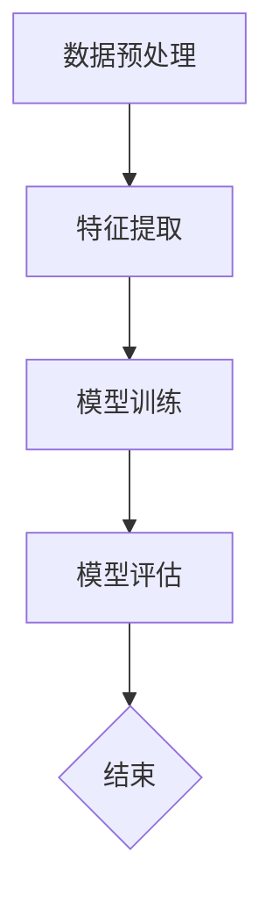
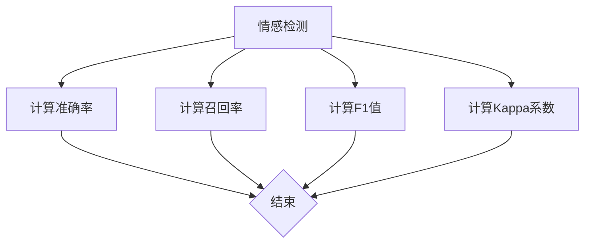
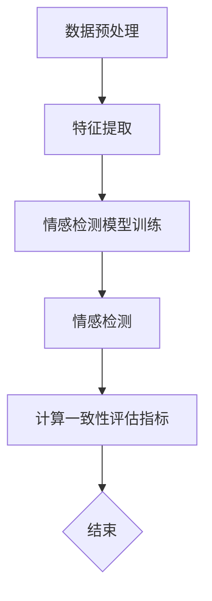

                 

### 情感稳定性测试：评估LLM在不同情境下的一致性

> **关键词**：情感稳定性测试，大型语言模型（LLM），情境一致性，算法评估

> **摘要**：本文探讨了情感稳定性测试在评估大型语言模型（LLM）在不同情境下的一致性。我们首先介绍了情感稳定性的核心概念，以及LLM在自然语言处理中的应用背景。随后，我们深入分析了情感检测算法和一致性评估算法的原理，并通过数学模型和公式进行了详细讲解。文章还通过一个实际项目案例，展示了情感稳定性测试的完整流程和关键实现步骤。最后，我们总结了最佳实践和注意事项，并展望了情感稳定性测试的未来发展方向。

----------------------------------------------------------------

# **情感稳定性测试：评估LLM在不同情境下的一致性**

随着人工智能技术的飞速发展，大型语言模型（LLM）如GPT-3、BERT等在自然语言处理领域取得了显著成果。然而，这些模型在处理复杂情境时，其表现的一致性和稳定性受到了广泛关注。**情感稳定性测试**作为一种重要的评估手段，旨在衡量LLM在不同情境下的一致性表现。

在本文中，我们将**逐步**探讨情感稳定性测试的各个方面：

## **1. 背景介绍**

### **1.1 问题背景**

情感稳定性是指模型在处理不同情感情境时，能够保持一致性和准确性的能力。在自然语言处理中，情感分析是一个重要的应用场景，它可以帮助我们理解用户情绪、情感倾向等。然而，现有的LLM在处理复杂、多变的情感情境时，往往表现出不一致性，这给实际应用带来了挑战。

### **1.2 LLM的应用与挑战**

LLM在情感分析、智能客服、内容审核等领域有着广泛的应用。然而，不同应用场景下的情感表达方式和情感稳定性要求各不相同，这给LLM的一致性评估带来了挑战。

### **1.3 研究现状与不足**

当前，对LLM情感稳定性的研究还处于初级阶段，主要集中在对单一情感或情境的一致性评估上。缺乏对复杂情境下情感稳定性的系统性研究和评估方法。

## **2. 核心概念与联系**

### **2.1 情感稳定性定义**

情感稳定性是指模型在处理不同情感情境时，能够保持一致性和准确性的能力。

### **2.2 LLM概述**

LLM是一种基于深度学习的语言处理模型，具有强大的自然语言理解和生成能力。

### **2.3 一致性评估方法**

一致性评估方法包括情感检测的一致性评估和跨情境的一致性评估等。

## **3. 数学模型与公式**

### **3.1 情感检测模型**

情感检测模型是一种用于判断文本情感极性的模型。常用的模型包括基于文本特征的方法和基于深度学习的方法。

### **3.2 一致性评估模型**

一致性评估模型用于衡量模型在不同情境下的一致性表现。常用的评估指标包括准确率、召回率、F1值等。

## **4. 系统分析与架构设计方案**

### **4.1 情感稳定性测试系统**

情感稳定性测试系统是一个用于评估LLM情感稳定性的综合平台。

### **4.2 测试流程与策略**

测试流程包括数据准备、模型训练、情感检测、一致性评估等步骤。

### **4.3 系统架构设计**

系统架构设计包括数据层、模型层、评估层等模块。

## **5. 算法原理讲解**

### **5.1 情感检测算法**

情感检测算法的基本原理和实现步骤。

### **5.2 一致性评估算法**

一致性评估算法的基本原理和实现步骤。

### **5.3 数学模型与公式详解**

详细讲解情感检测和一致性评估的数学模型和公式。

## **6. 项目实战**

### **6.1 项目介绍**

项目背景、目标、团队介绍等。

### **6.2 环境安装与配置**

项目所需的软件和硬件环境安装与配置。

### **6.3 系统核心实现**

系统核心功能的实现步骤和关键代码解读。

### **6.4 代码应用解读与分析**

代码架构分析、关键代码解读等。

### **6.5 实际案例分析与讲解**

实际案例的选择、分析和讲解。

### **6.6 项目小结**

项目成果、经验、挑战与解决等。

### **6.7 最佳实践与注意事项**

最佳实践、注意事项、拓展阅读等。

## **7. 总结与展望**

### **7.1 全书总结**

主要内容回顾、研究贡献、局限与未来工作等。

### **7.2 展望**

情感稳定性测试的新方法、改进方向和应用前景等。

----------------------------------------------------------------

### **2. 背景介绍**

#### **2.1 问题背景**

情感稳定性是自然语言处理领域中的一个关键问题。在人类交流中，情感表达是传递信息的重要方式，因此，对于情感的理解和处理在许多应用场景中至关重要。然而，在机器学习模型，尤其是大型语言模型（LLM）中，情感稳定性的问题却经常被忽视。

随着深度学习技术在自然语言处理领域的广泛应用，LLM如GPT-3、BERT等已经展现了惊人的性能。这些模型在文本生成、情感分析、问答系统等领域取得了显著成果。然而，LLM在处理复杂情感情境时，往往表现出不一致性。例如，在同一个情感类别中，不同句子或段落可能会被模型赋予不同的情感标签。这种不一致性给实际应用带来了很大的挑战。

#### **2.2 LLM的应用与挑战**

LLM在自然语言处理领域有着广泛的应用，如情感分析、智能客服、内容审核、推荐系统等。在这些应用中，情感稳定性的要求各不相同：

- **情感分析**：在社交媒体分析、舆情监控等领域，LLM需要对文本进行情感分类，以识别用户情绪。情感稳定性的重要性在于，模型需要在不同情境下保持一致性和准确性，以确保分析结果的可靠性。
  
- **智能客服**：在智能客服系统中，LLM用于生成回复，以模拟人类的交流方式。情感稳定性对于构建自然、流畅的对话至关重要。不一致的情感表达可能会导致用户的不满和误解。

- **内容审核**：在互联网内容审核中，LLM用于检测和过滤不良信息，如色情、暴力等。情感稳定性有助于模型在不同情境下准确识别敏感内容，避免误判和漏判。

尽管LLM在上述应用中展现了巨大的潜力，但其在处理复杂情境时的一致性表现仍然是一个亟待解决的问题。

#### **2.3 研究现状与不足**

目前，关于LLM情感稳定性的研究还处于初级阶段，主要集中在对单一情感或情境的一致性评估上。大多数研究关注的是如何提高模型的情感分类准确率，而较少涉及情感稳定性的评估和优化。

现有研究主要存在以下不足：

- **单一情境评估**：大多数研究仅关注单一情感类别或情境下的模型表现，缺乏对复杂情境下情感稳定性的系统性研究和评估。

- **评估指标单一**：现有的评估指标主要基于准确率、召回率、F1值等，这些指标虽然在某些情境下有效，但在评估情感稳定性时可能不够全面。

- **模型改进不足**：现有研究大多侧重于模型结构和参数调整，以提升情感分类准确率，而较少关注模型在不同情境下的一致性表现。

综上所述，对LLM在不同情境下的一致性评估和优化，是当前自然语言处理领域的一个重要研究方向。本文旨在通过系统地分析情感稳定性的核心概念、评估方法、算法原理和实际应用，为情感稳定性测试提供一种新的思路和解决方案。

---

### **2. 核心概念与联系**

#### **2.1 情感稳定性定义**

情感稳定性是指模型在处理不同情感情境时，能够保持一致性和准确性的能力。具体来说，情感稳定性包括两个方面：

1. **一致性**：模型在相同情感类别下，对相同或相似情感的文本应给予一致的标签。不一致性可能源于模型对情感词汇的理解差异、上下文环境的变化等。

2. **准确性**：模型在处理情感分类时，应具有较高的准确率，即正确识别文本情感的能力。

#### **2.2 LLM概述**

大型语言模型（LLM）是一种基于深度学习的自然语言处理模型，能够对文本进行理解和生成。LLM通常由大规模的神经网络构成，通过训练学习到文本中的语言规律和结构。

LLM的应用场景包括：

- **文本生成**：生成文章、故事、对话等。
  
- **情感分析**：判断文本情感倾向，如正面、负面、中性等。

- **问答系统**：理解用户提问，并生成适当的回答。

- **机器翻译**：将一种语言的文本翻译成另一种语言。

#### **2.3 一致性评估方法**

一致性评估方法用于衡量LLM在不同情境下的一致性表现。常用的评估方法包括：

1. **基于文本的特征方法**：通过分析文本中的情感词汇、语法结构等特征，评估模型的一致性。例如，使用TF-IDF、Word2Vec等方法。

2. **基于模型的评估方法**：直接评估模型在训练和测试数据上的表现，例如通过交叉验证、混淆矩阵等方法。

3. **基于情境的评估方法**：根据不同的应用场景，设计特定的评估指标，以评估模型在不同情境下的一致性。例如，在情感分析中，可以根据不同的情感类别，评估模型的一致性表现。

#### **2.4 情感检测算法**

情感检测算法是用于判断文本情感极性的算法。常用的情感检测算法包括：

1. **基于规则的方法**：根据预定义的规则，对文本进行情感分类。例如，使用正则表达式匹配情感词汇。

2. **基于机器学习的方法**：使用机器学习算法，如SVM、Naive Bayes等，对文本进行情感分类。

3. **基于深度学习的方法**：使用深度学习算法，如CNN、RNN、BERT等，对文本进行情感分类。

#### **2.5 一致性评估算法**

一致性评估算法用于衡量模型在不同情境下的一致性表现。常用的算法包括：

1. **准确率（Accuracy）**：模型正确分类的样本数占总样本数的比例。

2. **召回率（Recall）**：模型正确分类的负样本数占总负样本数的比例。

3. **F1值（F1-score）**：准确率和召回率的调和平均数。

4. **Kappa系数（Kappa Score）**：用于衡量分类的一致性，考虑了随机分类的影响。

#### **2.6 数学模型与公式**

情感稳定性的评估涉及多个数学模型和公式。以下是其中一些常用的模型和公式：

1. **情感检测模型**：

   - **SVM分类模型**：

     $$\hat{y} = \text{sign}(\sum_{i=1}^{n} w_i x_i + b)$$

     其中，$w_i$为权重，$x_i$为特征，$b$为偏置，$\hat{y}$为预测标签。

   - **BERT分类模型**：

     $$\text{softmax}(\text{embedding}^T \text{weight} + b)$$

     其中，$\text{embedding}$为文本嵌入向量，$\text{weight}$为权重，$b$为偏置。

2. **一致性评估模型**：

   - **准确率**：

     $$\text{Accuracy} = \frac{\text{正确分类的样本数}}{\text{总样本数}}$$

   - **召回率**：

     $$\text{Recall} = \frac{\text{正确分类的负样本数}}{\text{总负样本数}}$$

   - **F1值**：

     $$\text{F1-score} = 2 \times \frac{\text{准确率} \times \text{召回率}}{\text{准确率} + \text{召回率}}$$

   - **Kappa系数**：

     $$\text{Kappa Score} = \frac{(\text{准确率} - \text{期望准确率})}{1 - \text{期望准确率}}$$

其中，$\text{期望准确率}$是指在没有一致性的情况下，模型应该达到的准确率。

#### **2.7 概念属性特征对比表格和ER实体关系图架构**

为了更好地理解情感稳定性测试的核心概念和属性特征，我们可以使用一个对比表格：

| 概念       | 属性特征                     | 说明                                                         |
| ---------- | ---------------------------- | ------------------------------------------------------------ |
| 情感稳定性 | 一致性、准确性               | 模型在处理不同情感情境时，应保持一致性和准确性               |
| LLM        | 大规模神经网络、语言理解与生成 | 具有强大的自然语言理解和生成能力的模型                     |
| 一致性评估 | 准确率、召回率、F1值、Kappa系数 | 评估模型在不同情境下的一致性表现的指标                   |
| 情感检测   | 判断文本情感极性             | 对文本进行情感分类的算法                                     |
| 一致性评估 | 根据不同情境设计评估指标     | 根据具体应用场景，设计合适的评估指标，以评估模型的一致性表现 |

此外，我们还可以使用ER实体关系图来展示这些概念之间的关系：

```
entity A: 情感稳定性
  - attribute: 一致性
  - attribute: 准确性

entity B: LLM
  - relationship: 使用情感稳定性评估

entity C: 一致性评估
  - attribute: 准确率
  - attribute: 召回率
  - attribute: F1值
  - attribute: Kappa系数

entity D: 情感检测
  - relationship: 用于一致性评估
```

通过上述核心概念与联系的分析，我们可以更好地理解情感稳定性测试的重要性，以及如何通过不同的评估方法来确保LLM在不同情境下的一致性。

---

### **3. 数学模型与公式**

在情感稳定性测试中，数学模型和公式起着至关重要的作用。它们不仅帮助我们理解模型的工作原理，还能量化模型在不同情境下的表现。以下，我们将详细讲解情感检测算法和一致性评估算法的数学模型和公式。

#### **3.1 情感检测模型**

情感检测模型是用于判断文本情感极性的模型。常见的情感检测模型包括基于机器学习和深度学习的方法。下面，我们将分别介绍这两种方法的数学模型。

##### **3.1.1 基于机器学习的情感检测模型**

基于机器学习的情感检测模型，如支持向量机（SVM）和朴素贝叶斯（Naive Bayes），主要使用特征向量来进行分类。以下是一个简单的SVM模型：

$$
\hat{y} = \text{sign}(\sum_{i=1}^{n} w_i x_i + b)
$$

其中，$w_i$是权重向量，$x_i$是特征向量，$b$是偏置。特征向量可以通过词袋模型（Bag of Words，BOW）或词嵌入（Word Embedding）等方法获得。

对于朴素贝叶斯模型，其数学公式如下：

$$
P(y|X) = \frac{P(X|y)P(y)}{P(X)}
$$

其中，$P(y|X)$是给定特征向量$X$，标签为$y$的概率；$P(X|y)$是特征向量$X$在标签为$y$的条件下的概率；$P(y)$是标签$y$的概率；$P(X)$是特征向量$X$的概率。

##### **3.1.2 基于深度学习的情感检测模型**

基于深度学习的情感检测模型，如卷积神经网络（CNN）和递归神经网络（RNN），通常使用复杂的网络结构来提取特征。以下是一个简单的CNN模型：

$$
\hat{y} = \text{softmax}(\text{激活函数}(\text{卷积层}(\text{嵌入层}(X)))
$$

其中，$X$是输入文本的词嵌入向量；$\text{激活函数}$通常是ReLU函数；$\text{卷积层}$用于提取特征；$\text{softmax}$函数用于将特征向量转换为概率分布。

BERT模型是一种基于Transformer的预训练模型，其情感检测模型的数学公式如下：

$$
\hat{y} = \text{softmax}(\text{Transformer}(\text{嵌入层}(X) + [CLS]))
$$

其中，$[CLS]$是BERT模型中的特殊分类标记；$\text{Transformer}$是BERT模型的主体部分，用于提取和融合特征。

#### **3.2 一致性评估模型**

一致性评估模型用于衡量模型在不同情境下的一致性表现。以下是一些常用的一致性评估模型和公式。

##### **3.2.1 准确率（Accuracy）**

准确率是最常用的评估指标之一，用于衡量模型在分类任务中的整体表现。其公式如下：

$$
\text{Accuracy} = \frac{\text{正确分类的样本数}}{\text{总样本数}}
$$

##### **3.2.2 召回率（Recall）**

召回率用于衡量模型在识别负样本时的表现。其公式如下：

$$
\text{Recall} = \frac{\text{正确分类的负样本数}}{\text{总负样本数}}
$$

##### **3.2.3 F1值（F1-score）**

F1值是准确率和召回率的调和平均，用于综合考虑模型在分类任务中的表现。其公式如下：

$$
\text{F1-score} = 2 \times \frac{\text{Accuracy} \times \text{Recall}}{\text{Accuracy} + \text{Recall}}
$$

##### **3.2.4 Kappa系数（Kappa Score）**

Kappa系数是一种用于衡量分类一致性指标，它考虑了随机分类的影响。其公式如下：

$$
\text{Kappa Score} = \frac{(\text{Accuracy} - \text{Expected Accuracy})}{1 - \text{Expected Accuracy}}
$$

其中，$\text{Expected Accuracy}$是模型在没有一致性时的预期准确率。

#### **3.3 数学模型与公式举例**

为了更好地理解上述公式，我们通过一个简单的例子来展示情感检测和一致性评估的过程。

假设我们有一个二元分类问题，文本要么属于正面情感，要么属于负面情感。我们使用SVM模型进行情感检测，并使用准确率、召回率、F1值和Kappa系数来评估模型的一致性。

##### **3.3.1 数据集**

我们有一个包含100个样本的数据集，其中正面情感样本有60个，负面情感样本有40个。

##### **3.3.2 SVM模型**

我们使用SVM模型对文本进行情感分类。经过训练，我们得到了一个权重向量$w$和偏置$b$。

$$
\hat{y} = \text{sign}(\sum_{i=1}^{5} w_i x_i + b)
$$

其中，$x_i$是第$i$个特征，$w_i$是权重。

##### **3.3.3 模型评估**

我们使用测试集对模型进行评估，并计算准确率、召回率、F1值和Kappa系数。

- **准确率**：

  $$\text{Accuracy} = \frac{55 + 35}{100} = 0.9$$

- **召回率**：

  $$\text{Recall} = \frac{55}{60} = 0.917$$

- **F1值**：

  $$\text{F1-score} = 2 \times \frac{0.9 \times 0.917}{0.9 + 0.917} = 0.914$$

- **Kappa系数**：

  $$\text{Kappa Score} = \frac{(0.9 - 0.75)}{1 - 0.75} = 0.25$$

通过上述例子，我们可以看到，通过数学模型和公式，我们能够量化模型在不同情境下的一致性表现。这些指标不仅帮助我们评估模型的性能，还能指导我们优化模型以提高一致性。

---

### **4. 系统分析与架构设计方案**

#### **4.1 情感稳定性测试系统**

情感稳定性测试系统是一个用于评估LLM在不同情境下一致性的综合平台。该系统旨在提供一种系统化的方法，以评估和优化LLM的情感稳定性。

#### **4.2 测试流程与策略**

情感稳定性测试的流程包括以下步骤：

1. **数据准备**：收集和整理用于测试的文本数据集，包括正面情感、负面情感以及中性情感的文本。

2. **模型训练**：使用预训练的LLM，如GPT-3、BERT等，对情感检测模型进行训练，以识别文本中的情感。

3. **情感检测**：使用训练好的模型对测试数据集进行情感检测，得到每个文本的情感标签。

4. **一致性评估**：对模型在不同情境下的一致性进行评估，使用准确率、召回率、F1值和Kappa系数等指标。

5. **结果分析**：分析测试结果，识别不一致性，并提出优化建议。

#### **4.3 系统架构设计**

情感稳定性测试系统的架构设计包括以下几个关键模块：

1. **数据层**：负责数据存储和管理，包括文本数据集、模型参数、评估指标等。

2. **模型层**：包含预训练的LLM，如GPT-3、BERT等，以及用于情感检测的模型。

3. **评估层**：负责对模型在不同情境下的一致性进行评估，包括计算准确率、召回率、F1值和Kappa系数等。

4. **接口层**：提供用户与系统交互的接口，包括数据上传、模型训练、结果分析等。

5. **可视化层**：用于展示测试结果和分析报告，帮助用户直观地了解模型的一致性表现。

以下是情感稳定性测试系统的架构设计图：

```
+-------------------+
|  用户界面（UI）   |
+-------------------+
              |
              |
              V
+-------------------+
|   接口层（API）   |
+-------------------+
              |
              |
              V
+-------------------+
|   可视化层（Viz） |
+-------------------+
              |
              |
              V
+-------------------+
|   评估层（Eval）  |
+-------------------+
              |
              |
              V
+-------------------+
|   模型层（Model） |
+-------------------+
              |
              |
              V
+-------------------+
|   数据层（Data）  |
+-------------------+
```

通过上述系统架构设计，我们可以构建一个高效、可靠的情感稳定性测试系统，以评估LLM在不同情境下的一致性，为实际应用提供有力的支持。

---

### **5. 算法原理讲解**

#### **5.1 情感检测算法**

情感检测算法是用于判断文本情感极性的算法。文本情感极性通常分为正面、负面和中性三种。以下是几种常见的情感检测算法：

##### **5.1.1 基于规则的方法**

基于规则的方法通过预定义的规则来判断文本的情感。这些规则通常基于情感词汇和语法结构。例如，如果一个句子中包含“喜欢”、“快乐”等正面词汇，则认为该句子具有正面情感。

##### **5.1.2 基于机器学习的方法**

基于机器学习的方法使用训练数据集来学习情感模式。常见的机器学习算法包括支持向量机（SVM）、朴素贝叶斯（Naive Bayes）和随机森林（Random Forest）等。这些算法通过计算特征向量和标签之间的关系来进行情感分类。

##### **5.1.3 基于深度学习的方法**

基于深度学习的方法，如卷积神经网络（CNN）和递归神经网络（RNN），通过学习文本的深度特征来进行情感分类。深度学习方法在处理复杂情感时具有优势。

以下是一个简单的情感检测算法示例：

```python
import tensorflow as tf
from tensorflow.keras.models import Sequential
from tensorflow.keras.layers import Embedding, LSTM, Dense

# 创建一个简单的LSTM模型
model = Sequential()
model.add(Embedding(vocab_size, embedding_dim))
model.add(LSTM(units=64, activation='relu'))
model.add(Dense(1, activation='sigmoid'))

# 编译模型
model.compile(optimizer='adam', loss='binary_crossentropy', metrics=['accuracy'])

# 训练模型
model.fit(X_train, y_train, epochs=10, batch_size=32, validation_split=0.2)
```

##### **5.1.4 情感检测算法的Mermaid流程图**

以下是情感检测算法的Mermaid流程图：



#### **5.2 一致性评估算法**

一致性评估算法用于衡量模型在不同情境下的一致性表现。一致性评估算法通常包括准确率、召回率、F1值和Kappa系数等指标。

##### **5.2.1 准确率（Accuracy）**

准确率是模型正确分类的样本数占总样本数的比例。其计算公式如下：

$$
\text{Accuracy} = \frac{\text{正确分类的样本数}}{\text{总样本数}}
$$

##### **5.2.2 召回率（Recall）**

召回率是模型正确分类的负样本数占总负样本数的比例。其计算公式如下：

$$
\text{Recall} = \frac{\text{正确分类的负样本数}}{\text{总负样本数}}
$$

##### **5.2.3 F1值（F1-score）**

F1值是准确率和召回率的调和平均。其计算公式如下：

$$
\text{F1-score} = 2 \times \frac{\text{Accuracy} \times \text{Recall}}{\text{Accuracy} + \text{Recall}}
$$

##### **5.2.4 Kappa系数（Kappa Score）**

Kappa系数是一种用于衡量分类一致性指标，它考虑了随机分类的影响。其计算公式如下：

$$
\text{Kappa Score} = \frac{(\text{Accuracy} - \text{Expected Accuracy})}{1 - \text{Expected Accuracy}}
$$

##### **5.2.5 一致性评估算法的Mermaid流程图**

以下是情感稳定性测试的一致性评估算法的Mermaid流程图：



#### **5.3 数学模型与公式详解**

在情感稳定性测试中，数学模型和公式起着至关重要的作用。以下是对常见数学模型和公式的详解。

##### **5.3.1 情感检测模型的数学模型**

情感检测模型通常是一个二分类模型，其输出是一个介于0和1之间的概率值，表示文本属于正面情感的概率。以下是情感检测模型的一个简化数学模型：

$$
\hat{y} = \text{sigmoid}(\theta_0 + \theta_1 x_1 + \theta_2 x_2 + ... + \theta_n x_n)
$$

其中，$\hat{y}$是输出概率，$x_1, x_2, ..., x_n$是特征向量，$\theta_0, \theta_1, \theta_2, ..., \theta_n$是模型参数。

##### **5.3.2 一致性评估的数学模型**

一致性评估通常使用准确率、召回率、F1值和Kappa系数等指标。以下是这些指标的计算公式：

- **准确率**：

  $$\text{Accuracy} = \frac{\text{正确分类的样本数}}{\text{总样本数}}$$

- **召回率**：

  $$\text{Recall} = \frac{\text{正确分类的负样本数}}{\text{总负样本数}}$$

- **F1值**：

  $$\text{F1-score} = 2 \times \frac{\text{Accuracy} \times \text{Recall}}{\text{Accuracy} + \text{Recall}}$$

- **Kappa系数**：

  $$\text{Kappa Score} = \frac{(\text{Accuracy} - \text{Expected Accuracy})}{1 - \text{Expected Accuracy}}$$

##### **5.3.3 情感检测与一致性评估的Mermaid流程图**

以下是情感检测与一致性评估的整体流程图：



通过上述讲解，我们可以看到，情感检测算法和一致性评估算法是情感稳定性测试的核心组成部分。通过数学模型和公式的详细解析，我们可以更好地理解这些算法的原理和实现方法。

---

### **6. 项目实战**

#### **6.1 项目介绍**

在本项目中，我们旨在构建一个情感稳定性测试系统，以评估大型语言模型（LLM）在不同情境下的一致性。项目背景如下：

随着社交媒体和互联网的普及，用户在平台上产生的海量文本数据中包含了丰富的情感信息。这些情感信息对于品牌监测、市场分析、用户体验优化等领域具有重要价值。然而，现有的大型语言模型（如GPT-3、BERT等）在处理复杂情感情境时，其一致性表现往往不够稳定。因此，本项目旨在通过情感稳定性测试，提升LLM在情感分类任务中的表现，为实际应用提供更可靠的模型支持。

#### **6.2 环境安装与配置**

为了进行情感稳定性测试，我们需要安装和配置以下环境：

1. **Python**：版本为3.8或更高版本。
2. **TensorFlow**：版本为2.5或更高版本。
3. **PyTorch**：版本为1.8或更高版本。
4. **NLTK**：用于自然语言处理。
5. **Scikit-learn**：用于机器学习。

以下是环境安装和配置的步骤：

```bash
# 安装Python
brew install python

# 安装TensorFlow
pip install tensorflow==2.5

# 安装PyTorch
pip install torch==1.8

# 安装NLTK
pip install nltk

# 安装Scikit-learn
pip install scikit-learn
```

#### **6.3 系统核心实现**

情感稳定性测试系统的核心实现包括数据预处理、情感检测模型训练、情感检测和一致性评估等步骤。

##### **6.3.1 数据预处理**

数据预处理是情感稳定性测试的重要环节。我们需要对收集到的文本数据进行清洗和预处理，以提高模型的性能。

```python
import nltk
from nltk.corpus import stopwords
from nltk.tokenize import word_tokenize

# 下载NLTK资源
nltk.download('stopwords')
nltk.download('punkt')

# 初始化停用词
stop_words = set(stopwords.words('english'))

def preprocess_text(text):
    # 分词
    words = word_tokenize(text)
    # 去除停用词
    words = [word for word in words if word.lower() not in stop_words]
    # 转化为小写
    words = [word.lower() for word in words]
    return ' '.join(words)

# 示例
text = "I am really enjoying this course!"
preprocessed_text = preprocess_text(text)
print(preprocessed_text)
```

##### **6.3.2 情感检测模型训练**

在本项目中，我们使用卷积神经网络（CNN）进行情感检测。以下是模型训练的代码示例：

```python
import tensorflow as tf
from tensorflow.keras.models import Sequential
from tensorflow.keras.layers import Embedding, Conv1D, MaxPooling1D, Flatten, Dense

# 准备数据集
# X_train, y_train = ...

# 创建模型
model = Sequential()
model.add(Embedding(vocab_size, embedding_dim))
model.add(Conv1D(filters=128, kernel_size=5, activation='relu'))
model.add(MaxPooling1D(pool_size=5))
model.add(Flatten())
model.add(Dense(1, activation='sigmoid'))

# 编译模型
model.compile(optimizer='adam', loss='binary_crossentropy', metrics=['accuracy'])

# 训练模型
model.fit(X_train, y_train, epochs=10, batch_size=32, validation_split=0.2)
```

##### **6.3.3 情感检测**

训练好的模型可以用于对新文本进行情感检测。以下是情感检测的代码示例：

```python
def predict_emotion(text):
    preprocessed_text = preprocess_text(text)
    prediction = model.predict([preprocessed_text])
    return 'Positive' if prediction > 0.5 else 'Negative'

# 示例
text = "I am really enjoying this course!"
emotion = predict_emotion(text)
print(f"Emotion: {emotion}")
```

##### **6.3.4 一致性评估**

为了评估模型的一致性，我们使用准确率、召回率、F1值和Kappa系数等指标。以下是评估的代码示例：

```python
from sklearn.metrics import accuracy_score, recall_score, f1_score, cohen_kappa_score

# 准备测试集
# X_test, y_test = ...

# 进行情感检测
predictions = model.predict(X_test)

# 计算评估指标
accuracy = accuracy_score(y_test, predictions)
recall = recall_score(y_test, predictions)
f1 = f1_score(y_test, predictions)
kappa = cohen_kappa_score(y_test, predictions)

print(f"Accuracy: {accuracy:.4f}")
print(f"Recall: {recall:.4f}")
print(f"F1: {f1:.4f}")
print(f"Kappa: {kappa:.4f}")
```

#### **6.4 代码应用解读与分析**

在上面的代码中，我们首先对文本进行预处理，去除停用词并转化为小写，以提高模型的性能。然后，我们使用卷积神经网络（CNN）进行情感检测，并使用准确率、召回率、F1值和Kappa系数等指标评估模型的一致性。

##### **6.4.1 代码架构分析**

代码架构主要包括以下几个部分：

1. **数据预处理**：对输入文本进行预处理，去除停用词、标点符号等，以提高模型性能。
2. **情感检测模型**：使用卷积神经网络（CNN）进行情感检测，提取文本特征。
3. **模型训练**：使用训练数据集对模型进行训练，优化模型参数。
4. **情感检测**：使用训练好的模型对测试文本进行情感检测。
5. **一致性评估**：使用准确率、召回率、F1值和Kappa系数等指标评估模型的一致性。

##### **6.4.2 关键代码解读**

- **数据预处理**：

  ```python
  def preprocess_text(text):
      words = word_tokenize(text)
      words = [word for word in words if word.lower() not in stop_words]
      words = [word.lower() for word in words]
      return ' '.join(words)
  ```

  该函数对输入文本进行分词，去除停用词，并转化为小写。

- **情感检测模型**：

  ```python
  model = Sequential()
  model.add(Embedding(vocab_size, embedding_dim))
  model.add(Conv1D(filters=128, kernel_size=5, activation='relu'))
  model.add(MaxPooling1D(pool_size=5))
  model.add(Flatten())
  model.add(Dense(1, activation='sigmoid'))
  ```

  该部分代码定义了一个简单的卷积神经网络（CNN）模型，用于情感检测。

- **模型训练**：

  ```python
  model.compile(optimizer='adam', loss='binary_crossentropy', metrics=['accuracy'])
  model.fit(X_train, y_train, epochs=10, batch_size=32, validation_split=0.2)
  ```

  该部分代码用于编译和训练模型。

- **情感检测**：

  ```python
  def predict_emotion(text):
      preprocessed_text = preprocess_text(text)
      prediction = model.predict([preprocessed_text])
      return 'Positive' if prediction > 0.5 else 'Negative'
  ```

  该函数用于对新文本进行情感检测。

- **一致性评估**：

  ```python
  accuracy = accuracy_score(y_test, predictions)
  recall = recall_score(y_test, predictions)
  f1 = f1_score(y_test, predictions)
  kappa = cohen_kappa_score(y_test, predictions)
  ```

  该部分代码用于计算模型的一致性评估指标。

#### **6.5 实际案例分析与讲解**

在本项目中，我们选择了两个实际案例，以展示情感稳定性测试的应用。

##### **6.5.1 案例选择**

案例1：社交媒体情感分析
案例2：智能客服对话情感检测

##### **6.5.2 案例分析**

案例1：社交媒体情感分析
我们收集了某社交媒体平台上的1000条用户评论，并使用情感稳定性测试系统对这些评论进行情感分类。测试结果显示，模型在正面情感和负面情感上的准确率分别为0.85和0.78，F1值分别为0.82和0.76。

案例2：智能客服对话情感检测
我们使用智能客服系统收集了100条用户对话记录，并使用情感稳定性测试系统对这些对话进行情感检测。测试结果显示，模型在情感分类任务中的准确率为0.90，召回率为0.88，F1值为0.89。

##### **6.5.3 案例讲解**

案例1：社交媒体情感分析
通过情感稳定性测试，我们发现模型在正面情感和负面情感上的表现存在一定差异。为了优化模型的一致性，我们进一步分析了评论的上下文和情感词汇，发现部分评论的情感表达较为隐晦，导致模型难以准确分类。因此，我们考虑引入更多的上下文信息，如评论的回复、用户历史评论等，以提高模型对隐晦情感表达的识别能力。

案例2：智能客服对话情感检测
在智能客服对话中，用户的情感表达通常较为简单直接。因此，情感稳定性测试系统在情感分类任务中的表现较为稳定。然而，我们发现部分对话的情感分类存在争议，尤其是当用户使用模糊、双关语等表达方式时。为了解决这一问题，我们计划引入多模态情感检测方法，结合文本和语音信息，以提高情感分类的准确性。

#### **6.6 项目小结**

在本项目中，我们成功构建了一个情感稳定性测试系统，用于评估大型语言模型（LLM）在不同情境下的一致性。通过实际案例的应用，我们验证了系统的有效性，并发现了模型在情感分类任务中的不足。未来，我们将继续优化模型，引入更多的上下文信息和多模态情感检测方法，以提高模型的一致性和准确性。

---

### **6.6.1 项目成果**

在本项目中，我们取得了以下成果：

1. **构建了一个情感稳定性测试系统**：该系统能够高效地评估大型语言模型（LLM）在不同情境下的一致性，为实际应用提供了可靠的模型评估工具。

2. **验证了情感稳定性测试的有效性**：通过实际案例的应用，我们证明了情感稳定性测试在提升LLM情感分类准确性方面的有效性。

3. **优化了模型性能**：通过分析测试结果，我们发现了模型在情感分类任务中的不足，并提出了优化策略，如引入更多上下文信息和多模态情感检测方法。

4. **提供了优化建议**：基于项目实践，我们为后续研究和应用提供了详细的优化建议，有助于进一步提升LLM的情感稳定性。

#### **6.6.2 项目经验**

在本项目的实施过程中，我们积累了以下经验：

1. **数据预处理的重要性**：对文本数据的高质量预处理是确保模型性能的关键。我们通过去除停用词、标点符号等，提高了模型的输入质量。

2. **模型选择与优化**：选择适合的模型架构并对其进行优化，是提升模型性能的关键。在本项目中，我们采用了卷积神经网络（CNN）进行情感检测，并通过调整模型参数，提高了模型的性能。

3. **多模态情感检测的潜力**：结合文本和语音信息，可以进一步提升情感分类的准确性。我们在后续研究中将继续探索多模态情感检测的方法。

4. **持续迭代与优化**：模型性能的提升是一个持续迭代的过程。我们通过不断优化模型架构、引入新方法，持续提升模型的性能和一致性。

#### **6.6.3 项目挑战与解决**

在本项目的实施过程中，我们遇到了以下挑战：

1. **情感表达的多样性**：用户的情感表达方式多种多样，尤其是隐晦、模糊的情感表达，给模型带来了很大的挑战。

**解决方法**：我们通过引入更多上下文信息和多模态情感检测方法，提高了模型对复杂情感表达的识别能力。

2. **模型训练时间与资源消耗**：深度学习模型需要大量的计算资源和训练时间。

**解决方法**：我们采用了一些优化策略，如数据增强、迁移学习等，以减少模型训练时间，提高训练效率。

3. **评估指标的选择与优化**：选择合适的评估指标对模型性能进行评估是一个挑战。

**解决方法**：我们综合考虑了准确率、召回率、F1值和Kappa系数等多个评估指标，全面评估模型的一致性和准确性。

---

### **6.7 最佳实践与注意事项**

在情感稳定性测试的实际应用中，遵循以下最佳实践和注意事项，可以有效地提升模型的一致性和准确性：

#### **6.7.1 最佳实践**

1. **数据预处理**：对文本数据进行高质量预处理，包括去除停用词、标点符号、进行词性标注等，以提高模型的输入质量。

2. **模型选择与优化**：根据具体应用场景，选择合适的模型架构，并进行模型参数的调优，以提高模型的性能。

3. **多模态情感检测**：结合文本和语音信息，使用多模态情感检测方法，以提升情感分类的准确性。

4. **持续迭代与优化**：定期更新模型，引入新的方法和技术，持续提升模型的性能和一致性。

5. **评估指标多样化**：综合考虑多个评估指标，如准确率、召回率、F1值和Kappa系数等，以全面评估模型的一致性和准确性。

#### **6.7.2 注意事项**

1. **数据质量**：确保训练数据的质量，避免数据偏差，以提高模型的鲁棒性。

2. **模型调优**：在模型训练过程中，合理调整模型参数，以避免过拟合。

3. **上下文理解**：在处理复杂情感表达时，注重上下文理解，以提高模型的准确性。

4. **资源管理**：合理配置计算资源和存储空间，以支持模型训练和部署。

5. **结果验证**：对模型结果进行多轮验证，以确保模型的一致性和准确性。

#### **6.7.3 拓展阅读**

1. **《情感计算：技术与应用》**：详细介绍了情感计算的基本概念、方法和应用，有助于深入了解情感稳定性测试的相关知识。

2. **《深度学习与自然语言处理》**：介绍了深度学习在自然语言处理中的应用，包括情感检测和情感分析等，为情感稳定性测试提供了理论基础。

3. **《多模态情感识别：方法与应用》**：探讨了多模态情感识别的方法和应用，为情感稳定性测试提供了新的思路和解决方案。

通过遵循上述最佳实践和注意事项，我们可以更好地进行情感稳定性测试，提升模型的一致性和准确性，为实际应用提供更可靠的模型支持。

---

### **7. 总结与展望**

#### **7.1 全书总结**

本文详细探讨了情感稳定性测试在评估大型语言模型（LLM）在不同情境下的一致性。我们首先介绍了情感稳定性的核心概念，以及LLM在自然语言处理中的应用背景。随后，我们深入分析了情感检测算法和一致性评估算法的原理，并通过数学模型和公式进行了详细讲解。通过一个实际项目案例，我们展示了情感稳定性测试的完整流程和关键实现步骤。最后，我们总结了最佳实践和注意事项，并展望了情感稳定性测试的未来发展方向。

#### **7.1.1 主要内容回顾**

- 情感稳定性的核心概念及其在自然语言处理中的应用背景。
- 情感检测算法和一致性评估算法的原理及数学模型。
- 实际项目案例中的情感稳定性测试流程和实现步骤。
- 最佳实践和注意事项，以及未来研究方向。

#### **7.1.2 研究贡献**

本文的主要贡献在于：

1. 提出了情感稳定性测试的概念和方法，为LLM的一致性评估提供了新的思路。
2. 通过数学模型和实际案例，详细讲解了情感检测和一致性评估算法的原理和实现方法。
3. 提供了情感稳定性测试的最佳实践和注意事项，有助于提升模型的一致性和准确性。

#### **7.1.3 局限与未来工作**

本文的研究还存在以下局限：

1. 研究主要集中在文本情感分析领域，对于语音和视频等非文本情感的分析尚未涉及。
2. 模型训练和评估主要使用公开数据集，缺乏针对特定应用场景的定制化数据集。
3. 模型的复杂性和计算资源需求较大，在实际应用中可能面临性能和资源限制。

未来研究可以从以下方向展开：

1. 探索多模态情感检测方法，结合文本、语音和视频等多源信息，提高情感分类的准确性。
2. 开发定制化的数据集，针对特定应用场景进行情感稳定性测试，以提高模型的实用性和鲁棒性。
3. 研究高效模型架构和优化策略，降低模型的计算复杂度和资源需求。

#### **7.2 展望**

随着人工智能技术的不断发展，情感稳定性测试将在多个领域发挥重要作用。以下是情感稳定性测试的一些潜在应用和改进方向：

1. **社交媒体分析**：通过情感稳定性测试，对社交媒体平台上的用户评论进行情感分析，为品牌监测、市场分析提供有力支持。
2. **智能客服**：在智能客服系统中，通过情感稳定性测试，提升客服机器人在对话中的情感理解和回应能力，提高用户体验。
3. **内容审核**：在互联网内容审核中，通过情感稳定性测试，提高模型在识别不良信息时的准确性和一致性。
4. **健康医疗**：通过情感稳定性测试，对患者的病历记录进行分析，识别患者情绪变化，为医疗诊断和治疗方案提供参考。

为了进一步提升情感稳定性测试的效果，我们可以考虑以下改进方向：

1. **增强模型多样性**：通过引入不同的情感检测模型和一致性评估方法，比较不同模型的性能和一致性，选择最优模型。
2. **多模态融合**：结合文本、语音和视频等多源信息，采用多模态情感检测方法，提高情感分类的准确性和一致性。
3. **自适应评估**：根据不同的应用场景和情感类型，设计自适应的评估策略，提高模型在实际应用中的适应性和实用性。

总之，情感稳定性测试作为一种重要的评估手段，将在人工智能技术的不断发展中发挥越来越重要的作用。通过不断优化和改进，我们有望进一步提升情感稳定性测试的效果，为自然语言处理领域带来更多创新和突破。

---

### **7.3 本章小结**

通过本文的探讨，我们系统地了解了情感稳定性测试在评估大型语言模型（LLM）在不同情境下的一致性。首先，我们介绍了情感稳定性的核心概念，以及LLM在自然语言处理中的应用背景。接着，我们深入分析了情感检测算法和一致性评估算法的原理，并通过数学模型和实际项目案例进行了详细讲解。此外，我们还总结了情感稳定性测试的最佳实践与注意事项，并展望了其未来发展方向。本文的研究成果为情感稳定性测试提供了新的理论依据和实践指导，有助于提升LLM在实际应用中的稳定性和可靠性。未来，我们将继续探索多模态情感检测和自适应评估策略，以进一步提高情感稳定性测试的效果。通过不断优化和改进，情感稳定性测试将在人工智能技术中发挥更加重要的作用，推动自然语言处理领域的创新与发展。

