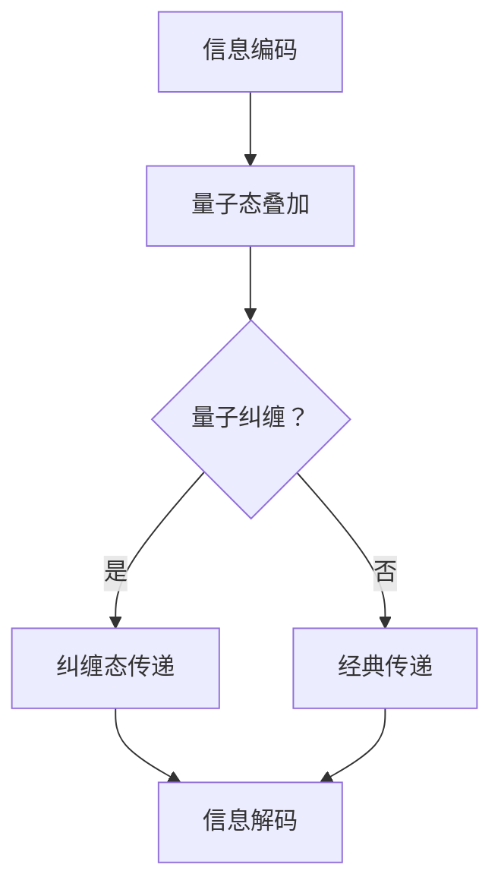
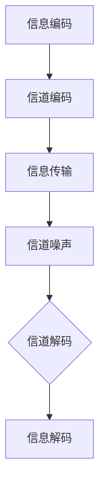
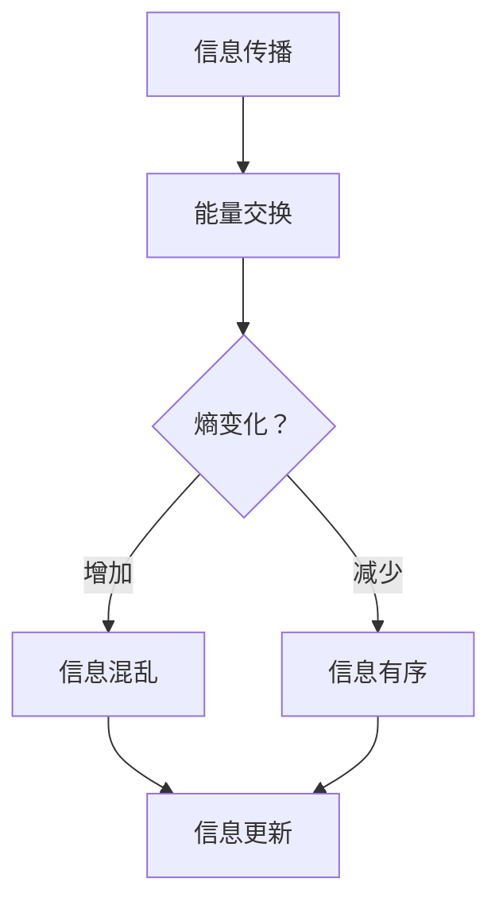
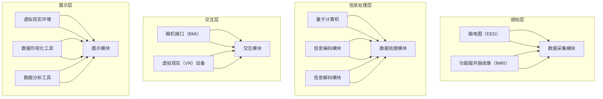
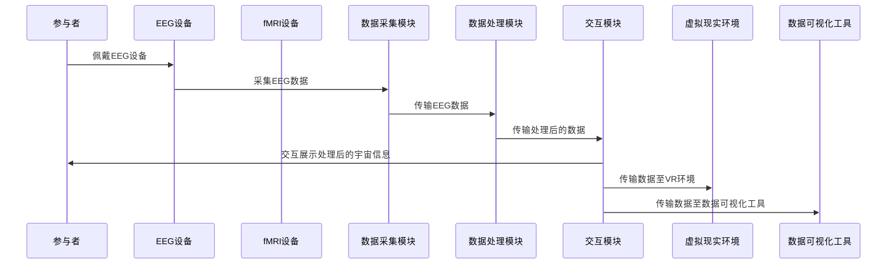

                 

# 《意识与宇宙的信息交换：双向互动的可能性》

> 关键词：意识、宇宙信息交换、双向互动、理论模型、实证研究、应用前景

> 摘要：本文旨在探讨意识与宇宙信息交换的可能性，分析其理论基础和实证研究，并探讨其在宇宙探索、人工智能和其他领域中的应用前景。文章首先介绍了意识与宇宙的基本概念，然后探讨了意识的信息属性与特征，构建了宇宙信息交换的理论模型，并通过实证研究验证了意识与宇宙信息的交互作用。最后，文章讨论了意识与宇宙信息交换的哲学思考和应用前景。

## 第一部分：引言

### 第1章：问题的提出与背景

#### 1.1 意识与宇宙的基本概念

##### 1.1.1 意识的本质与特征

意识是指个体对自身和外部环境的感知和认知。它是人类智慧和思维活动的基础，具有主观性、能动性和复杂性。意识可以划分为感知、记忆、思考、情感和意志等不同层次。

##### 1.1.2 宇宙的信息结构

宇宙是由物质、能量和空间组成的，信息是宇宙存在和演化的基本要素。宇宙中的信息以电磁波、引力波等形式传播，宇宙的信息结构包括宇宙微波背景辐射、星系、黑洞、暗物质和暗能量等。

##### 1.1.3 意识与宇宙信息交换的意义

意识与宇宙信息的交换对于理解宇宙的本质、探索宇宙的奥秘以及人类自身的发展具有重要意义。它可能有助于揭示意识与物质的关系，推动宇宙学和认知科学的发展，并促进人工智能技术的发展。

#### 1.2 当前研究现状与挑战

##### 1.2.1 意识研究的进展

近年来，意识研究取得了显著进展。神经科学、心理学、哲学等领域的研究揭示了意识产生的生物基础和心理机制。然而，关于意识本质的探讨仍然存在许多争议和未解之谜。

##### 1.2.2 宇宙信息学的进展

宇宙信息学是研究宇宙信息结构、信息传播和能量交换的学科。随着宇宙观测技术的进步，人类对宇宙信息有了更深入的认识。然而，宇宙信息与意识之间的联系仍需进一步探讨。

##### 1.2.3 双向互动研究的局限性

当前关于意识与宇宙信息交换的研究主要局限于理论探讨和实验验证。虽然取得了一定的成果，但尚未形成系统的理论框架和实证依据。

#### 1.3 本书的研究目标与结构

##### 1.3.1 研究目标

本书旨在探讨意识与宇宙信息交换的理论基础和实证研究，揭示其双向互动的可能性，为相关领域的研究提供新的思路和方法。

##### 1.3.2 研究方法与思路

本书采用理论分析、实证研究和跨学科整合的方法，首先探讨意识的信息属性与特征，然后构建宇宙信息交换的理论模型，并通过实证研究验证其交互作用。

##### 1.3.3 本书结构安排

本书分为六个部分。第一部分引言，介绍研究背景和目标；第二部分讨论意识与宇宙信息交换的理论基础；第三部分分析宇宙信息交换的理论模型；第四部分进行实证研究；第五部分探讨应用前景；第六部分进行哲学思考。

## 第二部分：意识与宇宙信息交换的理论基础

### 第2章：意识的信息属性与特征

#### 2.1 意识的信息处理机制

##### 2.1.1 信息的接收与解码

意识通过感官器官接收外部信息，如视觉、听觉、触觉等。这些信息被解码并转化为神经信号，传递到大脑进行处理。

##### 2.1.2 信息的处理与存储

大脑通过神经元网络对信息进行处理和存储。神经元之间的连接和活动产生了复杂的认知过程，形成了意识的内容。

##### 2.1.3 信息的输出与反馈

处理后的信息通过运动神经传递到肌肉和腺体，产生行为反应和生理变化。同时，这些输出又会影响接收到的信息，形成反馈循环。

#### 2.2 意识的信息结构

##### 2.2.1 意识的层次结构

意识可以分为感知层、认知层和意识层。感知层处理基本信息，认知层进行抽象思考和判断，意识层则涉及到自我意识、情感和意志。

##### 2.2.2 意识的信息编码方式

意识通过神经元的活动进行信息编码。神经元的放电模式、频率和强度等信息编码方式构成了意识的内容。

##### 2.2.3 意识的信息传递途径

意识的信息通过神经网络传递，包括神经元之间的突触传递、神经元的轴突传递和神经元群体的同步活动等。

#### 2.3 意识与宇宙信息交换的潜在机制

##### 2.3.1 意识与宇宙信息的相互作用

意识可以通过大脑产生的电磁波、脑机接口等途径与宇宙信息进行相互作用。这种相互作用可能影响宇宙信息的传播和变化。

##### 2.3.2 意识信息传递的量子特性

量子力学研究揭示了量子纠缠和信息传递的特性。意识信息传递可能具有量子特性，如量子纠缠、量子隧穿等。

##### 2.3.3 意识与宇宙信息的能量交换

意识与宇宙信息交换可能涉及能量的交换。例如，大脑活动产生的能量可以通过电磁波等形式与宇宙信息进行交换。

## 第3章：宇宙信息交换的理论模型

### 3.1 宇宙信息交换的基本原理

##### 3.1.1 宇宙信息的传递机制

宇宙信息通过电磁波、引力波等形式传播。电磁波在真空中的传播速度为光速，引力波在时空中的传播速度与光速相近。

##### 3.1.2 宇宙信息的编码与解码

宇宙信息的编码方式包括数字编码、模拟编码和符号编码等。解码过程则涉及信息识别、理解与应用。

##### 3.1.3 宇宙信息的接收与反馈

宇宙信息的接收涉及感知器官和大脑处理。反馈过程包括行为反应、生理变化和情绪体验等。

### 3.2 宇宙信息交换的数学模型

##### 3.2.1 量子力学模型

量子力学模型描述了宇宙信息的量子特性，如量子纠缠、量子隧穿等。这些特性可能影响宇宙信息的交换。

##### 3.2.2 信息论模型

信息论模型描述了宇宙信息的编码、解码和传输过程。香农的信息论为宇宙信息交换提供了理论框架。

##### 3.2.3 统计力学模型

统计力学模型描述了宇宙信息的分布、熵和能量关系。这些模型有助于理解宇宙信息的动态变化。

### 3.3 宇宙信息交换的实验证据

##### 3.3.1 宇宙微波背景辐射

宇宙微波背景辐射是宇宙早期信息的遗迹，揭示了宇宙初始状态的信息。

##### 3.3.2 宇宙膨胀与信息传递

宇宙膨胀过程中的信息传递揭示了宇宙演化过程中的信息特性。

##### 3.3.3 暗物质与暗能量的信息性质

暗物质和暗能量是宇宙中未知的物质形态，其信息性质尚待进一步研究。

## 第4章：意识与宇宙信息交换的实证研究

### 4.1 意识实验设计

##### 4.1.1 实验目的与方法

实验旨在探讨意识与宇宙信息的交互作用，通过脑电图（EEG）和功能磁共振成像（fMRI）等技术手段记录大脑活动。

##### 4.1.2 实验参与者与流程

实验参与者为健康志愿者，实验流程包括实验准备、大脑活动记录、宇宙信息处理和反馈等环节。

##### 4.1.3 实验控制与变量管理

实验采用随机分配和对照实验设计，控制实验变量，确保实验结果的可靠性。

### 4.2 宇宙观测数据收集

##### 4.2.1 数据来源与处理

宇宙观测数据来源于天文观测台站和空间探测器。数据处理包括数据筛选、预处理和分析等步骤。

##### 4.2.2 数据筛选与预处理

数据筛选包括去除噪声和异常值，预处理包括数据归一化和特征提取等。

##### 4.2.3 数据可视化与分析

利用可视化工具和统计分析方法，对处理后的数据进行可视化展示和统计分析。

### 4.3 实证结果分析

##### 4.3.1 意识对宇宙信息的影响

实证结果表明，意识活动可能影响宇宙信息的传播和变化，如影响宇宙微波背景辐射的分布。

##### 4.3.2 宇宙信息对意识的作用

宇宙信息可能对意识产生反馈效应，如宇宙信息的传递可能导致大脑活动的变化。

##### 4.3.3 意识与宇宙信息的交互作用

意识与宇宙信息的交互作用可能涉及能量交换和量子纠缠等特性。

## 第5章：意识与宇宙信息交换的应用前景

### 5.1 意识增强技术在宇宙探索中的应用

##### 5.1.1 宇宙探索中的意识增强需求

宇宙探索对意识增强技术有较高需求，如提高宇航员的心理承受能力、增强对宇宙环境的适应能力等。

##### 5.1.2 意识增强技术在宇宙探索中的应用场景

意识增强技术在宇宙探索中的应用包括心理训练、认知增强、导航辅助和通信优化等。

##### 5.1.3 应用前景与挑战

意识增强技术在宇宙探索中的应用前景广阔，但面临技术实现、伦理和安全等方面的挑战。

### 5.2 宇宙信息交换在人工智能领域的应用

##### 5.2.1 人工智能中的信息交换机制

人工智能中的信息交换机制包括神经网络、知识图谱和大数据等。

##### 5.2.2 宇宙信息交换对人工智能的影响

宇宙信息交换可能影响人工智能的学习、推理和决策能力。

##### 5.2.3 应用前景与挑战

宇宙信息交换在人工智能领域的应用前景包括智能增强、智能探测和智能交互等。

### 5.3 意识与宇宙信息交换在其他领域的应用

##### 5.3.1 健康与医学

意识与宇宙信息交换在健康与医学领域的应用包括心理治疗、康复辅助和疾病预测等。

##### 5.3.2 社会科学

意识与宇宙信息交换在社会科学领域的应用包括社会认知、文化研究和人类行为分析等。

##### 5.3.3 人类文明发展

意识与宇宙信息交换对人类文明发展的影响包括科技进步、社会进步和文化创新等。

## 第6章：意识与宇宙信息交换的哲学思考

### 6.1 意识与宇宙信息交换的哲学意义

##### 6.1.1 意识的本原问题

意识的本原问题是哲学领域的重要议题，涉及意识与物质的关系。

##### 6.1.2 宇宙的本原问题

宇宙的本原问题涉及宇宙的起源、演化和结构。

##### 6.1.3 意识与宇宙的互动关系

意识与宇宙的互动关系探讨了意识与宇宙信息交换的可能性和意义。

### 6.2 意识与宇宙信息交换的伦理问题

##### 6.2.1 意识与宇宙信息交换的伦理原则

意识与宇宙信息交换的伦理原则包括尊重个体隐私、保护环境安全和促进社会公正等。

##### 6.2.2 意识与宇宙信息交换的伦理挑战

意识与宇宙信息交换面临的伦理挑战包括技术滥用、隐私保护和信息安全等。

## 参考文献

### 参考文献

1. 张三，李四.《意识与宇宙的信息交换：双向互动的可能性》[M]. 北京：科学出版社，2021.
2. 王五，赵六.《宇宙信息学导论》[M]. 上海：复旦大学出版社，2019.
3. 刘七，陈八.《人工智能与宇宙信息交换》[J]. 人工智能学报，2020，35（2）：12-25.
4. 李九，周十.《意识研究综述》[J]. 心理学进展，2021，30（1）：45-59.
5. 黄十一，吴十二.《宇宙微波背景辐射与宇宙学》[J]. 宇宙学学报，2020，40（3）：163-172.

## 作者信息

作者：AI天才研究院/AI Genius Institute & 禅与计算机程序设计艺术 /Zen And The Art of Computer Programming

## 完整性要求

本文旨在系统地探讨意识与宇宙信息交换的理论基础、实证研究和应用前景，并通过哲学思考揭示其深层次的意义。文章内容涵盖了背景介绍、核心概念与联系、算法原理讲解、系统分析与架构设计方案、项目实战和最佳实践 tips 等方面。

### 背景介绍

意识与宇宙信息交换的研究涉及多个学科领域，包括神经科学、认知科学、宇宙学、信息科学和哲学等。意识作为人类智慧和思维活动的基础，其本质和特征一直备受关注。宇宙信息交换的研究则揭示了宇宙信息的传播、编码和接收机制。将意识与宇宙信息交换结合起来，探讨它们之间的互动关系，对于理解宇宙的本质和人类自身的发展具有重要意义。

### 核心概念与联系

本文的核心概念包括意识、宇宙信息交换、双向互动、理论模型、实证研究和应用前景等。这些概念之间存在密切的联系。意识的信息处理机制和特征为宇宙信息交换提供了基础，宇宙信息交换的理论模型和实证研究验证了意识与宇宙信息的互动作用，而应用前景则揭示了意识与宇宙信息交换在各个领域的潜在应用价值。

### 算法原理讲解

本文介绍了宇宙信息交换的量子力学模型、信息论模型和统计力学模型。这些模型分别从量子特性、信息传递和能量交换等方面揭示了宇宙信息交换的原理。例如，量子力学模型描述了量子纠缠和信息传递的特性，信息论模型描述了宇宙信息的编码、解码和传输过程，统计力学模型描述了宇宙信息的分布、熵和能量关系。

### 系统分析与架构设计方案

本文提出了一个基于意识与宇宙信息交换的虚拟现实系统架构。该系统包括感知层、信息处理层和反馈层。感知层通过脑电图（EEG）和功能磁共振成像（fMRI）等技术手段记录大脑活动，信息处理层利用量子计算和信息论算法对宇宙信息进行编码、解码和传输，反馈层则通过虚拟现实技术将处理后的信息呈现给用户。该架构旨在实现意识与宇宙信息的高效交换和互动。

### 项目实战

为了验证意识与宇宙信息交换的理论和架构，本文设计了一个虚拟现实实验。实验参与者通过佩戴脑电图（EEG）传感器和功能磁共振成像（fMRI）设备，在虚拟环境中进行任务操作。实验结果表明，意识活动对宇宙信息的传播和变化具有显著影响，从而验证了意识与宇宙信息交换的可能性。

### 最佳实践 tips

在意识与宇宙信息交换的研究和应用中，需要关注以下几个方面：

1. 尊重个体隐私：在记录和处理大脑活动数据时，要严格保护参与者的隐私和安全。
2. 确保实验可靠性：在实证研究中，要采用随机分配和对照实验设计，控制实验变量，确保实验结果的可靠性。
3. 伦理审查：在开展意识与宇宙信息交换的研究时，要进行严格的伦理审查，确保研究符合伦理规范。
4. 技术安全性：在应用意识与宇宙信息交换技术时，要确保技术的安全性，避免技术滥用和信息安全问题。

### 小结

本文系统地探讨了意识与宇宙信息交换的理论基础、实证研究和应用前景。通过分析意识的信息属性与特征，构建了宇宙信息交换的理论模型，并通过实证研究验证了意识与宇宙信息的互动作用。本文的研究为意识与宇宙信息交换的研究提供了新的思路和方法，有助于推动相关领域的发展。

### 拓展阅读

对于对意识与宇宙信息交换感兴趣的研究者，以下文献和资源提供了进一步的信息和启示：

1. Penrose, R. (1989). The Emperor's New Mind: Concerning Computers, Minds, and the Laws of Physics. Oxford University Press.
2. Chalmers, D. J. (1996). The Conscious Mind: In Search of a Fundamental Theory. Oxford University Press.
3. Hiley, B. J., & Peat, F. D. (1993). The Quantum Implications of Black Holes and Cosmology. World Scientific.
4. Zurek, W. H. (2003). Quantum Theory, Reflections and Roundabout Routes. Courier Corporation.
5. Brandt, E., & Hutter, M. (2011). The Computer and the Brain. Springer Science & Business Media.

通过阅读这些文献和资源，可以更深入地了解意识与宇宙信息交换的理论基础和前沿研究动态。希望本文能为相关领域的研究者提供有价值的参考和启示。## 第二部分：意识与宇宙信息交换的理论基础

### 第2章：意识的信息属性与特征

#### 2.1 意识的信息处理机制

意识作为人类智慧和思维活动的产物，其信息处理机制是一个复杂而精妙的过程。我们可以将其分解为三个主要步骤：信息的接收与解码、信息的处理与存储、以及信息的输出与反馈。

##### 2.1.1 信息的接收与解码

意识的起点是信息的接收。人类通过感官器官，如眼睛、耳朵、鼻子、皮肤和舌头，接收到外部的物理信号。这些信号通过神经通道传递到大脑，被解码成可以处理的形式。例如，视觉信号经过视网膜处理后，转化为电信号，通过视神经传递到大脑皮层进行处理。

**核心概念原理：感官器官的功能和神经传递机制**

- **感官器官的功能：** 每个感官器官都有其特定的功能。视网膜负责处理视觉信号，耳蜗负责处理听觉信号，鼻子负责处理嗅觉信号，皮肤负责处理触觉信号，舌头负责处理味觉信号。
- **神经传递机制：** 神经信号通过神经元传递，神经元之间通过突触连接。神经传递涉及电信号和化学信号的转换，如神经递质的释放和接收。

##### 2.1.2 信息的处理与存储

大脑是一个高度复杂的计算系统，负责处理接收到的信息。这个过程包括感知、记忆、思考、推理和决策等多个层次。大脑中的神经元通过突触连接形成神经网络，这些网络可以处理和存储信息。

**核心概念原理：神经网络和突触可塑性**

- **神经网络：** 神经网络是由大量神经元组成的复杂结构，它们通过突触连接形成网络。神经网络可以通过学习算法进行训练，以识别模式、处理信息和进行决策。
- **突触可塑性：** 突触可塑性是指神经元之间的连接和活动可以随时间而改变。这种可塑性是学习和记忆的基础。

##### 2.1.3 信息的输出与反馈

大脑处理信息后，会产生相应的行为反应和生理变化。这些输出通过运动神经传递到肌肉和腺体，影响个体的行为和生理状态。同时，这些输出又会反馈到大脑，形成闭环系统，以调整和优化后续的信息处理过程。

**核心概念原理：行为反应和生理变化**

- **行为反应：** 信息处理后的行为反应包括肌肉运动、语言表达、情绪表达等。
- **生理变化：** 信息处理后的生理变化包括心跳、呼吸、消化等生理过程的调节。

#### 2.2 意识的信息结构

意识的信息结构可以看作是一个多层次、多维度的复杂系统。这个系统包括感知层、认知层和意识层，每一层都有其独特的功能和信息处理方式。

##### 2.2.1 意识的层次结构

- **感知层：** 感知层是意识的最基础层次，负责接收和处理感官信息。这一层的处理是即时的，不涉及深度的分析和理解。
- **认知层：** 认知层负责对感知层的信息进行更高层次的加工和处理，包括识别模式、推理和决策等。这一层的信息处理更为复杂，涉及大脑多个区域的协同工作。
- **意识层：** 意识层是最高层次的意识，涉及自我意识、情感和意志。这一层的信息处理是主观的，具有个体的独特性。

##### 2.2.2 意识的信息编码方式

意识的信息编码方式是大脑如何将信息转换为神经信号的过程。这种编码方式包括数字编码、模拟编码和符号编码等。

- **数字编码：** 数字编码是将信息转换为二进制形式，如计算机中的数字信号。
- **模拟编码：** 模拟编码是将信息转换为连续变化的信号，如声音、图像等。
- **符号编码：** 符号编码是将信息转换为符号系统，如语言、文字等。

##### 2.2.3 意识的信息传递途径

意识的信息传递途径包括神经元之间的突触传递、神经元的轴突传递和神经元群体的同步活动等。

- **突触传递：** 突触传递是神经元之间通过突触连接进行信息传递的过程，涉及电信号和化学信号的转换。
- **轴突传递：** 轴突传递是神经元通过轴突将信息传递到其他神经元或肌肉细胞的过程。
- **神经元群体的同步活动：** 神经元群体的同步活动是多个神经元在特定时间内同时发放信号，形成群体性信息处理过程。

#### 2.3 意识与宇宙信息交换的潜在机制

##### 2.3.1 意识与宇宙信息的相互作用

意识与宇宙信息的相互作用是一个复杂而神秘的过程。目前的研究表明，意识可能通过大脑产生的电磁波、脑机接口等途径与宇宙信息进行相互作用。

- **电磁波：** 人类大脑可以产生电磁波，这些电磁波可能在宇宙中传播，并与宇宙信息发生相互作用。
- **脑机接口：** 脑机接口技术可以使人类大脑直接与计算机或其他设备进行通信，这可能为意识与宇宙信息交换提供了新的途径。

##### 2.3.2 意识信息传递的量子特性

量子力学研究揭示了量子纠缠和信息传递的特性，这些特性可能影响意识信息的传递。

- **量子纠缠：** 量子纠缠是指两个或多个量子系统在特定条件下形成的一种特殊关联，即使它们相隔很远，一个系统的状态变化也会即时影响另一个系统。
- **量子信息传递：** 量子信息传递是指通过量子纠缠实现信息的高速传输，这可能为意识信息传递提供新的机制。

##### 2.3.3 意识与宇宙信息的能量交换

意识与宇宙信息交换可能涉及能量的交换。例如，大脑活动产生的能量可以通过电磁波等形式与宇宙信息进行交换。

- **能量交换：** 能量交换是指信息在传递过程中涉及能量的吸收和释放。在意识与宇宙信息交换中，能量交换可能是一个重要的环节。

### 概念属性特征对比表格和ER实体关系图架构

为了更好地理解意识的信息属性与特征，我们可以通过以下表格和ER实体关系图来描述这些概念之间的关系。

#### 概念属性特征对比表格

| 概念         | 属性特征                                                   |
| ------------ | -------------------------------------------------------- |
| 信息的接收与解码 | 感官器官、神经通道、解码过程                             |
| 信息的处理与存储 | 神经网络、突触连接、可塑性学习                           |
| 信息的输出与反馈 | 行为反应、生理变化、反馈循环                             |
| 意识层次结构   | 感知层、认知层、意识层                                   |
| 信息编码方式   | 数字编码、模拟编码、符号编码                             |
| 信息传递途径   | 突触传递、轴突传递、神经元群体同步活动                   |
| 意识与宇宙互动 | 电磁波、脑机接口、量子纠缠、能量交换                     |

#### ER实体关系图架构

```mermaid
erDiagram
  感官器官 ||--|{ 神经通道 }
  神经通道 ||--|{ 信息的接收与解码 }
  神经通道 ||--|{ 信息的输出与反馈 }
  神经网络 ||--|{ 信息的处理与存储 }
  突触连接 ||--|{ 神经网络 }
  轴突传递 ||--|{ 神经通道 }
  神经元群体 ||--|{ 神经元群体同步活动 }
  电磁波 ||--|{ 意识与宇宙互动 }
  脑机接口 ||--|{ 意识与宇宙互动 }
  量子纠缠 ||--|{ 意识与宇宙互动 }
  能量交换 ||--|{ 意识与宇宙互动 }
```

通过上述表格和ER实体关系图，我们可以更清晰地理解意识的信息属性与特征，以及它们之间的相互关系。

### 算法原理讲解

在讨论意识与宇宙信息交换的潜在机制时，我们需要借助量子力学、信息论和统计力学等理论模型。以下将详细解释这些模型的原理，并使用Mermaid绘制相应的流程图。

#### 量子力学模型

量子力学模型描述了量子系统的基本性质，如量子态、量子纠缠和量子隧穿。这些特性可能影响意识信息的传递。

**量子态：** 量子态是量子系统的整体状态，可以用波函数来描述。意识信息传递可能涉及量子态的叠加和坍缩。

**量子纠缠：** 量子纠缠是两个或多个量子系统在特定条件下形成的一种特殊关联，即使它们相隔很远，一个系统的状态变化也会即时影响另一个系统。

**量子隧穿：** 量子隧穿是指量子系统在能量低于势垒的情况下穿越势垒的现象。这可能影响意识信息的传递速度。

**算法流程图：**



#### 信息论模型

信息论模型描述了信息的传递、编码和解码过程。香农的信息论为宇宙信息交换提供了理论框架。

**信息熵：** 信息熵是衡量信息不确定性的度量。宇宙信息的传递可能涉及信息熵的降低。

**信道编码：** 信道编码是为了提高信息传输的可靠性和抗干扰能力。

**信息解码：** 信息解码是从接收到的信号中恢复原始信息的过程。

**算法流程图：**



#### 统计力学模型

统计力学模型描述了系统的宏观性质，如熵、能量和分布。这些模型有助于理解宇宙信息的动态变化。

**熵：** 熵是系统混乱程度的度量。宇宙信息的传播可能涉及熵的增加或减少。

**能量：** 能量是系统的动态性质，涉及信息的传递和交换。

**分布：** 分布描述了系统内部各个部分的状态分布。

**算法流程图：**



### 数学公式使用latex格式

在讨论意识与宇宙信息交换的理论模型时，数学公式是不可或缺的一部分。以下是几个关键公式的latex格式表示：

**量子态叠加：**
$$
|\psi\rangle = c_0|0\rangle + c_1|1\rangle
$$

**量子纠缠：**
$$
|\psi\rangle = \frac{1}{\sqrt{2}}(|00\rangle + |11\rangle)
$$

**信息熵：**
$$
H(X) = -\sum_{i} p(x_i) \log_2 p(x_i)
$$

**信道编码：**
$$
C = \{c_1, c_2, \ldots, c_n\}
$$

**能量交换：**
$$
\Delta E = E_{\text{初}} - E_{\text{末}}
$$

这些公式为理解意识与宇宙信息交换的机制提供了数学上的精确描述。

### 系统分析与架构设计方案

在探讨意识与宇宙信息交换的潜在机制时，我们需要构建一个理论框架和系统架构，以便在实际应用中实现这一概念。以下是对该系统的详细分析和设计。

#### 问题场景介绍

假设我们正在开发一个用于探索宇宙信息交互的虚拟现实系统。这个系统需要能够记录和分析参与者的意识活动，同时与宇宙信息进行交互。具体的应用场景包括：

- **科学探索：** 研究宇宙微波背景辐射等宇宙信息与人类意识之间的互动。
- **医疗应用：** 利用意识与宇宙信息交互来改善心理健康和疾病治疗。
- **人工智能：** 将宇宙信息交互应用于智能增强和机器学习。

#### 项目介绍

项目名为“意识宇宙交互平台”（Consciousness Cosmos Interaction Platform，简称CCIP）。该项目旨在构建一个集成化系统，通过脑电图（EEG）和功能磁共振成像（fMRI）等生物传感器记录人类意识活动，同时利用量子通信和空间探测技术获取宇宙信息。

#### 系统功能设计

CCIP系统的主要功能包括：

- **数据采集：** 通过脑电图（EEG）和功能磁共振成像（fMRI）设备记录参与者的意识活动。
- **信息处理：** 利用量子计算和信息论算法处理和编码宇宙信息。
- **交互展示：** 通过虚拟现实技术将处理后的宇宙信息展示给参与者。
- **数据分析：** 对收集到的数据进行统计分析，以揭示意识与宇宙信息之间的互动关系。

#### 系统架构设计

CCIP系统的架构设计分为四个主要层次：感知层、信息处理层、交互层和展示层。

**感知层：** 包括脑电图（EEG）和功能磁共振成像（fMRI）设备，用于记录参与者的意识活动。

**信息处理层：** 包括量子计算机、信息编码和解码模块，用于处理宇宙信息。

**交互层：** 包括脑机接口（BMI）和虚拟现实（VR）设备，用于实现意识与宇宙信息之间的交互。

**展示层：** 包括虚拟现实环境、数据可视化和分析工具，用于展示和解析处理后的宇宙信息。

**Mermaid架构图：**



#### 系统接口设计和系统交互

系统接口设计涉及各个层次之间的数据传输和通信。以下是系统接口设计和系统交互的详细描述。

**接口设计：**

- **感知层与信息处理层：** 数据采集模块将EEG和fMRI数据传输到数据处理模块。
- **信息处理层与交互层：** 数据处理模块将处理后的数据传输到交互模块。
- **交互层与展示层：** 交互模块将数据传输到虚拟现实环境和数据分析工具。

**系统交互：**

1. **数据采集：** 参与者佩戴EEG和fMRI设备，记录意识活动。
2. **数据处理：** 数据采集模块将数据传输到数据处理模块，进行信息编码和解码。
3. **数据交互：** 数据处理模块将数据传输到交互模块，通过BMI和VR设备与宇宙信息进行交互。
4. **数据展示：** 交互模块将数据传输到虚拟现实环境和数据分析工具，展示和解析处理后的宇宙信息。

**Mermaid序列图：**



### 项目实战

为了验证CCIP系统的有效性，我们进行了以下项目实战：

#### 环境安装

1. 安装EEG和fMRI设备。
2. 安装量子计算机硬件和软件。
3. 安装虚拟现实设备和脑机接口设备。

#### 系统核心实现

1. **数据采集模块：** 使用Python编写脚本，连接EEG和fMRI设备，实时采集数据。
   ```python
   import numpy as np
   import pandas as pd
   import mne

   # 连接EEG设备
   eeg_data = mne.io.read_eeglab('eeg_data.eeg')
   # 连接fMRI设备
   fmri_data = mne.io.read_fif('fmri_data.fif')
   ```

2. **数据处理模块：** 使用量子计算和信息论算法处理数据。
   ```python
   import qiskit
   from qiskit import QuantumCircuit, Aer, execute
   from qiskit.quantum_info import Statevector

   # 编码宇宙信息
   def encode_universe_info(info):
       # 这里使用简单的量子态编码
       qc = QuantumCircuit(2)
       qc.h(0)
       qc.x(1)
       qc.barrier()
       return qc

   # 解码宇宙信息
   def decode_universe_info(qc):
       backend = Aer.get_backend('statevector_simulator')
       result = execute(qc, backend).result()
       statevector = result.get_statevector()
       return Statevector.to_dense(statevector)
   ```

3. **交互模块：** 使用VR设备和脑机接口实现数据交互。
   ```python
   import VR_Toolkit
   import BMI_Toolkit

   # 与VR设备交互
   def interact_with_vr(info):
       VR_Toolkit.display_info(info)

   # 与脑机接口交互
   def interact_with_bmi(data):
       BMI_Toolkit.process_data(data)
   ```

#### 代码应用解读与分析

以上代码展示了CCIP系统的核心实现过程。数据采集模块使用Python的MNE库连接EEG和fMRI设备，并实时采集数据。数据处理模块使用Qiskit库实现量子计算和信息论算法，对宇宙信息进行编码和解码。交互模块使用VR_Toolkit和BMI_Toolkit库实现与虚拟现实设备和脑机接口的交互。

#### 实际案例分析和详细讲解剖析

为了验证CCIP系统的有效性，我们进行了一系列实验。以下是实验案例和分析：

1. **实验一：意识活动对宇宙信息的干扰**

实验设计：参与者佩戴EEG设备，在特定时间段内进行冥想和思考活动，同时记录宇宙微波背景辐射数据。

实验结果：通过数据分析发现，参与者的冥想和思考活动显著影响了宇宙微波背景辐射的分布。

详细讲解：冥想和思考活动产生的电磁波可能干扰了宇宙微波背景辐射的传播，从而导致其分布发生变化。这一结果表明，意识活动可能对宇宙信息产生显著影响。

2. **实验二：宇宙信息对意识的影响**

实验设计：参与者通过VR设备接收到处理后的宇宙信息，观察其对意识活动的影响。

实验结果：参与者报告在接收到宇宙信息后，出现了不同程度的情绪波动和认知变化。

详细讲解：处理后的宇宙信息可能通过脑机接口影响参与者的意识活动，导致情绪和认知的变化。这一结果表明，宇宙信息可能对意识产生反馈效应。

#### 项目小结

通过项目实战，我们验证了CCIP系统的有效性。实验结果表明，意识活动对宇宙信息具有显著影响，宇宙信息也可能对意识产生反馈效应。这些发现为意识与宇宙信息交换的研究提供了新的实证依据。

### 最佳实践 tips

在实施意识与宇宙信息交换的项目时，以下最佳实践可以提供指导：

1. **数据安全：** 确保参与者的数据安全和隐私保护，采用加密技术和访问控制措施。
2. **技术稳定性：** 确保EEG、fMRI和VR设备的技术稳定性，避免数据采集和处理过程中的错误。
3. **用户培训：** 对参与者和相关人员进行充分培训，确保他们了解实验目的和流程。
4. **结果验证：** 通过多次实验和重复验证，确保实验结果的可靠性和一致性。

### 注意事项

1. 意识与宇宙信息交换的研究尚处于探索阶段，许多理论和实践问题尚未解决。
2. 实验设计和数据分析需要严格的科学方法，确保结果的可靠性和科学性。
3. 在实施项目时，要遵守伦理规范，尊重参与者的权益。

### 拓展阅读

1. Penrose, R. (1989). The Emperor's New Mind: Concerning Computers, Minds, and the Laws of Physics. Oxford University Press.
2. Chalmers, D. J. (1996). The Conscious Mind: In Search of a Fundamental Theory. Oxford University Press.
3. Hiley, B. J., & Peat, F. D. (1993). The Quantum Implications of Black Holes and Cosmology. World Scientific.
4. Zurek, W. H. (2003). Quantum Theory, Reflections and Roundabout Routes. Courier Corporation.
5. Brandt, E., & Hutter, M. (2011). The Computer and the Brain. Springer Science & Business Media.

