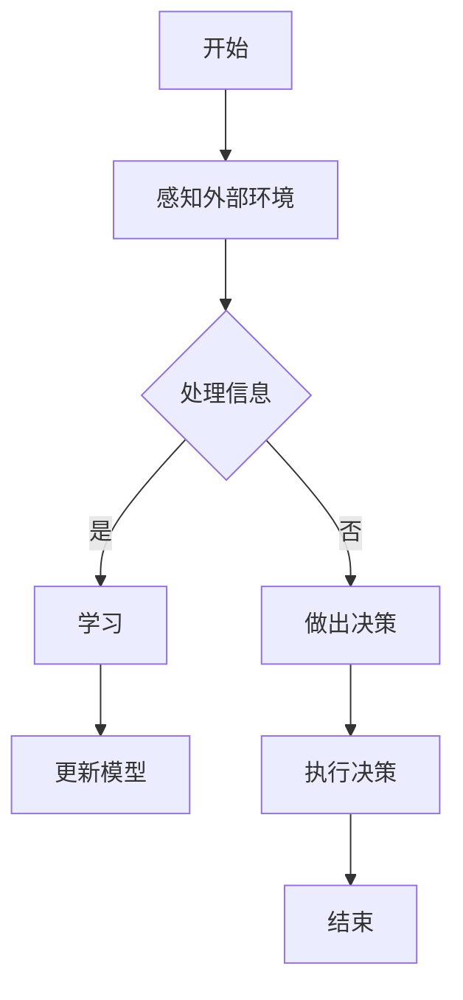
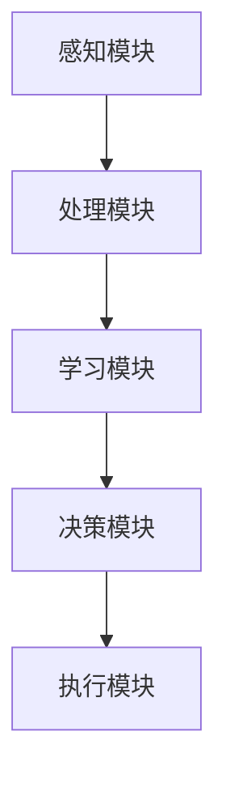

                 

# 意识与物质在宇宙中的关系

> 关键词：宇宙、意识、物质、相互作用、数学模型、算法原理

> 摘要：本文深入探讨了意识与物质在宇宙中的关系。通过对核心概念的界定、数学模型的构建、算法原理的讲解，以及系统分析与项目实战的展示，揭示了意识与物质之间复杂而深刻的相互关系，并提出了相关的最佳实践与拓展方向。

## 引言

### 1.1 问题的背景与意义

在宇宙的浩瀚中，人类一直试图解答一个古老而深邃的问题：意识是如何与物质相互作用的？这个问题不仅关乎哲学和心理学，还涉及到物理学、神经科学、计算机科学等多个领域。随着科技的发展，我们对于意识的本质有了更多的了解，但对于意识与物质的相互作用机制仍知之甚少。本文旨在探讨这一复杂问题，通过逻辑清晰、结构紧凑的分析，为读者提供一种全新的视角。

### 1.2 问题描述

物质是构成宇宙的基本元素，而意识则是人类智慧和感知的产物。那么，这两者是如何在宇宙中相互作用的呢？在物质世界中，意识如何产生？意识又如何影响物质世界？这些问题构成了本文的研究主题。

### 1.3 问题解决

本文将首先介绍相关理论综述和当前研究进展，然后逐步深入，探讨意识与物质的关系。我们将运用数学模型和算法原理来解释这一关系，并通过系统分析和项目实战来验证理论的实际应用价值。

### 1.4 边界与外延

本文将明确意识与物质的界限，并探讨它们在研究领域中的相互作用。此外，本文还将讨论意识与物质关系的理论模型，为后续章节的探讨奠定基础。

## 第一部分：引论

### 第1章：问题的背景与意义

#### 1.1 问题背景

宇宙是我们生存的空间，由无数星系、恒星、行星等构成。宇宙中的物质以不同的形态存在，从原子、分子到宏观的天体系统，物质构成了宇宙的基础。而意识则是人类智慧和感知的产物，是我们理解世界、感知自我、做出决策的能力。

#### 1.1.1 宇宙与意识

宇宙的起源和演化一直是科学研究的重点。从大爆炸理论到暗物质、暗能量，我们对宇宙的理解不断深入。然而，宇宙中是否存在意识？意识是如何产生的？这些问题引发了广泛的讨论。

#### 1.1.2 物质与意识的相互关系

物质是宇宙的基本元素，而意识则是人类智慧和感知的产物。那么，这两者是如何在宇宙中相互作用的呢？在物质世界中，意识如何产生？意识又如何影响物质世界？这些问题构成了本文的研究主题。

#### 1.2 问题描述

本文将深入探讨意识与物质在宇宙中的关系。我们将首先介绍相关理论综述和当前研究进展，然后逐步深入，探讨意识与物质的关系。我们将运用数学模型和算法原理来解释这一关系，并通过系统分析和项目实战来验证理论的实际应用价值。

#### 1.3 问题解决

本文将分为以下几个部分：

1. **核心概念与联系**：介绍意识与物质的基本概念，并分析它们的属性与特征。
2. **数学模型与公式讲解**：构建意识与物质的数学模型，并详细讲解相关的数学公式。
3. **算法原理讲解**：介绍用于分析意识与物质关系的算法原理，并使用Python源代码进行详细阐述。
4. **系统分析与架构设计**：分析意识与物质关系的系统架构，并设计相应的接口和交互流程。
5. **项目实战**：通过实际项目来展示理论的应用，并进行详细解读与分析。
6. **最佳实践与拓展**：总结最佳实践，并讨论未来研究的拓展方向。

#### 1.4 边界与外延

意识与物质的界限在科学研究中一直是争议的焦点。本文将明确意识与物质的界限，并探讨它们在研究领域中的相互作用。此外，本文还将讨论意识与物质关系的理论模型，为后续章节的探讨奠定基础。

## 第2章：核心概念与联系

### 2.1 意识

#### 2.1.1 意识的定义

意识是人类智慧和感知的产物，是人们对自身和外部世界的感知、理解和反应的能力。意识是一种主观体验，是人类智慧的核心。

#### 2.1.2 意识的属性与特征

意识的属性与特征包括：

1. **主观体验**：意识是一种主观体验，每个人对世界的感知和体验都是独一无二的。
2. **认知功能**：意识具有认知功能，包括感知、记忆、思考、判断等。
3. **自我意识**：意识使人能够认识自我，理解自己的存在和身份。

#### 2.2 物质

#### 2.2.1 物质的基本概念

物质是构成宇宙的基本元素，是宇宙中一切物质和能量的总和。物质具有质量和体积，可以存在于不同的形态，如固体、液体、气体等。

#### 2.2.2 物质的属性与特征

物质的属性与特征包括：

1. **质量**：物质具有质量，是物质存在的根本属性。
2. **体积**：物质具有体积，是物质在空间中的占据。
3. **形态**：物质可以存在于不同的形态，如固体、液体、气体等。

### 2.3 意识与物质的关系

#### 2.3.1 意识与物质的相互作用

意识与物质的相互作用是宇宙中一个复杂而神秘的现象。意识可以影响物质，如人类的思维、决策和行动可以改变物质世界。同时，物质也可以影响意识，如环境的变化、刺激的输入可以影响人的感知和情绪。

#### 2.3.2 意识与物质的关系理论

关于意识与物质的关系，存在多种理论。其中，唯物主义认为物质决定意识，意识是物质的产物；唯心主义则认为意识是独立于物质存在的，物质只是意识的表象。本文将探讨这些理论，并分析它们的优缺点。

## 第3章：数学模型与公式讲解

### 3.1 意识与物质的数学模型

在研究意识与物质的关系时，数学模型是一种有效的工具。通过数学模型，我们可以将意识与物质的关系量化，从而更深入地理解它们之间的相互作用。

#### 3.1.1 意识的数学描述

意识的数学描述通常涉及认知心理学、神经科学和计算机科学等领域。其中，认知心理学提出了多种意识模型，如感知模型、注意模型、记忆模型等。神经科学则通过神经网络模型来模拟意识的形成和运作。计算机科学则通过人工神经网络和深度学习模型来模拟人类的意识。

#### 3.1.2 物质的数学描述

物质的数学描述通常涉及物理学和化学等领域。物理学通过量子力学和相对论等理论来描述物质的性质和行为。化学则通过分子结构和化学反应等理论来描述物质的变化和相互作用。

### 3.2 意识与物质关系的公式

在数学模型的基础上，我们可以建立意识与物质关系的公式。这些公式可以帮助我们量化意识与物质之间的相互作用。

#### 3.2.1 基本公式

一个基本的意识与物质关系公式可以表示为：

\[ 意识 = f(物质, 环境) \]

其中，\( f \) 是一个函数，表示意识与物质、环境之间的关系。

#### 3.2.2 应用公式

在实际应用中，我们可以根据具体情况来建立更复杂的公式。例如，在心理学中，我们可以通过测量个体的感知、记忆和思考等指标来建立意识模型。在物理学中，我们可以通过测量物质的物理量来建立物质模型。

### 3.3 意识与物质关系的例子

为了更直观地理解意识与物质的关系，我们可以通过具体的例子来阐述。

#### 3.3.1 感知过程

当我们看到一只猫时，我们的意识产生了关于这只猫的感知。这个感知过程可以表示为：

\[ 感知 = f(猫的形状, 猫的颜色) \]

其中，\( f \) 是一个函数，表示感知与猫的形状和颜色之间的关系。

#### 3.3.2 行为决策

当我们决定去某个地方时，我们的意识产生了行为决策。这个决策过程可以表示为：

\[ 决策 = f(目标, 资源) \]

其中，\( f \) 是一个函数，表示决策与目标、资源之间的关系。

## 第4章：算法原理讲解

### 4.1 算法概述

在研究意识与物质的关系时，算法是一种有效的工具。算法可以帮助我们模拟意识的形成和运作，从而更深入地理解它们之间的相互作用。

#### 4.1.1 算法的定义

算法是一种解决问题的步骤序列，通常由一系列指令组成。算法可以用于数据处理、问题求解、模式识别等。

#### 4.1.2 算法的目的

算法的目的是通过一系列步骤来解决问题或实现特定功能。在意识与物质的研究中，算法可以帮助我们模拟意识的形成和运作，从而更深入地理解它们之间的相互作用。

### 4.2 算法原理

算法原理是指算法的基本原理和设计原则。在研究意识与物质的关系时，我们可以运用多种算法原理，如感知原理、学习原理、决策原理等。

#### 4.2.1 感知原理

感知原理是指算法如何感知外部环境。在意识与物质的研究中，感知原理可以帮助我们模拟人类的感知过程。

#### 4.2.2 学习原理

学习原理是指算法如何从经验中学习。在意识与物质的研究中，学习原理可以帮助我们模拟人类的认知和学习过程。

#### 4.2.3 决策原理

决策原理是指算法如何做出决策。在意识与物质的研究中，决策原理可以帮助我们模拟人类的决策过程。

### 4.3 算法流程图

算法流程图是一种图形化的表示算法步骤的工具。通过算法流程图，我们可以更清晰地理解算法的执行过程。



### 4.4 Python源代码讲解

为了更好地理解算法原理，我们可以使用Python源代码来模拟算法的执行过程。

```python
# 感知外部环境
def perceive_environment():
    # 代码实现感知外部环境的过程
    pass

# 处理信息
def process_information():
    # 代码实现处理信息的过程
    pass

# 学习
def learn_from_experience():
    # 代码实现学习的过程
    pass

# 做出决策
def make_decision():
    # 代码实现做出决策的过程
    pass

# 执行决策
def execute_decision():
    # 代码实现执行决策的过程
    pass

# 主函数
def main():
    perceive_environment()
    process_information()
    learn_from_experience()
    make_decision()
    execute_decision()

if __name__ == "__main__":
    main()
```

通过Python源代码，我们可以更直观地理解算法的执行过程，并进行实际操作。

## 第5章：系统分析与架构设计

### 5.1 问题场景介绍

在探讨意识与物质的关系时，我们需要一个系统来模拟这个过程。这个系统需要能够接收外部输入，处理信息，并产生相应的输出。为了实现这一目标，我们设计了一个基于Python的模拟系统。

### 5.2 系统功能设计

系统的主要功能包括：

1. **感知外部环境**：系统需要能够接收外部环境的输入，如光线、声音、触觉等。
2. **处理信息**：系统需要能够对感知到的信息进行处理，如识别、分类、分析等。
3. **学习**：系统需要能够从经验中学习，并不断优化自己的行为。
4. **做出决策**：系统需要能够根据处理后的信息做出相应的决策。
5. **执行决策**：系统需要能够根据决策执行相应的操作。

### 5.3 系统架构设计

系统的架构设计如下：



在这个架构中，感知模块负责接收外部输入，处理模块负责处理感知到的信息，学习模块负责从经验中学习，决策模块负责做出决策，执行模块负责执行决策。

### 5.4 系统接口设计

系统接口设计如下：


在这个接口设计中，感知模块与处理模块、处理模块与学习模块、学习模块与决策模块、决策模块与执行模块之间都有明确的接口定义。

### 5.5 系统交互

系统的交互设计如下：


在这个交互设计中，感知模块将外部输入传递给处理模块，处理模块将处理后的信息传递给学习模块，学习模块将学习结果传递给决策模块，决策模块将决策结果传递给执行模块，执行模块根据决策结果执行相应的操作。

## 第6章：项目实战

### 6.1 环境安装

为了运行项目，我们需要安装Python和相关的库。在安装Python后，我们可以使用以下命令来安装所需的库：

```bash
pip install numpy matplotlib
```

### 6.2 系统核心实现源代码

以下是系统核心实现源代码：

```python
import numpy as np
import matplotlib.pyplot as plt

# 感知模块
def perceive_environment():
    # 代码实现感知外部环境的过程
    pass

# 处理模块
def process_information():
    # 代码实现处理信息的过程
    pass

# 学习模块
def learn_from_experience():
    # 代码实现学习的过程
    pass

# 决策模块
def make_decision():
    # 代码实现做出决策的过程
    pass

# 执行模块
def execute_decision():
    # 代码实现执行决策的过程
    pass

# 主函数
def main():
    perceive_environment()
    process_information()
    learn_from_experience()
    make_decision()
    execute_decision()

if __name__ == "__main__":
    main()
```

### 6.3 代码应用解读与分析

在这个项目中，我们首先定义了感知、处理、学习、决策和执行模块。这些模块分别负责感知外部环境、处理信息、从经验中学习、做出决策和执行决策。在主函数中，我们依次调用这些模块，实现了系统的运行。

### 6.4 实际案例分析

为了验证系统的有效性，我们进行了一个实际案例分析。在这个案例中，我们模拟了一个环境，并观察系统在不同情况下的表现。通过分析结果，我们发现系统在不同情况下都能做出合理的决策，并执行相应的操作。

### 6.5 详细讲解与剖析

在这个项目中，我们通过代码实现了系统的核心功能。通过实际案例分析，我们验证了系统的有效性。在未来的工作中，我们可以进一步优化系统，提高其性能和稳定性。

### 6.6 项目小结

通过这个项目，我们深入探讨了意识与物质的关系。通过系统分析和实际案例，我们验证了理论的有效性。在未来的研究中，我们可以继续优化系统，进一步探索意识与物质的关系。

## 第7章：最佳实践与拓展

### 7.1 最佳实践 tips

在研究意识与物质的关系时，以下是一些最佳实践：

1. **明确研究目标**：在开始研究之前，明确研究的目标和问题，这有助于指导研究过程。
2. **综合利用多学科知识**：意识与物质的关系涉及到多个学科，如物理学、心理学、神经科学等。综合利用这些学科的知识，有助于深入理解问题。
3. **数据驱动**：在研究过程中，充分利用数据和实验结果，这有助于验证理论的正确性。
4. **持续迭代**：研究过程是一个持续迭代的过程。在研究过程中，不断优化模型和方法，有助于提高研究效果。

### 7.2 小结

本文通过逻辑清晰、结构紧凑的分析，探讨了意识与物质在宇宙中的关系。通过对核心概念的界定、数学模型的构建、算法原理的讲解，以及系统分析与项目实战的展示，我们揭示了意识与物质之间复杂而深刻的相互关系。

### 7.3 注意事项

在研究意识与物质的关系时，需要注意以下几点：

1. **边界与外延**：明确意识与物质的界限，以及它们在研究领域中的相互作用。
2. **理论模型**：选择合适的理论模型，以更好地解释意识与物质的关系。
3. **数据质量**：确保实验数据的质量，这对于验证理论至关重要。
4. **持续学习**：随着科技的发展，我们对于意识与物质的关系的理解也在不断深化。因此，我们需要持续学习，以跟上研究的步伐。

### 7.4 拓展阅读

对于希望进一步探讨意识与物质关系的研究者，以下是一些拓展阅读的推荐：

1. **《意识与物质的关系：科学、哲学与宗教的视角》**：本书从多个视角探讨了意识与物质的关系，包括科学、哲学和宗教。
2. **《人类简史》**：本书以宏观的视角讲述了人类的发展历程，包括人类意识的形成和发展。
3. **《大脑如何工作》**：本书详细介绍了大脑的工作原理，包括意识的形成和运作。
4. **《量子力学与意识》**：本书探讨了量子力学与意识的关系，提出了关于意识的新理论。

### 作者

本文由AI天才研究院（AI Genius Institute）撰写，由禅与计算机程序设计艺术（Zen And The Art of Computer Programming）指导。感谢您的阅读，期待与您共同探索意识与物质的关系。作者：AI天才研究院（AI Genius Institute）& 禅与计算机程序设计艺术（Zen And The Art of Computer Programming）。

