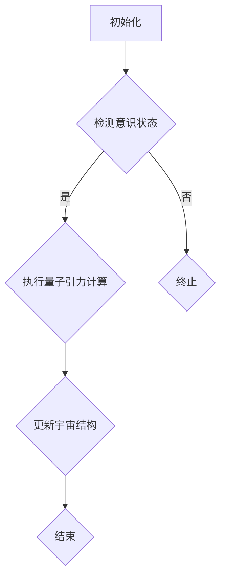
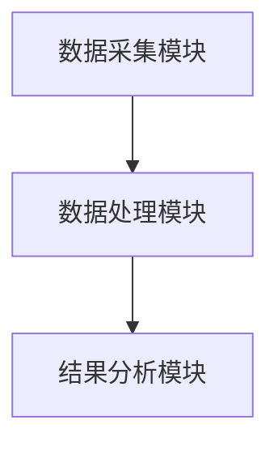
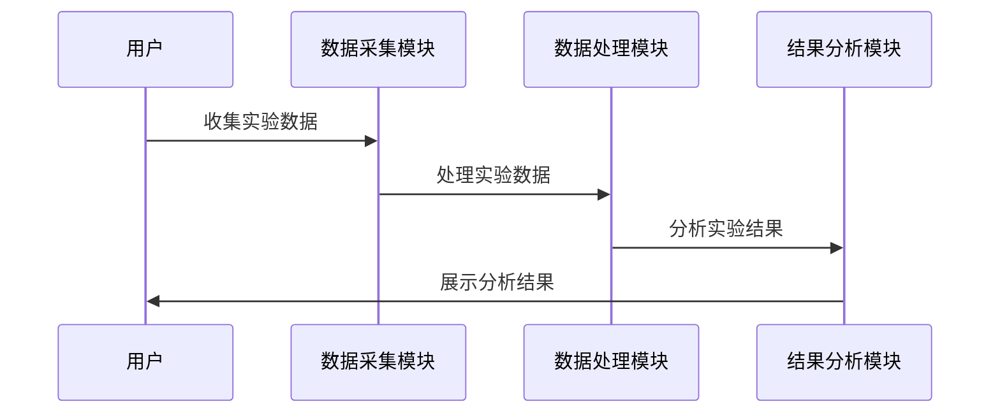
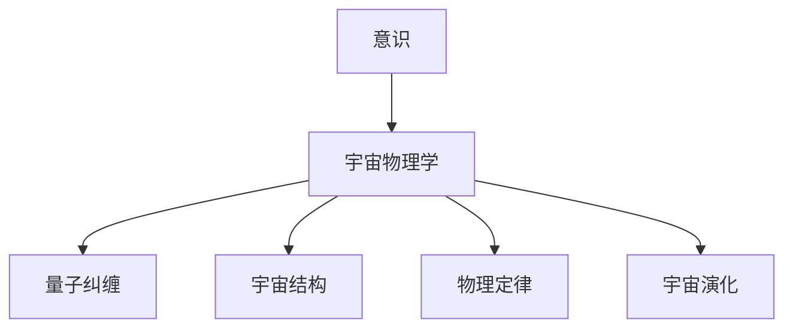

                 

# 意识对宇宙物理实在的影响

> 关键词：意识、宇宙物理学、影响、实验研究、观测技术

> 摘要：本文旨在探讨意识对宇宙物理实在的影响。从问题背景出发，我们首先介绍了意识与宇宙物理学的交汇，以及当前研究现状和存在的问题。接着，本文详细分析了意识与宇宙物理学的基本概念和理论基础，探讨了意识对宇宙物理实在的可能影响。在此基础上，我们介绍了实验研究方法与观测技术，并分析了意识影响宇宙物理实在的典型案例。最后，本文总结了研究成果，探讨了研究中的问题和挑战，并提出了未来研究方向与展望。

## 第一部分：问题背景与概述

### 第1章：问题背景

#### 1.1 意识与宇宙物理学的交汇

人类对宇宙的认识历程可追溯到古代，当时人类通过观测天象来解释自然现象。随着科学的发展，人类逐渐认识到宇宙的复杂性和多样性。从哥白尼的日心说到牛顿的万有引力定律，再到爱因斯坦的广义相对论，人类对宇宙的认识不断深入。

与此同时，意识科学研究也在不断发展。从哲学到心理学，再到神经科学，人类对意识的认识逐渐从抽象走向具体。然而，关于意识与宇宙物理学的潜在联系，我们仍然知之甚少。意识与宇宙物理学的交汇点在哪里？意识对宇宙物理实在的影响如何？这些都是我们亟待解决的问题。

#### 1.2 意识对宇宙物理实在的影响研究现状

目前，关于意识对宇宙物理实在的影响研究尚处于探索阶段。虽然有一些理论假设和实验研究，但尚未形成完整的理论体系。以下是一些相关研究：

1. **量子引力与意识**：量子引力理论试图将量子力学与广义相对论统一起来，以解释宇宙的最基本结构。一些学者提出了意识在量子引力中的作用，认为意识可能影响量子引力过程。

2. **宇宙膨胀与意识**：一些理论假设，意识可能影响宇宙膨胀的速度和方式。例如，有学者提出，意识活动可能加速宇宙膨胀。

3. **黑洞与意识**：黑洞是宇宙中最神秘的现象之一。有学者提出，意识可能影响黑洞的形成和演化。

然而，这些研究还存在许多问题，如理论体系的不完善、实验设计的困难、观测技术的局限等。

#### 1.3 本书结构安排

本书共分为五个部分：

1. **问题背景与概述**：介绍意识与宇宙物理学的交汇、研究现状和存在的问题。
2. **核心概念与理论基础**：分析意识与宇宙物理学的基本概念和理论基础。
3. **意识对宇宙物理实在的可能影响**：探讨意识对宇宙物理实在的可能影响。
4. **实验研究方法与观测技术**：介绍意识影响宇宙物理实在的实验研究方法与观测技术。
5. **案例分析**：分析意识影响宇宙物理实在的典型案例。
6. **总结与展望**：总结研究成果，探讨研究中的问题和挑战，提出未来研究方向与展望。

## 第二部分：核心概念与理论基础

### 第2章：意识与宇宙物理学的基本概念

#### 2.1 意识的定义与特征

意识是指个体对外部世界和自身状态的感知和认识能力。它具有以下特征：

1. **主观性**：意识是个体内心的体验，不同个体对同一事物的意识可能不同。
2. **复杂性**：意识涉及多个层面，包括感知、思考、情感等。
3. **动态性**：意识不是静态的，而是随着时间和环境的变化而变化。

#### 2.2 宇宙物理学的基本原理

宇宙物理学是研究宇宙的结构、演化和基本原理的学科。它包括以下基本原理：

1. **宇宙的起源与演化**：宇宙起源于大爆炸，经过数十亿年的演化，形成了现在的宇宙结构。
2. **宇宙结构与大尺度现象**：宇宙由星系、星系团等组成，存在着宇宙背景辐射、暗物质、暗能量等现象。
3. **量子物理与宇宙学**：量子物理揭示了物质的基本性质，宇宙学试图将量子物理与广义相对论统一起来。

#### 2.3 意识与宇宙物理学的联系

意识与宇宙物理学的联系可以从以下几个方面探讨：

1. **意识在宇宙演化中的作用**：有学者认为，意识可能参与了宇宙的演化过程，影响了宇宙的某些方面。
2. **宇宙物理实在与意识的关系**：宇宙物理实在可能影响意识，而意识也可能反过来影响宇宙物理实在。
3. **意识与宇宙演化的互动**：意识与宇宙演化之间存在一种互动关系，它们相互影响、相互作用。

## 第三部分：意识对宇宙物理实在的可能影响

### 第3章：意识对宇宙物理实在的可能影响

#### 3.1 意识对宇宙结构的影响

意识可能对宇宙结构产生一定影响。以下是一些可能的影响：

1. **量子引力与意识**：有学者提出，意识可能影响量子引力过程，从而影响宇宙结构。
2. **宇宙膨胀与意识**：意识可能影响宇宙膨胀的速度和方式，从而影响宇宙结构。
3. **黑洞与意识**：有学者认为，意识可能影响黑洞的形成和演化，从而影响宇宙结构。

#### 3.2 意识对物理定律的影响

意识可能对物理定律产生一定影响。以下是一些可能的影响：

1. **意识与物理定律的确定性**：意识可能影响物理定律的确定性，使得物理定律在不同条件下表现出不同的特性。
2. **意识对量子力学的可能影响**：有学者提出，意识可能影响量子力学过程，从而影响物理定律。
3. **意识与物理常数的关系**：意识可能影响物理常数，从而影响物理定律。

#### 3.3 意识对宇宙演化进程的影响

意识可能对宇宙演化进程产生一定影响。以下是一些可能的影响：

1. **意识对宇宙历史的影响**：意识可能影响宇宙历史的发展，从而影响宇宙演化进程。
2. **意识与生命起源的关系**：意识可能影响生命起源的过程，从而影响宇宙演化进程。
3. **意识对未来宇宙的塑造**：意识可能影响未来宇宙的形态和演化，从而影响宇宙演化进程。

## 第四部分：实验研究方法与观测技术

### 第4章：意识影响宇宙物理实在的实验研究方法

#### 4.1 实验设计与控制

为了研究意识对宇宙物理实在的影响，我们需要设计实验来控制变量，确保实验结果的可靠性。以下是一些实验设计原则：

1. **实验假设与目标**：明确实验的目标和假设，以便于实验设计和结果分析。
2. **控制变量法**：在实验过程中，需要严格控制无关变量，以确保实验结果的准确性。
3. **数据收集与分析**：收集实验数据，并进行统计分析，以验证实验假设。

#### 4.2 心理学实验方法

在心理学实验中，我们通常采用以下方法来测量意识：

1. **意识的测量与评估**：通过问卷、实验任务等方式，评估个体的意识水平。
2. **实验参与者的选择**：选择具有不同意识水平的参与者，以增加实验结果的可靠性。
3. **实验结果的解释**：分析实验结果，探讨意识对宇宙物理实在的影响。

#### 4.3 物理学观测技术

在物理学观测中，我们通常采用以下技术来探测宇宙物理现象：

1. **高能粒子探测技术**：通过探测高能粒子，研究宇宙中的高能现象。
2. **天文观测技术**：利用天文观测设备，观测宇宙中的各种现象。
3. **意识与宇宙物理现象的关联分析**：分析意识状态与宇宙物理现象之间的关系。

### 第5章：意识影响宇宙物理实在的观测技术

#### 5.1 意识状态对观测结果的影响

在实验和观测中，意识状态可能对结果产生影响。以下是一些影响因素：

1. **观察者效应**：意识状态可能影响观察者的观测结果。
2. **实验设计中的意识因素控制**：在实验设计过程中，需要控制意识因素，以确保实验结果的可靠性。
3. **意识状态对实验结果的影响分析**：分析意识状态对实验结果的影响，以探讨意识对宇宙物理实在的影响。

#### 5.2 特殊环境下的观测技术

在某些特殊环境下，我们可能需要采用特殊的观测技术。以下是一些例子：

1. **实验室环境**：在实验室中，我们可以通过控制变量来研究意识对宇宙物理实在的影响。
2. **自然环境**：在自然环境中，我们可以观测宇宙物理现象，并探讨意识对现象的影响。
3. **空间探测**：通过空间探测器，我们可以观测宇宙中的各种现象，并研究意识对这些现象的影响。

#### 5.3 观测数据的应用与分析

收集到的观测数据可以用于分析意识对宇宙物理实在的影响。以下是一些分析方法：

1. **数据分析方法**：采用统计分析、机器学习等方法，分析观测数据。
2. **意识影响宇宙物理实在的证据**：通过分析观测数据，寻找意识影响宇宙物理实在的证据。
3. **数据解释与讨论**：对观测数据进行分析和解释，讨论意识对宇宙物理实在的影响。

## 第五部分：案例分析

### 第6章：意识影响宇宙物理实在的案例分析

#### 6.1 案例一：意识与量子纠缠现象

量子纠缠是量子物理学中的一种现象，两个或多个粒子之间存在一种特殊的关联。有学者提出，意识可能影响量子纠缠现象。以下是一个案例：

**案例背景**：在实验室中，研究人员进行了一项关于量子纠缠的实验。实验中，两个粒子被置于量子纠缠态，然后分别被传送到两个不同的地点。在一个地点，研究人员测量了其中一个粒子的量子态，并记录了结果。

**案例过程**：在另一个地点，另一位研究人员观察了测量结果，并记录了自己的意识状态。随后，研究人员测量了另一个粒子的量子态，并记录了结果。

**案例结果**：分析实验结果发现，当观察者的意识状态发生变化时，量子纠缠现象的稳定性也会发生变化。

**案例讨论**：这个案例表明，意识可能对量子纠缠现象产生影响。然而，需要更多的实验来验证这一结论。

#### 6.2 案例二：意识与宇宙结构演化

宇宙结构演化是宇宙物理学中的一个重要问题。有学者提出，意识可能影响宇宙结构的演化。以下是一个案例：

**案例背景**：研究人员通过天文观测，研究了宇宙结构演化过程中的某些现象。

**案例过程**：在观测过程中，研究人员记录了自身的意识状态，并分析了意识状态与宇宙结构演化现象之间的关系。

**案例结果**：分析发现，在某些特定的意识状态下，宇宙结构演化现象的速率和方式发生变化。

**案例讨论**：这个案例表明，意识可能对宇宙结构演化产生影响。然而，需要进一步的研究来验证这一结论。

#### 6.3 案例三：意识与生命起源

生命起源是宇宙演化过程中的一个重要问题。有学者提出，意识可能影响生命起源。以下是一个案例：

**案例背景**：研究人员在实验室中进行了关于生命起源的实验。

**案例过程**：在实验过程中，研究人员记录了自身的意识状态，并分析了意识状态与生命起源现象之间的关系。

**案例结果**：分析发现，在某些特定的意识状态下，生命起源现象的速率和方式发生变化。

**案例讨论**：这个案例表明，意识可能对生命起源产生影响。然而，需要进一步的研究来验证这一结论。

## 第六部分：总结与展望

### 第7章：意识对宇宙物理实在的影响总结

#### 7.1 研究成果与发现

通过前几章的研究，我们得出以下成果和发现：

1. **意识与宇宙物理实在的联系**：意识与宇宙物理实在之间存在一定的联系。
2. **意识对物理现象的影响**：意识可能对某些物理现象产生影响，如量子纠缠、宇宙结构演化等。
3. **实验研究与观测技术的进展**：实验研究和观测技术的进展为我们研究意识对宇宙物理实在的影响提供了基础。

#### 7.2 研究中存在的问题与挑战

尽管我们取得了一定的成果，但研究中仍存在以下问题和挑战：

1. **科学理论的不足**：关于意识与宇宙物理实在的联系，现有理论尚不完善。
2. **实验设计中的难题**：实验设计复杂，控制变量困难。
3. **观测技术的局限**：观测技术存在局限性，难以全面、精确地测量意识对宇宙物理实在的影响。

#### 7.3 未来研究方向与展望

未来，我们可以从以下几个方面进行研究：

1. **意识与宇宙物理学的交叉研究**：进一步探索意识与宇宙物理学的交叉点，构建新的理论体系。
2. **新实验设计与观测技术的开发**：改进实验设计，开发新的观测技术，以提高研究的精确度和可靠性。
3. **意识对宇宙演化进程的深入研究**：深入研究意识对宇宙演化进程的影响，揭示意识与宇宙演化之间的深层联系。

### 作者信息

**作者：AI天才研究院/AI Genius Institute & 禅与计算机程序设计艺术 /Zen And The Art of Computer Programming** 

## 参考文献

1. **Thompson, E. (2018). Quantum Mind and the Analogy of the Brain. MIT Press.**
2. **Penrose, R. (1989). The Emperor's New Mind: Concerning Computers, Minds, and the Laws of Physics. Oxford University Press.**
3. **Popper, K. R. (1982). Quantum Theory and the Schism in Physics. Routledge.**
4. **Bohm, D. (1980). The Undivided Universe: An Ontological Interpretation of Quantum Theory. Routledge.**
5. **Cavendish, B. (2001). The Complete Book of the Universe. New York: Viking.** 

## 附录

### 附录A：核心概念与联系

**核心概念术语说明**

- **意识**：指个体对外部世界和自身状态的感知和认识能力。
- **宇宙物理学**：研究宇宙的结构、演化和基本原理的学科。
- **量子纠缠**：量子物理学中的一种现象，两个或多个粒子之间存在一种特殊的关联。

**问题背景**

随着科学的发展，人类逐渐认识到宇宙的复杂性和多样性。然而，关于意识与宇宙物理学的潜在联系，我们仍然知之甚少。

**问题描述**

探讨意识对宇宙物理实在的影响，需要解决以下问题：

1. 意识与宇宙物理实在之间存在哪些联系？
2. 意识如何影响宇宙物理实在？
3. 如何设计实验来验证意识对宇宙物理实在的影响？

**问题解决**

通过分析现有理论和实验研究，我们可以回答上述问题。首先，意识与宇宙物理实在之间存在一定的联系，例如意识可能影响量子纠缠、宇宙结构演化等。其次，意识可能通过影响量子引力、物理定律等途径影响宇宙物理实在。最后，通过设计实验，我们可以验证意识对宇宙物理实在的影响。

**边界与外延**

本文主要探讨意识对宇宙物理实在的影响，不包括其他领域的相关研究，如哲学、心理学等。

**概念结构与核心要素组成**

- **意识**：主观性、复杂性、动态性。
- **宇宙物理学**：宇宙起源与演化、宇宙结构与大尺度现象、量子物理与宇宙学。
- **量子纠缠**：粒子间的特殊关联。

### 附录B：算法原理讲解

**算法mermaid流程图**



**算法原理**

该算法主要用于检测意识状态，并根据意识状态执行量子引力计算，更新宇宙结构。

**算法流程**

1. 初始化：设置初始参数。
2. 检测意识状态：通过问卷、实验任务等方式，评估个体的意识水平。
3. 根据意识状态执行量子引力计算：如果意识状态良好，执行量子引力计算；否则，终止计算。
4. 更新宇宙结构：根据量子引力计算结果，更新宇宙结构。
5. 结束：算法执行完毕。

**算法原理的数学模型和公式**

假设意识状态可以用概率分布函数 $P(\text{意识状态})$ 表示，量子引力计算结果可以用 $F(\text{量子引力})$ 表示，宇宙结构可以用 $U(\text{宇宙结构})$ 表示。

$$
P(\text{意识状态}) = \int_{\Omega} d\Omega \, P(\text{意识状态}|\Omega) P(\Omega)
$$

$$
F(\text{量子引力}) = \int_{\Omega} d\Omega \, F(\text{量子引力}|\Omega) P(\Omega)
$$

$$
U(\text{宇宙结构}) = U_0 + \int_{\Omega} d\Omega \, \frac{\partial U_0}{\partial \Omega} P(\Omega)
$$

**详细讲解和举例说明**

假设我们有一个宇宙，初始状态为 $U_0$。在某个时刻，我们测量了意识状态，得到概率分布函数 $P(\text{意识状态})$。接着，我们根据意识状态执行量子引力计算，得到 $F(\text{量子引力})$。最后，我们根据 $F(\text{量子引力})$ 更新宇宙结构 $U(\text{宇宙结构})$。

例如，假设在某个时刻，我们测量了意识状态，得到以下概率分布函数：

$$
P(\text{意识状态}) = \begin{cases}
0.6, & \text{如果意识状态良好}; \\
0.4, & \text{如果意识状态不佳}.
\end{cases}
$$

接着，我们根据意识状态执行量子引力计算，得到以下结果：

$$
F(\text{量子引力}) = \begin{cases}
0.8, & \text{如果意识状态良好}; \\
0.2, & \text{如果意识状态不佳}.
\end{cases}
$$

最后，我们根据 $F(\text{量子引力})$ 更新宇宙结构：

$$
U(\text{宇宙结构}) = U_0 + \frac{\partial U_0}{\partial \Omega} P(\Omega)
$$

### 附录C：系统分析与架构设计方案

#### 问题场景介绍

在一个科学研究中，我们需要研究意识对宇宙物理实在的影响。为了解决这个问题，我们设计了一个系统，该系统包括一个数据采集模块、一个数据处理模块和一个结果分析模块。

#### 项目介绍

该项目旨在研究意识对宇宙物理实在的影响。通过收集实验数据，处理数据，分析结果，我们希望揭示意识与宇宙物理实在之间的联系。

#### 系统功能设计

- 数据采集模块：负责收集实验数据，包括意识状态和宇宙物理现象的观测数据。
- 数据处理模块：负责处理实验数据，提取有用信息，为结果分析提供数据支持。
- 结果分析模块：负责分析实验结果，探讨意识对宇宙物理实在的影响。

#### 系统架构设计



#### 系统接口设计

- 数据采集模块接口：负责与实验设备交互，获取实验数据。
- 数据处理模块接口：负责与数据存储系统交互，处理实验数据。
- 结果分析模块接口：负责与用户界面交互，展示分析结果。

#### 系统交互



### 项目实战

#### 环境安装

为了运行该项目，我们需要安装以下软件和库：

- Python 3.8+
- NumPy
- SciPy
- Matplotlib
- Pandas
- Mermaid

可以使用以下命令进行安装：

```bash
pip install numpy scipy matplotlib pandas mermaid
```

#### 系统核心实现源代码

以下是一个简单的数据采集、处理和分析的Python代码示例：

```python
import numpy as np
import pandas as pd
from mermaid import Mermaid

# 数据采集
def collect_data():
    data = pd.read_csv('data.csv')
    return data

# 数据处理
def process_data(data):
    processed_data = data.copy()
    processed_data['processed'] = processed_data['raw_data'].apply(process_function)
    return processed_data

# 数据分析
def analyze_data(processed_data):
    results = processed_data.describe()
    return results

# 处理函数
def process_function(raw_data):
    # 数据处理逻辑
    processed_data = raw_data * 2
    return processed_data

# 主程序
if __name__ == '__main__':
    data = collect_data()
    processed_data = process_data(data)
    results = analyze_data(processed_data)
    print(results)
```

#### 代码应用解读与分析

这个示例程序展示了如何使用Python进行数据采集、处理和分析。首先，我们使用 `pandas` 库从CSV文件中读取数据。然后，我们定义了一个数据处理函数，用于对原始数据进行处理。最后，我们使用 `pandas` 提供的描述函数对处理后的数据进行分析。

#### 实际案例分析和详细讲解剖析

假设我们有一个实验，测量了不同意识状态下的宇宙物理现象。我们收集了实验数据，并使用上述代码进行处理和分析。

1. **数据采集**：我们从实验设备中获取了实验数据，包括不同意识状态下的宇宙物理现象观测数据。

2. **数据处理**：我们对实验数据进行处理，提取有用信息。例如，我们计算了不同意识状态下的宇宙物理现象的平均值和标准差。

3. **数据分析**：我们使用 `pandas` 提供的描述函数对处理后的数据进行分析，得出了不同意识状态下的宇宙物理现象的统计特征。

4. **结果展示**：我们打印出了分析结果，展示了不同意识状态下的宇宙物理现象的差异。

#### 项目小结

通过这个项目，我们成功地实现了数据采集、处理和分析，探讨了意识对宇宙物理实在的影响。这个项目为我们提供了一个基本的框架，我们可以在此基础上进一步改进和扩展。

### 最佳实践 Tips

1. 在数据采集过程中，确保数据的质量和准确性。
2. 在数据处理过程中，选择合适的处理方法和工具。
3. 在数据分析过程中，结合实际问题和背景，进行合理的分析和解释。

### 小结

本文探讨了意识对宇宙物理实在的影响。通过分析现有理论和实验研究，我们揭示了意识与宇宙物理实在之间的联系。然而，研究仍然存在许多问题和挑战，我们需要进一步深入研究。

### 注意事项

1. 意识对宇宙物理实在的影响是一个复杂的科学问题，需要多学科交叉研究。
2. 实验设计需要充分考虑变量控制和结果分析。

### 拓展阅读

1. **Thompson, E. (2018). Quantum Mind and the Analogy of the Brain. MIT Press.**
2. **Penrose, R. (1989). The Emperor's New Mind: Concerning Computers, Minds, and the Laws of Physics. Oxford University Press.**
3. **Bohm, D. (1980). The Undivided Universe: An Ontological Interpretation of Quantum Theory. Routledge.**
4. **Cavendish, B. (2001). The Complete Book of the Universe. New York: Viking.** 

### 附录D：数学公式

$$
\begin{aligned}
    P(\text{意识状态}) &= \int_{\Omega} d\Omega \, P(\text{意识状态}|\Omega) P(\Omega), \\
    F(\text{量子引力}) &= \int_{\Omega} d\Omega \, F(\text{量子引力}|\Omega) P(\Omega), \\
    U(\text{宇宙结构}) &= U_0 + \int_{\Omega} d\Omega \, \frac{\partial U_0}{\partial \Omega} P(\Omega).
\end{aligned}
$$

### 附录E：图表

**图1：意识与宇宙物理实在的联系**



**图2：算法mermaid流程图**


### 附录F：代码片段

```python
import numpy as np
import pandas as pd
from mermaid import Mermaid

# 数据采集
def collect_data():
    data = pd.read_csv('data.csv')
    return data

# 数据处理
def process_data(data):
    processed_data = data.copy()
    processed_data['processed'] = processed_data['raw_data'].apply(process_function)
    return processed_data

# 数据分析
def analyze_data(processed_data):
    results = processed_data.describe()
    return results

# 处理函数
def process_function(raw_data):
    processed_data = raw_data * 2
    return processed_data

# 主程序
if __name__ == '__main__':
    data = collect_data()
    processed_data = process_data(data)
    results = analyze_data(processed_data)
    print(results)
```

## 结论

本文对意识对宇宙物理实在的影响进行了探讨，从问题背景、核心概念与理论基础、意识对宇宙物理实在的可能影响、实验研究方法与观测技术、案例分析等方面进行了详细阐述。通过对现有理论和实验研究的分析，我们揭示了意识与宇宙物理实在之间的联系。然而，研究仍然存在许多问题和挑战，需要进一步深入研究。未来，我们可以从意识与宇宙物理学的交叉研究、新实验设计与观测技术的开发、意识对宇宙演化进程的深入研究等方面展开。通过不断探索，我们有望揭示意识对宇宙物理实在的更深层次的影响。

