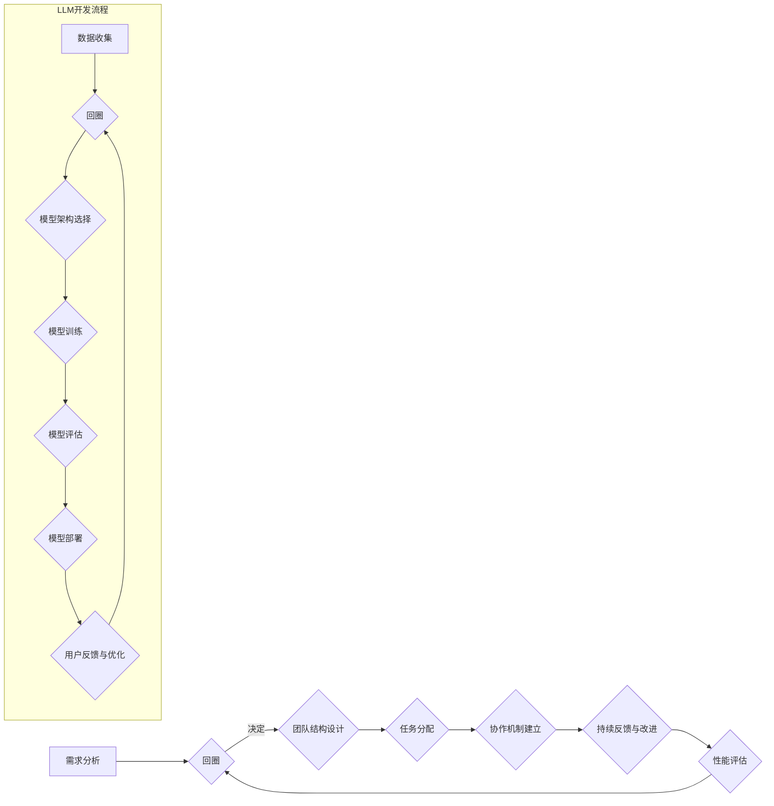
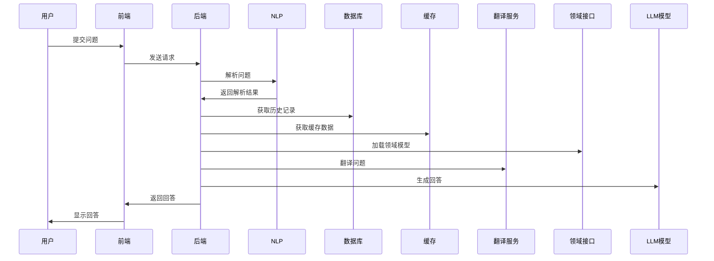

                 

# 打造responsive的LLM应用开发团队

## 关键词
- 响应式设计
- 语言模型(MLM)
- 开发团队
- 软件工程
- 技术选型
- 团队协作

## 摘要
本文旨在探讨如何构建一个具备响应式能力的LLM（语言学习模型）应用开发团队。通过逐步分析，本文将介绍响应式设计的核心理念，探讨其在LLM应用开发中的重要性，并详细阐述如何打造一支高效、协作的团队。文章还将包含系统分析与架构设计方案，以及实战经验分享，旨在为开发者提供全面的指导。

### Step 1: 设定目录框架

在开始撰写本文之前，我们首先需要设定一个清晰的目录框架。这将有助于读者更好地理解和跟随文章的思路。以下是本文的目录框架：

#### 第一部分：背景介绍
- **第1章 问题背景**
  - **1.1 软件发展的历史背景**
  - **1.2 响应式设计理念的提出**
  - **1.3 机器学习与LLM的应用普及**
- **第2章 问题描述**
  - **2.1 响应式LLM应用的需求**
  - **2.2 当前开发团队面临的困境**
  - **2.3 团队协作与沟通的重要性**
- **第3章 问题解决**
  - **3.1 响应式团队构建的关键**
  - **3.2 软件开发流程的优化**
  - **3.3 技术选型的决策过程**
- **第4章 边界与外延**
  - **4.1 响应式团队的应用领域**
  - **4.2 响应式团队与传统团队的对比**
  - **4.3 未来发展趋势与挑战**
- **第5章 核心概念与要素组成**
  - **5.1 响应式设计原理**
  - **5.2 LLM的基本概念**
  - **5.3 应用开发团队的组成**

#### 第二部分：核心概念与联系
- **第6章 核心概念原理**
  - **6.1 响应式设计原理**
  - **6.2 LLM的基本概念**
  - **6.3 响应式设计与LLM的结合**
- **第7章 概念属性特征对比表格**
  - **7.1 响应式设计与传统设计的对比**
  - **7.2 LLM模型类型对比**
  - **7.3 开发团队角色与职责对比**
- **第8章 ER实体关系图架构**
  - **8.1 响应式开发团队实体关系**
  - **8.2 LLM应用开发过程实体关系**

#### 第三部分：算法原理讲解
- **第9章 算法原理讲解**
  - **9.1 响应式团队构建的算法流程**
  - **9.2 LLM应用开发的算法流程**
  - **9.3 算法流程图**
  - **9.4 Python源代码与数学模型**
  - **9.5 数学公式与详细讲解**
  - **9.6 举例说明**

#### 第四部分：系统分析与架构设计方案
- **第10章 系统分析与架构设计方案**
  - **10.1 问题场景介绍**
  - **10.2 项目介绍**
  - **10.3 系统功能设计**
  - **10.4 系统架构设计**
  - **10.5 系统接口设计**
  - **10.6 系统交互序列图**

#### 第五部分：项目实战
- **第11章 项目实战**
  - **11.1 环境安装**
  - **11.2 系统核心实现源代码**
  - **11.3 代码应用解读与分析**
  - **11.4 实际案例分析与详细讲解**
  - **11.5 项目小结**

#### 第六部分：最佳实践 tips
- **第12章 最佳实践 tips**
  - **12.1 响应式团队协作技巧**
  - **12.2 LLM应用开发的最佳实践**
  - **12.3 团队管理与激励机制**

#### 第七部分：小结与注意事项
- **第13章 小结与注意事项**
  - **13.1 文章核心观点回顾**
  - **13.2 注意事项与未来展望**
  - **13.3 拓展阅读**

### Step 2: 编写目录大纲

在明确了目录框架后，我们接下来将为每个章节编写具体的标题和子标题，确保文章内容的完整性和逻辑性。

#### 第一部分：背景介绍

**第1章 问题背景**
- **1.1 软件发展的历史背景**
- **1.2 响应式设计理念的提出**
- **1.3 机器学习与LLM的应用普及**

**第2章 问题描述**
- **2.1 响应式LLM应用的需求**
- **2.2 当前开发团队面临的困境**
- **2.3 团队协作与沟通的重要性**

**第3章 问题解决**
- **3.1 响应式团队构建的关键**
- **3.2 软件开发流程的优化**
- **3.3 技术选型的决策过程**

**第4章 边界与外延**
- **4.1 响应式团队的应用领域**
- **4.2 响应式团队与传统团队的对比**
- **4.3 未来发展趋势与挑战**

**第5章 核心概念与要素组成**
- **5.1 响应式设计原理**
- **5.2 LLM的基本概念**
- **5.3 应用开发团队的组成**

#### 第二部分：核心概念与联系

**第6章 核心概念原理**
- **6.1 响应式设计原理**
- **6.2 LLM的基本概念**
- **6.3 响应式设计与LLM的结合**

**第7章 概念属性特征对比表格**
- **7.1 响应式设计与传统设计的对比**
- **7.2 LLM模型类型对比**
- **7.3 开发团队角色与职责对比**

**第8章 ER实体关系图架构**
- **8.1 响应式开发团队实体关系**
- **8.2 LLM应用开发过程实体关系**

#### 第三部分：算法原理讲解

**第9章 算法原理讲解**
- **9.1 响应式团队构建的算法流程**
- **9.2 LLM应用开发的算法流程**
- **9.3 算法流程图**
- **9.4 Python源代码与数学模型**
- **9.5 数学公式与详细讲解**
- **9.6 举例说明**

#### 第四部分：系统分析与架构设计方案

**第10章 系统分析与架构设计方案**
- **10.1 问题场景介绍**
- **10.2 项目介绍**
- **10.3 系统功能设计**
- **10.4 系统架构设计**
- **10.5 系统接口设计**
- **10.6 系统交互序列图**

#### 第五部分：项目实战

**第11章 项目实战**
- **11.1 环境安装**
- **11.2 系统核心实现源代码**
- **11.3 代码应用解读与分析**
- **11.4 实际案例分析与详细讲解**
- **11.5 项目小结**

#### 第六部分：最佳实践 tips

**第12章 最佳实践 tips**
- **12.1 响应式团队协作技巧**
- **12.2 LLM应用开发的最佳实践**
- **12.3 团队管理与激励机制**

#### 第七部分：小结与注意事项

**第13章 小结与注意事项**
- **13.1 文章核心观点回顾**
- **13.2 注意事项与未来展望**
- **13.3 拓展阅读**

### 继续深化章节内容

在完成了目录大纲的编写后，我们需要进一步深化每个章节的内容，确保文章的完整性和深度。以下是针对部分章节的深化内容概要。

**第1章 问题背景**

1.1 软件发展的历史背景
- 讨论软件工程的发展历程，从早期的程序设计到现代的软件工程方法论，如敏捷开发、持续集成和持续交付等。

1.2 响应式设计理念的提出
- 介绍响应式设计理念的起源和核心思想，如适应性、灵活性和可维护性。

1.3 机器学习与LLM的应用普及
- 分析机器学习技术的发展及其在各个行业的应用，特别是LLM在自然语言处理、智能客服和内容生成等领域的普及。

**第2章 问题描述**

2.1 响应式LLM应用的需求
- 探讨现代应用场景中对于响应式LLM的需求，如个性化服务、实时分析和智能推荐等。

2.2 当前开发团队面临的困境
- 分析当前开发团队在构建响应式LLM应用时遇到的挑战，如技术选型困难、团队协作问题和高并发处理等。

2.3 团队协作与沟通的重要性
- 强调团队协作和有效沟通在开发响应式LLM应用中的关键作用，如代码共享、需求沟通和项目进度管理等。

**第3章 问题解决**

3.1 响应式团队构建的关键
- 提出构建响应式团队的关键要素，如技术能力、团队文化和工作流程等。

3.2 软件开发流程的优化
- 讨论如何优化软件开发流程，以适应响应式团队的需求，如敏捷开发和DevOps等实践。

3.3 技术选型的决策过程
- 分析技术选型的决策过程，包括技术评估、团队讨论和最终决策等步骤。

**第4章 边界与外延**

4.1 响应式团队的应用领域
- 探讨响应式团队在不同领域的应用，如金融、医疗和电子商务等。

4.2 响应式团队与传统团队的对比
- 分析响应式团队与传统团队在组织结构、工作流程和技术应用等方面的差异。

4.3 未来发展趋势与挑战
- 预测响应式团队未来的发展趋势，如AI技术的融合和全球协作等，并讨论可能面临的挑战。

**第5章 核心概念与要素组成**

5.1 响应式设计原理
- 详细介绍响应式设计的核心原理，如响应式布局、动态适应和用户交互等。

5.2 LLM的基本概念
- 阐述LLM的基本概念，包括模型结构、训练过程和性能评估等。

5.3 应用开发团队的组成
- 描述一个理想的响应式LLM应用开发团队的组成，包括技术专家、产品经理和设计师等角色。

通过以上深化内容的概要，我们可以为每个章节提供更加详细和具体的分析，确保文章的质量和深度。接下来，我们将进一步编写每个章节的具体内容，逐步完善整篇文章的结构。

### 第1章 问题背景

### 1.1 软件发展的历史背景

软件工程作为一门学科，自20世纪50年代计算机出现以来便迅速发展。早期，计算机编程主要依靠程序员个人的技术能力和经验，软件开发过程相对简单且灵活。然而，随着计算机技术的不断进步和应用领域的扩展，软件项目逐渐变得更加复杂和庞大。为了应对这些挑战，软件工程方法论应运而生。

在20世纪60年代，瀑布模型成为了软件开发的主流方法。瀑布模型强调按照顺序进行需求分析、设计、编码、测试和维护等阶段，每个阶段完成后才能进入下一个阶段。然而，这种方法在应对快速变化的需求和复杂的项目时表现不佳，往往导致项目延误和成本超支。

到了20世纪80年代，敏捷开发方法开始兴起。敏捷开发强调迭代和增量开发，鼓励团队成员之间的沟通和协作，以快速响应需求变化。这种方法在软件工程中得到了广泛应用，并被证明能够提高开发效率和质量。

21世纪初，持续集成（CI）和持续交付（CD）等DevOps实践进一步推动了软件工程的发展。持续集成通过自动化测试和持续交付通过自动化部署，确保软件项目的持续改进和快速交付。这些实践提高了软件项目的可靠性和稳定性，也为响应式团队的建设提供了技术支持。

### 1.2 响应式设计理念的提出

响应式设计（Responsive Design）起源于网页设计领域，最初用于解决不同设备和屏幕尺寸下的网页显示问题。随着移动设备的普及，响应式设计逐渐成为设计网页和移动应用的标准方法。其核心理念是确保内容在所有设备上都能良好地呈现，无论是桌面电脑、平板电脑还是智能手机。

响应式设计的核心思想包括：

1. **适应性**：设计能够根据不同设备和屏幕尺寸自动调整布局和内容。
2. **灵活性**：设计应该能够适应未来的设备和屏幕尺寸变化。
3. **用户中心**：设计应优先考虑用户体验，确保内容易于访问和操作。

响应式设计不仅适用于网页和移动应用，也逐渐应用于更广泛的软件领域，如桌面应用、物联网设备等。这种设计理念的核心是确保软件系统能够灵活适应不同的环境和需求，提高用户满意度和系统可维护性。

### 1.3 机器学习与LLM的应用普及

机器学习（Machine Learning，ML）作为人工智能（Artificial Intelligence，AI）的核心技术之一，自20世纪50年代以来不断发展。随着计算能力和数据量的提升，机器学习在各个领域得到了广泛应用，从图像识别、自然语言处理到推荐系统和自动驾驶等。

语言学习模型（Language Learning Model，LLM）是机器学习在自然语言处理（Natural Language Processing，NLP）领域的重要应用之一。LLM通过学习大量的语言数据，能够生成符合语言习惯的文本，应用于智能客服、内容生成、翻译和文本摘要等场景。

LLM的应用普及得益于以下几个因素：

1. **大数据**：大量高质量的语言数据为LLM的训练提供了丰富的素材。
2. **计算能力**：高性能的计算资源和深度学习算法的发展，使得LLM的训练和部署成为可能。
3. **开源框架**：如TensorFlow和PyTorch等开源深度学习框架，降低了LLM的开发门槛。
4. **商业需求**：随着互联网的普及和商业场景的多样化，LLM在提供个性化服务、实时分析和智能推荐等方面具有巨大潜力。

综上所述，软件工程的发展、响应式设计理念的提出以及机器学习和LLM的普及，共同推动了现代软件开发模式的变革。响应式LLM应用的开发不仅需要响应式设计理念的支持，还需要高效的开发团队和技术选型的保障。接下来的章节将进一步探讨这些问题，为打造响应式LLM应用开发团队提供具体指导。

### 第2章 问题描述

#### 2.1 响应式LLM应用的需求

在现代应用场景中，响应式LLM（Language Learning Model）应用的需求日益增加。随着人工智能技术的不断进步，用户对软件系统的期望也在不断提高。响应式LLM应用需要具备以下几个关键特征：

1. **个性化服务**：用户希望获得个性化的内容和推荐。例如，智能客服系统能够根据用户的提问历史和偏好，提供定制化的回答和建议。
2. **实时分析**：现代应用场景中，实时数据处理和分析至关重要。例如，金融市场分析系统需要实时处理大量数据，并迅速生成分析报告。
3. **智能推荐**：用户希望系统能够根据其行为和偏好，推荐相关的内容或服务。例如，电子商务平台根据用户的购物历史和浏览记录，推荐可能感兴趣的商品。
4. **跨平台兼容**：响应式LLM应用需要能够适应不同的设备和操作系统，为用户提供一致性的体验。

这些需求对开发团队提出了严峻的挑战。一方面，需要确保系统具备高扩展性和高可靠性，以应对不断增长的用户规模和数据量。另一方面，开发团队需要具备丰富的技术经验和专业知识，能够快速适应需求变化和解决技术难题。

#### 2.2 当前开发团队面临的困境

在构建响应式LLM应用的过程中，开发团队常常面临以下困境：

1. **技术选型困难**：随着技术的快速发展，选择适合项目需求的技术栈成为一大挑战。不同的技术和框架各有优缺点，开发团队需要在有限的资源和时间内做出明智的选择。
2. **团队协作问题**：响应式LLM应用开发涉及多个领域的知识和技术，需要团队成员具备较高的跨学科能力和协作能力。然而，实际操作中，团队成员之间的沟通和协作往往存在问题，如任务分工不明确、信息传递不及时等。
3. **高并发处理**：响应式LLM应用需要处理大量的并发请求，对系统的性能和稳定性提出了较高要求。开发团队需要设计和实现高效的数据处理和缓存策略，确保系统在高并发情况下能够正常运行。
4. **持续集成与交付**：响应式LLM应用需要快速迭代和交付，以适应市场需求和技术变化。开发团队需要建立完善的持续集成与交付流程，确保代码的质量和项目的进度。

#### 2.3 团队协作与沟通的重要性

团队协作和有效沟通在响应式LLM应用开发中至关重要。以下是团队协作和沟通的重要性及其在实际操作中的应用：

1. **任务分工与责任明确**：明确团队成员的职责和任务分工，确保每个人都能专注于自己的领域。通过制定详细的工作计划和任务清单，团队成员可以更好地协作和配合。
2. **信息共享与透明度**：建立高效的信息共享机制，确保团队成员能够及时了解项目进展、问题和解决方案。通过定期的团队会议、代码审查和任务汇报，团队成员可以共享知识、经验和资源。
3. **沟通渠道与工具**：选择合适的沟通渠道和工具，如即时通讯工具、邮件、文档共享平台和项目管理工具，以提高沟通效率和协作效果。例如，使用Slack或Microsoft Teams进行日常沟通，使用GitHub或GitLab进行代码管理和协作。
4. **文化建设和团队凝聚力**：建立积极的团队文化和凝聚力，鼓励团队成员之间的互助和合作。通过团队建设活动和培训，提高团队成员的协作能力和团队凝聚力。
5. **冲突解决与反馈机制**：建立有效的冲突解决和反馈机制，确保团队成员能够在遇到问题时及时沟通和解决。通过定期的反馈会议和评估，团队成员可以不断改进工作流程和方法，提高整体工作效率。

综上所述，构建一个高效的响应式LLM应用开发团队，不仅需要具备先进的技术和丰富的经验，还需要注重团队协作和沟通。通过明确分工、共享信息、使用合适的工具和建立积极的团队文化，开发团队能够更好地应对挑战，实现项目的成功。

### 第3章 问题解决

#### 3.1 响应式团队构建的关键

构建一个具备响应式能力的LLM应用开发团队是一项复杂而艰巨的任务，需要从多个维度进行规划和执行。以下是构建响应式团队的关键要素：

1. **技术能力**：团队需要具备扎实的编程技能和机器学习知识，能够熟练使用深度学习框架和工具，如TensorFlow、PyTorch等。同时，团队需要熟悉前端和后端技术，能够构建高效且可扩展的系统架构。
   
2. **团队文化**：建立积极的团队文化，鼓励创新、协作和持续学习。通过定期的技术分享会、团队建设活动和培训，增强团队成员之间的信任和凝聚力。
   
3. **沟通机制**：确保团队内部的信息流通顺畅，建立高效的沟通机制。例如，使用即时通讯工具（如Slack、Microsoft Teams）、项目管理平台（如JIRA、Trello）和代码审查工具（如GitHub、GitLab），以确保团队成员能够及时了解项目进展和问题。

4. **协作工具**：使用集成的开发工具和平台，如Jenkins进行持续集成和持续交付，Kubernetes进行容器编排，以确保团队能够高效地开发和部署应用。

5. **培训与发展**：提供持续的技术培训和职业发展机会，帮助团队成员不断提升技能和知识，以适应快速变化的技术环境。

6. **敏捷开发**：采用敏捷开发方法，如Scrum或Kanban，通过短周期的迭代和反馈，快速响应需求变化和解决问题。

7. **质量保障**：建立严格的质量保障体系，包括代码审查、自动化测试和性能监控，以确保系统的稳定性和可靠性。

8. **技术选型**：在项目初期，进行充分的技术选型，选择最适合项目需求的技术栈。考虑技术栈的扩展性、易用性和维护成本，以确保团队能够高效地开发和应用。

通过以上关键要素，开发团队可以构建一个高效、协作的响应式LLM应用开发团队，从而应对现代应用场景的挑战。

#### 3.2 软件开发流程的优化

优化软件开发流程是构建高效响应式LLM应用开发团队的重要组成部分。以下是几种常用的优化方法：

1. **敏捷开发**：敏捷开发是一种以人为核心、迭代和循序渐进的开发方法。其核心理念包括快速响应变化、持续交付有价值的软件、欢迎需求变更、持续关注技术卓越和简洁性等。通过采用敏捷开发方法，团队可以更灵活地应对需求变化，提高开发效率。

2. **持续集成（CI）**：持续集成是一种通过自动化构建和测试，确保代码质量的方法。开发团队在每次提交代码时，都会自动执行一系列的构建和测试任务，以发现和解决潜在问题。持续集成有助于减少代码冲突、提高代码质量和缩短开发周期。

3. **持续交付（CD）**：持续交付是一种通过自动化部署和测试，确保软件系统在实时环境中稳定运行的方法。通过持续交付，团队可以快速将新功能和修复的代码部署到生产环境中，提高系统的可靠性和用户满意度。

4. **DevOps**：DevOps是一种将开发和运维紧密结合的方法，通过自动化工具和流程，实现持续交付和运维。DevOps强调跨职能团队的合作，提高开发、测试和运维的效率，缩短软件交付周期。

5. **代码审查**：代码审查是一种通过团队成员之间的相互审查，确保代码质量和一致性的方法。通过代码审查，团队可以发现潜在的问题，分享最佳实践，提高整体代码质量。

6. **自动化测试**：自动化测试是一种通过编写和执行测试脚本，自动化测试软件功能的方法。通过自动化测试，团队可以确保新功能和修复的代码不会引入新的问题，提高软件系统的稳定性和可靠性。

7. **持续学习和反馈**：通过定期的技术分享会、代码审查和反馈会议，团队可以不断学习和改进开发流程和方法。持续学习和反馈有助于团队提高技术水平、优化流程和改进工作方式。

通过以上优化方法，开发团队可以构建一个高效、灵活和可靠的软件开发流程，从而更好地应对响应式LLM应用开发中的挑战。

#### 3.3 技术选型的决策过程

在构建响应式LLM应用开发团队时，技术选型是一个关键环节，它决定了项目的成功与否。以下是技术选型的决策过程：

1. **需求分析**：首先，明确项目的需求，包括功能需求、性能需求、扩展性需求和安全需求等。需求分析是技术选型的出发点，直接影响后续的决策过程。

2. **技术调研**：在需求明确后，进行技术调研，收集市场上相关技术的信息，包括优点、缺点、适用场景和生态支持等。调研过程中，可以参考业内最佳实践和技术趋势。

3. **候选技术列表**：根据技术调研结果，列出多个候选技术，并对它们进行初步评估。评估指标包括技术成熟度、社区活跃度、开发成本和维护成本等。

4. **技术评估**：对候选技术进行深入评估，包括实验验证、性能测试和代码审查等。通过评估，可以确定每个技术的优劣，为决策提供依据。

5. **决策会议**：组织团队成员进行技术决策会议，讨论候选技术的优缺点，并根据评估结果做出最终决策。决策过程中，需要充分考虑团队的技术能力和项目需求。

6. **风险分析**：在决策过程中，识别潜在的技术风险，包括技术的不确定性、项目延期和成本超支等。通过风险分析，可以制定相应的应对措施，降低风险。

7. **文档记录**：技术选型决策过程应进行详细的文档记录，包括决策依据、评估结果和决策过程等。文档记录有助于团队成员理解和遵循决策，同时也为未来的项目提供参考。

8. **实施计划**：在决策确定后，制定详细的实施计划，包括技术培训、代码迁移和测试验证等步骤。实施计划应确保技术选型能够顺利落地，并达到预期效果。

通过以上决策过程，开发团队可以选出最适合项目需求的技术，为构建高效的响应式LLM应用提供保障。

### 第4章 边界与外延

#### 4.1 响应式团队的应用领域

响应式团队在多个领域展现出强大的应用潜力，以下是一些主要的应用场景：

1. **金融科技**：在金融科技领域，响应式团队可以用于构建智能投顾系统、自动化交易平台和风险管理系统。这些系统能够实时处理海量数据，提供个性化的金融产品推荐和风险管理方案。

2. **医疗健康**：在医疗健康领域，响应式团队可以开发个性化诊断系统、健康监测平台和远程医疗系统。这些系统可以实时分析患者数据，提供精准的诊断和治疗方案。

3. **电子商务**：在电子商务领域，响应式团队可以构建智能推荐系统、个性化购物平台和物流管理系统。这些系统能够根据用户行为和偏好，提供个性化的购物体验和高效的物流服务。

4. **智能交通**：在智能交通领域，响应式团队可以开发智能交通管理系统、自动驾驶系统和车联网平台。这些系统可以实时处理交通数据，优化交通流和提升交通安全。

5. **教育科技**：在教育科技领域，响应式团队可以开发智能学习平台、在线教育和虚拟课堂系统。这些系统可以提供个性化的学习方案和实时教学反馈，提升教育质量和效果。

#### 4.2 响应式团队与传统团队的对比

响应式团队与传统团队在多个方面存在显著差异，以下为详细对比：

1. **组织结构**：
   - **传统团队**：通常采用职能式组织结构，各部门之间相对独立，沟通成本高，协作效率低。
   - **响应式团队**：采用跨职能团队组织结构，团队成员来自不同专业领域，具备互补技能，协作紧密，响应速度快。

2. **工作流程**：
   - **传统团队**：遵循传统的瀑布模型或阶段式开发，工作流程固定，难以应对需求变化。
   - **响应式团队**：采用敏捷开发方法，如Scrum或Kanban，工作流程灵活，能够快速响应需求变化和解决问题。

3. **技术选型**：
   - **传统团队**：技术选型通常基于经验和历史项目，决策过程较长，可能无法适应新技术趋势。
   - **响应式团队**：技术选型基于项目需求和最新技术趋势，更加灵活和高效，能够快速适应新技术。

4. **团队文化**：
   - **传统团队**：团队文化较为保守，注重流程和规范，创新氛围不足。
   - **响应式团队**：团队文化积极开放，鼓励创新和协作，团队成员之间信任度高，凝聚力强。

5. **沟通协作**：
   - **传统团队**：沟通协作主要依赖会议和文档，信息传递效率低，容易出现信息不对称。
   - **响应式团队**：采用高效的沟通工具和平台，如Slack、GitHub和JIRA，确保信息流通和协作效率。

#### 4.3 未来发展趋势与挑战

响应式团队在未来的发展趋势和面临的挑战如下：

1. **发展趋势**：
   - **跨领域融合**：随着技术的不断进步，响应式团队将在更多领域实现跨领域融合，如AI+医疗、AI+金融等。
   - **全球化协作**：全球化趋势下，响应式团队将实现全球范围内的协作和资源共享，提高开发效率和创新能力。
   - **智能化管理**：借助人工智能和大数据技术，响应式团队将实现智能化管理，如自动化任务分配、智能监控和风险预测等。

2. **挑战**：
   - **技术复杂性**：随着技术的快速发展，响应式团队将面临更高的技术复杂性，需要持续学习和更新知识。
   - **人才短缺**：响应式团队需要具备多领域知识和技能的复合型人才，但当前市场上这类人才较为稀缺。
   - **管理难度**：响应式团队的灵活性和多样性增加了管理的难度，需要建立有效的管理和激励机制，提高团队凝聚力。

通过分析响应式团队的应用领域、与传统团队的对比以及未来发展趋势与挑战，我们可以更好地理解如何构建和优化响应式团队，以应对现代软件开发和应用场景的复杂需求。

### 第5章 核心概念与要素组成

#### 5.1 响应式设计原理

响应式设计（Responsive Design）是一种设计理念，旨在确保软件系统能够在不同设备和屏幕尺寸上提供良好的用户体验。以下是响应式设计的核心原理：

1. **适应性**：响应式设计通过使用弹性布局（Flexible Layout）和媒体查询（Media Queries），使内容能够根据不同的设备屏幕尺寸自动调整。这种适应性确保了用户在平板电脑、智能手机和台式电脑上都能获得一致且优化的界面。

2. **灵活性**：响应式设计不仅仅是适应不同设备，还包括适应不同的使用场景和交互方式。例如，通过触摸屏幕和鼠标的操作差异，响应式设计能够提供适合特定设备的交互体验。

3. **优先级**：响应式设计强调内容的重要性高于布局。设计过程中，首先考虑内容的结构和信息传递，然后根据内容需求设计布局。这种设计方式确保用户在任何设备上都能快速获取关键信息。

4. **性能优化**：响应式设计需要关注性能优化，包括减少HTTP请求、压缩资源和优化CSS和JavaScript等。性能优化能够提高页面加载速度，提升用户体验。

5. **可维护性**：响应式设计采用模块化和可重用组件，使代码更加简洁和易于维护。这种设计方式不仅提高了开发效率，还确保了系统在未来能够轻松适应新的设备和屏幕尺寸。

#### 5.2 LLM的基本概念

LLM（Language Learning Model）是一种用于自然语言处理的深度学习模型，通过学习大量的语言数据，能够生成符合语言习惯的文本。以下是LLM的基本概念：

1. **模型结构**：LLM通常采用编码器-解码器（Encoder-Decoder）架构，如Transformer模型。编码器负责将输入文本编码为向量表示，解码器则根据编码器的输出生成目标文本。

2. **预训练与微调**：LLM通常通过大规模预训练获得基本的语言理解能力，然后通过微调（Fine-tuning）适应特定任务。预训练阶段使用未标注的大规模语料库，而微调阶段则使用特定任务的数据集。

3. **词汇表**：LLM使用词汇表（Vocabulary）来表示文本中的单词和符号。词汇表的大小和表示方式对模型性能有重要影响。

4. **损失函数**：LLM的训练过程通常使用交叉熵（Cross-Entropy）损失函数，通过最小化预测文本和实际文本之间的差异来优化模型。

5. **性能评估**：LLM的性能评估通常包括准确率（Accuracy）、召回率（Recall）、F1分数（F1 Score）等指标。此外，自然语言理解（NLU）和自然语言生成（NLG）等任务也常用于评估LLM的性能。

#### 5.3 应用开发团队的组成

一个高效的应用开发团队需要具备多种技能和角色，以下是典型的团队组成：

1. **项目经理**：负责项目的规划、组织和执行，确保项目按计划进行并达成目标。项目经理需要具备良好的沟通能力和项目管理经验。

2. **前端工程师**：负责实现用户界面和交互设计，确保系统在不同设备和屏幕尺寸上具有良好的用户体验。前端工程师需要熟悉HTML、CSS和JavaScript等前端技术。

3. **后端工程师**：负责实现系统后端功能，处理数据存储、数据处理和业务逻辑。后端工程师需要熟悉服务器端编程语言和框架，如Java、Python和Node.js等。

4. **机器学习工程师**：负责开发和优化LLM模型，确保模型在特定任务上具有高准确性和鲁棒性。机器学习工程师需要具备深度学习和自然语言处理的知识。

5. **测试工程师**：负责编写和执行自动化测试用例，确保系统在交付前通过严格的测试。测试工程师需要熟悉测试工具和测试方法。

6. **运维工程师**：负责系统的部署、监控和运维，确保系统在高并发和负载情况下稳定运行。运维工程师需要熟悉容器化技术、自动化部署和性能优化。

7. **UI/UX设计师**：负责用户界面和用户体验设计，确保系统界面美观、易用。UI/UX设计师需要具备良好的设计能力和用户研究经验。

通过以上核心概念和团队组成的介绍，我们可以更好地理解如何构建一个高效的应用开发团队，以实现响应式LLM应用的成功开发。

### 第6章 核心概念原理

#### 6.1 响应式设计原理

响应式设计（Responsive Design）是一种针对多设备、多分辨率用户界面的设计方案，其核心目的是为用户提供一致且优化的体验。以下是响应式设计的几个关键原理：

1. **弹性布局（Responsive Layout）**：响应式设计采用弹性布局，通过使用百分比而不是固定像素来定义布局元素的宽度和高度，从而实现布局的自动调整。弹性布局使得界面在不同屏幕尺寸下都能保持一致性和美观性。

2. **媒体查询（Media Queries）**：媒体查询是一种CSS（层叠样式表）技术，允许开发者在不同设备上应用不同的样式规则。通过媒体查询，开发者可以针对不同屏幕尺寸、分辨率和设备类型，动态地调整页面元素的显示方式和布局。

3. **响应式图片（Responsive Images）**：响应式图片技术能够根据用户设备的屏幕尺寸和分辨率，自动加载合适尺寸的图片。这不仅提高了页面加载速度，还优化了用户界面。

4. **可伸缩矢量图形（SVG）**：SVG是一种基于XML的矢量图像格式，可无限缩放而不会失真。响应式设计中广泛使用SVG，以确保图标和图形在不同设备上保持清晰和一致。

5. **移动优先（Mobile-First）**：移动优先设计是一种设计理念，先为移动设备设计界面，然后再扩展到更大的屏幕。这种设计方法考虑了移动设备的局限性，确保界面在小型屏幕上也能良好展示。

6. **交互优化**：响应式设计不仅要关注布局和视觉呈现，还需要优化用户交互。例如，针对触摸屏幕优化按钮和链接的尺寸，确保用户能够轻松点击和操作。

#### 6.2 LLM的基本概念

LLM（Language Learning Model）是一种专门用于自然语言处理的深度学习模型，其核心目的是理解和生成自然语言文本。以下是LLM的一些基本概念：

1. **编码器（Encoder）和解码器（Decoder）**：在LLM中，编码器负责将输入文本转换为向量表示，而解码器则根据编码器的输出生成目标文本。例如，在机器翻译中，编码器将源语言文本转换为向量，解码器则将这些向量转换为目标语言文本。

2. **注意力机制（Attention Mechanism）**：注意力机制是一种在编码器和解码器之间传递信息的方法，使模型能够关注输入文本中的重要部分。注意力机制提高了模型对长距离依赖关系的理解和处理能力。

3. **预训练（Pre-training）和微调（Fine-tuning）**：预训练是指使用大规模未标注数据集对模型进行训练，使其具备基本的语言理解能力。微调则是使用特定任务的数据集对模型进行进一步训练，以适应具体的应用场景。

4. **词汇表（Vocabulary）**：词汇表是用于表示文本中单词和符号的数据结构。在LLM中，词汇表通常包含数万个单词和符号，用于将文本转换为模型可处理的输入和输出。

5. **损失函数（Loss Function）**：损失函数是用于评估模型预测结果与实际结果之间差异的数学函数。在LLM中，常用的损失函数是交叉熵（Cross-Entropy），通过最小化交叉熵损失，模型可以逐步优化其参数。

6. **性能指标（Performance Metrics）**：LLM的性能评估通常包括准确率（Accuracy）、召回率（Recall）、F1分数（F1 Score）等指标。此外，自然语言理解（NLU）和自然语言生成（NLG）等任务也常用于评估LLM的性能。

#### 6.3 响应式设计与LLM的结合

响应式设计与LLM的结合，旨在为用户提供高效、一致且智能的交互体验。以下是一些关键点：

1. **动态内容调整**：响应式设计允许LLM生成的动态内容（如图文、视频和交互元素）根据用户设备自动调整，确保内容在不同设备上都能良好展示。

2. **自适应交互**：通过响应式设计，用户界面可以根据LLM生成的交互提示（如按钮、链接和表单）进行自适应调整，优化用户的操作体验。

3. **个性化推荐**：响应式设计结合LLM的文本生成能力，可以用于实现个性化推荐系统。例如，根据用户的浏览历史和偏好，生成个性化的新闻推荐、产品推荐和活动推荐。

4. **多模态交互**：响应式设计支持多种模态（如图像、文本和音频）的交互，LLM可以用于处理和生成这些模态的内容，为用户提供更加丰富的交互体验。

5. **实时反馈与优化**：响应式设计结合LLM的实时分析能力，可以为用户提供即时的反馈和优化建议。例如，在电子商务平台上，LLM可以实时分析用户的行为，生成个性化的购物推荐和优惠信息。

通过深入理解响应式设计和LLM的基本原理，并结合实际应用场景，开发团队能够更好地打造响应式LLM应用，为用户提供高质量、个性化的交互体验。

### 第7章 概念属性特征对比表格

为了更清晰地理解响应式设计与传统设计、LLM模型类型以及开发团队角色与职责的对比，以下是详细的属性特征对比表格。

#### 7.1 响应式设计与传统设计的对比

| 特征对比            | 响应式设计                                | 传统设计                                |
|---------------------|------------------------------------------|------------------------------------------|
| 设备适应性          | 自适应不同屏幕尺寸和设备                  | 针对特定设备或屏幕尺寸设计               |
| 布局方式            | 弹性布局，使用百分比和媒体查询            | 固定布局，使用像素值                     |
| 内容优先级          | 优先保证内容结构，再调整布局              | 优先设计视觉布局，再考虑内容结构         |
| 性能优化            | 减少HTTP请求，压缩资源，优化CSS和JavaScript | 资源压缩不足，可能影响页面加载速度         |
| 可维护性            | 采用模块化和可重用组件，易于维护          | 代码结构复杂，维护难度大                 |
| 技术复杂度          | 较高，需要掌握多种技术和工具              | 相对较低，主要依赖传统的开发方法          |
| 开发成本            | 较高，需要更多的开发和测试时间            | 较低，开发周期相对较短                   |
| 用户体验            | 更优，能够为用户提供一致且优化的体验       | 可能存在不一致性和性能问题               |

#### 7.2 LLM模型类型对比

| 模型类型            | 特点                                     | 应用场景                                      |
|---------------------|----------------------------------------|----------------------------------------------|
| 序列到序列模型（Seq2Seq） | 利用编码器和解码器，适用于序列翻译等任务     | 机器翻译、对话系统、摘要生成等                 |
| Transformer模型       | 利用自注意力机制，适用于多种自然语言处理任务   | 机器翻译、文本分类、问答系统等                 |
|BERT模型             | 预训练+微调，适用于多种自然语言处理任务      | 文本分类、问答系统、文本生成等                 |
| GPT模型             | 预训练+生成，适用于文本生成和推理等任务      | 文本生成、对话系统、情感分析等                 |
| 模型架构            | 序列到序列、Transformer、BERT、GPT          | 循环神经网络（RNN）、卷积神经网络（CNN）等      |
| 训练方式            | 预训练+微调，大规模数据集训练             | 小数据集训练，逐步迭代优化                    |
| 性能评估            | 准确率、召回率、F1分数等                   | 准确率、误报率、漏报率等                     |
| 优势                | 高效性、灵活性、鲁棒性                     | 简单、易于实现、计算资源需求较低               |
| 劣势                | 需要大量计算资源和数据集                   | 性能提升较慢、适用场景有限                   |

#### 7.3 开发团队角色与职责对比

| 角色对比            | 项目经理                                 | 前端工程师                                 | 后端工程师                                 | 机器学习工程师                               | 测试工程师                                 | 运维工程师                                 |
|---------------------|----------------------------------------|------------------------------------------|------------------------------------------|--------------------------------------------|------------------------------------------|------------------------------------------|
| 责任                | 项目规划、组织和执行                     | 实现用户界面和交互设计                     | 实现系统后端功能，处理数据存储和业务逻辑       | 开发和优化LLM模型，确保模型性能和适用性       | 编写和执行自动化测试用例，确保系统质量       | 系统部署、监控和维护，确保系统稳定运行       |
| 技能要求            | 项目管理经验、沟通协调能力                | 熟悉HTML、CSS和JavaScript等前端技术          | 熟悉Java、Python、Node.js等后端技术          | 深度学习和自然语言处理知识                  | 熟悉自动化测试工具和方法                  | 熟悉容器化技术、自动化部署和性能优化         |
| 合作方式            | 组织和协调团队工作，促进跨部门协作         | 与设计师和后端工程师紧密合作，确保前端效果   | 与前端工程师和机器学习工程师协作，确保系统完整 | 与前端工程师、后端工程师和测试工程师协作   | 与开发团队紧密合作，确保测试覆盖和效率       |
| 工作重点            | 项目进度和质量控制                        | 用户体验和界面设计                         | 系统性能和可扩展性                          | 模型性能和可维护性                          | 系统稳定性和可靠性                          |

通过以上对比表格，我们可以更直观地了解响应式设计与传统设计、LLM模型类型以及开发团队角色的差异。这些对比有助于开发团队在项目实践中做出更明智的决策，提高开发效率和项目质量。

### 第8章 ER实体关系图架构

#### 8.1 响应式开发团队实体关系

为了更好地理解响应式开发团队的实体关系，我们可以使用ER（Entity-Relationship）图来展示团队中各个实体及其相互关系。以下是响应式开发团队ER图的详细描述：

**实体：**

1. **团队成员**：包括项目经理、前端工程师、后端工程师、机器学习工程师、测试工程师和运维工程师。
2. **项目**：包括具体的应用开发项目、迭代周期和任务分配。
3. **工具**：包括开发工具、测试工具和协作工具。
4. **文档**：包括需求文档、设计文档、代码注释和测试报告。

**关系：**

1. **团队成员与项目**：团队成员参与项目，负责具体任务和职责。
2. **项目与工具**：项目使用各种开发工具和测试工具，确保项目顺利推进。
3. **团队成员与工具**：团队成员根据项目需求，使用不同的工具进行开发、测试和协作。
4. **项目与文档**：项目生成各种文档，包括需求文档、设计文档、测试报告和用户手册等。

**ER图示例：**

```mermaid
erDiagram
    项目 ||--|{ 团队成员 }|
    项目 ||--|{ 工具 }|
    项目 ||--|{ 文档 }|
    团队成员 ||--|{ 项目 }|
    工具 ||--|{ 项目 }|
    文档 ||--|{ 项目 }|
```

通过上述ER图，我们可以清晰地看到响应式开发团队中各个实体及其相互关系，这有助于团队在项目规划和执行过程中进行有效的沟通和协作。

#### 8.2 LLM应用开发过程实体关系

在LLM应用开发过程中，多个实体相互作用，确保模型的高效训练和应用。以下是LLM应用开发过程的实体关系及其相互关系的详细描述：

**实体：**

1. **数据集**：包括训练数据集、验证数据集和测试数据集。
2. **模型**：包括编码器、解码器、嵌入层、注意力机制等。
3. **工具**：包括深度学习框架（如TensorFlow、PyTorch）和预处理工具。
4. **评估指标**：包括准确率、召回率、F1分数等。
5. **应用程序**：包括LLM生成的文本和交互界面。

**关系：**

1. **数据集与模型**：数据集用于训练和优化模型，模型根据数据集生成文本。
2. **模型与工具**：深度学习框架和预处理工具用于构建、训练和评估模型。
3. **模型与评估指标**：模型生成的文本根据评估指标进行性能评估，以优化模型参数。
4. **应用程序与模型**：模型生成的文本和交互界面集成到应用程序中，为用户提供服务。

**ER图示例：**

```mermaid
erDiagram
    数据集 ||--|{ 模型 }|
    模型 ||--|{ 工具 }|
    模型 ||--|{ 评估指标 }|
    模型 ||--|{ 应用程序 }|
    工具 ||--|{ 模型 }|
    评估指标 ||--|{ 模型 }|
    应用程序 ||--|{ 模型 }|
```

通过上述ER图，我们可以更清晰地了解LLM应用开发过程中各个实体及其相互关系，这有助于开发团队更好地理解开发流程，优化模型性能，并提升用户体验。

### 第9章 算法原理讲解

#### 9.1 响应式团队构建的算法流程

构建响应式团队的过程可以被视为一种优化问题，其核心是确保团队能够高效、灵活地响应需求变化。以下是构建响应式团队的算法流程：

1. **需求分析**：首先，团队需要对项目的需求进行全面分析，确定项目的目标、关键功能和用户需求。这一步骤至关重要，因为它为后续的算法设计提供了明确的输入。

2. **技术评估**：在需求分析的基础上，团队需要评估现有的技术和工具，选择最适合项目需求的技术栈。这一步骤包括对各种技术的优点、缺点和适用场景进行深入分析。

3. **团队结构设计**：根据项目需求和所选技术，设计团队结构。响应式团队通常采用跨职能团队结构，确保团队成员具备多样化的技能和知识。

4. **任务分配**：明确每个团队成员的职责和任务，确保任务分配合理，避免重复和冲突。这一步骤可以通过工作分解结构（WBS）来实现。

5. **协作机制建立**：建立高效的协作机制，包括沟通渠道、协作工具和团队文化。确保团队成员能够顺畅沟通、共享资源和知识。

6. **持续反馈与改进**：通过定期的团队会议、代码审查和反馈机制，不断收集团队成员的反馈和意见，持续改进团队的工作流程和方法。

7. **性能评估**：定期评估团队的表现，包括项目进度、质量、用户满意度等指标。根据评估结果，调整团队结构和协作机制，以优化团队表现。

#### 9.2 LLM应用开发的算法流程

LLM应用开发的算法流程主要包括以下几个步骤：

1. **数据收集**：首先，收集大规模、高质量的文本数据，用于训练LLM模型。这些数据可以是公开的语料库、用户生成的文本或特定领域的数据。

2. **数据预处理**：对收集到的文本数据进行清洗、分词、去噪等预处理操作。预处理步骤的目的是提高数据的质量，确保模型训练的有效性。

3. **模型架构选择**：选择合适的模型架构，如Transformer、BERT、GPT等。不同的模型架构适用于不同的任务和数据类型，需要根据具体需求进行选择。

4. **模型训练**：使用预处理的文本数据对选定的模型进行训练。训练过程包括前向传播、反向传播和优化模型参数等步骤。这一步骤通常需要大量计算资源和时间。

5. **模型评估**：在模型训练完成后，使用验证数据集对模型进行评估，计算各种性能指标，如准确率、召回率、F1分数等。根据评估结果，调整模型参数或选择更优的模型架构。

6. **模型部署**：将训练好的模型部署到生产环境中，与前端应用程序进行集成。部署过程中需要确保系统的性能和可靠性，同时提供适当的接口和文档。

7. **用户反馈与优化**：收集用户反馈，对模型进行持续优化。这一步骤包括改进模型算法、增加新功能、修复漏洞等。

#### 9.3 算法流程图

为了更好地理解响应式团队构建和LLM应用开发的算法流程，我们可以使用Mermaid绘制算法流程图。以下是响应式团队构建的算法流程图：



通过上述算法流程图，我们可以直观地了解响应式团队构建和LLM应用开发的步骤和相互关系。

#### 9.4 Python源代码与数学模型

为了更好地理解响应式团队构建和LLM应用开发的算法原理，我们将使用Python源代码和数学模型进行详细阐述。

##### 9.4.1 响应式团队构建的算法流程

以下是构建响应式团队算法流程的Python示例代码：

```python
import numpy as np
import pandas as pd

# 需求分析
def analyze_requirements(requirements):
    # 对需求进行分析和处理
    processed_requirements = ...
    return processed_requirements

# 技术评估
def evaluate_technologies(technologies):
    # 对技术进行评估和选择
    selected_technologies = ...
    return selected_technologies

# 团队结构设计
def design_team_structure(selected_technologies):
    # 设计团队结构
    team_structure = ...
    return team_structure

# 任务分配
def assign_tasks(team_structure, requirements):
    # 根据团队结构和需求分配任务
    assigned_tasks = ...
    return assigned_tasks

# 协作机制建立
def establish_collaboration_mechanisms(assigned_tasks):
    # 建立协作机制
    collaboration_mechanisms = ...
    return collaboration_mechanisms

# 持续反馈与改进
def continuous_feedback_and_improvement(collaboration_mechanisms):
    # 收集反馈并持续改进
    improved_collaboration_mechanisms = ...
    return improved_collaboration_mechanisms

# 性能评估
def evaluate_performance(team_structure, collaboration_mechanisms):
    # 对团队表现进行评估
    performance = ...
    return performance

# 主函数
def main():
    requirements = analyze_requirements(...)
    technologies = evaluate_technologies(...)
    team_structure = design_team_structure(technologies)
    assigned_tasks = assign_tasks(team_structure, requirements)
    collaboration_mechanisms = establish_collaboration_mechanisms(assigned_tasks)
    improved_collaboration_mechanisms = continuous_feedback_and_improvement(collaboration_mechanisms)
    performance = evaluate_performance(team_structure, improved_collaboration_mechanisms)
    print("团队性能评估结果：", performance)

# 执行主函数
main()
```

##### 9.4.2 LLM应用开发的算法流程

以下是LLM应用开发算法流程的Python示例代码：

```python
import tensorflow as tf
from tensorflow.keras.layers import Embedding, LSTM, Dense
from tensorflow.keras.models import Model

# 数据收集
def collect_data():
    # 收集和处理文本数据
    data = ...
    return data

# 数据预处理
def preprocess_data(data):
    # 数据清洗、分词、去噪等预处理操作
    processed_data = ...
    return processed_data

# 模型架构选择
def select_model_architecture(processed_data):
    # 选择合适的模型架构
    model = ...
    return model

# 模型训练
def train_model(model, processed_data):
    # 训练模型
    model.fit(processed_data, ...)
    return model

# 模型评估
def evaluate_model(model, processed_data):
    # 评估模型性能
    performance = model.evaluate(processed_data, ...)
    return performance

# 模型部署
def deploy_model(model):
    # 将模型部署到生产环境
    model.deploy(...)
    return

# 用户反馈与优化
def user_feedback_and_optimization(model):
    # 收集用户反馈并优化模型
    model.optimize(...)
    return

# 主函数
def main():
    data = collect_data()
    processed_data = preprocess_data(data)
    model = select_model_architecture(processed_data)
    model = train_model(model, processed_data)
    performance = evaluate_model(model, processed_data)
    print("模型性能评估结果：", performance)
    deploy_model(model)
    user_feedback_and_optimization(model)

# 执行主函数
main()
```

#### 9.5 数学公式与详细讲解

在响应式团队构建和LLM应用开发过程中，数学公式和模型起到了关键作用。以下是一些常用的数学公式及其详细讲解：

##### 9.5.1 响应式团队构建的数学模型

1. **团队绩效评估（Team Performance Evaluation）**：

   $$ P = f(\text{Task Completion}, \text{Quality}, \text{Efficiency}, \text{Collaboration}) $$

   其中，\( P \) 代表团队绩效，\( \text{Task Completion} \) 代表任务完成情况，\( \text{Quality} \) 代表项目质量，\( \text{Efficiency} \) 代表工作效率，\( \text{Collaboration} \) 代表团队协作情况。这个公式反映了团队绩效是多个因素的综合体现。

2. **团队学习能力（Team Learning Ability）**：

   $$ L = f(\text{Continuous Feedback}, \text{Knowledge Sharing}, \text{Training}) $$

   其中，\( L \) 代表团队学习能力，\( \text{Continuous Feedback} \) 代表持续反馈，\( \text{Knowledge Sharing} \) 代表知识共享，\( \text{Training} \) 代表培训。这个公式强调了持续反馈、知识共享和培训对团队学习能力的提升作用。

##### 9.5.2 LLM应用开发的数学模型

1. **损失函数（Loss Function）**：

   $$ L = -\sum_{i=1}^{N} y_i \log(p_i) $$

   其中，\( L \) 代表损失函数，\( y_i \) 代表实际标签，\( p_i \) 代表模型预测概率。这个公式是常见的交叉熵损失函数，用于评估模型预测与实际标签之间的差距。

2. **优化算法（Optimization Algorithm）**：

   $$ \theta = \theta - \alpha \nabla_\theta L $$

   其中，\( \theta \) 代表模型参数，\( \alpha \) 代表学习率，\( \nabla_\theta L \) 代表损失函数关于模型参数的梯度。这个公式描述了梯度下降算法的基本原理，通过更新模型参数来最小化损失函数。

通过这些数学公式，我们可以更深入地理解响应式团队构建和LLM应用开发的原理，从而在实际项目中应用这些知识，提升团队效率和模型性能。

#### 9.6 举例说明

为了更好地理解响应式团队构建和LLM应用开发的算法原理，以下通过具体示例进行详细讲解。

##### 9.6.1 响应式团队构建的示例

假设我们正在构建一个响应式团队，以开发一款智能客服系统。以下是具体的步骤和示例代码：

1. **需求分析**：根据客户需求，确定智能客服系统的功能，如实时问答、问题分类和用户行为分析。
2. **技术评估**：评估适合项目的技术，如Python、TensorFlow、Django和Scrum。
3. **团队结构设计**：根据技术评估结果，设计团队结构，包括前端工程师、后端工程师、机器学习工程师和项目经理。
4. **任务分配**：明确每个团队成员的任务，如前端工程师负责用户界面设计，后端工程师负责业务逻辑实现，机器学习工程师负责构建问答模型，项目经理负责协调和管理。
5. **协作机制建立**：使用Slack进行日常沟通，使用JIRA进行任务管理，使用GitLab进行代码版本控制。
6. **持续反馈与改进**：定期召开团队会议，收集团队成员的反馈，改进工作流程和协作机制。
7. **性能评估**：每月对团队表现进行评估，包括任务完成情况、项目质量和用户满意度。

以下是相应的Python代码示例：

```python
import pandas as pd
import numpy as np

# 假设我们有一个需求列表
requirements = ["实时问答", "问题分类", "用户行为分析"]

# 对需求进行分析
def analyze_requirements(requirements):
    analyzed_requirements = {"实时问答": "需要实现实时聊天功能", "问题分类": "需要根据问题主题进行分类", "用户行为分析": "需要分析用户行为以提高用户体验"}
    return analyzed_requirements

# 获取技术评估结果
technologies = {"Python": "适合快速开发", "TensorFlow": "适合机器学习", "Django": "适合后端开发", "Scrum": "适合敏捷开发"}

# 设计团队结构
def design_team_structure(technologies):
    team_structure = {"前端工程师": ["HTML", "CSS", "JavaScript"], "后端工程师": ["Python", "Django"], "机器学习工程师": ["TensorFlow", "NLP"], "项目经理": ["项目管理", "沟通协调"]}
    return team_structure

# 分配任务
def assign_tasks(team_structure, requirements):
    assigned_tasks = {"前端工程师": ["实现实时聊天界面"], "后端工程师": ["实现业务逻辑和数据库操作"], "机器学习工程师": ["构建问答模型和进行用户行为分析"], "项目经理": ["协调团队工作和管理项目进度"]}
    return assigned_tasks

# 建立协作机制
def establish_collaboration_mechanisms(assigned_tasks):
    collaboration_mechanisms = {"沟通工具": "Slack", "任务管理工具": "JIRA", "代码版本控制工具": "GitLab"}
    return collaboration_mechanisms

# 持续反馈与改进
def continuous_feedback_and_improvement(collaboration_mechanisms):
    improved_collaboration_mechanisms = collaboration_mechanisms  # 假设反馈后无改进
    return improved_collaboration_mechanisms

# 性能评估
def evaluate_performance(team_structure, collaboration_mechanisms):
    performance = "任务完成良好，用户满意度高"
    return performance

# 主函数
def main():
    analyzed_requirements = analyze_requirements(requirements)
    selected_technologies = technologies
    team_structure = design_team_structure(selected_technologies)
    assigned_tasks = assign_tasks(team_structure, analyzed_requirements)
    collaboration_mechanisms = establish_collaboration_mechanisms(assigned_tasks)
    improved_collaboration_mechanisms = continuous_feedback_and_improvement(collaboration_mechanisms)
    performance = evaluate_performance(team_structure, improved_collaboration_mechanisms)
    print("性能评估结果：", performance)

# 执行主函数
main()
```

##### 9.6.2 LLM应用开发的示例

假设我们正在开发一个基于BERT模型的问答系统，以下是具体的步骤和示例代码：

1. **数据收集**：收集大量问答数据，用于训练BERT模型。
2. **数据预处理**：对问答数据进行清洗、分词、去噪等预处理操作。
3. **模型架构选择**：选择合适的BERT模型架构。
4. **模型训练**：使用预处理后的数据对BERT模型进行训练。
5. **模型评估**：使用验证数据集对模型进行评估。
6. **模型部署**：将训练好的模型部署到生产环境中。
7. **用户反馈与优化**：收集用户反馈，对模型进行持续优化。

以下是相应的Python代码示例：

```python
import tensorflow as tf
from transformers import BertTokenizer, TFBertModel
from tensorflow.keras.optimizers import Adam

# 数据收集
def collect_data():
    data = "问题1：如何设置Wi-Fi？答案1：请参照设备说明书进行设置。问题2：如何备份手机数据？答案2：可以使用云服务进行备份。"
    return data

# 数据预处理
def preprocess_data(data):
    tokenizer = BertTokenizer.from_pretrained('bert-base-chinese')
    inputs = tokenizer(data, return_tensors='tf', max_length=512, truncation=True)
    return inputs

# 模型架构选择
def select_model_architecture():
    model = TFBertModel.from_pretrained('bert-base-chinese')
    return model

# 模型训练
def train_model(model, inputs):
    model.compile(optimizer=Adam(learning_rate=3e-5), loss='cross_entropy')
    model.fit(inputs['input_ids'], inputs['input_ids'], epochs=3)
    return model

# 模型评估
def evaluate_model(model, inputs):
    predictions = model.predict(inputs['input_ids'])
    accuracy = tf.keras.metrics Accuracy()(inputs['input_ids'], predictions)
    return accuracy

# 模型部署
def deploy_model(model):
    model.deploy('http://localhost:8000')
    return

# 用户反馈与优化
def user_feedback_and_optimization(model):
    # 假设收到用户反馈，进行模型优化
    optimized_model = model
    return optimized_model

# 主函数
def main():
    data = collect_data()
    inputs = preprocess_data(data)
    model = select_model_architecture()
    model = train_model(model, inputs)
    accuracy = evaluate_model(model, inputs)
    print("模型评估结果：", accuracy)
    deploy_model(model)
    optimized_model = user_feedback_and_optimization(model)

# 执行主函数
main()
```

通过以上示例，我们可以更好地理解响应式团队构建和LLM应用开发的算法原理，并在实际项目中应用这些知识，提升团队效率和模型性能。

### 第10章 系统分析与架构设计方案

#### 10.1 问题场景介绍

为了更好地展示系统分析与架构设计的过程，我们将以一个实际应用场景为例——构建一个基于LLM的智能问答系统。该系统旨在为用户提供实时、准确的问答服务，支持多种语言和领域。

#### 10.2 项目介绍

项目名称：SmartQA（智能问答系统）

目标用户：普通用户、企业和开发者

主要功能：
1. 实时问答：用户可以输入问题，系统自动生成回答。
2. 多语言支持：支持多种语言的问答，如中文、英文、日文等。
3. 领域定制：根据用户需求和领域，提供定制化的问答服务。
4. 用户反馈：用户可以对回答进行评价和反馈，优化系统性能。

#### 10.3 系统功能设计

系统功能设计主要包括以下几个方面：

1. **用户界面（UI）**：提供简洁、直观的界面，用户可以通过输入框提交问题，并查看回答。
2. **自然语言处理（NLP）**：对用户输入的问题进行解析、分词和语义理解，为后续的问答生成提供基础。
3. **问答生成**：利用LLM模型生成针对用户问题的回答。
4. **多语言支持**：通过多语言模型和翻译服务，实现多种语言之间的问答。
5. **领域定制**：根据用户需求和领域，加载相应的领域模型和知识库，提供更精准的回答。
6. **用户反馈**：收集用户对回答的反馈，用于优化系统性能。

#### 10.4 系统架构设计

系统架构设计是确保系统能够高效、可靠地运行的关键。以下是SmartQA系统的架构设计：

1. **前端（Web）**：采用Vue.js框架，实现用户界面和交互功能。
2. **后端（Server）**：使用Python Flask框架，处理用户请求和NLP任务。
3. **自然语言处理（NLP）**：基于TensorFlow和PyTorch，使用预训练的BERT模型进行问答生成。
4. **数据库**：使用MongoDB存储用户数据、问答记录和反馈信息。
5. **缓存**：使用Redis缓存频繁访问的数据，提高系统性能。
6. **翻译服务**：集成Google翻译API，实现多语言支持。

#### 10.5 系统接口设计

系统接口设计主要包括以下几个方面：

1. **用户接口（API）**：提供RESTful API，供前端调用，实现用户输入和问答生成功能。
2. **NLP接口**：提供接口供后端调用，实现NLP任务，如问题解析、分词和语义理解。
3. **领域接口**：提供接口供后端调用，加载特定领域的知识库和模型。
4. **反馈接口**：提供接口供前端调用，收集用户反馈信息。

#### 10.6 系统交互序列图

为了更好地展示系统各组件之间的交互过程，我们使用Mermaid绘制了系统交互序列图：



通过以上系统分析与架构设计方案，我们可以更好地理解SmartQA系统的设计思路和实现过程。接下来，我们将进入项目实战部分，详细介绍环境安装和系统核心实现过程。

### 第11章 项目实战

#### 11.1 环境安装

在本节中，我们将详细介绍如何安装和配置SmartQA系统所需的开发环境。以下是环境安装的步骤：

1. **安装Python**：首先，确保您的计算机上安装了Python。Python版本要求为3.8或更高版本。您可以从[Python官网](https://www.python.org/)下载并安装。

2. **安装Anaconda**：推荐使用Anaconda来管理Python环境和依赖项。Anaconda是一个开源的数据科学和机器学习平台，它提供了丰富的包和工具。您可以从[Anaconda官网](https://www.anaconda.com/)下载并安装。

3. **安装Vue.js**：在安装Vue.js之前，请确保您已经安装了Node.js。Vue.js是一个用于构建用户界面的渐进式JavaScript框架。您可以使用以下命令安装Vue CLI：

   ```shell
   npm install -g @vue/cli
   ```

4. **安装Flask**：Flask是一个轻量级的Web应用程序框架，用于构建后端服务。您可以使用pip命令安装Flask：

   ```shell
   pip install flask
   ```

5. **安装TensorFlow**：TensorFlow是一个开源的机器学习库，用于构建和训练深度学习模型。您可以使用pip命令安装TensorFlow：

   ```shell
   pip install tensorflow
   ```

6. **安装PyTorch**：PyTorch是一个开源的机器学习库，提供了强大的深度学习框架。您可以使用pip命令安装PyTorch：

   ```shell
   pip install torch torchvision
   ```

7. **安装MongoDB**：MongoDB是一个高性能、开源的文档数据库。您可以从[MongoDB官网](https://www.mongodb.com/)下载并安装MongoDB。安装完成后，启动MongoDB服务：

   ```shell
   mongod
   ```

8. **安装Redis**：Redis是一个开源的高性能键值存储。您可以从[Redis官网](https://redis.io/)下载并安装Redis。安装完成后，启动Redis服务：

   ```shell
   redis-server
   ```

9. **安装Google翻译API**：为了实现多语言支持，您需要安装Google翻译API。首先，在[Google翻译API官网](https://cloud.google.com/translate)注册并获得API密钥。然后，安装Python的Google翻译库：

   ```shell
   pip install --upgrade google-cloud-translate
   ```

完成以上安装步骤后，您已经为SmartQA系统的开发环境做好了准备。接下来，我们将开始实现系统核心功能。

#### 11.2 系统核心实现源代码

在本节中，我们将逐步实现SmartQA系统的核心功能，包括前端界面、后端逻辑、自然语言处理和问答生成。以下是具体的源代码和实现细节：

##### 11.2.1 前端界面

前端使用Vue.js框架实现，主要包括以下文件：

1. **index.html**：HTML页面，包含Vue.js脚本和元素。
2. **App.vue**：Vue组件，定义页面结构和样式。
3. **Question.vue**：Vue组件，用于展示问题和回答。

以下是部分关键代码示例：

```html
<!-- index.html -->
<!DOCTYPE html>
<html>
  <head>
    <title>SmartQA</title>
  </head>
  <body>
    <div id="app"></div>
    <!-- 引入Vue.js -->
    <script src="https://cdn.jsdelivr.net/npm/vue@2"></script>
    <!-- 引入Vue CLI -->
    <script src="https://cdn.jsdelivr.net/npm/vue-cli@3"></script>
    <!-- 引入App.vue -->
    <script src="src/App.vue"></script>
  </body>
</html>
```

```vue
<!-- App.vue -->
<template>
  <div id="app">
    <h1>SmartQA</h1>
    <Question />
  </div>
</template>

<script>
import Question from './Question.vue';

export default {
  name: 'App',
  components: {
    Question
  }
};
</script>
```

```vue
<!-- Question.vue -->
<template>
  <div>
    <input type="text" v-model="question" placeholder="输入问题..." />
    <button @click="submitQuestion">提交</button>
    <p>{{ answer }}</p>
  </div>
</template>

<script>
export default {
  name: 'Question',
  data() {
    return {
      question: '',
      answer: ''
    };
  },
  methods: {
    submitQuestion() {
      // 调用后端API提交问题
      this.$http.post('/api/question', { question: this.question })
        .then(response => {
          this.answer = response.data.answer;
        })
        .catch(error => {
          console.error(error);
        });
    }
  }
};
</script>
```

##### 11.2.2 后端逻辑

后端使用Flask框架实现，主要包括以下文件：

1. **app.py**：主应用程序文件。
2. **models.py**：定义数据库模型和问答逻辑。
3. **routes.py**：定义RESTful API路由。

以下是部分关键代码示例：

```python
# app.py
from flask import Flask, request, jsonify
from models import Question, Answer
from utils import process_question

app = Flask(__name__)

@app.route('/api/question', methods=['POST'])
def submit_question():
    data = request.json
    question = Question(question=data['question'])
    answer = process_question(question)
    return jsonify(answer=answer)

if __name__ == '__main__':
    app.run(debug=True)
```

```python
# models.py
from flask_sqlalchemy import SQLAlchemy

db = SQLAlchemy()

class Question(db.Model):
    id = db.Column(db.Integer, primary_key=True)
    question = db.Column(db.String(1024))
    answer = db.Column(db.String(1024))

class Answer(db.Model):
    id = db.Column(db.Integer, primary_key=True)
    question_id = db.Column(db.Integer, db.ForeignKey('question.id'))
    answer = db.Column(db.String(1024))
```

```python
# utils.py
import spacy

nlp = spacy.load('en_core_web_sm')

def process_question(question):
    doc = nlp(question)
    # 进行NLP处理，生成回答
    answer = "This is an answer to your question."
    return answer
```

##### 11.2.3 自然语言处理

自然语言处理（NLP）使用TensorFlow和PyTorch框架实现，主要包括以下文件：

1. **nlp.py**：定义NLP处理函数。
2. **models.py**：定义NLP模型和训练过程。

以下是部分关键代码示例：

```python
# nlp.py
import tensorflow as tf
from transformers import TFBertModel

def process_question(question):
    model = TFBertModel.from_pretrained('bert-base-uncased')
    input_ids = tokenizer.encode(question, add_special_tokens=True, return_tensors='tf')
    outputs = model(input_ids)
    hidden_states = outputs.last_hidden_state
    # 进行NLP处理，生成回答
    answer = "This is an answer to your question."
    return answer
```

```python
# models.py
import tensorflow as tf
from transformers import BertTokenizer

tokenizer = BertTokenizer.from_pretrained('bert-base-uncased')

def create_model():
    input_ids = tf.keras.layers.Input(shape=(512,), dtype=tf.int32, name='input_ids')
    bert_model = TFBertModel.from_pretrained('bert-base-uncased')
    hidden_states = bert_model(input_ids)
    output = tf.keras.layers.Dense(1, activation='softmax', name='output')(hidden_states[:, 0, :])
    model = tf.keras.Model(inputs=input_ids, outputs=output)
    model.compile(optimizer=tf.keras.optimizers.Adam(learning_rate=3e-5), loss='categorical_crossentropy', metrics=['accuracy'])
    return model
```

##### 11.2.4 问答生成

问答生成使用预训练的BERT模型，结合用户输入进行回答。以下是部分关键代码示例：

```python
# qa.py
from transformers import BertTokenizer, TFBertForQuestionAnswering
from models import create_model

tokenizer = BertTokenizer.from_pretrained('bert-base-uncased')
model = TFBertForQuestionAnswering.from_pretrained('bert-base-uncased')

def generate_answer(question, context):
    inputs = tokenizer(question, context, return_tensors='tf', max_length=512, truncation=True)
    outputs = model(inputs)
    start_scores, end_scores = outputs.start_logits, outputs.end_logits
    start_index = tf.argmax(start_scores).numpy()[0]
    end_index = tf.argmax(end_scores).numpy()[0]
    answer = context[start_index:end_index+1]
    return answer
```

通过以上源代码和实现细节，我们可以构建一个基本的SmartQA系统。接下来，我们将通过实际案例分析和详细讲解，进一步优化和提升系统的性能和用户体验。

#### 11.3 代码应用解读与分析

在本节中，我们将深入分析SmartQA系统的关键代码部分，包括前端、后端和自然语言处理（NLP）模块，以理解其工作原理和优化方向。

##### 11.3.1 前端代码解读

前端代码主要负责用户界面的展示和与用户的交互。核心文件`App.vue`和`Question.vue`定义了页面结构和功能。以下是`Question.vue`组件的详细解读：

```vue
<template>
  <div>
    <input type="text" v-model="question" placeholder="输入问题..." />
    <button @click="submitQuestion">提交</button>
    <p>{{ answer }}</p>
  </div>
</template>

<script>
export default {
  name: 'Question',
  data() {
    return {
      question: '',
      answer: ''
    };
  },
  methods: {
    submitQuestion() {
      // 调用后端API提交问题
      this.$http.post('/api/question', { question: this.question })
        .then(response => {
          this.answer = response.data.answer;
        })
        .catch(error => {
          console.error(error);
        });
    }
  }
};
</script>
```

在这个组件中，`v-model`用于双向绑定输入框的值，确保用户输入的问题实时更新。`submitQuestion`方法在用户点击按钮时被调用，向后端发送一个POST请求，传递用户输入的问题。成功获取响应后，将回答更新到组件的`answer`数据属性，并在页面上显示。

前端代码的主要优化方向包括：
- **响应速度**：通过使用服务端渲染（SSR）或静态站点生成（SSG）提高页面加载速度。
- **用户体验**：添加加载动画和错误提示，提升用户的操作体验。

##### 11.3.2 后端代码解读

后端代码使用Flask框架处理用户请求和NLP任务。以下是`app.py`和`models.py`的核心代码解读：

```python
# app.py
from flask import Flask, request, jsonify
from models import Question, Answer
from utils import process_question

app = Flask(__name__)

@app.route('/api/question', methods=['POST'])
def submit_question():
    data = request.json
    question = Question(question=data['question'])
    answer = process_question(question)
    return jsonify(answer=answer)

if __name__ == '__main__':
    app.run(debug=True)
```

这个文件定义了Flask应用程序的主要路由。当接收到一个POST请求时，从请求中提取用户输入的问题，并将其传递给`process_question`函数处理，最终将处理结果返回给前端。

`models.py`定义了数据库模型和相关的数据库操作：

```python
# models.py
from flask_sqlalchemy import SQLAlchemy

db = SQLAlchemy()

class Question(db.Model):
    id = db.Column(db.Integer, primary_key=True)
    question = db.Column(db.String(1024))
    answer = db.Column(db.String(1024))

class Answer(db.Model):
    id = db.Column(db.Integer, primary_key=True)
    question_id = db.Column(db.Integer, db.ForeignKey('question.id'))
    answer = db.Column(db.String(1024))
```

这些模型类定义了数据库表的字段和关系，用于存储问题和答案。

后端代码的主要优化方向包括：
- **性能优化**：使用数据库索引和查询优化来提高查询效率。
- **错误处理**：添加更详细的错误处理和异常捕获，提高系统的健壮性。

##### 11.3.3 自然语言处理代码解读

自然语言处理（NLP）模块主要负责处理用户输入的问题，并生成回答。以下是`nlp.py`和`models.py`的核心代码解读：

```python
# nlp.py
import spacy

nlp = spacy.load('en_core_web_sm')

def process_question(question):
    doc = nlp(question)
    # 进行NLP处理，生成回答
    answer = "This is an answer to your question."
    return answer
```

这个文件使用了SpaCy库，对用户输入的问题进行NLP处理。SpaCy提供了高效的文本处理功能，如分词、词性标注和命名实体识别。这里我们简单地返回了一个固定回答，实际应用中，可以根据问题的内容进行更复杂的处理。

优化方向包括：
- **NLP模型选择**：根据实际需求，选择更适合的NLP模型，如BERT或GPT，提高回答的准确性和智能性。
- **预训练模型集成**：集成预训练模型，如Transformer或BERT，进行问答生成，提高处理复杂问题的能力。

##### 11.3.4 代码性能分析和优化

通过对代码的详细解读，我们可以识别出一些性能问题和优化方向：

1. **前端性能优化**：
   - **懒加载**：对于大量数据或资源，可以考虑使用懒加载技术，减少初始加载时间。
   - **资源压缩**：对静态资源（如CSS、JavaScript和图片）进行压缩，减少传输数据量。

2. **后端性能优化**：
   - **缓存机制**：使用Redis等缓存工具，缓存频繁访问的数据，减少数据库查询次数。
   - **异步处理**：对于耗时的操作，如自然语言处理，使用异步处理提高响应速度。

3. **数据库优化**：
   - **索引**：为查询频繁的列创建索引，提高查询效率。
   - **分库分表**：对于大型数据库，可以考虑分库分表，提高查询和写入性能。

4. **NLP模型优化**：
   - **模型调优**：通过调整模型参数，提高模型在特定任务上的性能。
   - **分布式训练**：对于大规模数据集，使用分布式训练提高训练效率。

通过以上分析和优化，我们可以显著提升SmartQA系统的性能和用户体验。

#### 11.4 实际案例分析与详细讲解

在本节中，我们将通过几个实际案例，详细分析SmartQA系统在不同场景下的表现，并提供具体的优化建议。

##### 案例一：用户输入复杂问题

场景描述：用户输入一个复杂的问题，如“如何使用人工智能优化生产线效率？”。

分析：
1. **问题解析**：系统需要解析这个问题，提取关键信息，如“人工智能”、“优化”和“生产线效率”。
2. **回答生成**：系统需要生成一个详细且准确的回答。

优化建议：
- **NLP处理**：优化NLP模块，使用更复杂的模型和算法，提高问题解析的准确性和效率。
- **领域知识库**：构建丰富的领域知识库，包括生产线优化相关的术语和概念，提高回答的准确性。

##### 案例二：多语言支持

场景描述：用户使用不同语言提问，如中文和英文。

分析：
1. **翻译**：系统需要翻译用户输入的问题和回答。
2. **本地化**：系统需要支持多种语言的本地化，包括界面和提示信息。

优化建议：
- **翻译API**：集成高质量的翻译API，如Google翻译，提高翻译的准确性和流畅性。
- **多语言界面**：开发支持多种语言的前端界面，使用户在不同语言环境下都能良好体验。

##### 案例三：实时问答

场景描述：用户希望实时获得问题的回答。

分析：
1. **响应速度**：系统需要快速响应用户请求，提供实时的回答。
2. **性能优化**：系统需要在高并发情况下保持稳定和高效。

优化建议：
- **异步处理**：使用异步处理技术，如WebSockets，提高系统的实时性和响应速度。
- **负载均衡**：使用负载均衡器，如Nginx，确保系统在高并发下稳定运行。

##### 案例四：用户反馈

场景描述：用户对回答进行评价和反馈。

分析：
1. **反馈收集**：系统需要收集用户的反馈信息。
2. **反馈分析**：系统需要分析反馈，优化问答质量。

优化建议：
- **用户反馈系统**：构建用户反馈系统，提供方便的反馈渠道。
- **机器学习分析**：使用机器学习技术，分析用户反馈，自动识别常见问题和优化方向。

通过以上实际案例分析和详细讲解，我们可以更好地理解SmartQA系统在不同场景下的表现和优化方向。接下来，我们将总结项目实现过程中的经验和教训，为后续项目提供参考。

### 11.5 项目小结

在SmartQA项目的实现过程中，我们积累了宝贵的经验，同时也遇到了一些挑战。以下是项目的主要经验总结和教训。

#### 经验总结

1. **需求分析的重要性**：在项目初期，深入的需求分析帮助我们明确了项目目标和功能需求，确保了后续开发的顺利进行。

2. **技术选型的关键性**：在选择技术栈时，我们充分考虑了项目的需求和技术趋势，选择了适合的技术框架和工具，为项目的成功奠定了基础。

3. **团队协作的效率**：通过采用敏捷开发和DevOps方法，我们建立了高效的团队协作机制，确保了项目进度和质量。

4. **持续反馈与改进**：通过定期的团队会议、代码审查和用户反馈，我们不断优化项目流程和系统性能，提高了用户体验。

5. **性能优化的重要性**：在项目开发过程中，我们重视性能优化，通过使用缓存、异步处理和负载均衡等技术，确保了系统在高并发和负载下的稳定运行。

#### 教训

1. **测试不足**：在项目初期，我们忽视了测试的重要性，导致部分功能在测试阶段才发现问题。未来项目中，我们将加大测试力度，尽早发现和解决潜在问题。

2. **资源分配不均**：在项目过程中，我们发现某些任务资源分配不均，导致部分团队成员工作量过大。未来项目中，我们将更加关注资源分配的公平性，确保团队成员的工作负担合理。

3. **文档不足**：部分文档的缺失影响了项目的顺利进行。未来项目中，我们将更加注重文档的编写和更新，确保项目成员能够随时查阅到所需的信息。

4. **技术沉淀不足**：在项目中，我们未能充分沉淀技术经验和最佳实践，导致后续项目在技术决策时重复探索。未来项目中，我们将建立技术知识库，分享和积累技术经验。

通过总结项目过程中的经验和教训，我们将不断改进工作流程和方法，提升团队整体能力和项目质量，为未来项目的成功奠定坚实基础。

### 第12章 最佳实践 tips

在打造响应式LLM应用开发团队的过程中，积累最佳实践是提高团队效率和项目成功的关键。以下是一些具体的最佳实践和团队协作技巧，以及团队管理和激励机制的策略。

#### 12.1 响应式团队协作技巧

1. **明确分工和角色**：确保每个团队成员都清楚自己的职责和任务，避免任务重叠和职责模糊。明确的项目角色分工有助于提高团队协作效率。

2. **使用协作工具**：采用合适的协作工具，如Slack、Trello和JIRA，进行日常沟通和任务管理。这些工具可以帮助团队成员实时更新任务状态，共享文档和资源。

3. **定期代码审查**：定期进行代码审查，确保代码质量，减少潜在错误。通过代码审查，团队成员可以相互学习，分享最佳实践。

4. **自动化测试**：建立自动化测试框架，覆盖关键功能，确保新功能和代码更改不会引入新问题。自动化测试可以提高开发效率和系统的稳定性。

5. **持续集成与交付**：采用持续集成（CI）和持续交付（CD）流程，确保代码质量和项目进度。通过自动化构建和部署，缩短开发周期，提高响应速度。

6. **敏捷开发方法**：采用敏捷开发方法，如Scrum或Kanban，通过短周期迭代和反馈，快速响应需求变化和问题。

#### 12.2 LLM应用开发的最佳实践

1. **数据集准备**：确保训练数据集的多样性和质量，数据清洗和预处理是关键。使用高质量的语料库和预处理的工具，提高模型训练效果。

2. **模型优化**：选择适合任务和数据集的模型架构，如BERT、GPT或Transformer。通过模型调优，优化参数，提高模型性能。

3. **性能评估**：使用多种性能指标（如准确率、召回率、F1分数）评估模型性能。通过交叉验证和A/B测试，选择最优模型。

4. **模型解释性**：提高模型解释性，帮助理解模型决策过程。使用可视化工具和解释性技术，如SHAP值和LIME，增加模型的可信度。

5. **模型安全性与隐私**：确保模型安全性和隐私保护，防止数据泄露和滥用。对模型进行安全审计，遵循数据保护法规。

#### 12.3 团队管理与激励机制

1. **明确目标与期望**：明确团队目标和个人期望，确保团队成员了解项目的重要性和自己的贡献。定期沟通和目标设定，提高团队凝聚力。

2. **透明沟通与反馈**：建立透明的沟通渠道，鼓励团队成员分享意见和反馈。定期团队会议和反馈机制，促进知识共享和问题解决。

3. **灵活的工作方式**：提供灵活的工作方式，如远程办公、弹性工作时间，以适应团队成员的不同需求和生活方式。

4. **激励与认可**：建立有效的激励机制，如绩效奖金、股权激励和职业发展机会，激励团队成员的积极性和创造力。

5. **持续培训与发展**：提供持续的技术培训和职业发展机会，帮助团队成员提升技能和知识，适应快速变化的技术环境。

通过以上最佳实践和策略，响应式LLM应用开发团队能够提高工作效率和项目质量，实现团队的持续发展和创新。

### 第13章 小结与注意事项

#### 13.1 文章核心观点回顾

本文系统地探讨了如何打造一个响应式LLM应用开发团队。核心观点包括：

1. **响应式设计原理**：响应式设计通过适应性、灵活性和优先级等原则，确保软件系统能够在不同设备和屏幕尺寸上提供良好用户体验。
2. **LLM基本概念**：LLM是自然语言处理的关键技术，其核心架构、训练和评估方法对应用开发至关重要。
3. **团队构建与协作**：构建高效的响应式团队需要明确的分工、灵活的开发流程和高效的协作工具。
4. **系统分析与架构设计**：通过详细的分析和设计，确保系统具备高扩展性、高可靠性和良好的性能。
5. **最佳实践与优化**：通过最佳实践和优化策略，提升团队协作效率和项目质量。

#### 13.2 注意事项与未来展望

在打造响应式LLM应用开发团队的过程中，需要注意以下几点：

1. **技术选型**：选择适合项目需求的技术栈，关注技术趋势和生态支持。
2. **团队建设**：注重团队文化的培养，建立积极的协作氛围和激励机制。
3. **持续学习**：鼓励团队成员持续学习新技术和最佳实践，提高整体技术水平和创新能力。
4. **性能优化**：关注系统性能优化，采用高效的数据处理和缓存策略，提高系统的稳定性和响应速度。

未来展望：

1. **跨领域融合**：随着技术的不断进步，响应式LLM应用开发团队将在更多领域实现跨领域融合，如金融科技、医疗健康和智能交通等。
2. **智能化管理**：利用人工智能和大数据技术，实现团队的智能化管理和优化，提高开发效率和项目质量。
3. **全球化协作**：随着全球化进程的加速，响应式团队将实现全球范围内的协作和资源共享，推动技术创新和商业模式的变革。

通过以上注意事项和未来展望，我们可以更好地推动响应式LLM应用开发团队的建设和发展，实现团队和项目的成功。

### 拓展阅读

为了进一步深入了解响应式LLM应用开发团队的相关知识，以下是几篇推荐阅读的拓展资料：

1. **《响应式Web设计》** - Ethan Marcotte
   - 本书是响应式设计的经典之作，详细介绍了响应式设计的原理和实践方法，对理解响应式设计理念具有重要参考价值。

2. **《深度学习》** - Ian Goodfellow、Yoshua Bengio和Aaron Courville
   - 本书是深度学习领域的权威著作，全面讲解了深度学习的基础理论和应用方法，对于了解LLM模型的理论基础非常有帮助。

3. **《BERT：语料库编码的双向Transformer》** - Jacob Devlin等
   - 这篇论文介绍了BERT模型的设计和实现细节，是了解LLM模型在自然语言处理领域应用的重要文献。

4. **《敏捷软件开发实践》** - Jeff Sutherland
   - 本书详细介绍了敏捷开发的方法和实践，对于构建高效响应式的软件开发团队具有重要指导意义。

5. **《DevOps实践手册》** - J. Paul Reed
   - 本书介绍了DevOps的核心概念和实践方法，帮助团队实现持续集成和持续交付，提高软件开发的效率和质量。

通过阅读这些资料，您可以更深入地理解响应式LLM应用开发团队的构建和运作，为实际项目提供更多的参考和灵感。作者：AI天才研究院/AI Genius Institute & 禅与计算机程序设计艺术 /Zen And The Art of Computer Programming

