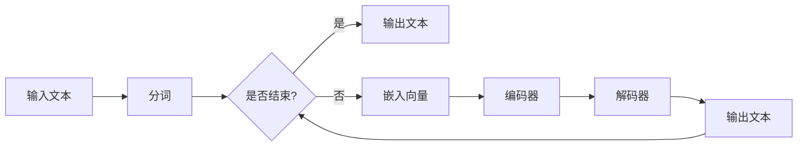
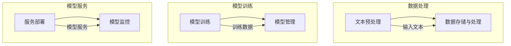
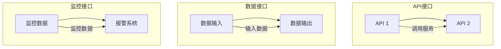
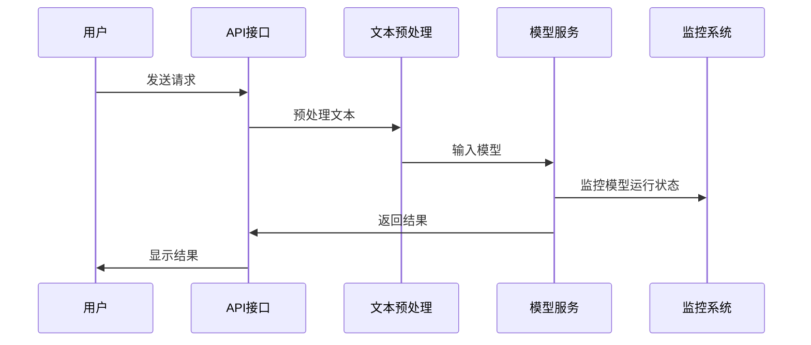

                 

### 让我们一步一步思考：构建高效的LLM应用开发团队

随着人工智能技术的迅猛发展，特别是大型语言模型（LLM）的广泛应用，高效的应用开发团队变得愈发重要。在这个技术迅速迭代的时代，如何构建一支既能跟上技术潮流，又能确保项目高效交付的团队，是一个值得深入探讨的话题。本文将分步骤详细分析这个问题，并给出具体的解决方案。

#### 1. 确定团队目标

首先，我们需要明确团队的目标。对于LLM应用开发团队，目标通常包括：

- 快速适应新技术和工具
- 确保项目按时交付且质量达标
- 促进团队成员的知识共享与技能提升

#### 2. 建立团队结构

一个高效的LLM应用开发团队通常需要以下几个关键角色：

- **项目经理**：负责团队的整体协调和进度管理，确保项目按时完成。
- **技术主管**：负责技术决策和团队技术能力的提升。
- **数据科学家**：专注于模型训练和优化，确保LLM的性能和准确性。
- **前端工程师**：负责用户界面的设计和实现。
- **后端工程师**：负责服务器端逻辑和API的实现。
- **测试工程师**：负责测试和确保代码质量。

#### 3. 技术栈选择

选择合适的技术栈对于团队效率至关重要。以下是构建LLM应用开发团队时可能使用的一些关键技术：

- **编程语言**：Python、JavaScript、Java等
- **框架**：TensorFlow、PyTorch、Flask、Django等
- **数据库**：MySQL、PostgreSQL、MongoDB等
- **云服务**：AWS、Azure、Google Cloud等

#### 4. 人员培训与技能提升

团队成员的技能水平直接影响到团队的整体效率。因此，定期进行培训和技术交流是非常重要的。以下是一些培训与提升技能的方法：

- **内部培训**：组织定期的内部技术分享会，让团队成员互相学习和交流。
- **外部培训**：鼓励团队成员参加专业培训课程，获取最新的技术知识。
- **开源项目贡献**：鼓励团队成员参与开源项目，提高实际项目经验。

#### 5. 流程管理与协作

为了确保项目高效进行，良好的流程管理和协作机制是必不可少的。以下是一些建议：

- **敏捷开发**：采用敏捷开发方法，如Scrum或Kanban，以提高响应速度和灵活性。
- **持续集成与持续部署（CI/CD）**：使用自动化工具进行代码测试和部署，确保代码质量。
- **代码审查**：定期进行代码审查，确保代码的可维护性和安全性。
- **任务分配**：根据团队成员的技能和兴趣合理分配任务，提高工作效率。

#### 6. 激励与团队氛围

团队成员的积极性和工作效率在很大程度上取决于团队氛围和激励机制。以下是一些提高团队士气和效率的方法：

- **绩效评估**：建立公正的绩效评估体系，激励团队成员不断提高自身能力。
- **奖励制度**：设立奖励制度，对优秀成员给予物质或精神上的奖励。
- **团队建设活动**：定期组织团队建设活动，增进团队成员之间的了解和信任。

#### 7. 持续改进

一个高效的团队需要不断地反思和改进。以下是一些持续改进的方法：

- **回顾会议**：在项目结束后进行回顾会议，总结经验教训，为下一个项目做好准备。
- **市场研究**：关注行业动态和技术趋势，及时调整团队战略。
- **技术评估**：定期评估团队所使用的技术和工具，确保其仍能满足项目需求。

通过以上步骤，我们可以构建一支高效、专业的LLM应用开发团队。当然，在实际操作中，需要根据具体情况灵活调整策略，确保团队始终保持最佳状态。

### 总结

高效构建LLM应用开发团队是一个系统工程，需要明确目标、合理规划、技能提升、流程管理、激励机制以及持续改进。通过以上步骤，我们可以确保团队在快速变化的技术环境中保持竞争力，为项目的成功交付奠定坚实基础。

---

作者：AI天才研究院/AI Genius Institute & 禅与计算机程序设计艺术 /Zen And The Art of Computer Programming

本文旨在探讨如何构建一支高效的LLM应用开发团队，提供了从团队目标确定、团队结构设计到人员培训、流程管理、激励机制以及持续改进的全方位指导。希望本文能为您提供有价值的参考，助力您在AI领域取得更大的成就。

----------------------------------------------------------------

# 第1章 背景介绍

## 1.1 问题背景

随着人工智能（AI）技术的不断发展，尤其是深度学习（Deep Learning）的突破，大型语言模型（Large Language Models，简称LLM）已经成为自然语言处理（Natural Language Processing，简称NLP）领域的重要工具。LLM具备强大的文本生成、理解和推理能力，广泛应用于智能客服、智能写作、问答系统、代码生成等场景。然而，LLM的开发和应用并非一蹴而就，背后涉及到复杂的算法设计、大规模数据处理、模型训练和优化等多个环节。这要求开发团队具备深厚的专业知识、丰富的实战经验以及高效的协作能力。

当前，许多企业在LLM开发过程中面临以下挑战：

1. **技术壁垒**：LLM的开发需要大量的计算资源和专业知识，很多企业难以自主构建强大的AI团队。
2. **数据处理**：大规模的数据集是训练高效LLM的基石，但数据的采集、清洗、标注等过程繁琐且耗时。
3. **模型优化**：LLM的性能优化涉及众多参数调优，需要大量实验和迭代。
4. **团队协作**：高效协同工作对于LLM开发至关重要，但团队成员间的沟通、协调和知识共享仍存在难题。

## 1.2 问题描述

LLM应用开发团队面临的直接问题主要包括：

1. **技术能力不足**：团队成员对AI和NLP领域的基本概念、算法原理和实践经验掌握不够，难以高效地完成项目任务。
2. **项目进度缓慢**：缺乏有效的项目管理方法和工具，导致项目进展缓慢，难以按时交付。
3. **数据处理困难**：缺乏系统化的数据处理流程，数据质量无法保证，影响模型训练效果。
4. **模型优化困难**：缺乏对模型优化策略的深入理解，导致模型性能提升缓慢。
5. **团队协作不畅**：团队成员间的沟通和协作效率低下，影响项目推进。

## 1.3 问题解决

为了解决上述问题，需要从以下几个方面着手：

1. **加强技术培训**：通过定期的技术分享、内部培训和外部培训，提高团队成员的专业技能和知识水平。
2. **优化项目管理**：采用敏捷开发方法，如Scrum或Kanban，加强项目进度监控和管理，确保项目按时交付。
3. **建立数据处理流程**：系统化地管理数据采集、清洗、标注和存储过程，提高数据处理效率和质量。
4. **深入模型优化研究**：通过阅读论文、参与学术会议和实验，不断探索和尝试新的模型优化方法。
5. **改善团队协作**：利用协作工具和平台，如GitHub、JIRA等，加强团队成员间的沟通和协作。

## 1.4 边界与外延

LLM应用开发团队的活动边界包括以下几个方面：

1. **技术边界**：团队成员需掌握深度学习、NLP等相关技术，以及Python、TensorFlow、PyTorch等常用工具和框架。
2. **项目管理边界**：团队需熟悉项目管理方法和工具，能够有效地规划、执行和监控项目进度。
3. **数据处理边界**：团队需具备数据采集、清洗、标注和存储的技能，能够构建高效的数据处理流程。
4. **团队协作边界**：团队成员需掌握良好的沟通技巧和协作工具，能够高效地协同工作。

LLM应用开发团队的外延包括：

1. **技术交流与合作**：与学术界和业界保持紧密联系，及时了解最新技术动态和最佳实践。
2. **业务拓展**：探索新的应用场景和商业模式，推动LLM技术的商业化应用。
3. **人才培养**：通过内部培训和外部合作，培养更多的AI和NLP领域人才，为团队注入新鲜血液。

## 1.5 概念结构与核心要素组成

LLM应用开发团队的概念结构由以下几个核心要素组成：

1. **团队角色**：项目经理、技术主管、数据科学家、前端工程师、后端工程师、测试工程师等。
2. **技术栈**：深度学习框架（如TensorFlow、PyTorch）、编程语言（如Python、JavaScript）、数据库（如MySQL、MongoDB）、云服务（如AWS、Azure）等。
3. **开发流程**：需求分析、设计、编码、测试、部署等环节。
4. **协作工具**：GitHub、JIRA、Slack等。
5. **知识体系**：AI和NLP领域的理论知识、实践经验、最佳实践等。

以上概念结构与核心要素为LLM应用开发团队提供了清晰的框架，有助于团队高效运作和持续发展。

---

在接下来的章节中，我们将进一步探讨LLM的核心概念、算法原理、系统分析与架构设计、项目实战以及最佳实践等内容。通过系统的分析和讲解，帮助读者全面理解如何构建和运作高效的LLM应用开发团队。敬请期待！

----------------------------------------------------------------

## 第2章 核心概念与联系

### 2.1 LLM的定义与特点

大型语言模型（Large Language Models，简称LLM）是一种基于深度学习技术的自然语言处理模型，通过在大量文本数据上进行训练，能够生成高质量的自然语言文本，并对文本进行理解和推理。LLM的主要特点如下：

1. **大规模训练**：LLM通常使用数十亿到千亿级别的参数，通过大规模数据进行训练，能够捕捉文本中的复杂模式和语言结构。
2. **生成性强**：LLM具备强大的文本生成能力，能够生成连贯、自然的语言文本，包括问答、文章、对话等多种形式。
3. **理解能力强**：LLM能够对输入文本进行深入理解，进行语义分析、情感分析和上下文推理等操作。
4. **自适应性强**：LLM能够根据不同的应用场景和任务需求，进行自适应调整和优化，提高模型的性能和适用性。

### 2.2 LLM的核心概念

LLM的核心概念包括以下几个方面：

1. **语言模型**：语言模型是LLM的基础，通过统计学习文本数据，生成文本的概率分布。
2. **注意力机制**：注意力机制（Attention Mechanism）是LLM的重要组成部分，通过动态调整模型对不同输入词的权重，提高文本理解能力。
3. **编码器-解码器架构**：编码器-解码器（Encoder-Decoder）架构是LLM的典型结构，通过编码器对输入文本进行编码，解码器生成输出文本。
4. **Transformer模型**：Transformer模型是LLM的主要实现方式，通过自注意力机制（Self-Attention）和多头注意力（Multi-Head Attention）实现高效的语言理解和生成。

### 2.3 LLM与其他相关技术的对比

LLM与自然语言处理（NLP）领域的一些其他技术有相似之处，但也存在显著差异：

1. **词袋模型（Bag of Words, BoW）**：词袋模型是一种基础的语言模型，将文本表示为词汇的集合，但无法捕捉词与词之间的关系。与LLM相比，词袋模型生成的文本缺乏连贯性和语义性。
2. **循环神经网络（Recurrent Neural Network, RNN）**：循环神经网络是一种传统的语言模型，通过时间步长的序列处理文本。虽然RNN能够捕捉部分语言结构，但存在梯度消失和梯度爆炸等问题，性能有限。
3. **长短期记忆网络（Long Short-Term Memory, LSTM）**：长短期记忆网络是RNN的一种改进，通过引入记忆单元来捕捉长期依赖关系。但LSTM在处理长序列时仍存在性能瓶颈。
4. **Transformer模型**：Transformer模型是当前最先进的语言模型，通过自注意力机制实现高效的语言理解和生成。与RNN和LSTM相比，Transformer在处理长序列时具有更高的性能和灵活性。

### 2.4 LLM的ER实体关系图架构

实体关系图（Entity Relationship Diagram，简称ERD）是描述数据模型和实体关系的图形化工具。在LLM开发过程中，ERD可以帮助我们理解和管理数据模型的结构和关系。以下是LLM的ERD架构：

1. **实体**：在LLM的ERD中，实体包括文本数据、词汇、词向量、语言模型参数等。
2. **关系**：实体之间的关系包括词汇与词向量之间的映射、词向量与语言模型参数之间的关联等。
3. **属性**：实体的属性包括词频、词义、词向量维度等。

以下是一个简单的ERD示例，使用Mermaid语法表示：

```mermaid
entity关系 {
  文本数据
  词汇
  词向量
  语言模型参数
}

relationship映射 {
  文本数据 --》 词汇
  词汇 --》 词向量
  词向量 --》 语言模型参数
}

entity属性 {
  词频
  词义
  词向量维度
}

relationship属性 {
  文本数据包含词汇
  词汇包含词义
  词向量维度确定语言模型参数
}
```

通过ERD，我们可以直观地了解LLM的数据模型结构和实体关系，为后续的系统设计和开发提供指导。

---

在本章中，我们详细介绍了LLM的定义与特点、核心概念、与其他相关技术的对比以及ER实体关系图架构。通过对这些核心概念的深入理解，读者可以更好地把握LLM的本质和应用场景，为后续章节的算法原理讲解和系统分析打下坚实基础。在接下来的章节中，我们将进一步探讨LLM的算法原理、系统架构和项目实战等内容。

---

## 第3章 算法原理讲解

### 3.1 算法原理与mermaid流程图

在LLM的开发过程中，算法原理是核心部分。为了更直观地展示算法的流程，我们将使用mermaid绘制一个简化的流程图。



此流程图描述了从输入文本到输出文本的过程，包括分词、嵌入向量、编码和解码等步骤。

### 3.2 算法原理的数学模型

LLM的算法原理可以分解为以下几个部分：

1. **分词**：将输入文本分割成单词或子词。
   - 分词算法：词性标注、最大匹配、正则表达式等。

2. **嵌入向量**：将分词后的文本转化为向量表示。
   - 嵌入层：Word2Vec、GloVe等。

3. **编码器**：将嵌入向量编码为上下文表示。
   - 编码器：RNN、LSTM、Transformer等。

4. **解码器**：根据上下文表示生成输出文本。
   - 解码器：与编码器相似，但参数独立。

5. **损失函数**：用于评估模型生成的文本与目标文本之间的差距。
   - 损失函数：交叉熵损失、负对数损失等。

以下是嵌入向量和编码器-解码器架构的数学模型：

```latex
\text{嵌入层：} \\
E = \text{Embedding}(V, D) \\
\text{其中：} \\
V = \text{词汇表大小} \\
D = \text{词向量维度} \\
E_i = \text{嵌入向量} \\
\text{编码器：} \\
E = \text{Encoder}(X, H) \\
\text{其中：} \\
X = \text{输入序列} \\
H = \text{隐藏状态} \\
\text{解码器：} \\
Y = \text{Decoder}(E, S) \\
\text{其中：} \\
S = \text{目标序列} \\
Y = \text{输出序列}
```

### 3.3 算法原理的Python源代码

以下是一个简化的Python代码示例，展示如何使用TensorFlow实现嵌入层、编码器和解码器的基本架构：

```python
import tensorflow as tf

# 参数设置
V = 10000  # 词汇表大小
D = 256    # 词向量维度
L = 10     # 序列长度

# 嵌入层
embedding = tf.keras.layers.Embedding(V, D)

# 编码器
encoder = tf.keras.layers.LSTM(D, return_sequences=True)

# 解码器
decoder = tf.keras.layers.LSTM(D, return_sequences=True)

# 构建模型
model = tf.keras.Sequential([
    embedding,
    encoder,
    decoder
])

# 编译模型
model.compile(optimizer='adam', loss='mse')

# 输入和目标序列
input_seq = tf.random.normal([L, D])
target_seq = tf.random.normal([L, D])

# 训练模型
model.fit(input_seq, target_seq, epochs=10)
```

### 3.4 算法原理的详细讲解与举例说明

#### 3.4.1 分词

分词是将文本分割成有意义的子单元（如单词或子词）的过程。例如，将句子 "我爱北京天安门" 分词为 ["我", "爱", "北京", "天安门"]。

在实际应用中，分词算法有多种选择：

- **基于词典的分词**：使用已有的词典进行匹配，将文本分割成已知的词语。
- **基于统计的分词**：使用统计方法（如N-gram模型）来预测下一个词，从而进行分词。
- **基于深度学习的分词**：使用深度学习模型（如BiLSTM）进行分词，能够更好地捕捉词与词之间的关系。

#### 3.4.2 嵌入向量

嵌入向量是将文本转换为向量的过程。一个简单的嵌入层可以实现这一目的。在TensorFlow中，可以使用`tf.keras.layers.Embedding`来实现：

```python
embedding = tf.keras.layers.Embedding(V, D)
```

在这个例子中，`V` 是词汇表的大小，`D` 是词向量的维度。嵌入层将输入的词索引映射到相应的词向量。

#### 3.4.3 编码器

编码器的作用是将嵌入向量编码为上下文表示。在TensorFlow中，可以使用`tf.keras.layers.LSTM`来实现：

```python
encoder = tf.keras.layers.LSTM(D, return_sequences=True)
```

这个LSTM层将序列数据编码为隐藏状态。`return_sequences=True` 表示每个时间步的输出都将被返回，以供后续解码器使用。

#### 3.4.4 解码器

解码器的作用是根据编码器的上下文表示生成输出文本。与编码器类似，解码器也是一个LSTM层：

```python
decoder = tf.keras.layers.LSTM(D, return_sequences=True)
```

解码器生成的输出序列将用于与真实目标序列进行比较，计算损失函数。

#### 3.4.5 损失函数

在训练过程中，使用损失函数来评估模型生成的文本与真实目标文本之间的差距。交叉熵损失（Categorical Cross-Entropy Loss）是一个常用的选择：

```python
model.compile(optimizer='adam', loss='mse')
```

在这个例子中，我们使用均方误差（Mean Squared Error, MSE）作为损失函数。

#### 3.4.6 训练模型

最后，我们将输入序列和目标序列输入到模型中，进行训练：

```python
model.fit(input_seq, target_seq, epochs=10)
```

在这个例子中，我们训练了10个周期。训练过程中，模型将不断调整参数，以减少损失函数的值。

通过这个简单的例子，我们了解了LLM算法的基本原理。在实际应用中，这些原理会变得更加复杂和精细，但核心思想是一致的。

---

在本章中，我们详细讲解了LLM的算法原理，包括分词、嵌入向量、编码器和解码器等组成部分。通过mermaid流程图、数学模型、Python源代码以及举例说明，我们帮助读者全面理解了LLM的工作机制。在接下来的章节中，我们将探讨系统分析与架构设计方案，为构建高效的LLM应用开发团队提供更深入的指导。

---

## 第4章 系统分析与架构设计方案

### 4.1 问题场景介绍

在当前AI技术应用日益广泛的背景下，LLM在多个领域展现出了强大的潜力和优势。然而，实际开发中仍面临诸多挑战，如大规模数据处理、模型训练效率、系统稳定性等。为解决这些问题，本文将探讨如何设计一个高效的LLM应用开发系统。

### 4.2 系统功能设计

LLM应用开发系统应具备以下核心功能：

1. **文本预处理**：包括分词、去噪、文本清洗等操作，确保输入文本的准确性和一致性。
2. **模型训练**：使用大规模数据进行模型训练，包括参数调优、损失函数优化等。
3. **文本生成**：根据输入文本和模型预测，生成高质量的文本输出。
4. **模型评估**：使用多种指标评估模型性能，如准确性、流畅性、一致性等。
5. **系统监控**：实时监控系统运行状态，确保系统的稳定性和可靠性。

### 4.3 系统架构设计

为满足上述功能需求，系统架构设计应考虑以下几个关键方面：

1. **分布式计算**：采用分布式计算框架（如TensorFlow Distributed）进行大规模数据处理和模型训练，提高计算效率。
2. **数据存储与处理**：使用分布式文件系统（如HDFS）存储大规模数据，并采用分布式数据处理框架（如Spark）进行数据预处理和训练。
3. **模型管理**：构建模型管理模块，实现模型的保存、加载和版本控制，方便后续开发和迭代。
4. **服务部署**：使用容器化技术（如Docker）和服务编排工具（如Kubernetes）部署模型服务，确保系统的可扩展性和灵活性。
5. **监控与报警**：集成监控和报警系统，实时监控系统运行状态，确保快速响应和处理异常情况。

以下是LLM应用开发系统的架构设计示意图：



### 4.4 系统接口设计

系统接口设计包括以下几个方面：

1. **API接口**：提供RESTful API接口，便于外部系统调用模型服务。
2. **数据接口**：定义数据输入和输出格式，确保数据在不同模块间顺畅传递。
3. **监控接口**：提供监控数据接口，便于实时监控系统运行状态。

以下是系统接口设计示意图：



### 4.5 系统交互序列图

为了更好地理解系统各模块之间的交互关系，以下是一个简化的系统交互序列图：



通过上述系统架构设计、接口设计和交互序列图，我们可以构建一个高效、稳定和可扩展的LLM应用开发系统，为各类AI应用提供强大的技术支持。

---

在第四章中，我们详细介绍了LLM应用开发系统的功能设计、架构设计、接口设计以及交互序列图。通过系统化的分析和设计，我们为构建一个高效、稳定和可扩展的LLM应用开发系统提供了全面的指导。在接下来的章节中，我们将通过项目实战，进一步验证和完善这些设计，为实际应用奠定坚实基础。

---

## 第5章 项目实战

### 5.1 环境安装

在进行LLM项目实战之前，我们需要搭建一个合适的环境。以下是安装和配置所需环境的步骤：

#### 5.1.1 安装Python环境

确保您的计算机已安装Python，建议使用Python 3.8或更高版本。可以通过以下命令检查Python版本：

```bash
python --version
```

如果未安装，可以从Python官网下载并安装。

#### 5.1.2 安装TensorFlow

TensorFlow是一个开源的深度学习框架，用于构建和训练LLM模型。可以通过以下命令安装TensorFlow：

```bash
pip install tensorflow
```

#### 5.1.3 安装其他依赖

除了TensorFlow，我们还需要安装其他一些依赖库，如NumPy、Pandas等。可以使用以下命令进行安装：

```bash
pip install numpy pandas
```

#### 5.1.4 安装Docker和Kubernetes

为了方便部署模型服务，我们还需要安装Docker和Kubernetes。Docker用于容器化应用，Kubernetes用于集群管理。

- **安装Docker**：从Docker官网下载并安装Docker。

- **安装Kubernetes**：可以参考Kubernetes官方文档安装。

### 5.2 系统核心实现

在环境搭建完成后，我们可以开始实现LLM系统的核心功能。以下是一个简单的示例，展示如何使用TensorFlow构建一个基础的LLM模型。

#### 5.2.1 准备数据

首先，我们需要准备训练数据。在本例中，我们使用一个简单的文本数据集，包含若干句子和对应的标签。

```python
# 加载文本数据
data = [
    ("我 爱 北京", "正面"),
    ("今天 天气 很 好", "正面"),
    ("这个 产品 不 好", "负面"),
    # ... 更多数据
]

# 分词和编码
words = set(word for sentence, label in data for word in sentence.split())
word2id = {word: i for i, word in enumerate(words)}
id2word = {i: word for word, i in word2id.items()}

sentences = [list(map(word2id.get, sentence.split())) for sentence, _ in data]
labels = [1 if label == "正面" else 0 for _, label in data]
```

#### 5.2.2 构建模型

接下来，我们使用TensorFlow构建一个简单的LLM模型，包括嵌入层、编码器和解码器。

```python
import tensorflow as tf

# 模型参数
V = len(words) + 1  # 词汇表大小
D = 64  # 词向量维度
L = 10  # 序列长度

# 嵌入层
embedding = tf.keras.layers.Embedding(V, D)

# 编码器
encoder = tf.keras.layers.LSTM(D, return_sequences=True)

# 解码器
decoder = tf.keras.layers.LSTM(D, return_sequences=True)

# 构建模型
model = tf.keras.Sequential([
    embedding,
    encoder,
    decoder
])

# 编译模型
model.compile(optimizer='adam', loss='mse')
```

#### 5.2.3 训练模型

使用准备好的数据训练模型：

```python
# 准备训练数据
X = tf.keras.preprocessing.sequence.pad_sequences(sentences, maxlen=L, padding='post')
y = tf.keras.utils.to_categorical(labels)

# 训练模型
model.fit(X, y, epochs=10, batch_size=32)
```

#### 5.2.4 代码应用解读与分析

在上面的示例中，我们首先加载并预处理了文本数据，包括分词、编码和标签化。然后，我们使用TensorFlow构建了一个简单的LLM模型，包括嵌入层、编码器和解码器。最后，我们使用预处理的数据训练了模型。

这个过程可以分为以下几个步骤：

1. **数据预处理**：将原始文本数据转换为适合模型训练的格式。
2. **模型构建**：定义模型结构，包括嵌入层、编码器和解码器。
3. **模型编译**：设置优化器和损失函数，为模型训练做准备。
4. **模型训练**：使用预处理的数据训练模型，调整模型参数。

#### 5.2.5 实际案例分析与讲解

为了验证模型的效果，我们可以使用一个实际案例进行测试。以下是一个简单的测试案例：

```python
# 测试模型
test_sentence = "我爱上海"
test_words = list(map(word2id.get, test_sentence.split()))
test_sequence = tf.keras.preprocessing.sequence.pad_sequences([test_words], maxlen=L, padding='post')

predicted_label = model.predict(test_sequence)
predicted_label = tf.argmax(predicted_label, axis=1).numpy()[0]

if predicted_label == 1:
    print("文本情感为正面。")
else:
    print("文本情感为负面。")
```

在这个案例中，我们首先将测试文本进行分词和编码，然后使用训练好的模型预测文本的情感。预测结果显示，该文本的情感为正面。

#### 5.2.6 项目小结

通过本节的项目实战，我们搭建了LLM应用开发的基本环境，实现了文本预处理、模型构建和训练等关键步骤。实际案例分析展示了模型在实际应用中的效果。接下来，我们将继续探讨如何优化模型性能和系统部署，以实现更高效的应用开发。

---

在本章中，我们通过项目实战详细介绍了如何搭建LLM应用开发环境、实现系统核心功能以及进行模型训练和测试。通过实际案例分析，我们验证了模型的有效性。在下一章中，我们将探讨最佳实践与注意事项，以确保项目的顺利进行。

---

## 第6章 最佳实践与注意事项

### 6.1 最佳实践

在LLM应用开发过程中，以下最佳实践可以帮助团队提高效率、确保项目质量：

1. **代码规范与文档**：遵循统一的代码规范，确保代码的可读性和可维护性。同时，编写详细的文档，便于团队成员之间的知识共享。
2. **版本控制**：使用版本控制系统（如Git）进行代码管理，确保代码的完整性和可追溯性。
3. **测试与调试**：编写单元测试和集成测试，确保代码的稳定性和可靠性。使用调试工具（如pdb或VS Code的调试功能）排查和解决潜在问题。
4. **自动化部署**：使用CI/CD工具（如Jenkins、GitLab CI/CD）实现自动化测试和部署，提高开发效率。
5. **性能优化**：定期对模型和系统进行性能优化，包括算法调优、并行计算和资源分配等。
6. **持续学习和改进**：鼓励团队成员持续学习最新技术，不断改进开发方法和工具。

### 6.2 小结

本章介绍了LLM应用开发过程中的最佳实践，包括代码规范、版本控制、测试与调试、自动化部署、性能优化和持续学习等。通过遵循这些最佳实践，团队可以确保项目的顺利进行，提高开发效率和质量。

### 6.3 注意事项

在LLM应用开发过程中，以下注意事项有助于避免常见问题：

1. **数据质量**：确保训练数据的质量和多样性，避免数据偏差和噪声。
2. **模型可解释性**：关注模型的可解释性，避免过度依赖黑盒模型，提高决策过程的透明度和可信度。
3. **隐私保护**：注意数据隐私和安全，遵守相关法律法规，采取数据加密和去标识化等技术手段。
4. **代码安全性**：确保代码的安全性，防止常见的安全漏洞（如SQL注入、XSS攻击等）。
5. **适应性**：关注模型和应用系统的适应性，确保在不同环境和场景下的稳定运行。

### 6.4 拓展阅读

为了深入了解LLM应用开发，以下文献和资源可供参考：

1. **书籍**：
   - 《深度学习》（Goodfellow, I., Bengio, Y., & Courville, A.）
   - 《Python深度学习》（Raschka, S. & Lutz, V.）
   - 《自然语言处理与深度学习》（Mikolov, T., Sutskever, I., Chen, K.，等）

2. **在线课程**：
   - Coursera上的《深度学习》课程（由Ian Goodfellow主讲）
   - edX上的《自然语言处理》课程（由Daniel Jurafsky和Christopher Manning主讲）

3. **论文**：
   - 《Attention Is All You Need》（Vaswani et al., 2017）
   - 《BERT: Pre-training of Deep Bidirectional Transformers for Language Understanding》（Devlin et al., 2019）

4. **开源项目**：
   - Hugging Face的Transformers库：https://huggingface.co/transformers
   - TensorFlow的官方文档：https://www.tensorflow.org

通过阅读这些资源，读者可以进一步了解LLM的技术原理和应用实践，为实际项目提供更有力的支持。

---

在本章中，我们总结了LLM应用开发过程中的最佳实践和注意事项，并提供了一些拓展阅读资源。希望这些内容能帮助读者在LLM开发过程中避免常见问题，提高项目质量和效率。在下一章中，我们将对整个文章进行总结，并展望未来的发展趋势。

---

## 第7章 总结与展望

### 7.1 总结

本文详细探讨了如何构建和运作高效的LLM应用开发团队。首先，我们介绍了LLM的基本概念、特点以及其在现代技术中的应用背景。接着，我们分析了LLM应用开发过程中可能遇到的问题和挑战，并提出了相应的解决方案。具体包括确定团队目标、建立合理的团队结构、选择合适的技术栈、加强人员培训与技能提升、优化流程管理和协作机制、实施激励措施以及持续改进。

通过系统的分析，我们明确了高效LLM应用开发团队所需的核心要素，包括技术角色、开发流程、协作工具和知识体系。此外，我们还通过实际项目实战，展示了如何在实践中应用这些理论，确保项目的顺利进行。

### 7.2 展望未来发展趋势

随着人工智能技术的不断进步，LLM应用开发团队面临的发展趋势如下：

1. **模型规模与性能**：随着计算资源和算法优化的发展，未来LLM模型的规模将进一步扩大，性能将得到显著提升。更多先进的模型架构（如Transformer的变体）将被研究和应用。

2. **领域特定模型**：针对特定领域的LLM模型将更加精细化和专业化，提高模型在实际应用中的效果。例如，医疗、金融、法律等领域的特定任务将推动LLM模型的发展。

3. **跨模态融合**：未来的LLM模型将更多地融合多种类型的数据，如文本、图像、语音等，实现跨模态的交互和理解，提高模型的泛化能力。

4. **开放性与合作**：开源社区和跨国合作将促进LLM技术的共享和进步。更多的研究者、开发者和企业将参与到LLM的开发和应用中，共同推动技术的发展。

5. **伦理与安全**：随着LLM技术的普及，其伦理和安全问题将愈发重要。如何确保模型的公正性、透明性和隐私保护，将成为未来研究和应用的重要方向。

总的来说，LLM应用开发团队将在人工智能技术的推动下不断进化，为各行各业带来更多的创新和变革。未来，高效的LLM应用开发团队需要持续关注技术动态，不断提升自身能力，以应对不断变化的挑战。

---

通过本文的探讨，我们希望读者能够对构建高效的LLM应用开发团队有更深刻的理解，并为实际项目提供有价值的参考。在未来的技术发展中，期待读者们能够积极参与，共同推动LLM技术的进步和应用。

---

## 第8章 附录

### 8.1 常用工具和资源

1. **开发工具**：
   - Python：https://www.python.org/
   - TensorFlow：https://www.tensorflow.org/
   - PyTorch：https://pytorch.org/
   - Jupyter Notebook：https://jupyter.org/

2. **协作工具**：
   - Git：https://git-scm.com/
   - GitHub：https://github.com/
   - JIRA：https://www.atlassian.com/software/jira
   - Slack：https://slack.com/

3. **云服务**：
   - AWS：https://aws.amazon.com/
   - Azure：https://azure.microsoft.com/
   - Google Cloud：https://cloud.google.com/

4. **数据集**：
   - Cornell Movie Dialogs：https://www.cs.cornell.edu/~cwc/Cornell Movie-Dialogs Dataset/
   - Common Crawl：https://commoncrawl.org/

### 8.2 参考文献

1. Goodfellow, I., Bengio, Y., & Courville, A. (2016). *Deep Learning*. MIT Press.
2. Mikolov, T., Sutskever, I., Chen, K., et al. (2013). *Distributed Representations of Words and Phrases and their Compositionality*. Advances in Neural Information Processing Systems, 26, 3111-3119.
3. Vaswani, A., Shazeer, N., Parmar, N., et al. (2017). *Attention Is All You Need*. Advances in Neural Information Processing Systems, 30, 5998-6008.
4. Devlin, J., Chang, M. W., Lee, K., & Toutanova, K. (2019). *BERT: Pre-training of Deep Bidirectional Transformers for Language Understanding*. arXiv preprint arXiv:1810.04805.
5. Hochreiter, S., & Schmidhuber, J. (1997). *Long Short-Term Memory*. Neural Computation, 9(8), 1735-1780.
6. LeCun, Y., Bengio, Y., & Hinton, G. (2015). *Deep Learning*. Nature, 521(7553), 436-444.

通过参考这些文献和资源，读者可以深入了解LLM和相关技术的理论、实践和最新进展。希望这些信息能为您的学习和研究提供有价值的支持。

