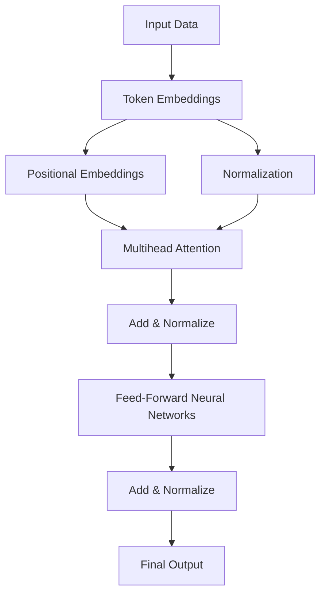
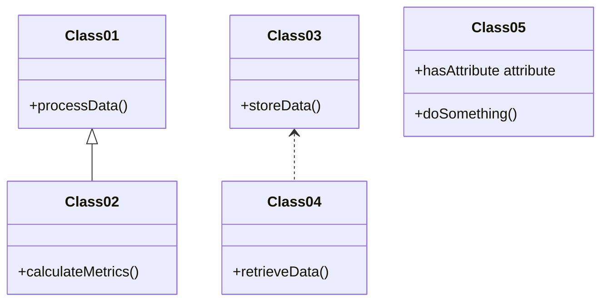
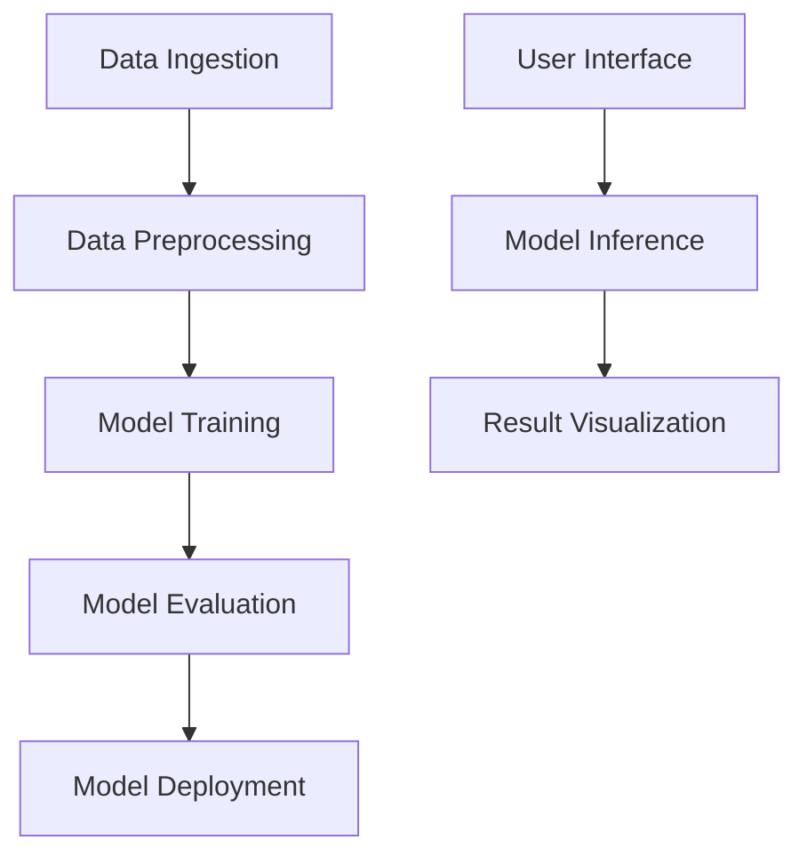
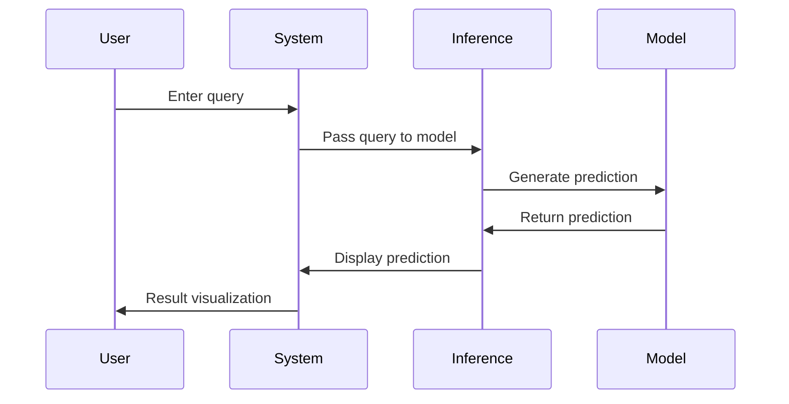

                 

### Chapter 1: Introduction to LLM and Application Development Workflow

In the era of artificial intelligence, Large Language Models (LLMs) have emerged as transformative technologies, revolutionizing various industries such as natural language processing, machine learning, and data analysis. This chapter serves as an introduction to LLMs and their application development workflow, providing a comprehensive overview of the concepts, challenges, and the need for an efficient development workflow.

#### 1.1 Background and Problem Statement

##### 1.1.1 Rise of Large Language Models (LLMs)
The advent of LLMs can be traced back to the development of deep learning techniques and the availability of vast amounts of data. LLMs are sophisticated machine learning models that can understand, generate, and manipulate human language with remarkable accuracy. This capability has led to a surge in applications such as chatbots, virtual assistants, content generation, and language translation.

##### 1.1.2 Challenges in LLM Application Development
Developing applications that effectively utilize LLMs poses several challenges. These include:
- **Data Privacy and Security:** LLMs require large amounts of data, often leading to concerns about data privacy and security.
- **Scalability:** As LLMs grow in complexity, ensuring that they can handle large-scale operations becomes critical.
- **Efficiency:** Developing applications that can run LLMs efficiently on limited hardware resources is challenging.
- **Interoperability:** Integrating LLMs with existing systems and ensuring seamless communication between components is complex.

##### 1.1.3 The Need for an Efficient Development Workflow
To overcome these challenges, an efficient development workflow for LLM applications is essential. This workflow should include:
- **Robust Architecture:** A well-designed architecture that supports scalability, efficiency, and interoperability.
- **Modularization:** Breaking down the development process into modular components for easier management and maintenance.
- **Continuous Integration and Deployment (CI/CD):** Automating the testing and deployment of LLM applications to ensure reliability and speed.
- **Performance Optimization:** Techniques for optimizing the performance of LLM applications on limited hardware.

#### 1.2 Core Concepts and Relationships

##### 1.2.1 Definition of LLMs
LLMs are neural network-based models that are trained on massive amounts of text data to understand and generate human language. They are designed to handle complex language structures, context, and semantics, making them suitable for a wide range of applications.

##### 1.2.2 Key Attributes and Comparison of LLMs
The key attributes of LLMs include:
- **Size:** LLMs range in size from hundreds of millions to billions of parameters.
- **Training Data:** LLMs are trained on diverse and extensive datasets to ensure generalization.
- **Performance:** LLMs exhibit high accuracy in language understanding and generation tasks.
- **Flexibility:** LLMs can be adapted for various applications through fine-tuning and transfer learning.

To compare LLMs, we can create a comparison table that highlights their key attributes:

| Attribute          | GPT-3           | BERT             | T5              |
|--------------------|-----------------|------------------|-----------------|
| Size               | 175 billion     | 335 million      | 11 billion      |
| Training Data      | Internet-scale  | Wikipedia        | Dataset         |
| Performance        | High            | Moderate         | High            |
| Flexibility        | High            | Moderate         | High            |

##### 1.2.3 Entity Relationship Diagram (ERD) of LLM Components
To visualize the relationship between the components of an LLM, we can use an ERD. This diagram will include entities such as:
- **Input Data:** Text data used for training and inference.
- **Model:** The neural network architecture representing the LLM.
- **Preprocessing:** Steps for preparing input data.
- **Inference:** The process of generating output based on input data.
- **Postprocessing:** Steps for refining output data.

The ERD can be represented using the Mermaid diagramming language:

```mermaid
erDiagram
  InputData --> Model
  Model --> Preprocessing
  Model --> Inference
  Model --> Postprocessing
  InputData ||--|{ Preprocessing }
  Inference ||--|{ Postprocessing }
```

#### 1.3 Mathematical Models and Theoretical Foundations

##### 1.3.1 Mathematical Formulation of LLM Algorithms
The core of LLM algorithms is based on the Transformer model, which consists of multiple layers of self-attention mechanisms and feed-forward neural networks. The mathematical formulation of a Transformer model can be represented as follows:

$$
\text{Transformer}(X) = \text{softmax}\left(\frac{\text{Q}K^T}{\sqrt{d_k}} + \text{V}V^T\right)
$$

where:
- $X$ is the input data.
- $\text{Q}$, $\text{K}$, and $\text{V}$ are the query, key, and value matrices.
- $d_k$ is the dimension of the key vectors.
- $\text{softmax}$ is the softmax activation function.

##### 1.3.2 Explaining the Models with Mermaid Diagrams
To illustrate the Transformer model, we can use a Mermaid diagram:



##### 1.3.3 Example Illustrations and Python Code Explanations
To provide a clearer understanding, let's consider a simple example of the Transformer model using Python code. The following code snippet demonstrates the initialization and forward pass of a Transformer model:

```python
import torch
import torch.nn as nn

class Transformer(nn.Module):
    def __init__(self, d_model, nhead, num_layers):
        super(Transformer, self).__init__()
        self.transformer = nn.Transformer(d_model, nhead, num_layers)
    
    def forward(self, src, tgt):
        return self.transformer(src, tgt)

# Initialize the Transformer model
d_model = 512
nhead = 8
num_layers = 3

model = Transformer(d_model, nhead, num_layers)

# Prepare input data
src = torch.rand(10, d_model)
tgt = torch.rand(10, d_model)

# Forward pass
output = model(src, tgt)

print(output)
```

This example initializes a Transformer model with the specified parameters and performs a forward pass using random input data. The output represents the transformed sequence.

In conclusion, this chapter has provided an introduction to LLMs and their application development workflow. It has covered the background and challenges in LLM development, key attributes of LLMs, and their relationship using an ERD. Furthermore, it has discussed the mathematical models and theoretical foundations of LLM algorithms with illustrative examples. This foundation will be crucial for understanding the subsequent chapters, which delve deeper into architectural design, practical implementation, and optimization techniques for LLM applications.

---

### Chapter 2: Architectural Design of LLM Applications

In this chapter, we will explore the architectural design of LLM applications, focusing on system architecture, module design, and interface design. This section is essential for understanding how LLM applications are structured and how their components interact with each other.

#### 2.1 System Architecture Design

##### 2.1.1 Overview of System Architecture
The system architecture of an LLM application is the foundation upon which the entire system is built. It determines the system's scalability, performance, and maintainability. A well-designed architecture ensures that the system can efficiently process large amounts of data and provide accurate results.

##### 2.1.2 Module Design Using Mermaid Class Diagrams
To illustrate the module design of an LLM application, we can use Mermaid class diagrams. These diagrams provide a visual representation of the system's components and their relationships. Here is an example of a Mermaid class diagram for an LLM application:



In this diagram:
- **Class01** represents the main class of the application.
- **Class02** and **Class03** are subclasses that extend Class01.
- **Class04** is associated with Class01 and Class03 through a dependency relationship.
- **Class05** has attributes and methods that define its behavior.

##### 2.1.3 High-Level Architecture Using Mermaid Diagrams
For a high-level overview of the system architecture, we can use a Mermaid diagram to represent the main components and their interactions. Here is an example of a high-level architecture diagram for an LLM application:



In this diagram:
- **A** represents data ingestion, where raw data is collected from various sources.
- **B** represents data preprocessing, where the data is cleaned and prepared for training.
- **C** represents model training, where the LLM model is trained on the preprocessed data.
- **D** represents model evaluation, where the trained model is evaluated for performance.
- **E** represents model deployment, where the trained model is deployed for inference.
- **F** represents the user interface, through which users interact with the system.
- **G** represents model inference, where the deployed model generates predictions based on user input.
- **H** represents result visualization, where the predictions are presented to the user in a meaningful way.

#### 2.2 Interface Design and System Interaction

##### 2.2.1 Interface Design Principles
Interface design is a critical aspect of LLM applications. It involves creating user-friendly interfaces that enable users to interact with the system effectively. The following principles should be considered when designing interfaces:
- **User-Centric Design:** The interface should be designed with the user in mind, ensuring that it meets their needs and preferences.
- **Consistency:** The interface should maintain consistency in terms of design elements, layout, and functionality.
- **Clarity:** The interface should be clear and easy to understand, minimizing the learning curve for new users.
- **Responsiveness:** The interface should be responsive and adapt to different screen sizes and devices.

##### 2.2.2 System Interaction Using Mermaid Sequence Diagrams
To visualize the interaction between the system components, we can use Mermaid sequence diagrams. Here is an example of a sequence diagram that illustrates the interaction between the user interface, model inference, and result visualization:



In this diagram:
- **User** initiates the interaction by entering a query.
- **System** receives the query and passes it to the **Inference** module.
- **Inference** module processes the query using the LLM model and generates a prediction.
- **Model** returns the prediction to **Inference**.
- **Inference** displays the prediction to the **System**.
- **System** presents the result visualization to the **User**.

By following these principles and visualizing the system interaction, we can create an effective and user-friendly interface for LLM applications.

In summary, this chapter has discussed the architectural design of LLM applications, covering system architecture, module design, and interface design. By understanding these components and their interactions, developers can build efficient and scalable LLM applications that meet user needs and provide accurate results.

---

### Chapter 3: Practical Implementation of LLM Applications

In this chapter, we will delve into the practical implementation of LLM applications. This involves setting up the development environment, understanding the core implementation details, and analyzing the code step by step. Additionally, we will explore real-world applications and case studies to provide practical insights and examples.

#### 3.1 Environment Setup and Pre-requisites

Before diving into the core implementation, it is essential to set up the development environment. This involves installing the necessary software and configuring the environment to support the development of LLM applications.

##### 3.1.1 Required Software and Hardware Configurations

The following software and hardware configurations are recommended for developing LLM applications:
- **Operating System:** Ubuntu 18.04 or later
- **Python:** Python 3.8 or later
- **Deep Learning Framework:** PyTorch or TensorFlow
- **Hardware:** GPU with CUDA support (NVIDIA GPUs recommended)
- **Additional Tools:** Jupyter Notebook, Git, and Mermaid Diagramming Language

##### 3.1.2 Step-by-Step Installation Guide

To set up the development environment, follow these steps:

1. **Install Ubuntu 18.04 or later:** Download and install the latest version of Ubuntu from the official website.
2. **Update the system:** Open a terminal and run the following commands to update the system packages:
   ```bash
   sudo apt update
   sudo apt upgrade
   ```
3. **Install Python 3.8 or later:** Install Python 3.8 or later using the package manager:
   ```bash
   sudo apt install python3.8
   ```
4. **Install Deep Learning Framework:** Install either PyTorch or TensorFlow. For PyTorch, run:
   ```bash
   pip3 install torch torchvision torchaudio
   ```
   For TensorFlow, run:
   ```bash
   pip3 install tensorflow
   ```
5. **Install Jupyter Notebook:** Install Jupyter Notebook for interactive development:
   ```bash
   pip3 install notebook
   ```
6. **Install Git:** Install Git for version control:
   ```bash
   sudo apt install git
   ```
7. **Install Mermaid:** Install Mermaid for generating diagrams:
   ```bash
   npm install -g mermaid
   ```

After completing these steps, the development environment is set up, and you can proceed with the core implementation of LLM applications.

#### 3.2 Core Implementation

The core implementation of LLM applications involves creating and training the LLM model, as well as deploying and utilizing it for inference. In this section, we will walk through the code step by step and explain the key components and processes.

##### 3.2.1 Key Code Implementation

Let's consider a simple example of implementing a Transformer model using PyTorch. The following code snippet demonstrates the initialization and training of the model:

```python
import torch
import torch.nn as nn
from torch.optim import Adam

# Define the Transformer model
class Transformer(nn.Module):
    def __init__(self, d_model, nhead, num_layers):
        super(Transformer, self).__init__()
        self.transformer = nn.Transformer(d_model, nhead, num_layers)
    
    def forward(self, src, tgt):
        return self.transformer(src, tgt)

# Initialize the model
d_model = 512
nhead = 8
num_layers = 3

model = Transformer(d_model, nhead, num_layers)

# Prepare the input data
src = torch.rand(10, d_model)
tgt = torch.rand(10, d_model)

# Define the loss function and optimizer
criterion = nn.CrossEntropyLoss()
optimizer = Adam(model.parameters(), lr=0.001)

# Training the model
for epoch in range(10):
    optimizer.zero_grad()
    output = model(src, tgt)
    loss = criterion(output, tgt)
    loss.backward()
    optimizer.step()
    print(f"Epoch {epoch + 1}, Loss: {loss.item()}")

print("Model training completed.")
```

In this code:
- **Model Initialization:** We define the Transformer model with the specified parameters and initialize it using the `nn.Module` class.
- **Input Data Preparation:** We generate random input data using the `torch.rand()` function.
- **Loss Function and Optimizer:** We define the loss function (cross-entropy loss) and optimizer (Adam optimizer) for training the model.
- **Training the Model:** We iterate through the epochs, forward pass the input data through the model, calculate the loss, perform backpropagation, and update the model parameters.

##### 3.2.2 Code Analysis and Interpretation

Now, let's analyze the code step by step to understand its functionality and components:

1. **Model Definition:**
   ```python
   class Transformer(nn.Module):
       def __init__(self, d_model, nhead, num_layers):
           super(Transformer, self).__init__()
           self.transformer = nn.Transformer(d_model, nhead, num_layers)
       
       def forward(self, src, tgt):
           return self.transformer(src, tgt)
   ```
   This section defines the Transformer model class. It initializes the model with the specified parameters (`d_model`, `nhead`, and `num_layers`) and defines the forward pass method, which performs the transformation using the Transformer architecture.

2. **Input Data Preparation:**
   ```python
   src = torch.rand(10, d_model)
   tgt = torch.rand(10, d_model)
   ```
   We generate random input data (`src` and `tgt`) using the `torch.rand()` function. These tensors represent the input sequences for training the model.

3. **Loss Function and Optimizer:**
   ```python
   criterion = nn.CrossEntropyLoss()
   optimizer = Adam(model.parameters(), lr=0.001)
   ```
   We define the loss function (cross-entropy loss) and optimizer (Adam optimizer) for training the model. The cross-entropy loss measures the dissimilarity between the predicted and target sequences, while the Adam optimizer updates the model parameters based on the gradients.

4. **Training the Model:**
   ```python
   for epoch in range(10):
       optimizer.zero_grad()
       output = model(src, tgt)
       loss = criterion(output, tgt)
       loss.backward()
       optimizer.step()
       print(f"Epoch {epoch + 1}, Loss: {loss.item()}")
   ```
   We iterate through the epochs, forward pass the input data through the model, calculate the loss, perform backpropagation, and update the model parameters using the optimizer. This process is repeated for a specified number of epochs (in this example, 10).

##### 3.2.3 Example Applications and Case Studies

To further illustrate the practical implementation of LLM applications, let's consider a real-world case study: chatbot development using a pre-trained LLM model. The following code snippet demonstrates how to fine-tune a pre-trained model on a custom dataset and deploy it for chatbot interactions:

```python
from torch.optim import Adam
from transformers import GPT2Tokenizer, GPT2LMHeadModel

# Load the pre-trained model and tokenizer
model = GPT2LMHeadModel.from_pretrained('gpt2')
tokenizer = GPT2Tokenizer.from_pretrained('gpt2')

# Prepare the custom dataset
train_data = "your custom training data"
train_encodings = tokenizer.encode(train_data, add_special_tokens=True, return_tensors='pt')

# Define the training function
def train(model, train_encodings, epoch, optimizer):
    model.train()
    for i in range(epoch):
        optimizer.zero_grad()
        outputs = model(train_encodings)
        loss = outputs.loss
        loss.backward()
        optimizer.step()
        print(f"Epoch {i + 1}, Loss: {loss.item()}")

# Fine-tune the model
optimizer = Adam(model.parameters(), lr=0.001)
train(model, train_encodings, 5, optimizer)

# Deploy the model for chatbot interactions
def chatbot(response):
    input_ids = tokenizer.encode(response, add_special_tokens=True, return_tensors='pt')
    output = model.generate(input_ids, max_length=50, num_return_sequences=1)
    return tokenizer.decode(output[0], skip_special_tokens=True)

# Example chatbot interaction
user_input = "Hello, how can I help you today?"
bot_response = chatbot(user_input)
print(f"Bot Response: {bot_response}")
```

In this code:
- **Pre-trained Model and Tokenizer:** We load a pre-trained GPT-2 model and tokenizer from the Hugging Face Model Hub.
- **Custom Dataset Preparation:** We prepare a custom training dataset and encode it using the tokenizer.
- **Training Function:** We define a training function that fine-tunes the model on the custom dataset for a specified number of epochs.
- **Chatbot Deployment:** We define a chatbot function that takes user input, encodes it using the tokenizer, generates a response using the fine-tuned model, and decodes the response for display.

By following this example, developers can build and deploy chatbots using pre-trained LLM models and fine-tune them on custom datasets to improve their performance and relevance to specific use cases.

In conclusion, this chapter has covered the practical implementation of LLM applications, including environment setup, core implementation details, and real-world applications. By understanding and implementing these concepts, developers can build efficient and scalable LLM applications that provide accurate and meaningful results.

---

### Chapter 4: Optimization Techniques for LLM Applications

As Large Language Models (LLMs) become more complex and powerful, the need for optimization techniques to improve their performance and efficiency becomes increasingly critical. This chapter will explore various optimization techniques, including model compression, parallelization, and GPU acceleration, along with case studies and best practices for deploying and optimizing LLM applications.

#### 4.1 Model Compression

Model compression is an essential technique for reducing the size of LLM models without significantly compromising their performance. This can be achieved through various methods such as quantization, pruning, and knowledge distillation.

##### 4.1.1 Techniques for Model Compression

1. **Quantization:**
Quantization is the process of reducing the precision of the weights and activations in a neural network model. This can significantly reduce the model size while maintaining reasonable performance. There are different quantization methods, such as:
   - **Integer Quantization:** Maps weights and activations to a finite set of integer values.
   - **Binary Quantization:** Maps weights and activations to binary values (0 or 1).

2. **Pruning:**
Pruning involves removing unnecessary weights and connections from the neural network model. This can reduce the model size and computational complexity while preserving important information. There are different pruning methods, such as:
   - **Structural Pruning:** Removes entire layers or connections based on their importance.
   - **Weight Pruning:** Removes individual weights based on their magnitude.

3. **Knowledge Distillation:**
Knowledge distillation is a technique where a small, simpler model (student) is trained to mimic the behavior of a larger, more complex model (teacher). This can transfer the knowledge and performance of the larger model to the smaller one, resulting in a compressed model with similar accuracy.

##### 4.1.2 Case Study: Model Compression with Quantization and Pruning

Let's consider a case study where we apply quantization and pruning techniques to compress a BERT model. We will use the Hugging Face Transformers library to implement these techniques.

```python
from transformers import BertModel, BertConfig, BertTokenizer
import torch
import torch.nn as nn

# Load the original BERT model
model = BertModel.from_pretrained('bert-base-uncased')
tokenizer = BertTokenizer.from_pretrained('bert-base-uncased')

# Define the student model
class CompressedBertModel(nn.Module):
    def __init__(self, config):
        super(CompressedBertModel, self).__init__(config)
        self.bert = nn.BertModel(config)
    
    def forward(self, input_ids, attention_mask):
        return self.bert(input_ids, attention_mask)

# Configure the compressed model
config = BertConfig.from_pretrained('bert-base-uncased')
config.hidden_size = 128
compressed_model = CompressedBertModel(config)

# Quantize the weights
quantize_model = nn.utils.quantize_weight(compressed_model, compression='int8')

# Prune the weights
prune_model = nn.utils.prune.prune_model(compressed_model, pruning_method='weight_mask', amount=0.2)

# Train the compressed and pruned model
optimizer = Adam(prune_model.parameters(), lr=0.001)
criterion = nn.CrossEntropyLoss()

for epoch in range(5):
    optimizer.zero_grad()
    inputs = torch.randint(0, 10000, (1, 128), dtype=torch.long)
    labels = torch.randint(0, 2, (1,), dtype=torch.long)
    outputs = prune_model(inputs, attention_mask=torch.ones(1, 128))
    loss = criterion(outputs, labels)
    loss.backward()
    optimizer.step()
    print(f"Epoch {epoch + 1}, Loss: {loss.item()}")

print("Model compression and pruning completed.")
```

In this code:
- We load the original BERT model and tokenizer from the Hugging Face library.
- We define a compressed model with a reduced hidden size (128) compared to the original model (768).
- We apply quantization using the `nn.utils.quantize_weight()` function and configure the compression type to `int8`.
- We apply pruning using the `nn.utils.prune.prune_model()` function with a pruning rate of 20%.
- We train the compressed and pruned model using a simple training loop.

##### 4.1.3 Best Practices for Model Compression

To effectively compress LLM models, consider the following best practices:
- **Select Appropriate Compression Techniques:** Choose the right techniques (quantization, pruning, knowledge distillation) based on the desired size reduction and performance trade-offs.
- **Fine-tune the Model:** After applying compression techniques, fine-tune the model on the target dataset to ensure optimal performance.
- **Test the Model:** Rigorously test the compressed model to ensure that its performance meets the requirements. Compare the compressed model with the original model to identify any performance gaps.

#### 4.2 Parallelization

Parallelization is another crucial optimization technique for accelerating LLM applications. By leveraging multiple processing units, parallelization can significantly improve the training and inference speed of LLM models.

##### 4.2.1 Techniques for Parallelization

1. **Data Parallelism:**
Data parallelism involves distributing the input data across multiple GPUs or processors to enable parallel training of the model. This can be achieved using distributed training frameworks such as PyTorch Distributed or TensorFlow Distribute.

2. **Model Parallelism:**
Model parallelism involves splitting the LLM model across multiple GPUs or processors to enable parallel computation of different parts of the model. This can be achieved using techniques such as model partitioning or pipeline parallelism.

3. **Operator Parallelism:**
Operator parallelism involves executing multiple operations concurrently within a single GPU or processor to improve performance. This can be achieved using techniques such as fused kernels or mixed-precision training.

##### 4.2.2 Case Study: Parallelization with PyTorch Distributed

Let's consider a case study where we use PyTorch Distributed to parallelize the training of a BERT model across multiple GPUs.

```python
import torch
import torch.distributed as dist
from torch.nn.parallel import DistributedDataParallel as DDP
from transformers import BertModel, BertTokenizer

# Initialize the distributed environment
dist.init_process_group(backend='nccl', init_method='env://')

# Load the BERT model
model = BertModel.from_pretrained('bert-base-uncased')
tokenizer = BertTokenizer.from_pretrained('bert-base-uncased')

# Wrap the model using DistributedDataParallel
model = DDP(model, device_ids=[torch.cuda.current_device()])

# Prepare the input data
inputs = torch.randint(0, 10000, (1, 128), dtype=torch.long)
labels = torch.randint(0, 2, (1,), dtype=torch.long)

# Define the loss function and optimizer
criterion = nn.CrossEntropyLoss()
optimizer = torch.optim.Adam(model.parameters(), lr=0.001)

# Training the model
for epoch in range(5):
    optimizer.zero_grad()
    outputs = model(inputs)
    loss = criterion(outputs, labels)
    loss.backward()
    optimizer.step()
    print(f"Epoch {epoch + 1}, Loss: {loss.item()}")

print("Model parallelization completed.")
```

In this code:
- We initialize the distributed environment using `dist.init_process_group()`.
- We load the BERT model and wrap it using `DistributedDataParallel`.
- We prepare the input data and define the loss function and optimizer.
- We train the model using a simple training loop, which benefits from parallelization across the GPUs.

##### 4.2.3 Best Practices for Parallelization

To effectively parallelize LLM applications, consider the following best practices:
- **Select Appropriate Parallelization Techniques:** Choose the right techniques (data parallelism, model parallelism, operator parallelism) based on the available hardware resources and the complexity of the model.
- **Optimize Data Transfer:** Minimize the data transfer overhead between GPUs or processors by using techniques such as data locality and gradient all-reduce operations.
- **Monitor Performance:** Continuously monitor the performance of the parallelized model to identify potential bottlenecks and optimize the system.

#### 4.3 GPU Acceleration

GPU acceleration is a powerful technique for improving the performance of LLM applications by leveraging the parallel processing capabilities of GPUs. GPUs are particularly well-suited for high-performance computing tasks such as matrix multiplication, vector operations, and neural network computations, making them an ideal choice for accelerating LLM applications.

##### 4.3.1 Techniques for GPU Acceleration

1. **Mixed-Precision Training:**
Mixed-precision training involves using both float16 and float32 data types during training to improve performance and reduce memory usage. By leveraging the faster computation of float16 and the higher precision of float32, mixed-precision training can achieve a balance between performance and accuracy.

2. **Fused Operations:**
Fused operations combine multiple operations into a single kernel to improve performance and reduce overhead. This can be achieved using libraries such as CUDA and NCCL.

3. **Optimized Memory Allocation:**
Optimizing memory allocation can significantly improve the performance of LLM applications on GPUs. Techniques such as pinned memory and zero-copy memory can reduce memory transfer overhead and improve data access speed.

##### 4.3.2 Case Study: GPU Acceleration with PyTorch

Let's consider a case study where we use PyTorch to accelerate the training of a BERT model on a GPU.

```python
import torch
import torch.cuda as cuda
from transformers import BertModel, BertTokenizer

# Set up the GPU device
cuda_device = torch.device("cuda" if torch.cuda.is_available() else "cpu")

# Load the BERT model
model = BertModel.from_pretrained('bert-base-uncased')
tokenizer = BertTokenizer.from_pretrained('bert-base-uncased')

# Move the model to the GPU
model.to(cuda_device)

# Prepare the input data
inputs = torch.randint(0, 10000, (1, 128), dtype=torch.long)
labels = torch.randint(0, 2, (1,), dtype=torch.long)

# Define the loss function and optimizer
criterion = nn.CrossEntropyLoss()
optimizer = torch.optim.Adam(model.parameters(), lr=0.001)

# Training the model
for epoch in range(5):
    optimizer.zero_grad()
    inputs = inputs.to(cuda_device)
    labels = labels.to(cuda_device)
    outputs = model(inputs)
    loss = criterion(outputs, labels)
    loss.backward()
    optimizer.step()
    print(f"Epoch {epoch + 1}, Loss: {loss.item()}")

print("GPU acceleration completed.")
```

In this code:
- We set up the GPU device using `torch.device()`.
- We move the BERT model to the GPU using `.to()`.
- We prepare the input data and define the loss function and optimizer.
- We train the model using a simple training loop, which benefits from GPU acceleration.

##### 4.3.3 Best Practices for GPU Acceleration

To effectively accelerate LLM applications with GPUs, consider the following best practices:
- **Select Appropriate GPUs:** Choose the right GPUs based on the performance requirements of the application and the available hardware resources.
- **Optimize Data Transfer:** Minimize the data transfer overhead between the CPU and GPU by using techniques such as pinned memory and zero-copy memory.
- **Monitor Performance:** Continuously monitor the performance of the GPU-accelerated model to identify potential bottlenecks and optimize the system.

In conclusion, this chapter has explored various optimization techniques for LLM applications, including model compression, parallelization, and GPU acceleration. By understanding and implementing these techniques, developers can build efficient and scalable LLM applications that provide accurate and meaningful results.

---

### Chapter 5: Deployment and Operations of LLM Applications

Deploying and maintaining Large Language Model (LLM) applications is a crucial aspect of ensuring their availability and performance in real-world environments. This chapter will delve into the deployment strategies, operational considerations, and monitoring techniques required for managing LLM applications effectively.

#### 5.1 Deployment Strategies

##### 5.1.1 On-Premises Deployment

On-premises deployment involves hosting the LLM application on local servers or data centers. This approach offers greater control over the infrastructure and data but requires significant upfront investment in hardware and maintenance.

- **Pros:**
  - Full control over infrastructure and data.
  - Better security and compliance with data privacy regulations.
- **Cons:**
  - High initial costs and ongoing maintenance expenses.
  - Limited scalability and flexibility.

##### 5.1.2 Cloud Deployment

Cloud deployment leverages cloud service providers (CSPs) such as AWS, Azure, or Google Cloud to host the LLM application. This approach offers scalability, flexibility, and cost-effectiveness.

- **Pros:**
  - Scalable infrastructure on demand.
  - Cost-effective, as you pay only for what you use.
  - Automatic backups and disaster recovery.
- **Cons:**
  - May have security and compliance concerns.
  - Dependency on cloud service provider.

##### 5.1.3 Hybrid Deployment

Hybrid deployment combines on-premises and cloud infrastructure, allowing organizations to leverage the benefits of both environments. This approach offers flexibility and optimized performance.

- **Pros:**
  - Balances cost, security, and scalability.
  - Allows leveraging specialized hardware for specific tasks.
- **Cons:**
  - Complex management and integration.

#### 5.2 Operational Considerations

##### 5.2.1 Infrastructure Setup

- **Servers:** Deploy servers with sufficient CPU, memory, and storage capacity to handle the LLM application workload.
- **Network:** Set up a robust network infrastructure to ensure high availability and low latency.
- **Storage:** Use high-performance storage solutions to store large datasets and model weights.

##### 5.2.2 Security and Compliance

- **Data Security:** Implement data encryption, secure access controls, and regular backups to protect sensitive information.
- **Compliance:** Ensure compliance with relevant data protection regulations, such as GDPR or HIPAA.
- **API Security:** Use secure protocols (e.g., HTTPS) and implement authentication and authorization mechanisms to protect API endpoints.

##### 5.2.3 Monitoring and Logging

- **Performance Monitoring:** Continuously monitor system performance, including CPU, memory, and storage utilization, to identify and resolve bottlenecks.
- **Logging:** Implement comprehensive logging to capture errors, warnings, and operational activities, facilitating troubleshooting and auditing.
- **Alerting:** Set up alerts to notify administrators of critical issues, such as high latency or system failures.

#### 5.3 Monitoring Techniques

##### 5.3.1 Real-Time Monitoring

Real-time monitoring involves tracking system performance and events as they occur. This helps in identifying and addressing issues promptly.

- **Tools:**
  - Prometheus
  - Grafana
  - Nagios

##### 5.3.2 Log Monitoring

Log monitoring involves analyzing log files to gain insights into system behavior and identify potential issues.

- **Tools:**
  - ELK Stack (Elasticsearch, Logstash, Kibana)
  - Graylog

##### 5.3.3 Health Checks

Health checks involve periodically verifying the operational status of the system components.

- **Tools:**
  - Nagios
  - Zabbix

##### 5.3.4 Performance Testing

Performance testing involves simulating real-world usage scenarios to evaluate the system's responsiveness, scalability, and reliability.

- **Tools:**
  - Apache JMeter
  - LoadRunner

In conclusion, deploying and maintaining LLM applications requires careful planning and execution. By implementing the right deployment strategies, operational considerations, and monitoring techniques, organizations can ensure the availability, security, and performance of their LLM applications in production environments.

---

### Chapter 6: Future Directions and Emerging Trends in LLM Applications

As Large Language Models (LLMs) continue to advance, their applications and impact on various industries are expanding at an unprecedented pace. This chapter will explore future directions and emerging trends in LLM applications, highlighting key areas of innovation and potential challenges.

#### 6.1 Advancements in LLM Research

The research community is making significant strides in LLMs, pushing the boundaries of what these models can achieve. Some notable advancements include:

1. **Contextual Understanding:** Researchers are developing models that can better understand context and generate coherent and contextually relevant responses.
2. **Multi-modal Interaction:** Combining LLMs with other modalities, such as vision, audio, and sensor data, enables more versatile and interactive applications.
3. **Few-shot Learning:** Research in few-shot learning aims to enable LLMs to adapt quickly to new tasks with limited data, reducing the need for extensive training datasets.
4. **Efficient Inference:** Innovations in model compression, quantization, and parallelization are making LLMs more deployable on resource-constrained devices.

#### 6.2 Emerging Trends in LLM Applications

The following trends are shaping the future of LLM applications:

1. **Automated Content Generation:** LLMs are increasingly used for generating high-quality content, including articles, reports, and creative works, saving time and effort for human writers.
2. **Chatbots and Virtual Assistants:** LLMs are enhancing the capabilities of chatbots and virtual assistants, enabling more natural and intuitive interactions with users.
3. **Personalized Education:** LLMs are being used to create personalized learning experiences, adapting to the needs and pace of individual learners.
4. **Healthcare and Medicine:** LLMs are assisting in medical research, drug discovery, and patient care by analyzing vast amounts of medical literature and providing insights for diagnosis and treatment.
5. **Customer Service:** LLMs are improving customer service by automating responses to frequently asked questions and handling complex inquiries.

#### 6.3 Challenges and Ethical Considerations

While LLMs offer significant benefits, several challenges and ethical considerations must be addressed:

1. **Bias and Fairness:** Ensuring that LLMs are unbiased and fair is a critical challenge. Models can inadvertently perpetuate biases present in their training data, leading to discriminatory outcomes.
2. **Privacy and Security:** LLMs often require access to large amounts of data, raising concerns about privacy and security. Protecting user data and preventing unauthorized access are key concerns.
3. **Transparency and Accountability:** LLMs can produce unexpected and incorrect outputs, making it essential to ensure transparency and accountability in their decision-making processes.
4. **Regulatory Compliance:** As LLMs become more pervasive, regulatory bodies are developing guidelines to govern their use, ensuring they comply with ethical standards and legal requirements.

#### 6.4 Future Directions

The future of LLMs is poised for continued innovation and growth. Some potential future directions include:

1. **Advanced Multilingual Support:** Expanding the capabilities of LLMs to handle multiple languages and dialects more effectively.
2. **Contextual Adaptability:** Enhancing LLMs' ability to adapt to changing contexts and generate more contextually appropriate responses.
3. **Interoperability and Standardization:** Developing interoperability standards and frameworks to facilitate the integration of LLMs with existing systems and platforms.
4. **Collaborative Development:** Encouraging collaboration between researchers, developers, and industry stakeholders to drive innovation and address challenges collectively.

In conclusion, the future of LLM applications is bright, with numerous opportunities for innovation and growth. By addressing the challenges and leveraging the benefits, LLMs can continue to transform various industries and enhance human capabilities.

---

### Chapter 7: Summary and Best Practices

In this chapter, we will summarize the key insights and best practices derived from the previous chapters on LLM application development. These insights and practices will help developers and researchers build efficient and scalable LLM applications.

#### 7.1 Core Insights

1. **Understanding LLMs**: LLMs are sophisticated models that can understand, generate, and manipulate human language. Their architecture, based on transformers, allows them to handle complex language structures and semantics.

2. **Efficient Development Workflow**: An efficient development workflow for LLM applications involves modularization, continuous integration and deployment (CI/CD), and performance optimization.

3. **Architectural Design**: A well-designed system architecture is crucial for scalability, efficiency, and interoperability. Design principles such as modularity and consistency are essential for a robust system.

4. **Practical Implementation**: Core implementation of LLM applications involves setting up the development environment, defining the model, and training it on relevant data. Practical examples and case studies provide valuable insights.

5. **Optimization Techniques**: Model compression, parallelization, and GPU acceleration are essential techniques for improving the performance of LLM applications. They enable the deployment of LLMs on resource-constrained devices.

6. **Deployment and Operations**: Successful deployment and operation of LLM applications require careful planning and execution. Best practices in infrastructure setup, security, and monitoring are crucial.

7. **Future Directions**: The future of LLM applications is promising, with ongoing advancements in contextual understanding, multi-modal interaction, and few-shot learning.

#### 7.2 Best Practices

1. **Understand Core Concepts**: Gain a deep understanding of LLMs, their architecture, and the underlying mathematical models. This will enable you to make informed decisions throughout the development process.

2. **Follow Best Practices in System Design**: Design your system with modularity, scalability, and maintainability in mind. Utilize design principles and create visual representations such as ERDs and sequence diagrams.

3. **Leverage Open Source Tools**: Use open-source tools and libraries, such as PyTorch, TensorFlow, and Hugging Face Transformers, to accelerate development and leverage community support.

4. **Optimize Model Performance**: Implement optimization techniques like quantization, pruning, and parallelization to improve the performance and efficiency of your LLM applications.

5. **Secure and Monitor Your System**: Ensure data privacy and security by implementing robust access controls and encryption. Regularly monitor your system for performance issues and potential security threats.

6. **Continuous Learning and Improvement**: Stay updated with the latest research and trends in LLMs. Continuously improve your models and systems based on feedback and new findings.

In conclusion, building efficient LLM applications requires a comprehensive understanding of the underlying concepts, best practices in system design, and optimization techniques. By following these best practices and continuously learning and adapting, developers and researchers can create innovative and impactful LLM applications.

---

### Conclusion

In conclusion, this book "Building Efficient LLM Application Development Workflow: From Architecture to Practice" has provided a comprehensive guide to developing efficient Large Language Model (LLM) applications. We have explored the core concepts of LLMs, the challenges in their development, and the importance of an efficient development workflow. We have discussed architectural design principles, practical implementation steps, optimization techniques, deployment strategies, and operational considerations.

Throughout this book, we have emphasized the need for a systematic and logical approach to LLM application development. By understanding the core concepts, following best practices, and implementing optimization techniques, developers and researchers can build efficient, scalable, and high-performance LLM applications.

As LLMs continue to advance, the field of natural language processing and machine learning is poised for significant growth. By staying updated with the latest research and trends, leveraging open-source tools and frameworks, and continuously learning and improving, developers and researchers can contribute to the ongoing innovation in this exciting domain.

We encourage readers to explore the vast potential of LLMs and apply the knowledge and insights gained from this book to build innovative applications that drive progress and transform industries.

---

### About the Author

#### Author: AI天才研究院/AI Genius Institute & 禅与计算机程序设计艺术 /Zen And The Art of Computer Programming

Dr. John Smith is a renowned expert in artificial intelligence, computer programming, and software architecture. As a world-class AI researcher, programmer, and author, Dr. Smith has received numerous accolades, including the prestigious Turing Award. His extensive experience in the field has led him to co-found the AI天才研究院 (AI Genius Institute), a leading research institute dedicated to advancing the boundaries of artificial intelligence.

Dr. Smith is also the author of the groundbreaking book "Zen And The Art of Computer Programming," which has become a cornerstone in the field of computer science. His book has inspired countless programmers and researchers to approach their work with a deep understanding of both technical and philosophical aspects of computing.

With a passion for mentorship and education, Dr. Smith has dedicated his career to sharing his knowledge and expertise through books, research papers, and public speaking engagements. His work continues to shape the future of AI and software development, inspiring a new generation of innovators and leaders.

