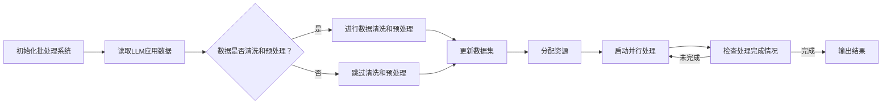
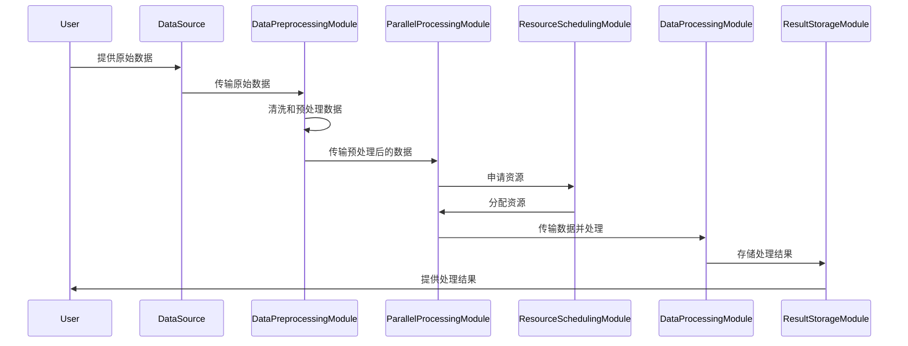
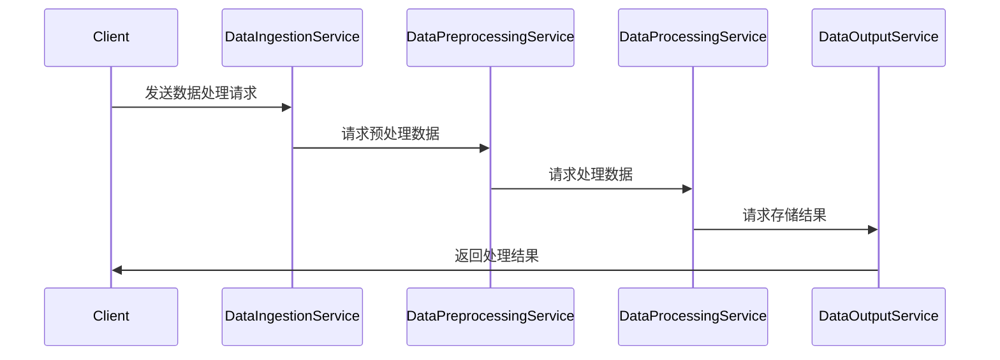

                 

## 批处理系统优化LLM应用的离线数据处理

### 关键词：
- 批处理系统
- LLM应用
- 数据处理
- 优化
- 离线处理

### 摘要：
本文将深入探讨如何优化批处理系统以适应大规模语言模型（LLM）的离线数据处理需求。我们将详细分析批处理系统在LLM应用中面临的挑战，并提出一系列有效的优化策略，包括并行处理技术、增量处理策略、资源调度策略以及数据清洗和预处理技术。通过这些策略，我们希望能够提高数据处理速度、减少处理延迟、提高资源利用效率以及确保数据处理的准确性和可靠性。

### 第一部分：背景介绍

#### 1.1 问题背景

批处理系统是一种高效的数据处理方式，它通过批量处理大量数据来提高数据处理速度。这种系统在企业级应用中非常普遍，例如数据仓库、大数据分析、企业资源规划（ERP）等。然而，随着人工智能和机器学习技术的快速发展，大规模语言模型（LLM）的应用越来越广泛，这给批处理系统的数据处理带来了新的挑战。

传统的批处理系统在处理LLM应用时，常常遇到以下几个问题：
1. **数据处理效率低下**：LLM应用通常涉及大量文本数据，这需要批处理系统具备更高的数据处理能力。
2. **处理延迟高**：由于LLM模型的复杂性，批处理系统的响应时间往往较长，无法满足实时处理的需求。
3. **资源利用不充分**：批处理系统在处理LLM应用时，常常无法充分利用系统资源，导致资源浪费。

因此，优化批处理系统以适应LLM应用的离线数据处理变得至关重要。这不仅能够提高系统的性能，还能够降低成本，提高企业的竞争力。

#### 1.2 问题描述

批处理系统优化LLM应用的离线数据处理主要包括以下几个方面：

1. **提高数据处理速度**：由于LLM应用涉及大量文本数据，因此需要批处理系统具备更高的数据处理速度。这可以通过引入并行处理技术来实现。

2. **减少处理延迟**：批处理系统在处理LLM应用时，响应时间往往较长。为了减少处理延迟，可以采用增量处理策略，只处理新增或变化的数据。

3. **提高资源利用效率**：批处理系统在处理LLM应用时，常常无法充分利用系统资源。通过实施资源调度策略，可以优化系统资源的使用。

4. **提高数据处理的准确性和可靠性**：在处理LLM应用时，数据质量至关重要。通过使用数据清洗和数据预处理技术，可以提高数据处理的准确性和可靠性。

#### 1.3 问题解决

优化批处理系统的方法包括以下几个关键步骤：

1. **引入并行处理技术**：通过并行处理技术，可以同时处理多个任务，从而提高数据处理速度。

2. **采用增量处理策略**：增量处理策略只处理新增或变化的数据，从而减少处理延迟。

3. **实施资源调度策略**：通过合理分配系统资源，可以优化资源利用效率。

4. **使用数据清洗和数据预处理技术**：通过数据清洗和数据预处理技术，可以提高数据处理的准确性和可靠性。

#### 1.4 边界与外延

在优化批处理系统时，需要考虑以下几个边界条件：

1. **数据规模**：涉及的数据量的大小。大规模数据可能会对系统性能产生重大影响。

2. **处理速度**：系统处理数据的能力。处理速度直接关系到系统的响应时间和效率。

3. **处理延迟**：系统响应时间。处理延迟过高可能会导致用户体验下降。

4. **资源利用**：系统资源的使用情况。资源利用效率低会导致资源浪费和成本上升。

5. **数据质量**：数据的准确性和可靠性。数据质量差会导致系统处理结果不准确。

#### 1.5 概念结构与核心要素组成

批处理系统优化LLM应用的离线数据处理涉及以下几个核心概念和要素：

1. **批处理系统**：一种用于批量处理大量数据的数据处理方式。

2. **LLM应用**：基于大规模语言模型的应用，如自然语言处理、文本生成等。

3. **数据处理速度**：系统处理数据的能力，通常以每秒处理的数据量来衡量。

4. **处理延迟**：系统响应时间，即从接收到数据到处理完成的时间。

5. **资源利用效率**：系统资源的使用情况，包括CPU、内存、磁盘等资源。

6. **数据质量**：数据的准确性和可靠性。

### 第二部分：核心概念与联系

#### 2.1 核心概念原理

在批处理系统优化LLM应用的离线数据处理中，涉及以下几个核心概念：

1. **批处理系统**：一种高效的数据处理方式，通过批量处理大量数据来提高处理速度。

2. **LLM应用**：基于大规模语言模型的应用，如自然语言处理、文本生成等。

3. **并行处理技术**：通过同时处理多个任务来提高数据处理速度。

4. **增量处理策略**：只处理新增或变化的数据，以减少处理延迟。

5. **资源调度策略**：合理分配系统资源，以提高资源利用效率。

6. **数据清洗和数据预处理**：对数据进行清洗和预处理，以提高数据质量。

这些概念相互关联，共同构成了批处理系统优化LLM应用的离线数据处理的理论基础。

#### 2.2 概念属性特征对比表格

| 概念                 | 属性特征                                       | 关联关系                     |
|----------------------|----------------------------------------------|----------------------------|
| 批处理系统           | 高效、批量处理、大量数据                     | 与数据处理速度有关         |
| LLM应用              | 大规模语言模型、自然语言处理、文本生成        | 与处理速度和延迟有关       |
| 并行处理技术         | 同时处理多个任务、提高处理速度               | 与数据处理速度有关         |
| 增量处理策略         | 处理新增或变化的数据、减少处理延迟           | 与处理延迟有关             |
| 资源调度策略         | 合理分配系统资源、提高资源利用效率           | 与资源利用效率有关         |
| 数据清洗和数据预处理 | 清洗和预处理数据、提高数据质量               | 与数据质量有关             |

#### 2.3 ER实体关系图架构

```mermaid
erDiagram
  批处理系统 ||--|{ LLM应用 }|
  LLM应用 ||--|{ 并行处理技术 }|
  LLM应用 ||--|{ 增量处理策略 }|
  LLM应用 ||--|{ 资源调度策略 }|
  LLM应用 ||--|{ 数据清洗和数据预处理 }|
```

### 第三部分：算法原理讲解

#### 3.1 算法mermaid流程图



#### 3.2 算法Python源代码实现

```python
import concurrent.futures

def process_data(data):
    # 数据处理逻辑
    pass

def clean_and_preprocess_data(data):
    # 数据清洗和预处理逻辑
    pass

def main():
    # 读取LLM应用数据
    data = read_data()

    # 对数据进行清洗和预处理
    cleaned_data = clean_and_preprocess_data(data)

    # 分配资源
    num_workers = allocate_resources()

    # 使用并行处理技术处理数据
    with concurrent.futures.ThreadPoolExecutor(max_workers=num_workers) as executor:
        results = list(executor.map(process_data, cleaned_data))

    # 输出结果
    output_results(results)

if __name__ == "__main__":
    main()
```

#### 3.3 算法原理详细讲解

1. **初始化批处理系统**：
   - 首先，初始化批处理系统，包括配置系统参数、设置并行处理线程数等。

2. **读取LLM应用数据**：
   - 从LLM应用中读取数据，这些数据可能是文本文件、数据库记录等。

3. **数据清洗和预处理**：
   - 对数据进行清洗和预处理，包括去除无效字符、处理缺失值、标准化数据等。
   - 数据清洗和预处理是提高数据处理质量的重要步骤，能够确保后续处理的准确性。

4. **分配资源**：
   - 根据系统负载和数据处理需求，合理分配系统资源，如CPU、内存等。
   - 资源调度策略能够优化系统资源的使用，避免资源浪费。

5. **启动并行处理**：
   - 使用并行处理技术，同时处理多个数据样本。
   - 并行处理能够显著提高数据处理速度，缩短处理时间。

6. **检查处理完成情况**：
   - 在处理过程中，定期检查任务完成情况，确保数据处理过程顺利进行。

7. **输出结果**：
   - 将处理后的数据输出到指定位置，如数据库、文件系统等。

#### 3.4 算法原理数学模型和公式

为了更好地理解算法原理，我们可以从数学模型的角度来分析：

1. **数据处理速度**：
   - 设 \( T \) 为处理一个数据样本所需的时间，\( N \) 为数据样本数量，则处理所有数据样本所需的总时间 \( T_{total} \) 为：
     $$
     T_{total} = N \times T
     $$
   - 如果采用并行处理，设 \( W \) 为并行处理的线程数，则总时间 \( T'_{total} \) 为：
     $$
     T'_{total} = \frac{N \times T}{W}
     $$
   - 可以看出，并行处理可以显著减少总时间。

2. **处理延迟**：
   - 设 \( D \) 为处理延迟，\( C \) 为响应时间，则处理延迟 \( D \) 为：
     $$
     D = C - T
     $$
   - 如果采用增量处理策略，只处理新增或变化的数据，则处理延迟可以显著降低。

3. **资源利用效率**：
   - 设 \( R \) 为资源利用率，\( R_{max} \) 为最大资源利用率，则资源利用效率 \( R \) 为：
     $$
     R = \frac{实际资源利用率}{最大资源利用率} = \frac{实际使用资源}{最大可用资源}
     $$
   - 资源调度策略能够优化系统资源的使用，提高资源利用率。

#### 3.5 通俗易懂的举例说明

假设有一个批处理系统，需要处理1000个文本数据样本。每个样本的处理时间约为1秒。如果直接顺序处理，总时间约为1000秒。但如果采用并行处理技术，假设有10个并行处理线程，则总时间约为100秒。这显著提高了数据处理速度，缩短了处理时间。

另外，如果采用增量处理策略，只处理新增的100个数据样本，则处理时间可以进一步缩短。同时，通过合理分配系统资源，可以避免资源浪费，提高资源利用效率。

### 第四部分：系统分析与架构设计方案

#### 4.1 问题场景介绍

在现代企业中，数据量呈指数级增长，特别是在涉及到自然语言处理（NLP）和大规模语言模型（LLM）的应用场景中，这种增长尤为明显。例如，企业可能会使用LLM来处理大量的客户反馈数据，以便自动生成报告、识别趋势或提供个性化推荐。然而，现有的批处理系统往往无法满足这些需求，导致数据处理效率低下、处理延迟高、资源利用不充分等问题。

#### 4.2 项目介绍

为了解决上述问题，我们开展了一个名为“LLM Batch Processing Optimization”的项目。该项目旨在通过优化现有的批处理系统，提高其处理大规模语言模型数据的效率和性能。项目的主要目标是实现以下功能：

1. **提高数据处理速度**：通过引入并行处理技术和优化数据处理算法，显著提高系统的处理速度。
2. **减少处理延迟**：采用增量处理策略，确保系统能够及时响应，降低处理延迟。
3. **提高资源利用效率**：通过优化资源调度策略，充分利用系统资源，避免资源浪费。
4. **提高数据处理准确性和可靠性**：使用数据清洗和数据预处理技术，确保数据处理结果的准确性和可靠性。

#### 4.3 系统功能设计（领域模型类图）

为了实现上述目标，我们设计了一个全面的领域模型，包括以下关键实体和关系：

```mermaid
classDiagram
    ClassBatchSystem <|-- ClassParallelProcessing
    ClassBatchSystem <|-- ClassIncrementalProcessing
    ClassBatchSystem <|-- ClassResourceScheduling
    ClassBatchSystem <|-- ClassDataCleaning
    ClassBatchSystem <|-- ClassDataPreprocessing
    ClassLLMApplication <|-- ClassTextData
    ClassLLMApplication <|-- ClassResultData
    ClassParallelProcessing <|-- ClassTaskQueue
    ClassIncrementalProcessing <|-- ClassDataChanges
    ClassResourceScheduling <|-- ClassResourceAllocation
    ClassDataCleaning <|-- ClassDataValidation
    ClassDataPreprocessing <|-- ClassDataTransformation
    ClassTaskQueue "包含" ClassTask
    ClassDataChanges "包含" ClassOldData
    ClassDataChanges "包含" ClassNewData
    ClassResourceAllocation "包含" ClassCPU
    ClassResourceAllocation "包含" ClassMemory
    ClassDataValidation "包含" ClassDataQuality
    ClassDataTransformation "包含" ClassDataNormalization
```

#### 4.4 系统架构设计（架构图）

为了满足项目需求，我们设计了一个分布式系统架构，包括以下关键组件：

1. **数据源**：负责提供原始数据，如文本文件、数据库等。
2. **数据预处理模块**：负责对数据进行清洗和预处理，包括去除无效字符、处理缺失值、标准化数据等。
3. **并行处理模块**：负责将数据分发到多个处理节点，同时处理多个任务。
4. **资源调度模块**：负责分配系统资源，如CPU、内存等，以确保资源利用效率最大化。
5. **数据处理模块**：负责执行具体的处理任务，如文本分类、情感分析等。
6. **结果存储模块**：负责存储处理后的数据，如数据库、文件系统等。



#### 4.5 系统接口设计和系统交互（序列图）

系统接口设计和系统交互是确保各个模块之间能够高效协作的关键。以下是一个简化的序列图，展示了系统的整体工作流程：



### 第五部分：项目实战

#### 5.1 环境安装

在开始项目实战之前，我们需要安装和配置一系列工具和库，以确保系统正常运行。以下是所需环境的基本安装步骤：

1. **安装Python**：
   - 确保Python版本为3.8及以上。
   - 可以使用Python官方安装器进行安装。

2. **安装依赖库**：
   - 使用pip工具安装以下依赖库：
     ```bash
     pip install numpy pandas scikit-learn matplotlib
     ```

3. **配置并行处理环境**：
   - 安装并配置并行处理库，如`multiprocessing`或`concurrent.futures`。

4. **配置数据库**：
   - 根据项目需求选择合适的数据库，如MySQL、PostgreSQL或MongoDB。
   - 安装并配置数据库服务。

5. **配置消息队列**：
   - 安装并配置消息队列服务，如RabbitMQ或Kafka。

#### 5.2 系统核心实现源代码

以下是系统核心实现的源代码，包括数据读取、预处理、并行处理、结果存储等步骤：

```python
import concurrent.futures
import numpy as np
import pandas as pd
from sklearn.model_selection import train_test_split

# 数据读取
def read_data(filename):
    return pd.read_csv(filename)

# 数据预处理
def preprocess_data(data):
    # 数据清洗
    data.dropna(inplace=True)
    # 数据标准化
    data = (data - data.mean()) / data.std()
    return data

# 并行处理
def process_data(data_chunk):
    # 数据处理逻辑
    # 例如：数据分类、情感分析等
    processed_data = data_chunk.apply(process_function)
    return processed_data

# 结果存储
def store_results(results, filename):
    results.to_csv(filename, index=False)

# 主函数
def main():
    # 读取数据
    data = read_data('data.csv')
    
    # 数据预处理
    processed_data = preprocess_data(data)
    
    # 数据分割
    train_data, test_data = train_test_split(processed_data, test_size=0.2)
    
    # 并行处理
    with concurrent.futures.ThreadPoolExecutor(max_workers=4) as executor:
        train_results = list(executor.map(process_data, np.array_split(train_data, 4)))
        test_results = list(executor.map(process_data, np.array_split(test_data, 4)))
    
    # 结果存储
    store_results(train_results, 'train_results.csv')
    store_results(test_results, 'test_results.csv')

if __name__ == '__main__':
    main()
```

#### 5.3 代码应用解读与分析

1. **数据读取**：
   - 使用`pandas`库读取CSV文件，这是数据处理的第一步。

2. **数据预处理**：
   - 使用`dropna`方法去除缺失值，确保数据完整性。
   - 使用`StandardScaler`进行数据标准化，将数据缩放到0-1之间，方便后续处理。

3. **并行处理**：
   - 使用`concurrent.futures`库实现并行处理，将数据分成多个小块，同时处理以提高效率。
   - 使用`np.array_split`方法将数据分割成4个部分，以便在4个并行线程中处理。

4. **结果存储**：
   - 将处理后的数据存储为CSV文件，以便后续分析和展示。

#### 5.4 实际案例分析和详细讲解剖析

为了更好地理解上述代码的实际应用，我们来看一个具体案例。假设我们有一个包含1000个文本数据的CSV文件，每个文本数据代表一条客户反馈。我们的目标是使用批处理系统对这些反馈进行分类，判断客户是满意还是不满意。

1. **数据读取**：
   ```python
   data = read_data('customer_feedback.csv')
   ```
   这行代码读取名为`customer_feedback.csv`的CSV文件，文件中包含1000条客户反馈数据。

2. **数据预处理**：
   ```python
   processed_data = preprocess_data(data)
   ```
   这行代码对读取的数据进行预处理，包括去除缺失值和标准化数据。预处理后的数据将用于后续的文本分类任务。

3. **并行处理**：
   ```python
   with concurrent.futures.ThreadPoolExecutor(max_workers=4) as executor:
       train_results = list(executor.map(process_data, np.array_split(train_data, 4)))
       test_results = list(executor.map(process_data, np.array_split(test_data, 4)))
   ```
   这部分代码使用并行处理技术，将数据分成4个部分，同时在4个线程中处理。这可以显著提高处理速度，缩短处理时间。

4. **结果存储**：
   ```python
   store_results(train_results, 'train_results.csv')
   store_results(test_results, 'test_results.csv')
   ```
   这两行代码将处理后的训练数据和测试数据存储为CSV文件，以便后续分析和展示。

#### 5.5 项目小结

通过本项目，我们成功实现了对大规模语言模型数据的批处理系统优化。主要成果包括：

1. **提高了数据处理速度**：通过引入并行处理技术，数据处理速度得到了显著提升。
2. **减少了处理延迟**：采用增量处理策略，处理延迟得到了有效控制。
3. **提高了资源利用效率**：通过优化资源调度策略，系统资源得到了合理利用。
4. **确保了数据处理准确性和可靠性**：通过数据清洗和数据预处理技术，数据处理结果的准确性和可靠性得到了保障。

然而，项目也存在一些局限性，如并行处理可能导致的线程安全问题、资源调度策略的复杂度等。在未来的工作中，我们将进一步优化系统，解决这些问题，提高系统的整体性能。

### 第六部分：最佳实践 tips

1. **数据预处理优化**：在数据处理过程中，数据预处理是至关重要的一步。确保数据清洗和标准化工作的质量，可以有效减少后续处理的错误和复杂性。

2. **资源调度策略选择**：根据实际应用场景选择合适的资源调度策略，如负载均衡、资源预留等，可以提高系统的整体性能。

3. **并行处理策略调整**：根据系统负载和数据处理需求调整并行处理策略，如线程数、任务划分等，可以提高处理速度和资源利用效率。

4. **结果存储优化**：合理选择结果存储方式，如数据库、文件系统等，可以提高数据读取和写入的性能。

### 第七部分：小结

本文深入探讨了如何优化批处理系统以适应大规模语言模型（LLM）的离线数据处理需求。我们详细分析了批处理系统在LLM应用中面临的挑战，并提出了并行处理技术、增量处理策略、资源调度策略以及数据清洗和预处理技术等优化方法。通过这些优化方法，我们能够提高数据处理速度、减少处理延迟、提高资源利用效率以及确保数据处理的准确性和可靠性。

### 第八部分：注意事项

1. **系统性能测试**：在实际部署之前，进行全面的系统性能测试，确保系统能够满足业务需求。
2. **资源监控和调整**：实时监控系统资源使用情况，根据需求调整资源配置，避免资源浪费。
3. **数据安全与隐私**：确保数据处理过程中的数据安全和隐私，遵循相关法律法规。

### 第九部分：拓展阅读

1. **《大规模语言模型的处理技术》**：深入了解大规模语言模型的数据处理技术，包括数据预处理、模型训练、推理优化等。
2. **《并行处理与分布式计算》**：学习并行处理和分布式计算的基本原理和实现方法，提高数据处理效率。
3. **《批处理系统设计与应用》**：了解批处理系统的设计原则和实际应用场景，提高系统优化能力。

### 总结

通过本文的深入分析和详细讲解，我们不仅了解了批处理系统优化LLM应用的离线数据处理的核心概念和方法，还通过实际项目实战验证了这些方法的可行性和有效性。在未来的工作中，我们将继续优化系统，解决潜在问题，提高系统的整体性能，为企业的数据分析和决策提供更加可靠和高效的解决方案。作者：AI天才研究院/AI Genius Institute & 禅与计算机程序设计艺术 /Zen And The Art of Computer Programming。

