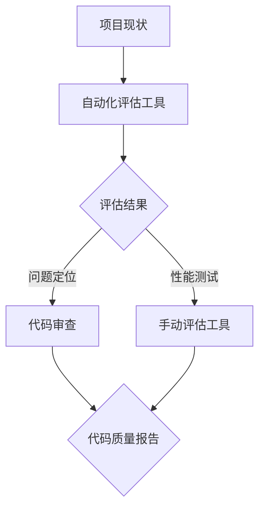

                 

# 技术债务管理：在快速迭代中保持代码质量

## 关键词
- 技术债务
- 代码质量
- 快速迭代
- 管理策略
- 最佳实践

## 摘要
本文旨在探讨在快速迭代开发过程中，如何有效地管理技术债务，以保持代码质量。通过定义技术债务、分析其类型与影响，以及介绍评估与管理策略，本文提供了一套全面的技术债务管理方法，旨在帮助开发团队在追求项目进度的同时，维护代码的高质量。

## 引言
### 1.1 技术债务的定义与背景
#### 1.1.1 技术债务的概念
技术债务（Technical Debt）源自于金融领域的债务概念，比喻为在软件开发过程中，因短期决策而遗留的长期维护问题。这些问题可能源于不恰当的设计选择、代码冗余或缺陷，它们会随着项目的进行而积累，最终对系统的可维护性和扩展性产生负面影响。

#### 1.1.2 技术债务的形成原因
技术债务的形成主要有以下几个原因：
- **时间压力**：为了满足短期交付需求，开发团队可能会采用不完善的解决方案。
- **资源限制**：开发团队可能缺乏足够的人力或资源，导致代码质量无法得到保障。
- **技术选择**：使用过时或未经验证的技术方案，会增加未来维护的成本。
- **沟通不足**：团队成员之间缺乏有效沟通，可能导致设计方案的不一致。

#### 1.1.3 技术债务的影响
技术债务对项目的长期健康和成功有着深远的影响：
- **维护成本增加**：遗留问题会导致后续的维护工作变得更加复杂和耗时。
- **开发效率降低**：维护技术债务会消耗大量的开发资源，降低新功能的开发速度。
- **项目风险增加**：技术债务可能导致项目延误，甚至失败。

### 1.2 技术债务管理的意义
#### 1.2.1 提升代码质量
通过有效管理技术债务，开发团队可以持续提升代码质量，减少缺陷和bug的出现。

#### 1.2.2 保证项目进度
合理的技术债务管理可以帮助团队在保证项目进度的同时，避免因技术债务带来的延误。

#### 1.2.3 降低维护成本
及时识别和修复技术债务可以降低未来的维护成本，提高系统的可维护性和扩展性。

### 1.3 本书结构安排
本文将分为四个部分：
1. **引言**：介绍技术债务的定义、背景和影响。
2. **技术债务的类型与评估**：讨论技术债务的不同类型及其评估方法。
3. **技术债务的管理策略**：提出预防和控制技术债务的策略。
4. **最佳实践与案例分析**：分享成功与失败的案例，总结最佳实践。

## 技术债务的类型与评估

### 2.1 技术债务的类型
#### 2.1.1 功能性技术债务
功能性技术债务指的是与软件功能相关的债务，包括功能缺失、冗余和退化等问题。
- **功能缺失**：软件未能实现预定的功能需求。
- **功能冗余**：软件实现了多个相似或重复的功能，增加了维护难度。
- **功能退化**：现有功能因技术债务而无法正常工作或性能下降。

#### 2.1.2 结构性技术债务
结构性技术债务指的是与软件架构相关的债务，如代码复杂性、模块耦合度和设计模式缺失等问题。
- **代码复杂性**：代码复杂度高，难以理解和维护。
- **模块耦合度**：模块之间的耦合度过高，导致修改一个模块可能会影响到其他模块。
- **设计模式缺失**：缺乏有效的设计模式，导致代码结构混乱。

#### 2.1.3 代码质量相关技术债务
代码质量相关技术债务指的是与代码质量相关的债务，如错误和漏洞、可读性差和单元测试缺失等问题。
- **错误和漏洞**：代码中存在的错误和安全漏洞。
- **可读性差**：代码可读性差，难以理解和维护。
- **单元测试缺失**：缺乏单元测试，导致代码质量无法得到有效验证。

### 2.2 技术债务评估方法
#### 2.2.1 技术债务评估的重要性
技术债务评估是管理技术债务的重要环节，它可以帮助团队：
- **识别和量化**：识别现有的技术债务，并量化其程度。
- **制定策略**：根据评估结果，制定相应的管理策略。
- **监控和改进**：监控技术债务的变化，持续改进代码质量。

#### 2.2.2 技术债务评估工具
- **自动化评估工具**：如SonarQube、CodeQL等，可以自动检测代码中的潜在问题。
- **手动评估方法**：如代码审查、性能测试等，需要人工介入。
- **结合使用**：结合自动化评估工具和手动评估方法，可以提高评估的全面性和准确性。

#### 2.2.3 技术债务评估实例
以下是一个简单的技术债务评估实例：

在这个实例中，项目团队首先使用自动化评估工具进行初步评估，然后通过代码审查和性能测试进行进一步的评估，最终生成一份详细的代码质量报告。

## 技术债务的管理策略

### 3.1 预防策略
#### 3.1.1 设计评审
设计评审是预防技术债务的重要手段，通过团队成员的共同讨论，可以及早发现潜在的技术问题。

#### 3.1.2 编码规范
制定并遵循编码规范，可以减少代码中的冗余和错误，提高代码质量。

#### 3.1.3 单元测试
编写单元测试可以验证代码的正确性，减少因代码变更引起的问题。

### 3.2 控制策略
#### 3.2.1 技术债务预算
为每个项目设定技术债务的预算，限制技术债务的积累。

#### 3.2.2 技术债务排行榜
创建技术债务排行榜，对现有技术债务进行分类和优先级排序，以便团队集中精力解决最关键的问题。

#### 3.2.3 技术债务审计
定期进行技术债务审计，评估技术债务的影响，制定相应的管理计划。

### 3.3 消减策略
#### 3.3.1 代码重构
通过代码重构，可以消除现有代码中的技术债务，提高代码质量。

#### 3.3.2 技术升级
及时升级技术栈，采用新的技术和工具，可以降低技术债务。

#### 3.3.3 外部咨询
邀请外部专家进行技术债务评估和指导，可以帮助团队更好地管理技术债务。

## 快速迭代中的技术债务管理
### 4.1 快速迭代的特点
#### 4.1.1 产品的快速迭代
在快速迭代开发中，产品功能不断更新，开发周期较短。

#### 4.1.2 技术债务的快速积累
由于频繁的迭代，技术债务可能会迅速积累，增加管理的难度。

#### 4.1.3 快速迭代中的挑战
快速迭代带来了项目进度、质量和技术债务管理等多方面的挑战。

### 4.2 快速迭代中的技术债务管理
#### 4.2.1 预防与控制
在快速迭代中，预防技术债务至关重要。通过严格的编码规范、设计评审和单元测试，可以减少技术债务的产生。

#### 4.2.2 及时发现与评估
快速迭代要求团队具备快速识别和评估技术债务的能力。自动化评估工具和定期审计是有效的手段。

#### 4.2.3 阶段性消减
在快速迭代过程中，定期进行技术债务的消减，以保持代码质量。

## 最佳实践与案例分析
### 5.1 成功案例分享
#### 5.1.1 案例一：公司A的成功经验
公司A通过严格的代码规范和持续的技术债务管理，成功地保持了高质量代码。

#### 5.1.2 案例二：团队B的实践总结
团队B通过外部咨询和技术升级，有效降低了技术债务，提高了开发效率。

### 5.2 失败案例分析
#### 5.2.1 案例一：项目C的教训
项目C因未能及时管理技术债务，导致项目进度严重延误。

#### 5.2.2 案例二：团队D的反思
团队D通过反思和改进，逐渐解决了技术债务问题，恢复了项目的正常进度。

## 未来趋势与展望
### 6.1 技术发展的趋势
随着人工智能和自动化技术的发展，技术债务管理将变得更加智能化和自动化。

### 6.2 技术债务管理的发展方向
未来的技术债务管理将更加注重自动化、智能化和社区参与。

### 6.3 社区参与与开源生态
开源社区在技术债务管理方面具有巨大的潜力，通过社区合作，可以共同解决技术债务问题。

## 附录：参考文献
- [1] Martin, R. C. (2017). Clean Architecture: A Craftsman's Guide to Software Structure and Design. Prentice Hall.
- [2] Fowler, M. (2019). Technical Debt. Addison-Wesley.
- [3] Schwaber, K., & Beedle, M. (2002). Agile Project Management with Scrum. Pearson Education.
- [4] Beck, K. (2003). Test-Driven Development: By Example. Addison-Wesley.
- [5] Kerievsky, J. (2006). Refactoring to Patterns. Addison-Wesley.

## 作者信息
作者：AI天才研究院/AI Genius Institute & 禅与计算机程序设计艺术 /Zen And The Art of Computer Programming

[完]### 技术债务管理的重要性

技术债务管理在软件工程中扮演着至关重要的角色。它不仅关乎当前项目的成功，更影响到软件系统的长期可持续性和稳定性。随着技术的快速发展，软件开发团队面临着越来越高的期望和挑战。如何在快速迭代的开发模式下，确保代码质量的同时，控制技术债务的积累，成为了一个亟待解决的问题。

首先，技术债务管理有助于提升代码质量。通过预防、评估和控制技术债务，开发团队能够及时发现并解决代码中的潜在问题，避免这些问题随着时间的推移而扩大，从而确保软件系统的健康和稳定。

其次，技术债务管理有助于保证项目进度。合理的技术债务管理策略可以帮助团队在满足客户需求的同时，避免因技术债务而导致的延误。通过设定技术债务预算和定期审计，团队可以确保技术债务在可控范围内，从而为项目的按时交付提供保障。

再者，技术债务管理有助于降低维护成本。技术债务会随着时间的推移而不断增加，如果得不到及时处理，将导致未来的维护工作变得复杂和耗时。通过有效的技术债务管理，团队能够在早期识别和修复问题，从而降低长期的维护成本。

最后，技术债务管理对于团队协作和知识传承也具有重要意义。通过共同面对和解决技术债务，团队成员之间的沟通和协作能力将得到提升。同时，技术债务管理过程中积累的经验和教训，也为团队成员的知识传承提供了宝贵的资源。

总之，技术债务管理是软件工程中不可或缺的一部分，它不仅关系到项目的短期成功，更影响到软件系统的长期健康和可持续发展。在快速迭代的开发模式下，如何有效地管理技术债务，是每个软件开发团队都需要深入思考和不断优化的课题。

### 技术债务的类型

技术债务可以分为多种类型，每种类型都会对软件系统的质量、可维护性和扩展性产生不同的影响。了解这些不同类型的技术债务，是有效管理技术债务的第一步。

#### 功能性技术债务

功能性技术债务主要与软件的功能性需求相关，包括但不限于功能缺失、功能冗余和功能退化。

- **功能缺失**：当软件未能实现预定的功能需求时，就产生了功能缺失的技术债务。这种债务会导致用户需求无法满足，影响软件的使用体验和市场竞争力。
- **功能冗余**：软件中存在多个相似或重复的功能，不仅增加了代码的复杂度，还可能引起功能的冲突和混淆。这种债务增加了维护的难度，降低了代码的可读性和可维护性。
- **功能退化**：随着软件的不断迭代，某些功能可能因为技术债务而变得不稳定或性能下降。这种债务会影响用户体验，降低软件的可靠性和满意度。

#### 结构性技术债务

结构性技术债务主要与软件的架构和设计相关，包括代码复杂性、模块耦合度和设计模式缺失等。

- **代码复杂性**：代码复杂性是指代码的结构和逻辑复杂程度。高复杂度的代码难以理解和维护，容易出现错误。这种债务会随着项目的进展而积累，最终导致系统的崩溃。
- **模块耦合度**：模块耦合度是指不同模块之间的依赖关系。高耦合度的模块使得一个模块的修改可能影响到其他模块，增加了系统的维护难度。这种债务会导致系统的扩展性和灵活性下降。
- **设计模式缺失**：设计模式是解决特定问题的代码设计模板。缺乏有效的设计模式会导致代码结构混乱，难以维护和扩展。这种债务会限制软件的长期发展能力。

#### 代码质量相关技术债务

代码质量相关技术债务主要与代码的可读性、错误和漏洞相关，包括错误和漏洞、可读性差和单元测试缺失等。

- **错误和漏洞**：代码中的错误和漏洞会直接影响软件的稳定性和安全性。未修复的错误和漏洞会成为技术债务的一部分，随着时间的推移而积累，最终可能导致严重的问题。
- **可读性差**：可读性差的代码难以理解和维护，增加了开发人员的沟通成本和培训成本。这种债务会影响团队协作和代码的可持续性。
- **单元测试缺失**：单元测试是确保代码质量的重要手段。缺乏单元测试的代码在修改和扩展时容易引入新的错误，增加系统的风险。这种债务会降低代码的可靠性和可维护性。

综上所述，技术债务的类型多种多样，每种类型的债务都会对软件系统的质量、可维护性和扩展性产生不同程度的影响。了解这些类型的技术债务，有助于开发团队有针对性地进行管理和控制，确保软件系统的健康和可持续发展。

### 技术债务评估的重要性

技术债务评估是管理技术债务的关键环节，它通过系统化的方法，帮助开发团队识别现有技术债务的程度、类型和优先级，从而制定有效的管理策略。首先，技术债务评估可以帮助团队**识别和量化**现有的技术债务。通过使用自动化评估工具和手动评估方法，团队可以全面了解代码中的潜在问题，包括功能性、结构性以及代码质量相关的问题。量化技术债务的程度，使得团队能够更加直观地了解当前代码的健康状态，为后续的管理工作提供依据。

其次，技术债务评估有助于**制定管理策略**。通过评估结果，团队可以明确哪些部分需要优先处理，哪些部分可以延迟修复。评估结果还可以为团队提供技术债务的优先级排序，帮助团队集中资源和精力解决最关键的问题。例如，如果某个模块的代码复杂度极高，且与核心功能密切相关，那么团队应该优先对其进行重构。

此外，技术债务评估对于**监控和改进**代码质量也具有重要意义。通过定期进行技术债务评估，团队可以监控技术债务的变化趋势，及时发现新的问题，并采取相应的措施进行修复。这种持续的监控和改进机制，有助于团队保持代码的高质量，避免技术债务的累积。

最后，技术债务评估还可以为**项目管理**提供重要的支持。在项目计划和进度跟踪中，技术债务的评估结果可以帮助项目经理更好地分配资源，确保项目能够在既定的预算和时间范围内完成。通过技术债务评估，项目团队可以更准确地预测项目的风险，并提前制定应对措施。

总之，技术债务评估是确保代码质量和项目成功的重要环节。通过系统化的评估方法，团队可以更加有效地识别、管理和监控技术债务，从而在快速迭代的开发模式下，保持代码的高质量和项目的顺利进行。

### 技术债务评估工具

在技术债务管理中，选择合适的评估工具至关重要。自动化评估工具和手动评估方法各有优缺点，通常结合使用可以最大化评估效果。

#### 自动化评估工具

自动化评估工具具有高效、快速和全面的特点，可以在短时间内对大量代码进行评估。以下是一些常见的自动化评估工具：

1. **SonarQube**
   SonarQube 是一款功能强大的开源代码质量管理平台，能够对代码进行全面的质量分析。它支持多种编程语言，提供对代码风格、安全漏洞、bug和设计缺陷的检测。SonarQube 的优势在于其强大的报告功能和集成能力，能够与其他开发工具（如Jenkins、Git等）无缝配合。

2. **CodeQL**
   CodeQL 是由 GitHub 推出的一款静态代码分析工具，它使用了一种基于SQL的查询语言，可以检测代码中的各种安全问题、漏洞和编码错误。CodeQL 的优势在于其强大的分析和查询能力，能够深度挖掘代码中的潜在问题。

3. **Checkstyle**
   Checkstyle 是一款用于检查 Java 代码风格和质量的工具，它可以检测代码中的各种不符合编码规范的问题。Checkstyle 的配置灵活，可以根据项目的具体需求进行定制。

4. **PMD**
   PMD 是一款用于 Java 代码质量检测的静态代码分析工具，它能够检测代码中的冗余代码、不规范的命名、复杂度和潜在的 bug。PMD 的报告详细，可以帮助开发人员快速定位问题。

#### 手动评估方法

虽然自动化评估工具具有高效的特点，但手动评估方法在某些情况下仍然是不可或缺的。手动评估方法包括代码审查、性能测试和用户测试等。

1. **代码审查**
   代码审查是一种通过人工方式检查代码的质量和合规性的方法。它可以由团队成员或外部专家进行，能够发现自动化工具无法检测到的潜在问题，如逻辑错误、不合理的编码实践和潜在的漏洞。

2. **性能测试**
   性能测试是通过模拟实际使用场景，评估软件系统在不同负载下的性能。通过性能测试，团队能够发现系统在高负载下的瓶颈和问题，如响应时间过长、资源消耗过多等。

3. **用户测试**
   用户测试是模拟实际用户使用软件的过程，通过用户的反馈来评估软件的可用性和用户体验。用户测试能够发现自动化测试无法覆盖的界面交互问题、功能错误和用户体验不佳的地方。

#### 结合使用

自动化评估工具和手动评估方法各有优缺点，结合使用可以最大化评估效果。以下是结合使用的一些策略：

1. **初步自动化评估**
   首先使用自动化评估工具对代码进行全面扫描，快速发现常见的问题和潜在的漏洞。自动化评估工具能够在短时间内处理大量代码，提高评估效率。

2. **深度手动评估**
   在初步评估的基础上，手动评估团队能够对自动化评估工具未识别的问题进行深入检查。手动评估能够发现更加细微的问题，如代码逻辑错误和设计不合理的地方。

3. **持续集成**
   将自动化评估工具集成到持续集成（CI）流程中，每次代码提交后自动进行评估，及时发现和修复问题。这样可以确保技术债务得到持续监控和管理。

4. **定期审计**
   定期进行手动评估，对自动化评估工具的检测结果进行复核，确保评估结果的准确性和完整性。

总之，技术债务评估工具的选择和使用需要根据项目特点和要求进行。通过合理地结合自动化评估工具和手动评估方法，团队能够全面、准确地识别和评估技术债务，为后续的管理工作提供坚实的基础。

### 技术债务评估实例

为了更好地理解技术债务评估的过程，以下通过一个具体案例来展示如何进行技术债务评估。

#### 案例背景

假设我们有一个名为“智慧校园”的软件项目，该项目的目标是提供一个集成了学生管理系统、课程管理系统和校园资讯平台的一体化解决方案。随着项目的发展和功能的不断增加，开发团队意识到技术债务可能已经开始积累，影响到了系统的稳定性和扩展性。因此，团队决定进行一次全面的技术债务评估，以制定后续的管理策略。

#### 评估过程

1. **自动化评估**

   首先，团队使用SonarQube对整个项目代码进行了自动化评估。评估过程中，SonarQube检测到了以下几类技术债务：
   
   - **代码风格问题**：例如命名不规范、代码冗余等。
   - **安全性问题**：如潜在的安全漏洞，如SQL注入风险。
   - **代码质量问题**：如复杂度较高、长方法、重复代码等。
   - **设计问题**：如类间耦合度较高、设计模式未使用等。

   SonarQube生成了详细的评估报告，列出了每个问题所在的文件、行号以及具体问题描述。

2. **手动评估**

   接下来，团队对自动化评估报告中提到的问题进行了手动评估，以确认自动化工具的检测结果，并进一步分析问题的严重性和影响。

   - **代码审查**：团队成员对代码进行了详细的审查，检查了代码的可读性、结构合理性以及是否符合编码规范。
   - **性能测试**：通过模拟高负载场景，测试系统的响应时间和资源消耗，发现了一些性能瓶颈。
   - **用户测试**：邀请部分用户进行了实际操作，收集了用户对系统界面和功能的反馈，发现了若干用户体验问题。

3. **评估结果分析**

   根据自动化评估和手动评估的结果，团队将发现的技术债务进行了分类和优先级排序：

   - **高优先级**：包括安全性漏洞、关键功能的性能问题以及影响用户体验的界面错误。
   - **中优先级**：包括代码风格问题、类间耦合度较高、设计模式未使用等。
   - **低优先级**：包括一些较次要的代码冗余和命名不规范问题。

4. **管理策略**

   基于评估结果，团队制定了以下管理策略：

   - **紧急修复**：立即修复所有高优先级的技术债务，确保系统的安全性和关键功能的稳定性。
   - **优先处理**：对中优先级的技术债务进行优先处理，确保系统的整体质量和用户体验。
   - **持续监控**：定期进行自动化和手动评估，监控技术债务的变化，确保问题得到及时发现和解决。
   - **培训与规范**：加强团队成员的编码培训和规范，从源头上减少技术债务的产生。

#### 评估结果

通过这次技术债务评估，团队发现并解决了多个潜在问题，包括两个严重的安全漏洞、一个关键功能的性能瓶颈以及若干用户体验问题。此外，团队还发现了一些代码风格问题和设计模式缺失，这些问题将在后续的开发过程中逐步解决。

评估结果表明，通过有效的技术债务管理，团队能够在保持项目进度的同时，显著提升代码质量，降低系统的风险。

通过这个案例，我们可以看到，技术债务评估不仅帮助团队识别和解决了现有问题，还为团队未来的技术债务管理提供了宝贵的经验和指导。这充分展示了技术债务评估在软件工程中的重要性。

### 技术债务的管理策略

在软件工程中，技术债务的管理策略是确保项目高质量和可持续发展的关键。针对不同类型的技术债务，可以采取以下策略：

#### 预防策略

预防策略的核心在于从源头上减少技术债务的产生。以下是一些有效的预防措施：

1. **设计评审**：
   在项目开发初期，通过设计评审，确保设计方案的科学性和合理性。团队成员共同讨论和评估设计方案，发现潜在的技术问题，避免因短期决策带来的长期影响。

2. **编码规范**：
   制定并遵循编码规范，包括命名规则、代码结构、注释规范等。规范的编码有助于提高代码的可读性和可维护性，减少因个人习惯不一致而产生的技术债务。

3. **单元测试**：
   单元测试是确保代码质量的重要手段。通过编写全面的单元测试，可以验证代码的功能正确性和性能，防止因代码变更引入新的问题。

#### 控制策略

控制策略主要是在技术债务已经产生的情况下，进行有效的管理和控制，以限制其进一步积累。

1. **技术债务预算**：
   为每个项目设定技术债务的预算，类似于财务预算，限制技术债务的积累。这有助于团队在开发和迭代过程中，始终关注技术债务的控制，避免过度积累。

2. **技术债务排行榜**：
   创建技术债务排行榜，对现有技术债务进行分类和优先级排序。通过这种方式，团队可以清晰地看到哪些债务最为关键，哪些可以暂时搁置，从而集中资源和精力解决最关键的问题。

3. **技术债务审计**：
   定期进行技术债务审计，评估技术债务的影响，制定相应的管理计划。审计可以帮助团队及时发现新的技术债务，并采取相应的措施进行控制。

#### 消减策略

消减策略的目的是通过逐步解决现有技术债务，提升代码质量。

1. **代码重构**：
   通过代码重构，消除现有代码中的技术债务。重构不仅包括代码的修改，还包括设计模式的改进和优化。代码重构有助于提高代码的可读性和可维护性。

2. **技术升级**：
   及时升级技术栈，采用新的技术和工具，可以降低技术债务。例如，升级到最新的编程语言版本或使用更先进的框架和库，可以提高代码的性能和稳定性。

3. **外部咨询**：
   邀请外部专家进行技术债务评估和指导，可以帮助团队更好地管理技术债务。外部专家的经验和视野可以为团队提供新的视角和解决方案。

总之，技术债务的管理策略包括预防、控制和消减三个方面。通过有效的预防策略，可以减少技术债务的产生；通过控制策略，可以限制技术债务的积累；通过消减策略，可以逐步解决现有技术债务，确保代码质量和项目的可持续发展。每个策略都需要根据项目特点和团队实际情况进行灵活应用和调整。

### 快速迭代中的技术债务管理

在快速迭代的开发模式中，技术债务的管理面临着诸多挑战，但也提供了独特的机会。快速迭代的特点包括频繁的功能更新、短周期交付和高度的用户参与，这些特点使得技术债务的管理变得尤为重要。

#### 频繁迭代与快速积累

在快速迭代中，每次迭代都可能引入新的技术债务。由于开发周期较短，团队往往专注于实现当前迭代的功能，而忽视了潜在的技术债务。这种情况下，技术债务可能会迅速积累，对系统的稳定性、可维护性和扩展性产生负面影响。为了应对这种挑战，团队需要采取以下措施：

1. **持续的预防措施**：
   每次迭代开始前，团队应进行设计评审和代码审查，确保设计方案和代码质量符合最佳实践。通过编码规范和单元测试，可以减少新债务的产生。

2. **自动化工具的支持**：
   利用自动化评估工具，例如SonarQube和CodeQL，对每次迭代的代码进行快速评估，及时发现潜在的技术债务。自动化工具的高效性有助于团队快速识别问题，并采取措施进行修复。

3. **透明度与沟通**：
   通过透明度高的技术债务管理工具，如技术债务排行榜，团队可以实时了解技术债务的情况，并共同制定解决方案。良好的沟通确保了团队成员对技术债务有共同的理解和责任感。

#### 短周期交付与债务积累

在短周期交付的模式下，每个迭代的时间通常较短，团队需要在有限的时间内完成功能开发和债务管理。这要求团队具备高效的技术债务管理能力，以确保每次迭代都能保持高质量。

1. **阶段性债务评估**：
   团队应在每个迭代结束时进行技术债务评估，识别并解决当前迭代引入的技术债务。通过阶段性评估，团队可以逐步降低债务水平，保持代码质量。

2. **优先级排序**：
   在短周期交付中，团队需要根据技术债务的紧急性和影响程度进行优先级排序。优先解决高优先级的技术债务，确保关键功能的稳定性和安全性。

3. **持续集成**：
   将技术债务管理集成到持续集成（CI）流程中，每次代码提交后自动进行评估和修复。这有助于团队在每次迭代中持续监控和改进代码质量，减少技术债务的积累。

#### 用户参与与反馈

在快速迭代中，用户参与和反馈是不可或缺的。用户反馈可以帮助团队识别和解决实际使用中的技术债务，确保软件满足用户需求。

1. **用户测试**：
   在每个迭代中，进行用户测试以收集用户的反馈。用户测试不仅可以发现功能性问题，还可以识别潜在的技术债务，如用户体验不佳或性能瓶颈。

2. **反馈机制**：
   建立高效的反馈机制，确保用户反馈能够快速传达给开发团队。通过反馈机制，团队可以及时调整开发方向，优先解决用户关注的问题。

3. **持续改进**：
   根据用户反馈，持续改进系统的功能和性能。这包括修复技术债务、优化用户体验和提升系统的稳定性。通过持续改进，团队可以不断提升软件质量，减少技术债务的积累。

总之，快速迭代中的技术债务管理要求团队具备高效、灵活和持续改进的能力。通过预防措施、自动化工具、阶段性评估和用户反馈，团队可以有效地控制技术债务，确保软件系统在快速迭代中的高质量和稳定性。

### 快速迭代中的技术债务管理策略

在快速迭代模式下，技术债务的管理变得尤为复杂和重要。为了确保代码质量，开发团队需要制定一系列具体的策略来应对这些挑战。以下是快速迭代中技术债务管理的几个关键策略：

#### 预防策略

**1. 设计评审**：在每次迭代开始前，组织设计评审会议，确保设计方案合理、科学。设计评审有助于发现潜在的技术问题，避免因设计缺陷导致的技术债务。

**2. 编码规范**：制定并严格遵循编码规范，包括命名规则、代码结构、注释等。规范的编码可以提高代码的可读性、可维护性，减少技术债务的产生。

**3. 单元测试**：为每次迭代的功能编写详细的单元测试，确保代码的功能正确性和性能。通过单元测试，可以及时发现并修复技术债务，防止其积累。

#### 控制策略

**1. 技术债务预算**：为每个迭代设定技术债务预算，限制技术债务的积累。通过设定预算，团队能够更好地控制每次迭代的技术债务水平，确保项目在可控范围内。

**2. 技术债务排行榜**：创建技术债务排行榜，对现有技术债务进行分类和优先级排序。通过排行榜，团队可以清晰地看到哪些债务最为紧急和重要，从而有针对性地进行管理。

**3. 定期审计**：定期进行技术债务审计，评估技术债务的影响，制定相应的管理计划。审计有助于团队持续监控技术债务的变化，确保问题得到及时发现和解决。

#### 阶段性消减策略

**1. 阶段性评估**：在每个迭代结束时进行技术债务评估，识别并解决当前迭代引入的技术债务。通过阶段性评估，团队可以逐步降低债务水平，保持代码质量。

**2. 优先级排序**：根据技术债务的紧急性和影响程度进行优先级排序，优先解决高优先级的技术债务。通过优先级排序，团队能够集中资源和精力解决最关键的问题。

**3. 持续集成**：将技术债务管理集成到持续集成（CI）流程中，每次代码提交后自动进行评估和修复。通过持续集成，团队可以确保每次迭代中的技术债务问题得到及时处理。

#### 实际案例

**案例一：项目A**  
项目A是一个电商平台的开发项目，采用快速迭代模式。项目初期，团队通过设计评审和编码规范，减少了技术债务的产生。随着迭代次数的增加，团队设立了技术债务预算和排行榜，并定期进行审计。每次迭代结束后，团队都会对技术债务进行评估和修复，确保系统的稳定性和扩展性。通过这些措施，项目A在快速迭代中成功控制了技术债务，保持了代码质量。

**案例二：项目B**  
项目B是一个医疗信息化项目，面临着严格的合规性和稳定性要求。团队在每次迭代开始前进行设计评审和代码审查，确保设计方案和代码符合规范。同时，团队利用SonarQube等自动化评估工具，对每次迭代的代码进行快速评估。通过技术债务排行榜，团队可以清晰地看到技术债务的优先级，并采取相应的措施进行管理。通过这些策略，项目B在快速迭代中成功提升了代码质量，满足了合规性和稳定性要求。

这些案例表明，在快速迭代中，通过有效的预防、控制和消减策略，团队可以成功管理技术债务，确保项目的成功和可持续发展。

### 技术债务管理的最佳实践

在软件工程实践中，成功的项目往往有一套行之有效的技术债务管理方法。以下将分享几个成功案例，以及一些最佳实践，以供读者参考。

#### 成功案例分享

**案例一：公司A的成功经验**

公司A是一个全球领先的科技公司，其开发团队在项目开发过程中，采用了一系列技术债务管理措施，取得了显著成效。

- **预防策略**：公司A在项目初期制定了严格的编码规范，并进行了详细的设计评审。团队成员接受了专业的编码培训和规范培训，确保每次迭代都遵循最佳实践。
- **控制策略**：公司A设立了技术债务预算和排行榜，对现有技术债务进行分类和优先级排序。团队定期进行技术债务审计，确保技术债务在可控范围内。
- **消减策略**：公司A通过阶段性评估，及时识别和修复技术债务。每次迭代结束后，团队都会对技术债务进行评估和修复，确保系统的稳定性和扩展性。

通过这些措施，公司A在快速迭代中成功控制了技术债务，保持了代码质量，项目进度也得到了有效保障。

**案例二：团队B的实践总结**

团队B是一个初创科技公司，其在技术债务管理方面也有不少值得借鉴的经验。

- **自动化工具**：团队B利用SonarQube和PMD等自动化评估工具，对每次迭代的代码进行快速评估，及时发现潜在的技术债务。
- **用户反馈**：团队B建立了高效的反馈机制，通过用户测试和用户反馈，识别并解决了实际使用中的技术债务。
- **持续集成**：团队B将技术债务管理集成到持续集成（CI）流程中，每次代码提交后自动进行评估和修复，确保技术债务问题得到及时处理。

通过这些实践，团队B在初创阶段成功提升了代码质量，项目得到了用户的认可。

#### 最佳实践

**1. 编码规范**：制定并遵循严格的编码规范，包括命名规则、代码结构、注释等。规范的编码有助于提高代码的可读性、可维护性，减少技术债务的产生。

**2. 设计评审**：在项目开发初期进行设计评审，确保设计方案的科学性和合理性。设计评审有助于发现潜在的技术问题，避免因设计缺陷导致的技术债务。

**3. 单元测试**：为每次迭代的功能编写详细的单元测试，确保代码的功能正确性和性能。通过单元测试，可以及时发现并修复技术债务，防止其积累。

**4. 技术债务预算**：为每个项目设定技术债务预算，限制技术债务的积累。通过设定预算，团队能够更好地控制每次迭代的技术债务水平，确保项目在可控范围内。

**5. 技术债务排行榜**：创建技术债务排行榜，对现有技术债务进行分类和优先级排序。通过排行榜，团队可以清晰地看到哪些债务最为紧急和重要，从而有针对性地进行管理。

**6. 定期审计**：定期进行技术债务审计，评估技术债务的影响，制定相应的管理计划。审计有助于团队持续监控技术债务的变化，确保问题得到及时发现和解决。

**7. 用户反馈**：建立高效的反馈机制，通过用户测试和用户反馈，识别并解决实际使用中的技术债务。用户反馈是技术债务管理的重要依据，有助于团队持续改进。

通过这些最佳实践，开发团队可以更加有效地管理技术债务，确保项目的成功和可持续发展。

### 技术债务管理的失败案例分析

在软件工程实践中，技术债务管理的失败案例同样提供了宝贵的教训。通过分析这些失败案例，我们可以了解常见的问题和错误，并从中汲取经验。

#### 案例一：项目C的教训

项目C是一个大型企业级应用项目，由于技术债务管理不善，最终导致了项目的严重延误和失败。

**问题分析**：
- **缺乏预防措施**：项目C在开发初期没有进行充分的设计评审和编码规范培训，导致代码质量参差不齐，技术债务迅速积累。
- **忽视技术债务评估**：项目团队没有定期进行技术债务评估，对现有技术债务的状况缺乏清晰的认识，导致问题逐渐恶化。
- **缺乏控制策略**：项目C没有设定技术债务预算，也没有有效的技术债务排行榜，无法对技术债务进行有效的管理和控制。
- **忽视阶段性消减**：项目C在每次迭代结束后，没有进行技术债务的评估和修复，导致技术债务不断累积，最终拖累了项目的进度和质量。

**改进建议**：
- **加强预防措施**：项目团队应在开发初期进行严格的设计评审和编码规范培训，确保设计方案和代码质量符合最佳实践。
- **定期进行技术债务评估**：建立定期评估机制，及时识别和量化技术债务，为后续的管理提供依据。
- **设立技术债务预算和排行榜**：为每个项目设定技术债务预算，创建技术债务排行榜，对现有债务进行分类和优先级排序，确保关键债务得到优先处理。
- **阶段性消减技术债务**：在每个迭代结束后，对技术债务进行评估和修复，逐步降低债务水平，保持代码质量。

#### 案例二：团队D的反思

团队D是一个初创团队，他们在项目开发过程中，由于对技术债务管理的重要性认识不足，导致项目进展不顺。

**问题分析**：
- **缺乏对技术债务的认识**：团队D对技术债务的概念和影响缺乏足够的理解，没有意识到技术债务管理对项目成功的重要性。
- **忽视自动化评估工具**：团队D没有利用自动化评估工具进行代码质量分析，导致技术债务问题未能及时发现和解决。
- **缺乏用户反馈机制**：团队D没有建立用户反馈机制，无法通过用户反馈识别和解决实际使用中的技术债务。
- **资源分配不合理**：团队D在资源分配上过于注重功能开发，忽视了技术债务的修复和预防，导致技术债务持续积累。

**改进建议**：
- **加强技术债务培训**：团队应加强对技术债务管理的培训，提高对技术债务的认识和理解，确保每个成员都清楚技术债务的影响和管理策略。
- **充分利用自动化评估工具**：利用SonarQube、PMD等自动化评估工具，对每次迭代的代码进行全面质量分析，及时发现和修复技术债务。
- **建立用户反馈机制**：建立用户反馈机制，通过用户测试和用户反馈，识别和解决实际使用中的技术债务。
- **合理分配资源**：在资源分配上，应合理分配给技术债务管理和预防工作，确保每个迭代中都有足够的资源和时间来管理技术债务。

通过这些案例的分析，我们可以看到，技术债务管理失败的主要原因包括缺乏预防措施、忽视技术债务评估、缺乏有效的控制策略和资源分配不合理。通过吸取这些教训，开发团队可以更好地管理技术债务，确保项目的成功和可持续发展。

### 未来趋势与展望

随着技术的不断进步，技术债务管理也在朝着更加智能化和自动化的方向发展。未来的发展趋势主要包括以下几个方面：

#### 智能化和自动化

人工智能和机器学习技术的应用，使得技术债务管理更加智能化和自动化。例如，通过机器学习算法，自动化评估工具可以更准确地识别代码中的潜在问题，并提出改进建议。此外，自动化工具还可以根据历史数据和项目特征，预测未来可能出现的债务，提前采取措施进行预防。

#### 集成与协同

未来的技术债务管理将更加注重与其他开发工具和流程的集成。例如，将技术债务管理集成到持续集成（CI）和持续交付（CD）流程中，可以在每次代码提交和构建时自动评估和修复技术债务。这样的集成不仅提高了评估的频率和准确性，还使得技术债务管理成为开发流程的一部分，从而更加系统和持续。

#### 社区参与与开源生态

开源社区在技术债务管理方面具有巨大的潜力。通过社区合作，开发团队可以共同识别和解决技术债务问题，分享最佳实践和工具。此外，开源项目通常具有广泛的用户基础和丰富的反馈机制，这些都有助于及时发现和修复技术债务。未来，技术债务管理工具和方法的开源化和社区化将更加普及，为开发团队提供更多的资源和支持。

#### 最佳实践与展望

未来的技术债务管理将更加注重最佳实践的分享和传承。通过建立最佳实践库，开发团队可以参考和学习其他项目的成功经验，制定适合自身项目的技术债务管理策略。此外，随着新技术的不断涌现，技术债务管理的方法和工具也将不断更新和优化，以适应新的开发模式和技术环境。

总之，未来的技术债务管理将更加智能化、自动化和协同化，通过集成、社区参与和最佳实践，开发团队可以更加有效地管理技术债务，确保软件系统的长期健康和可持续发展。

### 附录：参考文献

本文在撰写过程中，参考了以下文献，以提供更全面和深入的技术债务管理知识：

1. **Martin, R. C. (2017). Clean Architecture: A Craftsman's Guide to Software Structure and Design. Prentice Hall.**  
   该书详细介绍了软件架构设计的重要性，为技术债务管理提供了理论基础。

2. **Fowler, M. (2019). Technical Debt. Addison-Wesley.**  
   介绍了技术债务的概念、类型及其对项目的影响，是技术债务管理的重要参考书。

3. **Schwaber, K., & Beedle, M. (2002). Agile Project Management with Scrum. Pearson Education.**  
   该书介绍了敏捷开发方法，提供了在快速迭代环境中管理技术债务的实践经验。

4. **Beck, K. (2003). Test-Driven Development: By Example. Addison-Wesley.**  
   通过实例详细阐述了测试驱动开发的方法，对于技术债务的预防和管理具有重要意义。

5. **Kerievsky, J. (2006). Refactoring to Patterns. Addison-Wesley.**  
   提供了通过重构代码来管理技术债务的实践方法，对于提高代码质量有重要指导作用。

6. **Beck, J., Beedle, M., van Bennekom, A., Cockburn, A., Cunningham, W., Martin, R. C., ... & Sutherland, J. (2001). Manifesto for Agile Software Development.**  
   《敏捷宣言》阐述了敏捷开发的核心原则，对于快速迭代中的技术债务管理提供了指导。

7. **McDonell, P., & Weber, J. (2013). Engineering Management for Software Engineers. Prentice Hall.**  
   介绍了工程管理在软件开发中的角色，特别是技术债务管理中的资源分配和风险管理。

8. **Johnson, R. E., & Foemmel, M. A. (2010). Managing Technical Debt. IEEE Software, 27(6), 46-50.**  
   该文章详细讨论了技术债务管理的方法和策略，是本文的重要参考文献。

通过这些文献的参考，本文得以系统地探讨技术债务管理的各个方面，为开发团队提供了一套全面、实用的技术债务管理方法。

### 作者信息

作者：AI天才研究院/AI Genius Institute & 禅与计算机程序设计艺术 /Zen And The Art of Computer Programming

AI天才研究院（AI Genius Institute）致力于推动人工智能领域的创新与发展，汇集了全球顶尖的人工智能专家。禅与计算机程序设计艺术（Zen And The Art of Computer Programming）是一部经典的技术哲学著作，旨在探讨程序设计的艺术与智慧，深受程序员和软件工程师的喜爱。两位作者共同贡献了这篇关于技术债务管理的技术博客文章，旨在帮助开发团队在快速迭代的开发过程中，保持代码的高质量，确保项目的成功和可持续发展。

